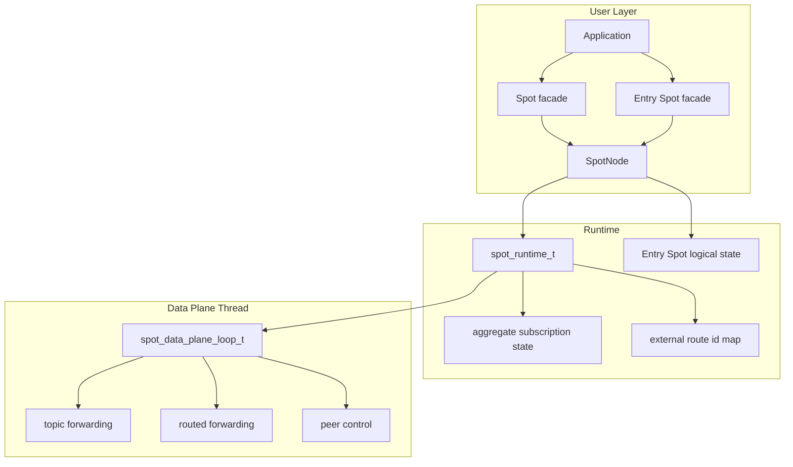
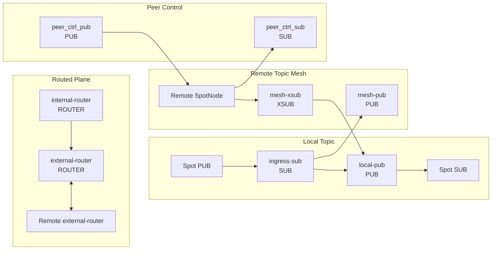
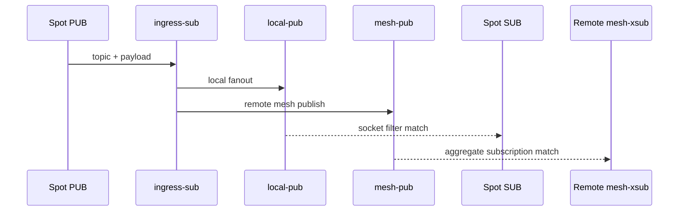
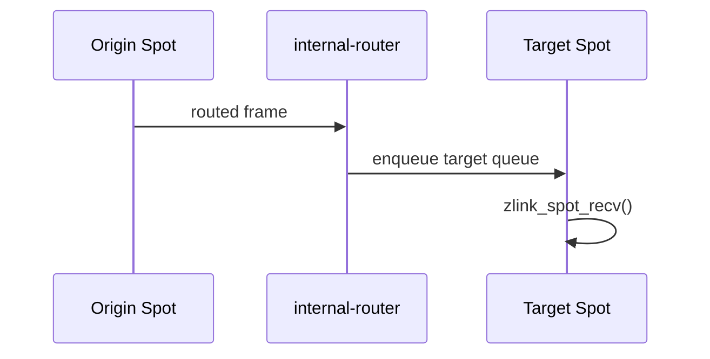
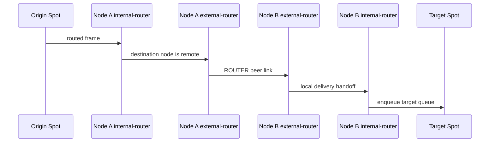
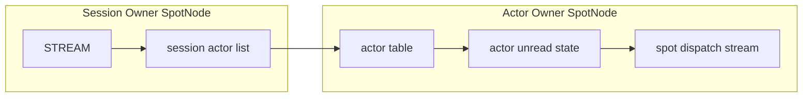
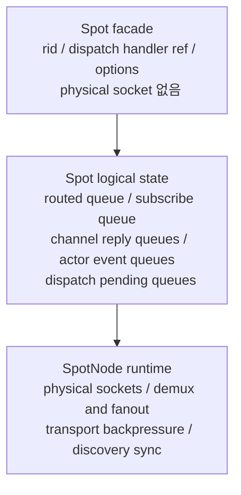
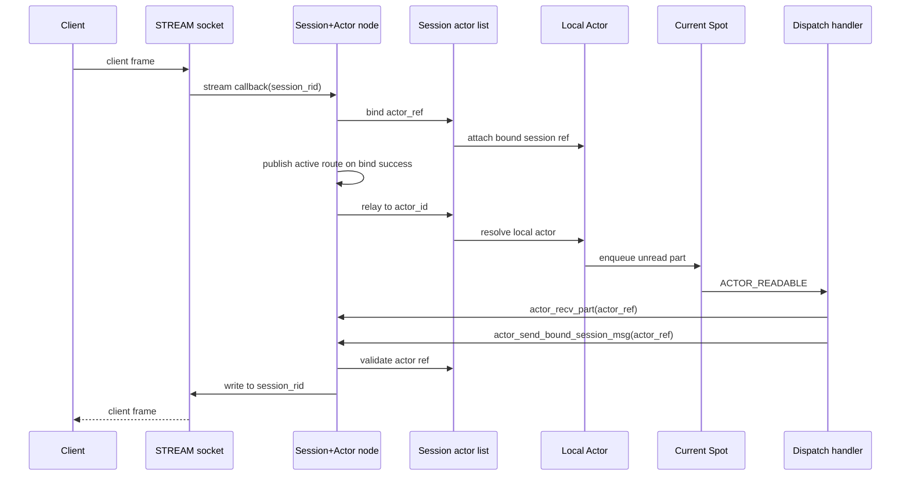
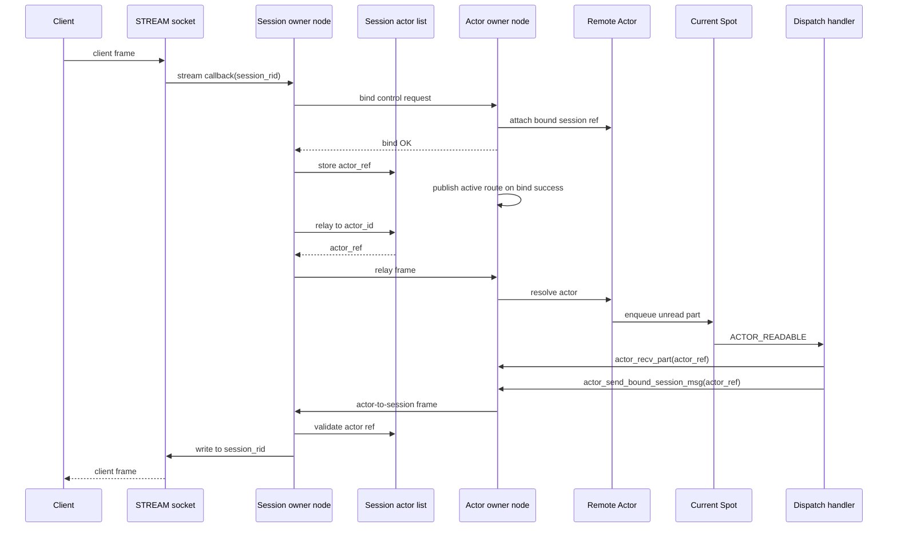

[English](spot-internals.md) | [한국어](spot-internals.ko.md)

# SPOT / SpotNode 내부 아키텍처

이 문서는 core 유지보수자가 SPOT 내부 배선과 데이터 흐름을 빠르게 파악하도록
돕는 내부 문서다. 공개 API 계약은
[`doc/spec/core/service/spot.ko.md`](../spec/core/service/spot.ko.md)를 기준으로
본다.

## 1. 전체 구조



`SpotNode`는 lifecycle owner이고, `Spot`은 그 위에서 빌려 쓰는 데이터 평면
facade다. `Spot`을 닫아도 backing `SpotNode`는 자동으로 닫히지 않는다.

`Spot` facade는 물리 socket을 소유하지 않는다. 모든 transport socket은
`SpotNode`가 소유하며, `Spot`은 logical dispatch queue와 dispatch event context만
가진다. `Entry Spot`은 `SpotNode`당 하나이며 `SpotNode`가 소유한다. `Entry Spot`
facade는 application이 `zlink_spot_node_entry_spot()`으로 얻어서 사용하고,
`zlink_spot_destroy()`로 닫는다.

## 2. 내부 소켓 토폴로지

SpotNode는 mode에 필요한 socket 묶음만 만든다.

| mode | 생성되는 주요 plane |
|------|---------------------|
| `PUBSUB` | topic publish/subscribe, peer control |
| `ROUTED` | routed delivery, peer control |
| `ALL` | topic, routed, peer control |

꺼진 plane은 snapshot 호출이나 꺼진 API의 첫 호출로도 생성되지 않는다.

### 2.1 주요 소켓



| 소켓 | 타입 | 역할 | HWM 정책 |
|------|------|------|----------|
| `ingress-sub` | `SUB` | local publish 입력 수신 | pubsub admission RCVHWM |
| `local-pub` | `PUB` | 같은 node 안의 subscriber로 fanout | relay SNDHWM 0 |
| `mesh-pub` | `PUB` | remote node로 topic publish 전파 | relay SNDHWM 0 |
| `mesh-xsub` | `XSUB` | remote node에서 topic publish 수신 | relay RCVHWM 0 |
| `internal-router` | `ROUTER` | 같은 node 안의 target `Spot`으로 routed 전달 | router admission RCVHWM, delivery SNDHWM 0 |
| `external-router` | `ROUTER` | peer node와 routed frame 송수신 | relay HWM 0 |
| `peer_ctrl_pub` | `PUB` | peer control 송신 | control 기본값 |
| `peer_ctrl_sub` | `SUB` | peer control 수신 | control 기본값 |

`zlink_spot_node_internal_sockets_snapshot()`은 실제 존재하는 socket만 반환한다.
perf의 `Auto-HWM spotnode` 표도 이 snapshot 이름을 그대로 사용한다.

## 3. Topic plane

topic plane은 local과 remote 모두 socket의 기본 subscription filter를 사용한다.
runtime은 publish 시점에 target index를 조회하지 않는다.



local subscriber의 실제 topic matching은 각 `Spot SUB`의 `SUBSCRIBE` 상태가 맡는다.
remote 전달의 matching은 peer node의 `mesh-xsub` aggregate subscription 상태가
맡는다.

### 3.1 Aggregate subscription 수명

runtime은 remote mesh에 반영할 node 단위 구독 수명을 따로 관리한다.

| 상태 | 자료구조 | 의미 |
|------|----------|------|
| exact topic | `topic -> refcount` | 같은 exact topic을 원하는 local subscriber 수 |
| prefix | `prefix -> refcount` | 같은 prefix를 원하는 local subscriber 수 |

규칙은 단순하다.

1. refcount가 `0 -> 1`이 될 때만 remote aggregate subscribe를 보낸다.
2. refcount가 `1 -> 0`이 될 때만 remote aggregate unsubscribe를 보낸다.
3. 중간 증가와 감소는 local 상태만 바꾸며 remote mesh에는 중복 명령을 보내지 않는다.

이 규칙 때문에 같은 node 안의 여러 `Spot`이 같은 topic을 구독해도 remote peer에는
하나의 node 대표 구독만 보인다.

## 4. Routed plane

routed plane은 두 router 축으로 고정된다.

| router | 범위 | 역할 |
|--------|------|------|
| `internal-router` | node 내부 | target `Spot`의 routed recv queue로 전달 |
| `external-router` | node 간 | peer node의 `external-router`와 ROUTER 링크로 송수신 |

별도 routed ingress broker나 topic mesh 우회 경로는 없다. local routed delivery는
`internal-router`, remote routed delivery는 `external-router`를 기준으로 추적한다.

### 4.1 Local routed delivery



local routed 전달은 내부 전달 큐가 커졌다는 이유로 target을 disconnected 상태로
만들지 않는다. 역압력은 `internal-router` 수신 쪽 admission HWM에서 먼저
표현되고, 애플리케이션이 큐를 비우면 일반 수신 API가 더 읽을 데이터가 없다고
알린다.

### 4.2 Remote routed delivery



remote routed delivery는 peer별 external route id map을 사용한다. 이 map은
`spot_runtime_t` 내부 메서드를 통해서만 갱신한다. 호출자는 map 구조나 lock 규칙을
알 필요가 없다.

## 5. Admission HWM

SpotNode는 admission HWM 설정만 공개한다. 이 설정은 데이터 평면이 소유하기
전의 local 입력량을 제한한다.

| 옵션 | admission 경로 | 기본 profile 값 |
|------|----------------|-----------------|
| `ZLINK_SPOT_NODE_OPT_PUBSUB_HWM_PROFILE` | topic publish admission | balanced = 16 |
| `ZLINK_SPOT_NODE_OPT_PUBSUB_HWM` | topic publish admission 숫자 override | 양수 값, `0`은 reset |
| `ZLINK_SPOT_NODE_OPT_ROUTER_HWM_PROFILE` | routed admission | balanced = 16 |
| `ZLINK_SPOT_NODE_OPT_ROUTER_HWM` | routed admission 숫자 override | 양수 값, `0`은 reset |

공유 relay와 delivery socket은 HWM `0`을 사용한다. 이렇게 해야 SPOT 내부의 숨은
peer별 또는 target별 큐 제한이 메시지 손실이나 연결 종료를 결정하지 않는다.
큐 증가는 명시적인 admission 경계와 애플리케이션의 drain 속도에서 제어한다.

`Spot` facade는 만들어질 때의 admission 값을 캡처한다. 이후 `SpotNode` 옵션을
바꾸면 나중에 만드는 `Spot`에만 적용되고, 이미 존재하는 handle에는 적용되지
않는다.

SPOT publish 큐 계획은 fanout이 커져도 per-connection admission HWM을 낮추지
않는다. fanout은 진단용 count로는 의미가 있지만 HWM 감소 입력으로 쓰지 않는다.

```text
effective_publish_fanout =
  max(local_sub_spot_count, active_peer_count, observed_scope_count)
```

전체 spot 수는 metadata 부담이지 fanout queue count가 아니다. 제거된 방향별
SpotNode HWM 옵션과 queue hard-limit 옵션은 공개 계약에 포함되지 않는다. 끊긴
delivery target 수를 보고하던 상태 필드는 ABI 호환을 위해 남아 있지만 항상 `0`을
보고한다.

perf runner는 `core/build` runtime을 사용하고, 실행 전에 해석된 `libzlink` 경로를
출력해야 한다. `Auto-HWM spotnode` 상세 표에서는 topic ingress와 routed ingress
socket에만 admission HWM이 보이고, relay와 delivery socket은 HWM `0`이어야 한다.

## 6. Control plane

peer control plane은 data plane과 분리된 작은 메시지 흐름이다. 주요 목적은 아래와
같다.

- peer bootstrap 정보 전달
- ready 상태 refresh
- aggregate subscription replay
- peer 연결 상태 반영

control socket은 데이터 payload HWM 계산과 별도 메시지 단위를 사용할 수 있다. perf
표에서 같은 payload 크기 블록 안에 다른 `MsgUnit(B)` 값이 보이면 control plane과
data plane 기준이 다르기 때문이다.

## 7. Actor dispatch 내부 모델

Actor는 SpotNode가 관리하는 routing target이다. public pointer handle은 없고,
`zlink_actor_ref_t`가 Actor를 식별한다. Actor는 socket, inproc endpoint, transport
endpoint를 소유하지 않는다. STREAM session에서 Actor로 relay되는 part는 target
SpotNode의 Actor table을 거쳐 Actor unread state에 들어간다.

새로 만들어진 Actor의 current Spot은 항상 Entry Spot이다. Actor가 user Spot으로 join하기 전까지는 Entry Spot dispatch context에서 Actor 메시지를 처리한다.



session actor list는 session routing id마다 별도로 존재한다. 각 entry는 Actor id와
concrete Actor ref를 저장한다. unchecked ref로 bind하더라도 attach가 성공하면
session entry에는 실제 generation이 들어간다. session owner는 joined Spot 상태를
저장하지 않는다. joined 상태는 Actor owner table과 snapshot에서만 관리한다.

local Actor relay와 remote Actor relay는 같은 Actor table 의미를 사용한다. 차이는
target SpotNode가 같은 프로세스 안에 있는지, peer SpotNode로 routed control을 거쳐야
하는지뿐이다. target Actor가 사라진 뒤 remote relay가 도착하면 target node에서 part를
버릴 수 있다. 이미 sender 쪽에서 성공한 submit 결과는 그 뒤에 바뀌지 않는다.

### 7.1 Actor table 상태

Actor table row는 아래 상태를 함께 가진다.

| 상태 | 의미 |
|------|------|
| Actor ref | node rid, Actor id, generation |
| joined Spot rid | Actor가 현재 속한 Spot. 생성 직후에는 Entry Spot |
| bound session ref | Actor가 attach된 STREAM session |
| unread state | 아직 `zlink_spot_node_actor_recv_part()`로 읽지 않은 part |
| pending join | Spot이 아직 reply하지 않은 join request |
| route synced | active route가 현재 Actor ref를 가리키는지 여부 |

Actor destroy는 joined 상태, bound session detach, 진행 중인 multipart relay를 먼저
확인한다. detach를 완료할 수 없거나 timeout이 발생하면 Actor slot과 unread state를
호출 전 상태로 유지한다.

### 7.2 Dispatch event

Actor unread state에 읽을 part가 생기고 Actor가 Spot에 join되어 있으면 Spot dispatch
stream에 `ACTOR_READABLE` readiness가 올라간다. event subject는 callback lifetime의
`const zlink_actor_ref_t *`다. pending join request가 생기면 Spot dispatch stream에
`ACTOR_JOIN_READABLE` readiness가 올라간다.

readiness는 메시지 개수와 1:1로 대응하지 않는다. dispatch callback은 각 drain API가
`NO_DATA`를 반환할 때까지 비우는 방식으로 동작해야 하며, 내부는 같은 Actor에 대해
part 순서를 유지한다.

### 7.3 Active route publish

Actor active route는 Actor 생성 시점이나 Spot join 시점에 publish하지 않는다.
Actor owner SpotNode의 Discovery에서 Actor route sync가 켜져 있고 STREAM bind가
성공한 시점에 publish한다. unbind와 session disconnect cleanup은 active route를
제거하지 않는다. active route가 가리키는 Actor가 destroy되면 route cleanup을 수행한다.

## 8. Entry Spot과 Spot queue 소유권

`Spot` facade는 물리 socket을 직접 만들지 않는다. `SpotNode`가 소유한 transport
socket에서 demux한 메시지가 대상 `Spot`의 logical queue로 들어온다. `Spot`이
소유하는 것은 아래와 같다.

- routed ingress dispatch queue
- subscribe ingress dispatch queue
- channel reply dispatch queue
- timer event queue
- Actor unread staging queue

backpressure 기준은 `SpotNode` transport socket의 admission HWM이다. Spot 내부
queue에는 별도 HWM이나 크기 한계를 두지 않는다.

`Entry Spot`은 `SpotNode`당 하나다. `SpotNode` 생성 시 자동으로 만들어지고,
`SpotNode` destroy 전까지 살아 있다. application은 `zlink_spot_node_entry_spot()`으로
facade를 얻어 dispatch handler를 등록한다. Actor 생성 직후 session relay message가
도착하면 Entry Spot의 dispatch queue에서 `ACTOR_READABLE` readiness가 올라간다.

user Spot의 logical state는 마지막 facade가 닫힐 때 제거된다. 단 joined Actor나
pending join request가 남아 있으면 마지막 facade close는 `ZLINK_CLOSE_BUSY`로 실패한다.
Entry Spot logical state는 facade reference count와 무관하게 `SpotNode`가 소유한다.

## 9. Spot socket 제거 모델

기존 구조에서 `Spot` facade 또는 side handle이 per-Spot socket을 직접 만들고 inproc
socket을 queue처럼 쓰는 부분이 있었다. `SpotNode`가 메시지를 한 번 받아서 logical
`Spot`으로 중계하는 구조에서는 per-Spot socket HWM으로 dispatch 상태를 표현하는
방식이 맞지 않는다. HWM은 `SpotNode`가 소유한 transport socket admission에 두고,
per-Spot queue는 이미 받은 입력을 어느 dispatch context에서 처리할지 정하는 staging
상태로만 다룬다.

목표 구조는 아래와 같다.



`Spot` facade는 `spot_pub_t`, `spot_sub_t`, routed receive socket 같은 물리 socket을
직접 갖지 않는다. `Spot`이 필요한 것은 logical state에 대한 reference다.

## 10. STREAM session과 Actor binding

session owner node와 Actor owner node는 같거나 다를 수 있다. 내부 처리 경로가 다르지만
공개 API는 동일하다.

### 10.1 Local Actor binding (co-located)



local Actor는 bind, relay, Actor-to-session send가 같은 node 안에서 끝난다.
Actor socket이나 Actor별 inproc endpoint가 생기지 않는다.

### 10.2 Remote Actor binding (split deployment)



remote Actor는 bind control request, session-to-Actor relay frame, Actor-to-session
frame이 node 사이를 지난다. session owner는 Actor의 joined Spot을 저장하지 않는다.
Actor owner는 STREAM session application state를 저장하지 않는다.

bound session disconnect와 remote join handoff가 겹치면 session Actor list
compare-and-swap 성공 여부가 기준이다. 성공 전 disconnect는 source Actor를 Entry Spot으로
돌리는 abort이고, 성공 뒤 disconnect는 target Actor의 Entry Spot cleanup이다.

## 11. Transport logical queue 내부 데이터 구조

이 섹션은 transport logical queue 구현의 핵심 내부 구조를 정리한다. 공개 계약이
아니며, 구현 세부 사항은 이후 변경될 수 있다.

### 11.1 Spot logical queue (`spot_logical_state_t`)

`spot_logical_state_t`는 `Spot` facade(`spot_handle_t`)가 `shared_ptr`로 공유하는
logical state다. Entry Spot은 `spot_node_handle_state_t.entry_spot`이 소유하고,
user Spot은 `spots_by_rid` map에 보관한다.

pubsub 관련 필드:

| 필드 | 타입 | 역할 |
|------|------|------|
| `subscribe_queue` | `deque<shared_ptr<spot_logical_pubsub_message_t>>` | SpotNode에서 demux된 pubsub 메시지 |
| `subscribe_signaler` | `signaler_t` | dispatch를 깨우는 edge-triggered signaler |
| `subscribe_signal_armed` | `bool` | 중복 신호 방지용 arming 플래그 |
| `request_reply_state` | `shared_ptr<spot_request_reply_state_t>` | routed send/recv 및 channel reply 상태 |

`spot_logical_pubsub_message_t`는 한 pubsub 메시지의 모든 part를 담는다.

```
struct spot_logical_pubsub_message_t {
    zlink_routing_id_t source_rid;
    std::string service_name;
    std::string topic_id;
    std::vector<std::string> parts;
};
```

### 11.2 Actor unread queue (`actor_handle_t`)

`actor_handle_t`는 `SpotNode` actor table의 각 row에 해당한다. `spot_node_actor_state_t`
안의 `actors_by_id` map이 소유한다.

| 필드 | 타입 | 역할 |
|------|------|------|
| `queue` | `deque<queued_actor_part_t>` | STREAM relay로 받은 아직 읽지 않은 part |
| `joined_spot_state` | `shared_ptr<spot_logical_state_t>` | 현재 속한 Spot state |
| `generation` | `uint64_t` | Actor ref generation (stale ref 검증) |
| `bound_session_node` | `spot_node_t*` | session owner node |
| `bound_stream` | `void*` | 연결된 STREAM socket handle |
| `pending_remote_join` | `bool` | remote join prepare 진행 중 여부 |

`queued_actor_part_t`는 단일 part의 소유권 wrapper다. move-only semantics다.

| 필드 | 타입 | 역할 |
|------|------|------|
| `part` | `zlink_msg_t` | message body |
| `info` | `zlink_actor_recv_info_t` | source session 정보 (node rid, session rid, actor ref) |
| `part_flag` | `zlink_part_flag_t` | `ZLINK_PART_MORE` 또는 `ZLINK_PART_FINAL` |
| `owns` | `bool` | part 소유 여부 (move 후 false) |

### 11.3 Join request queue (`g_join_queues`)

join request는 `service_spot_actor_api.cpp`의 global mutex(`g_actor_mutex`)로
보호되는 `g_join_queues`에 저장된다.

```
g_join_queues: map<spot_logical_state_t*, deque<queued_join_request_t*>>
```

key는 target Spot의 `spot_logical_state_t` 포인터다. 같은 Spot에 여러 join request가
pending 중일 수 있으며, FIFO 순서로 `zlink_spot_actor_join_recv()`로 drain한다.

`queued_join_request_t` 주요 필드:

| 필드 | 타입 | 역할 |
|------|------|------|
| `actor` | `actor_handle_t*` | join을 요청한 source Actor |
| `spot_state` | `shared_ptr<spot_logical_state_t>` | target Spot logical state |
| `join_epoch` | `uint64_t` | join sequence (timeout/중복 검증용) |
| `replied` | `bool` | reply 완료 여부 |
| `pending_target` | `actor_handle_t*` | remote join prepare에서 생성한 target Actor |
| `remote` | `bool` | remote join handoff 여부 |
| `message` | `zlink_msg_t` | join payload (source가 소유권 이전) |
| `reply` | `zlink_msg_t` | reply payload (target이 소유권 이전) |

`g_live_join_requests`는 현재 pending 중인 모든 join request set이고,
`g_retired_join_requests`는 timeout/cleanup이 완료되기를 기다리는 set이다.

### 11.4 Signaler와 dispatch 연결

pubsub dispatch는 edge-triggered signaler로 동작한다.

```
subscribe_queue에 입력 추가
→ subscribe_signal_armed == false이면 subscribe_signaler.send()
→ subscribe_signal_armed = true 설정
→ poller가 subscribe_signaler fd를 감지해 SUBSCRIBE_READABLE 전달
→ drain 완료 후 subscribe_signal_armed = false 재설정 (다음 입력 대비)
```

Actor readable dispatch는 `actor_handle_t.joined_spot_state`의 dispatch handler에
`ACTOR_READABLE` readiness를 직접 올린다. subject는 callback lifetime 동안만 유효한
`const zlink_actor_ref_t*`다.

Actor join dispatch는 `g_join_queues`에 request가 추가될 때 target Spot dispatch
handler에 `ACTOR_JOIN_READABLE` readiness를 올린다. subject는 target Spot facade다.

### 11.5 Global 상태 목록

`service_spot_actor_api.cpp`이 관리하는 주요 global 상태:

| 전역 변수 | 타입 | 역할 |
|-----------|------|------|
| `g_actor_mutex` | `timed_mutex` | actor table과 join queue 보호 |
| `g_nodes_by_rid` | `map<string, spot_node_t*>` | node rid → SpotNode 역방향 조회 |
| `g_join_queues` | `map<spot_logical_state_t*, deque<...>>` | Spot별 pending join request |
| `g_known_spots` | `set<spot_handle_t*>` | live spot facade 추적 |
| `g_session_bindings` | `map<string, session_binding_t>` | session rid → Actor binding |
| `g_active_routes` | `map<string, zlink_actor_route_t>` | actor id → active route |
| `g_live_join_requests` | `set<queued_join_request_t*>` | 현재 pending join |
| `g_retired_join_requests` | `set<queued_join_request_t*>` | cleanup 대기 join |
| `g_actor_protocol_drop_count` | `uint64_t` | protocol 오류 drop 누적 카운터 |
