[English](spot-internals.md) | [한국어](spot-internals.ko.md)

# SPOT / SpotNode 내부 아키텍처

## 1. 컴포넌트 개요

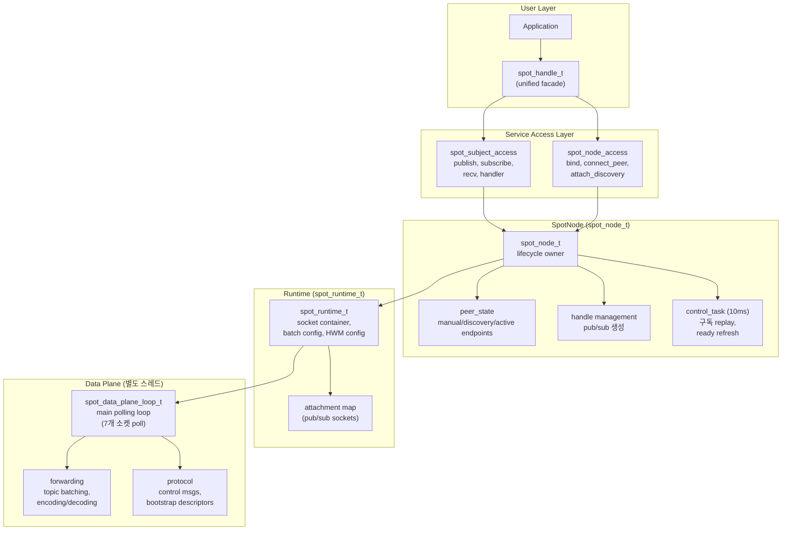

## 2. 내부 소켓 토폴로지

SpotNode는 10개의 내부 소켓을 inproc endpoint로 연결하고,
연결 상태 추적용 monitor 소켓 1개를 추가로 생성한다 (총 11개).

### 2.1 소켓 목록

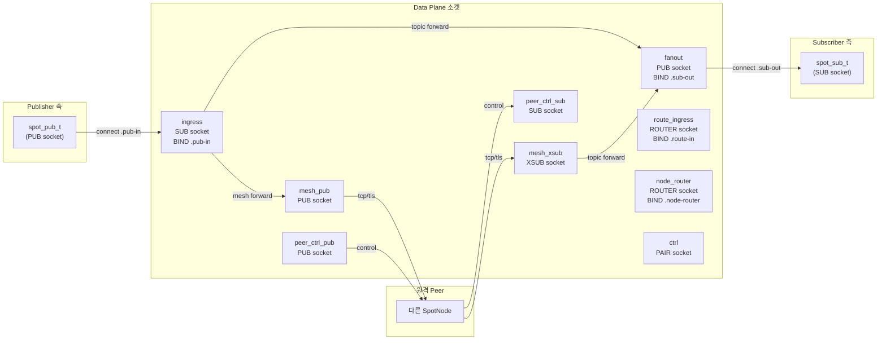

### 2.2 소켓 상세

| 소켓 | 타입 | Endpoint | Bind/Connect | HWM | 역할 |
|------|------|----------|-------------|-----|------|
| `ingress` | SUB | `.pub-in` | BIND | `node_sub_rcvhwm` | 모든 로컬 publish 수신 |
| `fanout` | PUB | `.sub-out` | BIND | `node_pub_sndhwm` | 로컬 subscriber에게 분배 |
| `mesh_pub` | PUB | (bound endpoint) | BIND | `node_pub_sndhwm` | 원격 peer에 토픽 송신 |
| `mesh_xsub` | XSUB | — | CONNECT to peers | `node_sub_rcvhwm` | 원격 peer에서 토픽 수신 |
| `route_ingress` | ROUTER | `.route-in` | BIND | `routed_recv_hwm` | app에서 routed 메시지 수신 |
| `node_router` | ROUTER | `.node-router` | BIND | `routed_send/recv_hwm` | app에 routed 메시지 전달 |
| `ctrl` | PAIR | `.ctrl` | CONNECT | — | control plane ↔ data plane 명령 |
| `peer_ctrl_pub` | PUB | (derived from bound) | BIND | 1024 | peer에 제어 메시지 송신 |
| `peer_ctrl_sub` | SUB | — | CONNECT to peers | 1024 | peer에서 제어 메시지 수신 |
| `mesh_xsub_monitor` | Monitor | — | — | — | CONNECTION_READY/DISCONNECTED 추적 |

모든 inproc endpoint 패턴: `inproc://zlink.spot.{node_id}.{suffix}`

### 2.3 공통 소켓 설정

모든 data plane 소켓 공통:
- `LINGER = 0`
- `SNDTIMEO = -1` (blocking)
- `ingress`: `SUBSCRIBE = ""` (모든 토픽 수신)
- `fanout`: `XPUB_NODROP = 1` (slow subscriber에 드롭하지 않음; 내부 PUB 소켓에 적용)
- `peer_ctrl_sub`: `SUBSCRIBE = "__zlink.spot.ctrl."` (제어 접두어만)

## 3. Pub/Sub Attachment

사용자 facing `spot_pub_t`와 `spot_sub_t`는 별도 attachment 소켓으로 data plane에 연결한다.

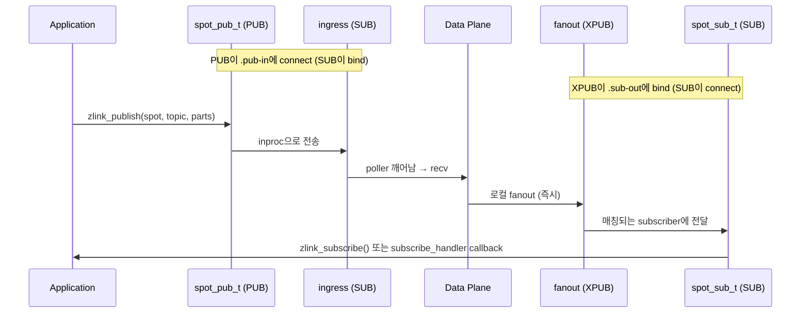

### Attachment 생성

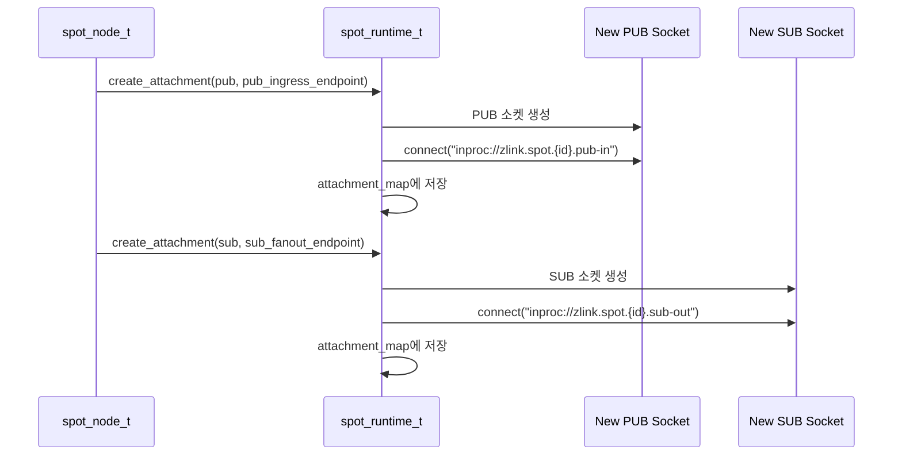

## 4. 토픽 메시지 흐름 (상세)

### 4.1 로컬 Publish → 로컬 Subscribe

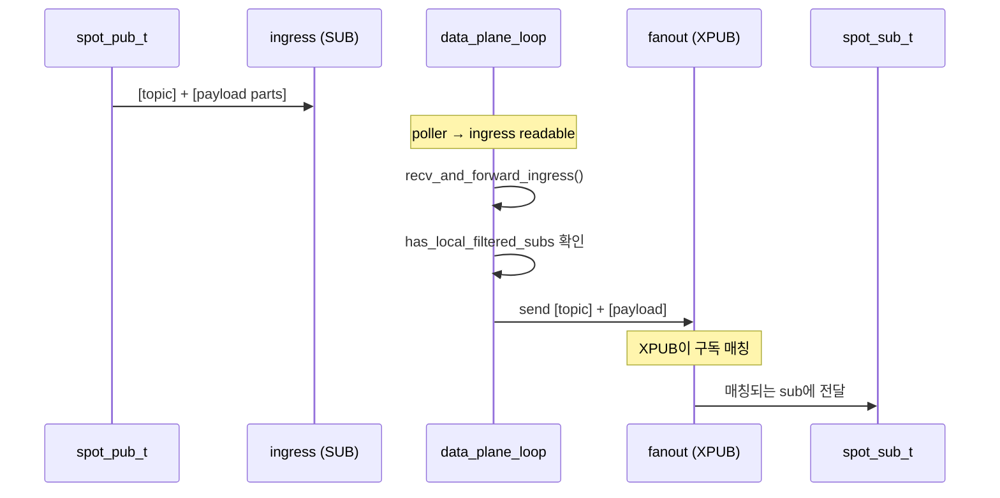

### 4.2 로컬 Publish → 원격 Peer

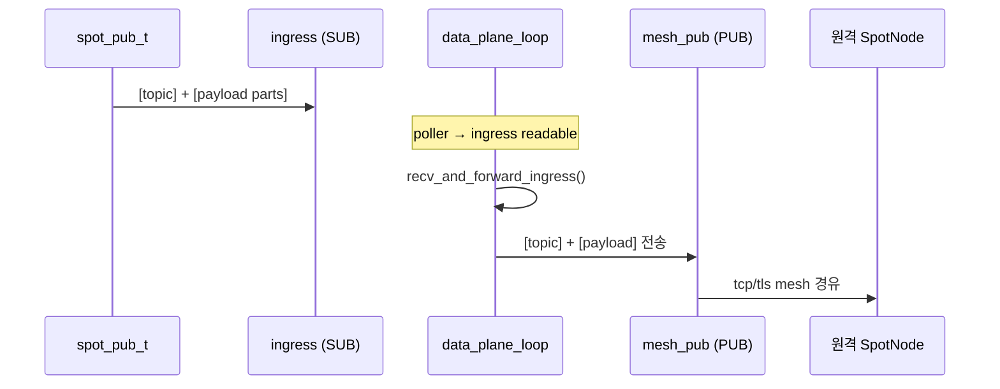

### 4.3 원격 수신 → 로컬 Subscribe

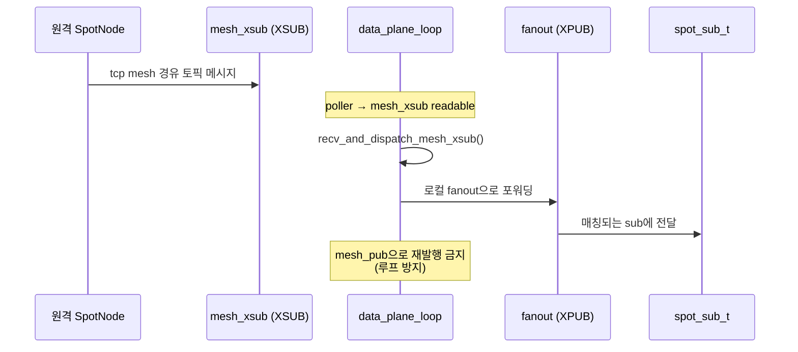

## 5. Routed 메시지 흐름 (상세)

### 5.1 로컬 spot → 로컬 spot (같은 노드)

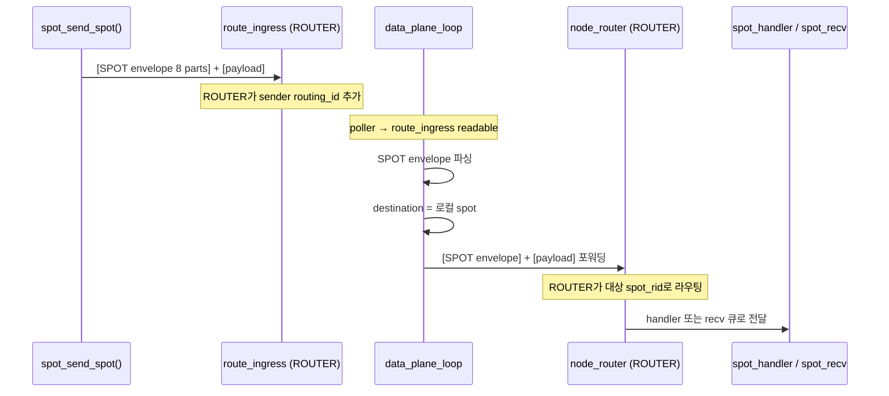

### 5.2 로컬 spot → 원격 spot (노드 간)

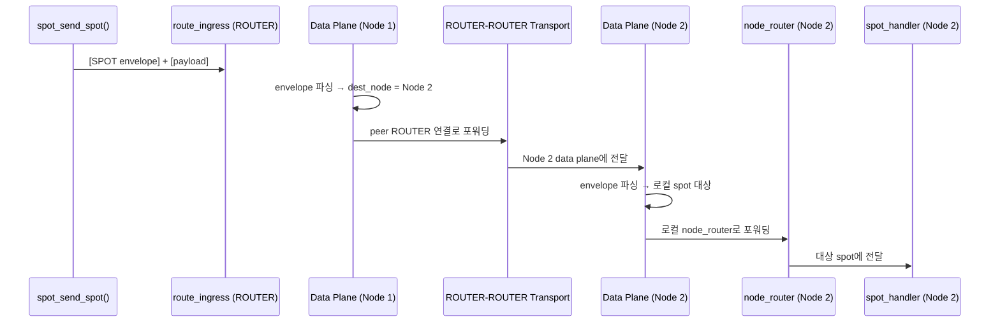

### 5.3 spot → router / router → spot

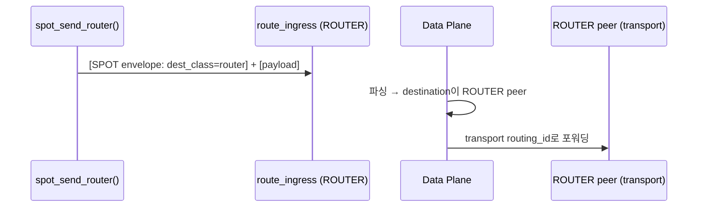

## 6. Control Plane

### 6.1 Control Task 주기 (10ms)

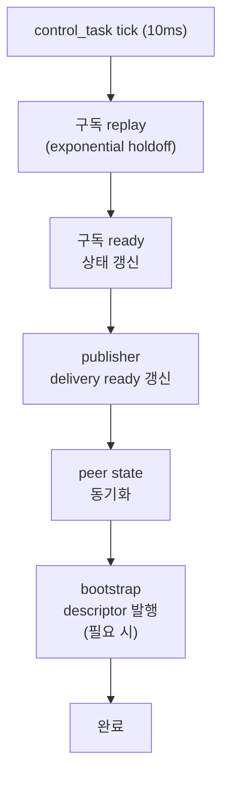

### 6.2 Peer 제어 메시지

Peer 제어 endpoint는 바인드된 데이터 endpoint에서 파생된다:

| Transport | Data Endpoint | Control Endpoint |
|-----------|--------------|-----------------|
| tcp | `tcp://host:9000` | `tcp://host:10000` (port+1000) |
| tls | `tls://host:9000` | `tls://host:10000` |
| ipc | `ipc:///path` | `ipc:///path.zlink-spot-ctrl.{id}` |
| inproc | `inproc://name` | `inproc://zlink.spot.peer-ctrl.{id}` |

제어 메시지 접두어:
- `__zlink.spot.ctrl.snapshot` — 상태 스냅샷
- `__zlink.spot.ctrl.ready_ack` — 구독 준비 확인
- `__zlink.spot.bootstrap.ctrl_descriptor` — bootstrap 정보

## 7. Data Plane Polling Loop

Data plane은 별도 스레드에서 실행되며 7개 소켓을 poll한다:

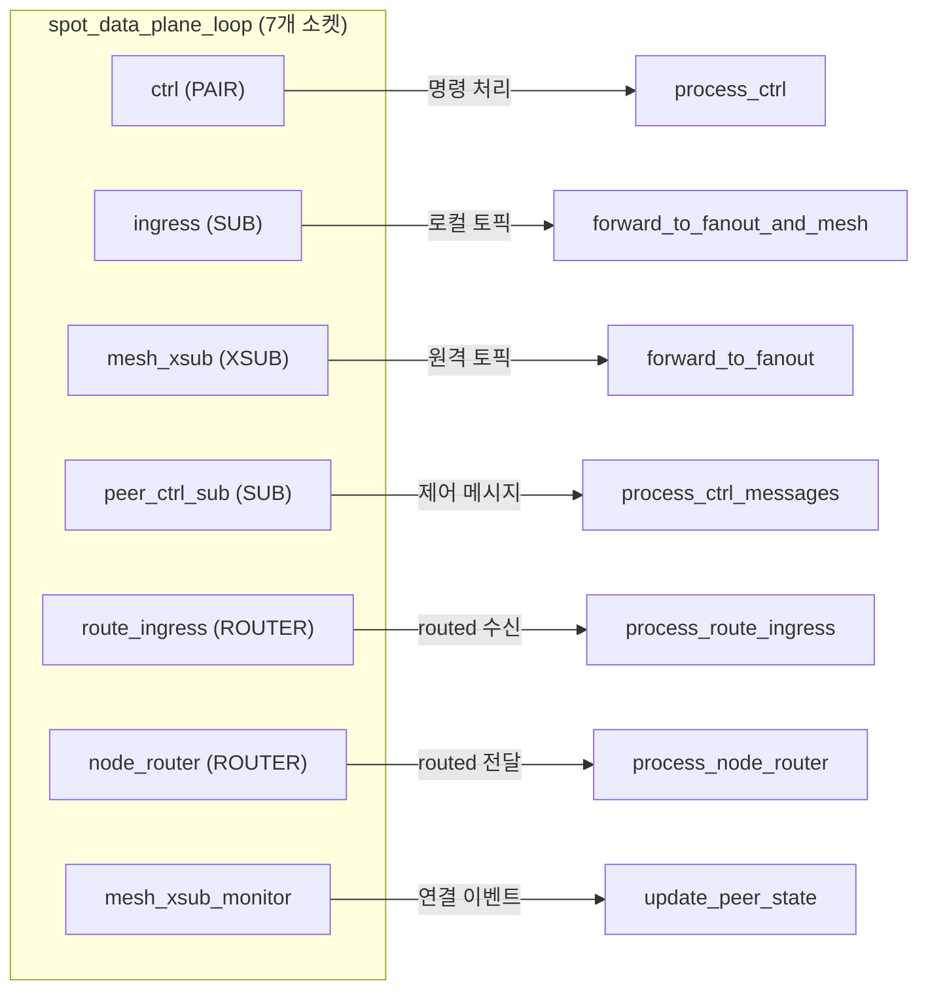

## 8. Unified Handle (spot_handle_t)

```cpp
struct spot_handle_t {
    uint32_t tag;                                // 검증 태그
    spot_node_t *node;                           // 부모 SpotNode
    spot_pub_t *pub;                             // Publisher (inproc PUB → ingress)
    spot_sub_t *sub;                             // Subscriber (inproc SUB ← fanout)
    zlink_subscribe_handler_fn handler;          // internal-only: SPOT subscribe adapter
    void *handler_userdata;
    spot_node_t::pub_defaults_t pending_pub_defaults;
    spot_node_t::sub_defaults_t pending_sub_defaults;
    service_mode_state_t mode_state;             // recv/callback 모드 추적
    std::shared_ptr<void> request_reply_state;   // handle별 RR state
};
```

Unified handle은 SpotNode를 빌린다. 여러 handle이 하나의 node를 공유할 수 있다.
각 handle은 자신만의 pub/sub 쌍, mode state, request-reply state를 갖는다.

## 9. HWM 경계

```text
+------------------------------------------------------------------+
|  Spot Handle HWM                                                  |
|  (public facade pub/sub 소켓)                                      |
|  ┌──────────────────────────────────────────────────────────────┐ |
|  │  SpotNode Data-Plane HWM                                     │ |
|  │  ┌─────────────────────────┬────────────────────────────┐    │ |
|  │  │  SNDHWM 적용 대상:       │  RCVHWM 적용 대상:          │    │ |
|  │  │  - fanout (PUB)         │  - ingress (SUB)            │    │ |
|  │  │  - mesh_pub (PUB)       │  - mesh_xsub (XSUB)        │    │ |
|  │  │  - node_router (SND)    │  - route_ingress (ROUTER)   │    │ |
|  │  │                         │  - node_router (RCV)        │    │ |
|  │  └─────────────────────────┴────────────────────────────┘    │ |
|  │                                                               �� |
|  │  peer_ctrl은 CONTROL PLANE → 별도 HWM (1024)                 │ |
|  └──────────────────────────────────────────────────────────────┘ |
+------------------------------------------------------------------+
```

기본 내부 data-plane HWM: `1000`

Topic과 routed HWM은 `zlink_set_spot_node_option()`으로 독립 설정 가능:
- `ZLINK_SPOT_NODE_OPT_TOPIC_SNDHWM` / `ZLINK_SPOT_NODE_OPT_TOPIC_RCVHWM`
- `ZLINK_SPOT_NODE_OPT_ROUTED_SNDHWM` / `ZLINK_SPOT_NODE_OPT_ROUTED_RCVHWM`

## 10. Dispatch Event 스레딩 모델

공개 API 의 `zlink_spot_dispatch_event_handler()` 표면은 **세 개의
독립된 내부 이벤트 producer** 를 단일 핸들러로 fan-in 하는 알림 전용
콜백이다. 이 절에서는 각 이벤트를 어떤 내부 스레드가 발생시키는지,
등록이 어떻게 강제되는지, 그리고 콜백이 지켜야 하는 스레드 안전성
경계를 정리한다.

### 10.1 이벤트 producer 와 스레드

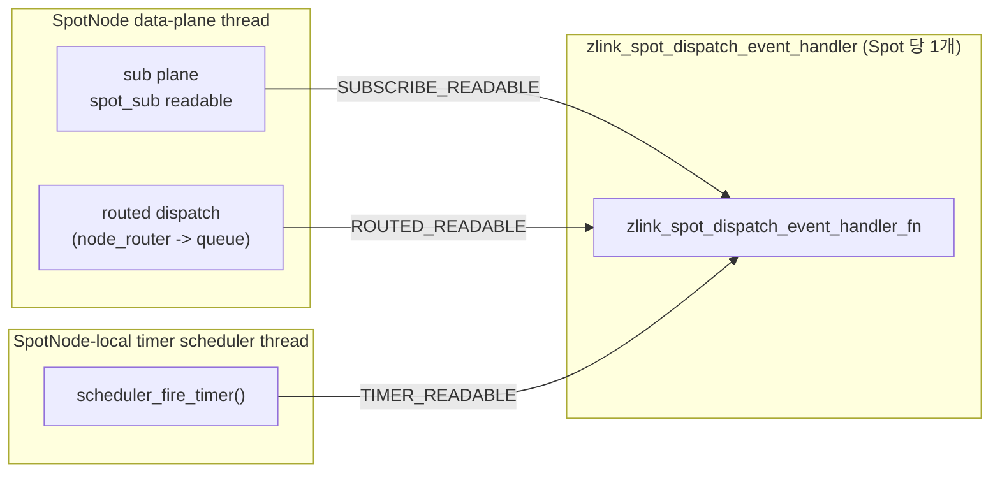

| 이벤트 | 발원 producer | 콜백을 호출하는 스레드 |
|-------|---------------|----------------------|
| `ZLINK_SPOT_DISPATCH_EVENT_SUBSCRIBE_READABLE` | `service_handler_spot_api.cpp` 의 `spot_sub_handler_adapter` — `spot_sub_t` 의 direct handler 로 설치됨 | SpotNode data-plane polling 스레드 (§7 *Data Plane Polling Loop* 참고) |
| `ZLINK_SPOT_DISPATCH_EVENT_ROUTED_READABLE` | `service_spot_request_reply_api.cpp` 의 `queue_spot_message()` — routed 전달을 내부 PAIR 큐에 enqueue 한 뒤 호출 | SpotNode data-plane polling 스레드 (`node_router` / mesh ingress 에서 routed envelope 를 parse 한 동일 스레드) |
| `ZLINK_SPOT_DISPATCH_EVENT_TIMER_READABLE` | `timer_scheduler_backend.cpp` 의 `scheduler_fire_timer()` — fire count 를 deque 에 넣고 signaler 를 raise 한 뒤, direct timer handler 가 없을 때만 호출 | SpotNode-local 타이머 스케줄러 스레드 (data-plane 스레드와는 별도) |

세 producer 는 모두 하나의 공통 진입점,
`zlink_spot_notify_dispatch_event()` → `maybe_dispatch_spot_event()`,
를 통해 콜백에 닿는다. 이 함수는 per-Spot mutex 아래에서 handler
포인터를 스냅샷으로 읽은 다음, 내부 락을 해제한 상태에서 콜백을
호출한다:

```cpp
void maybe_dispatch_spot_event (spot_request_reply_state_t *state_,
                                zlink_spot_dispatch_event_t event_)
{
    zlink_spot_dispatch_event_handler_fn handler = NULL;
    void *userdata = NULL;
    void *owner = NULL;
    {
        std::lock_guard<std::mutex> lock (state_->mutex);
        handler = state_->dispatch_event_handler;
        userdata = state_->dispatch_event_handler_userdata;
        owner = state_->owner;
    }
    if (handler)
        handler (owner, event_, userdata);
}
```

이 "snapshot 후 invoke" 패턴은 의도적인 것이다. handler 는 zlink 내부
락이 걸려있지 않은 상태에서 실행되므로, 애플리케이션이 콜백 안에서
`zlink_timer_recv()`, `zlink_spot_recv()`, `zlink_subscribe()` 같은 zlink
API 를 자유롭게 호출할 수 있다. 다만 §10.4 에서 설명하듯, 애플리케이션
워커로 작업을 넘기는 쪽이 여전히 권장된다.

### 10.2 등록 규칙과 상호 배제

per-Spot `spot_request_reply_state_t` 는 routed/dispatch 축 위에 두 개의
handler 슬롯을 가진다:

```cpp
struct spot_request_reply_state_t {
    // ...
    zlink_spot_handler_fn                  request_handler;            // direct routed
    void                                  *request_handler_userdata;
    zlink_spot_dispatch_event_handler_fn   dispatch_event_handler;     // 통합 알림
    void                                  *dispatch_event_handler_userdata;
};
```

`zlink_spot_handler()` 와 `zlink_spot_dispatch_event_handler()` 는 값을
쓰기 전에 `state->mutex` 를 잡고
`state->request_handler || state->dispatch_event_handler` 를 검사한다.
둘 중 하나라도 NULL 이 아니면 `ZLINK_HANDLER_BUSY` 를 반환한다. 이것이
사용자 가이드에서 이야기하는 "상호 배타" 규칙의 출처다.

direct subscribe callback 을 설치하는 공개 함수는 없다.
`zlink_subscribe_handler_fn` typedef 는 내부 SPOT adapter 만 사용한다.

### 10.3 이벤트별 발생 조건

**`SUBSCRIBE_READABLE`** — data-plane 스레드에서 `spot_sub_t` 의 direct
handler (즉 `spot_sub_handler_adapter`) 가 호출될 때마다 발행된다.
adapter 는 user subscribe 콜백을 실행하기 *전에*
`zlink_spot_notify_dispatch_event()` 를 호출한다. user subscribe handler
가 설치되지 않은 경우에도 subscribe 메시지는 `spot_sub_t` recv buffer 에
쌓이고, notifier 는 `zlink_subscribe()` pull 소비자에게 wake-up 신호
역할을 한다.

**`ROUTED_READABLE`** — `queue_spot_message()` 에서 routed payload (node
rid, spot rid, request_seq, parts) 를 per-Spot 내부 PAIR 큐
(`inproc://zlink.spot.routed.recv.*`) 에 enqueue 한 뒤 발행된다. 큐 write
가 성공한 다음 발행되므로, 알림을 관측한 워커는 다음 `zlink_spot_recv()`
호출에서 최소 한 건의 payload 를 얻는 것이 보장된다. `request_handler`
가 설치되어 있을 때는 queue write 대신 routed direct callback 이 호출되며
알림은 발행되지 않는다.

**`TIMER_READABLE`** — `scheduler_fire_timer()` 에서, 타이머가 소유하는
Spot (`zlink_spot_timer_new(spot)` 로 만든 경우) 이고 **direct timer
handler 가 없을 때만** 발행된다. 이 분기에서 scheduler 는 먼저 fire
count 를 `timer->fired_counts` 에 push, 이어서 `timer->signaler`
(eventfd) 를 raise, 마지막으로
`zlink_spot_notify_dispatch_event(owner_spot, TIMER_READABLE)` 을
호출한다. 같은 타이머에 `zlink_timer_handler()` 가 붙어 있으면 scheduler
가 그 handler 를 inline 으로 실행하며 dispatch event 는 발행되지 않는다
— 이것이 사용자 가이드의 per-timer 우선순위 규칙이다.

### 10.4 애플리케이션 워커와의 전체 흐름

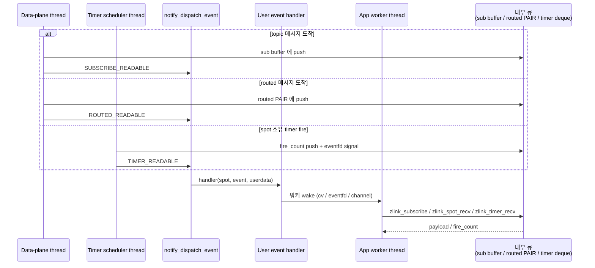

producer 들은 `notify_dispatch_event` 이후 애플리케이션 로직에 더 이상
들어가지 않는다. 메시지 디코딩, 토픽 매칭, 타이머 재스케줄링은 모두
내부 스레드에서 처리되고, 워커 스레드는 이미 drain 되었거나 원자적으로
append 된 큐 (`internal_pair_queue_t` for routed, `spot_sub_t` recv
buffer for topic, `timer->mutex` 로 보호되는 `fired_counts` deque for
timer) 만 접근한다.

### 10.5 스레드 안전성 불변식

| 불변식 | 강제 수단 |
|---|---|
| Handler 포인터 읽기는 race-free | `maybe_dispatch_spot_event` 에서 `state->mutex` 아래 스냅샷 |
| Handler 는 내부 락을 들지 않은 상태에서 실행 | snapshot 후 락 해제 후 호출 |
| 알림 전에 payload 가 반드시 큐에 존재 | producer 가 큐 push (sub buffer / PAIR queue / fired_counts + signaler) *뒤에* notifier 호출 |
| wake-up 누락 없음 | Level-triggered — 워커가 각 큐를 pull API 가 `ZLINK_RECV_NO_DATA` 를 반환할 때까지 drain 한다. drain 도중 발생한 중복 알림은 무해 |
| Direct handler vs dispatch event | 컴파일 시점에 경로가 분리 — subscribe 는 `spot_sub_handler_adapter`, routed 는 `request_handler` 슬롯, timer 는 각 타이머의 자체 handler 슬롯. routed 축에서는 등록 시점 mutex 로 이중 설치를 거부하고, 타이머는 `scheduler_fire_timer` 내부에서 per-timer 우선순위를 판정 |
| 콜백에서 zlink API 호출 가능 | producer 가 notifier 호출 전에 내부 락을 해제 |

### 10.6 애플리케이션 관점에서 단일 writer 설계인 이유

내부 producer 는 셋이지만 handler 는 하나이므로, 애플리케이션은
알림을 condition variable wake 로 받아 세 큐 모두를 하나의 애플리케이션
스레드에서 소비할 수 있다.

- sub / routed / timer 소비자 사이에 사용자 락이 필요 없다. 세 소비자는
  서로 다른 내부 큐를 읽으며, 공유되는 것은 결국 애플리케이션 bookkeeping
  뿐이고 그 bookkeeping 은 단일 워커 스레드가 배타적으로 소유한다.
- handler 자체는 `lock_guard + cv.notify + bitmask |=` 수준으로 충분하며
  zlink API 를 건드릴 필요가 없다.
- producer 스레드는 raw 함수 호출 이상의 대기를 하지 않고 즉시 자기
  polling loop 로 돌아간다. 따라서 느린 소비자 스레드가 SpotNode mesh
  나 타이머 스케줄러에 설정된 HWM 를 넘는 back-pressure 를 주지 못한다.

이것이 사용자 가이드에서 timer, routed recv, subscribe 가 하나의 Spot
handle 위에 공존할 때 `zlink_spot_dispatch_event_handler` 를 통합
소비 패턴으로 권장하는 근본 이유다.

## 11. Service Attachment 토폴로지

service-aware SPOT은 기존 SpotNode data plane 위에 올라간다. 핵심 추가 구조는
`service_name` 별 외부 ROUTER/PUB/SUB attachment를 모아 두는 node 수준 테이블
하나와, 공개 `Spot` facade가 drain하는 통합 service event queue다.

```text
+------------------------------------------------------------------+
|                          SpotNode Runtime                        |
|------------------------------------------------------------------|
| service attachment map                                           |
|  service -> { router set, pub/sub pair }                         |
|  per entry: { manual sources, discovery sources }                |
|------------------------------------------------------------------|
| service router selector                                          |
|  round-robin over active + send-ready ROUTER candidates          |
|  0 candidates -> NOT_CONNECTED                                   |
|------------------------------------------------------------------|
| service subscribe ingress                                        |
|  attach service_name to each inbound SUB delivery                |
|------------------------------------------------------------------|
| unified service event queue                                      |
|  item = { kind, service_name, source_rid, topic, request_seq,    |
|           spot_rid, payload }                                    |
|------------------------------------------------------------------|
| unified service monitor queue                                    |
|  item = { service_name, role, monitor_event }                    |
+------------------------------------------------------------------+
```

### 11.1 Attachment map

- `service_name` 하나에 ROUTER, PUB, SUB attachment를 모두 모아 둔다. 수동
  attach와 Discovery가 공급한 자동 attach가 같은 엔트리를 공유한다.
- Discovery가 공급한 provider는 source 태그로 구분해 둔다. Discovery destroy는
  그 Discovery가 공급하던 자동 attach만 제거하고, 수동 attachment나 다른
  Discovery source의 attachment는 그대로 둔다.
- 같은 `service_name` Discovery 중복 attach는 admission 단계에서 거절되므로
  map에는 `service_name` 당 Discovery source가 둘 이상 들어오지 않는다.
- service-aware entry가 하나라도 있는 node는 공개 facade `Spot`을 하나만
  허용한다. attach admission과 facade admission이 같은 gate를 공유한다.

### 11.2 Service router selector

- selector는 하나의 `service_name` 엔트리가 보유한 ROUTER 집합에서 후보를
  고른다.
- 비활성 attachment와 send-ready가 아닌 attachment는 필터링으로 제외한다.
- 선택 규칙은 round-robin이며, 한 request는 고른 ROUTER에 귀속된다. reply는
  해당 ingress ROUTER 경로를 그대로 재사용하며 새로운 round-robin을 돌리지
  않는다.
- 필터링 후 후보가 0개면 submit 결과는 `NOT_CONNECTED`로 정규화된다. 선택된
  ROUTER가 HWM에 걸린 경우는 여전히 `BACKPRESSURED`다.

### 11.3 Service subscribe ingress

- service SUB attachment에서 들어온 inbound delivery는 service-aware ingress
  단계에서 `service_name`을 붙인 뒤 통합 queue로 푸시한다. 로컬 fanout 경로를
  그대로 재사용하지 않는다. 그렇게 하면 service 태그가 사라진다.
- subscription filter는 facade 보유 집합의 합집합으로 계산된다. filter 추가는
  attach된 모든 SUB에 반영되고, filter 제거는 다른 subscriber가 여전히 그
  filter를 원할 때는 실제로 제거하지 않는다. 새 SUB가 attach되거나 churn 후
  다시 살아난 SUB가 active 집합으로 돌아올 때는 현재 filter 집합을 replay해야
  한다.
- pub/sub 경로의 `source_rid`는 신뢰할 수 있는 값이 없으면 빈 routing id로
  정규화된다. 응용은 `service_name`과 `topic_id`를 주요 메타데이터로 다룬다.

### 11.4 통합 service event queue

- queue의 소유자는 node에 attach된 단일 공개 `Spot` facade다. subscribe,
  routed reply, routed request delivery 아이템이 모두 `kind`, `service_name`,
  source 메타데이터, payload를 태그로 붙인 형태로 이 queue에 들어온다.
- `zlink_spot_subscribe()`, `zlink_spot_subscription_event()`,
  `zlink_spot_recv()`가 이 queue에서 아이템을 drain한다. drain은 §10에서
  설명한 dispatch event 기계를 공유하며, facade 단위로 직렬화된다.
- dispatch readable event는 facade에 "queue(또는 routed/timer plane)가 비어
  있지 않다"를 알린다. user handler는 I/O 스레드가 직접 호출하지 않고 공용
  dispatch executor가 실행한다. 느린 user handler 때문에 attachment I/O가
  멈추는 일이 없도록 하기 위함이다.

### 11.5 Node 소유 monitor fan-in

- attachment별 socket monitor가 올리는 이벤트는 node 단에서 통합 service
  monitor queue로 모아지며, 각 아이템은 `service_name`과 attachment `role`을
  태그로 같이 싣는다.
- 이 queue의 공개 drain은 `zlink_spot_node_monitor_recv()` 하나다. service
  monitor event는 Spot dispatch readable plane에 섞이지 않는다. monitor는
  facade의 책임이 아니다.

### 11.6 Active set 유지

- Discovery churn으로 pub/sub 짝이 깨지면 해당 pair는 즉시 active 집합에서
  제외된다. 같은 서비스에 ROUTER가 여전히 active이면 routed submit은 계속
  허용된다.
- pair가 복구되면 현재 subscription filter 집합을 replay한 뒤 active 집합에
  재진입시킨다.
- 수동 attachment는 위와 같은 pair-break 판정을 따로 받지 않는다. socket
  상태가 정상인 동안 active로 유지된다. (일반 socket 상태 기계에 따른다.)

### 11.7 Admission state 전파

`zlink_set_admission_state()`로 SpotNode 자신이 `SERVING`/`DRAINING`을 바꾸면,
변경은 SpotNode 내부 peer control 경로(`peer_ctrl_pub` / `peer_ctrl_sub`)
를 통해 best-effort runtime 신호로 다른 SpotNode peer에게 advertise된다.

- 각 peer는 자신의 SpotNode peer cache(§2.2 참조)에서 해당 항목의
  admission state를 갱신한다. 이 cache는 `zlink_spot_node_peers_snapshot()`
  과 `zlink_spot_node_peers_query()`가 돌려주는
  `zlink_spot_node_peer_entry_t.admission_state`의 source이기도 하다.
- 같은 cache는 service-aware ROUTER 후보 선택에도 쓰인다. 따라서 peer가
  `DRAINING`으로 보이면 service-aware send/request는 그 peer를 후보에서
  제외하고, 후보가 모두 `DRAINING`이면 submit은
  `ZLINK_SUBMIT_NOT_ADMITTED`로 정규화되어 반환된다. 직접 SPOT request도
  대상 SpotNode가 `DRAINING`이면 같은 결과를 낸다.
- 변경은 service monitor의
  `ZLINK_SERVICE_MONITOR_EVENT_PEER_ADMISSION_CHANGED`로도 함께 노출된다.
  같은 raw socket 쪽 변경은 별도로 socket monitor의
  `ZLINK_EVENT_PEER_ADMISSION_CHANGED`로 surface된다.
- peer 재연결 후에는 현재 admission state를 한 번 더 advertise해서 stale
  cache로 인한 잘못된 후보 선택을 줄인다.
