[English](spot-internals.md) | [한국어](spot-internals.ko.md)

# SPOT / SpotNode Internals

This document helps core maintainers understand SPOT wiring and data flow.
The public API contract is
[`doc/spec/core/service/spot.md`](../spec/core/service/spot.md).

## 0. What SPOT Is and Why It Is Structured This Way

SPOT is the zlink **service layer** — an abstraction on top of raw sockets that
provides topic publish/subscribe, routed request/reply, and Actor-based session
dispatch in a single unified runtime.

### 0.1 Design goals

| Goal | Implementation choice |
|------|-----------------------|
| **No per-Spot physical sockets** | All transport sockets are owned by `SpotNode`. A `Spot` facade owns only a logical queue and dispatch context. |
| **Single admission boundary** | HWM knobs live only on `SpotNode`-owned ingress sockets (`ingress-sub`, `internal-router`). Relay and delivery sockets use HWM `0` to prevent hidden per-peer queue caps from making disconnect/drop decisions. |
| **Aggregate subscription** | Remote mesh subscriptions are reference-counted at the node level, not per-Spot. This prevents duplicate remote subscriptions when multiple local Spots subscribe to the same topic. |
| **Actor-to-Spot decoupling** | Actors do not own sockets or inproc endpoints. Parts are relayed through the SpotNode Actor table and dispatched into a Spot's logical queue, allowing Actors to move between Spots (join) without tearing down transport connections. |
| **Deterministic teardown** | Destroying a `Spot` facade does not destroy the backing `SpotNode`. Entry Spot lifetime is tied to the `SpotNode`, not to any facade. |

### 0.2 Key concepts

- **SpotNode**: owns lifecycle, transport sockets, peer wiring, and the Actor table.
- **Spot**: a borrowed data-plane facade layered on top of a `SpotNode`. Multiple
  facades can exist for the same logical Spot; all share the same underlying queue.
- **Entry Spot**: one per `SpotNode`, created automatically. Newly created Actors
  start here. The application registers a dispatch handler on the Entry Spot to
  handle initial session setup, authentication, and Actor routing decisions.
- **Actor**: a routing target managed by the `SpotNode` Actor table. Identified by
  `zlink_actor_ref_t` (node rid + actor id + generation). No socket ownership.

### 0.3 Document map

| Section | Topic |
|---------|-------|
| §1 | Runtime component overview |
| §2 | Internal socket topology by mode |
| §3–4 | Topic and routed data planes |
| §5–6 | Admission HWM and control plane |
| §7–8 | Actor dispatch model and Entry Spot queue ownership |
| §9 | Socket removal model rationale |
| §10 | STREAM session and Actor binding sequences |
| §11–12 | Internal data structures and Actor join lifecycle |

## 1. Overview

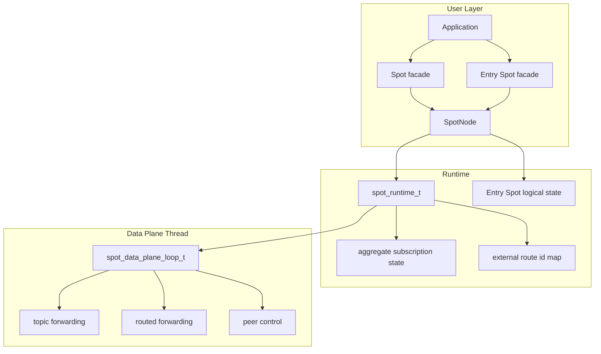

`SpotNode` owns lifecycle. `Spot` is a borrowed data-plane facade layered on top
of that node. Destroying a `Spot` does not destroy its backing `SpotNode`.

`Spot` facade does not own physical sockets. All transport sockets are owned by the
`SpotNode`. `Spot` owns only its logical dispatch queue and dispatch event context.
The `Entry Spot` is one per `SpotNode`, owned by the `SpotNode`. The application
obtains an `Entry Spot` facade via `zlink_spot_node_entry_spot()` and closes it with
`zlink_spot_destroy()`.

## 2. Internal Socket Topology

SpotNode creates only the socket planes required by its mode.

| mode | main planes |
|------|-------------|
| `PUBSUB` | topic publish/subscribe, peer control |
| `ROUTED` | routed delivery, peer control |
| `ALL` | topic, routed, peer control |

Disabled planes are not created by snapshot calls or by the first call to a
disabled API.

### 2.1 Main sockets

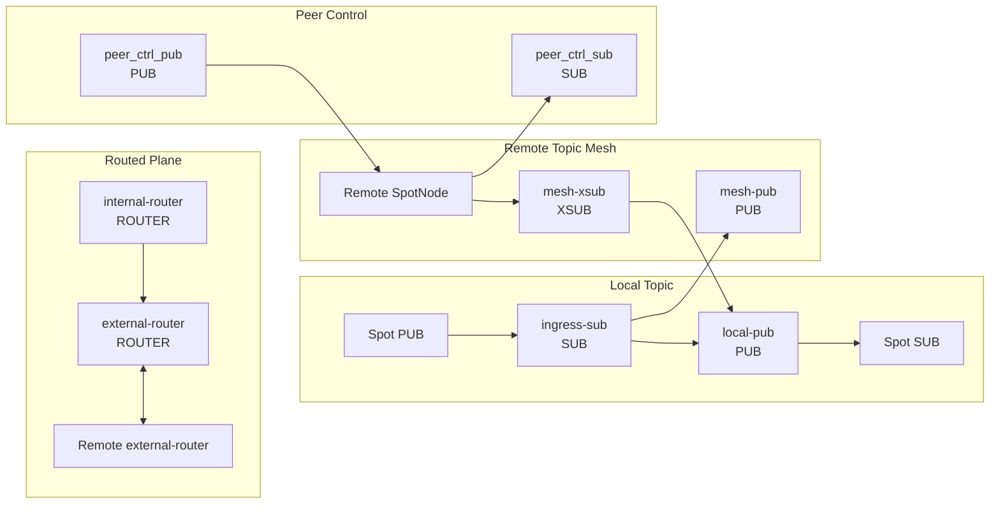

| socket | type | role | HWM policy |
|--------|------|------|------------|
| `ingress-sub` | `SUB` | receives local publish input | pubsub admission RCVHWM |
| `local-pub` | `PUB` | fans out to subscribers in this node | relay SNDHWM 0 |
| `mesh-pub` | `PUB` | forwards topic publish to remote nodes | relay SNDHWM 0 |
| `mesh-xsub` | `XSUB` | receives topic publish from remote nodes | relay RCVHWM 0 |
| `internal-router` | `ROUTER` | delivers routed messages to target Spots in this node | router admission RCVHWM, delivery SNDHWM 0 |
| `external-router` | `ROUTER` | exchanges routed frames with peer nodes | relay HWM 0 |
| `peer_ctrl_pub` | `PUB` | sends peer control messages | control defaults |
| `peer_ctrl_sub` | `SUB` | receives peer control messages | control defaults |

`zlink_spot_node_internal_sockets_snapshot()` returns only sockets that already
exist. The perf `Auto-HWM spotnode` table uses these snapshot names directly.

## 3. Topic Plane

The topic plane relies on native socket subscription filters for both local and
remote delivery. Runtime does not perform publish-time target lookup.

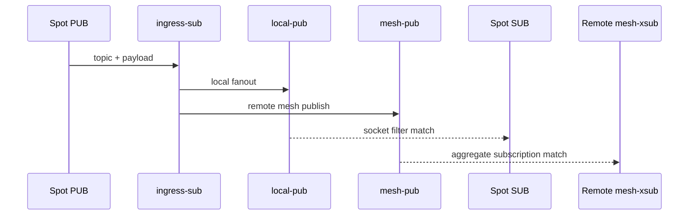

Local topic matching is owned by each `Spot SUB` subscription state. Remote
topic matching is owned by each peer node's `mesh-xsub` aggregate subscription
state.

### 3.1 Aggregate Subscription Lifetime

Runtime tracks node-level subscription lifetime for remote mesh propagation.

| state | structure | meaning |
|-------|-----------|---------|
| exact topic | `topic -> refcount` | number of local subscribers for an exact topic |
| prefix | `prefix -> refcount` | number of local subscribers for a prefix |

The rules are:

1. Send remote aggregate subscribe only on `0 -> 1`.
2. Send remote aggregate unsubscribe only on `1 -> 0`.
3. Intermediate increments and decrements update local state only.

This keeps duplicate local subscriptions from becoming duplicate remote
subscriptions.

## 4. Routed Plane

The routed plane has two router axes.

| router | scope | role |
|--------|-------|------|
| `internal-router` | inside one node | delivers to the target `Spot` routed receive queue |
| `external-router` | between nodes | exchanges routed frames with peer `external-router` sockets |

There is no separate routed ingress broker and no topic-mesh fallback for
routed delivery. Local routed delivery is tracked through `internal-router`.
Remote routed delivery is tracked through `external-router`.

### 4.1 Local Routed Delivery

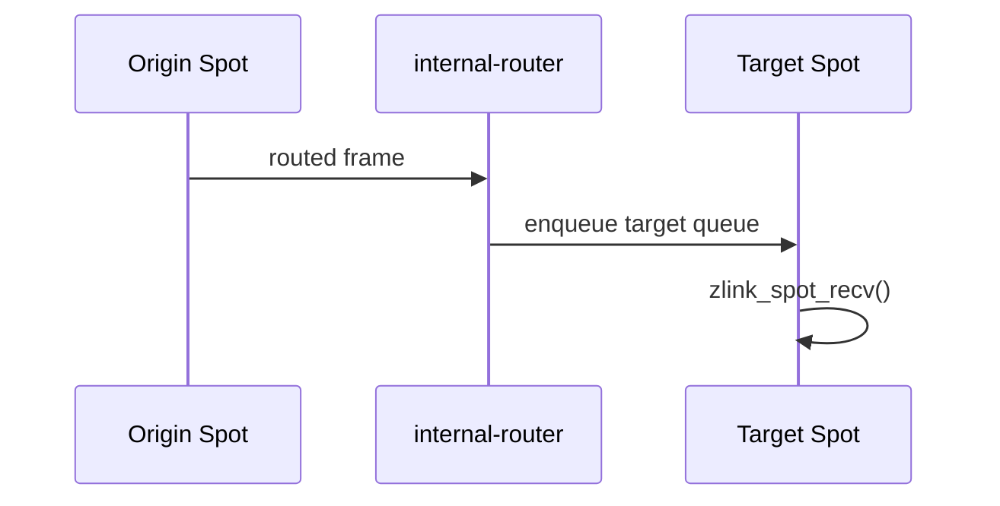

Local routed delivery does not disconnect a target because an internal delivery
queue grew. Backpressure is expressed by the admission HWM on the internal
router receive side and by the normal receive API returning no data when the
application has drained the queue.

### 4.2 Remote Routed Delivery

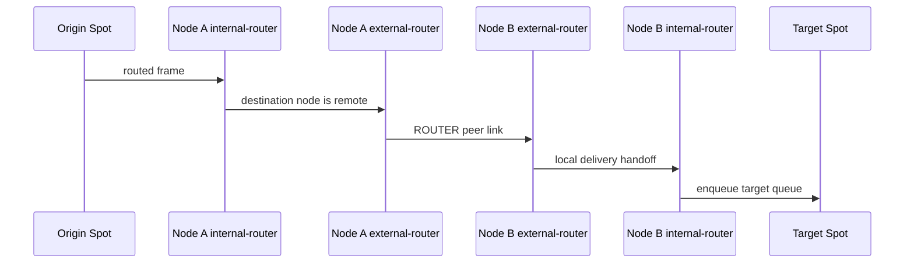

Remote routed delivery uses an external route id map per peer. Only
`spot_runtime_t` methods update that map, so callers do not need to know the
map structure or locking rules.

## 5. Admission HWM

SpotNode exposes only admission HWM knobs. These knobs cap how much local input
enters the node before the data plane owns it.

| option | admission path | default behavior |
|--------|----------------|------------------|
| `ZLINK_SPOT_NODE_OPT_PUBSUB_HWM_PROFILE` | topic publish admission | balanced auto-HWM profile |
| `ZLINK_SPOT_NODE_OPT_PUBSUB_HWM` | topic publish admission numeric override | positive value, `0` returns to auto-HWM |
| `ZLINK_SPOT_NODE_OPT_ROUTER_HWM_PROFILE` | routed admission | balanced auto-HWM profile |
| `ZLINK_SPOT_NODE_OPT_ROUTER_HWM` | routed admission numeric override | positive value, `0` returns to auto-HWM |

With no numeric override, SpotNode data-path sockets use the shared auto-HWM
planner. Balanced profile gives the same sequence as ordinary routed sockets:
HWM `1024` for small messages up to 1024 B, HWM `16` for 64 KiB, HWM `8` for
128 KiB, and HWM `4` for 256 KiB. The peer control sockets stay outside this
admission group and keep their control-plane HWM.

The shared relay and delivery sockets use HWM `0`. This prevents hidden
per-peer or per-target queue caps inside SPOT from deciding message loss or
disconnect behavior. Queue growth is then controlled at the explicit admission
boundary and by application drain rate.

`Spot` facades capture the current admission values when they are created.
Later `SpotNode` option changes apply to later `Spot` instances, not to handles
that already exist.

SPOT publish queue planning keeps per-connection admission independent of
fanout. Fanout is still useful as a diagnostic count, but it is not an input
that reduces HWM:

```text
effective_publish_fanout =
  max(local_sub_spot_count, active_peer_count, observed_scope_count)
```

The total spot count is metadata pressure, not the fanout queue count. Removed
directional SpotNode HWM options and queue hard-limit options are not part of
the public contract. Status fields that used to report disconnected delivery
targets remain ABI fields and report zero.

The perf runner uses the `core/build` runtime and must print the resolved
`libzlink` path before running. Its `Auto-HWM spotnode` detail should show
admission HWM only on topic ingress and routed ingress sockets; relay and
delivery sockets should report HWM `0`.

## 6. Control Plane

The peer control plane is separated from data traffic. It carries:

- peer bootstrap data
- ready-state refresh
- aggregate subscription replay
- peer connection state

Control sockets may use a different message unit from data sockets. If a perf
table shows different `MsgUnit(B)` values in the same payload-size block, the
control plane and data plane are being calculated with different units.

## 7. Actor dispatch internal model

An Actor is a routing target managed by `SpotNode`. There is no public Actor
handle; `zlink_actor_ref_t` identifies the Actor. Actors do not own a socket,
inproc endpoint, or transport endpoint. Parts relayed from a STREAM session to
an Actor pass through the target SpotNode's Actor table into the Actor
**unread state** — the queue of parts that have been received but not yet
consumed by the application via `zlink_spot_node_actor_recv_part()`.

Each Actor has a **joined Spot** (also called `current Spot`): the Spot whose
dispatch context will receive `ACTOR_READABLE` events for this Actor. A newly
created Actor's joined Spot is always the Entry Spot. The Actor moves to a
different Spot through the join protocol (§12); until that completes the Entry
Spot remains current.

A newly created Actor's current Spot is always the Entry Spot. Actor messages are
dispatched from the Entry Spot context until the Actor joins a user Spot.

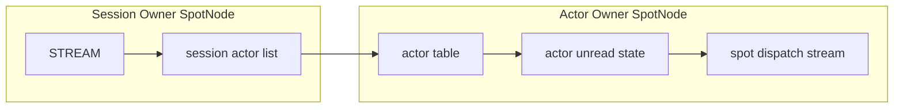

The session actor list is separate per session routing id. Each entry stores
an actor id and a concrete Actor ref. Even when bind is called with an
unchecked ref, a successful attach stores the real generation in the session
entry. The session owner does not store joined Spot state. Joined state is
managed only in the Actor owner table and in snapshots.

Local Actor relay and remote Actor relay use the same Actor table semantics.
The only difference is whether the target SpotNode is in the same process or
must be reached through a peer SpotNode via routed control. When a remote
relay arrives after the target Actor has been removed, the target node discards
the part. A completed submit result on the sender side does not change after
that.

### 7.1 Actor table state

Each Actor table row holds:

| State | Meaning |
|-------|---------|
| Actor ref | node rid, actor id, generation |
| joined Spot rid | the Spot this Actor is currently joined to; starts at the Entry Spot when created |
| bound session ref | the STREAM session this Actor is attached to |
| unread state | parts not yet read by `zlink_spot_node_actor_recv_part()` |
| pending join | join requests the Spot has not yet replied to |
| route synced | whether the active route points to the current Actor ref |

Actor destroy checks the joined state, bound session detach, and any in-flight
multipart relay first. When the detach cannot complete or a timeout occurs,
the Actor slot and unread state are left in the pre-call state.

### 7.2 Dispatch event

When the Actor unread state gains a readable part and the Actor is joined to a
Spot, `ACTOR_READABLE` readiness is posted to the Spot dispatch stream. The
event subject is a callback-lifetime `const zlink_actor_ref_t *`. When a
pending join request arrives, `ACTOR_JOIN_READABLE` readiness is posted to the
Spot dispatch stream.

Readiness does not correspond 1:1 to message counts. Dispatch callbacks must
drain each drain API until it returns `NO_DATA`. The internal implementation
preserves part order within the same Actor.

### 7.3 Active route publish

The Actor active route is not published when the Actor is created or when it
joins a Spot. It is published when the Actor owner SpotNode's Discovery has
actor route sync enabled and a `zlink_stream_bind_actor()` call succeeds.
Unbind and session disconnect cleanup do not remove the active route. When the
Actor that the active route points to is destroyed, route cleanup is performed.

## 8. Entry Spot and Spot queue ownership

A `Spot` facade does not create physical sockets. Messages demultiplexed from
transport sockets owned by the `SpotNode` are delivered into the target `Spot`'s
logical queue. A `Spot` owns:

- routed ingress dispatch queue
- subscribe ingress dispatch queue
- channel reply dispatch queue
- timer event queue
- Actor unread staging queue

Backpressure is controlled by the admission HWM on `SpotNode` transport sockets.
There is no per-Spot HWM or size cap on internal queues.

The `Entry Spot` is one per `SpotNode`. It is created automatically when the
`SpotNode` is created and lives until the `SpotNode` is destroyed. The application
registers a dispatch handler by obtaining a facade via `zlink_spot_node_entry_spot()`.
When a session relay message arrives for a newly created Actor, `ACTOR_READABLE`
readiness is posted to the Entry Spot's dispatch queue.

A user Spot's logical state is destroyed when the last facade is closed, provided
no Actor is currently joined and no join request is pending. Entry Spot logical state
is owned by the `SpotNode` and is not reference-counted.

## 9. Spot socket removal model

In the previous structure, a `Spot` facade or side handle could create per-Spot
sockets and use inproc sockets as queues. In a design where `SpotNode` receives
a message once and relays it to a logical `Spot`, expressing dispatch state via
per-Spot socket HWM is wrong. HWM belongs on the `SpotNode`-owned transport
socket admission boundary. Per-Spot queues are staging state only: they decide
which dispatch context processes already-received input.

The target structure is:

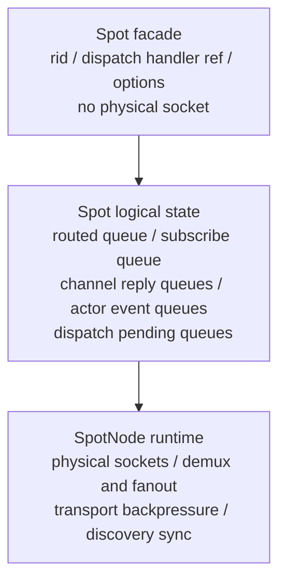

The `Spot` facade does not directly own physical sockets such as `spot_pub_t`,
`spot_sub_t`, or routed receive sockets. What a `Spot` needs is a reference to its
logical state.

## 10. STREAM session and Actor binding

The session owner node and the Actor owner node may be the same or different. The
internal paths differ, but the public API is identical.

### 10.1 Local Actor binding (co-located)

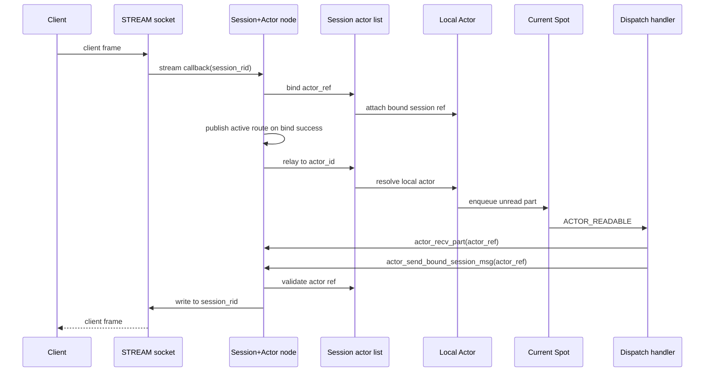

A local Actor completes bind, relay, and Actor-to-session send all within one node.
No Actor socket or per-Actor inproc endpoint is created.

### 10.2 Remote Actor binding (split deployment)

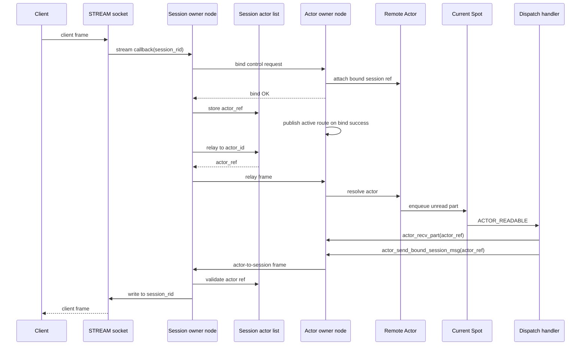

A remote Actor has bind control requests, session-to-Actor relay frames, and
Actor-to-session frames crossing node boundaries. The session owner does not store
the Actor's joined Spot state. The Actor owner does not store STREAM session
application state.

When a bound session disconnect and a remote join handoff overlap, the session Actor
list compare-and-swap result is authoritative. A disconnect before the CAS succeeds
aborts to Entry Spot on the source Actor. A disconnect after the CAS succeeds
triggers Entry Spot cleanup on the target Actor.

### 10.3 Remote bind error paths

| Condition | Outcome |
|-----------|---------|
| Actor owner node unreachable | `bind control request` never delivered; session owner returns bind failure after timeout; `g_session_bindings` entry is not written |
| Bind control request times out mid-operation | Session owner treats it as a bind failure; any partial Actor table state on the target node is rolled back when the target node receives the timeout notification |
| `actor_ref` stale (generation mismatch) | Target node rejects the bind control request; session owner receives `INVALID_HANDLE`; no Actor table entry is created |
| Session disconnect before bind completes | `g_session_bindings` CAS on the session owner fails because the session rid entry was already cleared; bind is aborted and any target node Actor state is cleaned up

## 11. Transport logical queue internal data structures

This section describes the key internal structures behind the transport logical queue
implementation. These are not public contract; implementation details may change.

### 11.1 Spot logical queue (`spot_logical_state_t`)

`spot_logical_state_t` is the logical state shared by `Spot` facades
(`spot_handle_t`) via `shared_ptr`. The Entry Spot is owned by
`spot_node_handle_state_t.entry_spot`; user Spots are kept in the `spots_by_rid`
map.

Pubsub-relevant fields:

| field | type | role |
|-------|------|------|
| `subscribe_queue` | `deque<shared_ptr<spot_logical_pubsub_message_t>>` | pubsub messages demuxed from `SpotNode` |
| `subscribe_signaler` | `signaler_t` | edge-triggered signaler that wakes dispatch |
| `subscribe_signal_armed` | `bool` | arming flag that prevents duplicate signals |
| `request_reply_state` | `shared_ptr<spot_request_reply_state_t>` | routed send/recv and channel reply state |

`spot_logical_pubsub_message_t` holds all parts of one pubsub message:

```cpp
struct spot_logical_pubsub_message_t {
    zlink_routing_id_t source_rid;
    std::string service_name;
    std::string topic_id;
    std::vector<std::string> parts;
};
```

### 11.2 Actor unread queue (`actor_handle_t`)

`actor_handle_t` corresponds to one row in the `SpotNode` Actor table. It is owned
by the `actors_by_id` map inside `spot_node_actor_state_t`.

| field | type | role |
|-------|------|------|
| `queue` | `deque<queued_actor_part_t>` | unread parts relayed from a STREAM session |
| `joined_spot_state` | `shared_ptr<spot_logical_state_t>` | current Spot state |
| `generation` | `uint64_t` | Actor ref generation (stale ref validation) |
| `bound_session_node` | `spot_node_t*` | session owner node |
| `bound_stream` | `void*` | connected STREAM socket handle |
| `pending_remote_join` | `bool` | remote join prepare in progress |

`queued_actor_part_t` is a move-only ownership wrapper for one part:

| field | type | role |
|-------|------|------|
| `part` | `zlink_msg_t` | message body |
| `info` | `zlink_actor_recv_info_t` | source session info (node rid, session rid, actor ref) |
| `part_flag` | `zlink_part_flag_t` | `ZLINK_PART_MORE` or `ZLINK_PART_FINAL` |
| `owns` | `bool` | whether this wrapper owns the part (false after move) |

### 11.3 Join request queue (`g_join_queues`)

Join requests are stored in `g_join_queues`, protected by the global
`g_actor_mutex` in `service_spot_actor_api.cpp`:

```
g_join_queues: map<spot_logical_state_t*, deque<queued_join_request_t*>>
```

The key is the target Spot's `spot_logical_state_t` pointer. Multiple join requests
for the same Spot may be pending at once and are drained FIFO by
`zlink_spot_actor_join_recv()`.

Key fields of `queued_join_request_t`:

| field | type | role |
|-------|------|------|
| `actor` | `actor_handle_t*` | source Actor that requested the join |
| `spot_state` | `shared_ptr<spot_logical_state_t>` | target Spot logical state |
| `join_epoch` | `uint64_t` | join sequence number (timeout/duplicate validation) |
| `replied` | `bool` | whether a reply has been submitted |
| `pending_target` | `actor_handle_t*` | target Actor created during remote join prepare |
| `remote` | `bool` | whether this is a remote join handoff |
| `message` | `zlink_msg_t` | join payload (ownership transferred from caller) |
| `reply` | `zlink_msg_t` | reply payload (ownership transferred from target Spot) |

`g_live_join_requests` tracks all currently pending join requests.
`g_retired_join_requests` holds requests awaiting timeout/cleanup processing.

### 11.4 Signaler and dispatch connection

Pubsub dispatch uses an edge-triggered signaler:

```
message added to subscribe_queue
→ if subscribe_signal_armed == false: subscribe_signaler.send()
→ set subscribe_signal_armed = true
→ poller detects subscribe_signaler fd → delivers SUBSCRIBE_READABLE
→ after drain: reset subscribe_signal_armed = false (ready for next input)
```

Actor readable dispatch posts `ACTOR_READABLE` readiness directly to the dispatch
handler of `actor_handle_t.joined_spot_state`. The subject is a
`const zlink_actor_ref_t*` valid only for the callback lifetime.

Actor join dispatch posts `ACTOR_JOIN_READABLE` to the target Spot's dispatch
handler when a request is added to `g_join_queues`. The subject is the target Spot
facade.

### 11.5 Global state summary

Key global state managed by `service_spot_actor_api.cpp`. **All entries below
are protected by `g_actor_mutex`** unless noted otherwise.

| global | type | role |
|--------|------|------|
| `g_actor_mutex` | `timed_mutex` | single global lock protecting all other entries; held only for the duration of table mutations, not I/O |
| `g_nodes_by_rid` | `map<string, spot_node_t*>` | node rid → SpotNode reverse lookup; populated on `SpotNode` creation, removed on destroy |
| `g_join_queues` | `map<spot_logical_state_t*, deque<...>>` | pending join requests per Spot; entries added when a join request is enqueued, removed when the request is replied or cleaned up |
| `g_known_spots` | `set<spot_handle_t*>` | tracks live Spot facades; used to validate handles against use-after-free |
| `g_session_bindings` | `map<string, session_binding_t>` | session rid → Actor binding; compare-and-swap on remote join commit uses this map as the transaction point |
| `g_active_routes` | `map<string, zlink_actor_route_t>` | actor id → active route published to Discovery |
| `g_live_join_requests` | `set<queued_join_request_t*>` | currently pending joins; used for timeout sweep |
| `g_retired_join_requests` | `set<queued_join_request_t*>` | joins awaiting cleanup after completion frame delivery |
| `g_actor_protocol_drop_count` | `uint64_t` | cumulative count of relay frames dropped due to protocol errors (stale ref, unknown actor id, etc.); useful for diagnosing relay loss |

**Initialization**: these globals are default-initialized at program startup
(static storage duration). There is no separate init call. The first
`zlink_ctx_new()` call indirectly populates `g_nodes_by_rid` when the first
`SpotNode` is created; there is no race window because the mutex is taken on
every write and every read that can race with a write.

**Lock scope**: callers must not hold `g_actor_mutex` while crossing an I/O
thread boundary (e.g., while waiting for a Mailbox reply). The lock is always
released before any blocking call. Actor table mutations and join queue mutations
that span two SpotNode instances are serialized by taking the mutex once for the
entire compound operation.

## 12. Actor join internal lifecycle

This section describes how Actor join requests are processed inside SpotNode.
For STREAM session binding flow see section 10. For the public join contract see
[`doc/spec/core/service/spot.md`](../spec/core/service/spot.md).

### 12.1 Local join internal sequence

Local join only changes `current Spot` within the same `SpotNode`. The source Spot
remains the Actor's `current Spot` until accept. The accept step and `current Spot`
swap execute in the same `SpotNode` critical section or event-loop turn. Joining a
non-Entry user Spot requires the source Actor to have a bound STREAM session ref.

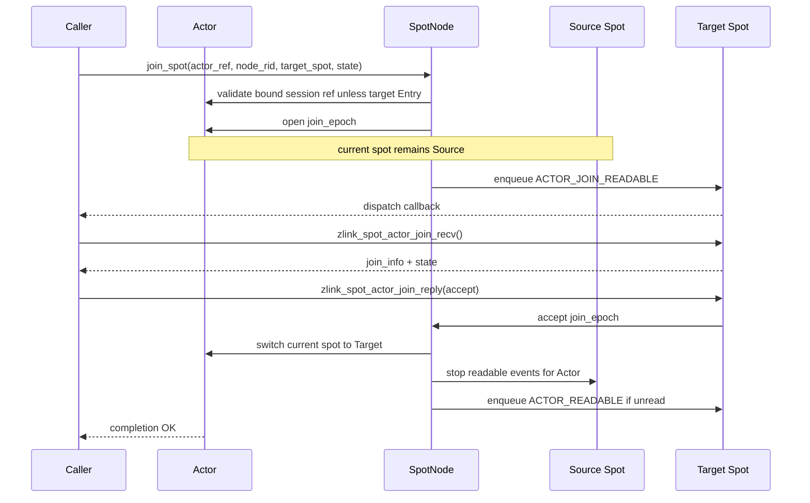

If the target rejects or the request times out, the `current Spot` swap does not
execute. The Actor stays in the source Spot. The join state payload is discarded
after reply or timeout cleanup.

Local join atomicity rules:

- The source Spot is `current Spot` until accept.
- The accept step and `current Spot` swap execute in the same critical section or
  event-loop turn.
- No new `ACTOR_READABLE` events are posted to the source Spot after accept.
- Reject, timeout, target Spot destroy, and `SpotNode` shutdown preserve the source Spot.

### 12.2 Remote join internal sequence

Remote join hands off the source node Actor to the target Spot on the target node.
The current implementation performs this within the same process across registered
`SpotNode` instances. Network control frames, cross-process session Actor list
compare-and-swap, and retryable `JoinOp` cleanup are deferred work.

`JoinOp` is created on the source node and preserves:

| field | meaning |
|-------|---------|
| `join_epoch` | sequence number for timeout, duplicate, and stale-replay checks |
| `source_actor_ref` | source node and Actor ref |
| `target_actor_ref` | target node and pending Actor ref |
| `target_node_rid` / `target_spot_rid` | destination node and Spot |
| `bound_session_ref` | session owner and session rid |
| `completion_handler` | request owner's `zlink_reply_handler_fn` |
| `reply_path` | path to deliver join completion to request owner |

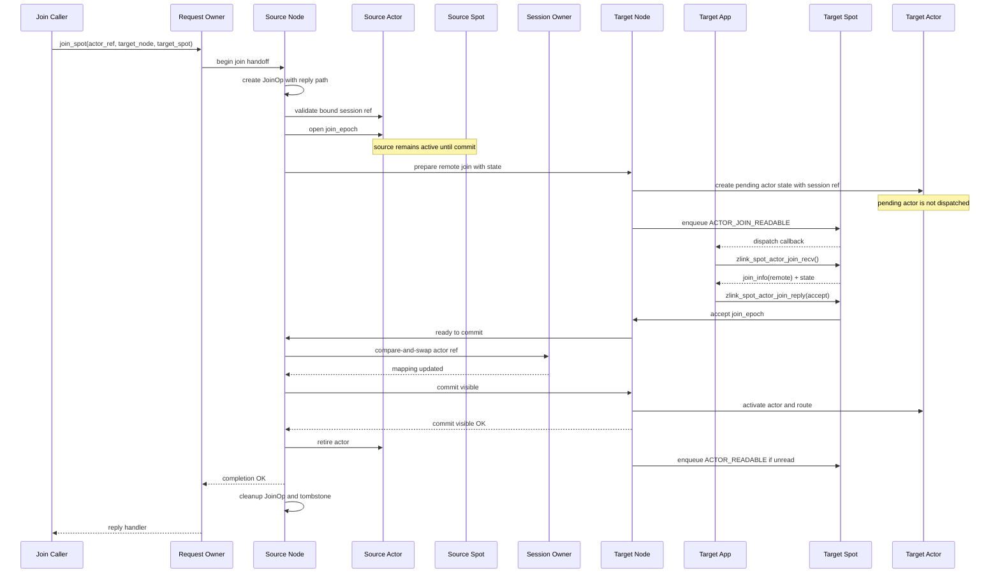

Remote join atomicity rules:

- The source Actor remains active in the source node and source Spot until commit.
- The target node creates pending Actor state during prepare, but this Actor is not
  dispatched and does not publish an active route.
- Even after the target Spot accepts, the source Actor is not yet removed from the
  source Spot.
- The source Actor is retired after the session Actor list compare-and-swap succeeds
  and the target Actor activate plus active route update are confirmed.
- After commit, the session owner node's session Actor list and active route point to
  the target node Actor ref.
- `JoinOp` cleanup executes after the request owner completion frame delivery is confirmed.
- Source Actor retire and target activate are fenced by the join epoch. Stale relays,
  stale join replies, and late control messages apply only if the epoch matches.

### 12.3 Abort paths

If the target Spot rejects, times out, prepare fails, or the target shuts down, the
handoff aborts.

- The source Actor stays active in the source Spot.
- The target pending Actor state and payload reference are discarded.
- The active route does not move.

When a bound session disconnect races with a remote join handoff, the session Actor
list compare-and-swap success is the deciding boundary.

- **Disconnect before CAS success**: aborts to source; source Actor moves to Entry
  Spot and bound session ref is cleared; target pending Actor state is discarded.
- **Disconnect after CAS success**: the target Actor is canonical; after commit visible
  completes, target node disconnect cleanup moves the target Actor to Entry Spot and
  clears bound session ref; the source Actor does not become active again.
