[English](spot-internals.md) | [한국어](spot-internals.ko.md)

# SPOT / SpotNode Internal Architecture

## 1. Component Overview

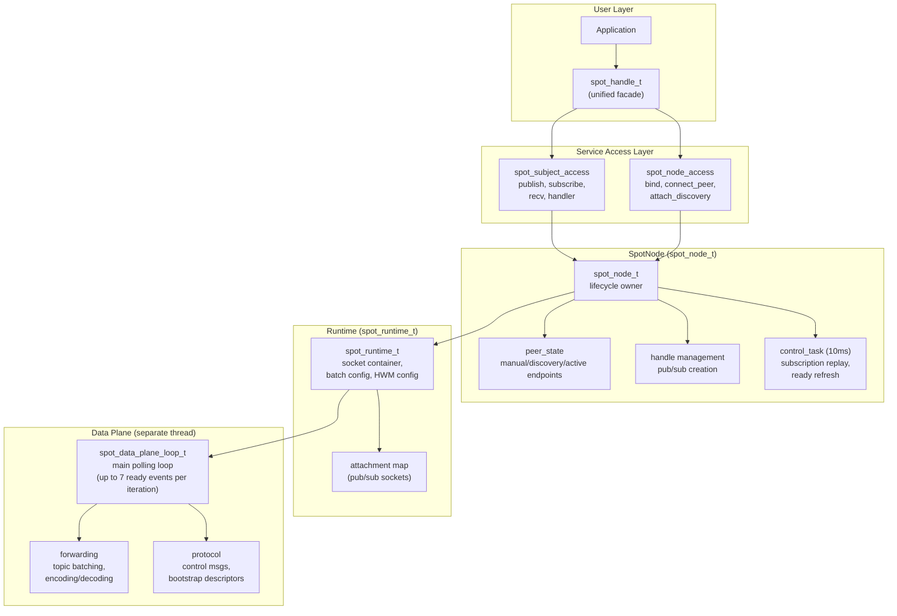

## 2. Internal Socket Topology

SpotNode creates 11 persistent sockets at startup,
plus a monitor socket for connection state tracking (12 total).
Three sender-cache sockets are created on demand as data paths are first used.

### 2.1 Socket Inventory

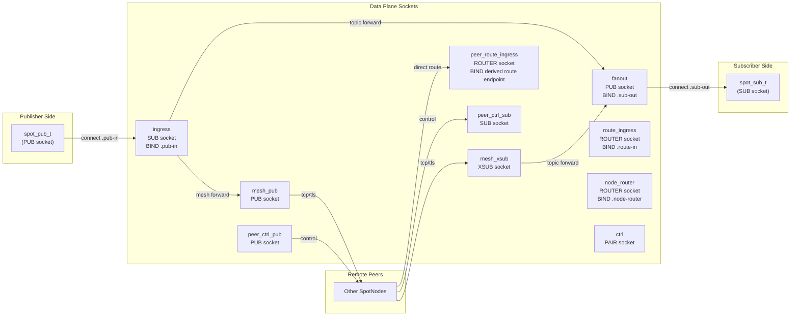

### 2.2 Socket Details

| Socket | Type | Endpoint | Bind/Connect | HWM | Role |
|--------|------|----------|-------------|-----|------|
| `ingress` | SUB | `.pub-in` | BIND | `node_sub_rcvhwm` | Receives all local publishes |
| `fanout` | PUB | `.sub-out` | BIND | `node_pub_sndhwm` | Distributes to local subscribers |
| `mesh_pub` | PUB | (bound endpoint) | BIND | `node_pub_sndhwm` | Sends topics to remote peers |
| `mesh_xsub` | XSUB | — | CONNECT to peers | `node_sub_rcvhwm` | Receives topics from remote peers |
| `route_ingress` | ROUTER | `.route-in` | BIND | `routed_recv_hwm` | Receives routed messages from apps |
| `peer_route_ingress` | ROUTER | (derived route endpoint) | BIND | `routed_recv_hwm` | Receives direct routed messages from remote peers (active after bind) |
| `node_router` | ROUTER | `.node-router` | BIND | `routed_send/recv_hwm` | Delivers routed messages to apps |
| `ctrl` | PAIR | `.ctrl` | CONNECT | — | Control plane ↔ data plane commands |
| `peer_ctrl_pub` | PUB | (derived from bound) | BIND | 1024 | Sends control msgs to peers |
| `peer_ctrl_sub` | SUB | — | CONNECT to peers | 1024 | Receives control msgs from peers |
| `mesh_xsub_monitor` | Monitor | — | — | — | Tracks CONNECTION_READY/DISCONNECTED |

All inproc endpoints follow the pattern: `inproc://zlink.spot.{node_id}.{suffix}`

### 2.3 Sender Cache Sockets (on demand)

Three sockets are created lazily when first needed.

| Socket | Type | Connects to | Role |
|--------|------|-------------|------|
| `route_ingress_tx` | DEALER | `.route-in` (inproc) | Data plane sends into route_ingress |
| `node_router_tx` | DEALER | `.node-router` (inproc) | Data plane sends into node_router |
| `peer_route_tx` | PAIR | Remote peer route endpoint | Sends routed messages directly to a remote peer |

### 2.4 Common Socket Settings

All data plane sockets share:
- `LINGER = 0`
- `SNDTIMEO = -1` (blocking)
- `ingress`: `SUBSCRIBE = ""` (receive all topics)
- `fanout`: `XPUB_NODROP = 1` (do not drop for slow subscribers; applied to internal PUB socket)
- `peer_ctrl_sub`: `SUBSCRIBE = "__zlink.spot.ctrl."` (control prefix only)

## 3. Pub/Sub Attachment

User-facing `spot_pub_t` and `spot_sub_t` connect to the data plane
via separate attachment sockets.

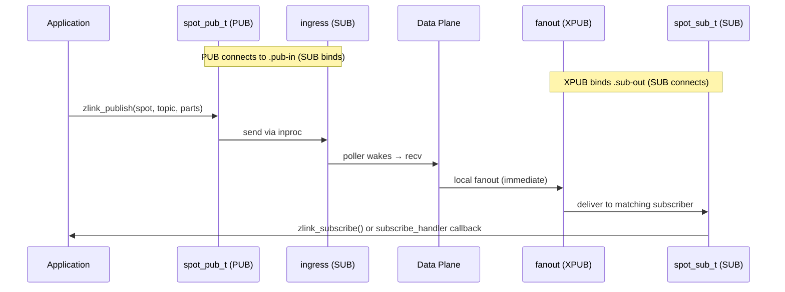

### Attachment Creation

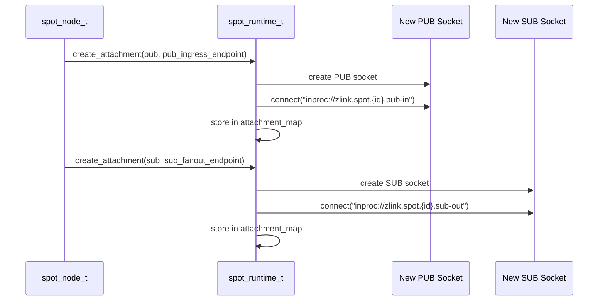

## 4. Topic Message Flow (Detailed)

### 4.1 Local Publish → Local Subscribe

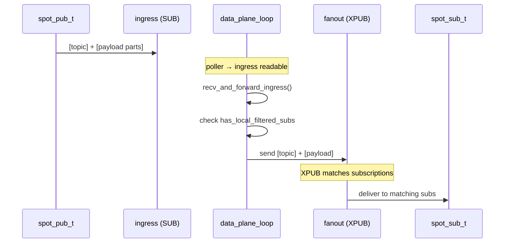

### 4.2 Local Publish → Remote Peers

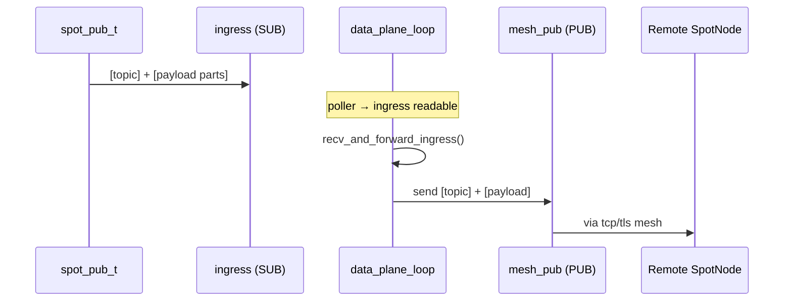

### 4.3 Remote Receive → Local Subscribe

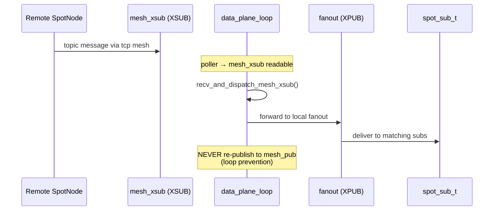

## 5. Routed Message Flow (Detailed)

### 5.1 Local spot → Local spot (same node)

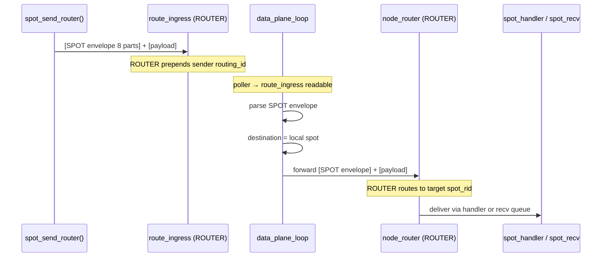

### 5.2 Local spot → Remote spot (cross-node)

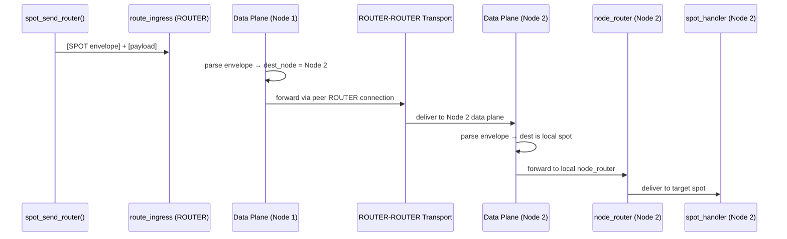

### 5.3 spot → router / router → spot (one-way send)

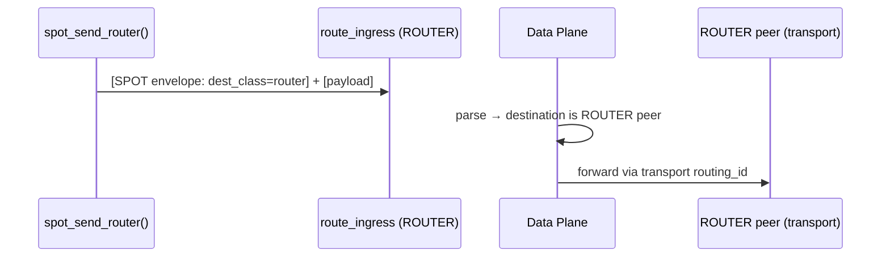

### 5.4 Spot routed request-reply

`zlink_spot_request_spot()` and `zlink_spot_request_router()` layer a
request-reply protocol on top of the existing routed send paths (§5.1/5.2
for Spot targets, §5.3 for Router targets). The request-reply envelope is
nested inside the SPOT routed envelope; no new transport socket is added.

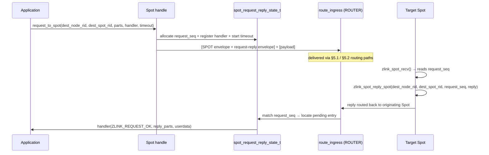

Key invariants:
- The request-reply envelope is nested inside the SPOT routed envelope.
  No additional socket or inproc path is created for request-reply.
- `request_seq` is per-handle and monotonically increasing. Each
  `spot_request_reply_state_t` owns its own sequence counter.
- On `ZLINK_SUBMIT_OK` the handler is registered and called exactly once
  — either on a matching reply or on timeout expiry.
- On any non-OK submit result, the handler is not registered.
- `zlink_spot_request_router()` uses the same mechanism; the reply returns
  via `zlink_router_reply_spot(_part)` on the Router side, which wraps the
  reply in the same SPOT routed envelope.

## 6. Control Plane

### 6.1 Control Task Cycle (10ms)

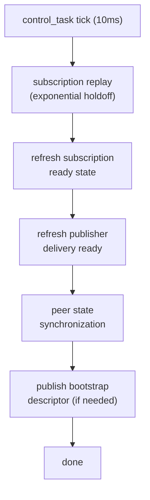

### 6.2 Peer Control Messages

Peer control endpoints are derived from the bound data endpoint:

| Transport | Data Endpoint | Control Endpoint | Route Endpoint |
|-----------|--------------|-----------------|----------------|
| tcp | `tcp://host:9000` | `tcp://host:10000` (port+1000) | `tcp://host:29000` (port+20000) |
| tls | `tls://host:9000` | `tls://host:10000` | `tls://host:29000` |
| ipc | `ipc:///path` | `ipc:///path.zlink-spot-ctrl.{id}` | `ipc:///path.zlink-spot-route.{id}` |
| inproc | `inproc://name` | `inproc://zlink.spot.peer-ctrl.{id}` | `inproc://zlink.spot.peer-route.{id}` |

`peer_route_ingress` (ROUTER) binds to the route endpoint. A remote peer connects `peer_route_tx` (PAIR) to this endpoint to send routed messages directly.

Control message prefixes:
- `__zlink.spot.ctrl.snapshot` — status snapshots
- `__zlink.spot.ctrl.ready_ack` — subscription readiness acks
- `__zlink.spot.bootstrap.ctrl_descriptor` — bootstrap info

## 7. Data Plane Polling Loop

The data plane runs in a separate thread. It polls 7 sockets:

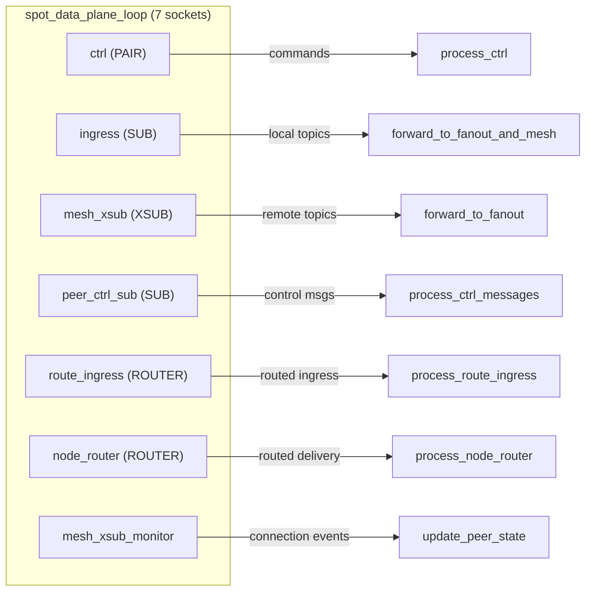

## 8. Unified Handle (spot_handle_t)

```cpp
struct spot_handle_t {
    uint32_t tag;                                // Validation tag
    spot_node_t *node;                           // Parent SpotNode
    spot_pub_t *pub;                             // Publisher (inproc PUB → ingress)
    spot_sub_t *sub;                             // Subscriber (inproc SUB ← fanout)
    zlink_subscribe_handler_fn handler;          // internal-only: SPOT subscribe adapter
    void *handler_userdata;
    spot_node_t::pub_defaults_t pending_pub_defaults;
    spot_node_t::sub_defaults_t pending_sub_defaults;
    service_mode_state_t mode_state;             // recv/callback mode tracking
    std::shared_ptr<void> request_reply_state;   // Per-handle RR state
};
```

The unified handle borrows the SpotNode. Multiple handles can share one node.
Each handle has its own pub/sub pair, mode state, and request-reply state.

## 9. HWM Boundaries

```text
+------------------------------------------------------------------+
|  Spot Handle HWM                                                  |
|  (public facade pub/sub sockets)                                  |
|  ┌──────────────────────────────────────────────────────────────┐ |
|  │  SpotNode Data-Plane HWM                                     │ |
|  │  ┌─────────────────────────┬────────────────────────────┐    │ |
|  │  │  SNDHWM applied to:     │  RCVHWM applied to:        │    │ |
|  │  │  - fanout (PUB)         │  - ingress (SUB)            │    │ |
|  │  │  - mesh_pub (PUB)       │  - mesh_xsub (XSUB)        │    │ |
|  │  │  - node_router (SND)    │  - route_ingress (ROUTER)   │    │ |
|  │  │                         │  - node_router (RCV)        │    │ |
|  │  └─────────────────────────┴────────────────────────────┘    │ |
|  │                                                               │ |
|  │  peer_ctrl is CONTROL PLANE → separate HWM (1024)            │ |
|  └──────────────────────────────────────────────────────────────┘ |
+------------------------------------------------------------------+
```

The internal data-plane HWM is no longer a fixed `1000`. SpotNode runtime
uses the role-bucket values from the context auto-HWM policy.

- `fanout`, `mesh_pub`: default floor `16`
- `ingress`, `mesh_xsub`: default floor `8`
- `node_router`, `route_ingress`: default floor `8`
- `ctrl`, `peer_ctrl_pub`, `peer_ctrl_sub`: separated into the control role
  with default floor `4`

Topic and routed HWM can be configured independently via
`zlink_set_spot_node_option()`:
- `ZLINK_SPOT_NODE_OPT_TOPIC_SEND_HWM` / `ZLINK_SPOT_NODE_OPT_TOPIC_RECV_HWM`
- `ZLINK_SPOT_NODE_OPT_ROUTED_SEND_HWM` / `ZLINK_SPOT_NODE_OPT_ROUTED_RECV_HWM`

## 10. Dispatch Event Threading Model

The public-facing `zlink_spot_dispatch_event_handler()` surface is a
notification-only callback that fans in **three independent internal
event producers** onto one handler. This section documents which
internal thread fires each event, how the registration is enforced, and
the thread-safety boundaries the callback has to respect.

### 10.1 Event producers and their threads

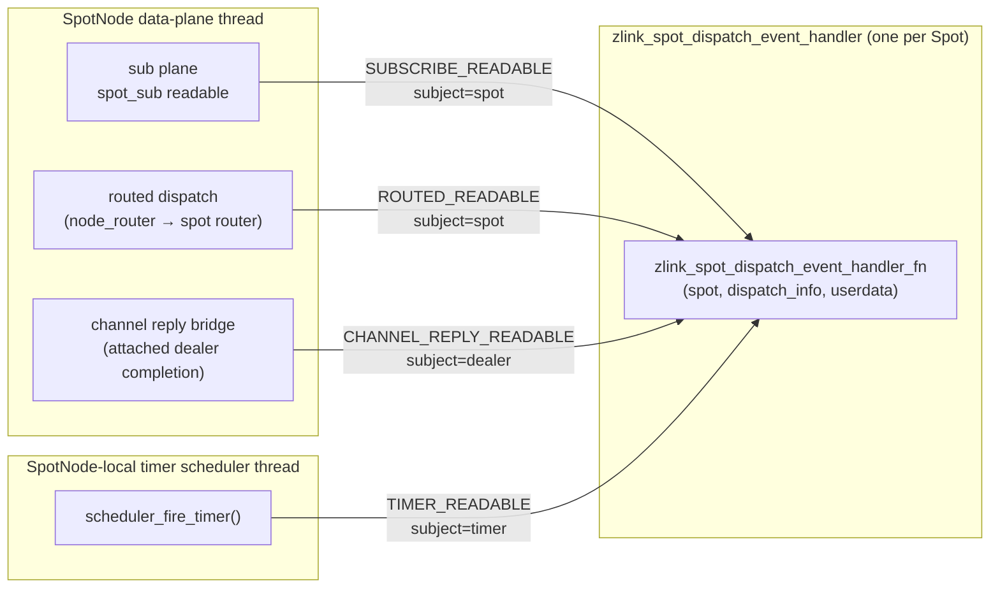

| Event | Source producer | `subject_kind` | Thread that fires the callback |
|-------|----------------|----------------|-------------------------------|
| `SUBSCRIBE_READABLE` | `spot_sub_handler_adapter` — direct handler on `spot_sub_t` | `SUBJECT_SPOT` | SpotNode data-plane polling thread |
| `ROUTED_READABLE` | `queue_spot_message()` — after forwarding a routed delivery into the target Spot-owned routed ingress `ROUTER` | `SUBJECT_SPOT` | SpotNode data-plane polling thread |
| `CHANNEL_REPLY_READABLE` | attached dealer completion bridge — after enqueuing dealer completion into the Spot dealer-source queue | `SUBJECT_CHANNEL_DEALER` | dealer completion thread (data-plane or dedicated completion thread) |
| `TIMER_READABLE` | `scheduler_fire_timer()` — after pushing the fire count and raising the timer signaler, and only when no direct timer handler is attached | `SUBJECT_TIMER` | SpotNode-local timer scheduler thread |

Dispatch priority is fixed as:
`SUBSCRIBE_READABLE` → `ROUTED_READABLE` → `CHANNEL_REPLY_READABLE` → `TIMER_READABLE`.

All four producers reach the callback through one shared entry point,
`zlink_spot_notify_dispatch_info()` → `maybe_dispatch_spot_info()`, which
snapshots the handler pointer and dispatch info under the per-Spot mutex
and then invokes the callback without holding any internal lock:

```cpp
void maybe_dispatch_spot_info (spot_request_reply_state_t *state_,
                               const zlink_spot_dispatch_info_t &info_)
{
    zlink_spot_dispatch_event_handler_fn handler = NULL;
    void *userdata = NULL;
    void *owner = NULL;
    {
        std::lock_guard<std::mutex> lock (state_->mutex);
        handler = state_->dispatch_event_handler;
        userdata = state_->dispatch_event_handler_userdata;
        owner = state_->owner;
    }
    if (handler)
        handler (owner, &info_, userdata);
}
```

The snapshot-then-invoke pattern is deliberate. The handler runs while
no zlink-internal locks are held, so the application is free to call
back into the zlink API (e.g. `zlink_timer_recv()`, `zlink_spot_recv()`,
`zlink_subscribe()`, `zlink_spot_channel_reply_progress_from()`) from
inside the callback — but see §10.4 for why it is still recommended to
hand off to an application worker.

### 10.2 Registration and mutual exclusion

The per-Spot `spot_request_reply_state_t` owns two handler slots on the
routed/dispatch axis:

```cpp
struct spot_request_reply_state_t {
    // ...
    zlink_spot_handler_fn                  request_handler;            // direct routed
    void                                  *request_handler_userdata;
    zlink_spot_dispatch_event_handler_fn   dispatch_event_handler;     // unified notify
    void                                  *dispatch_event_handler_userdata;
};
```

`zlink_spot_handler()` and `zlink_spot_dispatch_event_handler()` both
check `state->request_handler || state->dispatch_event_handler` under
`state->mutex` before writing, and return `ZLINK_HANDLER_BUSY` if either
slot is non-NULL. This is the source of the "mutually exclusive" rule
documented in the user guide.

There is no public function to install a direct subscribe callback;
the `zlink_subscribe_handler_fn` typedef only backs internal SPOT
adapters.

### 10.3 Per-event fire conditions

**`SUBSCRIBE_READABLE`** — fired from `spot_sub_handler_adapter` on the
data-plane thread whenever the `spot_sub_t` direct handler is invoked.
The adapter calls `zlink_spot_notify_dispatch_event()` *before* the
composite user subscribe handler runs; if no user subscribe handler is
installed, the subscribe messages are queued inside the `spot_sub_t`
recv buffer and the notifier is still the wake-up signal for
`zlink_subscribe()` pull consumers.

**`ROUTED_READABLE`** — fired from `queue_spot_message()` once the
routed payload (node rid, spot rid, request_seq, parts) has been
forwarded into the target Spot-owned routed ingress `ROUTER`. The event
is fired *after* that local delivery succeeds, so a worker observing the
notification is guaranteed to see at least one payload on the next
`zlink_spot_recv()`. When `request_handler` is installed instead, the
routed direct callback is invoked in place of the recv path and the
notification is not fired.

**`CHANNEL_REPLY_READABLE`** — fired by the attached dealer completion
bridge once a dealer completion (normal reply, timeout, terminate,
local failure, protocol error) has been finalized and enqueued into the
originating Spot's dealer-source queue. `subject_kind` is
`SUBJECT_CHANNEL_DEALER` and `subject` is the attached dealer handle.
The application drains that queue by calling
`zlink_spot_channel_reply_progress_from(spot, subject)`. Late replies
and double completions are discarded before this bridge event is raised.

**`TIMER_READABLE`** — fired from `scheduler_fire_timer()` only when the
timer has an owning Spot (created via `zlink_spot_timer_new(spot)`) and
**no direct timer handler** is attached. In that branch, the scheduler
first pushes the fire count into `timer->fired_counts`, then raises
`timer->signaler` (eventfd), then calls
`zlink_spot_notify_dispatch_info(owner_spot, TIMER_READABLE,
SUBJECT_TIMER, timer)`. `subject_kind` is `SUBJECT_TIMER` and `subject`
is the timer handle. If a direct `zlink_timer_handler()` is attached to
the same timer, the scheduler runs that handler inline and the dispatch
event is not fired — this is the per-timer precedence rule noted in the
user guide.

### 10.4 End-to-end flow with an application worker

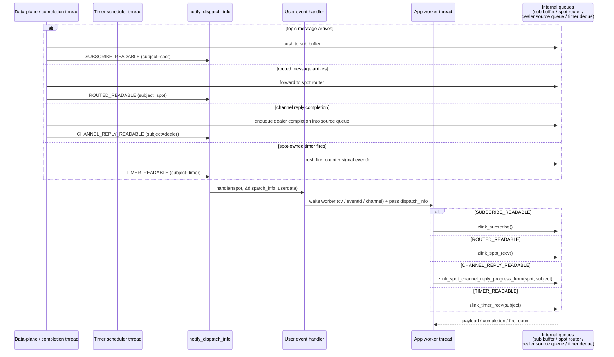

The producers never execute application-domain logic past
`notify_dispatch_info`. All message decoding, topic matching, timer
rescheduling, and dealer completion decoding happen on the internal
threads; the worker thread only touches queues that are already drained
or appended atomically.

### 10.5 Channel reply delivery bridge

The path from attached dealer completion to the Spot dispatch stream is:

```text
network reply
    -> attached DEALER (transport owner, pending request matching)
    -> dealer completion (decode, timeout/error classification)
    -> bridge callback (enqueue into originating Spot dealer-source queue)
    -> CHANNEL_REPLY_READABLE dispatch event (subject = dealer handle)
    -> application worker: zlink_spot_channel_reply_progress_from(spot, dealer)
    -> request completion callback runs
```

Key bridge rules:

- A dealer completion never invokes the user callback directly. It is
  first enqueued into the originating Spot's dealer-source queue and
  surfaced as a dispatch event.
- If the originating Spot is already terminating, the completion is
  discarded quietly or resolved under the usual `ETERM` rules. A dead
  Spot is not reawakened.
- Spot progress (`zlink_spot_request_progress_internal()`) also watches
  attached dealer completion signals and advances them into the bridge
  stage, so bindings do not need a separate per-dealer progress pump.

Each attached dealer owns its own source queue. If several dealers are
ready at the same time, each one raises its own
`CHANNEL_REPLY_READABLE` pending item.

### 10.6 Thread-safety invariants

| Invariant | Enforced by |
|---|---|
| Handler pointer read is race-free | Snapshot under `state->mutex` in `maybe_dispatch_spot_info` |
| Handler is invoked without internal locks held | Snapshot-then-release before invocation |
| Payload is in the queue before notification | Producers call the notifier *after* the queue push (sub buffer / PAIR queue / dealer-source queue / fired_counts + signaler) |
| No missed wake-up | Level-triggered — the worker drains each queue until the matching pull API returns `ZLINK_RECV_NO_DATA`; a redundant notification during drain is harmless |
| Direct handler vs dispatch event | Compile-time separation: `spot_sub_handler_adapter` for subscribe, `request_handler` slot for routed, timer's own handler slot for timers. Registration-time mutex in the routed axis rejects double-install. Per-timer precedence for timers is decided inside `scheduler_fire_timer` |
| Callback may call zlink API | Producers release their internal locks before invoking the notifier |
| Channel reply does not race routed / subscribe delivery in app code | One Spot receives one serialized dispatch callback stream. A single worker-thread handoff pattern needs no extra app lock |
| No late-reply double completion | Completion is finalized in dealer pending state before the bridge emits the dispatch item |

### 10.7 Why this is a single dispatch stream from the app's perspective

With four internal producers but a single handler, the application can
treat the notification as a condition-variable wake and then drive all
four queues from one application thread:

- No user-owned lock is needed between sub / routed / channel-reply /
  timer consumers; they read different underlying queues, so the only
  shared state is application bookkeeping owned by one worker thread.
- The handler itself can stay at `lock_guard + cv.notify +
  capture(dispatch_info)` level; it does not need to touch any zlink API.
- The producer threads never wait for the handler to finish beyond the
  raw function call — they immediately return to their polling loops.
- Channel reply delivery is on the same dispatch stream, so bindings do
  not need a separate progress pump per attached dealer.

This is the core reason the user-facing guide recommends
`zlink_spot_dispatch_event_handler` as the unified consumption pattern
when timer, routed recv, subscribe, and channel reply all live on one
Spot handle.

## 11. Channel Topology Internals

Channel-aware SPOT rides on top of the existing SpotNode data plane. The key
additions are a single SPOT Discovery view for mesh auto-connect, a channel
dealer map for cross-channel calls, and an external publish ingress path.

```text
+------------------------------------------------------------------+
|                          SpotNode Runtime                        |
|------------------------------------------------------------------|
| SPOT discovery view (one active view per node)                   |
|  channel_name, channel_type = SPOT                               |
|  -> determines peer mesh auto-connect scope                      |
|------------------------------------------------------------------|
| channel dealer map                                               |
|  channel_name -> { DEALER, source: auto | manual }               |
|  one DEALER per channel_name (auto + manual combined)            |
|------------------------------------------------------------------|
| pub ingress (one per node)                                       |
|  external PUB -> hidden ingress receiver -> topic path           |
|------------------------------------------------------------------|
| routed data plane                                                |
|  peer ROUTER mesh (between SpotNodes in same channel)            |
|  channel DEALER -> ROUTER(server) path (channel calls)           |
|------------------------------------------------------------------|
| service monitor                                                  |
|  peer state, weight, topology change events                      |
+------------------------------------------------------------------+
```

### 11.1 SPOT Discovery view

- A `SpotNode` accepts at most one Discovery with a
  `ZLINK_CHANNEL_TYPE_SPOT` view. This view determines the mesh
  auto-connect scope.
- The peer set supplied by this view includes only other `SpotNode` peers
  in the same `channel_name`. Generic `ROUTER`, `PUB`, and `SUB` providers
  in the same channel are not mesh auto-connect targets.
- A second SPOT channel Discovery attach is rejected with `EBUSY`.
- Destroying the attached Discovery removes the automatic peer set it
  supplied.
- A `SpotNode` without Discovery can only wire its mesh manually via
  `connect_peer()` / `disconnect_peer()`. Discovery attach and manual peer
  connect cannot be mixed on the same node.

### 11.2 Channel dealer map

- Channel calls (`zlink_spot_send_channel()` /
  `zlink_spot_request_channel()`) look up the attached `DEALER` by
  `channel_name` in this map.
- The automatic path (`attach_channel_dealer`) registers a `DEALER`
  together with a Discovery that has a `ZLINK_CHANNEL_TYPE_SOCKET` view.
  Discovery manages the peer set.
- The manual path (`attach_channel_dealer_manual`) registers a
  caller-connected `DEALER` under the given `channel_name`.
- At most one `DEALER` may be registered per `channel_name`, counting
  both automatic and manual attach together. Duplicates are rejected
  with `EBUSY`.
- Attached dealers are dedicated to the `SpotNode`. The caller keeps
  ownership, but the socket must not be reused as a generic client
  elsewhere.
- When no `DEALER` is found for a `channel_name`, channel calls fail
  with `ENOENT`.

### 11.3 Pub ingress

- `zlink_spot_node_attach_pub_ingress()` connects an external `PUB` to
  the `SpotNode` input path.
- On attach, the library creates a node-private hidden ingress receiver.
  This hidden receiver is not exposed through any public API.
- Topics published on the external `PUB` flow through the hidden receiver
  into the local `SpotNode` topic path. This path is not the same as the
  peer mesh pub/sub connection; it is a one-way input path for an external
  publisher to inject topics into the local runtime.
- Ingress topics reach the local `Spot` receive path and, when mesh peers
  are present, may also be forwarded to same-channel peers.
- Only one ingress `PUB` may be attached per node. A second attach is
  rejected with `EBUSY`.
- Attach does not take socket ownership. Destroy responsibility stays with
  the caller.

### 11.4 Channel call routing

- Channel calls always go through attached `DEALER` paths. The
  `SpotNode` routed topology is not reused for channel calls.
- The model is `DEALER(client) -> ROUTER(server)`. A channel call means
  "send to one of this channel's handlers", not "target a specific
  server".
- A channel request's reply returns through the same `DEALER` path used
  to submit it. The reply path does not re-resolve the `channel_name`.
- When a `DEALER` exists but has no reachable peer, the result is
  normalized to `ENOTCONN`.

### 11.5 Service monitor

- `SpotNode` observability uses `zlink_service_monitor_open()` /
  `zlink_service_monitor_recv()` and the snapshot/query APIs.
- Peer state, weight changes, and topology events are surfaced
  through the monitor.
- Monitor events are never multiplexed into the Spot dispatch readable
  plane.

### 11.6 Active set maintenance

- Discovery churn that disconnects a mesh peer removes it from the active
  set immediately.
- When a peer is restored, the runtime replays the current subscription
  filter set before the peer re-enters the active set.
- For channel dealers, Discovery-managed peer set changes automatically
  update the dealer's effective candidates.
- Manual attachments stay active as long as the socket is healthy.

### 11.7 Weight propagation

When `zlink_set_spot_node_option(..., ZLINK_SPOT_NODE_OPT_WEIGHT, ...)`
switches a SpotNode weight between positive values and `0`, the change is
advertised to other SpotNode peers through the SpotNode peer control path
(`peer_ctrl_pub` / `peer_ctrl_sub`) as a best-effort runtime signal.

- Each peer updates the matching entry inside its SpotNode peer cache
  (see §2.2). That cache is also the source for the `weight`
  field returned by `zlink_spot_node_peers_snapshot()` and
  `zlink_spot_node_peers_query()`.
- The same cache drives service-aware ROUTER candidate selection. A peer
  marked with weight `0` is excluded from candidates, and when every
  candidate is `0` the submit path normalizes the result to
  `ZLINK_SUBMIT_NOT_ADMITTED`. Direct SPOT requests targeting a
  weight-`0` SpotNode return the same result.
- The change is also surfaced via the service monitor event
  `ZLINK_SERVICE_MONITOR_EVENT_PEER_WEIGHT_CHANGED`. The corresponding
  raw socket transition is exposed separately through the socket monitor
  event `ZLINK_EVENT_PEER_WEIGHT_CHANGED`.
- After a peer reconnects, the SpotNode re-advertises its current
  weight once so that stale caches do not cause incorrect
  candidate selection.

## 12. Peer RID Disconnect

SpotNode keeps a `node_rid -> endpoint set` index built from discovery
providers. `zlink_spot_node_disconnect_peer_rid()` looks up the endpoint set
for the target node rid, then runs the same control path as endpoint-based
disconnect for each endpoint.
