[English](spot-internals.md) | [한국어](spot-internals.ko.md)

# SPOT / SpotNode Internal Architecture

## 1. Component Overview

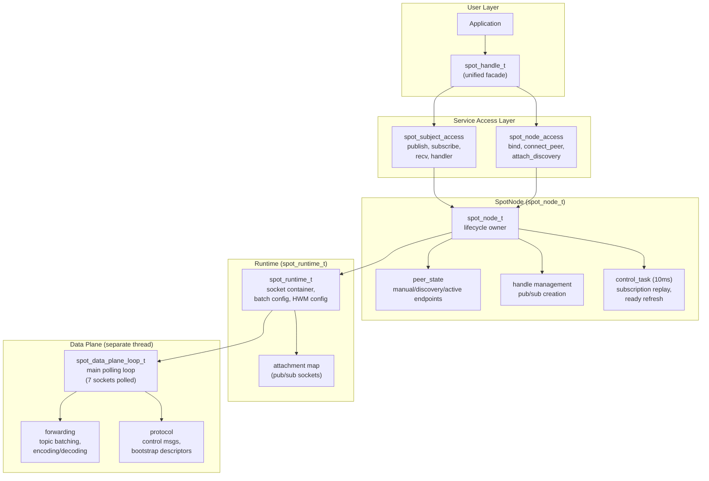

## 2. Internal Socket Topology

SpotNode creates 10 internal sockets connected via inproc endpoints,
plus a monitor socket for connection state tracking (11 total).

### 2.1 Socket Inventory

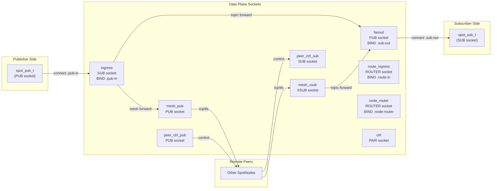

### 2.2 Socket Details

| Socket | Type | Endpoint | Bind/Connect | HWM | Role |
|--------|------|----------|-------------|-----|------|
| `ingress` | SUB | `.pub-in` | BIND | `node_sub_rcvhwm` | Receives all local publishes |
| `fanout` | PUB | `.sub-out` | BIND | `node_pub_sndhwm` | Distributes to local subscribers |
| `mesh_pub` | PUB | (bound endpoint) | BIND | `node_pub_sndhwm` | Sends topics to remote peers |
| `mesh_xsub` | XSUB | — | CONNECT to peers | `node_sub_rcvhwm` | Receives topics from remote peers |
| `route_ingress` | ROUTER | `.route-in` | BIND | `routed_recv_hwm` | Receives routed messages from apps |
| `node_router` | ROUTER | `.node-router` | BIND | `routed_send/recv_hwm` | Delivers routed messages to apps |
| `ctrl` | PAIR | `.ctrl` | CONNECT | — | Control plane ↔ data plane commands |
| `peer_ctrl_pub` | PUB | (derived from bound) | BIND | 1024 | Sends control msgs to peers |
| `peer_ctrl_sub` | SUB | — | CONNECT to peers | 1024 | Receives control msgs from peers |
| `mesh_xsub_monitor` | Monitor | — | — | — | Tracks CONNECTION_READY/DISCONNECTED |

All inproc endpoints follow the pattern: `inproc://zlink.spot.{node_id}.{suffix}`

### 2.3 Common Socket Settings

All data plane sockets share:
- `LINGER = 0`
- `SNDTIMEO = -1` (blocking)
- `ingress`: `SUBSCRIBE = ""` (receive all topics)
- `fanout`: `XPUB_NODROP = 1` (do not drop for slow subscribers; applied to internal PUB socket)
- `peer_ctrl_sub`: `SUBSCRIBE = "__zlink.spot.ctrl."` (control prefix only)

## 3. Pub/Sub Attachment

User-facing `spot_pub_t` and `spot_sub_t` connect to the data plane
via separate attachment sockets.

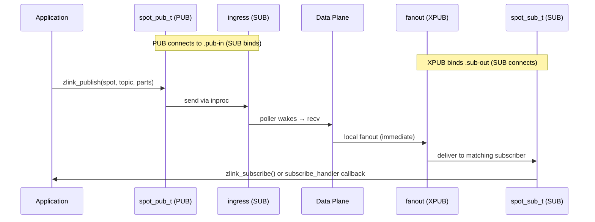

### Attachment Creation

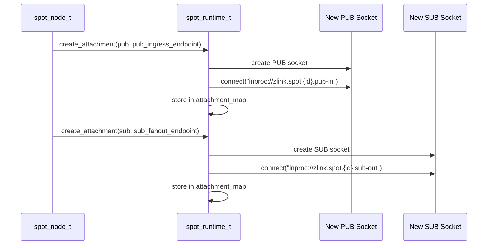

## 4. Topic Message Flow (Detailed)

### 4.1 Local Publish → Local Subscribe

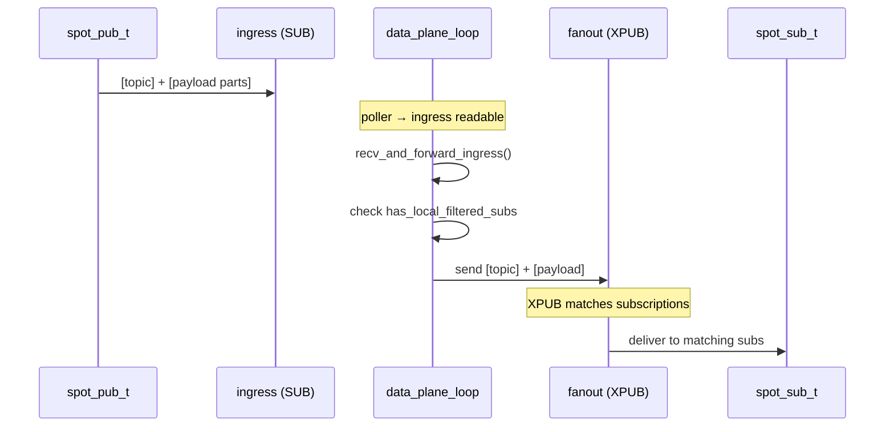

### 4.2 Local Publish → Remote Peers

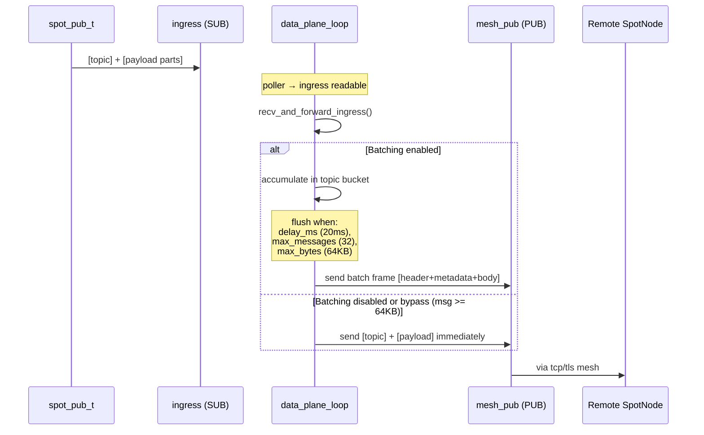

### 4.3 Remote Receive → Local Subscribe

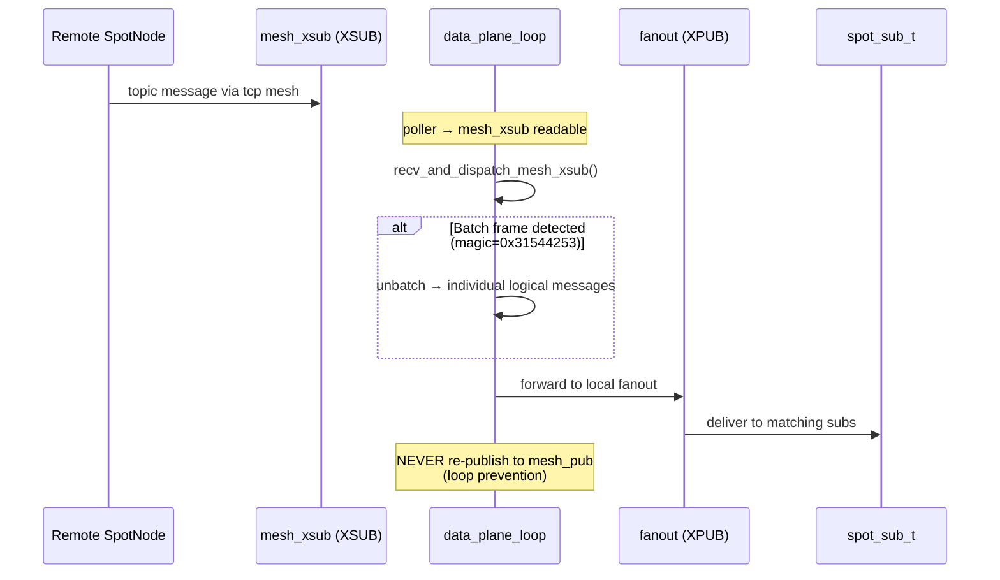

## 5. Routed Message Flow (Detailed)

### 5.1 Local spot → Local spot (same node)

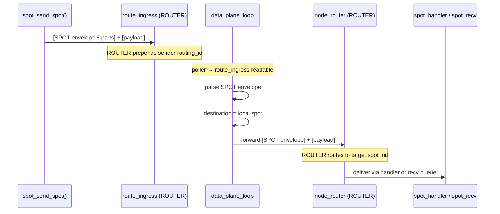

### 5.2 Local spot → Remote spot (cross-node)


### 5.3 spot → router / router → spot

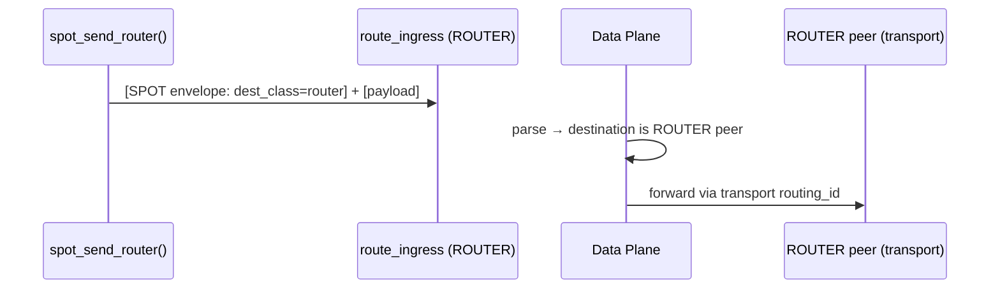

## 6. Control Plane

### 6.1 Control Task Cycle (10ms)

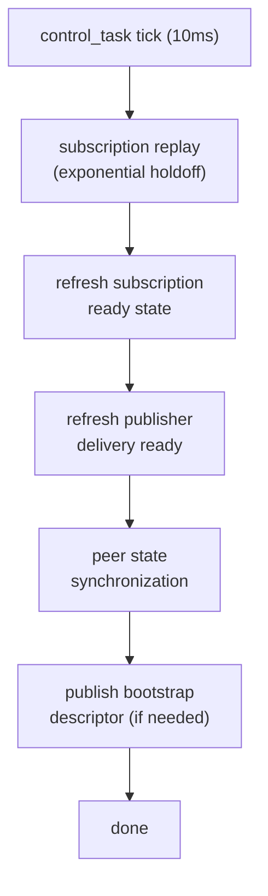

### 6.2 Peer Control Messages

Peer control endpoints are derived from the bound data endpoint:

| Transport | Data Endpoint | Control Endpoint |
|-----------|--------------|-----------------|
| tcp | `tcp://host:9000` | `tcp://host:10000` (port+1000) |
| tls | `tls://host:9000` | `tls://host:10000` |
| ipc | `ipc:///path` | `ipc:///path.zlink-spot-ctrl.{id}` |
| inproc | `inproc://name` | `inproc://zlink.spot.peer-ctrl.{id}` |

Control message prefixes:
- `__zlink.spot.ctrl.snapshot` — status snapshots
- `__zlink.spot.ctrl.ready_ack` — subscription readiness acks
- `__zlink.spot.bootstrap.ctrl_descriptor` — bootstrap info

## 7. Data Plane Polling Loop

The data plane runs in a separate thread. It polls 7 sockets:

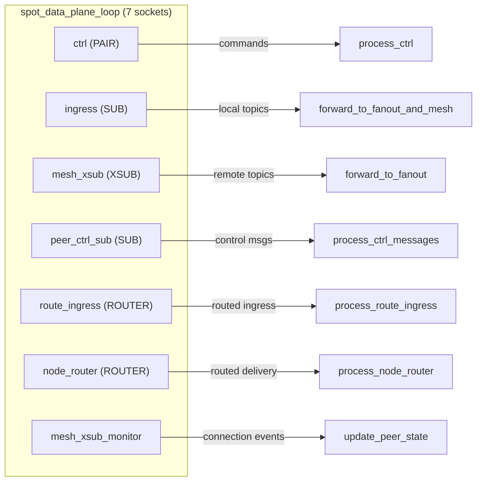

## 8. Unified Handle (spot_handle_t)

```cpp
struct spot_handle_t {
    uint32_t tag;                                // Validation tag
    spot_node_t *node;                           // Parent SpotNode
    spot_pub_t *pub;                             // Publisher (inproc PUB → ingress)
    spot_sub_t *sub;                             // Subscriber (inproc SUB ← fanout)
    zlink_subscribe_handler_fn handler;          // Topic callback
    void *handler_userdata;
    spot_node_t::pub_defaults_t pending_pub_defaults;
    spot_node_t::sub_defaults_t pending_sub_defaults;
    service_mode_state_t mode_state;             // recv/callback mode tracking
    std::shared_ptr<void> request_reply_state;   // Per-handle RR state
};
```

The unified handle borrows the SpotNode. Multiple handles can share one node.
Each handle has its own pub/sub pair, mode state, and request-reply state.

## 9. HWM Boundaries

```text
+------------------------------------------------------------------+
|  Spot Handle HWM                                                  |
|  (public facade pub/sub sockets)                                  |
|  ┌──────────────────────────────────────────────────────────────┐ |
|  │  SpotNode Data-Plane HWM                                     │ |
|  │  ┌─────────────────────────┬────────────────────────────┐    │ |
|  │  │  SNDHWM applied to:     │  RCVHWM applied to:        │    │ |
|  │  │  - fanout (PUB)         │  - ingress (SUB)            │    │ |
|  │  │  - mesh_pub (PUB)       │  - mesh_xsub (XSUB)        │    │ |
|  │  │  - node_router (SND)    │  - route_ingress (ROUTER)   │    │ |
|  │  │                         │  - node_router (RCV)        │    │ |
|  │  └─────────────────────────┴────────────────────────────┘    │ |
|  │                                                               │ |
|  │  peer_ctrl is CONTROL PLANE → separate HWM (1024)            │ |
|  └──────────────────────────────────────────────────────────────┘ |
+------------------------------------------------------------------+
```

Default internal data-plane HWM: `1000`

Topic and routed HWM can be configured independently via
`zlink_set_spot_node_option()`:
- `ZLINK_SPOT_NODE_OPT_TOPIC_SNDHWM` / `ZLINK_SPOT_NODE_OPT_TOPIC_RCVHWM`
- `ZLINK_SPOT_NODE_OPT_ROUTED_SNDHWM` / `ZLINK_SPOT_NODE_OPT_ROUTED_RCVHWM`
