[English](spot-internals.md) | [한국어](spot-internals.ko.md)

# SPOT / SpotNode Internal Architecture

## 1. Component Overview

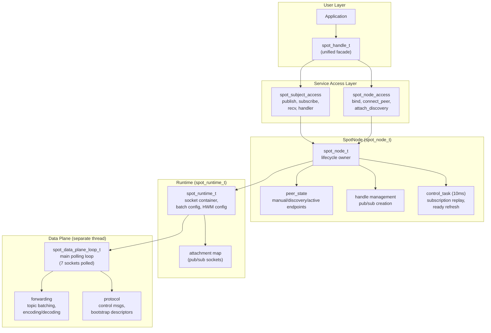

## 2. Internal Socket Topology

SpotNode creates 10 internal sockets connected via inproc endpoints,
plus a monitor socket for connection state tracking (11 total).

### 2.1 Socket Inventory

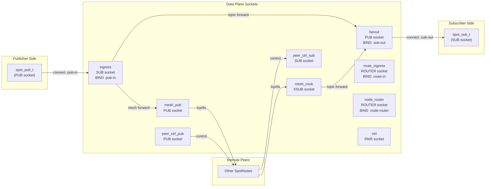

### 2.2 Socket Details

| Socket | Type | Endpoint | Bind/Connect | HWM | Role |
|--------|------|----------|-------------|-----|------|
| `ingress` | SUB | `.pub-in` | BIND | `node_sub_rcvhwm` | Receives all local publishes |
| `fanout` | PUB | `.sub-out` | BIND | `node_pub_sndhwm` | Distributes to local subscribers |
| `mesh_pub` | PUB | (bound endpoint) | BIND | `node_pub_sndhwm` | Sends topics to remote peers |
| `mesh_xsub` | XSUB | — | CONNECT to peers | `node_sub_rcvhwm` | Receives topics from remote peers |
| `route_ingress` | ROUTER | `.route-in` | BIND | `routed_recv_hwm` | Receives routed messages from apps |
| `node_router` | ROUTER | `.node-router` | BIND | `routed_send/recv_hwm` | Delivers routed messages to apps |
| `ctrl` | PAIR | `.ctrl` | CONNECT | — | Control plane ↔ data plane commands |
| `peer_ctrl_pub` | PUB | (derived from bound) | BIND | 1024 | Sends control msgs to peers |
| `peer_ctrl_sub` | SUB | — | CONNECT to peers | 1024 | Receives control msgs from peers |
| `mesh_xsub_monitor` | Monitor | — | — | — | Tracks CONNECTION_READY/DISCONNECTED |

All inproc endpoints follow the pattern: `inproc://zlink.spot.{node_id}.{suffix}`

### 2.3 Common Socket Settings

All data plane sockets share:
- `LINGER = 0`
- `SNDTIMEO = -1` (blocking)
- `ingress`: `SUBSCRIBE = ""` (receive all topics)
- `fanout`: `XPUB_NODROP = 1` (do not drop for slow subscribers; applied to internal PUB socket)
- `peer_ctrl_sub`: `SUBSCRIBE = "__zlink.spot.ctrl."` (control prefix only)

## 3. Pub/Sub Attachment

User-facing `spot_pub_t` and `spot_sub_t` connect to the data plane
via separate attachment sockets.

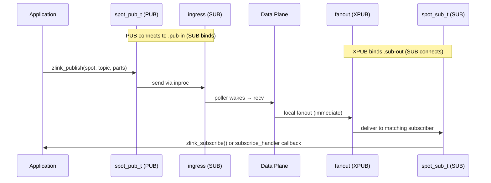

### Attachment Creation

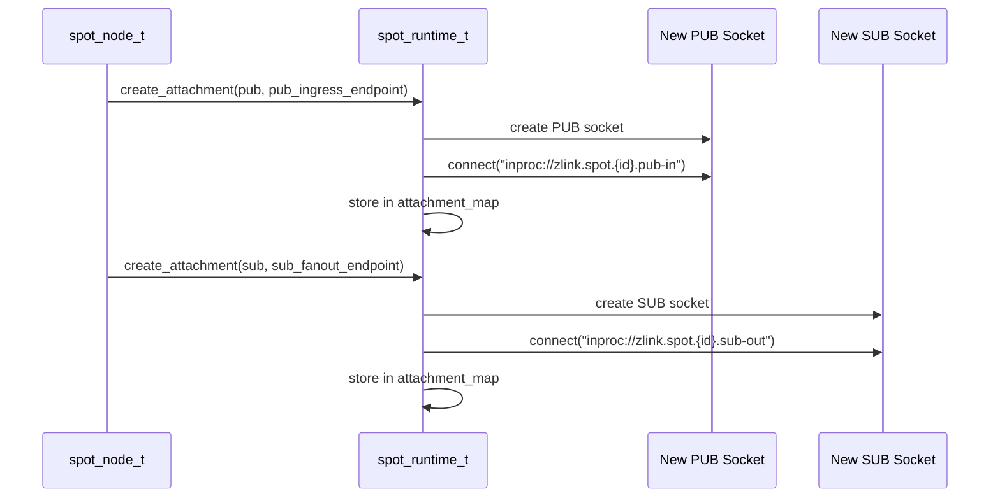

## 4. Topic Message Flow (Detailed)

### 4.1 Local Publish → Local Subscribe

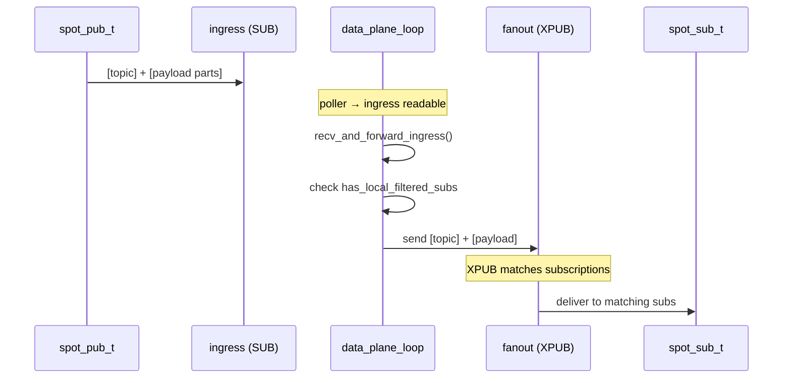

### 4.2 Local Publish → Remote Peers

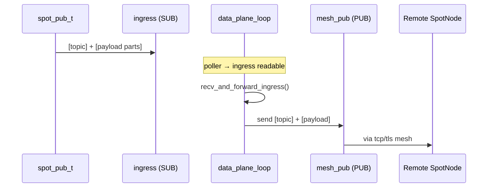

### 4.3 Remote Receive → Local Subscribe

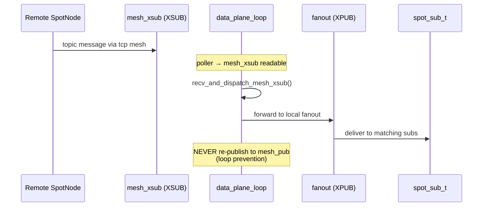

## 5. Routed Message Flow (Detailed)

### 5.1 Local spot → Local spot (same node)

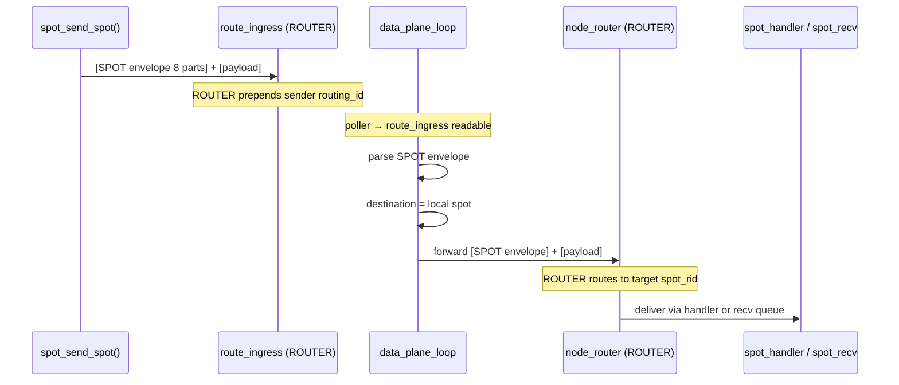

### 5.2 Local spot → Remote spot (cross-node)


### 5.3 spot → router / router → spot

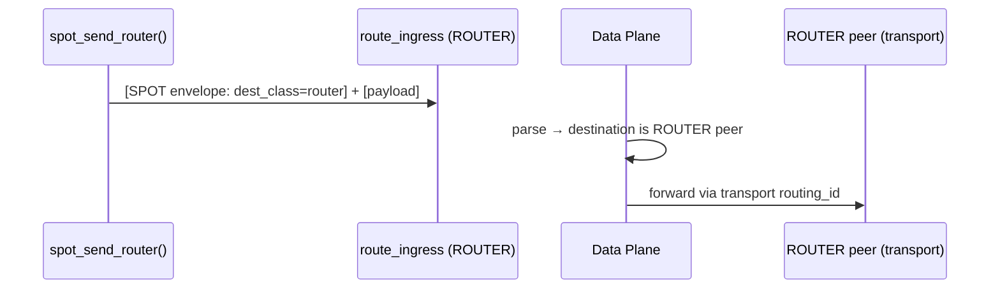

## 6. Control Plane

### 6.1 Control Task Cycle (10ms)

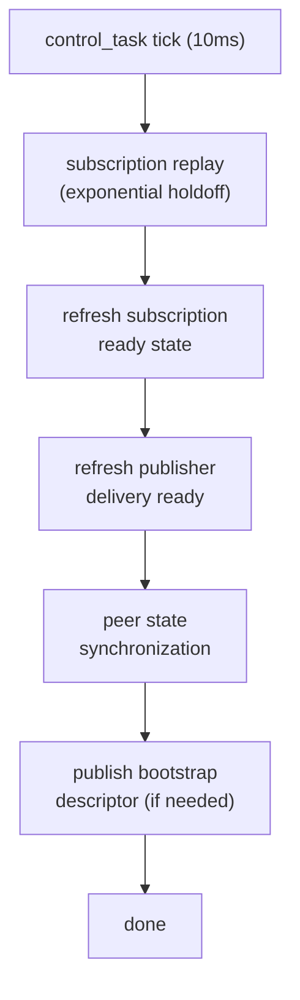

### 6.2 Peer Control Messages

Peer control endpoints are derived from the bound data endpoint:

| Transport | Data Endpoint | Control Endpoint |
|-----------|--------------|-----------------|
| tcp | `tcp://host:9000` | `tcp://host:10000` (port+1000) |
| tls | `tls://host:9000` | `tls://host:10000` |
| ipc | `ipc:///path` | `ipc:///path.zlink-spot-ctrl.{id}` |
| inproc | `inproc://name` | `inproc://zlink.spot.peer-ctrl.{id}` |

Control message prefixes:
- `__zlink.spot.ctrl.snapshot` — status snapshots
- `__zlink.spot.ctrl.ready_ack` — subscription readiness acks
- `__zlink.spot.bootstrap.ctrl_descriptor` — bootstrap info

## 7. Data Plane Polling Loop

The data plane runs in a separate thread. It polls 7 sockets:

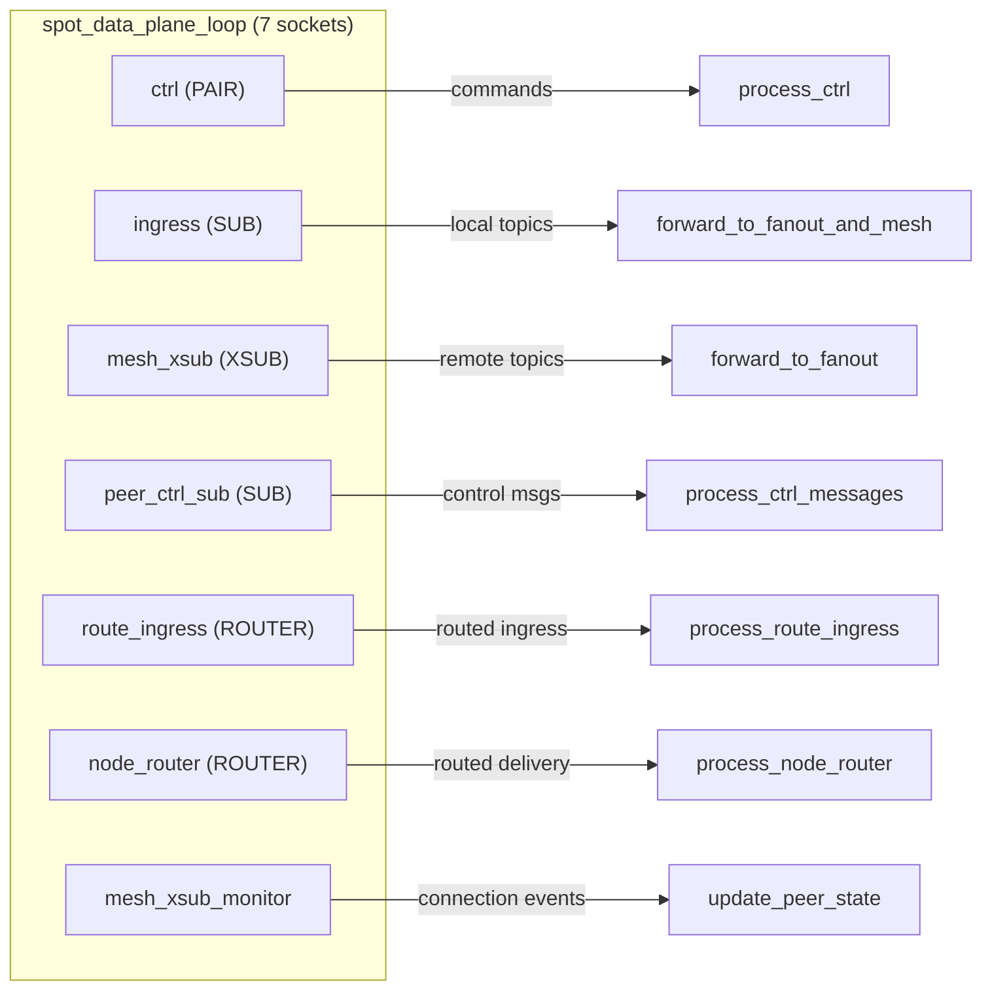

## 8. Unified Handle (spot_handle_t)

```cpp
struct spot_handle_t {
    uint32_t tag;                                // Validation tag
    spot_node_t *node;                           // Parent SpotNode
    spot_pub_t *pub;                             // Publisher (inproc PUB → ingress)
    spot_sub_t *sub;                             // Subscriber (inproc SUB ← fanout)
    zlink_subscribe_handler_fn handler;          // Topic callback
    void *handler_userdata;
    spot_node_t::pub_defaults_t pending_pub_defaults;
    spot_node_t::sub_defaults_t pending_sub_defaults;
    service_mode_state_t mode_state;             // recv/callback mode tracking
    std::shared_ptr<void> request_reply_state;   // Per-handle RR state
};
```

The unified handle borrows the SpotNode. Multiple handles can share one node.
Each handle has its own pub/sub pair, mode state, and request-reply state.

## 9. HWM Boundaries

```text
+------------------------------------------------------------------+
|  Spot Handle HWM                                                  |
|  (public facade pub/sub sockets)                                  |
|  ┌──────────────────────────────────────────────────────────────┐ |
|  │  SpotNode Data-Plane HWM                                     │ |
|  │  ┌─────────────────────────┬────────────────────────────┐    │ |
|  │  │  SNDHWM applied to:     │  RCVHWM applied to:        │    │ |
|  │  │  - fanout (PUB)         │  - ingress (SUB)            │    │ |
|  │  │  - mesh_pub (PUB)       │  - mesh_xsub (XSUB)        │    │ |
|  │  │  - node_router (SND)    │  - route_ingress (ROUTER)   │    │ |
|  │  │                         │  - node_router (RCV)        │    │ |
|  │  └─────────────────────────┴────────────────────────────┘    │ |
|  │                                                               │ |
|  │  peer_ctrl is CONTROL PLANE → separate HWM (1024)            │ |
|  └──────────────────────────────────────────────────────────────┘ |
+------------------------------------------------------------------+
```

Default internal data-plane HWM: `1000`

Topic and routed HWM can be configured independently via
`zlink_set_spot_node_option()`:
- `ZLINK_SPOT_NODE_OPT_TOPIC_SNDHWM` / `ZLINK_SPOT_NODE_OPT_TOPIC_RCVHWM`
- `ZLINK_SPOT_NODE_OPT_ROUTED_SNDHWM` / `ZLINK_SPOT_NODE_OPT_ROUTED_RCVHWM`

## 10. Dispatch Event Threading Model

The public-facing `zlink_spot_dispatch_event_handler()` surface is a
notification-only callback that fans in **three independent internal
event producers** onto one handler. This section documents which
internal thread fires each event, how the registration is enforced, and
the thread-safety boundaries the callback has to respect.

### 10.1 Event producers and their threads

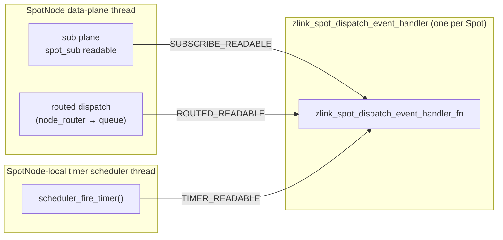

| Event | Source producer | Thread that fires the callback |
|-------|----------------|-------------------------------|
| `ZLINK_SPOT_DISPATCH_EVENT_SUBSCRIBE_READABLE` | `spot_sub_handler_adapter` in `service_handler_spot_api.cpp` — installed as the direct handler of the `spot_sub_t` | SpotNode data-plane polling thread (see §7 *Data Plane Polling Loop*) |
| `ZLINK_SPOT_DISPATCH_EVENT_ROUTED_READABLE` | `queue_spot_message()` in `service_spot_request_reply_api.cpp` — invoked after enqueuing a routed delivery into the internal PAIR queue | SpotNode data-plane polling thread (the same thread that parsed the routed envelope from `node_router` / mesh ingress) |
| `ZLINK_SPOT_DISPATCH_EVENT_TIMER_READABLE` | `scheduler_fire_timer()` in `timer_scheduler_backend.cpp` — invoked *after* pushing the fire-count into the timer's deque and raising its signaler, and *only* when no direct timer handler is attached | SpotNode-local timer scheduler thread (separate from the data-plane thread) |

All three producers reach the callback through one shared entry point,
`zlink_spot_notify_dispatch_event()` → `maybe_dispatch_spot_event()`, which
reads the handler pointer under the per-Spot mutex and then invokes it
without holding any internal lock:

```cpp
void maybe_dispatch_spot_event (spot_request_reply_state_t *state_,
                                zlink_spot_dispatch_event_t event_)
{
    zlink_spot_dispatch_event_handler_fn handler = NULL;
    void *userdata = NULL;
    void *owner = NULL;
    {
        std::lock_guard<std::mutex> lock (state_->mutex);
        handler = state_->dispatch_event_handler;
        userdata = state_->dispatch_event_handler_userdata;
        owner = state_->owner;
    }
    if (handler)
        handler (owner, event_, userdata);
}
```

The snapshot-then-invoke pattern is deliberate. The handler runs while
no zlink-internal locks are held, so the application is free to call
back into the zlink API (e.g. `zlink_timer_recv()`, `zlink_spot_recv()`,
`zlink_subscribe()`) from inside the callback — but see §10.4 for why it
is still recommended to hand off to an application worker.

### 10.2 Registration and mutual exclusion

The per-Spot `spot_request_reply_state_t` owns two handler slots on the
routed/dispatch axis:

```cpp
struct spot_request_reply_state_t {
    // ...
    zlink_spot_handler_fn                  request_handler;            // direct routed
    void                                  *request_handler_userdata;
    zlink_spot_dispatch_event_handler_fn   dispatch_event_handler;     // unified notify
    void                                  *dispatch_event_handler_userdata;
};
```

`zlink_spot_handler()` and `zlink_spot_dispatch_event_handler()` both
check `state->request_handler || state->dispatch_event_handler` under
`state->mutex` before writing, and return `ZLINK_HANDLER_BUSY` if either
slot is non-NULL. This is the source of the "mutually exclusive" rule
documented in the user guide.

`zlink_subscribe_handler()` is on a different axis — it installs a
direct subscribe callback on the underlying `spot_sub_t` and is not
blocked by `dispatch_event_handler`. Mixing the two is technically
allowed but defeats the unified-worker benefit.

### 10.3 Per-event fire conditions

**`SUBSCRIBE_READABLE`** — fired from `spot_sub_handler_adapter` on the
data-plane thread whenever the `spot_sub_t` direct handler is invoked.
The adapter calls `zlink_spot_notify_dispatch_event()` *before* the
composite user subscribe handler runs; if no user subscribe handler is
installed, the subscribe messages are queued inside the `spot_sub_t`
recv buffer and the notifier is still the wake-up signal for
`zlink_subscribe()` pull consumers.

**`ROUTED_READABLE`** — fired from `queue_spot_message()` once the
routed payload (node rid, spot rid, request_seq, parts) has been
enqueued onto the per-Spot internal PAIR queue (`inproc://zlink.spot.
routed.recv.*`). The event is fired *after* the queue write succeeds,
so a worker observing the notification is guaranteed to see at least
one payload on the next `zlink_spot_recv()`. When `request_handler` is
installed instead, the routed direct callback is invoked in place of
the queue write and the notification is not fired.

**`TIMER_READABLE`** — fired from `scheduler_fire_timer()` only when the
timer has an owning Spot (created via `zlink_spot_timer_new(spot)`) and
**no direct timer handler** is attached. In that branch, the scheduler
first pushes the fire count into `timer->fired_counts`, then raises
`timer->signaler` (eventfd), then calls
`zlink_spot_notify_dispatch_event(owner_spot, TIMER_READABLE)`. If a
direct `zlink_timer_handler()` is attached to the same timer, the
scheduler runs that handler inline and the dispatch event is not fired
— this is the per-timer precedence rule noted in the user guide.

### 10.4 End-to-end flow with an application worker

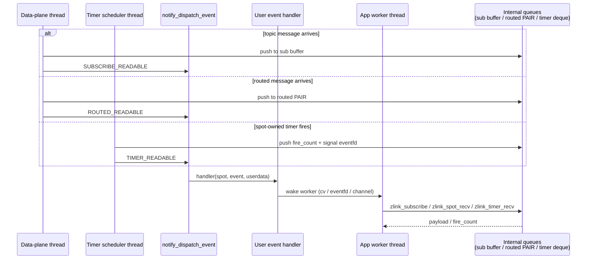

The producers never execute application-domain logic past
`notify_dispatch_event`. All message decoding, topic matching, and
timer rescheduling happen on the internal threads; the worker thread
only touches queues that are already drained or appended atomically
(via `internal_pair_queue_t` for routed, `spot_sub_t` recv buffer for
topic, and the timer's `fired_counts` deque guarded by `timer->mutex`).

### 10.5 Thread-safety invariants

| Invariant | Enforced by |
|---|---|
| Handler pointer read is race-free | Snapshot under `state->mutex` in `maybe_dispatch_spot_event` |
| Handler is invoked without internal locks held | Snapshot-then-release before invocation |
| Payload is in the queue before notification | Producers call the notifier *after* the queue push (sub buffer / PAIR queue / fired_counts + signaler) |
| No missed wake-up | Level-triggered — the worker drains each queue until the matching pull API returns `ZLINK_RECV_NO_DATA`; a redundant notification during drain is harmless |
| Direct handler vs dispatch event | Compile-time separation: `spot_sub_handler_adapter` for subscribe, `request_handler` slot for routed, timer's own handler slot for timers. Registration-time mutex in the routed axis rejects double-install. Per-timer precedence for timers is decided inside `scheduler_fire_timer` |
| Callback may call zlink API | Producers release their internal locks before invoking the notifier |

### 10.6 Why this is a single-writer design from the app's perspective

With three internal producers but a single handler, the application can
treat the notification as a condition-variable wake and then drive all
three queues from one application thread:

- No user-owned lock is needed between sub / routed / timer consumers;
  they read *different* underlying queues, so the only shared state is
  application bookkeeping that the single worker thread owns outright.
- The handler itself can be `lock_guard + cv.notify + bitmask |=`; it
  does not need to touch any zlink API.
- The producer threads never wait for the handler to finish beyond the
  raw function call — they immediately return to their polling loops,
  so slow consumer threads cannot back-pressure the SpotNode mesh or
  the timer scheduler past the configured HWMs.

This is the core reason the user-facing guide recommends
`zlink_spot_dispatch_event_handler` as the unified consumption pattern
when timer, routed recv, and subscribe all live on one Spot handle.
