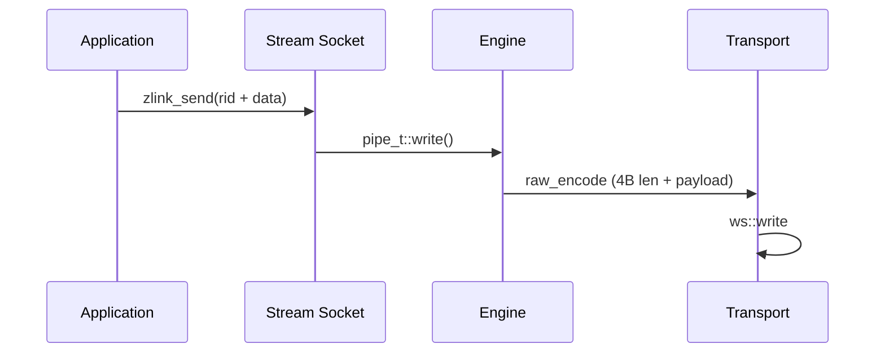

[English](stream-socket.md) | [한국어](stream-socket.ko.md)

# STREAM 소켓 WS/WSS 최적화

## 1. 개요

STREAM 소켓은 ZMP를 사용하지 않는 외부 클라이언트(웹 브라우저, 게임 클라이언트 등)와의 RAW 통신을 지원한다. tcp, tls, ws, wss transport를 지원하며, 특히 WS/WSS 경로의 성능 최적화에 집중한다.

## 2. 아키텍처

### 2.1 컴포넌트 구성

| 컴포넌트 | 파일 | 역할 |
|----------|------|------|
| stream_t | src/sockets/stream.cpp | STREAM 소켓 로직 |
| raw_encoder_t | src/protocol/raw_encoder.cpp | Length-Prefix 인코딩 |
| raw_decoder_t | src/protocol/raw_decoder.cpp | Length-Prefix 디코딩 |
| asio_raw_engine_t | src/engine/asio/asio_raw_engine.cpp | RAW I/O 엔진 |
| ws_transport_t | src/transports/ws/ | WebSocket 전송 |
| wss_transport_t | src/transports/ws/ | WebSocket + TLS |

### 2.2 데이터 흐름



## 3. WS/WSS 성능 특성

### 3.1 Read Path
- 데이터는 Beast `flat_buffer` 에서 출력 `msg_t` 로 직접 이동한다
  (중간 staging buffer 없이 단일 copy).

### 3.2 Write Path
- `msg_t` payload 를 Beast write 버퍼로 직접 전달한다 (중간 copy 없음).

### 3.3 Beast Write Buffer
- 64KB write 버퍼. 여러 소형 메시지가 하나의 Beast write 로 배치되도록
  선택된 크기다.

### 3.4 프레임 분할
- `auto_fragment(false)` — 논리 메시지 하나가 하나의 WebSocket 프레임에
  대응한다.

## 4. 측정 처리량

표준 벤치마크 머신의 단일 socket 대표 처리량:

| Transport | Throughput |
|-----------|------------|
| TCP       | 1493 MB/s  |
| WS        |  696 MB/s  |
| WSS 1KB   |  382 MB/s  |

WS 프레이밍 선택의 이득은 대용량 메시지에서 가장 크다. 64KB 이상
payload 에서는 WS 가 TCP 라인 레이트에 근접하고, WSS 비용은 TLS 암호화
오버헤드가 지배한다.

## 5. 설계 트레이드오프

- Speculative write 미지원 (WebSocket 프레임 기반)
- Gather write는 WS/WSS에서 지원 (Beast가 내부 버퍼링)
- TLS/WSS는 암호화 오버헤드 존재

## 6. Packet Handler 수신 모드

STREAM 소켓은 상호 배타적인 세 가지 수신 모드를 가진다. 소켓 하나당 하나만
활성화할 수 있으며, 같은 소켓에 두 번째 활성화를 시도하면 `EBUSY`로
실패한다.

| 모드 | 활성화 방식 | 전달 형태 |
|------|-------------|-----------|
| Raw recv | 기본 | `zlink_recv()`가 read 단위로 raw bytes 반환 |
| Raw callback | `zlink_recv_handler()` | `zlink_recv_handler_fn` 이 raw bytes 를 받는다 |
| Packet callback | `zlink_stream_packet_handler()` | `zlink_stream_packet_handler_fn` 이 header / body 로 이미 분리된 `zlink_msg_t` 를 받는다 |

Packet handler 모드는 raw STREAM byte pipe 위에 `header + body` framing 을
올리는 application protocol 을 위한 것이다 — 예컨대 orders-exec gateway 가
작은 control header 뒤에 큰 payload 를 싣는 경우. 각 호출자가 동일한
length-prefix decoder 와 buffering state machine 을 반복해서 구현하는
대신, STREAM 이 내부에서 frame 을 파싱하고 이미 allocation 된
`zlink_msg_t` 를 callback 에 전달한다.

### 6.1 Wire framing

각 논리 packet 은 wire 에 다음 형식으로 실린다:

```
+------------------+--------------------+----------------+-------------------+
| u16 header_size  | u32 body_size      | header bytes   | body bytes        |
| (big-endian)     | (big-endian)       | (header_size)  | (body_size)       |
+------------------+--------------------+----------------+-------------------+
```

- `header_size` 는 2-byte big-endian unsigned integer.
- `body_size` 는 4-byte big-endian unsigned integer.
- 두 size 는 모두 `0` 일 수 있다. `header_size=0 && body_size=0` 인 packet 도
  callback 을 그대로 유발하며, header 와 body 는 비어 있으면서도 non-`NULL`
  인 `zlink_msg_t` 두 개로 전달된다.
- 최대 크기는 내부 한계로 제한된다. 한계를 넘는 size 광고는 malformed
  framing 으로 취급된다 (6.4 참고).

### 6.2 Per-connection 누적기

들어오는 바이트는 `source_rid` (원격쪽 STREAM routing identity) 로 키잉된
per-connection decoder 를 거친다.

```
  wire bytes (arbitrary fragmentation)
         |
         v
  +-------------------------+
  | stream decoder (per rid)|
  |   state: PARSE_HEADER_SIZE
  |          PARSE_BODY_SIZE
  |          ALLOC_MSGS
  |          READ_HEADER
  |          READ_BODY
  |          DELIVER
  +-------------------------+
         |
         v
  callback(stream, source_rid, header_msg, body_msg, userdata)
```

먼저 length field 가 파싱된다. `header_size` 와 `body_size` 가 모두 확정된
시점에 구현이 header / body 용 `zlink_msg_t` 를 미리 allocation 하고, 이후
socket read 는 바이트를 그 message 들의 backing buffer 에 직접 흘려넣는다.
Delivery 시점에 두 번째 copy 가 없다 — callback 이 실행될 때 payload 는
이미 전달받을 message 내부에 존재한다.

### 6.3 Callback 규약

Signature:

```
zlink_stream_packet_handler_fn(stream,
                               source_rid,    // borrowed view
                               header_msg,    // ownership 이전
                               body_msg,      // ownership 이전
                               userdata)
```

- `source_rid` 는 callback 실행 동안만 유효한 borrowed view 다. Callback
  이후 보존하려면 복사해야 한다.
- `header_msg` 와 `body_msg` 는 wire size 가 `0` 인 경우에도 항상
  non-`NULL` 로 전달된다. 두 메시지의 ownership 이 callback 으로 이전되며,
  callback 이 `zlink_msg_close()` 로 닫을 책임을 진다.
- 같은 `source_rid` 에서 오는 packet 들은 직렬화된다. 같은 peer 의 뒤
  packet 이 앞 packet 을 앞지를 수 없다. 서로 다른 `source_rid` 의 packet
  은 서로 다른 worker thread 에서 병렬 dispatch 될 수 있다.
- Callback 내부에서의 self-close 는 raw `zlink_recv_handler` 케이스와 같은
  규칙을 따른다. Callback 내부에서 수신 모드를 바꾸거나 소켓을 닫으려
  하면 `EBUSY` 로 실패한다.

### 6.4 Malformed framing

다음 상황은 malformed 로 보고 해당 connection 을 닫는다.

- 선언된 `header_size` 또는 `body_size` 가 내부 한계를 초과하는 경우.
- Length field 는 도착했지만 전체 packet 이 도착하기 전에 peer 가 close /
  reset 되는 경우 — 즉 mid-length 또는 mid-payload close.

이 경우 STREAM monitor 에 해당 `source_rid` 에 대한 disconnect 이벤트로
surface 된다. Partial packet 은 절대 callback 으로 전달되지 않으며,
connection 과 함께 decoder state 도 폐기된다.

### 6.5 왜 STREAM 안에서 decode 하는가

각 application 에서 하는 대신 STREAM 안에서 decode 하도록 둔 이유는 두
가지다.

- **copy 한 번 감소.** Application 이 "조립된" contiguous buffer 를 한 번
  만져보고 다시 쪼갤 필요가 없다. header / body message 가 socket read 의
  목적 버퍼다.
- **순서 보장.** Per-`source_rid` 직렬화가 decoder 쪽에서 강제되므로,
  호출자가 raw byte delivery 위에 별도 reorder 로직을 올릴 필요가 없다.

## 7. 현재 STREAM 런타임 기본값 (2026-02)

STREAM 은 transport 전반에 공통된 기본 성능 프로파일을 사용한다.
STREAM 외 공통 소켓 기본값은
[socket-option-defaults.ko.md](socket-option-defaults.ko.md)를 참고한다.

### 7.1 내부 상수 고정 항목

아래 값들은 내부 상수로 고정되며 STREAM env 로 제어하지 않는다:
- handler allocator: 활성
- read drain: 활성
- speculative write: STREAM/TCP 경로에서 상시 on 고정
- RX slab buffering: 활성
- gather threshold: `8192`
- speculative write byte budget: `2097152`
- read drain max loops: `16`
- read drain max bytes: `1048576`

### 7.2 소켓/리스너 기본값

- backlog: `65536`
- `sndbuf` 미지정 시 기본값: `262144`
- `rcvbuf` 미지정 시 기본값: `262144`
- accept 동시성(STREAM 전용): 기본 `4`, 최대 `128`
- 세션 스케줄러(STREAM): 기본 `rr`

### 7.3 현재 유지되는 STREAM 런타임 환경변수

- `ZLINK_ASIO_STREAM_ACCEPT_CONCURRENCY`
- `ZLINK_ASIO_STREAM_SESSION_SCHED` (`rr|minload`)
- `ZLINK_ASIO_STREAM_ENABLE_NON_TCP_SPEC_READ`
- `ZLINK_ASIO_STREAM_DISABLE_GATHER`
- `ZLINK_ASIO_STREAM_NOTIFY_QUEUE_DEQUE`
- `ZLINK_ASIO_STREAM_BATCH_SIZE`
