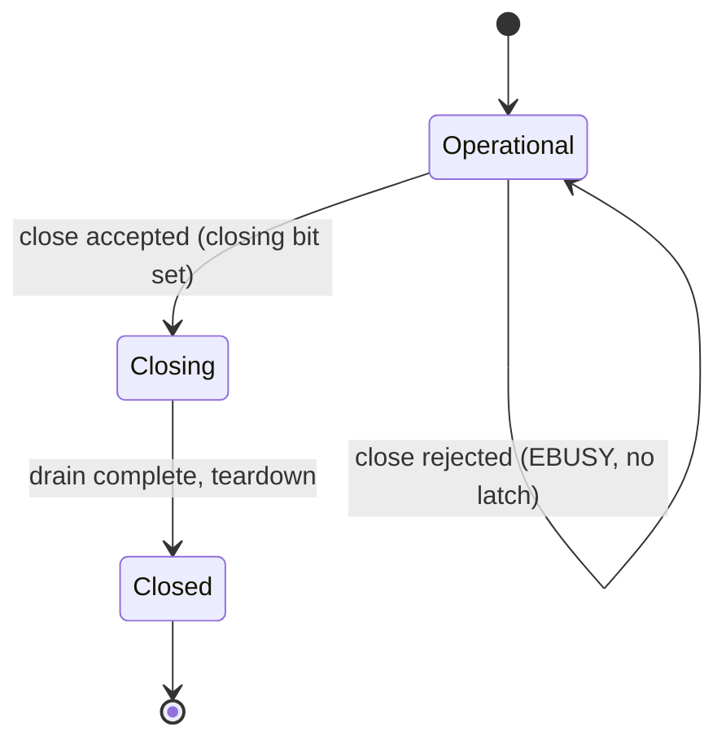

[English](thread-safety.md) | [한국어](thread-safety.ko.md)

# Thread-Safety 구현 상세

이 문서는 zlink의 공개 thread-safety 계약 뒤에 있는 구현 세부 사항을
다룹니다. 사용자 관점의 가이드(무엇을 할 수 있고 없는지)는
[스레드 안전성 가이드](../guide/11-thread-safety.ko.md)를 참고하세요.

## 1. 개요

zlink의 공개 핸들(소켓, SPOT, Discovery, Registry, 모니터)은
기본적으로 thread-safe이지만, 모든 API가 같은 비용을 가지지는 않습니다.
내부적으로 라이브러리는 모든 공개 API를 세 가지 계층 중 하나로 분류하며,
각 계층은 고유한 순서 의미론, 성능 제약, 에러 규칙을 가집니다.

three-tier contract는 내부 설계 도구입니다 — 사용자에게는 "자유롭게
보내고, 언제든 설정하고, 명확한 에러 코드로 닫기"로 보입니다. 이 문서는
각 계층이 어떻게 구현되는지 설명합니다.

## 2. Three-Tier Contract (형식 정의)

### 2.1 Hot Path Guaranteed

**대상 API:**

- `zlink_send()`
- `zlink_publish()`
- 허용된 callback 내 동일 handle `send` / `publish`

**순서 의미론:**

- 단일 스레드 순차: 한 스레드에서의 호출은 호출 순서를 보존합니다.
- 다중 스레드 동시: 각 메시지는 온전하게 전달됩니다. 인터리빙 순서는
  내부 직렬화 순서를 따르며, 호출자 스케줄링 순서를 따르지 않습니다.
  스레드 간 순서는 보장되지 않습니다.
- Callback 스레드 send와 worker 스레드 send가 같은 핸들에서 동시에
  발생하면 동일한 concurrent 계약이 적용됩니다.

**성능 제약:**

- Send 경로에 broad lock 없음.
- Steady state에서 호출당 할당 없음.
- 최소 원자 연산 (admission gate의 acquire/release, 필요 시 CAS).
- 짧은 critical section만 허용 — retry loop, backoff wait 없음.
- 기존 send queue publication 경로를 재사용; 추가 wakeup 없음.

**Close 수락 후:** 새 send 진입은 `ESHUTDOWN`으로 실패합니다. 이미
enqueue된 메시지는 teardown 전에 소진됩니다 (drain-then-close).

### 2.2 Control Path Serialized

**대상 API:**

- `zlink_bind()` / `zlink_connect()` / `zlink_disconnect()`
- `zlink_set_option()` / `zlink_get_option()`
- `zlink_set_subscription()` / `zlink_unset_subscription()`
- `zlink_spot_node_attach_discovery()`
- `zlink_*_monitor_open()`
- `zlink_send_ready_handler()`
- `zlink_registry_add_peer()` / `zlink_registry_set_heartbeat()`
- Heavy query: `zlink_registry_topology_query()`, 스냅샷 함수

**정확성 우선 직렬화:**

- Same-handle concurrent control-path 호출은 안전합니다. 실행 순서는
  내부 직렬화에 의해 결정되며, 호출자 스케줄링 순서와는 다릅니다.
- 성공적으로 반환된 control-path 호출의 효과는 이후 admitted된 모든
  호출에서 관측 가능합니다.

**경량 런타임 읽기 vs 무거운 조회:**

경량 읽기(`ZLINK_OPT_EVENTS`,
`ZLINK_OPT_LAST_ENDPOINT`, routing-id 조회)는 control path에 속하지만, heavy query/snapshot 호출의
전체 직렬화 비용을 수반하지 않습니다. 이들은 경량 서브셋으로 분류됩니다
— 항상 thread-safe이지만, 가장 무거운 직렬화 레인을 거치지 않습니다.

**Close 수락 후:** 새 control-path 진입은 `ESHUTDOWN`으로 실패합니다.
진행 중인 mutation은 정상 완료되거나 `ESHUTDOWN`으로 수렴합니다.

### 2.3 Lifecycle Strict

**대상 API:**

- `zlink_close()` (소켓)
- `zlink_spot_destroy()` / `zlink_spot_node_destroy()`
- `zlink_discovery_destroy()` / `zlink_registry_destroy()`
- Monitor 핸들 `close` / `destroy`

**Admission gate 메커니즘:**

Lifecycle gate는 두 가지 상태를 추적하는 단일 원자 워드입니다: closing
bit와 in-flight 카운트. 이를 통해 broad lock 없이 fail-fast 결정이
가능합니다.



| 조건 | errno | 의미 |
|---|---|---|
| 같은 핸들에 in-flight admitted API 존재 | `EBUSY` | 다른 스레드가 실행 중; close 거부 |
| Close 이미 수락됨, 새 API 진입 | `ESHUTDOWN` | 핸들 종료 중; 새 작업 불가 |
| 이중 close / destroy | `EALREADY` | 이미 종료 진행 중 |

**핵심 규칙:**

- **`EBUSY`는 fail-fast, no-latch.** 실패한 close는 핸들을 closing
  상태로 영구 전이시키지 않습니다. `EBUSY` 후 핸들은 이전
  operational 상태로 완전히 복귀합니다.
- **Drain-then-close.** Close가 수락되면 모든 enqueue된 메시지가
  teardown 전에 소진됩니다. Drain은 best-effort가 아닙니다 — close가
  수락된 시점에 enqueue된 모든 메시지를 소진합니다.
- **Callback에서의 self-close.** Send-ready 또는 monitor callback이
  자기 핸들의 `close`를 호출하면, 실제 teardown은 callback epilogue
  까지 지연됩니다. Callback 내 use-after-free를 방지합니다.
- **STREAM raw callback 제한.** STREAM raw callback 내에서 `close`를
  호출하면 `EBUSY`로 실패합니다 — raw dispatch가 in-flight입니다.

## 3. Subject별 구현 참고

### 3.1 Raw Socket

Raw socket은 최우선 hot-path subject입니다. `send()` 구현은 내부
send queue에 발행합니다 — 단일 스레드 send에 사용되는 것과 같은
경로에 concurrent 진입을 위한 admission gate를 추가한 것입니다.

- **Admission gate:** 소켓당 단일 `atomic<uint32_t>` 워드가
  in-flight 카운트와 closing bit를 추적합니다
  (`socket_base.hpp` / `socket_base.cpp`).
- **Send queue publication:** concurrent producer들이 기존
  pipe/YPipe 인프라를 통해 enqueue합니다. I/O 스레드 consumer
  측은 변경되지 않습니다.
- **Control-path lock:** `bind`, `connect`, `set_option` 등은
  hot-path admission gate와 상태나 캐시 라인을 공유하지 않는
  별도 직렬화 경로를 거칩니다.

### 3.2 SPOT / SPOT Node

- **공개 계약:** `spot_publish`는 hot-path 계층을 따릅니다. `SpotNode`는
  topology와 설정을 소유하며 직접 publish hot path를 제공하지 않습니다.
  구독 변경, peer mutation, `attach_discovery`는 control path를 따릅니다.
- **Internal child:** `spot_pub` / `spot_sub`는 내부 구현 단위입니다.
  공개 thread-safety 계약의 직접 대상이 아닙니다 — parent/facade
  계약이 이들을 포함합니다. Child ordering과 open/destroy
  선형화는 내부 구현 관심사입니다.

### 3.3 Discovery / Registry

Discovery와 Registry는 control-plane 중심 subject입니다. Hot-path
send API가 없습니다.

- 정확성과 가시성이 주요 관심사입니다.
- 내부 직렬화가 topology query, peer mutation, heartbeat 설정의
  일관성을 보장합니다.
- `attach_discovery`를 통해 SPOT Node에 연결될 때,
  Discovery/Registry 직렬화가 parent data-plane 성능을 저하시키면
  안 됩니다.

### 3.4 Monitor

Monitor는 control-plane 중심 subject입니다.

- `monitor_open` / `monitor_close`는 control-path serialized입니다.
- Monitor delivery는 parent 핸들의 상태를 관찰하되, parent의
  hot path에 broad lock을 도입하지 않습니다.
- Parent의 hot-path send는 절대 monitor delivery에 의해 블로킹되면
  안 됩니다.

## 4. Service Public API Guard

`service_public_api.hpp`는 SPOT, SPOT Node, Discovery,
Registry가 lifecycle과 control-path 계층을 구현하는 데 사용하는
`service_public_api_guard_t` 클래스를 제공합니다.

**구현:**

Guard는 단일 `atomic<uint32_t>`를 사용하며, 하나의 워드에 두 필드를
패킹합니다:

- **Bit 31 (closing bit):** close/destroy가 수락되면 설정됩니다.
- **Bits 0-30 (in-flight count):** 현재 admitted된 공개 API 호출
  수를 추적합니다.

**각 계층이 guard에 매핑되는 방식:**

| 계층 | Guard 역할 |
|---|---|
| Lifecycle strict | `begin_close_or_fail_busy()`가 in-flight count와 closing bit를 원자적으로 확인합니다. in-flight > 0이면 `EBUSY`, closing bit가 이미 설정되어 있으면 `EALREADY`를 반환합니다. 성공하면 closing bit를 설정합니다. |
| Control path serialized | `enter_public_api()`가 closing bit를 확인한 후 in-flight count를 증가시킵니다. Closing bit가 설정되어 있으면 `ESHUTDOWN`을 반환합니다. 모든 control-path 호출이 이 gate를 거쳐 직렬화를 제공합니다. |
| Hot path | Send 경로는 guard의 broad lock 경로를 우회합니다. Control-path 직렬화와의 contention을 피하기 위해 별도의 최소 비용 admission(소켓 수준 admission gate)을 사용합니다. |

**Cancel close:** `cancel_close()`가 closing bit를 지워 no-latch
속성을 지원합니다 — 상위 수준에서 `begin_close_or_fail_busy()`가
실패하면 핸들을 operational 상태로 복원할 수 있습니다.

## 5. Callback Dispatch 구현

대부분의 callback은 I/O 스레드에서 실행됩니다. 다만
`zlink_spot_dispatch_event_handler()`는 Spot 전용 worker runtime에서
실행됩니다. Dispatch 메커니즘은 원자적
load를 사용하여 핸들러 포인터를 읽으며, hot path에 broad lock 없이
핸들러 교체의 가시성을 보장합니다.

**핸들러 로딩:**

```cpp
handler = _socket_msg_handler.load(std::memory_order_acquire);
```

모든 핸들러 함수 포인터와 관련 subject/userdata 포인터는
`memory_order_acquire` load를 사용합니다. Setter 함수는 대응하는
`memory_order_release` store를 사용합니다. 이를 통해 callback
dispatch가 핸들러 포인터를 읽을 때, setter 스레드가 핸들러를
설치하기 전에 쓴 모든 데이터도 함께 볼 수 있습니다.

**Callback 진입/퇴장:**

```cpp
enter_callback_api();   // marks callback as in-flight
handler(subject, userdata);
leave_callback_api();   // clears in-flight flag
```

`enter_callback_api` / `leave_callback_api` 쌍은 `close`가 callback을
in-flight 연산으로 인식하여 핸들을 mid-callback에서 teardown하는 대신
`EBUSY`를 반환하도록 보장합니다.

**STREAM raw callback 제약 근거:**

STREAM raw callback은 더 엄격한 제한을 가집니다 — raw callback 내에서의
`close`는 항상 `EBUSY`로 실패합니다. Send-ready/monitor callback에서
`close`가 epilogue로 지연되는 것과 달리, STREAM raw dispatch는 deferred
close를 지원하지 않습니다.

**Send-ready handler `EDEADLK` 제약 근거:**

자기 callback 내에서 send-ready handler를 교체하면 reentrant dispatch
상황이 발생합니다. 이는 감지되어 `EDEADLK`로 거부됩니다.

## 6. 설계 원칙

### Hot path / control-plane 분리

- Hot-path 상태와 control-plane 상태는 별도 데이터 구조를 사용합니다.
- Hot-path 캐시 라인과 control-plane 캐시 라인을 분리하여 false
  sharing을 방지합니다.
- Hot-path admission과 lifecycle admission은 최소한의 필요 상태만
  공유합니다 (closing bit 확인).

### Hot path: 최소 비용

- Send당 최소 원자 연산 (admission의 acquire/release, 구조적으로
  필요한 경우에만 CAS).
- 짧은 critical section — sleep, retry, 할당 없음.
- 기존 send queue publication 경로 재사용.

### Control path: 직렬화 허용, hot path 저해 금지

- Control-path 연산은 내부 직렬화 레인과 짧은 critical section을
  사용할 수 있습니다.
- Control-plane lock은 hot-path admission과 캐시 라인이나 lock
  인스턴스를 공유하면 안 됩니다.
- Control-path 호출은 concurrent hot-path send를 절대 블로킹하면
  안 됩니다.

### Lifecycle: 단일 워드 admission gate

- Admission gate는 단일 원자 워드 — 다단계 잠금 프로토콜 없음.
- No-latch의 fail-fast: 거부된 close는 잔여 상태를 남기지 않습니다.
- Drain-then-close: teardown은 enqueue된 메시지가 소비될 때까지
  기다린 후 자원 정리를 진행합니다.
