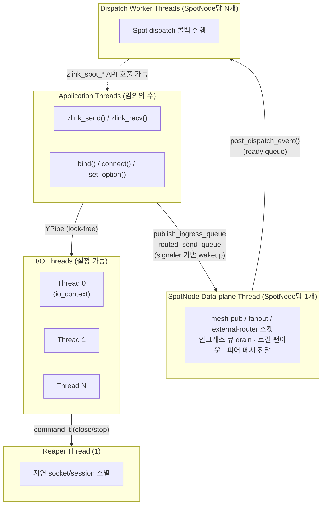
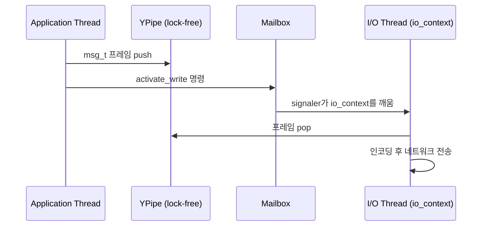

[English](./threading-model.md) | [한국어](./threading-model.ko.md)

# 스레딩 및 동시성 모델

이 문서는 zlink의 내부 스레딩 구조를 설명한다. 어떤 스레드가 존재하는지,
각각 무슨 일을 하는지, 서로 어떻게 통신하는지, 작업이 어떻게 스케줄링되는지를
다룬다. 공개 API 안전 계약은 [Thread-Safety 내부 구조](./thread-safety.ko.md)를 본다.

## 1. 스레드 구조

### 1.1 스레드 종류

| 스레드 | 역할 | 수량 |
|--------|------|------|
| Application thread | `zlink_send()`, `zlink_recv()`, `bind()`, `connect()` 등 호출 | 사용자 정의 |
| I/O thread | Boost.Asio `io_context` 실행. 비동기 네트워크 I/O, 프레임 인코딩/디코딩, socket 이벤트 dispatch | 설정 가능 (기본: 4) |
| Reaper thread | 종료된 socket과 session의 지연 소멸 | 1 (전역) |
| SpotNode data-plane thread | `mesh-pub`, `fanout`, `external-router` 소켓 독점 소유; 인그레스 큐 drain; 로컬 팬아웃·피어 메시 전달 | SpotNode당 1개 |
| Dispatch worker thread | Spot dispatch 콜백 실행; Spot별 직렬화·코얼레싱 | SpotNode당 N개 (기본: `min(2, cpu_count)` ~ `max(1, cpu_count)`) |

I/O thread 수는 context 생성 시 설정한다:

```c
void *ctx = zlink_ctx_new();
zlink_ctx_set(ctx, ZLINK_IO_THREADS, 4);  /* 기본값은 ZLINK_IO_THREADS_DFLT = 4 */
```

I/O thread는 context 생성 시 시작되고 `zlink_ctx_term()` 호출 시 종료된다.
context가 실행 중인 상태에서는 추가하거나 제거할 수 없다.

### 1.2 스레드 다이어그램



---

## 2. 설계 의도

Application thread와 I/O thread를 분리하는 목적은 두 가지다.

1. **지연 시간 격리**: application thread는 네트워크 I/O를 기다리며 블록되지 않는다.
   `zlink_send()` 호출은 락-프리(lock-free) 파이프에 쓰고 즉시 반환하며, I/O thread가 비동기로
   데이터를 처리한다.
2. **소켓별 잠금 없는 동시성**: 소켓마다 하나의 I/O 스레드 이벤트 루프에 고정되므로,
   일반 데이터 경로 연산에서는 소켓 내부에 잠금이 필요 없다. 동기화는 입장 허용 게이트(admission gate)를
   통해 애플리케이션 스레드 진입점에서만 수행된다.

Reaper thread는 use-after-free와 double-free 버그를 예방한다. I/O thread가 이벤트 루프
실행 중에 안전하게 해제할 수 없는 자원을 Reaper에 넘기면, Reaper가 이벤트 루프 밖에서
처리한다.

---

## 3. I/O Thread 할당

### 3.1 Socket-to-thread 고정

소켓이 생성될 때 하나의 I/O thread에 할당된다. 이 할당은 소켓 수명 동안
변경되지 않는다. 해당 소켓의 모든 데이터 평면 연산(send, recv, timer, 콜백)은
오직 그 I/O 스레드에서 실행된다.

### 3.2 부하 분산 (least-load)

할당에는 **least-load(최소 부하 선택)** 정책을 사용한다. 현재 할당된 소켓 수가 가장 적은
I/O thread가 다음 소켓을 받는다.

```
new_socket → argmin(socket_count[t] for t in io_threads)
```

동률이면 인덱스가 낮은 thread가 선택된다. 카운트는 소켓 생성 및 소멸 시 원자적으로
갱신된다. 할당 이후 재분배는 없다.

### 3.3 어피니티 마스크

Context의 어피니티 마스크로 새 소켓 할당 대상 I/O 스레드를 제한할 수 있다.
마스크에서 제외된 스레드는 이미 할당된 소켓은 계속 처리하지만, 새 소켓은 받지 않는다.

```c
/* 새 소켓을 I/O 스레드 0과 2에만 할당 */
uint64_t mask = (1ULL << 0) | (1ULL << 2);
zlink_ctx_set(ctx, ZLINK_IO_THREAD_AFFINITY, (int)mask);
```

---

## 4. 스레드 간 통신

### 4.1 YPipe — 락-프리 데이터 경로

메시지 데이터는 application thread에서 I/O thread로 **YPipe**(단방향 비잠금 SPSC 큐)를 통해 전달된다.
YPipe는 단일 생산자 단일 소비자(SPSC) 락-프리 FIFO로, 방향(send/recv)마다
소켓당 하나씩 존재한다. CAS(Compare-And-Swap, 원자적 비교-교환 연산) 기반의 two-pointer 방식과 "flush batch" 최적화를 사용한다:

```
application thread          I/O thread
-----------------           ----------
push(msg)를 YPipe에 넣기  →  YPipe에서 msg를 꺼내기
flush() 신호 보내기       →  io_context 깨우기
```

YPipe가 SPSC이므로 flush(큐에 쌓인 항목을 소비자 측으로 한 번에 넘기는 동작) 시 포인터 교환 연산 하나만 필요하다. mutex나
메시지별 atomic 연산이 없다.

### 4.2 Mailbox — 제어 명령

bind, connect, set_option, 소켓 close 같은 저빈도 제어 연산은 **Mailbox**(스레드 간 명령 전달 큐)를 통해
직렬화된다. Mailbox는 `signaler_t`(eventfd 또는 pipe 기반 파일 디스크립터로 I/O thread를 깨우는 신호 장치)로 지원되는
thread-safe 명령 큐다:

```cpp
class mailbox_t {
    ypipe_t<command_t> _commands;  /* 명령 SPSC 큐 */
    signaler_t _signaler;          /* 명령 enqueue 시 io_context를 깨움 */
};
```

명령 타입에는 `stop`, `plug`, `attach`, `bind`, `activate_read`, `activate_write`,
`hiccup`, `term` 등이 있다. I/O 스레드는 이벤트 루프 각 반복의 시작에서 Mailbox를 drain한다.

### 4.3 데이터 흐름 요약



---

## 5. Reaper Thread

소켓이 닫힐 때 I/O thread가 자원을 즉시 해제하지 못하는 경우가 있다. session 객체를
참조하는 진행 중인 async 연산이 있기 때문이다. I/O thread는 해당 소켓의 모든 I/O가
완료되면 Reaper에 `term` 명령을 보낸다. Reaper는 이벤트 루프 잠금 없이 자원을 해제한다.

Reaper는 자체 Mailbox와 단순 drain 루프로 동작한다:

```
while (command = mailbox.recv()) {
    if (command.type == TERM) free(command.object);
    if (command.type == STOP) break;
}
```

---

## 6. SpotNode data-plane thread와 Dispatch Worker Pool

### 6.1 Data-plane thread

`spot_node_t`마다 하나의 OS 스레드(`spot_runtime_t::data_plane_thread`)가
`spot_data_plane_loop_t::run_until_shutdown()`을 실행한다. 이 스레드는 다음 자원을
독점적으로 소유한다:

- `mesh-pub`, `fanout`, `external-router`, `mesh-xsub`, `peer_ctrl_pub`, `peer_ctrl_sub` 소켓
- `publish_ingress_queue`, `routed_send_queue`, `external_router_ingress_queue` drain
- 로컬 팬아웃 전달, 원격 메시 publish, 인바운드/아웃바운드 라우팅 전달

public 스레드는 이 소켓들에 직접 접근하지 않는다. 이 경계를 위반하면 소켓 소유권,
poller 관심 등록, shutdown 순서가 public call path에 혼재된다.

```
불변 조건:
  public 스레드는 mesh-pub, fanout, external-router에 직접 send/recv 금지.
  data-plane 스레드는 application dispatch 콜백을 직접 호출하지 않는다.
```

data-plane 스레드 루프는 세 큐의 signaler FD를 포함한 poller와 함께 동작한다.
큐가 비어 있다가 메시지가 들어오면 즉시 스레드가 깨어난다. 유휴 tick은 100 ms다.

큐 drain 우선순위:

| 순서 | 큐 | 설명 |
|------|----|------|
| 1 | `external_router_ingress_queue` | 피어로부터 들어온 라우팅 프레임 처리 |
| 2 | `publish_ingress_queue` | application에서 제출한 topic publish 처리 |
| 3 | `routed_send_queue` | application에서 제출한 routed send 처리 |
| 4 | flush `mesh-pub` pending | 원격 피어로 publish 전달 |
| 5 | flush `fanout` pending | 로컬 구독자로 팬아웃 전달 |
| 6 | flush staged messages | 잔여 staged 프레임 전송 |

배치 한도는 반복당 2048 메시지 또는 16 MiB다.

### 6.2 Dispatch Worker Pool

`spot_runtime_t::dispatch_workers`(`spot_dispatch_worker_pool_t`)가 application
dispatch 콜백을 실행한다. data-plane 스레드는 콜백을 직접 호출하지 않는다. 대신
대상 Spot 상태가 준비되면 풀의 `post_dispatch_event(void* spot_)`를 호출한다.
풀은 `_queued` 집합으로 코얼레싱한다: 동일한 Spot 포인터는 두 번 이상 enqueue되지
않는다.

Spot별 직렬화: 한 번에 하나의 worker만 주어진 Spot을 처리한다. 콜백이 반환된 후
해당 Spot에 미읽은 이벤트가 `_dirty`에 있으면 `_ready`에 다시 enqueue된다.

Worker 수 기본값:

```text
cpu_count = max(1, hardware_concurrency)
default_min = min(2, cpu_count)
default_max = max(1, cpu_count)
idle_timeout = 1000 ms (내부 상수)
```

| 옵션 | 기본값 | 의미 |
|------|--------|------|
| `ZLINK_SPOT_NODE_OPT_DISPATCH_WORKERS_MIN` | `min(2, cpu_count)` | 항상 유지되는 worker 수 |
| `ZLINK_SPOT_NODE_OPT_DISPATCH_WORKERS_MAX` | `max(1, cpu_count)` | 버스트 상한 |

data-plane 스레드가 콜백을 직접 호출하지 않는 이유:

1. application 콜백이 SPOT send/recv API를 호출할 수 있어 data-plane 잠금이나
   소켓 소유권에 재진입할 수 있다.
2. 느린 콜백이 `mesh-pub`, `external-router` flush를 지연시킨다.
3. `ZLINK_POLLOUT`과 send-ready 콜백은 dispatch 축에 있어, 전달 루프와 혼재하면
   readiness/전달 순서가 깨진다.

---

## 7. NUMA 및 CPU 핀닝

zlink는 내부적으로 I/O thread를 특정 CPU 코어에 고정하지 않는다.
NUMA 지역성이 중요하다면 애플리케이션에서 다음을 수행한다:

1. `ZLINK_IO_THREADS`를 NUMA 토폴로지에 맞게 설정한다.
2. 어피니티 마스크를 사용해 소켓 그룹별로 특정 I/O 스레드에 할당한다.
3. 해당 소켓에서 `zlink_send()`를 호출하는 애플리케이션 스레드에
   OS 수준 CPU 어피니티(`pthread_setaffinity_np` 등)를 적용한다.

소켓은 생성 시 I/O 스레드에 영구적으로 고정되므로, 애플리케이션 스레드와 그
I/O 스레드를 같은 NUMA 노드에 배치하면 cross-node YPipe 접근이 없어진다.

---

## 8. 동시 접근 패턴

이 스레딩 모델에서 다음 패턴은 안전하고 동작이 명확하게 정의된다
(전체 계약은 [Thread-Safety 내부 구조](./thread-safety.ko.md) 참고).
`send`/`publish`/`send_rid` 같은 hot path는 여러 스레드에서 동시 사용 가능하며,
control path는 정확성을 위해 내부에서 직렬화된다.

### 7.1 여러 스레드에서 `zlink_send()` 동시 호출

각 `zlink_send()` 호출은 입장 허용 게이트를 통과한 뒤 경량 spinlock으로 YPipe에 쓰고
Mailbox에 신호를 보낸다. I/O 스레드는 YPipe를 독립적으로 drain(소비)한다:

```c
/* Thread A */                      /* Thread B */
zlink_send(s, &a, 1, 0);            zlink_send(s, &b, 1, 0);
/* 모두 안전 — hot-path admission guard가 파이프 쓰기를 직렬화 */
```

### 7.2 한 스레드가 close하는 동안 다른 스레드가 send

`zlink_close()`는 fail-fast(빠른 실패) lifecycle 게이트를 사용한다. 다른 스레드가 그 핸들의
hot-path API 안에 있으면 즉시 `ZLINK_CLOSE_BUSY`를 반환한다. close 호출자는 성공할 때까지
재시도해야 한다. close가 수락되면 이후 해당 핸들에 대한 API 호출은 `ZLINK_CLOSE_SHUTDOWN`을
반환한다.

### 7.3 콜백 전달과 동시 send

`*_handler()`로 등록한 콜백은 I/O 스레드에서 실행된다. 애플리케이션 스레드에서는
동시에 `zlink_send()`를 호출할 수 있다 — 입장 허용 게이트가 콜백 경로와 send 경로를
분리한다. 콜백 안에서 해당 소켓에 `zlink_close()`를 호출하면 데드락이 발생하므로
하지 말아야 한다.

---

## 9. Context 스레드 안전성

Context 객체(`zlink_ctx_new()`)는 완전히 thread-safe하다. 여러 thread에서 동시에
소켓을 생성하고 종료할 수 있다:

```c
/* 안전: 같은 context에서 여러 thread가 소켓 생성 */
void *s1 = zlink_socket(ctx, ZLINK_SOCKET_DEALER);  /* thread A */
void *s2 = zlink_socket(ctx, ZLINK_SOCKET_DEALER);  /* thread B */
```

`zlink_ctx_term()`은 모든 소켓이 닫힐 때까지 블록한다. 소켓 수명을 관리하는
thread와 같은 thread에서 호출하거나, 호출 전에 모든 소켓을 닫아야 한다.

---

## 10. 요약

| 속성 | 값 |
|------|----|
| 소켓 고정 | 생성 시 결정된 I/O 스레드, 이후 변경 없음 |
| 할당 정책 | Least-load (소켓 수 최소 스레드) |
| Application→I/O 데이터 경로 | 락-프리 YPipe (SPSC) |
| Application→I/O 제어 경로 | Mailbox (스레드 안전, signaler 기반) |
| 지연 소멸 | Reaper 스레드 (전역 1개) |
| 동시 send | 입장 허용 게이트로 안전 |
| 동시 close + send | 안전. close는 hot-path 호출자가 빠져나올 때까지 `BUSY` 반환 |
| 콜백 실행 스레드 | 항상 소켓에 할당된 I/O 스레드 |
| SpotNode data-plane thread | SpotNode당 1개; mesh-pub/fanout/external-router 독점 소유 |
| SpotNode data-plane→App | publish_ingress_queue / routed_send_queue (signaler 기반 wakeup) |
| Dispatch worker thread | SpotNode당 N개; Spot별 직렬화·코얼레싱; 기본 min(2,cpu)~max(1,cpu) |
| Dispatch worker idle timeout | 1000 ms (내부 상수) |
| Spot dispatch 콜백 실행 스레드 | Dispatch worker 스레드 (data-plane 스레드 아님) |

---
[← 아키텍처](./architecture.ko.md) | [Thread-Safety →](./thread-safety.ko.md)
