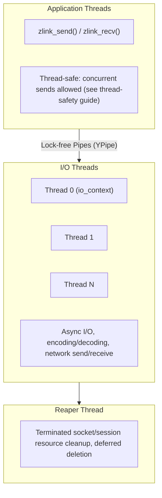
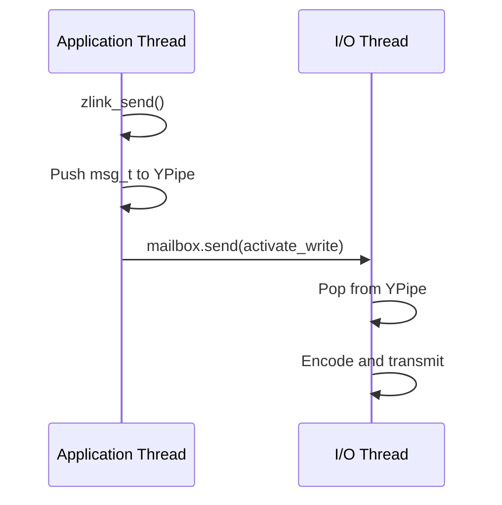

[English](threading-model.md) | [한국어](threading-model.ko.md)

# 스레딩 및 동시성 모델

## 1. 스레드 구조

### 1.1 스레드 종류

| 스레드 | 역할 | 수량 |
|--------|------|------|
| Application Thread | zlink_send/recv 호출 | 사용자 정의 |
| I/O Thread | Boost.Asio io_context 비동기 처리 | 설정 가능 (기본 2) |
| Reaper Thread | 종료된 소켓/세션 자원 정리 | 1 |

### 1.2 스레드 다이어그램


## 2. 스레드 간 통신

### 2.1 Mailbox 시스템
```cpp
class mailbox_t {
    ypipe_t<command_t> _commands;  // Lock-free command queue
    signaler_t _signaler;           // Wake-up signal
};
```

명령 타입: stop, plug, attach, bind, activate_read, activate_write 등

### 2.2 데이터 흐름


## 3. I/O 스레드 선택
- affinity 마스크 기반
- 가장 적은 부하를 가진 스레드 선택
- zlink_ctx_set(ctx, ZLINK_IO_THREADS, n)으로 수량 설정

## 4. 동시성 규칙
- Public socket/service handle: 하나의 handle을 여러 스레드에서 동시 사용 가능 (thread-safe)
- Context: thread-safe (여러 스레드에서 소켓 생성 가능)
- pipe_t: Lock-free (CAS 기반 YPipe)
- 캐시 라인 최적화, 메모리 배리어 가시성 보장
- 전체 동시성 계약 구현은 [Thread-Safety 구현 상세](thread-safety.ko.md) 참고
