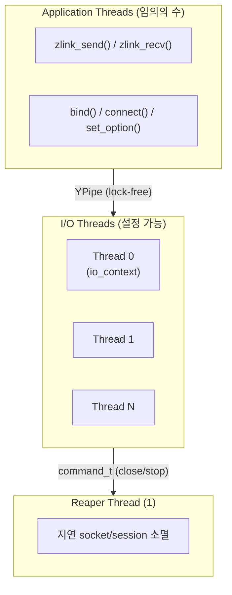
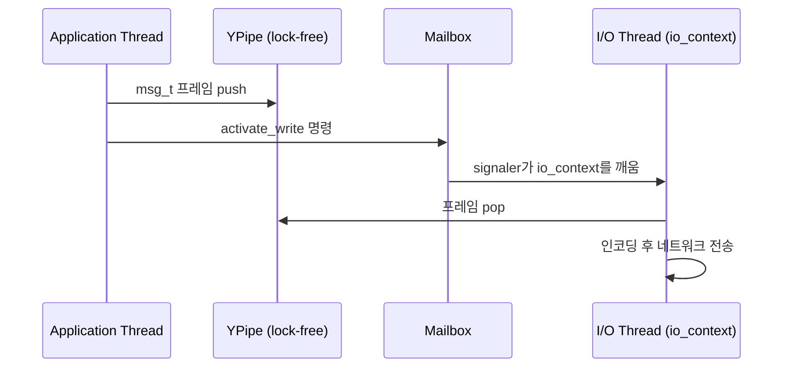

[English](threading-model.md) | [한국어](threading-model.ko.md)

# 스레딩 및 동시성 모델

이 문서는 zlink의 내부 스레딩 구조를 설명한다. 어떤 스레드가 존재하는지,
각각 무슨 일을 하는지, 서로 어떻게 통신하는지, 작업이 어떻게 스케줄링되는지를
다룬다. 공개 API 안전 계약은 [Thread-Safety 내부 구조](thread-safety.ko.md)를 본다.

## 1. 스레드 구조

### 1.1 스레드 종류

| 스레드 | 역할 | 수량 |
|--------|------|------|
| Application thread | `zlink_send()`, `zlink_recv()`, `bind()`, `connect()` 등 호출 | 사용자 정의 |
| I/O thread | Boost.Asio `io_context` 실행. 비동기 네트워크 I/O, 프레임 인코딩/디코딩, socket 이벤트 dispatch | 설정 가능 (기본: 1) |
| Reaper thread | 종료된 socket과 session의 지연 소멸 | 1 (전역) |

I/O thread 수는 context 생성 시 설정한다:

```c
void *ctx = zlink_ctx_new();
zlink_ctx_set(ctx, ZLINK_IO_THREADS, 4);  /* 기본값은 ZLINK_IO_THREADS_DFLT = 1 */
```

I/O thread는 context 생성 시 시작되고 `zlink_ctx_term()` 호출 시 종료된다.
context가 실행 중인 상태에서는 추가하거나 제거할 수 없다.

### 1.2 스레드 다이어그램



---

## 2. 설계 의도

Application thread와 I/O thread를 분리하는 목적은 두 가지다.

1. **지연 시간 격리**: application thread는 네트워크 I/O를 기다리며 블록되지 않는다.
   `zlink_send()` 호출은 lock-free 파이프에 쓰고 즉시 반환하며, I/O thread가 비동기로
   데이터를 처리한다.
2. **socket별 잠금 없는 동시성**: socket마다 하나의 I/O thread 이벤트 루프에 고정되므로,
   일반 데이터 경로 연산에서는 socket 내부에 잠금이 필요 없다. 동기화는 admission gate를
   통해 application thread 진입점에서만 수행된다.

Reaper thread는 use-after-free와 double-free 버그를 예방한다. I/O thread가 이벤트 루프
실행 중에 안전하게 해제할 수 없는 자원을 Reaper에 넘기면, Reaper가 이벤트 루프 밖에서
처리한다.

---

## 3. I/O Thread 할당

### 3.1 Socket-to-thread 고정

Socket이 생성될 때 하나의 I/O thread에 할당된다. 이 할당은 socket 수명 동안
변경되지 않는다. 해당 socket의 모든 데이터 평면 연산(send, recv, timer, callback)은
오직 그 I/O thread에서 실행된다.

### 3.2 부하 분산 (least-load)

할당에는 **least-load** 정책을 사용한다. 현재 할당된 socket 수가 가장 적은
I/O thread가 다음 socket을 받는다.

```
new_socket → argmin(socket_count[t] for t in io_threads)
```

동률이면 인덱스가 낮은 thread가 선택된다. 카운트는 socket 생성 및 소멸 시 원자적으로
갱신된다. 할당 이후 재분배는 없다.

### 3.3 Affinity mask

Context의 affinity mask로 새 socket 할당 대상 I/O thread를 제한할 수 있다.
마스크에서 제외된 thread는 이미 할당된 socket은 계속 처리하지만, 새 socket은 받지 않는다.

```c
/* 새 socket을 I/O thread 0과 2에만 할당 */
uint64_t mask = (1ULL << 0) | (1ULL << 2);
zlink_ctx_set(ctx, ZLINK_IO_THREAD_AFFINITY, (int)mask);
```

---

## 4. 스레드 간 통신

### 4.1 YPipe — lock-free 데이터 경로

메시지 데이터는 application thread에서 I/O thread로 **YPipe**를 통해 전달된다.
YPipe는 단일 생산자 단일 소비자(SPSC) lock-free FIFO로, 방향(send/recv)마다
socket당 하나씩 존재한다. CAS 기반의 two-pointer 방식과 "flush batch" 최적화를 사용한다:

```
application thread          I/O thread
-----------------           ----------
push(msg)를 YPipe에 넣기  →  YPipe에서 msg를 꺼내기
flush() 신호 보내기       →  io_context 깨우기
```

YPipe가 SPSC이므로 flush 시 포인터 교환 연산 하나만 필요하다. mutex나
메시지별 atomic 연산이 없다.

### 4.2 Mailbox — 제어 명령

bind, connect, set_option, socket close 같은 저빈도 제어 연산은 **Mailbox**를 통해
직렬화된다. Mailbox는 `signaler_t`(eventfd 또는 pipe 기반 파일 디스크립터)로 지원되는
thread-safe 명령 큐다:

```cpp
class mailbox_t {
    ypipe_t<command_t> _commands;  /* 명령 SPSC 큐 */
    signaler_t _signaler;          /* 명령 enqueue 시 io_context를 깨움 */
};
```

명령 타입에는 `stop`, `plug`, `attach`, `bind`, `activate_read`, `activate_write`,
`hiccup`, `term` 등이 있다. I/O thread는 이벤트 루프 각 반복의 시작에서 Mailbox를 drain한다.

### 4.3 데이터 흐름 요약



---

## 5. Reaper Thread

Socket이 닫힐 때 I/O thread가 자원을 즉시 해제하지 못하는 경우가 있다. session 객체를
참조하는 진행 중인 async 연산이 있기 때문이다. I/O thread는 해당 socket의 모든 I/O가
완료되면 Reaper에 `term` 명령을 보낸다. Reaper는 이벤트 루프 잠금 없이 자원을 해제한다.

Reaper는 자체 Mailbox와 단순 drain 루프로 동작한다:

```
while (command = mailbox.recv()) {
    if (command.type == TERM) free(command.object);
    if (command.type == STOP) break;
}
```

---

## 6. NUMA 및 CPU 핀닝

zlink는 내부적으로 I/O thread를 특정 CPU 코어에 고정하지 않는다.
NUMA 지역성이 중요하다면 애플리케이션에서 다음을 수행한다:

1. `ZLINK_IO_THREADS`를 NUMA 토폴로지에 맞게 설정한다.
2. affinity mask를 사용해 socket 그룹별로 특정 I/O thread에 할당한다.
3. 해당 socket에서 `zlink_send()`를 호출하는 application thread에
   OS 수준 CPU affinity(`pthread_setaffinity_np` 등)를 적용한다.

Socket은 생성 시 I/O thread에 영구적으로 고정되므로, application thread와 그
I/O thread를 같은 NUMA 노드에 배치하면 cross-node YPipe 접근이 없어진다.

---

## 7. 동시 접근 패턴

이 스레딩 모델에서 다음 패턴은 안전하고 동작이 명확하게 정의된다
(전체 계약은 [Thread-Safety 내부 구조](thread-safety.ko.md) 참고).

### 7.1 여러 thread에서 `zlink_send()` 동시 호출

각 `zlink_send()` 호출은 admission gate를 통과한 뒤 경량 spinlock으로 YPipe에 쓰고
Mailbox에 신호를 보낸다. I/O thread는 YPipe를 독립적으로 drain한다:

```c
/* Thread A */                      /* Thread B */
zlink_send(s, &a, 1, 0);            zlink_send(s, &b, 1, 0);
/* 모두 안전 — hot-path admission guard가 파이프 쓰기를 직렬화 */
```

### 7.2 한 thread가 close하는 동안 다른 thread가 send

`zlink_close()`는 fail-fast lifecycle gate를 사용한다. 다른 thread가 그 handle의
hot-path API 안에 있으면 즉시 `ZLINK_CLOSE_BUSY`를 반환한다. close 호출자는 성공할 때까지
재시도해야 한다. close가 수락되면 이후 해당 handle에 대한 API 호출은 `ZLINK_CLOSE_SHUTDOWN`을
반환한다.

### 7.3 callback 전달과 동시 send

`*_handler()`로 등록한 callback은 I/O thread에서 실행된다. application thread에서는
동시에 `zlink_send()`를 호출할 수 있다 — admission gate가 callback 경로와 send 경로를
분리한다. callback 안에서 해당 socket에 `zlink_close()`를 호출하면 데드락이 발생하므로
하지 말아야 한다.

---

## 8. Context 스레드 안전성

Context 객체(`zlink_ctx_new()`)는 완전히 thread-safe하다. 여러 thread에서 동시에
socket을 생성하고 종료할 수 있다:

```c
/* 안전: 같은 context에서 여러 thread가 socket 생성 */
void *s1 = zlink_socket(ctx, ZLINK_SOCKET_DEALER);  /* thread A */
void *s2 = zlink_socket(ctx, ZLINK_SOCKET_DEALER);  /* thread B */
```

`zlink_ctx_term()`은 모든 socket이 닫힐 때까지 블록한다. socket 수명을 관리하는
thread와 같은 thread에서 호출하거나, 호출 전에 모든 socket을 닫아야 한다.

---

## 9. 요약

| 속성 | 값 |
|------|----|
| Socket 고정 | 생성 시 결정된 I/O thread, 이후 변경 없음 |
| 할당 정책 | Least-load (socket 수 최소 thread) |
| Application→I/O 데이터 경로 | Lock-free YPipe (SPSC) |
| Application→I/O 제어 경로 | Mailbox (thread-safe, signaler 기반) |
| 지연 소멸 | Reaper thread (전역 1개) |
| 동시 send | Admission gate로 안전 |
| 동시 close + send | 안전. close는 hot-path 호출자가 빠져나올 때까지 `BUSY` 반환 |
| Callback 실행 thread | 항상 socket에 할당된 I/O thread |

---
[← 아키텍처](architecture.ko.md) | [Thread-Safety →](thread-safety.ko.md)
