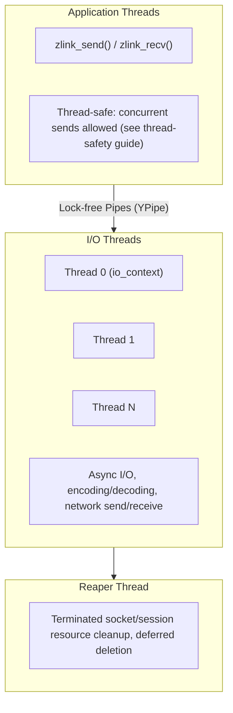
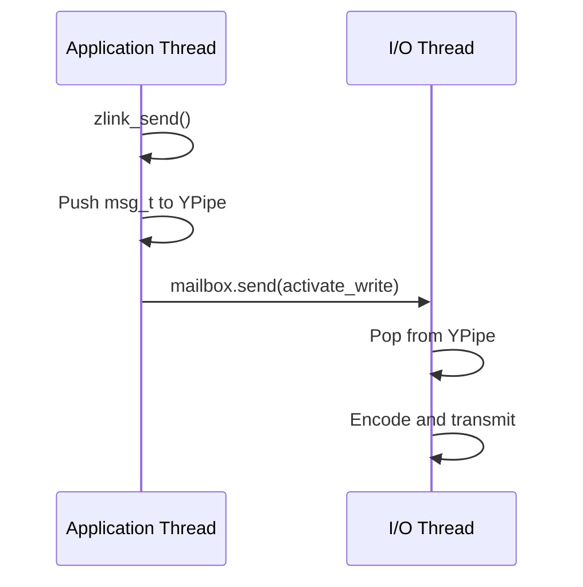

[English](threading-model.md) | [한국어](threading-model.ko.md)

# Threading and Concurrency Model

## 1. Thread Structure

### 1.1 Thread Types

| Thread | Role | Count |
|--------|------|------|
| Application Thread | Calls zlink_send/recv | User-defined |
| I/O Thread | Boost.Asio io_context async processing | Configurable (default 1; see `ZLINK_IO_THREADS_DFLT`) |
| Reaper Thread | Resource cleanup for terminated sockets/sessions | 1 |

### 1.2 Thread Diagram


## 2. Inter-Thread Communication

### 2.1 Mailbox System
```cpp
class mailbox_t {
    ypipe_t<command_t> _commands;  // Lock-free command queue
    signaler_t _signaler;           // Wake-up signal
};
```

Command types: stop, plug, attach, bind, activate_read, activate_write, etc.

### 2.2 Data Flow


## 3. I/O Thread Selection
- Based on affinity mask
- Selects the thread with the least load
- Set count with zlink_ctx_set(ctx, ZLINK_IO_THREADS, n)

## 4. Concurrency Rules
- Public socket/service handles use a tiered contract: hot-path
  `send`/`publish`/`send_rid` can be called concurrently from multiple threads, low-frequency
  control paths serialize for correctness, and `close`/`destroy` use a
  stricter lifecycle gate
- Context: Thread-safe (sockets can be created from multiple threads)
- pipe_t: Lock-free (CAS-based YPipe)
- Cache line optimization, visibility guaranteed through memory barriers
- For the full concurrency contract implementation, see [Thread-Safety Internals](thread-safety.md)
