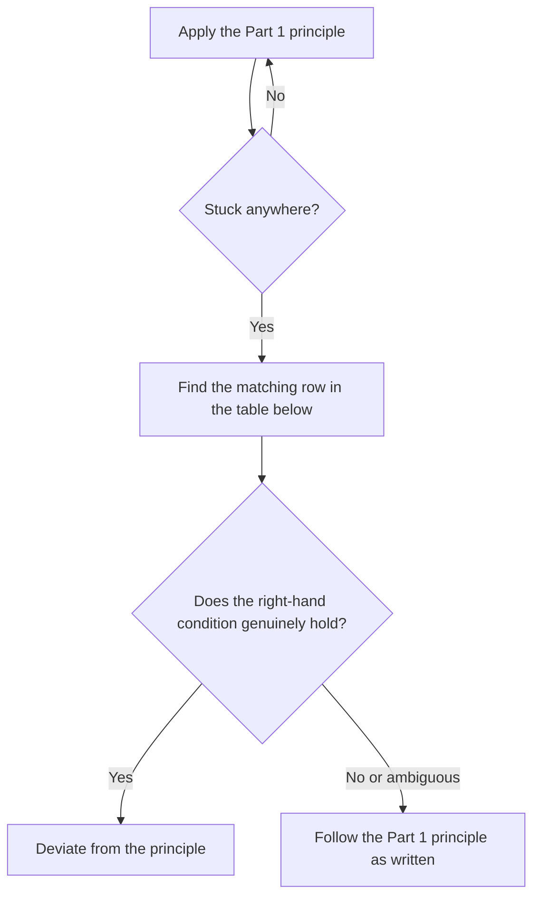

# POSDDD — Software Design Principles

> Universal design rules to apply as-is when generating, reviewing, or modifying code.
> Combines the design philosophy of *A Philosophy of Software Design* (John Ousterhout)
> and *Domain-Driven Design* (Eric Evans, 2003) into a single set of principles. Not tied
> to any specific language, framework, or project.
>
> The two books address the same problem at different altitudes — **where to draw a
> boundary, and what to hide behind it.** Ousterhout looks at that boundary at the module
> level; Evans looks at it at the level of domain meaning. Bounded context is the
> criterion for judging module boundaries, ubiquitous language extends "same concept →
> same name" to the scope of a domain, and an aggregate is a deep module that owns an
> invariant. So this document does not split DDD into a separate chapter — it weaves DDD
> directly into the matching POSD principle.
>
> **Reader**: a developer (human or agent) generating, reviewing, or modifying code, who
> is looking for an answer to "is this design decision the right direction right now."
> Open this document when you need a judgment criterion that applies regardless of
> project or language.

This document is divided into the following parts.

- **Core Principles** — apply as-is to most projects. Contains POSD's complexity-
  management principles together with DDD's boundary and language principles, and ends
  with the conditions under which it's acceptable to deviate from the principles.
- **Choosing an Architecture Layout** — how to lay out the boundaries found in Part 1 as
  concrete code structure, such as hexagonal or layered. Only this part is a choice —
  whether to adopt it varies by project.

---

# Part 1 — Core Principles

## The Core Premise

**The most fundamental problem in software development is complexity.**
Complexity makes a system harder to understand, harder to change, and invites bugs.
So every design decision is judged by one question: "does this reduce complexity, or
increase it?"

Complexity shows up as three symptoms:

| Symptom | Description |
|---|---|
| **Change amplification** | A single small change forces edits in many places |
| **Cognitive load** | Understanding or using a module requires knowing too much |
| **Unknown unknowns** | You don't even know what you need to know — the most dangerous of the three |

Complexity has two roots:

- **Dependencies** — code can't be understood or changed in isolation.
- **Obscurity** — information that actually matters isn't visible.

Complexity doesn't appear all at once. It accumulates from hundreds of small pieces of
cruft. So **don't let even small things slide.**

## Mindset: Strategic, Not Tactical

Tactical programming is the "just make it work" attitude. Every task adds a little more
complexity, and after a few months the codebase becomes something nobody wants to touch.
The "tactical tornado" — a developer who looks fast and productive — is a hero to
managers but a nightmare for the teammate who inherits that code.

Strategic programming is the "keep the system easy to grow" attitude. It spends
**10–20%** of development time on design. That investment overtakes the tactical
approach within 6–18 months, and pays back a permanently faster development pace after
that.

**The goal is not "working code." It's "code that works and is well designed."**

While working:

- Don't grab the first implementation that comes to mind. Compare at least two designs.
- Don't add complexity as an excuse for a deadline. That cost compounds and comes back
  bigger later.
- When fixing existing code, leave it a little better than you found it. Also fix
  nearby design problems you happen to run into — but if the change radius grows large
  enough to make review or rollback hard, split it into a separate change.
- The more you want to route around a problem, the more you should look for its root
  cause and fix that instead.
- Don't skip safety checks or abstractions as a "shortcut."

## Deep Modules

**The single most important concept in this document.**

A module's **cost** = its interface (what other code has to learn and depend on).
A module's **benefit** = its implementation (what the module actually does for you).
So **maximize benefit relative to cost — keep the interface simple, make the
implementation powerful.**

A module that does a lot behind a small interface is a deep module. A module whose
interface is as big as what it actually does is a shallow module.

| Deep module (good) | Shallow module (bad) |
|---|---|
| Unix `open/read/write/close/lseek` — 5 calls handle all I/O | A chain of classes you must compose to get one basic behavior (e.g. Java's `FileInputStream→BufferedInputStream→ObjectInputStream`) |
| Garbage collector — manages memory silently, with no interface | Getters and setters on every field |
| TCP — hides packet loss, retransmission, and ordering entirely | A delegating wrapper that adds nothing and just passes through |

The test isn't "was this split into multiple classes" — it's whether each layer
**actually adds responsibility**, or just **adds conceptual burden for the caller**.

Chase the false belief that "more classes = better design" and you get classitis — an
endless proliferation of small, shallow classes. Each class looks simple on its own, but
the sum of interface complexity becomes enormous. This disease is called
**classitis**. **Small is not a virtue. Deep is.**

Rules:

- Prefer a few powerful APIs over many small ones.
- If an interface is as complex as its implementation, that abstraction isn't earning
  its keep — it's a shallow module.
- **A simple interface beats a simple implementation.** Absorb complexity inside; give
  callers a clean surface.
- The default behavior should handle the common case without configuration.

## Information Hiding

Each module should **encapsulate a single design decision** — completely hidden from
its callers.

What to hide: data structures, algorithms, protocols, file formats, external APIs,
configuration choices.

When a single design decision is spread across multiple modules, changing that decision
means editing all of them together. This leaked state is called **information leakage**
— the most common design flaw.

- **Interface leakage** — the design decision is visible in the public API.
- **Back-door leakage** — two modules secretly share the same fact without a formal
  interface between them. Interface leakage is at least visible if you look at the API;
  back-door leakage is worse because it's written down nowhere and invisible.

Split classes by **when something happens** rather than by who owns the information —
"read → parse → write" — and each class ends up having to learn things it should never
have needed to know. Splitting code along execution order like this is called
**temporal decomposition** — the most common trap.

Say a log file format is `[4-byte magic "RLOG"][2-byte version][repeated records:
4-byte length + payload]`.

```java
// Bad: all three classes each know the file format
class Reader {
    // magic "RLOG", version, 4-byte length prefix per record — hardcoded here
    List<byte[]> read(InputStream in) { ... }
}
class Parser {
    // payload field layout (timestamp at 0-8 bytes, message at 8+) — the same format
    // knowledge hardcoded again
    Record parse(byte[] raw) { ... }
}
class Writer {
    // to serialize, it needs the same magic/version/length prefix as Reader and the
    // same field layout as Parser, all over again
    void write(OutputStream out, List<Record> records) { ... }
}
```

Now add a checksum field to this format. All three classes need to change — `Reader`
must account for the checksum bytes in its length calculation, `Parser` must read and
validate the checksum, and `Writer` must compute and write it. This is **change
amplification**. Miss any one of the three — say you fix `Writer` but not `Reader` — and
the file is written in the new format but read assuming the old one, producing a failure
in a place that doesn't obviously say "file format" (e.g. message content looks
corrupted).

```java
// Good: a single owner of the format knowledge
class FileHandler {
    // magic number, version, field layout — all format knowledge lives here, in one place
    private static final byte[] MAGIC = ...;
    private static final int VERSION = 2;

    List<Record> read(InputStream in) { ... }
    void write(OutputStream out, List<Record> records) { ... }
}
```

Adding a checksum now means changing only `FileHandler`. Since only one place knows the
format, read and write can never end up assuming different versions of it.

**One caveat.** Splitting `FileHandler` internally into private helpers like
`readHeader()`, `parseRecord()`, `writeRecord()` is completely fine. The problem is
splitting into **independently-changeable classes** along execution stages (read →
parse → write). If `Reader` and `Writer` live in different files, managed by different
commits, it's only a matter of time before a format change misses one of them. By
contrast, the helper methods inside `FileHandler` share the same constants and the same
field layout within one class, so when the format changes, anything missed is visible
right there in one file.

Don't split by "when it happens." Split by "what information it owns." You can still
have internal Reader/Parser/Writer-shaped helpers — but the **owner** of the file-format
design knowledge must be unambiguously one place.

Earlier, the test for information leakage was "do two modules share the same design
knowledge?" — if they do, merge them; if not, split. DDD applies exactly the same test
to **meaning** instead of knowledge: if the same word (`timeout`, `status`, `owner`)
refers to the same model (same fields, same rules, same state transitions) in two areas
of code, they're inside one boundary; where the model actually diverges, that's the
boundary. DDD calls this boundary where meaning diverges a **bounded context**.

The information-leakage rule already answers what happens if you ignore the boundary and
force everything into one model: a rule from one context leaking into another is the
same symptom as **back-door leakage** — two pieces of code secretly sharing the fact
that "this is the same concept" without an interface, so changing one breaks something
seemingly unrelated. Conversely, if the meaning is the same and only the name differs,
that's information leakage: merge them.

This is the same rule as the third consistency requirement under naming: "keep the
purpose narrow enough that everything sharing this name has the same behavior." Just as
a bug appears when `block` means both "physical block" and "file block" at once, the
same accident happens when `timeout` genuinely means different things at the transport
layer and the API layer but shares one name. Bounded context is just the name for the
point where "meaning changes from here," drawn to satisfy that same requirement.

The test isn't whether it's a different layer — it's whether **the model actually
diverges**.

Within a boundary, what counts as a single unit splits two ways:

- **Entity** — has an identity and changes state over time. "Is this the same object?"
  is judged by identity (e.g. a connection is still the same connection after
  reconnecting; an order is still the same order after its fields change).
- **Value object** — has no identity; the value itself is the meaning. "Is this the
  same value?" is judged by content (e.g. coordinates, a monetary amount, a
  RoutingId).

Confusing the two produces bugs — compare a value object by identity and you'll judge
two equal values as different; compare an entity by value and you'll judge two different
objects as the same. This distinction is also an extension of information hiding: the
design decision of "when is this object equal" must be encapsulated by the object
itself, or every caller ends up inventing its own comparison rule.

**`private` ≠ information hiding.** Declare a field `private` and then expose every
getter and setter, and everything about that field is exposed anyway. Real information
hiding is a state where the caller doesn't need to know the field **exists at all**.

Rules:

- If two modules share the same knowledge, merge them, or extract that knowledge into
  one module.
- Each class owns exactly one cohesive piece of design information.
- Callers should only need to know "what is guaranteed," not "how it works."
- Don't expose internal representations in the public API. The same goes for local
  variables — declare them with the narrowest abstraction type the call site actually
  needs (usually an interface/abstract type, not a concrete class). Cases that genuinely
  need a concrete type are rare.
- Don't habitually attach getters and setters to every field — that's the opposite of
  information hiding.
- **The best feature is one the caller doesn't even know exists.** Automatic buffering
  is a good example (a standard I/O library lets you call `write()` a byte at a time,
  millions of times, but internally batches those calls into large chunks before
  flushing to disk). The caller doesn't need to know a buffer exists, or when it flushes
  — the code is unchanged, but execution gets faster purely because the number of system
  calls drops.
- When the same word means something genuinely different across a module boundary,
  split it. When the meaning is the same and only the name differs, merge it.
- Decide whether to compare an object by identity or by value, and let the object itself
  encapsulate that decision — don't let every caller invent its own comparison rule.

## General-Purpose Modules

**Over-specialization is the single biggest cause of software complexity.**
General-purpose code is simpler, cleaner, and easier to understand than
special-purpose code.

The implementation only needs to satisfy today's needs. But the **interface** should be
general enough to accommodate multiple uses. Don't tie the interface to today's one use
case.

```java
// Bad: tied to the UI
void backspace(Cursor cursor);
void delete(Cursor cursor);
void deleteSelection(Selection selection);

// Good: general-purpose, works on an arbitrary range of text
void insert(Position position, String newText);
void delete(Position start, Position end);
Position changePosition(Position position, int numChars);
```

The general-purpose interface has *fewer* methods and is *easier* to use. Special-purpose
logic like "which character does backspace delete" moves up to the UI layer it belongs
to.

Three questions to gauge generality:

1. What's the simplest interface that satisfies today's needs? (Fewer methods = more
   general.)
2. In how many situations will this method be used? (If exactly one, it's probably too
   special-purpose.)
3. Is this API easy to use for today's needs? (If using it requires a pile of extra
   code, it's swung too far toward general.)

Push specialization up (or down):

- Put special-purpose code at the highest layer that needs it.
- Or push it down into a driver/adapter layer that implements the general-purpose
  interface.
- Don't let special-purpose concerns leak down into general-purpose modules below them.

The same principle applies to domain rules. Domain rules (judgments with business
meaning) lean general-purpose; adapters (the edge code touching a specific external
technology — protocol, storage, framework callback) lean special-purpose. The direction
is the same: technology-specific concerns should stay in the edge code that deals with
that technology, and only the rules that hold true across every technology stay at the
center.

```text
Good placement — many adapters, one domain, which knows no technology

  Protocol A     Storage      Framework callback
      |             |               |
      v             v               v
  +--------+   +--------+      +--------+
  | Adapter|   | Adapter|      | Adapter|
  +--------+   +--------+      +--------+
      |             |               |
      +-------------+---------------+
                    |
                    v
          +-----------------+
          |   Domain Rules  |   (knows no technology — swapping
          +-----------------+    Protocol A for B doesn't touch this box)

Bad placement — the adapter knows the domain rules, technology and rules fused together

  Protocol A
      |
      v
  +----------------------------+
  | Adapter + Domain Rules      |   (business judgments live inside
  | (tangled, can't separate)   |    the protocol-parsing code)
  +----------------------------+
      |
      v
  Swapping Protocol A for B means
  re-reading and rewriting this whole box
```

Once an adapter starts knowing domain rules, understanding those rules requires reading
the adapter too — special-purpose and general-purpose have become coupled code. In the
diagram above, "good placement" lets you swap Protocol A for B by rewriting only that
one Adapter box, but "bad placement" forces you to re-review the domain rules every
time the technology changes.

**Eliminate special cases from code.** A special case is an `if` statement that exists
because of a design choice. Redefining the concept often makes the special case
disappear entirely.

- Instead of: "selection might be null, so check before using it"
- Do: "selection always exists. If nothing is selected, it's an empty range
  (start == end)"

This principle applies to **accidental special cases created by a design choice**.
Meaningful absence/failure states are preserved, not eliminated.

Rules:

- When creating a new module, make the interface a bit more general than today's
  immediate need.
- If you have three special-purpose methods doing similar things, look for one
  general-purpose method that handles all three.
- Test for generality: can it handle a second use case with no modification?
- Move special-purpose logic up to the highest layer that needs it.
- Redefine the concept so the normal path handles the edges too, eliminating accidental
  special cases from the code.
- Don't let domain rules leak into adapter code (protocol, storage, framework callback).

## Pushing Complexity Downward

If complexity is unavoidable, the **module's developer** should absorb it, not its
callers.

> "One developer's extra effort beats a hundred callers' pain."

**The configuration-parameter trap.** Exposing a configuration parameter is often a way
of dodging a hard problem by pushing it onto the caller. Before exposing a parameter,
check first — does the caller actually hold information the module doesn't have? If the
module can observe or compute the right value itself, it should do that directly instead
of asking the user to configure it.

Rules:

- Provide sensible defaults. The common case should work with no configuration.
- If the module can handle a special case the caller would otherwise have to, push it
  down.
- Don't throw an exception for something the module could quietly handle correctly.
- Don't make the caller perform pre/post steps that belong inside the module.
- Each module should solve its own problem completely. A large number of configuration
  parameters is a sign the problem isn't fully solved.

## Different Layer, Different Abstraction

Two adjacent layers shouldn't share the same abstraction. If they do, one of them is
unnecessary.

A **pass-through method** calls another method with the same signature and adds nothing.
It's a symptom of an unclear responsibility boundary between classes.

Fixes, in priority order:
1. Remove the upper class and expose the lower class directly to callers.
2. Redistribute functionality between the two classes.
3. Merge the two classes.

A **pass-through variable** travels through a chain of method signatures just to reach
one consumer. Fix: use a cohesive context object — gather the shared state in one place
and pass it once, at construction time. Don't force unrelated fields together into a
grab-bag state object.

A **decorator** extends an existing object through the same API. The problem is that
decorators tend to become shallow. Before creating one, check these alternatives in
order:
1. Add directly to the base class — if the feature is general-purpose and most callers
   want it.
2. Merge into the use case — if the feature is special-purpose, needed in only one
   context.
3. Merge into an existing decorator — one deep decorator beats two shallow ones.
4. Implement as a standalone class — if the feature doesn't actually need wrapping.

Use a decorator only when you can't modify the class being wrapped and interface
adaptation is genuinely required.

**Interface vs. implementation.** If a class's internal representation is identical to
its interface, the class is shallow — it hides nothing. A class's value comes precisely
from the **gap between its interface and its implementation**.

Rules:

- Each layer should transform or provide something the layer below doesn't.
- If a class only delegates to another, merge them or remove the delegator.
- If a variable travels through several function signatures to reach its consumer, use
  a context object.

## Together or Apart

Signals that things belong together:

- They share the same information.
- They're always used together — the relationship is bidirectional.
- They overlap conceptually — there's a natural umbrella category for both.
- Understanding one requires reading the other.

Merge when: information leakage disappears / the interface gets simpler / duplication of
non-trivial logic disappears.

Split when: general-purpose and special-purpose code are mixed together / the two parts
share no information and no dependency.

**Split methods by depth, not length.** Don't split a method just because it's long.
Split only when it produces a clearer abstraction. Splitting adds an interface, adds
indirection, adds context-switching. A single 100-line method with a simple interface
beats five 20-line methods that only make sense read together.

Split when: the sub-tasks separate cleanly and the extracted method carries meaning on
its own / it's general enough that other callers would use it too / after splitting,
parent and child can each be understood without reading the other.

Don't split when: the caller has to invoke the two pieces in a fixed order / the two
pieces share so much state that they only make sense read together / splitting produces
a shallow method whose interface is bigger than its implementation.

> **"Depth matters more than length. Don't trade depth for length."**

Rules:

- Don't split a class just because it's "big." Split when it holds two genuinely
  separate pieces of information.
- Only extract a helper method when it's independently understandable and has multiple
  callers, or is likely to.
- Repeated non-trivial logic is always a signal to extract — but extract it as a
  **deep** function, not a shallow one.
- Before splitting a long method, ask: "can each part be understood on its own?" If not,
  keep them together.

## Error Handling: Define Errors Out of Existence

Exception handling is one of the worst sources of complexity. The goal is to **minimize
the number of places that have to handle an exception.**

Four strategies, in order of preference:

| Strategy | When to use | Example |
|---|---|---|
| **Define out of existence** | Redefine the API's semantics so the situation is no longer an error | `unset x` succeeds even if `x` doesn't exist; `substring` returns only the overlapping range |
| **Mask the exception** | Handle it internally; the caller never needs to know | TCP transparently retransmits lost packets; NFS retries until the server comes back |
| **Aggregate exceptions** | One top-level handler catches related errors together | A web server's top-level dispatcher handles missing-parameter errors in one place |
| **Crash** | Unrecoverable, and continuing would be worse or meaningless | Out of memory; internal invariant violation |

This order is a default, not an absolute rule. Errors involving data loss, security, or
a non-retryable state change should not be defined away or masked.

Rules:

- Before throwing an exception, ask: "can I redefine this operation so the situation
  isn't an error?"
- Don't throw for a condition the caller couldn't have handled differently anyway.
- Don't expose a pile of finely-split exception types. Consolidate at a meaningful
  boundary.
- Catch errors that propagate upward once, at the top — not at every intermediate
  layer.
- "Detect and throw for everything" is not defensive programming — it's complexity
  amplification.
- A class with many exceptions is a shallow class. Exceptions are part of interface
  cost too.

## Design It Twice

For an important design decision, compare **at least two fundamentally different
approaches**.

- The first idea is rarely the best one.
- Comparing alternatives lets you articulate what actually matters (simplicity,
  generality, performance).
- Working out why one alternative is bad teaches you what a good design requires.
- The smarter you are, the easier it is to skip this step — "I can get it right the
  first time" is the trap.

How:

1. Sketch two or three approaches at the **interface level** — don't implement them all
   the way through.
2. Write down each one's tradeoffs: simplicity, generality, efficiency, caller burden.
3. Pick the best one, or synthesize a new design from what you learned comparing them.

**Gather the facts first with event storming.** If it's unclear what actually matters,
comparing two alternatives is meaningless before you sketch them. Event storming is
DDD's discovery technique for laying out "what happens" as plain facts before settling
on names or interfaces.

1. Write down, in past tense, the important events observed by callers/users. Don't
   name classes or interfaces first. For business software: `OrderPlaced`,
   `PaymentApproved`; for systems software: state-transition/contract events like
   `HandleCreated`, `ConnectionClosed`, `ReadTimedOut`.
2. Attach the request (command) that caused each event and the actor that initiated it.
   If an event triggers the next command, write down the rule (policy) connecting them
   too.
3. If something can fail, write down the failure event and its error contract too.

This list becomes the material for sketching interfaces. If you can't find a good name
for an event, that's a sign the concept itself is still fuzzy — you get stuck here,
before you've even drawn an alternative, and that's normal. It's the same signal as
struggling to find a good name meaning the design is wrong.

Rules:

- For a non-trivial module, sketch two interface designs before writing the first line.
- For a non-trivial domain, event-storm the events/commands/actors/failure semantics
  before sketching the interface.
- Even when the first design looks obviously right, deliberately produce one more
  alternative.
- Record the reason you chose it in one sentence (in a comment or PR description).

## Naming

Names are the primary tool for reducing cognitive load. A name is an abstraction — it
should convey the essence of what it names, not just "roughly" describe it.

- A name should evoke an **accurate mental picture** without needing the declaration or
  docs.
- Prefer the **specific** over the **generic**: `numActiveConnections` instead of
  `count`.
- If you can't find a good name, the design is probably wrong — the concept itself is
  fuzzy.
- **Same concept → same name**, everywhere, always. Don't use synonyms for the same
  thing.
- **Different concepts → different names.** Don't reuse one name for two different
  things.
- Strip filler that adds no information: `fileObject` → `file`.

Three consistency requirements: (1) always use one fixed, agreed-upon name for a given
purpose. (2) Never use that name for any other purpose. (3) Keep the purpose narrow
enough that every variable sharing the name has the same behavior. Break the third one
and you get bugs — if `block` means both "physical block" and "file block" at once, one
gets used where the other was needed.

"Same concept → same name" isn't enough if it only holds within one file. DDD calls the
practice of using one word for one concept consistently across code, docs, tests,
reviews, and meetings **ubiquitous language**. But this practice only holds within a
single bounded context. Cross the boundary, and the same word can mean something
different — so at that point you don't silently reuse it, you **explicitly translate**
it — for example, an adapter layer renames an external protocol's field names into
domain terms at the boundary. Hide the translation point, and the same accident as
breaking the third consistency requirement — one word, different behavior depending on
context — repeats every time you cross the boundary.

**The distance rule:** the farther apart a name's declaration and its use, the longer
the name should be. Short loop variables (`i`, `j`) are fine only when the whole loop
fits on one screen.

**Too specific is also a problem.** If the argument to a method that deletes a text
range is named `selection`, it implies "the thing currently selected in the UI." If the
method actually operates on an arbitrary range, use `range` instead. An overly specific
name makes a reader believe a constraint exists when it doesn't.

| Bad | Good | Why |
|---|---|---|
| `tmp`, `data`, `info` | A specific name | Conveys nothing |
| `handleStuff` | `retransmitLostPacket` | Names the action precisely |
| `flag`, `flag2` | `isConnected`, `hasError` | Booleans should be predicates |
| `block` (used for two meanings) | `fileBlock`, `diskBlock` | Same name, different behavior = a bug |

## Comments

A comment writes down **what the code can't say** — not what it already says.

Do write: **why** (not what) — design decisions, constraints, non-obvious invariants,
tradeoffs / **interface contract** — what the caller must provide, what the callee
guarantees, units, the meaning of null, error conditions, side effects / **surprising
behavior** — anything a competent reader would get wrong on first read.

Don't write: things obvious from the code alone / implementation detail stuffed into an
interface-level comment / prose that just re-narrates the code.

**Interface contract comments live where the interface is declared** — the caller needs
to know the contract without reading the implementation. Where exactly that is depends
on the language and build structure (the concrete rule for systems software where
declaration and implementation live in separate files is decided per project).

**Write the comment first.** Write interface comments **before** the implementation.

1. Write the class interface comment first.
2. Write the public method signatures plus their interface comments (leave the body
   empty).
3. Repeat until the abstraction feels right.
4. Write the instance variable declarations plus comments.
5. Fill in the method bodies, adding implementation comments where needed.

If writing the comment is hard, the interface is hard to understand — redesign it.
**Comments are the canary in the coal mine for complexity.**

**Comments live in the code, not the commit log.** Commit messages are rarely read. If a
future developer needs to know "which decision, and why," it belongs in a comment next
to the code.

**No duplication.** Each design decision is written down in exactly one place. If it's
relevant in several places, write it once and reference it from the others.

Rules:

- Don't write comments that just re-narrate the code.
- Interface comments describe behavior from the **caller's** point of view.
- Attach a one-line "why" to non-obvious design decisions.
- After changing code, check whether the comment next to it still accurately describes
  the new behavior.
- Flag a missing interface comment on a public API as a review issue.

## Code Clarity

Code is read far more often than it's written. **Optimize for the reader, not the
author.**

- Use **blank lines** to separate logical blocks, with a short comment above each.
- Don't use generic containers (`Pair<A, B>`) — define a named struct with meaningful
  field names.
- Follow the reader's expectations: if a constructor spawns a thread, say so visibly in
  a comment.
- Use event-driven control flow only when genuinely needed, and when you do, comment
  exactly when each handler runs.

**Consistency.** Pick one convention and apply it everywhere. **Don't locally
"improve" a convention on your own.** Consistency matters more than local perfection.
If an existing convention is wrong, change it everywhere or leave it alone.

**Invariants.** A property that's always true of a variable or data structure. Example:
"every line in the text buffer ends with a newline." An invariant lets you reason about
every use site of a data structure at once — you don't need code that re-checks an
excluded edge case every time. Enforce an invariant inside one module — don't let
callers break it.

When multiple fields or multiple objects must together uphold a single invariant, DDD
calls that group an **aggregate**. An aggregate is an extreme form of information
hiding — only the single path that upholds the invariant (the aggregate root) is
exposed, and internal members can't be changed except through that path. Draw the
boundary wrong and it breaks in two ways: draw it too large, and unrelated changes get
tangled in one lock/transaction, causing change amplification; draw it too small, and
the invariant spans multiple aggregates with no single owner keeping it whole end to
end — a form of back-door leakage. The test is "must these states always be true
together?" — the same test used to decide together-or-apart.

## Modifying Existing Code

The strategic mindset applies to modifications, not just new code.

**Stay strategic.** The goal isn't "the smallest change." The goal is: **when the
change is done, the system looks like it was designed with this change in mind from the
start.** Resist the "minimal patch" instinct. Every minimal patch adds another special
case, dependency, or layer of indirection.

**Comment hygiene.** Keep comments right next to the code they describe — a comment far
from its code doesn't get updated when the code changes. Put a sub-step's comment
directly above that sub-step, not at the top of the method. The more abstract a comment
is, the easier it is to keep current — it tracks overall intent rather than code detail.

**Review the diff before committing.** Before committing, scan every changed line. Check
that the comment next to it still accurately reflects the new behavior. Catch stray
debug code, dangling TODOs, and typos while you're at it.

Rules:

- Whenever you touch code, leave it at least a little better.
- If you find a design problem you can't fix now, leave a TODO with enough context to
  act on it later.
- Comments live in the code. Don't use the commit log as a substitute for code-level
  documentation.
- Write each design decision down once, and reference it from everywhere else.

## Performance

**Simple, deep code tends to run faster than complex, shallow code.** This isn't a
coincidence — complex code usually does redundant or unnecessary work, and shallow
layers add overhead without adding value. The "unnecessary work" that slows down a hot
path is usually one of three things: **unnecessary allocation** (allocating an object
fresh on every call when it doesn't need to be — if a side feature like logging or
instrumentation allocates on every request, the cost compounds even if that feature
itself isn't on the hot path), **unnecessary copying** (copying data on every call when
a move or a borrow would do), and **unnecessary contention** (taking the same lock more
often than needed on work that could run in parallel, forcing it to wait on itself).

- Don't micro-optimize everywhere. Find the **hot path** — the code that actually runs
  most often — and optimize there. Don't confuse the term "critical path" (a
  latency-sensitive path, or a measured bottleneck) with hot path.
- Measure before you fix. Even experienced developers' intuitions about bottlenecks
  aren't trustworthy.
- Minimize special-case checks on the hot path. Ideally a single check at the top
  filters out every edge case, and the fast path flows through with no additional
  branching.
- Measure again after optimizing. If the change didn't produce a visible improvement,
  revert it.

**Simplicity as an optimization strategy.** Before touching algorithmic optimization,
ask first: "can this code be made simpler first?" Removing shallow layers, removing
redundant checks, and enforcing invariants alone often yields a 1.5–2x speedup with the
algorithm untouched. This number is a rule of thumb, though — always confirm the
improvement by measuring, and revert if there's no visible gain.

## Deciding What Matters

Good design separates what matters from what doesn't, and organizes the system around
what matters.

**Look for leverage.** Look for a design choice where one decision solves many problems,
or one piece of knowledge explains many behaviors. A general-purpose `insert/delete`
text API handles backspace, delete, paste, and find-and-replace all at once — high
leverage. A `backspace()` method only handles backspace — low leverage. **The more
leverage something has, the more important it is, and the more visible it should be in
the design.**

**Reduce what matters.** Reduce parameters — pick defaults that work for the common
case. Hide what can be hidden. Consolidate what has to be exposed.

**Emphasize what matters.** Prominence — put it in the interface, the name, a visible
parameter. Centrality — let the most important thing shape the surrounding structure.

| Failure | Symptom | Result |
|---|---|---|
| **Treating too much as important** | Many caller-visible parameters, shallow classes, excessive configuration | Cognitive overload, complexity |
| **Failing to recognize what's important** | Key information hidden, essential functionality missing | Unknown unknowns, bugs, duplicated workarounds |

Rules:

- Ask: "is this decision high-leverage — does understanding it explain a lot of other
  things?"
- Put high-leverage decisions in a visible place: the interface name, the top-level
  abstraction.
- Hide low-leverage details inside the implementation.
- If a rarely-used detail is exposed to every caller, push it down or make it optional.

## Judging Exceptions

The core principles apply as-is to most situations. Deviate only when the conditions
below actually hold. Don't manufacture an exception with "this case is special" and no
condition behind it.

### How to Use the Table

When applying a Part 1 rule gets you stuck, find that rule in the left column below. If
the condition on the right genuinely holds, deviate from the principle; if it doesn't,
or it's ambiguous, follow the principle as written. "Ambiguous" means "not enough
grounds yet to deviate" — the default is always Part 1.



| Core principle | Condition under which you may deviate |
|---|---|
| Define errors out of existence, or mask them | Doesn't apply to risk of data loss, security/authorization errors, or a non-retryable state change — surface these while preserving cause, observability, and retry-ability |
| Eliminate special cases from code | Only eliminate **accidental** special cases (an `if` created by a design choice). Preserve meaningful absence/failure states (resource not found, not authorized) rather than eliminating them |
| Bundle a variable that crosses many signatures into a context object | Only when the bundled fields are genuinely cohesive. Forcing unrelated fields together just produces a state grab-bag with more hidden dependencies |
| Fix nearby design problems while you're at it | If the change radius grows large enough to make review or rollback hard, split it into a safe small improvement plus a separate refactor |
| Declare local variables with an interface type | An exception applies only when the variable's concrete performance/behavior characteristics are themselves a correctness condition, or part of a documented contract — a concrete-type declaration is then informative. This exception should be rare |
| Meet the line-coverage target | Generated code, platform-specific glue code, and code better suited to integration/contract tests than line coverage may fall short of the target. Judge by risk-path and public-contract coverage instead |
| Avoid shallow modules | Shallowness is expected when the whole point is interface translation — adapters, drivers. Here, judge by whether it genuinely hides the layer below's details |
| Don't micro-optimize | The exception applies only to a hot path confirmed by measurement. Don't optimize because something "feels like it should be fast," without measuring |

### Applying the Table: an Example

A file-upload API runs out of storage space. What do you do?

1. Start from the Part 1 "error handling" principle: the default is to define the error
   away or mask it.
2. Check the table's first row. Running out of storage is resource exhaustion that
   retrying won't fix, and risks losing data that was mid-upload — it matches the "risk
   of data loss" condition.
3. So don't define it away ("treat the failed upload as a success" is not acceptable).
   Don't mask it either ("silently retry internally and give up without telling anyone"
   is not acceptable). Instead, surface the cause (out of storage) and whether it's
   retryable, as-is, to the caller.

Compare that to "the filename contains an emoji" on the same API — a different case. It
matches none of the table's conditions — no data loss, no security concern, no
irreversible state change. So the default applies: define it away. Normalize the
filename and store it; don't throw.

### What's Not in the Table — Whether to Adopt Part 2 Itself

Part 2's layout choices (concrete code layouts like hexagonal or layered) are a
different kind of decision from the table above. They aren't an exception to a Part 1
rule — whether to adopt that architecture at all is a choice from the start. Part 1's
boundary/invariant principles always apply whether or not you use that architecture, but
whether to split them into separate directories/layers is a separate judgment. For code
with low domain complexity and a short expected lifespan, an over-applied layer can just
add a shallow wrapper.

---

# Part 2 — Choosing an Architecture Layout

The domain concepts from Part 1 — bounded context, entity/value object, aggregate,
ubiquitous language, event storming — tell you how to draw boundaries and choose names.
This part covers how to lay out that boundary as actual code structure. **This is where
the real choice begins.** The same domain model can be laid out as hexagonal, as
layered, or kept in one module with no separate layer at all. Domain complexity, the
number of external adapters, and the code's expected lifespan decide which one fits.

## Terms Used in Layout

- **Application use case**: a flow that coordinates calls to multiple aggregates,
  repositories, and services to handle one external request. It doesn't implement
  domain rules directly — it only coordinates.
- **Port**: an interface expressing a capability the application use case expects from
  an external resource. Defined by what the application needs, not by the shape of the
  external technology.
- **Adapter**: edge code that translates between the outside world and the domain. Its
  only job is request decoding, response encoding, and wiring framework callbacks.

## Choosing an Architecture

Once you've found the domain boundaries, you have to lay them out as code structure.
**Don't pick the architecture first and force the domain to fit it.** Choose the
architecture that protects the boundaries found in Part 1 in the simplest way.

**Hexagonal architecture** is a good choice for software where business rules and use
cases need to outlive HTTP, queues, databases, UI, or external APIs. It puts the domain
and application use cases at the center, with external technology as adapters.

```text
+-----------------------------------+
| Infrastructure                    |
| Messaging, HTTP, Queue, DB, API   |
+-----------------------------------+
              | port
              v
+-----------------------------------+
| Application Use Cases             |
+-----------------------------------+
              |
              v
+-----------------------------------+
| Domain Model                      |
| Aggregate, Entity, Value          |
+-----------------------------------+
```

**Layered architecture + public contract/runtime separation** is a good choice for
systems software that needs to keep its public contract stable for a long time while its
internal implementation stays free to change. The public contract is the surface users
learn and depend on; the runtime is the implementation that absorbs internal complexity
to satisfy that contract.

```text
+--------------------------------+
| Public Contract                |
| API, ABI, Spec, Bindings       |
+--------------------------------+
              |
              v
+--------------------------------+
| Runtime Boundary               |
| Lifecycle, State, Ownership    |
+--------------------------------+
              |
              v
+--------------------------------+
| Integration Layers             |
| Transport, Codec, Platform     |
+--------------------------------+
```

Both patterns can be overkill for code with low domain complexity, a single external
adapter, or a short lifespan. In that case, don't introduce the layers at all.

## What the Layout Must Filter Out

Naming layers plausibly doesn't make a layout good. Adopting hexagonal/layered
architecture commonly produces a shallow layout — Part 1's "deep modules" and
"pass-through methods" reapplied at the level of architecture layers.

Bad application:

```text
Controller -> ApplicationService -> DomainService -> Aggregate
```

If every layer just forwards the same request, the layout is shallow no matter how
plausible the names sound. Either merge the layers, or redistribute responsibility so
each layer genuinely owns different knowledge.

Good application:

- The aggregate or lifecycle owner directly enforces state transitions and invariants.
- The application use case coordinates calls across multiple aggregates, services, and
  repositories.
- The adapter translates external input into application use case or domain object
  calls, and doesn't let framework/transport details flow into the domain.
- The public API exposes domain language and hides internal data structures or protocol
  details.

Rules:

- Architecture is a means of laying out the domain boundary found in Part 1. Don't pick
  it first and force the domain to fit.
- After introducing a layout, re-check it against the Part 1 principles. Remove any
  layer that only forwards, or give it real responsibility.
- Don't multiply mappers and classes just to "keep the domain pure."

---

# Risk Sign Checklist

Check for the warning signs below when generating or reviewing code. Each sign points to
design debt that compounds.

| # | Risk sign | Diagnostic question |
|---|---|---|
| 1 | **Shallow module** | Does the cost of learning the interface match what the implementation actually saves you? |
| 2 | **Information leakage** | Is the same design decision spread across multiple modules? |
| 3 | **Temporal decomposition** | Is the structure organized by execution order rather than by who owns the information? |
| 4 | **Overexposure** | Does using a common feature require learning a rarely-used one too? |
| 5 | **Pass-through method** | Does the method do anything besides forward its arguments? |
| 6 | **Repetition** | Does the same non-trivial logic appear in multiple places? |
| 7 | **Special/general mixed together** | Is special-purpose logic tangled with general-purpose logic? |
| 8 | **Coupled methods** | Do you need to read method B to understand method A? |
| 9 | **Comment repeats the code** | Does the comment just say the same thing the code already says? |
| 10 | **Interface comment exposes implementation** | Does the interface comment reveal implementation detail? |
| 11 | **Vague name** | Does the name fail to evoke an accurate mental picture? |
| 12 | **Naming is hard** | Is it hard to find a good name? (The concept itself may be fuzzy.) |
| 13 | **Hard to explain** | Does the interface comment need to be long? (The interface may be too complex.) |
| 14 | **Non-obvious code** | Can a competent reader understand the behavior at a glance? |
| 15 | **Domain boundary leakage** | Are domain rules mixed with adapter/transport/codec/storage detail? |
| 16 | **Shallow layer with a DDD name** | Does the layer name sound plausible while the layer just forwards the request? |
| 17 | **Adapter implementation inside application** (if Part 2's layout is adopted) | Does the application layer know external technology implementation or framework callback types directly? |

---

# Summary

1. Complexity accumulates gradually — sweat the small stuff too.
2. Working code alone isn't enough. Design for the long term.
3. **Modules should be deep** — powerful functionality behind a simple interface.
4. **A simple interface beats a simple implementation.**
5. **General-purpose modules are deeper** — over-specialization is the single biggest
   cause of complexity.
6. Separate general-purpose from special-purpose code, and push specialization to the
   edges.
7. Different layers should have different abstractions.
8. **Push complexity downward** — let the module's developer absorb it so callers don't
   have to.
9. **Define errors out of existence** wherever you can — except for data loss, security,
   and non-retryable state, which are exceptions.
10. **Design it twice** — always compare at least one alternative.
11. Comments explain what the code can't say — not what it already says.
12. Design software **to be read, not just to be written.**
13. **Decide what matters.** Emphasize it. Reduce and hide what doesn't.
14. **Draw boundaries by domain meaning too.** Bounded context, ubiquitous language, and
    aggregate apply POSD's boundary/naming/invariant principles to the domain — DDD
    isn't an appendix, it's the same principle at a different altitude.
15. Before deviating from a principle, check "Judging Exceptions" at the end of Part 1
    first — don't manufacture an exception with "this case is special."
16. Architecture layout (hexagonal, layered) is a choice. If you adopt one, use the
    Part 1 principles to filter out shallow layers.

---

> "Good design lets you develop software faster, and makes the work more enjoyable.
> The investment pays for itself — sooner than you'd think."
