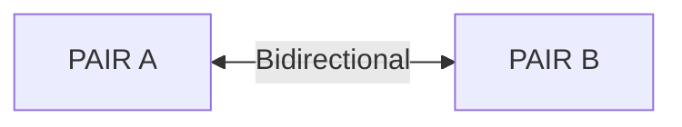

# PAIR 소켓

## 1. 개요

PAIR 소켓은 정확히 하나의 피어와 1:1 양방향 독점 연결을 형성한다. 두 번째 피어가 연결하면 첫 번째 연결은 끊어진다.

**핵심 특성:**
- 단일 파이프만 허용 (1:1 독점)
- 양방향 자유 메시징 (send/recv 순서 무관)
- 가장 단순한 소켓 타입

**유효한 소켓 조합:** PAIR ↔ PAIR



## 2. 기본 사용법

### 생성 및 연결

=== "C"

    ```c
    int hwm = 5000;
    zlink_set_option(socket, ZLINK_OPT_SNDHWM, &hwm, sizeof(hwm));

    int linger = 0;  /* return immediately on close */
    zlink_set_option(socket, ZLINK_OPT_LINGER, &linger, sizeof(linger));
    ```

=== "C++"

    ```cpp
    // Correct order
    a.bind("inproc://signal");     // 1. bind first
    b.connect("inproc://signal");  // 2. connect

    // Wrong order -- fails
    b.connect("inproc://signal");  // fails because bind has not been called yet
    a.bind("inproc://signal");
    ```

=== "Java"

    ```python
    import zlink

    ctx = zlink.Context()

    server = zlink.PairSocket(ctx)
    server.bind("tcp://*:5555")

    client = zlink.PairSocket(ctx)
    client.connect("tcp://localhost:5555")

    client.send(b"ping")

    source_rid, parts = server.recv()
    print(f"Received: {parts[0].decode()}")

    client.close()
    server.close()
    ctx.term()
    ```

=== "Python"

    ```python
    # Correct order
    a.bind("inproc://signal")      # 1. bind first
    b.connect("inproc://signal")   # 2. connect

    # Wrong order -- fails
    b.connect("inproc://signal")   # fails because bind has not been called yet
    a.bind("inproc://signal")
    ```

=== "Node/TypeScript"

    ```typescript
    // Correct order
    a.bind("inproc://signal");     // 1. bind first
    b.connect("inproc://signal");  // 2. connect

    // Wrong order -- fails
    b.connect("inproc://signal");  // fails because bind has not been called yet
    a.bind("inproc://signal");
    ```

=== "C#/.NET"

    ```csharp
    // Correct order
    a.Bind("inproc://signal");     // 1. bind first
    b.Connect("inproc://signal");  // 2. connect

    // Wrong order -- fails
    b.Connect("inproc://signal");  // fails because bind has not been called yet
    a.Bind("inproc://signal");
    ```

=== "Rust"

    ```java
    // Correct order
    a.bind("inproc://signal");     // 1. bind first
    b.connect("inproc://signal");  // 2. connect

    // Wrong order -- fails
    b.connect("inproc://signal");  // fails because bind has not been called yet
    a.bind("inproc://signal");
    ```

=== "Go"

    ```csharp
    using Zlink;

    var ctx = new Context();

    var server = new PairSocket(ctx);
    server.Bind("tcp://*:5555");

    var client = new PairSocket(ctx);
    client.Connect("tcp://localhost:5555");

    client.Send("ping");

    var (rid, parts) = server.Receive();
    Console.WriteLine($"Received: {parts[0].GetString()}");

    client.Close();
    server.Close();
    ctx.Term();
    ```

### 메시지 교환

!!! note "C API 콜백 시그니처"
    수신 핸들러는 C 전용 타입(`zlink_routing_id_t`, `zlink_msg_t`)을
    사용한다. 각 바인딩은 자체적인 관용적 콜백/수신 인터페이스를 제공한다.

    ```cpp
    #include <zlink/socket.hpp>
    #include <iostream>

    int main()
    {
        zlink::context_t ctx;

        zlink::pair_socket_t server(ctx);
        server.bind("tcp://*:5555");

        zlink::pair_socket_t client(ctx);
        client.connect("tcp://localhost:5555");

        client.send("ping");

        auto [rid, parts] = server.recv();
        std::cout << "Received: " << parts[0].str() << std::endl;

        return 0;
    }
    ```

=== "C"

    ```c
    #include <zlink.h>
    #include <string.h>
    #include <stdio.h>

    int main(void)
    {
        void *ctx = zlink_ctx_new();

        void *server = zlink_socket(ctx, ZLINK_PAIR);
        zlink_bind(server, "tcp://*:5555");

        void *client = zlink_socket(ctx, ZLINK_PAIR);
        zlink_connect(client, "tcp://localhost:5555");

        zlink_msg_t msg;
        zlink_msg_init_size(&msg, 4);
        memcpy(zlink_msg_data(&msg), "ping", 4);
        zlink_send(client, &msg, 1, 0);

        zlink_routing_id_t rid;
        zlink_msg_t *parts;
        size_t count;
        zlink_recv(server, &rid, &parts, &count, 0);
        printf("Received: %.*s\n",
               (int)zlink_msg_size(&parts[0]),
               (char *)zlink_msg_data(&parts[0]));
        zlink_multipart_close(parts, count);

        zlink_close(client);
        zlink_close(server);
        zlink_ctx_term(ctx);
        return 0;
    }
    ```

=== "C++"

    ```rust
    // Correct order
    a.bind("inproc://signal");     // 1. bind first
    b.connect("inproc://signal");  // 2. connect

    // Wrong order -- fails
    b.connect("inproc://signal");  // fails because bind has not been called yet
    a.bind("inproc://signal");
    ```

=== "Java"

    ```python
    import zlink

    ctx = zlink.Context()

    server = zlink.PairSocket(ctx)
    server.bind("ipc:///tmp/myapp.ipc")

    client = zlink.PairSocket(ctx)
    client.connect("ipc:///tmp/myapp.ipc")

    client.send(b"ipc-ping")

    source_rid, parts = server.recv()
    print(f"Received: {parts[0].decode()}")

    client.close()
    server.close()
    ctx.term()
    ```

=== "Python"

    ```go
    // Correct order
    a.Bind("inproc://signal")  // 1. bind first
    b.Connect("inproc://signal")  // 2. connect

    // Wrong order -- fails
    b.Connect("inproc://signal")  // fails because bind has not been called yet
    a.Bind("inproc://signal")
    ```

=== "Node/TypeScript"

    ```csharp
    using Zlink;

    var ctx = new Context();

    var server = new PairSocket(ctx);
    server.Bind("ipc:///tmp/myapp.ipc");

    var client = new PairSocket(ctx);
    client.Connect("ipc:///tmp/myapp.ipc");

    client.Send("ipc-ping");

    var (rid, parts) = server.Receive();
    Console.WriteLine($"Received: {parts[0].GetString()}");

    client.Close();
    server.Close();
    ctx.Term();
    ```

=== "C#/.NET"

    ```c
    /* Correct order */
    zlink_bind(a, "inproc://signal");     /* 1. bind first */
    zlink_connect(b, "inproc://signal");  /* 2. connect */

    /* Wrong order -- fails */
    zlink_connect(b, "inproc://signal");  /* fails because bind has not been called yet */
    zlink_bind(a, "inproc://signal");
    ```

=== "Rust"

    ```rust
    use zlink::Context;

    fn main() -> Result<(), Box<dyn std::error::Error>> {
        let ctx = Context::new();

        let server = ctx.pair_socket();
        server.bind("tcp://*:5555")?;

        let client = ctx.pair_socket();
        client.connect("tcp://localhost:5555")?;

        client.send(b"ping")?;

        let (rid, parts) = server.recv()?;
        println!("Received: {}", String::from_utf8_lossy(parts[0].data()));

        Ok(())
    }
    ```

=== "Go"

    ```typescript
    import * as zlink from 'zlink';

    const ctx = new zlink.Context();

    const server = new zlink.PairSocket(ctx);
    server.bind('tcp://*:5555');

    const client = new zlink.PairSocket(ctx);
    client.connect('tcp://localhost:5555');

    client.send(Buffer.from('ping'));

    const [rid, parts] = server.receive();
    console.log(`Received: ${parts[0].toString()}`);

    client.close();
    server.close();
    ctx.term();
    ```

??? example "Full Sample Code -- Recv"

    | Language | Source |
    |----------|--------|
    | C | [pair_recv_sample.c](https://github.com/kairos-code-dev/zlink/blob/main/core/samples/pair_recv_sample.c) |
    | C++ | [pair_recv_sample.cpp](https://github.com/kairos-code-dev/zlink/blob/main/bindings/cpp/samples/pair_recv_sample.cpp) |
    | Java | [PairRecvSample.java](https://github.com/kairos-code-dev/zlink/blob/main/bindings/java/samples/Zlink.Samples/src/main/java/dev/kairoscode/zlink/samples/PairRecvSample.java) |
    | Python | [pair_recv.py](https://github.com/kairos-code-dev/zlink/blob/main/bindings/python/examples/pair_recv.py) |
    | Node | [pair_recv_sample.ts](https://github.com/kairos-code-dev/zlink/blob/main/bindings/node/examples/pair_recv_sample.ts) |
    | C# | [Program.cs](https://github.com/kairos-code-dev/zlink/blob/main/bindings/dotnet/samples/PairRecv/Program.cs) |
    | Rust | [pair_recv_sample.rs](https://github.com/kairos-code-dev/zlink/blob/main/bindings/rust/samples/pair_recv_sample.rs) |
    | Go | [main.go](https://github.com/kairos-code-dev/zlink/blob/main/bindings/go/samples/pair_recv_sample/main.go) |

### Callback 모드

`zlink_recv_handler()`로 콜백을 등록하면 recv 모드에서 callback 모드로
단방향 전환된다. 이후 도착하는 메시지는 콜백을 통해 자동 dispatch된다.

=== "C"

    ```c
    #include <zlink.h>
    #include <string.h>
    #include <stdio.h>

    void on_message(const zlink_routing_id_t *source_rid,
                    zlink_msg_t *parts, size_t part_count,
                    void *userdata)
    {
        printf("Callback received: %.*s\n",
               (int)zlink_msg_size(&parts[0]),
               (char *)zlink_msg_data(&parts[0]));
        for (size_t i = 0; i < part_count; i++)
            zlink_msg_close(&parts[i]);
    }

    int main(void)
    {
        void *ctx = zlink_ctx_new();

        void *server = zlink_socket(ctx, ZLINK_PAIR);
        zlink_bind(server, "tcp://*:5555");

        void *client = zlink_socket(ctx, ZLINK_PAIR);
        zlink_connect(client, "tcp://127.0.0.1:5555");

        /* Transition server to callback mode */
        zlink_recv_handler(server, on_message, NULL);

        /* Send from client to server */
        zlink_msg_t msg;
        zlink_msg_init_size(&msg, 10);
        memcpy(zlink_msg_data(&msg), "hello-pair", 10);
        zlink_send(client, &msg, 1, 0);

        zlink_msleep(200);  /* let callback fire */

        zlink_close(client);
        zlink_close(server);
        zlink_ctx_term(ctx);
        return 0;
    }
    ```

=== "C++"

    ```cpp
    #include <zlink/socket.hpp>
    #include <iostream>
    #include <thread>
    #include <chrono>

    int main()
    {
        zlink::context_t ctx;

        zlink::pair_socket_t server(ctx);
        server.bind("tcp://*:5555");

        zlink::pair_socket_t client(ctx);
        client.connect("tcp://127.0.0.1:5555");

        // Transition server to callback mode
        server.recv_handler([](const zlink::routing_id_t& source_rid,
                               std::span<zlink::msg> parts) {
            std::cout << "Callback received: " << parts[0].str() << std::endl;
        });

        // Send from client to server
        client.send("hello-pair");

        std::this_thread::sleep_for(std::chrono::milliseconds(200));

        return 0;
    }
    ```

=== "Java"

    ```java
    import dev.kairoscode.zlink.*;

    public class PairCallbackExample {
        public static void main(String[] args) throws Exception {
            Context ctx = new Context();

            PairSocket server = new PairSocket(ctx);
            server.bind("tcp://*:5555");

            PairSocket client = new PairSocket(ctx);
            client.connect("tcp://127.0.0.1:5555");

            // Transition server to callback mode
            server.onReceive((sourceRid, parts) -> {
                System.out.println("Callback received: "
                    + parts[0].dataAsString());
            });

            // Send from client to server
            client.send("hello-pair");

            Thread.sleep(200);

            client.close();
            server.close();
            ctx.close();
        }
    }
    ```

=== "Python"

    ```python
    import zlink
    import time

    ctx = zlink.Context()

    server = zlink.PairSocket(ctx)
    server.bind("tcp://*:5555")

    client = zlink.PairSocket(ctx)
    client.connect("tcp://127.0.0.1:5555")

    # Transition server to callback mode
    def on_message(source_rid, parts):
        print(f"Callback received: {parts[0].decode()}")

    server.on_receive(on_message)

    # Send from client to server
    client.send(b"hello-pair")

    time.sleep(0.2)

    client.close()
    server.close()
    ctx.term()
    ```

=== "Node/TypeScript"

    ```typescript
    import * as zlink from 'zlink';

    const ctx = new zlink.Context();

    const server = new zlink.PairSocket(ctx);
    server.bind('tcp://*:5555');

    const client = new zlink.PairSocket(ctx);
    client.connect('tcp://127.0.0.1:5555');

    // Transition server to callback mode
    server.recvHandler((sourceRid, parts) => {
        console.log(`Callback received: ${parts[0].toString()}`);
    });

    // Send from client to server
    client.send(Buffer.from('hello-pair'));

    await new Promise(r => setTimeout(r, 200));

    client.close();
    server.close();
    ctx.term();
    ```

=== "C#/.NET"

    ```csharp
    using Zlink;

    var ctx = new Context();

    var server = new PairSocket(ctx);
    server.Bind("tcp://*:5555");

    var client = new PairSocket(ctx);
    client.Connect("tcp://127.0.0.1:5555");

    // Transition server to callback mode
    server.RecvHandler((sourceRid, parts) => {
        Console.WriteLine($"Callback received: {parts[0].GetString()}");
    });

    // Send from client to server
    client.Send("hello-pair");

    Thread.Sleep(200);

    client.Close();
    server.Close();
    ctx.Term();
    ```

=== "Rust"

    ```rust
    use zlink::Context;
    use std::thread;
    use std::time::Duration;

    fn main() -> Result<(), Box<dyn std::error::Error>> {
        let ctx = Context::new();

        let server = ctx.pair_socket();
        server.bind("tcp://*:5555")?;

        let client = ctx.pair_socket();
        client.connect("tcp://127.0.0.1:5555")?;

        // Transition server to callback mode
        server.on_receive(|source_rid, parts| {
            println!("Callback received: {}",
                     String::from_utf8_lossy(parts[0].data()));
        });

        // Send from client to server
        client.send(b"hello-pair")?;

        thread::sleep(Duration::from_millis(200));

        Ok(())
    }
    ```

=== "Go"

    ```go
    package main

    import (
        "fmt"
        "log"
        "time"
        "github.com/kairos-code-dev/zlink-go"
    )

    func main() {
        ctx, err := zlink.NewContext()
        if err != nil { log.Fatal(err) }
        defer ctx.Close()

        server, err := ctx.PairSocket()
        if err != nil { log.Fatal(err) }
        defer server.Close()
        server.Bind("tcp://*:5555")

        client, err := ctx.PairSocket()
        if err != nil { log.Fatal(err) }
        defer client.Close()
        client.Connect("tcp://127.0.0.1:5555")

        // Transition server to callback mode
        server.OnMessage(func(sourceRid zlink.RoutingID, parts []zlink.Message) {
            fmt.Printf("Callback received: %s\n", parts[0].Data())
        })

        // Send from client to server
        client.Send(zlink.NewMessage([]byte("hello-pair")))

        time.Sleep(200 * time.Millisecond)
    }
    ```

??? example "Full Sample Code -- Callback"

    | Language | Source |
    |----------|--------|
    | C | [pair_callback_sample.c](https://github.com/kairos-code-dev/zlink/blob/main/core/samples/pair_callback_sample.c) |
    | C++ | [pair_callback_sample.cpp](https://github.com/kairos-code-dev/zlink/blob/main/bindings/cpp/samples/pair_callback_sample.cpp) |
    | Java | [PairCallbackSample.java](https://github.com/kairos-code-dev/zlink/blob/main/bindings/java/samples/Zlink.Samples/src/main/java/dev/kairoscode/zlink/samples/PairCallbackSample.java) |
    | Python | [pair_callback.py](https://github.com/kairos-code-dev/zlink/blob/main/bindings/python/examples/pair_callback.py) |
    | Node | [pair_callback_sample.ts](https://github.com/kairos-code-dev/zlink/blob/main/bindings/node/examples/pair_callback_sample.ts) |
    | C# | [Program.cs](https://github.com/kairos-code-dev/zlink/blob/main/bindings/dotnet/samples/PairCallback/Program.cs) |
    | Rust | [pair_callback_sample.rs](https://github.com/kairos-code-dev/zlink/blob/main/bindings/rust/samples/pair_callback_sample.rs) |
    | Go | [main.go](https://github.com/kairos-code-dev/zlink/blob/main/bindings/go/samples/pair_callback_sample/main.go) |

### 멀티파트 데이터 전송

멀티파트 데이터는 단일 `zlink_send` 호출로 parts 배열을 전송한다.

=== "C"

    ```python
    import zlink

    ctx = zlink.Context()

    sender = zlink.PairSocket(ctx)
    sender.bind("tcp://*:5556")

    receiver = zlink.PairSocket(ctx)
    receiver.connect("tcp://127.0.0.1:5556")

    # Send two frames as one multipart message
    sender.send([b"header", b"payload"])

    # Receive both frames in one call
    source_rid, parts = receiver.recv()
    print(f"Frame 0: {parts[0].decode()}")
    print(f"Frame 1: {parts[1].decode()}")

    receiver.close()
    sender.close()
    ctx.term()
    ```

=== "C++"

    ```java
    // Path too long → ENAMETOOLONG error
    socket.bind("ipc:///very/long/path/.../endpoint.ipc");
    ```

=== "Java"

    ```rust
    // Path too long → ENAMETOOLONG error
    socket.bind("ipc:///very/long/path/.../endpoint.ipc");
    ```

=== "Python"

    ```python
    # Path too long → ENAMETOOLONG error
    socket.bind("ipc:///very/long/path/.../endpoint.ipc")
    ```

=== "Node/TypeScript"

    ```go
    socket.SetOption(zlink.OptionSndHWM, 5000)

    socket.SetOption(zlink.OptionLinger, 0)  // return immediately on close
    ```

=== "C#/.NET"

    ```csharp
    // Path too long → ENAMETOOLONG error
    socket.Bind("ipc:///very/long/path/.../endpoint.ipc");
    ```

=== "Rust"

    ```c
    /* Path too long → ENAMETOOLONG error */
    zlink_bind(socket, "ipc:///very/long/path/.../endpoint.ipc");
    ```

=== "Go"

    ```rust
    use zlink::Context;

    fn main() -> Result<(), Box<dyn std::error::Error>> {
        let ctx = Context::new();

        let server = ctx.pair_socket();
        server.bind("ipc:///tmp/myapp.ipc")?;

        let client = ctx.pair_socket();
        client.connect("ipc:///tmp/myapp.ipc")?;

        client.send(b"ipc-ping")?;

        let (rid, parts) = server.recv()?;
        println!("Received: {}", String::from_utf8_lossy(parts[0].data()));

        Ok(())
    }
    ```

> 참고: `core/tests/test_pair_inproc.cpp` — `test_zlink_send_multipart()` 테스트

### 수신 모드

PAIR의 public API는 recv/poller-only다.
`zlink_recv()`로 동기 수신한다.

=== "C"

    ```cpp
    #include <zlink/socket.hpp>
    #include <iostream>

    int main()
    {
        zlink::context_t ctx;

        zlink::pair_socket_t server(ctx);
        server.bind("ipc:///tmp/myapp.ipc");

        zlink::pair_socket_t client(ctx);
        client.connect("ipc:///tmp/myapp.ipc");

        client.send("ipc-ping");

        auto [rid, parts] = server.recv();
        std::cout << "Received: " << parts[0].str() << std::endl;

        return 0;
    }
    ```

=== "C++"

    ```typescript
    // Path too long → ENAMETOOLONG error
    socket.bind("ipc:///very/long/path/.../endpoint.ipc");
    ```

=== "Java"

    ```cpp
    // Path too long → ENAMETOOLONG error
    socket.bind("ipc:///very/long/path/.../endpoint.ipc");
    ```

=== "Python"

    ```go
    // Path too long → ENAMETOOLONG error
    socket.Bind("ipc:///very/long/path/.../endpoint.ipc")
    ```

=== "Node/TypeScript"

    ```typescript
    socket.setOption(ZLINK_OPT_SNDHWM, 5000);

    socket.setOption(ZLINK_OPT_LINGER, 0);  // return immediately on close
    ```

=== "C#/.NET"

    ```csharp
    socket.SetOption(ZLINK_OPT_SNDHWM, 5000);

    socket.SetOption(ZLINK_OPT_LINGER, 0);  // return immediately on close
    ```

=== "Rust"

    ```java
    socket.setOption(ZLINK_OPT_SNDHWM, 5000);

    socket.setOption(ZLINK_OPT_LINGER, 0);  // return immediately on close
    ```

=== "Go"

```
 Allowed:  PAIR A ↔ PAIR B      (1:1)
 Invalid:  PAIR A ← PAIR B      (N:1 attempt drops existing connection)
               ← PAIR C
```

> HWM 도달 시 `zlink_send()`는 블록(기본) 또는 `ZLINK_DONTWAIT`로
> `EAGAIN`을 반환한다. 고급 backpressure 패턴은
> [성능 가이드](10-performance.ko.md)를 참고.

??? example "Full Sample Code"

    | Language | Source |
    |----------|--------|
    | C | [pair_recv_sample.c](https://github.com/kairos-code-dev/zlink/blob/main/core/samples/pair_recv_sample.c) |
    | C++ | [pair_recv_sample.cpp](https://github.com/kairos-code-dev/zlink/blob/main/bindings/cpp/samples/pair_recv_sample.cpp) |
    | Java | [PairRecvSample.java](https://github.com/kairos-code-dev/zlink/blob/main/bindings/java/samples/Zlink.Samples/src/main/java/dev/kairoscode/zlink/samples/PairRecvSample.java) |
    | Python | [pair_recv.py](https://github.com/kairos-code-dev/zlink/blob/main/bindings/python/examples/pair_recv.py) |
    | Node | [pair_recv_sample.ts](https://github.com/kairos-code-dev/zlink/blob/main/bindings/node/examples/pair_recv_sample.ts) |
    | C# | [Program.cs](https://github.com/kairos-code-dev/zlink/blob/main/bindings/dotnet/samples/PairRecv/Program.cs) |
    | Rust | [pair_recv_sample.rs](https://github.com/kairos-code-dev/zlink/blob/main/bindings/rust/samples/pair_recv_sample.rs) |
    | Go | [main.go](https://github.com/kairos-code-dev/zlink/blob/main/bindings/go/samples/pair_recv_sample/main.go) |

## 3. 메시지 형식

PAIR 소켓의 메시지 프레임에는 **애플리케이션 데이터만** 포함된다.

```
Single frame:     [data]
Multipart frame:  [frame1][frame2]...[frameN]
```

> `source_rid` 등 공통 수신 인터페이스는
> [소켓 패턴 개요](03-0-socket-patterns.ko.md#7-공통-수신-인터페이스)를 참고.

멀티파트 전송:

=== "C"

    ```typescript
    import * as zlink from 'zlink';

    const ctx = new zlink.Context();

    const server = new zlink.PairSocket(ctx);
    server.bind('ipc:///tmp/myapp.ipc');

    const client = new zlink.PairSocket(ctx);
    client.connect('ipc:///tmp/myapp.ipc');

    client.send(Buffer.from('ipc-ping'));

    const [rid, parts] = server.receive();
    console.log(`Received: ${parts[0].toString()}`);

    client.close();
    server.close();
    ctx.term();
    ```

=== "C++"

    ```csharp
    socket.SetOption(ZLINK_OPT_LINGER, 0);
    ```

=== "Java"

    ```java
    socket.setOption(ZLINK_OPT_LINGER, 0);
    ```

=== "Python"

    ```python
    socket.set_option(ZLINK_OPT_LINGER, 0)
    ```

=== "Node/TypeScript"

    ```rust
    socket.set_option(ZLINK_OPT_LINGER, 0);
    ```

=== "C#/.NET"

    ```go
    socket.SetOption(zlink.OptionLinger, 0)
    ```

=== "Rust"

    ```typescript
    socket.setOption(ZLINK_OPT_LINGER, 0);
    ```

=== "Go"

    ```c
    int linger = 0;
    zlink_set_option(socket, ZLINK_OPT_LINGER, &linger, sizeof(linger));
    ```

## 4. 소켓 옵션

| 옵션 | 타입 | 기본값 | 설명 |
|------|------|--------|------|
| `ZLINK_OPT_SNDHWM` | int | 1000 | 송신 큐 최대 메시지 수 |
| `ZLINK_OPT_RCVHWM` | int | 1000 | 수신 큐 최대 메시지 수 |
| `ZLINK_OPT_LINGER` | int | -1 | close 시 미전송 메시지 대기 시간 (ms), -1=무한 |
| `ZLINK_OPT_SNDTIMEO` | int | -1 | 송신 타임아웃 (ms), -1=무한 |
| `ZLINK_OPT_RCVTIMEO` | int | -1 | 수신 타임아웃 (ms), -1=무한 |

=== "C"

    ```rust
    socket.set_option(ZLINK_OPT_SNDHWM, 5000);

    socket.set_option(ZLINK_OPT_LINGER, 0);  // return immediately on close
    ```

=== "C++"

    ```cpp
    socket.set_option(ZLINK_OPT_SNDHWM, 5000);

    socket.set_option(ZLINK_OPT_LINGER, 0);  // return immediately on close
    ```

=== "Java"

    ```python
    socket.set_option(ZLINK_OPT_SNDHWM, 5000)

    socket.set_option(ZLINK_OPT_LINGER, 0)  # return immediately on close
    ```

=== "Python"

    ```cpp
    socket.set_option(ZLINK_OPT_LINGER, 0);
    ```

=== "Node/TypeScript"

    ```python
    import zlink

    ctx = zlink.Context()

    # Server: wildcard port
    server = zlink.PairSocket(ctx)
    server.bind("tcp://127.0.0.1:*")

    # Query the assigned endpoint
    endpoint = server.get_option(ZLINK_OPT_LAST_ENDPOINT)
    print(f"Server bound to: {endpoint}")

    # Client: connect using the queried endpoint
    client = zlink.PairSocket(ctx)
    client.connect(endpoint)

    # Exchange a message
    client.send(b"ping")

    source_rid, parts = server.recv()
    print(f"Received: {parts[0].decode()}")

    client.close()
    server.close()
    ctx.term()
    ```

=== "C#/.NET"

    ```csharp
    socket.SetOption(ZLINK_OPT_SNDHWM, 5000);

    socket.SetOption(ZLINK_OPT_LINGER, 0);  // close 즉시 반환
    ```

=== "Rust"

    ```rust
    socket.set_option(ZLINK_OPT_SNDHWM, 5000);

    socket.set_option(ZLINK_OPT_LINGER, 0);  // close 즉시 반환
    ```

=== "Go"

    ```python
    import zlink

    ctx = zlink.Context()

    # Main thread side
    main_sock = zlink.PairSocket(ctx)
    main_sock.bind("inproc://signal")

    # Worker thread side (same context)
    worker_sock = zlink.PairSocket(ctx)
    worker_sock.connect("inproc://signal")

    # Worker sends completion signal
    worker_sock.send(b"DONE")

    # Main thread receives signal
    source_rid, parts = main_sock.recv()
    print(f"Signal: {parts[0].decode()}")

    worker_sock.close()
    main_sock.close()
    ctx.term()
    ```

## 5. 사용 패턴

### 패턴 1: 스레드 간 시그널링 (inproc)

가장 일반적인 PAIR 사용 사례. inproc transport로 스레드 간 zero-copy 통신.

=== "C"

    ```csharp
    using Zlink;

    var ctx = new Context();

    // Main thread side
    var mainSock = new PairSocket(ctx);
    mainSock.Bind("inproc://signal");

    // Worker thread side (same context)
    var workerSock = new PairSocket(ctx);
    workerSock.Connect("inproc://signal");

    // Worker sends completion signal
    workerSock.Send("DONE");

    // Main thread receives signal
    var (rid, parts) = mainSock.Receive();
    Console.WriteLine($"Signal: {parts[0].GetString()}");

    workerSock.Close();
    mainSock.Close();
    ctx.Term();
    ```

=== "C++"

    ```cpp
    #include <zlink/socket.hpp>
    #include <iostream>

    int main()
    {
        zlink::context_t ctx;

        // Main thread side
        zlink::pair_socket_t main_sock(ctx);
        main_sock.bind("inproc://signal");

        // Worker thread side (same context)
        zlink::pair_socket_t worker_sock(ctx);
        worker_sock.connect("inproc://signal");

        // Worker sends completion signal
        worker_sock.send("DONE");

        // Main thread receives signal
        auto [rid, parts] = main_sock.recv();
        std::cout << "Signal: " << parts[0].str() << std::endl;

        return 0;
    }
    ```

=== "Java"

    ```csharp
    using Zlink;

    var ctx = new Context();

    var sender = new PairSocket(ctx);
    sender.Bind("tcp://*:5556");

    var receiver = new PairSocket(ctx);
    receiver.Connect("tcp://127.0.0.1:5556");

    // Send two frames as one multipart message
    sender.Send("header", "payload");

    // Receive both frames in one call
    var (rid, parts) = receiver.Receive();
    Console.WriteLine($"Frame 0: {parts[0].GetString()}");
    Console.WriteLine($"Frame 1: {parts[1].GetString()}");

    receiver.Close();
    sender.Close();
    ctx.Term();
    ```

=== "Python"

    ```python
    import zlink

    ctx = zlink.Context()

    server = zlink.PairSocket(ctx)
    server.bind("tcp://*:5555")

    client = zlink.PairSocket(ctx)
    client.connect("tcp://127.0.0.1:5555")

    # Send from client to server
    client.send(b"hello-pair")

    # Receive on server
    source_rid, parts = server.recv()
    print(f"Received: {parts[0].decode()}")

    # Send reply back (bidirectional)
    server.send(b"World")

    source_rid, reply = client.recv()
    print(f"Reply: {reply[0].decode()}")

    client.close()
    server.close()
    ctx.term()
    ```

=== "Node/TypeScript"

    ```typescript
    import * as zlink from 'zlink';

    const ctx = new zlink.Context();

    // Main thread side
    const mainSock = new zlink.PairSocket(ctx);
    mainSock.bind('inproc://signal');

    // Worker thread side (same context)
    const workerSock = new zlink.PairSocket(ctx);
    workerSock.connect('inproc://signal');

    // Worker sends completion signal
    workerSock.send(Buffer.from('DONE'));

    // Main thread receives signal
    const [rid, parts] = mainSock.receive();
    console.log(`Signal: ${parts[0].toString()}`);

    workerSock.close();
    mainSock.close();
    ctx.term();
    ```

=== "C#/.NET"

    ```java
    import dev.kairoscode.zlink.*;

    public class IpcExample {
        public static void main(String[] args) {
            Context ctx = new Context();

            PairSocket server = new PairSocket(ctx);
            server.bind("ipc:///tmp/myapp.ipc");

            PairSocket client = new PairSocket(ctx);
            client.connect("ipc:///tmp/myapp.ipc");

            client.send("ipc-ping");

            Message msg = server.recv();
            System.out.println("Received: " + msg.partAsString(0));

            client.close();
            server.close();
            ctx.close();
        }
    }
    ```

=== "Rust"

    ```rust
    use zlink::Context;

    fn main() -> Result<(), Box<dyn std::error::Error>> {
        let ctx = Context::new();

        // Main thread side
        let main_sock = ctx.pair_socket();
        main_sock.bind("inproc://signal")?;

        // Worker thread side (same context)
        let worker_sock = ctx.pair_socket();
        worker_sock.connect("inproc://signal")?;

        // Worker sends completion signal
        worker_sock.send(b"DONE")?;

        // Main thread receives signal
        let (rid, parts) = main_sock.recv()?;
        println!("Signal: {}", String::from_utf8_lossy(parts[0].data()));

        Ok(())
    }
    ```

=== "Go"

    ```csharp
    using Zlink;

    var ctx = new Context();

    // Server: wildcard port
    var server = new PairSocket(ctx);
    server.Bind("tcp://127.0.0.1:*");

    // Query the assigned endpoint
    var endpoint = server.GetOption(ZLINK_OPT_LAST_ENDPOINT);
    Console.WriteLine($"Server bound to: {endpoint}");

    // Client: connect using the queried endpoint
    var client = new PairSocket(ctx);
    client.Connect(endpoint);

    // Exchange a message
    client.Send("ping");

    var (rid, parts) = server.Receive();
    Console.WriteLine($"Received: {parts[0].GetString()}");

    client.Close();
    server.Close();
    ctx.Term();
    ```

> 참고: `core/tests/test_pair_inproc.cpp` — bind → connect → bounce 패턴

### 패턴 2: TCP 통신

네트워크를 통한 1:1 통신. 와일드카드 바인드로 포트 자동 할당 가능.

=== "C"

    ```typescript
    import * as zlink from 'zlink';

    const ctx = new zlink.Context();

    const sender = new zlink.PairSocket(ctx);
    sender.bind('tcp://*:5556');

    const receiver = new zlink.PairSocket(ctx);
    receiver.connect('tcp://127.0.0.1:5556');

    // Send two frames as one multipart message
    sender.send([Buffer.from('header'), Buffer.from('payload')]);

    // Receive both frames in one call
    const [rid, parts] = receiver.receive();
    console.log(`Frame 0: ${parts[0].toString()}`);
    console.log(`Frame 1: ${parts[1].toString()}`);

    receiver.close();
    sender.close();
    ctx.term();
    ```

=== "C++"

    ```cpp
    #include <zlink/socket.hpp>
    #include <iostream>

    int main()
    {
        zlink::context_t ctx;

        zlink::pair_socket_t sender(ctx);
        sender.bind("tcp://*:5556");

        zlink::pair_socket_t receiver(ctx);
        receiver.connect("tcp://127.0.0.1:5556");

        // Send two frames as one multipart message
        sender.send({"header", "payload"});

        // Receive both frames in one call
        auto [rid, parts] = receiver.recv();
        std::cout << "Frame 0: " << parts[0].str() << std::endl;
        std::cout << "Frame 1: " << parts[1].str() << std::endl;

        return 0;
    }
    ```

=== "Java"

    ```csharp
    using Zlink;

    var ctx = new Context();

    var server = new PairSocket(ctx);
    server.Bind("tcp://*:5555");

    var client = new PairSocket(ctx);
    client.Connect("tcp://127.0.0.1:5555");

    // Send from client to server
    client.Send("hello-pair");

    // Receive on server
    var (rid, parts) = server.Receive();
    Console.WriteLine($"Received: {parts[0].GetString()}");

    // Send reply back (bidirectional)
    server.Send("World");

    var (rid2, reply) = client.Receive();
    Console.WriteLine($"Reply: {reply[0].GetString()}");

    client.Close();
    server.Close();
    ctx.Term();
    ```

=== "Python"

    ```typescript
    import * as zlink from 'zlink';

    const ctx = new zlink.Context();

    // Server: wildcard port
    const server = new zlink.PairSocket(ctx);
    server.bind('tcp://127.0.0.1:*');

    // Query the assigned endpoint
    const endpoint = server.getOption(ZLINK_OPT_LAST_ENDPOINT);
    console.log(`Server bound to: ${endpoint}`);

    // Client: connect using the queried endpoint
    const client = new zlink.PairSocket(ctx);
    client.connect(endpoint);

    // Exchange a message
    client.send(Buffer.from('ping'));

    const [rid, parts] = server.receive();
    console.log(`Received: ${parts[0].toString()}`);

    client.close();
    server.close();
    ctx.term();
    ```

=== "Node/TypeScript"

    ```java
    import dev.kairoscode.zlink.*;

    public class DnsConnectExample {
        public static void main(String[] args) {
            Context ctx = new Context();

            PairSocket server = new PairSocket(ctx);
            server.bind("tcp://*:5555");

            PairSocket client = new PairSocket(ctx);
            client.connect("tcp://localhost:5555");

            client.send("ping");

            Message msg = server.recv();
            System.out.println("Received: " + msg.partAsString(0));

            client.close();
            server.close();
            ctx.close();
        }
    }
    ```

=== "C#/.NET"

    ```rust
    use zlink::Context;

    fn main() -> Result<(), Box<dyn std::error::Error>> {
        let ctx = Context::new();

        let sender = ctx.pair_socket();
        sender.bind("tcp://*:5556")?;

        let receiver = ctx.pair_socket();
        receiver.connect("tcp://127.0.0.1:5556")?;

        // Send two frames as one multipart message
        sender.send(&[b"header", b"payload"])?;

        // Receive both frames in one call
        let (rid, parts) = receiver.recv()?;
        println!("Frame 0: {}", String::from_utf8_lossy(parts[0].data()));
        println!("Frame 1: {}", String::from_utf8_lossy(parts[1].data()));

        Ok(())
    }
    ```

=== "Rust"

    ```rust
    use zlink::Context;

    fn main() -> Result<(), Box<dyn std::error::Error>> {
        let ctx = Context::new();

        // Server: wildcard port
        let server = ctx.pair_socket();
        server.bind("tcp://127.0.0.1:*")?;

        // Query the assigned endpoint
        let endpoint = server.get_option::<String>(ZLINK_OPT_LAST_ENDPOINT);
        println!("Server bound to: {}", endpoint);

        // Client: connect using the queried endpoint
        let client = ctx.pair_socket();
        client.connect(&endpoint)?;

        // Exchange a message
        client.send(b"ping")?;

        let (rid, parts) = server.recv()?;
        println!("Received: {}", String::from_utf8_lossy(parts[0].data()));

        Ok(())
    }
    ```

=== "Go"

    ```typescript
    import * as zlink from 'zlink';

    const ctx = new zlink.Context();

    const server = new zlink.PairSocket(ctx);
    server.bind('tcp://*:5555');

    const client = new zlink.PairSocket(ctx);
    client.connect('tcp://127.0.0.1:5555');

    // Send from client to server
    client.send(Buffer.from('hello-pair'));

    // Receive on server
    const [rid, parts] = server.receive();
    console.log(`Received: ${parts[0].toString()}`);

    // Send reply back (bidirectional)
    server.send(Buffer.from('World'));

    const [rid2, reply] = client.receive();
    console.log(`Reply: ${reply[0].toString()}`);

    client.close();
    server.close();
    ctx.term();
    ```

> 참고: `core/tests/test_pair_tcp.cpp` — `bind_loopback_ipv4()` + 와일드카드 바인드

### 패턴 3: DNS 이름 연결

호스트명으로도 연결 가능하다.

=== "C"

    ```c
    void *client = zlink_socket(ctx, ZLINK_PAIR);
    zlink_connect(client, "tcp://localhost:5555");
    ```

=== "C++"

    ```cpp
    zlink::pair_socket_t client(ctx);
    client.connect("tcp://localhost:5555");
    ```

=== "Java"

    ```java
    PairSocket client = new PairSocket(ctx);
    client.connect("tcp://localhost:5555");
    ```

=== "Python"

    ```python
    client = zlink.PairSocket(ctx)
    client.connect("tcp://localhost:5555")
    ```

=== "Node/TypeScript"

    ```typescript
    const client = new zlink.PairSocket(ctx);
    client.connect("tcp://localhost:5555");
    ```

=== "C#/.NET"

    ```csharp
    var client = new PairSocket(ctx);
    client.Connect("tcp://localhost:5555");
    ```

=== "Rust"

    ```rust
    let client = ctx.pair_socket();
    client.connect("tcp://localhost:5555");
    ```

=== "Go"

    ```go
    client, _ := ctx.PairSocket()
    client.Connect("tcp://localhost:5555")
    ```

> 참고: `core/tests/test_pair_tcp.cpp` — `test_pair_tcp_connect_by_name()`

### 패턴 4: IPC 통신

같은 머신의 프로세스 간 통신 (Linux/macOS).

=== "C"

    ```cpp
    #include <zlink/socket.hpp>
    #include <iostream>

    int main()
    {
        zlink::context_t ctx;

        // Server: wildcard port
        zlink::pair_socket_t server(ctx);
        server.bind("tcp://127.0.0.1:*");

        // Query the assigned endpoint
        auto endpoint = server.get_option<std::string>(ZLINK_OPT_LAST_ENDPOINT);
        std::cout << "Server bound to: " << endpoint << std::endl;

        // Client: connect using the queried endpoint
        zlink::pair_socket_t client(ctx);
        client.connect(endpoint);

        // Exchange a message
        client.send("ping");

        auto [rid, parts] = server.recv();
        std::cout << "Received: " << parts[0].str() << std::endl;

        return 0;
    }
    ```

=== "C++"

    ```cpp
    #include <zlink/socket.hpp>
    #include <iostream>

    int main()
    {
        zlink::context_t ctx;

        zlink::pair_socket_t server(ctx);
        server.bind("tcp://*:5555");

        zlink::pair_socket_t client(ctx);
        client.connect("tcp://127.0.0.1:5555");

        // Send from client to server
        client.send("hello-pair");

        // Receive on server
        auto [rid, parts] = server.recv();
        std::cout << "Received: " << parts[0].str() << std::endl;

        // Send reply back (bidirectional)
        server.send("World");

        auto [rid2, reply] = client.recv();
        std::cout << "Reply: " << reply[0].str() << std::endl;

        return 0;
    }
    ```

=== "Java"

    ```rust
    use zlink::Context;

    fn main() -> Result<(), Box<dyn std::error::Error>> {
        let ctx = Context::new();

        let server = ctx.pair_socket();
        server.bind("tcp://*:5555")?;

        let client = ctx.pair_socket();
        client.connect("tcp://127.0.0.1:5555")?;

        // Send from client to server
        client.send(b"hello-pair")?;

        // Receive on server
        let (rid, parts) = server.recv()?;
        println!("Received: {}", String::from_utf8_lossy(parts[0].data()));

        // Send reply back (bidirectional)
        server.send(b"World")?;

        let (rid2, reply) = client.recv()?;
        println!("Reply: {}", String::from_utf8_lossy(reply[0].data()));

        Ok(())
    }
    ```

=== "Python"

    ```go
    package main

    import (
        "fmt"
        "log"
        "github.com/kairos-code-dev/zlink-go"
    )

    func main() {
        ctx, err := zlink.NewContext()
        if err != nil { log.Fatal(err) }
        defer ctx.Close()

        server, err := ctx.PairSocket()
        if err != nil { log.Fatal(err) }
        defer server.Close()
        server.Bind("ipc:///tmp/myapp.ipc")

        client, err := ctx.PairSocket()
        if err != nil { log.Fatal(err) }
        defer client.Close()
        client.Connect("ipc:///tmp/myapp.ipc")

        client.Send(zlink.NewMessage([]byte("ipc-ping")))

        received, err := server.Recv()
        if err != nil { log.Fatal(err) }
        fmt.Printf("Received: %s\n", received.Parts[0].Data())
        received.Close()
    }
    ```

=== "Node/TypeScript"

    ```java
    import dev.kairoscode.zlink.*;

    public class PairMultipartExample {
        public static void main(String[] args) {
            Context ctx = new Context();

            PairSocket sender = new PairSocket(ctx);
            sender.bind("tcp://*:5556");

            PairSocket receiver = new PairSocket(ctx);
            receiver.connect("tcp://127.0.0.1:5556");

            // Send two frames as one multipart message
            sender.send("header", "payload");

            // Receive both frames in one call
            Message msg = receiver.recv();
            System.out.println("Frame 0: " + msg.partAsString(0));
            System.out.println("Frame 1: " + msg.partAsString(1));

            receiver.close();
            sender.close();
            ctx.close();
        }
    }
    ```

=== "C#/.NET"

    ```java
    import dev.kairoscode.zlink.*;

    public class InprocSignalExample {
        public static void main(String[] args) {
            Context ctx = new Context();

            // Main thread side
            PairSocket mainSock = new PairSocket(ctx);
            mainSock.bind("inproc://signal");

            // Worker thread side (same context)
            PairSocket workerSock = new PairSocket(ctx);
            workerSock.connect("inproc://signal");

            // Worker sends completion signal
            workerSock.send("DONE");

            // Main thread receives signal
            Message msg = mainSock.recv();
            System.out.println("Signal: " + msg.partAsString(0));

            workerSock.close();
            mainSock.close();
            ctx.close();
        }
    }
    ```

=== "Rust"

    ```go
    package main

    import (
        "fmt"
        "log"
        "github.com/kairos-code-dev/zlink-go"
    )

    func main() {
        ctx, err := zlink.NewContext()
        if err != nil { log.Fatal(err) }
        defer ctx.Close()

        server, err := ctx.PairSocket()
        if err != nil { log.Fatal(err) }
        defer server.Close()
        server.Bind("tcp://*:5555")

        client, err := ctx.PairSocket()
        if err != nil { log.Fatal(err) }
        defer client.Close()
        client.Connect("tcp://localhost:5555")

        client.Send(zlink.NewMessage([]byte("ping")))

        received, err := server.Recv()
        if err != nil { log.Fatal(err) }
        fmt.Printf("Received: %s\n", received.Parts[0].Data())
        received.Close()
    }
    ```

=== "Go"

    ```java
    import dev.kairoscode.zlink.*;

    public class PairExample {
        public static void main(String[] args) {
            Context ctx = new Context();

            PairSocket server = new PairSocket(ctx);
            server.bind("tcp://*:5555");

            PairSocket client = new PairSocket(ctx);
            client.connect("tcp://127.0.0.1:5555");

            // Send from client to server
            client.send("hello-pair");

            // Receive on server
            Message msg = server.recv();
            System.out.println("Received: " + msg.partAsString(0));

            // Send reply back (bidirectional)
            server.send("World");

            Message reply = client.recv();
            System.out.println("Reply: " + reply.partAsString(0));

            client.close();
            server.close();
            ctx.close();
        }
    }
    ```

> 참고: `core/tests/test_pair_ipc.cpp` — IPC 경로 길이 검증 포함

## 6. 주의사항

### 단일 피어만 허용

PAIR 소켓은 하나의 연결만 유지한다. 두 번째 피어가 connect하면 첫 번째 연결이 끊어진다.

```
 허용:  PAIR A ↔ PAIR B      (1:1)
 불가:  PAIR A ← PAIR B      (N:1 시도 시 기존 연결 끊김)
               ← PAIR C
```

N:1 통신이 필요하면 DEALER/ROUTER를 사용한다.

### inproc bind 순서

inproc transport는 **반드시 bind가 connect보다 먼저** 호출되어야 한다.

=== "C"

    ```c
    #include <zlink.h>
    #include <string.h>
    #include <stdio.h>

    int main(void)
    {
        void *ctx = zlink_ctx_new();

        void *server = zlink_socket(ctx, ZLINK_PAIR);
        zlink_bind(server, "ipc:///tmp/myapp.ipc");

        void *client = zlink_socket(ctx, ZLINK_PAIR);
        zlink_connect(client, "ipc:///tmp/myapp.ipc");

        zlink_msg_t msg;
        zlink_msg_init_size(&msg, 8);
        memcpy(zlink_msg_data(&msg), "ipc-ping", 8);
        zlink_send(client, &msg, 1, 0);

        zlink_routing_id_t rid;
        zlink_msg_t *parts;
        size_t count;
        zlink_recv(server, &rid, &parts, &count, 0);
        printf("Received: %.*s\n",
               (int)zlink_msg_size(&parts[0]),
               (char *)zlink_msg_data(&parts[0]));
        zlink_multipart_close(parts, count);

        zlink_close(client);
        zlink_close(server);
        zlink_ctx_term(ctx);
        return 0;
    }
    ```

=== "C++"

    ```java
    import dev.kairoscode.zlink.*;

    public class TcpWildcardExample {
        public static void main(String[] args) {
            Context ctx = new Context();

            // Server: wildcard port
            PairSocket server = new PairSocket(ctx);
            server.bind("tcp://127.0.0.1:*");

            // Query the assigned endpoint
            String endpoint = server.getOption(ZLINK_OPT_LAST_ENDPOINT);
            System.out.println("Server bound to: " + endpoint);

            // Client: connect using the queried endpoint
            PairSocket client = new PairSocket(ctx);
            client.connect(endpoint);

            // Exchange a message
            client.send("ping");

            Message msg = server.recv();
            System.out.println("Received: " + msg.partAsString(0));

            client.close();
            server.close();
            ctx.close();
        }
    }
    ```

=== "Java"

    ```go
    package main

    import (
        "fmt"
        "log"
        "github.com/kairos-code-dev/zlink-go"
    )

    func main() {
        ctx, err := zlink.NewContext()
        if err != nil { log.Fatal(err) }
        defer ctx.Close()

        // Main thread side
        mainSock, err := ctx.PairSocket()
        if err != nil { log.Fatal(err) }
        defer mainSock.Close()
        mainSock.Bind("inproc://signal")

        // Worker thread side (same context)
        workerSock, err := ctx.PairSocket()
        if err != nil { log.Fatal(err) }
        defer workerSock.Close()
        workerSock.Connect("inproc://signal")

        // Worker sends completion signal
        workerSock.Send(zlink.NewMessage([]byte("DONE")))

        // Main thread receives signal
        received, err := mainSock.Recv()
        if err != nil { log.Fatal(err) }
        fmt.Printf("Signal: %s\n", received.Parts[0].Data())
        received.Close()
    }
    ```

=== "Python"

    ```go
    package main

    import (
        "fmt"
        "log"
        "github.com/kairos-code-dev/zlink-go"
    )

    func main() {
        ctx, err := zlink.NewContext()
        if err != nil { log.Fatal(err) }
        defer ctx.Close()

        sender, err := ctx.PairSocket()
        if err != nil { log.Fatal(err) }
        defer sender.Close()
        sender.Bind("tcp://*:5556")

        receiver, err := ctx.PairSocket()
        if err != nil { log.Fatal(err) }
        defer receiver.Close()
        receiver.Connect("tcp://127.0.0.1:5556")

        // Send two frames as one multipart message
        sender.SendMultipart([]zlink.Message{
            zlink.NewMessage([]byte("header")),
            zlink.NewMessage([]byte("payload")),
        })

        // Receive both frames in one call
        received, err := receiver.Recv()
        if err != nil { log.Fatal(err) }
        fmt.Printf("Frame 0: %s\n", received.Parts[0].Data())
        fmt.Printf("Frame 1: %s\n", received.Parts[1].Data())
        received.Close()
    }
    ```

=== "Node/TypeScript"

    ```go
    package main

    import (
        "fmt"
        "log"
        "github.com/kairos-code-dev/zlink-go"
    )

    func main() {
        ctx, err := zlink.NewContext()
        if err != nil { log.Fatal(err) }
        defer ctx.Close()

        // Server: wildcard port
        server, err := ctx.PairSocket()
        if err != nil { log.Fatal(err) }
        defer server.Close()
        server.Bind("tcp://127.0.0.1:*")

        // Query the assigned endpoint
        status, _ := server.StatusSnapshot()
        endpoint := status.LocalEndpoint
        fmt.Printf("Server bound to: %s\n", endpoint)

        // Client: connect using the queried endpoint
        client, err := ctx.PairSocket()
        if err != nil { log.Fatal(err) }
        defer client.Close()
        client.Connect(endpoint)

        // Exchange a message
        client.Send(zlink.NewMessage([]byte("ping")))

        received, err := server.Recv()
        if err != nil { log.Fatal(err) }
        fmt.Printf("Received: %s\n", received.Parts[0].Data())
        received.Close()
    }
    ```

=== "C#/.NET"

    ```go
    package main

    import (
        "fmt"
        "log"
        "github.com/kairos-code-dev/zlink-go"
    )

    func main() {
        ctx, err := zlink.NewContext()
        if err != nil { log.Fatal(err) }
        defer ctx.Close()

        server, err := ctx.PairSocket()
        if err != nil { log.Fatal(err) }
        defer server.Close()
        server.Bind("tcp://*:5555")

        client, err := ctx.PairSocket()
        if err != nil { log.Fatal(err) }
        defer client.Close()
        client.Connect("tcp://127.0.0.1:5555")

        // Send from client to server
        client.Send(zlink.NewMessage([]byte("hello-pair")))

        // Receive on server
        received, err := server.Recv()
        if err != nil { log.Fatal(err) }
        fmt.Printf("Received: %s\n", received.Parts[0].Data())
        received.Close()

        // Send reply back (bidirectional)
        server.Send(zlink.NewMessage([]byte("World")))

        reply, err := client.Recv()
        if err != nil { log.Fatal(err) }
        fmt.Printf("Reply: %s\n", reply.Parts[0].Data())
        reply.Close()
    }
    ```

=== "Rust"

    ```rust
    // 올바른 순서
    a.bind("inproc://signal");     // 1. bind 먼저
    b.connect("inproc://signal");  // 2. connect

    // 잘못된 순서 — 실패
    b.connect("inproc://signal");  // bind가 아직 없으므로 실패
    a.bind("inproc://signal");
    ```

=== "Go"

    ```go
    // 올바른 순서
    a.Bind("inproc://signal")  // 1. bind 먼저
    b.Connect("inproc://signal")  // 2. connect

    // 잘못된 순서 — 실패
    b.Connect("inproc://signal")  // bind가 아직 없으므로 실패
    a.Bind("inproc://signal")
    ```

### IPC 경로 길이

IPC 엔드포인트의 파일 경로는 시스템 제한(보통 108자)을 초과할 수 없다.

=== "C"

    ```c
    /* 너무 긴 경로 → ENAMETOOLONG 에러 */
    zlink_bind(socket, "ipc:///very/long/path/.../endpoint.ipc");
    ```

=== "C++"

    ```cpp
    // 너무 긴 경로 → ENAMETOOLONG 에러
    socket.bind("ipc:///very/long/path/.../endpoint.ipc");
    ```

=== "Java"

    ```java
    // 너무 긴 경로 → ENAMETOOLONG 에러
    socket.bind("ipc:///very/long/path/.../endpoint.ipc");
    ```

=== "Python"

    ```python
    # 너무 긴 경로 → ENAMETOOLONG 에러
    socket.bind("ipc:///very/long/path/.../endpoint.ipc")
    ```

=== "Node/TypeScript"

    ```typescript
    // 너무 긴 경로 → ENAMETOOLONG 에러
    socket.bind("ipc:///very/long/path/.../endpoint.ipc");
    ```

=== "C#/.NET"

    ```csharp
    // 너무 긴 경로 → ENAMETOOLONG 에러
    socket.Bind("ipc:///very/long/path/.../endpoint.ipc");
    ```

=== "Rust"

    ```rust
    // 너무 긴 경로 → ENAMETOOLONG 에러
    socket.bind("ipc:///very/long/path/.../endpoint.ipc");
    ```

=== "Go"

    ```go
    // 너무 긴 경로 → ENAMETOOLONG 에러
    socket.Bind("ipc:///very/long/path/.../endpoint.ipc")
    ```

> 참고: `core/tests/test_pair_ipc.cpp` — `test_endpoint_too_long()`

### HWM 동작

피어가 없거나 느릴 때, 송신 메시지는 HWM까지 큐잉된다. HWM 초과 시 `zlink_send()`가 블록(기본) 또는 `EAGAIN` 반환(`ZLINK_DONTWAIT`).

### LINGER 설정

`zlink_close()` 호출 시 미전송 메시지가 남아 있으면 LINGER 시간만큼 대기한다. 테스트나 빠른 종료가 필요한 경우:

=== "C"

    ```c
    int linger = 0;
    zlink_set_option(socket, ZLINK_OPT_LINGER, &linger, sizeof(linger));
    ```

=== "C++"

    ```cpp
    socket.set_option(ZLINK_OPT_LINGER, 0);
    ```

=== "Java"

    ```java
    socket.setOption(ZLINK_OPT_LINGER, 0);
    ```

=== "Python"

    ```python
    socket.set_option(ZLINK_OPT_LINGER, 0)
    ```

=== "Node/TypeScript"

    ```typescript
    socket.setOption(ZLINK_OPT_LINGER, 0);
    ```

=== "C#/.NET"

    ```csharp
    socket.SetOption(ZLINK_OPT_LINGER, 0);
    ```

=== "Rust"

    ```rust
    socket.set_option(ZLINK_OPT_LINGER, 0);
    ```

=== "Go"

    ```go
    socket.SetOption(zlink.OptionLinger, 0)
    ```

---
[← 소켓 패턴](03-0-socket-patterns.ko.md) | [PUB/SUB →](03-2-pubsub.ko.md)
