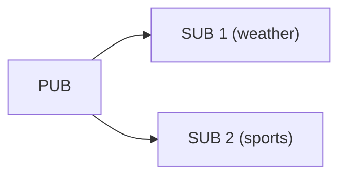

# PUB/SUB/XPUB/XSUB 발행-구독

## 1. 개요

발행-구독(Publish-Subscribe) 패턴은 메시지를 토픽 기반으로 분배한다.
zlink는 기본 PUB/SUB과 고급 XPUB/XSUB 두 가지 레벨을 제공한다.

| 소켓 | 역할 | 특성 |
|------|------|------|
| **PUB** | 발행자 | 모든 구독자에게 브로드캐스트. 수신 불가. |
| **SUB** | 구독자 | 토픽 prefix match 필터링. 송신 불가. |
| **XPUB** | 고급 발행자 | PUB + 구독 이벤트 수신 가능 |
| **XSUB** | 고급 구독자 | 로컬 필터링 없이 모든 메시지 수신. 프록시/중계용 |

**유효한 소켓 조합:**
- PUB → SUB, PUB → XSUB
- XPUB → SUB, XPUB → XSUB

### SUB vs XSUB — 핵심 차이

SUB과 XSUB은 모두 `zlink_set_subscription()`으로 구독 정보를
upstream PUB에 전송한다. 공개 API 사용법은 동일하다.
차이는 **로컬 필터 엔진의 on/off**다.

| | SUB (`filter=true`) | XSUB (`filter=false`) |
|---|---|---|
| 구독 있을 때 | 매칭되는 메시지만 수신 | **모든 메시지 수신** (필터 체크 안 함) |
| 구독 없을 때 | **아무것도 수신하지 않음** | **모든 메시지 수신** |
| `""` 빈 구독 | 모든 메시지 수신 (모든 토픽 매칭) | 구독 없이도 이미 전부 수신 |
| 용도 | 일반 구독자 | 프록시/중계 (전체 스트림 통과) |

내부적으로 `xsub_t::xrecv()`의 필터 조건은 `!options.filter || match(msg)`다.
SUB(`filter=true`)은 매 메시지마다 `match()`를 평가하고,
XSUB(`filter=false`)은 `!false = true`이므로 `match()`를 건너뛴다.

> **흔한 혼동:** "SUB에 `""` 빈 구독을 넣으면 XSUB과 같지 않나?"
> → 결과적으로 모든 메시지를 수신하는 것은 같지만,
> SUB은 매 메시지마다 trie match 비용이 발생하고,
> XSUB은 필터 체크 자체를 건너뛴다.
> 또한 SUB은 구독이 **없으면** 아무것도 받지 못하지만,
> XSUB은 구독 없이도 전부 받는다.

**프록시 패턴에서 XSUB/XPUB을 쓰는 이유:**


- XSUB은 구독 상태 없이 PUB의 모든 메시지를 통과시킨다.
- XPUB은 SUB의 구독 이벤트를 `zlink_subscription_event()`로 노출하여
  프록시가 구독 관리 로직(필터링, 로깅, 인가 등)을 삽입할 수 있다.
- 일반 SUB/PUB으로는 이 중계 구조를 만들 수 없다.



---

# Part I: PUB/SUB

## 2. PUB/SUB 기본 사용법

### 메시지 교환

완전한 XPUB/SUB 예제: 컨텍스트 생성, 발행자/구독자 설정,
구독 전파 대기, 메시지 발행, 수신, 정리까지 전체 흐름.

=== "C"

    ```c
    #include <zlink.h>
    #include <string.h>
    #include <stdio.h>

    int main(void)
    {
        void *ctx = zlink_ctx_new();

        void *pub = zlink_socket(ctx, ZLINK_XPUB);
        zlink_bind(pub, "tcp://*:5556");

        void *sub = zlink_socket(ctx, ZLINK_SUB);
        zlink_connect(sub, "tcp://127.0.0.1:5556");
        zlink_set_subscription(sub, "weather");

        /* Wait for subscription to propagate */
        zlink_routing_id_t rid;
        int subscribed;
        char topic[256];
        size_t topic_len = sizeof(topic);
        zlink_subscription_event(pub, &rid, &subscribed, topic, &topic_len, 0);

        /* Publish */
        zlink_msg_t msg;
        zlink_msg_init_size(&msg, 5);
        memcpy(zlink_msg_data(&msg), "sunny", 5);
        zlink_publish(pub, "weather", &msg, 1, 0);

        /* Receive */
        zlink_msg_t *parts;
        size_t count;
        char recv_topic[256];
        size_t recv_topic_len = sizeof(recv_topic);
        zlink_subscribe(sub, &rid, &parts, &count,
                        recv_topic, &recv_topic_len, 0);
        printf("Topic: %.*s, Data: %.*s\n",
               (int)recv_topic_len, recv_topic,
               (int)zlink_msg_size(&parts[0]),
               (char *)zlink_msg_data(&parts[0]));
        zlink_multipart_close(parts, count);

        zlink_close(sub);
        zlink_close(pub);
        zlink_ctx_term(ctx);
        return 0;
    }
    ```

=== "C++"

    ```cpp
    #include <zlink/socket.hpp>
    #include <iostream>

    int main()
    {
        zlink::context_t ctx;

        zlink::xpub_socket_t pub(ctx);
        pub.bind("tcp://*:5556");

        zlink::sub_socket_t sub(ctx);
        sub.connect("tcp://127.0.0.1:5556");
        sub.set_subscription("weather");

        // Wait for subscription to propagate
        auto [ev_rid, subscribed, ev_topic] = pub.subscription_event();

        // Publish
        pub.publish("weather", "sunny");

        // Receive
        auto [rid, topic, parts] = sub.subscribe();
        std::cout << "Topic: " << topic
                  << ", Data: " << parts[0].str() << std::endl;

        return 0;
    }
    ```

=== "Java"

    ```java
    import dev.kairoscode.zlink.*;

    public class PubSubExample {
        public static void main(String[] args) {
            Context ctx = new Context();

            XPubSocket pub = new XPubSocket(ctx);
            pub.bind("tcp://*:5556");

            SubSocket sub = new SubSocket(ctx);
            sub.connect("tcp://127.0.0.1:5556");
            sub.setSubscription("weather");

            // Wait for subscription to propagate
            pub.subscriptionEvent();

            // Publish
            pub.publish("weather", "sunny");

            // Receive
            SubscribeResult result = sub.subscribe();
            System.out.println("Topic: " + result.topic()
                + ", Data: " + result.partAsString(0));

            sub.close();
            pub.close();
            ctx.close();
        }
    }
    ```

=== "Python"

    ```python
    import zlink

    ctx = zlink.Context()

    pub = zlink.XPubSocket(ctx)
    pub.bind("tcp://*:5556")

    sub = zlink.SubSocket(ctx)
    sub.connect("tcp://127.0.0.1:5556")
    sub.set_subscription("weather")

    # Wait for subscription to propagate
    pub.subscription_event()

    # Publish
    pub.publish("weather", b"sunny")

    # Receive
    source_rid, topic, parts = sub.subscribe()
    print(f"Topic: {topic}, Data: {parts[0].decode()}")

    sub.close()
    pub.close()
    ctx.term()
    ```

=== "Node/TypeScript"

    ```typescript
    import * as zlink from 'zlink';

    const ctx = new zlink.Context();

    const pub = new zlink.XPubSocket(ctx);
    pub.bind('tcp://*:5556');

    const sub = new zlink.SubSocket(ctx);
    sub.connect('tcp://127.0.0.1:5556');
    sub.setSubscription('weather');

    // Wait for subscription to propagate
    pub.subscriptionEvent();

    // Publish
    pub.publish('weather', Buffer.from('sunny'));

    // Receive
    const [rid, topic, parts] = sub.subscribe();
    console.log(`Topic: ${topic}, Data: ${parts[0].toString()}`);

    sub.close();
    pub.close();
    ctx.term();
    ```

=== "C#/.NET"

    ```csharp
    using Zlink;

    var ctx = new Context();

    var pub = new XPubSocket(ctx);
    pub.Bind("tcp://*:5556");

    var sub = new SubSocket(ctx);
    sub.Connect("tcp://127.0.0.1:5556");
    sub.SetSubscription("weather");

    // Wait for subscription to propagate
    pub.SubscriptionEvent();

    // Publish
    pub.Publish("weather", "sunny");

    // Receive
    var (rid, topic, parts) = sub.Subscribe();
    Console.WriteLine($"Topic: {topic}, Data: {parts[0].GetString()}");

    sub.Close();
    pub.Close();
    ctx.Term();
    ```

=== "Rust"

    ```rust
    use zlink::Context;

    fn main() -> Result<(), Box<dyn std::error::Error>> {
        let ctx = Context::new();

        let pub_sock = ctx.xpub_socket();
        pub_sock.bind("tcp://*:5556")?;

        let sub = ctx.sub_socket();
        sub.connect("tcp://127.0.0.1:5556")?;
        sub.set_subscription("weather")?;

        // Wait for subscription to propagate
        pub_sock.subscription_event()?;

        // Publish
        pub_sock.publish("weather", b"sunny")?;

        // Receive
        let (rid, topic, parts) = sub.subscribe()?;
        println!("Topic: {}, Data: {}",
                 topic, String::from_utf8_lossy(parts[0].data()));

        Ok(())
    }
    ```

=== "Go"

    ```go
    package main

    import (
        "fmt"
        "log"
        "github.com/kairos-code-dev/zlink-go"
    )

    func main() {
        ctx, err := zlink.NewContext()
        if err != nil { log.Fatal(err) }
        defer ctx.Close()

        pub, err := ctx.XPubSocket()
        if err != nil { log.Fatal(err) }
        defer pub.Close()
        pub.Bind("tcp://*:5556")

        sub, err := ctx.SubSocket()
        if err != nil { log.Fatal(err) }
        defer sub.Close()
        sub.Connect("tcp://127.0.0.1:5556")
        sub.SetSubscription("weather")

        // Wait for subscription to propagate
        pub.SubscriptionEvent()

        // Publish
        pub.Publish("weather", zlink.NewMessage([]byte("sunny")))

        // Receive
        result, err := sub.Subscribe()
        if err != nil { log.Fatal(err) }
        fmt.Printf("Topic: %s, Data: %s\n",
                   result.Topic, result.Parts[0].Data())
        result.Close()
    }
    ```

> 참고: `core/tests/test_pubsub.cpp` -- 빈 구독("") -> 모든 메시지 수신

### 송수신 요약

| 소켓 | 방향 | 수신 API | 비고 |
|------|------|----------|------|
| PUB | 송신 전용 | N/A | 수신 불가 (`ENOTSUP`) |
| SUB | 수신 전용 | `zlink_subscribe()` / `zlink_subscribe_handler()` | 토픽 + 데이터 분리 반환 |
| XPUB | 양방향 | `zlink_subscription_event()` | 구독 이벤트 수신 |
| XSUB | 수신 전용 | `zlink_subscribe()` / `zlink_subscribe_handler()` | 필터 없이 전체 수신 |

> **참고:** PUB/SUB 계열 4소켓에서 `zlink_send()`/`zlink_recv()`는
> 모두 `ENOTSUP`이다. 발행은 `zlink_publish()`, 수신은
> `zlink_subscribe()` / `zlink_subscribe_handler()`를 사용한다.

PUB/SUB 계열 소켓의 수신은 두 가지 모드를 지원한다:

- **Pull 모드** (기본): `zlink_subscribe()`로 토픽과 데이터를 분리하여 직접 수신
- **Callback 모드**: `zlink_subscribe_handler()`로 콜백을 등록하면 메시지 도착 시 자동 dispatch

callback attach 이후 `zlink_subscribe()`와 data-plane `ZLINK_POLLIN`은
`EBUSY`로 실패한다.

??? example "Full Sample Code -- Recv"

    | Language | Source |
    |----------|--------|
    | C | [pubsub_recv_sample.c](https://github.com/kairos-code-dev/zlink/blob/main/core/samples/pubsub_recv_sample.c) |
    | C++ | [pubsub_recv_sample.cpp](https://github.com/kairos-code-dev/zlink/blob/main/bindings/cpp/samples/pubsub_recv_sample.cpp) |
    | Java | [PubSubRecvSample.java](https://github.com/kairos-code-dev/zlink/blob/main/bindings/java/samples/Zlink.Samples/src/main/java/dev/kairoscode/zlink/samples/PubSubRecvSample.java) |
    | Python | [pubsub_recv.py](https://github.com/kairos-code-dev/zlink/blob/main/bindings/python/examples/pubsub_recv.py) |
    | Node | [pubsub_recv_sample.ts](https://github.com/kairos-code-dev/zlink/blob/main/bindings/node/examples/pubsub_recv_sample.ts) |
    | C# | [Program.cs](https://github.com/kairos-code-dev/zlink/blob/main/bindings/dotnet/samples/PubSubRecv/Program.cs) |
    | Rust | [pubsub_recv_sample.rs](https://github.com/kairos-code-dev/zlink/blob/main/bindings/rust/samples/pubsub_recv_sample.rs) |
    | Go | [main.go](https://github.com/kairos-code-dev/zlink/blob/main/bindings/go/samples/pubsub_recv_sample/main.go) |

#### Callback 모드

`zlink_subscribe_handler()`로 콜백을 등록하면 recv 모드에서 callback 모드로
단방향 전환된다. 이후 도착하는 메시지는 콜백을 통해 자동 dispatch된다.

=== "C"

    ```c
    #include <zlink.h>
    #include <string.h>
    #include <stdio.h>

    void on_topic_message(const zlink_routing_id_t *source_rid,
                          const char *topic, size_t topic_len,
                          zlink_msg_t *parts, size_t part_count,
                          void *userdata)
    {
        printf("Callback: topic=%.*s data=%.*s\n",
               (int)topic_len, topic,
               (int)zlink_msg_size(&parts[0]),
               (char *)zlink_msg_data(&parts[0]));
        for (size_t i = 0; i < part_count; i++)
            zlink_msg_close(&parts[i]);
    }

    int main(void)
    {
        void *ctx = zlink_ctx_new();

        void *pub = zlink_socket(ctx, ZLINK_XPUB);
        zlink_bind(pub, "tcp://*:5556");

        void *sub = zlink_socket(ctx, ZLINK_SUB);
        zlink_connect(sub, "tcp://127.0.0.1:5556");
        zlink_set_subscription(sub, "weather");

        /* Wait for subscription to propagate */
        zlink_routing_id_t rid;
        int subscribed;
        char topic[256];
        size_t topic_len = sizeof(topic);
        zlink_subscription_event(pub, &rid, &subscribed,
                                 topic, &topic_len, 0);

        /* Transition sub to callback mode */
        zlink_subscribe_handler(sub, on_topic_message, NULL);

        /* Publish */
        zlink_msg_t msg;
        zlink_msg_init_size(&msg, 5);
        memcpy(zlink_msg_data(&msg), "sunny", 5);
        zlink_publish(pub, "weather", &msg, 1, 0);

        zlink_msleep(200);  /* let callback fire */

        zlink_close(sub);
        zlink_close(pub);
        zlink_ctx_term(ctx);
        return 0;
    }
    ```

=== "C++"

    ```cpp
    #include <zlink/socket.hpp>
    #include <iostream>
    #include <thread>
    #include <chrono>

    int main()
    {
        zlink::context_t ctx;

        zlink::xpub_socket_t pub(ctx);
        pub.bind("tcp://*:5556");

        zlink::sub_socket_t sub(ctx);
        sub.connect("tcp://127.0.0.1:5556");
        sub.set_subscription("weather");

        // Wait for subscription to propagate
        pub.subscription_event();

        // Transition sub to callback mode
        sub.subscribe_handler([](const zlink::routing_id_t& source_rid,
                                 std::string_view topic,
                                 std::span<zlink::msg> parts) {
            std::cout << "Callback: topic=" << topic
                      << " data=" << parts[0].str() << std::endl;
        });

        // Publish
        pub.publish("weather", "sunny");

        std::this_thread::sleep_for(std::chrono::milliseconds(200));

        return 0;
    }
    ```

=== "Java"

    ```java
    import dev.kairoscode.zlink.*;

    public class PubSubCallbackExample {
        public static void main(String[] args) throws Exception {
            Context ctx = new Context();

            XPubSocket pub = new XPubSocket(ctx);
            pub.bind("tcp://*:5556");

            SubSocket sub = new SubSocket(ctx);
            sub.connect("tcp://127.0.0.1:5556");
            sub.setSubscription("weather");

            // Wait for subscription to propagate
            pub.subscriptionEvent();

            // Transition sub to callback mode
            sub.onSubscribe((sourceRid, topic, parts) -> {
                System.out.println("Callback: topic=" + topic
                    + " data=" + parts[0].dataAsString());
            });

            // Publish
            pub.publish("weather", "sunny");

            Thread.sleep(200);

            sub.close();
            pub.close();
            ctx.close();
        }
    }
    ```

=== "Python"

    ```python
    import zlink
    import time

    ctx = zlink.Context()

    pub = zlink.XPubSocket(ctx)
    pub.bind("tcp://*:5556")

    sub = zlink.SubSocket(ctx)
    sub.connect("tcp://127.0.0.1:5556")
    sub.set_subscription("weather")

    # Wait for subscription to propagate
    pub.subscription_event()

    # Transition sub to callback mode
    def on_topic_message(source_rid, topic, parts):
        print(f"Callback: topic={topic} data={parts[0].decode()}")

    sub.subscribe_handler(on_topic_message)

    # Publish
    pub.publish("weather", b"sunny")

    time.sleep(0.2)

    sub.close()
    pub.close()
    ctx.term()
    ```

=== "Node/TypeScript"

    ```typescript
    import * as zlink from 'zlink';

    const ctx = new zlink.Context();

    const pub = new zlink.XPubSocket(ctx);
    pub.bind('tcp://*:5556');

    const sub = new zlink.SubSocket(ctx);
    sub.connect('tcp://127.0.0.1:5556');
    sub.setSubscription('weather');

    // Wait for subscription to propagate
    pub.subscriptionEvent();

    // Transition sub to callback mode
    sub.subscribeHandler((sourceRid, topic, parts) => {
        console.log(`Callback: topic=${topic} data=${parts[0].toString()}`);
    });

    // Publish
    pub.publish('weather', Buffer.from('sunny'));

    await new Promise(r => setTimeout(r, 200));

    sub.close();
    pub.close();
    ctx.term();
    ```

=== "C#/.NET"

    ```csharp
    using Zlink;

    var ctx = new Context();

    var pub = new XPubSocket(ctx);
    pub.Bind("tcp://*:5556");

    var sub = new SubSocket(ctx);
    sub.Connect("tcp://127.0.0.1:5556");
    sub.SetSubscription("weather");

    // Wait for subscription to propagate
    pub.SubscriptionEvent();

    // Transition sub to callback mode
    sub.SubscribeHandler((sourceRid, topic, parts) => {
        Console.WriteLine($"Callback: topic={topic} data={parts[0].GetString()}");
    });

    // Publish
    pub.Publish("weather", "sunny");

    Thread.Sleep(200);

    sub.Close();
    pub.Close();
    ctx.Term();
    ```

=== "Rust"

    ```rust
    use zlink::Context;
    use std::thread;
    use std::time::Duration;

    fn main() -> Result<(), Box<dyn std::error::Error>> {
        let ctx = Context::new();

        let pub_sock = ctx.xpub_socket();
        pub_sock.bind("tcp://*:5556")?;

        let sub = ctx.sub_socket();
        sub.connect("tcp://127.0.0.1:5556")?;
        sub.set_subscription("weather")?;

        // Wait for subscription to propagate
        pub_sock.subscription_event()?;

        // Transition sub to callback mode
        sub.subscribe_handler(|source_rid, topic, parts| {
            println!("Callback: topic={} data={}",
                     topic, String::from_utf8_lossy(parts[0].data()));
        });

        // Publish
        pub_sock.publish("weather", b"sunny")?;

        thread::sleep(Duration::from_millis(200));

        Ok(())
    }
    ```

=== "Go"

    ```go
    package main

    import (
        "fmt"
        "log"
        "time"
        "github.com/kairos-code-dev/zlink-go"
    )

    func main() {
        ctx, err := zlink.NewContext()
        if err != nil { log.Fatal(err) }
        defer ctx.Close()

        pub, err := ctx.XPubSocket()
        if err != nil { log.Fatal(err) }
        defer pub.Close()
        pub.Bind("tcp://*:5556")

        sub, err := ctx.SubSocket()
        if err != nil { log.Fatal(err) }
        defer sub.Close()
        sub.Connect("tcp://127.0.0.1:5556")
        sub.SetSubscription("weather")

        // Wait for subscription to propagate
        pub.SubscriptionEvent()

        // Transition sub to callback mode
        sub.OnSubscribe(func(sourceRid zlink.RoutingID, topic string, parts []zlink.Message) {
            fmt.Printf("Callback: topic=%s data=%s\n", topic, parts[0].Data())
        })

        // Publish
        pub.Publish("weather", zlink.NewMessage([]byte("sunny")))

        time.Sleep(200 * time.Millisecond)
    }
    ```

??? example "Full Sample Code -- Callback"

    | Language | Source |
    |----------|--------|
    | C | [pubsub_callback_sample.c](https://github.com/kairos-code-dev/zlink/blob/main/core/samples/pubsub_callback_sample.c) |
    | C++ | [pubsub_callback_sample.cpp](https://github.com/kairos-code-dev/zlink/blob/main/bindings/cpp/samples/pubsub_callback_sample.cpp) |
    | Java | [PubSubCallbackSample.java](https://github.com/kairos-code-dev/zlink/blob/main/bindings/java/samples/Zlink.Samples/src/main/java/dev/kairoscode/zlink/samples/PubSubCallbackSample.java) |
    | Python | [pubsub_callback.py](https://github.com/kairos-code-dev/zlink/blob/main/bindings/python/examples/pubsub_callback.py) |
    | Node | [pubsub_callback_sample.ts](https://github.com/kairos-code-dev/zlink/blob/main/bindings/node/examples/pubsub_callback_sample.ts) |
    | C# | [Program.cs](https://github.com/kairos-code-dev/zlink/blob/main/bindings/dotnet/samples/PubSubCallback/Program.cs) |
    | Rust | [pubsub_callback_sample.rs](https://github.com/kairos-code-dev/zlink/blob/main/bindings/rust/samples/pubsub_callback_sample.rs) |
    | Go | [main.go](https://github.com/kairos-code-dev/zlink/blob/main/bindings/go/samples/pubsub_callback_sample/main.go) |

> PUB의 송신 큐가 가득 차면(HWM) 블로킹 대신 메시지를 **드롭**한다.
> 상세는 [성능 가이드](10-performance.ko.md)를 참고.

## 3. 토픽 필터링

SUB 소켓의 토픽 필터링은 **prefix match** 방식이다.

| 구독 토픽 | 수신 메시지 | 매칭 |
|-----------|-------------|:----:|
| `"weather"` | `"weather: sunny"` | O |
| `"weather"` | `"weathering storm"` | O |
| `"weather"` | `"sports: baseball"` | X |
| `""` (빈 문자열) | 모든 메시지 | O |

### 다중 토픽 구독

=== "C"

    ```c
    /* Subscribe to multiple topics */
    zlink_set_subscription(sub, "weather");
    zlink_set_subscription(sub, "sports");

    /* Unsubscribe */
    zlink_unset_subscription(sub, "sports");
    ```

=== "C++"

    ```cpp
    // Subscribe to multiple topics
    sub.set_subscription("weather");
    sub.set_subscription("sports");

    // Unsubscribe
    sub.unset_subscription("sports");
    ```

=== "Java"

    ```java
    // Subscribe to multiple topics
    sub.setSubscription("weather");
    sub.setSubscription("sports");

    // Unsubscribe
    sub.unsetSubscription("sports");
    ```

=== "Python"

    ```python
    # Subscribe to multiple topics
    sub.set_subscription("weather")
    sub.set_subscription("sports")

    # Unsubscribe
    sub.unset_subscription("sports")
    ```

=== "Node/TypeScript"

    ```go
    // Subscribe to multiple topics
    sub.SetSubscription("weather")
    sub.SetSubscription("sports")

    // Unsubscribe
    sub.UnsetSubscription("sports")
    ```

=== "C#/.NET"

    ```csharp
    // Subscribe to multiple topics
    sub.SetSubscription("weather");
    sub.SetSubscription("sports");

    // Unsubscribe
    sub.UnsetSubscription("sports");
    ```

=== "Rust"

    ```rust
    // Subscribe to multiple topics
    sub.set_subscription("weather");
    sub.set_subscription("sports");

    // Unsubscribe
    sub.unset_subscription("sports");
    ```

=== "Go"

    ```typescript
    // Subscribe to multiple topics
    sub.setSubscription("weather");
    sub.setSubscription("sports");

    // Unsubscribe
    sub.unsetSubscription("sports");
    ```

### 빈 구독 (모든 메시지)

=== "C"

    ```c
    /* Subscribe with empty string -- receives all messages */
    zlink_set_subscription(sub, "");
    ```

=== "C++"

    ```cpp
    // Subscribe with empty string -- receives all messages
    sub.set_subscription("");
    ```

=== "Java"

    ```java
    // Subscribe with empty string -- receives all messages
    sub.setSubscription("");
    ```

=== "Python"

    ```python
    # Subscribe with empty string -- receives all messages
    sub.set_subscription("")
    ```

=== "Node/TypeScript"

    ```csharp
    // Subscribe with empty string -- receives all messages
    sub.SetSubscription("");
    ```

=== "C#/.NET"

    ```go
    // Subscribe with empty string -- receives all messages
    sub.SetSubscription("")
    ```

=== "Rust"

    ```rust
    // Subscribe with empty string -- receives all messages
    sub.set_subscription("");
    ```

=== "Go"

    ```typescript
    // Subscribe with empty string -- receives all messages
    sub.setSubscription("");
    ```

> 참고: `core/tests/test_pubsub.cpp` — `zlink_set_subscription(subscriber, "")`

## 4. 메시지 형식

`zlink_publish()`는 **토픽**과 **멀티파트 메시지**를 별도 파라미터로 받는다.
다른 소켓의 `zlink_send()`와 마찬가지로 기본이 멀티파트이다.

!!! note "C API 함수 시그니처"
    `zlink_publish` 함수 시그니처는 C 전용 타입을 사용한다.
    각 바인딩은 자체적인 관용적 API로 래핑한다.

    ```c
    int zlink_publish (void *subject,
                       const char *topic_id,      /* topic string */
                       zlink_msg_t *parts,         /* data frame array */
                       size_t part_count,           /* number of frames */
                       zlink_send_flags_t flags);
    ```

=== "C"

    ```c
    /* Publish: topic = "sensor:cpu", payload = 2 frames */
    zlink_msg_t parts[2];
    zlink_msg_init_size(&parts[0], 4);
    memcpy(zlink_msg_data(&parts[0]), "host", 4);
    zlink_msg_init_size(&parts[1], 2);
    memcpy(zlink_msg_data(&parts[1]), "73", 2);
    zlink_publish(pub, "sensor:cpu", parts, 2, 0);

    /* SUB receives (zlink_subscribe or subscribe_handler callback):
       topic     = "sensor:cpu"
       parts[0]  = "host"
       parts[1]  = "73" */
    ```

=== "C++"

    ```cpp
    // Publish: topic = "sensor:cpu", payload = 2 frames
    pub.publish("sensor:cpu", {"host", "73"});

    // SUB receives:
    //   topic     = "sensor:cpu"
    //   parts[0]  = "host"
    //   parts[1]  = "73"
    ```

=== "Java"

    ```java
    // Publish: topic = "sensor:cpu", payload = 2 frames
    pub.publish("sensor:cpu", "host", "73");

    // SUB receives:
    //   topic     = "sensor:cpu"
    //   parts[0]  = "host"
    //   parts[1]  = "73"
    ```

=== "Python"

    ```python
    # Publish: topic = "sensor:cpu", payload = 2 frames
    pub.publish("sensor:cpu", [b"host", b"73"])

    # SUB receives:
    #   topic     = "sensor:cpu"
    #   parts[0]  = b"host"
    #   parts[1]  = b"73"
    ```

=== "Node/TypeScript"

    ```typescript
    // Publish: topic = "sensor:cpu", payload = 2 frames
    pub.publish("sensor:cpu", [Buffer.from("host"), Buffer.from("73")]);

    // SUB receives:
    //   topic     = "sensor:cpu"
    //   parts[0]  = "host"
    //   parts[1]  = "73"
    ```

=== "C#/.NET"

    ```csharp
    // Publish: topic = "sensor:cpu", payload = 2 frames
    pub.Publish("sensor:cpu", "host", "73");

    // SUB receives:
    //   topic     = "sensor:cpu"
    //   parts[0]  = "host"
    //   parts[1]  = "73"
    ```

=== "Rust"

    ```rust
    // Publish: topic = "sensor:cpu", payload = 2 frames
    pub_sock.publish("sensor:cpu", &[b"host", b"73"]);

    // SUB receives:
    //   topic     = "sensor:cpu"
    //   parts[0]  = "host"
    //   parts[1]  = "73"
    ```

=== "Go"

    ```go
    // Publish: topic = "sensor:cpu", payload = 2 frames
    pubSock.Publish("sensor:cpu",
        zlink.NewMessage([]byte("host")),
        zlink.NewMessage([]byte("73")))

    // SUB receives:
    //   topic     = "sensor:cpu"
    //   parts[0]  = "host"
    //   parts[1]  = "73"
    ```

토픽은 wire에서 첫 프레임으로 전송되고, `zlink_subscribe()` /
`zlink_subscribe_handler()`가 토픽과 데이터를 분리하여 반환한다.
호출자가 토픽 프레임을 직접 조립할 필요 없다.

> **참고:** `zlink_publish(pub, NULL, parts, ...)`처럼 topic을 NULL로 전달하면
> parts[0]이 토픽 프레임으로 사용되는 레거시 호환 경로가 동작하지만,
> 이 방식은 권장하지 않는다. 항상 `topic_id` 파라미터를 명시적으로 전달한다.

## 5. PUB/SUB 소켓 옵션

### SUB 전용 함수

| 함수 | 설명 |
|------|------|
| `zlink_set_subscription()` | 토픽 구독 추가 (prefix match) |
| `zlink_unset_subscription()` | 토픽 구독 해제 |

### 공통 옵션

| 옵션 | 타입 | 기본값 | 설명 |
|------|------|--------|------|
| `ZLINK_OPT_SNDHWM` | int | 1000 | 송신 HWM (PUB) |
| `ZLINK_OPT_RCVHWM` | int | 1000 | 수신 HWM (SUB) |
| `ZLINK_OPT_LINGER` | int | -1 | close 시 대기 시간 (ms) |

## 6. PUB/SUB 사용 패턴

### 패턴 1: 기본 PUB/SUB

완전한 PUB/SUB 예제. XPUB을 사용하여 발행 전에 구독자 준비를 감지한다.

=== "C"

    ```c
    #include <zlink.h>
    #include <string.h>
    #include <stdio.h>

    int main(void)
    {
        void *ctx = zlink_ctx_new();

        void *pub = zlink_socket(ctx, ZLINK_XPUB);
        zlink_bind(pub, "tcp://*:5556");

        void *sub = zlink_socket(ctx, ZLINK_SUB);
        zlink_connect(sub, "tcp://127.0.0.1:5556");
        zlink_set_subscription(sub, "");

        /* Wait for subscription to propagate */
        zlink_routing_id_t rid;
        int subscribed;
        char topic[256];
        size_t topic_len = sizeof(topic);
        zlink_subscription_event(pub, &rid, &subscribed,
                                 topic, &topic_len, 0);

        /* Publish */
        zlink_msg_t msg;
        zlink_msg_init_size(&msg, 4);
        memcpy(zlink_msg_data(&msg), "test", 4);
        zlink_publish(pub, "greeting", &msg, 1, 0);

        /* Receive */
        zlink_msg_t *parts;
        size_t count;
        char recv_topic[256];
        size_t recv_topic_len = sizeof(recv_topic);
        zlink_subscribe(sub, &rid, &parts, &count,
                        recv_topic, &recv_topic_len, 0);
        printf("Topic: %.*s, Data: %.*s\n",
               (int)recv_topic_len, recv_topic,
               (int)zlink_msg_size(&parts[0]),
               (char *)zlink_msg_data(&parts[0]));
        zlink_multipart_close(parts, count);

        zlink_close(sub);
        zlink_close(pub);
        zlink_ctx_term(ctx);
        return 0;
    }
    ```

=== "C++"

    ```cpp
    #include <zlink/socket.hpp>
    #include <iostream>

    int main()
    {
        zlink::context_t ctx;

        zlink::xpub_socket_t pub(ctx);
        pub.bind("tcp://*:5556");

        zlink::sub_socket_t sub(ctx);
        sub.connect("tcp://127.0.0.1:5556");
        sub.set_subscription("");

        // Wait for subscription to propagate
        pub.subscription_event();

        pub.publish("greeting", "test");

        auto [rid, topic, parts] = sub.subscribe();
        std::cout << "Topic: " << topic
                  << ", Data: " << parts[0].str() << std::endl;

        return 0;
    }
    ```

=== "Java"

    ```java
    import dev.kairoscode.zlink.*;

    public class PubSubBasicExample {
        public static void main(String[] args) {
            Context ctx = new Context();

            XPubSocket pub = new XPubSocket(ctx);
            pub.bind("tcp://*:5556");

            SubSocket sub = new SubSocket(ctx);
            sub.connect("tcp://127.0.0.1:5556");
            sub.setSubscription("");

            // Wait for subscription to propagate
            pub.subscriptionEvent();

            pub.publish("greeting", "test");

            SubscribeResult result = sub.subscribe();
            System.out.println("Topic: " + result.topic()
                + ", Data: " + result.partAsString(0));

            sub.close();
            pub.close();
            ctx.close();
        }
    }
    ```

=== "Python"

    ```python
    import zlink

    ctx = zlink.Context()

    pub = zlink.XPubSocket(ctx)
    pub.bind("tcp://*:5556")

    sub = zlink.SubSocket(ctx)
    sub.connect("tcp://127.0.0.1:5556")
    sub.set_subscription("")

    # Wait for subscription to propagate
    pub.subscription_event()

    pub.publish("greeting", b"test")

    source_rid, topic, parts = sub.subscribe()
    print(f"Topic: {topic}, Data: {parts[0].decode()}")

    sub.close()
    pub.close()
    ctx.term()
    ```

=== "Node/TypeScript"

    ```typescript
    import * as zlink from 'zlink';

    const ctx = new zlink.Context();

    const pub = new zlink.XPubSocket(ctx);
    pub.bind('tcp://*:5556');

    const sub = new zlink.SubSocket(ctx);
    sub.connect('tcp://127.0.0.1:5556');
    sub.setSubscription('');

    // Wait for subscription to propagate
    pub.subscriptionEvent();

    pub.publish('greeting', Buffer.from('test'));

    const [rid, topic, parts] = sub.subscribe();
    console.log(`Topic: ${topic}, Data: ${parts[0].toString()}`);

    sub.close();
    pub.close();
    ctx.term();
    ```

=== "C#/.NET"

    ```csharp
    using Zlink;

    var ctx = new Context();

    var pub = new XPubSocket(ctx);
    pub.Bind("tcp://*:5556");

    var sub = new SubSocket(ctx);
    sub.Connect("tcp://127.0.0.1:5556");
    sub.SetSubscription("");

    // Wait for subscription to propagate
    pub.SubscriptionEvent();

    pub.Publish("greeting", "test");

    var (rid, topic, parts) = sub.Subscribe();
    Console.WriteLine($"Topic: {topic}, Data: {parts[0].GetString()}");

    sub.Close();
    pub.Close();
    ctx.Term();
    ```

=== "Rust"

    ```rust
    use zlink::Context;

    fn main() -> Result<(), Box<dyn std::error::Error>> {
        let ctx = Context::new();

        let pub_sock = ctx.xpub_socket();
        pub_sock.bind("tcp://*:5556")?;

        let sub = ctx.sub_socket();
        sub.connect("tcp://127.0.0.1:5556")?;
        sub.set_subscription("")?;

        // Wait for subscription to propagate
        pub_sock.subscription_event()?;

        pub_sock.publish("greeting", b"test")?;

        let (rid, topic, parts) = sub.subscribe()?;
        println!("Topic: {}, Data: {}",
                 topic, String::from_utf8_lossy(parts[0].data()));

        Ok(())
    }
    ```

=== "Go"

    ```go
    package main

    import (
        "fmt"
        "log"
        "github.com/kairos-code-dev/zlink-go"
    )

    func main() {
        ctx, err := zlink.NewContext()
        if err != nil { log.Fatal(err) }
        defer ctx.Close()

        pub, err := ctx.XPubSocket()
        if err != nil { log.Fatal(err) }
        defer pub.Close()
        pub.Bind("tcp://*:5556")

        sub, err := ctx.SubSocket()
        if err != nil { log.Fatal(err) }
        defer sub.Close()
        sub.Connect("tcp://127.0.0.1:5556")
        sub.SetSubscription("")

        // Wait for subscription to propagate
        pub.SubscriptionEvent()

        pub.Publish("greeting", zlink.NewMessage([]byte("test")))

        result, err := sub.Subscribe()
        if err != nil { log.Fatal(err) }
        fmt.Printf("Topic: %s, Data: %s\n",
                   result.Topic, result.Parts[0].Data())
        result.Close()
    }
    ```

> 참고: `core/tests/test_pubsub.cpp` -- `test_tcp()`

### 패턴 2: 다중 SUB

하나의 PUB에 여러 SUB가 연결. 각 SUB는 자신의 토픽만 수신.

=== "C"

    ```c
    void *pub = zlink_socket(ctx, ZLINK_PUB);
    zlink_bind(pub, "tcp://*:5556");

    void *sub_weather = zlink_socket(ctx, ZLINK_SUB);
    zlink_connect(sub_weather, "tcp://127.0.0.1:5556");
    zlink_set_subscription(sub_weather, "weather");

    void *sub_sports = zlink_socket(ctx, ZLINK_SUB);
    zlink_connect(sub_sports, "tcp://127.0.0.1:5556");
    zlink_set_subscription(sub_sports, "sports");

    /* Only sub_weather receives weather, only sub_sports receives sports */
    ```

=== "C++"

    ```cpp
    zlink::pub_socket_t pub(ctx);
    pub.bind("tcp://*:5556");

    zlink::sub_socket_t sub_weather(ctx);
    sub_weather.connect("tcp://127.0.0.1:5556");
    sub_weather.set_subscription("weather");

    zlink::sub_socket_t sub_sports(ctx);
    sub_sports.connect("tcp://127.0.0.1:5556");
    sub_sports.set_subscription("sports");

    // Only sub_weather receives weather, only sub_sports receives sports
    ```

=== "Java"

    ```java
    PubSocket pub = new PubSocket(ctx);
    pub.bind("tcp://*:5556");

    SubSocket subWeather = new SubSocket(ctx);
    subWeather.connect("tcp://127.0.0.1:5556");
    subWeather.setSubscription("weather");

    SubSocket subSports = new SubSocket(ctx);
    subSports.connect("tcp://127.0.0.1:5556");
    subSports.setSubscription("sports");

    // Only subWeather receives weather, only subSports receives sports
    ```

=== "Python"

    ```python
    pub = zlink.PubSocket(ctx)
    pub.bind("tcp://*:5556")

    sub_weather = zlink.SubSocket(ctx)
    sub_weather.connect("tcp://127.0.0.1:5556")
    sub_weather.set_subscription("weather")

    sub_sports = zlink.SubSocket(ctx)
    sub_sports.connect("tcp://127.0.0.1:5556")
    sub_sports.set_subscription("sports")

    # Only sub_weather receives weather, only sub_sports receives sports
    ```

=== "Node/TypeScript"

    ```typescript
    const pub = new zlink.PubSocket(ctx);
    pub.bind("tcp://*:5556");

    const subWeather = new zlink.SubSocket(ctx);
    subWeather.connect("tcp://127.0.0.1:5556");
    subWeather.setSubscription("weather");

    const subSports = new zlink.SubSocket(ctx);
    subSports.connect("tcp://127.0.0.1:5556");
    subSports.setSubscription("sports");

    // Only subWeather receives weather, only subSports receives sports
    ```

=== "C#/.NET"

    ```csharp
    var pub = new PubSocket(ctx);
    pub.Bind("tcp://*:5556");

    var subWeather = new SubSocket(ctx);
    subWeather.Connect("tcp://127.0.0.1:5556");
    subWeather.SetSubscription("weather");

    var subSports = new SubSocket(ctx);
    subSports.Connect("tcp://127.0.0.1:5556");
    subSports.SetSubscription("sports");

    // Only subWeather receives weather, only subSports receives sports
    ```

=== "Rust"

    ```rust
    let pub_sock = ctx.pub_socket();
    pub_sock.bind("tcp://*:5556");

    let sub_weather = ctx.sub_socket();
    sub_weather.connect("tcp://127.0.0.1:5556");
    sub_weather.set_subscription("weather");

    let sub_sports = ctx.sub_socket();
    sub_sports.connect("tcp://127.0.0.1:5556");
    sub_sports.set_subscription("sports");

    // Only sub_weather receives weather, only sub_sports receives sports
    ```

=== "Go"

    ```go
    pubSock, _ := ctx.PubSocket()
    pubSock.Bind("tcp://*:5556")

    subWeather, _ := ctx.SubSocket()
    subWeather.Connect("tcp://127.0.0.1:5556")
    subWeather.SetSubscription("weather")

    subSports, _ := ctx.SubSocket()
    subSports.Connect("tcp://127.0.0.1:5556")
    subSports.SetSubscription("sports")

    // Only subWeather receives weather, only subSports receives sports
    ```

### 패턴 3: 다중 PUB → SUB

SUB는 여러 PUB에 connect 가능. Fair-queue로 모든 PUB의 메시지를 수신.

=== "C"

    ```c
    void *sub = zlink_socket(ctx, ZLINK_SUB);
    zlink_set_subscription(sub, "");
    zlink_connect(sub, "tcp://pub1:5556");
    zlink_connect(sub, "tcp://pub2:5557");
    ```

=== "C++"

    ```cpp
    zlink::sub_socket_t sub(ctx);
    sub.set_subscription("");
    sub.connect("tcp://pub1:5556");
    sub.connect("tcp://pub2:5557");
    ```

=== "Java"

    ```java
    SubSocket sub = new SubSocket(ctx);
    sub.setSubscription("");
    sub.connect("tcp://pub1:5556");
    sub.connect("tcp://pub2:5557");
    ```

=== "Python"

    ```python
    sub = zlink.SubSocket(ctx)
    sub.set_subscription("")
    sub.connect("tcp://pub1:5556")
    sub.connect("tcp://pub2:5557")
    ```

=== "Node/TypeScript"

    ```typescript
    const sub = new zlink.SubSocket(ctx);
    sub.setSubscription("");
    sub.connect("tcp://pub1:5556");
    sub.connect("tcp://pub2:5557");
    ```

=== "C#/.NET"

    ```csharp
    var sub = new SubSocket(ctx);
    sub.SetSubscription("");
    sub.Connect("tcp://pub1:5556");
    sub.Connect("tcp://pub2:5557");
    ```

=== "Rust"

    ```rust
    let sub = ctx.sub_socket();
    sub.set_subscription("");
    sub.connect("tcp://pub1:5556");
    sub.connect("tcp://pub2:5557");
    ```

=== "Go"

    ```go
    sub, _ := ctx.SubSocket()
    sub.SetSubscription("")
    sub.Connect("tcp://pub1:5556")
    sub.Connect("tcp://pub2:5557")
    ```

## 7. PUB/SUB 주의사항

### Slow Subscriber (HWM 초과 시 drop)

PUB/XPUB는 기본적으로 **lossy mode**로 동작한다. 느린 subscriber의
send queue가 HWM에 도달하면 해당 subscriber에게 보내는 message를
**silent drop**한다 (error 반환 없음).

=== "C"

    ```c
    /* Option 1: Increase buffer by adjusting HWM */
    int hwm = 100000;
    zlink_set_option(pub, ZLINK_OPT_SNDHWM, &hwm, sizeof(hwm));
    ```

=== "C++"

    ```cpp
    // Option 1: Increase buffer by adjusting HWM
    pub.set_option(ZLINK_OPT_SNDHWM, 100000);
    ```

=== "Java"

    ```java
    // Option 1: Increase buffer by adjusting HWM
    pub.setOption(ZLINK_OPT_SNDHWM, 100000);
    ```

=== "Python"

    ```python
    # Option 1: Increase buffer by adjusting HWM
    pub.set_option(ZLINK_OPT_SNDHWM, 100000)
    ```

=== "Node/TypeScript"

    ```csharp
    // Option 1: Increase buffer by adjusting HWM
    pub.SetOption(ZLINK_OPT_SNDHWM, 100000);
    ```

=== "C#/.NET"

    ```typescript
    // Option 1: Increase buffer by adjusting HWM
    pub.setOption(ZLINK_OPT_SNDHWM, 100000);
    ```

=== "Rust"

    ```rust
    // Option 1: Increase buffer by adjusting HWM
    pub_sock.set_option(ZLINK_OPT_SNDHWM, 100000);
    ```

=== "Go"

    ```go
    // Option 1: Increase buffer by adjusting HWM
    pubSock.SetOption(zlink.OptionSndHWM, 100000)
    ```

#### XPUB_NODROP — drop 대신 backpressure

`ZLINK_PUB_OPT_NODROP`을 활성화하면 lossy mode가 꺼진다. HWM 도달 시
message를 drop하지 않고 `EAGAIN`을 반환하여 caller가 직접
backpressure를 제어할 수 있다.

=== "C"

    ```c
    /* Enable NODROP on XPUB */
    void *xpub = zlink_socket(ctx, ZLINK_XPUB);
    int nodrop = 1;
    zlink_set_pub_option(xpub, ZLINK_PUB_OPT_NODROP, &nodrop, sizeof(nodrop));

    /* On HWM, send returns EAGAIN instead of dropping */
    zlink_msg_t msg;
    zlink_msg_init_size(&msg, 5);
    memcpy(zlink_msg_data(&msg), "hello", 5);
    int rc = zlink_publish(xpub, NULL, &msg, 1, ZLINK_DONTWAIT);
    if (rc == -1 && zlink_errno() == EAGAIN) {
        /* HWM reached — retry or apply backpressure logic */
        zlink_msg_close(&msg);
    }
    ```

=== "C++"

    ```cpp
    // Enable NODROP on XPUB
    zlink::xpub_socket_t xpub(ctx);
    xpub.set_pub_option(ZLINK_PUB_OPT_NODROP, 1);

    // On HWM, send returns EAGAIN instead of dropping
    try {
        xpub.publish("", "hello");
    } catch (const zlink::eagain_error& e) {
        // HWM reached — retry or apply backpressure logic
    }
    ```

=== "Java"

    ```java
    // Enable NODROP on XPUB
    XPubSocket xpub = new XPubSocket(ctx);
    xpub.setPubOption(ZLINK_PUB_OPT_NODROP, 1);

    // On HWM, send throws EagainException instead of dropping
    try {
        xpub.publish("", "hello");
    } catch (EagainException e) {
        // HWM reached — retry or apply backpressure logic
    }
    ```

=== "Python"

    ```python
    # Enable NODROP on XPUB
    xpub = zlink.XPubSocket(ctx)
    xpub.set_pub_option(ZLINK_PUB_OPT_NODROP, 1)

    # On HWM, send raises Again instead of dropping
    try:
        xpub.publish("", b"hello")
    except zlink.Again:
        # HWM reached — retry or apply backpressure logic
        pass
    ```

=== "Node/TypeScript"

    ```typescript
    // Enable NODROP on XPUB
    const xpub = new zlink.XPubSocket(ctx);
    xpub.setPubOption(ZLINK_PUB_OPT_NODROP, 1);

    // On HWM, send throws EAGAIN instead of dropping
    try {
        xpub.publish("", Buffer.from("hello"));
    } catch (e) {
        // HWM reached — retry or apply backpressure logic
    }
    ```

=== "C#/.NET"

    ```csharp
    // Enable NODROP on XPUB
    var xpub = new XPubSocket(ctx);
    xpub.SetPubOption(ZLINK_PUB_OPT_NODROP, 1);

    // On HWM, send throws EagainException instead of dropping
    try {
        xpub.Publish("", "hello");
    } catch (EagainException) {
        // HWM reached — retry or apply backpressure logic
    }
    ```

=== "Rust"

    ```rust
    // Enable NODROP on XPUB
    let xpub = ctx.xpub_socket();
    xpub.set_pub_option(ZLINK_PUB_OPT_NODROP, 1);

    // On HWM, send returns Err(Eagain) instead of dropping
    match xpub.publish("", b"hello") {
        Err(ZlinkError::Eagain) => {
            // HWM reached — retry or apply backpressure logic
        }
        _ => {}
    }
    ```

=== "Go"

    ```go
    // Enable NODROP on XPUB
    xpub, _ := ctx.XPubSocket()
    xpub.SetOption(zlink.OptionPubNoDrop, 1)

    // On HWM, send returns error instead of dropping
    err := xpub.Publish("", zlink.NewMessage([]byte("hello")))
    if err != nil {
        // HWM reached — retry or apply backpressure logic
    }
    ```

| Mode | HWM 도달 시 동작 | 사용 시점 |
|------|------------------|-----------|
| 기본 (lossy) | Silent drop — error 없이 message 유실 | 최신 data만 중요한 경우 (sensor, tick) |
| `XPUB_NODROP=1` | `EAGAIN` 반환 — caller가 제어 | Message 유실이 허용되지 않는 경우 |

> `ZLINK_PUB_OPT_NODROP`은 XPUB socket 전용 option이다.
> 일반 PUB에서는 사용할 수 없다.

### Late Joiner (구독 전 메시지 유실)

SUB가 connect한 뒤 구독 메시지가 PUB에 도달하기 전에 발행된 메시지는 유실된다.

=== "C"

    ```c
    /* Time needed for subscription to propagate to PUB */
    zlink_connect(sub, "tcp://127.0.0.1:5556");
    zlink_set_subscription(sub, "topic");
    msleep(100);  /* wait for subscription propagation */
    /* Only messages published after this point can be received */
    ```

=== "C++"

    ```rust
    let sub = ctx.sub_socket();
    sub.set_subscription("");
    sub.connect("tcp://pub1:5556");
    sub.connect("tcp://pub2:5557");
    ```

=== "Java"

    ```csharp
    var sub = new SubSocket(ctx);
    sub.SetSubscription("");
    sub.Connect("tcp://pub1:5556");
    sub.Connect("tcp://pub2:5557");
    ```

=== "Python"

    ```python
    sub = zlink.SubSocket(ctx)
    sub.set_subscription("")
    sub.connect("tcp://pub1:5556")
    sub.connect("tcp://pub2:5557")
    ```

=== "Node/TypeScript"

    ```typescript
    const sub = new zlink.SubSocket(ctx);
    sub.setSubscription("");
    sub.connect("tcp://pub1:5556");
    sub.connect("tcp://pub2:5557");
    ```

=== "C#/.NET"

    ```csharp
    // Time needed for subscription to propagate to PUB
    sub.Connect("tcp://127.0.0.1:5556");
    sub.SetSubscription("topic");
    Thread.Sleep(100);  // wait for subscription propagation
    // Only messages published after this point can be received
    ```

=== "Rust"

    ```cpp
    // Time needed for subscription to propagate to PUB
    sub.connect("tcp://127.0.0.1:5556");
    sub.set_subscription("topic");
    msleep(100);  // wait for subscription propagation
    // Only messages published after this point can be received
    ```

=== "Go"

    ```go
    // Time needed for subscription to propagate to PUB
    sub.Connect("tcp://127.0.0.1:5556")
    sub.SetSubscription("topic")
    time.Sleep(100 * time.Millisecond)  // wait for subscription propagation
    // Only messages published after this point can be received
    ```

### 방향 제약

PUB/SUB는 각각 전용 API만 사용 가능하다:

=== "C"

    ```c
    /* PUB: send via zlink_publish(). Cannot attach recv handler */
    zlink_msg_t part;
    zlink_msg_init_size(&part, 5);
    memcpy(zlink_msg_data(&part), "sunny", 5);
    zlink_publish(pub, "weather", &part, 1, 0);  /* OK */

    /* Using zlink_send() on PUB → ENOTSUP */
    zlink_send(pub, &part, 1, 0);  /* errno = ENOTSUP */

    /* SUB: receive via zlink_subscribe(). Cannot send/publish */
    zlink_publish(sub, "weather", &part, 1, 0);  /* errno = ENOTSUP */
    zlink_send(sub, &part, 1, 0);               /* errno = ENOTSUP */
    ```

=== "C++"

    ```cpp
    // PUB: send via publish(). Cannot attach recv handler
    pub.publish("weather", "sunny");  // OK

    // Using send() on PUB → throws ENOTSUP
    // pub.send("sunny");  // error: ENOTSUP

    // SUB: receive via subscribe(). Cannot send/publish
    // sub.publish("weather", "sunny");  // error: ENOTSUP
    // sub.send("sunny");               // error: ENOTSUP
    ```

=== "Java"

    ```java
    // PUB: send via publish(). Cannot attach recv handler
    pub.publish("weather", "sunny");  // OK

    // Using send() on PUB → throws ENOTSUP
    // pub.send("sunny");  // error: ENOTSUP

    // SUB: receive via subscribe(). Cannot send/publish
    // sub.publish("weather", "sunny");  // error: ENOTSUP
    // sub.send("sunny");               // error: ENOTSUP
    ```

=== "Python"

    ```python
    # PUB: send via publish(). Cannot attach recv handler
    pub.publish("weather", b"sunny")  # OK

    # Using send() on PUB → raises ENOTSUP
    # pub.send(b"sunny")  # error: ENOTSUP

    # SUB: receive via subscribe(). Cannot send/publish
    # sub.publish("weather", b"sunny")  # error: ENOTSUP
    # sub.send(b"sunny")               # error: ENOTSUP
    ```

=== "Node/TypeScript"

    ```typescript
    // PUB: send via publish(). Cannot attach recv handler
    pub.publish("weather", Buffer.from("sunny"));  // OK

    // Using send() on PUB → throws ENOTSUP
    // pub.send(Buffer.from("sunny"));  // error: ENOTSUP

    // SUB: receive via subscribe(). Cannot send/publish
    // sub.publish("weather", Buffer.from("sunny"));  // error: ENOTSUP
    // sub.send(Buffer.from("sunny"));               // error: ENOTSUP
    ```

=== "C#/.NET"

    ```csharp
    // PUB: send via Publish(). Cannot attach recv handler
    pub.Publish("weather", "sunny");  // OK

    // Using Send() on PUB → throws ENOTSUP
    // pub.Send("sunny");  // error: ENOTSUP

    // SUB: receive via Subscribe(). Cannot send/publish
    // sub.Publish("weather", "sunny");  // error: ENOTSUP
    // sub.Send("sunny");               // error: ENOTSUP
    ```

=== "Rust"

    ```rust
    // PUB: send via publish(). Cannot attach recv handler
    pub_sock.publish("weather", b"sunny");  // OK

    // Using send() on PUB → returns Err(ENOTSUP)
    // pub_sock.send(b"sunny");  // error: ENOTSUP

    // SUB: receive via subscribe(). Cannot send/publish
    // sub.publish("weather", b"sunny");  // error: ENOTSUP
    // sub.send(b"sunny");               // error: ENOTSUP
    ```

=== "Go"

    ```go
    // PUB: send via Publish(). Cannot attach recv handler
    pubSock.Publish("weather", zlink.NewMessage([]byte("sunny")))  // OK

    // Using Send() on PUB returns ENOTSUP
    // pubSock.Send(zlink.NewMessage([]byte("sunny")))  // error: ENOTSUP

    // SUB: receive via Subscribe(). Cannot send/publish
    // sub.Publish("weather", zlink.NewMessage([]byte("sunny")))  // error: ENOTSUP
    // sub.Send(zlink.NewMessage([]byte("sunny")))                // error: ENOTSUP
    ```

---

# Part II: XPUB/XSUB

## 8. XPUB/XSUB 개요

XPUB/XSUB는 subscription frame을 application에서 직접 다룰 수 있는
고급 publish-subscribe socket이다. Proxy/broker 구축, subscription
monitoring, Last-Value Caching에 사용된다.

### SUB vs XSUB — 핵심 차이

| 항목 | SUB | XSUB |
|------|-----|------|
| **토픽 등록** | `zlink_set_subscription()` | `zlink_set_subscription()` (동일) |
| **메시지 수신** | `zlink_subscribe()` — 토픽 필터링 후 수신 | `zlink_subscribe()` — 필터 없이 전체 수신 |
| **로컬 필터** | **켜짐** — 매칭 안 되면 드롭 | **꺼짐** — 모든 메시지 통과 |
| **구독 없는 상태** | 아무것도 수신 안 함 | 모든 메시지 수신 |
| **구현** | `xsub_t` subclass (`filter=true`) | base class (`filter=false`) |

XSUB이 프록시에서 필요한 이유는 구독 상태 없이도 모든 메시지를
통과시키기 때문이다. 토픽 등록은 `zlink_set_subscription()`으로
양쪽 모두 동일하게 upstream에 전송된다.

### PUB vs XPUB — 핵심 차이

| 항목 | PUB | XPUB |
|------|-----|------|
| **메시지 발행** | `zlink_publish()` | `zlink_publish()` (동일) |
| **구독 이벤트** | 노출 안 함 | `zlink_subscription_event()`로 수신 |

XPUB는 어떤 client가 어떤 topic을 구독/해지했는지 알 수 있다.

### PUB/SUB 소켓 공개 API 요약

| 공개 API | PUB | SUB | XPUB | XSUB |
|----------|-----|-----|------|------|
| `zlink_publish()` | 가능 | — | 가능 | — |
| `zlink_subscribe()` | — | 가능 | — | 가능 |
| `zlink_subscribe_handler()` | — | 가능 | — | 가능 |
| `zlink_set_subscription()` | — | 가능 | — | 가능 |
| `zlink_subscription_event()` | — | — | 가능 | — |
| 로컬 필터 | N/A | **켜짐** | N/A | **꺼짐** |

> `zlink_send()` / `zlink_recv()`는 PUB/SUB 계열 4소켓 모두 `ENOTSUP`이다.
> 발행은 `zlink_publish()`, 수신은 `zlink_subscribe()` 전용 API를 사용한다.

> Proxy 패턴에서 XSUB/XPUB을 사용하는 방법은
> [Proxy 가이드](03-6-proxy.ko.md)를 참고.

## 9. 구독 프레임 형식

XPUB/XSUB 간의 구독/해제 프레임은 다음 형식을 따른다:

| 바이트 | 의미 |
|--------|------|
| `0x01` + topic | 구독 요청 |
| `0x00` + topic | 구독 해제 |

=== "C"

    ```c
    /* Subscribe from XSUB */
    zlink_set_subscription(xsub, "A");

    /* Unsubscribe from XSUB */
    zlink_unset_subscription(xsub, "A");
    ```

=== "C++"

    ```cpp
    // Subscribe from XSUB
    xsub.set_subscription("A");

    // Unsubscribe from XSUB
    xsub.unset_subscription("A");
    ```

=== "Java"

    ```java
    // Subscribe from XSUB
    xsub.setSubscription("A");

    // Unsubscribe from XSUB
    xsub.unsetSubscription("A");
    ```

=== "Python"

    ```python
    # Subscribe from XSUB
    xsub.set_subscription("A")

    # Unsubscribe from XSUB
    xsub.unset_subscription("A")
    ```

=== "Node/TypeScript"

    ```typescript
    // Subscribe from XSUB
    xsub.setSubscription("A");

    // Unsubscribe from XSUB
    xsub.unsetSubscription("A");
    ```

=== "C#/.NET"

    ```csharp
    // Subscribe from XSUB
    xsub.SetSubscription("A");

    // Unsubscribe from XSUB
    xsub.UnsetSubscription("A");
    ```

=== "Rust"

    ```rust
    // Subscribe from XSUB
    xsub.set_subscription("A");

    // Unsubscribe from XSUB
    xsub.unset_subscription("A");
    ```

=== "Go"

    ```go
    // Subscribe from XSUB
    xsub.SetSubscription("A")

    // Unsubscribe from XSUB
    xsub.UnsetSubscription("A")
    ```

XPUB는 `zlink_subscription_event()`로 구독 프레임을 수신한다:

=== "C"

    ```c
    void *xpub = zlink_socket(ctx, ZLINK_XPUB);
    zlink_bind(xpub, "tcp://*:5557");

    zlink_routing_id_t source_rid;
    int subscribed = 0;
    char topic[256];
    size_t topic_len = sizeof(topic);

    zlink_subscription_event(
      xpub, &source_rid, &subscribed, topic, &topic_len, 0);
    ```

=== "C++"

    ```cpp
    zlink::xpub_socket_t xpub(ctx);
    xpub.bind("tcp://*:5557");

    auto [source_rid, subscribed, topic] = xpub.subscription_event();
    ```

=== "Java"

    ```java
    XPubSocket xpub = new XPubSocket(ctx);
    xpub.bind("tcp://*:5557");

    SubscriptionEvent event = xpub.subscriptionEvent();
    // event.isSubscribed(), event.topic()
    ```

=== "Python"

    ```python
    xpub = zlink.XPubSocket(ctx)
    xpub.bind("tcp://*:5557")

    source_rid, subscribed, topic = xpub.subscription_event()
    ```

=== "Node/TypeScript"

    ```typescript
    const xpub = new zlink.XPubSocket(ctx);
    xpub.bind("tcp://*:5557");

    const [sourceRid, subscribed, topic] = xpub.subscriptionEvent();
    ```

=== "C#/.NET"

    ```csharp
    var xpub = new XPubSocket(ctx);
    xpub.Bind("tcp://*:5557");

    var (sourceRid, subscribed, topic) = xpub.SubscriptionEvent();
    ```

=== "Rust"

    ```rust
    let xpub = ctx.xpub_socket();
    xpub.bind("tcp://*:5557");

    let (source_rid, subscribed, topic) = xpub.subscription_event();
    ```

=== "Go"

    ```go
    xpub, _ := ctx.XPubSocket()
    xpub.Bind("tcp://*:5557")

    sourceRid, subscribed, topic, _ := xpub.SubscriptionEvent()
    ```

> 참고: `core/tests/test_xpub_manual.cpp` — `subscription1[] = {1, 'A'}`, `unsubscription1[] = {0, 'A'}`

## 10. XPUB 소켓 옵션

| 옵션 | 타입 | 기본값 | 설명 |
|------|------|--------|------|
| `ZLINK_PUB_OPT_MANUAL` | int | 0 | 수동 구독 관리 모드 활성화 |
| `ZLINK_PUB_OPT_VERBOSE` | int | 0 | 중복 구독 메시지도 전달 |
| `zlink_set_subscription()` | -- | -- | (MANUAL 모드) 현재 파이프에 구독 추가 |
| `zlink_unset_subscription()` | -- | -- | (MANUAL 모드) 현재 파이프에서 구독 해제 |

### XPUB_MANUAL 모드

기본적으로 XPUB는 SUB의 구독을 자동 처리한다.
MANUAL 모드에서는 구독 프레임을 수신한 후, 애플리케이션이 직접
`zlink_set_subscription()` / `zlink_unset_subscription()`로 실제 구독을 결정한다.

=== "C"

    ```c
    /* Enable MANUAL mode */
    int manual = 1;
    zlink_set_pub_option(xpub, ZLINK_PUB_OPT_MANUAL, &manual, sizeof(manual));

    /* zlink_subscription_event() returns subscribed=1, topic="A"
       Then apply transformed subscription: */
    zlink_set_subscription(xpub, "XA");

    /* Publish */
    zlink_msg_t msg_a;
    zlink_msg_init_size(&msg_a, 1);
    memcpy(zlink_msg_data(&msg_a), "A", 1);
    zlink_publish(xpub, NULL, &msg_a, 1, 0);   /* does not reach the subscriber */

    zlink_msg_t msg_xa;
    zlink_msg_init_size(&msg_xa, 2);
    memcpy(zlink_msg_data(&msg_xa), "XA", 2);
    zlink_publish(xpub, NULL, &msg_xa, 1, 0);  /* subscriber receives this */
    ```

=== "C++"

    ```cpp
    // Enable MANUAL mode
    xpub.set_pub_option(ZLINK_PUB_OPT_MANUAL, 1);

    // subscription_event() returns subscribed=true, topic="A"
    // Then apply transformed subscription:
    xpub.set_subscription("XA");

    // Publish
    xpub.publish("", "A");   // does not reach the subscriber
    xpub.publish("", "XA");  // subscriber receives this
    ```

=== "Java"

    ```java
    // Enable MANUAL mode
    xpub.setPubOption(ZLINK_PUB_OPT_MANUAL, 1);

    // subscriptionEvent() returns subscribed=true, topic="A"
    // Then apply transformed subscription:
    xpub.setSubscription("XA");

    // Publish
    xpub.publish("", "A");   // does not reach the subscriber
    xpub.publish("", "XA");  // subscriber receives this
    ```

=== "Python"

    ```python
    # Enable MANUAL mode
    xpub.set_pub_option(ZLINK_PUB_OPT_MANUAL, 1)

    # subscription_event() returns subscribed=True, topic="A"
    # Then apply transformed subscription:
    xpub.set_subscription("XA")

    # Publish
    xpub.publish("", b"A")   # does not reach the subscriber
    xpub.publish("", b"XA")  # subscriber receives this
    ```

=== "Node/TypeScript"

    ```typescript
    // Enable MANUAL mode
    xpub.setPubOption(ZLINK_PUB_OPT_MANUAL, 1);

    // subscriptionEvent() returns subscribed=true, topic="A"
    // Then apply transformed subscription:
    xpub.setSubscription("XA");

    // Publish
    xpub.publish("", Buffer.from("A"));   // does not reach the subscriber
    xpub.publish("", Buffer.from("XA"));  // subscriber receives this
    ```

=== "C#/.NET"

    ```csharp
    // Enable MANUAL mode
    xpub.SetPubOption(ZLINK_PUB_OPT_MANUAL, 1);

    // SubscriptionEvent() returns subscribed=true, topic="A"
    // Then apply transformed subscription:
    xpub.SetSubscription("XA");

    // Publish
    xpub.Publish("", "A");   // does not reach the subscriber
    xpub.Publish("", "XA");  // subscriber receives this
    ```

=== "Rust"

    ```rust
    // Enable MANUAL mode
    xpub.set_pub_option(ZLINK_PUB_OPT_MANUAL, 1);

    // subscription_event() returns subscribed=true, topic="A"
    // Then apply transformed subscription:
    xpub.set_subscription("XA");

    // Publish
    xpub.publish("", b"A");   // does not reach the subscriber
    xpub.publish("", b"XA");  // subscriber receives this
    ```

=== "Go"

    ```go
    // Enable MANUAL mode
    xpub.SetOption(zlink.OptionPubManual, 1)

    // SubscriptionEvent() returns subscribed=true, topic="A"
    // Then apply transformed subscription:
    xpub.SetSubscription("XA")

    // Publish
    xpub.Publish("", zlink.NewMessage([]byte("A")))   // does not reach the subscriber
    xpub.Publish("", zlink.NewMessage([]byte("XA")))  // subscriber receives this
    ```

> 참고: `core/tests/test_xpub_manual.cpp` — `test_basic()`: A 구독 요청 → B로 변환

## 11. XPUB/XSUB 사용 패턴

### 패턴 1: 프록시/브로커 구축

XSUB(프론트엔드) + XPUB(백엔드)로 PUB/SUB 프록시를 구축한다.

=== "C"

    ```c
    /* Proxy frontend: PUBs connect here */
    void *xsub = zlink_socket(ctx, ZLINK_XSUB);
    zlink_bind(xsub, "tcp://*:5556");

    /* Proxy backend: SUBs connect here */
    void *xpub = zlink_socket(ctx, ZLINK_XPUB);
    zlink_bind(xpub, "tcp://*:5557");

    /* Run proxy (forwards messages and subscriptions bidirectionally) */
    zlink_proxy(xsub, xpub, NULL);
    ```

=== "C++"

    ```cpp
    // Proxy frontend: PUBs connect here
    zlink::xsub_socket_t xsub(ctx);
    xsub.bind("tcp://*:5556");

    // Proxy backend: SUBs connect here
    zlink::xpub_socket_t xpub(ctx);
    xpub.bind("tcp://*:5557");

    // Run proxy (forwards messages and subscriptions bidirectionally)
    zlink::proxy(xsub, xpub);
    ```

=== "Java"

    ```java
    // Proxy frontend: PUBs connect here
    XSubSocket xsub = new XSubSocket(ctx);
    xsub.bind("tcp://*:5556");

    // Proxy backend: SUBs connect here
    XPubSocket xpub = new XPubSocket(ctx);
    xpub.bind("tcp://*:5557");

    // Run proxy (forwards messages and subscriptions bidirectionally)
    Proxy.run(xsub, xpub);
    ```

=== "Python"

    ```python
    # Proxy frontend: PUBs connect here
    xsub = zlink.XSubSocket(ctx)
    xsub.bind("tcp://*:5556")

    # Proxy backend: SUBs connect here
    xpub = zlink.XPubSocket(ctx)
    xpub.bind("tcp://*:5557")

    # Run proxy (forwards messages and subscriptions bidirectionally)
    zlink.proxy(xsub, xpub)
    ```

=== "Node/TypeScript"

    ```go
    // Proxy frontend: PUBs connect here
    xsub := ctx.XSubSocket()
    xsub.Bind("tcp://*:5556")

    // Proxy backend: SUBs connect here
    xpub := ctx.XPubSocket()
    xpub.Bind("tcp://*:5557")

    // Run proxy (forwards messages and subscriptions bidirectionally)
    zlink.Proxy(xsub, xpub, nil)
    ```

=== "C#/.NET"

    ```csharp
    // Proxy frontend: PUBs connect here
    var xsub = new XSubSocket(ctx);
    xsub.Bind("tcp://*:5556");

    // Proxy backend: SUBs connect here
    var xpub = new XPubSocket(ctx);
    xpub.Bind("tcp://*:5557");

    // Run proxy (forwards messages and subscriptions bidirectionally)
    Proxy.Run(xsub, xpub);
    ```

=== "Rust"

    ```rust
    // Proxy frontend: PUBs connect here
    let xsub = ctx.xsub_socket();
    xsub.bind("tcp://*:5556");

    // Proxy backend: SUBs connect here
    let xpub = ctx.xpub_socket();
    xpub.bind("tcp://*:5557");

    // Run proxy (forwards messages and subscriptions bidirectionally)
    zlink::proxy(&xsub, &xpub);
    ```

=== "Go"

    ```typescript
    // Proxy frontend: PUBs connect here
    const xsub = new zlink.XSubSocket(ctx);
    xsub.bind("tcp://*:5556");

    // Proxy backend: SUBs connect here
    const xpub = new zlink.XPubSocket(ctx);
    xpub.bind("tcp://*:5557");

    // Run proxy (forwards messages and subscriptions bidirectionally)
    zlink.proxy(xsub, xpub);
    ```

### 패턴 2: MANUAL 모드 프록시 (구독 변환)

구독 요청을 변환하거나 필터링하는 고급 프록시.

=== "C"

    ```c
    int manual = 1;
    zlink_set_pub_option(xpub, ZLINK_PUB_OPT_MANUAL, &manual, sizeof(manual));

    for (;;) {
        zlink_routing_id_t source_rid;
        int subscribed = 0;
        char topic[256];
        size_t topic_len = sizeof(topic);

        zlink_subscription_event(
          xpub, &source_rid, &subscribed, topic, &topic_len, 0);

        if (subscribed) {
            /* Register subscription */
            zlink_set_subscription(xpub, topic);

            /* Propagate subscription upstream (XSUB) */
            zlink_set_subscription(xsub, topic);
        } else {
            /* Unsubscription */
            zlink_unset_subscription(xpub, topic);

            zlink_unset_subscription(xsub, topic);
        }
    }
    ```

=== "C++"

    ```cpp
    xpub.set_pub_option(ZLINK_PUB_OPT_MANUAL, 1);

    for (;;) {
        auto [source_rid, subscribed, topic] = xpub.subscription_event();

        if (subscribed) {
            // Register subscription
            xpub.set_subscription(topic);

            // Propagate subscription upstream (XSUB)
            xsub.set_subscription(topic);
        } else {
            // Unsubscription
            xpub.unset_subscription(topic);

            xsub.unset_subscription(topic);
        }
    }
    ```

=== "Java"

    ```java
    xpub.setPubOption(ZLINK_PUB_OPT_MANUAL, 1);

    while (true) {
        SubscriptionEvent event = xpub.subscriptionEvent();

        if (event.isSubscribed()) {
            // Register subscription
            xpub.setSubscription(event.topic());

            // Propagate subscription upstream (XSUB)
            xsub.setSubscription(event.topic());
        } else {
            // Unsubscription
            xpub.unsetSubscription(event.topic());

            xsub.unsetSubscription(event.topic());
        }
    }
    ```

=== "Python"

    ```python
    xpub.set_pub_option(ZLINK_PUB_OPT_MANUAL, 1)

    while True:
        source_rid, subscribed, topic = xpub.subscription_event()

        if subscribed:
            # Register subscription
            xpub.set_subscription(topic)

            # Propagate subscription upstream (XSUB)
            xsub.set_subscription(topic)
        else:
            # Unsubscription
            xpub.unset_subscription(topic)

            xsub.unset_subscription(topic)
    ```

=== "Node/TypeScript"

    ```typescript
    xpub.setPubOption(ZLINK_PUB_OPT_MANUAL, 1);

    while (true) {
        const [sourceRid, subscribed, topic] = xpub.subscriptionEvent();

        if (subscribed) {
            // Register subscription
            xpub.setSubscription(topic);

            // Propagate subscription upstream (XSUB)
            xsub.setSubscription(topic);
        } else {
            // Unsubscription
            xpub.unsetSubscription(topic);

            xsub.unsetSubscription(topic);
        }
    }
    ```

=== "C#/.NET"

    ```csharp
    xpub.SetPubOption(ZLINK_PUB_OPT_MANUAL, 1);

    while (true) {
        var (sourceRid, subscribed, topic) = xpub.SubscriptionEvent();

        if (subscribed) {
            // Register subscription
            xpub.SetSubscription(topic);

            // Propagate subscription upstream (XSUB)
            xsub.SetSubscription(topic);
        } else {
            // Unsubscription
            xpub.UnsetSubscription(topic);

            xsub.UnsetSubscription(topic);
        }
    }
    ```

=== "Rust"

    ```rust
    xpub.set_pub_option(ZLINK_PUB_OPT_MANUAL, 1);

    loop {
        let (source_rid, subscribed, topic) = xpub.subscription_event();

        if subscribed {
            // Register subscription
            xpub.set_subscription(&topic);

            // Propagate subscription upstream (XSUB)
            xsub.set_subscription(&topic);
        } else {
            // Unsubscription
            xpub.unset_subscription(&topic);

            xsub.unset_subscription(&topic);
        }
    }
    ```

=== "Go"

    ```go
    xpub.SetOption(zlink.OptionPubManual, 1)

    for {
        _, subscribed, topic, _ := xpub.SubscriptionEvent()

        if subscribed {
            // Register subscription
            xpub.SetSubscription(topic)

            // Propagate subscription upstream (XSUB)
            xsub.SetSubscription(topic)
        } else {
            // Unsubscription
            xpub.UnsetSubscription(topic)

            xsub.UnsetSubscription(topic)
        }
    }
    ```

> 참고: `core/tests/test_xpub_manual.cpp` — `test_xpub_proxy_unsubscribe_on_disconnect()`

### 패턴 3: 구독 모니터링

XPUB로 어떤 클라이언트가 어떤 토픽을 구독하는지 관찰.

=== "C"

    ```c
    void *xpub = zlink_socket(ctx, ZLINK_XPUB);
    zlink_bind(xpub, "tcp://*:5557");

    for (;;) {
        zlink_routing_id_t source_rid;
        int subscribed = 0;
        char topic[256];
        size_t topic_len = sizeof(topic);

        zlink_subscription_event(
          xpub, &source_rid, &subscribed, topic, &topic_len, 0);
        printf("%s: %.*s\n", subscribed ? "New subscription" : "Unsubscription",
               (int) topic_len, topic);
    }
    ```

=== "C++"

    ```cpp
    zlink::xpub_socket_t xpub(ctx);
    xpub.bind("tcp://*:5557");

    for (;;) {
        auto [source_rid, subscribed, topic] = xpub.subscription_event();
        std::cout << (subscribed ? "New subscription" : "Unsubscription")
                  << ": " << topic << std::endl;
    }
    ```

=== "Java"

    ```java
    XPubSocket xpub = new XPubSocket(ctx);
    xpub.bind("tcp://*:5557");

    while (true) {
        SubscriptionEvent event = xpub.subscriptionEvent();
        System.out.printf("%s: %s%n",
            event.isSubscribed() ? "New subscription" : "Unsubscription",
            event.topic());
    }
    ```

=== "Python"

    ```python
    xpub = zlink.XPubSocket(ctx)
    xpub.bind("tcp://*:5557")

    while True:
        source_rid, subscribed, topic = xpub.subscription_event()
        label = "New subscription" if subscribed else "Unsubscription"
        print(f"{label}: {topic}")
    ```

=== "Node/TypeScript"

    ```typescript
    const xpub = new zlink.XPubSocket(ctx);
    xpub.bind("tcp://*:5557");

    while (true) {
        const [sourceRid, subscribed, topic] = xpub.subscriptionEvent();
        console.log(`${subscribed ? "New subscription" : "Unsubscription"}: ${topic}`);
    }
    ```

=== "C#/.NET"

    ```csharp
    var xpub = new XPubSocket(ctx);
    xpub.Bind("tcp://*:5557");

    while (true) {
        var (sourceRid, subscribed, topic) = xpub.SubscriptionEvent();
        Console.WriteLine($"{(subscribed ? "New subscription" : "Unsubscription")}: {topic}");
    }
    ```

=== "Rust"

    ```rust
    let xpub = ctx.xpub_socket();
    xpub.bind("tcp://*:5557");

    loop {
        let (source_rid, subscribed, topic) = xpub.subscription_event();
        println!("{}: {}",
            if subscribed { "New subscription" } else { "Unsubscription" },
            topic);
    }
    ```

=== "Go"

    ```go
    xpub, _ := ctx.XPubSocket()
    xpub.Bind("tcp://*:5557")

    for {
        _, subscribed, topic, _ := xpub.SubscriptionEvent()
        label := "Unsubscription"
        if subscribed {
            label = "New subscription"
        }
        fmt.Printf("%s: %s\n", label, topic)
    }
    ```

### 패턴 4: 구독자 해제 시 자동 unsubscribe

SUB가 연결을 끊으면 XPUB에 자동으로 unsubscribe 프레임이 전달된다.

=== "C"

    ```c
    /* After SUB disconnects */
    zlink_close(sub);

    /* The next zlink_subscription_event() returns
       subscribed=0 and the previously subscribed topic */
    ```

=== "C++"

    ```cpp
    // After SUB disconnects
    sub.close();

    // The next subscription_event() returns
    // subscribed=false and the previously subscribed topic
    ```

=== "Java"

    ```java
    // After SUB disconnects
    sub.close();

    // The next subscriptionEvent() returns
    // subscribed=false and the previously subscribed topic
    ```

=== "Python"

    ```python
    # After SUB disconnects
    sub.close()

    # The next subscription_event() returns
    # subscribed=False and the previously subscribed topic
    ```

=== "Node/TypeScript"

    ```csharp
    // After SUB disconnects
    sub.Close();

    // The next SubscriptionEvent() returns
    // subscribed=false and the previously subscribed topic
    ```

=== "C#/.NET"

    ```go
    // After SUB disconnects
    sub.Close()

    // The next subscription_event() returns
    // subscribed=false and the previously subscribed topic
    ```

=== "Rust"

    ```rust
    // After SUB disconnects
    sub.close();

    // The next subscription_event() returns
    // subscribed=false and the previously subscribed topic
    ```

=== "Go"

    ```typescript
    // After SUB disconnects
    sub.close();

    // The next subscriptionEvent() returns
    // subscribed=false and the previously subscribed topic
    ```

> 참고: `core/tests/test_xpub_manual.cpp` — `test_xpub_proxy_unsubscribe_on_disconnect()`

## 12. 주의사항

### 구독 전파 타이밍

구독 메시지는 비동기로 전파된다. 구독 직후 발행된 메시지는 수신하지 못할 수 있다.

=== "C"

    ```c
    void *sub = zlink_socket(ctx, ZLINK_SUB);
    zlink_set_subscription(sub, "");
    zlink_connect(sub, "tcp://pub1:5556");
    zlink_connect(sub, "tcp://pub2:5557");
    ```

=== "C++"

    ```cpp
    zlink::sub_socket_t sub(ctx);
    sub.set_subscription("");
    sub.connect("tcp://pub1:5556");
    sub.connect("tcp://pub2:5557");
    ```

=== "Java"

    ```csharp
    var xpub = new XPubSocket(ctx);
    xpub.Bind("tcp://*:5557");

    var (sourceRid, subscribed, topic) = xpub.SubscriptionEvent();
    ```

=== "Python"

    ```python
    xpub = zlink.XPubSocket(ctx)
    xpub.bind("tcp://*:5557")

    source_rid, subscribed, topic = xpub.subscription_event()
    ```

=== "Node/TypeScript"

    ```typescript
    const xpub = new zlink.XPubSocket(ctx);
    xpub.bind("tcp://*:5557");

    const [sourceRid, subscribed, topic] = xpub.subscriptionEvent();
    ```

=== "C#/.NET"

    ```java
    XPubSocket xpub = new XPubSocket(ctx);
    xpub.bind("tcp://*:5557");

    SubscriptionEvent event = xpub.subscriptionEvent();
    // event.isSubscribed(), event.topic()
    ```

=== "Rust"

    ```cpp
    sub.connect(endpoint);
    sub.set_subscription("topic");
    // Publishing a "topic" message at this point may result in loss
    msleep(100);  // wait for subscription propagation
    // Messages published after this point can be received
    ```

=== "Go"

    ```csharp
    sub.Connect(endpoint);
    sub.SetSubscription("topic");
    // Publishing a "topic" message at this point may result in loss
    Thread.Sleep(100);  // wait for subscription propagation
    // Messages published after this point can be received
    ```

### XPUB MANUAL 모드에서 구독 관리

MANUAL 모드에서 구독 프레임을 수신한 후 `zlink_set_subscription()`를 호출하지 않으면 해당 구독은 등록되지 않는다. 반드시 명시적으로 구독을 처리해야 한다.

### 다중 구독자 → 단일 XPUB

여러 SUB가 같은 토픽을 구독하면, 모든 SUB가 해제될 때까지 XPUB의 구독이 유지된다.

> 참고: `core/tests/test_xpub_manual.cpp` — `test_missing_subscriptions()`: 두 구독자를 순차 처리하여 누락 방지

---
[← PAIR](03-1-pair.ko.md) | [DEALER →](03-3-dealer.ko.md)
