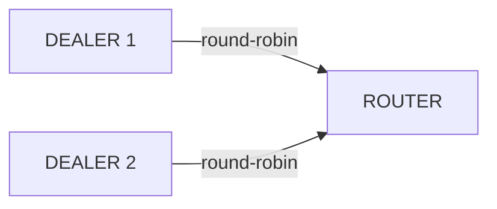

# DEALER 소켓

## 1. 개요

DEALER 소켓은 비동기 요청 소켓이다.
여러 피어에 **Round-robin** 분배로 송신하고, **Fair-queue**로 수신한다.
send/recv 순서 강제가 없어 자유로운 비동기 메시징이 가능하다.

**핵심 특성:**
- 송신: Round-robin (`lb_t`) — 연결된 피어에 순환 분배
- 수신: Fair-queue (`fq_t`) — 모든 피어에서 공정하게 수신
- send/recv 순서 강제 없음 (비동기)

**유효한 소켓 조합:** DEALER ↔ ROUTER, DEALER ↔ DEALER



    ```rust
    // DEALER → ROUTER send
    dealer.send(&[b"header", b"body"]);
    ```

### 구체적 시나리오: 3개 DEALER가 1개 ROUTER로 전송

3개의 DEALER 클라이언트가 하나의 ROUTER 서버에 연결한다. 각 DEALER는
독립적으로 요청을 전송하며, ROUTER는 fair-queue로 수신하고
`source_rid`로 각 송신자를 구분한다.

| 송신자 | routing_id | 메시지 | ROUTER 수신 |
|--------|-----------|--------|-------------|
| DEALER 1 | `D1` | `"buy AAPL 100"` | source_rid=`D1`, data=`"buy AAPL 100"` |
| DEALER 2 | `D2` | `"sell TSLA 50"` | source_rid=`D2`, data=`"sell TSLA 50"` |
| DEALER 3 | `D3` | `"buy MSFT 200"` | source_rid=`D3`, data=`"buy MSFT 200"` |

ROUTER는 `zlink_send_rid()`에 해당 `source_rid`를 전달하여 각 DEALER에
응답한다. DEALER는 *송신* 연결에 round-robin을 사용하므로, 하나의
DEALER가 여러 ROUTER에 연결하면 메시지가 순환 분배된다
(msg1 -> ROUTER-A, msg2 -> ROUTER-B, ...).

## 2. 기본 사용법

### 메시지 교환

완전한 DEALER/ROUTER 예제: 컨텍스트 생성, ROUTER 서버와 DEALER 클라이언트 설정,
요청 전송, 수신, 응답, 정리까지 전체 흐름.

=== "C"

    ```c
    #include <zlink.h>
    #include <string.h>
    #include <stdio.h>

    int main(void)
    {
        void *ctx = zlink_ctx_new();

        void *router = zlink_socket(ctx, ZLINK_ROUTER);
        zlink_bind(router, "tcp://*:5558");

        void *dealer = zlink_socket(ctx, ZLINK_DEALER);
        zlink_set_routing_id(dealer, "client-1", 8);
        zlink_connect(dealer, "tcp://127.0.0.1:5558");

        /* Dealer sends request */
        zlink_msg_t req;
        zlink_msg_init_size(&req, 4);
        memcpy(zlink_msg_data(&req), "ping", 4);
        zlink_send(dealer, &req, 1, 0);

        /* Router receives with routing_id */
        zlink_routing_id_t source_rid;
        zlink_msg_t *parts;
        size_t count;
        zlink_recv(router, &source_rid, &parts, &count, 0);
        printf("Router got: %.*s\n",
               (int)zlink_msg_size(&parts[0]),
               (char *)zlink_msg_data(&parts[0]));
        zlink_multipart_close(parts, count);

        /* Router sends reply back to the dealer */
        zlink_msg_t reply;
        zlink_msg_init_size(&reply, 4);
        memcpy(zlink_msg_data(&reply), "pong", 4);
        zlink_send_rid(router, &source_rid, &reply, 1, 0);

        /* Dealer receives reply */
        zlink_recv(dealer, &source_rid, &parts, &count, 0);
        printf("Dealer got: %.*s\n",
               (int)zlink_msg_size(&parts[0]),
               (char *)zlink_msg_data(&parts[0]));
        zlink_multipart_close(parts, count);

        zlink_close(dealer);
        zlink_close(router);
        zlink_ctx_term(ctx);
        return 0;
    }
    ```

=== "C++"

    ```cpp
    #include <zlink/socket.hpp>
    #include <iostream>

    int main()
    {
        zlink::context_t ctx;

        zlink::router_socket_t router(ctx);
        router.bind("tcp://*:5558");

        zlink::dealer_socket_t dealer(ctx);
        dealer.set_routing_id("D1");
        dealer.connect("tcp://127.0.0.1:5558");

        // Client request
        dealer.send("Hello");

        // Router receives and replies
        auto [source_rid, parts] = router.recv();
        std::cout << "Router got: " << parts[0].str() << std::endl;
        router.send_rid(source_rid, "World");

        // Dealer receives reply
        auto [rid2, reply] = dealer.recv();
        std::cout << "Dealer got: " << reply[0].str() << std::endl;

        return 0;
    }
    ```

=== "Java"

    ```java
    import dev.kairoscode.zlink.*;

    public class DealerRouterExample {
        public static void main(String[] args) {
            Context ctx = new Context();

            RouterSocket router = new RouterSocket(ctx);
            router.bind("tcp://*:5558");

            DealerSocket dealer = new DealerSocket(ctx);
            dealer.setRoutingId("client-1");
            dealer.connect("tcp://127.0.0.1:5558");

            // Dealer sends request
            dealer.send("ping");

            // Router receives with routing_id
            Message msg = router.recv();
            System.out.println("Router got: " + msg.partAsString(0));

            // Router sends reply back to the dealer
            router.sendRid(msg.routingId(), "pong");

            // Dealer receives reply
            Message reply = dealer.recv();
            System.out.println("Dealer got: " + reply.partAsString(0));

            dealer.close();
            router.close();
            ctx.close();
        }
    }
    ```

=== "Python"

    ```python
    import zlink

    ctx = zlink.Context()

    router = zlink.RouterSocket(ctx)
    router.bind("tcp://*:5558")

    dealer = zlink.DealerSocket(ctx)
    dealer.set_routing_id("D1")
    dealer.connect("tcp://127.0.0.1:5558")

    # Client request
    dealer.send(b"Hello")

    # Router receives and replies
    source_rid, parts = router.recv()
    print(f"Router got: {parts[0].decode()}")
    router.send_rid(source_rid, b"World")

    # Dealer receives reply
    _, reply = dealer.recv()
    print(f"Dealer got: {reply[0].decode()}")

    dealer.close()
    router.close()
    ctx.term()
    ```

=== "Node/TypeScript"

    ```typescript
    import * as zlink from 'zlink';

    const ctx = new zlink.Context();

    const router = new zlink.RouterSocket(ctx);
    router.bind('tcp://*:5558');

    const dealer = new zlink.DealerSocket(ctx);
    dealer.setRoutingId('D1');
    dealer.connect('tcp://127.0.0.1:5558');

    // Client request
    dealer.send(Buffer.from('Hello'));

    // Router receives and replies
    const [sourceRid, parts] = router.receive();
    console.log(`Router got: ${parts[0].toString()}`);
    router.sendRid(sourceRid, Buffer.from('World'));

    // Dealer receives reply
    const [rid2, reply] = dealer.receive();
    console.log(`Dealer got: ${reply[0].toString()}`);

    dealer.close();
    router.close();
    ctx.term();
    ```

=== "C#/.NET"

    ```csharp
    using Zlink;

    var ctx = new Context();

    var router = new RouterSocket(ctx);
    router.Bind("tcp://*:5558");

    var dealer = new DealerSocket(ctx);
    dealer.SetRoutingId("D1");
    dealer.Connect("tcp://127.0.0.1:5558");

    // Client request
    dealer.Send("Hello");

    // Router receives and replies
    var (sourceRid, parts) = router.Receive();
    Console.WriteLine($"Router got: {parts[0].GetString()}");
    router.SendRid(sourceRid, "World");

    // Dealer receives reply
    var (rid2, reply) = dealer.Receive();
    Console.WriteLine($"Dealer got: {reply[0].GetString()}");

    dealer.Close();
    router.Close();
    ctx.Term();
    ```

=== "Rust"

    ```rust
    use zlink::Context;

    fn main() -> Result<(), Box<dyn std::error::Error>> {
        let ctx = Context::new();

        let router = ctx.router_socket();
        router.bind("tcp://*:5558")?;

        let dealer = ctx.dealer_socket();
        dealer.set_routing_id("D1")?;
        dealer.connect("tcp://127.0.0.1:5558")?;

        // Client request
        dealer.send(b"Hello")?;

        // Router receives and replies
        let (source_rid, parts) = router.recv()?;
        println!("Router got: {}",
                 String::from_utf8_lossy(parts[0].data()));
        router.send_rid(&source_rid, b"World")?;

        // Dealer receives reply
        let (_, reply) = dealer.recv()?;
        println!("Dealer got: {}",
                 String::from_utf8_lossy(reply[0].data()));

        Ok(())
    }
    ```

=== "Go"

    ```go
    package main

    import (
        "fmt"
        "log"
        "github.com/kairos-code-dev/zlink-go"
    )

    func main() {
        ctx, err := zlink.NewContext()
        if err != nil { log.Fatal(err) }
        defer ctx.Close()

        router, err := ctx.RouterSocket()
        if err != nil { log.Fatal(err) }
        defer router.Close()
        router.Bind("tcp://*:5558")

        dealer, err := ctx.DealerSocket()
        if err != nil { log.Fatal(err) }
        defer dealer.Close()
        rid, _ := zlink.NewRoutingID([]byte("D1"))
        dealer.SetRoutingID(rid)
        dealer.Connect("tcp://127.0.0.1:5558")

        // Client request
        dealer.Send(zlink.NewMessage([]byte("Hello")))

        // Router receives and replies
        received, err := router.Recv()
        if err != nil { log.Fatal(err) }
        fmt.Printf("Router got: %s\n", received.Parts[0].Data())
        router.SendTo(received.RoutingID(), zlink.NewMessage([]byte("World")))
        received.Close()

        // Dealer receives reply
        reply, err := dealer.Recv()
        if err != nil { log.Fatal(err) }
        fmt.Printf("Dealer got: %s\n", reply.Parts[0].Data())
        reply.Close()
    }
    ```

> HWM 도달 시 `zlink_send()`는 블록(기본) 또는 `ZLINK_DONTWAIT`로
> `EAGAIN`을 반환한다. 고급 backpressure 패턴은
> [성능 가이드](10-performance.ko.md)를 참고.

??? example "Full Sample Code -- Recv"

    | Language | Source |
    |----------|--------|
    | C | [dealer_router_recv_sample.c](https://github.com/kairos-code-dev/zlink/blob/main/core/samples/dealer_router_recv_sample.c) |
    | C++ | [dealer_router_recv_sample.cpp](https://github.com/kairos-code-dev/zlink/blob/main/bindings/cpp/samples/dealer_router_recv_sample.cpp) |
    | Java | [DealerRouterRecvSample.java](https://github.com/kairos-code-dev/zlink/blob/main/bindings/java/samples/Zlink.Samples/src/main/java/dev/kairoscode/zlink/samples/DealerRouterRecvSample.java) |
    | Python | [dealer_router_recv.py](https://github.com/kairos-code-dev/zlink/blob/main/bindings/python/examples/dealer_router_recv.py) |
    | Node | [dealer_router_recv_sample.ts](https://github.com/kairos-code-dev/zlink/blob/main/bindings/node/examples/dealer_router_recv_sample.ts) |
    | C# | [Program.cs](https://github.com/kairos-code-dev/zlink/blob/main/bindings/dotnet/samples/DealerRouterRecv/Program.cs) |
    | Rust | [dealer_router_recv_sample.rs](https://github.com/kairos-code-dev/zlink/blob/main/bindings/rust/samples/dealer_router_recv_sample.rs) |
    | Go | [main.go](https://github.com/kairos-code-dev/zlink/blob/main/bindings/go/samples/dealer_router_recv_sample/main.go) |

### 콜백 모드

ROUTER가 `zlink_recv_handler()`로 수신 메시지를 콜백으로 처리한다.
DEALER는 요청을 전송하고 블로킹 `zlink_recv()`로 응답을 수신한다.

=== "C"

    ```c
    #include <zlink.h>
    #include <string.h>
    #include <stdio.h>

    void on_request(const zlink_routing_id_t *source_rid,
                    zlink_msg_t *parts, size_t count, void *userdata)
    {
        printf("Router callback: %.*s from peer\n",
               (int)zlink_msg_size(&parts[0]),
               (char *)zlink_msg_data(&parts[0]));

        /* Reply back using the source routing id */
        void *router = (void *)userdata;
        zlink_msg_t reply;
        zlink_msg_init_size(&reply, 4);
        memcpy(zlink_msg_data(&reply), "pong", 4);
        zlink_send_rid(router, source_rid, &reply, 1, 0);

        zlink_multipart_close(parts, count);
    }

    int main(void)
    {
        void *ctx = zlink_ctx_new();
        void *router = zlink_socket(ctx, ZLINK_ROUTER);
        void *dealer = zlink_socket(ctx, ZLINK_DEALER);

        zlink_bind(router, "tcp://*:5557");
        zlink_set_routing_id(dealer, "CLIENT", 6);
        zlink_connect(dealer, "tcp://127.0.0.1:5557");

        /* Router uses callback to receive and reply */
        zlink_recv_handler(router, on_request, router);

        /* Dealer sends request */
        zlink_msg_t req;
        zlink_msg_init_size(&req, 4);
        memcpy(zlink_msg_data(&req), "ping", 4);
        zlink_send(dealer, &req, 1, 0);

        /* Dealer receives reply (blocking recv) */
        zlink_routing_id_t src;
        zlink_msg_t *parts;
        size_t cnt;
        zlink_recv(dealer, &src, &parts, &cnt, 0);
        printf("Reply: %.*s\n", (int)zlink_msg_size(&parts[0]),
               (char *)zlink_msg_data(&parts[0]));
        zlink_multipart_close(parts, cnt);

        zlink_close(dealer);
        zlink_close(router);
        zlink_ctx_term(ctx);
        return 0;
    }
    ```

=== "C++"

    ```cpp
    #include <zlink/socket.hpp>
    #include <iostream>

    int main()
    {
        zlink::context_t ctx;

        zlink::router_socket_t router(ctx);
        router.bind("tcp://*:5557");

        zlink::dealer_socket_t dealer(ctx);
        dealer.set_routing_id("CLIENT");
        dealer.connect("tcp://127.0.0.1:5557");

        // Router uses callback to receive and reply
        router.on_receive([&](const zlink::routing_id_t& source_rid,
                              std::span<zlink::message_t> parts) {
            std::cout << "Router callback: " << parts[0].str() << std::endl;
            router.send_rid(source_rid, zlink::message_t("pong", 4));
        });

        // Dealer sends request
        dealer.send(zlink::message_t("ping", 4));

        // Dealer receives reply (blocking recv)
        auto [rid, reply] = dealer.recv();
        std::cout << "Reply: " << reply[0].str() << std::endl;

        return 0;
    }
    ```

=== "Java"

    ```java
    import dev.kairoscode.zlink.*;

    public class DealerRouterCallbackExample {
        public static void main(String[] args) {
            Context ctx = new Context();

            RouterSocket router = new RouterSocket(ctx);
            router.bind("tcp://*:5557");

            DealerSocket dealer = new DealerSocket(ctx);
            dealer.setRoutingId("CLIENT");
            dealer.connect("tcp://127.0.0.1:5557");

            // Router uses callback to receive and reply
            router.onReceive(received -> {
                System.out.println("Router callback: "
                    + new String(received.parts()[0].data()));
                router.sendRid(received.routingId(),
                    new Message("pong".getBytes()));
            });

            // Dealer sends request
            dealer.send(new Message("ping".getBytes()));

            // Dealer receives reply (blocking recv)
            Message reply = dealer.recv();
            System.out.println("Reply: " + reply.partAsString(0));

            dealer.close();
            router.close();
            ctx.close();
        }
    }
    ```

=== "Python"

    ```python
    import zlink

    ctx = zlink.Context()

    router = zlink.RouterSocket(ctx)
    router.bind("tcp://*:5557")

    dealer = zlink.DealerSocket(ctx)
    dealer.set_routing_id("CLIENT")
    dealer.connect("tcp://127.0.0.1:5557")

    # Router uses callback to receive and reply
    def on_request(source_rid, parts):
        print(f"Router callback: {parts[0].decode()}")
        router.send_rid(source_rid, b"pong")

    router.on_receive(on_request)

    # Dealer sends request
    dealer.send(b"ping")

    # Dealer receives reply (blocking recv)
    _, reply = dealer.recv()
    print(f"Reply: {reply[0].decode()}")

    dealer.close()
    router.close()
    ctx.term()
    ```

=== "Node/TypeScript"

    ```typescript
    import * as zlink from 'zlink';

    const ctx = new zlink.Context();

    const router = new zlink.RouterSocket(ctx);
    router.bind('tcp://*:5557');

    const dealer = new zlink.DealerSocket(ctx);
    dealer.setRoutingId('CLIENT');
    dealer.connect('tcp://127.0.0.1:5557');

    // Router uses callback to receive and reply
    router.recvHandler((sourceRid: Buffer, parts: Buffer[]) => {
        console.log(`Router callback: ${parts[0].toString()}`);
        router.sendRid(sourceRid, Buffer.from('pong'));
    });

    // Dealer sends request
    dealer.send(Buffer.from('ping'));

    // Dealer receives reply (blocking recv)
    const [rid, reply] = dealer.receive();
    console.log(`Reply: ${reply[0].toString()}`);

    dealer.close();
    router.close();
    ctx.term();
    ```

=== "C#/.NET"

    ```csharp
    using Zlink;

    using var ctx = new Context();

    using var router = new RouterSocket(ctx);
    router.Bind("tcp://*:5557");

    using var dealer = new DealerSocket(ctx);
    dealer.SetRoutingId("CLIENT");
    dealer.Connect("tcp://127.0.0.1:5557");

    // Router uses callback to receive and reply
    router.RecvHandler((sourceRid, parts) => {
        Console.WriteLine($"Router callback: {parts[0].GetString()}");
        router.SendRid(sourceRid, new Message("pong"u8));
    });

    // Dealer sends request
    dealer.Send(new Message("ping"u8));

    // Dealer receives reply (blocking recv)
    var (rid, reply) = dealer.Recv();
    Console.WriteLine($"Reply: {reply[0].DataString()}");
    ```

=== "Rust"

    ```rust
    use zlink::Context;

    fn main() -> Result<(), Box<dyn std::error::Error>> {
        let ctx = Context::new();

        let router = ctx.router_socket();
        router.bind("tcp://*:5557")?;

        let dealer = ctx.dealer_socket();
        dealer.set_routing_id("CLIENT")?;
        dealer.connect("tcp://127.0.0.1:5557")?;

        // Router uses callback to receive and reply
        let send_handle = router.send_handle();
        router.on_receive(move |source_rid, parts| {
            println!("Router callback: {}",
                     String::from_utf8_lossy(parts[0].data()));
            send_handle.send_rid(source_rid, b"pong")?;
            Ok(())
        })?;

        // Dealer sends request
        dealer.send(b"ping")?;

        // Dealer receives reply (blocking recv)
        let (_, reply) = dealer.recv()?;
        println!("Reply: {}",
                 String::from_utf8_lossy(reply[0].data()));

        Ok(())
    }
    ```

=== "Go"

    ```go
    package main

    import (
        "fmt"
        "log"
        "github.com/kairos-code-dev/zlink-go"
    )

    func main() {
        ctx, err := zlink.NewContext()
        if err != nil { log.Fatal(err) }
        defer ctx.Close()

        router, err := ctx.RouterSocket()
        if err != nil { log.Fatal(err) }
        defer router.Close()
        router.Bind("tcp://*:5557")

        dealer, err := ctx.DealerSocket()
        if err != nil { log.Fatal(err) }
        defer dealer.Close()
        rid, _ := zlink.NewRoutingID([]byte("CLIENT"))
        dealer.SetRoutingID(rid)
        dealer.Connect("tcp://127.0.0.1:5557")

        // Router uses callback to receive and reply
        router.OnMessage(func(sourceRid zlink.RoutingID, parts []zlink.Message) {
            fmt.Printf("Router callback: %s\n", string(parts[0].Data()))
            router.SendTo(sourceRid, zlink.NewMessage([]byte("pong")))
        })

        // Dealer sends request
        dealer.Send(zlink.NewMessage([]byte("ping")))

        // Dealer receives reply (blocking recv)
        reply, err := dealer.Recv()
        if err != nil { log.Fatal(err) }
        fmt.Printf("Reply: %s\n", reply.Parts[0].Data())
        reply.Close()
    }
    ```

??? example "Full Sample Code -- Callback"

    | Language | Source |
    |----------|--------|
    | C | [dealer_router_callback_sample.c](https://github.com/kairos-code-dev/zlink/blob/main/core/samples/dealer_router_callback_sample.c) |
    | C++ | [dealer_router_callback_sample.cpp](https://github.com/kairos-code-dev/zlink/blob/main/bindings/cpp/samples/dealer_router_callback_sample.cpp) |
    | Java | [DealerRouterCallbackSample.java](https://github.com/kairos-code-dev/zlink/blob/main/bindings/java/samples/Zlink.Samples/src/main/java/dev/kairoscode/zlink/samples/DealerRouterCallbackSample.java) |
    | Python | [dealer_router_callback.py](https://github.com/kairos-code-dev/zlink/blob/main/bindings/python/examples/dealer_router_callback.py) |
    | Node | [dealer_router_callback_sample.ts](https://github.com/kairos-code-dev/zlink/blob/main/bindings/node/examples/dealer_router_callback_sample.ts) |
    | C# | [Program.cs](https://github.com/kairos-code-dev/zlink/blob/main/bindings/dotnet/samples/DealerRouterCallback/Program.cs) |
    | Rust | [dealer_router_callback_sample.rs](https://github.com/kairos-code-dev/zlink/blob/main/bindings/rust/samples/dealer_router_callback_sample.rs) |
    | Go | [main.go](https://github.com/kairos-code-dev/zlink/blob/main/bindings/go/samples/dealer_router_callback_sample/main.go) |

## 3. 사용 예제

=== "C"

    ```c
    /* DEALER → ROUTER send */
    zlink_msg_t parts[2];
    zlink_msg_init_size(&parts[0], 6);
    memcpy(zlink_msg_data(&parts[0]), "header", 6);
    zlink_msg_init_size(&parts[1], 4);
    memcpy(zlink_msg_data(&parts[1]), "body", 4);
    zlink_send(dealer, parts, 2, 0);
    ```

=== "C++"

    ```cpp
    // DEALER → ROUTER send
    dealer.send({"header", "body"});
    ```

=== "Java"

    ```java
    // DEALER → ROUTER send
    dealer.send("header", "body");
    ```

=== "Python"

    ```python
    # DEALER → ROUTER send
    dealer.send([b"header", b"body"])
    ```

=== "Node/TypeScript"

    ```typescript
    // DEALER → ROUTER send
    dealer.send([Buffer.from("header"), Buffer.from("body")]);
    ```

=== "C#/.NET"

    ```csharp
    // DEALER → ROUTER send
    dealer.Send("header", "body");
    ```

=== "Rust"

    ```csharp
    // Set before bind/connect
    dealer.SetRoutingId("D1");
    dealer.Connect("tcp://127.0.0.1:5558");
    ```

=== "Go"

    ```go
    // DEALER → ROUTER send
    dealer.SendMultipart([]zlink.Message{
        zlink.NewMessage([]byte("header")),
        zlink.NewMessage([]byte("body")),
    })
    ```

## 4. 소켓 옵션

| 옵션 | 타입 | 기본값 | 설명 |
|------|------|--------|------|
| `zlink_set_routing_id()` | binary | 자동(UUID) | ROUTER에서 식별할 ID (전용 함수) |
| `ZLINK_DEALER_OPT_PROBE` | int | 0 | 연결 시 빈 메시지 전송 (연결 알림) |
| `ZLINK_OPT_SNDHWM` | int | 1000 | 송신 큐 최대 메시지 수 |
| `ZLINK_OPT_RCVHWM` | int | 1000 | 수신 큐 최대 메시지 수 |
| `ZLINK_OPT_LINGER` | int | -1 | close 시 대기 시간 (ms) |
| `ZLINK_OPT_SNDTIMEO` | int | -1 | 송신 타임아웃 (ms) |
| `ZLINK_OPT_RCVTIMEO` | int | -1 | 수신 타임아웃 (ms) |
| `ZLINK_ROUTER_OPT_CONNECT_ROUTING_ID` | binary | — | 다음 connect에 적용할 alias |

### routing_id 설정

ROUTER가 DEALER를 식별하려면 명시적으로 routing_id를 설정한다.

=== "C"

    ```c
    /* Set before bind/connect */
    zlink_set_routing_id(dealer, "D1", 2);
    zlink_connect(dealer, "tcp://127.0.0.1:5558");
    ```

=== "C++"

    ```cpp
    // Set before bind/connect
    dealer.set_routing_id("D1");
    dealer.connect("tcp://127.0.0.1:5558");
    ```

=== "Java"

    ```java
    // Set before bind/connect
    dealer.setRoutingId("D1");
    dealer.connect("tcp://127.0.0.1:5558");
    ```

=== "Python"

    ```python
    # Set before bind/connect
    dealer.set_routing_id("D1")
    dealer.connect("tcp://127.0.0.1:5558")
    ```

=== "Node/TypeScript"

    ```typescript
    // Set before bind/connect
    dealer.setRoutingId("D1");
    dealer.connect("tcp://127.0.0.1:5558");
    ```

=== "C#/.NET"

    ```rust
    // Set before bind/connect
    dealer.set_routing_id("D1");
    dealer.connect("tcp://127.0.0.1:5558");
    ```

=== "Rust"

    ```cpp
    // Correct order
    dealer.set_routing_id("D1");
    dealer.connect(endpoint);  // identified as D1
    ```

=== "Go"

    ```go
    // Set before bind/connect
    rid, _ := zlink.NewRoutingID([]byte("D1"))
    dealer.SetRoutingID(rid)
    dealer.Connect("tcp://127.0.0.1:5558")
    ```

> 참고: `core/tests/test_router_multiple_dealers.cpp` — `zlink_set_routing_id(dealer1, "D1", 2)`

## 5. 사용 패턴

### 패턴 1: 1:1 양방향 비동기

PAIR와 유사하지만 HWM과 자동 재연결을 지원한다. 응답이 필요한 경우 반드시 1:1로 구성해야 한다.
(routing_id가 없으므로 1:N에서는 어떤 피어가 응답했는지 구분할 수 없다.)

=== "C"

    ```c
    void *a = zlink_socket(ctx, ZLINK_DEALER);
    /* Receive with zlink_recv() */
    zlink_bind(a, "tcp://*:5558");

    void *b = zlink_socket(ctx, ZLINK_DEALER);
    /* Receive with zlink_recv() */
    zlink_connect(b, "tcp://127.0.0.1:5558");

    /* Bidirectional free send */
    zlink_msg_t ping;
    zlink_msg_init_size(&ping, 4);
    memcpy(zlink_msg_data(&ping), "ping", 4);
    zlink_send(a, &ping, 1, 0);

    zlink_msg_t pong;
    zlink_msg_init_size(&pong, 4);
    memcpy(zlink_msg_data(&pong), "pong", 4);
    zlink_send(b, &pong, 1, 0);

    /* on_message_b receives "ping", on_message_a receives "pong" */
    ```

=== "C++"

    ```cpp
    zlink::dealer_socket_t a(ctx);
    a.bind("tcp://*:5558");

    zlink::dealer_socket_t b(ctx);
    b.connect("tcp://127.0.0.1:5558");

    // Bidirectional free send
    a.send("ping");
    b.send("pong");
    ```

=== "Java"

    ```java
    DealerSocket a = new DealerSocket(ctx);
    a.bind("tcp://*:5558");

    DealerSocket b = new DealerSocket(ctx);
    b.connect("tcp://127.0.0.1:5558");

    // Bidirectional free send
    a.send("ping");
    b.send("pong");
    ```

=== "Python"

    ```python
    a = zlink.DealerSocket(ctx)
    a.bind("tcp://*:5558")

    b = zlink.DealerSocket(ctx)
    b.connect("tcp://127.0.0.1:5558")

    # Bidirectional free send
    a.send(b"ping")
    b.send(b"pong")
    ```

=== "Node/TypeScript"

    ```typescript
    const a = new zlink.DealerSocket(ctx);
    a.bind("tcp://*:5558");

    const b = new zlink.DealerSocket(ctx);
    b.connect("tcp://127.0.0.1:5558");

    // Bidirectional free send
    a.send(Buffer.from("ping"));
    b.send(Buffer.from("pong"));
    ```

=== "C#/.NET"

    ```csharp
    var a = new DealerSocket(ctx);
    a.Bind("tcp://*:5558");

    var b = new DealerSocket(ctx);
    b.Connect("tcp://127.0.0.1:5558");

    // Bidirectional free send
    a.Send("ping");
    b.Send("pong");
    ```

=== "Rust"

    ```rust
    let a = ctx.dealer_socket();
    a.bind("tcp://*:5558");

    let b = ctx.dealer_socket();
    b.connect("tcp://127.0.0.1:5558");

    // Bidirectional free send
    a.send(b"ping");
    b.send(b"pong");
    ```

=== "Go"

    ```go
    a, _ := ctx.DealerSocket()
    a.Bind("tcp://*:5558")

    b, _ := ctx.DealerSocket()
    b.Connect("tcp://127.0.0.1:5558")

    // Bidirectional free send
    a.Send(zlink.NewMessage([]byte("ping")))
    b.Send(zlink.NewMessage([]byte("pong")))
    ```

### 패턴 2: 1:N Round-robin 작업 분배

PUSH/PULL 없이 작업을 N개 워커에 순환 분배하는 패턴.
응답이 필요 없는 작업 분배 또는 파이프라인 단계 간 전달에 사용한다.

=== "C"

    ```c
    void *router = zlink_socket(ctx, ZLINK_ROUTER);
    /* ROUTER receives with zlink_recv() and distinguishes each DEALER by source_rid */
    zlink_bind(router, "tcp://127.0.0.1:*");

    char endpoint[256];
    size_t len = sizeof(endpoint);
    zlink_get_option(router, ZLINK_OPT_LAST_ENDPOINT, endpoint, &len);

    void *dealer1 = zlink_socket(ctx, ZLINK_DEALER);
    zlink_set_routing_id(dealer1, "D1", 2);
    zlink_connect(dealer1, endpoint);

    void *dealer2 = zlink_socket(ctx, ZLINK_DEALER);
    zlink_set_routing_id(dealer2, "D2", 2);
    zlink_connect(dealer2, endpoint);

    /* Each DEALER sends a message */
    zlink_msg_t m1;
    zlink_msg_init_size(&m1, 12);
    memcpy(zlink_msg_data(&m1), "from_dealer1", 12);
    zlink_send(dealer1, &m1, 1, 0);

    zlink_msg_t m2;
    zlink_msg_init_size(&m2, 12);
    memcpy(zlink_msg_data(&m2), "from_dealer2", 12);
    zlink_send(dealer2, &m2, 1, 0);

    /* on_message receives each DEALER's message with its routing_id */
    ```

=== "C++"

    ```cpp
    // Frontend: clients connect here
    zlink::router_socket_t frontend(ctx);
    frontend.bind("tcp://*:5558");

    // Backend: worker threads connect here
    zlink::dealer_socket_t backend(ctx);
    backend.bind("inproc://backend");

    // Start worker threads then run proxy
    zlink::proxy(frontend, backend);
    ```

=== "Java"

    ```csharp
    var router = new RouterSocket(ctx);
    router.Bind("tcp://127.0.0.1:*");

    var endpoint = router.GetOption(ZLINK_OPT_LAST_ENDPOINT);

    var dealer1 = new DealerSocket(ctx);
    dealer1.SetRoutingId("D1");
    dealer1.Connect(endpoint);

    var dealer2 = new DealerSocket(ctx);
    dealer2.SetRoutingId("D2");
    dealer2.Connect(endpoint);

    // Each DEALER sends a message
    dealer1.Send("from_dealer1");
    dealer2.Send("from_dealer2");

    // Router receives each DEALER's message with its routing_id
    ```

=== "Python"

    ```go
    // Frontend: clients connect here
    frontend, _ := ctx.RouterSocket()
    frontend.Bind("tcp://*:5558")

    // Backend: worker threads connect here
    backend, _ := ctx.DealerSocket()
    backend.Bind("inproc://backend")

    // Start worker threads then run proxy
    zlink.Proxy(frontend, backend, nil)
    ```

=== "Node/TypeScript"

    ```typescript
    // Frontend: clients connect here
    const frontend = new zlink.RouterSocket(ctx);
    frontend.bind("tcp://*:5558");

    // Backend: worker threads connect here
    const backend = new zlink.DealerSocket(ctx);
    backend.bind("inproc://backend");

    // Start worker threads then run proxy
    zlink.proxy(frontend, backend);
    ```

=== "C#/.NET"

    ```csharp
    // Frontend: clients connect here
    var frontend = new RouterSocket(ctx);
    frontend.Bind("tcp://*:5558");

    // Backend: worker threads connect here
    var backend = new DealerSocket(ctx);
    backend.Bind("inproc://backend");

    // Start worker threads then run proxy
    Proxy.Run(frontend, backend);
    ```

=== "Rust"

    ```rust
    let router = ctx.router_socket();
    router.bind("tcp://127.0.0.1:*");

    let endpoint = router.get_option::<String>(ZLINK_OPT_LAST_ENDPOINT);

    let dealer1 = ctx.dealer_socket();
    dealer1.set_routing_id("D1");
    dealer1.connect(&endpoint);

    let dealer2 = ctx.dealer_socket();
    dealer2.set_routing_id("D2");
    dealer2.connect(&endpoint);

    // Each DEALER sends a message
    dealer1.send(b"from_dealer1");
    dealer2.send(b"from_dealer2");

    // Router receives each DEALER's message with its routing_id
    ```

=== "Go"

    ```go
    router, _ := ctx.RouterSocket()
    router.Bind("tcp://127.0.0.1:*")

    status, _ := router.StatusSnapshot()
    endpoint := status.LocalEndpoint

    dealer1, _ := ctx.DealerSocket()
    rid1, _ := zlink.NewRoutingID([]byte("D1"))
    dealer1.SetRoutingID(rid1)
    dealer1.Connect(endpoint)

    dealer2, _ := ctx.DealerSocket()
    rid2, _ := zlink.NewRoutingID([]byte("D2"))
    dealer2.SetRoutingID(rid2)
    dealer2.Connect(endpoint)

    // Each DEALER sends a message
    dealer1.Send(zlink.NewMessage([]byte("from_dealer1")))
    dealer2.Send(zlink.NewMessage([]byte("from_dealer2")))

    // Router receives each DEALER's message with its routing_id
    ```

> DEALER ↔ ROUTER 조합(로드밸런싱 + 응답 라우팅, 프록시 등)은
> [ROUTER 소켓](03-4-router.ko.md)을 참고.

## 6. 주의사항

### 피어 없으면 큐잉

연결된 피어가 없으면 메시지는 송신 큐에 쌓인다. HWM 초과 시 블록(기본) 또는 `EAGAIN` 반환(`ZLINK_DONTWAIT`).

=== "C"

    ```c
    /* Send with no peer connected */
    zlink_msg_t msg;
    zlink_msg_init_size(&msg, 4);
    memcpy(zlink_msg_data(&msg), "data", 4);
    int rc = zlink_send(dealer, &msg, 1, ZLINK_DONTWAIT);
    if (rc == -1 && errno == EAGAIN) {
        /* HWM exceeded or no peer connected */
    }
    ```

=== "C++"

    ```cpp
    // Send with no peer connected
    try {
        dealer.send("data", zlink::dontwait);
    } catch (const zlink::eagain_error& e) {
        // HWM exceeded or no peer connected
    }
    ```

=== "Java"

    ```java
    // Send with no peer connected
    try {
        dealer.send("data", SendFlags.DONTWAIT);
    } catch (EagainException e) {
        // HWM exceeded or no peer connected
    }
    ```

=== "Python"

    ```python
    # Send with no peer connected
    try:
        dealer.send(b"data", flags=zlink.DONTWAIT)
    except zlink.Again:
        # HWM exceeded or no peer connected
        pass
    ```

=== "Node/TypeScript"

    ```typescript
    // Send with no peer connected
    try {
        dealer.send(Buffer.from("data"), { dontwait: true });
    } catch (e) {
        // HWM exceeded or no peer connected
    }
    ```

=== "C#/.NET"

    ```csharp
    // Send with no peer connected
    try {
        dealer.Send("data", SendFlags.DontWait);
    } catch (EagainException) {
        // HWM exceeded or no peer connected
    }
    ```

=== "Rust"

    ```rust
    // Send with no peer connected
    match dealer.send_dontwait(b"data") {
        Err(ZlinkError::Eagain) => {
            // HWM exceeded or no peer connected
        }
        _ => {}
    }
    ```

=== "Go"

    ```go
    // Send with no peer connected
    err := dealer.SendDontWait(zlink.NewMessage([]byte("data")))
    if err != nil {
        // HWM exceeded or no peer connected (EAGAIN)
    }
    ```

### Round-robin 분배

여러 피어가 연결된 경우 메시지는 순환적으로 분배된다. 특정 피어에게만 전송하려면 ROUTER를 사용한다.

### routing_id는 connect 전에 설정

`zlink_set_routing_id()`는 `zlink_connect()` 호출 전에 호출해야 한다. 연결 후 변경은 적용되지 않는다.

=== "C"

    ```c
    /* Correct order */
    zlink_set_routing_id(dealer, "D1", 2);
    zlink_connect(dealer, endpoint);  /* identified as D1 */
    ```

=== "C++"

    ```rust
    // Correct order
    dealer.set_routing_id("D1");
    dealer.connect(endpoint);  // identified as D1
    ```

=== "Java"

    ```java
    // Correct order
    dealer.setRoutingId("D1");
    dealer.connect(endpoint);  // identified as D1
    ```

=== "Python"

    ```python
    # Correct order
    dealer.set_routing_id("D1")
    dealer.connect(endpoint)  # identified as D1
    ```

=== "Node/TypeScript"

    ```typescript
    // Correct order
    dealer.setRoutingId("D1");
    dealer.connect(endpoint);  // identified as D1
    ```

=== "C#/.NET"

    ```csharp
    // Correct order
    dealer.SetRoutingId("D1");
    dealer.Connect(endpoint);  // identified as D1
    ```

=== "Rust"

    ```go
    // Correct order
    rid, _ := zlink.NewRoutingID([]byte("D1"))
    dealer.SetRoutingID(rid)
    dealer.Connect(endpoint)  // identified as D1
    ```

=== "Go"

    ```python
    # Frontend: clients connect here
    frontend = zlink.RouterSocket(ctx)
    frontend.bind("tcp://*:5558")

    # Backend: worker threads connect here
    backend = zlink.DealerSocket(ctx)
    backend.bind("inproc://backend")

    # Start worker threads then run proxy
    zlink.proxy(frontend, backend)
    ```

---
[← PUB/SUB](03-2-pubsub.ko.md) | [ROUTER →](03-4-router.ko.md)
