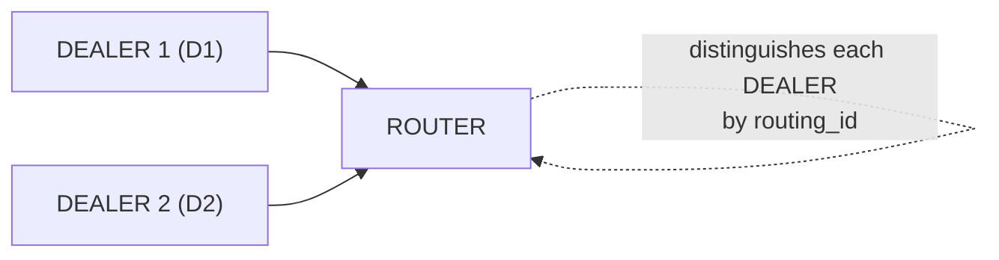

# ROUTER 소켓

## 1. 개요

ROUTER 소켓은 **routing_id 기반 라우팅** 소켓이다.
수신 메시지에 routing_id 프레임을 자동으로 추가하고,
송신 시 첫 번째 프레임의 routing_id로 대상 피어를 지정한다.

**핵심 특성:**
- 수신 시 routing_id 프레임 자동 추가 (메시지 출처 식별)
- 송신 시 첫 프레임으로 대상 피어 지정 (특정 클라이언트에게 응답)
- 다중 피어 관리 가능 (서버/브로커 역할)

**유효한 소켓 조합:** ROUTER ↔ DEALER, ROUTER ↔ ROUTER



> A->RC, B->RA, C->RB ... routing_id로 대상 지정

```c
void *router = zlink_socket(ctx, ZLINK_ROUTER);

/* TCP */
zlink_bind(router, "tcp://127.0.0.1:5558");

/* IPC (Linux/macOS) */
zlink_bind(router, "ipc:///tmp/router.ipc");

/* inproc (same process) */
zlink_bind(router, "inproc://router");

/* DEALERs connect via each transport -- ROUTER manages them uniformly by routing_id */
```

```c
/* Explicit routing_id -- remains the same across reconnections */
zlink_set_routing_id(dealer, "stable-id", 9);
```

## 2. 기본 사용법

### 생성 및 바인드

```c
void *router = zlink_socket(ctx, ZLINK_ROUTER);
zlink_bind(router, "tcp://*:5558");
```

### 메시지 수신

ROUTER는 소켓 생성 후 부착한 핸들러 콜백으로 메시지를 수신한다.

```c
/* DEALER sends "Hello" → handler receives source_rid + parts */
void on_message(const zlink_routing_id_t *source_rid,
                zlink_msg_t *parts, size_t part_count,
                void *userdata)
{
    printf("From [%.*s]: %.*s\n",
           (int)source_rid->size, source_rid->data,
           (int)zlink_msg_size(&parts[0]),
           (char *)zlink_msg_data(&parts[0]));
    for (size_t i = 0; i < part_count; i++)
        zlink_msg_close(&parts[i]);
}

void *router = zlink_socket(ctx, ZLINK_ROUTER);
/* Receive with zlink_recv() */
```

### 메시지 송신

응답 시 `zlink_send_rid`에 콜백의 `source_rid`를 전달하여 대상을 지정한다.

```c
/* Reply using source_rid from the callback */
zlink_msg_t reply;
zlink_msg_init_size(&reply, 5);
memcpy(zlink_msg_data(&reply), "World", 5);
zlink_send_rid(router, source_rid, &reply, 1, 0);
```

### 수신 모드

**Pull 모드**: 핸들러를 부착하지 않으면 `zlink_recv()`로 동기 수신한다.

```c
zlink_routing_id_t source_rid;
zlink_msg_t *parts = NULL;
size_t part_count = 0;
int rc = zlink_recv(router, &source_rid, &parts, &part_count, 0);
if (rc == 0) {
    /* source_rid identifies the sender */
    /* process parts[0..part_count-1] */
    zlink_multipart_close(parts, part_count);
}
```

> 피어별 송신 큐가 가득 차면(HWM) `ROUTER_MANDATORY` 활성 시
> `EHOSTUNREACH`를 반환하고, 그렇지 않으면 메시지를 조용히 드롭한다.
> 고급 backpressure 패턴은 [성능 가이드](10-performance.ko.md)를 참고.

??? example "Full Sample Code"

    | Language | Source |
    |----------|--------|
    | C | [dealer_router_recv_sample.c](https://github.com/kairos-code-dev/zlink/blob/main/bindings/c/samples/dealer_router_recv_sample.c) |
    | C++ | [dealer_router_recv_sample.cpp](https://github.com/kairos-code-dev/zlink/blob/main/bindings/cpp/samples/dealer_router_recv_sample.cpp) |
    | Java | [DealerRouterRecvSample.java](https://github.com/kairos-code-dev/zlink/blob/main/bindings/java/samples/Zlink.Samples/src/main/java/dev/kairoscode/zlink/samples/DealerRouterRecvSample.java) |
    | Python | [dealer_router_recv.py](https://github.com/kairos-code-dev/zlink/blob/main/bindings/python/examples/dealer_router_recv.py) |
    | Node | [dealer_router_recv_sample.ts](https://github.com/kairos-code-dev/zlink/blob/main/bindings/node/examples/dealer_router_recv_sample.ts) |
    | C# | [Program.cs](https://github.com/kairos-code-dev/zlink/blob/main/bindings/dotnet/samples/DealerRouterRecv/Program.cs) |
    | Rust | [dealer_router_recv_sample.rs](https://github.com/kairos-code-dev/zlink/blob/main/bindings/rust/samples/dealer_router_recv_sample.rs) |
    | Go | [main.go](https://github.com/kairos-code-dev/zlink/blob/main/bindings/go/samples/dealer_router_recv_sample/main.go) |

## 3. 사용 예제

ROUTER는 `zlink_send_rid()`로 특정 피어에 전송하고,
`zlink_recv()`의 `source_rid`로 송신자를 식별한다.

### 콜백을 사용한 수신/응답

```c
/* Receive: handler callback provides routing_id and data */
void on_message(const zlink_routing_id_t *source_rid,
                zlink_msg_t *parts, size_t part_count,
                void *userdata)
{
    /* Reply: send to the source peer using zlink_send_rid */
    zlink_msg_t reply;
    zlink_msg_init_size(&reply, 5);
    memcpy(zlink_msg_data(&reply), "reply", 5);
    zlink_send_rid(router, source_rid, &reply, 1, 0);

    for (size_t i = 0; i < part_count; i++)
        zlink_msg_close(&parts[i]);
}
```

## 4. 소켓 옵션

| 옵션 | 타입 | 기본값 | 설명 |
|------|------|--------|------|
| `ZLINK_ROUTER_OPT_MANDATORY` | int | 0 | 미도달 시 `EHOSTUNREACH` 반환 |
| `ZLINK_ROUTER_OPT_HANDOVER` | int | 0 | routing_id 충돌 시 기존 연결 대체 |
| `zlink_set_routing_id()` | binary | 자동(UUID) | ROUTER 자신의 routing_id (전용 함수) |
| `ZLINK_OPT_SNDHWM` | int | 1000 | 송신 HWM |
| `ZLINK_OPT_RCVHWM` | int | 1000 | 수신 HWM |
| `ZLINK_OPT_LINGER` | int | -1 | close 시 대기 시간 (ms) |

### ROUTER_MANDATORY

기본적으로 ROUTER는 대상을 찾을 수 없는 메시지를 **조용히 드롭**한다. `ROUTER_MANDATORY`를 활성화하면 `EHOSTUNREACH` 에러를 반환한다.

```c
int mandatory = 1;
zlink_set_router_option(router, ZLINK_ROUTER_OPT_MANDATORY, &mandatory, sizeof(mandatory));

/* Attempt to send to a non-existent target */
zlink_routing_id_t target_rid = { .data = "UNKNOWN", .size = 7 };
zlink_msg_t msg;
zlink_msg_init_size(&msg, 4);
memcpy(zlink_msg_data(&msg), "data", 4);
int rc = zlink_send_rid(router, &target_rid, &msg, 1, 0);
/* rc == -1, errno == EHOSTUNREACH */
```

> 참고: `core/tests/test_router_mandatory.cpp` — `test_basic()`

## 5. 사용 패턴

### 패턴 1: ROUTER ↔ ROUTER 메시/클러스터

ROUTER의 핵심 패턴. N개 노드가 각각 상대의 routing_id를 지정하여 특정 노드에 전송한다.
1:1이면 DEALER로 충분하므로, ROUTER ↔ ROUTER는 N개 노드 간 통신에서 의미가 있다.

```c
/* ROUTER handler: DEALER's initial message confirms connection */
void on_connect(const zlink_routing_id_t *source_rid,
                zlink_msg_t *parts, size_t part_count,
                void *userdata)
{
    /* source_rid->data = "X" -- now it is safe to send to "X" */
    zlink_msg_t reply;
    zlink_msg_init_size(&reply, 7);
    memcpy(zlink_msg_data(&reply), "Welcome", 7);
    zlink_send_rid(router, source_rid, &reply, 1, 0);
    for (size_t i = 0; i < part_count; i++)
        zlink_msg_close(&parts[i]);
}

/* DEALER connects and sends initial message */
void *dealer = zlink_socket(ctx, ZLINK_DEALER);
zlink_set_routing_id(dealer, "X", 1);
zlink_connect(dealer, endpoint);
zlink_msg_t hello;
zlink_msg_init_size(&hello, 5);
memcpy(zlink_msg_data(&hello), "Hello", 5);
zlink_send(dealer, &hello, 1, 0);

/* on_connect receives: source_rid = "X", parts[0] = "Hello"
   and replies with "Welcome" */
```

```c
/* Server: ROUTER with handler */
void on_request(const zlink_routing_id_t *source_rid,
                zlink_msg_t *parts, size_t part_count,
                void *userdata)
{
    /* Reply to the sender */
    zlink_msg_t reply;
    zlink_msg_init_size(&reply, 5);
    memcpy(zlink_msg_data(&reply), "reply", 5);
    zlink_send_rid(router, source_rid, &reply, 1, 0);
    for (size_t i = 0; i < part_count; i++)
        zlink_msg_close(&parts[i]);
}

void *router = zlink_socket(ctx, ZLINK_ROUTER);
/* Receive with zlink_recv() */
zlink_bind(router, "tcp://127.0.0.1:*");

char endpoint[256];
size_t len = sizeof(endpoint);
zlink_get_option(router, ZLINK_OPT_LAST_ENDPOINT, endpoint, &len);

/* Client 1 */
void *d1 = zlink_socket(ctx, ZLINK_DEALER);
/* Receive replies with zlink_recv() */
zlink_set_routing_id(d1, "D1", 2);
zlink_connect(d1, endpoint);

/* Client 2 */
void *d2 = zlink_socket(ctx, ZLINK_DEALER);
/* Receive replies with zlink_recv() */
zlink_set_routing_id(d2, "D2", 2);
zlink_connect(d2, endpoint);

/* Each client sends a message -- on_request receives with source_rid */
zlink_msg_t m1;
zlink_msg_init_size(&m1, 7);
memcpy(zlink_msg_data(&m1), "from_d1", 7);
zlink_send(d1, &m1, 1, 0);

zlink_msg_t m2;
zlink_msg_init_size(&m2, 7);
memcpy(zlink_msg_data(&m2), "from_d2", 7);
zlink_send(d2, &m2, 1, 0);

/* on_reply receives the reply for each DEALER */
```

> ROUTER ↔ ROUTER는 브로커, 클러스터 노드 간 메시 통신에 적합하다.
> 모든 노드가 능동적으로 대상을 routing_id로 지정할 수 있다.

### 패턴 2: DEALER → ROUTER 로드밸런싱 요청-응답

DEALER ↔ ROUTER 조합의 핵심 장점:
- **DEALER 측**: round-robin으로 여러 ROUTER 중 하나를 자동 선택 → 부하 분산
- **ROUTER 측**: routing_id로 요청을 보낸 DEALER를 정확히 식별 → 응답 라우팅

```
                                    +----------+
                        +-- send -->| ROUTER A |
                        |           +----------+
  +----------+          |           +----------+
  | DEALER 1 |----------+-- send -->| ROUTER B |    round-robin
  |   (D1)   |          |           +----------+    순환 분배
  +----------+          |           +----------+
                        +-- send -->| ROUTER C |
                                    +----------+

  +----------+
  | DEALER 2 |-------- (동일하게 A, B, C에 round-robin)
  |   (D2)   |
  +----------+


  ROUTER가 요청한 DEALER에 응답:

  +----------+    ① send         +----------+
  | DEALER 1 |------------------>| ROUTER B |
  |   (D1)   |<------------------+          |
  +----------+    ② send_rid     +----------+
                   source_rid="D1"
```

```c
void *router = zlink_socket(ctx, ZLINK_ROUTER);
zlink_bind(router, "tcp://*:5558");

/* Default behavior: silently drops undeliverable messages */
zlink_routing_id_t bad_rid = { .data = "UNKNOWN", .size = 7 };
zlink_msg_t msg;
zlink_msg_init_size(&msg, 4);
memcpy(zlink_msg_data(&msg), "DATA", 4);
zlink_send_rid(router, &bad_rid, &msg, 1, 0);
/* No error, message lost */

/* Enable MANDATORY mode */
int mandatory = 1;
zlink_set_router_option(router, ZLINK_ROUTER_OPT_MANDATORY, &mandatory, sizeof(mandatory));

/* Now returns error on undeliverable message */
zlink_msg_t msg2;
zlink_msg_init_size(&msg2, 4);
memcpy(zlink_msg_data(&msg2), "DATA", 4);
int rc = zlink_send_rid(router, &bad_rid, &msg2, 1, 0);
if (rc == -1 && errno == EHOSTUNREACH) {
    /* Target "UNKNOWN" not found */
}
```

### 패턴 3: ROUTER ↔ ROUTER 가중치 라우팅

DEALER → ROUTER는 round-robin이 고정되어 분배 비율을 제어할 수 없다.
가중치, 우선순위, 조건부 라우팅이 필요하면 ROUTER ↔ ROUTER로 구성하고
애플리케이션이 routing_id를 직접 선택한다.

```
  DEALER → ROUTER (round-robin 고정, 균등 분배):

  +----------+     1/3      +----------+
  |          |-------------->| ROUTER A |
  |  DEALER  |     1/3      +----------+
  |          |-------------->| ROUTER B |    변경 불가
  |          |     1/3      +----------+
  |          |-------------->| ROUTER C |
  +----------+              +----------+


  ROUTER ↔ ROUTER (애플리케이션이 대상 직접 선택):

  +----------+     50%      +----------+
  |          |-------------->| ROUTER A |
  |  ROUTER  |     30%      +----------+
  | (client) |-------------->| ROUTER B |    자유롭게 제어
  |          |     20%      +----------+
  |          |-------------->| ROUTER C |
  +----------+              +----------+
```

```c
/* 서버 3대 */
void *sa = zlink_socket(ctx, ZLINK_ROUTER);
zlink_set_routing_id(sa, "SA", 2);
zlink_bind(sa, "tcp://127.0.0.1:5560");
void *sb = zlink_socket(ctx, ZLINK_ROUTER);
zlink_set_routing_id(sb, "SB", 2);
zlink_bind(sb, "tcp://127.0.0.1:5561");
void *sc = zlink_socket(ctx, ZLINK_ROUTER);
zlink_set_routing_id(sc, "SC", 2);
zlink_bind(sc, "tcp://127.0.0.1:5562");

/* 클라이언트 ROUTER: 3개 서버에 connect */
void *client = zlink_socket(ctx, ZLINK_ROUTER);
zlink_set_routing_id(client, "C1", 2);
zlink_connect(client, "tcp://127.0.0.1:5560");
zlink_connect(client, "tcp://127.0.0.1:5561");
zlink_connect(client, "tcp://127.0.0.1:5562");

/* 가중치 테이블: SA=50%, SB=30%, SC=20% */
typedef struct { const char *rid; size_t len; int weight; } route_t;
route_t routes[] = {
    { "SA", 2, 50 }, { "SB", 2, 30 }, { "SC", 2, 20 }
};

/* 가중치 기반 대상 선택 */
int roll = rand() % 100;
route_t *target = (roll < 50)  ? &routes[0]
               : (roll < 80) ? &routes[1]
               :                &routes[2];

zlink_routing_id_t rid = { .data = target->rid, .size = target->len };
zlink_msg_t msg;
zlink_msg_init_size(&msg, 7);
memcpy(zlink_msg_data(&msg), "request", 7);
zlink_send_rid(client, &rid, &msg, 1, 0);

/* 서버 응답: source_rid = "C1"로 클라이언트 식별 가능 */
```

> DEALER → ROUTER의 round-robin이 충분하면 DEALER를 사용하고,
> 분배 로직을 제어해야 하면 ROUTER ↔ ROUTER로 전환한다.

### 패턴 4: 다중 DEALER 서버

여러 DEALER가 하나의 ROUTER에 연결. ROUTER가 각 DEALER를 routing_id로 구분.

```
  +----------+
  | DEALER 1 |-- send --+
  |   (D1)   |          |
  +----------+          |     +----------+
                        +---->|  ROUTER  |
  +----------+          |     +----------+
  | DEALER 2 |-- send --+         |
  |   (D2)   |              source_rid로
  +----------+              D1, D2 구분
```

```c
void *router = zlink_socket(ctx, ZLINK_ROUTER);
zlink_bind(router, "tcp://127.0.0.1:*");

char endpoint[256];
size_t len = sizeof(endpoint);
zlink_get_option(router, ZLINK_OPT_LAST_ENDPOINT, endpoint, &len);

/* 클라이언트 1 */
void *d1 = zlink_socket(ctx, ZLINK_DEALER);
zlink_set_routing_id(d1, "D1", 2);
zlink_connect(d1, endpoint);

/* 클라이언트 2 */
void *d2 = zlink_socket(ctx, ZLINK_DEALER);
zlink_set_routing_id(d2, "D2", 2);
zlink_connect(d2, endpoint);

/* 각 클라이언트가 메시지 전송 — ROUTER가 source_rid로 구분 */
zlink_msg_t m1;
zlink_msg_init_size(&m1, 7);
memcpy(zlink_msg_data(&m1), "from_d1", 7);
zlink_send(d1, &m1, 1, 0);

zlink_msg_t m2;
zlink_msg_init_size(&m2, 7);
memcpy(zlink_msg_data(&m2), "from_d2", 7);
zlink_send(d2, &m2, 1, 0);
```

> 참고: `core/tests/test_router_multiple_dealers.cpp` — TCP/IPC/inproc 3가지 transport

### 패턴 5: 프록시 패턴 (ROUTER-DEALER)

ROUTER(프론트엔드) + DEALER(백엔드)로 멀티스레드 서버 구축.

```
  +----------+                                       +----------+
  | CLIENT 1 |--+                               +--->| WORKER 1 |
  | (DEALER) |  |    +----------+  +----------+ |    | (DEALER) |
  +----------+  +--->|  ROUTER  +-->  DEALER  +-+    +----------+
  +----------+  |    |(frontend)|  |(backend) | |    +----------+
  | CLIENT 2 |--+    +----------+  +----------+ +--->| WORKER 2 |
  | (DEALER) |          proxy()                      | (DEALER) |
  +----------+                                       +----------+
```

```c
void *router = zlink_socket(ctx, ZLINK_ROUTER);
zlink_bind(router, "tcp://*:5558");
```

```c
/* 워커 스레드 */
void worker_thread(void *arg) {
    void on_work(const zlink_routing_id_t *source_rid,
                 zlink_msg_t *parts, size_t part_count,
                 void *userdata)
    {
        /* 처리 후 동일 routing_id로 응답 */
        zlink_send_rid(worker, source_rid, parts, part_count, 0);
    }

    void *worker = zlink_socket(ctx, ZLINK_DEALER);
    /* zlink_recv()로 작업 수신 */
    zlink_connect(worker, "inproc://backend");

    /* 소켓이 닫힐 때까지 워커 유지 */
}
```

> 참고: `core/tests/test_proxy.cpp` — ROUTER(frontend) + DEALER(backend) + 워커 풀

### 패턴 6: ROUTER_MANDATORY로 전송 실패 감지

```
  MANDATORY = 0 (기본):

  +----------+   send_rid      + - - - - - +
  |  ROUTER  +---------------->  "UNKNOWN"       조용히 드롭
  +----------+   target=       + - - - - - +    (에러 없음)
                 "UNKNOWN"

  MANDATORY = 1:

  +----------+   send_rid      + - - - - - +
  |  ROUTER  +-------X---------  "UNKNOWN"       rc = -1
  +----------+   target=       + - - - - - +    errno = EHOSTUNREACH
                 "UNKNOWN"
```

```c
void *router = zlink_socket(ctx, ZLINK_ROUTER);
zlink_bind(router, "tcp://*:5558");

/* 기본 동작: 미도달 메시지 조용히 드롭 */
zlink_routing_id_t bad_rid = { .data = "UNKNOWN", .size = 7 };
zlink_msg_t msg;
zlink_msg_init_size(&msg, 4);
memcpy(zlink_msg_data(&msg), "DATA", 4);
zlink_send_rid(router, &bad_rid, &msg, 1, 0);
/* 에러 없음, 메시지 소실 */

/* MANDATORY 모드 활성화 */
int mandatory = 1;
zlink_set_router_option(router, ZLINK_ROUTER_OPT_MANDATORY, &mandatory, sizeof(mandatory));

/* 이제 미도달 시 에러 반환 */
zlink_msg_t msg2;
zlink_msg_init_size(&msg2, 4);
memcpy(zlink_msg_data(&msg2), "DATA", 4);
int rc = zlink_send_rid(router, &bad_rid, &msg2, 1, 0);
if (rc == -1 && errno == EHOSTUNREACH) {
    /* 대상 "UNKNOWN"을 찾을 수 없음 */
}
```

> 참고: `core/tests/test_router_mandatory.cpp` — 기본 드롭 vs MANDATORY 에러

### 패턴 7: 연결 확인 후 전송

DEALER가 먼저 메시지를 전송하여 ROUTER에 연결을 알린 후, ROUTER가 응답.

```
  +----------+    ① "Hello"       +----------+
  |  DEALER  |------------------->|  ROUTER  |
  |   (X)    |<-------------------+          |
  +----------+    ② "Welcome"     +----------+
                   source_rid="X"
```

```c
/* ROUTER 핸들러: DEALER의 초기 메시지로 연결 확인 */
void on_connect(const zlink_routing_id_t *source_rid,
                zlink_msg_t *parts, size_t part_count,
                void *userdata)
{
    /* source_rid->data = "X" — 이제 "X"로 안전하게 전송 가능 */
    zlink_msg_t reply;
    zlink_msg_init_size(&reply, 7);
    memcpy(zlink_msg_data(&reply), "Welcome", 7);
    zlink_send_rid(router, source_rid, &reply, 1, 0);
    for (size_t i = 0; i < part_count; i++)
        zlink_msg_close(&parts[i]);
}

/* DEALER 연결 및 초기 메시지 전송 */
void *dealer = zlink_socket(ctx, ZLINK_DEALER);
zlink_set_routing_id(dealer, "X", 1);
zlink_connect(dealer, endpoint);
zlink_msg_t hello;
zlink_msg_init_size(&hello, 5);
memcpy(zlink_msg_data(&hello), "Hello", 5);
zlink_send(dealer, &hello, 1, 0);

/* on_connect 수신: source_rid = "X", parts[0] = "Hello"
   "Welcome"으로 응답 */
```

> 참고: `core/tests/test_router_mandatory.cpp` — DEALER 연결 → 메시지 → ROUTER 응답

### 패턴 8: 다중 Transport

같은 ROUTER에 다양한 transport로 연결 가능. routing_id로 통합 관리.

```
  +----------+                       +----------+
  | DEALER 1 |-- tcp://  ----------->|          |
  +----------+                       |          |
  +----------+                       |  ROUTER  |
  | DEALER 2 |-- ipc://  ----------->|          |
  +----------+                       |          |
  +----------+                       |          |
  | DEALER 3 |-- inproc://  -------->|          |
  +----------+                       +----------+

  transport가 달라도 routing_id로 동일하게 식별
```

```c
void *router = zlink_socket(ctx, ZLINK_ROUTER);

/* TCP */
zlink_bind(router, "tcp://127.0.0.1:5558");

/* IPC (Linux/macOS) */
zlink_bind(router, "ipc:///tmp/router.ipc");

/* inproc (동일 프로세스) */
zlink_bind(router, "inproc://router");

/* 각 transport의 DEALER가 연결 — ROUTER는 routing_id로 통합 관리 */
```

> 참고: `core/tests/test_router_multiple_dealers.cpp` — TCP/IPC/inproc 테스트

## 6. 주의사항

### 기본 드롭 동작

`ROUTER_MANDATORY`를 설정하지 않으면, 존재하지 않는 routing_id로 전송 시 메시지가 **조용히 드롭**된다. 프로덕션에서는 `ROUTER_MANDATORY` 활성화를 권장한다.

### 재연결 시 routing_id 변경

DEALER가 재연결하면 자동 생성된 routing_id가 변경될 수 있다. 안정적인 통신을 위해 명시적 routing_id 설정을 권장한다.

```c
/* 명시적 routing_id — 재연결 시에도 동일 */
zlink_set_routing_id(dealer, "stable-id", 9);
```

### routing_id 충돌

같은 routing_id를 가진 두 DEALER가 동시에 연결되면, 기본적으로 두 번째 연결이 거부된다. `ROUTER_HANDOVER`를 활성화하면 기존 연결을 대체한다.

> routing_id의 상세 개념은 [08-routing-id.ko.md](08-routing-id.ko.md)를 참고.

---
[← DEALER](03-3-dealer.ko.md) | [STREAM →](03-5-stream.ko.md)
