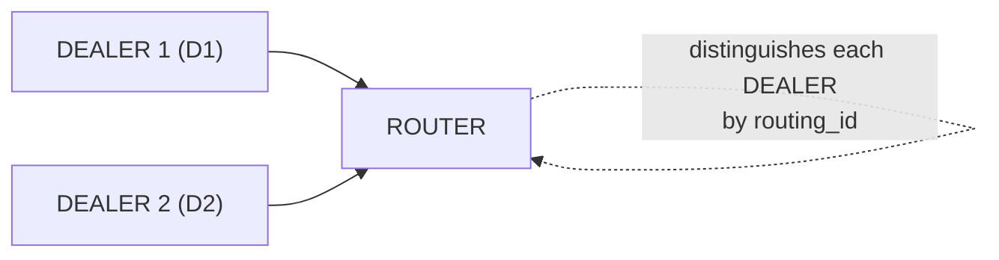

# ROUTER Socket

## 1. Overview

The ROUTER socket is a **routing_id-based routing** socket. It automatically prepends a routing_id frame to received messages, and when sending, it uses the first frame's routing_id to specify the target peer.

**Key characteristics:**
- Automatically adds a routing_id frame on receive (identifies message origin)
- Specifies the target peer via the first frame on send (replies to a specific client)
- Can manage multiple peers (server/broker role)

**Valid socket combinations:** ROUTER ↔ DEALER, ROUTER ↔ ROUTER



## 2. Basic Usage

### Creation and Bind

=== "C"

    ```c
    void *router = zlink_socket(ctx, ZLINK_ROUTER);
    zlink_bind(router, "tcp://*:5558");
    ```

=== "C++"

    ```cpp
    zlink::context_t ctx;
    zlink::router_socket_t router(ctx);
    router.bind("tcp://*:5558");
    ```

=== "Java"

    ```java
    Context ctx = new Context();
    RouterSocket router = new RouterSocket(ctx);
    router.bind("tcp://*:5558");
    ```

=== "Python"

    ```python
    ctx = zlink.Context()
    router = zlink.RouterSocket(ctx)
    router.bind("tcp://*:5558")
    ```

=== "Node/TypeScript"

    ```typescript
    const ctx = new zlink.Context();
    const router = new zlink.RouterSocket(ctx);
    router.bind("tcp://*:5558");
    ```

=== "C#/.NET"

    ```csharp
    using var ctx = new Context();
    using var router = new RouterSocket(ctx);
    router.Bind("tcp://*:5558");
    ```

=== "Rust"

    ```rust
    let ctx = zlink::Context::new()?;
    let router = ctx.router_socket()?;
    router.bind("tcp://*:5558")?;
    ```

=== "Go"

    ```go
    ctx, err := zlink.NewContext()
    if err != nil { panic(err) }
    router, err := ctx.RouterSocket()
    if err != nil { panic(err) }
    router.Bind("tcp://*:5558")
    ```

### Message Exchange

A complete DEALER-ROUTER example: a DEALER connects and sends a request,
the ROUTER receives it with `source_rid` identifying the sender, and
replies back using `zlink_send_rid()`.

=== "C"

    ```c
    #include <zlink.h>
    #include <string.h>
    #include <stdio.h>

    int main(void)
    {
        void *ctx = zlink_ctx_new();

        void *router = zlink_socket(ctx, ZLINK_ROUTER);
        zlink_bind(router, "tcp://*:5558");

        void *dealer = zlink_socket(ctx, ZLINK_DEALER);
        zlink_set_routing_id(dealer, "D1", 2);
        zlink_connect(dealer, "tcp://127.0.0.1:5558");

        /* DEALER sends a request */
        zlink_msg_t req;
        zlink_msg_init_size(&req, 5);
        memcpy(zlink_msg_data(&req), "Hello", 5);
        zlink_send(dealer, &req, 1, 0);

        /* ROUTER receives -- source_rid identifies the sender */
        zlink_routing_id_t source_rid;
        zlink_msg_t *parts = NULL;
        size_t part_count = 0;
        zlink_recv(router, &source_rid, &parts, &part_count, 0);
        printf("From [%.*s]: %.*s\n",
               (int)source_rid.size, source_rid.data,
               (int)zlink_msg_size(&parts[0]),
               (char *)zlink_msg_data(&parts[0]));
        zlink_multipart_close(parts, part_count);

        /* ROUTER replies to the sender */
        zlink_msg_t reply;
        zlink_msg_init_size(&reply, 5);
        memcpy(zlink_msg_data(&reply), "World", 5);
        zlink_send_rid(router, &source_rid, &reply, 1, 0);

        /* DEALER receives the reply */
        zlink_recv(dealer, &source_rid, &parts, &part_count, 0);
        printf("Reply: %.*s\n",
               (int)zlink_msg_size(&parts[0]),
               (char *)zlink_msg_data(&parts[0]));
        zlink_multipart_close(parts, part_count);

        zlink_close(dealer);
        zlink_close(router);
        zlink_ctx_term(ctx);
        return 0;
    }
    ```

=== "C++"

    ```cpp
    #include <zlink/socket.hpp>
    #include <iostream>

    int main()
    {
        zlink::context_t ctx;

        zlink::router_socket_t router(ctx);
        router.bind("tcp://*:5558");

        zlink::dealer_socket_t dealer(ctx);
        dealer.set_routing_id("D1");
        dealer.connect("tcp://127.0.0.1:5558");

        // DEALER sends a request
        dealer.send(zlink::message_t("Hello", 5));

        // ROUTER receives -- source_rid identifies the sender
        auto [source_rid, parts] = router.recv();
        std::cout << "From [" << source_rid.to_string() << "]: "
                  << parts[0].to_string() << std::endl;

        // ROUTER replies to the sender
        router.send_rid(source_rid, zlink::message_t("World", 5));

        // DEALER receives the reply
        auto [rid2, reply] = dealer.recv();
        std::cout << "Reply: " << reply[0].to_string() << std::endl;

        return 0;
    }
    ```

=== "Java"

    ```java
    import dev.kairoscode.zlink.*;

    public class RouterExample {
        public static void main(String[] args) {
            Context ctx = new Context();

            RouterSocket router = new RouterSocket(ctx);
            router.bind("tcp://*:5558");

            DealerSocket dealer = new DealerSocket(ctx);
            dealer.setRoutingId("D1");
            dealer.connect("tcp://127.0.0.1:5558");

            // DEALER sends a request
            dealer.send(new Message("Hello".getBytes()));

            // ROUTER receives -- sourceRid identifies the sender
            RecvResult result = router.recv();
            System.out.println("From [" + result.routingId() + "]: "
                + new String(result.parts()[0].data()));

            // ROUTER replies to the sender
            router.sendRid(result.routingId(), new Message("World".getBytes()));

            // DEALER receives the reply
            Message reply = dealer.recv();
            System.out.println("Reply: " + reply.partAsString(0));

            dealer.close();
            router.close();
            ctx.close();
        }
    }
    ```

=== "Python"

    ```python
    import zlink

    ctx = zlink.Context()

    router = zlink.RouterSocket(ctx)
    router.bind("tcp://*:5558")

    dealer = zlink.DealerSocket(ctx)
    dealer.set_routing_id(b"D1")
    dealer.connect("tcp://127.0.0.1:5558")

    # DEALER sends a request
    dealer.send(b"Hello")

    # ROUTER receives -- source_rid identifies the sender
    source_rid, parts = router.recv()
    print(f"From [{source_rid}]: {parts[0].data().decode()}")

    # ROUTER replies to the sender
    router.send_rid(source_rid, b"World")

    # DEALER receives the reply
    _, reply = dealer.recv()
    print(f"Reply: {reply[0].decode()}")

    dealer.close()
    router.close()
    ctx.term()
    ```

=== "Node/TypeScript"

    ```typescript
    import * as zlink from 'zlink';

    const ctx = new zlink.Context();

    const router = new zlink.RouterSocket(ctx);
    router.bind('tcp://*:5558');

    const dealer = new zlink.DealerSocket(ctx);
    dealer.setRoutingId(Buffer.from('D1'));
    dealer.connect('tcp://127.0.0.1:5558');

    // DEALER sends a request
    dealer.send(Buffer.from('Hello'));

    // ROUTER receives -- sourceRid identifies the sender
    const { sourceRid, parts } = router.recv();
    console.log(`From [${sourceRid}]: ${parts[0].toString()}`);

    // ROUTER replies to the sender
    router.sendRid(sourceRid, Buffer.from('World'));

    // DEALER receives the reply
    const reply = dealer.recv();
    console.log(`Reply: ${reply.parts[0].toString()}`);

    dealer.close();
    router.close();
    ctx.term();
    ```

=== "C#/.NET"

    ```csharp
    using Zlink;

    using var ctx = new Context();

    using var router = new RouterSocket(ctx);
    router.Bind("tcp://*:5558");

    using var dealer = new DealerSocket(ctx);
    dealer.SetRoutingId("D1"u8);
    dealer.Connect("tcp://127.0.0.1:5558");

    // DEALER sends a request
    dealer.Send(new Message("Hello"u8));

    // ROUTER receives -- sourceRid identifies the sender
    var (sourceRid, parts) = router.Recv();
    Console.WriteLine($"From [{sourceRid}]: {parts[0].DataString()}");

    // ROUTER replies to the sender
    router.SendRid(sourceRid, new Message("World"u8));

    // DEALER receives the reply
    var (_, reply) = dealer.Recv();
    Console.WriteLine($"Reply: {reply[0].DataString()}");
    ```

=== "Rust"

    ```rust
    use zlink::Context;

    fn main() -> Result<(), Box<dyn std::error::Error>> {
        let ctx = Context::new()?;

        let router = ctx.router_socket()?;
        router.bind("tcp://*:5558")?;

        let dealer = ctx.dealer_socket()?;
        dealer.set_routing_id("D1")?;
        dealer.connect("tcp://127.0.0.1:5558")?;

        // DEALER sends a request
        dealer.send(&zlink::Message::from("Hello"))?;

        // ROUTER receives -- source_rid identifies the sender
        let (source_rid, parts) = router.recv()?;
        println!("From [{}]: {}", source_rid, parts[0].as_str()?);

        // ROUTER replies to the sender
        router.send_rid(&source_rid, &zlink::Message::from("World"))?;

        // DEALER receives the reply
        let (_, reply) = dealer.recv()?;
        println!("Reply: {}", reply[0].as_str()?);

        Ok(())
    }
    ```

=== "Go"

    ```go
    package main

    import (
        "fmt"
        "log"
        "github.com/kairos-code-dev/zlink-go"
    )

    func main() {
        ctx, err := zlink.NewContext()
        if err != nil { log.Fatal(err) }
        defer ctx.Close()

        router, _ := ctx.RouterSocket()
        defer router.Close()
        router.Bind("tcp://*:5558")

        dealer, _ := ctx.DealerSocket()
        defer dealer.Close()
        dealer.SetRoutingId("D1")
        dealer.Connect("tcp://127.0.0.1:5558")

        // DEALER sends a request
        dealer.Send(zlink.NewMessage([]byte("Hello")))

        // ROUTER receives -- source_rid identifies the sender
        sourceRid, parts, _ := router.Recv()
        fmt.Printf("From [%v]: %s\n", sourceRid, string(parts[0].Data()))

        // ROUTER replies to the sender
        router.SendTo(sourceRid, zlink.NewMessage([]byte("World")))

        // DEALER receives the reply
        _, reply, _ := dealer.Recv()
        fmt.Printf("Reply: %s\n", string(reply[0].Data()))
    }
    ```

> When the per-peer send queue is full (HWM), ROUTER returns
> `EHOSTUNREACH` with `ROUTER_MANDATORY` enabled, or silently drops
> the message otherwise. For advanced backpressure patterns, see
> [Performance Guide](10-performance.md).

??? example "Full Sample Code -- Recv"

    | Language | Source |
    |----------|--------|
    | C | [dealer_router_recv_sample.c](https://github.com/kairos-code-dev/zlink/blob/main/core/samples/dealer_router_recv_sample.c) |
    | C++ | [dealer_router_recv_sample.cpp](https://github.com/kairos-code-dev/zlink/blob/main/bindings/cpp/samples/dealer_router_recv_sample.cpp) |
    | Java | [DealerRouterRecvSample.java](https://github.com/kairos-code-dev/zlink/blob/main/bindings/java/samples/Zlink.Samples/src/main/java/dev/kairoscode/zlink/samples/DealerRouterRecvSample.java) |
    | Python | [dealer_router_recv.py](https://github.com/kairos-code-dev/zlink/blob/main/bindings/python/examples/dealer_router_recv.py) |
    | Node | [dealer_router_recv_sample.ts](https://github.com/kairos-code-dev/zlink/blob/main/bindings/node/examples/dealer_router_recv_sample.ts) |
    | C# | [Program.cs](https://github.com/kairos-code-dev/zlink/blob/main/bindings/dotnet/samples/DealerRouterRecv/Program.cs) |
    | Rust | [dealer_router_recv_sample.rs](https://github.com/kairos-code-dev/zlink/blob/main/bindings/rust/samples/dealer_router_recv_sample.rs) |
    | Go | [main.go](https://github.com/kairos-code-dev/zlink/blob/main/bindings/go/samples/dealer_router_recv_sample/main.go) |

### Callback Mode

The ROUTER uses `zlink_recv_handler()` to handle incoming messages
via callback. The DEALER sends a request and receives the reply
with blocking `zlink_recv()`.

=== "C"

    ```c
    #include <zlink.h>
    #include <string.h>
    #include <stdio.h>

    void on_request(const zlink_routing_id_t *source_rid,
                    zlink_msg_t *parts, size_t count, void *userdata)
    {
        printf("Router callback: %.*s from peer\n",
               (int)zlink_msg_size(&parts[0]),
               (char *)zlink_msg_data(&parts[0]));

        /* Reply back using the source routing id */
        void *router = (void *)userdata;
        zlink_msg_t reply;
        zlink_msg_init_size(&reply, 4);
        memcpy(zlink_msg_data(&reply), "pong", 4);
        zlink_send_rid(router, source_rid, &reply, 1, 0);

        zlink_multipart_close(parts, count);
    }

    int main(void)
    {
        void *ctx = zlink_ctx_new();
        void *router = zlink_socket(ctx, ZLINK_ROUTER);
        void *dealer = zlink_socket(ctx, ZLINK_DEALER);

        zlink_bind(router, "tcp://*:5557");
        zlink_set_routing_id(dealer, "CLIENT", 6);
        zlink_connect(dealer, "tcp://127.0.0.1:5557");

        /* Router uses callback to receive and reply */
        zlink_recv_handler(router, on_request, router);

        /* Dealer sends request */
        zlink_msg_t req;
        zlink_msg_init_size(&req, 4);
        memcpy(zlink_msg_data(&req), "ping", 4);
        zlink_send(dealer, &req, 1, 0);

        /* Dealer receives reply (blocking recv) */
        zlink_routing_id_t src;
        zlink_msg_t *parts;
        size_t cnt;
        zlink_recv(dealer, &src, &parts, &cnt, 0);
        printf("Reply: %.*s\n", (int)zlink_msg_size(&parts[0]),
               (char *)zlink_msg_data(&parts[0]));
        zlink_multipart_close(parts, cnt);

        zlink_close(dealer);
        zlink_close(router);
        zlink_ctx_term(ctx);
        return 0;
    }
    ```

=== "C++"

    ```cpp
    #include <zlink/socket.hpp>
    #include <iostream>

    int main()
    {
        zlink::context_t ctx;

        zlink::router_socket_t router(ctx);
        router.bind("tcp://*:5557");

        zlink::dealer_socket_t dealer(ctx);
        dealer.set_routing_id("CLIENT");
        dealer.connect("tcp://127.0.0.1:5557");

        // Router uses callback to receive and reply
        router.on_receive([&](const zlink::routing_id_t& source_rid,
                              std::span<zlink::message_t> parts) {
            std::cout << "Router callback: " << parts[0].str() << std::endl;
            router.send_rid(source_rid, zlink::message_t("pong", 4));
        });

        // Dealer sends request
        dealer.send(zlink::message_t("ping", 4));

        // Dealer receives reply (blocking recv)
        auto [rid, reply] = dealer.recv();
        std::cout << "Reply: " << reply[0].str() << std::endl;

        return 0;
    }
    ```

=== "Java"

    ```java
    import dev.kairoscode.zlink.*;

    public class RouterCallbackExample {
        public static void main(String[] args) {
            Context ctx = new Context();

            RouterSocket router = new RouterSocket(ctx);
            router.bind("tcp://*:5557");

            DealerSocket dealer = new DealerSocket(ctx);
            dealer.setRoutingId("CLIENT");
            dealer.connect("tcp://127.0.0.1:5557");

            // Router uses callback to receive and reply
            router.onReceive(received -> {
                System.out.println("Router callback: "
                    + new String(received.parts()[0].data()));
                router.sendRid(received.routingId(),
                    new Message("pong".getBytes()));
            });

            // Dealer sends request
            dealer.send(new Message("ping".getBytes()));

            // Dealer receives reply (blocking recv)
            Message reply = dealer.recv();
            System.out.println("Reply: " + reply.partAsString(0));

            dealer.close();
            router.close();
            ctx.close();
        }
    }
    ```

=== "Python"

    ```python
    import zlink

    ctx = zlink.Context()

    router = zlink.RouterSocket(ctx)
    router.bind("tcp://*:5557")

    dealer = zlink.DealerSocket(ctx)
    dealer.set_routing_id("CLIENT")
    dealer.connect("tcp://127.0.0.1:5557")

    # Router uses callback to receive and reply
    def on_request(source_rid, parts):
        print(f"Router callback: {parts[0].decode()}")
        router.send_rid(source_rid, b"pong")

    router.on_receive(on_request)

    # Dealer sends request
    dealer.send(b"ping")

    # Dealer receives reply (blocking recv)
    _, reply = dealer.recv()
    print(f"Reply: {reply[0].decode()}")

    dealer.close()
    router.close()
    ctx.term()
    ```

=== "Node/TypeScript"

    ```typescript
    import * as zlink from 'zlink';

    const ctx = new zlink.Context();

    const router = new zlink.RouterSocket(ctx);
    router.bind('tcp://*:5557');

    const dealer = new zlink.DealerSocket(ctx);
    dealer.setRoutingId('CLIENT');
    dealer.connect('tcp://127.0.0.1:5557');

    // Router uses callback to receive and reply
    router.recvHandler((sourceRid: Buffer, parts: Buffer[]) => {
        console.log(`Router callback: ${parts[0].toString()}`);
        router.sendRid(sourceRid, Buffer.from('pong'));
    });

    // Dealer sends request
    dealer.send(Buffer.from('ping'));

    // Dealer receives reply (blocking recv)
    const [rid, reply] = dealer.receive();
    console.log(`Reply: ${reply[0].toString()}`);

    dealer.close();
    router.close();
    ctx.term();
    ```

=== "C#/.NET"

    ```csharp
    using Zlink;

    using var ctx = new Context();

    using var router = new RouterSocket(ctx);
    router.Bind("tcp://*:5557");

    using var dealer = new DealerSocket(ctx);
    dealer.SetRoutingId("CLIENT");
    dealer.Connect("tcp://127.0.0.1:5557");

    // Router uses callback to receive and reply
    router.RecvHandler((sourceRid, parts) => {
        Console.WriteLine($"Router callback: {parts[0].GetString()}");
        router.SendRid(sourceRid, new Message("pong"u8));
    });

    // Dealer sends request
    dealer.Send(new Message("ping"u8));

    // Dealer receives reply (blocking recv)
    var (rid, reply) = dealer.Recv();
    Console.WriteLine($"Reply: {reply[0].DataString()}");
    ```

=== "Rust"

    ```rust
    use zlink::Context;

    fn main() -> Result<(), Box<dyn std::error::Error>> {
        let ctx = Context::new();

        let router = ctx.router_socket();
        router.bind("tcp://*:5557")?;

        let dealer = ctx.dealer_socket();
        dealer.set_routing_id("CLIENT")?;
        dealer.connect("tcp://127.0.0.1:5557")?;

        // Router uses callback to receive and reply
        let send_handle = router.send_handle();
        router.on_receive(move |source_rid, parts| {
            println!("Router callback: {}",
                     String::from_utf8_lossy(parts[0].data()));
            send_handle.send_rid(source_rid, b"pong")?;
            Ok(())
        })?;

        // Dealer sends request
        dealer.send(b"ping")?;

        // Dealer receives reply (blocking recv)
        let (_, reply) = dealer.recv()?;
        println!("Reply: {}",
                 String::from_utf8_lossy(reply[0].data()));

        Ok(())
    }
    ```

=== "Go"

    ```go
    package main

    import (
        "fmt"
        "log"
        "github.com/kairos-code-dev/zlink-go"
    )

    func main() {
        ctx, err := zlink.NewContext()
        if err != nil { log.Fatal(err) }
        defer ctx.Close()

        router, err := ctx.RouterSocket()
        if err != nil { log.Fatal(err) }
        defer router.Close()
        router.Bind("tcp://*:5557")

        dealer, err := ctx.DealerSocket()
        if err != nil { log.Fatal(err) }
        defer dealer.Close()
        rid, _ := zlink.NewRoutingID([]byte("CLIENT"))
        dealer.SetRoutingID(rid)
        dealer.Connect("tcp://127.0.0.1:5557")

        // Router uses callback to receive and reply
        router.OnMessage(func(sourceRid zlink.RoutingID, parts []zlink.Message) {
            fmt.Printf("Router callback: %s\n", string(parts[0].Data()))
            router.SendTo(sourceRid, zlink.NewMessage([]byte("pong")))
        })

        // Dealer sends request
        dealer.Send(zlink.NewMessage([]byte("ping")))

        // Dealer receives reply (blocking recv)
        reply, err := dealer.Recv()
        if err != nil { log.Fatal(err) }
        fmt.Printf("Reply: %s\n", reply.Parts[0].Data())
        reply.Close()
    }
    ```

??? example "Full Sample Code -- Callback"

    | Language | Source |
    |----------|--------|
    | C | [dealer_router_callback_sample.c](https://github.com/kairos-code-dev/zlink/blob/main/core/samples/dealer_router_callback_sample.c) |
    | C++ | [dealer_router_callback_sample.cpp](https://github.com/kairos-code-dev/zlink/blob/main/bindings/cpp/samples/dealer_router_callback_sample.cpp) |
    | Java | [DealerRouterCallbackSample.java](https://github.com/kairos-code-dev/zlink/blob/main/bindings/java/samples/Zlink.Samples/src/main/java/dev/kairoscode/zlink/samples/DealerRouterCallbackSample.java) |
    | Python | [dealer_router_callback.py](https://github.com/kairos-code-dev/zlink/blob/main/bindings/python/examples/dealer_router_callback.py) |
    | Node | [dealer_router_callback_sample.ts](https://github.com/kairos-code-dev/zlink/blob/main/bindings/node/examples/dealer_router_callback_sample.ts) |
    | C# | [Program.cs](https://github.com/kairos-code-dev/zlink/blob/main/bindings/dotnet/samples/DealerRouterCallback/Program.cs) |
    | Rust | [dealer_router_callback_sample.rs](https://github.com/kairos-code-dev/zlink/blob/main/bindings/rust/samples/dealer_router_callback_sample.rs) |
    | Go | [main.go](https://github.com/kairos-code-dev/zlink/blob/main/bindings/go/samples/dealer_router_callback_sample/main.go) |

## 3. Usage Examples

ROUTER uses `zlink_send_rid()` to send to a specific peer, and
identifies the sender via `source_rid` in `zlink_recv()`.

### Receive/Reply Using Handler Callback

=== "C"

    ```c
    /* Receive: handler callback provides routing_id and data */
    void on_message(const zlink_routing_id_t *source_rid,
                    zlink_msg_t *parts, size_t part_count,
                    void *userdata)
    {
        /* Reply: send to the source peer using zlink_send_rid */
        zlink_msg_t reply;
        zlink_msg_init_size(&reply, 5);
        memcpy(zlink_msg_data(&reply), "reply", 5);
        zlink_send_rid(router, source_rid, &reply, 1, 0);

        for (size_t i = 0; i < part_count; i++)
            zlink_msg_close(&parts[i]);
    }
    ```

=== "C++"

    ```cpp
    // Receive and reply using recv() + send_rid()
    auto [source_rid, parts] = router.recv();
    zlink::message_t reply("reply", 5);
    router.send_rid(source_rid, reply);
    ```

=== "Java"

    ```java
    // Receive and reply using recv() + sendRid()
    RecvResult result = router.recv();
    Message reply = new Message("reply".getBytes());
    router.sendRid(result.routingId(), reply);
    ```

=== "Python"

    ```python
    # Receive and reply using recv() + send_rid()
    source_rid, parts = router.recv()
    router.send_rid(source_rid, b"reply")
    ```

=== "Node/TypeScript"

    ```typescript
    // Receive and reply using recv() + sendRid()
    const { sourceRid, parts } = router.recv();
    router.sendRid(sourceRid, Buffer.from("reply"));
    ```

=== "C#/.NET"

    ```csharp
    // Receive and reply using Recv() + SendRid()
    var (sourceRid, parts) = router.Recv();
    router.SendRid(sourceRid, new Message("reply"u8));
    ```

=== "Rust"

    ```rust
    // Receive and reply using recv() + send_rid()
    let (source_rid, parts) = router.recv()?;
    router.send_rid(&source_rid, &zlink::Message::from("reply"))?;
    ```

=== "Go"

    ```go
    // Receive and reply using recv() + send_rid()
    source_rid, parts, err := router.Recv()
    if err != nil { panic(err) }
    router.SendTo(source_rid, zlink.NewMessage([]byte("reply")))
    ```

## 4. Socket Options

| Option | Type | Default | Description |
|------|------|--------|------|
| `ZLINK_ROUTER_OPT_MANDATORY` | int | 0 | Return EHOSTUNREACH error for undeliverable messages (set via `zlink_set_router_option()`) |
| `ZLINK_ROUTER_OPT_HANDOVER` | int | 0 | Replace existing connection on routing_id conflict |
| `zlink_set_routing_id()` | binary | Auto (UUID) | The ROUTER's own routing_id (dedicated function) |
| `ZLINK_OPT_SNDHWM` | int | 1000 | Send HWM |
| `ZLINK_OPT_RCVHWM` | int | 1000 | Receive HWM |
| `ZLINK_OPT_LINGER` | int | -1 | Wait time on close (ms) |

### ROUTER_MANDATORY

By default, ROUTER **silently drops** messages when the target cannot be found. Enabling `ROUTER_MANDATORY` returns an `EHOSTUNREACH` error instead.

=== "C"

    ```c
    int mandatory = 1;
    zlink_set_router_option(router, ZLINK_ROUTER_OPT_MANDATORY, &mandatory, sizeof(mandatory));

    /* Attempt to send to a non-existent target */
    zlink_routing_id_t target_rid = { .data = "UNKNOWN", .size = 7 };
    zlink_msg_t msg;
    zlink_msg_init_size(&msg, 4);
    memcpy(zlink_msg_data(&msg), "data", 4);
    int rc = zlink_send_rid(router, &target_rid, &msg, 1, 0);
    /* rc == -1, errno == EHOSTUNREACH */
    ```

=== "C++"

    ```cpp
    router.set_router_mandatory(true);

    // Attempt to send to a non-existent target
    zlink::routing_id_t target_rid("UNKNOWN", 7);
    zlink::message_t msg("data", 4);
    try {
        router.send_rid(target_rid, msg);
    } catch (const zlink::error_t& e) {
        // EHOSTUNREACH — target "UNKNOWN" not found
    }
    ```

=== "Java"

    ```java
    router.setRouterMandatory(true);

    // Attempt to send to a non-existent target
    RoutingId targetRid = new RoutingId("UNKNOWN");
    Message msg = new Message("data".getBytes());
    try {
        router.sendRid(targetRid, msg);
    } catch (ZlinkException e) {
        // EHOSTUNREACH — target "UNKNOWN" not found
    }
    ```

=== "Python"

    ```python
    router.set_router_mandatory(True)

    # Attempt to send to a non-existent target
    try:
        router.send_rid(b"UNKNOWN", b"data")
    except zlink.ZlinkError as e:
        # EHOSTUNREACH — target "UNKNOWN" not found
        pass
    ```

=== "Node/TypeScript"

    ```typescript
    router.setRouterMandatory(true);

    // Attempt to send to a non-existent target
    try {
        router.sendRid(Buffer.from("UNKNOWN"), Buffer.from("data"));
    } catch (e) {
        // EHOSTUNREACH — target "UNKNOWN" not found
    }
    ```

=== "C#/.NET"

    ```csharp
    router.SetRouterMandatory(true);

    // Attempt to send to a non-existent target
    var targetRid = new RoutingId("UNKNOWN"u8);
    try {
        router.SendRid(targetRid, new Message("data"u8));
    } catch (ZlinkException e) {
        // EHOSTUNREACH — target "UNKNOWN" not found
    }
    ```

=== "Rust"

    ```rust
    router.set_router_mandatory(true)?;

    // Attempt to send to a non-existent target
    let target_rid = zlink::RoutingId::from("UNKNOWN");
    let msg = zlink::Message::from("data");
    match router.send_rid(&target_rid, &msg) {
        Err(e) if e.kind() == zlink::ErrorKind::HostUnreachable => {
            // target "UNKNOWN" not found
        }
        other => other?,
    }
    ```

=== "Go"

    ```go
    router.SetRouterMandatory(true)

    // Attempt to send to a non-existent target
    target_rid := zlink.NewRoutingID("UNKNOWN")
    msg := zlink.NewMessage([]byte("data"))
    err := router.SendTo(target_rid, msg)
        if err != nil { // HostUnreachable
            // target "UNKNOWN" not found
        }
    }
    ```

> Reference: `core/tests/test_router_mandatory.cpp` -- `test_basic()`

## 5. Usage Patterns

### Pattern 1: Multi-DEALER Server

The most basic ROUTER pattern. Distinguishes multiple DEALER clients by routing_id.

=== "C"

    ```c
    /* Server: ROUTER with handler */
    void on_request(const zlink_routing_id_t *source_rid,
                    zlink_msg_t *parts, size_t part_count,
                    void *userdata)
    {
        /* Reply to the sender */
        zlink_msg_t reply;
        zlink_msg_init_size(&reply, 5);
        memcpy(zlink_msg_data(&reply), "reply", 5);
        zlink_send_rid(router, source_rid, &reply, 1, 0);
        for (size_t i = 0; i < part_count; i++)
            zlink_msg_close(&parts[i]);
    }

    void *router = zlink_socket(ctx, ZLINK_ROUTER);
    /* Receive with zlink_recv() */
    zlink_bind(router, "tcp://127.0.0.1:*");

    char endpoint[256];
    size_t len = sizeof(endpoint);
    zlink_get_option(router, ZLINK_OPT_LAST_ENDPOINT, endpoint, &len);

    /* Client 1 */
    void *d1 = zlink_socket(ctx, ZLINK_DEALER);
    /* Receive replies with zlink_recv() */
    zlink_set_routing_id(d1, "D1", 2);
    zlink_connect(d1, endpoint);

    /* Client 2 */
    void *d2 = zlink_socket(ctx, ZLINK_DEALER);
    /* Receive replies with zlink_recv() */
    zlink_set_routing_id(d2, "D2", 2);
    zlink_connect(d2, endpoint);

    /* Each client sends a message -- on_request receives with source_rid */
    zlink_msg_t m1;
    zlink_msg_init_size(&m1, 7);
    memcpy(zlink_msg_data(&m1), "from_d1", 7);
    zlink_send(d1, &m1, 1, 0);

    zlink_msg_t m2;
    zlink_msg_init_size(&m2, 7);
    memcpy(zlink_msg_data(&m2), "from_d2", 7);
    zlink_send(d2, &m2, 1, 0);

    /* on_reply receives the reply for each DEALER */
    ```

=== "C++"

    ```cpp
    zlink::context_t ctx;
    zlink::router_socket_t router(ctx);
    router.bind("tcp://127.0.0.1:*");
    std::string endpoint = router.last_endpoint();

    // Client 1
    zlink::dealer_socket_t d1(ctx);
    d1.set_routing_id("D1");
    d1.connect(endpoint);

    // Client 2
    zlink::dealer_socket_t d2(ctx);
    d2.set_routing_id("D2");
    d2.connect(endpoint);

    // Each client sends — router.recv() returns source_rid
    d1.send(zlink::message_t("from_d1", 7));
    d2.send(zlink::message_t("from_d2", 7));

    // Server receives and replies
    auto [rid1, parts1] = router.recv();
    router.send_rid(rid1, zlink::message_t("reply", 5));
    auto [rid2, parts2] = router.recv();
    router.send_rid(rid2, zlink::message_t("reply", 5));
    ```

=== "Java"

    ```java
    Context ctx = new Context();
    RouterSocket router = new RouterSocket(ctx);
    router.bind("tcp://127.0.0.1:*");
    String endpoint = router.lastEndpoint();

    // Client 1
    DealerSocket d1 = new DealerSocket(ctx);
    d1.setRoutingId("D1");
    d1.connect(endpoint);

    // Client 2
    DealerSocket d2 = new DealerSocket(ctx);
    d2.setRoutingId("D2");
    d2.connect(endpoint);

    // Each client sends — router.recv() returns sourceRid
    d1.send(new Message("from_d1".getBytes()));
    d2.send(new Message("from_d2".getBytes()));

    // Server receives and replies
    RecvResult r1 = router.recv();
    router.sendRid(r1.routingId(), new Message("reply".getBytes()));
    RecvResult r2 = router.recv();
    router.sendRid(r2.routingId(), new Message("reply".getBytes()));
    ```

=== "Python"

    ```python
    ctx = zlink.Context()
    router = zlink.RouterSocket(ctx)
    router.bind("tcp://127.0.0.1:*")
    endpoint = router.last_endpoint()

    # Client 1
    d1 = zlink.DealerSocket(ctx)
    d1.set_routing_id(b"D1")
    d1.connect(endpoint)

    # Client 2
    d2 = zlink.DealerSocket(ctx)
    d2.set_routing_id(b"D2")
    d2.connect(endpoint)

    # Each client sends — router.recv() returns source_rid
    d1.send(b"from_d1")
    d2.send(b"from_d2")

    # Server receives and replies
    rid1, parts1 = router.recv()
    router.send_rid(rid1, b"reply")
    rid2, parts2 = router.recv()
    router.send_rid(rid2, b"reply")
    ```

=== "Node/TypeScript"

    ```typescript
    const ctx = new zlink.Context();
    const router = new zlink.RouterSocket(ctx);
    router.bind("tcp://127.0.0.1:*");
    const endpoint = router.lastEndpoint();

    // Client 1
    const d1 = new zlink.DealerSocket(ctx);
    d1.setRoutingId(Buffer.from("D1"));
    d1.connect(endpoint);

    // Client 2
    const d2 = new zlink.DealerSocket(ctx);
    d2.setRoutingId(Buffer.from("D2"));
    d2.connect(endpoint);

    // Each client sends — router.recv() returns sourceRid
    d1.send(Buffer.from("from_d1"));
    d2.send(Buffer.from("from_d2"));

    // Server receives and replies
    const r1 = router.recv();
    router.sendRid(r1.sourceRid, Buffer.from("reply"));
    const r2 = router.recv();
    router.sendRid(r2.sourceRid, Buffer.from("reply"));
    ```

=== "C#/.NET"

    ```csharp
    using var ctx = new Context();
    using var router = new RouterSocket(ctx);
    router.Bind("tcp://127.0.0.1:*");
    var endpoint = router.LastEndpoint;

    // Client 1
    using var d1 = new DealerSocket(ctx);
    d1.SetRoutingId("D1"u8);
    d1.Connect(endpoint);

    // Client 2
    using var d2 = new DealerSocket(ctx);
    d2.SetRoutingId("D2"u8);
    d2.Connect(endpoint);

    // Each client sends — router.Recv() returns sourceRid
    d1.Send(new Message("from_d1"u8));
    d2.Send(new Message("from_d2"u8));

    // Server receives and replies
    var (rid1, parts1) = router.Recv();
    router.SendRid(rid1, new Message("reply"u8));
    var (rid2, parts2) = router.Recv();
    router.SendRid(rid2, new Message("reply"u8));
    ```

=== "Rust"

    ```rust
    let ctx = zlink::Context::new()?;
    let router = ctx.router_socket()?;
    router.bind("tcp://127.0.0.1:*")?;
    let endpoint = router.last_endpoint()?;

    // Client 1
    let d1 = ctx.dealer_socket()?;
    d1.set_routing_id("D1")?;
    d1.connect(&endpoint)?;

    // Client 2
    let d2 = ctx.dealer_socket()?;
    d2.set_routing_id("D2")?;
    d2.connect(&endpoint)?;

    // Each client sends — router.recv() returns source_rid
    d1.send(&zlink::Message::from("from_d1"))?;
    d2.send(&zlink::Message::from("from_d2"))?;

    // Server receives and replies
    let (rid1, parts1) = router.recv()?;
    router.send_rid(&rid1, &zlink::Message::from("reply"))?;
    let (rid2, parts2) = router.recv()?;
    router.send_rid(&rid2, &zlink::Message::from("reply"))?;
    ```

=== "Go"

    ```go
    ctx, err := zlink.NewContext()
    if err != nil { panic(err) }
    router, err := ctx.RouterSocket()
    if err != nil { panic(err) }
    router.Bind("tcp://127.0.0.1:*")
    endpoint, _ := router.GetOption(zlink.OptionLastEndpoint)

    // Client 1
    d1, err := ctx.DealerSocket()
    if err != nil { panic(err) }
    d1.SetRoutingId("D1")
    d1.Connect(endpoint)

    // Client 2
    d2, err := ctx.DealerSocket()
    if err != nil { panic(err) }
    d2.SetRoutingId("D2")
    d2.Connect(endpoint)

    // Each client sends — router.recv() returns source_rid
    d1.Send(zlink.NewMessage([]byte("from_d1")))
    d2.Send(zlink.NewMessage([]byte("from_d2")))

    // Server receives and replies
    rid1, parts1, err := router.Recv()
    if err != nil { panic(err) }
    router.SendTo(rid1, zlink.NewMessage([]byte("reply")))
    rid2, parts2, err := router.Recv()
    if err != nil { panic(err) }
    router.SendTo(rid2, zlink.NewMessage([]byte("reply")))
    ```

> Reference: `core/tests/test_router_multiple_dealers.cpp` -- TCP/IPC/inproc across 3 transports

### Pattern 2: Detecting Send Failures with ROUTER_MANDATORY

=== "C"

    ```c
    void *router = zlink_socket(ctx, ZLINK_ROUTER);
    zlink_bind(router, "tcp://*:5558");

    /* Default behavior: silently drops undeliverable messages */
    zlink_routing_id_t bad_rid = { .data = "UNKNOWN", .size = 7 };
    zlink_msg_t msg;
    zlink_msg_init_size(&msg, 4);
    memcpy(zlink_msg_data(&msg), "DATA", 4);
    zlink_send_rid(router, &bad_rid, &msg, 1, 0);
    /* No error, message lost */

    /* Enable MANDATORY mode */
    int mandatory = 1;
    zlink_set_router_option(router, ZLINK_ROUTER_OPT_MANDATORY, &mandatory, sizeof(mandatory));

    /* Now returns error on undeliverable message */
    zlink_msg_t msg2;
    zlink_msg_init_size(&msg2, 4);
    memcpy(zlink_msg_data(&msg2), "DATA", 4);
    int rc = zlink_send_rid(router, &bad_rid, &msg2, 1, 0);
    if (rc == -1 && errno == EHOSTUNREACH) {
        /* Target "UNKNOWN" not found */
    }
    ```

=== "C++"

    ```cpp
    zlink::router_socket_t router(ctx);
    router.bind("tcp://*:5558");

    // Default behavior: silently drops undeliverable messages
    zlink::routing_id_t bad_rid("UNKNOWN", 7);
    router.send_rid(bad_rid, zlink::message_t("DATA", 4));
    // No error, message lost

    // Enable MANDATORY mode
    router.set_router_mandatory(true);

    // Now throws on undeliverable message
    try {
        router.send_rid(bad_rid, zlink::message_t("DATA", 4));
    } catch (const zlink::error_t& e) {
        // EHOSTUNREACH — target "UNKNOWN" not found
    }
    ```

=== "Java"

    ```java
    RouterSocket router = new RouterSocket(ctx);
    router.bind("tcp://*:5558");

    // Default behavior: silently drops undeliverable messages
    RoutingId badRid = new RoutingId("UNKNOWN");
    router.sendRid(badRid, new Message("DATA".getBytes()));
    // No error, message lost

    // Enable MANDATORY mode
    router.setRouterMandatory(true);

    // Now throws on undeliverable message
    try {
        router.sendRid(badRid, new Message("DATA".getBytes()));
    } catch (ZlinkException e) {
        // EHOSTUNREACH — target "UNKNOWN" not found
    }
    ```

=== "Python"

    ```python
    router = zlink.RouterSocket(ctx)
    router.bind("tcp://*:5558")

    # Default behavior: silently drops undeliverable messages
    router.send_rid(b"UNKNOWN", b"DATA")
    # No error, message lost

    # Enable MANDATORY mode
    router.set_router_mandatory(True)

    # Now raises on undeliverable message
    try:
        router.send_rid(b"UNKNOWN", b"DATA")
    except zlink.ZlinkError:
        # EHOSTUNREACH — target "UNKNOWN" not found
        pass
    ```

=== "Node/TypeScript"

    ```typescript
    const router = new zlink.RouterSocket(ctx);
    router.bind("tcp://*:5558");

    // Default behavior: silently drops undeliverable messages
    router.sendRid(Buffer.from("UNKNOWN"), Buffer.from("DATA"));
    // No error, message lost

    // Enable MANDATORY mode
    router.setRouterMandatory(true);

    // Now throws on undeliverable message
    try {
        router.sendRid(Buffer.from("UNKNOWN"), Buffer.from("DATA"));
    } catch (e) {
        // EHOSTUNREACH — target "UNKNOWN" not found
    }
    ```

=== "C#/.NET"

    ```csharp
    using var router = new RouterSocket(ctx);
    router.Bind("tcp://*:5558");

    // Default behavior: silently drops undeliverable messages
    var badRid = new RoutingId("UNKNOWN"u8);
    router.SendRid(badRid, new Message("DATA"u8));
    // No error, message lost

    // Enable MANDATORY mode
    router.SetRouterMandatory(true);

    // Now throws on undeliverable message
    try {
        router.SendRid(badRid, new Message("DATA"u8));
    } catch (ZlinkException) {
        // EHOSTUNREACH — target "UNKNOWN" not found
    }
    ```

=== "Rust"

    ```rust
    let router = ctx.router_socket()?;
    router.bind("tcp://*:5558")?;

    // Default behavior: silently drops undeliverable messages
    let bad_rid = zlink::RoutingId::from("UNKNOWN");
    router.send_rid(&bad_rid, &zlink::Message::from("DATA"))?;
    // No error, message lost

    // Enable MANDATORY mode
    router.set_router_mandatory(true)?;

    // Now returns error on undeliverable message
    match router.send_rid(&bad_rid, &zlink::Message::from("DATA")) {
        Err(e) if e.kind() == zlink::ErrorKind::HostUnreachable => {
            // target "UNKNOWN" not found
        }
        other => other?,
    }
    ```

=== "Go"

    ```go
    router, err := ctx.RouterSocket()
    if err != nil { panic(err) }
    router.Bind("tcp://*:5558")

    // Default behavior: silently drops undeliverable messages
    bad_rid := zlink.NewRoutingID("UNKNOWN")
    router.SendTo(bad_rid, zlink.NewMessage([]byte("DATA")))
    // No error, message lost

    // Enable MANDATORY mode
    router.SetRouterMandatory(true)

    // Now returns error on undeliverable message
    err := router.SendTo(bad_rid, zlink.NewMessage([]byte("DATA")))
        if err != nil { // HostUnreachable
            // target "UNKNOWN" not found
        }
    }
    ```

> Reference: `core/tests/test_router_mandatory.cpp` -- default drop vs MANDATORY error

### Pattern 3: Send After Confirming Connection

DEALER sends a message first to notify ROUTER of its connection, then ROUTER replies.

=== "C"

    ```c
    /* ROUTER handler: DEALER's initial message confirms connection */
    void on_connect(const zlink_routing_id_t *source_rid,
                    zlink_msg_t *parts, size_t part_count,
                    void *userdata)
    {
        /* source_rid->data = "X" -- now it is safe to send to "X" */
        zlink_msg_t reply;
        zlink_msg_init_size(&reply, 7);
        memcpy(zlink_msg_data(&reply), "Welcome", 7);
        zlink_send_rid(router, source_rid, &reply, 1, 0);
        for (size_t i = 0; i < part_count; i++)
            zlink_msg_close(&parts[i]);
    }

    /* DEALER connects and sends initial message */
    void *dealer = zlink_socket(ctx, ZLINK_DEALER);
    zlink_set_routing_id(dealer, "X", 1);
    zlink_connect(dealer, endpoint);
    zlink_msg_t hello;
    zlink_msg_init_size(&hello, 5);
    memcpy(zlink_msg_data(&hello), "Hello", 5);
    zlink_send(dealer, &hello, 1, 0);

    /* on_connect receives: source_rid = "X", parts[0] = "Hello"
       and replies with "Welcome" */
    ```

=== "C++"

    ```cpp
    // ROUTER receives initial message confirming connection
    auto [source_rid, parts] = router.recv();
    // source_rid = "X" — now safe to send to "X"
    router.send_rid(source_rid, zlink::message_t("Welcome", 7));

    // DEALER connects and sends initial message
    zlink::dealer_socket_t dealer(ctx);
    dealer.set_routing_id("X");
    dealer.connect(endpoint);
    dealer.send(zlink::message_t("Hello", 5));
    ```

=== "Java"

    ```java
    // ROUTER receives initial message confirming connection
    RecvResult result = router.recv();
    // sourceRid = "X" — now safe to send to "X"
    router.sendRid(result.routingId(), new Message("Welcome".getBytes()));

    // DEALER connects and sends initial message
    DealerSocket dealer = new DealerSocket(ctx);
    dealer.setRoutingId("X");
    dealer.connect(endpoint);
    dealer.send(new Message("Hello".getBytes()));
    ```

=== "Python"

    ```python
    # ROUTER receives initial message confirming connection
    source_rid, parts = router.recv()
    # source_rid = "X" — now safe to send to "X"
    router.send_rid(source_rid, b"Welcome")

    # DEALER connects and sends initial message
    dealer = zlink.DealerSocket(ctx)
    dealer.set_routing_id(b"X")
    dealer.connect(endpoint)
    dealer.send(b"Hello")
    ```

=== "Node/TypeScript"

    ```typescript
    // ROUTER receives initial message confirming connection
    const { sourceRid, parts } = router.recv();
    // sourceRid = "X" — now safe to send to "X"
    router.sendRid(sourceRid, Buffer.from("Welcome"));

    // DEALER connects and sends initial message
    const dealer = new zlink.DealerSocket(ctx);
    dealer.setRoutingId(Buffer.from("X"));
    dealer.connect(endpoint);
    dealer.send(Buffer.from("Hello"));
    ```

=== "C#/.NET"

    ```csharp
    // ROUTER receives initial message confirming connection
    var (sourceRid, parts) = router.Recv();
    // sourceRid = "X" — now safe to send to "X"
    router.SendRid(sourceRid, new Message("Welcome"u8));

    // DEALER connects and sends initial message
    using var dealer = new DealerSocket(ctx);
    dealer.SetRoutingId("X"u8);
    dealer.Connect(endpoint);
    dealer.Send(new Message("Hello"u8));
    ```

=== "Rust"

    ```rust
    // ROUTER receives initial message confirming connection
    let (source_rid, parts) = router.recv()?;
    // source_rid = "X" — now safe to send to "X"
    router.send_rid(&source_rid, &zlink::Message::from("Welcome"))?;

    // DEALER connects and sends initial message
    let dealer = ctx.dealer_socket()?;
    dealer.set_routing_id("X")?;
    dealer.connect(&endpoint)?;
    dealer.send(&zlink::Message::from("Hello"))?;
    ```

=== "Go"

    ```go
    // ROUTER receives initial message confirming connection
    source_rid, parts, err := router.Recv()
    if err != nil { panic(err) }
    // source_rid = "X" — now safe to send to "X"
    router.SendTo(source_rid, zlink.NewMessage([]byte("Welcome")))

    // DEALER connects and sends initial message
    dealer, err := ctx.DealerSocket()
    if err != nil { panic(err) }
    dealer.SetRoutingId("X")
    dealer.Connect(endpoint)
    dealer.Send(zlink.NewMessage([]byte("Hello")))
    ```

> Reference: `core/tests/test_router_mandatory.cpp` -- DEALER connect → message → ROUTER reply

### Pattern 4: Multiple Transports

Multiple transports can be used to connect DEALERs to the same ROUTER.

=== "C"

    ```c
    void *router = zlink_socket(ctx, ZLINK_ROUTER);

    /* TCP */
    zlink_bind(router, "tcp://127.0.0.1:5558");

    /* IPC (Linux/macOS) */
    zlink_bind(router, "ipc:///tmp/router.ipc");

    /* inproc (same process) */
    zlink_bind(router, "inproc://router");

    /* DEALERs connect via each transport -- ROUTER manages them uniformly by routing_id */
    ```

=== "C++"

    ```cpp
    zlink::router_socket_t router(ctx);
    router.bind("tcp://127.0.0.1:5558");
    router.bind("ipc:///tmp/router.ipc");     // IPC (Linux/macOS)
    router.bind("inproc://router");            // inproc (same process)
    // DEALERs connect via each transport — ROUTER manages them uniformly by routing_id
    ```

=== "Java"

    ```java
    RouterSocket router = new RouterSocket(ctx);
    router.bind("tcp://127.0.0.1:5558");
    router.bind("ipc:///tmp/router.ipc");     // IPC (Linux/macOS)
    router.bind("inproc://router");            // inproc (same process)
    // DEALERs connect via each transport — ROUTER manages them uniformly by routing_id
    ```

=== "Python"

    ```python
    router = zlink.RouterSocket(ctx)
    router.bind("tcp://127.0.0.1:5558")
    router.bind("ipc:///tmp/router.ipc")      # IPC (Linux/macOS)
    router.bind("inproc://router")             # inproc (same process)
    # DEALERs connect via each transport — ROUTER manages them uniformly by routing_id
    ```

=== "Node/TypeScript"

    ```typescript
    const router = new zlink.RouterSocket(ctx);
    router.bind("tcp://127.0.0.1:5558");
    router.bind("ipc:///tmp/router.ipc");     // IPC (Linux/macOS)
    router.bind("inproc://router");            // inproc (same process)
    // DEALERs connect via each transport — ROUTER manages them uniformly by routing_id
    ```

=== "C#/.NET"

    ```csharp
    using var router = new RouterSocket(ctx);
    router.Bind("tcp://127.0.0.1:5558");
    router.Bind("ipc:///tmp/router.ipc");     // IPC (Linux/macOS)
    router.Bind("inproc://router");            // inproc (same process)
    // DEALERs connect via each transport — ROUTER manages them uniformly by routing_id
    ```

=== "Rust"

    ```rust
    let router = ctx.router_socket()?;
    router.bind("tcp://127.0.0.1:5558")?;
    router.bind("ipc:///tmp/router.ipc")?;    // IPC (Linux/macOS)
    router.bind("inproc://router")?;           // inproc (same process)
    // DEALERs connect via each transport — ROUTER manages them uniformly by routing_id
    ```

=== "Go"

    ```go
    router, err := ctx.RouterSocket()
    if err != nil { panic(err) }
    router.Bind("tcp://127.0.0.1:5558")
    router.Bind("ipc:///tmp/router.ipc")  // IPC (Linux/macOS)
    router.Bind("inproc://router")  // inproc (same process)
    // DEALERs connect via each transport — ROUTER manages them uniformly by routing_id
    ```

> Reference: `core/tests/test_router_multiple_dealers.cpp` -- TCP/IPC/inproc tests

## 6. Caveats

### Default Drop Behavior

Without `ROUTER_MANDATORY`, sending to a non-existent routing_id **silently drops** the message. Enabling `ROUTER_MANDATORY` is recommended in production.

### routing_id Changes on Reconnect

When a DEALER reconnects, its auto-generated routing_id may change. Setting an explicit routing_id is recommended for stable communication.

=== "C"

    ```c
    /* Explicit routing_id -- remains the same across reconnections */
    zlink_set_routing_id(dealer, "stable-id", 9);
    ```

=== "C++"

    ```cpp
    // Explicit routing_id — remains the same across reconnections
    dealer.set_routing_id("stable-id");
    ```

=== "Java"

    ```java
    // Explicit routing_id — remains the same across reconnections
    dealer.setRoutingId("stable-id");
    ```

=== "Python"

    ```python
    # Explicit routing_id — remains the same across reconnections
    dealer.set_routing_id(b"stable-id")
    ```

=== "Node/TypeScript"

    ```typescript
    // Explicit routing_id — remains the same across reconnections
    dealer.setRoutingId(Buffer.from("stable-id"));
    ```

=== "C#/.NET"

    ```csharp
    // Explicit routing_id — remains the same across reconnections
    dealer.SetRoutingId("stable-id"u8);
    ```

=== "Rust"

    ```rust
    // Explicit routing_id — remains the same across reconnections
    dealer.set_routing_id("stable-id")?;
    ```

=== "Go"

    ```go
    // Explicit routing_id — remains the same across reconnections
    dealer.SetRoutingId("stable-id")
    ```

### routing_id Conflicts

If two DEALERs with the same routing_id connect simultaneously, the second connection is rejected by default. Enable `ROUTER_HANDOVER` to replace the existing connection instead.

> For a detailed explanation of routing_id concepts, see [08-routing-id.md](08-routing-id.md).

---
[← DEALER](03-3-dealer.md) | [STREAM →](03-5-stream.md)
