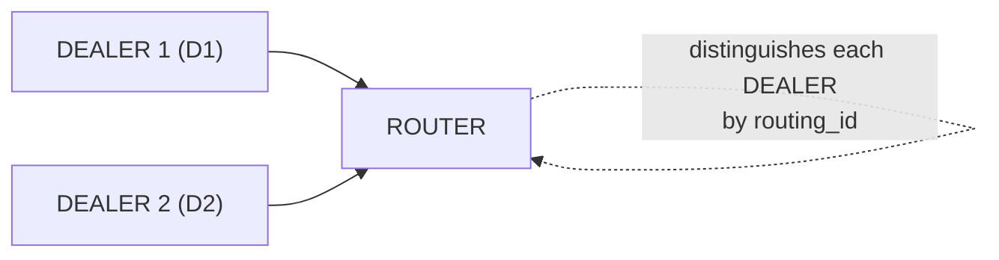

# ROUTER Socket

## 1. Overview

The ROUTER socket is a **routing_id-based routing** socket. It automatically prepends a routing_id frame to received messages, and when sending, it uses the first frame's routing_id to specify the target peer.

**Key characteristics:**
- Automatically adds a routing_id frame on receive (identifies message origin)
- Specifies the target peer via the first frame on send (replies to a specific client)
- Can manage multiple peers (server/broker role)

**Valid socket combinations:** ROUTER ↔ DEALER, ROUTER ↔ ROUTER



## 2. Basic Usage

### Creation and Bind

```c
void *router = zlink_socket(ctx, ZLINK_ROUTER);
zlink_bind(router, "tcp://*:5558");
```

### Receiving Messages

ROUTER receives messages via a handler callback attached after socket creation.

```c
/* DEALER sends "Hello" → handler receives source_rid + parts */
void on_message(const zlink_routing_id_t *source_rid,
                zlink_msg_t *parts, size_t part_count,
                void *userdata)
{
    printf("From [%.*s]: %.*s\n",
           (int)source_rid->size, source_rid->data,
           (int)zlink_msg_size(&parts[0]),
           (char *)zlink_msg_data(&parts[0]));
    for (size_t i = 0; i < part_count; i++)
        zlink_msg_close(&parts[i]);
}

void *router = zlink_socket(ctx, ZLINK_ROUTER);
/* Receive with zlink_recv() */
```

### Sending Messages

When replying, use `zlink_send_rid` with the `source_rid` to specify the target.

```c
/* Reply using source_rid from the callback */
zlink_msg_t reply;
zlink_msg_init_size(&reply, 5);
memcpy(zlink_msg_data(&reply), "World", 5);
zlink_send_rid(router, source_rid, &reply, 1, 0);
```

### Receive Modes

**Pull mode**: without attaching a handler, call `zlink_recv()` to
receive synchronously.

```c
zlink_routing_id_t source_rid;
zlink_msg_t *parts = NULL;
size_t part_count = 0;
int rc = zlink_recv(router, &source_rid, &parts, &part_count, 0);
if (rc == 0) {
    /* source_rid identifies the sender */
    /* process parts[0..part_count-1] */
    zlink_multipart_close(parts, part_count);
}
```

> When the per-peer send queue is full (HWM), ROUTER returns
> `EHOSTUNREACH` with `ROUTER_MANDATORY` enabled, or silently drops
> the message otherwise. For advanced backpressure patterns, see
> [Performance Guide](10-performance.md).

??? example "Full Sample Code"

    | Language | Source |
    |----------|--------|
    | C | [dealer_router_recv_sample.c](https://github.com/kairos-code-dev/zlink/blob/main/bindings/c/samples/dealer_router_recv_sample.c) |
    | C++ | [dealer_router_recv_sample.cpp](https://github.com/kairos-code-dev/zlink/blob/main/bindings/cpp/samples/dealer_router_recv_sample.cpp) |
    | Java | [DealerRouterRecvSample.java](https://github.com/kairos-code-dev/zlink/blob/main/bindings/java/samples/Zlink.Samples/src/main/java/dev/kairoscode/zlink/samples/DealerRouterRecvSample.java) |
    | Python | [dealer_router_recv.py](https://github.com/kairos-code-dev/zlink/blob/main/bindings/python/examples/dealer_router_recv.py) |
    | Node | [dealer_router_recv_sample.ts](https://github.com/kairos-code-dev/zlink/blob/main/bindings/node/examples/dealer_router_recv_sample.ts) |
    | C# | [Program.cs](https://github.com/kairos-code-dev/zlink/blob/main/bindings/dotnet/samples/DealerRouterRecv/Program.cs) |
    | Rust | [dealer_router_recv_sample.rs](https://github.com/kairos-code-dev/zlink/blob/main/bindings/rust/samples/dealer_router_recv_sample.rs) |
    | Go | [main.go](https://github.com/kairos-code-dev/zlink/blob/main/bindings/go/samples/dealer_router_recv_sample/main.go) |

## 3. Usage Examples

ROUTER uses `zlink_send_rid()` to send to a specific peer, and
identifies the sender via `source_rid` in `zlink_recv()`.

### Receive/Reply Using Handler Callback

```c
/* Receive: handler callback provides routing_id and data */
void on_message(const zlink_routing_id_t *source_rid,
                zlink_msg_t *parts, size_t part_count,
                void *userdata)
{
    /* Reply: send to the source peer using zlink_send_rid */
    zlink_msg_t reply;
    zlink_msg_init_size(&reply, 5);
    memcpy(zlink_msg_data(&reply), "reply", 5);
    zlink_send_rid(router, source_rid, &reply, 1, 0);

    for (size_t i = 0; i < part_count; i++)
        zlink_msg_close(&parts[i]);
}
```

## 4. Socket Options

| Option | Type | Default | Description |
|------|------|--------|------|
| `ZLINK_ROUTER_OPT_MANDATORY` | int | 0 | Return EHOSTUNREACH error for undeliverable messages (set via `zlink_set_router_option()`) |
| `ZLINK_ROUTER_OPT_HANDOVER` | int | 0 | Replace existing connection on routing_id conflict |
| `zlink_set_routing_id()` | binary | Auto (UUID) | The ROUTER's own routing_id (dedicated function) |
| `ZLINK_OPT_SNDHWM` | int | 1000 | Send HWM |
| `ZLINK_OPT_RCVHWM` | int | 1000 | Receive HWM |
| `ZLINK_OPT_LINGER` | int | -1 | Wait time on close (ms) |

### ROUTER_MANDATORY

By default, ROUTER **silently drops** messages when the target cannot be found. Enabling `ROUTER_MANDATORY` returns an `EHOSTUNREACH` error instead.

```c
int mandatory = 1;
zlink_set_router_option(router, ZLINK_ROUTER_OPT_MANDATORY, &mandatory, sizeof(mandatory));

/* Attempt to send to a non-existent target */
zlink_routing_id_t target_rid = { .data = "UNKNOWN", .size = 7 };
zlink_msg_t msg;
zlink_msg_init_size(&msg, 4);
memcpy(zlink_msg_data(&msg), "data", 4);
int rc = zlink_send_rid(router, &target_rid, &msg, 1, 0);
/* rc == -1, errno == EHOSTUNREACH */
```

> Reference: `core/tests/test_router_mandatory.cpp` -- `test_basic()`

## 5. Usage Patterns

### Pattern 1: Multi-DEALER Server

The most basic ROUTER pattern. Distinguishes multiple DEALER clients by routing_id.

```c
/* Server: ROUTER with handler */
void on_request(const zlink_routing_id_t *source_rid,
                zlink_msg_t *parts, size_t part_count,
                void *userdata)
{
    /* Reply to the sender */
    zlink_msg_t reply;
    zlink_msg_init_size(&reply, 5);
    memcpy(zlink_msg_data(&reply), "reply", 5);
    zlink_send_rid(router, source_rid, &reply, 1, 0);
    for (size_t i = 0; i < part_count; i++)
        zlink_msg_close(&parts[i]);
}

void *router = zlink_socket(ctx, ZLINK_ROUTER);
/* Receive with zlink_recv() */
zlink_bind(router, "tcp://127.0.0.1:*");

char endpoint[256];
size_t len = sizeof(endpoint);
zlink_get_option(router, ZLINK_OPT_LAST_ENDPOINT, endpoint, &len);

/* Client 1 */
void *d1 = zlink_socket(ctx, ZLINK_DEALER);
/* Receive replies with zlink_recv() */
zlink_set_routing_id(d1, "D1", 2);
zlink_connect(d1, endpoint);

/* Client 2 */
void *d2 = zlink_socket(ctx, ZLINK_DEALER);
/* Receive replies with zlink_recv() */
zlink_set_routing_id(d2, "D2", 2);
zlink_connect(d2, endpoint);

/* Each client sends a message -- on_request receives with source_rid */
zlink_msg_t m1;
zlink_msg_init_size(&m1, 7);
memcpy(zlink_msg_data(&m1), "from_d1", 7);
zlink_send(d1, &m1, 1, 0);

zlink_msg_t m2;
zlink_msg_init_size(&m2, 7);
memcpy(zlink_msg_data(&m2), "from_d2", 7);
zlink_send(d2, &m2, 1, 0);

/* on_reply receives the reply for each DEALER */
```

> Reference: `core/tests/test_router_multiple_dealers.cpp` -- TCP/IPC/inproc across 3 transports

### Pattern 2: Detecting Send Failures with ROUTER_MANDATORY

```c
void *router = zlink_socket(ctx, ZLINK_ROUTER);
zlink_bind(router, "tcp://*:5558");

/* Default behavior: silently drops undeliverable messages */
zlink_routing_id_t bad_rid = { .data = "UNKNOWN", .size = 7 };
zlink_msg_t msg;
zlink_msg_init_size(&msg, 4);
memcpy(zlink_msg_data(&msg), "DATA", 4);
zlink_send_rid(router, &bad_rid, &msg, 1, 0);
/* No error, message lost */

/* Enable MANDATORY mode */
int mandatory = 1;
zlink_set_router_option(router, ZLINK_ROUTER_OPT_MANDATORY, &mandatory, sizeof(mandatory));

/* Now returns error on undeliverable message */
zlink_msg_t msg2;
zlink_msg_init_size(&msg2, 4);
memcpy(zlink_msg_data(&msg2), "DATA", 4);
int rc = zlink_send_rid(router, &bad_rid, &msg2, 1, 0);
if (rc == -1 && errno == EHOSTUNREACH) {
    /* Target "UNKNOWN" not found */
}
```

> Reference: `core/tests/test_router_mandatory.cpp` -- default drop vs MANDATORY error

### Pattern 3: Send After Confirming Connection

DEALER sends a message first to notify ROUTER of its connection, then ROUTER replies.

```c
/* ROUTER handler: DEALER's initial message confirms connection */
void on_connect(const zlink_routing_id_t *source_rid,
                zlink_msg_t *parts, size_t part_count,
                void *userdata)
{
    /* source_rid->data = "X" -- now it is safe to send to "X" */
    zlink_msg_t reply;
    zlink_msg_init_size(&reply, 7);
    memcpy(zlink_msg_data(&reply), "Welcome", 7);
    zlink_send_rid(router, source_rid, &reply, 1, 0);
    for (size_t i = 0; i < part_count; i++)
        zlink_msg_close(&parts[i]);
}

/* DEALER connects and sends initial message */
void *dealer = zlink_socket(ctx, ZLINK_DEALER);
zlink_set_routing_id(dealer, "X", 1);
zlink_connect(dealer, endpoint);
zlink_msg_t hello;
zlink_msg_init_size(&hello, 5);
memcpy(zlink_msg_data(&hello), "Hello", 5);
zlink_send(dealer, &hello, 1, 0);

/* on_connect receives: source_rid = "X", parts[0] = "Hello"
   and replies with "Welcome" */
```

> Reference: `core/tests/test_router_mandatory.cpp` -- DEALER connect → message → ROUTER reply

### Pattern 4: Multiple Transports

Multiple transports can be used to connect DEALERs to the same ROUTER.

```c
void *router = zlink_socket(ctx, ZLINK_ROUTER);

/* TCP */
zlink_bind(router, "tcp://127.0.0.1:5558");

/* IPC (Linux/macOS) */
zlink_bind(router, "ipc:///tmp/router.ipc");

/* inproc (same process) */
zlink_bind(router, "inproc://router");

/* DEALERs connect via each transport -- ROUTER manages them uniformly by routing_id */
```

> Reference: `core/tests/test_router_multiple_dealers.cpp` -- TCP/IPC/inproc tests

## 6. Caveats

### Default Drop Behavior

Without `ROUTER_MANDATORY`, sending to a non-existent routing_id **silently drops** the message. Enabling `ROUTER_MANDATORY` is recommended in production.

### routing_id Changes on Reconnect

When a DEALER reconnects, its auto-generated routing_id may change. Setting an explicit routing_id is recommended for stable communication.

```c
/* Explicit routing_id -- remains the same across reconnections */
zlink_set_routing_id(dealer, "stable-id", 9);
```

### routing_id Conflicts

If two DEALERs with the same routing_id connect simultaneously, the second connection is rejected by default. Enable `ROUTER_HANDOVER` to replace the existing connection instead.

> For a detailed explanation of routing_id concepts, see [08-routing-id.md](08-routing-id.md).

---
[← DEALER](03-3-dealer.md) | [STREAM →](03-5-stream.md)
