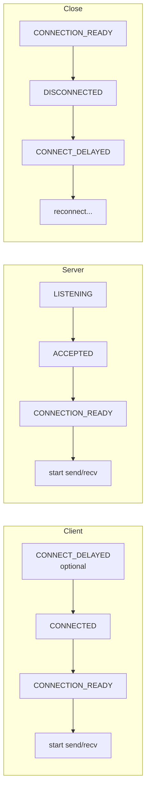
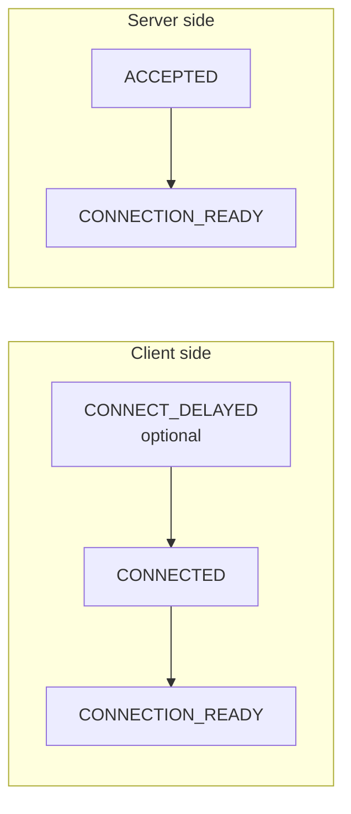
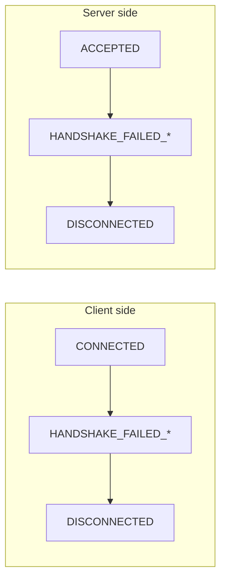
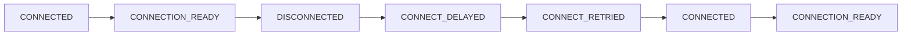

# Monitoring API Usage

## 1. Overview

Monitoring enables real-time observation of socket connection state — essential for diagnosing connectivity issues, detecting peer failures, and triggering application-level recovery.

The zlink monitoring API allows real-time observation of socket events such as connection, disconnection, and handshake. Like other sockets, monitors support both recv mode (pull) and callback mode.

## 2. Enabling the Monitor

### 2.1 Callback Mode

The handler is invoked on the I/O thread immediately when an event occurs.
Callback mode is suitable for real-time processing without event loss.

=== "C"

    ```c
    /* Define event handler */
    void on_monitor_event(const zlink_monitor_event_t *ev, void *userdata)
    {
        printf("Event: 0x%llx\n", (unsigned long long)ev->event);
        printf("Local: %s\n", ev->local_addr);
        printf("Remote: %s\n", ev->remote_addr);

        if (ev->routing_id.size > 0) {
            printf("routing_id: ");
            for (uint8_t i = 0; i < ev->routing_id.size; ++i)
                printf("%02x", ev->routing_id.data[i]);
            printf("\n");
        }
    }

    void *server = zlink_socket(ctx, ZLINK_ROUTER);
    zlink_bind(server, "tcp://*:5555");

    /* Create monitor with options */
    zlink_socket_monitor_open_options_t opts = { .events = ZLINK_EVENT_ALL };
    void *mon = zlink_socket_monitor_open(server, &opts);
    zlink_socket_monitor_handler(mon, on_monitor_event, NULL);
    ```

=== "C++"

    ```cpp
    // Define event handler
    auto server = zlink::socket(ctx, zlink::socket_type::router);
    server.bind("tcp://*:5555");

    // Create monitor with options
    zlink::monitor_options opts;
    opts.events = zlink::event::all;
    auto mon = server.monitor_open(opts);
    mon.set_handler([](const zlink::monitor_event& ev) {
        std::println("Event: 0x{:x}", ev.event());
        std::println("Local: {}", ev.local_addr());
        std::println("Remote: {}", ev.remote_addr());
        if (ev.routing_id().size() > 0)
            std::println("routing_id: {}", ev.routing_id().to_hex());
    });
    ```

=== "Java"

    ```java
    var server = ctx.socket(SocketType.ROUTER);
    server.bind("tcp://*:5555");

    var opts = new MonitorOptions(MonitorEvent.ALL);
    var mon = server.monitorOpen(opts);
    mon.setHandler((ev) -> {
        System.out.printf("Event: 0x%x%n", ev.event());
        System.out.printf("Local: %s%n", ev.localAddr());
        System.out.printf("Remote: %s%n", ev.remoteAddr());
        if (ev.routingId().size() > 0)
            System.out.printf("routing_id: %s%n", ev.routingId().toHex());
    });
    ```

=== "Python"

    ```python
    server = ctx.socket(zlink.ROUTER)
    server.bind("tcp://*:5555")

    opts = zlink.MonitorOptions(events=zlink.EVENT_ALL)
    mon = server.monitor_open(opts)

    def on_monitor_event(ev):
        print(f"Event: 0x{ev.event:x}")
        print(f"Local: {ev.local_addr}")
        print(f"Remote: {ev.remote_addr}")
        if ev.routing_id:
            print(f"routing_id: {ev.routing_id.hex()}")

    mon.set_handler(on_monitor_event)
    ```

=== "Node/TypeScript"

    ```typescript
    const server = ctx.socket(zlink.ROUTER);
    server.bind("tcp://*:5555");

    const opts = { events: zlink.EVENT_ALL };
    const mon = server.monitorOpen(opts);
    mon.setHandler((ev) => {
        console.log(`Event: 0x${ev.event.toString(16)}`);
        console.log(`Local: ${ev.localAddr}`);
        console.log(`Remote: ${ev.remoteAddr}`);
        if (ev.routingId.length > 0)
            console.log(`routing_id: ${ev.routingId.toString("hex")}`);
    });
    ```

=== "C#/.NET"

    ```csharp
    using var server = ctx.CreateSocket(SocketType.Router);
    server.Bind("tcp://*:5555");

    var opts = new MonitorOptions { Events = MonitorEvent.All };
    using var mon = server.MonitorOpen(opts);
    mon.SetHandler((ev) => {
        Console.WriteLine($"Event: 0x{ev.Event:x}");
        Console.WriteLine($"Local: {ev.LocalAddr}");
        Console.WriteLine($"Remote: {ev.RemoteAddr}");
        if (ev.RoutingId.Size > 0)
            Console.WriteLine($"routing_id: {ev.RoutingId.ToHex()}");
    });
    ```

=== "Rust"

    ```rust
    let server = ctx.socket(zlink::ROUTER)?;
    server.bind("tcp://*:5555")?;

    let opts = zlink::MonitorOptions::new(zlink::EVENT_ALL);
    let mon = server.monitor_open(&opts)?;
    mon.set_handler(|ev| {
        println!("Event: 0x{:x}", ev.event());
        println!("Local: {}", ev.local_addr());
        println!("Remote: {}", ev.remote_addr());
        if !ev.routing_id().is_empty() {
            println!("routing_id: {:x}", ev.routing_id());
        }
    });
    ```

=== "Go"

    ```go
    server, err := ctx.RouterSocket()
    if err != nil { log.Fatal(err) }
    server.Bind("tcp://*:5555")

    opts := zlink.MonitorOptions{Events: zlink.EventAll}
    mon, err := server.MonitorOpen(opts)
    if err != nil { log.Fatal(err) }
    mon.SetHandler(func(ev zlink.MonitorEvent) {
        fmt.Printf("Event: 0x%x\n", ev.Event())
        fmt.Printf("Local: %s\n", ev.LocalAddr())
        fmt.Printf("Remote: %s\n", ev.RemoteAddr())
        if ev.RoutingID().Size() > 0 {
            fmt.Printf("routing_id: %x\n", ev.RoutingID().Data())
        }
    })
    ```

Events are dispatched automatically through the `on_monitor_event` callback.

### Event Structure

!!! note "C API struct -- each binding wraps this into its idiomatic event type."

    ```c
    typedef struct {
        uint64_t event;               /* Event type */
        uint64_t value;               /* Auxiliary value (fd, errno, reason, etc.) */
        zlink_routing_id_t routing_id; /* Peer routing_id */
        char local_addr[256];         /* Local address */
        char remote_addr[256];        /* Remote address */
    } zlink_monitor_event_t;
    ```

??? example "Full Sample Code"

    | Language | Source |
    |----------|--------|
    | C | [monitor_recv_sample.c](https://github.com/kairos-code-dev/zlink/blob/main/core/samples/monitor_recv_sample.c) |
    | C++ | [monitor_recv_sample.cpp](https://github.com/kairos-code-dev/zlink/blob/main/bindings/cpp/samples/monitor_recv_sample.cpp) |
    | Java | [MonitorRecvSample.java](https://github.com/kairos-code-dev/zlink/blob/main/bindings/java/samples/Zlink.Samples/src/main/java/dev/kairoscode/zlink/samples/MonitorRecvSample.java) |
    | Python | [monitor_recv.py](https://github.com/kairos-code-dev/zlink/blob/main/bindings/python/examples/monitor_recv.py) |
    | Node | [monitor_recv_sample.ts](https://github.com/kairos-code-dev/zlink/blob/main/bindings/node/examples/monitor_recv_sample.ts) |
    | C# | [Program.cs](https://github.com/kairos-code-dev/zlink/blob/main/bindings/dotnet/samples/MonitorRecv/Program.cs) |
    | Rust | [monitor_recv_sample.rs](https://github.com/kairos-code-dev/zlink/blob/main/bindings/rust/samples/monitor_recv_sample.rs) |
    | Go | [main.go](https://github.com/kairos-code-dev/zlink/blob/main/bindings/go/samples/monitor_recv_sample/main.go) |

## 4. Socket Monitor Events

Events observed via `zlink_socket_monitor_open()`.
These report transport/session state for raw sockets.

### Event table

| Constant | Value | Description | `value` | `routing_id` | Side | After this event |
|---|---|---|---|---|---|---|
| `CONNECTION_READY` | `0x1000` | Ready edge after handshake | reserved | peer id | Both | **start send/recv** |
| `CONNECTED` | `0x0001` | TCP connection established (pre-handshake) | provider-specific | peer id or sentinel | Client | wait for `CONNECTION_READY` |
| `ACCEPTED` | `0x0020` | Incoming connection accepted (pre-handshake) | provider-specific | peer id or sentinel | Server | wait for `CONNECTION_READY` |
| `DISCONNECTED` | `0x0200` | Session terminated | reason code | Possible | Both | trigger reconnection |
| `LISTENING` | `0x0008` | Bind succeeded, listening | fd | — | Server | — |
| `CLOSED` | `0x0080` | Intentional close completed | — | — | Both | — |
| `CONNECT_DELAYED` | `0x0002` | Async connection retry scheduled | errno | — | Client | automatic retry |
| `CONNECT_RETRIED` | `0x0004` | Async reconnection in progress | — | — | Client | automatic retry |
| `BIND_FAILED` | `0x0010` | Bind failed | errno | — | Server | check address/permissions |
| `ACCEPT_FAILED` | `0x0040` | Accept failed | errno | — | Server | check fd limits |
| `CLOSE_FAILED` | `0x0100` | Close failed | errno | — | Both | — |
| `HANDSHAKE_FAILED_NO_DETAIL` | `0x0800` | Handshake failed (generic) | errno | — | Both | check network |
| `HANDSHAKE_FAILED_PROTOCOL` | `0x2000` | Handshake failed (protocol error) | error code | — | Both | check version/config |
| `HANDSHAKE_FAILED_AUTH` | `0x4000` | Handshake failed (auth) | — | — | Both | check TLS/auth config |
| `MONITOR_STOPPED` | `0x0400` | Monitor stopped | — | — | Both | `zlink_monitor_close()` |

### Connection flow



### CONNECTION_READY details

Fired after a successful handshake. Once received, messaging can start immediately.
The `value` field of `CONNECTION_READY` is reserved and must not be used
as an aggregate ready-count contract.

- `ev->routing_id` contains the peer identity on all socket types.

### DISCONNECTED reason codes

| Code | Name | Meaning |
|------|------|---------|
| 0 | `UNKNOWN` | Reason unknown |
| 3 | `HANDSHAKE_FAILED` | Handshake failure |
| 4 | `TRANSPORT_ERROR` | Transport-layer error |
| 5 | `CTX_TERM` | Context terminated |

### Protocol error codes

When `HANDSHAKE_FAILED_PROTOCOL` fires, the `value` field contains one of these codes:

| Constant | Value | Description |
|---|---|---|
| `ZLINK_PROTOCOL_ERROR_ZMP_MALFORMED_COMMAND_HELLO` | `0x10000013` | Malformed ZMP HELLO command. |

## 5. Event Flow Diagrams

### Successful Connection



### Handshake Failure



### Normal Disconnection


### Reconnection



## 6. DISCONNECTED Reason Codes

The `value` field of the `DISCONNECTED` event contains the reason for disconnection.

| Code | Name | Meaning | Recommended Action |
|------|------|---------|-------------------|
| 0 | UNKNOWN | Unknown cause | Log and observe |
| 3 | HANDSHAKE_FAILED | Handshake failure | Check TLS/protocol configuration |
| 4 | TRANSPORT_ERROR | Transport layer error | Check network status |
| 5 | CTX_TERM | Context terminated | Handle shutdown |

### Reason Code Handling Example

=== "C"

    ```c
    void on_monitor(const zlink_monitor_event_t *ev, void *userdata)
    {
        if (ev->event == ZLINK_EVENT_DISCONNECTED) {
            switch (ev->value) {
                case ZLINK_DISCONNECT_REASON_UNKNOWN:
                    printf("Unknown disconnection\n");
                    break;
                case ZLINK_DISCONNECT_REASON_HANDSHAKE_FAILED:
                    printf("Handshake failed -- check TLS configuration\n");
                    break;
                case ZLINK_DISCONNECT_REASON_TRANSPORT_ERROR:
                    printf("Transport error -- check network\n");
                    break;
                case ZLINK_DISCONNECT_REASON_CTX_TERM:
                    printf("Context terminated\n");
                    break;
                default:
                    printf("Unknown reason=%llu\n", (unsigned long long)ev->value);
                    break;
            }
        }
    }
    ```

=== "C++"

    ```cpp
    mon.set_handler([](const zlink::monitor_event& ev) {
        if (ev.event() == zlink::event::disconnected) {
            switch (ev.value()) {
                case zlink::disconnect_reason::unknown:
                    std::println("Unknown disconnection"); break;
                case zlink::disconnect_reason::handshake_failed:
                    std::println("Handshake failed -- check TLS configuration"); break;
                case zlink::disconnect_reason::transport_error:
                    std::println("Transport error -- check network"); break;
                case zlink::disconnect_reason::ctx_term:
                    std::println("Context terminated"); break;
                default:
                    std::println("Unknown reason={}", ev.value()); break;
            }
        }
    });
    ```

=== "Java"

    ```java
    mon.setHandler((ev) -> {
        if (ev.event() == MonitorEvent.DISCONNECTED) {
            switch (ev.disconnectReason()) {
                case UNKNOWN -> System.out.println("Unknown disconnection");
                case HANDSHAKE_FAILED -> System.out.println("Handshake failed -- check TLS configuration");
                case TRANSPORT_ERROR -> System.out.println("Transport error -- check network");
                case CTX_TERM -> System.out.println("Context terminated");
                default -> System.out.printf("Unknown reason=%d%n", ev.value());
            }
        }
    });
    ```

=== "Python"

    ```python
    def on_monitor(ev):
        if ev.event == zlink.EVENT_DISCONNECTED:
            reason = ev.value
            if reason == zlink.DISCONNECT_REASON_UNKNOWN:
                print("Unknown disconnection")
            elif reason == zlink.DISCONNECT_REASON_HANDSHAKE_FAILED:
                print("Handshake failed -- check TLS configuration")
            elif reason == zlink.DISCONNECT_REASON_TRANSPORT_ERROR:
                print("Transport error -- check network")
            elif reason == zlink.DISCONNECT_REASON_CTX_TERM:
                print("Context terminated")
            else:
                print(f"Unknown reason={reason}")
    ```

=== "Node/TypeScript"

    ```typescript
    mon.setHandler((ev) => {
        if (ev.event === zlink.EVENT_DISCONNECTED) {
            switch (ev.value) {
                case zlink.DISCONNECT_REASON_UNKNOWN:
                    console.log("Unknown disconnection"); break;
                case zlink.DISCONNECT_REASON_HANDSHAKE_FAILED:
                    console.log("Handshake failed -- check TLS configuration"); break;
                case zlink.DISCONNECT_REASON_TRANSPORT_ERROR:
                    console.log("Transport error -- check network"); break;
                case zlink.DISCONNECT_REASON_CTX_TERM:
                    console.log("Context terminated"); break;
                default:
                    console.log(`Unknown reason=${ev.value}`); break;
            }
        }
    });
    ```

=== "C#/.NET"

    ```csharp
    mon.SetHandler((ev) => {
        if (ev.Event == MonitorEvent.Disconnected) {
            var reason = (DisconnectReason)ev.Value;
            Console.WriteLine(reason switch {
                DisconnectReason.Unknown => "Unknown disconnection",
                DisconnectReason.HandshakeFailed => "Handshake failed -- check TLS configuration",
                DisconnectReason.TransportError => "Transport error -- check network",
                DisconnectReason.CtxTerm => "Context terminated",
                _ => $"Unknown reason={ev.Value}"
            });
        }
    });
    ```

=== "Rust"

    ```rust
    mon.set_handler(|ev| {
        if ev.event() == zlink::EVENT_DISCONNECTED {
            match ev.disconnect_reason() {
                zlink::DisconnectReason::Unknown => println!("Unknown disconnection"),
                zlink::DisconnectReason::HandshakeFailed => println!("Handshake failed -- check TLS configuration"),
                zlink::DisconnectReason::TransportError => println!("Transport error -- check network"),
                zlink::DisconnectReason::CtxTerm => println!("Context terminated"),
                _ => println!("Unknown reason={}", ev.value()),
            }
        }
    });
    ```

=== "Go"

    ```go
    mon.SetHandler(func(ev zlink.MonitorEvent) {
        if ev.Event() == zlink.EventDisconnected {
            switch ev.Value() {
            case zlink.DisconnectReasonUnknown:
                fmt.Println("Unknown disconnection")
            case zlink.DisconnectReasonHandshakeFailed:
                fmt.Println("Handshake failed -- check TLS configuration")
            case zlink.DisconnectReasonTransportError:
                fmt.Println("Transport error -- check network")
            case zlink.DisconnectReasonCtxTerm:
                fmt.Println("Context terminated")
            default:
                fmt.Printf("Unknown reason=%d\n", ev.Value())
            }
        }
    })
    ```

## 7. Event Filtering and Subscription Presets

### Subscribing to Specific Events Only

=== "C"

    ```c
    /* Connection/disconnection events only */
    zlink_socket_monitor_open_options_t opts = {
        .events = ZLINK_EVENT_CONNECTION_READY | ZLINK_EVENT_DISCONNECTED,
    };
    void *mon = zlink_socket_monitor_open(server, &opts);
    zlink_socket_monitor_handler(mon, on_monitor_event, NULL);
    ```

=== "C++"

    ```cpp
    zlink::monitor_options opts;
    opts.events = zlink::event::connection_ready | zlink::event::disconnected;
    auto mon = server.monitor_open(opts);
    mon.set_handler(on_monitor_event);
    ```

=== "Java"

    ```java
    var opts = new MonitorOptions(
        MonitorEvent.CONNECTION_READY | MonitorEvent.DISCONNECTED);
    var mon = server.monitorOpen(opts);
    mon.setHandler(this::onMonitorEvent);
    ```

=== "Python"

    ```python
    opts = zlink.MonitorOptions(
        events=zlink.EVENT_CONNECTION_READY | zlink.EVENT_DISCONNECTED)
    mon = server.monitor_open(opts)
    mon.set_handler(on_monitor_event)
    ```

=== "Node/TypeScript"

    ```typescript
    const opts = {
        events: zlink.EVENT_CONNECTION_READY | zlink.EVENT_DISCONNECTED
    };
    const mon = server.monitorOpen(opts);
    mon.setHandler(onMonitorEvent);
    ```

=== "C#/.NET"

    ```csharp
    var opts = new MonitorOptions {
        Events = MonitorEvent.ConnectionReady | MonitorEvent.Disconnected
    };
    using var mon = server.MonitorOpen(opts);
    mon.SetHandler(OnMonitorEvent);
    ```

=== "Rust"

    ```rust
    let opts = zlink::MonitorOptions::new(
        zlink::EVENT_CONNECTION_READY | zlink::EVENT_DISCONNECTED);
    let mon = server.monitor_open(&opts)?;
    mon.set_handler(on_monitor_event);
    ```

=== "Go"

    ```go
    opts := zlink.MonitorOptions{Events:
        zlink.EventConnectionReady | zlink.EventDisconnected}
    mon, err := server.MonitorOpen(opts)
    if err != nil { log.Fatal(err) }
    mon.SetHandler(onMonitorEvent)
    ```

### Recommended Subscription Presets

| Preset | Event Mask | Purpose |
|--------|-----------|---------|
| Basic | `CONNECTION_READY \| DISCONNECTED` | Connection state tracking |
| Debug | Basic + `CONNECTED \| ACCEPTED \| CONNECT_DELAYED \| CONNECT_RETRIED` | Detailed connection process |
| Security | Basic + `HANDSHAKE_FAILED_*` | Authentication failure detection |
| Full | `ZLINK_EVENT_ALL` | All events |

### Preset Implementation Example

!!! note "C API preset macros -- each binding defines equivalent constants."

    ```c
    /* Basic preset */
    #define MONITOR_PRESET_BASIC \
        (ZLINK_EVENT_CONNECTION_READY | ZLINK_EVENT_DISCONNECTED)

    /* Debug preset */
    #define MONITOR_PRESET_DEBUG \
        (MONITOR_PRESET_BASIC | ZLINK_EVENT_CONNECTED | \
         ZLINK_EVENT_ACCEPTED | ZLINK_EVENT_CONNECT_DELAYED | \
         ZLINK_EVENT_CONNECT_RETRIED)

    /* Security preset */
    #define MONITOR_PRESET_SECURITY \
        (MONITOR_PRESET_BASIC | ZLINK_EVENT_HANDSHAKE_FAILED_NO_DETAIL | \
         ZLINK_EVENT_HANDSHAKE_FAILED_PROTOCOL | \
         ZLINK_EVENT_HANDSHAKE_FAILED_AUTH)

    zlink_socket_monitor_open_options_t sec_opts = { .events = MONITOR_PRESET_SECURITY };
    void *mon = zlink_socket_monitor_open(server, &sec_opts);
    zlink_socket_monitor_handler(mon, on_monitor_event, NULL);
    ```

## 8. Socket Monitor Snapshot

Query the current aggregate state from a monitor handle at any time.

| Field | Description |
|-------|-------------|
| `snd_pending_msgs` | Messages pending in send queue (capped by SNDHWM) |
| `rcv_pending_msgs` | Messages pending in receive queue (capped by RCVHWM, approximate) |

`snd_pending_msgs` and `rcv_pending_msgs` are directly related to HWM settings.
When these values approach the HWM, backpressure is occurring.

**Note — pending values can exceed the HWM setting:**

1. **inproc transport**: inproc has no session/engine in between, so both
   sides' HWMs are summed. For example, if both sides have SNDHWM=1000
   and RCVHWM=1000, the actual pipe HWM is `1000 + 1000 = 2000`.
   Pending values can appear as twice the configured value.

2. **Slight HWM overshoot**: The write side's view of the read counter
   (`_peers_msgs_read`) is not real-time — it is a snapshot reported by
   the read side only when LWM is reached. Synchronizing on every message
   would eliminate the lock-free pipe's performance advantage, so batch
   notification is used instead. As a result, HWM is an **approximate
   limit**, not a hard limit, and can be slightly exceeded between
   notifications.

| transport | actual pipe HWM | reason |
|-----------|----------------|--------|
| tcp/ipc/tls/ws/wss | `SNDHWM` (as configured) | session manages each side independently |
| inproc | `SNDHWM + peer.RCVHWM` | direct connection without session; buffers summed |

=== "C"

    ```c
    zlink_socket_monitor_open_options_t opts = { .events = ZLINK_EVENT_ALL };
    void *monitor = zlink_socket_monitor_open(socket, &opts);
    zlink_monitor_snapshot_t snapshot;
    zlink_monitor_snapshot(monitor, &snapshot);
    printf("sndq=%llu, rcvq=%llu\n",
           (unsigned long long) snapshot.snd_pending_msgs,
           (unsigned long long) snapshot.rcv_pending_msgs);
    ```

=== "C++"

    ```cpp
    auto mon = socket.monitor_open({zlink::event::all});
    auto snapshot = mon.snapshot();
    std::println("sndq={}, rcvq={}",
                 snapshot.snd_pending_msgs,
                 snapshot.rcv_pending_msgs);
    ```

=== "Java"

    ```java
    var mon = socket.monitorOpen(new MonitorOptions(MonitorEvent.ALL));
    var snapshot = mon.snapshot();
    System.out.printf("sndq=%d, rcvq=%d%n",
        snapshot.sndPendingMsgs(), snapshot.rcvPendingMsgs());
    ```

=== "Python"

    ```python
    mon = socket.monitor_open(zlink.MonitorOptions(events=zlink.EVENT_ALL))
    snapshot = mon.snapshot()
    print(f"sndq={snapshot.snd_pending_msgs}, rcvq={snapshot.rcv_pending_msgs}")
    ```

=== "Node/TypeScript"

    ```typescript
    const mon = socket.monitorOpen({ events: zlink.EVENT_ALL });
    const snapshot = mon.snapshot();
    console.log(`sndq=${snapshot.sndPendingMsgs}, rcvq=${snapshot.rcvPendingMsgs}`);
    ```

=== "C#/.NET"

    ```csharp
    using var mon = socket.MonitorOpen(new MonitorOptions { Events = MonitorEvent.All });
    var snapshot = mon.Snapshot();
    Console.WriteLine($"sndq={snapshot.SndPendingMsgs}, rcvq={snapshot.RcvPendingMsgs}");
    ```

=== "Rust"

    ```rust
    let mon = socket.monitor_open(&zlink::MonitorOptions::new(zlink::EVENT_ALL))?;
    let snapshot = mon.snapshot()?;
    println!("sndq={}, rcvq={}",
             snapshot.snd_pending_msgs,
             snapshot.rcv_pending_msgs);
    ```

=== "Go"

    ```go
    opts := zlink.MonitorOptions{Events: zlink.EventAll}
    mon, err := socket.MonitorOpen(opts)
    if err != nil { log.Fatal(err) }
    snapshot, err := mon.Snapshot()
    if err != nil { log.Fatal(err) }
    fmt.Printf("sndq=%d, rcvq=%d\n",
        snapshot.SndPendingMsgs,
        snapshot.RcvPendingMsgs)
    ```

You can also combine snapshot queries inside event callbacks.

=== "C"

    ```c
    void on_monitor(const zlink_monitor_event_t *ev, void *userdata)
    {
        if (ev->event == ZLINK_EVENT_CONNECTION_READY) {
            zlink_monitor_snapshot_t snapshot;
            zlink_monitor_snapshot(g_monitor, &snapshot);
            printf("Monitor snapshot updated\n");
        }
    }
    ```

=== "C++"

    ```cpp
    mon.set_handler([&](const zlink::monitor_event& ev) {
        if (ev.event() == zlink::event::connection_ready) {
            auto snapshot = mon.snapshot();
            std::println("Monitor snapshot updated");
        }
    });
    ```

=== "Java"

    ```java
    mon.setHandler((ev) -> {
        if (ev.event() == MonitorEvent.CONNECTION_READY) {
            var snapshot = mon.snapshot();
            System.out.println("Monitor snapshot updated");
        }
    });
    ```

=== "Python"

    ```python
    def on_monitor(ev):
        if ev.event == zlink.EVENT_CONNECTION_READY:
            snapshot = mon.snapshot()
            print("Monitor snapshot updated")
    ```

=== "Node/TypeScript"

    ```typescript
    mon.setHandler((ev) => {
        if (ev.event === zlink.EVENT_CONNECTION_READY) {
            const snapshot = mon.snapshot();
            console.log("Monitor snapshot updated");
        }
    });
    ```

=== "C#/.NET"

    ```csharp
    mon.SetHandler((ev) => {
        if (ev.Event == MonitorEvent.ConnectionReady) {
            var snapshot = mon.Snapshot();
            Console.WriteLine("Monitor snapshot updated");
        }
    });
    ```

=== "Rust"

    ```rust
    mon.set_handler(|ev| {
        if ev.event() == zlink::EVENT_CONNECTION_READY {
            let snapshot = mon.snapshot().unwrap();
            println!("Monitor snapshot updated");
        }
    });
    ```

=== "Go"

    ```go
    mon.SetHandler(func(ev zlink.MonitorEvent) {
        if ev.Event() == zlink.EventConnectionReady {
            snapshot, _ := mon.Snapshot()
            fmt.Println("Monitor snapshot updated")
        }
    })
    ```

## 8.1 Service Monitor

The service monitor observes state changes on service handles that still
expose a public service-monitor surface, such as Discovery. It is a
separate API from the socket monitor.
SPOT and SpotNode no longer expose a public service-monitor surface.

- **Event type**: `zlink_service_event_t` (different from socket monitor's `zlink_monitor_event_t`)
- **Callback type**: `zlink_service_monitor_handler_fn`
- **Open**: `zlink_service_monitor_open(target, &options)`
- **Close**: `zlink_monitor_close(&mon)` (same as socket monitor)

### Opening a service monitor

=== "C"

    ```c
    /* Discovery service monitor */
    zlink_service_monitor_open_options_t opts = {
        .events = ZLINK_SERVICE_MONITOR_EVENT_ERROR
                  | ZLINK_SERVICE_MONITOR_EVENT_CLOSED
                  | ZLINK_SERVICE_MONITOR_EVENT_DISCOVERY_PROVIDERS_CHANGED
    };
    void *mon = zlink_service_monitor_open(discovery, &opts);
    ```

=== "C++"

    ```cpp
    zlink::service_monitor_options opts;
    opts.events = zlink::service_monitor_event::all;
    auto mon = discovery.service_monitor_open(opts);
    ```

=== "Java"

    ```java
    var opts = new ServiceMonitorOptions(ServiceMonitorEvent.ALL);
    var mon = discovery.serviceMonitorOpen(opts);
    ```

=== "Python"

    ```python
    opts = zlink.ServiceMonitorOptions(events=zlink.SERVICE_MONITOR_EVENT_ALL)
    mon = discovery.service_monitor_open(opts)
    ```

=== "Node/TypeScript"

    ```typescript
    const opts = { events: zlink.SERVICE_MONITOR_EVENT_ALL };
    const mon = discovery.serviceMonitorOpen(opts);
    ```

=== "C#/.NET"

    ```csharp
    var opts = new ServiceMonitorOptions { Events = ServiceMonitorEvent.All };
    using var mon = discovery.ServiceMonitorOpen(opts);
    ```

=== "Rust"

    ```rust
    let opts = zlink::ServiceMonitorOptions::new(zlink::SERVICE_MONITOR_EVENT_ALL);
    let mon = discovery.service_monitor_open(&opts)?;
    ```

=== "Go"

    ```go
    opts := zlink.ServiceMonitorOptions{Events: zlink.ServiceMonitorEventAll}
    mon, err := discovery.ServiceMonitorOpen(opts)
    if err != nil { log.Fatal(err) }
    ```

Pass a service handle that supports public service monitoring.
SPOT and SpotNode no longer expose a public service-monitor surface.

### Callback mode

=== "C"

    ```c
    void on_service_event(const zlink_service_event_t *ev, void *userdata)
    {
        if (ev->event_type & ZLINK_DISCOVERY_PROVIDERS_CHANGED) {
            printf("provider set changed\n");
        }
        if (ev->event_type & ZLINK_MONITOR_EVENT_ERROR) {
            printf("service error: %d\n", ev->error_code);
        }
    }

    zlink_service_monitor_handler(mon, on_service_event, NULL);
    ```

### Recv mode

=== "C"

    ```c
    zlink_service_event_t ev;
    int rc = zlink_service_monitor_recv(mon, &ev);
    if (rc == 0) {
        printf("event: 0x%x, value: %u\n", ev.event_type, ev.value);
    }
    ```

=== "C++"

    ```cpp
    auto ev = mon.recv();
    if (ev) {
        std::println("event: 0x{:x}, value: {}", ev->event_type(), ev->value());
    }
    ```

=== "Java"

    ```java
    var ev = mon.recv();
    if (ev != null) {
        System.out.printf("event: 0x%x, value: %d%n", ev.eventType(), ev.value());
    }
    ```

=== "Python"

    ```python
    ev = mon.recv()
    if ev is not None:
        print(f"event: 0x{ev.event_type:x}, value: {ev.value}")
    ```

=== "Node/TypeScript"

    ```typescript
    const ev = mon.recv();
    if (ev) {
        console.log(`event: 0x${ev.eventType.toString(16)}, value: ${ev.value}`);
    }
    ```

=== "C#/.NET"

    ```csharp
    var ev = mon.Recv();
    if (ev != null) {
        Console.WriteLine($"event: 0x{ev.EventType:x}, value: {ev.Value}");
    }
    ```

=== "Rust"

    ```rust
    if let Some(ev) = mon.recv()? {
        println!("event: 0x{:x}, value: {}", ev.event_type(), ev.value());
    }
    ```

=== "Go"

    ```go
    ev, err := mon.Recv()
    if err == nil {
        fmt.Printf("event: 0x%x, value: %d\n", ev.EventType(), ev.Value())
    }
    ```

### Service event table

Events observed via `zlink_service_monitor_open()`.
Different services emit different events.

#### Discovery events

| Constant | Description | `value` | After this event |
|---|---|---|---|
| `DISCOVERY_SERVICE_UP` | discovered service came up | — | — |
| `DISCOVERY_SERVICE_DOWN` | discovered service went down | — | — |
| `DISCOVERY_PROVIDERS_CHANGED` | provider set changed | — | — |

#### Common events (all services)

| Constant | Description |
|---|---|
| `MONITOR_EVENT_ERROR` | error occurred |
| `MONITOR_EVENT_CLOSED` | monitor closed |

See [events.md](../api/events.md) for the full event catalog.

## 9. Multi-Socket Monitoring

Handle events from multiple sockets with individual callback handlers.

=== "C"

    ```c
    void on_event_a(const zlink_monitor_event_t *ev, void *userdata)
    {
        printf("Socket A event: 0x%llx\n", (unsigned long long)ev->event);
    }

    void on_event_b(const zlink_monitor_event_t *ev, void *userdata)
    {
        printf("Socket B event: 0x%llx\n", (unsigned long long)ev->event);
    }

    zlink_socket_monitor_open_options_t opts = { .events = ZLINK_EVENT_ALL };
    void *mon_a = zlink_socket_monitor_open(sock_a, &opts);
    zlink_socket_monitor_handler(mon_a, on_event_a, NULL);
    void *mon_b = zlink_socket_monitor_open(sock_b, &opts);
    zlink_socket_monitor_handler(mon_b, on_event_b, NULL);

    /* ... application logic ... */

    /* Cleanup */
    zlink_monitor_close(&mon_a);
    zlink_monitor_close(&mon_b);
    ```

=== "C++"

    ```cpp
    auto opts = zlink::monitor_options{zlink::event::all};
    auto mon_a = sock_a.monitor_open(opts);
    mon_a.set_handler([](const zlink::monitor_event& ev) {
        std::println("Socket A event: 0x{:x}", ev.event());
    });
    auto mon_b = sock_b.monitor_open(opts);
    mon_b.set_handler([](const zlink::monitor_event& ev) {
        std::println("Socket B event: 0x{:x}", ev.event());
    });

    // ... application logic ...

    mon_a.close();
    mon_b.close();
    ```

=== "Java"

    ```java
    var opts = new MonitorOptions(MonitorEvent.ALL);
    var monA = sockA.monitorOpen(opts);
    monA.setHandler(ev -> System.out.printf("Socket A event: 0x%x%n", ev.event()));
    var monB = sockB.monitorOpen(opts);
    monB.setHandler(ev -> System.out.printf("Socket B event: 0x%x%n", ev.event()));

    // ... application logic ...

    monA.close();
    monB.close();
    ```

=== "Python"

    ```python
    opts = zlink.MonitorOptions(events=zlink.EVENT_ALL)
    mon_a = sock_a.monitor_open(opts)
    mon_a.set_handler(lambda ev: print(f"Socket A event: 0x{ev.event:x}"))
    mon_b = sock_b.monitor_open(opts)
    mon_b.set_handler(lambda ev: print(f"Socket B event: 0x{ev.event:x}"))

    # ... application logic ...

    mon_a.close()
    mon_b.close()
    ```

=== "Node/TypeScript"

    ```typescript
    const opts = { events: zlink.EVENT_ALL };
    const monA = sockA.monitorOpen(opts);
    monA.setHandler((ev) => console.log(`Socket A event: 0x${ev.event.toString(16)}`));
    const monB = sockB.monitorOpen(opts);
    monB.setHandler((ev) => console.log(`Socket B event: 0x${ev.event.toString(16)}`));

    // ... application logic ...

    monA.close();
    monB.close();
    ```

=== "C#/.NET"

    ```csharp
    var opts = new MonitorOptions { Events = MonitorEvent.All };
    using var monA = sockA.MonitorOpen(opts);
    monA.SetHandler(ev => Console.WriteLine($"Socket A event: 0x{ev.Event:x}"));
    using var monB = sockB.MonitorOpen(opts);
    monB.SetHandler(ev => Console.WriteLine($"Socket B event: 0x{ev.Event:x}"));

    // ... application logic ...
    ```

=== "Rust"

    ```rust
    let opts = zlink::MonitorOptions::new(zlink::EVENT_ALL);
    let mon_a = sock_a.monitor_open(&opts)?;
    mon_a.set_handler(|ev| println!("Socket A event: 0x{:x}", ev.event()));
    let mon_b = sock_b.monitor_open(&opts)?;
    mon_b.set_handler(|ev| println!("Socket B event: 0x{:x}", ev.event()));

    // ... application logic ...

    mon_a.close();
    mon_b.close();
    ```

=== "Go"

    ```go
    opts := zlink.MonitorOptions{Events: zlink.EventAll}
    monA, _ := sockA.MonitorOpen(opts)
    monA.SetHandler(func(ev zlink.MonitorEvent) {
        fmt.Printf("Socket A event: 0x%x\n", ev.Event())
    })
    monB, _ := sockB.MonitorOpen(opts)
    monB.SetHandler(func(ev zlink.MonitorEvent) {
        fmt.Printf("Socket B event: 0x%x\n", ev.Event())
    })

    // ... application logic ...

    monA.Close()
    monB.Close()
    ```

## 10. Important Notes

### Monitor Thread Safety

`zlink_socket_monitor_open()` and monitor-handle close belong to the
low-frequency control-path contract of raw and service handles. That means
they may be called from application threads and remain correct when mixed with
other concurrent operations on the same handle. The monitor callback itself still runs on the
I/O path, so slow callback work should be offloaded to a user queue.

=== "C"

    ```c
    /* Open a monitor from an application thread */
    void *socket = zlink_socket(ctx, ZLINK_ROUTER);
    zlink_socket_monitor_open_options_t opts = { .events = ZLINK_EVENT_ALL };
    void *mon = zlink_socket_monitor_open(socket, &opts);
    zlink_socket_monitor_handler(mon, on_monitor_event, NULL);

    /* Snapshot reads may happen later from another worker thread */
    zlink_monitor_snapshot_t snapshot;
    zlink_monitor_snapshot(mon, &snapshot);
    ```

=== "C++"

    ```cpp
    auto socket = zlink::socket(ctx, zlink::socket_type::router);
    auto mon = socket.monitor_open({zlink::event::all});
    mon.set_handler(on_monitor_event);

    // Snapshot reads may happen later from another worker thread
    auto snapshot = mon.snapshot();
    ```

=== "Java"

    ```java
    var socket = ctx.socket(SocketType.ROUTER);
    var mon = socket.monitorOpen(new MonitorOptions(MonitorEvent.ALL));
    mon.setHandler(this::onMonitorEvent);

    // Snapshot reads may happen later from another worker thread
    var snapshot = mon.snapshot();
    ```

=== "Python"

    ```python
    socket = ctx.socket(zlink.ROUTER)
    mon = socket.monitor_open(zlink.MonitorOptions(events=zlink.EVENT_ALL))
    mon.set_handler(on_monitor_event)

    # Snapshot reads may happen later from another worker thread
    snapshot = mon.snapshot()
    ```

=== "Node/TypeScript"

    ```typescript
    const socket = ctx.socket(zlink.ROUTER);
    const mon = socket.monitorOpen({ events: zlink.EVENT_ALL });
    mon.setHandler(onMonitorEvent);

    // Snapshot reads may happen later from another worker thread
    const snapshot = mon.snapshot();
    ```

=== "C#/.NET"

    ```csharp
    using var socket = ctx.CreateSocket(SocketType.Router);
    using var mon = socket.MonitorOpen(new MonitorOptions { Events = MonitorEvent.All });
    mon.SetHandler(OnMonitorEvent);

    // Snapshot reads may happen later from another worker thread
    var snapshot = mon.Snapshot();
    ```

=== "Rust"

    ```rust
    let socket = ctx.socket(zlink::ROUTER)?;
    let mon = socket.monitor_open(&zlink::MonitorOptions::new(zlink::EVENT_ALL))?;
    mon.set_handler(on_monitor_event);

    // Snapshot reads may happen later from another worker thread
    let snapshot = mon.snapshot()?;
    ```

=== "Go"

    ```go
    socket, _ := ctx.RouterSocket()
    opts := zlink.MonitorOptions{Events: zlink.EventAll}
    mon, _ := socket.MonitorOpen(opts)
    mon.SetHandler(onMonitorEvent)

    // Snapshot reads may happen later from another worker thread
    snapshot, _ := mon.Snapshot()
    _ = snapshot
    ```

### Concurrent Monitor Limitation

Multiple monitors cannot be set on the same socket simultaneously.

### Callback Processing Speed

Blocking work in the callback handler can delay other I/O. For slow
processing, enqueue from the callback and handle it on your own thread.

### Monitor Shutdown Procedure

=== "C"

    ```c
    /* Close the monitor handle */
    zlink_monitor_close(&mon);
    ```

=== "C++"

    ```cpp
    mon.close();
    ```

=== "Java"

    ```java
    mon.close();
    ```

=== "Python"

    ```python
    mon.close()
    ```

=== "Node/TypeScript"

    ```typescript
    mon.close();
    ```

=== "C#/.NET"

    ```csharp
    mon.Dispose(); // or using statement
    ```

=== "Rust"

    ```rust
    mon.close();
    ```

=== "Go"

    ```go
    mon.Close()
    ```

## 11. Knowing When Messaging Is Ready

When you need to know the exact moment a socket or service can send and
receive, wait for the right event.

### 11.1 Raw sockets — PAIR, DEALER, ROUTER

Ready to send/recv immediately after `CONNECTION_READY`.

=== "C"

    ```c
    /* DEALER/ROUTER example */
    zlink_socket_monitor_open_options_t opts = {
        .events = ZLINK_EVENT_CONNECTION_READY
    };
    void *mon = zlink_socket_monitor_open(router, &opts);

    void on_ready(const zlink_monitor_event_t *ev, void *userdata) {
        if (ev->event & ZLINK_EVENT_CONNECTION_READY) {
            /* ROUTER: ev->routing_id contains the peer identity */
            /* routed send is possible now */
        }
    }
    zlink_socket_monitor_handler(mon, on_ready, NULL);
    ```

=== "C++"

    ```cpp
    auto mon = router.monitor_open({zlink::event::connection_ready});
    mon.set_handler([](const zlink::monitor_event& ev) {
        if (ev.event() & zlink::event::connection_ready) {
            // ROUTER: ev.routing_id() contains the peer identity
            // routed send is possible now
        }
    });
    ```

=== "Java"

    ```java
    var mon = router.monitorOpen(
        new MonitorOptions(MonitorEvent.CONNECTION_READY));
    mon.setHandler(ev -> {
        if ((ev.event() & MonitorEvent.CONNECTION_READY) != 0) {
            // ROUTER: ev.routingId() contains the peer identity
        }
    });
    ```

=== "Python"

    ```python
    mon = router.monitor_open(
        zlink.MonitorOptions(events=zlink.EVENT_CONNECTION_READY))
    def on_ready(ev):
        if ev.event & zlink.EVENT_CONNECTION_READY:
            # ROUTER: ev.routing_id contains the peer identity
            pass
    mon.set_handler(on_ready)
    ```

=== "Node/TypeScript"

    ```typescript
    const mon = router.monitorOpen({
        events: zlink.EVENT_CONNECTION_READY
    });
    mon.setHandler((ev) => {
        if (ev.event & zlink.EVENT_CONNECTION_READY) {
            // ROUTER: ev.routingId contains the peer identity
        }
    });
    ```

=== "C#/.NET"

    ```csharp
    using var mon = router.MonitorOpen(
        new MonitorOptions { Events = MonitorEvent.ConnectionReady });
    mon.SetHandler(ev => {
        if (ev.Event.HasFlag(MonitorEvent.ConnectionReady)) {
            // ROUTER: ev.RoutingId contains the peer identity
        }
    });
    ```

=== "Rust"

    ```rust
    let mon = router.monitor_open(
        &zlink::MonitorOptions::new(zlink::EVENT_CONNECTION_READY))?;
    mon.set_handler(|ev| {
        if ev.event() & zlink::EVENT_CONNECTION_READY != 0 {
            // ROUTER: ev.routing_id() contains the peer identity
        }
    });
    ```

=== "Go"

    ```go
    opts := zlink.MonitorOptions{Events: zlink.EventConnectionReady}
    mon, _ := router.MonitorOpen(opts)
    mon.SetHandler(func(ev zlink.MonitorEvent) {
        if ev.Event()&zlink.EventConnectionReady != 0 {
            // ROUTER: ev.RoutingID() contains the peer identity
        }
    })
    ```

| Family | Wait for | Then you can |
|---|---|---|
| PAIR | `CONNECTION_READY` on both sides | bidirectional send/recv |
| DEALER | `CONNECTION_READY` | send/recv |
| ROUTER | `CONNECTION_READY` | routed send/recv using `ev->routing_id` |

### 11.2 Raw sockets — STREAM

STREAM works like ROUTER — the routing_id is assigned when the TCP
connection is established, not when the first payload arrives.
`CONNECTION_READY` fires with the routing_id before any payload
is delivered to the application. Sequence:

1. Client connects via raw TCP
2. Server receives `CONNECTION_READY` with `ev->routing_id`
3. Server can now send to the client using the routing_id
4. Client payload (if any) arrives after the ready event

=== "C"

    ```c
    /* STREAM server: CONNECTION_READY -> routing_id available -> send/recv */
    void on_ready(const zlink_monitor_event_t *ev, void *userdata) {
        if (ev->event & ZLINK_EVENT_CONNECTION_READY) {
            /* ev->routing_id contains the peer's routing_id */
            /* send to this peer immediately, or wait for inbound payload */
        }
    }

    zlink_socket_monitor_open_options_t opts = {
        .events = ZLINK_EVENT_CONNECTION_READY
    };
    void *mon = zlink_socket_monitor_open(stream_server, &opts);
    zlink_socket_monitor_handler(mon, on_ready, NULL);
    ```

=== "C++"

    ```cpp
    auto mon = stream_server.monitor_open({zlink::event::connection_ready});
    mon.set_handler([](const zlink::monitor_event& ev) {
        if (ev.event() & zlink::event::connection_ready) {
            // ev.routing_id() contains the peer's routing_id
        }
    });
    ```

=== "Java"

    ```java
    var mon = streamServer.monitorOpen(
        new MonitorOptions(MonitorEvent.CONNECTION_READY));
    mon.setHandler(ev -> {
        if ((ev.event() & MonitorEvent.CONNECTION_READY) != 0) {
            // ev.routingId() contains the peer's routing_id
        }
    });
    ```

=== "Python"

    ```python
    mon = stream_server.monitor_open(
        zlink.MonitorOptions(events=zlink.EVENT_CONNECTION_READY))
    def on_ready(ev):
        if ev.event & zlink.EVENT_CONNECTION_READY:
            # ev.routing_id contains the peer's routing_id
            pass
    mon.set_handler(on_ready)
    ```

=== "Node/TypeScript"

    ```typescript
    const mon = streamServer.monitorOpen({
        events: zlink.EVENT_CONNECTION_READY
    });
    mon.setHandler((ev) => {
        if (ev.event & zlink.EVENT_CONNECTION_READY) {
            // ev.routingId contains the peer's routing_id
        }
    });
    ```

=== "C#/.NET"

    ```csharp
    using var mon = streamServer.MonitorOpen(
        new MonitorOptions { Events = MonitorEvent.ConnectionReady });
    mon.SetHandler(ev => {
        if (ev.Event.HasFlag(MonitorEvent.ConnectionReady)) {
            // ev.RoutingId contains the peer's routing_id
        }
    });
    ```

=== "Rust"

    ```rust
    let mon = stream_server.monitor_open(
        &zlink::MonitorOptions::new(zlink::EVENT_CONNECTION_READY))?;
    mon.set_handler(|ev| {
        if ev.event() & zlink::EVENT_CONNECTION_READY != 0 {
            // ev.routing_id() contains the peer's routing_id
        }
    });
    ```

=== "Go"

    ```go
    opts := zlink.MonitorOptions{Events: zlink.EventConnectionReady}
    mon, _ := streamServer.MonitorOpen(opts)
    mon.SetHandler(func(ev zlink.MonitorEvent) {
        if ev.Event()&zlink.EventConnectionReady != 0 {
            // ev.RoutingID() contains the peer's routing_id
        }
    })
    ```

| Family | Wait for | Then you can |
|---|---|---|
| STREAM | `CONNECTION_READY` | send/recv using `ev->routing_id` |

### 11.3 Raw sockets — PUB/SUB

For internal perf on raw PUB/SUB, use `CONNECTION_READY` for each
expected client before messaging. Perf does not use delivery-ready
monitor events.

```c
zlink_set_subscription(sub, "topic");

/* SUB/PUB perf gate: wait for connection-ready */
zlink_socket_monitor_open_options_t sub_opts = {
    .events = ZLINK_EVENT_CONNECTION_READY
};
void *sub_mon = zlink_socket_monitor_open(sub, &sub_opts);

zlink_socket_monitor_open_options_t pub_opts = {
    .events = ZLINK_EVENT_CONNECTION_READY
};
void *pub_mon = zlink_socket_monitor_open(pub, &pub_opts);

/* Start after expected clients are connection-ready */
zlink_publish(pub, NULL, &part, 1, 0);  /* raw PUB: topic_id is NULL */
zlink_subscribe(sub, &source_rid, &parts, &count, topic_buf, &topic_len, 0);

zlink_monitor_close(&pub_mon);
zlink_monitor_close(&sub_mon);
```

| Family | Wait for | Then you can |
|---|---|---|
| PUB | `CONNECTION_READY` + expected client counting | `zlink_publish()` delivery |
| SUB | `CONNECTION_READY` + expected client counting | `zlink_subscribe()` recv |

### 11.4 Services — SPOT

SPOT no longer exposes a public service-monitor surface. For internal
perf on SPOT, use an explicit benchmark control barrier instead of
monitor events.

```c
/* SPOT perf gate: explicit READY/START barrier */
send_control_ready(client_id);
wait_ready_count(expected_clients);
broadcast_control_start();
```

| Service | Wait for | Then you can |
|---|---|---|
| SPOT sub | explicit `READY/START` barrier | start receiving via `zlink_subscribe()` |
| SPOT pub | explicit `READY/START` barrier | start delivering via `zlink_publish()` |

### 11.5 Snapshots

`zlink_monitor_snapshot()` and `zlink_*_status_snapshot()` return
a point-in-time view of the current state. Use them for dashboards,
health checks, and debugging.

=== "C"

    ```c
    /* Check current discovery health */
    zlink_discovery_status_t status;
    zlink_discovery_status_snapshot(discovery, &status);
    printf("state=%d\n", status.state);
    ```

=== "C++"

    ```cpp
    auto status = discovery.status_snapshot();
    std::println("state={}", status.state);
    ```

=== "Java"

    ```java
    var status = discovery.statusSnapshot();
    System.out.printf("state=%d%n", status.state());
    ```

=== "Python"

    ```python
    status = discovery.status_snapshot()
    print(f"state={status.state}")
    ```

=== "Node/TypeScript"

    ```typescript
    const status = discovery.statusSnapshot();
    console.log(`state=${status.state}`);
    ```

=== "C#/.NET"

    ```csharp
    var status = discovery.StatusSnapshot();
    Console.WriteLine($"state={status.State}");
    ```

=== "Rust"

    ```rust
    let status = discovery.status_snapshot()?;
    println!("state={}", status.state);
    ```

=== "Go"

    ```go
    status, _ := discovery.StatusSnapshot()
    fmt.Printf("state=%d\n", status.State)
    ```

---
[← TLS Security](05-tls-security.md) | [Services Overview →](07-0-services.md)
