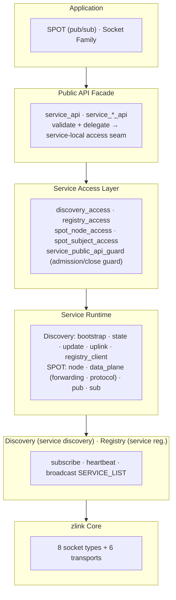
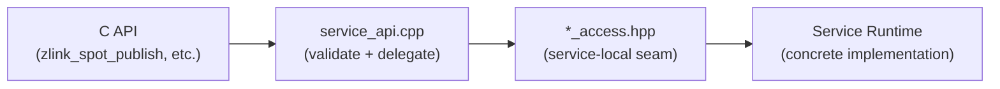
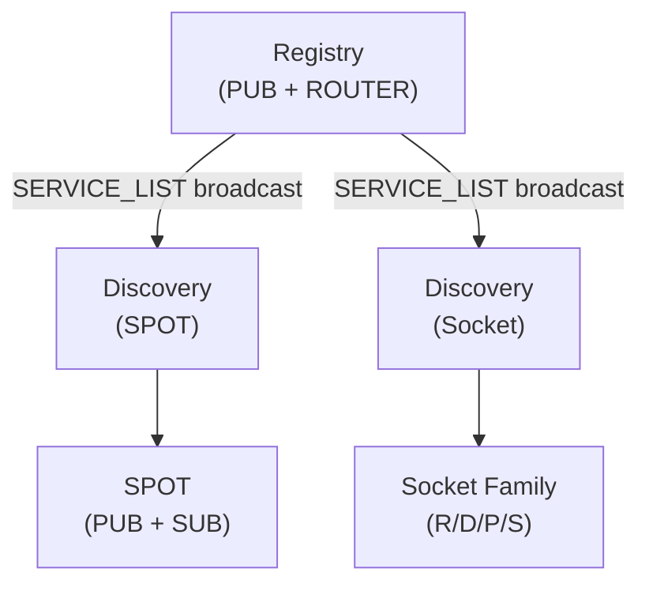

# Service Layer Overview

## 1. What is the Service Layer

Without the service layer, applications would need to manually manage socket connections, track peer addresses, and handle service lifecycle. The service layer automates these tasks.

The zlink service layer is a set of **high-level distributed service features** built on top of the 8 socket types (PAIR, PUB/SUB, XPUB/XSUB, DEALER/ROUTER, STREAM). It enables service registration, discovery, and location-transparent communication without directly managing socket-level connections and routing.

## 2. Architecture

- **Public API Facade** is the C API entry point that validates handles and delegates to service-local access seams. It does not know concrete service details.
- **Service Access Layer** is the service-local seam provided by each service. `*_access.hpp` defines the contract between the API layer and service runtime.
- **Service Runtime** is the concrete implementation of each service. SPOT is modularized into node/data_plane(forwarding/protocol)/pub/sub.
- **Registry** manages service entries and periodically broadcasts the SERVICE_LIST.
- **Discovery** subscribes to the Registry and maintains a local cache of the service list.
- **SPOT** automatically discovers and connects to targets through Discovery.

## Service Terminology

| Service | Name Origin | One-Line Description |
|---------|-------------|---------------------|
| **Registry** | Service registry | Central store that registers and manages service entries |
| **Discovery** | Service discovery | Subscribes to the Registry and maintains a local cache of the service list |
| **SPOT** | Location (spot) transparent pub/sub | Object-level, location-transparent, topic-based publish/subscribe mesh |

## 3. Service Components

### 3.1 Service Discovery -- Foundation Infrastructure

A service registration/discovery system based on a Registry cluster. When a service registers with the Registry, Discovery subscribes to it and manages the service list.

- Registry cluster HA (flooding synchronization)
- Heartbeat-based liveness checking
- Client-side service list caching
- Internal modules: `discovery_access` (API seam) · `discovery_bootstrap` · `discovery_state` · `discovery_update` · `discovery_uplink` · `discovery_registry_client`

See the [Service Discovery Guide](07-1-discovery.md) and the [Registry Guide](07-4-registry.md) for details.

### 3.2 SPOT -- Location-Transparent Topic PUB/SUB

Automatically constructs a PUB/SUB Mesh based on Discovery to publish/subscribe topic messages across the entire cluster.

- Topic-based publish/subscribe
- Pattern (wildcard) subscriptions
- Discovery-based automatic Mesh construction
- **Thread-safe** -- a single `spot` / `spot_node` handle allows concurrent operational API calls from multiple threads
- Internal modules: `spot_node_access` · `spot_subject_access` (API seam) · `spot_handle` · `spot_data_plane` (forwarding · protocol) · `spot_pub` · `spot_sub` (option · recv)

See the [SPOT Guide](07-3-spot.md) for details.

### 3.3 Socket Family -- Discovery-Managed Raw Sockets

Raw ROUTER/DEALER/PUB/SUB sockets can attach to a Discovery instance
(service type `ZLINK_SERVICE_TYPE_SOCKET`) for automatic peer discovery
and lifecycle management. This provides location-transparent communication
at the socket level without the SPOT abstraction.

- Automatic endpoint registration and heartbeat via Discovery
- Role-based peer matching (PUB↔SUB, ROUTER↔DEALER)
- Lifecycle delegation -- Discovery owns the attached socket
- Internal modules: `socket_discovery_attachment` (socket-side integration) · `discovery_owned_service` (registration convenience API)

See the [Service Discovery Guide](07-1-discovery.md) for details.

### 3.4 Registry -- Central Service Registry

Central store that registers and manages service entries. Handles SPOT node/socket family registration, heartbeats, and topology broadcasts.

- Internal modules: `registry_access` (API seam) · `registry_query_access` (remote query seam)

See the [Registry Guide](07-4-registry.md) for details.

## 4. Service Access Layer Pattern

All services follow a common access layer pattern:

| Service | Access Seam | Role |
|---------|-------------|------|
| Discovery | `discovery_access_t` | lifecycle, connect_registry, option, monitor |
| Registry | `registry_access_t` | lifecycle, bind, config, snapshot/query |
| Registry Query | `registry_query_access_t` | remote topology query |
| SPOT Node | `spot_node_access_t` | lifecycle, bind, peer connect, discovery attach |
| SPOT Subject | `spot_subject_access_t` | publish, subscribe, option, handler, monitor |

Each access seam integrates with `service_public_api_guard_t` to provide
callback mode tracking and lifecycle gates (destroy returning `EBUSY`/`ESHUTDOWN`).

This structure ensures the API layer does not know concrete service
implementations, and adding a new service only requires changes to
`api/service_*_api.cpp`, the corresponding `*_access` file, and the
service implementation files.

## 5. Relationships Between Services

- **Discovery is the foundation infrastructure**: SPOT and Socket Family discover targets through Discovery.
- **SPOT** propagates topic messages using the PUB/SUB pattern.
- **Socket Family** enables raw ROUTER/DEALER/PUB/SUB sockets to register and discover peers through Discovery, providing location-transparent communication at the socket level.
- All services operate independently and can share the same Registry cluster.

---
[← Monitoring](06-monitoring.md) | [Discovery →](07-1-discovery.md)
