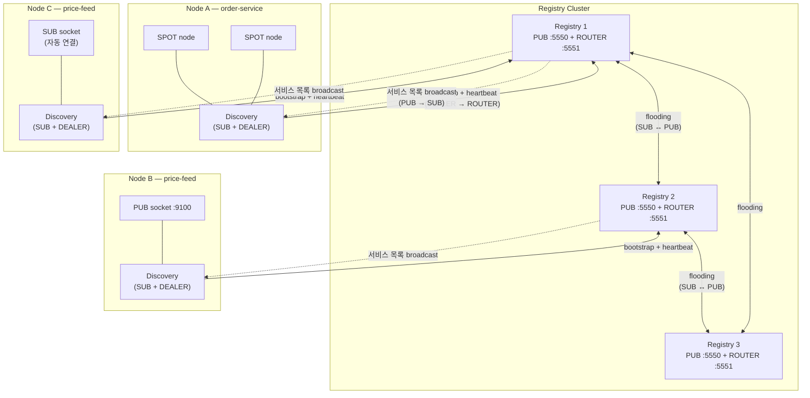
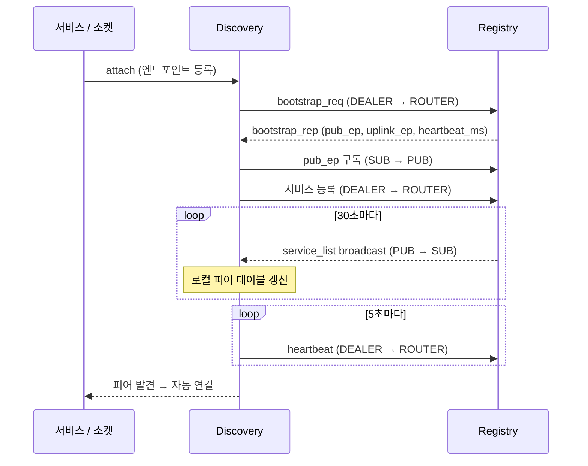
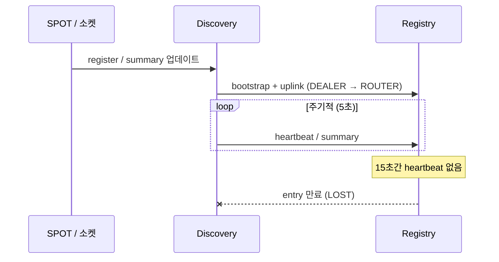

# Service Discovery

## 1. 개요

마이크로서비스 환경에서 서비스들은 통신을 위해 상대방의 네트워크
엔드포인트를 알아야 한다. Discovery 없이는 모든 서비스가 피어의 주소를
직접 설정해야 하며, 인스턴스가 확장·이동·재시작될 때마다 수동으로
주소를 갱신해야 한다.

zlink Service Discovery는 **수동 주소 관리를 제거**한다.
서비스는 자신의 엔드포인트를 중앙 **Registry**에 등록하고,
각 **Discovery** 클라이언트가 매칭되는 피어를 자동으로 찾아 연결한다.
애플리케이션 코드는 원격 주소를 직접 다룰 필요가 없다.

**Discovery 없이** -- 배포 시 모든 피어 주소를 직접 알아야 한다:

```c
/* 각 피어 엔드포인트를 수동으로 설정 */
zlink_connect(sub, "tcp://10.0.1.5:9100");   /* price-feed-1 */
zlink_connect(sub, "tcp://10.0.1.8:9100");   /* price-feed-2 */
/* price-feed-3 추가? price-feed-1 이동? → 설정 변경, 재배포 필요 */
```

**Discovery 사용** -- 소켓을 attach 하기만 하면 된다:

```c
zlink_socket_attach_discovery(sub, discovery);
/* 모든 price-feed PUB 인스턴스가 자동으로 발견된다.
   새 인스턴스 추가, 장애 인스턴스 제거 — 코드 변경 없음. */
```

### 핵심 개념

| 용어 | 설명 |
|------|------|
| **Registry** | 등록된 서비스를 추적하고 서비스 목록을 브로드캐스트하는 중앙 서버 (PUB + ROUTER 소켓) |
| **Discovery** | Registry에 bootstrap 연결하여 서비스 목록을 수신(SUB)하고, 연결된 서비스의 커넥션을 관리하는 클라이언트 에이전트 |
| **소켓 패밀리** | Discovery를 통해 피어를 등록·발견하는 raw ROUTER/DEALER/PUB/SUB 소켓 |
| **서비스 역할** | 자동 피어 매칭에 사용되는 소켓 수준 역할 (ROUTER/DEALER/PUB/SUB) |
| **Heartbeat** | 주기적 생존 신호 (기본: 5초 주기, 15초 타임아웃) |

## 2. 동작 원리

### 아키텍처



각 **Registry**는 두 개의 소켓을 노출한다:

- **PUB** — 전체 서비스 목록을 주기적으로 브로드캐스트 (기본 30초)
- **ROUTER** — 등록, heartbeat, bootstrap, 쿼리 메시지를 수신

각 **Discovery**는 Registry에 다음과 같이 연결한다:

- **DEALER → ROUTER** — bootstrap 요청, 서비스 등록, heartbeat 전송
- **SUB → PUB** — 서비스 목록 브로드캐스트 수신

**구체적 시나리오** -- 위 아키텍처 다이어그램의 `price-feed` 예시:

1. **Node B**가 PUB 소켓을 생성하고, `tcp://*:9100`에 bind한 후,
   서비스명 `"price-feed"`로 Discovery에 attach한다.
2. Discovery가 확정된 엔드포인트(예: `tcp://10.0.1.8:9100`)를
   Registry 2에 등록한다.
3. Registry 2가 다음 서비스 목록 브로드캐스트에 이 엔드포인트를 포함한다.
   Flooding을 통해 Registry 1, 3도 이 정보를 학습한다.
4. **Node C**는 자신의 `"price-feed"` Discovery에 SUB 소켓을 attach한
   상태다. 브로드캐스트가 도착하면 Discovery가 PUB 프로바이더를 확인하고
   SUB 소켓을 `tcp://10.0.1.8:9100`에 **자동 연결**한다.
5. Node B가 장애 발생 시, heartbeat가 중단 → Registry가 해당 entry 만료 →
   Node C가 업데이트된 목록을 수신 → 자동으로 연결 해제.

Node C의 코드에는 `tcp://10.0.1.8:9100` 주소가 어디에도 없다.

### Bootstrap 및 연결 흐름



1. 서비스가 Discovery에 **attach** (또는 SPOT 노드를 등록).
2. Discovery가 Registry의 ROUTER 엔드포인트에 **bootstrap 요청**을 전송.
3. Registry가 구독할 PUB 엔드포인트와 heartbeat 주기를 응답.
4. Discovery가 PUB 엔드포인트를 **구독**하고 주기적 서비스 목록 수신 시작.
5. Discovery가 자신의 서비스를 **등록**하고 heartbeat 전송 시작.
6. 서비스 목록에 매칭 피어가 나타나면, Discovery가 소켓을 **자동 연결** (소켓 패밀리) 하거나 모니터 이벤트를 전달 (SPOT).

### 자동 역할 매칭

소켓 패밀리 서비스에서 Discovery는 **서비스 역할**로 피어를 매칭한다:

| 로컬 소켓 | 발견 대상 | 예시 |
|-----------|----------|------|
| PUB | SUB 피어 | 퍼블리셔가 모든 구독자를 발견 |
| SUB | PUB 피어 | 구독자가 모든 퍼블리셔를 발견 |
| ROUTER | DEALER 피어 | 서버가 모든 클라이언트를 발견 |
| DEALER | ROUTER 피어 | 클라이언트가 모든 서버를 발견 |

역할은 attach 시 소켓 타입에서 자동으로 파생된다 — 별도 설정 불필요.

## 3. Registry 설정

Registry는 중앙 조정 서버다. 운영 환경에서는 HA를 위해 3노드 클러스터를
배포한다 ([섹션 6](#6-registry-클러스터-ha) 참조). 개발 및 테스트에는
단일 Registry로 충분하다.

=== "C"

    ```c
    void *ctx = zlink_ctx_new();
    void *registry = zlink_registry_new(ctx);

    /* Add cluster peers (optional, must be called before bind) */
    zlink_registry_add_peer(registry, "tcp://registry2:5550");
    zlink_registry_add_peer(registry, "tcp://registry3:5550");

    /* Heartbeat configuration (optional, must be called before bind) */
    zlink_registry_set_heartbeat(registry, 5000, 15000);

    /* Broadcast interval (optional, default 30 seconds) */
    zlink_registry_set_broadcast_interval(registry, 30000);

    /* Bind and start */
    zlink_registry_bind(registry,
        "tcp://*:5550",    /* PUB (service list broadcast) */
        "tcp://*:5551"     /* ROUTER (registration/heartbeat/queries) */
    );

    /* ... application logic ... */

    zlink_registry_destroy(&registry);
    zlink_ctx_term(ctx);
    ```

=== "C++"

    ```cpp
    auto ctx = zlink::context();
    auto registry = zlink::registry(ctx);

    registry.add_peer("tcp://registry2:5550");
    registry.add_peer("tcp://registry3:5550");
    registry.set_heartbeat(5000, 15000);
    registry.set_broadcast_interval(30000);
    registry.bind("tcp://*:5550", "tcp://*:5551");

    // ... application logic ...

    registry.close();
    ctx.close();
    ```

=== "Java"

    ```java
    var ctx = Zlink.contextNew();
    var registry = ctx.registryNew();

    registry.addPeer("tcp://registry2:5550");
    registry.addPeer("tcp://registry3:5550");
    registry.setHeartbeat(5000, 15000);
    registry.setBroadcastInterval(30000);
    registry.bind("tcp://*:5550", "tcp://*:5551");

    // ... application logic ...

    registry.destroy();
    ctx.term();
    ```

=== "Python"

    ```python
    ctx = zlink.Context()
    registry = zlink.Registry(ctx)

    registry.add_peer("tcp://registry2:5550")
    registry.add_peer("tcp://registry3:5550")
    registry.set_heartbeat(5000, 15000)
    registry.set_broadcast_interval(30000)
    registry.bind("tcp://*:5550", "tcp://*:5551")

    # ... application logic ...

    registry.destroy()
    ctx.term()
    ```

=== "Node/TypeScript"

    ```typescript
    const ctx = new zlink.Context();
    const registry = new zlink.Registry(ctx);

    registry.addPeer("tcp://registry2:5550");
    registry.addPeer("tcp://registry3:5550");
    registry.setHeartbeat(5000, 15000);
    registry.setBroadcastInterval(30000);
    registry.bind("tcp://*:5550", "tcp://*:5551");

    // ... application logic ...

    registry.destroy();
    ctx.term();
    ```

=== "C#/.NET"

    ```csharp
    using var ctx = new ZlinkContext();
    using var registry = new Registry(ctx);

    registry.AddPeer("tcp://registry2:5550");
    registry.AddPeer("tcp://registry3:5550");
    registry.SetHeartbeat(5000, 15000);
    registry.SetBroadcastInterval(30000);
    registry.Bind("tcp://*:5550", "tcp://*:5551");

    // ... application logic ...
    ```

=== "Rust"

    ```rust
    let ctx = zlink::Context::new()?;
    let registry = zlink::Registry::new(&ctx)?;

    registry.add_peer("tcp://registry2:5550")?;
    registry.add_peer("tcp://registry3:5550")?;
    registry.set_heartbeat(5000, 15000)?;
    registry.set_broadcast_interval(30000)?;
    registry.bind("tcp://*:5550", "tcp://*:5551")?;

    // ... application logic ...

    registry.destroy()?;
    ctx.term()?;
    ```

=== "Go"

    ```go
    ctx, err := zlink.NewContext()
    if err != nil { log.Fatal(err) }
    registry, err := zlink.NewRegistry(ctx)
    if err != nil { log.Fatal(err) }

    registry.AddPeer("tcp://registry2:5550")
    registry.AddPeer("tcp://registry3:5550")
    registry.SetHeartbeat(5000, 15000)
    registry.SetBroadcastInterval(30000)
    registry.Bind("tcp://*:5550", "tcp://*:5551")

    // ... application logic ...

    registry.Destroy()
    ctx.Term()
    ```

## 4. Discovery 사용

Discovery는 애플리케이션에서 사용하는 클라이언트 측 컴포넌트다. 논리적
서비스당 하나의 Discovery를 생성하고, Registry에 연결한 후, SPOT 노드나
raw 소켓을 attach한다. Discovery가 등록, 피어 조회, heartbeat를 대신
처리한다.

=== "C"

    ```c
    /* service_type: ZLINK_SERVICE_TYPE_SPOT or ZLINK_SERVICE_TYPE_SOCKET */
    void *discovery = zlink_discovery_new(ctx,
        ZLINK_SERVICE_TYPE_SPOT, "order-service");

    /* Connect to Registry bootstrap/control endpoint (multiple allowed) */
    zlink_discovery_connect_registry(discovery, "tcp://registry1:5551");
    zlink_discovery_connect_registry(discovery, "tcp://registry2:5551");

    /* Observe service state via monitor */
    zlink_service_monitor_open_options_t opts = {
        .events = ZLINK_DISCOVERY_MONITOR_EVENT_SERVICE_UP
                | ZLINK_DISCOVERY_MONITOR_EVENT_PROVIDERS_CHANGED,
    };
    void *mon = zlink_service_monitor_open(discovery, &opts);
    zlink_service_monitor_handler(mon, on_discovery_event, NULL);

    /* ... Discovery delivers events through the callback ... */

    zlink_monitor_close(&mon);
    zlink_discovery_destroy(&discovery);
    ```

=== "C++"

    ```cpp
    auto discovery = zlink::discovery(ctx,
        zlink::service_type::spot, "order-service");

    discovery.connect_registry("tcp://registry1:5551");
    discovery.connect_registry("tcp://registry2:5551");

    auto mon = discovery.service_monitor_open(
        {zlink::discovery_monitor_event::service_up
         | zlink::discovery_monitor_event::providers_changed});
    mon.set_handler(on_discovery_event);

    // ... Discovery delivers events through the callback ...

    mon.close();
    discovery.close();
    ```

=== "Java"

    ```java
    var discovery = ctx.discoveryNew(ServiceType.SPOT, "order-service");

    discovery.connectRegistry("tcp://registry1:5551");
    discovery.connectRegistry("tcp://registry2:5551");

    var opts = new ServiceMonitorOptions(
        DiscoveryMonitorEvent.SERVICE_UP | DiscoveryMonitorEvent.PROVIDERS_CHANGED);
    var mon = discovery.serviceMonitorOpen(opts);
    mon.setHandler(this::onDiscoveryEvent);

    // ... Discovery delivers events through the callback ...

    mon.close();
    discovery.destroy();
    ```

=== "Python"

    ```python
    discovery = zlink.Discovery(ctx, zlink.SERVICE_TYPE_SPOT, "order-service")

    discovery.connect_registry("tcp://registry1:5551")
    discovery.connect_registry("tcp://registry2:5551")

    opts = zlink.ServiceMonitorOptions(
        events=zlink.DISCOVERY_MONITOR_EVENT_SERVICE_UP
               | zlink.DISCOVERY_MONITOR_EVENT_PROVIDERS_CHANGED)
    mon = discovery.service_monitor_open(opts)
    mon.set_handler(on_discovery_event)

    # ... Discovery delivers events through the callback ...

    mon.close()
    discovery.destroy()
    ```

=== "Node/TypeScript"

    ```typescript
    const discovery = new zlink.Discovery(ctx,
        zlink.SERVICE_TYPE_SPOT, "order-service");

    discovery.connectRegistry("tcp://registry1:5551");
    discovery.connectRegistry("tcp://registry2:5551");

    const mon = discovery.serviceMonitorOpen({
        events: zlink.DISCOVERY_MONITOR_EVENT_SERVICE_UP
              | zlink.DISCOVERY_MONITOR_EVENT_PROVIDERS_CHANGED
    });
    mon.setHandler(onDiscoveryEvent);

    // ... Discovery delivers events through the callback ...

    mon.close();
    discovery.destroy();
    ```

=== "C#/.NET"

    ```csharp
    using var discovery = new Discovery(ctx, ServiceType.Spot, "order-service");

    discovery.ConnectRegistry("tcp://registry1:5551");
    discovery.ConnectRegistry("tcp://registry2:5551");

    using var mon = discovery.ServiceMonitorOpen(new ServiceMonitorOptions {
        Events = DiscoveryMonitorEvent.ServiceUp
               | DiscoveryMonitorEvent.ProvidersChanged });
    mon.SetHandler(OnDiscoveryEvent);

    // ... Discovery delivers events through the callback ...
    ```

=== "Rust"

    ```rust
    let discovery = zlink::Discovery::new(&ctx,
        zlink::ServiceType::Spot, "order-service")?;

    discovery.connect_registry("tcp://registry1:5551")?;
    discovery.connect_registry("tcp://registry2:5551")?;

    let mon = discovery.service_monitor_open(&zlink::ServiceMonitorOptions::new(
        zlink::DISCOVERY_MONITOR_EVENT_SERVICE_UP
        | zlink::DISCOVERY_MONITOR_EVENT_PROVIDERS_CHANGED))?;
    mon.set_handler(on_discovery_event);

    // ... Discovery delivers events through the callback ...

    mon.close();
    discovery.destroy()?;
    ```

=== "Go"

    ```go
    discovery, err := zlink.NewDiscovery(ctx,
        zlink.ServiceTypeSpot, "order-service")
    if err != nil { log.Fatal(err) }

    discovery.ConnectRegistry("tcp://registry1:5551")
    discovery.ConnectRegistry("tcp://registry2:5551")

    opts := zlink.ServiceMonitorOptions{Events:
        zlink.DiscoveryMonitorEventServiceUp |
        zlink.DiscoveryMonitorEventProvidersChanged}
    mon, err := discovery.ServiceMonitorOpen(opts)
    if err != nil { log.Fatal(err) }
    mon.SetHandler(onDiscoveryEvent)

    // ... Discovery delivers events through the callback ...

    mon.Close()
    discovery.Destroy()
    ```

## 4.1 소켓 패밀리 Discovery

raw ROUTER/DEALER/PUB/SUB 소켓은 Discovery를 사용하여 자동 피어 발견과
lifecycle 관리를 할 수 있다. SPOT 추상화 없이 소켓 수준에서 위치투명
통신을 가능하게 한다.

=== "C"

    ```c
    /* Create Discovery with SOCKET type */
    void *discovery = zlink_discovery_new(ctx,
        ZLINK_SERVICE_TYPE_SOCKET, "price-feed");
    zlink_discovery_connect_registry(discovery, "tcp://registry1:5551");

    /* Create a PUB socket and attach it to Discovery */
    void *pub = zlink_socket_new(ctx, ZLINK_PUB);
    zlink_bind(pub, "tcp://*:9100");
    zlink_socket_attach_discovery(pub, discovery);
    /* Discovery registers the PUB endpoint and manages heartbeats. */

    /* ... publish messages ... */

    zlink_discovery_destroy(&discovery);
    ```

=== "C++"

    ```cpp
    auto discovery = zlink::discovery(ctx,
        zlink::service_type::socket, "price-feed");
    discovery.connect_registry("tcp://registry1:5551");

    auto pub = zlink::socket(ctx, zlink::socket_type::pub_);
    pub.bind("tcp://*:9100");
    pub.attach_discovery(discovery);

    // ... publish messages ...

    discovery.close();
    ```

=== "Java"

    ```java
    var discovery = ctx.discoveryNew(ServiceType.SOCKET, "price-feed");
    discovery.connectRegistry("tcp://registry1:5551");

    var pub = ctx.socket(SocketType.PUB);
    pub.bind("tcp://*:9100");
    pub.attachDiscovery(discovery);

    // ... publish messages ...

    discovery.destroy();
    ```

=== "Python"

    ```python
    discovery = zlink.Discovery(ctx, zlink.SERVICE_TYPE_SOCKET, "price-feed")
    discovery.connect_registry("tcp://registry1:5551")

    pub = ctx.socket(zlink.PUB)
    pub.bind("tcp://*:9100")
    pub.attach_discovery(discovery)

    # ... publish messages ...

    discovery.destroy()
    ```

=== "Node/TypeScript"

    ```typescript
    const discovery = new zlink.Discovery(ctx,
        zlink.SERVICE_TYPE_SOCKET, "price-feed");
    discovery.connectRegistry("tcp://registry1:5551");

    const pub = ctx.socket(zlink.PUB);
    pub.bind("tcp://*:9100");
    pub.attachDiscovery(discovery);

    // ... publish messages ...

    discovery.destroy();
    ```

=== "C#/.NET"

    ```csharp
    using var discovery = new Discovery(ctx, ServiceType.Socket, "price-feed");
    discovery.ConnectRegistry("tcp://registry1:5551");

    using var pub = ctx.CreateSocket(SocketType.Pub);
    pub.Bind("tcp://*:9100");
    pub.AttachDiscovery(discovery);

    // ... publish messages ...
    ```

=== "Rust"

    ```rust
    let discovery = zlink::Discovery::new(&ctx,
        zlink::ServiceType::Socket, "price-feed")?;
    discovery.connect_registry("tcp://registry1:5551")?;

    let pub_sock = ctx.socket(zlink::PUB)?;
    pub_sock.bind("tcp://*:9100")?;
    pub_sock.attach_discovery(&discovery)?;

    // ... publish messages ...

    discovery.destroy()?;
    ```

=== "Go"

    ```go
    discovery, err := zlink.NewDiscovery(ctx,
        zlink.ServiceTypeSocket, "price-feed")
    if err != nil { log.Fatal(err) }
    discovery.ConnectRegistry("tcp://registry1:5551")

    pubSock, err := ctx.PubSocket()
    if err != nil { log.Fatal(err) }
    pubSock.Bind("tcp://*:9100")
    pubSock.AttachDiscovery(discovery)

    // ... publish messages ...

    discovery.Destroy()
    ```

**Lifecycle:** 소켓이 연결되면 `connect`, `disconnect`, `unbind`, `close`
수동 호출이 실패한다. Discovery 인스턴스를 파괴하면 모든 연결된 소켓이
종료된다.

## 5. Liveness 및 Summary 업데이트



- Registry visibility는 Discovery가 소유하는 heartbeat/topology uplink로
  유지된다.
- SPOT과 소켓 패밀리 서비스는 로컬 registration/summary 변경을 제출하지만,
  주기적 uplink cadence는 Discovery가 담당한다.
- Registry summary는 eventually consistent한 coarse/global view이며,
  strict final readiness gate로 사용하면 안 된다.

## 6. Registry 클러스터 HA

- 3노드 클러스터 권장
- **Flooding 방식 동기화:** 각 Registry가 다른 Registry의 PUB를 구독하여,
  새 서비스 등록 시 변경된 목록이 모든 피어로 전파된다.
- **Eventually Consistent:** 모든 Registry가 동일 상태로 수렴.
  `registry_id` + `list_seq`로 중복/역전 업데이트 무시.

**서비스 가시성:** Registry 클러스터에서 서비스 목록은 flooding으로 전파된다.
Discovery가 하나의 Registry에만 연결해도 피어 Registry에 등록된 서비스가
브로드캐스트에 포함되어 전체 클러스터의 서비스를 볼 수 있다. 여러 Registry에
`connect_registry()`하는 것은 서비스 가시성이 아닌 **HA(장애 대응)**를 위한
것이다.

### Discovery Failover

- Discovery는 하나 이상의 Registry control endpoint에 bootstrap 연결한다.
- bootstrap metadata로 내부 broadcast/uplink 경로를 학습한다.
- 한 Registry 노드가 실패해도 다른 bootstrap control endpoint를 통해
  계속 동작할 수 있다.

## 7. 다음 단계

- [SPOT PUB/SUB](07-3-spot.ko.md) — Discovery 기반 위치투명 발행/구독
- [Registry 가이드](07-4-registry.ko.md) — 클러스터 구성, 토폴로지 조회, 운영 패턴

---
[← 서비스 개요](07-0-services.ko.md) | [SPOT →](07-3-spot.ko.md)
