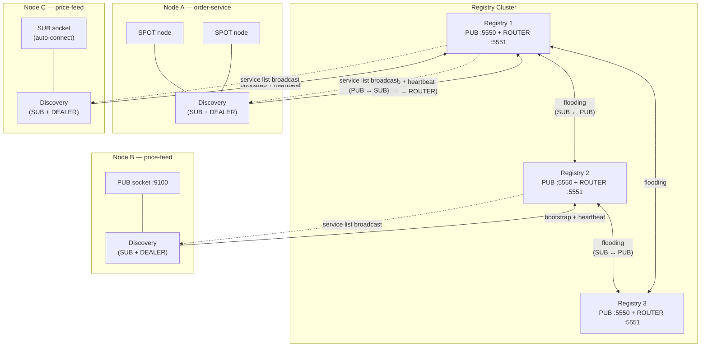
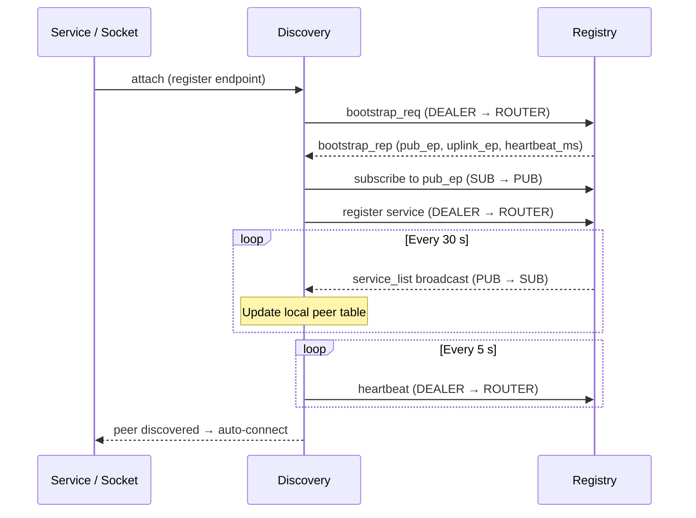
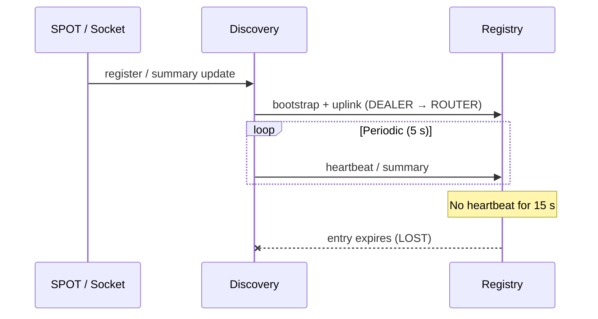

# Service Discovery

## 1. Overview

In a microservices environment, services need to find each other's
network endpoints to communicate. Without discovery, every service must
be configured with the addresses of its peers -- a manual process that
breaks as instances scale, move, or restart.

zlink Service Discovery **eliminates manual address management**.
Services register their endpoints with a central **Registry**, and
each **Discovery** client automatically finds and connects to matching
peers. Application code never deals with remote addresses directly.

**Without Discovery** -- every service must know peer addresses at deploy time:

```c
/* Manually configure each peer endpoint */
zlink_connect(sub, "tcp://10.0.1.5:9100");   /* price-feed-1 */
zlink_connect(sub, "tcp://10.0.1.8:9100");   /* price-feed-2 */
/* price-feed-3 added? price-feed-1 moved? → update config, redeploy */
```

**With Discovery** -- just attach the socket:

```c
zlink_socket_attach_discovery(sub, discovery);
/* All price-feed PUB instances are found automatically.
   New instances appear, crashed ones vanish — zero code changes. */
```

### Core Concepts

| Term | Description |
|------|-------------|
| **Registry** | Central server that tracks registered services and broadcasts the service list (PUB + ROUTER sockets) |
| **Discovery** | Client-side agent that bootstraps against a Registry, receives service lists (SUB), and manages connections for attached services |
| **Socket Family** | Raw ROUTER/DEALER/PUB/SUB sockets that register and discover peers via Discovery |
| **Service Role** | Socket-level role (ROUTER/DEALER/PUB/SUB) used for automatic peer matching |
| **Heartbeat** | Periodic liveness signal (default: 5 s interval, 15 s timeout) |

## 2. How It Works

### Architecture



Each **Registry** exposes two sockets:

- **PUB** -- periodically broadcasts the full service list (every 30 s by default)
- **ROUTER** -- accepts registration, heartbeat, bootstrap, and query messages

Each **Discovery** connects to a Registry with:

- **DEALER → ROUTER** -- sends bootstrap request, registration, and heartbeats
- **SUB → PUB** -- receives the service list broadcast

**Concrete scenario** -- the `price-feed` example in the diagram above:

1. **Node B** creates a PUB socket, binds to `tcp://*:9100`, and attaches it
   to a Discovery with service name `"price-feed"`.
2. Discovery registers the resolved endpoint (e.g. `tcp://10.0.1.8:9100`)
   with Registry 2.
3. Registry 2 includes this endpoint in its next service list broadcast.
   Via flooding, Registries 1 and 3 also learn about it.
4. **Node C** has a SUB socket attached to its own `"price-feed"` Discovery.
   When the broadcast arrives, Discovery sees the PUB provider and
   **auto-connects** the SUB socket to `tcp://10.0.1.8:9100`.
5. If Node B crashes, its heartbeat stops → Registry expires the entry →
   Node C receives an updated list without that endpoint → auto-disconnects.

Node C never configured `tcp://10.0.1.8:9100` anywhere in its code.

### Bootstrap and Connection Flow



1. The service **attaches** to Discovery (or registers a SPOT node).
2. Discovery sends a **bootstrap request** to the Registry's ROUTER endpoint.
3. The Registry replies with the PUB endpoint to subscribe to and the heartbeat interval.
4. Discovery **subscribes** to the PUB endpoint and starts receiving periodic service lists.
5. Discovery **registers** its service and begins sending heartbeats.
6. When a matching peer appears in the service list, Discovery **auto-connects** the socket (for socket family) or delivers a monitor event (for SPOT).

### Automatic Role Matching

For socket family services, Discovery matches peers by **service role**:

| Local Socket | Discovers | Example |
|--------------|-----------|---------|
| PUB | SUB peers | Publisher finds all subscribers |
| SUB | PUB peers | Subscriber finds all publishers |
| ROUTER | DEALER peers | Server finds all clients |
| DEALER | ROUTER peers | Client finds all servers |

The role is derived automatically from the socket type at attach time --
no configuration needed.

## 3. Registry Setup

Registry is the central coordination server. In production, deploy a
3-node cluster for HA (see [Section 6](#6-registry-cluster-ha)). A single
Registry is sufficient for development and testing.

=== "C"

    ```c
    void *ctx = zlink_ctx_new();
    void *registry = zlink_registry_new(ctx);

    /* Add cluster peers (optional, must be called before bind) */
    zlink_registry_add_peer(registry, "tcp://registry2:5550");
    zlink_registry_add_peer(registry, "tcp://registry3:5550");

    /* Heartbeat configuration (optional, must be called before bind) */
    zlink_registry_set_heartbeat(registry, 5000, 15000);

    /* Broadcast interval (optional, default 30 seconds) */
    zlink_registry_set_broadcast_interval(registry, 30000);

    /* Bind and start */
    zlink_registry_bind(registry,
        "tcp://*:5550",    /* PUB (service list broadcast) */
        "tcp://*:5551"     /* ROUTER (registration/heartbeat/queries) */
    );

    /* ... application logic ... */

    zlink_registry_destroy(&registry);
    zlink_ctx_term(ctx);
    ```

=== "C++"

    ```cpp
    auto ctx = zlink::context();
    auto registry = zlink::registry(ctx);

    registry.add_peer("tcp://registry2:5550");
    registry.add_peer("tcp://registry3:5550");
    registry.set_heartbeat(5000, 15000);
    registry.set_broadcast_interval(30000);
    registry.bind("tcp://*:5550", "tcp://*:5551");

    // ... application logic ...

    registry.close();
    ctx.close();
    ```

=== "Java"

    ```java
    var ctx = Zlink.contextNew();
    var registry = ctx.registryNew();

    registry.addPeer("tcp://registry2:5550");
    registry.addPeer("tcp://registry3:5550");
    registry.setHeartbeat(5000, 15000);
    registry.setBroadcastInterval(30000);
    registry.bind("tcp://*:5550", "tcp://*:5551");

    // ... application logic ...

    registry.destroy();
    ctx.term();
    ```

=== "Python"

    ```python
    ctx = zlink.Context()
    registry = zlink.Registry(ctx)

    registry.add_peer("tcp://registry2:5550")
    registry.add_peer("tcp://registry3:5550")
    registry.set_heartbeat(5000, 15000)
    registry.set_broadcast_interval(30000)
    registry.bind("tcp://*:5550", "tcp://*:5551")

    # ... application logic ...

    registry.destroy()
    ctx.term()
    ```

=== "Node/TypeScript"

    ```typescript
    const ctx = new zlink.Context();
    const registry = new zlink.Registry(ctx);

    registry.addPeer("tcp://registry2:5550");
    registry.addPeer("tcp://registry3:5550");
    registry.setHeartbeat(5000, 15000);
    registry.setBroadcastInterval(30000);
    registry.bind("tcp://*:5550", "tcp://*:5551");

    // ... application logic ...

    registry.destroy();
    ctx.term();
    ```

=== "C#/.NET"

    ```csharp
    using var ctx = new ZlinkContext();
    using var registry = new Registry(ctx);

    registry.AddPeer("tcp://registry2:5550");
    registry.AddPeer("tcp://registry3:5550");
    registry.SetHeartbeat(5000, 15000);
    registry.SetBroadcastInterval(30000);
    registry.Bind("tcp://*:5550", "tcp://*:5551");

    // ... application logic ...
    ```

=== "Rust"

    ```rust
    let ctx = zlink::Context::new()?;
    let registry = zlink::Registry::new(&ctx)?;

    registry.add_peer("tcp://registry2:5550")?;
    registry.add_peer("tcp://registry3:5550")?;
    registry.set_heartbeat(5000, 15000)?;
    registry.set_broadcast_interval(30000)?;
    registry.bind("tcp://*:5550", "tcp://*:5551")?;

    // ... application logic ...

    registry.destroy()?;
    ctx.term()?;
    ```

=== "Go"

    ```go
    ctx, err := zlink.NewContext()
    if err != nil { log.Fatal(err) }
    registry, err := zlink.NewRegistry(ctx)
    if err != nil { log.Fatal(err) }

    registry.AddPeer("tcp://registry2:5550")
    registry.AddPeer("tcp://registry3:5550")
    registry.SetHeartbeat(5000, 15000)
    registry.SetBroadcastInterval(30000)
    registry.Bind("tcp://*:5550", "tcp://*:5551")

    // ... application logic ...

    registry.Destroy()
    ctx.Term()
    ```

## 4. Using Discovery

Discovery is the client-side component your application uses. Create one
Discovery per logical service, connect it to a Registry, then attach
SPOT nodes or raw sockets. Discovery handles registration, peer lookup,
and heartbeats on behalf of the attached services.

=== "C"

    ```c
    /* service_type: ZLINK_SERVICE_TYPE_SPOT or ZLINK_SERVICE_TYPE_SOCKET */
    void *discovery = zlink_discovery_new(ctx,
        ZLINK_SERVICE_TYPE_SPOT, "order-service");

    /* Connect to Registry bootstrap/control endpoint (multiple allowed) */
    zlink_discovery_connect_registry(discovery, "tcp://registry1:5551");
    zlink_discovery_connect_registry(discovery, "tcp://registry2:5551");

    /* Observe service state via monitor */
    zlink_service_monitor_open_options_t opts = {
        .events = ZLINK_DISCOVERY_MONITOR_EVENT_SERVICE_UP
                | ZLINK_DISCOVERY_MONITOR_EVENT_PROVIDERS_CHANGED,
    };
    void *mon = zlink_service_monitor_open(discovery, &opts);
    zlink_service_monitor_handler(mon, on_discovery_event, NULL);

    /* ... Discovery delivers events through the callback ... */

    zlink_monitor_close(&mon);
    zlink_discovery_destroy(&discovery);
    ```

=== "C++"

    ```cpp
    auto discovery = zlink::discovery(ctx,
        zlink::service_type::spot, "order-service");

    discovery.connect_registry("tcp://registry1:5551");
    discovery.connect_registry("tcp://registry2:5551");

    auto mon = discovery.service_monitor_open(
        {zlink::discovery_monitor_event::service_up
         | zlink::discovery_monitor_event::providers_changed});
    mon.set_handler(on_discovery_event);

    // ... Discovery delivers events through the callback ...

    mon.close();
    discovery.close();
    ```

=== "Java"

    ```java
    var discovery = ctx.discoveryNew(ServiceType.SPOT, "order-service");

    discovery.connectRegistry("tcp://registry1:5551");
    discovery.connectRegistry("tcp://registry2:5551");

    var opts = new ServiceMonitorOptions(
        DiscoveryMonitorEvent.SERVICE_UP | DiscoveryMonitorEvent.PROVIDERS_CHANGED);
    var mon = discovery.serviceMonitorOpen(opts);
    mon.setHandler(this::onDiscoveryEvent);

    // ... Discovery delivers events through the callback ...

    mon.close();
    discovery.destroy();
    ```

=== "Python"

    ```python
    discovery = zlink.Discovery(ctx, zlink.SERVICE_TYPE_SPOT, "order-service")

    discovery.connect_registry("tcp://registry1:5551")
    discovery.connect_registry("tcp://registry2:5551")

    opts = zlink.ServiceMonitorOptions(
        events=zlink.DISCOVERY_MONITOR_EVENT_SERVICE_UP
               | zlink.DISCOVERY_MONITOR_EVENT_PROVIDERS_CHANGED)
    mon = discovery.service_monitor_open(opts)
    mon.set_handler(on_discovery_event)

    # ... Discovery delivers events through the callback ...

    mon.close()
    discovery.destroy()
    ```

=== "Node/TypeScript"

    ```typescript
    const discovery = new zlink.Discovery(ctx,
        zlink.SERVICE_TYPE_SPOT, "order-service");

    discovery.connectRegistry("tcp://registry1:5551");
    discovery.connectRegistry("tcp://registry2:5551");

    const mon = discovery.serviceMonitorOpen({
        events: zlink.DISCOVERY_MONITOR_EVENT_SERVICE_UP
              | zlink.DISCOVERY_MONITOR_EVENT_PROVIDERS_CHANGED
    });
    mon.setHandler(onDiscoveryEvent);

    // ... Discovery delivers events through the callback ...

    mon.close();
    discovery.destroy();
    ```

=== "C#/.NET"

    ```csharp
    using var discovery = new Discovery(ctx, ServiceType.Spot, "order-service");

    discovery.ConnectRegistry("tcp://registry1:5551");
    discovery.ConnectRegistry("tcp://registry2:5551");

    using var mon = discovery.ServiceMonitorOpen(new ServiceMonitorOptions {
        Events = DiscoveryMonitorEvent.ServiceUp
               | DiscoveryMonitorEvent.ProvidersChanged });
    mon.SetHandler(OnDiscoveryEvent);

    // ... Discovery delivers events through the callback ...
    ```

=== "Rust"

    ```rust
    let discovery = zlink::Discovery::new(&ctx,
        zlink::ServiceType::Spot, "order-service")?;

    discovery.connect_registry("tcp://registry1:5551")?;
    discovery.connect_registry("tcp://registry2:5551")?;

    let mon = discovery.service_monitor_open(&zlink::ServiceMonitorOptions::new(
        zlink::DISCOVERY_MONITOR_EVENT_SERVICE_UP
        | zlink::DISCOVERY_MONITOR_EVENT_PROVIDERS_CHANGED))?;
    mon.set_handler(on_discovery_event);

    // ... Discovery delivers events through the callback ...

    mon.close();
    discovery.destroy()?;
    ```

=== "Go"

    ```go
    discovery, err := zlink.NewDiscovery(ctx,
        zlink.ServiceTypeSpot, "order-service")
    if err != nil { log.Fatal(err) }

    discovery.ConnectRegistry("tcp://registry1:5551")
    discovery.ConnectRegistry("tcp://registry2:5551")

    opts := zlink.ServiceMonitorOptions{Events:
        zlink.DiscoveryMonitorEventServiceUp |
        zlink.DiscoveryMonitorEventProvidersChanged}
    mon, err := discovery.ServiceMonitorOpen(opts)
    if err != nil { log.Fatal(err) }
    mon.SetHandler(onDiscoveryEvent)

    // ... Discovery delivers events through the callback ...

    mon.Close()
    discovery.Destroy()
    ```

## 4.1 Socket Family Discovery

Raw ROUTER/DEALER/PUB/SUB sockets can use Discovery for automatic peer
discovery and lifecycle management. This enables location-transparent
communication at the socket level without the SPOT abstraction.

=== "C"

    ```c
    /* Create Discovery with SOCKET type */
    void *discovery = zlink_discovery_new(ctx,
        ZLINK_SERVICE_TYPE_SOCKET, "price-feed");
    zlink_discovery_connect_registry(discovery, "tcp://registry1:5551");

    /* Create a PUB socket and attach it to Discovery */
    void *pub = zlink_socket_new(ctx, ZLINK_PUB);
    zlink_bind(pub, "tcp://*:9100");
    zlink_socket_attach_discovery(pub, discovery);
    /* Discovery registers the PUB endpoint and manages heartbeats. */

    /* ... publish messages ... */

    zlink_discovery_destroy(&discovery);
    ```

=== "C++"

    ```cpp
    auto discovery = zlink::discovery(ctx,
        zlink::service_type::socket, "price-feed");
    discovery.connect_registry("tcp://registry1:5551");

    auto pub = zlink::socket(ctx, zlink::socket_type::pub_);
    pub.bind("tcp://*:9100");
    pub.attach_discovery(discovery);

    // ... publish messages ...

    discovery.close();
    ```

=== "Java"

    ```java
    var discovery = ctx.discoveryNew(ServiceType.SOCKET, "price-feed");
    discovery.connectRegistry("tcp://registry1:5551");

    var pub = ctx.socket(SocketType.PUB);
    pub.bind("tcp://*:9100");
    pub.attachDiscovery(discovery);

    // ... publish messages ...

    discovery.destroy();
    ```

=== "Python"

    ```python
    discovery = zlink.Discovery(ctx, zlink.SERVICE_TYPE_SOCKET, "price-feed")
    discovery.connect_registry("tcp://registry1:5551")

    pub = ctx.socket(zlink.PUB)
    pub.bind("tcp://*:9100")
    pub.attach_discovery(discovery)

    # ... publish messages ...

    discovery.destroy()
    ```

=== "Node/TypeScript"

    ```typescript
    const discovery = new zlink.Discovery(ctx,
        zlink.SERVICE_TYPE_SOCKET, "price-feed");
    discovery.connectRegistry("tcp://registry1:5551");

    const pub = ctx.socket(zlink.PUB);
    pub.bind("tcp://*:9100");
    pub.attachDiscovery(discovery);

    // ... publish messages ...

    discovery.destroy();
    ```

=== "C#/.NET"

    ```csharp
    using var discovery = new Discovery(ctx, ServiceType.Socket, "price-feed");
    discovery.ConnectRegistry("tcp://registry1:5551");

    using var pub = ctx.CreateSocket(SocketType.Pub);
    pub.Bind("tcp://*:9100");
    pub.AttachDiscovery(discovery);

    // ... publish messages ...
    ```

=== "Rust"

    ```rust
    let discovery = zlink::Discovery::new(&ctx,
        zlink::ServiceType::Socket, "price-feed")?;
    discovery.connect_registry("tcp://registry1:5551")?;

    let pub_sock = ctx.socket(zlink::PUB)?;
    pub_sock.bind("tcp://*:9100")?;
    pub_sock.attach_discovery(&discovery)?;

    // ... publish messages ...

    discovery.destroy()?;
    ```

=== "Go"

    ```go
    discovery, err := zlink.NewDiscovery(ctx,
        zlink.ServiceTypeSocket, "price-feed")
    if err != nil { log.Fatal(err) }
    discovery.ConnectRegistry("tcp://registry1:5551")

    pubSock, err := ctx.PubSocket()
    if err != nil { log.Fatal(err) }
    pubSock.Bind("tcp://*:9100")
    pubSock.AttachDiscovery(discovery)

    // ... publish messages ...

    discovery.Destroy()
    ```

**Lifecycle:** Once a socket is attached, manual `connect`, `disconnect`,
`unbind`, and `close` calls fail. Destroying the Discovery instance
terminates all attached sockets.

## 5. Liveness and Summary Updates



- Registry visibility is maintained through Discovery-owned heartbeat/topology
  uplink.
- SPOT and socket family services submit local registration/summary
  changes, but Discovery owns the periodic uplink cadence.
- Registry summary is eventually consistent and should be treated as a
  coarse/global view, not a strict final readiness gate.

## 6. Registry Cluster HA

- 3-node cluster recommended
- **Flooding-based synchronization:** each Registry subscribes to other
  Registries' PUB endpoints. When one Registry receives a new service
  registration, the updated list propagates to all peers.
- **Eventually Consistent:** all Registries converge to the same state.
  Duplicate/out-of-order updates are ignored via `registry_id` + `list_seq`.

**Service Visibility:** In a Registry cluster, the service list is propagated
via flooding. Even if a Discovery connects to only one Registry, services
registered on peer Registries are included in that Registry's broadcast,
so the full cluster's services are visible. Connecting to multiple Registries
via `connect_registry()` is for **HA (failover)**, not for service visibility.

### Discovery Failover

- Discovery bootstraps against one or more Registry control endpoints
- It learns the internal broadcast/uplink paths from bootstrap metadata
- If one Registry node fails, Discovery can continue using other configured
  bootstrap control endpoints

## 7. Next Steps

- [SPOT PUB/SUB](07-3-spot.md) -- Discovery-based location-transparent publish/subscribe
- [Registry Guide](07-4-registry.md) -- Cluster setup, topology introspection, and operational patterns

---
[← Services Overview](07-0-services.md) | [SPOT →](07-3-spot.md)
