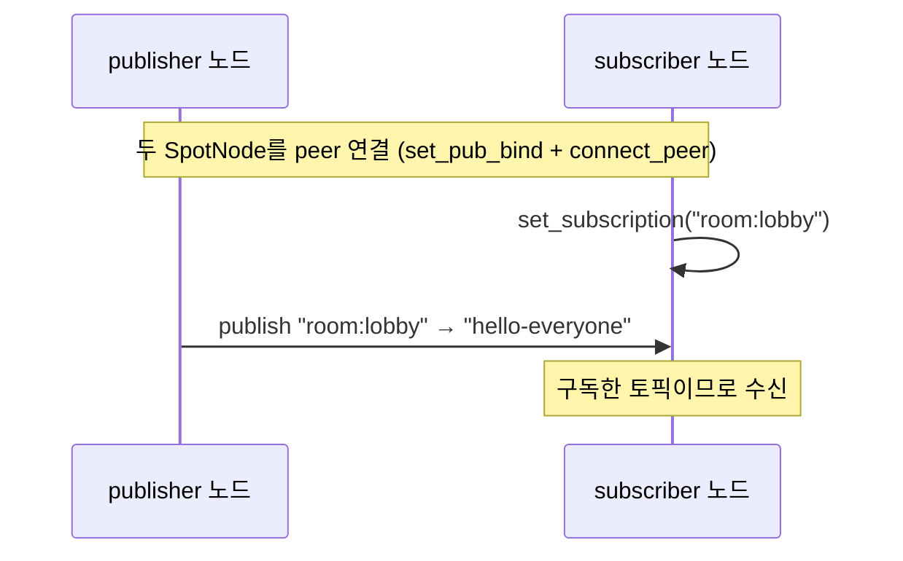
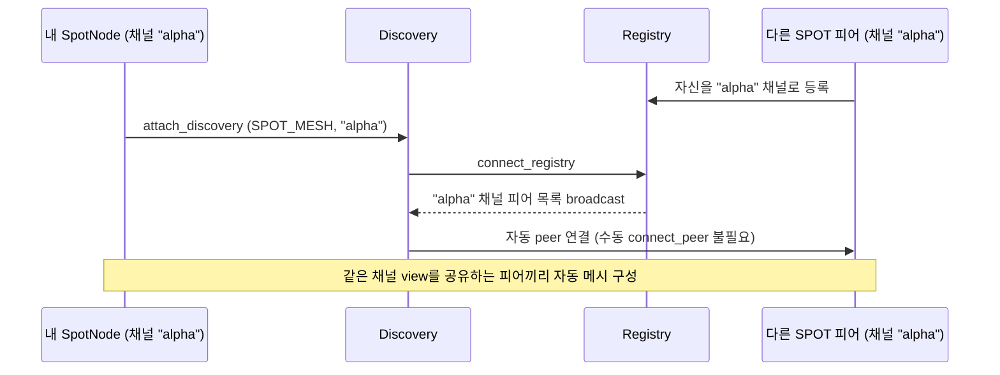
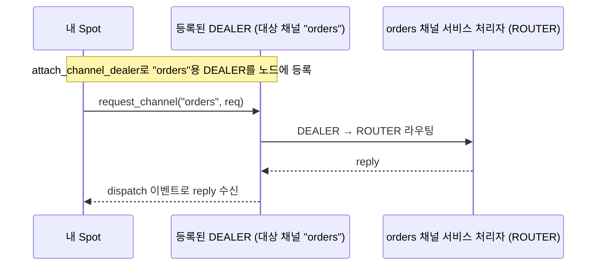
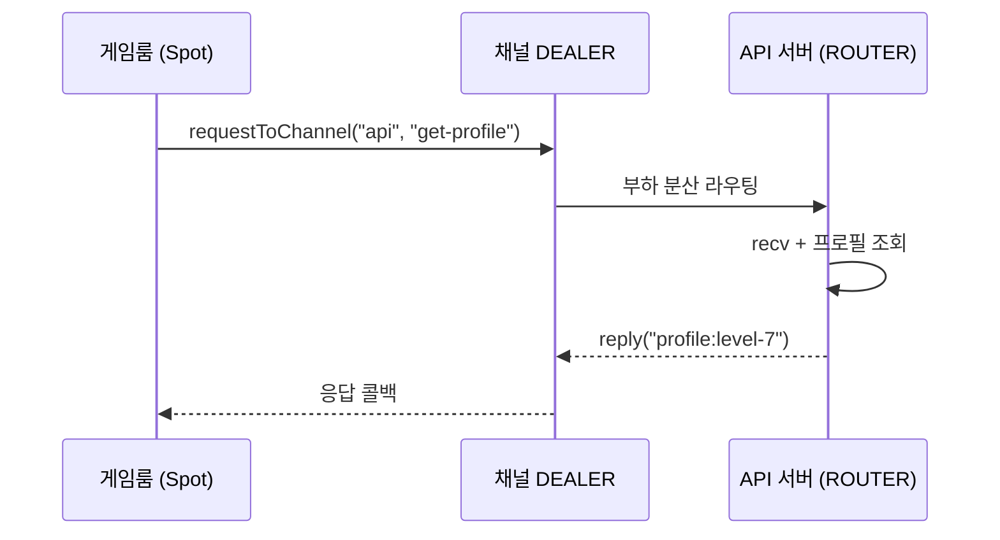
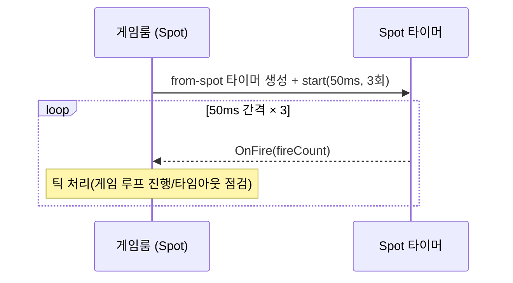
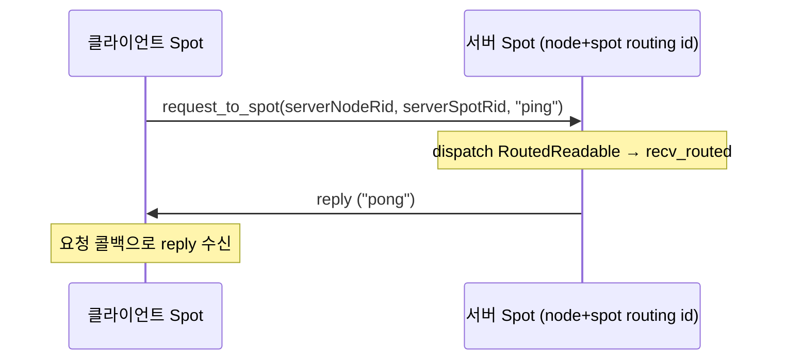

[English](07-3-spot.md) | [한국어](07-3-spot.ko.md)

<!-- zlink-nav:start -->
[← Discovery](07-1-discovery.ko.md) | [SPOT Actor →](07-4-actor.ko.md)
<!-- zlink-nav:end -->

# SPOT 사용 가이드

이 문서는 애플리케이션 개발자가 SPOT을 어떻게 쓰는지 설명한다. 핵심 시나리오(토픽
pub/sub)는 **한 파일로 된 실행 가능한 예제**를 **9개 언어 코드 탭**으로 보인다 —
각 탭은 리포지토리의 자립형 예제 파일(`samples/spot_pubsub_example`)을 그대로
임베드한 것이고 빌드·실행으로 검증됐다. 정확한 함수 계약은
[SPOT spec](https://github.com/kairos-code-dev/zlink/blob/main/doc/spec/core/service/spot.ko.md)를 본다.

## 1. SPOT이 하는 일

애플리케이션 설계 관점에서 Spot은 독립적인 생명주기를 가지는 stateful coordination
point다. Spot은 room, conversation, workflow instance, player quest처럼 상태와
이벤트가 모이는 단위를 표현한다. actor 참여를 받을 수 있지만 actor가 필수는 아니다.
Spot은 directed request를 처리하거나, event를 publish하거나, timer를 실행하거나,
pub/sub event에 반응할 수 있다.

SPOT은 `SpotNode`와 `Spot` 두 층으로 나뉜다.

- `SpotNode`
  노드 토폴로지와 디스커버리(discovery) 기반 연결, 수동 피어 연결, 채널 호출용
  `DEALER`, 외부 발행 유입(publish ingress)을 관리한다.
- `Spot`
  애플리케이션이 Spot을 다룰 때 쓰는 public facade다. 토픽 발행/구독, 라우팅 수신,
  채널 전송/요청, dispatch, timer, actor operation 진입점을 제공한다.

일반적인 순서는 다음과 같다.

1. `SpotNode`를 만든다.
2. bind 또는 discovery attach로 노드를 네트워크에 올린다.
3. 필요하면 채널 호출용 `DEALER`를 붙인다.
4. `Spot` 파사드를 만든다.
5. `Spot`으로 publish/subscribe 또는 채널 호출을 사용한다.

`zlink_spot_new()`가 성공하면 해당 `Spot`의 routed recv 평면은 이미 준비된 상태다.
첫 `zlink_spot_recv()` 호출이 숨겨진 activation이나 자원 생성을 수행한다고
가정하면 안 된다.

## 2. 시나리오 — 토픽 pub/sub

SPOT의 가장 기본 흐름이다. 한 `SpotNode`가 토픽에 **publish**하면, 그 토픽을
**subscribe**한 다른 노드가 받는다(채팅방·주제별 브로드캐스트 같은 작은 pub/sub).
아래 예제는 두 노드를 peer 연결하고 구독자가 `room:lobby`를 구독한 뒤, 발행자가
그 토픽으로 보낸 메시지를 받는 전체 흐름이다.



=== "C++"

    ```cpp
    --8<-- "bindings/cpp/samples/spot_pubsub_example.cpp:doc"
    ```

=== "C#/.NET"

    ```csharp
    --8<-- "bindings/dotnet/samples/SpotPubSubExample/Program.cs:doc"
    ```

=== "Java"

    ```java
    --8<-- "bindings/java/samples/Zlink.Samples/src/main/java/systems/zlink/samples/SpotPubSubExample.java:doc"
    ```

=== "Kotlin"

    ```kotlin
    --8<-- "bindings/kotlin/samples/src/main/kotlin/systems/zlink/samples/SpotPubSubExample.kt:doc"
    ```

=== "Python"

    ```python
    --8<-- "bindings/python/samples/spot_pubsub_example.py:doc"
    ```

=== "Node/TypeScript"

    ```typescript
    --8<-- "bindings/node/samples/spot_pubsub_example.ts:doc"
    ```

=== "JavaScript"

    ```javascript
    --8<-- "bindings/javascript/samples/spot_pubsub_example.js:doc"
    ```

=== "Go"

    ```go
    --8<-- "bindings/go/samples/spot_pubsub_example/main.go:doc"
    ```

=== "Rust"

    ```rust
    --8<-- "bindings/rust/samples/spot_pubsub_example.rs:doc"
    ```

위 예제는 수동 peer 연결을 쓴다(`set_pub_bind`로 자기 발행 endpoint를 열고
`connect_peer`로 상대에 연결). 더 큰 메시(mesh)는 discovery로 자동 연결한다 — §3.

### 2.1 SpotNode mode 선택

`SpotNode`를 만들 때 mode를 지정해 필요한 기능만 켤 수 있다(C는 `NULL`이면
`ZLINK_SPOT_NODE_MODE_ALL`).

| mode | 효과 |
|---|---|
| `ALL` (기본) | topic publish/subscribe와 routed request/reply 모두 사용 |
| `PUBSUB` | topic publish/subscribe만 사용. routed API는 `ENOTSUP`으로 실패 |
| `ROUTED` | routed request/reply만 사용. topic API는 `ENOTSUP`으로 실패 |

꺼진 기능은 내부 socket을 생성하지 않는다 — 쓰지 않는 기능의 숨은 자원 비용이 없다.

## 3. Node를 네트워크에 올리는 방법

### 3.1 수동 피어 연결

고정된 엔드포인트를 알고 있으면 노드끼리 직접 연결할 수 있다.

```c
void *a = zlink_spot_node_new(ctx, NULL);
void *b = zlink_spot_node_new(ctx, NULL);

zlink_spot_node_set_pub_bind(a, "tcp://127.0.0.1:7101");
zlink_spot_node_set_pub_bind(b, "tcp://127.0.0.1:7102");

zlink_spot_node_connect_peer(a, "tcp://127.0.0.1:7102");
zlink_spot_node_connect_peer(b, "tcp://127.0.0.1:7101");
```

이 방식은 테스트나 소규모 고정 토폴로지에 적합하다.

### 3.2 Discovery 기반 연결

운영 환경에서는 Discovery를 붙여 SPOT 메시(mesh)를 자동으로 구성하는 편이 낫다.
각 노드는 Registry에 자신을 등록하고 Registry가 브로드캐스트하는 같은 채널의 피어
목록을 Discovery가 받아 자동으로 peer 연결을 맺는다.



```c
void *node = zlink_spot_node_new(ctx, NULL);
zlink_spot_node_set_pub_bind(node, "tcp://127.0.0.1:0");

void *discovery = zlink_discovery_new(
  ctx,
  ZLINK_AUTO_CONNECT_SPOT_MESH,
  "alpha");
zlink_discovery_connect_registry(discovery, "tcp://127.0.0.1:5551");

zlink_spot_node_attach_discovery(node, discovery);
```

여기서 `"alpha"`는 이 Discovery view가 보는 SPOT 채널 이름이다.
같은 채널 view를 공유하는 다른 SPOT 피어끼리 자동 연결된다.

`attach_discovery()`를 쓴 뒤에는 같은 노드에 `connect_peer()`나
`disconnect_peer()`를 혼용하지 않는 편이 좋다. 현재 계약도 Discovery 연결
후 수동 피어 연결을 `EBUSY`로 막는다.

피어 엔드포인트를 모르고 대상 노드의 라우팅 ID만 알고 있으면
`zlink_spot_node_disconnect_peer_rid()`로 해당 피어 노드 연결을 종료할 수 있다.
이 함수는 `SpotNode`에 호출한다. `Spot` 파사드는 개별 피어 연결을 직접
소유하지 않으므로 별도의 라우팅 ID disconnect 함수를 제공하지 않는다.

### 3.3 raw peer weight로 새 outbound만 배제하기

SpotNode와 Spot에는 weight 설정 옵션이 없다. 서비스가 raw ROUTER 또는 worker
auto-connect 피어를 사용할 때 피어 연결은 유지한 채 새 routed/channel 요청만 잠시
빼고 싶으면 해당 raw 소켓의 weight를 `0`으로 설정한다. 값 범위는 `0..100`,
기본값은 `100`이다.

```c
int drain_weight = 0;
zlink_set_router_option(
  router,
  ZLINK_ROUTER_OPT_WEIGHT,
  &drain_weight,
  sizeof(drain_weight));

int serve_weight = 100;
zlink_set_router_option(
  router,
  ZLINK_ROUTER_OPT_WEIGHT,
  &serve_weight,
  sizeof(serve_weight));
```

weight가 `0`이면 다른 피어가 이 노드를 새 outbound 후보에서 제외한다. 기존
연결과 이미 진행 중인 request의 reply는 그대로 유지된다. 점검이 끝나면
양수 값으로 되돌리면 된다.

## 4. 토픽 publish/subscribe

SPOT 토픽 평면은 `service_name + topic_id`를 함께 사용한다.
현재 공개 함수의 인자 이름은 `service_name`이지만 실질적으로는 토픽 네임스페이스를
구분하는 이름이다.

### 4.1 publish

```c
zlink_msg_t part;
zlink_msg_init_size(&part, 4);
memcpy(zlink_msg_data(&part), "tick", 4);

zlink_spot_publish(spot, "market", "price.btcusd", &part, 1, 0);
zlink_msg_close(&part);
```

### 4.2 subscribe

```c
zlink_set_subscription(spot, "price.*");

zlink_routing_id_t source_rid;
zlink_msg_t *parts = NULL;
size_t part_count = 0;
char service_name[256];
size_t service_name_len = sizeof(service_name);
char topic_id[256];
size_t topic_id_len = sizeof(topic_id);

int rc = zlink_spot_subscribe(
  spot,
  &source_rid,
  &parts,
  &part_count,
  service_name,
  &service_name_len,
  topic_id,
  &topic_id_len,
  0);
```

성공하면 소스 라우팅 ID, 토픽 이름, multipart payload(메시지의 실제 데이터 내용)를 함께 받는다.

같은 노드 안에서 여러 `Spot`이 같은 토픽이나 접두사를 구독해도, 원격 피어에는
노드 단위 집계 구독으로 반영된다. 첫 구독이 생길 때 원격 구독이 등록되고
마지막 구독이 사라질 때 해제된다. 애플리케이션은 이 집계를 직접 관리하지 않아도 된다.

## 5. 다른 channel 호출

`Spot`에서 다른 채널의 서비스 처리자 집합으로 요청을 보내려면
`SpotNode`에 `DEALER`를 등록해야 한다.

핵심 규칙:

- 채널 호출은 항상 등록된 `DEALER`를 통해서만 나간다.
- 등록 함수는 소켓 생성이나 연결(connect)을 대신하지 않는다.

**자동 경로**는 Discovery가 `DEALER` 연결을 대신 관리한다. 피어가 Registry에 등록되면
자동으로 연결이 맺어진다. **수동 경로**는 호출자가 `DEALER` 소켓을 만들고 직접
`connect()`를 호출해야 한다. 두 방식의 채널 호출 동작은 동일하며 피어 발견과 연결
관리 방식만 다르다.

채널 호출 자체는 항상 노드에 등록된 `DEALER`를 통해 나가고 대상 채널의 서비스
처리자(ROUTER)들 중 하나로 라우팅된다. 응답은 dispatch 이벤트로 돌아온다.



### 5.1 자동 연결 경로

이 방식은 Discovery가 관리하는 `DEALER`를 노드에 등록한다.

```c
void *node = zlink_spot_node_new(ctx, NULL);

void *spot_discovery = zlink_discovery_new(
  ctx,
  ZLINK_AUTO_CONNECT_SPOT_MESH,
  "alpha");
zlink_discovery_connect_registry(spot_discovery, "tcp://127.0.0.1:5551");
zlink_spot_node_attach_discovery(node, spot_discovery);

void *orders_discovery = zlink_discovery_new(
  ctx,
  ZLINK_AUTO_CONNECT_CLIENT_SERVER,
  "orders");
zlink_discovery_connect_registry(orders_discovery, "tcp://127.0.0.1:5551");

void *dealer = zlink_socket(ctx, ZLINK_SOCKET_DEALER);
zlink_socket_attach_discovery(dealer, orders_discovery);

zlink_spot_node_attach_channel_dealer(node, orders_discovery, dealer);
```

여기서 `SpotNode` 자신이 속한 SPOT 채널은 `"alpha"`이고
등록하는 `DEALER`는 `"orders"` 채널을 바라본다.
같은 이름을 써도 계약 위반은 아니지만, 혼동을 피하려면 다른 이름을
사용하는 편이 낫다.

### 5.2 수동 연결 경로

고정 엔드포인트를 아는 경우에는 호출자가 `connect()`를 먼저 완료한 뒤 DEALER를 등록한다.

```c
void *dealer = zlink_socket(ctx, ZLINK_SOCKET_DEALER);
zlink_connect(dealer, "tcp://127.0.0.1:7201");
zlink_connect(dealer, "tcp://127.0.0.1:7202");

zlink_spot_node_attach_channel_dealer_manual(node, "orders", dealer);
```

### 5.3 channel 호출

```c
zlink_msg_t req;
zlink_msg_init_size(&req, 5);
memcpy(zlink_msg_data(&req), "hello", 5);

zlink_spot_send_channel(spot, "orders", &req, 1, 0);

zlink_spot_request_channel(
  spot,
  "orders",
  &req,
  1,
  my_reply_handler,
  my_userdata,
  0,
  2000);
```

같은 `channel_name`에 `DEALER`를 두 개 등록할 수 없다. 자동 연결과 수동
연결도 이름이 같으면 충돌로 처리된다.

### 5.4 시나리오 — 게임룸에서 API 서버로 데이터 요청

게임룸(Spot)이 outgame 데이터(프로필, 인벤토리 등)를 별도 API 서버에 요청한다.
게임룸은 `DEALER`로 채널을 호출하고 API 서버(`ROUTER`)는 부하 분산된 인스턴스 중
하나가 응답한다. 게임 로직(Spot)과 백엔드 서비스(channel)를 분리하는 구조다.



=== "C++"

    ```cpp
    --8<-- "bindings/cpp/samples/spot_channel_example.cpp:doc"
    ```

=== "C#/.NET"

    ```csharp
    --8<-- "bindings/dotnet/samples/SpotChannelExample/Program.cs:doc"
    ```

=== "Java"

    ```java
    --8<-- "bindings/java/samples/Zlink.Samples/src/main/java/systems/zlink/samples/SpotChannelExample.java:doc"
    ```

=== "Kotlin"

    ```kotlin
    --8<-- "bindings/kotlin/samples/src/main/kotlin/systems/zlink/samples/SpotChannelExample.kt:doc"
    ```

=== "Python"

    ```python
    --8<-- "bindings/python/samples/spot_channel_example.py:doc"
    ```

=== "Node/TypeScript"

    ```typescript
    --8<-- "bindings/node/samples/spot_channel_example.ts:doc"
    ```

=== "JavaScript"

    ```javascript
    --8<-- "bindings/javascript/samples/spot_channel_example.js:doc"
    ```

=== "Go"

    ```go
    --8<-- "bindings/go/samples/spot_channel_example/main.go:doc"
    ```

=== "Rust"

    ```rust
    --8<-- "bindings/rust/samples/spot_channel_example.rs:doc"
    ```

## 6. 디스패치 이벤트 핸들러로 통합 소비

SPOT에는 두 가지 핸들러 등록 방식이 있으며, 같은 Spot에서 동시에 쓸 수 없다.

- **`zlink_spot_handler()`** — 라우팅 전용 직접 콜백이다. 콜백 안에서
  라우팅 메시지 payload를 바로 받는다. 구독, 채널 응답, 타이머, Actor 이벤트는
  이 방식으로 받을 수 없다. Actor나 구독이 필요하면 이 방식을 사용할 수 없다.

- **`zlink_spot_dispatch_event_handler()`** — 구독, 라우팅, 채널 응답, 타이머,
  Actor 참가(join), Actor 읽기 준비를 모두 준비 신호(readiness) 형태로 받는다. 콜백은 "읽을 것이 있다"는
  신호이며, 실제 데이터는 각 소진(drain) API로 읽는다. 구독, 채널 응답, 타이머,
  Actor 이벤트는 이 방식으로만 받을 수 있다.

Actor가 필요한 경우에는 항상 `zlink_spot_dispatch_event_handler()`를 사용한다.

`zlink_spot_dispatch_event_handler()`를 등록하면 callback signature는 아래처럼
`event`뿐 아니라 `subject_kind`와 `subject`도 전달한다.

```c
void my_dispatch_handler(
  void *spot_,
  const zlink_spot_dispatch_info_t *info_,
  void *userdata_)
{
    switch (info_->event) {
    case ZLINK_SPOT_DISPATCH_EVENT_SUBSCRIBE_READABLE:
        /* zlink_spot_subscribe() 로 drain */
        break;
    case ZLINK_SPOT_DISPATCH_EVENT_ROUTED_READABLE:
        /* zlink_spot_recv() 로 drain */
        break;
    case ZLINK_SPOT_DISPATCH_EVENT_CHANNEL_REPLY_READABLE:
        /* subject가 attached dealer handle */
        zlink_spot_channel_reply_progress_from(spot_, info_->subject);
        break;
    case ZLINK_SPOT_DISPATCH_EVENT_TIMER_READABLE:
        /* subject가 timer handle */
        zlink_timer_recv(info_->subject, NULL, 0);
        break;
    case ZLINK_SPOT_DISPATCH_EVENT_ACTOR_JOIN_READABLE:
        /* zlink_spot_actor_join_recv() 로 drain */
        break;
    case ZLINK_SPOT_DISPATCH_EVENT_ACTOR_READABLE:
        /* subject가 const zlink_actor_ref_t* */
        break;
    }
}
```

디스패치 우선순위는 `SUBSCRIBE_READABLE` → `ROUTED_READABLE` →
`CHANNEL_REPLY_READABLE` → `TIMER_READABLE` → `ACTOR_JOIN_READABLE` →
`ACTOR_READABLE` 순이다. 모든 이벤트가 같은 콜백에서 처리되므로
하나의 Spot에서 라우팅 핸들러, 구독 핸들러, 타이머 핸들러, 채널 응답 콜백은
동일한 실행 문맥에서 순차적으로 실행된다.

### 6.1 디스패치 이벤트는 읽기 준비 신호다

`SUBSCRIBE_READABLE`과 `ROUTED_READABLE`은 "메시지 1개가 도착했다"는 뜻이 아니라
"지금 읽을 것이 있다"는 뜻이다.

따라서:

- 콜백 1회가 메시지 1개를 의미하지 않는다.
- 같은 평면(plane)이 이미 읽기 가능한 상태에서 메시지가 더 들어오면 콜백 횟수와 메시지
  개수가 1:1로 맞지 않을 수 있다.
- 콜백 안에서는 해당 평면을 `EAGAIN`이 나올 때까지 반복해서 소진(drain)해야 한다.

routed plane은 아래처럼 처리한다.

```c
for (;;) {
    const zlink_routing_id_t *source_rid = NULL;
    const zlink_routing_id_t *spot_rid = NULL;
    uint64_t request_seq = 0;
    zlink_msg_t *parts = NULL;
    size_t part_count = 0;

    int rc = zlink_spot_recv(
      spot_,
      &source_rid,
      &spot_rid,
      &request_seq,
      &parts,
      &part_count,
      ZLINK_DONTWAIT);

    if (rc == ZLINK_RECV_NO_DATA && zlink_errno() == EAGAIN)
        break;
    if (rc != ZLINK_RECV_OK)
        break;

    /* parts 처리 */
    zlink_multipart_close(parts, part_count);
}
```

구독 평면도 같은 방식으로 소진(drain)한다.

### 6.2 채널 요청 응답이 디스패치 스트림에 포함되는 이유

`zlink_spot_request_channel()`로 시작한 요청의 응답은 전송 경로상으로는
연결된 `DEALER`를 통해 돌아오지만, **최종 콜백 실행은 해당 `Spot`의 디스패치
스트림에서 처리된다**.

- 네트워크 응답 → 연결된 `DEALER` 완료 → 브리지 → `Spot` dealer 소스 큐
- `CHANNEL_REPLY_READABLE` 디스패치 이벤트 → `zlink_spot_channel_reply_progress_from()`
  → 사용자 응답 콜백

따라서 바인딩 계층이 연결된 dealer별로 별도 진행 펌프(progress pump)를 돌릴 필요가 없다.

## 7. Actor로 세션 메시지 분배하기

Actor 생성, Spot join/leave, 종료, STREAM session bind, C sample은
[SPOT Actor 가이드](07-4-actor.ko.md)를 본다.

## 8. 공개 폴러와의 관계, Spot 타이머

현재 공개 폴러는 `Spot` 전용 이벤트 종류와 주체(subject)를 함께 반환하지 않는다.
즉 `Spot`을 폴러에 등록해서 디스패치 콜백과 같은 의미를 받는 인터페이스는
아직 없다.

SPOT의 구독, 라우팅 수신, 채널 응답, 타이머를 하나의 소유자 기준으로
순차 처리하려면 `zlink_spot_dispatch_event_handler()`를 사용해야 한다.
`Spot` 진행(progress) 하나만으로 채널 응답 완료를 포함한 모든 작업이 진전된다.

Spot의 I/O 스레드에서 실행되는 타이머가 필요하면 `zlink_timer_new()` 대신
`zlink_spot_timer_new()`를 사용한다:

```c
void *timer = zlink_spot_timer_new(spot);
zlink_timer_start(timer, 1000000000ULL, 0);  /* 1초 간격, 무한 반복 */
zlink_timer_handler(timer, my_timer_fn, userdata);
zlink_timer_destroy(&timer);
```

`zlink_spot_timer_new()`는 Spot 내부 I/O 컨텍스트에 타이머를 붙인다.
타이머 콜백에서 외부 동기화 없이 Spot 디스패치와 협력해야 할 때 사용한다.

### 8.1 시나리오 — 게임룸 주기 틱

게임룸(Spot)이 게임 루프 틱이나 타임아웃 처리를 위해 주기 타이머를 돌린다.
from-spot 타이머는 Spot의 I/O 스레드에서 발화하므로 타이머 콜백이 Spot 디스패치와
같은 소유자 기준으로 협력한다 — 별도 락 없이 게임룸 상태를 갱신할 수 있다.



=== "C++"

    ```cpp
    --8<-- "bindings/cpp/samples/spot_timer_example.cpp:doc"
    ```

=== "C#/.NET"

    ```csharp
    --8<-- "bindings/dotnet/samples/SpotTimerExample/Program.cs:doc"
    ```

=== "Java"

    ```java
    --8<-- "bindings/java/samples/Zlink.Samples/src/main/java/systems/zlink/samples/SpotTimerExample.java:doc"
    ```

=== "Kotlin"

    ```kotlin
    --8<-- "bindings/kotlin/samples/src/main/kotlin/systems/zlink/samples/SpotTimerExample.kt:doc"
    ```

=== "Python"

    ```python
    --8<-- "bindings/python/samples/spot_timer_example.py:doc"
    ```

=== "Node/TypeScript"

    ```typescript
    --8<-- "bindings/node/samples/spot_timer_example.ts:doc"
    ```

=== "JavaScript"

    ```javascript
    --8<-- "bindings/javascript/samples/spot_timer_example.js:doc"
    ```

=== "Go"

    ```go
    --8<-- "bindings/go/samples/spot_timer_example/main.go:doc"
    ```

=== "Rust"

    ```rust
    --8<-- "bindings/rust/samples/spot_timer_example.rs:doc"
    ```

## 9. 라우팅 수신과 응답

SPOT routed plane은 수신 시 source node 라우팅 ID, source spot 라우팅 ID, request sequence를
함께 반환한다.

```c
const zlink_routing_id_t *source_node_rid = NULL;
const zlink_routing_id_t *source_spot_rid = NULL;
uint64_t request_seq = 0;
zlink_msg_t *parts = NULL;
size_t part_count = 0;

int rc = zlink_spot_recv(
  spot,
  &source_node_rid,
  &source_spot_rid,
  &request_seq,
  &parts,
  &part_count,
  0);
```

`zlink_spot_recv()`의 출력값으로 어떤 응답 함수를 써야 하는지 판단한다.

- `source_spot_rid`가 비어 있지 않으면 다른 Spot에서 온 요청이다 —
  `zlink_spot_reply_spot()`으로 SPOT 라우팅 평면을 통해 응답한다.
- `source_spot_rid`가 비어 있고 `source_node_rid`만 있으면 ROUTER 소켓에서 온
  요청이다 — `zlink_spot_reply_router()`로 ROUTER 평면을 통해 응답한다.

잘못된 응답 함수를 사용하면 `ZLINK_SUBMIT_INVALID_ARGUMENT`가 반환된다.

## 10. Spot에서 라우팅 요청 시작하기

`Spot`은 라우팅 요청과 단방향 직접 전송을 직접 시작할 수 있다.
기본 경로는 `send_channel()` / `request_channel()`이지만 특정 피어를 직접
지목할 때는 아래 API를 사용한다.

### 10.1 다른 Spot으로 요청 보내기 (라우티드 RPC)

한 노드의 `Spot`이 다른 노드의 `Spot`에 직접 요청을 보내고 응답을 받는
서버-대-서버 RPC다. 요청은 대상 노드·spot의 routing id로 주소 지정하고, 대상은
자기 Spot의 dispatch에서 `recv_routed`로 받아 같은 라우티드 평면으로 응답한다.

!!! note "라우티드 평면 준비"
    pub/sub와 달리 라우티드 요청/응답은 **ROUTER 평면**을 쓴다. 노드는
    `set_router_bind`를 (있다면 `set_pub_bind`보다 먼저) 호출하고 node·spot에
    안정적인 routing id를 부여한 뒤 연결한다. spot owner route가 mesh로 전파되면
    routing id로 주소 지정이 해석된다.



=== "C++"

    ```cpp
    --8<-- "bindings/cpp/samples/spot_rpc_example.cpp:doc"
    ```

=== "C#/.NET"

    ```csharp
    --8<-- "bindings/dotnet/samples/SpotRpcExample/Program.cs:doc"
    ```

=== "Java"

    ```java
    --8<-- "bindings/java/samples/Zlink.Samples/src/main/java/systems/zlink/samples/SpotRpcExample.java:doc"
    ```

=== "Kotlin"

    ```kotlin
    --8<-- "bindings/kotlin/samples/src/main/kotlin/systems/zlink/samples/SpotRpcExample.kt:doc"
    ```

=== "Python"

    ```python
    --8<-- "bindings/python/samples/spot_rpc_example.py:doc"
    ```

=== "Node/TypeScript"

    ```typescript
    --8<-- "bindings/node/samples/spot_rpc_example.ts:doc"
    ```

=== "JavaScript"

    ```javascript
    --8<-- "bindings/javascript/samples/spot_rpc_example.js:doc"
    ```

=== "Go"

    ```go
    --8<-- "bindings/go/samples/spot_rpc_example/main.go:doc"
    ```

=== "Rust"

    ```rust
    --8<-- "bindings/rust/samples/spot_rpc_example.rs:doc"
    ```

reply는 대상 Spot이 `reply_to_spot()`(C: `zlink_spot_reply_spot()`)으로 보낸다.

### 10.2 Router 피어로 요청 보내기

```c
zlink_spot_request_router(
  spot,
  &peer_rid,         /* 대상 ROUTER peer의 routing id */
  &part,
  1,
  my_reply_handler,
  my_userdata,
  0,
  2000);
```

reply는 대상 ROUTER가 `zlink_router_reply_spot()`으로 보낸다.

### 10.3 Spot에서 Spot으로 단방향 직접 전송

`Spot`에서 라우팅 ID를 직접 지정해 다른 `Spot`으로 단방향 전송을 하려면
`zlink_spot_send_spot()` (C API) 또는 내부 기반 함수 `zlink_spot_send_spot_part()`를
사용한다.

ROUTER 피어로의 단방향 전송은 현재 공개 인터페이스에 없다. 필요하면 `RouterSocket`
또는 raw ROUTER API를 사용한다.

## 11. Router에서 SPOT으로 직접 보내기

특정 대상 노드 라우팅 ID와 Spot 라우팅 ID를 직접 지정해 ROUTER에서 SPOT으로
단방향 전송 또는 요청을 보낼 때는 `RouterSocket` 또는 raw ROUTER API를 사용한다.

```c
zlink_router_request_spot(
  router,
  &dest_node_rid,
  &dest_spot_rid,
  &part,
  1,
  my_reply_handler,
  my_userdata,
  0,
  2000);
```

## 12. 일반 PUB에서 SPOT으로 publish 넣기

외부 일반 `PUB`에서 SPOT 토픽 평면으로 발행을 넣고 싶다면 ingress용 `PUB`를
등록한다.

```c
void *pub = zlink_socket(ctx, ZLINK_SOCKET_PUB);
zlink_spot_node_attach_pub_ingress(node, pub);
```

이 `PUB`는 `SpotNode` 전용 유입 소스(ingress source)로 취급한다. 노드당 하나만 붙일 수 있고
연결 후에는 다른 용도로 사용하지 않는 편이 맞다.

## 13. 상태 확인

디버깅이나 운영 상태 확인에는 node snapshot과 query API를 사용한다.

```c
zlink_spot_node_status_t status;
zlink_spot_node_status_snapshot(node, &status);

size_t peer_count = 0;
zlink_spot_node_peers_snapshot(node, NULL, &peer_count);
```

더 자세한 상태 변화가 필요하면 연속된 snapshot/query 결과를 비교한다.
`status.disconnected_sub_target_count`와 `status.disconnected_routed_target_count`는
**ABI 호환 필드**로 항상 `0`을 보고한다. 이 필드들은 이전 API 버전에서 내부 큐가 커지면
delivery target을 끊던 모델의 잔재다. 현재 SPOT delivery 모델은 큐 증가를 이유로 target을
끊지 않으므로 이 카운터는 진단에 사용하지 않는다.

**HWM 진단**: 입장 허용(admission, 큐 수용 여부 판단)은 `publish_ingress_queue`와
`routed_send_queue` 큐 한도로 적용된다. `ingress-sub`와 `internal-router`는
제거되었으며 스냅샷에 나타나지 않는다.
`zlink_spot_node_internal_sockets_snapshot()`으로 반환되는 `mesh-pub`,
`mesh-xsub`, `external-router`의 `snapshot` 필드는 transport 소켓 HWM을 보여준다.
relay 및 delivery 소켓은 HWM `0`을 보고하며 이는 정상이다.
큐 입장 허용 한도는 HWM 프로필 옵션으로 제어하며 프로필별 메시지 수 기준은
BALANCED 256 (기본), COMPACT 64, LOW_LATENCY 128, THROUGHPUT 512다.

SpotNode HWM(High Water Mark, 큐 상한선) 옵션은 입장 허용 경계에만 적용된다 — 토픽 발행 입장 허용과 라우팅 입장 허용이 해당된다. Actor 전용 HWM 옵션은 없다. Actor 처리 적체(backlog)는 디스패치 이벤트, 수신 결과, `zlink_spot_actors_snapshot()`의 `unread` 카운트로 진단한다.

Actor 상태 확인에는 `zlink_spot_node_actors_snapshot()`과
`zlink_spot_actors_snapshot()`을 사용한다. 스냅샷의 unread count와 joined 상태는
운영 진단용이다. 메시지 처리나 흐름 제어 결정은 디스패치 이벤트와 recv
결과를 기준으로 한다.

라우팅 ID로 기존 `Spot` 파사드를 조회하려면:

```c
void *spot = NULL;
zlink_config_result_t rc = zlink_spot_node_spot_lookup(node, &spot_rid, &spot);
if (rc == ZLINK_CONFIG_OK) {
    /* spot 사용 */
    zlink_spot_destroy(&spot);  /* 사용 후 borrow된 facade를 닫는다 */
}
```

반환된 파사드는 borrow 관계다. 사용 후 `zlink_spot_destroy()`로 닫는다.
기저 `SpotNode`는 영향받지 않는다.

## 14. Actor C sample

[SPOT Actor 가이드](07-4-actor.ko.md#5-actor-c-sample)를 본다.

---
<!-- zlink-nav:bottom:start -->
[← Discovery](07-1-discovery.ko.md) | [SPOT Actor →](07-4-actor.ko.md)
<!-- zlink-nav:bottom:end -->
