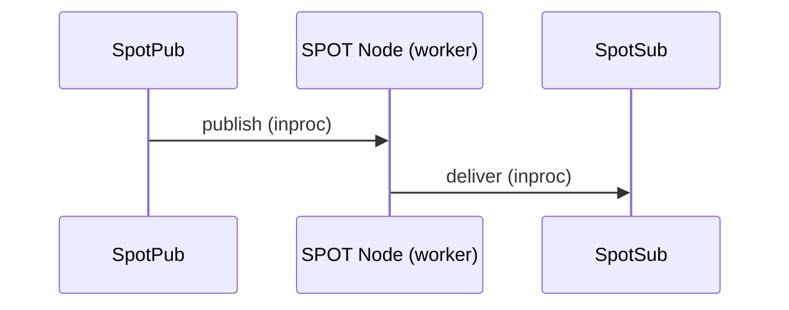
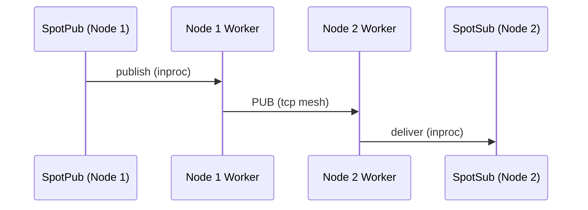
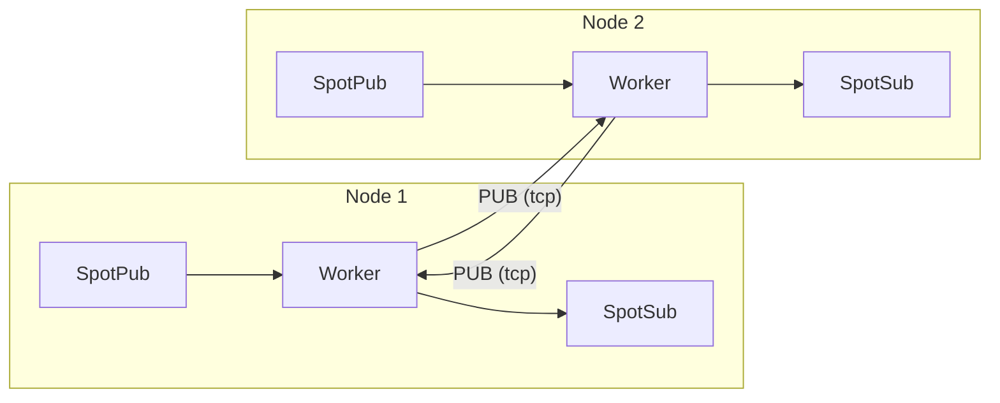

# SPOT 토픽 PUB/SUB (위치투명 발행/구독)

> 이 가이드는 recv-first public surface 기준으로 작성되었다.
> `SpotNode`와 unified `Spot`은 recv 모드로 시작하고,
> readable 알림은 `zlink_spot_dispatch_event_handler()` 하나로 받는다.
> 실제 payload는 대응 recv 함수로 drain한다.

## 1. 개요

SPOT은 위치 투명한 토픽 기반 발행/구독 시스템이다.
Discovery 기반으로 PUB/SUB Mesh를 자동 구성하여,
클러스터 전체에서 토픽 메시지를 발행/구독할 수 있다.

SPOT이 없다면, 여러 노드에 걸친 토픽 기반 메시징을 사용하는 애플리케이션은 어떤 노드에 구독자가 있는지 직접 추적하고, PUB/SUB mesh 연결을 관리하고, 구독 포워딩을 처리해야 한다. SPOT은 이를 자동화한다 -- 어떤 노드에서든 토픽에 publish하면, 클러스터 전체의 모든 구독자가 메시지를 수신한다.

> **명칭에 대하여**: SPOT은 "위치(spot)"에서 유래한 이름이다. 각 객체(노드)가 자신의 위치에서 토픽을 발행하고, 다른 위치의 토픽을 구독하는 객체 단위의 위치투명한(location-transparent) pub/sub 메시 시스템이다.

### 핵심 용어

| 용어 | 설명 |
|------|------|
| **SPOT Node** | PUB/SUB Mesh 참여 에이전트 (노드별 1개) |
| **SPOT Pub** | 토픽 발행 경로 (`spot` / `spot_node`의 hot path) |
| **SPOT Sub** | 토픽 구독/수신 핸들 |
| **Topic** | 문자열 키 기반 메시지 채널 |
| **Pattern** | 접두어 + `*` 와일드카드 구독 |
| **Handler** | callback 수신 시 자동 호출되는 콜백 함수 |

## 2. 아키텍처

### 로컬 publish — 같은 노드 안에서 전달



SpotPub이 publish하면 SPOT Node 내부 worker가 받아서 같은 노드의 SpotSub에게
바로 전달한다. SpotSub은 callback 또는 recv 두 가지 방식으로 메시지를 수신할 수
있다.

### 원격 전파 — 클러스터 노드 간 전달



로컬 publish는 worker가 두 갈래로 분기한다:
1. 같은 노드의 SpotSub에게 전달 (위의 로컬 경로)
2. mesh PUB 소켓으로 원격 노드에 송출

원격 노드의 worker는 mesh에서 수신한 메시지를 자기 SpotSub에게만 전달하고,
**다시 mesh로 재발행하지 않는다** (루프 방지).

### 전체 구조 요약



- 각 Node의 worker는 **PUB 소켓**으로 송출하고, 다른 노드의 **SUB 소켓**으로 수신한다
- 로컬 publish만 mesh로 나가고, 원격 수신은 재발행하지 않는다 (루프 방지)
- Discovery 연결 시 이 mesh 토폴로지가 자동 구성된다

**예시:** 노드 1이 토픽 `price.USD.JPY`를 publish한다. 노드 2에는 `price.*` 구독자가 있다.

1. 노드 1의 SpotPub이 로컬 SPOT worker에게 메시지를 전송한다.
2. Worker가 `price.*`에 매칭되는 로컬 SpotSub에게 전달한다 (로컬 경로).
3. Worker가 PUB 소켓을 통해 tcp로 노드 2에 송출한다.
4. 노드 2의 worker가 SUB로 수신하여, `price.*`에 매칭한 뒤 SpotSub에게 전달한다.
5. 노드 2에서 mesh로 재발행하지 않는다 (루프 방지).

## 3. SPOT Node 설정

### 3.1 Discovery 기반 자동 Mesh

```c
void *ctx = zlink_ctx_new();

/* Discovery setup (peer discovery + registry uplink / heartbeat owner) */
void *discovery = zlink_discovery_new(ctx,
    ZLINK_SERVICE_TYPE_SPOT, "spot-node");
zlink_discovery_connect_registry(discovery, "tcp://registry1:5551");

/* SPOT Node setup */
void *node = zlink_spot_node_new(ctx);
zlink_spot_node_bind(node, "tcp://*:9000");

/* Attach Discovery */
zlink_spot_node_attach_discovery(node, discovery);
```

> `SpotNode`는 mesh 참여를 위한 토폴로지 및 라이프사이클 소유자이다.
> 범용 data-plane facade(publish/subscribe)를 노출하지 않는다.
> publish/subscribe를 사용하려면 `zlink_spot_new(node)`로 facade를 만든다.

**주의:** `attach_discovery()`는 bind 이후에 호출하는 것을 권장한다.
Discovery가 attach되면 Registry를 통해 자동으로 peer를 발견하고 연결한다.

**임시 포트:** `zlink_spot_node_bind()`는 포트 0을 지원하여 OS가 포트를
자동 할당한다. `zlink_spot_node_status_snapshot()`의 `local_endpoint`로
실제 할당된 endpoint를 조회할 수 있다:

```c
zlink_spot_node_bind(node, "tcp://127.0.0.1:0");
zlink_spot_node_status_t status;
zlink_spot_node_status_snapshot(node, &status);
/* status.local_endpoint contains e.g. "tcp://127.0.0.1:43521" */
```

### 3.2 수동 Mesh

```c
void *node = zlink_spot_node_new(ctx);
zlink_spot_node_bind(node, "tcp://*:9000");

/* Directly connect to other nodes' PUB */
zlink_spot_node_connect_peer(node, "tcp://node2:9000");
zlink_spot_node_connect_peer(node, "tcp://node3:9000");
```

**주의:** 수동 Mesh에서는 Discovery가 없으므로 Registry topology visibility도
없다. 이는 의도된 제한이다.

## 4. Unified SPOT 사용

### 4.1 생성

```c
void *spot = zlink_spot_new(node);
```

`zlink_spot_new(node)`는 기존 spot node를 빌리는 unified facade를
생성한다. publish와 subscribe를 함께 제공한다. public standalone
`spot_pub` / `spot_sub` 생성자는 제공하지 않는다.

transport security는 unified `spot`에서 설정하지 않는다. `tls://` 또는
`wss://`를 써야 하면 먼저 backing `SpotNode`에 TLS를 설정해야 한다.
unified `spot` 내부의 `inproc` 연결은 TLS 설정 surface가 아니다.

### 4.2 발행

```c
zlink_msg_t part;
zlink_msg_init_size(&part, 11);
memcpy(zlink_msg_data(&part), "hello world", 11);
zlink_publish(spot, "chat:room1:message", &part, 1, 0);
```

### 4.3 구독 / 해제

```c
zlink_set_subscription(spot, "chat:room1:message");
zlink_set_subscription(spot, "chat:room1:*");

zlink_unset_subscription(spot, "chat:room1:message");
zlink_unset_subscription(spot, "chat:room1:*");
```

### 4.4 메시지 수신

`SpotNode`와 unified `Spot` 모두 **recv 모드**로 시작한다. 메시지를 직접
수신하거나, topic/routed/timer readable 알림을 하나의 dispatch callback으로
받을 수 있다. 실제 payload는 대응 recv 함수로 꺼낸다. send-ready는 별도 축이다.

#### Recv 모드 (기본)

recv 모드에서는 `zlink_subscribe()`로 메시지를 직접 수신한다.

```c
void *spot = zlink_spot_new(node);
zlink_set_subscription(spot, "chat:room1:message");

/* Pull next message */
zlink_routing_id_t source_rid;
zlink_msg_t *parts = NULL;
size_t part_count = 0;
char topic_buf[256];
size_t topic_len = sizeof(topic_buf);
int rc = zlink_subscribe(spot, &source_rid, &parts, &part_count,
                              topic_buf, &topic_len, 0);
if (rc == 0) {
    printf("Topic: %.*s, Parts: %zu\n",
           (int)topic_len, topic_buf, part_count);
    for (size_t i = 0; i < part_count; i++)
        zlink_msg_close(&parts[i]);
}
```

??? example "Full Sample Code"

    | Language | Source |
    |----------|--------|
    | C | [spot_recv_sample.c](https://github.com/kairos-code-dev/zlink/blob/main/bindings/c/samples/spot_recv_sample.c) |
    | C++ | [spot_recv_sample.cpp](https://github.com/kairos-code-dev/zlink/blob/main/bindings/cpp/samples/spot_recv_sample.cpp) |
    | Java | [SpotRecvSample.java](https://github.com/kairos-code-dev/zlink/blob/main/bindings/java/samples/Zlink.Samples/src/main/java/dev/kairoscode/zlink/samples/SpotRecvSample.java) |
    | Python | [spot_recv.py](https://github.com/kairos-code-dev/zlink/blob/main/bindings/python/examples/spot_recv.py) |
    | Node | [spot_recv_sample.ts](https://github.com/kairos-code-dev/zlink/blob/main/bindings/node/examples/spot_recv_sample.ts) |
    | C# | [Program.cs](https://github.com/kairos-code-dev/zlink/blob/main/bindings/dotnet/samples/SpotRecv/Program.cs) |
    | Rust | [spot_recv_sample.rs](https://github.com/kairos-code-dev/zlink/blob/main/bindings/rust/samples/spot_recv_sample.rs) |
    | Go | [main.go](https://github.com/kairos-code-dev/zlink/blob/main/bindings/go/samples/spot_recv_sample/main.go) |

#### Dispatch callback 모드

`zlink_spot_dispatch_event_handler()`를 호출하면 recv 모드에서 dispatch
callback 모드로 일방 전환된다. callback은 readable event kind만 알려 주고,
실제 payload는 대응 recv 함수로 drain한다.

```c
/* Define callback function */
void on_spot_event(void *spot,
                   zlink_spot_dispatch_event_t event,
                   void *userdata)
{
    if (event == ZLINK_SPOT_DISPATCH_EVENT_SUBSCRIBE_READABLE) {
        zlink_routing_id_t source_rid;
        zlink_msg_t *parts = NULL;
        size_t part_count = 0;
        char topic_buf[256];
        size_t topic_len = sizeof(topic_buf);

        if (zlink_subscribe(spot, &source_rid, &parts, &part_count,
                            topic_buf, &topic_len, ZLINK_DONTWAIT) == 0) {
            printf("Topic: %.*s, Parts: %zu\n",
                   (int)topic_len, topic_buf, part_count);
        }
    }
}

/* Register handler at unified spot creation */
void *spot = zlink_spot_new(node);
zlink_spot_dispatch_event_handler(spot, on_spot_event, NULL);
```

**중요:** 하나의 `spot` / `spot_node` handle을 여러 스레드에서 동시에
사용할 수 있다 (thread-safe). `publish`는 hot path(고빈도 데이터 경로)로서 여러 스레드에서 동시 호출을 허용하고,
subscribe/unsubscribe/attach/peer connect/monitor는 control path(저빈도 설정/관리 경로)로
호출할 수 있다. `zlink_spot_dispatch_event_handler()` callback은 I/O thread에서
직접 실행되지 않고, 전용 SPOT worker runtime에서 실행된다. worker 수는
context 옵션 `ZLINK_SPOT_WORKER_THREADS`로 조절한다.

**제약 사항:**

- recv 모드에서는 `zlink_subscribe()`를 사용한다
- topic/routed/timer readable 알림은 `zlink_spot_dispatch_event_handler()`로 받는다
- dispatch callback 모드에서는 `zlink_subscribe()`와 data-plane `ZLINK_POLLIN`이 일반 문맥에서 `EBUSY`로 실패한다
- 같은 `spot`의 활성 dispatch callback 안에서는 해당 readable plane을 비우기 위해 recv 함수를 호출할 수 있다
- `zlink_send_ready_handler()`는 receive callback 선행 조건이 없다
- send-ready attach 이후 data-plane `ZLINK_POLLOUT`은 `EBUSY`로 실패한다
- 전환 후 callback 교체나 해제는 지원하지 않는다
- callback은 전용 SPOT worker runtime에서 실행된다
- 같은 `Spot`의 callback은 직렬 실행되고, 다른 `Spot`은 병렬 실행될 수 있다
- `ZLINK_SPOT_WORKER_THREADS=0`이면 `min(visible logical cores, 8)`을 사용하고, 알 수 없으면 `1`을 사용한다
- 이 옵션은 runtime 시작 전에 설정해야 하며, 시작 후 변경은 `EINVAL`로 실패한다
- `destroy`는 fail-fast lifecycle gate(사용 중이면 `EBUSY`, 종료 후 `ESHUTDOWN`)를 가지므로, 외부 사용을 중단한 뒤
  정리하는 것이 가장 단순하다

> 전체 three-tier 계약과 추가 패턴은 [스레드 안전성 가이드](11-thread-safety.ko.md)를 참고.

## 5. 토픽 규칙

### 명명 규칙

`<domain>:<entity>:<action>` 형식 권장.

예시:
- `chat:room1:message`
- `metrics:zone1:cpu`
- `game:world1:player_move`

### 패턴 구독 규칙

- `*`는 한 개만 허용, 문자열 끝에만
- 대소문자 구분
- 예: `chat:*` → `chat:room1:message`, `chat:room2:join` 모두 매칭

## 내부 모듈 구조

SPOT의 내부 구현은 data plane과 control plane이 분리된 모듈 구조를 가진다.
공개 C API는 변경 없이 유지되며, 내부 변경이 좁은 범위에서 이루어진다.

| 모듈 | 역할 |
|------|------|
| `spot_node_access` · `spot_subject_access` | API 계층과의 seam |
| `spot_handle` | 공개 handle 구조체 |
| `spot_node` | SpotNode orchestration, discovery integration |
| `spot_pub` | publish 경로 |
| `spot_sub` | subscribe 경로 (option · recv 분리) |
| `spot_data_plane` | data plane 코어 |
| `spot_data_plane_forwarding` | ingress/egress 메시지 포워딩 |
| `spot_data_plane_protocol` | 제어 메시지, 구독 업데이트, bootstrap |
| `spot_runtime` | runtime lifecycle |

멀티파트 publish는 공통 `multipart_send_txn` 모듈을 사용하여
whole-message 보장(전체 성공 또는 전체 실패)을 제공한다.

## 7. 전달 정책

- 로컬 publish (`spot`) → 로컬 SPOT Sub 분배 + PUB 송출 (원격 전파)
- 원격 수신 (SUB) → 로컬 SPOT Sub 분배만 (재발행 없음)
- 재발행 없음으로 메시지 루프/중복 방지
- `subscribe()` / `unsubscribe()` 반환은 local socket filter 적용 의미이며,
  클러스터 전체 전파 완료를 보장하지 않는다
- 같은 `spot` handle에서 연속 publish된 메시지의 순서는 보존된다
- 서로 다른 `spot` handle 사이의 전역 순서는 보장하지 않는다
- 동일 subscriber에 exact topic + pattern이 둘 다 매칭되더라도 메시지는 1회만 전달된다

SPOT은 live pub/sub이며, durable delivery, ack/retry, exactly-once,
late join에 대한 과거 메시지 재전송은 보장하지 않는다.

## 8. 정리

```c
zlink_spot_destroy(&spot);
zlink_spot_node_destroy(&node);
zlink_discovery_destroy(&discovery);
```

**정리 순서:** `spot`을 먼저 destroy하고, 그 다음 `SpotNode`, 마지막으로
`Discovery` 순서로 정리한다. `SpotNode` destroy 전에 관련 `spot`의 외부 사용을
중단해야 한다.

> `zlink_spot_destroy()`는 빌린 facade만 정리한다. backing `SpotNode`가
> lifecycle owner이며, Discovery에 attach된 spot node의 경우
> `zlink_discovery_destroy()`가 attach된 참여자에게 종료를 전파한다.

---
[← Discovery](07-1-discovery.ko.md) | [Registry →](07-4-registry.ko.md) | [Routing ID →](08-routing-id.ko.md)
