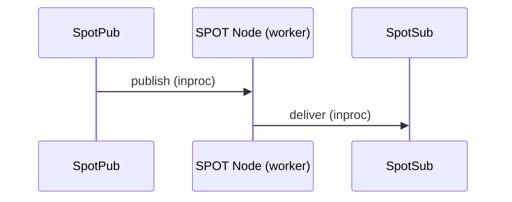
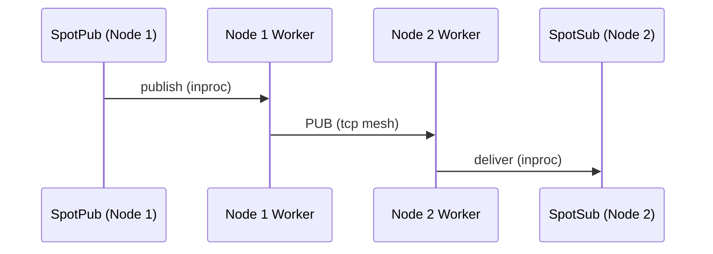
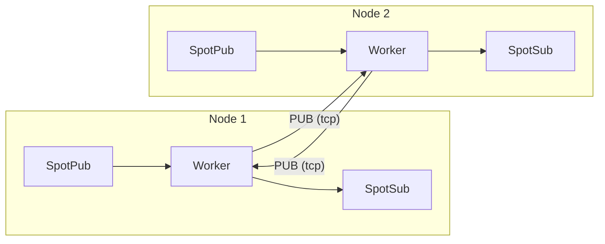

# SPOT Topic PUB/SUB (Location-Transparent Publish/Subscribe)

> **Normative status: Authoritative.**
> 이 가이드는 `core/include/zlink.h` 기준으로 정확하다.

> This guide reflects the recv-first public surface.
> `SpotNode` and unified `Spot` start in recv model and use
> `zlink_spot_dispatch_event_handler()` as the single readable notification
> entrypoint. The caller drains payloads through the matching recv function.

## 1. Overview

SPOT is a location-transparent, topic-based publish/subscribe system. It automatically constructs a PUB/SUB Mesh based on Discovery, enabling topic message publishing and subscribing across the entire cluster.

Without SPOT, applications using topic-based messaging across multiple nodes would need to manually track which nodes have subscribers, manage PUB/SUB mesh connections, and handle subscription forwarding. SPOT automates this -- publish to a topic on any node, and all subscribers across the cluster receive the message.

> **About the name**: SPOT derives its name from "spot" (location). Each object (node) publishes topics from its own location and subscribes to topics from other locations, forming an object-level, location-transparent pub/sub mesh system.

### Core Terminology

| Term | Description |
|------|-------------|
| **SPOT Node** | PUB/SUB Mesh participant agent (one per node) |
| **SPOT Pub** | Topic publishing path (the hot path of `spot` / `spot_node`) |
| **SPOT Sub** | Topic subscription/receive handle |
| **Topic** | String key-based message channel |
| **Pattern** | Prefix + `*` wildcard subscription |
| **Handler** | Callback function automatically invoked on message receipt |

## 2. Architecture

### Local publish — delivery within the same node



When SpotPub publishes, the SPOT Node's internal worker receives it and
delivers directly to SpotSub on the same node (via recv or callback, depending on the configured mode).

### Remote propagation — delivery across cluster nodes



The worker forks a local publish into two paths:
1. Delivers to SpotSub on the same node (local path above)
2. Sends to remote nodes via mesh PUB socket

The remote node's worker delivers mesh-received messages to its own SpotSub only;
it **never re-publishes to the mesh** (loop prevention).

### Full topology overview



- Each node's worker sends via **PUB socket** and receives from other nodes via **SUB socket**
- Only local publishes enter the mesh; remote receives are never re-published (loop prevention)
- When Discovery is attached, this mesh topology is configured automatically

**Example:** Node 1 publishes topic `price.USD.JPY`. Node 2 has a subscriber for `price.*`.

1. SpotPub on Node 1 sends the message to the local SPOT worker.
2. The worker delivers to any local SpotSub matching `price.*` (local path).
3. The worker also sends via the PUB socket over tcp to Node 2.
4. Node 2's worker receives via SUB, matches against `price.*`, and delivers to its SpotSub.
5. The message is NOT re-published to the mesh from Node 2 (loop prevention).

## 3. SPOT Node Setup

### 3.1 Discovery-Based Automatic Mesh

```c
void *ctx = zlink_ctx_new();

/* Discovery setup (peer discovery + registry uplink / heartbeat owner) */
void *discovery = zlink_discovery_new(ctx,
    ZLINK_SERVICE_TYPE_SPOT, "spot-node");
zlink_discovery_connect_registry(discovery, "tcp://registry1:5551");

/* SPOT Node setup */
void *node = zlink_spot_node_new(ctx);
zlink_spot_node_bind(node, "tcp://*:9000");

/* Attach Discovery */
zlink_spot_node_attach_discovery(node, discovery);
```

> `SpotNode` is the topology and lifecycle owner for mesh participation.
> It does not expose the generic data-plane facade (publish/subscribe).
> For publish/subscribe, create a facade with `zlink_spot_new(node)`.

**Note:** It is recommended to call `attach_discovery()` after bind.
Once Discovery is attached, peers are automatically discovered and
connected through the Registry.

**Ephemeral port:** `zlink_spot_node_bind()` supports port 0 for dynamic
port allocation. Use `zlink_spot_node_status_snapshot()` to retrieve the
actual assigned endpoint from `local_endpoint`:

```c
zlink_spot_node_bind(node, "tcp://127.0.0.1:0");
zlink_spot_node_status_t status;
zlink_spot_node_status_snapshot(node, &status);
/* status.local_endpoint contains e.g. "tcp://127.0.0.1:43521" */
```

### 3.2 Manual Mesh

```c
void *node = zlink_spot_node_new(ctx);
zlink_spot_node_bind(node, "tcp://*:9000");

/* Directly connect to other nodes' PUB */
zlink_spot_node_connect_peer(node, "tcp://node2:9000");
zlink_spot_node_connect_peer(node, "tcp://node3:9000");
```

**Note:** In a manual mesh there is no Discovery, so there is no registry
topology visibility. This is an intended limitation.

## 4. Unified SPOT Usage

### 4.1 Create a unified handle

```c
void *spot = zlink_spot_new(node);
```

`zlink_spot_new(node)` creates a unified facade that borrows an existing
spot node. It provides both publish and subscribe behavior. There are no
public standalone `spot_pub` / `spot_sub` constructors.

Transport security is not configured through unified `spot`. If the service
must use `tls://` or `wss://`, configure TLS on the backing `SpotNode`
first. The internal `inproc` linkage inside unified `spot` is not a TLS
surface.

### 4.2 Publishing

```c
zlink_msg_t part;
zlink_msg_init_size(&part, 11);
memcpy(zlink_msg_data(&part), "hello world", 11);
zlink_publish(spot, "chat:room1:message", &part, 1, 0);
```

### 4.3 Subscribing and unsubscribing

```c
zlink_set_subscription(spot, "chat:room1:message");
zlink_set_subscription(spot, "chat:room1:*");

zlink_unset_subscription(spot, "chat:room1:message");
zlink_unset_subscription(spot, "chat:room1:*");
```

### 4.4 Receiving Messages

Both `SpotNode` and unified `Spot` start in **recv model**. You can either
pull messages directly or switch the receive surface once to a unified
dispatch callback that reports topic, routed, and timer readability.
Send-ready remains a separate axis.

#### Recv model (default)

In recv model, pull messages with `zlink_subscribe()`.

```c
void *spot = zlink_spot_new(node);
zlink_set_subscription(spot, "chat:room1:message");

/* Pull next message */
zlink_routing_id_t source_rid;
zlink_msg_t *parts = NULL;
size_t part_count = 0;
char topic_buf[256];
size_t topic_len = sizeof(topic_buf);
int rc = zlink_subscribe(spot, &source_rid, &parts, &part_count,
                              topic_buf, &topic_len, 0);
if (rc == 0) {
    printf("Topic: %.*s, Parts: %zu\n",
           (int)topic_len, topic_buf, part_count);
    for (size_t i = 0; i < part_count; i++)
        zlink_msg_close(&parts[i]);
}
```

??? example "Full Sample Code"

    | Language | Source |
    |----------|--------|
    | C | [spot_recv_sample.c](https://github.com/kairos-code-dev/zlink/blob/main/bindings/c/samples/spot_recv_sample.c) |
    | C++ | [spot_recv_sample.cpp](https://github.com/kairos-code-dev/zlink/blob/main/bindings/cpp/samples/spot_recv_sample.cpp) |
    | Java | [SpotRecvSample.java](https://github.com/kairos-code-dev/zlink/blob/main/bindings/java/samples/Zlink.Samples/src/main/java/dev/kairoscode/zlink/samples/SpotRecvSample.java) |
    | Python | [spot_recv.py](https://github.com/kairos-code-dev/zlink/blob/main/bindings/python/examples/spot_recv.py) |
    | Node | [spot_recv_sample.ts](https://github.com/kairos-code-dev/zlink/blob/main/bindings/node/examples/spot_recv_sample.ts) |
    | C# | [Program.cs](https://github.com/kairos-code-dev/zlink/blob/main/bindings/dotnet/samples/SpotRecv/Program.cs) |
    | Rust | [spot_recv_sample.rs](https://github.com/kairos-code-dev/zlink/blob/main/bindings/rust/samples/spot_recv_sample.rs) |
    | Go | [main.go](https://github.com/kairos-code-dev/zlink/blob/main/bindings/go/samples/spot_recv_sample/main.go) |

#### Dispatch callback model

Install `zlink_spot_dispatch_event_handler()` to make a one-way transition
from recv model to dispatch callback model. The callback reports only the
readable event kind; the payload is drained through the matching recv
function.

```c
/* Define callback function */
void on_spot_event(void *spot,
                   zlink_spot_dispatch_event_t event,
                   void *userdata)
{
    if (event == ZLINK_SPOT_DISPATCH_EVENT_SUBSCRIBE_READABLE) {
        zlink_routing_id_t source_rid;
        zlink_msg_t *parts = NULL;
        size_t part_count = 0;
        char topic_buf[256];
        size_t topic_len = sizeof(topic_buf);

        if (zlink_subscribe(spot, &source_rid, &parts, &part_count,
                            topic_buf, &topic_len, ZLINK_DONTWAIT) == 0) {
            printf("Topic: %.*s, Parts: %zu\n", (int)topic_len, topic_buf, part_count);
        }
    }
}

/* Register handler at unified spot creation */
void *spot = zlink_spot_new(node);
zlink_spot_dispatch_event_handler(spot, on_spot_event, NULL);
```

**Important:** A single `spot` / `spot_node` handle can be used concurrently
from multiple threads (thread-safe). `publish` is the concurrent hot path, while
subscribe/unsubscribe/attach/peer-connect/monitor calls remain valid runtime
control-path operations. `zlink_spot_dispatch_event_handler()` callbacks are
not invoked directly on the I/O thread; they run on a dedicated SPOT worker
runtime. The worker count is controlled by the context option
`ZLINK_SPOT_WORKER_THREADS`.

**Constraints:**

- In recv model, use `zlink_subscribe()`
- Use `zlink_spot_dispatch_event_handler()` for topic, routed, and timer readable notifications
- In dispatch callback mode, `zlink_subscribe()` and data-plane `ZLINK_POLLIN` fail with `EBUSY` in ordinary call sites
- The active dispatch callback for the same `spot` may still call the matching recv function to drain the readable plane
- `zlink_send_ready_handler()` is independent from receive callback mode
- After send-ready attach, data-plane `ZLINK_POLLOUT` fails with `EBUSY`
- Replacing or clearing the callback after transition is not supported
- Callbacks run on the dedicated SPOT worker runtime
- Callback execution is serialized per `Spot`, while different `Spot` handles may run in parallel
- `ZLINK_SPOT_WORKER_THREADS=0` means auto-select `min(visible logical cores, 8)`, with fallback `1`
- Set the option before runtime startup; changes after startup fail with `EINVAL`
- `destroy` uses a fail-fast lifecycle gate, so the simplest pattern is to
  stop external use first and then tear down the handle

> See [Thread-Safety Guide](11-thread-safety.md) for the full three-tier contract and additional patterns.

## 5. Topic Rules

### Naming Convention

The recommended format is `<domain>:<entity>:<action>`.

Examples:
- `chat:room1:message`
- `metrics:zone1:cpu`
- `game:world1:player_move`

### Pattern Subscription Rules

- Only one `*` is allowed, and it must be at the end of the string
- Case-sensitive
- Example: `chat:*` matches both `chat:room1:message` and `chat:room2:join`

## Internal Module Structure

The SPOT internal implementation has a modular structure with separated
data plane and control plane. The public C API remains unchanged;
internal changes stay within narrow boundaries.

| Module | Role |
|--------|------|
| `spot_node_access` · `spot_subject_access` | API layer seam (service-local access) |
| `spot_handle` | Public handle struct (tag validation, pub/sub refs, pending defaults) |
| `spot_node` | SpotNode orchestration, discovery integration |
| `spot_pub` | Publish path |
| `spot_sub` | Subscribe path (option · recv separated) |
| `spot_data_plane` | Data plane core |
| `spot_data_plane_forwarding` | Ingress/egress message forwarding |
| `spot_data_plane_protocol` | Control messages, subscription updates, bootstrap |
| `spot_runtime` | Runtime lifecycle |

Multipart publish uses the shared `multipart_send_txn` module to provide
whole-message guarantees (all-or-nothing).

## 7. Delivery Policy

- Local publish (`spot`) distributes to local SPOT Subs + sends out via PUB (remote propagation)
- Remote receive (SUB) distributes to local SPOT Subs only (no re-publishing)
- No re-publishing prevents message loops and duplicates
- `subscribe()` / `unsubscribe()` return means the local socket filter has been applied;
  it does not guarantee cluster-wide propagation
- Message ordering is preserved within a single `spot` handle
- Global ordering across different `spot` handles is not guaranteed
- If both an exact topic and a pattern match the same message on the same subscriber,
  the message is delivered only once

SPOT is a live pub/sub system. It does not guarantee durable delivery,
ack/retry, exactly-once semantics, or past message replay for late joiners.

## 8. Cleanup

```c
zlink_spot_destroy(&spot);
zlink_spot_node_destroy(&node);
zlink_discovery_destroy(&discovery);
```

**Destroy order:** Destroy `spot` first, then `SpotNode`, and finally
`Discovery`. All external use of `spot` must stop before calling
`SpotNode` destroy.

> `zlink_spot_destroy()` only releases the borrowed facade. The backing
> `SpotNode` remains the lifecycle owner. For discovery-attached spot
> nodes, `zlink_discovery_destroy()` cascades shutdown to attached
> participants.

---
[← Discovery](07-1-discovery.md) | [Registry →](07-4-registry.md) | [Routing ID →](08-routing-id.md)
