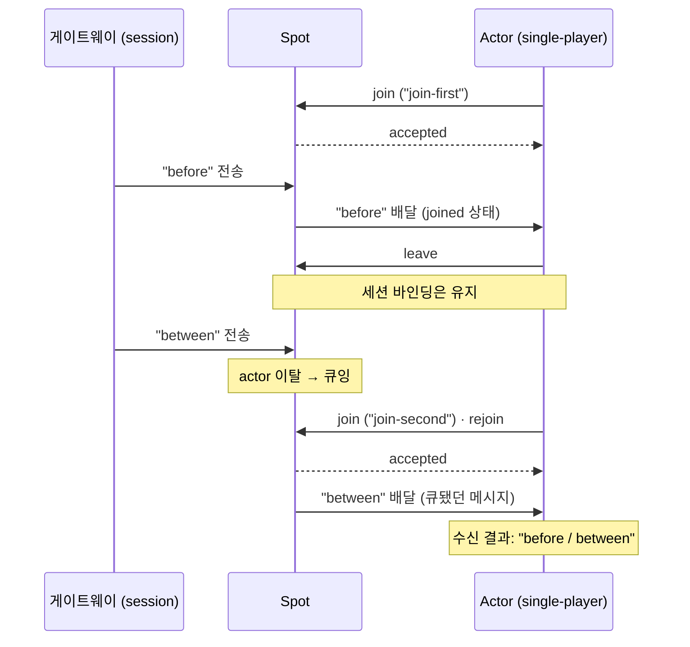

[English](./07-4-actor.md) | [한국어](./07-4-actor.ko.md)

# SPOT Actor 사용 가이드

이 문서는 개념(역할·언제 쓰나)을 먼저 언어 무관으로 설명하고, **한 파일로 된
실행 가능한 예제**를 **9개 언어 코드 탭**으로 보인다. 각 탭은 리포지토리에 실제로
있는 자립형 예제 파일을 **그대로 임베드**한 것이다 — 화면에 보이는 코드가 곧 열어
볼 수 있는 진짜 파일이고, 별도 헬퍼 없이 한 파일로 빌드·실행된다. 단계 설명은 코드
안 주석으로 단다. Kotlin은 Java 바인딩 런타임을, JavaScript는 Node 바인딩 런타임을
공유하지만 언어가 다르므로 별도 탭으로 보인다.

!!! note "파일럿 문서"
    이 문서는 [문서화 원칙](../../../principal/documentation/documentation-principles.ko.md)에
    따라 "실제 예제 파일 임베드 + 9언어 탭" 형식을 시험 적용한 첫 문서다. 9개 예제는
    모두 같은 시나리오·값·출력(`"before/between"`)을 내며 빌드·실행으로 검증됐다.
    정확한 함수 계약은 [SPOT spec](../spec/core/service/spot.ko.md)을 본다.

## Actor란 — 무엇이고 언제 쓰나

Actor는 Spot에 합류(join)해 그 Spot으로 들어온 메시지를 받는 **상태 보유
엔티티**다(세션·게임 플레이어·작업 큐). 핵심은 **세션 위치와 처리 단위의 분리** —
클라이언트가 어느 연결 서버에 붙어 있든, 메시지는 그와 묶인 Actor로 전달된다.

**왜 Actor인가 — 재접속 이전성.** Actor는 actor id로 식별되며 세션 연결과 별개로
존재한다. 클라이언트가 끊겼다 다른 연결 서버로 재접속해도 같은 Actor로 다시
묶인다 — "어느 서버에 붙어 있었는지"를 외부 저장소(Redis 등)로 관리하던 일을
라이브러리가 가져간다. Actor는 raw 소켓의 대안이 아니라 **Spot 위에 얹는 한 단계
더 높은 모델**이며, Actor 메시지도 결국 Spot routed 평면 위로 흐른다.

## 시나리오 — single-player queue

아래 예제는 Actor의 **재접속 이전성**을 한 흐름으로 보인다:

1. 노드·spot·actor를 만들고, actor를 spot에 **join**한다.
2. actor가 spot을 **leave**한다(연결은 살아 있되 처리 위치만 빠짐).
3. **그 사이에 도착한 메시지는 유실되지 않고 큐잉**된다.
4. actor가 다시 **join**(rejoin)하면, 큐된 메시지를 받는다.

메시지는 STREAM 게이트웨이에 묶인 세션(`session`)으로 보낸다. `"before"`는 actor가
join한 상태에서, `"between"`은 leave한 사이에 도착해 큐잉되고, rejoin하면 둘 다
순서대로 배달돼 결과는 `"before/between"`이 된다. 실제 서버라면 `session`은
게이트웨이로 접속한 클라이언트의 라우팅 ID지만, 자립 실행을 위해 예제에서는
고정값으로 만든다.

아래 다이어그램이 그 흐름이다 — 핵심은 actor가 leave한 사이에 도착한 `"between"`이
유실되지 않고 큐잉됐다가 rejoin 때 배달된다는 점이다.



## 전체 프로그램

=== "C++"
    ```cpp
    --8<-- "bindings/cpp/samples/actor_queue_example.cpp"
    ```
=== "C#/.NET"
    ```csharp
    --8<-- "bindings/dotnet/samples/ActorQueueExample/Program.cs"
    ```
=== "Java"
    ```java
    --8<-- "bindings/java/samples/Zlink.Samples/src/main/java/systems/zlink/samples/ActorQueueExample.java"
    ```
=== "Kotlin"
    ```kotlin
    --8<-- "bindings/kotlin/samples/src/main/kotlin/systems/zlink/samples/ActorQueueExample.kt"
    ```
=== "Python"
    ```python
    --8<-- "bindings/python/samples/actor_queue_example.py"
    ```
=== "Node/TypeScript"
    ```typescript
    --8<-- "bindings/node/samples/actor_queue_example.ts"
    ```
=== "JavaScript"
    ```javascript
    --8<-- "bindings/javascript/samples/actor_queue_example.js"
    ```
=== "Go"
    ```go
    --8<-- "bindings/go/samples/actor_queue_example/main.go"
    ```
=== "Rust"
    ```rust
    --8<-- "bindings/rust/samples/actor_queue_example.rs"
    ```

## 더 보기

- 위 9개 탭은 각 언어 `samples/`의 `actor_queue_example` 파일을 그대로 임베드한 것이다.
- 같은 시나리오의 엄격한 테스트 버전(다중 검증 포함)은 각 언어 `samples/`의
  `actor_single_player_queue`를 본다. 다른 actor 패턴: `actor_room_server`(방
  디스패치), `actor_gateway_relay`(외부 세션 릴레이).
- 정확한 계약: [SPOT spec](../spec/core/service/spot.ko.md). 개념·언제 쓰나:
  [서비스 개요 §멘탈 모델](./07-0-services.ko.md).
