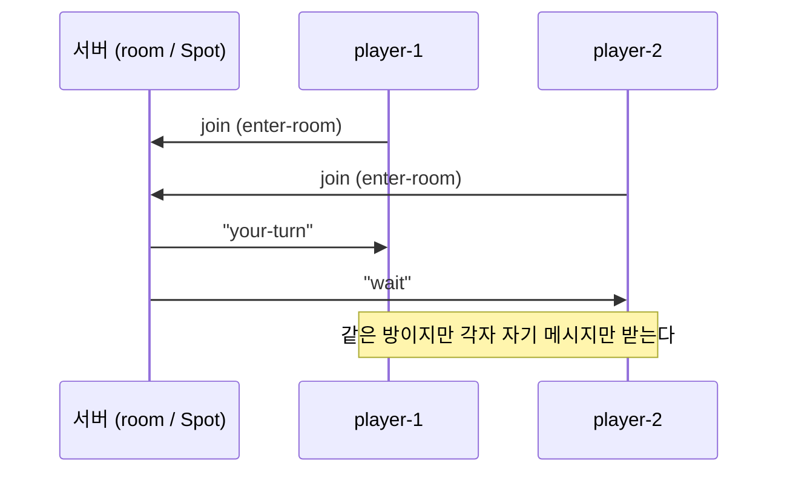
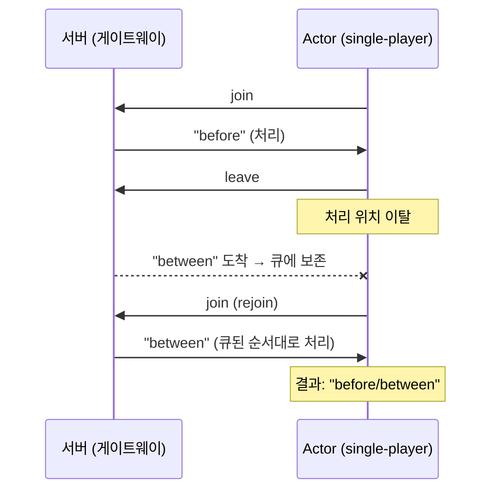

[English](./07-4-actor.md) | [한국어](./07-4-actor.ko.md)

# SPOT Actor 사용 가이드

이 문서는 Actor가 무엇이고 언제 쓰는지를 먼저 설명하고, 두 가지 대표 시나리오를
**한 파일로 된 실행 가능한 예제**의 **9개 언어 코드 탭**으로 보인다. 각 탭은
리포지토리에 실제로 있는 자립형 예제 파일을 **그대로 임베드**한 것이다 — 화면에
보이는 코드가 곧 열어 볼 수 있는 진짜 파일이고, 별도 헬퍼 없이 한 파일로 빌드·
실행된다. Kotlin은 Java 바인딩 런타임을, JavaScript는 Node 바인딩 런타임을
공유하지만 언어가 다르므로 별도 탭으로 보인다.

!!! note "파일럿 문서"
    이 문서는 [문서화 원칙](../../../principal/documentation/documentation-principles.ko.md)에
    따라 "실제 예제 파일 임베드 + 9언어 탭" 형식을 시험 적용한 첫 문서다. 9×2개
    예제는 모두 빌드·실행으로 검증됐다. 정확한 함수 계약은
    [SPOT spec](../spec/core/service/spot.ko.md)을 본다.

## Actor란 — 무엇이고 언제 쓰나

실시간 게임 서버를 떠올리면 가장 쉽다. 플레이어가 접속하면 서버 안에 그 플레이어를
대표하는 객체가 하나 생긴다. 이 객체는 플레이어의 상태(점수·위치·손패)를 들고, 그가
보낸 입력을 **들어온 순서대로** 처리하고, 그에게 보낼 메시지를 push한다. zlink의
**Actor**가 바로 이 객체이고, Actor들이 모이는 곳이 **Spot**이다.

두 가지 성질이 핵심이다.

- **id로 주소 지정** — Actor는 연결(소켓)이 아니라 id로 가리킨다. 서버는
  "player-2에게 보내"라고만 하면 되고, player-2가 지금 어느 서버·소켓에 붙어 있는지
  추적할 필요가 없다 — zlink가 id를 보고 그 Actor에게 전달한다. (받는 쪽을 연결이
  아니라 id로 가리키므로, 끊겼다 다른 서버로 다시 붙어도 같은 Actor로 이어진다.)
- **자기 큐로 순차 처리** — 각 Actor는 자기 메시지 큐를 갖고, 들어온 메시지를 하나씩
  순서대로(직렬) 처리한다. 락 없이 "이 세션의 일은 이 Actor가 순서대로"라서 상태를
  안전하게 들고 간다.

**언제 쓰나**

- **멀티플레이 게임 방** — 한 방(Spot)에 여러 플레이어(Actor), 각자 id로 주소 지정.
  (가장 직관적)
- **실시간 게임 세션** — 접속자 1명당 Actor 1개로 그 세션 패킷을 순서대로 처리하는
  권위 세션. (실무에서 가장 흔함)
- **게임이 아니어도** — 긴 TCP 세션을 유지하며 그 세션 메시지를 고속·순차로
  처리해야 하는 곳(거래/주문 세션, IoT 디바이스 세션, 세션별 명령 스트림 등).

Actor는 raw 소켓의 대안이 아니라 Spot 위에 얹는 한 단계 더 높은 모델이며, Actor
메시지도 결국 Spot routed 평면 위로 흐른다.

## 시나리오 1 — 한 방의 두 플레이어 (id 주소 지정)

한 방(Spot)에 두 플레이어 `player-1`, `player-2`가 입장(join)한다. 서버가 각
플레이어에게 자기 앞으로 온 메시지를 보내면(`player-1`←`your-turn`,
`player-2`←`wait`), **그 Actor만** 그것을 받는다. 같은 방을 공유해도 메시지는 id로
정확히 그 플레이어에게 간다.



=== "C++"
    ```cpp
    --8<-- "bindings/cpp/samples/actor_room_example.cpp"
    ```
=== "C#/.NET"
    ```csharp
    --8<-- "bindings/dotnet/samples/ActorRoomExample/Program.cs"
    ```
=== "Java"
    ```java
    --8<-- "bindings/java/samples/Zlink.Samples/src/main/java/systems/zlink/samples/ActorRoomExample.java"
    ```
=== "Kotlin"
    ```kotlin
    --8<-- "bindings/kotlin/samples/src/main/kotlin/systems/zlink/samples/ActorRoomExample.kt"
    ```
=== "Python"
    ```python
    --8<-- "bindings/python/samples/actor_room_example.py"
    ```
=== "Node/TypeScript"
    ```typescript
    --8<-- "bindings/node/samples/actor_room_example.ts"
    ```
=== "JavaScript"
    ```javascript
    --8<-- "bindings/javascript/samples/actor_room_example.js"
    ```
=== "Go"
    ```go
    --8<-- "bindings/go/samples/actor_room_example/main.go"
    ```
=== "Rust"
    ```rust
    --8<-- "bindings/rust/samples/actor_room_example.rs"
    ```

## 시나리오 2 — 순차 처리되는 메시지 큐

Actor는 자기 큐의 메시지를 **들어온 순서대로** 처리한다. Actor가 잠깐 처리 위치에서
빠져 있어도(leave) 그 사이 도착한 메시지는 큐에 순서대로 쌓였다가, 다시 돌아오면
(rejoin) 그대로 이어 처리된다. 아래 예제는 `"before"`(붙어 있을 때)와
`"between"`(빠져 있는 사이)을 보내고, 결과가 순서대로 `"before/between"`이 됨을
보인다 — 세션별 순차 처리의 바탕이다.



=== "C++"
    ```cpp
    --8<-- "bindings/cpp/samples/actor_queue_example.cpp"
    ```
=== "C#/.NET"
    ```csharp
    --8<-- "bindings/dotnet/samples/ActorQueueExample/Program.cs"
    ```
=== "Java"
    ```java
    --8<-- "bindings/java/samples/Zlink.Samples/src/main/java/systems/zlink/samples/ActorQueueExample.java"
    ```
=== "Kotlin"
    ```kotlin
    --8<-- "bindings/kotlin/samples/src/main/kotlin/systems/zlink/samples/ActorQueueExample.kt"
    ```
=== "Python"
    ```python
    --8<-- "bindings/python/samples/actor_queue_example.py"
    ```
=== "Node/TypeScript"
    ```typescript
    --8<-- "bindings/node/samples/actor_queue_example.ts"
    ```
=== "JavaScript"
    ```javascript
    --8<-- "bindings/javascript/samples/actor_queue_example.js"
    ```
=== "Go"
    ```go
    --8<-- "bindings/go/samples/actor_queue_example/main.go"
    ```
=== "Rust"
    ```rust
    --8<-- "bindings/rust/samples/actor_queue_example.rs"
    ```

## 더 보기

- 위 탭들은 각 언어 `samples/`의 `actor_room_example`·`actor_queue_example` 파일을
  그대로 임베드한 것이다.
- 더 큰 패턴: `actor_room_server`(STREAM 게이트웨이로 외부 클라이언트 세션을 actor에
  연결), `actor_gateway_relay`(외부 세션 릴레이).
- 정확한 계약: [SPOT spec](../spec/core/service/spot.ko.md). 개념·언제 쓰나:
  [서비스 개요 §멘탈 모델](./07-0-services.ko.md).
