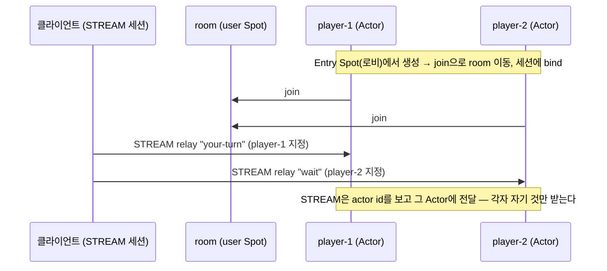
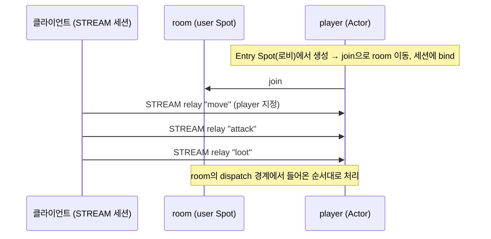

[English](./07-4-actor.md) | [한국어](./07-4-actor.ko.md)

# SPOT Actor 사용 가이드

이 문서는 Actor가 무엇이고 언제 쓰는지를 먼저 설명하고, 두 가지 대표 시나리오를
**한 파일로 된 실행 가능한 예제**의 **9개 언어 코드 탭**으로 보인다. 각 탭은
리포지토리에 실제로 있는 자립형 예제 파일을 **그대로 임베드**한 것이다 — 화면에
보이는 코드가 곧 열어 볼 수 있는 진짜 파일이고, 별도 헬퍼 없이 한 파일로 빌드·
실행된다. Kotlin은 Java 바인딩 런타임을, JavaScript는 Node 바인딩 런타임을
공유하지만 언어가 다르므로 별도 탭으로 보인다.

!!! note "파일럿 문서"
    이 문서는 [문서화 원칙](../../../principal/documentation/documentation-principles.ko.md)에
    따라 "실제 예제 파일 임베드 + 9언어 탭" 형식을 시험 적용한 첫 문서다. 9×2개
    예제는 모두 빌드·실행으로 검증됐다. 정확한 함수 계약은
    [SPOT spec](https://github.com/kairos-code-dev/zlink/blob/main/doc/spec/core/service/spot.ko.md)을 본다.

## Actor란 — 무엇이고 언제 쓰나

실시간 게임 서버를 떠올리면 가장 쉽다. 플레이어가 접속하면 서버 안에 그 플레이어를
대표하는 객체가 하나 생긴다. 이 객체는 플레이어의 상태(점수·위치·손패)를 들고, 그
플레이어가 보낸 입력을 들어온 순서대로 처리한다. zlink의 **Actor**가 바로 이 객체다.

**Actor는 항상 Spot 안에 있다.** Actor는 단독으로 존재하지 않고 반드시 어떤 Spot에
소속된다. Actor에게 온 메시지도 Actor 전용 콜백으로 받는 게 아니라, 그 **Actor가
속한 Spot의 dispatch 이벤트**에서 `recv_actor_part`로 **간접 수신**한다.

**Actor에게 메시지는 STREAM 세션으로 전달한다.** 외부 클라이언트가 STREAM으로
연결하면 그 **세션에 Actor를 bind**하고, 세션으로 들어온 패킷을 **그 actor id를 보고
relay**한다 — `세션 bind → actor 지정 relay`로 Actor에게 메시지가 닿는다(백엔드에서
Spot끼리 주고받는 메시징은 별개 경로이며 [Spot 가이드](./07-3-spot.ko.md)에서
다룬다). 받는 쪽을 연결이 아니라 actor id로 가리키므로, 클라이언트가 끊겼다 **같은
서버**에 다시 붙으면 actor id로 같은 Actor에 다시 bind해 이어 가고, **다른 서버**의
Actor에 연결하려면 discovery로 그 Actor를 찾아야 한다.

**Entry Spot은 로비다.** Actor를 만들면 처음에는 반드시 **Entry Spot**(`SpotNode`가
소유하는 진입점)에 생긴다. 모든 Actor가 여기로 들어오며, 보통 여기서 인증·초기
처리·들어갈 방 선택을 한 뒤 `join`으로 개별 user Spot(방)으로 옮겨 간다(`leave`하면
다시 Entry Spot으로 돌아온다). Entry Spot에서는 STREAM으로 relay된 actor 패킷이
actor별 순서로 처리되지만 Entry Spot 전체가 하나의 직렬 경계는 아니다(나머지는 병렬).
user Spot으로 옮겨 가면 그 **Spot의 dispatch 경계에서 순서대로** 처리된다.

**언제 쓰나**

- **멀티플레이 게임 방** — 한 방(user Spot)에 여러 플레이어(Actor), 각자 id로 주소
  지정. (가장 직관적)
- **실시간 게임 세션** — 접속자 1명당 Actor 1개로 그 세션 패킷을 순서대로 처리하는
  권위 세션. (실무에서 가장 흔함)
- **게임이 아니어도** — 긴 TCP 세션을 유지하며 그 세션 메시지를 고속·순차로
  처리해야 하는 곳(거래/주문 세션, IoT 디바이스 세션, 세션별 명령 스트림 등).

Actor는 raw 소켓의 대안이 아니라 Spot 위에 얹는 한 단계 더 높은 모델이다.

## 시나리오 1 — 한 방의 두 플레이어 (id 주소 지정)

두 플레이어 `player-1`, `player-2`가 Entry Spot에서 생성돼 한 방(user Spot)으로
join한다. 각 Actor는 STREAM 세션에 bind되며 서버가 STREAM으로 각 플레이어 앞으로
패킷을 relay하면(`player-1`←`your-turn`, `player-2`←`wait`) **그 Actor만** 받는다.
같은 방을 공유해도 메시지는 actor id로 정확히 그 플레이어에게 간다.



=== "C++"

    ```cpp
    --8<-- "bindings/cpp/samples/actor_room_example.cpp:doc"
    ```

=== "C#/.NET"

    ```csharp
    --8<-- "bindings/dotnet/samples/ActorRoomExample/Program.cs:doc"
    ```

=== "Java"

    ```java
    --8<-- "bindings/java/samples/Zlink.Samples/src/main/java/systems/zlink/samples/ActorRoomExample.java:doc"
    ```

=== "Kotlin"

    ```kotlin
    --8<-- "bindings/kotlin/samples/src/main/kotlin/systems/zlink/samples/ActorRoomExample.kt:doc"
    ```

=== "Python"

    ```python
    --8<-- "bindings/python/samples/actor_room_example.py:doc"
    ```

=== "Node/TypeScript"

    ```typescript
    --8<-- "bindings/node/samples/actor_room_example.ts:doc"
    ```

=== "JavaScript"

    ```javascript
    --8<-- "bindings/javascript/samples/actor_room_example.js:doc"
    ```

=== "Go"

    ```go
    --8<-- "bindings/go/samples/actor_room_example/main.go:doc"
    ```

=== "Rust"

    ```rust
    --8<-- "bindings/rust/samples/actor_room_example.rs:doc"
    ```

## 시나리오 2 — STREAM 메시지 순차 처리

한 플레이어 Actor가 Entry Spot에서 생성돼 개별 방(user Spot)으로 join한다. STREAM이
그 세션으로 입력(`move`, `attack`, `loot`)을 연달아 relay하면, Actor는 방의 dispatch
경계에서 **들어온 순서대로** 처리한다 — 한 세션의 일을 한 Actor가 직렬로 처리하는
모델이다.



=== "C++"

    ```cpp
    --8<-- "bindings/cpp/samples/actor_sequential_example.cpp:doc"
    ```

=== "C#/.NET"

    ```csharp
    --8<-- "bindings/dotnet/samples/ActorSequentialExample/Program.cs:doc"
    ```

=== "Java"

    ```java
    --8<-- "bindings/java/samples/Zlink.Samples/src/main/java/systems/zlink/samples/ActorSequentialExample.java:doc"
    ```

=== "Kotlin"

    ```kotlin
    --8<-- "bindings/kotlin/samples/src/main/kotlin/systems/zlink/samples/ActorSequentialExample.kt:doc"
    ```

=== "Python"

    ```python
    --8<-- "bindings/python/samples/actor_sequential_example.py:doc"
    ```

=== "Node/TypeScript"

    ```typescript
    --8<-- "bindings/node/samples/actor_sequential_example.ts:doc"
    ```

=== "JavaScript"

    ```javascript
    --8<-- "bindings/javascript/samples/actor_sequential_example.js:doc"
    ```

=== "Go"

    ```go
    --8<-- "bindings/go/samples/actor_sequential_example/main.go:doc"
    ```

=== "Rust"

    ```rust
    --8<-- "bindings/rust/samples/actor_sequential_example.rs:doc"
    ```

## 더 보기

- 위 탭들은 각 언어 `samples/`의 `actor_room_example`·`actor_sequential_example`
  파일을 그대로 임베드한 것이다.
- Actor가 방을 잠깐 leave했다 다시 join하는 사이에도 메시지가 큐에 보존되는 동작은
  `actor_queue_example`을 본다.
- 외부 raw TCP 클라이언트를 STREAM 게이트웨이로 실제 연결하는 더 큰 패턴:
  `actor_room_server`, `actor_gateway_relay`.
- 정확한 계약: [SPOT spec](https://github.com/kairos-code-dev/zlink/blob/main/doc/spec/core/service/spot.ko.md). 개념·언제 쓰나:
  [서비스 개요 §멘탈 모델](./07-0-services.ko.md).
