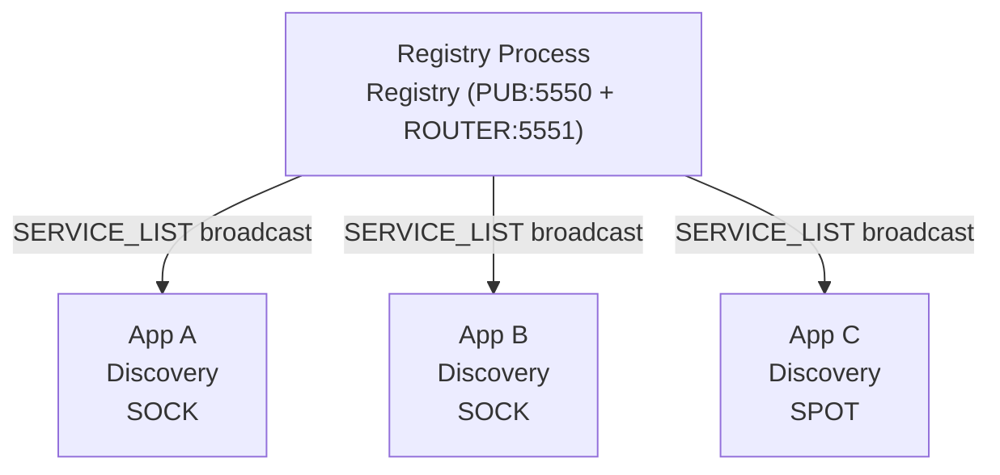
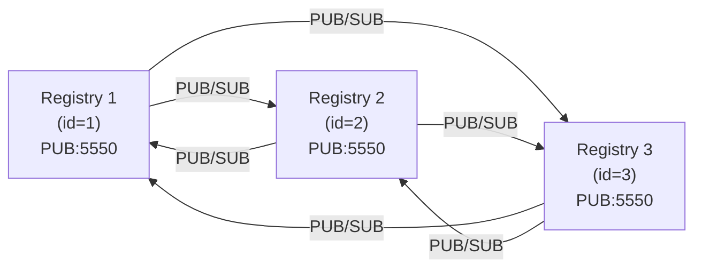
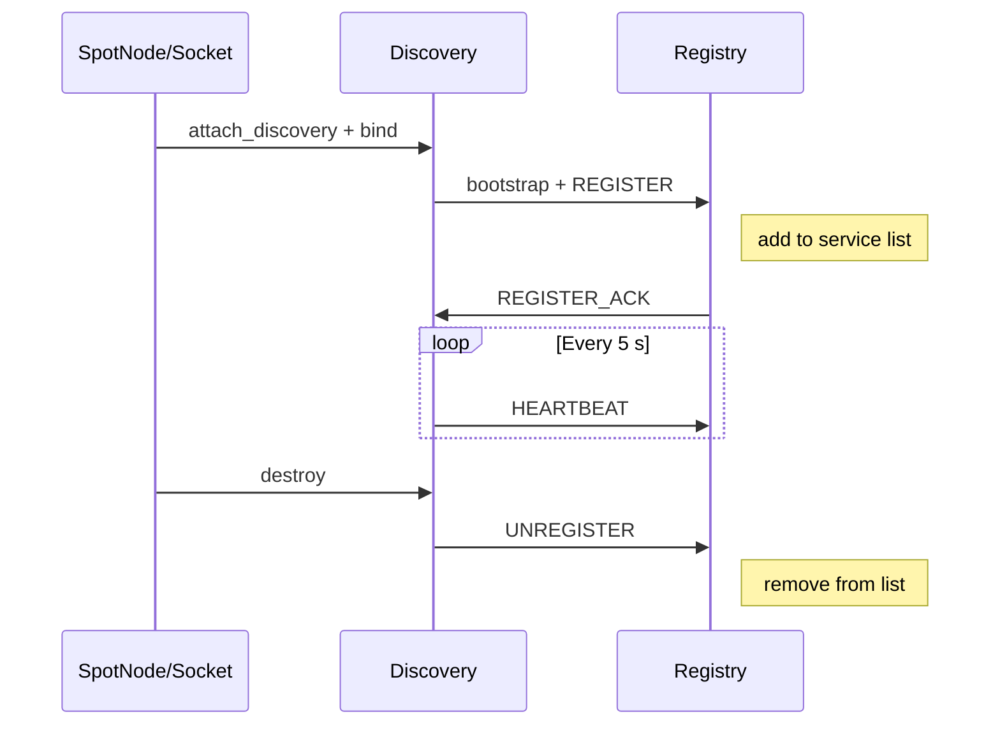

# Registry (Central Service Directory)

## 1. Overview

Registry is the central service directory and topology summary source for
the zlink service layer. It accepts service registrations from SPOT nodes
and socket family services (via Discovery), manages heartbeat-based liveness, and
periodically broadcasts the aggregated service list to all connected
Discovery instances.

### Two Usage Modes

| Mode | Description |
|------|-------------|
| **Standalone process** | Registry runs as a dedicated service. Multiple applications connect through Discovery. |
| **Embedded** | Registry is created inside the application process alongside Discovery and services (SPOT/Socket). |

**Registry is thread-safe.** A single Registry handle can be used
concurrently from multiple threads. Configuration APIs (`set_id`, `add_peer`,
`set_heartbeat`, `set_broadcast_interval`, `setsockopt`) must be called
before `bind`. Topology query APIs (`topology_snapshot`, `topology_query`,
`member_peers_snapshot`, `member_peers_query`) are safe to call from any
thread at any time after bind.

## 2. Quick Start

Minimal setup to get a Registry running and a ROUTER socket connected
through Discovery.

=== "C"

    ```c
    void *ctx = zlink_ctx_new();

    /* === Registry === */
    void *registry = zlink_registry_new(ctx);
    /* PUB: service list broadcast, ROUTER: registration/heartbeat/queries */
    zlink_registry_bind(registry, "tcp://*:5550", "tcp://*:5551");

    /* === Discovery === */
    void *discovery = zlink_discovery_new(ctx,
        ZLINK_SERVICE_TYPE_SOCKET, "my-service");
    zlink_discovery_connect_registry(discovery, "tcp://127.0.0.1:5551");

    /* === ROUTER socket (server, Discovery-managed) === */
    void *server = zlink_socket_new(ctx, ZLINK_ROUTER);
    zlink_bind(server, "tcp://*:5555");
    zlink_socket_attach_discovery(server, discovery);

    /* ... application logic ... */

    /* Cleanup */
    zlink_discovery_destroy(&discovery);
    zlink_registry_destroy(&registry);
    zlink_ctx_term(ctx);
    ```

=== "C++"

    ```cpp
    auto ctx = zlink::context();

    // === Registry ===
    auto registry = zlink::registry(ctx);
    // PUB: service list broadcast, ROUTER: registration/heartbeat/queries
    registry.bind("tcp://*:5550", "tcp://*:5551");

    // === Discovery ===
    auto discovery = zlink::discovery(ctx,
        zlink::service_type::socket, "my-service");
    discovery.connect_registry("tcp://127.0.0.1:5551");

    // === ROUTER socket (server, Discovery-managed) ===
    auto server = zlink::socket(ctx, zlink::socket_type::router);
    server.bind("tcp://*:5555");
    server.attach_discovery(discovery);

    // ... application logic ...

    // Cleanup
    discovery.close();
    registry.close();
    ctx.close();
    ```

=== "Java"

    ```java
    var ctx = Zlink.contextNew();

    // === Registry ===
    var registry = ctx.registryNew();
    // PUB: service list broadcast, ROUTER: registration/heartbeat/queries
    registry.bind("tcp://*:5550", "tcp://*:5551");

    // === Discovery ===
    var discovery = ctx.discoveryNew(ServiceType.SOCKET, "my-service");
    discovery.connectRegistry("tcp://127.0.0.1:5551");

    // === ROUTER socket (server, Discovery-managed) ===
    var server = ctx.socket(SocketType.ROUTER);
    server.bind("tcp://*:5555");
    server.attachDiscovery(discovery);

    // ... application logic ...

    // Cleanup
    discovery.destroy();
    registry.destroy();
    ctx.term();
    ```

=== "Python"

    ```python
    ctx = zlink.Context()

    # === Registry ===
    registry = zlink.Registry(ctx)
    # PUB: service list broadcast, ROUTER: registration/heartbeat/queries
    registry.bind("tcp://*:5550", "tcp://*:5551")

    # === Discovery ===
    discovery = zlink.Discovery(ctx, zlink.SERVICE_TYPE_SOCKET, "my-service")
    discovery.connect_registry("tcp://127.0.0.1:5551")

    # === ROUTER socket (server, Discovery-managed) ===
    server = ctx.socket(zlink.ROUTER)
    server.bind("tcp://*:5555")
    server.attach_discovery(discovery)

    # ... application logic ...

    # Cleanup
    discovery.destroy()
    registry.destroy()
    ctx.term()
    ```

=== "Node/TypeScript"

    ```typescript
    const ctx = new zlink.Context();

    // === Registry ===
    const registry = new zlink.Registry(ctx);
    // PUB: service list broadcast, ROUTER: registration/heartbeat/queries
    registry.bind("tcp://*:5550", "tcp://*:5551");

    // === Discovery ===
    const discovery = new zlink.Discovery(ctx,
        zlink.SERVICE_TYPE_SOCKET, "my-service");
    discovery.connectRegistry("tcp://127.0.0.1:5551");

    // === ROUTER socket (server, Discovery-managed) ===
    const server = ctx.socket(zlink.ROUTER);
    server.bind("tcp://*:5555");
    server.attachDiscovery(discovery);

    // ... application logic ...

    // Cleanup
    discovery.destroy();
    registry.destroy();
    ctx.term();
    ```

=== "C#/.NET"

    ```csharp
    using var ctx = new ZlinkContext();

    // === Registry ===
    using var registry = new Registry(ctx);
    // PUB: service list broadcast, ROUTER: registration/heartbeat/queries
    registry.Bind("tcp://*:5550", "tcp://*:5551");

    // === Discovery ===
    using var discovery = new Discovery(ctx,
        ServiceType.Socket, "my-service");
    discovery.ConnectRegistry("tcp://127.0.0.1:5551");

    // === ROUTER socket (server, Discovery-managed) ===
    using var server = ctx.CreateSocket(SocketType.Router);
    server.Bind("tcp://*:5555");
    server.AttachDiscovery(discovery);

    // ... application logic ...
    ```

=== "Rust"

    ```rust
    let ctx = zlink::Context::new()?;

    // === Registry ===
    let registry = zlink::Registry::new(&ctx)?;
    // PUB: service list broadcast, ROUTER: registration/heartbeat/queries
    registry.bind("tcp://*:5550", "tcp://*:5551")?;

    // === Discovery ===
    let discovery = zlink::Discovery::new(&ctx,
        zlink::ServiceType::Socket, "my-service")?;
    discovery.connect_registry("tcp://127.0.0.1:5551")?;

    // === ROUTER socket (server, Discovery-managed) ===
    let server = ctx.socket(zlink::ROUTER)?;
    server.bind("tcp://*:5555")?;
    server.attach_discovery(&discovery)?;

    // ... application logic ...

    // Cleanup
    discovery.destroy()?;
    registry.destroy()?;
    ctx.term()?;
    ```

=== "Go"

    ```go
    ctx, err := zlink.NewContext()
    if err != nil { log.Fatal(err) }

    // === Registry ===
    registry, err := zlink.NewRegistry(ctx)
    if err != nil { log.Fatal(err) }
    // PUB: service list broadcast, ROUTER: registration/heartbeat/queries
    registry.Bind("tcp://*:5550", "tcp://*:5551")

    // === Discovery ===
    discovery, err := zlink.NewDiscovery(ctx,
        zlink.ServiceTypeSocket, "my-service")
    if err != nil { log.Fatal(err) }
    discovery.ConnectRegistry("tcp://127.0.0.1:5551")

    // === ROUTER socket (server, Discovery-managed) ===
    server, err := ctx.RouterSocket()
    if err != nil { log.Fatal(err) }
    server.Bind("tcp://*:5555")
    server.AttachDiscovery(discovery)

    // ... application logic ...

    // Cleanup
    discovery.Destroy()
    registry.Destroy()
    ctx.Term()
    ```

## 3. Registry Configuration

All configuration APIs must be called **before** `zlink_registry_bind()`.

### 3.1 Heartbeat

=== "C"

    ```c
    /* interval_ms: how often services send heartbeats (default 5000 ms)
       timeout_ms:  when to expire silent services   (default 15000 ms) */
    zlink_registry_set_heartbeat(registry, 5000, 15000);
    ```

=== "C++"

    ```cpp
    // interval_ms: how often services send heartbeats (default 5000 ms)
    // timeout_ms:  when to expire silent services   (default 15000 ms)
    registry.set_heartbeat(5000, 15000);
    ```

=== "Java"

    ```java
    // interval_ms: how often services send heartbeats (default 5000 ms)
    // timeout_ms:  when to expire silent services   (default 15000 ms)
    registry.setHeartbeat(5000, 15000);
    ```

=== "Python"

    ```python
    # interval_ms: how often services send heartbeats (default 5000 ms)
    # timeout_ms:  when to expire silent services   (default 15000 ms)
    registry.set_heartbeat(5000, 15000)
    ```

=== "Node/TypeScript"

    ```typescript
    // interval_ms: how often services send heartbeats (default 5000 ms)
    // timeout_ms:  when to expire silent services   (default 15000 ms)
    registry.setHeartbeat(5000, 15000);
    ```

=== "C#/.NET"

    ```csharp
    // interval_ms: how often services send heartbeats (default 5000 ms)
    // timeout_ms:  when to expire silent services   (default 15000 ms)
    registry.SetHeartbeat(5000, 15000);
    ```

=== "Rust"

    ```rust
    // interval_ms: how often services send heartbeats (default 5000 ms)
    // timeout_ms:  when to expire silent services   (default 15000 ms)
    registry.set_heartbeat(5000, 15000)?;
    ```

=== "Go"

    ```go
    // interval_ms: how often services send heartbeats (default 5000 ms)
    // timeout_ms:  when to expire silent services   (default 15000 ms)
    registry.SetHeartbeat(5000, 15000)
    ```

### 3.2 Broadcast Interval

=== "C"

    ```c
    /* How often the full SERVICE_LIST is published on PUB (default 30000 ms) */
    zlink_registry_set_broadcast_interval(registry, 30000);
    ```

=== "C++"

    ```cpp
    // How often the full SERVICE_LIST is published on PUB (default 30000 ms)
    registry.set_broadcast_interval(30000);
    ```

=== "Java"

    ```java
    // How often the full SERVICE_LIST is published on PUB (default 30000 ms)
    registry.setBroadcastInterval(30000);
    ```

=== "Python"

    ```python
    # How often the full SERVICE_LIST is published on PUB (default 30000 ms)
    registry.set_broadcast_interval(30000)
    ```

=== "Node/TypeScript"

    ```typescript
    // How often the full SERVICE_LIST is published on PUB (default 30000 ms)
    registry.setBroadcastInterval(30000);
    ```

=== "C#/.NET"

    ```csharp
    // How often the full SERVICE_LIST is published on PUB (default 30000 ms)
    registry.SetBroadcastInterval(30000);
    ```

=== "Rust"

    ```rust
    // How often the full SERVICE_LIST is published on PUB (default 30000 ms)
    registry.set_broadcast_interval(30000)?;
    ```

=== "Go"

    ```go
    // How often the full SERVICE_LIST is published on PUB (default 30000 ms)
    registry.SetBroadcastInterval(30000)
    ```

### 3.3 Socket Options

Apply low-level socket options to the Registry's internal sockets:

=== "C"

    ```c
    /* Example: set TLS on the PUB socket */
    zlink_registry_setsockopt(registry,
        ZLINK_REGISTRY_SOCKET_PUB,        /* target socket */
        ZLINK_TLS_CA_CERT,                /* option */
        ca_pem, strlen(ca_pem));          /* value */
    ```

=== "C++"

    ```cpp
    // Example: set TLS on the PUB socket
    registry.set_option(zlink::registry_socket::pub_,
        zlink::option::tls_ca_cert, ca_pem);
    ```

=== "Java"

    ```java
    // Example: set TLS on the PUB socket
    registry.setOption(RegistrySocket.PUB,
        SocketOption.TLS_CA_CERT, caPem);
    ```

=== "Python"

    ```python
    # Example: set TLS on the PUB socket
    registry.set_option(zlink.REGISTRY_SOCKET_PUB,
        zlink.TLS_CA_CERT, ca_pem)
    ```

=== "Node/TypeScript"

    ```typescript
    // Example: set TLS on the PUB socket
    registry.setOption(zlink.REGISTRY_SOCKET_PUB,
        zlink.TLS_CA_CERT, caPem);
    ```

=== "C#/.NET"

    ```csharp
    // Example: set TLS on the PUB socket
    registry.SetOption(RegistrySocket.Pub,
        SocketOption.TlsCaCert, caPem);
    ```

=== "Rust"

    ```rust
    // Example: set TLS on the PUB socket
    registry.set_option(zlink::RegistrySocket::Pub,
        zlink::SocketOption::TlsCaCert, &ca_pem)?;
    ```

=== "Go"

    ```go
    // Example: set TLS on the PUB socket
    registry.SetOption(zlink.RegistrySocketPub,
        zlink.TlsCaCert, caPem)
    ```

| Socket Role | Constant | Purpose |
|-------------|----------|---------|
| PUB | `ZLINK_REGISTRY_SOCKET_PUB` | Broadcasts the service list |
| ROUTER | `ZLINK_REGISTRY_SOCKET_ROUTER` | Receives registrations and heartbeats |
| PEER_SUB | `ZLINK_REGISTRY_SOCKET_PEER_SUB` | Subscribes to peer registry broadcasts |

### 3.4 Cluster ID

=== "C"

    ```c
    /* Assign a unique ID for cluster synchronization (must be unique per node) */
    zlink_registry_set_id(registry, 1);
    ```

=== "C++"

    ```cpp
    // Assign a unique ID for cluster synchronization (must be unique per node)
    registry.set_id(1);
    ```

=== "Java"

    ```java
    // Assign a unique ID for cluster synchronization (must be unique per node)
    registry.setId(1);
    ```

=== "Python"

    ```python
    # Assign a unique ID for cluster synchronization (must be unique per node)
    registry.set_id(1)
    ```

=== "Node/TypeScript"

    ```typescript
    // Assign a unique ID for cluster synchronization (must be unique per node)
    registry.setId(1);
    ```

=== "C#/.NET"

    ```csharp
    // Assign a unique ID for cluster synchronization (must be unique per node)
    registry.SetId(1);
    ```

=== "Rust"

    ```rust
    // Assign a unique ID for cluster synchronization (must be unique per node)
    registry.set_id(1)?;
    ```

=== "Go"

    ```go
    // Assign a unique ID for cluster synchronization (must be unique per node)
    registry.SetId(1)
    ```

### 3.5 TLS Configuration

TLS is configured through socket options on the appropriate internal socket:

=== "C"

    ```c
    /* TLS on PUB (broadcast to Discovery) */
    zlink_registry_setsockopt(registry, ZLINK_REGISTRY_SOCKET_PUB,
        ZLINK_TLS_SERVER_CERT, cert_pem, strlen(cert_pem));
    zlink_registry_setsockopt(registry, ZLINK_REGISTRY_SOCKET_PUB,
        ZLINK_TLS_SERVER_KEY, key_pem, strlen(key_pem));

    /* TLS on ROUTER (registration/heartbeat) */
    zlink_registry_setsockopt(registry, ZLINK_REGISTRY_SOCKET_ROUTER,
        ZLINK_TLS_SERVER_CERT, cert_pem, strlen(cert_pem));
    zlink_registry_setsockopt(registry, ZLINK_REGISTRY_SOCKET_ROUTER,
        ZLINK_TLS_SERVER_KEY, key_pem, strlen(key_pem));
    ```

=== "C++"

    ```cpp
    // TLS on PUB (broadcast to Discovery)
    registry.set_option(zlink::registry_socket::pub_,
        zlink::option::tls_server_cert, cert_pem);
    registry.set_option(zlink::registry_socket::pub_,
        zlink::option::tls_server_key, key_pem);

    // TLS on ROUTER (registration/heartbeat)
    registry.set_option(zlink::registry_socket::router,
        zlink::option::tls_server_cert, cert_pem);
    registry.set_option(zlink::registry_socket::router,
        zlink::option::tls_server_key, key_pem);
    ```

=== "Java"

    ```java
    // TLS on PUB (broadcast to Discovery)
    registry.setOption(RegistrySocket.PUB,
        SocketOption.TLS_SERVER_CERT, certPem);
    registry.setOption(RegistrySocket.PUB,
        SocketOption.TLS_SERVER_KEY, keyPem);

    // TLS on ROUTER (registration/heartbeat)
    registry.setOption(RegistrySocket.ROUTER,
        SocketOption.TLS_SERVER_CERT, certPem);
    registry.setOption(RegistrySocket.ROUTER,
        SocketOption.TLS_SERVER_KEY, keyPem);
    ```

=== "Python"

    ```python
    # TLS on PUB (broadcast to Discovery)
    registry.set_option(zlink.REGISTRY_SOCKET_PUB,
        zlink.TLS_SERVER_CERT, cert_pem)
    registry.set_option(zlink.REGISTRY_SOCKET_PUB,
        zlink.TLS_SERVER_KEY, key_pem)

    # TLS on ROUTER (registration/heartbeat)
    registry.set_option(zlink.REGISTRY_SOCKET_ROUTER,
        zlink.TLS_SERVER_CERT, cert_pem)
    registry.set_option(zlink.REGISTRY_SOCKET_ROUTER,
        zlink.TLS_SERVER_KEY, key_pem)
    ```

=== "Node/TypeScript"

    ```typescript
    // TLS on PUB (broadcast to Discovery)
    registry.setOption(zlink.REGISTRY_SOCKET_PUB,
        zlink.TLS_SERVER_CERT, certPem);
    registry.setOption(zlink.REGISTRY_SOCKET_PUB,
        zlink.TLS_SERVER_KEY, keyPem);

    // TLS on ROUTER (registration/heartbeat)
    registry.setOption(zlink.REGISTRY_SOCKET_ROUTER,
        zlink.TLS_SERVER_CERT, certPem);
    registry.setOption(zlink.REGISTRY_SOCKET_ROUTER,
        zlink.TLS_SERVER_KEY, keyPem);
    ```

=== "C#/.NET"

    ```csharp
    // TLS on PUB (broadcast to Discovery)
    registry.SetOption(RegistrySocket.Pub,
        SocketOption.TlsServerCert, certPem);
    registry.SetOption(RegistrySocket.Pub,
        SocketOption.TlsServerKey, keyPem);

    // TLS on ROUTER (registration/heartbeat)
    registry.SetOption(RegistrySocket.Router,
        SocketOption.TlsServerCert, certPem);
    registry.SetOption(RegistrySocket.Router,
        SocketOption.TlsServerKey, keyPem);
    ```

=== "Rust"

    ```rust
    // TLS on PUB (broadcast to Discovery)
    registry.set_option(zlink::RegistrySocket::Pub,
        zlink::SocketOption::TlsServerCert, &cert_pem)?;
    registry.set_option(zlink::RegistrySocket::Pub,
        zlink::SocketOption::TlsServerKey, &key_pem)?;

    // TLS on ROUTER (registration/heartbeat)
    registry.set_option(zlink::RegistrySocket::Router,
        zlink::SocketOption::TlsServerCert, &cert_pem)?;
    registry.set_option(zlink::RegistrySocket::Router,
        zlink::SocketOption::TlsServerKey, &key_pem)?;
    ```

=== "Go"

    ```go
    // TLS on PUB (broadcast to Discovery)
    registry.SetOption(zlink.RegistrySocketPub,
        zlink.TlsServerCert, certPem)
    registry.SetOption(zlink.RegistrySocketPub,
        zlink.TlsServerKey, keyPem)

    // TLS on ROUTER (registration/heartbeat)
    registry.SetOption(zlink.RegistrySocketRouter,
        zlink.TlsServerCert, certPem)
    registry.SetOption(zlink.RegistrySocketRouter,
        zlink.TlsServerKey, keyPem)
    ```

## 4. Deployment Patterns

### 4.1 Standalone Process

Registry runs as a dedicated service. Multiple applications connect
through their own Discovery instances. Use this mode when the Registry
must survive application restarts or when multiple independent services
share a single Registry cluster.



This is the recommended pattern for production deployments:

- Registry lifecycle is independent of application restarts
- Multiple services share a single Registry (or cluster)
- Clear separation of infrastructure and application concerns

### 4.2 Embedded Deployment

Registry, Discovery, and services (SPOT/Socket) all live in a single process.
Useful for development, testing, or single-node deployments. Choose embedded
mode when you want a self-contained application with no external infrastructure
dependencies. The code below creates a Registry, registers a ROUTER server,
and connects a DEALER client all within one process.

=== "C"

    ```c
    void *ctx = zlink_ctx_new();

    /* Registry (embedded) */
    void *registry = zlink_registry_new(ctx);
    /* PUB: service list broadcast, ROUTER: registration/heartbeat/queries */
    zlink_registry_bind(registry, "tcp://*:5550", "tcp://*:5551");

    /* Discovery (same process) */
    void *discovery = zlink_discovery_new(ctx,
        ZLINK_SERVICE_TYPE_SOCKET, "echo-service");
    zlink_discovery_connect_registry(discovery, "tcp://127.0.0.1:5551");

    /* ROUTER socket (server, Discovery-managed) */
    void *server = zlink_socket_new(ctx, ZLINK_ROUTER);
    zlink_bind(server, "tcp://*:5555");
    zlink_socket_attach_discovery(server, discovery);

    /* DEALER socket (client, same process) */
    void *client_disc = zlink_discovery_new(ctx,
        ZLINK_SERVICE_TYPE_SOCKET, "echo-service");
    zlink_discovery_connect_registry(client_disc, "tcp://127.0.0.1:5551");

    void *client = zlink_socket_new(ctx, ZLINK_DEALER);
    zlink_socket_attach_discovery(client, client_disc);

    /* Send request */
    zlink_msg_t part;
    zlink_msg_init_size(&part, 5);
    memcpy(zlink_msg_data(&part), "hello", 5);
    zlink_send(client, &part, 1, 0);

    /* Receive reply */
    zlink_msg_t *reply_parts = NULL;
    size_t reply_count = 0;
    zlink_recv(client, &reply_parts, &reply_count, 0);

    /* Cleanup (reverse order) */
    zlink_close(client);
    zlink_discovery_destroy(&client_disc);
    zlink_close(server);
    zlink_discovery_destroy(&discovery);
    zlink_registry_destroy(&registry);
    zlink_ctx_term(ctx);
    ```

=== "C++"

    ```cpp
    auto ctx = zlink::context();

    // Registry (embedded)
    auto registry = zlink::registry(ctx);
    registry.bind("tcp://*:5550", "tcp://*:5551");

    // Discovery (same process)
    auto discovery = zlink::discovery(ctx,
        zlink::service_type::socket, "echo-service");
    discovery.connect_registry("tcp://127.0.0.1:5551");

    // ROUTER socket (server, Discovery-managed)
    auto server = zlink::socket(ctx, zlink::socket_type::router);
    server.bind("tcp://*:5555");
    server.attach_discovery(discovery);

    // DEALER socket (client, same process)
    auto client_disc = zlink::discovery(ctx,
        zlink::service_type::socket, "echo-service");
    client_disc.connect_registry("tcp://127.0.0.1:5551");

    auto client = zlink::socket(ctx, zlink::socket_type::dealer);
    client.attach_discovery(client_disc);

    // Send request
    client.send(zlink::message_t("hello", 5));

    // Receive reply
    auto [source_rid, parts] = client.recv();

    // Cleanup (reverse order)
    client.close();
    client_disc.close();
    server.close();
    discovery.close();
    registry.close();
    ctx.close();
    ```

=== "Java"

    ```java
    var ctx = Zlink.contextNew();

    // Registry (embedded)
    var registry = ctx.registryNew();
    registry.bind("tcp://*:5550", "tcp://*:5551");

    // Discovery (same process)
    var discovery = ctx.discoveryNew(ServiceType.SOCKET, "echo-service");
    discovery.connectRegistry("tcp://127.0.0.1:5551");

    // ROUTER socket (server, Discovery-managed)
    var server = ctx.socket(SocketType.ROUTER);
    server.bind("tcp://*:5555");
    server.attachDiscovery(discovery);

    // DEALER socket (client, same process)
    var clientDisc = ctx.discoveryNew(ServiceType.SOCKET, "echo-service");
    clientDisc.connectRegistry("tcp://127.0.0.1:5551");

    var client = ctx.socket(SocketType.DEALER);
    client.attachDiscovery(clientDisc);

    // Send request
    client.send(new Message("hello".getBytes()));

    // Receive reply
    RecvResult result = client.recv();

    // Cleanup (reverse order)
    client.close();
    clientDisc.destroy();
    server.close();
    discovery.destroy();
    registry.destroy();
    ctx.term();
    ```

=== "Python"

    ```python
    ctx = zlink.Context()

    # Registry (embedded)
    registry = zlink.Registry(ctx)
    registry.bind("tcp://*:5550", "tcp://*:5551")

    # Discovery (same process)
    discovery = zlink.Discovery(ctx, zlink.SERVICE_TYPE_SOCKET, "echo-service")
    discovery.connect_registry("tcp://127.0.0.1:5551")

    # ROUTER socket (server, Discovery-managed)
    server = ctx.socket(zlink.ROUTER)
    server.bind("tcp://*:5555")
    server.attach_discovery(discovery)

    # DEALER socket (client, same process)
    client_disc = zlink.Discovery(ctx, zlink.SERVICE_TYPE_SOCKET, "echo-service")
    client_disc.connect_registry("tcp://127.0.0.1:5551")

    client = ctx.socket(zlink.DEALER)
    client.attach_discovery(client_disc)

    # Send request
    client.send(b"hello")

    # Receive reply
    source_rid, parts = client.recv()

    # Cleanup (reverse order)
    client.close()
    client_disc.destroy()
    server.close()
    discovery.destroy()
    registry.destroy()
    ctx.term()
    ```

=== "Node/TypeScript"

    ```typescript
    const ctx = new zlink.Context();

    // Registry (embedded)
    const registry = new zlink.Registry(ctx);
    registry.bind("tcp://*:5550", "tcp://*:5551");

    // Discovery (same process)
    const discovery = new zlink.Discovery(ctx,
        zlink.SERVICE_TYPE_SOCKET, "echo-service");
    discovery.connectRegistry("tcp://127.0.0.1:5551");

    // ROUTER socket (server, Discovery-managed)
    const server = ctx.socket(zlink.ROUTER);
    server.bind("tcp://*:5555");
    server.attachDiscovery(discovery);

    // DEALER socket (client, same process)
    const clientDisc = new zlink.Discovery(ctx,
        zlink.SERVICE_TYPE_SOCKET, "echo-service");
    clientDisc.connectRegistry("tcp://127.0.0.1:5551");

    const client = ctx.socket(zlink.DEALER);
    client.attachDiscovery(clientDisc);

    // Send request
    client.send(Buffer.from("hello"));

    // Receive reply
    const { sourceRid, parts } = client.recv();

    // Cleanup (reverse order)
    client.close();
    clientDisc.destroy();
    server.close();
    discovery.destroy();
    registry.destroy();
    ctx.term();
    ```

=== "C#/.NET"

    ```csharp
    using var ctx = new ZlinkContext();

    // Registry (embedded)
    using var registry = new Registry(ctx);
    registry.Bind("tcp://*:5550", "tcp://*:5551");

    // Discovery (same process)
    using var discovery = new Discovery(ctx,
        ServiceType.Socket, "echo-service");
    discovery.ConnectRegistry("tcp://127.0.0.1:5551");

    // ROUTER socket (server, Discovery-managed)
    using var server = ctx.CreateSocket(SocketType.Router);
    server.Bind("tcp://*:5555");
    server.AttachDiscovery(discovery);

    // DEALER socket (client, same process)
    using var clientDisc = new Discovery(ctx,
        ServiceType.Socket, "echo-service");
    clientDisc.ConnectRegistry("tcp://127.0.0.1:5551");

    using var client = ctx.CreateSocket(SocketType.Dealer);
    client.AttachDiscovery(clientDisc);

    // Send request
    client.Send(new Message("hello"u8));

    // Receive reply
    var (sourceRid, parts) = client.Recv();
    ```

=== "Rust"

    ```rust
    let ctx = zlink::Context::new()?;

    // Registry (embedded)
    let registry = zlink::Registry::new(&ctx)?;
    registry.bind("tcp://*:5550", "tcp://*:5551")?;

    // Discovery (same process)
    let discovery = zlink::Discovery::new(&ctx,
        zlink::ServiceType::Socket, "echo-service")?;
    discovery.connect_registry("tcp://127.0.0.1:5551")?;

    // ROUTER socket (server, Discovery-managed)
    let server = ctx.socket(zlink::ROUTER)?;
    server.bind("tcp://*:5555")?;
    server.attach_discovery(&discovery)?;

    // DEALER socket (client, same process)
    let client_disc = zlink::Discovery::new(&ctx,
        zlink::ServiceType::Socket, "echo-service")?;
    client_disc.connect_registry("tcp://127.0.0.1:5551")?;

    let client = ctx.socket(zlink::DEALER)?;
    client.attach_discovery(&client_disc)?;

    // Send request
    client.send(&zlink::Message::from("hello"))?;

    // Receive reply
    let (source_rid, parts) = client.recv()?;

    // Cleanup (reverse order)
    client.close()?;
    client_disc.destroy()?;
    server.close()?;
    discovery.destroy()?;
    registry.destroy()?;
    ctx.term()?;
    ```

=== "Go"

    ```go
    ctx, err := zlink.NewContext()
    if err != nil { log.Fatal(err) }

    // Registry (embedded)
    registry, err := zlink.NewRegistry(ctx)
    if err != nil { log.Fatal(err) }
    registry.Bind("tcp://*:5550", "tcp://*:5551")

    // Discovery (same process)
    discovery, err := zlink.NewDiscovery(ctx,
        zlink.ServiceTypeSocket, "echo-service")
    if err != nil { log.Fatal(err) }
    discovery.ConnectRegistry("tcp://127.0.0.1:5551")

    // ROUTER socket (server, Discovery-managed)
    server, err := ctx.RouterSocket()
    if err != nil { log.Fatal(err) }
    server.Bind("tcp://*:5555")
    server.AttachDiscovery(discovery)

    // DEALER socket (client, same process)
    clientDisc, err := zlink.NewDiscovery(ctx,
        zlink.ServiceTypeSocket, "echo-service")
    if err != nil { log.Fatal(err) }
    clientDisc.ConnectRegistry("tcp://127.0.0.1:5551")

    client, err := ctx.DealerSocket()
    if err != nil { log.Fatal(err) }
    client.AttachDiscovery(clientDisc)

    // Send request
    client.Send(zlink.NewMessage([]byte("hello")))

    // Receive reply
    received, err := client.Recv()
    if err != nil { log.Fatal(err) }
    defer received.Close()

    // Cleanup (reverse order)
    client.Close()
    clientDisc.Destroy()
    server.Close()
    discovery.Destroy()
    registry.Destroy()
    ctx.Term()
    ```

> **Tip**: When all components are in the same process, you can use
> `inproc://` transport for zero-copy communication between the Registry
> and Discovery.

## 5. Cluster Setup & Data Synchronization

### 5.1 Cluster Configuration

Each Registry node needs a unique ID and the PUB endpoints of its peers:

=== "C"

    ```c
    /* Node 1 */
    void *reg1 = zlink_registry_new(ctx);
    zlink_registry_set_id(reg1, 1);
    zlink_registry_add_peer(reg1, "tcp://registry2:5550");
    zlink_registry_add_peer(reg1, "tcp://registry3:5550");
    /* PUB: service list broadcast, ROUTER: registration/heartbeat/queries */
    zlink_registry_bind(reg1, "tcp://*:5550", "tcp://*:5551");
    ```

=== "C++"

    ```cpp
    // Node 1
    auto reg1 = zlink::registry(ctx);
    reg1.set_id(1);
    reg1.add_peer("tcp://registry2:5550");
    reg1.add_peer("tcp://registry3:5550");
    // PUB: service list broadcast, ROUTER: registration/heartbeat/queries
    reg1.bind("tcp://*:5550", "tcp://*:5551");
    ```

=== "Java"

    ```java
    // Node 1
    var reg1 = ctx.registryNew();
    reg1.setId(1);
    reg1.addPeer("tcp://registry2:5550");
    reg1.addPeer("tcp://registry3:5550");
    // PUB: service list broadcast, ROUTER: registration/heartbeat/queries
    reg1.bind("tcp://*:5550", "tcp://*:5551");
    ```

=== "Python"

    ```python
    # Node 1
    reg1 = zlink.Registry(ctx)
    reg1.set_id(1)
    reg1.add_peer("tcp://registry2:5550")
    reg1.add_peer("tcp://registry3:5550")
    # PUB: service list broadcast, ROUTER: registration/heartbeat/queries
    reg1.bind("tcp://*:5550", "tcp://*:5551")
    ```

=== "Node/TypeScript"

    ```typescript
    // Node 1
    const reg1 = new zlink.Registry(ctx);
    reg1.setId(1);
    reg1.addPeer("tcp://registry2:5550");
    reg1.addPeer("tcp://registry3:5550");
    // PUB: service list broadcast, ROUTER: registration/heartbeat/queries
    reg1.bind("tcp://*:5550", "tcp://*:5551");
    ```

=== "C#/.NET"

    ```csharp
    // Node 1
    using var reg1 = new Registry(ctx);
    reg1.SetId(1);
    reg1.AddPeer("tcp://registry2:5550");
    reg1.AddPeer("tcp://registry3:5550");
    // PUB: service list broadcast, ROUTER: registration/heartbeat/queries
    reg1.Bind("tcp://*:5550", "tcp://*:5551");
    ```

=== "Rust"

    ```rust
    // Node 1
    let reg1 = zlink::Registry::new(&ctx)?;
    reg1.set_id(1)?;
    reg1.add_peer("tcp://registry2:5550")?;
    reg1.add_peer("tcp://registry3:5550")?;
    // PUB: service list broadcast, ROUTER: registration/heartbeat/queries
    reg1.bind("tcp://*:5550", "tcp://*:5551")?;
    ```

=== "Go"

    ```go
    // Node 1
    reg1, err := zlink.NewRegistry(ctx)
    if err != nil { log.Fatal(err) }
    reg1.SetId(1)
    reg1.AddPeer("tcp://registry2:5550")
    reg1.AddPeer("tcp://registry3:5550")
    // PUB: service list broadcast, ROUTER: registration/heartbeat/queries
    reg1.Bind("tcp://*:5550", "tcp://*:5551")
    ```

### 5.2 Synchronization Mechanism

Registry uses flooding-based synchronization via PUB/SUB:



- Each Registry subscribes to every other Registry's PUB endpoint
- Service list changes are propagated via flooding on the next broadcast cycle
- **Eventually Consistent**: all Registries converge to the same state
- Duplicate and out-of-order updates are safely ignored via `registry_id` + `list_seq`

**Discovery perspective:** Since the service list is propagated via flooding,
a Discovery only needs to connect to **one** Registry in the cluster to discover
all services. Connecting to multiple Registries is for failover in case of failure.

### 5.3 Three-Node Cluster Example

=== "C"

    ```c
    void *ctx = zlink_ctx_new();

    /* === Node 1 === */
    void *reg1 = zlink_registry_new(ctx);
    zlink_registry_set_id(reg1, 1);
    zlink_registry_add_peer(reg1, "tcp://registry2:5550");
    zlink_registry_add_peer(reg1, "tcp://registry3:5550");
    zlink_registry_set_heartbeat(reg1, 5000, 15000);
    /* PUB: service list broadcast, ROUTER: registration/heartbeat/queries */
    zlink_registry_bind(reg1, "tcp://*:5550", "tcp://*:5551");

    /* === Node 2 === */
    void *reg2 = zlink_registry_new(ctx);
    zlink_registry_set_id(reg2, 2);
    zlink_registry_add_peer(reg2, "tcp://registry1:5550");
    zlink_registry_add_peer(reg2, "tcp://registry3:5550");
    zlink_registry_set_heartbeat(reg2, 5000, 15000);
    zlink_registry_bind(reg2, "tcp://*:5550", "tcp://*:5551");

    /* === Node 3 === */
    void *reg3 = zlink_registry_new(ctx);
    zlink_registry_set_id(reg3, 3);
    zlink_registry_add_peer(reg3, "tcp://registry1:5550");
    zlink_registry_add_peer(reg3, "tcp://registry2:5550");
    zlink_registry_set_heartbeat(reg3, 5000, 15000);
    zlink_registry_bind(reg3, "tcp://*:5550", "tcp://*:5551");

    /* Discovery connects to multiple Registries (HA — a single one suffices for service visibility) */
    void *discovery = zlink_discovery_new(ctx,
        ZLINK_SERVICE_TYPE_SOCKET, "my-service");
    zlink_discovery_connect_registry(discovery, "tcp://registry1:5551");
    zlink_discovery_connect_registry(discovery, "tcp://registry2:5551");
    zlink_discovery_connect_registry(discovery, "tcp://registry3:5551");

    /* ... */

    /* Cleanup */
    zlink_discovery_destroy(&discovery);
    zlink_registry_destroy(&reg3);
    zlink_registry_destroy(&reg2);
    zlink_registry_destroy(&reg1);
    zlink_ctx_term(ctx);
    ```

=== "C++"

    ```cpp
    auto ctx = zlink::context();

    // === Node 1 ===
    auto reg1 = zlink::registry(ctx);
    reg1.set_id(1);
    reg1.add_peer("tcp://registry2:5550");
    reg1.add_peer("tcp://registry3:5550");
    reg1.set_heartbeat(5000, 15000);
    reg1.bind("tcp://*:5550", "tcp://*:5551");

    // === Node 2 ===
    auto reg2 = zlink::registry(ctx);
    reg2.set_id(2);
    reg2.add_peer("tcp://registry1:5550");
    reg2.add_peer("tcp://registry3:5550");
    reg2.set_heartbeat(5000, 15000);
    reg2.bind("tcp://*:5550", "tcp://*:5551");

    // === Node 3 ===
    auto reg3 = zlink::registry(ctx);
    reg3.set_id(3);
    reg3.add_peer("tcp://registry1:5550");
    reg3.add_peer("tcp://registry2:5550");
    reg3.set_heartbeat(5000, 15000);
    reg3.bind("tcp://*:5550", "tcp://*:5551");

    // Discovery connects to multiple Registries (HA)
    auto discovery = zlink::discovery(ctx,
        zlink::service_type::socket, "my-service");
    discovery.connect_registry("tcp://registry1:5551");
    discovery.connect_registry("tcp://registry2:5551");
    discovery.connect_registry("tcp://registry3:5551");

    // ...

    // Cleanup
    discovery.close();
    reg3.close();
    reg2.close();
    reg1.close();
    ctx.close();
    ```

=== "Java"

    ```java
    var ctx = Zlink.contextNew();

    // === Node 1 ===
    var reg1 = ctx.registryNew();
    reg1.setId(1);
    reg1.addPeer("tcp://registry2:5550");
    reg1.addPeer("tcp://registry3:5550");
    reg1.setHeartbeat(5000, 15000);
    reg1.bind("tcp://*:5550", "tcp://*:5551");

    // === Node 2 ===
    var reg2 = ctx.registryNew();
    reg2.setId(2);
    reg2.addPeer("tcp://registry1:5550");
    reg2.addPeer("tcp://registry3:5550");
    reg2.setHeartbeat(5000, 15000);
    reg2.bind("tcp://*:5550", "tcp://*:5551");

    // === Node 3 ===
    var reg3 = ctx.registryNew();
    reg3.setId(3);
    reg3.addPeer("tcp://registry1:5550");
    reg3.addPeer("tcp://registry2:5550");
    reg3.setHeartbeat(5000, 15000);
    reg3.bind("tcp://*:5550", "tcp://*:5551");

    // Discovery connects to multiple Registries (HA)
    var discovery = ctx.discoveryNew(ServiceType.SOCKET, "my-service");
    discovery.connectRegistry("tcp://registry1:5551");
    discovery.connectRegistry("tcp://registry2:5551");
    discovery.connectRegistry("tcp://registry3:5551");

    // ...

    // Cleanup
    discovery.destroy();
    reg3.destroy();
    reg2.destroy();
    reg1.destroy();
    ctx.term();
    ```

=== "Python"

    ```python
    ctx = zlink.Context()

    # === Node 1 ===
    reg1 = zlink.Registry(ctx)
    reg1.set_id(1)
    reg1.add_peer("tcp://registry2:5550")
    reg1.add_peer("tcp://registry3:5550")
    reg1.set_heartbeat(5000, 15000)
    reg1.bind("tcp://*:5550", "tcp://*:5551")

    # === Node 2 ===
    reg2 = zlink.Registry(ctx)
    reg2.set_id(2)
    reg2.add_peer("tcp://registry1:5550")
    reg2.add_peer("tcp://registry3:5550")
    reg2.set_heartbeat(5000, 15000)
    reg2.bind("tcp://*:5550", "tcp://*:5551")

    # === Node 3 ===
    reg3 = zlink.Registry(ctx)
    reg3.set_id(3)
    reg3.add_peer("tcp://registry1:5550")
    reg3.add_peer("tcp://registry2:5550")
    reg3.set_heartbeat(5000, 15000)
    reg3.bind("tcp://*:5550", "tcp://*:5551")

    # Discovery connects to multiple Registries (HA)
    discovery = zlink.Discovery(ctx,
        zlink.SERVICE_TYPE_SOCKET, "my-service")
    discovery.connect_registry("tcp://registry1:5551")
    discovery.connect_registry("tcp://registry2:5551")
    discovery.connect_registry("tcp://registry3:5551")

    # ...

    # Cleanup
    discovery.destroy()
    reg3.destroy()
    reg2.destroy()
    reg1.destroy()
    ctx.term()
    ```

=== "Node/TypeScript"

    ```typescript
    const ctx = new zlink.Context();

    // === Node 1 ===
    const reg1 = new zlink.Registry(ctx);
    reg1.setId(1);
    reg1.addPeer("tcp://registry2:5550");
    reg1.addPeer("tcp://registry3:5550");
    reg1.setHeartbeat(5000, 15000);
    reg1.bind("tcp://*:5550", "tcp://*:5551");

    // === Node 2 ===
    const reg2 = new zlink.Registry(ctx);
    reg2.setId(2);
    reg2.addPeer("tcp://registry1:5550");
    reg2.addPeer("tcp://registry3:5550");
    reg2.setHeartbeat(5000, 15000);
    reg2.bind("tcp://*:5550", "tcp://*:5551");

    // === Node 3 ===
    const reg3 = new zlink.Registry(ctx);
    reg3.setId(3);
    reg3.addPeer("tcp://registry1:5550");
    reg3.addPeer("tcp://registry2:5550");
    reg3.setHeartbeat(5000, 15000);
    reg3.bind("tcp://*:5550", "tcp://*:5551");

    // Discovery connects to multiple Registries (HA)
    const discovery = new zlink.Discovery(ctx,
        zlink.SERVICE_TYPE_SOCKET, "my-service");
    discovery.connectRegistry("tcp://registry1:5551");
    discovery.connectRegistry("tcp://registry2:5551");
    discovery.connectRegistry("tcp://registry3:5551");

    // ...

    // Cleanup
    discovery.destroy();
    reg3.destroy();
    reg2.destroy();
    reg1.destroy();
    ctx.term();
    ```

=== "C#/.NET"

    ```csharp
    using var ctx = new ZlinkContext();

    // === Node 1 ===
    using var reg1 = new Registry(ctx);
    reg1.SetId(1);
    reg1.AddPeer("tcp://registry2:5550");
    reg1.AddPeer("tcp://registry3:5550");
    reg1.SetHeartbeat(5000, 15000);
    reg1.Bind("tcp://*:5550", "tcp://*:5551");

    // === Node 2 ===
    using var reg2 = new Registry(ctx);
    reg2.SetId(2);
    reg2.AddPeer("tcp://registry1:5550");
    reg2.AddPeer("tcp://registry3:5550");
    reg2.SetHeartbeat(5000, 15000);
    reg2.Bind("tcp://*:5550", "tcp://*:5551");

    // === Node 3 ===
    using var reg3 = new Registry(ctx);
    reg3.SetId(3);
    reg3.AddPeer("tcp://registry1:5550");
    reg3.AddPeer("tcp://registry2:5550");
    reg3.SetHeartbeat(5000, 15000);
    reg3.Bind("tcp://*:5550", "tcp://*:5551");

    // Discovery connects to multiple Registries (HA)
    using var discovery = new Discovery(ctx,
        ServiceType.Socket, "my-service");
    discovery.ConnectRegistry("tcp://registry1:5551");
    discovery.ConnectRegistry("tcp://registry2:5551");
    discovery.ConnectRegistry("tcp://registry3:5551");

    // ...
    ```

=== "Rust"

    ```rust
    let ctx = zlink::Context::new()?;

    // === Node 1 ===
    let reg1 = zlink::Registry::new(&ctx)?;
    reg1.set_id(1)?;
    reg1.add_peer("tcp://registry2:5550")?;
    reg1.add_peer("tcp://registry3:5550")?;
    reg1.set_heartbeat(5000, 15000)?;
    reg1.bind("tcp://*:5550", "tcp://*:5551")?;

    // === Node 2 ===
    let reg2 = zlink::Registry::new(&ctx)?;
    reg2.set_id(2)?;
    reg2.add_peer("tcp://registry1:5550")?;
    reg2.add_peer("tcp://registry3:5550")?;
    reg2.set_heartbeat(5000, 15000)?;
    reg2.bind("tcp://*:5550", "tcp://*:5551")?;

    // === Node 3 ===
    let reg3 = zlink::Registry::new(&ctx)?;
    reg3.set_id(3)?;
    reg3.add_peer("tcp://registry1:5550")?;
    reg3.add_peer("tcp://registry2:5550")?;
    reg3.set_heartbeat(5000, 15000)?;
    reg3.bind("tcp://*:5550", "tcp://*:5551")?;

    // Discovery connects to multiple Registries (HA)
    let discovery = zlink::Discovery::new(&ctx,
        zlink::ServiceType::Socket, "my-service")?;
    discovery.connect_registry("tcp://registry1:5551")?;
    discovery.connect_registry("tcp://registry2:5551")?;
    discovery.connect_registry("tcp://registry3:5551")?;

    // ...

    // Cleanup
    discovery.destroy()?;
    reg3.destroy()?;
    reg2.destroy()?;
    reg1.destroy()?;
    ctx.term()?;
    ```

=== "Go"

    ```go
    ctx, err := zlink.NewContext()
    if err != nil { log.Fatal(err) }

    // === Node 1 ===
    reg1, err := zlink.NewRegistry(ctx)
    if err != nil { log.Fatal(err) }
    reg1.SetId(1)
    reg1.AddPeer("tcp://registry2:5550")
    reg1.AddPeer("tcp://registry3:5550")
    reg1.SetHeartbeat(5000, 15000)
    reg1.Bind("tcp://*:5550", "tcp://*:5551")

    // === Node 2 ===
    reg2, err := zlink.NewRegistry(ctx)
    if err != nil { log.Fatal(err) }
    reg2.SetId(2)
    reg2.AddPeer("tcp://registry1:5550")
    reg2.AddPeer("tcp://registry3:5550")
    reg2.SetHeartbeat(5000, 15000)
    reg2.Bind("tcp://*:5550", "tcp://*:5551")

    // === Node 3 ===
    reg3, err := zlink.NewRegistry(ctx)
    if err != nil { log.Fatal(err) }
    reg3.SetId(3)
    reg3.AddPeer("tcp://registry1:5550")
    reg3.AddPeer("tcp://registry2:5550")
    reg3.SetHeartbeat(5000, 15000)
    reg3.Bind("tcp://*:5550", "tcp://*:5551")

    // Discovery connects to multiple Registries (HA)
    discovery, err := zlink.NewDiscovery(ctx,
        zlink.ServiceTypeSocket, "my-service")
    if err != nil { log.Fatal(err) }
    discovery.ConnectRegistry("tcp://registry1:5551")
    discovery.ConnectRegistry("tcp://registry2:5551")
    discovery.ConnectRegistry("tcp://registry3:5551")

    // ...

    // Cleanup
    discovery.Destroy()
    reg3.Destroy()
    reg2.Destroy()
    reg1.Destroy()
    ctx.Term()
    ```

## 6. Topology Introspection

Registry provides APIs to inspect the global service topology. There are
two access modes: **local** (same process) and **remote** (different
process via query client).

### 6.1 Local Query (Same Process)

#### Full Snapshot

=== "C"

    ```c
    /* Query required count first */
    size_t count = 0;
    zlink_registry_topology_snapshot(registry, NULL, &count);

    /* Allocate and fetch */
    zlink_registry_topology_entry_t *entries = malloc(
        count * sizeof(zlink_registry_topology_entry_t));
    zlink_registry_topology_snapshot(registry, entries, &count);

    for (size_t i = 0; i < count; i++) {
        printf("service=%s endpoint=%s state=%d\n",
               entries[i].service_name,
               entries[i].endpoint,
               entries[i].state);
    }
    free(entries);
    ```

=== "C++"

    ```cpp
    auto entries = registry.topology_snapshot();
    for (const auto& e : entries) {
        std::println("service={} endpoint={} state={}",
                     e.service_name(), e.endpoint(), e.state());
    }
    ```

=== "Java"

    ```java
    var entries = registry.topologySnapshot();
    for (var e : entries) {
        System.out.printf("service=%s endpoint=%s state=%d%n",
                          e.serviceName(), e.endpoint(), e.state());
    }
    ```

=== "Python"

    ```python
    entries = registry.topology_snapshot()
    for e in entries:
        print(f"service={e.service_name} endpoint={e.endpoint} state={e.state}")
    ```

=== "Node/TypeScript"

    ```typescript
    const entries = registry.topologySnapshot();
    for (const e of entries) {
        console.log(`service=${e.serviceName} endpoint=${e.endpoint} state=${e.state}`);
    }
    ```

=== "C#/.NET"

    ```csharp
    var entries = registry.TopologySnapshot();
    foreach (var e in entries) {
        Console.WriteLine($"service={e.ServiceName} endpoint={e.Endpoint} state={e.State}");
    }
    ```

=== "Rust"

    ```rust
    let entries = registry.topology_snapshot()?;
    for e in &entries {
        println!("service={} endpoint={} state={:?}",
                 e.service_name(), e.endpoint(), e.state());
    }
    ```

=== "Go"

    ```go
    entries, err := registry.TopologySnapshot()
    if err != nil { log.Fatal(err) }
    for _, e := range entries {
        fmt.Printf("service=%s endpoint=%s state=%d\n",
            e.ServiceName(), e.Endpoint(), e.State())
    }
    ```

#### Filtered Query

=== "C"

    ```c
    /* Query only READY SOCKET instances of "payment-service" */
    zlink_registry_topology_filter_t filter;
    memset(&filter, 0, sizeof(filter));
    filter.service_kind = ZLINK_SERVICE_KIND_SOCKET;
    strncpy(filter.service_name, "payment-service",
            sizeof(filter.service_name) - 1);
    filter.state = ZLINK_TOPOLOGY_STATE_READY;

    size_t count = 64;
    zlink_registry_topology_entry_t entries[64];
    zlink_registry_topology_query(registry, &filter, entries, &count);

    printf("READY instances: %zu\n", count);
    for (size_t i = 0; i < count; i++) {
        printf("  %s (ready_count=%u)\n",
               entries[i].endpoint, entries[i].ready_count);
    }
    ```

=== "C++"

    ```cpp
    // Query only READY SOCKET instances of "payment-service"
    zlink::topology_filter filter;
    filter.service_kind = zlink::service_kind::socket;
    filter.service_name = "payment-service";
    filter.state = zlink::topology_state::ready;

    auto entries = registry.topology_query(filter);
    std::println("READY instances: {}", entries.size());
    for (const auto& e : entries) {
        std::println("  {} (ready_count={})", e.endpoint(), e.ready_count());
    }
    ```

=== "Java"

    ```java
    // Query only READY SOCKET instances of "payment-service"
    var filter = new TopologyFilter();
    filter.setServiceKind(ServiceKind.SOCKET);
    filter.setServiceName("payment-service");
    filter.setState(TopologyState.READY);

    var entries = registry.topologyQuery(filter);
    System.out.printf("READY instances: %d%n", entries.length);
    for (var e : entries) {
        System.out.printf("  %s (ready_count=%d)%n", e.endpoint(), e.readyCount());
    }
    ```

=== "Python"

    ```python
    # Query only READY SOCKET instances of "payment-service"
    filter = zlink.TopologyFilter(
        service_kind=zlink.SERVICE_KIND_SOCKET,
        service_name="payment-service",
        state=zlink.TOPOLOGY_STATE_READY)

    entries = registry.topology_query(filter)
    print(f"READY instances: {len(entries)}")
    for e in entries:
        print(f"  {e.endpoint} (ready_count={e.ready_count})")
    ```

=== "Node/TypeScript"

    ```typescript
    // Query only READY SOCKET instances of "payment-service"
    const entries = registry.topologyQuery({
        serviceKind: zlink.SERVICE_KIND_SOCKET,
        serviceName: "payment-service",
        state: zlink.TOPOLOGY_STATE_READY,
    });
    console.log(`READY instances: ${entries.length}`);
    for (const e of entries) {
        console.log(`  ${e.endpoint} (ready_count=${e.readyCount})`);
    }
    ```

=== "C#/.NET"

    ```csharp
    // Query only READY SOCKET instances of "payment-service"
    var filter = new TopologyFilter {
        ServiceKind = ServiceKind.Socket,
        ServiceName = "payment-service",
        State = TopologyState.Ready,
    };

    var entries = registry.TopologyQuery(filter);
    Console.WriteLine($"READY instances: {entries.Length}");
    foreach (var e in entries) {
        Console.WriteLine($"  {e.Endpoint} (ready_count={e.ReadyCount})");
    }
    ```

=== "Rust"

    ```rust
    // Query only READY SOCKET instances of "payment-service"
    let filter = zlink::TopologyFilter::new()
        .service_kind(zlink::ServiceKind::Socket)
        .service_name("payment-service")
        .state(zlink::TopologyState::Ready);

    let entries = registry.topology_query(&filter)?;
    println!("READY instances: {}", entries.len());
    for e in &entries {
        println!("  {} (ready_count={})", e.endpoint(), e.ready_count());
    }
    ```

=== "Go"

    ```go
    // Query only READY SOCKET instances of "payment-service"
    filter := zlink.TopologyFilter{
        ServiceKind: zlink.ServiceKindSocket,
        ServiceName: "payment-service",
        State:       zlink.TopologyStateReady,
    }

    entries, err := registry.TopologyQuery(filter)
    if err != nil { log.Fatal(err) }
    fmt.Printf("READY instances: %d\n", len(entries))
    for _, e := range entries {
        fmt.Printf("  %s (ready_count=%d)\n", e.Endpoint(), e.ReadyCount())
    }
    ```

#### Topology Entry Fields

| Field | Description |
|-------|-------------|
| `routing_id` | Routing identity of the service instance |
| `service_kind` | `SPOT_PUB`, `SPOT_SUB`, `SOCKET`, or `DISCOVERY` |
| `service_name` | Logical service name |
| `endpoint` | Advertised endpoint |
| `source` | How the entry was added (`MANUAL`, `DISCOVERY`, `REGISTRY`) |
| `state` | `DISCOVERED`, `CONNECTING`, `READY`, `LOST`, `ERROR`, `STOPPED` |
| `desired_count` | Expected number of peer instances |
| `ready_count` | Number of instances currently ready |
| `error_code` | Error code if state is `ERROR` |
| `last_reported_ms` | Timestamp (epoch ms) of the last heartbeat or update |

#### Filter Fields

Set fields to non-zero values to filter by that criterion. Zero-valued
fields are treated as wildcards (match all).

| Field | Description |
|-------|-------------|
| `service_kind` | Filter by service kind |
| `service_name` | Filter by service name |
| `routing_id` | Filter by routing identity |
| `state` | Filter by topology state |
| `source` | Filter by topology source |

### 6.2 Remote Query (Different Process)

Use the query client to inspect a Registry running in a separate process.
This is the pattern for operational tools and CLI utilities.

=== "C"

    ```c
    void *ctx = zlink_ctx_new();

    /* Create query client and connect to Registry ROUTER endpoint */
    void *client = zlink_registry_query_client_new(ctx);
    zlink_registry_query_client_connect(client, "tcp://registry1:5551");

    /* Unfiltered snapshot (pass NULL filter for all entries) */
    size_t count = 0;
    zlink_registry_query_snapshot(client, NULL, NULL, &count);

    zlink_registry_topology_entry_t *entries = malloc(
        count * sizeof(zlink_registry_topology_entry_t));
    zlink_registry_query_snapshot(client, NULL, entries, &count);

    /* Print topology dump */
    for (size_t i = 0; i < count; i++) {
        const char *kind_str = "?";
        if (entries[i].service_kind == ZLINK_SERVICE_KIND_SPOT_PUB
            || entries[i].service_kind == ZLINK_SERVICE_KIND_SPOT_SUB)
            kind_str = "SPOT";
        else if (entries[i].service_kind == ZLINK_SERVICE_KIND_SOCKET)
            kind_str = "SOCK";
        else if (entries[i].service_kind == ZLINK_SERVICE_KIND_DISCOVERY)
            kind_str = "DISC";
        printf("[%s] %s @ %s  state=%d  ready=%u/%u\n",
               kind_str,
               entries[i].service_name,
               entries[i].endpoint,
               entries[i].state,
               entries[i].ready_count,
               entries[i].desired_count);
    }
    free(entries);

    /* Filtered remote query */
    zlink_registry_topology_filter_t filter;
    memset(&filter, 0, sizeof(filter));
    filter.state = ZLINK_TOPOLOGY_STATE_LOST;

    size_t lost_count = 64;
    zlink_registry_topology_entry_t lost[64];
    zlink_registry_query_snapshot(client, &filter, lost, &lost_count);
    printf("LOST entries: %zu\n", lost_count);

    /* Cleanup */
    zlink_registry_query_destroy(&client);
    zlink_ctx_term(ctx);
    ```

=== "C++"

    ```cpp
    auto ctx = zlink::context();

    // Create query client and connect to Registry ROUTER endpoint
    auto client = zlink::registry_query_client(ctx);
    client.connect("tcp://registry1:5551");

    // Unfiltered snapshot
    auto entries = client.snapshot();

    // Print topology dump
    for (const auto& e : entries) {
        std::string kind_str = "?";
        if (e.service_kind() == zlink::service_kind::spot_pub
            || e.service_kind() == zlink::service_kind::spot_sub)
            kind_str = "SPOT";
        else if (e.service_kind() == zlink::service_kind::socket)
            kind_str = "SOCK";
        else if (e.service_kind() == zlink::service_kind::discovery)
            kind_str = "DISC";
        std::println("[{}] {} @ {}  state={}  ready={}/{}",
                     kind_str, e.service_name(), e.endpoint(),
                     e.state(), e.ready_count(), e.desired_count());
    }

    // Filtered remote query
    zlink::topology_filter filter;
    filter.state = zlink::topology_state::lost;
    auto lost = client.snapshot(filter);
    std::println("LOST entries: {}", lost.size());

    // Cleanup
    client.close();
    ctx.close();
    ```

=== "Java"

    ```java
    var ctx = Zlink.contextNew();

    // Create query client and connect to Registry ROUTER endpoint
    var client = ctx.registryQueryClientNew();
    client.connect("tcp://registry1:5551");

    // Unfiltered snapshot
    var entries = client.snapshot();

    // Print topology dump
    for (var e : entries) {
        String kindStr = "?";
        if (e.serviceKind() == ServiceKind.SPOT_PUB
            || e.serviceKind() == ServiceKind.SPOT_SUB)
            kindStr = "SPOT";
        else if (e.serviceKind() == ServiceKind.SOCKET)
            kindStr = "SOCK";
        else if (e.serviceKind() == ServiceKind.DISCOVERY)
            kindStr = "DISC";
        System.out.printf("[%s] %s @ %s  state=%d  ready=%d/%d%n",
                          kindStr, e.serviceName(), e.endpoint(),
                          e.state(), e.readyCount(), e.desiredCount());
    }

    // Filtered remote query
    var filter = new TopologyFilter();
    filter.setState(TopologyState.LOST);
    var lost = client.snapshot(filter);
    System.out.printf("LOST entries: %d%n", lost.length);

    // Cleanup
    client.destroy();
    ctx.term();
    ```

=== "Python"

    ```python
    ctx = zlink.Context()

    # Create query client and connect to Registry ROUTER endpoint
    client = zlink.RegistryQueryClient(ctx)
    client.connect("tcp://registry1:5551")

    # Unfiltered snapshot
    entries = client.snapshot()

    # Print topology dump
    for e in entries:
        if e.service_kind in (zlink.SERVICE_KIND_SPOT_PUB,
                              zlink.SERVICE_KIND_SPOT_SUB):
            kind_str = "SPOT"
        elif e.service_kind == zlink.SERVICE_KIND_SOCKET:
            kind_str = "SOCK"
        elif e.service_kind == zlink.SERVICE_KIND_DISCOVERY:
            kind_str = "DISC"
        else:
            kind_str = "?"
        print(f"[{kind_str}] {e.service_name} @ {e.endpoint}"
              f"  state={e.state}  ready={e.ready_count}/{e.desired_count}")

    # Filtered remote query
    filter = zlink.TopologyFilter(state=zlink.TOPOLOGY_STATE_LOST)
    lost = client.snapshot(filter)
    print(f"LOST entries: {len(lost)}")

    # Cleanup
    client.destroy()
    ctx.term()
    ```

=== "Node/TypeScript"

    ```typescript
    const ctx = new zlink.Context();

    // Create query client and connect to Registry ROUTER endpoint
    const client = new zlink.RegistryQueryClient(ctx);
    client.connect("tcp://registry1:5551");

    // Unfiltered snapshot
    const entries = client.snapshot();

    // Print topology dump
    for (const e of entries) {
        let kindStr = "?";
        if (e.serviceKind === zlink.SERVICE_KIND_SPOT_PUB
            || e.serviceKind === zlink.SERVICE_KIND_SPOT_SUB)
            kindStr = "SPOT";
        else if (e.serviceKind === zlink.SERVICE_KIND_SOCKET)
            kindStr = "SOCK";
        else if (e.serviceKind === zlink.SERVICE_KIND_DISCOVERY)
            kindStr = "DISC";
        console.log(`[${kindStr}] ${e.serviceName} @ ${e.endpoint}` +
            `  state=${e.state}  ready=${e.readyCount}/${e.desiredCount}`);
    }

    // Filtered remote query
    const lost = client.snapshot({ state: zlink.TOPOLOGY_STATE_LOST });
    console.log(`LOST entries: ${lost.length}`);

    // Cleanup
    client.destroy();
    ctx.term();
    ```

=== "C#/.NET"

    ```csharp
    using var ctx = new ZlinkContext();

    // Create query client and connect to Registry ROUTER endpoint
    using var client = new RegistryQueryClient(ctx);
    client.Connect("tcp://registry1:5551");

    // Unfiltered snapshot
    var entries = client.Snapshot();

    // Print topology dump
    foreach (var e in entries) {
        string kindStr = e.ServiceKind switch {
            ServiceKind.SpotPub or ServiceKind.SpotSub => "SPOT",
            ServiceKind.Socket => "SOCK",
            ServiceKind.Discovery => "DISC",
            _ => "?"
        };
        Console.WriteLine($"[{kindStr}] {e.ServiceName} @ {e.Endpoint}" +
            $"  state={e.State}  ready={e.ReadyCount}/{e.DesiredCount}");
    }

    // Filtered remote query
    var filter = new TopologyFilter { State = TopologyState.Lost };
    var lost = client.Snapshot(filter);
    Console.WriteLine($"LOST entries: {lost.Length}");
    ```

=== "Rust"

    ```rust
    let ctx = zlink::Context::new()?;

    // Create query client and connect to Registry ROUTER endpoint
    let client = zlink::RegistryQueryClient::new(&ctx)?;
    client.connect("tcp://registry1:5551")?;

    // Unfiltered snapshot
    let entries = client.snapshot(None)?;

    // Print topology dump
    for e in &entries {
        let kind_str = match e.service_kind() {
            zlink::ServiceKind::SpotPub | zlink::ServiceKind::SpotSub => "SPOT",
            zlink::ServiceKind::Socket => "SOCK",
            zlink::ServiceKind::Discovery => "DISC",
            _ => "?",
        };
        println!("[{}] {} @ {}  state={:?}  ready={}/{}",
                 kind_str, e.service_name(), e.endpoint(),
                 e.state(), e.ready_count(), e.desired_count());
    }

    // Filtered remote query
    let filter = zlink::TopologyFilter::new()
        .state(zlink::TopologyState::Lost);
    let lost = client.snapshot(Some(&filter))?;
    println!("LOST entries: {}", lost.len());

    // Cleanup
    client.destroy()?;
    ctx.term()?;
    ```

=== "Go"

    ```go
    ctx, err := zlink.NewContext()
    if err != nil { log.Fatal(err) }

    // Create query client and connect to Registry ROUTER endpoint
    client, err := zlink.NewRegistryQueryClient(ctx)
    if err != nil { log.Fatal(err) }
    client.Connect("tcp://registry1:5551")

    // Unfiltered snapshot
    entries, err := client.Snapshot(nil)
    if err != nil { log.Fatal(err) }

    // Print topology dump
    for _, e := range entries {
        kindStr := "?"
        switch e.ServiceKind() {
        case zlink.ServiceKindSpotPub, zlink.ServiceKindSpotSub:
            kindStr = "SPOT"
        case zlink.ServiceKindSocket:
            kindStr = "SOCK"
        case zlink.ServiceKindDiscovery:
            kindStr = "DISC"
        }
        fmt.Printf("[%s] %s @ %s  state=%d  ready=%d/%d\n",
            kindStr, e.ServiceName(), e.Endpoint(),
            e.State(), e.ReadyCount(), e.DesiredCount())
    }

    // Filtered remote query
    filter := &zlink.TopologyFilter{State: zlink.TopologyStateLost}
    lost, err := client.Snapshot(filter)
    if err != nil { log.Fatal(err) }
    fmt.Printf("LOST entries: %d\n", len(lost))

    // Cleanup
    client.Destroy()
    ctx.Term()
    ```

### 6.3 Member Peer Introspection

Registry and Discovery provide member peer queries that expose per-peer
routing attributes (`value`) and opaque metadata for services. This is
useful for weighted routing decisions and operational inspection.

#### Registry Member Peer Query

=== "C"

    ```c
    /* Query member peers of a specific service from the local Registry */
    size_t count = 0;
    zlink_registry_member_peers(registry,
        ZLINK_SERVICE_TYPE_SOCKET, "payment-service", NULL, &count);

    zlink_member_peer_entry_t *peers = malloc(
        count * sizeof(zlink_member_peer_entry_t));
    zlink_registry_member_peers(registry,
        ZLINK_SERVICE_TYPE_SOCKET, "payment-service", peers, &count);

    for (size_t i = 0; i < count; i++) {
        printf("service=%s endpoint=%s value=%lld\n",
               peers[i].service_name,
               peers[i].endpoint,
               (long long)peers[i].value);
    }
    free(peers);
    ```

=== "C++"

    ```cpp
    // Query member peers of a specific service from the local Registry
    auto peers = registry.member_peers(
        zlink::service_type::socket, "payment-service");
    for (const auto& p : peers) {
        std::println("service={} endpoint={} value={}",
                     p.service_name(), p.endpoint(), p.value());
    }
    ```

=== "Java"

    ```java
    // Query member peers of a specific service from the local Registry
    var peers = registry.memberPeers(ServiceType.SOCKET, "payment-service");
    for (var p : peers) {
        System.out.printf("service=%s endpoint=%s value=%d%n",
                          p.serviceName(), p.endpoint(), p.value());
    }
    ```

=== "Python"

    ```python
    # Query member peers of a specific service from the local Registry
    peers = registry.member_peers(zlink.SERVICE_TYPE_SOCKET, "payment-service")
    for p in peers:
        print(f"service={p.service_name} endpoint={p.endpoint} value={p.value}")
    ```

=== "Node/TypeScript"

    ```typescript
    // Query member peers of a specific service from the local Registry
    const peers = registry.memberPeers(
        zlink.SERVICE_TYPE_SOCKET, "payment-service");
    for (const p of peers) {
        console.log(`service=${p.serviceName} endpoint=${p.endpoint} value=${p.value}`);
    }
    ```

=== "C#/.NET"

    ```csharp
    // Query member peers of a specific service from the local Registry
    var peers = registry.MemberPeers(ServiceType.Socket, "payment-service");
    foreach (var p in peers) {
        Console.WriteLine($"service={p.ServiceName} endpoint={p.Endpoint} value={p.Value}");
    }
    ```

=== "Rust"

    ```rust
    // Query member peers of a specific service from the local Registry
    let peers = registry.member_peers(
        zlink::ServiceType::Socket, "payment-service")?;
    for p in &peers {
        println!("service={} endpoint={} value={}",
                 p.service_name(), p.endpoint(), p.value());
    }
    ```

=== "Go"

    ```go
    // Query member peers of a specific service from the local Registry
    peers, err := registry.MemberPeers(
        zlink.ServiceTypeSocket, "payment-service")
    if err != nil { log.Fatal(err) }
    for _, p := range peers {
        fmt.Printf("service=%s endpoint=%s value=%d\n",
            p.ServiceName(), p.Endpoint(), p.Value())
    }
    ```

#### Member Peer Metadata

=== "C"

    ```c
    /* Retrieve opaque metadata blob for a specific peer */
    zlink_msg_t metadata;
    zlink_msg_init(&metadata);
    int rc = zlink_registry_member_peer_metadata(registry,
        ZLINK_SERVICE_TYPE_SOCKET, "payment-service",
        ZLINK_SERVICE_ROLE_ROUTER, "tcp://10.0.1.5:5555",
        &metadata);
    if (rc == 0) {
        printf("metadata size=%zu\n", zlink_msg_size(&metadata));
    }
    zlink_msg_close(&metadata);
    ```

=== "C++"

    ```cpp
    // Retrieve opaque metadata blob for a specific peer
    auto metadata = registry.member_peer_metadata(
        zlink::service_type::socket, "payment-service",
        zlink::service_role::router, "tcp://10.0.1.5:5555");
    if (metadata) {
        std::println("metadata size={}", metadata->size());
    }
    ```

=== "Java"

    ```java
    // Retrieve opaque metadata blob for a specific peer
    byte[] metadata = registry.memberPeerMetadata(
        ServiceType.SOCKET, "payment-service",
        ServiceRole.ROUTER, "tcp://10.0.1.5:5555");
    if (metadata != null) {
        System.out.printf("metadata size=%d%n", metadata.length);
    }
    ```

=== "Python"

    ```python
    # Retrieve opaque metadata blob for a specific peer
    metadata = registry.member_peer_metadata(
        zlink.SERVICE_TYPE_SOCKET, "payment-service",
        zlink.SERVICE_ROLE_ROUTER, "tcp://10.0.1.5:5555")
    if metadata is not None:
        print(f"metadata size={len(metadata)}")
    ```

=== "Node/TypeScript"

    ```typescript
    // Retrieve opaque metadata blob for a specific peer
    const metadata = registry.memberPeerMetadata(
        zlink.SERVICE_TYPE_SOCKET, "payment-service",
        zlink.SERVICE_ROLE_ROUTER, "tcp://10.0.1.5:5555");
    if (metadata) {
        console.log(`metadata size=${metadata.length}`);
    }
    ```

=== "C#/.NET"

    ```csharp
    // Retrieve opaque metadata blob for a specific peer
    var metadata = registry.MemberPeerMetadata(
        ServiceType.Socket, "payment-service",
        ServiceRole.Router, "tcp://10.0.1.5:5555");
    if (metadata != null) {
        Console.WriteLine($"metadata size={metadata.Length}");
    }
    ```

=== "Rust"

    ```rust
    // Retrieve opaque metadata blob for a specific peer
    let metadata = registry.member_peer_metadata(
        zlink::ServiceType::Socket, "payment-service",
        zlink::ServiceRole::Router, "tcp://10.0.1.5:5555")?;
    if let Some(data) = metadata {
        println!("metadata size={}", data.len());
    }
    ```

=== "Go"

    ```go
    // Retrieve opaque metadata blob for a specific peer
    metadata, err := registry.MemberPeerMetadata(
        zlink.ServiceTypeSocket, "payment-service",
        zlink.ServiceRoleRouter, "tcp://10.0.1.5:5555")
    if err != nil { log.Fatal(err) }
    if metadata != nil {
        fmt.Printf("metadata size=%d\n", len(metadata))
    }
    ```

#### Member Peer Entry Fields

| Field | Description |
|-------|-------------|
| `service_type` | Service type (`ZLINK_SERVICE_TYPE_*`) |
| `service_role` | Role of the service instance |
| `service_name` | Null-terminated service name |
| `endpoint` | Null-terminated endpoint |
| `routing_id` | Routing identity of the peer |
| `value` | Service-specific numeric value (`int64_t`) |

#### Discovery Member Peer Query

=== "C"

    ```c
    /* Query member peers from the local Discovery cache */
    size_t count = 0;
    zlink_discovery_member_peers(discovery, NULL, &count);

    zlink_member_peer_entry_t *peers = malloc(
        count * sizeof(zlink_member_peer_entry_t));
    zlink_discovery_member_peers(discovery, peers, &count);

    for (size_t i = 0; i < count; i++) {
        printf("[%s] endpoint=%s role=%u value=%lld\n",
               peers[i].service_name,
               peers[i].endpoint,
               peers[i].service_role,
               (long long)peers[i].value);
    }
    free(peers);

    /* Retrieve metadata for a specific peer via Discovery */
    zlink_msg_t metadata;
    zlink_msg_init(&metadata);
    zlink_discovery_member_peer_metadata(discovery,
        ZLINK_SERVICE_ROLE_ROUTER, "tcp://10.0.1.5:5555",
        &metadata);
    printf("metadata size=%zu\n", zlink_msg_size(&metadata));
    zlink_msg_close(&metadata);
    ```

=== "C++"

    ```cpp
    // Query member peers from the local Discovery cache
    auto peers = discovery.member_peers();
    for (const auto& p : peers) {
        std::println("[{}] endpoint={} role={} value={}",
                     p.service_name(), p.endpoint(), p.service_role(), p.value());
    }

    // Retrieve metadata for a specific peer via Discovery
    auto metadata = discovery.member_peer_metadata(
        zlink::service_role::router, "tcp://10.0.1.5:5555");
    std::println("metadata size={}", metadata.size());
    ```

=== "Java"

    ```java
    // Query member peers from the local Discovery cache
    var peers = discovery.memberPeers();
    for (var p : peers) {
        System.out.printf("[%s] endpoint=%s role=%d value=%d%n",
                          p.serviceName(), p.endpoint(), p.serviceRole(), p.value());
    }

    // Retrieve metadata for a specific peer via Discovery
    byte[] metadata = discovery.memberPeerMetadata(
        ServiceRole.ROUTER, "tcp://10.0.1.5:5555");
    System.out.printf("metadata size=%d%n", metadata.length);
    ```

=== "Python"

    ```python
    # Query member peers from the local Discovery cache
    peers = discovery.member_peers()
    for p in peers:
        print(f"[{p.service_name}] endpoint={p.endpoint}"
              f" role={p.service_role} value={p.value}")

    # Retrieve metadata for a specific peer via Discovery
    metadata = discovery.member_peer_metadata(
        zlink.SERVICE_ROLE_ROUTER, "tcp://10.0.1.5:5555")
    print(f"metadata size={len(metadata)}")
    ```

=== "Node/TypeScript"

    ```typescript
    // Query member peers from the local Discovery cache
    const peers = discovery.memberPeers();
    for (const p of peers) {
        console.log(`[${p.serviceName}] endpoint=${p.endpoint}` +
            ` role=${p.serviceRole} value=${p.value}`);
    }

    // Retrieve metadata for a specific peer via Discovery
    const metadata = discovery.memberPeerMetadata(
        zlink.SERVICE_ROLE_ROUTER, "tcp://10.0.1.5:5555");
    console.log(`metadata size=${metadata.length}`);
    ```

=== "C#/.NET"

    ```csharp
    // Query member peers from the local Discovery cache
    var peers = discovery.MemberPeers();
    foreach (var p in peers) {
        Console.WriteLine($"[{p.ServiceName}] endpoint={p.Endpoint}" +
            $" role={p.ServiceRole} value={p.Value}");
    }

    // Retrieve metadata for a specific peer via Discovery
    var metadata = discovery.MemberPeerMetadata(
        ServiceRole.Router, "tcp://10.0.1.5:5555");
    Console.WriteLine($"metadata size={metadata.Length}");
    ```

=== "Rust"

    ```rust
    // Query member peers from the local Discovery cache
    let peers = discovery.member_peers()?;
    for p in &peers {
        println!("[{}] endpoint={} role={:?} value={}",
                 p.service_name(), p.endpoint(), p.service_role(), p.value());
    }

    // Retrieve metadata for a specific peer via Discovery
    let metadata = discovery.member_peer_metadata(
        zlink::ServiceRole::Router, "tcp://10.0.1.5:5555")?;
    println!("metadata size={}", metadata.len());
    ```

=== "Go"

    ```go
    // Query member peers from the local Discovery cache
    peers, err := discovery.MemberPeers()
    if err != nil { log.Fatal(err) }
    for _, p := range peers {
        fmt.Printf("[%s] endpoint=%s role=%d value=%d\n",
            p.ServiceName(), p.Endpoint(), p.ServiceRole(), p.Value())
    }

    // Retrieve metadata for a specific peer via Discovery
    metadata, err := discovery.MemberPeerMetadata(
        zlink.ServiceRoleRouter, "tcp://10.0.1.5:5555")
    if err != nil { log.Fatal(err) }
    fmt.Printf("metadata size=%d\n", len(metadata))
    ```

## 7. Operational Patterns

### 7.1 Service Registration/Deregistration Flow



### 7.2 Heartbeat Timeout and Auto-Removal

If a service does not send a heartbeat within `timeout_ms` (default 15s),
the Registry automatically removes it from the service list. The removal
is broadcast to all Discovery instances on the next SERVICE_LIST
publication.

### 7.3 Discovery Failover

- Discovery bootstraps against one or more Registry ROUTER endpoints
- It learns internal broadcast/uplink paths from bootstrap metadata
- If one Registry node fails, Discovery continues using other configured
  bootstrap endpoints
- Services re-register automatically through Discovery's failover logic

### 7.4 Registry Node Failure in a Cluster

- Surviving Registry nodes continue operating independently
- Each node maintains its own service list
- Discovery clients connected to surviving nodes are unaffected
- When the failed node recovers, it re-synchronizes through the flooding
  mechanism
- Eventually consistent: all nodes converge to the same state

## 8. Role Separation: Registry vs Monitor

Registry and local service monitors serve different purposes:

| Aspect | Registry Topology | Local Service Monitor |
|--------|-------------------|----------------------|
| **Scope** | Global summary across all services | Detailed local state for one service handle |
| **Granularity** | Coarse: `READY` / `LOST` / `ERROR` | Fine: individual connection events, filter application |
| **Freshness** | Eventually consistent (heartbeat + broadcast cycle) | Real-time (immediate callback) |
| **Access** | Local or remote via query client | Local only (same process) |

### When to Use Which

- **Registry topology**: "How many `payment-service` instances are READY
  cluster-wide?" — first-pass operational assessment.
- **Local monitor**: "Why is this specific service not connecting to
  peer X?" — detailed root-cause analysis.

Recommended workflow:

1. Query Registry topology snapshot for a global overview
2. Identify anomalies (`LOST`, `ERROR` entries)
3. Drill into the affected process's local service monitor for details

## 9. Next Steps

- [Service Discovery](07-1-discovery.md) -- Foundation infrastructure
- [SPOT PUB/SUB](07-3-spot.md) -- Location-transparent publish/subscribe
- [Registry API Reference](../api/registry.md) -- Complete API documentation

---
[← SPOT](07-3-spot.md) | [Routing ID →](08-routing-id.md)
