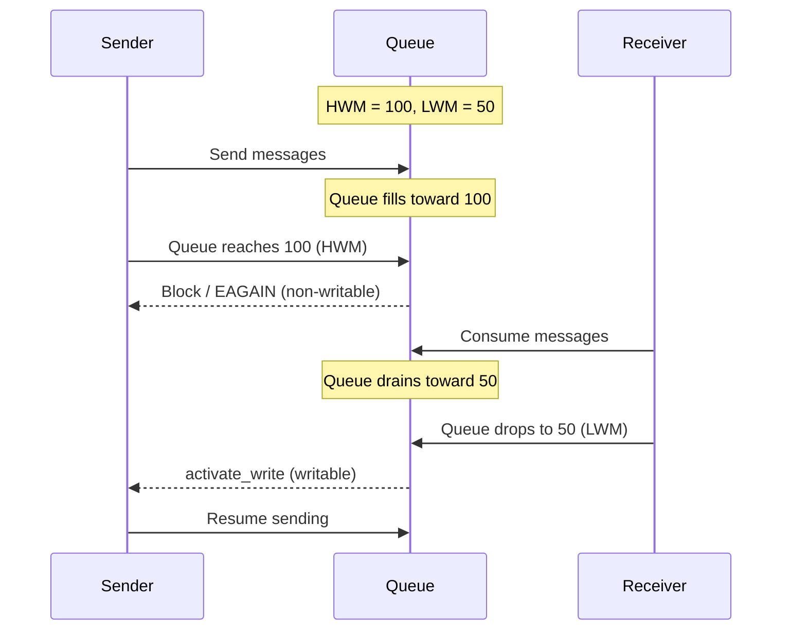

# Performance Characteristics and Tuning Guide

## 1. Performance Characteristics by Transport

| Transport | Relative Performance | Latency | Overhead | Recommended Use |
|-----------|-----------|---------|----------|-----------|
| inproc | ★★★★★ | Lowest | None | Inter-thread communication |
| ipc | ★★★★☆ | Low | System calls | Local inter-process |
| tcp | ★★★★☆ | Network | TCP stack | Server-to-server communication |
| ws | ★★★☆☆ | Network | WebSocket framing | Web clients |
| tls/wss | ★★★☆☆ | Network | Encryption + framing | When security is required |

### Overhead Analysis by Transport

```
inproc:  Lock-free pipe direct connection. No system calls.
ipc:     Unix domain socket. Bypasses TCP stack.
tcp:     TCP/IP stack. Nagle disabled to minimize latency.
ws:      tcp + WebSocket framing (2~14B header). Binary mode.
wss/tls: ws/tcp + TLS encryption. Handshake + record overhead.
```

## 2. I/O Thread Count Configuration Guide

=== "C"

    ```c
    void *ctx = zlink_ctx_new();
    zlink_ctx_set(ctx, ZLINK_IO_THREADS, 4);
    ```

=== "C++"

    ```cpp
    zlink::context_t ctx;
    ctx.set(zlink::context_option::io_threads, 4);
    ```

=== "Java"

    ```java
    var ctx = new Context();
    ctx.ioThreads(4);
    ```

=== "Python"

    ```python
    ctx = zlink.Context()
    ctx.set(zlink.ContextOption.IO_THREADS, 4)
    ```

=== "Node/TypeScript"

    ```typescript
    // Context options are set at the native layer;
    // the Node binding uses the default I/O thread count.
    const ctx = new zlink.Context();
    ```

=== "C#/.NET"

    ```csharp
    using var ctx = new Context();
    ctx.Options.IoThreads = 4;
    ```

=== "Rust"

    ```rust
    let ctx = zlink::Context::new()?;
    ctx.set_io_threads(4)?;
    ```

=== "Go"

    ```go
    ctx, _ := zlink.NewContext()
    ctx.SetIOThreads(4)
    ```

| I/O Threads | Recommended Use Case | Guideline |
|------------|---------------|------|
| 1 | Small-scale connections (<100), simple patterns | Uses 1 CPU core |
| 2 (default) | General use | Suitable for most scenarios |
| 4 | Large-scale connections, high throughput | 4+ CPU cores |
| Core count | Maximum throughput | Dedicated server |

### When to Increase I/O Threads

- When sockets x average message rate exceeds single-thread throughput
- When handling many concurrent network connections (>100)
- When heavily using transports with high framing overhead such as WS/WSS

### Notes

- I/O threads must be configured after context creation but **before** socket creation
- inproc transport does not use I/O threads (direct pipe connection)
- Excessively increasing I/O threads causes context switching overhead

## 3. HWM (High Water Mark) Configuration Guide

HWM limits the **per-connection queue size**. In zlink, each connection (pipe) has its own independent send and receive queue; HWM sets the maximum number of messages each queue can hold.

=== "C"

    ```c
    int hwm = 100;
    zlink_set_option(socket, ZLINK_OPT_SNDHWM, &hwm, sizeof(hwm));
    zlink_set_option(socket, ZLINK_OPT_RCVHWM, &hwm, sizeof(hwm));
    ```

=== "C++"

    ```cpp
    socket.set_option(zlink::sndhwm, 100);
    socket.set_option(zlink::rcvhwm, 100);
    ```

=== "Java"

    ```java
    socket.setOption(SocketOptions.SNDHWM, 100);
    socket.setOption(SocketOptions.RCVHWM, 100);
    ```

=== "Python"

    ```python
    socket.options.send_high_water_mark = 100
    socket.options.receive_high_water_mark = 100
    ```

=== "Node/TypeScript"

    ```typescript
    socket.options.sendHwm = 100;
    socket.options.recvHwm = 100;
    ```

=== "C#/.NET"

    ```csharp
    socket.CommonOptions.SendHighWaterMark = 100;
    socket.CommonOptions.ReceiveHighWaterMark = 100;
    ```

=== "Rust"

    ```rust
    socket.set_send_hwm(100)?;
    socket.set_recv_hwm(100)?;
    ```

=== "Go"

    ```go
    socket.SetSendHWM(100)
    socket.SetRecvHWM(100)
    ```

| Setting | Default | Description |
|------|--------|------|
| `ZLINK_OPT_SNDHWM` | 1000 | Maximum messages in each connection's send queue |
| `ZLINK_OPT_RCVHWM` | 1000 | Maximum messages in each connection's receive queue |

### Backpressure Behavior

When HWM is reached, behavior depends on the socket type and send flags:

- **Blocking send** (`flags=0`): `zlink_send()` blocks until space becomes available in the send queue. Use `ZLINK_OPT_SNDTIMEO` to limit the wait.
- **Non-blocking send** (`ZLINK_DONTWAIT`): Returns `EAGAIN` immediately. The application decides whether to retry, drop, or buffer externally.

> For detailed flow control patterns (DONTWAIT + send-ready handler), see
> [Send and Receive Flow Control](#4-send-and-receive-flow-control) below.

### Recovery Mechanism (LWM)

When the send queue reaches HWM, the connection's pipe becomes non-writable. Once the receiver consumes enough messages to drain the queue to or below the **Low Water Mark (LWM)**, an `activate_write` signal fires and the pipe becomes writable again.

LWM formula: **`(HWM + 1) / 2`**

At this point:
- Blocking `zlink_send()` calls resume.
- The send-ready handler fires (if installed).

This hysteresis (using different upper and lower thresholds to create a gap between state transitions) prevents rapid oscillation between writable and non-writable states.



### Practical HWM Recommendations

| Scenario | Recommended HWM | Rationale |
|----------|-----------------|-----------|
| Regular sockets/services | ~100 | Limits per-connection memory while absorbing bursts |
| STREAM (1000+ CCU) | ~10 | Caps total memory proportional to connection count |
| Default | 1000 | Sufficient for small-scale connections; adjust as connections grow |

### HWM Behavior by Socket Type

| Socket | Behavior When HWM Exceeded |
|------|-----------------|
| PUB | Messages **dropped** (slow subscriber protection) |
| DEALER | **Blocks** (default) or `EAGAIN` (`ZLINK_DONTWAIT`) |
| ROUTER | `EHOSTUNREACH` with `ROUTER_MANDATORY`, otherwise drops |
| PAIR | **Blocks** (default) or `EAGAIN` |

### Memory Calculation

Since HWM is per-connection, total memory is HWM × message size × connection count.

```
Estimated memory = SNDHWM × average_message_size × connection_count

Example 1: Regular service — HWM=100, message=1KB, connections=1000
           = 100 × 1KB × 1000 = ~100MB

Example 2: STREAM at scale — HWM=10, message=1KB, connections=10000
           = 10 × 1KB × 10000 = ~100MB
```

## 4. Send and Receive Flow Control

### 4.1 Send Backpressure

When a sender produces messages faster than the receiver can consume them,
messages accumulate in the send queue. The High Water Mark (HWM) limits
queue depth. What happens when HWM is reached depends on the socket type
and send flags (see [HWM Behavior by Socket Type](#hwm-behavior-by-socket-type) above).

#### Blocking Send (Default)

With `flags=0`, `zlink_send()` blocks until space becomes available in the
send queue. Use `ZLINK_OPT_SNDTIMEO` to limit how long the call blocks.

| SNDTIMEO | Behavior |
|---|---|
| -1 (default) | Block indefinitely |
| 0 | Return `EAGAIN` immediately (same as `ZLINK_DONTWAIT`) |
| N (ms) | Block up to N milliseconds, then return `EAGAIN` |

=== "C"

    ```c
    /* Block for at most 1 second */
    int timeout = 1000;
    zlink_set_option(socket, ZLINK_OPT_SNDTIMEO, &timeout, sizeof(timeout));

    zlink_msg_t part;
    zlink_msg_init_size(&part, size);
    memcpy(zlink_msg_data(&part), data, size);
    int rc = zlink_send(socket, &part, 1, 0);
    if (rc == -1 && zlink_errno() == EAGAIN) {
        /* Timed out — queue is still full */
        zlink_msg_close(&part);
    }
    ```

=== "C++"

    ```cpp
    /* Block for at most 1 second */
    socket.set_option(zlink::sndtimeo, 1000);

    zlink::message_t part(data, size);
    int rc = socket.send(part);
    if (rc == -1 && errno == EAGAIN) {
        /* Timed out -- queue is still full */
    }
    ```

=== "Java"

    ```java
    /* Block for at most 1 second */
    socket.setOption(SocketOptions.SNDTIMEO, 1000);

    var part = Message.copyOf(data);
    socket.send(part);  // throws on timeout
    ```

=== "Python"

    ```python
    # Block for at most 1 second
    socket.options.send_timeout_ms = 1000

    socket.send(zlink.Message.copy_from(data))
    # Raises ZlinkError(EAGAIN) on timeout
    ```

=== "Node/TypeScript"

    ```typescript
    /* Block for at most 1 second */
    socket.options.sendTimeout = 1000;

    socket.send(data);  // throws on timeout
    ```

=== "C#/.NET"

    ```csharp
    /* Block for at most 1 second */
    socket.CommonOptions.SendTimeout = TimeSpan.FromMilliseconds(1000);

    socket.Send(Message.FromBytes(data));  // throws on timeout
    ```

=== "Rust"

    ```rust
    /* Block for at most 1 second */
    socket.set_send_timeout(Duration::from_secs(1))?;

    socket.send(data)?;  // returns Err on timeout
    ```

=== "Go"

    ```go
    /* Block for at most 1 second */
    socket.SetSendTimeout(1000 * time.Millisecond)

    msg, _ := zlink.NewMessage(data)
    socket.Send(msg)  // returns error on timeout
    ```

#### Non-Blocking Send (DONTWAIT)

Pass `ZLINK_DONTWAIT` to return immediately with `EAGAIN` when the HWM is
reached. The application decides whether to retry, drop, or buffer
externally.

=== "C"

    ```c
    zlink_msg_t part;
    zlink_msg_init_size(&part, size);
    memcpy(zlink_msg_data(&part), data, size);
    int rc = zlink_send(socket, &part, 1, ZLINK_DONTWAIT);
    if (rc == -1 && zlink_errno() == EAGAIN) {
        /* HWM reached — handle backpressure */
        zlink_msg_close(&part);
    }
    ```

=== "C++"

    ```cpp
    zlink::message_t part(data, size);
    zlink::send_result_t result;
    int rc = socket.try_send(result, part);
    if (rc == 0 && result == zlink::send_result_t::backpressured) {
        /* HWM reached -- handle backpressure */
    }
    ```

=== "Java"

    ```java
    var part = Message.copyOf(data);
    SendResult result = socket.trySend(part);
    if (result == SendResult.BACKPRESSURED) {
        /* HWM reached -- handle backpressure */
    }
    ```

=== "Python"

    ```python
    result = socket.try_send(zlink.Message.copy_from(data))
    if result == zlink.SendResult.BACKPRESSURED:
        # HWM reached -- handle backpressure
        pass
    ```

=== "Node/TypeScript"

    ```typescript
    const result = socket.trySend(data);
    if (result === zlink.SendResult.Backpressured) {
      /* HWM reached -- handle backpressure */
    }
    ```

=== "C#/.NET"

    ```csharp
    var result = socket.TrySend(Message.FromBytes(data));
    if (result == SendResult.Backpressured)
    {
        /* HWM reached -- handle backpressure */
    }
    ```

=== "Rust"

    ```rust
    let result = socket.try_send(data)?;
    if result == SendResult::Backpressured {
        /* HWM reached -- handle backpressure */
    }
    ```

=== "Go"

    ```go
    msg, _ := zlink.NewMessage(data)
    result, _ := socket.TrySend(msg)
    if result == zlink.SendResultBackpressured {
        /* HWM reached -- handle backpressure */
    }
    ```

#### Send-Ready Handler (Event-Driven Backpressure)

`zlink_send_ready_handler()` installs a callback that fires
when the socket transitions from non-writable to writable. Combined with
`ZLINK_DONTWAIT`, this enables reactive flow control:

1. Send with `ZLINK_DONTWAIT`.
2. On `EAGAIN`, pause sending.
3. When the send-ready callback fires, resume sending.

This API works identically on all send-capable handles (raw sockets,
SPOT, SPOT Node). By default, send backpressure is detected via
poller `ZLINK_POLLOUT`. Once `zlink_send_ready_handler()` is registered,
readiness transitions are delivered through the callback instead, and
data-plane `ZLINK_POLLOUT` returns `EBUSY`.

**Behavior rules:**
- Can be called multiple times to replace the callback (previous handler is atomically overwritten).
- Passing `NULL` returns `EINVAL` — once registered, the handler cannot be removed, only replaced with another function.
- Cannot be replaced from within its own callback (`EDEADLK`). Outside the callback, replacement is free.
- After registration, data-plane poller `ZLINK_POLLOUT` returns `EBUSY`.

!!! note "C API definition -- each binding wraps this into its idiomatic type."

    ```c
    typedef struct {
        void *socket;
        const char *pending_data;
        size_t pending_size;
    } app_state_t;

    void on_send_ready(void *subject, void *userdata)
    {
        app_state_t *state = (app_state_t *)userdata;
        if (state->pending_data) {
            zlink_msg_t part;
            zlink_msg_init_size(&part, state->pending_size);
            memcpy(zlink_msg_data(&part), state->pending_data, state->pending_size);
            int rc = zlink_send(state->socket, &part, 1, ZLINK_DONTWAIT);
            if (rc >= 0)
                state->pending_data = NULL;
            else
                zlink_msg_close(&part);
            /* If still EAGAIN, callback will fire again on next transition */
        }
    }

    /* Install the handler */
    app_state_t state = { .socket = socket };
    zlink_send_ready_handler(socket, on_send_ready, &state);

    /* Send loop */
    zlink_msg_t part;
    zlink_msg_init_size(&part, size);
    memcpy(zlink_msg_data(&part), data, size);
    int rc = zlink_send(socket, &part, 1, ZLINK_DONTWAIT);
    if (rc == -1 && zlink_errno() == EAGAIN) {
        zlink_msg_close(&part);
        /* Buffer for retry when send-ready fires */
        state.pending_data = data;
        state.pending_size = size;
    }
    ```

### 4.2 Low Water Mark and Wake-Up

When the send queue reaches HWM, the socket becomes non-writable. It
transitions back to writable when the queue drains to the **low water
mark**, which is `(HWM + 1) / 2`. At this point:

- Blocking `zlink_send()` calls resume.
- The send-ready handler fires (if installed and armed).

This hysteresis prevents rapid oscillation between writable and
non-writable states.

### 4.3 Receive-Side Flow Control

The receive queue holds at most `ZLINK_OPT_RCVHWM` messages. When the
receiver's queue is full, pipe-level backpressure is applied to the
sender.

=== "C"

    ```c
    int hwm = 500;
    zlink_set_option(socket, ZLINK_OPT_RCVHWM, &hwm, sizeof(hwm));
    ```

=== "C++"

    ```cpp
    socket.set_option(zlink::rcvhwm, 500);
    ```

=== "Java"

    ```java
    socket.setOption(SocketOptions.RCVHWM, 500);
    ```

=== "Python"

    ```python
    socket.options.receive_high_water_mark = 500
    ```

=== "Node/TypeScript"

    ```typescript
    socket.options.recvHwm = 500;
    ```

=== "C#/.NET"

    ```csharp
    socket.CommonOptions.ReceiveHighWaterMark = 500;
    ```

=== "Rust"

    ```rust
    socket.set_recv_hwm(500)?;
    ```

=== "Go"

    ```go
    socket.SetRecvHWM(500)
    ```

In callback mode, a slow callback blocks the I/O thread, which causes the
receive queue to fill up. To avoid this, offload heavy work to a separate
thread:

=== "C"

    ```c
    void on_message(const zlink_routing_id_t *rid,
                    zlink_msg_t *parts, size_t part_count,
                    void *userdata)
    {
        /* BAD: slow processing blocks I/O thread */
        // heavy_computation(parts);

        /* GOOD: enqueue and return quickly */
        work_queue_push(userdata, parts, part_count);
    }
    ```

=== "C++"

    ```cpp
    socket.on_receive([&work_queue](const zlink::routing_id_t *rid,
                                    zlink_msg_t *parts,
                                    size_t part_count, void *) {
        /* BAD: slow processing blocks I/O thread */
        // heavy_computation(parts, part_count);

        /* GOOD: enqueue and return quickly */
        work_queue.push(parts, part_count);
    });
    ```

=== "Java"

    ```java
    socket.onReceive((routingId, parts) -> {
        /* BAD: slow processing blocks I/O thread */
        // heavyComputation(parts);

        /* GOOD: enqueue and return quickly */
        workQueue.add(parts);
    });
    ```

=== "Python"

    ```python
    def on_message(received):
        # BAD: slow processing blocks I/O thread
        # heavy_computation(received)

        # GOOD: enqueue and return quickly
        work_queue.put(received)

    socket.on_receive(on_message)
    ```

=== "Node/TypeScript"

    ```typescript
    socket.onReceive((routingId, parts) => {
      /* BAD: slow processing blocks I/O thread */
      // heavyComputation(parts);

      /* GOOD: enqueue and return quickly */
      workQueue.push({ routingId, parts });
    });
    ```

=== "C#/.NET"

    ```csharp
    socket.OnReceive((routingId, parts) =>
    {
        /* BAD: slow processing blocks I/O thread */
        // HeavyComputation(parts);

        /* GOOD: enqueue and return quickly */
        workQueue.Add(parts);
    });
    ```

=== "Rust"

    ```rust
    socket.on_receive(move |received| {
        /* BAD: slow processing blocks I/O thread */
        // heavy_computation(&received);

        /* GOOD: enqueue and return quickly */
        work_queue_tx.send(received).unwrap();
    })?;
    ```

=== "Go"

    ```go
    socket.OnReceive(func(routingID *zlink.RoutingID, parts []*zlink.Message) {
        /* BAD: slow processing blocks I/O thread */
        // heavyComputation(parts)

        /* GOOD: enqueue and return quickly */
        workQueue <- parts
    })
    ```

> For thread-safe work queue patterns, see
> [Thread-Safety Guide](11-thread-safety.md) section 6.

### 4.4 Callback vs Pull Mode

zlink sockets support two receive modes. The choice affects threading
and flow control behavior.

| | Callback Mode | Pull Mode |
|---|---|---|
| Trigger | Automatic on message arrival | Explicit `zlink_recv()` call |
| Execution thread | I/O thread | Application thread |
| Transition | One-way (permanent) | Default; unavailable after handler attach |
| DONTWAIT | N/A (always async) | Returns `EAGAIN` if no message |
| Multipart | All parts delivered as `parts[]` array | All parts returned via `parts_out` + `part_count_out` |

### 4.5 Complete Backpressure Example

A full example combining `ZLINK_DONTWAIT`, a send-ready handler, and an
application-level buffer:

=== "C"

    ```c
    #include <zlink.h>
    #include <string.h>
    #include <stdio.h>

    #define MAX_PENDING 1024

    typedef struct {
        void *socket;
        char *queue[MAX_PENDING];
        size_t sizes[MAX_PENDING];
        int head, tail, count;
    } sender_t;

    static void flush_queue(sender_t *s)
    {
        while (s->count > 0) {
            zlink_msg_t part;
            zlink_msg_init_size(&part, s->sizes[s->head]);
            memcpy(zlink_msg_data(&part), s->queue[s->head], s->sizes[s->head]);
            int rc = zlink_send(s->socket, &part, 1, ZLINK_DONTWAIT);
            if (rc == -1) {
                zlink_msg_close(&part);
                break; /* Still full — wait for next send-ready */
            }
            free(s->queue[s->head]);
            s->head = (s->head + 1) % MAX_PENDING;
            s->count--;
        }
    }

    static void on_send_ready(void *subject, void *userdata)
    {
        flush_queue((sender_t *)userdata);
    }

    int main(void)
    {
        void *ctx = zlink_ctx_new();
        void *socket = zlink_socket(ctx, ZLINK_DEALER);
        zlink_connect(socket, "tcp://127.0.0.1:5555");

        sender_t sender = { .socket = socket };
        zlink_send_ready_handler(socket, on_send_ready, &sender);

        for (int i = 0; i < 100000; i++) {
            char msg[64];
            int len = snprintf(msg, sizeof(msg), "msg-%d", i);

            zlink_msg_t part;
            zlink_msg_init_size(&part, len);
            memcpy(zlink_msg_data(&part), msg, len);
            int rc = zlink_send(socket, &part, 1, ZLINK_DONTWAIT);
            if (rc == -1 && zlink_errno() == EAGAIN) {
                zlink_msg_close(&part);
                /* Enqueue for later delivery */
                if (sender.count < MAX_PENDING) {
                    int idx = (sender.head + sender.count) % MAX_PENDING;
                    sender.queue[idx] = strdup(msg);
                    sender.sizes[idx] = len;
                    sender.count++;
                } else {
                    printf("Application buffer full — dropping message\n");
                }
            }
        }

        zlink_close(socket);
        zlink_ctx_term(ctx);
        return 0;
    }
    ```

=== "C++"

    ```cpp
    #include <zlink/context.hpp>
    #include <zlink/message_socket.hpp>
    #include <cstdio>
    #include <deque>
    #include <string>

    static constexpr int MAX_PENDING = 1024;

    struct sender_t {
        zlink::dealer_socket_t *socket;
        std::deque<std::string> queue;
    };

    static void flush_queue(sender_t &s)
    {
        while (!s.queue.empty()) {
            zlink::message_t part(s.queue.front().data(),
                                 s.queue.front().size());
            zlink::send_result_t result;
            int rc = s.socket->try_send(result, part);
            if (rc != 0 || result != zlink::send_result_t::sent)
                break; /* Still full -- wait for next send-ready */
            s.queue.pop_front();
        }
    }

    int main()
    {
        zlink::context_t ctx;
        zlink::dealer_socket_t socket(ctx);
        socket.connect("tcp://127.0.0.1:5555");

        sender_t sender{&socket};
        socket.on_send_ready(
          [](void *, void *ud) { flush_queue(*(sender_t *)ud); },
          &sender);

        for (int i = 0; i < 100000; i++) {
            auto msg = "msg-" + std::to_string(i);
            zlink::message_t part(msg.data(), msg.size());
            zlink::send_result_t result;
            int rc = socket.try_send(result, part);
            if (rc == 0 && result == zlink::send_result_t::backpressured) {
                if ((int)sender.queue.size() < MAX_PENDING)
                    sender.queue.push_back(msg);
                else
                    std::puts("Application buffer full -- dropping message");
            }
        }
        return 0;
    }
    ```

=== "Java"

    ```java
    import dev.kairoscode.zlink.*;
    import java.util.ArrayDeque;

    public class BackpressureExample {
        static final int MAX_PENDING = 1024;

        public static void main(String[] args) {
            try (var ctx = new Context()) {
                var socket = ctx.socket(SocketType.DEALER);
                socket.connect("tcp://127.0.0.1:5555");

                var queue = new ArrayDeque<Message>(MAX_PENDING);

                socket.onSendReady(() -> {
                    while (!queue.isEmpty()) {
                        SendResult r = socket.trySend(queue.peek());
                        if (r != SendResult.SENT) break;
                        queue.poll();
                    }
                });

                for (int i = 0; i < 100_000; i++) {
                    var part = Message.copyOfUtf8("msg-" + i);
                    SendResult r = socket.trySend(part);
                    if (r == SendResult.BACKPRESSURED) {
                        if (queue.size() < MAX_PENDING)
                            queue.add(part);
                        else
                            System.out.println("Application buffer full -- dropping");
                    }
                }
            }
        }
    }
    ```

=== "Python"

    ```python
    import zlink
    from collections import deque

    MAX_PENDING = 1024

    ctx = zlink.Context()
    socket = ctx.socket(zlink.DEALER)
    socket.connect("tcp://127.0.0.1:5555")

    queue = deque(maxlen=MAX_PENDING)

    def on_send_ready(sock):
        while queue:
            result = sock.try_send(queue[0])
            if result != zlink.SendResult.SENT:
                break
            queue.popleft()

    socket.on_send_ready(on_send_ready)

    for i in range(100_000):
        part = zlink.Message.copy_from(f"msg-{i}".encode())
        result = socket.try_send(part)
        if result == zlink.SendResult.BACKPRESSURED:
            if len(queue) < MAX_PENDING:
                queue.append(part)
            else:
                print("Application buffer full -- dropping message")

    socket.close()
    ctx.close()
    ```

=== "Node/TypeScript"

    ```typescript
    import * as zlink from 'zlink';

    const MAX_PENDING = 1024;
    const ctx = new zlink.Context();
    const socket = new zlink.DealerSocket(ctx);
    socket.connect('tcp://127.0.0.1:5555');

    const queue: Buffer[] = [];

    socket.onSendReady(() => {
      while (queue.length > 0) {
        const result = socket.trySend(queue[0]);
        if (result !== zlink.SendResult.Sent) break;
        queue.shift();
      }
    });

    for (let i = 0; i < 100_000; i++) {
      const msg = Buffer.from(`msg-${i}`);
      const result = socket.trySend(msg);
      if (result === zlink.SendResult.Backpressured) {
        if (queue.length < MAX_PENDING)
          queue.push(msg);
        else
          console.log('Application buffer full -- dropping message');
      }
    }

    socket.close();
    ctx.close();
    ```

=== "C#/.NET"

    ```csharp
    using Zlink;

    const int MaxPending = 1024;
    using var ctx = new Context();
    using var socket = new DealerSocket(ctx);
    socket.Connect("tcp://127.0.0.1:5555");

    var queue = new Queue<Message>(MaxPending);

    socket.OnSendReady(() =>
    {
        while (queue.Count > 0)
        {
            var result = socket.TrySend(queue.Peek());
            if (result != SendResult.Sent) break;
            queue.Dequeue();
        }
    });

    for (int i = 0; i < 100_000; i++)
    {
        var part = Message.FromString($"msg-{i}");
        var r = socket.TrySend(part);
        if (r == SendResult.Backpressured)
        {
            if (queue.Count < MaxPending)
                queue.Enqueue(part);
            else
                Console.WriteLine("Application buffer full -- dropping message");
        }
    }
    ```

=== "Rust"

    ```rust
    use std::collections::VecDeque;
    use zlink::{Context, SendResult};

    const MAX_PENDING: usize = 1024;

    fn main() -> Result<(), zlink::ZlinkError> {
        let ctx = Context::new()?;
        let mut socket = ctx.dealer_socket()?;
        socket.connect("tcp://127.0.0.1:5555")?;

        // Note: In Rust, the send-ready handler and the send loop
        // typically run on separate threads via SendHandle.
        let tx = socket.send_handle();

        socket.on_send_ready(move || {
            // Flush queued messages from an external buffer
        })?;

        for i in 0..100_000 {
            let msg = format!("msg-{i}");
            match socket.try_send(msg.as_bytes())? {
                SendResult::Sent => {}
                SendResult::Backpressured => {
                    println!("Backpressured at msg-{i} -- buffer externally");
                }
                _ => {}
            }
        }
        Ok(())
    }
    ```

=== "Go"

    ```go
    package main

    import (
        "fmt"
        "zlink"
    )

    const maxPending = 1024

    func main() {
        ctx, _ := zlink.NewContext()
        defer ctx.Close()
        socket, _ := ctx.DealerSocket()
        defer socket.Close()
        socket.Connect("tcp://127.0.0.1:5555")

        queue := make([]*zlink.Message, 0, maxPending)

        socket.OnSendReady(func() {
            for len(queue) > 0 {
                result, _ := socket.TrySend(queue[0])
                if result != zlink.SendResultSent {
                    break
                }
                queue = queue[1:]
            }
        })

        for i := 0; i < 100_000; i++ {
            msg, _ := zlink.NewMessage([]byte(fmt.Sprintf("msg-%d", i)))
            result, _ := socket.TrySend(msg)
            if result == zlink.SendResultBackpressured {
                if len(queue) < maxPending {
                    queue = append(queue, msg)
                } else {
                    fmt.Println("Application buffer full -- dropping message")
                }
            }
        }
    }
    ```

## 5. Socket Option Tuning Checklist

| Option | Default | Tuning Point |
|------|--------|-------------|
| `ZLINK_OPT_LINGER` | -1 (infinite) | Testing: 0, Production: 1000~5000ms |
| `ZLINK_OPT_SNDTIMEO` | -1 (infinite) | Set according to response time requirements |
| `ZLINK_OPT_RCVTIMEO` | -1 (infinite) | Set when used in polling loops |
| `ZLINK_OPT_SNDHWM` | 1000 | Adjust to match throughput |
| `ZLINK_OPT_RCVHWM` | 1000 | Adjust to match throughput |
| `ZLINK_OPT_MAXMSGSIZE` | -1 (unlimited) | Set for security on STREAM sockets |

### LINGER Setting

=== "C"

    ```c
    /* Test environment: terminate immediately */
    int linger = 0;
    zlink_set_option(socket, ZLINK_OPT_LINGER, &linger, sizeof(linger));

    /* Production: wait for unsent messages */
    int linger = 3000;  /* 3 seconds */
    zlink_set_option(socket, ZLINK_OPT_LINGER, &linger, sizeof(linger));
    ```

=== "C++"

    ```cpp
    /* Test environment: terminate immediately */
    socket.set_option(zlink::linger, 0);

    /* Production: wait for unsent messages */
    socket.set_option(zlink::linger, 3000);  // 3 seconds
    ```

=== "Java"

    ```java
    /* Test environment: terminate immediately */
    socket.setOption(SocketOptions.LINGER, 0);

    /* Production: wait for unsent messages */
    socket.setOption(SocketOptions.LINGER, 3000);  // 3 seconds
    ```

=== "Python"

    ```python
    # Test environment: terminate immediately
    socket.options.linger_ms = 0

    # Production: wait for unsent messages
    socket.options.linger_ms = 3000  # 3 seconds
    ```

=== "Node/TypeScript"

    ```typescript
    /* Test environment: terminate immediately */
    socket.options.linger = 0;

    /* Production: wait for unsent messages */
    socket.options.linger = 3000;  // 3 seconds
    ```

=== "C#/.NET"

    ```csharp
    /* Test environment: terminate immediately */
    socket.CommonOptions.Linger = TimeSpan.Zero;

    /* Production: wait for unsent messages */
    socket.CommonOptions.Linger = TimeSpan.FromMilliseconds(3000);
    ```

=== "Rust"

    ```rust
    /* Test environment: terminate immediately */
    socket.set_linger(Duration::ZERO)?;

    /* Production: wait for unsent messages */
    socket.set_linger(Duration::from_secs(3))?;
    ```

=== "Go"

    ```go
    /* Test environment: terminate immediately */
    socket.SetLinger(0)

    /* Production: wait for unsent messages */
    socket.SetLinger(3000 * time.Millisecond)
    ```

### Timeout Settings

=== "C"

    ```c
    /* Send timeout: EAGAIN after 1 second */
    int timeout = 1000;
    zlink_set_option(socket, ZLINK_OPT_SNDTIMEO, &timeout, sizeof(timeout));

    /* Receive timeout: EAGAIN after 500ms */
    int timeout = 500;
    zlink_set_option(socket, ZLINK_OPT_RCVTIMEO, &timeout, sizeof(timeout));
    ```

=== "C++"

    ```cpp
    /* Send timeout: EAGAIN after 1 second */
    socket.set_option(zlink::sndtimeo, 1000);

    /* Receive timeout: EAGAIN after 500ms */
    socket.set_option(zlink::rcvtimeo, 500);
    ```

=== "Java"

    ```java
    /* Send timeout: EAGAIN after 1 second */
    socket.setOption(SocketOptions.SNDTIMEO, 1000);

    /* Receive timeout: EAGAIN after 500ms */
    socket.setOption(SocketOptions.RCVTIMEO, 500);
    ```

=== "Python"

    ```python
    # Send timeout: EAGAIN after 1 second
    socket.options.send_timeout_ms = 1000

    # Receive timeout: EAGAIN after 500ms
    socket.options.receive_timeout_ms = 500
    ```

=== "Node/TypeScript"

    ```typescript
    /* Send timeout: EAGAIN after 1 second */
    socket.options.sendTimeout = 1000;

    /* Receive timeout: EAGAIN after 500ms */
    socket.options.recvTimeout = 500;
    ```

=== "C#/.NET"

    ```csharp
    /* Send timeout: EAGAIN after 1 second */
    socket.CommonOptions.SendTimeout = TimeSpan.FromMilliseconds(1000);

    /* Receive timeout: EAGAIN after 500ms */
    socket.CommonOptions.ReceiveTimeout = TimeSpan.FromMilliseconds(500);
    ```

=== "Rust"

    ```rust
    /* Send timeout: EAGAIN after 1 second */
    socket.set_send_timeout(Duration::from_secs(1))?;

    /* Receive timeout: EAGAIN after 500ms */
    socket.set_recv_timeout(Duration::from_millis(500))?;
    ```

=== "Go"

    ```go
    /* Send timeout: EAGAIN after 1 second */
    socket.SetSendTimeout(1000 * time.Millisecond)

    /* Receive timeout: EAGAIN after 500ms */
    socket.SetRecvTimeout(500 * time.Millisecond)
    ```

## 6. How to Measure Performance

### Basic Throughput Measurement

=== "C"

    ```c
    #include <time.h>

    int count = 100000;
    struct timespec start, end;
    clock_gettime(CLOCK_MONOTONIC, &start);

    for (int i = 0; i < count; i++) {
        zlink_msg_t part;
        zlink_msg_init_size(&part, size);
        memcpy(zlink_msg_data(&part), data, size);
        zlink_send(socket, &part, 1, 0);
    }

    clock_gettime(CLOCK_MONOTONIC, &end);
    double elapsed = (end.tv_sec - start.tv_sec) +
                     (end.tv_nsec - start.tv_nsec) / 1e9;

    printf("Throughput: %.2f msg/s\n", count / elapsed);
    printf("Throughput: %.2f MB/s\n", (count * size) / elapsed / 1e6);
    ```

=== "C++"

    ```cpp
    #include <chrono>
    #include <cstdio>

    int count = 100000;
    auto start = std::chrono::steady_clock::now();

    for (int i = 0; i < count; i++) {
        zlink::message_t part(data, size);
        socket.send(part);
    }

    auto end = std::chrono::steady_clock::now();
    double elapsed = std::chrono::duration<double>(end - start).count();

    std::printf("Throughput: %.2f msg/s\n", count / elapsed);
    std::printf("Throughput: %.2f MB/s\n", (count * size) / elapsed / 1e6);
    ```

=== "Java"

    ```java
    int count = 100_000;
    long start = System.nanoTime();

    for (int i = 0; i < count; i++) {
        socket.send(Message.copyOf(data));
    }

    long end = System.nanoTime();
    double elapsed = (end - start) / 1e9;

    System.out.printf("Throughput: %.2f msg/s%n", count / elapsed);
    System.out.printf("Throughput: %.2f MB/s%n", (count * size) / elapsed / 1e6);
    ```

=== "Python"

    ```python
    import time

    count = 100_000
    start = time.monotonic()

    for _ in range(count):
        socket.send(zlink.Message.copy_from(data))

    elapsed = time.monotonic() - start

    print(f"Throughput: {count / elapsed:.2f} msg/s")
    print(f"Throughput: {count * size / elapsed / 1e6:.2f} MB/s")
    ```

=== "Node/TypeScript"

    ```typescript
    const count = 100_000;
    const start = process.hrtime.bigint();

    for (let i = 0; i < count; i++) {
      socket.send(data);
    }

    const end = process.hrtime.bigint();
    const elapsed = Number(end - start) / 1e9;

    console.log(`Throughput: ${(count / elapsed).toFixed(2)} msg/s`);
    console.log(`Throughput: ${(count * size / elapsed / 1e6).toFixed(2)} MB/s`);
    ```

=== "C#/.NET"

    ```csharp
    int count = 100_000;
    var sw = System.Diagnostics.Stopwatch.StartNew();

    for (int i = 0; i < count; i++)
        socket.Send(Message.FromBytes(data));

    sw.Stop();
    double elapsed = sw.Elapsed.TotalSeconds;

    Console.WriteLine($"Throughput: {count / elapsed:F2} msg/s");
    Console.WriteLine($"Throughput: {count * size / elapsed / 1e6:F2} MB/s");
    ```

=== "Rust"

    ```rust
    use std::time::Instant;

    let count = 100_000;
    let start = Instant::now();

    for _ in 0..count {
        socket.send(data)?;
    }

    let elapsed = start.elapsed().as_secs_f64();

    println!("Throughput: {:.2} msg/s", count as f64 / elapsed);
    println!("Throughput: {:.2} MB/s", (count * size) as f64 / elapsed / 1e6);
    ```

=== "Go"

    ```go
    count := 100_000
    start := time.Now()

    for i := 0; i < count; i++ {
        msg, _ := zlink.NewMessage(data)
        socket.Send(msg)
    }

    elapsed := time.Since(start).Seconds()

    fmt.Printf("Throughput: %.2f msg/s\n", float64(count)/elapsed)
    fmt.Printf("Throughput: %.2f MB/s\n", float64(count*size)/elapsed/1e6)
    ```

### Latency Measurement (Ping-Pong)

=== "C"

    ```c
    /* Client: send ping, measure until pong arrives in callback */
    clock_gettime(CLOCK_MONOTONIC, &start);
    zlink_msg_t ping;
    zlink_msg_init_size(&ping, 4);
    memcpy(zlink_msg_data(&ping), "ping", 4);
    zlink_send(socket, &ping, 1, 0);

    /* Handler callback receives "pong" reply and records end time */
    void on_pong(const zlink_routing_id_t *source_rid,
                 zlink_msg_t *parts, size_t part_count, void *userdata)
    {
        clock_gettime(CLOCK_MONOTONIC, &end);
        double rtt_us = ((end.tv_sec - start.tv_sec) * 1e6 +
                         (end.tv_nsec - start.tv_nsec) / 1e3);
        printf("RTT: %.1f us\n", rtt_us);
        for (size_t i = 0; i < part_count; i++)
            zlink_msg_close(&parts[i]);
    }
    ```

=== "C++"

    ```cpp
    /* Client: send ping, measure until pong arrives in callback */
    auto start = std::chrono::steady_clock::now();
    zlink::message_t ping("ping", 4);
    socket.send(ping);

    /* Handler callback receives "pong" reply and records end time */
    socket.on_receive([&start](const zlink::routing_id_t *,
                               zlink_msg_t *parts, size_t count, void *) {
        auto end = std::chrono::steady_clock::now();
        double rtt_us = std::chrono::duration<double, std::micro>(
                            end - start).count();
        std::printf("RTT: %.1f us\n", rtt_us);
        zlink_multipart_close(parts, count);
    });
    ```

=== "Java"

    ```java
    /* Client: send ping, measure until pong arrives in callback */
    long start = System.nanoTime();
    socket.send(Message.copyOfUtf8("ping"));

    /* Handler callback receives "pong" reply and records end time */
    socket.onReceive((routingId, parts) -> {
        long end = System.nanoTime();
        double rttUs = (end - start) / 1e3;
        System.out.printf("RTT: %.1f us%n", rttUs);
    });
    ```

=== "Python"

    ```python
    import time

    # Client: send ping, measure until pong arrives in callback
    start = time.monotonic()
    socket.send(zlink.Message.copy_from(b"ping"))

    # Handler callback receives "pong" reply and records end time
    def on_pong(received):
        end = time.monotonic()
        rtt_us = (end - start) * 1e6
        print(f"RTT: {rtt_us:.1f} us")

    socket.on_receive(on_pong)
    ```

=== "Node/TypeScript"

    ```typescript
    /* Client: send ping, measure until pong arrives in callback */
    const start = process.hrtime.bigint();
    socket.send(Buffer.from('ping'));

    /* Handler callback receives "pong" reply and records end time */
    socket.onReceive((routingId, parts) => {
      const end = process.hrtime.bigint();
      const rttUs = Number(end - start) / 1e3;
      console.log(`RTT: ${rttUs.toFixed(1)} us`);
    });
    ```

=== "C#/.NET"

    ```csharp
    /* Client: send ping, measure until pong arrives in callback */
    var sw = System.Diagnostics.Stopwatch.StartNew();
    socket.Send(Message.FromString("ping"));

    /* Handler callback receives "pong" reply and records end time */
    socket.OnReceive((routingId, parts) =>
    {
        sw.Stop();
        double rttUs = sw.Elapsed.TotalMicroseconds;
        Console.WriteLine($"RTT: {rttUs:F1} us");
    });
    ```

=== "Rust"

    ```rust
    use std::time::Instant;

    /* Client: send ping, measure until pong arrives in callback */
    let start = Instant::now();
    socket.send(b"ping")?;

    /* Handler callback receives "pong" reply and records end time */
    socket.on_receive(move |_received| {
        let rtt_us = start.elapsed().as_micros();
        println!("RTT: {} us", rtt_us);
    })?;
    ```

=== "Go"

    ```go
    /* Client: send ping, measure until pong arrives in callback */
    start := time.Now()
    msg, _ := zlink.NewMessage([]byte("ping"))
    socket.Send(msg)

    /* Handler callback receives "pong" reply and records end time */
    socket.OnReceive(func(routingID *zlink.RoutingID, parts []*zlink.Message) {
        rttUs := float64(time.Since(start).Microseconds())
        fmt.Printf("RTT: %.1f us\n", rttUs)
    })
    ```

## 7. Performance Checklist

### Basic Configuration

- [ ] Set I/O thread count to match workload
- [ ] Adjust HWM to match expected throughput
- [ ] Set LINGER appropriately (testing: 0, production: timeout)

### Message Optimization

- [ ] Leverage VSM for small messages (≤33B) (inline storage)
- [ ] Use zero-copy (`zlink_msg_init_data`) for large messages
- [ ] For constant/static payloads, use `zlink_msg_init_data(..., NULL, NULL)` carefully
- [ ] Avoid unnecessary `zlink_msg_copy()` calls

### Transport Optimization

- [ ] Use inproc/ipc for local communication
- [ ] Use tcp for internal communication that does not require encryption
- [ ] Consider performance characteristics by message size when using WS/WSS

### Monitoring

- [ ] Use the monitoring API to check connection status during performance bottlenecks
- [ ] Detect slow subscribers (in PUB/SUB environments)
- [ ] Observe HWM saturation frequency

> For details on internal optimization mechanisms such as speculative I/O and gather write, see [architecture.md](../internals/architecture.md).

---
[← Message API](09-message-api.md) | [Thread-Safety →](11-thread-safety.md)
