[English](./spot-internals.md) | [한국어](./spot-internals.ko.md)

# SPOT / SpotNode 내부 아키텍처

이 문서는 core 유지보수자가 SPOT 내부 배선과 데이터 흐름을 빠르게 파악하도록
돕는 내부 문서다. 공개 API 계약은
[`doc/spec/core/service/spot.ko.md`](../spec/core/service/spot.ko.md)를 기준으로
본다.

## 0. SPOT이 무엇이며 왜 이렇게 설계되었는가

SPOT은 zlink의 **서비스 레이어**다. raw socket 위에서 topic publish/subscribe,
routed request/reply, Actor 기반 session dispatch를 하나의 통합 런타임으로 제공한다.

### 0.1 설계 목표

| 목표 | 구현 선택 |
|------|-----------|
| **Spot별 물리 소켓 없음** | 모든 transport 소켓은 `SpotNode`가 소유한다. `Spot` facade는 logical queue와 dispatch context만 가진다. |
| **명시적 입장 허용(admission) 경계** | public publish와 routed send는 `SpotNode` 소유 send-side queue(`publish_ingress_queue`, `routed_send_queue`)에 enqueue한다. 소켓 HWM 계산과 admission 결정이 분리되어, 내부 소켓 배선이 public API 오류 의미를 오염시키지 않는다. relay·delivery 소켓은 HWM `0`을 사용해 숨은 per-peer 큐 상한이 disconnect/drop 결정을 내리지 못하게 한다. |
| **data-plane thread 전용 소켓** | `mesh-pub`, `fanout`, `external-router`는 `SpotNode` 전용 data-plane thread만 접근한다. public thread가 이 소켓을 직접 만질 수 없어 소유권이 분산되지 않는다. |
| **집계 구독** | 원격 mesh 구독은 Spot 단위가 아니라 node 단위로 reference-count한다. 여러 local Spot이 같은 topic을 구독해도 원격에는 중복 구독이 전달되지 않는다. |
| **Actor-Spot 분리** | Actor는 소켓이나 inproc(프로세스 내 통신) 엔드포인트를 소유하지 않는다. part는 SpotNode Actor table을 거쳐 Spot의 logical queue에 디스패치되므로, transport 연결을 끊지 않고도 Actor가 Spot 사이를 이동(join)할 수 있다. |
| **결정론적 종료** | `Spot` facade를 destroy해도 backing `SpotNode`가 자동으로 종료되지 않는다. Entry Spot 수명은 facade가 아니라 `SpotNode`에 귀속된다. |

### 0.2 핵심 개념

- **SpotNode**: lifecycle owner. transport 소켓, 피어 배선, Actor table을 소유한다.
- **Spot**: `SpotNode` 위에서 빌려 쓰는 데이터 평면 facade. 같은 logical Spot을 가리키는
  facade가 여러 개 존재할 수 있으며, 모두 같은 underlying queue를 공유한다.
- **Entry Spot**: `SpotNode`당 하나, 자동 생성된다. 새로 만들어진 Actor는 여기서 시작한다.
  애플리케이션은 Entry Spot에 dispatch handler를 등록해 초기 session 처리, 인증, Actor 라우팅
  결정을 수행한다.
- **Actor**: `SpotNode` Actor table이 관리하는 routing target. `zlink_actor_ref_t`(node rid +
  actor id + generation)로 식별된다. socket ownership 없음.
- **data-plane thread**: `SpotNode`당 하나의 전용 OS 스레드. `mesh-pub`, `fanout`,
  `external-router` 소켓을 단독으로 소유하고, send-side 큐를 drain하며, local
  fanout과 remote routing을 수행한다.
- **dispatch worker pool**: `SpotNode`당 하나의 worker pool. data-plane 스레드가 post한
  readable event를 꺼내 애플리케이션 dispatch 콜백을 실행한다. Spot별 콜백 직렬화를
  보장한다.

### 0.3 문서 구성

| 절 | 주제 |
|----|------|
| §1 | 런타임 컴포넌트 개요 |
| §2 | mode별 내부 socket 토폴로지 |
| §3–4 | topic·routed 데이터 평면 |
| §5 | send-side queue와 admission |
| §6 | Admission HWM |
| §7 | Control plane |
| §8 | Data-plane thread와 dispatch worker pool |
| §9–10 | Actor dispatch 모델과 Entry Spot 큐 소유권 |
| §11 | socket 제거 모델 배경 |
| §12 | STREAM session과 Actor binding 시퀀스 |
| §13–14 | 내부 자료구조와 Actor join lifecycle |

## 1. 전체 구조

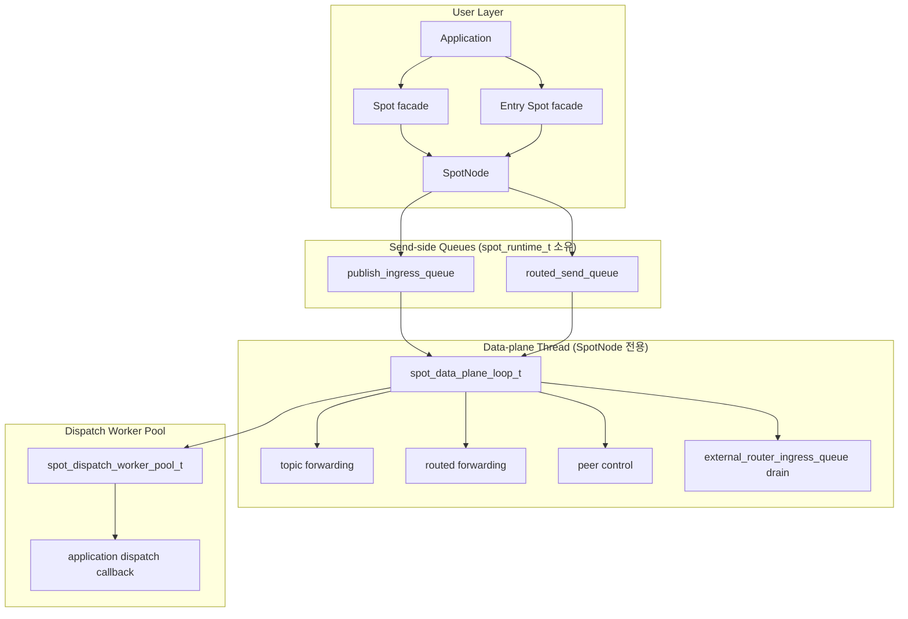

`SpotNode`는 lifecycle owner이고, `Spot`은 그 위에서 빌려 쓰는 데이터 평면
facade다. `Spot`을 닫아도 backing `SpotNode`는 자동으로 닫히지 않는다.

`Spot` facade는 물리 socket을 소유하지 않는다. 모든 transport socket은
`SpotNode`가 소유하며, `Spot`은 logical dispatch queue와 dispatch event context만
가진다. `Entry Spot`은 `SpotNode`당 하나이며 `SpotNode`가 소유한다. `Entry Spot`
facade는 application이 `zlink_spot_node_entry_spot()`으로 얻어서 사용하고,
`zlink_spot_destroy()`로 닫는다.

## 2. 내부 소켓 토폴로지

SpotNode는 mode에 필요한 socket 묶음만 만든다.

| mode | 생성되는 주요 plane |
|------|---------------------|
| `PUBSUB` | topic publish/subscribe, peer control |
| `ROUTED` | routed delivery, peer control |
| `ALL` | topic, routed, peer control |

꺼진 plane은 snapshot 호출이나 꺼진 API의 첫 호출로도 생성되지 않는다.

### 2.1 주요 소켓

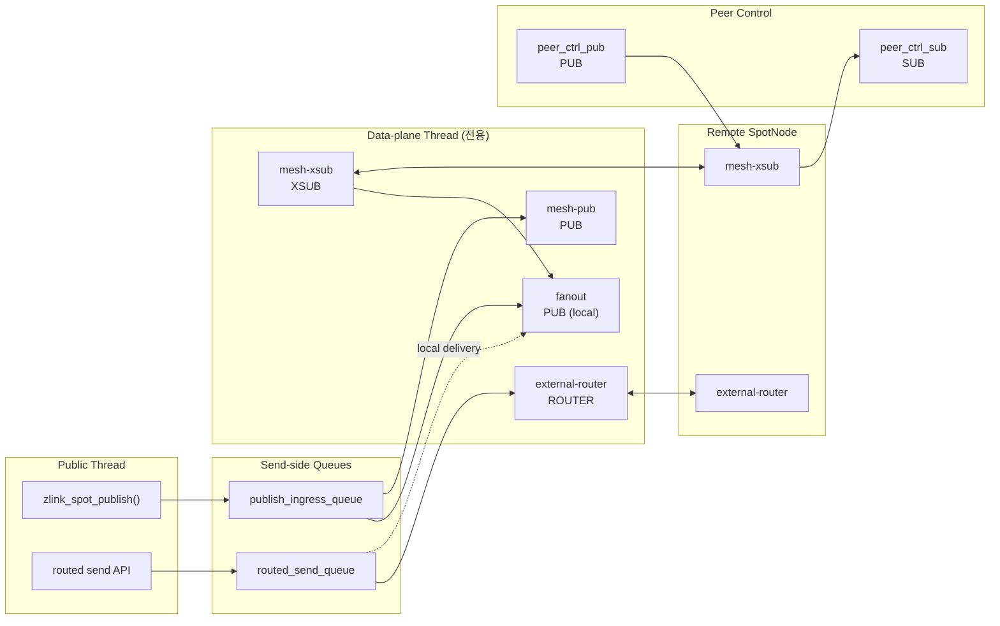

| 소켓 | 타입 | 역할 | HWM 정책 |
|------|------|------|----------|
| `fanout` | `PUB` | 같은 node 안의 subscriber로 local fanout | SNDHWM 0 |
| `mesh-pub` | `PUB` | remote node로 topic publish 전파 | pubsub admission SNDHWM (auto-HWM 또는 override) |
| `mesh-xsub` | `XSUB` | remote node에서 topic publish 수신 | pubsub admission RCVHWM |
| `external-router` | `ROUTER` | peer node와 routed frame 송수신 | router admission HWM (auto-HWM 또는 override) |
| `peer_ctrl_pub` | `PUB` | peer control 송신 | control 기본값 |
| `peer_ctrl_sub` | `SUB` | peer control 수신 | control 기본값 |

`pub-ingress-tx`, `ingress-sub`, `internal-router`, `internal-router-tx`는 제거되었다.
이 socket들이 담당하던 staging 역할은 `publish_ingress_queue`와 `routed_send_queue`가
대체한다. `zlink_spot_node_internal_sockets_snapshot()`은 이 4개의 row를 더 이상
반환하지 않는다. perf의 `Auto-HWM spotnode` 표도 이에 맞게 갱신되었다.

## 3. Topic plane

topic plane은 local과 remote 모두 socket의 기본 subscription filter를 사용한다.
runtime은 publish 시점에 target index를 조회하지 않는다.

public publish는 `publish_ingress_queue`에 owned message entry를 넣고 즉시 반환한다.
data-plane thread가 queue를 drain하면서 local fanout(`fanout` socket)과 remote mesh
publish(`mesh-pub` socket)를 수행한다.

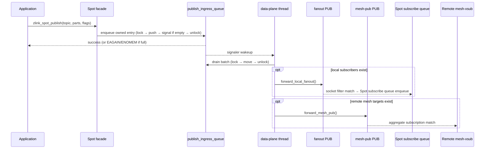

local subscriber의 실제 topic matching은 `fanout` PUB socket의 `SUBSCRIBE` 상태가
맡는다. remote 전달의 matching은 peer node의 `mesh-xsub` aggregate subscription
상태가 맡는다.

### 3.1 Aggregate subscription 수명

runtime은 remote mesh에 반영할 node 단위 구독 수명을 따로 관리한다.

| 상태 | 자료구조 | 의미 |
|------|----------|------|
| exact topic | `topic -> refcount` | 같은 exact topic을 원하는 local subscriber 수 |
| prefix | `prefix -> refcount` | 같은 prefix를 원하는 local subscriber 수 |

규칙은 단순하다.

1. refcount가 `0 -> 1`이 될 때만 remote aggregate subscribe를 보낸다.
2. refcount가 `1 -> 0`이 될 때만 remote aggregate unsubscribe를 보낸다.
3. 중간 증가와 감소는 local 상태만 바꾸며 remote mesh에는 중복 명령을 보내지 않는다.

이 규칙 때문에 같은 node 안의 여러 `Spot`이 같은 topic을 구독해도 remote peer에는
하나의 node 대표 구독만 보인다.

## 4. Routed plane

routed plane은 `external-router` 한 축으로 고정된다.

| router | 범위 | 역할 |
|--------|------|------|
| `external-router` | node 간 | peer node의 `external-router`와 ROUTER 링크로 송수신 |

`internal-router`는 제거되었다. local routed delivery는 `routed_send_queue`를 통해
data-plane thread가 직접 target `Spot`의 routed recv queue에 전달한다.

### 4.1 Outbound routed send (local 및 remote)

public routed send는 local target이든 remote target이든 모두 `routed_send_queue`에
owned entry를 enqueue한다. target이 local인지 remote인지는 data-plane이 dequeue 후
결정한다.

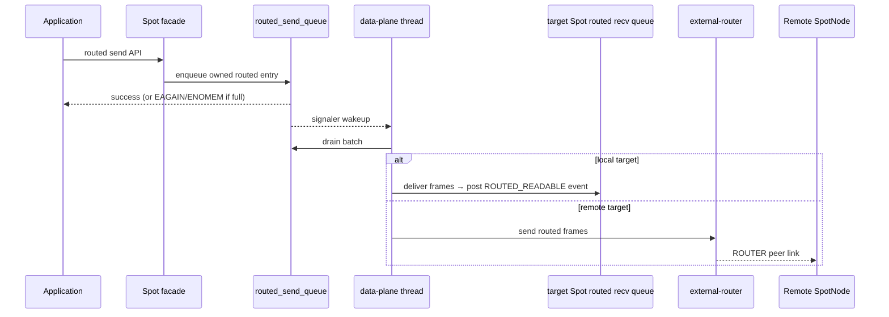

### 4.2 Inbound routed traffic (external_router_ingress_queue)

피어에서 들어오는 inbound routed frame은 `external-router` 소켓의 msg dispatch
콜백을 통해 `external_router_ingress_queue`에 enqueue된다. data-plane 스레드가
`drain_runtime_external_router_ingress_queue()`로 이를 처리하고 target `Spot` routed
recv 큐에 delivery한다. inbound 경로는 `routed_send_queue`를 거치지 않는다.

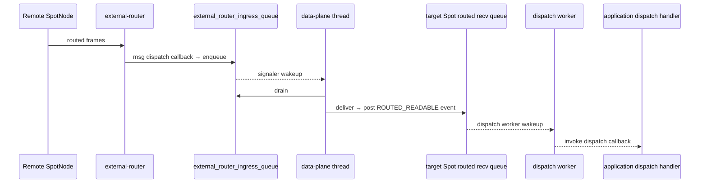

remote routed delivery는 peer별 external route id map을 사용한다. 이 map은
`spot_runtime_t` 내부 메서드를 통해서만 갱신한다. 호출자는 map 구조나 lock 규칙을
알 필요가 없다.

## 5. Send-side queue와 admission

public publish와 routed send의 첫 동작은 socket send가 아니라 queue enqueue다.

### 5.1 Queue 구조

`spot_data_plane_runtime_state_t` 내부에 세 개의 queue가 있다.

| Queue | 소유자 | 방향 | 역할 |
|-------|--------|------|------|
| `publish_ingress_queue` | `spot_data_plane_runtime_state_t` | outbound | public publish → data-plane forwarding |
| `routed_send_queue` | `spot_data_plane_runtime_state_t` | outbound | public routed send → data-plane forwarding |
| `external_router_ingress_queue` | `spot_data_plane_runtime_state_t` | inbound | peer `external-router` recv → routed delivery |

`publish_ingress_queue`와 `routed_send_queue`는 public 스레드가 쓰고 data-plane
스레드가 읽는 MPSC 구조다. `external_router_ingress_queue`는 `external-router`
소켓의 msg dispatch 콜백이 쓰고 data-plane 스레드가 읽는 구조다.

### 5.2 Backpressure와 hysteresis

`publish_ingress_queue`와 `routed_send_queue`는 byte 기반 soft limit와
`backpressure_active` 플래그로 동작한다.

| 상황 | 결과 |
|------|------|
| 여유 있음 | enqueue 성공, queue가 비어 있었으면 signaler로 data-plane thread 깨움 |
| 가득 참 + `ZLINK_DONTWAIT` | `EAGAIN` |
| 가득 참 + blocking | `condition_variable`에서 drain 또는 timeout 대기 |
| shutdown 진행 중 | `ESHUTDOWN` |
| 메모리 할당 실패 | `ENOMEM` |

배압(backpressure)은 이력 현상(hysteresis)으로 동작한다. hard limit 도달 시
`backpressure_active = true`로 바꾸고, data-plane이 queue를 절반 이하로 drain하면
`cv.broadcast()`로 대기 중인 sender를 깨운다. 이력 현상은 한계에 근접한 상태에서
on/off가 반복되는 채터링을 방지한다.

`send-ready callback`(`zlink_send_ready_handler()`)과 `ZLINK_POLLOUT`은 send-side
큐 입장 허용과 연결된다. 큐가 resume limit 이하로 내려가면 armed(등록된)
send-ready 콜백이 호출된다. 이 의미는 "transport 소켓이 쓰기 가능하다"가
아니라 "SPOT send 입장 허용을 다시 시도할 가치가 있다"다.

### 5.3 Drain 순서

data-plane loop는 매 iteration마다 다음 순서로 처리한다.

```text
1. drain_runtime_external_router_ingress_queue()   // inbound peer traffic
2. drain_publish_ingress_queue()                   // public publish entries
3. drain_runtime_routed_send_queue()               // public routed send entries
4. flush_mesh_pub_pending()                        // staged mesh messages
5. flush_local_fanout_pending()                    // staged local messages
6. flush_staged_messages()                         // ingress → staged overflow
```

batch 한도는 메시지 2048개 또는 16 MiB 바이트 중 먼저 도달하는 쪽이다.
이 한도는 queue drain만 하느라 peer control과 mesh subscription 처리가 굶기지
않도록 한다.

### 5.4 Queue 한도 계산

queue 한도는 기존 `SpotNode` admission HWM 계산 결과를 slot 수 기준으로 따른다.
별도 public option은 없다.

| 값 | 계산 |
|----|------|
| publish `admission_slots` | `ZLINK_SPOT_NODE_OPT_PUBSUB_HWM` override 또는 auto-HWM pubsub admission |
| routed `admission_slots` | `ZLINK_SPOT_NODE_OPT_ROUTER_HWM` override 또는 auto-HWM router admission |
| byte limit | `admission_slots * message_unit_bytes` (메모리 보호용 보조 한도) |

queue full이 자주 보이면 queue 한도를 먼저 키우지 않는다. data-plane thread의
drain 지연, local fanout / mesh-pub `EAGAIN`, `external-router` pending이 병목인지
먼저 확인한다.

## 6. Admission HWM

SpotNode는 admission HWM 설정만 공개한다. 이 설정은 send-side queue 한도와
transport socket HWM 양쪽에 적용된다.

| 옵션 | admission 경로 | 기본 동작 |
|------|----------------|-----------|
| `ZLINK_SPOT_NODE_OPT_PUBSUB_HWM_PROFILE` | topic publish admission | balanced auto-HWM profile |
| `ZLINK_SPOT_NODE_OPT_PUBSUB_HWM` | topic publish admission 숫자 override | 양수 값, `0`은 auto-HWM 복귀 |
| `ZLINK_SPOT_NODE_OPT_ROUTER_HWM_PROFILE` | routed admission | balanced auto-HWM profile |
| `ZLINK_SPOT_NODE_OPT_ROUTER_HWM` | routed admission 숫자 override | 양수 값, `0`은 auto-HWM 복귀 |

숫자 override가 없으면 SpotNode data-path socket은 공통 auto-HWM planner를
사용한다. balanced profile은 일반 routed socket과 같은 수열을 만든다. 1024 B
이하의 작은 메시지는 HWM `1024`, 64 KiB 메시지는 HWM `16`, 128 KiB 메시지는
HWM `8`, 256 KiB 메시지는 HWM `4`를 사용한다. peer control socket은 이
admission 묶음에 포함되지 않으며 control-plane HWM을 유지한다.

relay socket(`fanout`, `mesh-pub` SNDHWM = 0)과 delivery socket은 HWM `0`을
사용한다. 이렇게 해야 SPOT 내부의 숨은 per-peer 또는 per-target 큐 제한이 메시지
손실이나 연결 종료를 결정하지 않는다.

SPOT publish 큐 계획은 fanout이 커져도 per-connection admission HWM을 낮추지
않는다.

perf `Auto-HWM spotnode` 상세 표에서는 `mesh-pub`와 `mesh-xsub` 및 `external-router`
에만 admission HWM이 보인다. `pub-ingress-tx`, `ingress-sub`, `internal-router`,
`internal-router-tx` row는 존재하지 않는다.

## 7. Control plane

peer control plane은 data plane과 분리된 작은 메시지 흐름이다. 주요 목적은 아래와
같다.

- peer bootstrap 정보 전달
- ready 상태 refresh
- aggregate subscription replay
- peer 연결 상태 반영

control socket은 데이터 payload HWM 계산과 별도 메시지 단위를 사용할 수 있다. perf
표에서 같은 payload 크기 블록 안에 다른 `MsgUnit(B)` 값이 보이면 control plane과
data plane 기준이 다르기 때문이다.

## 8. Data-plane thread와 dispatch worker pool

### 8.1 Data-plane thread

`SpotNode`마다 하나의 전용 OS 스레드(`spot_runtime_t::data_plane_thread`)가
`spot_data_plane_loop_t::run_until_shutdown()`을 실행한다. 이 스레드는 아래를 독점한다.

- `mesh-pub`, `fanout`, `external-router`, `mesh-xsub`, `peer_ctrl_pub`,
  `peer_ctrl_sub` 소켓
- `publish_ingress_queue`, `routed_send_queue`, `external_router_ingress_queue` drain
- local fanout delivery, remote mesh publish, inbound/outbound routed forwarding

public 스레드는 이 소켓들에 직접 접근하지 않는다. 이 경계를 지키지 않으면 소켓
소유권, poller 관심사, shutdown 순서가 public 호출 경로와 섞인다.

```
공개 불변식:
  public 스레드는 mesh-pub, fanout, external-router를 직접 send/recv하지 않는다.
  data-plane 스레드는 애플리케이션 dispatch 콜백을 직접 호출하지 않는다.
```

data-plane 스레드 loop는 poller와 signaler(FD)를 함께 사용한다. 세 큐의
signaler FD가 poller에 등록되어 있어, 어느 큐든 empty→non-empty 전환이 생기면
즉시 wakeup된다. idle tick은 100 ms(`data_plane_idle_tick_ms`)다.

service-data runtime periodic task 의존이 완전히 제거되어 있다. SPOT data-plane
실행 스케줄은 `SpotNode` 전용 스레드에서만 결정된다.

### 8.2 Dispatch worker pool

`spot_runtime_t::dispatch_workers`(`spot_dispatch_worker_pool_t`)는 애플리케이션
dispatch 콜백을 실행하는 worker pool이다.

data-plane 스레드는 애플리케이션 콜백을 직접 호출하지 않는다. 대신 target
`Spot state`가 ready 상태가 되면 `post_dispatch_event(void* spot_)`으로 pool에
알린다. pool은 coalescing 방식으로 `_queued` set에 Spot 포인터를 관리해 같은 Spot
이 중복으로 쌓이지 않게 한다.

```cpp
// spot_dispatch_worker_pool_t 주요 필드
std::deque<void*>              _ready;    // drain 대기 Spot 포인터
std::unordered_set<void*>      _queued;   // 이미 ready queue에 있는 Spot (중복 방지)
std::unordered_set<void*>      _active;   // 현재 worker가 실행 중인 Spot
std::unordered_set<void*>      _dirty;    // callback 종료 후 재확인 필요한 Spot
```

Spot별 직렬화: 같은 Spot은 동시에 worker 하나만 처리한다. 콜백이 끝난 뒤
`_dirty`에 unread event가 남아 있으면 다시 `_ready`에 넣는다.

worker 수 계산:

```text
cpu_count = max(1, hardware_concurrency)
default_min = min(2, cpu_count)
default_max = max(1, cpu_count)
idle_timeout = 1000 ms (내부 상수)
```

| 옵션 | 기본값 | 의미 |
|------|--------|------|
| `ZLINK_SPOT_NODE_OPT_DISPATCH_WORKERS_MIN` | `min(2, cpu_count)` | 항상 유지할 worker 수 |
| `ZLINK_SPOT_NODE_OPT_DISPATCH_WORKERS_MAX` | `max(1, cpu_count)` | burst 때 늘릴 수 있는 최대 worker 수 |

data-plane 스레드가 직접 콜백을 실행하지 않는 이유:

1. 애플리케이션 콜백이 다시 SPOT send/recv를 호출할 때 재진입 위험
2. 콜백이 오래 걸리면 `mesh-pub`, `external-router` flush가 멈춤
3. `ZLINK_POLLOUT`과 send-ready 콜백도 dispatch 축이어서 data-plane loop와 섞이면
   readiness와 forwarding 순서가 깨짐

## 9. Actor dispatch 내부 모델

Actor는 SpotNode가 관리하는 routing target이다. public pointer 핸들은 없고,
`zlink_actor_ref_t`가 Actor를 식별한다. Actor는 소켓, inproc 엔드포인트, transport
엔드포인트를 소유하지 않는다. STREAM session에서 Actor로 relay되는 part는 target
SpotNode의 Actor table을 거쳐 Actor의 **unread state** — 즉
`zlink_spot_node_actor_recv_part()`로 아직 꺼내지 않은 part 큐 — 에 들어간다.

각 Actor는 **joined Spot**(= current Spot)을 가진다. 이 Spot의 dispatch context가
해당 Actor에 대한 `ACTOR_READABLE` 이벤트를 받는다. 새로 생성된 Actor의
joined Spot은 항상 Entry Spot이다. join 프로토콜(§14)이 완료될 때까지 Entry Spot이
current Spot으로 남는다.

새로 만들어진 Actor의 current Spot은 항상 Entry Spot이다. Actor가 user Spot으로 join하기 전까지는 Entry Spot dispatch context에서 Actor 메시지를 처리한다.

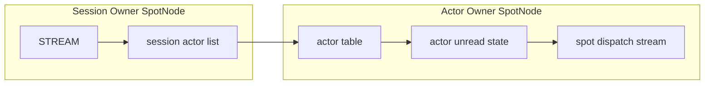

session actor list는 session routing id마다 별도로 존재한다. 각 entry는 Actor id와
concrete Actor ref를 저장한다. unchecked ref로 bind를 시도하더라도 attach가 성공하면
session entry에는 실제 generation이 들어간다. session owner는 joined Spot 상태를
저장하지 않는다. joined 상태는 Actor owner table과 snapshot에서만 관리한다.

local Actor relay와 remote Actor relay는 같은 Actor table 의미를 사용한다. 차이는
target SpotNode가 같은 프로세스 안에 있는지, peer SpotNode로 routed control을 거쳐야
하는지뿐이다. target Actor가 사라진 뒤 remote relay가 도착하면 target node에서 part를
버릴 수 있다. 이미 sender 쪽에서 성공한 submit 결과는 그 뒤에 바뀌지 않는다.

### 9.1 Actor table 상태

Actor table row는 아래 상태를 함께 가진다.

| 상태 | 의미 |
|------|------|
| Actor ref | node rid, Actor id, generation |
| joined Spot rid | Actor가 현재 속한 Spot. 생성 직후에는 Entry Spot |
| bound session ref | Actor가 attach된 STREAM session |
| unread state | 아직 `zlink_spot_node_actor_recv_part()`로 읽지 않은 part |
| pending join | Spot이 아직 reply하지 않은 join request |
| route synced | active route가 현재 Actor ref를 가리키는지 여부 |

Actor destroy는 joined 상태, bound session detach, 진행 중인 multipart relay를 먼저
확인한다. detach를 완료할 수 없거나 timeout이 발생하면 Actor slot과 unread state를
호출 전 상태로 유지한다.

### 9.2 Dispatch event

Actor unread state에 읽을 part가 생기고 Actor가 Spot에 join되어 있으면 Spot dispatch
stream에 `ACTOR_READABLE` readiness가 올라간다. event subject는 콜백 수명 동안만 유효한
`const zlink_actor_ref_t *`다. pending join request가 생기면 Spot dispatch stream에
`ACTOR_JOIN_READABLE` readiness가 올라간다.

readiness(수신 준비 상태)는 메시지 개수와 1:1로 대응하지 않는다. dispatch 콜백은
각 drain API가 `NO_DATA`를 반환할 때까지 비우는 방식으로 동작해야 하며, 내부는 같은
Actor에 대해 part 순서를 유지한다.

### 9.3 Active route publish

Actor active route는 Actor 생성 시점이나 Spot join 시점에 publish하지 않는다.
Actor owner SpotNode의 Discovery에서 Actor route sync가 켜져 있고 STREAM bind가
성공한 시점에 publish한다. unbind와 session disconnect cleanup은 active route를
제거하지 않는다. active route가 가리키는 Actor가 destroy되면 route cleanup을 수행한다.

## 10. Entry Spot과 Spot queue 소유권

`Spot` facade는 물리 socket을 직접 만들지 않는다. `SpotNode`가 소유한 transport
socket에서 demux한 메시지가 대상 `Spot`의 logical queue로 들어온다. `Spot`이
소유하는 것은 아래와 같다.

- routed ingress dispatch queue
- subscribe ingress dispatch queue
- channel reply dispatch queue
- timer event queue
- Actor unread staging queue

backpressure 기준은 `SpotNode` transport socket의 admission HWM이다. Spot 내부
queue에는 별도 HWM이나 크기 한계를 두지 않는다.

`Entry Spot`은 `SpotNode`당 하나다. `SpotNode` 생성 시 자동으로 만들어지고,
`SpotNode` destroy 전까지 살아 있다. application은 `zlink_spot_node_entry_spot()`으로
facade를 얻어 dispatch handler를 등록한다. Actor 생성 직후 session relay message가
도착하면 Entry Spot의 dispatch queue에서 `ACTOR_READABLE` readiness가 올라간다.

user Spot의 logical state는 마지막 facade가 닫힐 때 제거된다. 단 joined Actor나
pending join request가 남아 있으면 마지막 facade close는 `ZLINK_CLOSE_BUSY`로 실패한다.
Entry Spot logical state는 facade reference count와 무관하게 `SpotNode`가 소유한다.

## 11. Spot socket 제거 모델

기존 구조에서 `Spot` facade 또는 side handle이 per-Spot socket을 직접 만들고 inproc
socket을 queue처럼 쓰는 부분이 있었다. `SpotNode`가 메시지를 한 번 받아서 logical
`Spot`으로 중계하는 구조에서는 per-Spot socket HWM으로 dispatch 상태를 표현하는
방식이 맞지 않는다. HWM은 `SpotNode`가 소유한 transport socket admission에 두고,
per-Spot queue는 이미 받은 입력을 어느 dispatch context에서 처리할지 정하는 staging
상태로만 다룬다.

목표 구조는 아래와 같다.

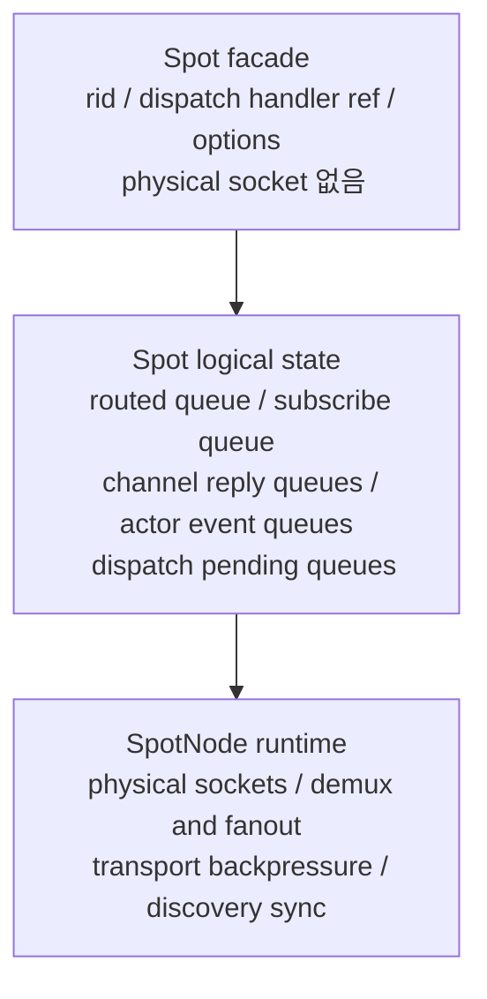

`Spot` facade는 `spot_pub_t`, `spot_sub_t`, routed receive socket 같은 물리 socket을
직접 갖지 않는다. `Spot`이 필요한 것은 logical state에 대한 reference다.

## 12. STREAM session과 Actor binding

session owner node와 Actor owner node는 같거나 다를 수 있다. 내부 처리 경로가 다르지만
공개 API는 동일하다.

### 12.1 Local Actor binding (co-located)

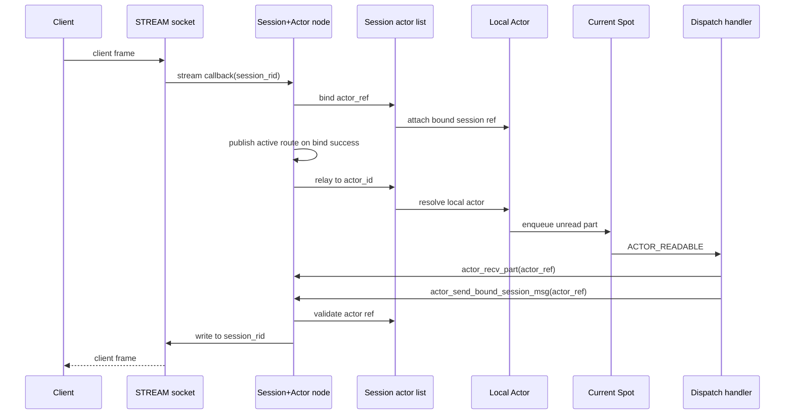

local Actor는 bind, relay, Actor-to-session send가 같은 node 안에서 끝난다.
Actor socket이나 Actor별 inproc endpoint가 생기지 않는다.

### 12.2 Remote Actor binding (split deployment)

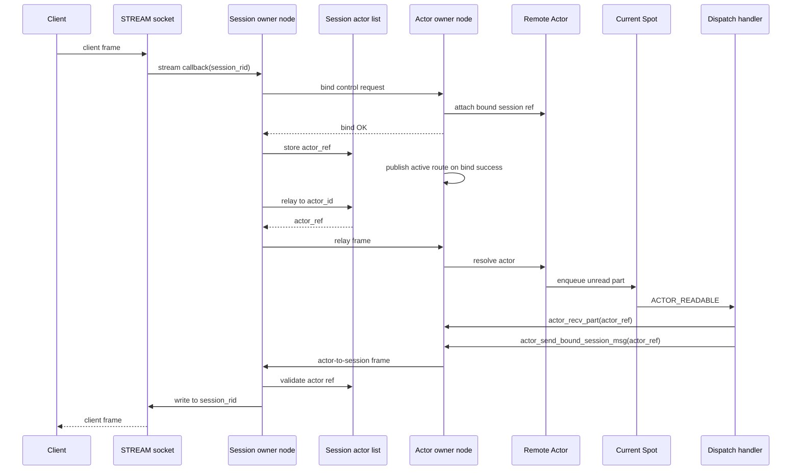

remote Actor는 bind control request, session-to-Actor relay frame, Actor-to-session
frame이 node 사이를 지난다. session owner는 Actor의 joined Spot을 저장하지 않는다.
Actor owner는 STREAM session application state를 저장하지 않는다.

bound session disconnect와 remote join handoff가 겹치면 session Actor list
compare-and-swap 성공 여부가 기준이다. 성공 전 disconnect는 source Actor를 Entry Spot으로
돌리는 abort이고, 성공 뒤 disconnect는 target Actor의 Entry Spot cleanup이다.

### 12.3 원격 bind 에러 경로

| 조건 | 결과 |
|------|------|
| Actor owner node 도달 불가 | `bind control request` 미전달. session owner는 timeout 후 bind failure를 반환한다. `g_session_bindings`에 항목이 기록되지 않는다 |
| bind control request 중간 timeout | session owner는 bind failure로 처리한다. timeout 통지를 받은 target node는 부분적으로 생성된 Actor table 상태를 롤백한다 |
| `actor_ref` stale (generation 불일치) | target node가 bind control request를 거부한다. session owner는 `INVALID_HANDLE`을 받는다. Actor table 항목이 생성되지 않는다 |
| bind 완료 전 session disconnect | session owner의 session rid 항목이 이미 제거되었으므로 `g_session_bindings` CAS가 실패한다. bind가 중단되고 target node의 Actor state가 정리된다 |

## 13. Transport logical queue 내부 데이터 구조

이 섹션은 transport logical queue 구현의 핵심 내부 구조를 정리한다. 공개 계약이
아니며, 구현 세부 사항은 이후 변경될 수 있다.

### 13.1 Spot logical queue (`spot_logical_state_t`)

`spot_logical_state_t`는 `Spot` facade(`spot_handle_t`)가 `shared_ptr`로 공유하는
logical state다. Entry Spot은 `spot_node_handle_state_t.entry_spot`이 소유하고,
user Spot은 `spots_by_rid` map에 보관한다.

pubsub 관련 필드:

| 필드 | 타입 | 역할 |
|------|------|------|
| `subscribe_queue` | `deque<shared_ptr<spot_logical_pubsub_message_t>>` | SpotNode에서 demux된 pubsub 메시지 |
| `subscribe_signaler` | `signaler_t` | dispatch를 깨우는 edge-triggered signaler |
| `subscribe_signal_armed` | `bool` | 중복 신호 방지용 arming 플래그 |
| `request_reply_state` | `shared_ptr<spot_request_reply_state_t>` | routed send/recv 및 channel reply 상태 |

`spot_logical_pubsub_message_t`는 한 pubsub 메시지의 모든 part를 담는다.

```
struct spot_logical_pubsub_message_t {
    zlink_routing_id_t source_rid;
    std::string service_name;
    std::string topic_id;
    std::vector<std::string> parts;
};
```

### 13.2 Actor unread queue (`actor_handle_t`)

`actor_handle_t`는 `SpotNode` actor table의 각 row에 해당한다. `spot_node_actor_state_t`
안의 `actors_by_id` map이 소유한다.

| 필드 | 타입 | 역할 |
|------|------|------|
| `queue` | `deque<queued_actor_part_t>` | STREAM relay로 받은 아직 읽지 않은 part |
| `joined_spot_state` | `shared_ptr<spot_logical_state_t>` | 현재 속한 Spot 상태 |
| `generation` | `uint64_t` | Actor ref generation (stale ref 검증) |
| `bound_session_node` | `spot_node_t*` | session owner node |
| `bound_stream` | `void*` | 연결된 STREAM socket handle |
| `pending_remote_join` | `bool` | remote join prepare 진행 중 여부 |

`queued_actor_part_t`는 단일 part의 소유권 wrapper다. move-only semantics다.

| 필드 | 타입 | 역할 |
|------|------|------|
| `part` | `zlink_msg_t` | message body |
| `info` | `zlink_actor_recv_info_t` | source session 정보 (node rid, session rid, actor ref) |
| `part_flag` | `zlink_part_flag_t` | `ZLINK_PART_MORE` 또는 `ZLINK_PART_FINAL` |
| `owns` | `bool` | part 소유 여부 (move 후 false) |

### 13.3 Join request queue (`g_join_queues`)

join request는 `service_spot_actor_api.cpp`의 global mutex(`g_actor_mutex`)로
보호되는 `g_join_queues`에 저장된다.

```
g_join_queues: map<spot_logical_state_t*, deque<queued_join_request_t*>>
```

key는 target Spot의 `spot_logical_state_t` 포인터다. 같은 Spot에 여러 join request가
pending 중일 수 있으며, FIFO 순서로 `zlink_spot_actor_join_recv()`로 drain한다.

`queued_join_request_t` 주요 필드:

| 필드 | 타입 | 역할 |
|------|------|------|
| `actor` | `actor_handle_t*` | join을 요청한 source Actor |
| `spot_state` | `shared_ptr<spot_logical_state_t>` | target Spot logical state |
| `join_epoch` | `uint64_t` | join sequence (timeout/중복 검증용) |
| `replied` | `bool` | reply 완료 여부 |
| `pending_target` | `actor_handle_t*` | remote join prepare에서 생성한 target Actor |
| `remote` | `bool` | remote join handoff 여부 |
| `message` | `zlink_msg_t` | join payload (source가 소유권 이전) |
| `reply` | `zlink_msg_t` | reply payload (target이 소유권 이전) |

`g_live_join_requests`는 현재 pending 중인 모든 join request set이고,
`g_retired_join_requests`는 timeout/cleanup이 완료되기를 기다리는 set이다.

### 13.4 Signaler와 dispatch 연결

pubsub dispatch는 edge-triggered signaler로 동작한다.

```
subscribe_queue에 입력 추가
→ subscribe_signal_armed == false이면 subscribe_signaler.send()
→ subscribe_signal_armed = true 설정
→ poller가 subscribe_signaler fd를 감지해 SUBSCRIBE_READABLE 전달
→ drain 완료 후 subscribe_signal_armed = false 재설정 (다음 입력 대비)
```

Actor readable dispatch는 `actor_handle_t.joined_spot_state`의 dispatch handler에
`ACTOR_READABLE` readiness를 직접 올린다. subject는 콜백 수명 동안만 유효한
`const zlink_actor_ref_t*`다.

Actor join dispatch는 `g_join_queues`에 request가 추가될 때 target Spot dispatch
handler에 `ACTOR_JOIN_READABLE` readiness를 올린다. subject는 target Spot facade다.

### 13.5 Global 상태 목록

`service_spot_actor_api.cpp`이 관리하는 주요 global 상태.
**아래 항목은 별도로 명시하지 않는 한 모두 `g_actor_mutex`로 보호된다.**

| 전역 변수 | 타입 | 역할 |
|-----------|------|------|
| `g_actor_mutex` | `timed_mutex` | 나머지 모든 항목을 보호하는 단일 전역 잠금. 테이블 변경이 일어나는 동안만 보유하고, I/O 대기 중에는 해제한다 |
| `g_nodes_by_rid` | `map<string, spot_node_t*>` | node rid → SpotNode 역방향 조회. `SpotNode` 생성 시 추가, destroy 시 제거 |
| `g_join_queues` | `map<spot_logical_state_t*, deque<...>>` | Spot별 pending join request. join 요청 enqueue 시 추가, reply 또는 cleanup 시 제거 |
| `g_known_spots` | `set<spot_handle_t*>` | live Spot facade 추적. use-after-free 핸들 검증에 사용 |
| `g_session_bindings` | `map<string, session_binding_t>` | session rid → Actor binding. remote join commit의 compare-and-swap 트랜잭션 지점 |
| `g_active_routes` | `map<string, zlink_actor_route_t>` | actor id → Discovery에 게시된 active route |
| `g_live_join_requests` | `set<queued_join_request_t*>` | 현재 pending join. timeout 스윕에 사용 |
| `g_retired_join_requests` | `set<queued_join_request_t*>` | completion frame 전달 확인 뒤 cleanup 대기 join |
| `g_actor_protocol_drop_count` | `uint64_t` | protocol 오류(stale ref, unknown actor id 등)로 drop된 relay frame 누적 카운터. relay 손실 진단에 활용 |

**초기화**: 이 전역들은 정적 저장 기간(static storage duration)을 가지므로 프로그램
시작 시 기본 초기화된다. 별도의 init 호출은 없다. 첫 `SpotNode` 생성 시
`g_nodes_by_rid`에 첫 항목이 추가되는데, 모든 쓰기와 경합 가능한 읽기에서 mutex를
잡기 때문에 race window가 없다.

**Lock 범위**: I/O 스레드 경계를 넘는 blocking 호출(예: Mailbox reply 대기) 중에는
`g_actor_mutex`를 보유해서는 안 된다. 두 SpotNode 인스턴스에 걸친 Actor table 변경과
join 큐 변경은 전체 compound 연산에 대해 mutex를 한 번만 잡아 직렬화된다.

## 14. Actor join 내부 lifecycle

이 섹션은 Actor join 요청이 SpotNode 내부에서 어떻게 처리되는지 상세히 설명한다.
STREAM session 연결 흐름은 §12를 본다. 공개 join 계약은
[`doc/spec/core/service/spot.ko.md`](../spec/core/service/spot.ko.md)의 Actor 계약 절을 본다.

### 14.1 Local join 내부 순서

local join은 같은 `SpotNode` 안에서 Actor의 current Spot만 바꾼다. accept가 이루어지기 전까지
source Spot이 Actor의 current Spot으로 남는다. accept 처리와 current Spot 교체는 같은
`SpotNode` critical section 또는 event-loop turn 안에서 수행한다. Entry Spot이 아닌
target Spot으로 join하려면 source Actor에 bound STREAM session ref가 있어야 한다.

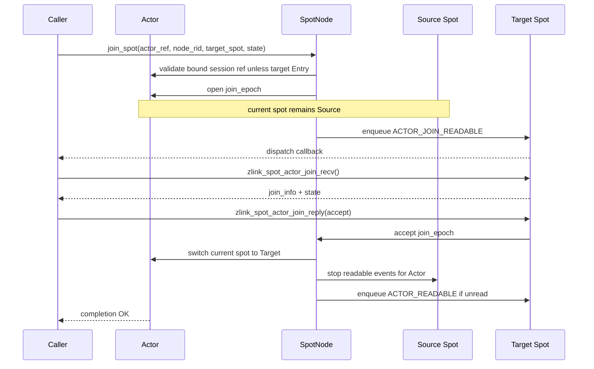

reject 또는 timeout이면 current Spot 교체 단계는 실행되지 않는다. Actor는 source Spot에
남고, target Spot에 전달된 join state payload는 reply 또는 timeout 처리 뒤 폐기된다.

local join 원자성 규칙:

- accept 전까지 source Spot이 current Spot이다.
- accept 처리와 current Spot 교체는 같은 critical section 또는 event-loop turn 안에서 수행한다.
- accept 뒤에는 source Spot으로 새 `ACTOR_READABLE` event를 올리지 않는다.
- reject, timeout, target Spot destroy, `SpotNode` shutdown은 source Spot을 유지한다.

### 14.2 Remote join 내부 순서

remote join은 source node의 Actor를 target node의 target Spot으로 넘기는 handoff다.
현재 구현은 같은 process 안에 등록된 source/target `SpotNode` 사이에서 이 의미를 수행한다.
process 경계를 지나는 network control frame, session Actor list compare-and-swap, retry 가능한
`JoinOp` 정리는 후속 범위다.

`JoinOp`은 source node에서 생성하며 아래 상태를 보존한다.

| 필드 | 의미 |
|------|------|
| `join_epoch` | join sequence number (timeout, 중복, stale replay 검증) |
| `source_actor_ref` | source node와 Actor ref |
| `target_actor_ref` | target node와 pending Actor ref |
| `target_node_rid` / `target_spot_rid` | 목표 node와 Spot |
| `bound_session_ref` | session owner와 session rid |
| `completion_handler` | request owner의 `zlink_reply_handler_fn` |
| `reply_path` | join reply를 request owner로 전달하는 경로 |

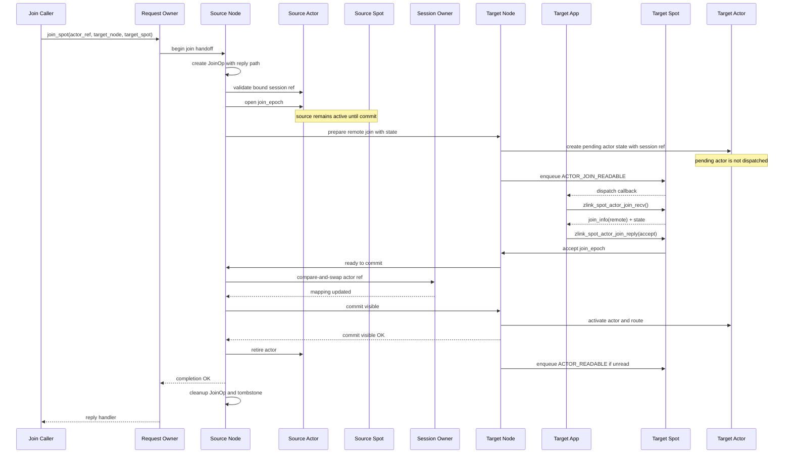

remote join 원자성 규칙:

- source Actor는 commit 전까지 source node와 source Spot에서 active 상태다.
- target node는 prepare 단계에서 pending Actor state를 만들 수 있지만, 이 Actor는
  dispatch되지 않고 active route도 publish하지 않는다.
- target Spot이 accept해도 source Actor는 아직 source Spot에서 제거되지 않는다.
- source Actor는 session Actor list compare-and-swap이 성공하고, target Actor activate와
  active route 갱신이 끝난 뒤 source Spot에서 제거되고 retired 상태가 된다.
- commit 성공 뒤 session owner node의 session Actor list와 active route는 target node
  Actor ref를 가리킨다.
- `JoinOp` cleanup은 request owner completion frame 전달이 확정된 뒤 수행한다.
- source Actor retire와 target activate는 join epoch로 fence한다. stale relay, stale join
  reply, 늦게 도착한 control message는 epoch가 맞을 때만 적용한다.

### 14.3 Abort 경로

target Spot이 reject하거나 timeout, prepare 실패, target shutdown이 발생하면 handoff를
중단한다.

- source Actor는 source Spot에서 active 상태를 유지한다.
- target pending Actor state와 payload reference는 폐기한다.
- active route는 이동하지 않는다.

bound session disconnect와 remote join handoff가 겹치면 session Actor list
compare-and-swap 성공 여부가 기준이다.

- **성공 전 disconnect**: source Actor를 source Spot에서 Entry Spot으로 돌리는 abort다.
  target pending Actor state와 payload reference는 폐기한다.
- **성공 뒤 disconnect**: target Actor가 canonical Actor다. commit visible 절차를 끝낸 뒤
  target node의 disconnect cleanup이 target Actor를 Entry Spot으로 이동하고 bound session
  ref를 제거한다. source Actor는 다시 active 상태로 돌아가지 않는다.
