[English](spot-internals.md) | [한국어](spot-internals.ko.md)

# SPOT / SpotNode 내부 아키텍처

이 문서는 core 유지보수자가 SPOT의 내부 연결 구조와 데이터 흐름을 빠르게 파악하도록
돕는 내부 문서다. 공개 API 계약은
[`doc/spec/core/service/spot.ko.md`](../api/spot.ko.md)를 기준으로
삼는다.

## 0. SPOT이 무엇이며 왜 이렇게 설계되었는가

SPOT은 zlink의 **service 계층**이다. raw socket 위에서 토픽 발행/구독(pub/sub),
routed request/reply, Actor 기반 session dispatch를 하나의 통합 런타임으로 제공한다.

### 0.1 설계 목표

| 목표 | 구현 선택 |
|------|-----------|
| **Spot별 물리 소켓 없음** | 모든 transport socket은 `SpotNode`가 소유한다. `Spot` 핸들은 논리 큐(logical queue)와 dispatch 컨텍스트만 가진다. |
| **명시적 admission 경계** | 공개 발행과 routed 전송은 `SpotNode`가 소유한 송신 큐(`publish_ingress_queue`, `routed_send_queue`)에 쌓는다. 소켓 HWM 계산과 받아들일지 말지(admission) 판단을 분리해, 내부 소켓 배선이 공개 API의 오류 의미를 더럽히지 않게 한다. `fanout`은 HWM `0`을 쓰고, 원격 mesh 소켓은 auto-HWM을 쓰되 연결 수 bucket으로 peer별 pipe 예산만 줄인다. 공개 API의 backpressure 의미는 node 단위 송신 큐가 정한다. |
| **data plane 스레드 전용 소켓** | `mesh-pub`, `fanout`, `external-router`는 `SpotNode` 전용 data plane 스레드만 접근한다. 공개 스레드는 이 소켓을 직접 건드릴 수 없어 소유권이 흩어지지 않는다. |
| **집계 구독(aggregate subscription)** | 원격 mesh 구독은 Spot 단위가 아니라 node 단위로 reference count한다. 여러 로컬 Spot이 같은 토픽을 구독해도 원격에는 중복 구독이 전달되지 않는다. |
| **Actor-Spot 분리** | Actor는 socket이나 inproc(프로세스 내 통신) endpoint를 소유하지 않는다. 메시지 한 조각(part)은 SpotNode의 Actor table을 거쳐 Spot의 논리 큐로 dispatch되므로, 연결을 끊지 않고도 Actor가 Spot 사이를 옮겨 다닐(join) 수 있다. |
| **결정론적 종료** | `Spot` 핸들을 파괴(destroy)해도 그 뒤를 받치는 `SpotNode`가 자동으로 종료되지는 않는다. Entry Spot의 수명은 핸들이 아니라 `SpotNode`에 묶인다. |

### 0.2 핵심 개념

- **SpotNode**: 수명(lifecycle)을 책임지는 주체. transport socket, peer 연결, Actor table을 소유한다.
- **Spot**: 실제 소켓이나 큐를 직접 들고 있지 않고, `SpotNode` 안에 있는 진짜 상태를
  **가리키기만 하는 얇은 핸들**이다. 그래서 같은 Spot 하나를 이런 핸들 여러 개가 동시에
  가리킬 수 있고, 그것들은 모두 같은 바탕 큐(underlying queue)를 공유한다. (이렇게 실체
  위에 얇게 얹혀 표면 노릇만 하는 객체를 facade 패턴이라 부른다 — 코드 타입은
  `spot_handle_t`다.)
- **Entry Spot**: `SpotNode`당 하나씩 자동으로 만들어진다. 새로 생성된 Actor는 여기서 시작한다.
  애플리케이션은 Entry Spot에 dispatch handler를 등록해 초기 세션 처리, 인증, Actor 라우팅
  결정을 수행한다.
- **Actor**: `SpotNode`의 Actor table이 관리하는 라우팅 대상.
  `zlink_actor_ref_t`(node rid + actor id + generation)로 식별되며, 소켓을 소유하지 않는다.
- **data plane 스레드**: 한 노드의 실제 메시지가 전부 지나가는 “외길” 스레드.
  `SpotNode`마다 하나씩 두고, 밖으로 나갈 메시지가 쌓인 송신 큐를 비워(drain) 같은 노드
  안에는 `fanout`, 다른 노드에는 `mesh-pub` 소켓으로 내보내고 `external-router`로 routed
  메시지를 주고받는다. 소스에선 이 스레드를 `data plane`이라 부른다.
- **dispatch worker pool**: `SpotNode`당 하나씩 두는 worker pool. data plane 스레드가 올린
  readable event를 꺼내 애플리케이션 dispatch 콜백을 실행한다. 같은 Spot에 대한 콜백은
  한 번에 하나씩만 순서대로 실행되도록 보장한다.

### 0.3 문서 구성

| 절 | 주제 |
|----|------|
| §1 | 런타임 구성 요소 개요 |
| §2 | 모드별 내부 소켓 구성 |
| §3–4 | 토픽·라우팅 data plane |
| §5 | 송신 큐와 수용(admission) |
| §6 | 수용 HWM |
| §7 | control plane(control plane) |
| §8 | data plane 스레드와 dispatch 워커 풀 |
| §9–10 | Actor dispatch 모델과 Entry Spot 큐 소유권 |
| §11 | Spot이 socket을 갖지 않는 이유 |
| §12 | STREAM 세션과 Actor 바인딩 시퀀스 |
| §13–14 | 내부 자료구조와 Actor join 수명 주기 |

## 1. 전체 구조

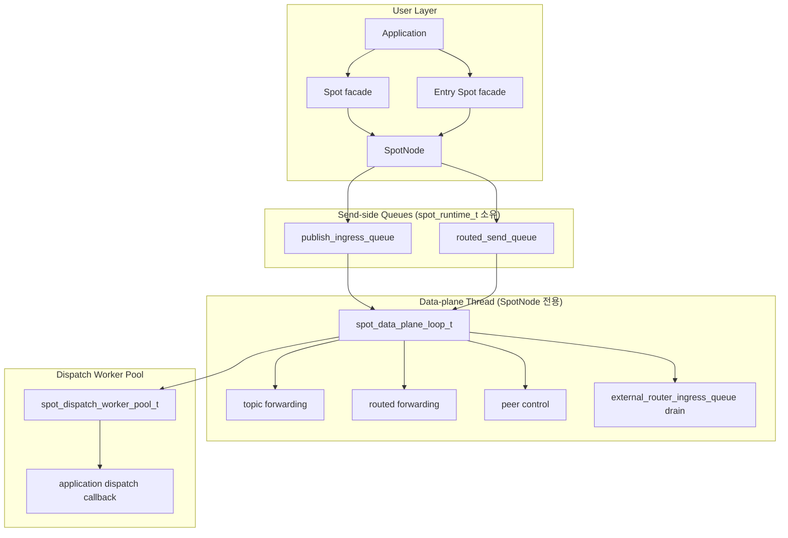

`SpotNode`는 수명 주기 소유자이고, `Spot`은 그 위에서 빌려 쓰는 얇은 핸들이다. `Spot`을
닫아도 그 뒤를 받치는 `SpotNode`는 자동으로 닫히지 않는다.

`Spot` 핸들은 물리 소켓을 소유하지 않는다. 모든 전송 소켓은 `SpotNode`가
소유하며, `Spot`은 논리 dispatch 큐와 dispatch 이벤트 컨텍스트만 가진다. `Entry Spot`은
`SpotNode`당 하나이며 `SpotNode`가 소유한다. `Entry Spot` 핸들은 애플리케이션이
`zlink_spot_node_entry_spot()`으로 얻어서 사용하고, `zlink_spot_destroy()`로 닫는다.

### 1.1 논리 Spot 맵과 get-or-new

`SpotNode`는 논리 Spot을 routing id 색인으로 관리한다. `Spot` 핸들은 실체 위에 얹힌
표면일 뿐이므로, 같은 논리 Spot을 가리키는 핸들이 여러 개 존재할 수 있다. 이 구조
때문에, 명시적 room id를 가진 Spot을 확보할 때 `lookup -> zlink_spot_new() ->
zlink_set_routing_id()` 조합으로 만들면 안 된다. 그 순서는 호출자가 내부 색인
변경과 경합 처리까지 알아야 해서 API 경계가 얕아지기 때문이다.

`zlink_spot_node_spot_get_or_new()`는 같은 `SpotNode`와 같은 Spot routing id에 대해
논리 Spot을 새로 만들지 여부를 `SpotNode` 내부 잠금(lock) 아래에서 결정한다. 가장
먼저 성공한 호출만 논리 상태(logical state)를 만들고 `created_out = 1`을 받는다.
이후 성공한 호출은 같은 논리 상태를 가리키는 새 핸들만 만들고 `created_out = 0`을
받는다.

스냅샷 API는 진단용 핸들까지 함께 보여 줄 수 있다. 따라서 같은 논리 Spot에 대해
여러 핸들이 살아 있으면 스냅샷 행(row)이 둘 이상 보일 수 있다. 논리 Spot이 새로
생성되었는지 판단해야 하는 코드는 스냅샷 행 수가 아니라 get-or-new가 돌려준
`created_out` 값을 기준으로 삼는다.

## 2. 내부 소켓 구성

SpotNode는 모드(mode)에 필요한 소켓 묶음만 만든다.

| 모드 | 생성되는 주요 평면 |
|------|---------------------|
| `PUBSUB` | 토픽 발행/구독, peer 제어 |
| `ROUTED` | routed 전달, peer 제어 |
| `ALL` | 토픽, routed, peer 제어 |

꺼져 있는 평면은 스냅샷 호출이나 꺼진 API의 첫 호출로도 생성되지 않는다.

### 2.1 주요 소켓

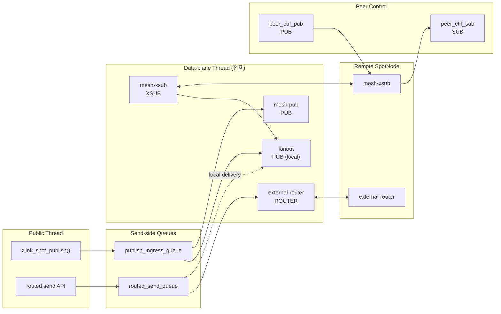

| 소켓 | 타입 | 역할 | HWM 정책 |
|------|------|------|----------|
| `fanout` | `PUB` | 같은 node 안의 구독자에게 로컬 팬아웃 | SNDHWM 0 |
| `mesh-pub` | `PUB` | 원격 node로 토픽 발행 전파 | pubsub 수용 SNDHWM (auto-HWM 또는 override) |
| `mesh-xsub` | `XSUB` | 원격 node에서 오는 토픽 발행 수신 | pubsub 수용 RCVHWM |
| `external-router` | `ROUTER` | peer node와 routed 프레임 송수신 | router 수용 HWM (auto-HWM 또는 override) |
| `peer_ctrl_pub` | `PUB` | peer 제어 송신 | control 기본값 |
| `peer_ctrl_sub` | `SUB` | peer 제어 수신 | control 기본값 |

`zlink_spot_node_internal_sockets()`은 위 표의 socket들을 보고한다. 발행과 routed
전송의 staging(준비)은 socket이 아니라 `publish_ingress_queue`·`routed_send_queue`가
맡는다.

### 2.2 router channel peer

router channel peer는 SPOT mesh peer와는 다른 종류의 연결이다. SPOT mesh peer는
SpotNode끼리 토픽과 routed 메시지를 주고받는 기본 mesh 연결이고, router channel
peer는 외부의 router 채널에 있는 `ROUTER`가 특정 `Spot`으로 들어오는 경로를 갖도록
만드는 연결이다.

상위 프레임워크가 외부로 내보내는(egress) routed Spot 클라이언트를 제공하더라도
내부 기준은 같다. 대상 SpotNode 쪽에는 router channel peer가 먼저 연결되어 있어야
하며, 출발지 쪽 클라이언트는 자신이 가진 로컬 송신 채널을 통해 그 채널로 메시지를
들여보낸다. 대상 Spot rid만으로 출발지 연결을 역으로 찾아내지는 않는다.

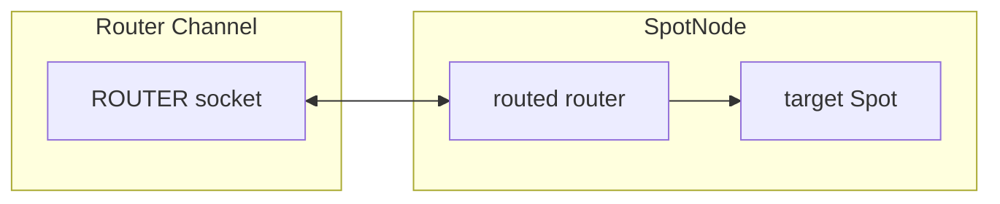

수동 연결은 `manual_endpoints`와 `active_endpoints`에 엔드포인트 문자열로 저장된다.

`zlink_spot_node_peers()`은 SPOT mesh peer와 router channel peer를 구분한다. router
channel peer 행에는 채널 이름, peer 엔드포인트, 출처,
종류(router channel), 상태가 함께 표시된다. 운영 도구는 이 구분을 사용해 "mesh가
끊어진 것"과 "router channel로 메시지가 아직 들어올 수 없는 것"을 따로 진단할 수
있다.

## 3. 토픽 평면(topic plane)

토픽 평면은 로컬과 원격 모두 소켓의 기본 구독 필터(subscription filter)를 사용한다.
런타임은 발행 시점에 대상 색인을 조회하지 않는다.

공개 발행은 `publish_ingress_queue`에 소유 메시지 항목(owned message entry)을 넣고
즉시 반환한다. data plane 스레드가 이 큐를 비우면서 로컬 팬아웃(`fanout` 소켓)과
원격 mesh 발행(`mesh-pub` 소켓)을 수행한다.

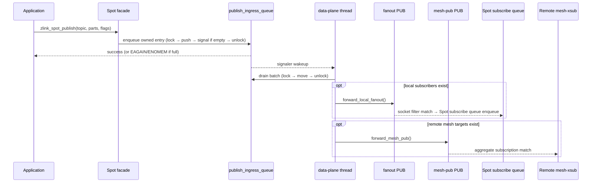

로컬 구독자의 실제 토픽 매칭은 `fanout` PUB 소켓의 `SUBSCRIBE` 상태가 맡는다.
원격 전달의 매칭은 peer node의 `mesh-xsub` 집계 구독 상태가 맡는다.

### 3.1 집계 구독의 수명

런타임은 원격 mesh에 반영할 node 단위 구독 수명을 따로 관리한다.

| 상태 | 자료구조 | 의미 |
|------|----------|------|
| 정확 토픽(exact topic) | `topic -> refcount` | 같은 정확 토픽을 원하는 로컬 구독자 수 |
| 접두사(prefix) | `prefix -> refcount` | 같은 접두사를 원하는 로컬 구독자 수 |

규칙은 단순하다.

1. 참조 카운트가 `0 -> 1`이 될 때만 원격 집계 구독(subscribe)을 보낸다.
2. 참조 카운트가 `1 -> 0`이 될 때만 원격 집계 구독 해제(unsubscribe)를 보낸다.
3. 그 사이의 증가와 감소는 로컬 상태만 바꾸며, 원격 mesh에는 중복 명령을 보내지 않는다.

이 규칙 덕분에, 같은 node 안의 여러 `Spot`이 같은 토픽을 구독해도 원격 peer에는
node를 대표하는 구독 하나만 보인다.

## 4. routed 평면(routed plane)

routed 평면은 `external-router` 한 축으로 고정된다.

| router | 범위 | 역할 |
|--------|------|------|
| `external-router` | node 간 | peer node의 `external-router`와 ROUTER 링크로 송수신 |

로컬 routed 전달은 `routed_send_queue`를 거쳐, data plane 스레드가 대상 `Spot`의
routed 수신 큐에 직접 전달한다.

### 4.1 바깥으로 내보내는 routed 전송(로컬 및 원격)

공개 routed 전송은 대상이 로컬이든 원격이든 모두 `routed_send_queue`에 소유 항목을
쌓는다. 대상이 로컬인지 원격인지는 data plane이 큐에서 꺼낸 뒤에 결정한다.

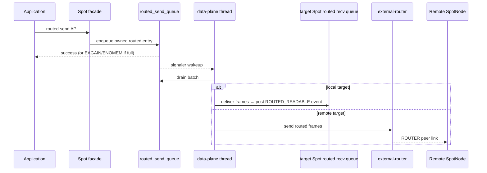

### 4.2 외부에서 들어오는 routed 트래픽(external_router_ingress_queue)

peer에서 들어오는 routed 프레임은 `external-router` 소켓의 메시지 dispatch 콜백을
통해 `external_router_ingress_queue`에 쌓인다. data plane 스레드가
`drain_runtime_external_router_ingress_queue()`로 이를 처리해 대상 `Spot`의 routed
수신 큐로 전달한다. 이렇게 들어오는 경로는 `routed_send_queue`를 거치지 않는다.

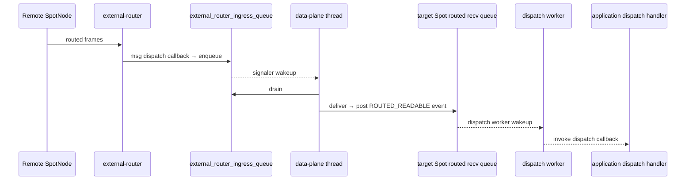

remote routed delivery는 peer별 external route id map을 사용한다. 이 map은
`spot_runtime_t` 내부 메서드를 통해서만 갱신한다. 호출자는 map 구조나 lock 규칙을
알 필요가 없다.

## 5. 송신 큐와 수용(admission)

공개 발행과 routed 전송의 첫 동작은 소켓 송신이 아니라 큐에 쌓기다.

### 5.1 큐 구조

`spot_data_plane_runtime_state_t` 안에 세 개의 큐가 있다.

| 큐 | 소유자 | 방향 | 역할 |
|-------|--------|------|------|
| `publish_ingress_queue` | `spot_data_plane_runtime_state_t` | 나가는 방향 | 공개 발행 → data plane 전달 |
| `routed_send_queue` | `spot_data_plane_runtime_state_t` | 나가는 방향 | 공개 routed 전송 → data plane 전달 |
| `external_router_ingress_queue` | `spot_data_plane_runtime_state_t` | 들어오는 방향 | peer `external-router` 수신 → routed 전달 |

`publish_ingress_queue`와 `routed_send_queue`는 공개 스레드가 쓰고 data plane
스레드가 읽는 MPSC(다중 생산자-단일 소비자) 구조다. `external_router_ingress_queue`는
`external-router` 소켓의 메시지 dispatch 콜백이 쓰고 data plane 스레드가 읽는 구조다.

### 5.2 배압(backpressure)과 이력 현상(hysteresis)

`publish_ingress_queue`와 `routed_send_queue`는 바이트 기반 soft limit와
`backpressure_active` 플래그로 동작한다.

| 상황 | 결과 |
|------|------|
| 여유 있음 | 쌓기 성공. 큐가 비어 있었으면 signaler로 data plane 스레드를 깨움 |
| 가득 참 + `ZLINK_DONTWAIT` | `EAGAIN` |
| 가득 참 + 블로킹 | `condition_variable`에서 큐가 비거나 타임아웃될 때까지 대기 |
| 종료 진행 중 | `ESHUTDOWN` |
| 메모리 할당 실패 | `ENOMEM` |

배압은 이력 현상으로 동작한다. hard limit에 도달하면 `backpressure_active = true`로
바꾸고, data plane이 큐를 절반 이하로 비우면 `cv.broadcast()`로 대기 중인 송신자를
깨운다. 이력 현상은 한계에 가까운 상태에서 켜짐/꺼짐이 반복되는 채터링(chattering)을
막아 준다.

송신 준비 콜백(`zlink_send_ready_handler()`)과 `ZLINK_POLLOUT`은 송신 큐의 수용
여부와 연결된다. 큐가 resume limit 이하로 내려가면, 등록(arm)해 둔 송신 준비 콜백이
호출된다. 이 신호의 의미는 "전송 소켓이 쓰기 가능하다"가 아니라 "SPOT 송신 수용을
다시 시도할 만하다"이다.

### 5.3 큐를 비우는 순서

data plane 루프는 매 회전(iteration)마다 다음 순서로 처리한다.

```text
1. drain_runtime_external_router_ingress_queue()   // peer에서 들어온 트래픽
2. drain_pub_ingress_socket()                      // pub ingress SUB 소켓 수신
3. drain_publish_ingress_queue()                   // 공개 발행 항목
4. drain_runtime_routed_send_queue()               // 공개 routed 전송 항목
5. flush_mesh_pub_pending()                         // 대기 중인 mesh 메시지
6. flush_local_fanout_pending()                     // 대기 중인 로컬 메시지
7. flush_staged_messages()                          // 넘쳐서 대기열로 보낸 메시지
```

한 번에 처리하는 배치 한도는 메시지 2048개 또는 16 MiB 중 먼저 도달하는 쪽이다.
이 한도는 큐 비우기에만 매달리느라 peer 제어와 mesh 구독 처리가 굶지 않도록
막아 준다.

### 5.4 큐 한도 계산

큐 한도는 `SpotNode`의 수용 HWM 계산 결과를 slot 수 기준으로 따른다. 이를 위한
별도 공개 옵션은 없다.

| 값 | 계산 |
|----|------|
| publish `admission_slots` | `ZLINK_SPOT_NODE_OPT_PUBSUB_HWM` override 또는 auto-HWM pubsub 수용값 |
| routed `admission_slots` | `ZLINK_SPOT_NODE_OPT_ROUTER_HWM` override 또는 auto-HWM router 수용값 |
| byte limit | `admission_slots * message_unit_bytes` (메모리 보호용 보조 한도) |

큐가 가득 차는 일이 잦다고 해서 큐 한도부터 키우지는 않는다. data plane 스레드의
비우기 지연, 로컬 fanout / mesh-pub의 `EAGAIN`, `external-router` 적체 중에서 무엇이
병목인지 먼저 확인한다.

## 6. 수용 HWM

SpotNode는 수용 HWM 설정만 공개한다. 이 설정은 송신 큐 한도와 전송 소켓 HWM
양쪽에 적용된다.

| 옵션 | 수용 경로 | 기본 동작 |
|------|----------------|-----------|
| `ZLINK_SPOT_NODE_OPT_PUBSUB_HWM_PROFILE` | 토픽 발행 수용 | balanced auto-HWM profile |
| `ZLINK_SPOT_NODE_OPT_PUBSUB_HWM` | 토픽 발행 수용값 숫자 override | 양수 값, `0`은 auto-HWM으로 복귀 |
| `ZLINK_SPOT_NODE_OPT_ROUTER_HWM_PROFILE` | routed 수용 | balanced auto-HWM profile |
| `ZLINK_SPOT_NODE_OPT_ROUTER_HWM` | routed 수용값 숫자 override | 양수 값, `0`은 auto-HWM으로 복귀 |

숫자 override가 없으면 SpotNode 수용 HWM은 profile별 메시지 수 기준을 사용한다.
기준값은 COMPACT `64`, LOW_LATENCY `128`, BALANCED `256`, THROUGHPUT `512`다.
SPOT 서비스 핸들에는 원시 소켓용 `ZLINK_OPT_AUTO_HWM_MSG_UNIT_BYTES`를 설정할 수
없다. 대신 SPOT 데이터 경로 소켓은 context `ZLINK_CTX_OPT_AUTO_HWM_MSG_UNIT_BYTES`가
양수이면 그 값을 쓰고, context 값이 `0`이면 non-STREAM 기본 메시지 단위인 `4096`
바이트로 계산한다. 기본 context 값에서는 balanced 기본값이 `256`이며, 작은 payload가
많다는 이유만으로 `1024`로 올라가지는 않는다. peer 제어 소켓은 이 수용 묶음에
포함되지 않으며 control-plane HWM을 유지한다.

`fanout` 중계 소켓은 HWM `0`을 쓴다. 원격 mesh로 나가는 `mesh-pub`, 원격 mesh에서
받는 `mesh-xsub`, 그리고 routed mesh의 `external-router`는 auto-HWM을 쓴다. 숫자
override가 없으면 이 세 소켓은 연결 수 bucket을 적용해 peer별 pipe 예산을 줄인다.
이 HWM은 내부 전송 pipe의 메모리 상한일 뿐이고, 공개 `publish`와 routed `send`의
backpressure 의미는 `publish_ingress_queue`와 `routed_send_queue`가 정한다.

연결 수 bucket은 socket별 마지막 bucket 상태를 기억해 hysteresis를 적용한다. 현재
`1-64` bucket인 socket은 peer 수가 `80` 이상일 때 다음 bucket으로 이동하고, 현재
`65-128` bucket인 socket은 peer 수가 `48` 이하로 내려갈 때 이전 bucket으로 돌아간다.
profile이나 메시지 단위가 바뀌면 이전 bucket 상태를 유지하지 않고 새 설정으로 다시 계산한다.

SPOT 발행 큐 계획은 fanout이 커져도 연결당 수용 HWM을 낮추지 않는다.

perf `Auto-HWM spotnode` 상세 표에서는 `mesh-pub`, `mesh-xsub`, `external-router`
에만 mesh 전송 HWM이 보인다. 기본 balanced 경로에서 `MsgUnit(B)=4096`이면 연결 수
bucket을 적용하기 전 profile 값은 `256`이고, bucket 적용 뒤의 HWM은 원격 peer 수에
따라 더 작아질 수 있다.

## 7. control plane

control plane은 메시지를 실어 나르는 큰 흐름(§8의 data plane) 옆에서, **사용자 데이터는
싣지 않고 “누가 연결됐고 무엇을 구독했는지” 같은 관리용 정보만 가볍게 주고받는 곁길**이다.
주요 목적은 다음과 같다.

- peer 부트스트랩(bootstrap) 정보 전달
- ready 상태 갱신
- 집계 구독 재전송(replay)
- peer 연결 상태 반영

control 소켓은 데이터 payload의 HWM 계산과는 다른 메시지 단위를 쓸 수 있다. perf
표에서 같은 payload 크기 블록 안에 `MsgUnit(B)` 값이 서로 다르게 보인다면 control
plane과 data plane의 기준이 다르기 때문이다.

## 8. data plane 스레드와 dispatch worker pool

### 8.1 data plane 스레드

SPOT은 메시지를 실제로 주고받는 일을 **딱 한 스레드에 몰아준다.** `SpotNode`마다 이
전담 스레드가 하나 있어서, 밖으로 나갈 메시지가 쌓인 송신 큐를 쉬지 않고 비워(drain)
내보낸다 — 같은 노드 안의 구독자에게는 `fanout`, 다른 노드에게는 `mesh-pub` 소켓으로.
routed 메시지는 `external-router`로 주고받고, 들어오는 메시지도 이 스레드가 받아 해당
`Spot`의 큐에 넣는다. **한 노드의 실제 메시지는 전부 이 한 스레드를 지난다** — 그래서
이 길을 data plane이라 부른다. 코드에선 `spot_runtime_t::data_plane_thread`가
`spot_data_plane_loop_t::run_until_shutdown()`을 돌린다.

이 스레드가 독점하는 것:

- `mesh-pub`, `mesh-xsub`, `fanout`, `external-router`, `pub_ingress_sub`,
  `ctrl`, `peer_ctrl_pub`, `peer_ctrl_sub` 소켓 (mesh peer observer monitor 포함)
- `publish_ingress_queue`, `routed_send_queue`, `external_router_ingress_queue` 비우기
- 로컬 fanout 전달, 원격 mesh 발행, 들어오고 나가는 routed 전달

공개 스레드는 이 소켓들에 직접 접근하지 않는다. 이 경계를 어기면 소켓 소유권,
poller가 감시할 대상, 종료(shutdown) 순서가 공개 호출 경로와 뒤섞인다.

```
공개 불변식:
  공개 스레드는 mesh-pub, fanout, external-router를 직접 send/recv하지 않는다.
  data plane 스레드는 애플리케이션 dispatch 콜백을 직접 호출하지 않는다.
```

data plane 스레드 루프는 poller와 signaler(FD)를 함께 쓴다. 세 큐의 signaler FD가
poller에 등록돼 있어서, 어느 큐든 비었다가 채워지면(empty→non-empty) 곧바로 깨어난다.
할 일이 없을 때의 점검 주기(idle tick)는 100 ms(`data_plane_idle_tick_ms`)다.

SPOT data plane의 실행 일정은 `SpotNode` 전용 스레드 안에서만 정해진다. 외부의 주기
task 같은 것에 기대지 않는다.

### 8.2 dispatch worker pool

`spot_runtime_t::dispatch_workers`(`spot_dispatch_worker_pool_t`)는 애플리케이션
dispatch 콜백을 실행하는 worker pool이다.

data plane 스레드는 애플리케이션 콜백을 직접 호출하지 않는다. 대신 대상
`Spot state`가 ready가 되면 `post_dispatch_event(void* spot_)`으로 pool에 알린다.
pool은 같은 Spot이 중복으로 쌓이지 않도록 `_queued` set으로 Spot 포인터를 합쳐서
(coalesce) 관리한다.

```cpp
// spot_dispatch_worker_pool_t 주요 필드
std::deque<void*>              _ready;    // drain 대기 Spot 포인터
std::unordered_set<void*>      _queued;   // 이미 ready queue에 있는 Spot (중복 방지)
std::unordered_set<void*>      _active;   // 현재 worker가 실행 중인 Spot
std::unordered_set<void*>      _dirty;    // callback 종료 후 재확인 필요한 Spot
```

Spot별 직렬화: 같은 Spot은 한 번에 worker 하나만 처리한다. 콜백이 끝난 뒤
`_dirty`에 아직 안 읽은 이벤트가 남아 있으면 그 Spot을 다시 `_ready`에 넣는다.

worker 수 계산:

```text
cpu_count = max(1, hardware_concurrency)
default_min = min(2, cpu_count)
default_max = max(1, cpu_count)
idle_timeout = 1000 ms (내부 상수)
```

| 옵션 | 기본값 | 의미 |
|------|--------|------|
| `ZLINK_SPOT_NODE_OPT_DISPATCH_WORKERS_MIN` | `min(2, cpu_count)` | 항상 유지할 worker 수 |
| `ZLINK_SPOT_NODE_OPT_DISPATCH_WORKERS_MAX` | `max(1, cpu_count)` | 부하가 몰릴 때 늘릴 수 있는 최대 worker 수 |

data plane 스레드가 콜백을 직접 실행하지 않는 이유:

1. 애플리케이션 콜백이 다시 SPOT send/recv를 호출하면 재진입(reentrancy) 위험이 있다.
2. 콜백이 오래 걸리면 `mesh-pub`, `external-router` flush가 멈춘다.
3. `ZLINK_POLLOUT`과 send-ready 콜백도 dispatch 쪽 일이라, data plane 루프와 섞이면
   ready 판정과 전달(forwarding) 순서가 어긋난다.

## 9. Actor dispatch 내부 모델

Actor는 SpotNode가 관리하는 routing target이다. 밖으로 노출되는 포인터 핸들은 없고,
`zlink_actor_ref_t`가 Actor를 식별한다. Actor는 socket이나 inproc·transport endpoint를
소유하지 않는다. STREAM session에서 Actor로 relay되는 part는 대상 SpotNode의 Actor
table을 거쳐 Actor의 **unread state**, 즉 `zlink_spot_node_actor_recv_part()`로 아직
꺼내지 않은 part 큐로 들어간다.

각 Actor는 **joined Spot**(= current Spot)을 하나 가진다. 이 Spot의 dispatch context가
그 Actor의 `ACTOR_READABLE` 이벤트를 받는다. 새로 만들어진 Actor의 joined Spot은 항상
Entry Spot이며, join 프로토콜(§14)이 끝날 때까지 Entry Spot이 current Spot으로 남는다.
그래서 Actor가 user Spot으로 join하기 전까지는 Entry Spot의 dispatch context에서 그
Actor의 메시지를 처리한다.

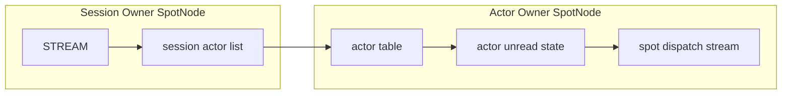

session actor list는 session routing id마다 따로 있다. 각 entry는 Actor id와 구체적인
Actor ref를 저장한다. 검증 안 된 ref로 bind를 시도해도, attach가 성공하면 session
entry에는 실제 generation이 채워진다. session owner는 joined Spot 상태를 저장하지
않는다. joined 상태는 Actor owner table과 snapshot에서만 관리한다.

로컬 Actor relay와 원격 Actor relay는 같은 Actor table 의미를 따른다. 차이는 대상
SpotNode가 같은 프로세스 안에 있는지, 아니면 peer SpotNode로 routed control을 거쳐야
하는지뿐이다. 대상 Actor가 사라진 뒤에 원격 relay가 도착하면 대상 node가 그 part를
버릴 수 있다. 단, sender 쪽에서 이미 성공으로 처리된 submit 결과는 그 뒤에 바뀌지
않는다.

### 9.1 Actor table 상태

Actor table row는 다음 상태를 함께 가진다.

| 상태 | 의미 |
|------|------|
| Actor ref | node rid, Actor id, generation |
| joined Spot rid | Actor가 현재 속한 Spot. 생성 직후에는 Entry Spot |
| bound session ref | Actor가 attach된 STREAM session |
| unread state | 아직 `zlink_spot_node_actor_recv_part()`로 읽지 않은 part |
| pending join | Spot이 아직 reply하지 않은 join request |
| route synced | active route가 현재 Actor ref를 가리키는지 여부 |

Actor를 destroy할 때는 joined 상태, bound session detach, 진행 중인 multipart relay를
먼저 확인한다. detach를 끝낼 수 없거나 timeout이 나면 Actor slot과 unread state를 호출
전 상태 그대로 둔다.

### 9.2 dispatch event

Actor unread state에 읽을 part가 생기고 그 Actor가 Spot에 join돼 있으면, Spot dispatch
stream에 `ACTOR_READABLE` readiness가 올라간다. 이 event의 subject는 콜백 실행 동안만
유효한 `const zlink_actor_ref_t *`다. pending join request가 생기면 Spot dispatch stream에
`ACTOR_JOIN_READABLE` readiness가 올라간다.

readiness(수신 준비 신호)는 메시지 개수와 1:1로 대응하지 않는다. 그래서 dispatch 콜백은
각 drain API가 `NO_DATA`를 돌려줄 때까지 비우는 식으로 동작해야 한다. 내부적으로는 같은
Actor에 대한 part 순서를 그대로 지킨다.

### 9.3 Active route publish

Actor active route는 Actor를 생성할 때 Entry Spot 위치로 publish할 수 있고, user
Spot join이 성공해 commit되는 시점에 user Spot 위치로 갱신한다. 반대로 user Spot에서
Entry Spot으로 leave가 성공해 위치가 실제로 바뀌면 다시 Entry Spot 위치로 갱신한다.
session bind/unbind는 active route의 필수 조건이 아니고, 위치를 직접 바꾸지도 않는다.
active route가 가리키던 Actor가 destroy되면 그 route를 제거한다. 단, active route가
다른 generation의 Actor를 가리키고 있으면 destroy는 그 route를 건드리지 않는다.
이 route 상태는 내부 SPOT/Actor 생명주기 정보다.

### 9.4 Actor lifecycle event

Actor lifecycle event는 Actor의 실제 위치 변경이 commit되고 active route 갱신까지 끝난
뒤에야 Spot dispatch queue에서 읽을 수 있게(readable) 된다. Entry Spot과 user Spot
모두 `zlink_spot_recv_actor_lifecycle()`로 이 event를 받을 수 있다. dispatch handler가
이미 등록된 Spot에만 event를 쌓으므로, 그 이전의 Actor 전이는 다시 재생(replay)하지
않는다.

| trigger | event | `previous_actor` | `current_actor` |
|---------|----------|------------------|-----------------|
| Actor 생성 | Entry Spot `on_join` | zero-value ref | 생성된 Actor ref |
| user Spot join 성공 | target Spot `on_join` (+ source Spot `on_leave`) | source Actor ref | target Actor ref |
| explicit leave 성공 | source user Spot `on_leave` + Entry Spot `on_join` | 같은 Actor ref | 같은 Actor ref |
| Actor destroy 성공 | current Spot `on_leave` | destroy되는 ref | zero-value ref |
| idempotent join / idempotent leave | 호출 없음 | — | — |

`zlink_spot_actor_lifecycle_info_t.join_epoch`는 `on_join`이면 `current_actor`가
가리키는 slot의 commit epoch, `on_leave`면 `previous_actor`가 가리키는 slot의 commit
epoch다. remote join에서는 source `on_leave`, target `on_join`, join completion이 서로
다른 SpotNode의 epoch 값을 가질 수 있다.

`info` 포인터는 callback 실행 동안만 유효하므로, 필요한 값은 callback 안에서 복사해
둔다. join completion handler는 commit이 끝난 뒤 호출되지만, 그 시점에 lifecycle event가
이미 실행됐는지는 보장하지 않는다. 따라서 애플리케이션 상태 기계는 join 완료를 판단할
때 lifecycle event가 아니라 join completion handler가 돌려준 최종 Actor ref를 기준으로
삼는다.

## 10. Entry Spot과 Spot queue 소유권

`Spot`은 자기만의 socket을 따로 열지 않는다. 네트워크에 실제로 연결된 transport
socket은 전부 `SpotNode`가 들고 있고, 여러 `Spot`이 그것을 함께 쓴다. 바깥에서 온
메시지는 먼저 `SpotNode`의 socket으로 들어오고, `SpotNode`가 "이 메시지가 어느 `Spot`
것인지" 가려내(demux) 해당 `Spot`의 메모리 큐에 넣어 준다. 그래서 `Spot`이 실제로
소유하는 것은 network socket이 아니라, 받은 입력을 담아 두는 다음의 메모리 큐들뿐이다.

- routed ingress dispatch queue
- subscribe ingress dispatch queue
- channel reply dispatch queue
- timer event queue
- Actor unread staging queue

이 큐들에 대한 backpressure 기준은 `SpotNode` transport socket의 admission HWM이다.
Spot 안쪽의 큐에는 따로 HWM이나 크기 한계를 두지 않는다.

`Entry Spot`은 `SpotNode`당 하나다. `SpotNode`를 만들 때 자동으로 생기고, `SpotNode`를
destroy하기 전까지 살아 있다. 애플리케이션은 `zlink_spot_node_entry_spot()`으로 핸들을
얻어 dispatch handler를 등록한다. Actor가 생성된 직후에 session relay 메시지가 도착하면
Entry Spot의 dispatch queue에서 `ACTOR_READABLE` readiness가 올라간다.

user Spot의 logical state는 마지막 핸들이 닫힐 때 제거된다. 단, joined Actor나 pending
join request가 남아 있으면 마지막 핸들 close는 `ZLINK_CLOSE_BUSY`로 실패한다. Entry
Spot의 logical state는 핸들의 reference count와 상관없이 `SpotNode`가 소유한다.

## 11. Spot은 socket을 갖지 않는다

`Spot`은 자기 socket을 만들지 않는다. `SpotNode`가 메시지를 한 번 받아서 logical
`Spot`으로 중계하는 구조라, Spot마다 socket을 두고 그 HWM으로 dispatch 상태를 나타내는
방식은 맞지 않는다. 그래서 HWM은 `SpotNode`가 소유한 transport socket의 admission에
두고, Spot별 큐는 이미 받은 입력을 어느 dispatch context에서 처리할지 정하는
staging(준비) 상태로만 쓴다.

구조는 다음과 같다.

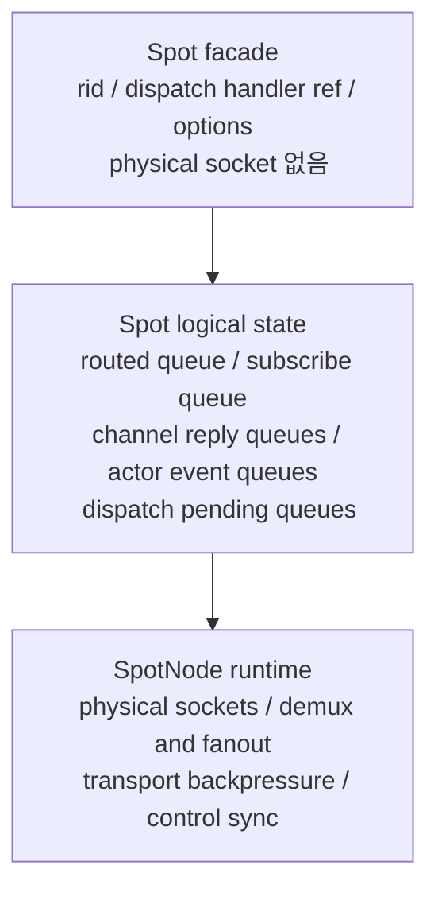

`Spot` 핸들은 `spot_pub_t`, `spot_sub_t`, routed receive socket 같은 물리 socket을
직접 갖지 않는다. `Spot`에 필요한 것은 logical state를 가리키는 reference뿐이다.

## 12. STREAM session과 Actor binding

이 절은 STREAM 세션에 **Actor를 bind하는 경우**를 다룬다. STREAM 세션 자체는 그냥
STREAM socket일 뿐, 어떤 SpotNode에도 매여 있지 않다. 세션이 SpotNode와 엮이는 건 그
세션에 Actor를 붙이려고 ActorGateway로 attach하는 순간부터다 — 그때 그 SpotNode가
**session owner node**가 된다. Actor는 자신을 들고 있는 SpotNode(**Actor owner node**)에
속한다. bind할 때 이 둘 — 세션이 붙은 SpotNode와 Actor를 든 SpotNode — 이 같은 노드일
수도(§12.1 co-located), 서로 다른 노드일 수도(§12.2 split deployment) 있다. 내부 처리
경로는 다르지만 공개 API는 동일하다.

bind를 실행하기 전에 STREAM handle의 session owner `SpotNode`가 먼저 정해져 있어야
한다. 이것이 session relay다. owner는
`actor_runtime().sessions.stream_owner(stream, nodes)`로 결정된다.

  `sessions.stream_owners`에 기록되고, handle은 `sessions.explicit_stream_owners`에
  추가된다. 이렇게 명시한 owner는 sticky해서 stream이 닫히거나 owner node가 파괴되거나
  애플리케이션이 detach할 때까지 유지된다. SpotNode와 연결할 단서가 라이브러리에 없는
  raw·connector STREAM handle은 반드시 이 경로를 거쳐야 한다.
- stream이 `SpotNode` 내부 socket이면 `find_socket_owner()`가 owner를 구조적으로 복원해
  `stream_owners`에 캐시한다. 이 경우에는 명시적 attach가 필요 없다.
- 두 경로 모두 owner를 찾지 못하면 bind는 실패한다. owner는 bind 대상 Actor의 `node_rid`로
  추론하지 않는다. session owner는 어디까지나 보내는 stream이 실제로 attach된 node다.

확인하고(아니면 `ENOTSUP` / `ZLINK_CONFIG_NOT_SUPPORTED`), 이미 다른 owner에 붙은
stream을 다른 node로 다시 붙이려 하면 거부한다(`EBUSY` / `ZLINK_CONFIG_INVALID_STATE`).
같은 stream/node 쌍으로 다시 호출하면 멱등으로 성공한다. STREAM 쪽 관점은
[stream-socket.ko.md](stream-socket.ko.md)를 참고한다.

### 12.1 Local Actor binding (co-located)

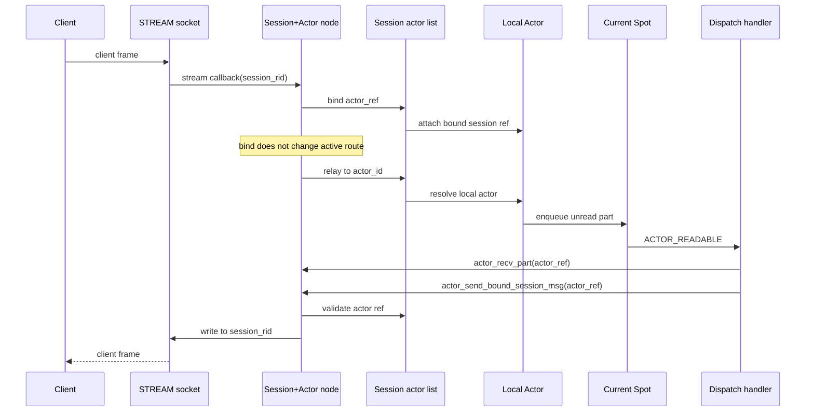

local Actor는 bind, relay, Actor→session 전송이 모두 같은 node 안에서 끝난다. Actor용
socket이나 Actor별 inproc endpoint는 생기지 않는다.

### 12.2 Remote Actor binding (split deployment)

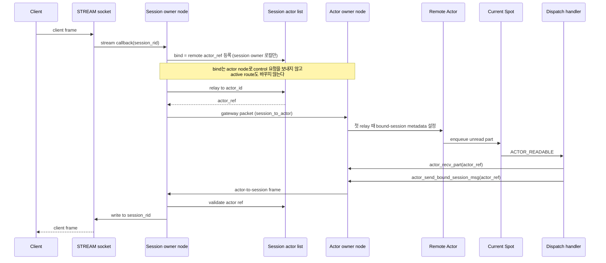

remote bind 자체는 session owner 쪽 로컬 등록이다: `sessions.bind_actor_ref()`로 remote
actor ref만 `sessions.bindings`에 넣고 끝난다 — Actor owner node로 control 요청을 보내지
않는다. node 사이를 실제로 오가는 것은 session→Actor relay(gateway packet)와 Actor→session
frame뿐이고, target Actor의 bound-session metadata는 첫 relay를 처리할 때 Actor owner
쪽에서 설정된다. session owner는 Actor의 joined Spot을 저장하지 않고, Actor owner는
STREAM session의 애플리케이션 상태를 저장하지 않는다.

bound session disconnect와 remote join handoff가 겹칠 때는 **join commit(source Actor
제거 + binding을 target actor ref로 이전)이 끝났는지**가 기준이 된다. commit 전에 끊기면
source Actor를 Entry Spot으로 되돌리는 abort이고, commit 뒤에 끊기면 target Actor의
Entry Spot cleanup이다.

### 12.3 원격 bind 에러 경로 (설계상 모델 — 미구현)

> 아래 표는 process 경계를 넘는 remote bind 제어 프로토콜의 **설계상 에러 모델**이다.
> 현재 구현의 remote bind는 §12.2처럼 session owner 쪽 로컬 ref 등록이라, `bind control
> request` 송신·timeout·target node 거부 같은 경로는 **아직 동작하지 않는다**(§14.2의
> "process 경계 network control frame은 후속 범위"와 같은 맥락).

| 조건 | 결과 |
|------|------|
| Actor owner node에 도달 불가 | `bind control request`가 전달되지 않는다. session owner는 timeout 뒤 bind 실패를 반환한다. `sessions.bindings`에는 항목이 기록되지 않는다 |
| bind control request 도중 timeout | session owner는 bind 실패로 처리한다. timeout 통지를 받은 target node는 일부만 만들어진 Actor table 상태를 되돌린다 |
| `actor_ref`가 stale (generation 불일치) | target node가 bind control request를 거부한다. session owner는 `INVALID_HANDLE`을 받고, Actor table 항목은 생성되지 않는다 |
| bind 완료 전에 session disconnect | session owner의 session 항목이 이미 제거됐으므로 `sessions.bindings` CAS가 실패한다. bind는 중단되고 target node의 Actor 상태도 정리된다 |

## 13. Transport logical queue 내부 데이터 구조

이 절은 transport logical queue 구현의 핵심 내부 구조를 정리한다. 공개 계약이 아니라
구현 세부 사항이므로, 이후 바뀔 수 있다.

### 13.1 Spot logical queue (`spot_logical_state_t`)

`spot_logical_state_t`는 `Spot` 핸들(`spot_handle_t`)이 `shared_ptr`로 공유하는
logical state다. Entry Spot은 `spot_node_handle_state_t.entry_spot`이 소유하고,
user Spot은 `spots_by_rid` map에 보관한다.

pubsub 관련 필드:

| 필드 | 타입 | 역할 |
|------|------|------|
| `subscribe_queue` | `deque<shared_ptr<spot_logical_pubsub_message_t>>` | SpotNode에서 demux된 pubsub 메시지 |
| `subscribe_signaler` | `signaler_t` | dispatch를 깨우는 edge-triggered signaler |
| `subscribe_signal_armed` | `bool` | 중복 신호 방지용 arming 플래그 |
| `request_reply_state` | `shared_ptr<spot_request_reply_state_t>` | routed send/recv 및 channel reply 상태 |

`spot_logical_pubsub_message_t`는 한 pubsub 메시지의 모든 part를 담는다.

```
struct spot_logical_pubsub_message_t {
    zlink_routing_id_t source_rid;
    std::string service_name;
    std::string topic_id;
    std::vector<std::string> parts;
};
```

### 13.2 Actor unread queue (`actor_handle_t`)

`actor_handle_t`는 `SpotNode` actor table의 각 row에 해당한다. `spot_node_actor_state_t`
안의 `actors_by_id` map이 소유한다.

| 필드 | 타입 | 역할 |
|------|------|------|
| `queue` | `deque<queued_actor_part_t>` | STREAM relay로 받은 아직 읽지 않은 part |
| `joined_spot_state` | `shared_ptr<spot_logical_state_t>` | 현재 속한 Spot 상태 |
| `generation` | `uint64_t` | Actor ref generation (stale ref 검증) |
| `bound_session_node` | `spot_node_t*` | session owner node |
| `bound_stream` | `void*` | 연결된 STREAM socket handle |
| `pending_remote_join` | `bool` | remote join prepare 진행 중 여부 |

`queued_actor_part_t`는 단일 part의 소유권 wrapper다. move-only semantics다.

| 필드 | 타입 | 역할 |
|------|------|------|
| `part` | `zlink_msg_t` | message body |
| `info` | `zlink_actor_recv_info_t` | source session 정보 (node rid, session rid, actor ref) |
| `part_flag` | `zlink_part_flag_t` | `ZLINK_PART_MORE` 또는 `ZLINK_PART_FINAL` |
| `owns` | `bool` | part 소유 여부 (move 후 false) |

### 13.3 Join request queue (`joins.queues`)

join request는 `service_spot_actor_api.cpp`의 `actor_runtime().mutex`로 보호되는
`actor_runtime().joins.queues`(`actor_join_state_t`의 `queues` 멤버)에 저장된다.

```
joins.queues: map<spot_logical_state_t*, deque<queued_join_request_t*>>
```

key는 target Spot의 `spot_logical_state_t` 포인터다. 한 Spot에 여러 join request가
pending 상태일 수 있고, FIFO 순서로 `zlink_spot_actor_join_recv()`를 통해 꺼낸다.

`queued_join_request_t` 주요 필드:

| 필드 | 타입 | 역할 |
|------|------|------|
| `actor` | `actor_handle_t*` | join을 요청한 source Actor |
| `spot_state` | `shared_ptr<spot_logical_state_t>` | target Spot logical state |
| `join_epoch` | `uint64_t` | join sequence (timeout/중복 검증용) |
| `replied` | `bool` | reply 완료 여부 |
| `pending_target` | `actor_handle_t*` | remote join prepare에서 생성한 target Actor |
| `remote` | `bool` | remote join handoff 여부 |
| `message_parts` | `vector<zlink_msg_t>` | join payload, 소유 multipart (source가 소유권 이전) |
| `reply_parts` | `vector<zlink_msg_t>` | reply payload, 소유 multipart (target이 소유권 이전) |

`joins.live_requests`는 현재 pending 상태인 join request를 모두 모은 set으로, timeout
스윕(sweep)을 돌리는 데 쓴다. request가 끝나면 그 record를 따로 retired set에 옮기지
않고, commit/abort 경로 끝에서 곧바로 해제한다.

### 13.4 Signaler와 dispatch 연결

pubsub dispatch는 edge-triggered signaler로 동작한다.

```
subscribe_queue에 입력 추가
→ subscribe_signal_armed == false이면 subscribe_signaler.send()
→ subscribe_signal_armed = true 설정
→ poller가 subscribe_signaler fd를 감지해 SUBSCRIBE_READABLE 전달
→ drain 완료 후 subscribe_signal_armed = false 재설정 (다음 입력 대비)
```

Actor readable dispatch는 `actor_handle_t.joined_spot_state`의 dispatch handler에
`ACTOR_READABLE` readiness를 직접 올린다. subject는 콜백 수명 동안만 유효한
`const zlink_actor_ref_t*`다.

Actor join dispatch는 `joins.queues`에 request가 추가될 때 target Spot dispatch
handler에 `ACTOR_JOIN_READABLE` readiness를 올린다. subject는 target Spot 핸들이다.

### 13.5 Actor runtime 상태 목록

Actor, session, route, join, lifecycle 상태는 모두 프로세스마다 하나인
`actor_runtime_t` 집합체에 모여 있고, `service_spot_actor_api.cpp`의 `actor_runtime()`
접근자로 접근한다. 흩어진 전역 변수 `g_*`는 없고, 이 집합체가 책임별로 상태를 묶는다.
**아래 모든 멤버는 따로 언급하지 않는 한 단일 `actor_runtime().mutex`로 직렬화된다.**

| 멤버 | 타입 | 역할 |
|------|------|------|
| `mutex` | `std::timed_mutex` | runtime 전체를 보호하는 단일 잠금. 테이블 변경 동안만 보유하고 I/O 중에는 해제한다 |
| `nodes` | `actor_node_registry_t` | node와 Spot 핸들 추적 (아래 하위 행 참고) |
| `nodes.nodes_by_rid` | `map<string, spot_node_t*>` | node rid → SpotNode 역방향 조회. `SpotNode` 생성 시 추가, destroy 시 제거 |
| `nodes.known_nodes` | `set<spot_node_t*>` | live `SpotNode` handle. node 포인터 use-after-free 검증에 사용 |
| `nodes.known_spots` | `set<spot_handle_t*>` | live Spot 핸들. handle use-after-free 검증에 사용 |
| `sessions` | `actor_session_state_t` | STREAM session binding과 stream→owner map (아래 하위 행 참고) |
| `sessions.bindings` | `map<session_binding_key_t, session_binding_t>` | `(stream, session rid)` 복합키. 한 session의 actor id별 Actor 항목을 담는다. remote join을 commit할 때 이 binding의 actor ref를 target으로 바꾸는 지점 |
| `sessions.stream_owners` | `map<void*, spot_node_t*>` | STREAM handle → session owner SpotNode(ActorGateway) |
| `routes` | `actor_route_state_t` | 게시된 actor route와 disconnect note (아래 하위 행 참고) |
| `routes.active` | `map<string, zlink_actor_route_t>` | actor id → 내부 active route |
| `routes.disconnected` | `set<pair<spot_node_t*, string>>` | disconnected로 표시된 `(source node, target node rid)` 쌍. relay 실패를 route-not-found로 매핑하는 데 사용 |
| `joins` | `actor_join_state_t` | pending join 큐와 부가 상태 (아래 하위 행 참고) |
| `joins.queues` | `map<spot_logical_state_t*, deque<queued_join_request_t*>>` | target Spot별 pending join request. enqueue 시 추가, reply 또는 cleanup 시 제거 |
| `joins.live_requests` | `set<queued_join_request_t*>` | 현재 pending join. timeout 스윕에 사용 |
| `joins.pending_count_by_actor` | `map<actor_handle_t*, size_t>` | actor별 pending join 수. actor에 진행 중인 join이 있는지 빠르게 판정 |
| `joins.pending_count_by_spot` | `map<spot_logical_state_t*, size_t>` | Spot별 pending join 수. Spot 정리 시 남은 join 유무 판정 |
| `joins.pending_remote_actor_keys` | `set<pair<spot_node_t*, string>>` | remote join이 만든 pending target actor `(node, actor id)` 집합. 중복 remote pending 방지 |
| `lifecycle` | `actor_lifecycle_state_t` | Spot별 `on_join`/`on_leave` 등록과 이벤트 큐 |
| `protocol_drop_count` | `uint64_t` | protocol 오류(stale ref, unknown actor id 등)로 drop된 relay frame 누적 카운터. relay 손실 진단에 활용 |
| `next_join_epoch` | `uint64_t` | join sequence 번호를 단조 증가로 발급하는 카운터 |

`queued_join_request_t`는 request와 reply payload를 owned multipart parts로
저장한다. `zlink_spot_actor_join_recv()`는 호출자에게 thread-local parts view를
보여 주고, `zlink_spot_actor_join_reply()`는 completion callback이 실행되기 전에
reply parts를 request record 안으로 이동한다.

**초기화**: `actor_runtime_t` 인스턴스는 함수 지역 static이라 정적 저장 기간을 가지며,
처음 접근할 때 기본 초기화된다. 따로 init을 호출하지 않는다. 첫 `SpotNode`를 만들 때
`nodes.nodes_by_rid`에 첫 항목이 들어가는데, 모든 쓰기와 경합 가능한 읽기가 `mutex`를
잡으므로 race window가 없다.

**Lock 범위**: I/O 스레드 경계를 넘는 blocking 호출(예: Mailbox reply 대기) 중에는
`actor_runtime().mutex`를 보유해서는 안 된다. 두 SpotNode 인스턴스에 걸친 Actor table
변경과 join 큐 변경은 전체 compound 연산에 대해 mutex를 한 번만 잡아 직렬화된다.

## 14. Actor join 내부 lifecycle

이 절은 Actor join 요청을 SpotNode가 내부에서 어떻게 처리하는지 자세히 설명한다.
STREAM session 연결 흐름은 §12를, 공개 join 계약은
[`doc/spec/core/service/spot.ko.md`](../api/spot.ko.md)의 Actor 계약 절을 참고한다.

### 14.1 Local join 내부 순서

local join은 같은 `SpotNode` 안에서 Actor의 current Spot만 바꾼다. accept되기 전까지는
source Spot이 Actor의 current Spot으로 남는다. accept 처리, current Spot 교체, active
route 갱신, lifecycle event 예약은 모두 같은 `SpotNode`의 critical section 또는 event-loop
한 회전(turn) 안에서 끝낸다. session attach 여부는 join 요청이 유효한지와 무관하므로,
bound STREAM session ref를 검증하지 않는다. `dest_spot_rid`가 Entry Spot이면
invalid-argument 계열 오류로 즉시 실패한다.

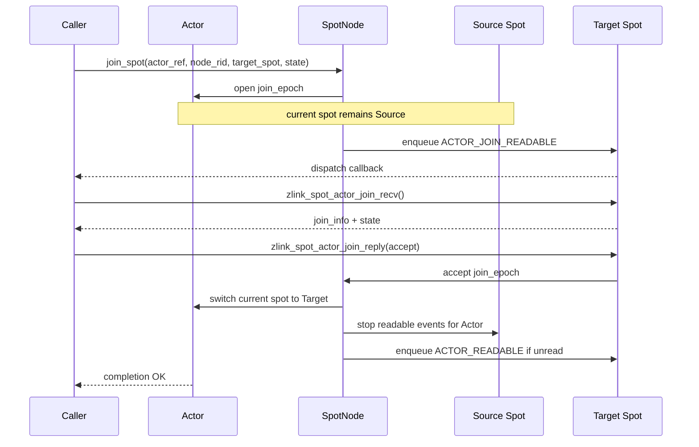

reject나 timeout이면 current Spot 교체 단계는 실행되지 않는다. Actor는 source Spot에
그대로 남고, target Spot으로 전달됐던 join state payload는 reply 또는 timeout 처리가
끝난 뒤 폐기된다.

local join 원자성 규칙:

- accept 전까지 source Spot이 current Spot이다.
- accept 처리와 current Spot 교체는 같은 critical section 또는 event-loop turn 안에서 수행한다.
- accept 뒤에는 source Spot으로 새 `ACTOR_READABLE` event를 올리지 않는다.
- reject, timeout, target Spot destroy, `SpotNode` shutdown은 source Spot을 유지한다.

### 14.2 Remote join 내부 순서

remote join은 source node의 Actor를 target node의 target Spot으로 넘기는 handoff다.
현재 구현은 같은 process 안에 등록된 source/target `SpotNode` 사이에서만 이 동작을
수행한다. 이때 commit은 `actor_runtime().mutex` 아래에서 source Actor를 제거하고
binding을 target actor ref로 이전(`transfer_bound_session`)하는 방식이라, 별도의
compare-and-swap을 쓰지 않는다. process 경계를 넘는 network control frame과 재시도
가능한 `JoinOp` 정리는 다음 단계의 범위다.

`JoinOp`은 source node에서 만들며, 다음 상태를 보존한다.

| 필드 | 의미 |
|------|------|
| `join_epoch` | join sequence number (timeout, 중복, stale replay 검증) |
| `source_actor_ref` | source node와 Actor ref |
| `target_actor_ref` | target node와 pending Actor ref |
| `target_node_rid` / `target_spot_rid` | 목표 node와 Spot |
| `bound_session_ref` | session owner와 session rid |
| `completion_handler` | request owner의 `zlink_reply_handler_fn` |
| `reply_path` | join reply를 request owner로 전달하는 경로 |

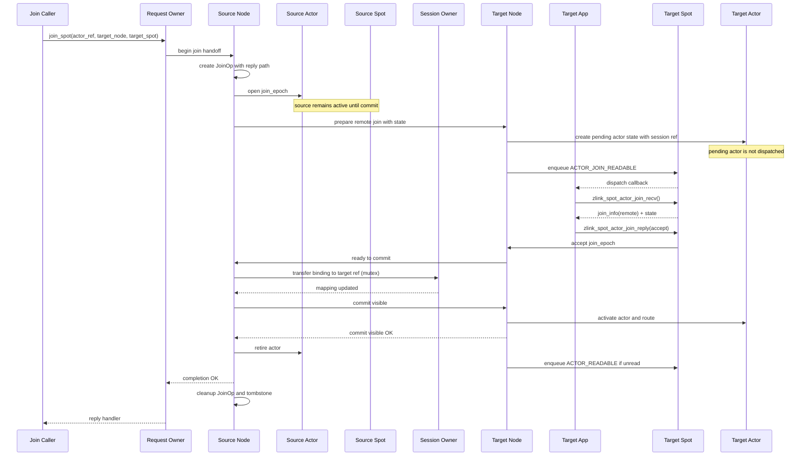

remote join 원자성 규칙:

- source Actor는 commit 전까지 source node와 source Spot에서 active 상태다.
- target node는 prepare 단계에서 pending Actor state를 만들 수 있지만, 이 Actor는
  dispatch되지도 않고 active route를 publish하지도 않는다.
- target Spot이 accept하더라도 source Actor는 아직 source Spot에서 제거되지 않는다.
- source Actor는 binding이 target actor ref로 이전되고 target Actor activate와 active
  route 갱신까지 끝난 뒤에야 source Spot에서 제거되어 retired 상태가 된다.
- commit이 성공한 뒤에는 session owner node의 session Actor list와 active route가 target
  node의 Actor ref를 가리킨다.
- `JoinOp` cleanup은 request owner에게 completion frame이 확실히 전달된 뒤에 수행한다.
- source Actor retire와 target activate는 join epoch로 막는다(fence). stale relay, stale
  join reply, 뒤늦게 도착한 control message는 epoch가 맞을 때만 적용한다.

### 14.3 Abort 경로

target Spot이 reject하거나 timeout, prepare 실패, target shutdown이 일어나면 handoff를
중단한다.

- source Actor는 source Spot에서 active 상태를 그대로 유지한다.
- target의 pending Actor state와 payload reference는 폐기한다.
- active route는 옮기지 않는다.

bound session disconnect와 remote join handoff가 겹칠 때는 **join commit(binding의 target
이전)이 끝났는지**가 기준이 된다.

- **commit 전에 disconnect**: source Actor를 source Spot에서 Entry Spot으로 되돌리는 abort다.
  target의 pending Actor state와 payload reference는 폐기한다.
- **commit 뒤에 disconnect**: 이때는 target Actor가 정본(canonical) Actor다. commit visible
  절차를 끝낸 뒤, target node의 disconnect cleanup이 target Actor를 Entry Spot으로 옮기고
  bound session ref를 제거한다. source Actor는 다시 active 상태로 돌아오지 않는다.
