[English](spot-internals.md) | [한국어](spot-internals.ko.md)

# SPOT / SpotNode 내부 아키텍처

## 1. 컴포넌트 개요

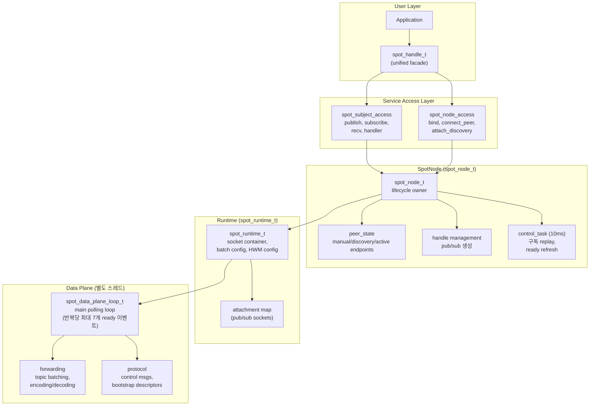

## 2. 내부 소켓 토폴로지

SpotNode는 시작 시점에 11개의 상시 소켓을 생성하고,
연결 상태 추적용 monitor 소켓 1개를 추가로 생성한다 (총 12개).
데이터 전달 경로에서 최초 필요 시점에 sender cache 소켓 3개가 추가로 생성된다.

### 2.1 소켓 목록

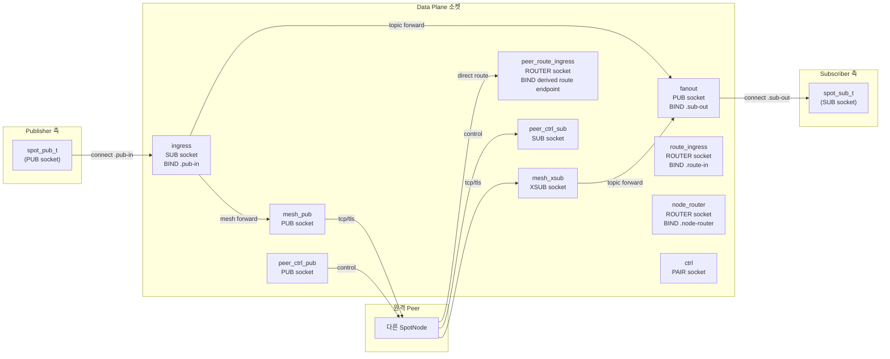

### 2.2 소켓 상세

| 소켓 | 타입 | Endpoint | Bind/Connect | HWM | 역할 |
|------|------|----------|-------------|-----|------|
| `ingress` | SUB | `.pub-in` | BIND | `node_sub_rcvhwm` | 모든 로컬 publish 수신 |
| `fanout` | PUB | `.sub-out` | BIND | `node_pub_sndhwm` | 로컬 subscriber에게 분배 |
| `mesh_pub` | PUB | (bound endpoint) | BIND | `node_pub_sndhwm` | 원격 peer에 토픽 송신 |
| `mesh_xsub` | XSUB | — | CONNECT to peers | `node_sub_rcvhwm` | 원격 peer에서 토픽 수신 |
| `route_ingress` | ROUTER | `.route-in` | BIND | `routed_recv_hwm` | app에서 routed 메시지 수신 |
| `peer_route_ingress` | ROUTER | (파생된 route endpoint) | BIND | `routed_recv_hwm` | 원격 peer의 직접 routed 메시지 수신 (bind 시 활성화) |
| `node_router` | ROUTER | `.node-router` | BIND | `routed_send/recv_hwm` | app에 routed 메시지 전달 |
| `ctrl` | PAIR | `.ctrl` | CONNECT | — | control plane ↔ data plane 명령 |
| `peer_ctrl_pub` | PUB | (derived from bound) | BIND | 1024 | peer에 제어 메시지 송신 |
| `peer_ctrl_sub` | SUB | — | CONNECT to peers | 1024 | peer에서 제어 메시지 수신 |
| `mesh_xsub_monitor` | Monitor | — | — | — | CONNECTION_READY/DISCONNECTED 추적 |

모든 inproc endpoint 패턴: `inproc://zlink.spot.{node_id}.{suffix}`

### 2.3 Sender Cache 소켓 (on-demand)

아래 소켓 3개는 처음 필요할 때 생성된다.

| 소켓 | 타입 | 연결 대상 | 역할 |
|------|------|----------|------|
| `route_ingress_tx` | DEALER | `.route-in` (inproc) | data plane에서 route_ingress로 송신할 때 사용 |
| `node_router_tx` | DEALER | `.node-router` (inproc) | data plane에서 node_router로 송신할 때 사용 |
| `peer_route_tx` | PAIR | 원격 peer의 route endpoint | 원격 peer에 직접 routed 메시지 송신 |

### 2.4 공통 소켓 설정

모든 data plane 소켓 공통:
- `LINGER = 0`
- `SNDTIMEO = -1` (blocking)
- `ingress`: `SUBSCRIBE = ""` (모든 토픽 수신)
- `fanout`: `XPUB_NODROP = 1` (slow subscriber에 드롭하지 않음; 내부 PUB 소켓에 적용)
- `peer_ctrl_sub`: `SUBSCRIBE = "__zlink.spot.ctrl."` (제어 접두어만)

## 3. Pub/Sub Attachment

사용자 facing `spot_pub_t`와 `spot_sub_t`는 별도 attachment 소켓으로 data plane에 연결한다.

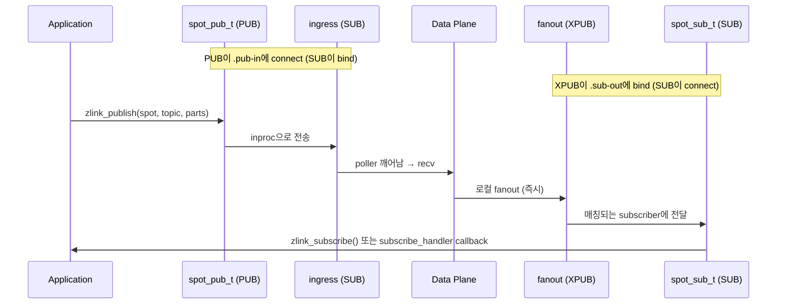

### Attachment 생성

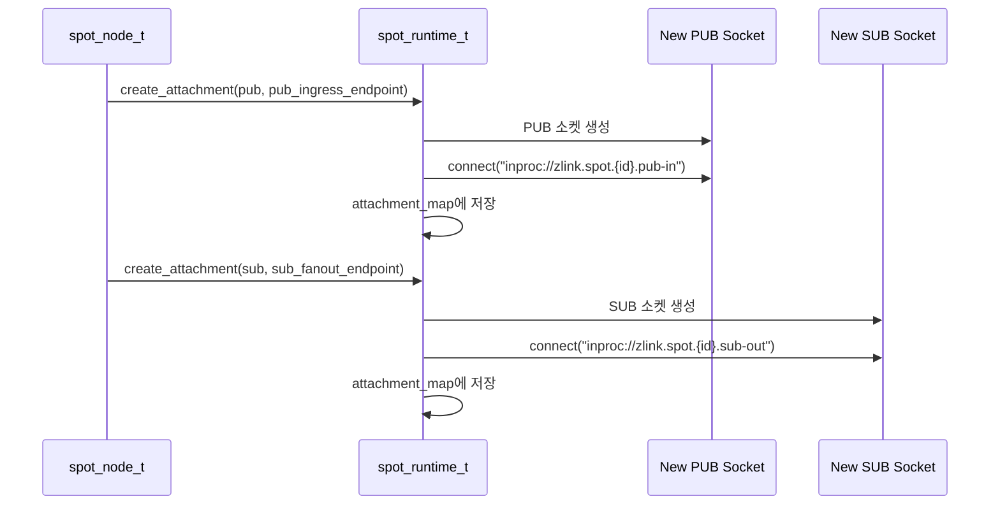

## 4. 토픽 메시지 흐름 (상세)

### 4.1 로컬 Publish → 로컬 Subscribe

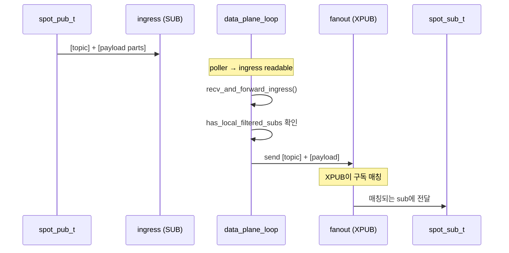

### 4.2 로컬 Publish → 원격 Peer

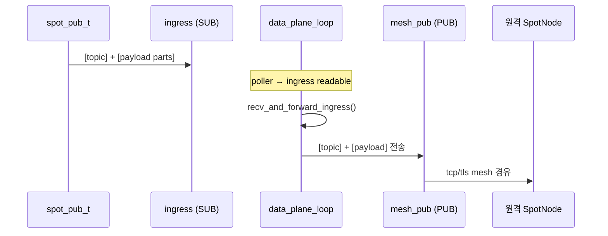

### 4.3 원격 수신 → 로컬 Subscribe

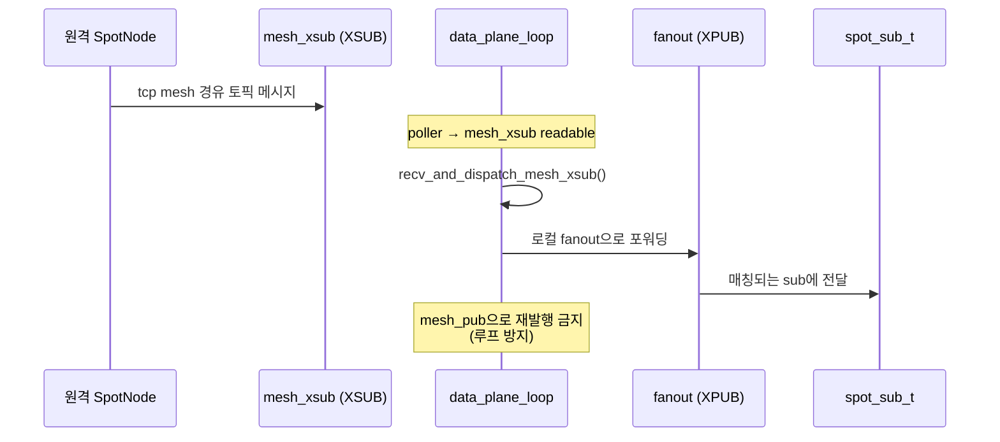

## 5. Routed 메시지 흐름 (상세)

Routed 평면에서 중요한 변화는 하나다. target `Spot`은 더 이상 node가 대신 채워 준
hidden recv queue를 읽지 않는다. 각 `Spot`은 create 시점에 자기 own routed ingress
`ROUTER`를 준비하고, `zlink_spot_recv()`는 그 ingress를 직접 읽는다.

즉 routed delivery owner는 항상 target `Spot`이다. `SpotNode`는 routed broker와
local inproc wiring을 맡지만, 최종 recv owner를 대신하지 않는다.

### 5.1 로컬 spot → 로컬 spot (같은 노드)

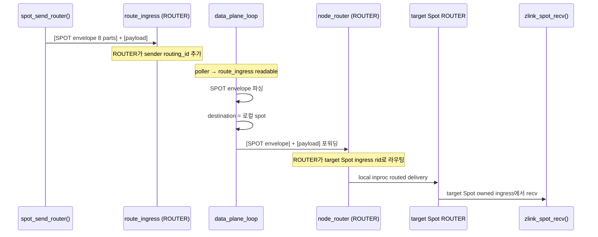

### 5.2 로컬 spot → 원격 spot (노드 간)

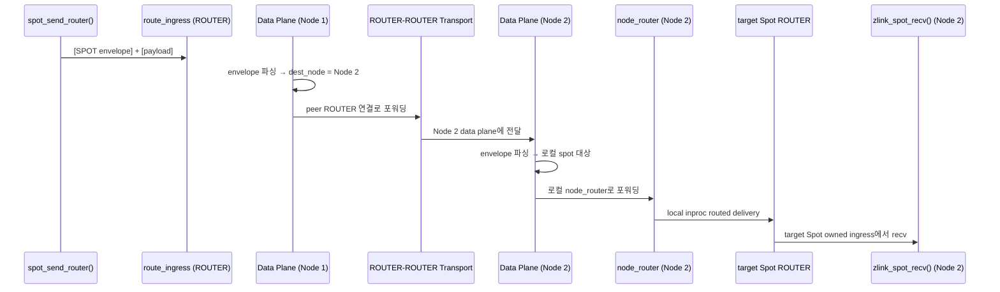

### 5.3 spot → router / router → spot (one-way send)

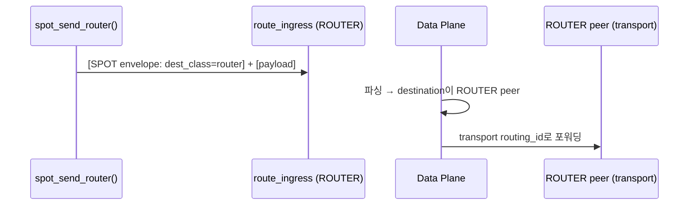

### 5.4 Spot routed request-reply

`zlink_spot_request_spot()` / `zlink_spot_request_router()`는 5.1–5.3의
transport 경로를 그대로 사용하되, request-reply 프로토콜을 추가로 얹는다.

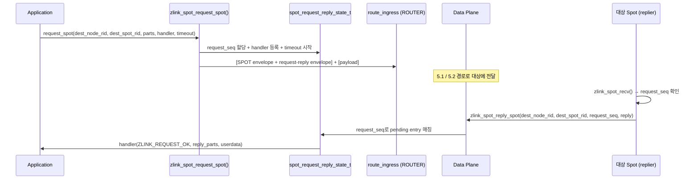

- request-reply envelope은 SPOT routed envelope 안에 중첩된다.
- request_seq는 per-handle `spot_request_reply_state_t`가 관리한다.
- timeout 만료 또는 node 종료 시에도 handler가 정확히 한 번 호출된다.
- `spot → router` 경로도 같은 구조를 따른다 (대상이 `ROUTER` peer, reply는
  `zlink_router_reply_spot()`).

## 6. Control Plane

### 6.1 Control Task 주기 (10ms)

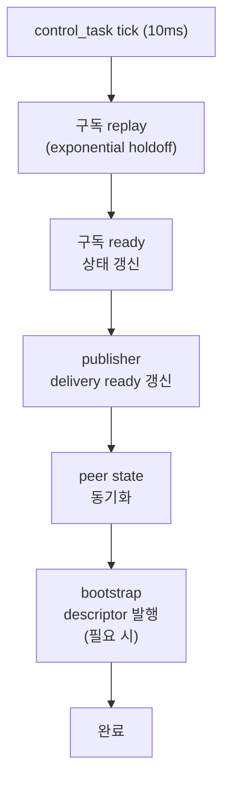

### 6.2 Peer 제어 메시지

Peer 제어 endpoint는 바인드된 데이터 endpoint에서 파생된다:

| Transport | Data Endpoint | Control Endpoint | Route Endpoint |
|-----------|--------------|-----------------|----------------|
| tcp | `tcp://host:9000` | `tcp://host:10000` (port+1000) | `tcp://host:29000` (port+20000) |
| tls | `tls://host:9000` | `tls://host:10000` | `tls://host:29000` |
| ipc | `ipc:///path` | `ipc:///path.zlink-spot-ctrl.{id}` | `ipc:///path.zlink-spot-route.{id}` |
| inproc | `inproc://name` | `inproc://zlink.spot.peer-ctrl.{id}` | `inproc://zlink.spot.peer-route.{id}` |

Route endpoint에는 `peer_route_ingress` (ROUTER)가 바인드된다. 원격 peer는 `peer_route_tx` (PAIR)로 이 endpoint에 연결해 직접 routed 메시지를 보낸다.

제어 메시지 접두어:
- `__zlink.spot.ctrl.snapshot` — 상태 스냅샷
- `__zlink.spot.ctrl.ready_ack` — 구독 준비 확인
- `__zlink.spot.bootstrap.ctrl_descriptor` — bootstrap 정보

## 7. Data Plane Polling Loop

Data plane은 별도 스레드에서 실행되며 7개 소켓을 poll한다:

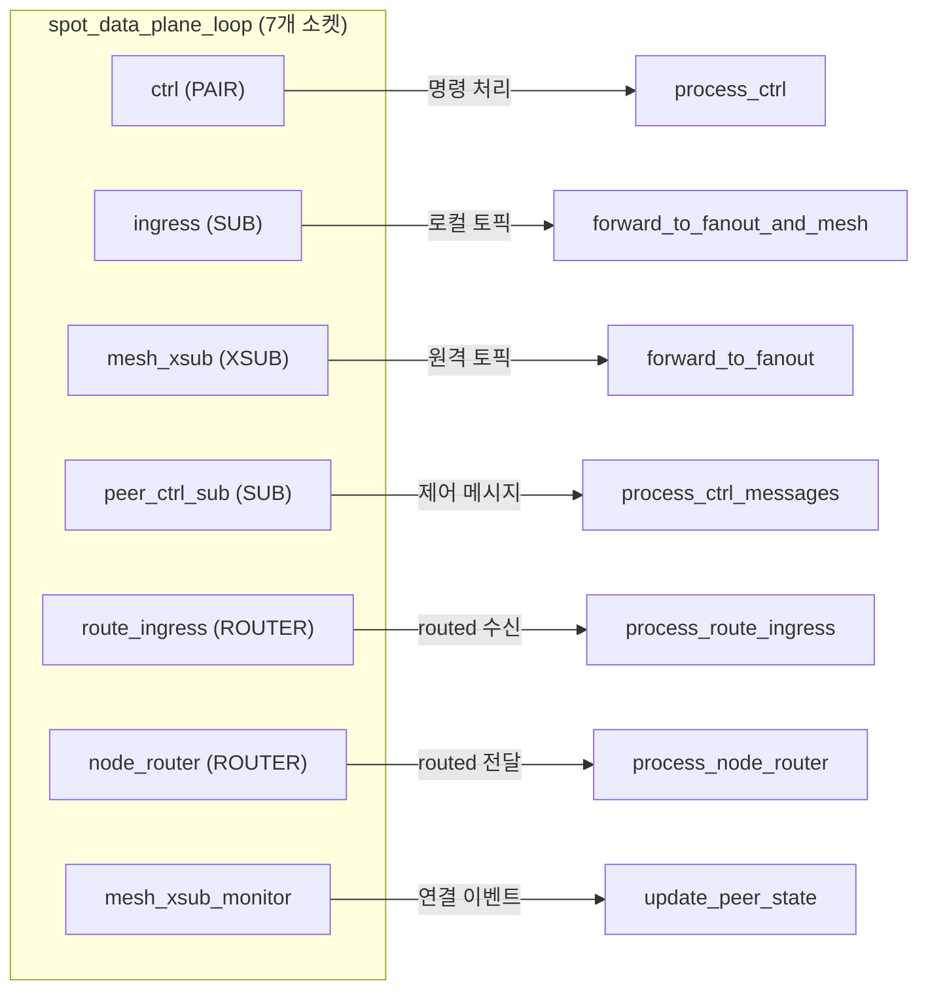

## 8. Unified Handle (spot_handle_t)

```cpp
struct spot_handle_t {
    uint32_t tag;                                // 검증 태그
    spot_node_t *node;                           // 부모 SpotNode
    spot_pub_t *pub;                             // Publisher (inproc PUB → ingress)
    spot_sub_t *sub;                             // Subscriber (inproc SUB ← fanout)
    zlink_subscribe_handler_fn handler;          // internal-only: SPOT subscribe adapter
    void *handler_userdata;
    spot_node_t::pub_defaults_t pending_pub_defaults;
    spot_node_t::sub_defaults_t pending_sub_defaults;
    service_mode_state_t mode_state;             // recv/callback 모드 추적
    std::shared_ptr<void> request_reply_state;   // handle별 RR state
};
```

Unified handle은 SpotNode를 빌린다. 여러 handle이 하나의 node를 공유할 수 있다.
각 handle은 자신만의 pub/sub 쌍, mode state, request-reply state를 갖는다.
request-reply state 안에는 per-spot routed ingress `ROUTER`, completion signal,
identity lookup 정보가 함께 묶여 있다. 이 routed ingress는 `zlink_spot_new()`
성공 시점에 준비되며, 첫 `zlink_spot_recv()`가 뒤늦게 만들지 않는다.

## 9. HWM 경계

```text
+------------------------------------------------------------------+
|  Spot Handle HWM                                                  |
|  (public facade pub/sub 소켓)                                      |
|  ┌──────────────────────────────────────────────────────────────┐ |
|  │  SpotNode Data-Plane HWM                                     │ |
|  │  ┌─────────────────────────┬────────────────────────────┐    │ |
|  │  │  SNDHWM 적용 대상:       │  RCVHWM 적용 대상:          │    │ |
|  │  │  - fanout (PUB)         │  - ingress (SUB)            │    │ |
|  │  │  - mesh_pub (PUB)       │  - mesh_xsub (XSUB)        │    │ |
|  │  │  - node_router (SND)    │  - route_ingress (ROUTER)   │    │ |
|  │  │                         │  - node_router (RCV)        │    │ |
|  │  └─────────────────────────┴────────────────────────────┘    │ |
|  │                                                               �� |
|  │  peer_ctrl은 CONTROL PLANE → 별도 HWM (1024)                 │ |
|  └──────────────────────────────────────────────────────────────┘ |
+------------------------------------------------------------------+
```

기본 내부 data-plane HWM: `1000`

Topic과 routed HWM은 `zlink_set_spot_node_option()`으로 독립 설정 가능:
- `ZLINK_SPOT_NODE_OPT_TOPIC_SEND_HWM` / `ZLINK_SPOT_NODE_OPT_TOPIC_RECV_HWM`
- `ZLINK_SPOT_NODE_OPT_ROUTED_SEND_HWM` / `ZLINK_SPOT_NODE_OPT_ROUTED_RECV_HWM`

## 10. Dispatch Event 스레딩 모델

공개 API 의 `zlink_spot_dispatch_event_handler()` 표면은 **네 개의
독립된 내부 이벤트 producer** 를 단일 핸들러로 fan-in 하는 알림 전용
콜백이다. 이 절에서는 각 이벤트를 어떤 내부 스레드가 발생시키는지,
등록이 어떻게 강제되는지, 그리고 콜백이 지켜야 하는 스레드 안전성
경계를 정리한다.

### 10.1 이벤트 producer 와 스레드

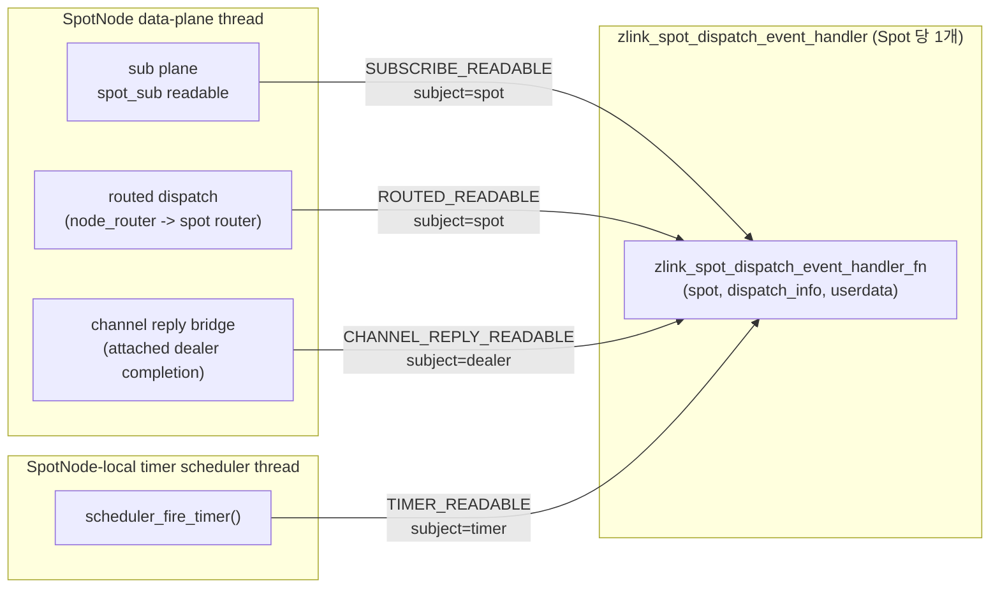

| 이벤트 | 발원 producer | `subject_kind` | 콜백을 호출하는 스레드 |
|-------|---------------|---------------|----------------------|
| `SUBSCRIBE_READABLE` | `spot_sub_handler_adapter` — `spot_sub_t` 의 direct handler | `SUBJECT_SPOT` | SpotNode data-plane polling 스레드 |
| `ROUTED_READABLE` | `queue_spot_message()` — routed 전달을 target Spot owned `ROUTER`로 보낸 뒤 호출 | `SUBJECT_SPOT` | SpotNode data-plane polling 스레드 |
| `CHANNEL_REPLY_READABLE` | attached dealer completion bridge — dealer completion을 spot dealer source queue에 적재한 뒤 호출 | `SUBJECT_CHANNEL_DEALER` | dealer completion을 처리하는 스레드 (data-plane 또는 별도 completion 스레드) |
| `TIMER_READABLE` | `scheduler_fire_timer()` — fire count 를 deque 에 넣고 signaler 를 raise 한 뒤, direct timer handler 가 없을 때만 호출 | `SUBJECT_TIMER` | SpotNode-local 타이머 스케줄러 스레드 |

dispatch 우선순위: `SUBSCRIBE_READABLE` → `ROUTED_READABLE` → `CHANNEL_REPLY_READABLE` → `TIMER_READABLE`

네 producer 는 모두 하나의 공통 진입점,
`zlink_spot_notify_dispatch_info()` → `maybe_dispatch_spot_info()`,
를 통해 콜백에 닿는다. 이 함수는 per-Spot mutex 아래에서 handler
포인터와 dispatch_info 를 스냅샷으로 읽은 다음, 내부 락을 해제한 상태에서
콜백을 호출한다:

```cpp
void maybe_dispatch_spot_info (spot_request_reply_state_t *state_,
                               const zlink_spot_dispatch_info_t &info_)
{
    zlink_spot_dispatch_event_handler_fn handler = NULL;
    void *userdata = NULL;
    void *owner = NULL;
    {
        std::lock_guard<std::mutex> lock (state_->mutex);
        handler = state_->dispatch_event_handler;
        userdata = state_->dispatch_event_handler_userdata;
        owner = state_->owner;
    }
    if (handler)
        handler (owner, &info_, userdata);
}
```

이 "snapshot 후 invoke" 패턴은 의도적인 것이다. handler 는 zlink 내부
락이 걸려있지 않은 상태에서 실행되므로, 애플리케이션이 콜백 안에서
`zlink_timer_recv()`, `zlink_spot_recv()`, `zlink_subscribe()`,
`zlink_spot_channel_reply_progress_from()` 같은 zlink API 를 자유롭게
호출할 수 있다. 다만 §10.4 에서 설명하듯, 애플리케이션 워커로 작업을
넘기는 쪽이 여전히 권장된다.

### 10.2 등록 규칙과 상호 배제

per-Spot `spot_request_reply_state_t` 는 routed/dispatch 축 위에 두 개의
handler 슬롯을 가진다:

```cpp
struct spot_request_reply_state_t {
    // ...
    zlink_spot_handler_fn                  request_handler;            // direct routed
    void                                  *request_handler_userdata;
    zlink_spot_dispatch_event_handler_fn   dispatch_event_handler;     // 통합 알림
    void                                  *dispatch_event_handler_userdata;
};
```

`zlink_spot_handler()` 와 `zlink_spot_dispatch_event_handler()` 는 값을
쓰기 전에 `state->mutex` 를 잡고
`state->request_handler || state->dispatch_event_handler` 를 검사한다.
둘 중 하나라도 NULL 이 아니면 `ZLINK_HANDLER_BUSY` 를 반환한다. 이것이
사용자 가이드에서 이야기하는 "상호 배타" 규칙의 출처다.

direct subscribe callback 을 설치하는 공개 함수는 없다.
`zlink_subscribe_handler_fn` typedef 는 내부 SPOT adapter 만 사용한다.

### 10.3 이벤트별 발생 조건

**`SUBSCRIBE_READABLE`** — data-plane 스레드에서 `spot_sub_t` 의 direct
handler (즉 `spot_sub_handler_adapter`) 가 호출될 때 발행된다. 중요한 점은
node-wide service attachment readable을 모든 facade spot에 fan-out하지 않는다는
것이다. 이제 `SUBSCRIBE_READABLE`은 해당 `Spot`이 실제로 subscribe recv를 할 수
있을 때만 올라와야 한다.

**`ROUTED_READABLE`** — `queue_spot_message()` 가 routed payload (node
rid, spot rid, request_seq, parts) 를 target `Spot`의 owned ingress
`ROUTER`로 local 전달한 뒤 발행된다. 즉 routed dispatch는 "어딘가에 routed
work가 생겼다"가 아니라 "이 Spot의 routed ingress에서 실제 recv가 가능하다"는
의미를 가져야 한다.

두 readable 이벤트는 모두 edge가 아니라 level-like readiness로 취급한다.

- callback 1회가 메시지 1개를 뜻하지 않는다.
- 이미 readable인 동안 메시지가 더 들어오더라도 callback 개수와 메시지 개수는
  1:1이 아닐 수 있다.
- callback consumer는 `zlink_spot_subscribe()` 또는 `zlink_spot_recv()`를
  `EAGAIN`이 나올 때까지 반복해서 drain해야 한다.

**`CHANNEL_REPLY_READABLE`** — attached dealer completion bridge가 해당 `Spot`
소유 dealer source completion queue를 채운 뒤 발행한다. 이 이벤트는 raw dealer recv
신호가 아니라 `zlink_spot_channel_reply_progress_from()`로 progress할 completion이
있다는 뜻이다.

**`TIMER_READABLE`** — `scheduler_fire_timer()` 에서, 타이머가 소유하는
Spot (`zlink_spot_timer_new(spot)` 로 만든 경우) 이고 **direct timer
handler 가 없을 때만** 발행된다. 이 분기에서 scheduler 는 먼저 fire
count 를 `timer->fired_counts` 에 push, 이어서 `timer->signaler`
(eventfd) 를 raise, 마지막으로
`zlink_spot_notify_dispatch_event(owner_spot, TIMER_READABLE, timer)` 을
호출한다. `subject_kind` 는 `SUBJECT_TIMER` 이고 `subject` 는 타이머
handle 이다. 같은 타이머에 `zlink_timer_handler()` 가 붙어 있으면
scheduler 가 그 handler 를 inline 으로 실행하며 dispatch event 는
발행되지 않는다 — 이것이 사용자 가이드의 per-timer 우선순위 규칙이다.

### 10.4 애플리케이션 워커와의 전체 흐름

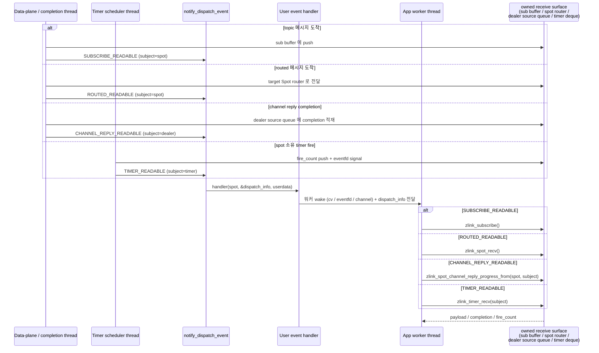

producer 들은 `notify_dispatch_event` 이후 애플리케이션 로직에 더 이상
들어가지 않는다. 메시지 디코딩, 토픽 매칭, 타이머 재스케줄링, dealer
completion decode 는 모두 내부 스레드에서 처리되고, 워커 스레드는 이미
ready 상태가 확정된 owned receive surface만 접근한다.

### 10.5 Channel Reply Delivery Bridge

attached dealer completion 이 Spot dispatch stream 으로 올라오는 경로는
아래와 같다.

```text
network reply
    → attached DEALER (transport owner, pending request matching)
    → dealer completion (decode, timeout/error 판정)
    → bridge callback (originating Spot dealer source queue 에 적재)
    → CHANNEL_REPLY_READABLE dispatch event (subject = dealer handle)
    → 애플리케이션 워커: zlink_spot_channel_reply_progress_from(spot, dealer)
    → request completion callback 실행
```

bridge 의 핵심 규칙은 아래와 같다.

- dealer completion 이 발생해도 bridge 는 user callback 을 직접 호출하지
  않는다. completion 을 originating `Spot` 의 dealer source queue 에 적재하고
  dispatch event 를 세운다.
- originating `Spot` state 가 이미 종료 중이면 completion 을 조용히 폐기하거나
  `ETERM` 규칙에 맞게 정리한다. dead `Spot` 을 다시 깨우지 않는다.
- `Spot` progress — `zlink_spot_request_progress_internal()` — 가 attached
  dealer completion signal 을 함께 감시하고 bridge 단계까지 진전시킨다.
  binding 이 attached dealer 별로 별도 progress pump 를 돌리지 않아도 된다.

dealer source queue 는 attached dealer 별로 별도 queue 다. 여러 dealer 가
동시에 ready 여도 서로 다른 `CHANNEL_REPLY_READABLE` dispatch pending item 으로
각각 callback 된다.

### 10.6 스레드 안전성 불변식

| 불변식 | 강제 수단 |
|---|---|
| Handler 포인터 읽기는 race-free | `maybe_dispatch_spot_info` 에서 `state->mutex` 아래 스냅샷 |
| Handler 는 내부 락을 들지 않은 상태에서 실행 | snapshot 후 락 해제 후 호출 |
| 알림 전에 payload 가 반드시 큐에 존재 | producer 가 큐 push (sub buffer / PAIR queue / dealer source queue / fired_counts + signaler) *뒤에* notifier 호출 |
| wake-up 누락 없음 | Level-triggered — 워커가 각 큐를 pull API 가 `ZLINK_RECV_NO_DATA` 를 반환할 때까지 drain 한다. drain 도중 발생한 중복 알림은 무해 |
| Direct handler vs dispatch event | 컴파일 시점에 경로가 분리 — subscribe 는 `spot_sub_handler_adapter`, routed 는 `request_handler` 슬롯, timer 는 각 타이머의 자체 handler 슬롯. routed 축에서는 등록 시점 mutex 로 이중 설치를 거부하고, 타이머는 `scheduler_fire_timer` 내부에서 per-timer 우선순위를 판정 |
| 콜백에서 zlink API 호출 가능 | producer 가 notifier 호출 전에 내부 락을 해제 |
| Channel reply 와 routed / subscribe 동시 실행 없음 (애플리케이션 책임) | library 는 callback 이 동시 호출되지 않도록 막지 않는다. 직렬화는 애플리케이션이 **단일 worker thread** 패턴을 지켜야 성립한다. callback 은 "워커를 깨우는 신호"일 뿐이고, 실제 drain 은 그 worker thread 하나에서 일어나므로 Spot state 에 별도 lock 이 필요 없는 것이다 |
| Late reply double completion 없음 | dealer completion 이 bridge 에 도달하기 전에 pending state 에서 먼저 확정됨. 이미 완료된 request 의 late reply 는 bridge 에서 폐기 |

### 10.7 애플리케이션 관점에서 단일 dispatch stream 설계인 이유

내부 producer 는 넷이지만 handler 는 하나이므로, 애플리케이션은
알림을 condition variable wake 로 받아 네 큐 모두를 하나의 애플리케이션
스레드에서 소비할 수 있다.

- sub / routed / channel reply / timer 소비자 사이에 사용자 락이 필요 없다.
  네 소비자는 서로 다른 내부 큐를 읽으며, 공유되는 것은 결국 애플리케이션
  bookkeeping 뿐이고 그 bookkeeping 은 단일 워커 스레드가 배타적으로 소유한다.
- handler 자체는 `lock_guard + cv.notify + (dispatch_info 저장)` 수준으로
  충분하며 zlink API 를 건드릴 필요가 없다.
- producer 스레드는 raw 함수 호출 이상의 대기를 하지 않고 즉시 자기
  polling loop 로 돌아간다.
- channel reply 도 같은 dispatch stream 에 포함되므로, binding 이 attached
  dealer 별 별도 progress pump 를 유지하지 않아도 된다.

이것이 사용자 가이드에서 timer, routed recv, subscribe, channel reply 가
하나의 Spot handle 위에 공존할 때 `zlink_spot_dispatch_event_handler` 를
통합 소비 패턴으로 권장하는 근본 이유다.

## 11. Channel Topology 내부 구조

channel-aware SPOT은 기존 SpotNode data plane 위에 올라간다. 핵심 추가 구조는
SPOT mesh용 Discovery view 하나, channel 호출용 `DEALER` map, 외부 publish
ingress 경로다.

```text
+------------------------------------------------------------------+
|                          SpotNode Runtime                        |
|------------------------------------------------------------------|
| SPOT discovery view (active view 1개)                            |
|  channel_name, channel_type = SPOT                               |
|  -> peer mesh auto-connect 범위 결정                              |
|------------------------------------------------------------------|
| channel dealer map                                               |
|  channel_name -> { DEALER, source: auto | manual }               |
|  같은 channel_name에 auto/manual 합쳐 DEALER 1개                  |
|------------------------------------------------------------------|
| pub ingress (node당 1개)                                          |
|  external PUB -> hidden ingress receiver -> topic path            |
|------------------------------------------------------------------|
| routed data plane                                                |
|  peer ROUTER mesh (같은 channel SpotNode 사이)                    |
|  channel DEALER -> ROUTER(server) 경로 (channel 호출)             |
|------------------------------------------------------------------|
| service monitor                                                  |
|  peer state, admission, topology 변경 이벤트                      |
+------------------------------------------------------------------+
```

### 11.1 SPOT Discovery view

- `SpotNode`에는 `ZLINK_CHANNEL_TYPE_SPOT` view를 가진 Discovery를 하나만
  attach할 수 있다. 이 view가 node의 mesh auto-connect 범위를 결정한다.
- view가 공급하는 peer set은 같은 `channel_name`의 다른 `SpotNode`뿐이다.
  같은 `channel_name`의 일반 `ROUTER`, `PUB`, `SUB` provider는 mesh peer
  자동 연결 대상이 아니다.
- 두 번째 SPOT channel Discovery attach는 `EBUSY`로 거부된다.
- attach된 Discovery를 destroy하면 그 view가 공급하던 automatic peer set도
  함께 빠진다.
- Discovery가 없는 `SpotNode`는 수동 `connect_peer()` / `disconnect_peer()`로만
  mesh를 구성할 수 있다. discovery attach와 수동 peer connect는 같은 node에서
  동시에 사용할 수 없다.

### 11.2 Channel dealer map

- channel 호출(`zlink_spot_send_channel()` / `zlink_spot_request_channel()`)은
  이 map에서 `channel_name`으로 attach된 `DEALER`를 찾아 전송한다.
- 자동 경로(`attach_channel_dealer`)는 `ZLINK_CHANNEL_TYPE_SOCKET` view를 가진
  Discovery와 함께 `DEALER`를 등록한다. Discovery가 peer set을 관리한다.
- 수동 경로(`attach_channel_dealer_manual`)는 호출자가 직접 connect를 끝낸
  `DEALER`를 `channel_name` 아래에 등록한다.
- 같은 `channel_name`에 자동 attach와 수동 attach를 합쳐서 `DEALER` 하나만
  등록할 수 있다. 중복은 `EBUSY`로 거부된다.
- attach된 `DEALER`는 `SpotNode` 전용 자원으로 취급한다. 소유권은 호출자가
  유지하지만, 다른 owner가 같은 socket을 일반 용도로 함께 써서는 안 된다.
- `channel_name`에 대응하는 `DEALER`가 없을 때 channel 호출은 `ENOENT`로
  실패한다.

### 11.3 Pub ingress

- `zlink_spot_node_attach_pub_ingress()`로 외부 일반 `PUB`를 `SpotNode` 입력
  경로에 연결한다.
- attach 시 라이브러리는 node 전용 hidden ingress receiver를 내부 생성한다.
  이 hidden receiver는 공개 API에 노출되지 않는다.
- 외부 `PUB`에서 publish한 topic은 hidden receiver를 거쳐 local `SpotNode`의
  topic path로 올라간다. 이 경로는 mesh peer pub/sub 연결과 같은 의미가 아니라,
  외부 publisher가 local runtime으로 topic을 주입하는 단방향 입력 경로다.
- ingress로 들어온 topic은 local `Spot` 수신 경로로 올라가며, mesh peer가
  있으면 같은 channel peer로도 forward될 수 있다.
- ingress `PUB`는 node당 하나만 등록할 수 있다. 두 번째 등록은 `EBUSY`다.
- attach는 socket 소유권을 가져오지 않는다. destroy 책임은 호출자에게 남는다.

### 11.4 Channel 호출 라우팅

- channel 호출은 항상 attach된 `DEALER` 경로로만 나간다. `SpotNode.router`
  경로를 channel 호출에 재사용하지 않는다.
- `DEALER(client) -> ROUTER(server)` 모델이다. channel 처리자 집합 중 하나에
  보내는 의미이지, 특정 server를 직접 지목하는 의미가 아니다.
- channel request의 reply는 요청을 보낸 같은 `DEALER` 경로로만 돌아온다.
  reply를 다시 `channel_name`으로 재탐색하지 않는다.
- `DEALER`가 있으나 현재 전송 가능한 peer가 없으면 `ENOTCONN`으로 정규화된다.

### 11.5 Service monitor

- `SpotNode` 상태 관찰은 `zlink_service_monitor_open()` /
  `zlink_service_monitor_recv()`와 snapshot/query API를 사용한다.
- peer state, admission 변경, topology 이벤트가 monitor를 통해 노출된다.
- monitor event는 Spot dispatch readable plane에 섞이지 않는다.

### 11.6 Active set 유지

- Discovery churn으로 mesh peer가 끊기면 해당 peer는 즉시 active 집합에서
  제외된다.
- peer가 복구되면 현재 subscription filter 집합을 replay한 뒤 active 집합에
  재진입시킨다.
- channel dealer의 경우, Discovery가 관리하는 peer set이 변경되면 `DEALER`의
  유효 후보가 자동으로 갱신된다.
- 수동 attachment는 socket 상태가 정상인 동안 active로 유지된다.

### 11.7 Admission state 전파

`zlink_set_admission_state()`로 SpotNode 자신이 `SERVING`/`DRAINING`을 바꾸면,
변경은 SpotNode 내부 peer control 경로(`peer_ctrl_pub` / `peer_ctrl_sub`)
를 통해 best-effort runtime 신호로 다른 SpotNode peer에게 advertise된다.

- 각 peer는 자신의 SpotNode peer cache(§2.2 참조)에서 해당 항목의
  admission state를 갱신한다. 이 cache는 `zlink_spot_node_peers_snapshot()`
  과 `zlink_spot_node_peers_query()`가 돌려주는
  `zlink_spot_node_peer_entry_t.admission_state`의 source이기도 하다.
- 같은 cache는 service-aware ROUTER 후보 선택에도 쓰인다. 따라서 peer가
  `DRAINING`으로 보이면 service-aware send/request는 그 peer를 후보에서
  제외하고, 후보가 모두 `DRAINING`이면 submit은
  `ZLINK_SUBMIT_NOT_ADMITTED`로 정규화되어 반환된다. 직접 SPOT request도
  대상 SpotNode가 `DRAINING`이면 같은 결과를 낸다.
- 변경은 service monitor의
  `ZLINK_SERVICE_MONITOR_EVENT_PEER_ADMISSION_CHANGED`로도 함께 노출된다.
  같은 raw socket 쪽 변경은 별도로 socket monitor의
  `ZLINK_EVENT_PEER_ADMISSION_CHANGED`로 surface된다.
- peer 재연결 후에는 현재 admission state를 한 번 더 advertise해서 stale
  cache로 인한 잘못된 후보 선택을 줄인다.

## 12. Peer rid disconnect

SpotNode는 discovery provider에서 얻은 `node_rid -> endpoint set` 인덱스를
유지한다. `zlink_spot_node_disconnect_peer_rid()`는 target node rid로 endpoint
set을 찾은 뒤 endpoint 기준 disconnect와 같은 control path를 endpoint별로
실행한다.
