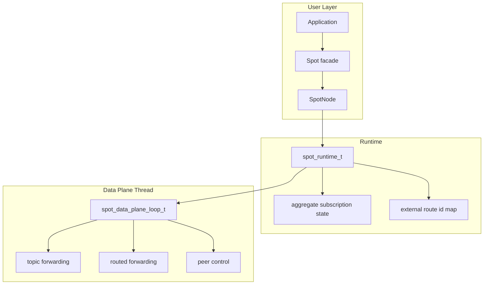
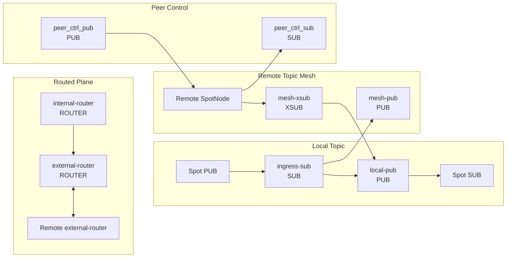
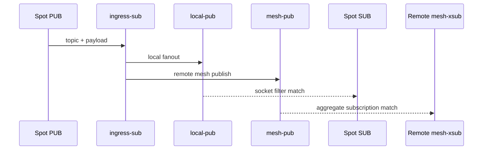
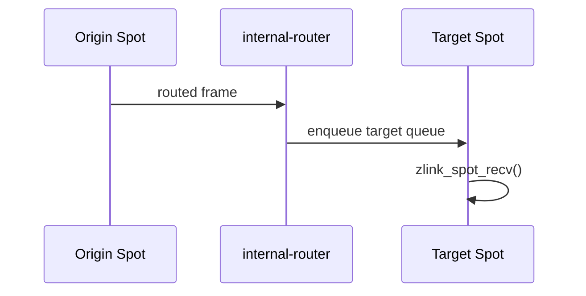
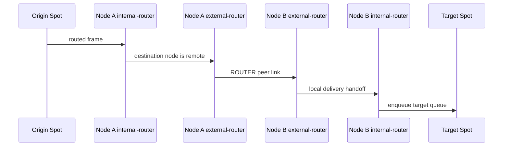

[English](spot-internals.md) | [한국어](spot-internals.ko.md)

# SPOT / SpotNode Internals

This document helps core maintainers understand SPOT wiring and data flow.
The public API contract is
[`doc/spec/core/service/spot.md`](../spec/core/service/spot.md).

## 1. Overview

`SpotNode` owns lifecycle. `Spot` is a borrowed data-plane facade layered on top
of that node. Destroying a `Spot` does not destroy its backing `SpotNode`.

## 2. Internal Socket Topology

SpotNode creates only the socket planes required by its mode.

| mode | main planes |
|------|-------------|
| `PUBSUB` | topic publish/subscribe, peer control |
| `ROUTED` | routed delivery, peer control |
| `ALL` | topic, routed, peer control |

Disabled planes are not created by snapshot calls or by the first call to a
disabled API.

### 2.1 Main sockets

| socket | type | role | HWM option axis |
|--------|------|------|-----------------|
| `ingress-sub` | `SUB` | receives local publish input | `ZLINK_SPOT_NODE_OPT_SUB_HWM` |
| `local-pub` | `PUB` | fans out to subscribers in this node | `ZLINK_SPOT_NODE_OPT_PUB_HWM` |
| `mesh-pub` | `PUB` | forwards topic publish to remote nodes | `ZLINK_SPOT_NODE_OPT_PUB_HWM` |
| `mesh-xsub` | `XSUB` | receives topic publish from remote nodes | `ZLINK_SPOT_NODE_OPT_SUB_HWM` |
| `internal-router` | `ROUTER` | delivers routed messages to target Spots in this node | routed send/recv HWM |
| `external-router` | `ROUTER` | exchanges routed frames with peer nodes | routed send/recv HWM |
| `peer_ctrl_pub` | `PUB` | sends peer control messages | control defaults |
| `peer_ctrl_sub` | `SUB` | receives peer control messages | control defaults |

`zlink_spot_node_internal_sockets_snapshot()` returns only sockets that already
exist. The perf `Auto-HWM spotnode` table uses these snapshot names directly.

## 3. Topic Plane

The topic plane relies on native socket subscription filters for both local and
remote delivery. Runtime does not perform publish-time target lookup.

Local topic matching is owned by each `Spot SUB` subscription state. Remote
topic matching is owned by each peer node's `mesh-xsub` aggregate subscription
state.

### 3.1 Aggregate Subscription Lifetime

Runtime tracks node-level subscription lifetime for remote mesh propagation.

| state | structure | meaning |
|-------|-----------|---------|
| exact topic | `topic -> refcount` | number of local subscribers for an exact topic |
| prefix | `prefix -> refcount` | number of local subscribers for a prefix |

The rules are:

1. Send remote aggregate subscribe only on `0 -> 1`.
2. Send remote aggregate unsubscribe only on `1 -> 0`.
3. Intermediate increments and decrements update local state only.

This keeps duplicate local subscriptions from becoming duplicate remote
subscriptions.

## 4. Routed Plane

The routed plane has two router axes.

| router | scope | role |
|--------|-------|------|
| `internal-router` | inside one node | delivers to the target `Spot` routed receive queue |
| `external-router` | between nodes | exchanges routed frames with peer `external-router` sockets |

There is no separate routed ingress broker and no topic-mesh fallback for
routed delivery. Local routed delivery is tracked through `internal-router`.
Remote routed delivery is tracked through `external-router`.

### 4.1 Local Routed Delivery

If the target `Spot` queue exceeds its hard limit, only that routed target is
marked disconnected. The node and peer connection stay alive.

### 4.2 Remote Routed Delivery

Remote routed delivery uses an external route id map per peer. Only
`spot_runtime_t` methods update that map, so callers do not need to know the
map structure or locking rules.

## 5. Queue Hard Limits

SPOT uses delivery-target hard limits so a slow consumer cannot stall the whole
node.

| option | default | target |
|--------|---------|--------|
| `ZLINK_SPOT_NODE_OPT_SUB_QUEUE_HARD_LIMIT` | `100` | local subscribe delivery target |
| `ZLINK_SPOT_NODE_OPT_ROUTED_QUEUE_HARD_LIMIT` | `500` | routed delivery target |

When a target exceeds its limit, only that target is marked disconnected. The
status counters are:

- `disconnected_sub_target_count`
- `disconnected_routed_target_count`

## 6. Auto-HWM

SPOT topic sockets split the HWM axis by pub/sub role.

| option | sockets |
|--------|---------|
| `ZLINK_SPOT_NODE_OPT_PUB_HWM` | `local-pub`, `mesh-pub` |
| `ZLINK_SPOT_NODE_OPT_SUB_HWM` | `ingress-sub`, `mesh-xsub` |
| `ZLINK_SPOT_NODE_OPT_ROUTED_SEND_HWM` | send side of `internal-router`, `external-router` |
| `ZLINK_SPOT_NODE_OPT_ROUTED_RECV_HWM` | recv side of `internal-router`, `external-router` |

Without manual options, the context auto-HWM policy calculates values from the
socket role, connection count, and message unit. The perf runner uses the
`core/build` runtime and must print the resolved `libzlink` path before running.

## 7. Control Plane

The peer control plane is separated from data traffic. It carries:

- peer bootstrap data
- ready-state refresh
- aggregate subscription replay
- peer connection state

Control sockets may use a different message unit from data sockets. If a perf
table shows different `MsgUnit(B)` values in the same payload-size block, the
control plane and data plane are being calculated with different units.
