[English](spot-internals.md) | [한국어](spot-internals.ko.md)

# SPOT / SpotNode Internals

This document helps core maintainers understand SPOT wiring and data flow.
The public API contract is
[`doc/spec/core/service/spot.md`](../api/spot.md).

## 0. What SPOT Is and Why It Is Structured This Way

SPOT is the zlink **service layer** — an abstraction on top of raw sockets that
provides topic publish/subscribe, routed request/reply, and Actor-based session
dispatch in a single unified runtime.

### 0.1 Design goals

| Goal | Implementation choice |
|------|-----------------------|
| **No per-Spot physical sockets** | All transport sockets are owned by `SpotNode`. A `Spot` facade owns only a logical queue and dispatch context. |
| **Explicit admission boundary** | Public publish and routed send enqueue into `SpotNode`-owned send-side queues (`publish_ingress_queue`, `routed_send_queue`). Socket HWM computation and admission decision are separated, so internal socket wiring cannot contaminate the error semantics of public API calls. `fanout` uses HWM `0`; remote mesh sockets use auto-HWM and reduce only the per-peer pipe budget through connection buckets. Public API backpressure is still decided by the node-owned send queues. |
| **Data-plane-thread-exclusive sockets** | `mesh-pub`, `fanout`, and `routed-router` are accessed only by the `SpotNode`-dedicated data-plane thread. Public threads cannot directly touch these sockets, preventing ownership diffusion. |
| **Aggregate subscription** | Remote mesh subscriptions are reference-counted at the node level, not per-Spot. This prevents duplicate remote subscriptions when multiple local Spots subscribe to the same topic. |
| **Actor-to-Spot decoupling** | Actors do not own sockets or inproc endpoints. Parts are relayed through the SpotNode Actor table and dispatched into a Spot's logical queue, allowing Actors to move between Spots (join) without tearing down transport connections. |
| **Deterministic teardown** | Destroying a `Spot` facade does not destroy the backing `SpotNode`. Entry Spot lifetime is tied to the `SpotNode`, not to any facade. |

### 0.2 Key concepts

- **SpotNode**: owns lifecycle, transport sockets, peer wiring, and the Actor table.
- **Spot**: a borrowed data-plane facade layered on top of a `SpotNode`. Multiple
  facades can exist for the same logical Spot; all share the same underlying queue.
- **Entry Spot**: one per `SpotNode`, created automatically. Newly created Actors
  start here. The application registers a dispatch handler on the Entry Spot to
  handle initial session setup, authentication, and Actor routing decisions.
- **Actor**: a routing target managed by the `SpotNode` Actor table. Identified by
  `zlink_actor_ref_t` (node rid + actor id + generation). No socket ownership.
- **data-plane thread**: one dedicated OS thread per `SpotNode`. Exclusively owns
  `mesh-pub`, `fanout`, and `routed-router` sockets; drains send-side queues; and
  performs local fanout and remote routing.
- **dispatch worker pool**: one pool per `SpotNode`. Workers pull readable events
  posted by the data-plane thread and execute application dispatch callbacks while
  guaranteeing per-Spot callback serialization.

### 0.3 Document map

| Section | Topic |
|---------|-------|
| §1 | Runtime component overview |
| §2 | Internal socket topology by mode |
| §3–4 | Topic and routed data planes |
| §5 | Send-side queues and admission |
| §6 | Admission HWM |
| §7 | Control plane |
| §8 | Data-plane thread and dispatch worker pool |
| §9–10 | Actor dispatch model and Entry Spot queue ownership |
| §11 | Socket removal model rationale |
| §12 | STREAM session and Actor binding sequences |
| §13–14 | Internal data structures and Actor join lifecycle |

## 1. Overview

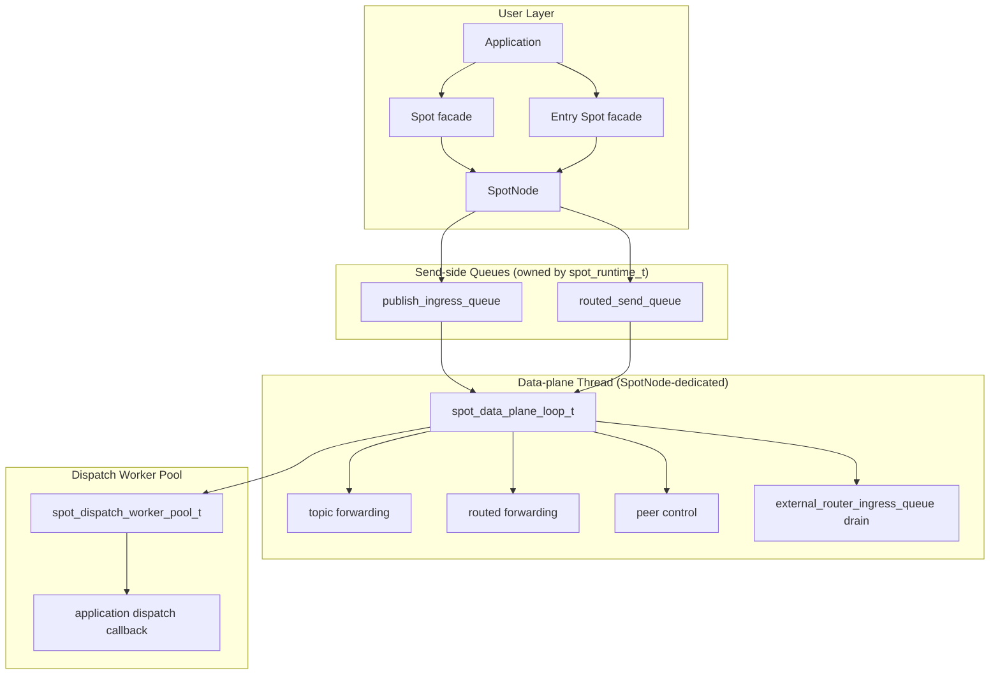

`SpotNode` owns lifecycle. `Spot` is a borrowed data-plane facade layered on top
of that node. Destroying a `Spot` does not destroy its backing `SpotNode`.

`Spot` facade does not own physical sockets. All transport sockets are owned by the
`SpotNode`. `Spot` owns only its logical dispatch queue and dispatch event context.
The `Entry Spot` is one per `SpotNode`, owned by the `SpotNode`. The application
obtains an `Entry Spot` facade via `zlink_spot_node_entry_spot()` and closes it with
`zlink_spot_destroy()`.

### 1.1 Logical Spot Map And Get-Or-New

`SpotNode` indexes logical Spots by routing id. `Spot` handles are facades, so
multiple facade handles can point to the same logical Spot. Because of that,
explicit room-id acquisition must not be assembled from `lookup ->
zlink_spot_new() -> zlink_set_routing_id()`. That sequence leaks routing-id index
and race handling to the caller.

`zlink_spot_node_spot_get_or_new()` decides creation for the same `SpotNode` and
Spot routing id under the `SpotNode` lock. The first successful caller creates
the logical state and receives `created_out = 1`. Later successful callers create
new facades for the same logical state and receive `created_out = 0`.

Snapshot APIs are diagnostic and may include facade observations. If several
facades are alive for the same logical Spot, snapshot output may contain more
than one row with the same Spot rid. Code that needs to know whether it created
the logical Spot must use `created_out`, not the number of snapshot rows.

## 2. Internal Socket Topology

SpotNode creates only the socket planes required by its mode.

| mode | main planes |
|------|-------------|
| `PUBSUB` | topic publish/subscribe, peer control |
| `ROUTED` | routed delivery, peer control |
| `ALL` | topic, routed, peer control |

Disabled planes are not created by snapshot calls or by the first call to a
disabled API.

### 2.1 Main sockets

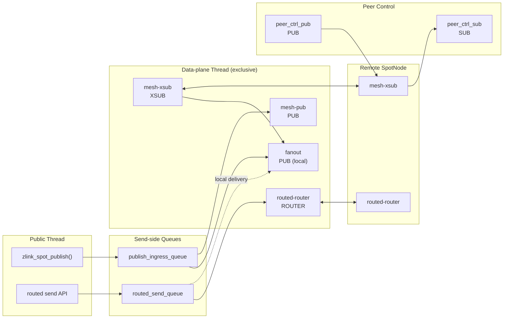

| socket | type | role | HWM policy |
|--------|------|------|------------|
| `fanout` | `PUB` | fans out to local subscribers | SNDHWM 0 |
| `mesh-pub` | `PUB` | forwards topic publish to remote nodes | pubsub admission SNDHWM (auto-HWM or override) |
| `mesh-xsub` | `XSUB` | receives topic publish from remote nodes | pubsub admission RCVHWM |
| `routed-router` | `ROUTER` | exchanges routed frames with peer nodes | router admission HWM (auto-HWM or override) |
| `peer_ctrl_pub` | `PUB` | sends peer control messages | control defaults |
| `peer_ctrl_sub` | `SUB` | receives peer control messages | control defaults |

`pub-ingress-tx`, `ingress-sub`, `internal-router`, and `internal-router-tx` have
been removed. Their staging role is replaced by `publish_ingress_queue` and
`routed_send_queue`. `zlink_spot_node_internal_sockets()` no longer returns
rows for those four sockets. The perf `Auto-HWM spotnode` table is updated accordingly.

### 2.2 Router Channel Peer

A router channel peer is a different connection kind from a SPOT mesh peer. A
SPOT mesh peer is the normal node-to-node mesh path for topic and routed SPOT
traffic. A router channel peer gives an routed router-capable channel's
`ROUTER` an ingress path to a specific `Spot`.

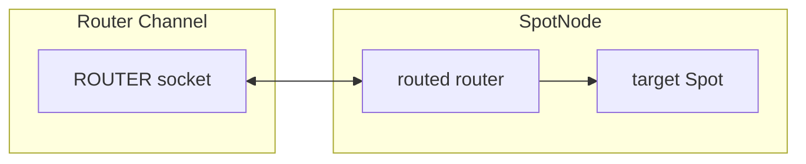

Manual wiring stores endpoint strings in `manual_endpoints` and
`active_endpoints`.

`zlink_spot_node_peers()` distinguishes SPOT mesh peers from router
channel peers. A router channel peer row includes channel name, peer endpoint,
source, kind (router channel), and state. Operators use
that split to diagnose "the mesh is down" separately from "router channel
ingress is not ready yet."

## 3. Topic Plane

The topic plane relies on native socket subscription filters for both local and
remote delivery. Runtime does not perform publish-time target lookup.

Public publish enqueues an owned message entry into `publish_ingress_queue` and
returns immediately. The data-plane thread drains the queue and performs local
fanout (`fanout` socket) and remote mesh publish (`mesh-pub` socket).

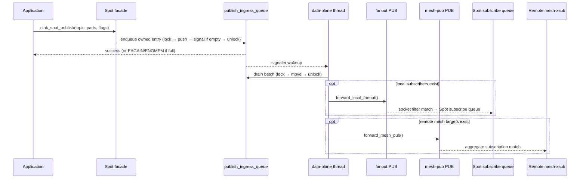

Local topic matching is owned by the `fanout` PUB socket subscription state. Remote
topic matching is owned by each peer node's `mesh-xsub` aggregate subscription state.

### 3.1 Aggregate Subscription Lifetime

Runtime tracks node-level subscription lifetime for remote mesh propagation.

| state | structure | meaning |
|-------|-----------|---------|
| exact topic | `topic -> refcount` | number of local subscribers for an exact topic |
| prefix | `prefix -> refcount` | number of local subscribers for a prefix |

The rules are:

1. Send remote aggregate subscribe only on `0 -> 1`.
2. Send remote aggregate unsubscribe only on `1 -> 0`.
3. Intermediate increments and decrements update local state only.

This keeps duplicate local subscriptions from becoming duplicate remote
subscriptions.

## 4. Routed Plane

The routed plane has a single router axis.

| router | scope | role |
|--------|-------|------|
| `routed-router` | between nodes | exchanges routed frames with peer `routed-router` sockets |

`internal-router` has been removed. Local routed delivery goes through
`routed_send_queue`; the data-plane thread delivers frames directly to the target
`Spot` routed recv queue without any intermediate socket hop.

### 4.1 Outbound routed send (local and remote)

Public routed send enqueues into `routed_send_queue` regardless of whether the
target is local or remote. The data-plane thread makes the local/remote decision
after dequeue.

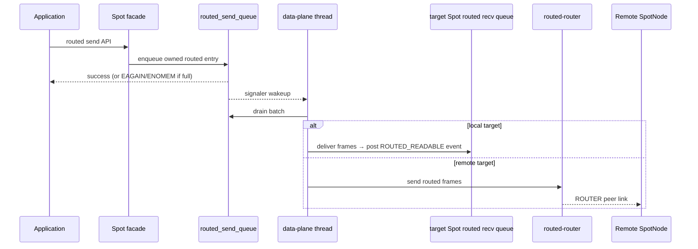

### 4.2 Inbound routed traffic (external_router_ingress_queue)

Inbound routed frames from peers arrive through the `routed-router` socket msg
dispatch callback into `external_router_ingress_queue`. The data-plane thread drains
this queue and delivers to the target `Spot` routed recv queue. Inbound traffic does
not pass through `routed_send_queue`.

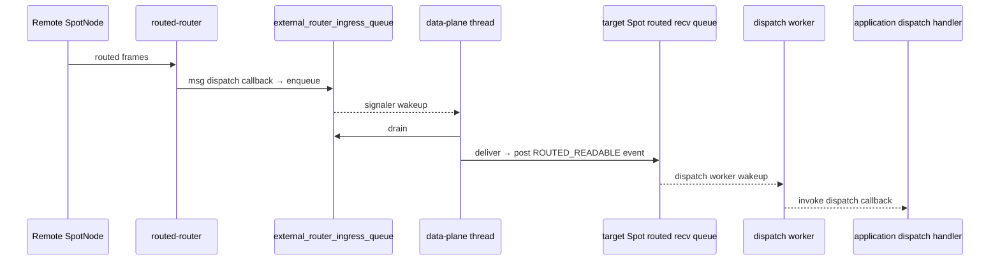

Remote routed delivery uses an external route id map per peer. Only
`spot_runtime_t` methods update that map, so callers do not need to know the
map structure or locking rules.

## 5. Send-side Queues and Admission

The first action of public publish and routed send is a queue enqueue, not a
socket send.

### 5.1 Queue structure

Three queues live inside `spot_data_plane_runtime_state_t`.

| Queue | Owner | Direction | Role |
|-------|-------|-----------|------|
| `publish_ingress_queue` | `spot_data_plane_runtime_state_t` | outbound | public publish → data-plane forwarding |
| `routed_send_queue` | `spot_data_plane_runtime_state_t` | outbound | public routed send → data-plane forwarding |
| `external_router_ingress_queue` | `spot_data_plane_runtime_state_t` | inbound | peer `routed-router` recv → routed delivery |

`publish_ingress_queue` and `routed_send_queue` are MPSC: public threads write,
the data-plane thread reads. `external_router_ingress_queue` is written by the
`routed-router` socket msg dispatch callback and read by the data-plane thread.

### 5.2 Backpressure and hysteresis

| Condition | Result |
|-----------|--------|
| Space available | enqueue succeeds; signals data-plane thread if queue was empty |
| Full + `ZLINK_DONTWAIT` | `EAGAIN` |
| Full + blocking | wait on `condition_variable` until drained or timed out |
| Shutdown in progress | `ESHUTDOWN` |
| Allocation failure | `ENOMEM` |

Backpressure uses hysteresis: `backpressure_active = true` when the hard limit is
reached; `cv.broadcast()` wakes waiting senders when the data-plane drains the
queue to roughly half.

`zlink_send_ready_handler()` and `ZLINK_POLLOUT` are wired to send-side queue
admission. When the queue drops below its resume limit, armed send-ready callbacks
fire. The semantics are "SPOT send admission is worth retrying", not "the transport
socket is writable".

### 5.3 Drain order

Each loop iteration of the data-plane thread runs:

```text
1. drain_runtime_external_router_ingress_queue()   // inbound peer traffic
2. drain_publish_ingress_queue()                   // public publish entries
3. drain_runtime_routed_send_queue()               // public routed send entries
4. flush_mesh_pub_pending()                        // staged mesh messages
5. flush_local_fanout_pending()                    // staged local messages
6. flush_staged_messages()                         // ingress → staged overflow
```

The batch limit is 2048 messages or 16 MiB of bytes, whichever comes first, to
prevent queue drain from starving peer control and mesh subscription processing.

### 5.4 Queue limit calculation

Queue limits are derived from the existing `SpotNode` admission HWM results. There
is no separate public option.

| Value | Derivation |
|-------|-----------|
| publish `admission_slots` | `ZLINK_SPOT_NODE_OPT_PUBSUB_HWM` override or auto-HWM pubsub admission |
| routed `admission_slots` | `ZLINK_SPOT_NODE_OPT_ROUTER_HWM` override or auto-HWM router admission |
| byte limit | `admission_slots * message_unit_bytes` (memory protection only) |

When queue full is frequent, do not increase the queue limit first. Check whether
the data-plane thread drains promptly, whether local fanout / `mesh-pub` / `routed-router`
are returning `EAGAIN`, and whether pending queues are building up.

## 6. Admission HWM

SpotNode exposes only admission HWM knobs. These knobs apply to both send-side
queue limits and transport socket HWM.

| option | admission path | default behavior |
|--------|----------------|------------------|
| `ZLINK_SPOT_NODE_OPT_PUBSUB_HWM_PROFILE` | topic publish admission | balanced auto-HWM profile |
| `ZLINK_SPOT_NODE_OPT_PUBSUB_HWM` | topic publish admission numeric override | positive value, `0` returns to auto-HWM |
| `ZLINK_SPOT_NODE_OPT_ROUTER_HWM_PROFILE` | routed admission | balanced auto-HWM profile |
| `ZLINK_SPOT_NODE_OPT_ROUTER_HWM` | routed admission numeric override | positive value, `0` returns to auto-HWM |

With no numeric override, SpotNode admission HWM uses the profile's message-count
baseline: COMPACT `64`, LOW_LATENCY `128`, BALANCED `256`, THROUGHPUT `512`.
SPOT service handles do not accept the raw-socket
`ZLINK_OPT_AUTO_HWM_MSG_UNIT_BYTES` option. SPOT data-path sockets instead use
the context `ZLINK_CTX_OPT_AUTO_HWM_MSG_UNIT_BYTES` when it is positive, or the
non-STREAM default message unit, `4096` bytes, when the context value is `0`.
With the default context value the balanced default is therefore `256`; small
payloads do not raise it to `1024` by themselves. Peer control sockets stay
outside this admission group.

The `fanout` relay socket uses HWM `0`. `mesh-pub` for outbound remote mesh
publish, `mesh-xsub` for inbound remote mesh publish, and `routed-router` for
routed mesh traffic use auto-HWM. Without a numeric override, these three sockets
apply connection buckets to reduce the per-peer pipe budget. This HWM bounds
internal transport pipe memory; public `publish` and routed `send` backpressure is
still defined by `publish_ingress_queue` and `routed_send_queue`.

Connection buckets remember the last bucket per socket and apply hysteresis. A
socket currently in the `1-64` bucket moves to the next bucket at `80` peers or
more; a socket currently in the `65-128` bucket moves back at `48` peers or
fewer. Profile or message-unit changes discard the retained bucket and recalculate
from the new settings.

The perf `Auto-HWM spotnode` detail shows mesh transport HWM on `mesh-pub`,
`mesh-xsub`, and `routed-router`. In the default balanced path with
`MsgUnit(B)=4096`, the profile value before connection buckets is `256`; the HWM
after bucket application can be smaller depending on remote peer count. Rows for
`pub-ingress-tx`, `ingress-sub`, `internal-router`, and `internal-router-tx` no
longer exist.

## 7. Control Plane

The peer control plane is separated from data traffic. It carries:

- peer bootstrap data
- ready-state refresh
- aggregate subscription replay
- peer connection state

Control sockets may use a different message unit from data sockets. If a perf
table shows different `MsgUnit(B)` values in the same payload-size block, the
control plane and data plane are being calculated with different units.

## 8. Data-plane Thread and Dispatch Worker Pool

### 8.1 Data-plane thread

Each `SpotNode` runs one dedicated OS thread (`spot_runtime_t::data_plane_thread`)
executing `spot_data_plane_loop_t::run_until_shutdown()`. This thread exclusively
owns:

- `mesh-pub`, `fanout`, `routed-router`, `mesh-xsub`, `peer_ctrl_pub`,
  `peer_ctrl_sub` sockets
- drain of `publish_ingress_queue`, `routed_send_queue`, `external_router_ingress_queue`
- local fanout delivery, remote mesh publish, inbound/outbound routed forwarding

Public threads do not directly access these sockets. Violating this boundary mixes
socket ownership, poller interest, and shutdown ordering into the public call path.

```
Invariants:
  Public thread does not send/recv mesh-pub, fanout, or routed-router directly.
  Data-plane thread does not invoke application dispatch callbacks directly.
```

The data-plane thread loop uses a poller together with signaler FDs from all three
queues. Any empty→non-empty queue transition wakes the thread immediately. The
idle tick is 100 ms (`data_plane_idle_tick_ms`).

The service-data runtime periodic task dependency has been fully removed. SPOT
data-plane scheduling is determined exclusively by the `SpotNode`-dedicated thread.

### 8.2 Dispatch worker pool

`spot_runtime_t::dispatch_workers` (`spot_dispatch_worker_pool_t`) executes
application dispatch callbacks.

The data-plane thread never calls dispatch callbacks directly. Instead, when a
target `Spot state` becomes ready, it calls `post_dispatch_event(void* spot_)` on
the pool. The pool manages a `_queued` set for coalescing: the same Spot pointer
is not enqueued twice.

```cpp
// spot_dispatch_worker_pool_t key fields
std::deque<void*>              _ready;    // Spot pointers waiting to be drained
std::unordered_set<void*>      _queued;   // Spots already in ready queue (dedup)
std::unordered_set<void*>      _active;   // Spots currently being executed
std::unordered_set<void*>      _dirty;    // Spots that need re-check after callback
```

Per-Spot serialization: at most one worker runs a given Spot at a time. After a
callback returns, if `_dirty` shows unread events for that Spot, it is re-enqueued
into `_ready`.

Worker count defaults:

```text
cpu_count = max(1, hardware_concurrency)
default_min = min(2, cpu_count)
default_max = max(1, cpu_count)
idle_timeout = 1000 ms (internal constant)
```

| Option | Default | Meaning |
|--------|---------|---------|
| `ZLINK_SPOT_NODE_OPT_DISPATCH_WORKERS_MIN` | `min(2, cpu_count)` | always-maintained worker count |
| `ZLINK_SPOT_NODE_OPT_DISPATCH_WORKERS_MAX` | `max(1, cpu_count)` | burst ceiling |

Why the data-plane thread does not call callbacks directly:

1. Application callbacks may call SPOT send/recv APIs — reentrancy into data-plane
   lock or socket ownership.
2. Slow callbacks stall `mesh-pub`, `routed-router` flushes.
3. `ZLINK_POLLOUT` and send-ready callbacks are in the dispatch axis — mixing them
   with the forwarding loop corrupts readiness/forwarding ordering.

## 9. Actor dispatch internal model

An Actor is a routing target managed by `SpotNode`. There is no public Actor
handle; `zlink_actor_ref_t` identifies the Actor. Actors do not own a socket,
inproc endpoint, or transport endpoint. Parts relayed from a STREAM session to
an Actor pass through the target SpotNode's Actor table into the Actor
**unread state** — the queue of parts that have been received but not yet
consumed by the application via `zlink_spot_node_actor_recv_part()`.

Each Actor has a **joined Spot** (also called `current Spot`): the Spot whose
dispatch context will receive `ACTOR_READABLE` events for this Actor. A newly
created Actor's joined Spot is always the Entry Spot. The Actor moves to a
different Spot through the join protocol (§14); until that completes the Entry
Spot remains current.

A newly created Actor's current Spot is always the Entry Spot. Actor messages are
dispatched from the Entry Spot context until the Actor joins a user Spot.

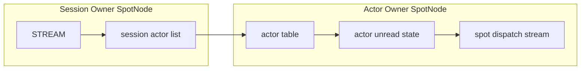

The session actor list is separate per session routing id. Each entry stores
an actor id and a concrete Actor ref. Even when bind is called with an
unchecked ref, a successful attach stores the real generation in the session
entry. The session owner does not store joined Spot state. Joined state is
managed only in the Actor owner table and in snapshots.

Local Actor relay and remote Actor relay use the same Actor table semantics.
The only difference is whether the target SpotNode is in the same process or
must be reached through a peer SpotNode via routed control. When a remote
relay arrives after the target Actor has been removed, the target node discards
the part. A completed submit result on the sender side does not change after
that.

### 9.1 Actor table state

Each Actor table row holds:

| State | Meaning |
|-------|---------|
| Actor ref | node rid, actor id, generation |
| joined Spot rid | the Spot this Actor is currently joined to; starts at the Entry Spot when created |
| bound session ref | the STREAM session this Actor is attached to |
| unread state | parts not yet read by `zlink_spot_node_actor_recv_part()` |
| pending join | join requests the Spot has not yet replied to |
| route synced | whether the active route points to the current Actor ref |

Actor destroy checks the joined state, bound session detach, and any in-flight
multipart relay first. When the detach cannot complete or a timeout occurs,
the Actor slot and unread state are left in the pre-call state.

### 9.2 Dispatch event

When the Actor unread state gains a readable part and the Actor is joined to a
Spot, `ACTOR_READABLE` readiness is posted to the Spot dispatch stream. The
event subject is a callback-lifetime `const zlink_actor_ref_t *`. When a
pending join request arrives, `ACTOR_JOIN_READABLE` readiness is posted to the
Spot dispatch stream.

Readiness does not correspond 1:1 to message counts. Dispatch callbacks must
drain each drain API until it returns `NO_DATA`. The internal implementation
preserves part order within the same Actor.

### 9.3 Active route publish

The Actor active route can be published at Actor creation with the Entry Spot
as the current location. It is updated to the user Spot at the user Spot join
success commit, and updated back to the Entry Spot when an explicit leave moves
the Actor from a user Spot back to the Entry Spot. Session bind and unbind are
not prerequisites for the active route and do not change the Actor location.
When the Actor named by an active route is destroyed, the route is removed;
when a destroy targets an Actor of a different generation than the one in the
route, the route is preserved. This route state remains an internal SPOT/Actor
lifecycle detail.

### 9.4 Actor lifecycle event

Actor lifecycle events become readable through the Spot dispatch queue after the actual location change has committed and the active route update is complete. Both Entry Spot and user Spot can receive them through `zlink_spot_recv_actor_lifecycle()`. Events are queued only for Spots with a dispatch handler already registered, so earlier Actor transitions are not replayed.

| Trigger | Event | `previous_actor` | `current_actor` |
|---------|----------|------------------|-----------------|
| Actor creation | Entry Spot `on_join` | zero-value ref | newly created ref |
| User Spot join success | target Spot `on_join` (+ source Spot `on_leave`) | source ref | target ref |
| Explicit leave success | source user Spot `on_leave` + Entry Spot `on_join` | same ref | same ref |
| Destroy success | current Spot `on_leave` | destroyed ref | zero-value ref |
| Idempotent join / idempotent leave | none | — | — |

`zlink_spot_actor_lifecycle_info_t.join_epoch` is the commit epoch of the
slot named by `current_actor` for `on_join`, and by `previous_actor` for
`on_leave`. In a remote join the source `on_leave`, target `on_join`, and join
completion may carry epoch values from different SpotNodes.

The `info` pointer is valid only inside the callback; copy values inside the
callback if needed later. The join completion handler runs after commit, but
the public contract does not guarantee whether the lifecycle event has
already executed. The application state machine relies on the join completion
handler's final Actor ref, not on the lifecycle event, to decide that a
join has finished.

## 10. Entry Spot and Spot queue ownership

A `Spot` facade does not create physical sockets. Messages demultiplexed from
transport sockets owned by the `SpotNode` are delivered into the target `Spot`'s
logical queue. A `Spot` owns:

- routed ingress dispatch queue
- subscribe ingress dispatch queue
- channel reply dispatch queue
- timer event queue
- Actor unread staging queue

Backpressure is controlled by the admission HWM on `SpotNode` transport sockets.
There is no per-Spot HWM or size cap on internal queues.

The `Entry Spot` is one per `SpotNode`. It is created automatically when the
`SpotNode` is created and lives until the `SpotNode` is destroyed. The application
registers a dispatch handler by obtaining a facade via `zlink_spot_node_entry_spot()`.
When a session relay message arrives for a newly created Actor, `ACTOR_READABLE`
readiness is posted to the Entry Spot's dispatch queue.

A user Spot's logical state is destroyed when the last facade is closed, provided
no Actor is currently joined and no join request is pending. Entry Spot logical state
is owned by the `SpotNode` and is not reference-counted.

## 11. Spot socket removal model

In the previous structure, a `Spot` facade or side handle could create per-Spot
sockets and use inproc sockets as queues. In a design where `SpotNode` receives
a message once and relays it to a logical `Spot`, expressing dispatch state via
per-Spot socket HWM is wrong. HWM belongs on the `SpotNode`-owned transport
socket admission boundary. Per-Spot queues are staging state only: they decide
which dispatch context processes already-received input.

The target structure is:

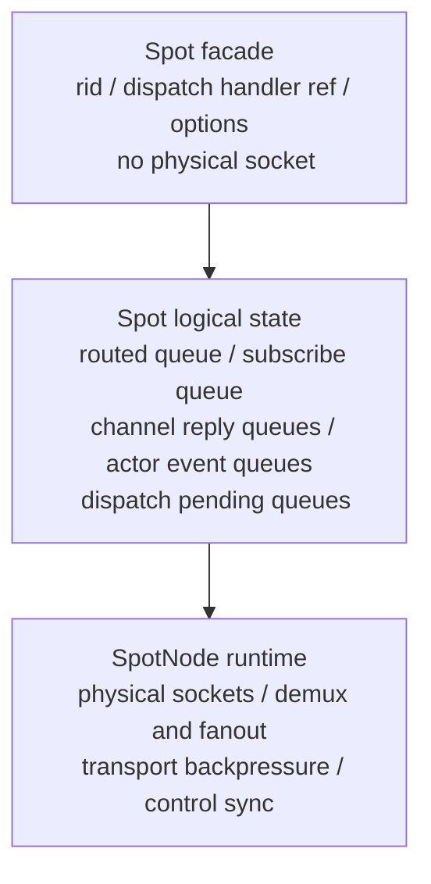

The `Spot` facade does not directly own physical sockets such as `spot_pub_t`,
`spot_sub_t`, or routed receive sockets. What a `Spot` needs is a reference to its
logical state.

## 12. STREAM session and Actor binding

The session owner node and the Actor owner node may be the same or different. The
internal paths differ, but the public API is identical.

Before any bind can run, the session owner `SpotNode` for a STREAM handle must be
known. This is the session relayment. The owner is resolved through
`actor_runtime().sessions.stream_owner(stream, nodes)`:

  pair is recorded in `sessions.stream_owners` and the handle is added to
  `sessions.explicit_stream_owners`. Explicit owners are sticky: they survive until
  the stream closes, the owner node is destroyed, or the application detaches. This
  is the required path for raw and connector STREAM handles, which the library
  cannot otherwise associate with a `SpotNode`.
- If the stream is a `SpotNode`-internal socket, `find_socket_owner()` recovers the
  owner structurally and caches it in `stream_owners`. No explicit attach is needed
  in that case.
- If neither path yields an owner, bind fails. The owner is never inferred from the
  bind target Actor's `node_rid`; the session owner is the node the sending stream
  is actually attached to.

`SpotNode` (otherwise `ENOTSUP` / `ZLINK_CONFIG_NOT_SUPPORTED`) and rejects
re-attaching a stream to a different owner (`EBUSY` /
`ZLINK_CONFIG_INVALID_STATE`); re-attaching the same stream/node pair is
idempotent. See [stream-socket.md](stream-socket.md) for the STREAM-side view.

### 12.1 Local Actor binding (co-located)

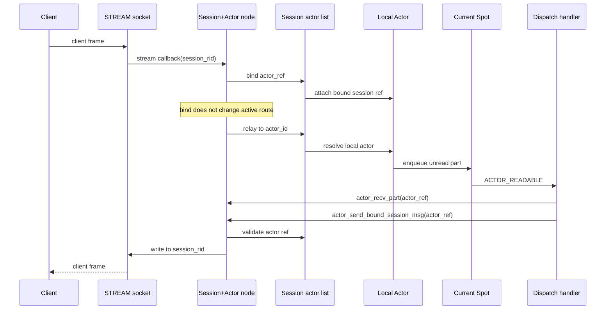

A local Actor completes bind, relay, and Actor-to-session send all within one node.
No Actor socket or per-Actor inproc endpoint is created.

### 12.2 Remote Actor binding (split deployment)

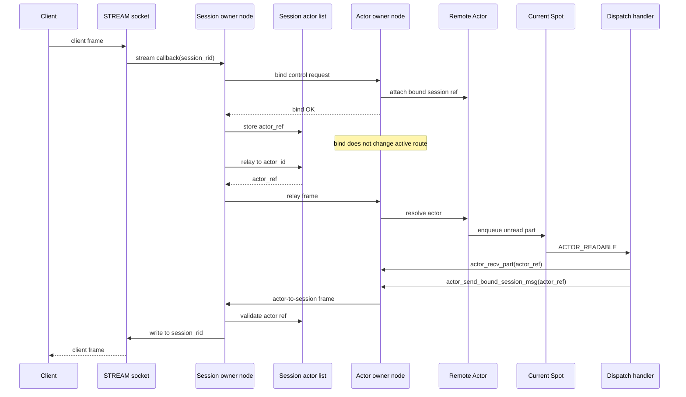

A remote Actor has bind control requests, session-to-Actor relay frames, and
Actor-to-session frames crossing node boundaries. The session owner does not store
the Actor's joined Spot state. The Actor owner does not store STREAM session
application state.

When a bound session disconnect and a remote join handoff overlap, the session Actor
list compare-and-swap result is authoritative. A disconnect before the CAS succeeds
aborts to Entry Spot on the source Actor. A disconnect after the CAS succeeds
triggers Entry Spot cleanup on the target Actor.

### 12.3 Remote bind error paths

| Condition | Outcome |
|-----------|---------|
| Actor owner node unreachable | `bind control request` never delivered; session owner returns bind failure after timeout; no `sessions.bindings` entry is written |
| Bind control request times out mid-operation | Session owner treats it as a bind failure; any partial Actor table state on the target node is rolled back when the target node receives the timeout notification |
| `actor_ref` stale (generation mismatch) | Target node rejects the bind control request; session owner receives `INVALID_HANDLE`; no Actor table entry is created |
| Session disconnect before bind completes | the `sessions.bindings` CAS on the session owner fails because the session entry was already cleared; bind is aborted and any target node Actor state is cleaned up

## 13. Transport logical queue internal data structures

This section describes the key internal structures behind the transport logical queue
implementation. These are not public contract; implementation details may change.

### 13.1 Spot logical queue (`spot_logical_state_t`)

`spot_logical_state_t` is the logical state shared by `Spot` facades
(`spot_handle_t`) via `shared_ptr`. The Entry Spot is owned by
`spot_node_handle_state_t.entry_spot`; user Spots are kept in the `spots_by_rid`
map.

Pubsub-relevant fields:

| field | type | role |
|-------|------|------|
| `subscribe_queue` | `deque<shared_ptr<spot_logical_pubsub_message_t>>` | pubsub messages demuxed from `SpotNode` |
| `subscribe_signaler` | `signaler_t` | edge-triggered signaler that wakes dispatch |
| `subscribe_signal_armed` | `bool` | arming flag that prevents duplicate signals |
| `request_reply_state` | `shared_ptr<spot_request_reply_state_t>` | routed send/recv and channel reply state |

`spot_logical_pubsub_message_t` holds all parts of one pubsub message:

```cpp
struct spot_logical_pubsub_message_t {
    zlink_routing_id_t source_rid;
    std::string service_name;
    std::string topic_id;
    std::vector<std::string> parts;
};
```

### 13.2 Actor unread queue (`actor_handle_t`)

`actor_handle_t` corresponds to one row in the `SpotNode` Actor table. It is owned
by the `actors_by_id` map inside `spot_node_actor_state_t`.

| field | type | role |
|-------|------|------|
| `queue` | `deque<queued_actor_part_t>` | unread parts relayed from a STREAM session |
| `joined_spot_state` | `shared_ptr<spot_logical_state_t>` | current Spot state |
| `generation` | `uint64_t` | Actor ref generation (stale ref validation) |
| `bound_session_node` | `spot_node_t*` | session owner node |
| `bound_stream` | `void*` | connected STREAM socket handle |
| `pending_remote_join` | `bool` | remote join prepare in progress |

`queued_actor_part_t` is a move-only ownership wrapper for one part:

| field | type | role |
|-------|------|------|
| `part` | `zlink_msg_t` | message body |
| `info` | `zlink_actor_recv_info_t` | source session info (node rid, session rid, actor ref) |
| `part_flag` | `zlink_part_flag_t` | `ZLINK_PART_MORE` or `ZLINK_PART_FINAL` |
| `owns` | `bool` | whether this wrapper owns the part (false after move) |

### 13.3 Join request queue (`joins.queues`)

Join requests are stored in `actor_runtime().joins.queues` (the `queues` member of
`actor_join_state_t`), protected by `actor_runtime().mutex` in
`service_spot_actor_api.cpp`:

```
joins.queues: map<spot_logical_state_t*, deque<queued_join_request_t*>>
```

The key is the target Spot's `spot_logical_state_t` pointer. Multiple join requests
for the same Spot may be pending at once and are drained FIFO by
`zlink_spot_actor_join_recv()`.

Key fields of `queued_join_request_t`:

| field | type | role |
|-------|------|------|
| `actor` | `actor_handle_t*` | source Actor that requested the join |
| `spot_state` | `shared_ptr<spot_logical_state_t>` | target Spot logical state |
| `join_epoch` | `uint64_t` | join sequence number (timeout/duplicate validation) |
| `replied` | `bool` | whether a reply has been submitted |
| `pending_target` | `actor_handle_t*` | target Actor created during remote join prepare |
| `remote` | `bool` | whether this is a remote join handoff |
| `message_parts` | `vector<zlink_msg_t>` | join payload, owned multipart (ownership transferred from caller) |
| `reply_parts` | `vector<zlink_msg_t>` | reply payload, owned multipart (ownership transferred from target Spot) |

`joins.live_requests` tracks all currently pending join requests and drives the
timeout sweep. Once a request completes, its record is freed inline at the end of
the commit/abort path rather than parked in a separate retired set.

### 13.4 Signaler and dispatch connection

Pubsub dispatch uses an edge-triggered signaler:

```
message added to subscribe_queue
→ if subscribe_signal_armed == false: subscribe_signaler.send()
→ set subscribe_signal_armed = true
→ poller detects subscribe_signaler fd → delivers SUBSCRIBE_READABLE
→ after drain: reset subscribe_signal_armed = false (ready for next input)
```

Actor readable dispatch posts `ACTOR_READABLE` readiness directly to the dispatch
handler of `actor_handle_t.joined_spot_state`. The subject is a
`const zlink_actor_ref_t*` valid only for the callback lifetime.

Actor join dispatch posts `ACTOR_JOIN_READABLE` to the target Spot's dispatch
handler when a request is added to `joins.queues`. The subject is the target Spot
facade.

### 13.5 Actor runtime state summary

All Actor, session, route, join, and lifecycle state lives in a single
process-wide `actor_runtime_t` aggregate, reached through the `actor_runtime()`
accessor in `service_spot_actor_api.cpp`. There are no free-standing `g_*`
globals; the aggregate groups the state by responsibility. **Every member below is
serialized by the single `actor_runtime().mutex`** unless noted otherwise.

| member | type | role |
|--------|------|------|
| `mutex` | `std::timed_mutex` | single lock protecting the whole runtime; held only for the duration of table mutations, not I/O |
| `nodes` | `actor_node_registry_t` | node and Spot facade tracking (see sub-rows below) |
| `nodes.nodes_by_rid` | `map<string, spot_node_t*>` | node rid → SpotNode reverse lookup; populated on `SpotNode` creation, removed on destroy |
| `nodes.known_nodes` | `set<spot_node_t*>` | live `SpotNode` handles; used to validate node pointers against use-after-free |
| `nodes.known_spots` | `set<spot_handle_t*>` | live Spot facades; used to validate handles against use-after-free |
| `sessions` | `actor_session_state_t` | STREAM session bindings and stream→owner map (see sub-rows below) |
| `sessions.bindings` | `map<session_binding_key_t, session_binding_t>` | keyed by `(stream, session rid)`; holds the per-actor-id Actor entries of one session; the compare-and-swap on remote join commit uses this map as the transaction point |
| `sessions.stream_owners` | `map<void*, spot_node_t*>` | STREAM handle → session owner SpotNode (the ActorGateway) |
| `routes` | `actor_route_state_t` | published actor routes and disconnect notes (see sub-rows below) |
| `routes.active` | `map<string, zlink_actor_route_t>` | actor id → internal active route |
| `routes.disconnected` | `set<pair<spot_node_t*, string>>` | `(source node, target node rid)` pairs marked disconnected; used to map relay failures to route-not-found |
| `joins` | `actor_join_state_t` | pending join queues and bookkeeping (see sub-rows below) |
| `joins.queues` | `map<spot_logical_state_t*, deque<queued_join_request_t*>>` | pending join requests per target Spot; entries added on enqueue, removed when replied or cleaned up |
| `joins.live_requests` | `set<queued_join_request_t*>` | currently pending joins; used for the timeout sweep |
| `lifecycle` | `actor_lifecycle_state_t` | per-Spot `on_join`/`on_leave` registrations and their event queues |
| `protocol_drop_count` | `uint64_t` | cumulative count of relay frames dropped due to protocol errors (stale ref, unknown actor id, etc.); useful for diagnosing relay loss |
| `next_join_epoch` | `uint64_t` | monotonically increasing allocator for join sequence numbers |

`queued_join_request_t` stores request and reply payloads as owned multipart
parts. `zlink_spot_actor_join_recv()` exposes a thread-local parts view to the
caller, and `zlink_spot_actor_join_reply()` moves the reply parts back into the
request record before the completion callback runs.

**Initialization**: the `actor_runtime_t` instance is a function-local static with
static storage duration, default-initialized on first access. There is no separate
init call. The first `SpotNode` creation populates `nodes.nodes_by_rid`; there is
no race window because `mutex` is taken on every write and every read that can race
with a write.

**Lock scope**: callers must not hold `actor_runtime().mutex` while crossing an
I/O thread boundary (e.g., while waiting for a Mailbox reply). The lock is always
released before any blocking call. Actor table mutations and join queue mutations
that span two SpotNode instances are serialized by taking the mutex once for the
entire compound operation.

## 14. Actor join internal lifecycle

This section describes how Actor join requests are processed inside SpotNode.
For STREAM session binding flow see section 12. For the public join contract see
[`doc/spec/core/service/spot.md`](../api/spot.md).

### 14.1 Local join internal sequence

Local join only changes `current Spot` within the same `SpotNode`. The source Spot
remains the Actor's `current Spot` until accept. Accept handling, `current Spot`
swap, active route update, and lifecycle event scheduling all execute in the
same `SpotNode` critical section or event-loop turn. Bound STREAM session ref is
not a precondition for join — Actor location and session attach are independent
state transitions. The `dest_spot_rid` must be a user Spot; passing the Entry
Spot rid fails immediately as invalid-argument-class.

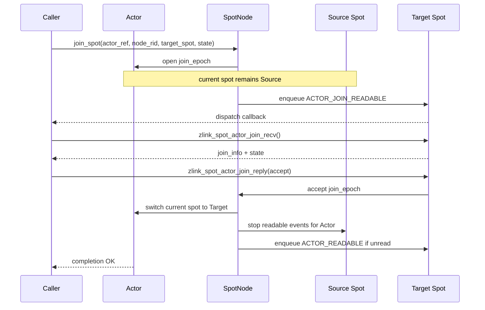

If the target rejects or the request times out, the `current Spot` swap does not
execute. The Actor stays in the source Spot. The join state payload is discarded
after reply or timeout cleanup.

Local join atomicity rules:

- The source Spot is `current Spot` until accept.
- The accept step and `current Spot` swap execute in the same critical section or
  event-loop turn.
- No new `ACTOR_READABLE` events are posted to the source Spot after accept.
- Reject, timeout, target Spot destroy, and `SpotNode` shutdown preserve the source Spot.

### 14.2 Remote join internal sequence

Remote join hands off the source node Actor to the target Spot on the target node.
The current implementation performs this within the same process across registered
`SpotNode` instances. Network control frames, cross-process session Actor list
compare-and-swap, and retryable `JoinOp` cleanup are deferred work.

`JoinOp` is created on the source node and preserves:

| field | meaning |
|-------|---------|
| `join_epoch` | sequence number for timeout, duplicate, and stale-replay checks |
| `source_actor_ref` | source node and Actor ref |
| `target_actor_ref` | target node and pending Actor ref |
| `target_node_rid` / `target_spot_rid` | destination node and Spot |
| `bound_session_ref` | session owner and session rid |
| `completion_handler` | request owner's `zlink_reply_handler_fn` |
| `reply_path` | path to deliver join completion to request owner |

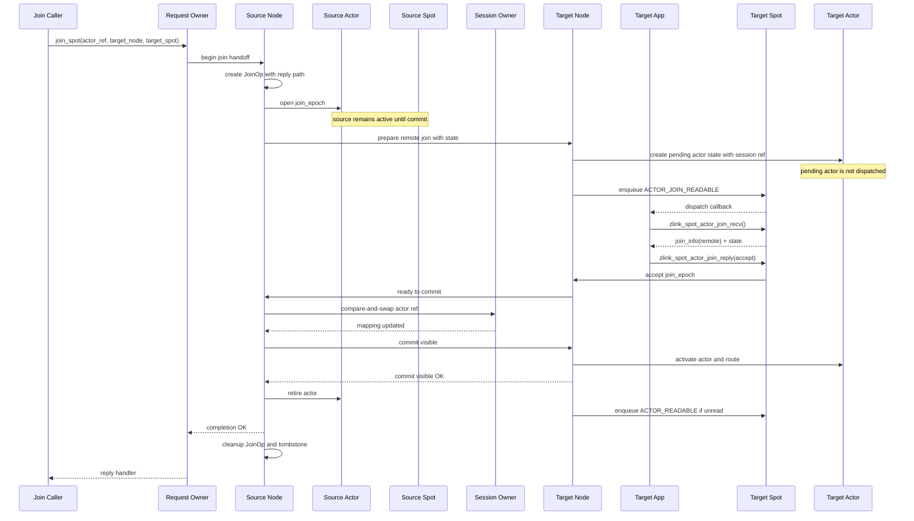

Remote join atomicity rules:

- The source Actor remains active in the source node and source Spot until commit.
- The target node creates pending Actor state during prepare, but this Actor is not
  dispatched and does not publish an active route.
- Even after the target Spot accepts, the source Actor is not yet removed from the
  source Spot.
- The source Actor is retired after the session Actor list compare-and-swap succeeds
  and the target Actor activate plus active route update are confirmed.
- After commit, the session owner node's session Actor list and active route point to
  the target node Actor ref.
- `JoinOp` cleanup executes after the request owner completion frame delivery is confirmed.
- Source Actor retire and target activate are fenced by the join epoch. Stale relays,
  stale join replies, and late control messages apply only if the epoch matches.

### 14.3 Abort paths

If the target Spot rejects, times out, prepare fails, or the target shuts down, the
handoff aborts.

- The source Actor stays active in the source Spot.
- The target pending Actor state and payload reference are discarded.
- The active route does not move.

When a bound session disconnect races with a remote join handoff, the session Actor
list compare-and-swap success is the deciding boundary.

- **Disconnect before CAS success**: aborts to source; source Actor moves to Entry
  Spot and bound session ref is cleared; target pending Actor state is discarded.
- **Disconnect after CAS success**: the target Actor is canonical; after commit visible
  completes, target node disconnect cleanup moves the target Actor to Entry Spot and
  clears bound session ref; the source Actor does not become active again.
