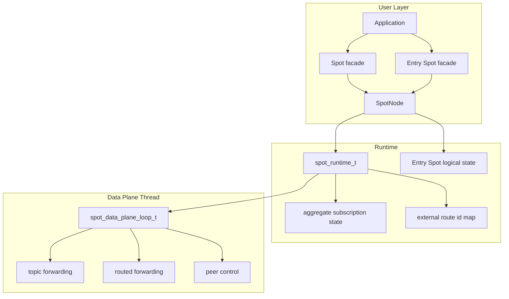
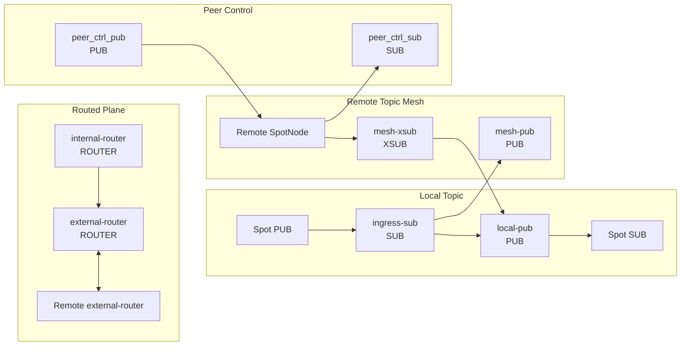
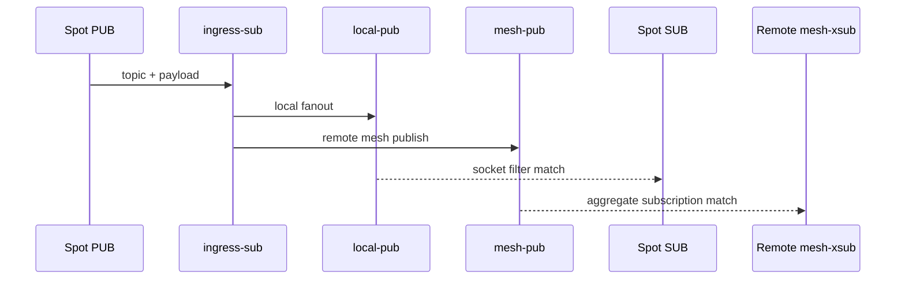
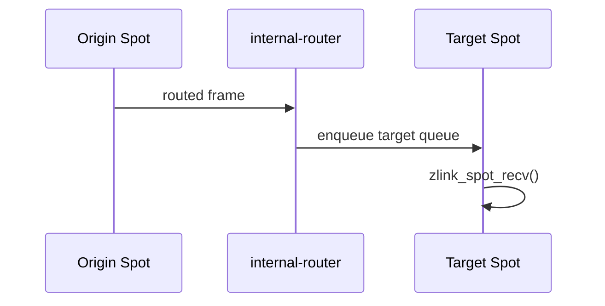
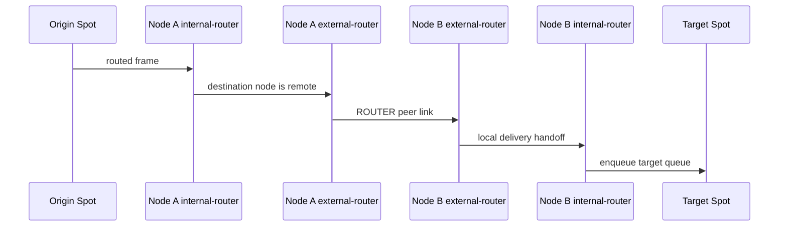
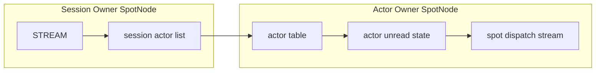

[English](spot-internals.md) | [한국어](spot-internals.ko.md)

# SPOT / SpotNode Internals

This document helps core maintainers understand SPOT wiring and data flow.
The public API contract is
[`doc/spec/core/service/spot.md`](../spec/core/service/spot.md).

## 1. Overview



`SpotNode` owns lifecycle. `Spot` is a borrowed data-plane facade layered on top
of that node. Destroying a `Spot` does not destroy its backing `SpotNode`.

`Spot` facade does not own physical sockets. All transport sockets are owned by the
`SpotNode`. `Spot` owns only its logical dispatch queue and dispatch event context.
The `Entry Spot` is one per `SpotNode`, owned by the `SpotNode`. The application
obtains an `Entry Spot` facade via `zlink_spot_node_entry_spot()` and closes it with
`zlink_spot_destroy()`.

## 2. Internal Socket Topology

SpotNode creates only the socket planes required by its mode.

| mode | main planes |
|------|-------------|
| `PUBSUB` | topic publish/subscribe, peer control |
| `ROUTED` | routed delivery, peer control |
| `ALL` | topic, routed, peer control |

Disabled planes are not created by snapshot calls or by the first call to a
disabled API.

### 2.1 Main sockets



| socket | type | role | HWM option axis |
|--------|------|------|-----------------|
| `ingress-sub` | `SUB` | receives local publish input | `ZLINK_SPOT_NODE_OPT_SUB_HWM` |
| `local-pub` | `PUB` | fans out to subscribers in this node | `ZLINK_SPOT_NODE_OPT_PUB_HWM` |
| `mesh-pub` | `PUB` | forwards topic publish to remote nodes | `ZLINK_SPOT_NODE_OPT_PUB_HWM` |
| `mesh-xsub` | `XSUB` | receives topic publish from remote nodes | `ZLINK_SPOT_NODE_OPT_SUB_HWM` |
| `internal-router` | `ROUTER` | delivers routed messages to target Spots in this node | routed send/recv HWM |
| `external-router` | `ROUTER` | exchanges routed frames with peer nodes | routed send/recv HWM |
| `peer_ctrl_pub` | `PUB` | sends peer control messages | control defaults |
| `peer_ctrl_sub` | `SUB` | receives peer control messages | control defaults |

`zlink_spot_node_internal_sockets_snapshot()` returns only sockets that already
exist. The perf `Auto-HWM spotnode` table uses these snapshot names directly.

## 3. Topic Plane

The topic plane relies on native socket subscription filters for both local and
remote delivery. Runtime does not perform publish-time target lookup.



Local topic matching is owned by each `Spot SUB` subscription state. Remote
topic matching is owned by each peer node's `mesh-xsub` aggregate subscription
state.

### 3.1 Aggregate Subscription Lifetime

Runtime tracks node-level subscription lifetime for remote mesh propagation.

| state | structure | meaning |
|-------|-----------|---------|
| exact topic | `topic -> refcount` | number of local subscribers for an exact topic |
| prefix | `prefix -> refcount` | number of local subscribers for a prefix |

The rules are:

1. Send remote aggregate subscribe only on `0 -> 1`.
2. Send remote aggregate unsubscribe only on `1 -> 0`.
3. Intermediate increments and decrements update local state only.

This keeps duplicate local subscriptions from becoming duplicate remote
subscriptions.

## 4. Routed Plane

The routed plane has two router axes.

| router | scope | role |
|--------|-------|------|
| `internal-router` | inside one node | delivers to the target `Spot` routed receive queue |
| `external-router` | between nodes | exchanges routed frames with peer `external-router` sockets |

There is no separate routed ingress broker and no topic-mesh fallback for
routed delivery. Local routed delivery is tracked through `internal-router`.
Remote routed delivery is tracked through `external-router`.

### 4.1 Local Routed Delivery



If the target `Spot` queue exceeds its hard limit, only that routed target is
marked disconnected. The node and peer connection stay alive.

### 4.2 Remote Routed Delivery



Remote routed delivery uses an external route id map per peer. Only
`spot_runtime_t` methods update that map, so callers do not need to know the
map structure or locking rules.

## 5. Queue Hard Limits

SPOT uses delivery-target hard limits so a slow consumer cannot stall the whole
node.

| option | default | target |
|--------|---------|--------|
| `ZLINK_SPOT_NODE_OPT_SUB_QUEUE_HARD_LIMIT` | `100` | local subscribe delivery target |
| `ZLINK_SPOT_NODE_OPT_ROUTED_QUEUE_HARD_LIMIT` | `500` | routed delivery target |

When a target exceeds its limit, only that target is marked disconnected. The
status counters are:

- `disconnected_sub_target_count`
- `disconnected_routed_target_count`

## 6. Auto-HWM

SPOT topic sockets split the HWM axis by pub/sub role.

| option | sockets |
|--------|---------|
| `ZLINK_SPOT_NODE_OPT_PUB_HWM` | `local-pub`, `mesh-pub` |
| `ZLINK_SPOT_NODE_OPT_SUB_HWM` | `ingress-sub`, `mesh-xsub` |
| `ZLINK_SPOT_NODE_OPT_ROUTED_SEND_HWM` | send side of `internal-router`, `external-router` |
| `ZLINK_SPOT_NODE_OPT_ROUTED_RECV_HWM` | recv side of `internal-router`, `external-router` |

Without manual options, the context auto-HWM policy calculates values from the
socket policy class, message unit, and active profile.
`local-pub` and `mesh-pub` use `spot_data`; `ingress-sub` and `mesh-xsub` use
`recv_ingress`; `internal-router` and `external-router` use `routed`; and
`peer_ctrl_pub/sub` use `control`.

SPOT publish queue planning keeps per-connection HWM independent of fanout.
Fanout is still useful as a diagnostic count, but it is not an input that
reduces HWM:

```text
effective_publish_fanout =
  max(local_sub_spot_count, active_peer_count, observed_scope_count)
```

The total spot count is metadata pressure, not the fanout queue count. The perf
runner uses the `core/build` runtime and must print the resolved `libzlink`
path before running.

## 7. Control Plane

The peer control plane is separated from data traffic. It carries:

- peer bootstrap data
- ready-state refresh
- aggregate subscription replay
- peer connection state

Control sockets may use a different message unit from data sockets. If a perf
table shows different `MsgUnit(B)` values in the same payload-size block, the
control plane and data plane are being calculated with different units.

## 7. Actor dispatch internal model

An Actor is a routing target managed by `SpotNode`. There is no public Actor
handle; `zlink_actor_ref_t` identifies the Actor. Actors do not own a socket,
inproc endpoint, or transport endpoint. Parts relayed from a STREAM session to
an Actor pass through the target SpotNode's Actor table into the Actor unread
state.

A newly created Actor's current Spot is always the Entry Spot. Actor messages are
dispatched from the Entry Spot context until the Actor joins a user Spot.



The session actor list is separate per session routing id. Each entry stores
an actor id and a concrete Actor ref. Even when bind is called with an
unchecked ref, a successful attach stores the real generation in the session
entry. The session owner does not store joined Spot state. Joined state is
managed only in the Actor owner table and in snapshots.

Local Actor relay and remote Actor relay use the same Actor table semantics.
The only difference is whether the target SpotNode is in the same process or
must be reached through a peer SpotNode via routed control. When a remote
relay arrives after the target Actor has been removed, the target node discards
the part. A completed submit result on the sender side does not change after
that.

### 7.1 Actor table state

Each Actor table row holds:

| State | Meaning |
|-------|---------|
| Actor ref | node rid, actor id, generation |
| joined Spot rid | the Spot this Actor is currently joined to; starts at the Entry Spot when created |
| bound session ref | the STREAM session this Actor is attached to |
| unread state | parts not yet read by `zlink_spot_node_actor_recv_part()` |
| pending join | join requests the Spot has not yet replied to |
| route synced | whether the active route points to the current Actor ref |

Actor destroy checks the joined state, bound session detach, and any in-flight
multipart relay first. When the detach cannot complete or a timeout occurs,
the Actor slot and unread state are left in the pre-call state.

### 7.2 Dispatch event

When the Actor unread state gains a readable part and the Actor is joined to a
Spot, `ACTOR_READABLE` readiness is posted to the Spot dispatch stream. The
event subject is a callback-lifetime `const zlink_actor_ref_t *`. When a
pending join request arrives, `ACTOR_JOIN_READABLE` readiness is posted to the
Spot dispatch stream.

Readiness does not correspond 1:1 to message counts. Dispatch callbacks must
drain each drain API until it returns `NO_DATA`. The internal implementation
preserves part order within the same Actor.

### 7.3 Active route publish

The Actor active route is not published when the Actor is created or when it
joins a Spot. It is published when the Actor owner SpotNode's Discovery has
actor route sync enabled and a `zlink_stream_bind_actor()` call succeeds.
Unbind and session disconnect cleanup do not remove the active route. When the
Actor that the active route points to is destroyed, route cleanup is performed.

## 8. Entry Spot and Spot queue ownership

A `Spot` facade does not create physical sockets. Messages demultiplexed from
transport sockets owned by the `SpotNode` are delivered into the target `Spot`'s
logical queue. A `Spot` owns:

- routed ingress dispatch queue
- subscribe ingress dispatch queue
- channel reply dispatch queue
- timer event queue
- Actor unread staging queue

Backpressure is controlled by the admission HWM on `SpotNode` transport sockets.
There is no per-Spot HWM or size cap on internal queues.

The `Entry Spot` is one per `SpotNode`. It is created automatically when the
`SpotNode` is created and lives until the `SpotNode` is destroyed. The application
registers a dispatch handler by obtaining a facade via `zlink_spot_node_entry_spot()`.
When a session relay message arrives for a newly created Actor, `ACTOR_READABLE`
readiness is posted to the Entry Spot's dispatch queue.

A user Spot's logical state is destroyed when the last facade is closed, provided
no Actor is currently joined and no join request is pending. Entry Spot logical state
is owned by the `SpotNode` and is not reference-counted.
