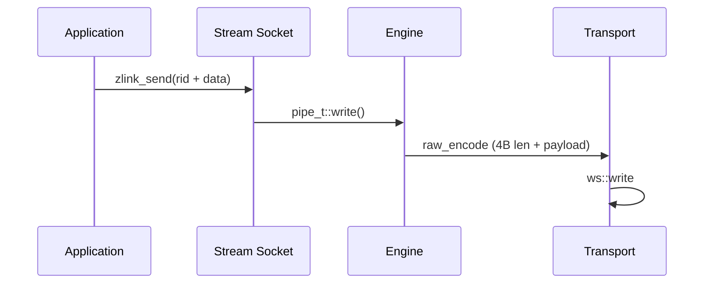

# STREAM 소켓 WS/WSS 최적화

## 1. 개요

STREAM 소켓은 ZMP를 사용하지 않는 외부 클라이언트(웹 브라우저, 게임 클라이언트 등)와의 RAW 통신을 지원한다. tcp, tls, ws, wss transport를 지원하며, 특히 WS/WSS 경로의 성능 최적화에 집중한다.

## 2. 아키텍처

### 2.1 컴포넌트 구성

| 컴포넌트 | 파일 | 역할 |
|----------|------|------|
| stream_t | src/sockets/stream.cpp | STREAM 소켓 로직 |
| raw_encoder_t | src/protocol/raw_encoder.cpp | Length-Prefix 인코딩 |
| raw_decoder_t | src/protocol/raw_decoder.cpp | Length-Prefix 디코딩 |
| asio_raw_engine_t | src/engine/asio/asio_raw_engine.cpp | RAW I/O 엔진 |
| ws_transport_t | src/transports/ws/ | WebSocket 전송 |
| wss_transport_t | src/transports/ws/ | WebSocket + TLS |

### 2.2 데이터 흐름

## 3. WS/WSS 성능 최적화

### 3.1 Read Path Copy Elimination
- 기존: Beast flat_buffer → 임시 버퍼 → msg_t (2회 복사)
- 최적화: Beast flat_buffer에서 직접 msg_t로 이동 (1회 복사 제거)

### 3.2 Write Path Copy Elimination
- 기존: msg_t → 중간 버퍼 → Beast write (2회 복사)
- 최적화: msg_t 데이터를 직접 Beast write 버퍼로 전달

### 3.3 Beast Write Buffer 확대
- 기본 4KB → 64KB로 확대
- 다중 소형 메시지 배치 전송 효과

### 3.4 프레임 분할 비활성화
- `auto_fragment(false)` 설정
- 메시지별 단일 WebSocket 프레임

## 4. 벤치마크 결과

### 4.1 WS 최적화 효과 (1KB 메시지)
| 항목 | 최적화 전 | 최적화 후 | 개선율 |
|------|-----------|-----------|--------|
| WS 1KB | 315 MB/s | 473 MB/s | +50% |
| WSS 1KB | 279 MB/s | 382 MB/s | +37% |

### 4.2 대용량 메시지 개선
| 크기 | WS 개선율 | WSS 개선율 |
|------|-----------|-----------|
| 64B | +11% | +13% |
| 1KB | +50% | +37% |
| 64KB | +97% | +54% |
| 262KB | +139% | +62% |

### 4.3 Beast 단독 대비
| Transport | Beast | zlink | 비율 |
|-----------|-------|-------|------|
| tcp | 1416 MB/s | 1493 MB/s | 105% |
| ws | 540 MB/s | 696 MB/s | 129% |

## 5. 설계 트레이드오프

- Speculative write 미지원 (WebSocket 프레임 기반)
- Gather write는 WS/WSS에서 지원 (Beast가 내부 버퍼링)
- TLS/WSS는 암호화 오버헤드 존재

## 6. 현재 STREAM 런타임 기본값 (2026-02)

이 문서는 원래 WS/WSS 경로 최적화 중심이었지만, 현재 STREAM은 transport 전반에
공통된 기본 성능 프로파일을 사용한다.
STREAM 외 공통 소켓 기본값은
[socket-option-defaults.ko.md](socket-option-defaults.ko.md)를 참고한다.

### 6.1 내부 상수 고정 항목

아래 값들은 STREAM env로 더 이상 제어하지 않고 상수로 고정된다:
- handler allocator: 활성
- read drain: 활성
- speculative write: STREAM/TCP 경로에서 상시 on 고정
- RX slab buffering: 활성
- gather threshold: `8192`
- speculative write byte budget: `2097152`
- read drain max loops: `16`
- read drain max bytes: `1048576`

### 6.2 소켓/리스너 기본값

- backlog: `65536`
- `sndbuf` 미지정 시 기본값: `262144`
- `rcvbuf` 미지정 시 기본값: `262144`
- accept 동시성(STREAM 전용): 기본 `4`, 최대 `128`
- 세션 스케줄러(STREAM): 기본 `rr`

### 6.3 현재 유지되는 STREAM 런타임 환경변수

- `ZLINK_ASIO_STREAM_ACCEPT_CONCURRENCY`
- `ZLINK_ASIO_STREAM_SESSION_SCHED` (`rr|minload`)
- `ZLINK_ASIO_STREAM_ENABLE_NON_TCP_SPEC_READ`
- `ZLINK_ASIO_STREAM_DISABLE_GATHER`
- `ZLINK_ASIO_STREAM_NOTIFY_QUEUE_DEQUE`
- `ZLINK_ASIO_STREAM_BATCH_SIZE`
