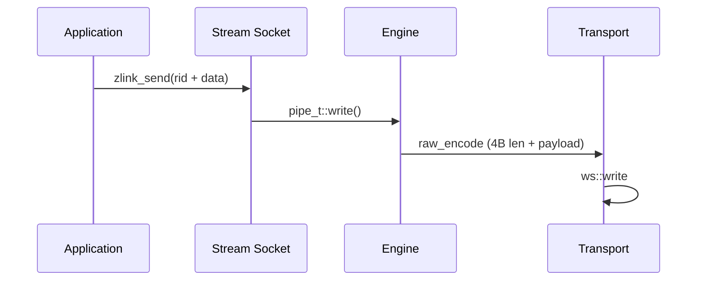

[English](stream-socket.md) | [한국어](stream-socket.ko.md)

# STREAM Socket WS/WSS Optimization

## 1. Overview

The STREAM socket supports RAW communication with external clients (web browsers, game clients, etc.) that do not use ZMP. It supports tcp, tls, ws, and wss transports, with a particular focus on performance optimization of the WS/WSS path.

## 2. Architecture

### 2.1 Component Layout

| Component | File | Role |
|----------|------|------|
| stream_t | src/runtime/sockets/stream/stream.cpp | STREAM socket logic |
| raw_encoder_t | src/runtime/protocol/raw_encoder.cpp | Length-Prefix encoding |
| raw_decoder_t | src/runtime/protocol/raw_decoder.cpp | Length-Prefix decoding |
| asio_raw_engine_t | src/runtime/engine/asio/asio_raw_engine.cpp | RAW I/O engine |
| ws_transport_t | src/runtime/transports/ws/ | WebSocket transport |
| wss_transport_t | src/runtime/transports/ws/ | WebSocket + TLS |

### 2.2 Data Flow



## 3. WS/WSS Performance Characteristics

### 3.1 Read Path
- Data moves directly from the Beast `flat_buffer` into the outgoing
  `msg_t` (single copy, no intermediate staging buffer).

### 3.2 Write Path
- `msg_t` payload is passed directly to the Beast write buffer (no
  intermediate copy).

### 3.3 Beast Write Buffer
- 64KB write buffer, chosen to let multiple small messages batch into
  a single Beast write.

### 3.4 Frame Fragmentation
- `auto_fragment(false)` — one logical message maps to one WebSocket
  frame.

## 4. Measured Throughput

Representative single-socket throughput on the standard benchmark
machine:

| Transport | Throughput |
|-----------|------------|
| TCP       | 1493 MB/s  |
| WS        |  696 MB/s  |
| WSS 1KB   |  382 MB/s  |

Large messages benefit most from the WS framing choices; 64KB and
larger payloads approach the TCP line rate for WS, and WSS cost is
dominated by TLS encryption overhead.

## 5. Design Trade-offs

- Speculative write not supported (WebSocket is frame-based)
- Gather write supported for WS/WSS (Beast handles internal buffering)
- TLS/WSS has encryption overhead

## 6. Packet Handler Receive Mode

STREAM sockets expose three mutually exclusive receive modes. Exactly
one can be active per socket; the second activation attempt on the same
socket fails with `EBUSY`.

| Mode | Activation | Delivery |
|------|------------|----------|
| Raw recv | default | `zlink_recv()` returns raw bytes per read |
| Raw callback | `zlink_recv_handler()` | `zlink_socket_msg_handler_fn` with raw bytes |
| Packet callback | `zlink_stream_packet_handler()` | `zlink_stream_packet_handler_fn` with decoded header/body messages |

The packet handler mode is tailored to application protocols that carry
`header + body` framing on top of the raw STREAM byte pipe -- for
example an orders-exec gateway whose clients send a small control
header followed by a larger payload. Instead of each caller writing the
same length-prefix decoder and buffering state machine, STREAM parses
the frames internally and delivers already-allocated `zlink_msg_t`
objects to the callback.

### 6.1 Wire framing

Each logical packet is carried on the wire as:

```
+------------------+--------------------+----------------+-------------------+
| u16 header_size  | u32 body_size      | header bytes   | body bytes        |
| (big-endian)     | (big-endian)       | (header_size)  | (body_size)       |
+------------------+--------------------+----------------+-------------------+
```

- `header_size` is a 2-byte big-endian unsigned integer.
- `body_size` is a 4-byte big-endian unsigned integer.
- Both sizes may be `0`. A packet with `header_size=0 && body_size=0`
  still yields a callback, with two empty but non-`NULL` `zlink_msg_t`
  instances.
- Maximum sizes are bounded by internal limits. Advertising a size that
  exceeds those limits is treated as malformed framing (see 6.4).

### 6.2 Per-connection accumulator

Incoming bytes are fed through a per-connection decoder that is keyed
by `source_rid` (the STREAM routing identity of the remote end).

```
  wire bytes (arbitrary fragmentation)
         |
         v
  +-------------------------+
  | stream decoder (per rid)|
  |   state: PARSE_HEADER_SIZE
  |          PARSE_BODY_SIZE
  |          ALLOC_MSGS
  |          READ_HEADER
  |          READ_BODY
  |          DELIVER
  +-------------------------+
         |
         v
  callback(stream, source_rid, header_msg, body_msg, userdata)
```

Length fields are parsed first. Once both `header_size` and `body_size`
are known, the implementation pre-allocates the final `zlink_msg_t`
objects for header and body, and subsequent socket reads stream bytes
directly into the backing buffers of those messages. There is no second
copy at delivery time -- by the time the callback runs, the payload is
already in the message it will receive.

### 6.3 Callback contract

The signature is:

```
zlink_stream_packet_handler_fn(stream,
                               source_rid,    // borrowed view
                               header_msg,    // ownership transfers
                               body_msg,      // ownership transfers
                               userdata)
```

- `source_rid` is a borrowed view for the duration of the callback. It
  must not be retained past the call; copy it if needed.
- `header_msg` and `body_msg` are always non-`NULL`, even when the
  corresponding wire size is `0`. Ownership of both transfers to the
  callback, which is responsible for closing them with
  `zlink_msg_close()`.
- Packets from the same `source_rid` are serialized: a later packet on
  the same peer cannot overtake an earlier one. Packets from different
  `source_rid` may be dispatched in parallel on different worker
  threads.
- Self-close from within the raw callback is the same rule as the raw
  `zlink_recv_handler` case: attempting to flip the socket's receive
  mode or close the socket from inside the callback fails with `EBUSY`.

### 6.4 Malformed framing

STREAM treats the following as malformed and closes the offending
connection:

- A declared `header_size` or `body_size` that exceeds internal limits.
- The peer closes (or resets) after the length fields have started but
  before the full packet has arrived -- i.e. mid-length or mid-payload
  close.

Closure is observable through the STREAM socket monitor as a disconnect
event for that `source_rid`. No partial packet is ever delivered to the
callback; the decoder state for that connection is discarded with the
connection.

### 6.5 Why decode inside STREAM

Decoding inside STREAM (rather than in each application) has two
reasons worth calling out:

- **One fewer copy.** The application never sees a contiguous
  "assembled" buffer that it later has to split -- the header and body
  messages are the destination buffers for the socket reads.
- **Ordering guarantees.** Per-`source_rid` serialization is enforced
  by the decoder, so callers do not have to build their own reordering
  logic on top of raw byte delivery.

## 7. Current STREAM Runtime Defaults

STREAM uses a consolidated default performance profile across transports.
For non-STREAM-wide socket defaults, see
[socket-option-defaults.md](socket-option-defaults.md).

### 7.1 Fixed internal constants

These values are fixed as internal constants and not controlled by STREAM env knobs:
- handler allocator: enabled
- read drain: enabled
- speculative write: fixed on for STREAM/TCP path
- RX slab buffering: enabled
- speculative write byte budget: `2097152`
- read drain max loops: `64`
- read drain max bytes: `1048576`

### 7.2 Effective socket/listener defaults

- backlog: `65536`
- `sndhwm` / `rcvhwm`: start from the routed-role auto-HWM floor
- `sndbuf` / `rcvbuf`: use the auto-HWM transport-budget result
- if auto HWM is disabled and `sndbuf` / `rcvbuf` stay unset, STREAM falls
  back to the compatibility default `262144`
- accept concurrency (STREAM only): default `4`, max `128`
- session scheduler (STREAM): default `rr`

### 7.3 Remaining STREAM runtime env controls

- `ZLINK_ASIO_STREAM_ACCEPT_CONCURRENCY`: default `4`, clamped to `128`
- `ZLINK_ASIO_STREAM_SESSION_SCHED` (`rr|minload`): default `rr`
- `ZLINK_ASIO_STREAM_ENABLE_NON_TCP_SPEC_READ`: disabled by default
- `ZLINK_ASIO_STREAM_DISABLE_GATHER`: disabled by default, so STREAM gather-write stays enabled
- `ZLINK_ASIO_STREAM_GATHER_THRESHOLD`: default `1024`
- `ZLINK_ASIO_STREAM_TINY_GATHER_THRESHOLD`: default `0`
- `ZLINK_ASIO_STREAM_INITIAL_TARGET_CAP`: default `4096`
- `ZLINK_ASIO_STREAM_BATCH_SIZE`: default `4096`
- `ZLINK_ASIO_STREAM_BATCH_HEADROOM`: default `64`

## 8. Peer RID Disconnect

STREAM's public routing id is the 4-byte connection id assigned by the server
for each connection. `zlink_disconnect_rid()` interprets that id as a
`uint32_t`, looks up the pipe in the STREAM route map, and requests
termination. Any rid that is not 4 bytes fails as an invalid argument.

## 9. Session Actor Relay (ActorGateway attach)

A STREAM socket can relay client session messages to and from SpotNode Actors.
Each client connection's `source_rid` becomes a STREAM session that may be bound
to one or more Actors with `zlink_stream_bind_actor()`. Before any bind can run,
the STREAM handle must know which SpotNode owns its sessions -- this is the
ActorGateway attachment.

```c
                                                        void *node);
```

There are two ways a STREAM handle acquires a session owner SpotNode:

  the stream as owned by a routed-capable `node`. This is required for raw STREAM
  sockets and for connector-backed streams, because the library has no structural
  link from such a handle to a SpotNode. The attach is one-way and sticky: it
  rejects re-attaching to a different node (`EBUSY` /
  `ZLINK_CONFIG_INVALID_STATE`), accepts the same stream/node pair idempotently,
  and is released only on stream close or node destroy. A non-routed node is
  rejected with `ENOTSUP` / `ZLINK_CONFIG_NOT_SUPPORTED`.
- **Structural inference.** When the STREAM socket is itself owned by a SpotNode
  (a node-internal socket), the owner is recovered from the socket registry and
  no explicit attach is needed.

The STREAM socket holds none of the relay state itself. The owner mapping, the
session-to-Actor bindings, and the relay paths all live in the SpotNode Actor
runtime. The wiring, the local vs remote relay paths, and the cleanup rules are
documented in [spot-internals.md](spot-internals.md) section 12 ("STREAM
session and Actor binding"). What matters at the STREAM layer is only that the
byte pipe per `source_rid` is the transport the relay rides on, and that a
session disconnect removes that session's bindings without changing any bound
Actor's joined Spot.
