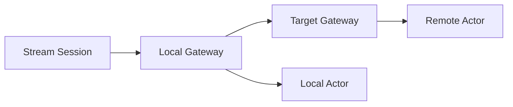
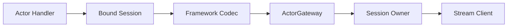

# ActorGateway session relay 초안

이 문서는 **구현 전 초안**이며 **현재 공개 계약이 아니다**.
정식 공개 계약은 `core/include/zlink.h`, `core/include/zlink/*.h`,
`doc/spec/core/`, 각 binding spec 문서를 기준으로 한다.

이 초안은 STREAM session 에서 Actor 로 relay 되는 메시지와 Actor 에서 bound
session 으로 돌아가는 메시지를 SpotNode 의 `ActorGateway` 기능으로 정리하기 위한
공통 설계다. 대상은 core C API, 모든 bindings, framework 적용, 샘플, 회귀 테스트,
문서 반영 계획을 모두 포함한다.

## 1. 배경

현재 구조에서는 session handler 가 remote Actor 로 메시지를 보내려면 실제 전송에
사용할 route mesh channel 이 필요하다. framework 샘플에서는 session server 가
application 용도와는 별개로 route mesh channel 을 추가해서 remote Actor relay 를
가능하게 만들고 있다.

이 방식은 동작은 가능하지만 API 의미가 흐려진다.

- session handler 가 어떤 router socket 을 써야 하는지 알아야 한다.
- Actor bind 가 application route mesh address 와 섞여 보인다.
- Actor 가 SpotNode 사이를 이동한 뒤 session relay mapping 을 누가 갱신하는지
  불분명하다.
- application route mesh channel 과 framework 내부 actor relay transport 가 같은
  구성 단위처럼 보인다.
- framework 가 core C API 밖에서 별도 규칙을 만들면 다른 bindings 와 의미가 달라진다.

따라서 이 초안은 remote Actor relay 를 framework 전용 편의 기능으로 두지 않는다.
core C API 의 Actor/session 계약 자체를 `ActorGateway` 모델로 다시 정의한다.

## 2. 목표

1. session 에서 Actor 로 가는 메시지는 local Actor 이든 remote Actor 이든 항상
   session owner SpotNode 의 ActorGateway 로 들어간다.
2. Actor 에서 bound session 으로 돌아가는 메시지도 ActorGateway 가 session owner 를
   찾아 전달한다.
3. session handler 는 route mesh channel 과 router socket 을 직접 고르지 않는다.
4. Actor join 이 성공하면 current Actor location 과 bound session relay 대상이 함께
   갱신된다.
5. application route mesh channel 과 ActorGateway 내부 relay transport 를 분리한다.
6. core C API, bindings, framework, guide/spec/internals 문서가 같은 의미를 사용한다.
7. 모든 bindings 에 같은 기능 추가와 회귀 테스트를 둔다.

## 3. 비목표

- `zlink_router_send_actor()` 같은 public Actor direct router API 는 추가하지 않는다.
- ActorGateway 를 새로운 public socket family 로 노출하지 않는다.
- session handler 가 router socket handle 을 직접 받는 API 는 추가하지 않는다.
- framework 만의 remote Actor routing store 로 core 의미를 우회하지 않는다.
- Registry actor route resolver 를 session hot path 의 필수 lookup 으로 사용하지 않는다.
- 기존 application route mesh channel 을 ActorGateway 내부 packet dispatch 경로로
  재사용하지 않는다.

## 4. 용어

| 용어 | 의미 |
|------|------|
| ActorGateway | SpotNode 에 붙는 Actor/session relay 기능이다. user Actor 가 아니며 public socket family 도 아니다. |
| session owner SpotNode | STREAM session 이 actor bind 와 relay 를 위해 연결된 local SpotNode 다. |
| local ActorGateway | session handler 또는 Actor handler 와 같은 process 안에서 relay 진입점이 되는 ActorGateway 다. |
| target ActorGateway | remote Actor 의 current owner SpotNode 에 붙은 ActorGateway 다. |
| Actor current location | Actor 메시지가 실제 dispatch 되는 현재 SpotNode 와 Spot rid 다. |
| ActorGateway locator | remote Actor 를 bind 할 때 join 결과의 `ActorRef` 안에 담기는 target node rid/generation 정보다. application route mesh channel 이 아니다. |
| actor binding | session rid 와 actor id/generation 을 연결하는 binding 이다. application route mesh address 가 아니다. |
| binding generation | stale Actor ref 로 session mapping 을 덮어쓰지 않기 위한 generation 값이다. |
| internal relay packet | ActorGateway 사이에서만 사용하는 내부 packet 이다. application handler 에 노출되지 않는다. |

## 5. 기본 모델

ActorGateway 는 SpotNode 의 actor table, Actor current location, session binding,
내부 relay transport 를 함께 관리한다. session 은 ActorGateway 에만 relay 를 요청하고,
ActorGateway 가 local dispatch 와 remote dispatch 를 선택한다.



위 그림은 개념만 보여 준다. 실제 socket class 를 public API 로 노출한다는 뜻은 아니다.

## 6. 핵심 결정

### 6.1 session relay 는 항상 ActorGateway 를 통과한다

`zlink_stream_send_bound_actor_part(...)` 는 local Actor 에 보내는 경우에도
ActorGateway state 를 먼저 확인한다. Actor 가 local 에 있으면 local Actor mailbox 로
넣고, remote 에 있으면 target ActorGateway 로 내부 packet 을 보낸다.

이렇게 해야 session handler 가 “현재 Actor 가 어디에 있는지”를 직접 알 필요가 없다.
Actor 가 join 으로 다른 SpotNode 로 이동해도 session handler 의 코드는 바뀌지 않는다.

### 6.2 Actor 에서 session 으로 돌아가는 경로도 ActorGateway 가 소유한다

`zlink_spot_node_actor_send_bound_session_msg(...)` 는 Actor 가 들고 있는 session
socket 으로 바로 쓰는 함수가 아니다. ActorGateway 가 Actor id/generation 으로 bound
session owner 를 찾고, session owner 가 local 이면 stream 으로 쓰고, remote 이면 session
owner ActorGateway 로 내부 packet 을 전달한다.

### 6.3 Actor bind 는 SpotNode 없이 사용할 수 없다

STREAM session 에 Actor 를 bind 하려면 stream 이 session owner SpotNode 의
ActorGateway 와 연결되어 있어야 한다. 주소 문자열만으로는 메시징을 할 수 없다. remote
Actor 를 bind 할 때도 ActorGateway locator 로 remote actor ref 를 얻고, 실제 연결된
SpotNode/ActorGateway 를 통해 relay 해야 한다.

### 6.4 Actor join 성공은 relay location 을 갱신한다

`zlink_spot_node_actor_join_spot(...)` 이 성공하면 Actor current location 이 바뀐다.
이 Actor 에 bound session 이 있으면 ActorGateway 의 relay 대상도 같은 generation 조건
아래에서 갱신된다.

기존 문서의 “join 뒤 application 이 final Actor ref 로 session 을 다시 attach 해야 한다”
는 설명은 이 초안에서는 폐기한다. session binding 은 logical binding 이며, current
location update 를 따라가야 한다.

### 6.5 application route mesh 와 내부 relay transport 는 분리한다

application 이 등록한 route mesh channel 은 application handler, service call, routed
Spot request 를 위한 채널이다. ActorGateway 내부 packet 은 그 handler group 으로 dispatch
되면 안 된다.

구현은 같은 하위 transport 기술을 재사용할 수 있지만 public configuration 과 dispatch
경계는 분리한다.

## 7. C API delta

이 절은 변경되는 public C API 를 명확히 모은다. 아래 symbol 이름은 이 초안의 구현
대상 이름이다. 이름을 바꾸려면 이 초안을 먼저 개정한다.

### 7.0 C API 설계 기준

C API 는 framework 전용 내부 함수처럼 설계하면 안 된다. framework 가 그 위에 올라가더라도
core C API 만 읽었을 때 책임 경계가 분명해야 한다.

이 초안의 C API 기준은 아래와 같다.

1. **연결 소유권을 명시한다.** session Actor relay 를 쓰려면 stream 이 어떤 SpotNode
   ActorGateway 에 붙어 있는지 public API 로 확인할 수 있어야 한다.
2. **주소 snapshot 을 요구하지 않는다.** caller 가 remote address, router socket,
   route mesh channel 을 들고 다니며 relay 하지 않는다.
3. **logical handle 을 유지한다.** session bind 는 Actor id/generation 을 기준으로 한
   logical binding 이며, join 이후 current location 은 gateway 가 갱신한다.
4. **query 와 send 를 섞지 않는다.** discovery/registry 조회 API 는 위치 확인과 service
   routing 용도다. session relay hot path 는 조회 API 를 먼저 호출해야 하는 구조가 아니다.
5. **하위 transport 를 노출하지 않는다.** ActorGateway 가 내부적으로 router/dealer 계열
   socket 을 쓰더라도 public C API 는 `SpotNode + STREAM + Actor` 책임으로 표현한다.
6. **framework 없이도 오류가 이해되어야 한다.** stream attach 누락, stale generation,
   route missing, bound session 없음은 C API result/errno 로 구분되어야 한다.

따라서 C API 는 사용자가 직접 대규모 application 을 짜기 쉬운 고수준 framework 는 아니지만,
framework 구현자가 hidden state 나 binding별 편법 없이 사용할 수 있는 최소 단위여야 한다.

| Header | 변경 |
|--------|------|
| `core/include/zlink/spot.h` | Actor bound session send/close 의미 정리 |
| `core/include/zlink/socket.h` | STREAM 과 ActorGateway attach API 추가. 기존 `zlink_stream_bind_actor(...)` 계열과 같은 header 에 둔다 |
| `core/include/zlink/actor.h` | 새 public type 추가 없음. 기존 Actor ref 의미는 logical handle 로 정리 |
| `core/include/zlink/discovery.h` | 새 public API 추가 없음. session relay hot path 에 사용하지 않는다고 명시 |

### 7.1 ActorGateway lifecycle

ActorGateway 를 켜는 public C API 는 추가하지 않는다. ActorGateway 는 SpotNode 내부 runtime
state 이며, 관련 API 가 호출될 때 lazy init 된다.

lazy init 시점:

- `zlink_stream_attach_actor_gateway(stream, node)` 가 호출될 때 stream owner gateway state 를
  준비한다.
- `zlink_stream_bind_actor(...)` 가 호출될 때 stream attach 여부를 확인하고 gateway binding
  state 를 준비한다.
- Actor create/lookup/join/leave/destroy/send/close bound session API 가 호출될 때
  해당 SpotNode 의 ActorGateway state 를 준비한다.
- remote ActorGateway internal packet 을 수신할 때 target SpotNode 의 gateway state 를 준비한다.

`zlink_spot_node_options_t` 에 ActorGateway flag 를 추가하지 않는다. ActorGateway 를 별도
public 설정으로 켜지 않기 때문이다.

### 7.2 STREAM 과 ActorGateway 연결

STREAM handle 이 어떤 SpotNode ActorGateway 를 사용할지 명시하는 API 를 추가한다.

```c
ZLINK_EXPORT zlink_config_result_t zlink_stream_attach_actor_gateway(
  void *stream,
  void *node);
```

계약:

- `stream` 은 STREAM socket 또는 STREAM connector runtime 이 소유한 stream handle 이어야 한다.
- `node` 는 routed-capable SpotNode 여야 한다.
- attach 는 stream 의 session actor binding owner 를 정한다.
- attach 는 target SpotNode 의 ActorGateway state 를 lazy init 한다.
- 이미 다른 ActorGateway 에 attach 된 stream 에 다시 attach 하면 실패한다.
- 같은 stream/node 조합으로 다시 호출하면 성공으로 처리한다.
- attach 되지 않은 stream 에서 `zlink_stream_bind_actor(...)` 를 호출하면 설정 오류로 실패한다.

이 API 의 목적은 주소를 저장하는 것이 아니다. 실제 연결된 SpotNode runtime 을 stream
binding owner 로 연결하는 것이다.

현재 core 구현에는 이와 비슷한 내부 함수가 이미 있다.

```c
int zlink::spot_actor_internal::set_stream_owner(
  void *stream,
  void *node);
```

이 함수는 public C API 가 아니므로 bindings 와 framework 가 사용할 수 없다. 새 public
API 는 이 내부 함수를 노출하는 수준에 그치면 안 된다. 아래 동작까지 함께 바꿔야 한다.

- public API 이름과 result type 을 C 계약에 맞춘다.
- 대상 SpotNode 가 routed-capable 인지 확인한다.
- attach 시 대상 SpotNode 의 ActorGateway state 를 lazy init 한다.
- 이미 다른 owner 로 attach 된 stream 의 재설정을 거부한다.
- stream close 또는 node destroy 때 attach state 를 안전하게 해제한다.
- bindings 가 reflection 이나 internal header 없이 호출할 수 있게 한다.

### 7.3 기존 STREAM Actor API 의 의미 변경

기존 함수는 유지하되 의미를 ActorGateway 기준으로 바꾼다.

```c
ZLINK_EXPORT zlink_submit_result_t zlink_stream_bind_actor(
  void *stream,
  const zlink_routing_id_t *session_rid,
  const zlink_actor_ref_t *actor,
  zlink_reply_handler_fn handler,
  void *userdata,
  uint32_t timeout_ms);

ZLINK_EXPORT zlink_submit_result_t zlink_stream_unbind_actor(
  void *stream,
  const zlink_routing_id_t *session_rid,
  const char *actor_id,
  zlink_reply_handler_fn handler,
  void *userdata,
  uint32_t timeout_ms);

ZLINK_EXPORT zlink_submit_result_t zlink_stream_send_bound_actor_part(
  void *stream,
  const zlink_routing_id_t *session_rid,
  const char *actor_id,
  zlink_msg_t *part,
  zlink_send_flags_t flags,
  zlink_part_flag_t part_flag);
```

변경 계약:

- `zlink_stream_bind_actor(...)` 는 session 과 Actor current location snapshot 을 묶는
  함수가 아니라 session 과 logical Actor handle 을 묶는 함수다.
- bind 성공 뒤 relay 는 ActorGateway 의 current location 을 사용한다.
- ActorGateway 가 없으면 bind 는 실패한다.
- stale generation 으로 bind 하거나 relay target 을 갱신하려 하면 실패한다.
- `zlink_stream_send_bound_actor_part(...)` 는 bound Actor 의 current location 을
  ActorGateway 에서 찾아 전달한다.
- remote target 을 찾지 못하면 message 는 application route mesh 로 fallback 하지 않는다.

현재 구현의 `run_bind_operation_locked` 는 stream owner 가 없을 때
`actor->node_rid` 로 owner node 를 추론하는 fallback 을 갖고 있다. 이 fallback 은 새
계약과 충돌한다. session owner 는 “보내는 쪽 stream 이 실제로 연결된 SpotNode”여야 하며,
bind 대상 Actor 의 node rid 로 대신 정하면 안 된다.

바뀌어야 하는 동작:

- `stream_owner_locked(stream)` 이 owner 를 찾지 못하면 bind 는 실패한다.
- bind 가 `actor->node_rid` 를 보고 stream owner 를 자동 등록하지 않는다.
- stream 이 SpotNode 내부 socket 이라서 owner 를 구조적으로 알 수 있는 경우만 자동 owner
  로 인정한다.
- raw STREAM 또는 connector STREAM 은 `zlink_stream_attach_actor_gateway(...)` 로 owner 를
  먼저 지정해야 한다.

### 7.4 Actor join API 의 의미 변경

기존 join API 는 유지하되 success commit 시 ActorGateway state 를 갱신한다.

```c
ZLINK_EXPORT zlink_submit_result_t zlink_spot_node_actor_join_spot(
  void *node,
  const zlink_actor_ref_t *actor,
  const zlink_routing_id_t *dest_node_rid,
  const zlink_routing_id_t *dest_spot_rid,
  zlink_msg_t *parts,
  size_t part_count,
  zlink_actor_join_spot_handler_fn handler,
  void *userdata,
  zlink_send_flags_t flags,
  uint32_t timeout_ms);
```

변경 계약:

- join success result 의 Actor ref 가 이후 current location 의 기준이 된다.
- bound session 이 있으면 같은 actor id/generation 의 relay location 을 갱신한다.
- generation 이 맞지 않으면 old binding 을 갱신하지 않는다.
- join reject 또는 timeout 은 existing binding 을 바꾸지 않는다.
- remote join 이 성공했지만 registry sync 가 늦어져도 ActorGateway local state 는 먼저
  갱신되어야 한다.

현재 implementation 은 remote join commit 에서 source Actor 의 bound session 을 target
Actor 로 이전하는 코드가 이미 있다. 이 부분은 새 설계와 충돌하지 않는다. 오히려 현재
정식 spec 의 “application 이 final Actor ref 로 reattach 해야 한다”는 설명과 충돌한다.
따라서 이 API 는 signature 변경보다 정식 spec 수정이 더 중요하다.

### 7.5 Actor 에서 session 으로 보내는 API 의 의미 변경

```c
ZLINK_EXPORT zlink_submit_result_t zlink_spot_node_actor_send_bound_session_msg(
  void *node,
  const zlink_actor_ref_t *actor,
  zlink_msg_t *message,
  zlink_send_flags_t flags);
```

변경 계약:

- 이 함수는 ActorGateway 의 bound session mapping 을 사용한다.
- session owner 가 local 이면 stream 으로 직접 전달한다.
- session owner 가 remote 이면 owner ActorGateway 로 내부 relay packet 을 보낸다.
- bound session 이 없으면 실패한다.
- application route mesh handler 로 packet 을 보내지 않는다.

### 7.5.1 Actor 에서 session 으로 request 하는 API 는 추가하지 않는다

Actor 에서 bound session 으로 메시지를 보내는 목적은 session 에 붙은 client 로 전달하는 것이다.
server 가 client 로 먼저 시작하는 request/reply 흐름은 두지 않는다.

허용하는 방향은 두 가지다.

- Actor 가 client 로 push message 를 보낼 때는
  `zlink_spot_node_actor_send_bound_session_msg(...)` 를 사용한다.
- client request 에 대한 응답은 해당 request dispatch 의 reply 경로로 처리한다. 이 reply 는
  새 server-to-client request 가 아니며, ActorGateway 가 원래 request correlation 을 유지해야
  한다.

따라서 `zlink_spot_node_actor_request_bound_session_part(...)` 같은 public C API 는 추가하지
않는다. framework 도 `BoundSession.Request(...)` 를 제공하지 않는다.

계약:

- bound session owner 가 local 이면 local session runtime 의 reply path 로 응답을 돌려보낸다.
- bound session owner 가 remote 이면 owner ActorGateway 로 내부 reply packet 을 보낸다.
- reply correlation 은 원래 client request 에서 온 값을 사용한다.
- route missing, stale generation, bound session 없음은 reply 실패 또는 dispatch 실패로
  매핑한다.
- application route mesh channel 로 reply packet 을 보내지 않는다.

local-only reply 는 금지한다. Actor 가 local session owner 에 있을 때만 동작하고 remote
session owner 에서는 실패하는 reply path 는 사용자가 Actor 위치를 알아야 하므로 이 설계의
목표와 맞지 않는다.

### 7.6 조회 API

별도 ActorGateway lookup API 는 추가하지 않는다.

유지하는 조회 API:

- `zlink_stream_bound_actors(...)`
- `zlink_spot_node_actor_lookup(...)`
- `zlink_remote_actor_get_ref(...)`
- `zlink_discovery_resolve_actor(...)`
- `zlink_discovery_resolve_spot(...)`

정리 원칙:

- session relay hot path 는 discovery lookup 을 요구하지 않는다.
- discovery resolve API 는 service-to-Actor, routed Spot messaging, diagnostics 에서 사용한다.
- `zlink_stream_bound_actors(...)` 는 logical binding 을 반환한다. 반환되는 Actor ref 는
  current location 조회용 힌트일 수 있지만 stale snapshot 보장을 public 계약으로 만들지
  않는다.

현재 `zlink_stream_bound_actors(...)` 는 `core/include/zlink/spot.h` 에 선언되어 있지만,
새 `zlink_stream_attach_actor_gateway(...)` 는 `zlink_stream_bind_actor(...)` 와
`zlink_stream_send_bound_actor_part(...)` 와 같은 STREAM Actor API 이므로
`core/include/zlink/socket.h` 에 둔다. 기존 `zlink_stream_bound_actors(...)` 는 이번 변경에서
이동하지 않는다.

### 7.7 추가하지 않는 C API

아래 API 는 추가하지 않는다.

```c
zlink_actor_gateway_send(...);
zlink_actor_gateway_request(...);
zlink_router_send_actor(...);
zlink_router_request_actor(...);
zlink_stream_bind_actor_remote_address(...);
```

ActorGateway 는 public socket endpoint 가 아니라 SpotNode 내부 runtime 기능이다.

### 7.8 제거되는 C API

이 기능을 위해 제거하는 C symbol 은 없다.

다만 아래 의미는 폐기한다.

- session Actor bind 가 application route mesh address 를 저장한다는 의미
- join 성공 뒤 application 이 final Actor ref 로 session 을 다시 attach 해야 한다는 의미
- session relay 를 위해 application route mesh channel 을 직접 구성해야 한다는 의미
- bind 대상 Actor 의 `node_rid` 로 session owner SpotNode 를 암묵 결정한다는 의미

### 7.9 기존 C API 충돌 검토

| 기존 C surface | 현재 상태 | 초안과의 관계 | 변경 필요 |
|----------------|-----------|---------------|-----------|
| `zlink_spot_node_options_t` | `mode` 만 가진 struct | options flag 로 gateway 를 넣으면 ABI break | struct 변경 없음. ActorGateway 는 lazy init |
| `zlink_stream_bind_actor(...)` | stream owner 가 없으면 Actor node rid 로 owner 를 추론할 수 있음 | 충돌 | owner 추론 fallback 제거, attached gateway 요구 |
| `zlink_stream_send_bound_actor_part(...)` | stored Actor ref 기준으로 relay | 대체로 호환 | stored ref 가 join commit 후 current location 을 따라간다는 계약 명시 |
| `zlink_spot_node_actor_join_spot(...)` | user Spot join 만 허용한다. Entry Spot 이동은 별도 `zlink_spot_node_actor_join_entry_spot(...)` 으로 분리한다 | current core contract 와 일치 | user Spot join 은 payload/reply 기반 admission 으로 유지하고, Entry Spot 이동은 payload 없이 SpotNode rid 로 호출한다 |
| `zlink_spot_node_actor_join_spot(...)` remote commit | bound session 을 target Actor 로 이전하는 코드가 있음 | 새 설계와 호환 | 정식 spec 의 reattach 설명 제거 |
| `zlink_spot_node_actor_send_bound_session_msg(...)` | Actor owner 의 bound stream/session 을 사용 | 부분 호환 | remote session owner gateway 로 전달하는 내부 경로 명확화 |
| `zlink_stream_bound_actors(...)` | local binding snapshot 을 반환 | 부분 호환 | snapshot 이 stale address 계약이 아니라 logical binding 조회임을 명시 |
| `zlink_remote_actor_get_ref(...)` | target node 에 Actor 존재 여부를 묻는 checked lookup | 호환 | session relay hot path 에 사용하지 않는다고 guide/spec 에 명시 |
| `zlink_discovery_resolve_actor(...)` | actor route 조회 | 호환 | service/diagnostics 용도이며 session relay 필수 lookup 이 아님을 명시 |

### 7.10 `spot.h` surface 별 구현 변경 목록

이 절은 `core/include/zlink/spot.h`에 있는 공개 항목을 실제 구현과 대조한 변경 목록이다.
구현 위치는 주로 `core/src/api/spot/core/service_spot_node_api.cpp`와
`core/src/api/actor/spot/service_spot_actor_api.cpp`다.

| `spot.h` 항목 | 현재 구현 요약 | 변경 또는 유지 결정 |
|---------------|----------------|---------------------|
| `zlink_spot_node_options_t` | `mode` 하나만 가진다 | ActorGateway flag 를 넣지 않는다. struct ABI 변경을 피하고 lazy init 을 사용한다 |
| `zlink_spot_node_new(...)` | SpotNode 를 만들고 mode 로 pubsub/routed capability 를 정한다 | signature 유지. ActorGateway state 는 관련 API 호출 시 lazy init 한다 |
| `zlink_spot_node_destroy(...)` | node owned socket, spot facade, actor state 를 정리한다 | signature 유지. lazy gateway state, stream attach state, bound session mapping 을 함께 정리해야 한다 |
| `zlink_spot_new(...)` | user Spot facade 를 만들고 routed mode 면 request/reply state 를 만든다 | signature 유지. ActorGateway state 가 있으면 facade 등록/해제 때 actor lifecycle queue 와 join queue 정리를 기존처럼 유지한다 |
| `zlink_spot_node_entry_spot(...)` | Entry Spot facade 를 만든다 | signature 유지. Entry Spot 은 Actor 생성의 초기 current Spot 이지만 direct join target 으로는 계속 거부한다 |
| `zlink_spot_node_spot_lookup(...)` | 기존 logical Spot state 를 찾아 facade 를 만든다 | signature 유지. gateway 변경 없음 |
| `zlink_spot_node_spot_get_or_new(...)` | logical Spot 을 만들고 publish 한다 | signature 유지. ActorGateway 는 새 Spot 생성 API 를 요구하지 않는다 |
| `zlink_spot_node_actor_new(...)` | routed mode 를 확인한 뒤 Actor 를 만들고 Entry Spot 으로 둔다 | routed mode 를 계속 요구한다. ActorGateway state 는 lazy init 한다 |
| `zlink_spot_node_actor_lookup(...)` | local node 의 non-pending Actor 를 찾는다 | routed mode 를 계속 요구한다. lookup 은 local Actor table 조회로 유지하고 ActorGateway state 는 lazy init 한다 |
| `zlink_remote_actor_get_ref(...)` | request node 에서 target node rid 로 remote Actor 존재를 확인한다 | routed mode 를 계속 요구한다. session relay hot path 용 lookup 으로 사용하지 않는다 |
| `zlink_spot_node_actor_destroy(...)` | Actor 를 제거하고 binding/route/lifecycle 을 정리한다 | routed mode 를 계속 요구한다. bound session 이 있으면 logical binding 과 gateway route state 를 함께 정리한다 |
| `zlink_spot_node_actor_join_spot(...)` | user Spot join 을 submit 하고 remote join 에서는 pending target Actor 를 만든다 | routed mode 를 계속 요구한다. remote join commit 이 bound session 을 target Actor 로 옮기는 현재 구현은 유지하고 정식 spec 을 그 동작에 맞춘다 |
| `zlink_spot_actor_join_recv(...)` | target user Spot 에서 pending join request 를 읽는다 | signature 유지. Entry Spot 은 join target 이 아니므로 현재 제약을 유지한다 |
| `zlink_spot_actor_join_reply(...)` | join accept/reject 를 commit 한다 | signature 유지. accept commit 은 ActorGateway current location 과 bound session relay location 을 함께 갱신해야 한다 |
| `zlink_spot_node_actor_leave_spot(...)` | Actor 를 current user Spot 에서 Entry Spot 으로 되돌린다 | routed mode 를 계속 요구한다. session binding 은 유지해야 하며, leave 는 session detach 가 아니다 |
| `zlink_spot_node_actor_recv_part(...)` | current Spot callback context 에서 Actor queue 를 drain 한다 | signature 유지. local/remote relay 모두 ActorGateway queue 로 들어온 part 를 같은 방식으로 읽는다 |
| `zlink_spot_node_actor_send_bound_session_msg(...)` | Actor 에 저장된 bound stream/session rid 로 STREAM 에 직접 send 한다 | 의미 변경. ActorGateway 가 bound session owner 를 확인하고 local 이면 stream send, remote 이면 owner gateway 로 relay 해야 한다 |
| `zlink_spot_actor_lifecycle_handler(...)` | Spot 별 on_join/on_leave callback 을 등록한다 | signature 유지. Actor lifecycle event 는 ActorGateway state 가 lazy init 된 뒤에도 같은 callback 으로 발생한다 |
| `zlink_stream_bound_actors(...)` | `(stream, session_rid)` binding table 의 Actor ref snapshot 을 반환한다 | 의미 변경. stale route snapshot 이 아니라 logical binding 조회다. current location 확인은 gateway/discovery 상태와 분리한다 |
| `zlink_spot_node_actor_close_bound_session(...)` | bound session 을 제거하고 현재 구현은 Actor 를 Entry Spot 으로 되돌린다 | 수정 필요. session close 는 Actor location 을 바꾸면 안 된다. `clear_actor_joined_spot_locked(actor)` 호출을 제거해야 한다 |
| `zlink_spot_node_set_router_bind(...)` | routed ingress endpoint 를 bind 한다 | ActorGateway가 remote actor ingress를 받을 때 사용하는 router endpoint다 |
| `zlink_spot_node_set_pub_bind(...)` | PUB/SUB mesh endpoint 를 bind 한다 | ActorGateway relay만 사용하는 router-only SpotNode에서는 필요하지 않다 |
| `zlink_spot_node_connect_peer(...)` / disconnect | Spot mesh peer 를 연결/해제한다 | signature 유지. disconnect 는 ActorGateway route disconnected state 도 갱신해야 한다. 현재 `disconnect_peer_rid` 경로의 actor disconnect note 는 유지한다 |
| `zlink_spot_node_connect_router_channel_peer(...)` 계열 | application router channel peer 를 관리한다 | ActorGateway 내부 relay 용도로 쓰지 않는다. 이름 있는 router channel 은 application route channel 로 남긴다 |
| `zlink_spot_node_attach_discovery(...)` | discovery-owned Spot mesh 를 붙인다 | signature 유지. gateway route sync 는 discovery actor route 와 분리해서 설명한다 |
| `zlink_spot_node_attach_router_channel_discovery(...)` | discovery-owned router channel peer 를 붙인다 | ActorGateway relay 설정으로 사용하지 않는다 |
| `zlink_spot_node_attach_channel_dealer(...)` | channel dealer socket 을 SpotNode 에 붙인다 | ActorGateway relay 설정으로 사용하지 않는다. dealer channel 은 application channel egress 로 남긴다 |
| `zlink_spot_node_attach_channel_dealer_manual(...)` | manual channel dealer 를 붙인다 | ActorGateway relay 설정으로 사용하지 않는다 |
| `zlink_spot_node_attach_pub_ingress(...)` | pub ingress 를 붙인다 | 변경 없음 |
| `zlink_spot_node_status_t` | node 상태와 peer/subject count 를 담는다 | struct layout 을 바꾸지 않는다. ActorGateway 전용 status API 는 1차 범위에 추가하지 않는다 |
| `zlink_spot_node_peer_entry_t` | mesh peer 와 router channel peer 를 snapshot 으로 보여 준다 | ActorGateway internal peer 를 application router channel peer 로 노출하지 않는다 |
| `zlink_spot_node_socket_snapshot_entry_t` | internal socket snapshot 을 보여 준다 | gateway internal socket 이 생기면 `socket_name`은 `actor-gateway-*`처럼 식별 가능해야 한다. application route channel socket 과 섞지 않는다 |
| `zlink_spot_node_spot_entry_t` | Spot rid/kind, actor count, route sync 를 보여 준다 | layout 유지. ActorGateway lazy init 이후에도 count 의미는 current location 기준임을 명시한다 |
| `zlink_spot_node_actor_entry_t` | Actor ref, current Spot, pending message count 를 보여 준다 | layout 유지. pending remote join Actor 는 snapshot 에서 제외하는 현재 구현을 유지한다 |
| `zlink_spot_node_status_snapshot(...)` | node summary 를 반환한다 | 기존 layout 유지. ActorGateway 전용 public status API 는 1차 범위에 추가하지 않는다 |
| `zlink_spot_node_internal_sockets_snapshot(...)` | internal socket rows 를 반환한다 | gateway socket 을 추가하면 snapshot row 를 추가한다 |
| `zlink_spot_node_spots_snapshot(...)` | Entry/User Spot snapshot 을 반환한다 | current implementation 유지. ActorGateway route sync 의미와 결합하지 않는다 |
| `zlink_spot_node_actors_snapshot(...)` | node Actor snapshot 을 반환한다 | current implementation 유지. logical binding 상태를 직접 보여 주지는 않는다 |
| `zlink_spot_actors_snapshot(...)` | 특정 Spot 에 있는 Actor refs 를 반환한다 | current implementation 유지. pending remote join Actor 는 제외한다 |

### 7.11 실제 구현에서 반드시 수정할 내부 지점

아래 항목은 public header 변경만으로 해결되지 않는다. 현재 implementation 의 상태 전이도
같이 바꿔야 한다.

| 구현 지점 | 현재 동작 | 수정 방향 |
|-----------|-----------|-----------|
| `actor_handle_t` | Actor 가 `bound_session_node`, `bound_stream`, `bound_session_rid`를 직접 가진다 | 이름과 책임을 ActorGateway state 로 정리한다. Actor 에 저장하더라도 gateway-owned binding cache 라고 명시한다 |
| `actor_session_state_t::stream_owners` | stream pointer 를 SpotNode owner 로 매핑한다 | public `zlink_stream_attach_actor_gateway(...)`가 이 map 을 소유해야 한다 |
| `stream_owner_locked(...)` | stream 이 SpotNode owned socket 이면 owner 를 자동 등록한다 | SpotNode 내부 stream 에 대해서만 유지한다. raw/connector stream 은 attach 없으면 실패해야 한다 |
| `run_bind_operation_locked(...)` | stream owner 가 없으면 `actor->node_rid`로 owner 를 추론한다 | 이 fallback 을 제거한다. bind 대상 Actor 의 node 는 session owner 가 아니다 |
| `bind_actor_to_session_locked(...)` | session binding 과 Actor 의 bound fields 를 함께 설정한다 | logical binding 으로 유지하되 owner gateway 가 설정되어 있는지 먼저 확인한다 |
| `commit_accepted_join_locked(...)` | remote join success 때 bound session 을 target Actor 로 이전한다 | 새 설계와 맞다. 정식 spec 의 reattach 필요 설명을 제거한다 |
| `enqueue_bound_actor_part_locked(...)` | stored Actor ref 를 resolve 해서 Actor queue 에 넣는다 | gateway current location lookup 이 stale ref 를 갱신한 뒤 queue 에 넣는 경로임을 명시한다 |
| `validate_actor_bound_session_locked(...)` | Actor 의 bound stream/session entry/generation 을 검증한다 | remote session owner relay 를 위해 owner gateway state 검증을 추가한다 |
| `zlink_spot_node_actor_send_bound_session_msg(...)` | bound stream 으로 직접 `zlink_send_part_rid` 한다 | local owner 이면 현재 경로 사용, remote owner 이면 owner ActorGateway 로 internal relay 한다 |
| `zlink_spot_node_actor_close_bound_session(...)` | binding 제거 후 `clear_actor_joined_spot_locked(actor)`를 호출한다 | session close 는 Actor location 을 바꾸지 않는다. joined Spot 유지 |
| `erase_session_bindings_for_stream_locked(...)` | stream cleanup 때 Actor bound session 을 지우고 Actor 를 Entry Spot 으로 되돌린다 | stream cleanup 은 session binding 만 제거한다. Actor current Spot 은 유지 |
| `erase_stream_owner_if_unused_locked(...)` | binding 이 없으면 stream owner map 을 지운다 | explicit attach 와 충돌한다. attach owner 는 detach/stream close/node destroy 때만 제거한다 |
| `erase_actor_spot_node(...)` | node destroy 때 actors/routes/known node 를 지운다 | attached stream owner map 과 gateway binding state 를 함께 정리한다 |
| `note_actor_spot_node_peer_disconnected(...)` | peer disconnect 를 actor route disconnected set 에 기록한다 | ActorGateway relay route missing 오류와 연결한다 |

### 7.12 추가해야 하는 public C surface

`core/include/zlink/socket.h` 에 추가한다.

```c
ZLINK_EXPORT zlink_config_result_t zlink_stream_attach_actor_gateway(
  void *stream,
  void *node);
```

ActorGateway 전용 status snapshot API 는 1차 public C surface 에 추가하지 않는다.
ActorGateway 는 사용자 설정 단위가 아니라 SpotNode 내부 relay state 이므로, 별도 public
status struct 를 만들면 사용자가 내부 상태를 알아야 하는 기능처럼 보일 수 있다.

`zlink_spot_node_status_t` layout 도 늘리지 않는다. 운영 진단이 필요하면 먼저 기존
`zlink_spot_node_actors_snapshot(...)`, `zlink_stream_bound_actors(...)`,
`zlink_spot_node_internal_sockets_snapshot(...)` 로 확인 가능한 정보를 사용한다. 이 정보로
부족한 항목은 구현 후 실제 운영 요구가 확인되면 별도 monitoring draft 로 분리한다.

### 7.13 error/errno 반영

정식 반영 때 `doc/spec/core/errno-map.md`와 `doc/spec/core/errno-map.ko.md`에 아래
오류를 명시한다.

| 상황 | 오류 분류 | 설명 |
|------|-----------|------|
| attached gateway 없는 stream bind | config/invalid-state | stream 이 relay owner 를 갖지 않는다 |
| routed-capable 이 아닌 node attach | config/invalid-state | stream attach 대상 node 가 routed-capable SpotNode 가 아니다 |
| stale Actor generation | request conflict 또는 not-found | 다른 generation 으로 mapping 을 덮지 않는다 |
| bound session 없음 | not-found | Actor 에 연결된 session 이 없다 |
| target gateway route 없음 | route not found | remote relay 경로를 만들 수 없다 |
| application route mesh fallback 시도 | invalid-state | 내부 relay 는 application channel 로 빠지지 않는다 |

## 8. C API 배포 계획

### 8.1 core 구현 순서

1. SpotNode 내부 ActorGateway state 를 lazy init 가능한 모듈로 추가한다.
2. STREAM attach state 와 `zlink_stream_attach_actor_gateway(...)` 를 추가한다.
3. `zlink_stream_bind_actor(...)` validation 을 attached gateway 필수 조건으로 바꾼다.
4. session-to-Actor relay 를 ActorGateway current location lookup 경로로 바꾼다.
5. Actor join success commit 에서 ActorGateway location/binding update 를 수행한다.
6. Actor-to-session relay 를 ActorGateway session owner lookup 경로로 바꾼다.
7. client request 에 대한 actor reply 가 원래 session/client correlation 으로 돌아가도록
   reply path 를 ActorGateway 모델에 맞춘다.
8. route mesh application dispatch 와 internal relay dispatch 를 분리한다.
9. 기존 snapshot API 로 확인 가능한 진단 범위를 정리하고, ActorGateway 전용 public status
   API 는 1차 구현 범위에서 제외한다.
10. core 기능 개발과 회귀 테스트가 통과한 뒤 POSD 기반 core 코드 리뷰와 리팩토링을 수행한다.
    이 단계가 끝나기 전에는 bindings 작업으로 넘어가지 않는다.

### 8.1.1 core POSD 리팩토링 게이트

core 기능 구현이 끝났다고 바로 bindings 로 넘어가지 않는다. 먼저
`doc/principal/software-design-principles.md` 의 POSD 원칙을 기준으로 core 변경 범위를
다시 읽고, 아래 절차를 최소 3회 반복한다.

각 반복은 같은 순서로 진행한다.

1. ActorGateway, STREAM attach, session binding, Actor join/leave, actor-to-session relay,
   internal relay dispatch 코드를 전체 리뷰한다.
2. 얕은 모듈, 패스스루 메서드, 시간적 분해, 중복된 ownership 지식, route/channel 지식 누출,
   local/remote 분기 누출, cleanup 책임 분산 같은 리팩토링 후보를 목록으로 만든다.
3. 리팩토링 후보를 적용한다. 단순 이름 변경보다 ownership 경계, 오류 마스킹, 정보 은닉,
   public API 단순화에 먼저 집중한다.
4. core C regression test 와 관련 smoke test 를 다시 실행한다.
5. 남은 이슈와 적용 결과를 구현 메모 또는 PR 설명에 기록한다.

3회 반복 후에도 의미 있는 리팩토링 후보가 남아 있으면 다음 단계로 넘어가지 않는다.
추가 반복을 계속해서 route transport 지식, Actor location 갱신 책임, session binding cleanup
책임이 한 곳에 모이고, 호출자가 local/remote 위치나 router channel 을 알 필요가 없어진 것을
확인해야 한다. 더 남은 항목이 이름 취향이나 classitis 수준의 과도한 분리뿐이면 그 사유를
기록하고 core 단계를 종료한다.

### 8.2 ABI/API 배포 정책

- 새 C symbol 이 추가되므로 core shared library version 과 binding package version 을
  함께 올린다.
- 기존 function signature 는 유지하지만 session Actor binding 의미가 바뀌므로 release
  note 에 behavior change 로 명시한다.
- 새 public struct 를 추가하면 같은 release 안에서 모든 bindings 를 함께 갱신한다. 기존
  public struct layout 은 바꾸지 않는다.
- native `libzlink.so*` generated artifact 는 일반 source/doc commit 에 포함하지 않는다.
  release artifact 갱신 작업에서만 별도 관리한다.

### 8.3 compatibility 결정

이 초안은 이전 framework 샘플의 “session server 가 route mesh channel 을 직접 추가해서
remote Actor relay 를 가능하게 한다”는 방식과 source-level 호환성을 보장하지 않는다.
호환 layer 를 두면 session handler 가 계속 route transport 를 알게 되므로, 새 구조에서는
명시적으로 제거한다.

## 9. bindings 기능 추가 계획

모든 bindings 는 같은 기능을 노출해야 한다. 이름은 언어 관례에 맞추되 의미는
같아야 한다.

| Binding | 추가 기능 | 주요 변경 |
|---------|-----------|-----------|
| C | `zlink_stream_attach_actor_gateway` | core 기준 public API |
| C++ | Stream gateway attach wrapper | RAII object lifetime 과 error wrapper 추가 |
| .NET binding | public P/Invoke wrapper 추가 | framework 가 reflection 없이 public binding API 만 호출 |
| Java | JNI/JNA wrapper 와 resource owner 추가 | Netty connector stream attach 흐름 반영 |
| Node | N-API surface 추가 | async submit error mapping 과 object lifetime 테스트 |
| Python | ctypes/cffi wrapper 추가 | context manager lifecycle 테스트 |
| Go | cgo wrapper 추가 | `Stream.AttachActorGateway` 형태 |
| Rust | safe wrapper 추가 | lifetime/borrow 모델로 stream-node attach 중복 방지 |

공통 binding 규칙:

- binding 은 route mesh channel 이름을 Actor bind API 에 요구하지 않는다.
- binding 은 route mesh channel 이름을 session bind API 의 필수 인자로 만들지 않는다.
- binding 은 stream 이 gateway owner 를 갖지 않거나 attach 대상 SpotNode 가 routed-capable 이
  아닐 때 명확한 오류를 반환한다.
- binding 은 core error code 를 언어별 예외/Result/Error 로 보존한다.
- binding 은 internal relay socket handle 을 사용자에게 노출하지 않는다.

### 9.1 bindings 상세 적용 계획

bindings 작업은 core 변경을 따라가는 순서로 진행한다. 각 언어에서 먼저 wrapper 모양을 만들고
나중에 native artifact 를 맞추는 방식은 피한다. 새 symbol 이 들어간 core library 가 각 binding
의 local native artifact 에 배포되어 있어야 wrapper test 가 실제 계약을 검증할 수 있다.

공통 순서:

1. `cmake --build core/build` 로 변경된 core shared library 를 만든다.
2. `bindings/dev_sync_local_core_libs.sh` 를 실행해 각 binding 의 `native/`, `runtimes/`,
   `prebuilds/` 같은 local native artifact 위치를 갱신한다.
3. C header mirror 또는 interop 선언을 갱신한다.
4. public wrapper 를 추가한다. wrapper 이름은 언어 관례에 맞추되 의미는
   `stream attach actor gateway` 하나로 맞춘다.
5. attach 되지 않은 stream bind, routed-capable 이 아닌 node attach, 중복 attach, destroy 순서
   테스트를 먼저 추가한다.
6. session relay 테스트는 route mesh channel 이름을 입력받지 않는지 확인한다.

언어별 작업 단위:

| Binding | 수정 위치 | 적용 내용 | 검증 |
|---------|-----------|-----------|------|
| C | `bindings/c/include`, `bindings/c/tests` | core header mirror 갱신, surface/behavior test 추가 | C test runner 로 새 symbol link 와 attach 오류 매핑 확인 |
| C++ | `bindings/cpp/include`, `bindings/cpp/native`, `bindings/cpp/tests` | RAII `Stream` wrapper 에 attach method 추가, `SpotNode` handle lifetime 검증 | stream/node destroy 순서와 duplicate attach test |
| .NET binding | `bindings/dotnet/src/Zlink/Contracts`, `Runtime/Native`, `Runtime/Service`, `Runtime/Sockets` | `NativeMethods.Socket` P/Invoke 추가, public `IStreamSocket.AttachActorGateway(ISpotNode)` 또는 같은 의미의 wrapper 추가 | `bindings/dotnet/tests` 에 P/Invoke load, invalid node, attach 후 bind test |
| Java | `bindings/java/src`, `bindings/java/native`, `bindings/java/tests` | JNI/JNA symbol 선언과 stream wrapper 추가, resource owner close 순서 정리 | attach 전 bind 실패와 close 후 use 실패 test |
| Node | `bindings/node/src`, `bindings/node/packages`, `bindings/node/tests` | N-API binding과 TypeScript surface 추가, async error mapping 유지 | promise/callback error shape 와 route channel argument 부재 확인 |
| Python | `bindings/python/src`, `bindings/python/tests` | ctypes/cffi 선언과 context manager wrapper 추가 | pytest 로 invalid attach, local relay smoke 확인 |
| Go | `bindings/go/include`, `bindings/go/contracts`, `bindings/go/tests` | cgo declaration 과 `Stream.AttachActorGateway` 추가 | Go test 로 lifetime, error, no route channel argument 확인 |
| Rust | `bindings/rust/include`, `bindings/rust/src`, `bindings/rust/tests` | FFI 선언과 safe wrapper 추가, borrow/lifetime 로 stream-node attach 관계 표현 | compile-time lifetime test 와 runtime invalid attach test |

언어별 wrapper 는 ActorGateway 내부 상태를 노출하지 않는다. 예를 들어 `SpotNode.Enable...` 나
`ActorGatewayStatus` 같은 API 를 만들지 않는다. 사용자는 stream 이 사용할 SpotNode 를 attach
한다는 사실만 알면 된다.

## 10. bindings 배포 계획

1. core C header 와 shared library 를 먼저 갱신한다.
2. core shared library 를 빌드한 뒤 `bindings/dev_sync_local_core_libs.sh` 로 각 binding 의
   local native artifact 를 먼저 동기화한다. binding 코드는 이 sync 이후의 public header 와
   native library 를 기준으로 수정한다.
3. C binding include mirror 를 갱신하고 C behavior/surface test 를 통과시킨다.
4. C++/Rust/Go 처럼 header mirror 를 갖는 binding 을 먼저 갱신한다.
5. .NET/Java/Node/Python 처럼 native artifact 와 package metadata 를 함께 갖는 binding 을
   갱신한다.
6. 각 binding package 의 changelog 에 lazy ActorGateway 초기화와 session Actor relay
   behavior change 를 기록한다.
7. binding release 전 `bindings/dev_sync_local_core_libs.sh` 를 다시 실행해 전체 native
   artifact 가 최종 core build 와 맞는지 확인한다.
8. release artifact commit 과 source/doc commit 은 분리한다. 일반 source/doc commit 에서는
   sync 로 생긴 generated `libzlink.so*` 산출물을 포함하지 않는다.

## 11. 회귀 테스트 목록

### 11.1 core C 테스트

| 테스트 | 검증 내용 |
|--------|-----------|
| `actor_gateway_lazy_initializes_on_stream_attach` | stream attach 가 SpotNode gateway state 를 지연 초기화 |
| `actor_gateway_lazy_initializes_on_actor_api` | Actor create/lookup/send/close 계열 API 가 필요한 gateway state 를 지연 초기화 |
| `stream_attach_actor_gateway_requires_routed_node` | routed-capable 이 아닌 node attach 실패 |
| `stream_bind_actor_requires_attached_gateway` | attach 없는 stream bind 실패 |
| `stream_bind_actor_stores_actor_gateway_binding` | bind 가 route mesh address 가 아니라 ActorGateway actor binding 을 저장 |
| `stream_relay_local_actor_uses_gateway` | local Actor relay 도 gateway 경로를 통과 |
| `stream_relay_remote_actor_uses_target_gateway` | remote Actor relay 가 target ActorGateway 로 전달 |
| `actor_join_updates_bound_session_location` | join success 뒤 session relay 가 새 location 으로 전달 |
| `actor_join_reject_keeps_existing_binding` | join reject 는 기존 binding 을 바꾸지 않음 |
| `stale_generation_does_not_update_binding` | old generation 으로 relay location 을 덮지 않음 |
| `actor_send_bound_session_local_owner` | Actor -> local session push 동작 |
| `actor_send_bound_session_remote_owner` | remote Actor -> remote session owner push 동작 |
| `actor_reply_bound_session_local_owner` | client request 에 대한 Actor reply 가 local session 으로 돌아감 |
| `actor_reply_bound_session_remote_owner` | client request 에 대한 remote Actor reply 가 session owner 로 돌아감 |
| `actor_bound_session_has_no_server_request_api` | Actor/server 가 client 로 새 request 를 시작하는 API 가 없음 |
| `internal_relay_does_not_hit_app_route_handlers` | 내부 packet 이 application route handler 로 가지 않음 |
| `route_missing_returns_error_without_fallback` | target gateway route 없음이 application fallback 으로 변하지 않음 |
| `stream_bound_actors_returns_logical_bindings` | bound Actor 목록 의미가 logical binding 기준 |

### 11.2 binding 공통 테스트

각 binding 에 같은 시나리오를 둔다.

| 테스트 | 검증 내용 |
|--------|-----------|
| surface contract | 새 public method/function 이 노출됨 |
| missing attach error | attach/bind 전제 위반이 언어별 오류로 보존됨 |
| local relay | local Actor session relay 성공 |
| remote relay after join | join 뒤 별도 rebind 없이 remote Actor 로 relay |
| actor to session push | Actor 에서 bound session 으로 push |
| actor request reply | client request 에 대한 Actor reply 가 bound session 으로 돌아감 |
| no route channel argument | session bind API 에 route mesh channel 이름이 필요 없음 |
| resource lifetime | stream/node destroy 순서에서 double free 또는 dangling handle 없음 |

### 11.3 framework 테스트

| 프로젝트 | 테스트 |
|----------|--------|
| `Zlink.Framework.ContractTests` | builder, ActorRef, BoundSession, session binding public contract 예제 |
| `Zlink.Framework.UnitTests` | registration validation, missing attach error, DI 노출 정책 |
| `Zlink.Framework.E2ETests` | local relay, remote relay, join 후 relay redirection, bound session push/reply |
| sample regression | Bingo/TicTacToe session server 에 route mesh relay channel 이 없는지 확인 |

## 12. 공통 문서 업데이트 계획

### 12.1 `doc/spec/`

| 문서 | 반영 내용 |
|------|-----------|
| `doc/spec/core/service/spot.md` | lazy ActorGateway 초기화, Actor join success 의 binding update, Actor-to-session relay 의미 |
| `doc/spec/core/service/spot.ko.md` | 한국어 정식 계약 반영 |
| `doc/spec/core/socket/stream.md` | STREAM actor bind 가 attached ActorGateway 를 요구한다는 계약 |
| `doc/spec/core/socket/stream.ko.md` | 한국어 STREAM 계약 반영 |
| `doc/spec/core/errno-map.md` | missing attach, stale generation, route missing 오류 분류 |
| `doc/spec/core/errno-map.ko.md` | missing attach, stale generation, route missing 오류 분류의 한국어 계약 반영 |
| `doc/spec/core/events.md` | gateway relay 관련 monitoring event 가 생기면 추가 |
| `doc/spec/core/events.ko.md` | 한국어 event 계약 반영 |

### 12.2 `doc/spec/bindings/`

| 문서 | 반영 내용 |
|------|-----------|
| `doc/spec/bindings/README.md` | 모든 bindings 가 제공해야 하는 ActorGateway 공통 surface |
| `doc/spec/bindings/dotnet/README.md` | .NET binding public wrapper 와 framework 사용 원칙 |
| `doc/spec/bindings/java/README.md` | Java stream attach/gateway lifecycle |
| `doc/spec/bindings/node/codec.md` 또는 README 추가 | Node public API surface 와 error mapping |
| `doc/spec/bindings/rust/README.md` | Rust safe wrapper lifetime 규칙 |
| `doc/spec/bindings/go/README.md` | Go wrapper naming 과 error mapping |

Python, C++, C binding spec 문서가 없으면 이번 기능 반영 때 binding별 README 를 새로 만든다.

### 12.3 `doc/guide/`

| 문서 | 반영 내용 |
|------|-----------|
| `doc/guide/03-5-stream.md` | STREAM session 과 Actor binding 사용법 |
| `doc/guide/03-5-stream.ko.md` | 한국어 guide 반영 |
| `doc/guide/07-3-spot.md` | SpotNode ActorGateway 를 언제 켜는지 설명 |
| `doc/guide/07-3-spot.ko.md` | 한국어 guide 반영 |
| `doc/guide/07-4-actor.md` | Actor join 뒤 session relay 가 자동으로 current location 을 따른다는 사용법 |
| `doc/guide/07-4-actor.ko.md` | 한국어 guide 반영 |
| `doc/guide/07-4-registry.md` | Registry route lookup 은 service-to-Actor/diagnostics 용도임을 정리 |
| `doc/guide/07-4-registry.ko.md` | 한국어 guide 반영 |

guide 에는 내부 socket 배선이나 inproc endpoint 세부를 넣지 않는다. 사용자는 stream
attach 의 목적, 필요한 상황, 실패 조건만 이해하면 된다.

### 12.4 `doc/internals/`

| 문서 | 반영 내용 |
|------|-----------|
| `doc/internals/spot-internals.md` | ActorGateway state, current location table, binding table |
| `doc/internals/spot-internals.ko.md` | 한국어 internals 반영 |
| `doc/internals/stream-socket.md` | stream attach 와 session relay path |
| `doc/internals/stream-socket.ko.md` | 한국어 internals 반영 |
| `doc/internals/protocol-zmp.md` | ActorGateway internal relay packet frame 구조 설명 |
| `doc/internals/protocol-zmp.ko.md` | 한국어 internals 반영 |
| `doc/internals/discovery-internals.md` | ActorGateway current location 과 discovery route sync 관계 |
| `doc/internals/discovery-internals.ko.md` | 한국어 internals 반영 |
| `doc/internals/registry-internals.md` | registry route row 와 gateway state 의 경계 |
| `doc/internals/registry-internals.ko.md` | 한국어 internals 반영 |

internals 에는 다이어그램 중심으로 data flow 를 설명한다. guide 에서는 이 문서를 링크만 한다.

## 13. framework 적용 계획

### 13.1 framework runtime

| 영역 | 변경 |
|------|------|
| SpotNode builder | ActorGateway 를 명시적으로 켜는 API 를 추가하지 않는다. routed-capable SpotNode 조건만 검증 |
| Stream builder | session stream 이 사용할 SpotNode/ActorGateway 를 지정 |
| Session binding runtime | `BindActorHandleAsync(...)` 가 gateway attached stream 을 요구 |
| Session relay | application route mesh dispatch 대신 gateway actor binding 사용 |
| Actor manager | local create, join, current location update 를 gateway 모델로 정리 |
| Actor bound session API | ActorGateway 를 통해 bound session owner 로 push |
| validation | session actor relay 사용 시 stream attach 누락을 startup 또는 bind 시점 오류로 표시 |
| DI surface | route mesh channel client 를 session relay 용도로 주입하지 않음 |

framework 는 `bindings/dotnet` 의 public API 만 호출한다. binding 에 없는 기능을
reflection 으로 우회하지 않는다.

### 13.2 framework public API

framework public API 이름은 아래로 확정한다.

```csharp
options.AddSpotMesh("game.session", mesh =>
{
    mesh.AddNode("session-node", node =>
    {
        node.EnableRouter(router =>
        {
            router.SetRouterBind(sessionRouterEndpoint);
            router.SetRoutingId(sessionNodeRid);
        });
    });
});

options.AddStreamNode("session", stream =>
{
    stream.AttachActorGateway("session-node");
});
```

계약:

- `AttachActorGateway("session-node")` 는 channel name 이 아니라 SpotNode registration
  name 을 가리킨다.
- session handler 의 `BindActorHandleAsync(...)` 는 route mesh channel 이름을 받지 않는다.
- `IZLinkActorRef` 는 Actor handle 이며 remote ref 는 ActorGateway locator 를 보관한다.
  이 locator 는 application route mesh channel 선택값이 아니다.

### 13.3 framework sample 적용

| 샘플 | 변경 |
|------|------|
| Bingo session server | remote Actor relay 용 route mesh channel 제거, session stream 의 ActorGateway attach 추가 |
| Bingo play server | Actor 를 소유하는 SpotNode 를 routed-capable 조건에 맞게 정리 |
| TicTacToe session gateway | Bingo 와 같은 폴더 구조와 stream attach 설정 사용 |
| TicTacToe play server | EntrySpot/GameSpot Actor callback 과 routed SpotNode 조건 정리 |
| sample contracts | actor id/type 과 ActorGateway remote address snapshot 을 응답 payload 로 전달 |

샘플은 사용자가 따라 읽는 guide 역할을 하므로 route mesh relay channel 을 남기지 않는다.

### 13.4 framework 문서 반영

| 문서 | 반영 내용 |
|------|-----------|
| `framework/languages/dotnet/doc/spec/aspnet-core-stream.ko.md` | session actor bind 가 ActorGateway attached stream 을 요구 |
| `framework/languages/dotnet/doc/spec/aspnet-core-actor.ko.md` | `IZLinkActorRef` 와 logical Actor binding 의미 |
| `framework/languages/dotnet/doc/spec/aspnet-core-spot.ko.md` | SpotNode ActorGateway lazy init 과 routed-capable 조건 |
| `framework/languages/dotnet/doc/spec/spot-node.ko.md` | SpotNode router, Spot ingress, ActorGateway dispatch 분리 |
| `framework/languages/dotnet/doc/spec/session-actor-dispatch.ko.md` | relay path 와 failure behavior |
| `framework/languages/dotnet/doc/spec/handler-interfaces.ko.md` | session/actor handler 가 route transport 를 직접 받지 않는 점 |
| `framework/languages/dotnet/doc/guide/06-actor-session.ko.md` | ActorGateway 기반 session Actor 사용법 |
| `framework/languages/dotnet/doc/guide/07-stream.ko.md` | stream attach 설정 예제 |
| `framework/languages/dotnet/doc/guide/samples/bingo-game-sample.ko.md` | Bingo flow 갱신 |
| `framework/languages/dotnet/doc/guide/samples/tictactoe-game-sample.ko.md` | TicTacToe flow 갱신 |
| `framework/languages/dotnet/doc/internals/behavior-matrix.ko.md` | gateway state transition |
| `framework/languages/dotnet/doc/internals/lifecycle-and-failure-semantics.ko.md` | bind/join/relay failure |
| `framework/languages/dotnet/doc/internals/regression-test-matrix.ko.md` | 테스트 매트릭스 갱신 |
| `framework/languages/dotnet/doc/README.ko.md` | draft 링크와 적용 상태 갱신 |

`framework/languages/dotnet/doc/draft/actor-gateway-session-relay.ko.md` 는 이 공통 초안의
.NET framework projection 으로 남긴다. 공통 계약이 정해진 뒤에는 중복 설명을 줄이고
framework 적용 항목만 남긴다.

### 13.5 framework public contract 영향 목록

이 절은 현재 `framework/languages/dotnet/src/Zlink.Framework/Contracts/` public surface 를
기준으로 의미가 바뀌거나 유지되어야 하는 항목을 정리한다. framework 는 새 C API 위에
올라가야 하므로 application route mesh channel 과 session binding store 를 직접 조합하는
구조를 유지하면 안 된다. session bind 의 기본 입력은 actor 생성 또는 join 결과로 받은
`ActorRef` 다. 기존 `ZLinkActorRemoteAddress` overload 는 호환/locator 입력 경로로만 남기고
새 흐름의 필수 단계로 설명하지 않는다.

| Framework surface | 현재 의미 | 변경 방향 |
|-------------------|-----------|-----------|
| `IZLinkSessionActorDispatchContext.BindActorHandleAsync(string actorId, string actorType)` | local actor 존재를 확인하고 bind 한다 | local ActorGateway attached stream 을 요구한다. Actor 생성/존재 확인과 bind 는 ActorGateway 경로로 수행한다 |
| `IZLinkSessionActorDispatchContext.BindActorHandleAsync(ActorRef actor, string actorType)` | 현재 없음 | 추가한다. actor 생성 또는 join 결과의 final `ActorRef` 를 session bind 의 기본 입력으로 사용한다 |
| `IZLinkSessionActorDispatchContext.BindActorHandleAsync(string actorId, string actorType, ZLinkActorRemoteAddress remoteAddress)` | caller 가 concrete remote address snapshot 을 넘긴다 | 호환/locator 입력 경로로만 유지한다. route mesh channel 선택값으로 설명하지 않는다 |
| `IZLinkSessionActorDispatchContext.BindActorHandleAsync(IZLinkActorRef actor)` | `actor.RemoteAddress`를 다시 bind 입력으로 사용한다 | 유지한다. remote ActorRef 는 보관한 `ActorRef` 로 ActorGateway remote actor ref 를 다시 얻어 bind 한다 |
| `IZLinkSessionActorDispatchContext.RelayToActorAsync(...)` | `IZLinkActorRef.IsRemote`와 `RemoteAddressSnapshot`으로 local/remote dispatch 를 나눈다 | 항상 ActorGateway 로 relay 한다. application route mesh 분기는 framework caller 가 하지 않는다 |
| `IZLinkSessionActorAttachmentContext.AttachActorAsync(...)` | session 에 local actor instance 를 붙인다 | local actor attach 도 gateway logical binding 과 충돌하지 않게 정리한다. session cleanup 이 Actor 위치를 바꾸면 안 된다 |
| `IZLinkActorRef.ActorId` / `ActorType` | logical actor identity | 유지한다 |
| `IZLinkActorRef.IsRemote` | 현재 ref 가 remote address 를 갖는지 나타낸다 | 유지한다. rebind 와 diagnostics 에 필요한 상태 표시다 |
| `IZLinkActorRef.RemoteAddress` | target node rid, generation snapshot | 유지한다. `RouterChannelId` 는 호환/진단 필드이며 ActorGateway bind 는 target node rid 와 generation 을 사용한다 |
| `IZLinkActorRef.NotifyDisconnectedAsync(...)` | local notify 또는 route mesh `ActorDisconnected` packet 전송 | ActorGateway detach/close 경로로 바꾼다. route mesh packet 을 직접 보내지 않는다 |
| `IZLinkSessionProxy.Send(...)` | actor id 로 session binding 을 찾고 local stream 또는 route mesh `SessionProxy` packet 으로 보낸다 | 제거한다. 새 API 는 `IZLinkActorContext.BoundSession.Send(...)` 로 둔다 |
| `IZLinkSessionProxy.Request(...)` | route mesh request/reply 로 remote session 전송을 수행한다 | 제거한다. server-to-client request API 로 대체하지 않는다 |
| `IZLinkSessionProxy.DisconnectAsync(...)` | local close 또는 route mesh `SessionDisconnect` packet 전송 | 제거한다. 새 API 는 `IZLinkActorContext.BoundSession.DisconnectAsync(...)` 로 둔다 |
| `IZLinkActorManager.CreateAsync(...)` | actor factory 와 local actor runtime 에 actor 를 만든다 | routed-capable SpotNode 가 필요하다. ActorGateway state 는 native Actor create 흐름에서 lazy init 된다 |
| `IZLinkActorManager.GetOrCreateAsync(...)` | local actor 를 만들거나 찾는다 | actor host SpotNode 기준으로 동작한다. routed-capable SpotNode 가 없으면 실패한다 |
| `IZLinkActorManager.FindAsync(...)` | local runtime actor dictionary 조회 | local lookup 으로 유지한다. remote lookup 과 혼동하지 않는다 |
| `IZLinkActorManager.GetRemoteAddressAsync(...)` | local actor 의 remote locator snapshot 을 반환한다 | 제거한다. remote address 는 manager 조회 API 가 아니라 actor 생성 또는 join 결과의 `ActorRef` 로 전달한다 |
| `IZLinkActorContext.SessionProxy` | actor 에 bound 된 session 으로 push 하는 proxy | 제거한다. proxy 라는 별도 개념 대신 `BoundSession` 으로 노출한다 |
| `IZLinkActorContext.BoundSession` | 현재 없음 | 새 public API. Actor 에 bind 된 session 으로 send/disconnect 하는 사용자용 진입점이다 |
| `IZLinkActorContext.JoinSpot(...)` / `JoinEntrySpot(...)` | `JoinSpot` 은 user Spot rid 와 payload 로 native join 을 호출한다. `JoinEntrySpot` 은 SpotNode rid 만 받고 payload 없이 Entry Spot 으로 이동한다 | join success 가 ActorGateway current location 과 session binding relay location 을 갱신한다. session rebind 를 요구하지 않는다 |
| `IZLinkActorContext.GetSpot()` / `GetSpot<TSpot>()` | actor state 의 joined Spot instance 반환 | 유지한다. remote ActorGateway dispatch 에서 current Spot state 가 올바르게 갱신되어야 한다 |
| `IZLinkSpotClient.SendChannel(...)` / `RequestChannel(...)` | current Spot 에서 attached channel client 로 메시징 | ActorGateway 와 직접 관련 없음. session actor relay 대체 수단으로 설명하면 안 된다 |
| `IZLinkRoutedSpotClient` / `ViaEgressChannel(...)` | current Spot 밖에서 target Spot 으로 routed Spot 메시징 | 유지한다. ActorGateway session relay 와 별도 기능임을 문서에 분리한다 |
| `IZLinkSpotRef.RemoteAddress` | Spot routed egress 용 remote address | 유지한다. ActorGateway remote locator 와 다른 spot-only 의미를 명시한다 |
| `IZLinkSpotNodeBuilder.EnableRouter(...)` | public routed Spot/Spot mesh router capability | ActorGateway lazy init 조건과 다르다. ActorGateway 가 내부적으로 router 를 쓰더라도 이 API 를 session relay 설정으로 쓰지 않는다 |
| `IZLinkSpotNodeBuilder.AcceptSpotRoutesFromChannel(...)` | external route channel 에서 이 SpotNode 로 routed Spot packet 을 받도록 연결 | ActorGateway relay 설정으로 쓰지 않는다 |
| `IZLinkSpotNodeBuilder.AttachChannelClient(...)` / `AttachClientServerChannelClient(...)` | Spot handler 가 channel client 로 나갈 수 있게 dealer 를 붙인다 | ActorGateway relay 설정으로 쓰지 않는다 |
| `IZLinkSpotNodeBuilder` | SpotNode routing/bind/factory 설정 | ActorGateway 를 켜는 API 는 추가하지 않는다. ActorGateway 는 routed SpotNode 위에서 lazy init 된다 |
| `IZLinkStreamNodeBuilder` | STREAM bind 와 session type 만 설정한다 | stream 이 사용할 ActorGateway target SpotNode 를 지정하는 `AttachActorGateway(string spotNodeName)` API 를 추가한다 |
| `IZLinkFrameworkOptions.AddActorRemoteAddressResolver<TResolver>()` | actor id 를 remote address snapshot 으로 바꾸는 resolver 등록 | 제거한다. remote actor locator 는 resolver 가 아니라 actor 생성 또는 join 결과의 `ActorRef` 로 전달한다 |
| `IZLinkFrameworkOptions.UseRegistryActorRemoteAddresses(...)` | registry actor route 를 route mesh address 로 변환한다 | 제거한다. Actor route registry 는 ActorGateway session relay source of truth 가 아니다 |
| `IZLinkFrameworkOptions.AddRouteMeshChannel(...)` | application routed channel 과 현재 internal session actor dispatch 를 함께 담당한다 | application routed messaging 으로만 남긴다. ActorGateway internal packet 은 여기에 의존하지 않는다 |

#### 13.5.1 bound session API 와 ActorGateway 관계

`IZLinkActorContext.SessionProxy` 는 제거한다. 사용자 입장에서는 ActorGateway, bound
session, SessionProxy 를 모두 구분할 필요가 없다. Actor handler 에서는 “현재 Actor 에
bind 된 session 으로 보낸다”는 목적만 보이면 된다.

따라서 framework public API 는 `SessionProxy` 용어를 폐기하고 `BoundSession` 으로 정리한다.
ActorGateway 는 내부 runtime 기능 이름으로 남기고, Actor handler 사용자 API
이름으로 직접 노출하지 않는다.

public API:

```csharp
public interface IZLinkActorContext
{
    IZLinkActorBoundSession BoundSession { get; }
}

public interface IZLinkActorBoundSession
{
    IZLinkActorBoundSessionSendCall Send<TMessage>(TMessage message);

    ValueTask DisconnectAsync(CancellationToken cancellationToken = default);
}

public interface IZLinkActorBoundSessionSendCall
{
    IZLinkActorBoundSessionSendCall PacketName(string packetName);

    IZLinkActorBoundSessionSendCall Metadata(string key, string value);

    ValueTask Submit(CancellationToken cancellationToken = default);
}

```

client request 에 대한 reply 는 `BoundSession` 이 새 request 를 시작하는 방식이 아니다.
session 에서 Actor 로 전달된 request dispatch 의 reply 경로로 처리한다. 이 경로는 원래
request correlation 을 유지해야 하며, application route mesh request/reply 를 사용하지 않는다.

정리 원칙:

- `IZLinkSessionProxy`, `IZLinkSessionProxySendCall`, `IZLinkSessionProxyRequestCall` 은
  public surface 에서 제거한다.
- `IZLinkActorContext.SessionProxy` 는 제거하고 `IZLinkActorContext.BoundSession` 으로 바꾼다.
- `BoundSession.Send(...)` 는 framework codec/metadata 를 적용한 뒤 ActorGateway 의
  actor-to-session send 로 내려간다.
- `BoundSession.DisconnectAsync(...)` 는 ActorGateway 의 bound session close 로 내려간다.
- `BoundSession.Request(...)` 는 제공하지 않는다. server 가 client 로 새 request 를 시작하는
  계약은 STREAM/session API 에 없다.
- client request 에 대한 reply 는 현재 dispatch 의 reply path 로만 처리한다.

현재 구현과의 충돌:

| 현재 구현 | 충돌 |
|-----------|------|
| `ZLinkSessionProxyService` 가 `IZLinkMultipartRouteClient` 를 직접 주입받는다 | application route mesh channel 을 내부 Actor/session relay transport 로 사용한다 |
| `ResolveSessionRouteAsync(...)` 가 framework `ZLinkActorBoundSession` 의 `SessionRouterId` 를 사용한다 | session owner 는 route mesh router id 가 아니라 ActorGateway attached SpotNode/stream 이다 |
| `CreateSessionProxyParts(...)` 가 `ZLinkInternalPacketNames.SessionProxy` route packet 을 만든다 | internal ActorGateway packet 이 application route handler 경로에 섞인다 |
| remote `Request(...)` 가 `routedClient.RequestPartsTo(...)` 로 reply 를 받는다 | server-to-client request 기능이므로 제거 대상이다 |
| `DisconnectAsync(...)` 가 route packet 전송 뒤 framework binding table 을 직접 unbind 한다 | core gateway binding state 와 framework binding state 가 갈라질 수 있다 |

통합 후 구조:



위 흐름에서 `BoundSession` 은 사용자가 보는 API 이름이고, 실제 위치 선택과 local/remote
전송은 `ActorGateway` 가 결정한다. 사용자는 별도의 proxy 개념을 배우지 않는다.

| `BoundSession` method | 통합 후 backend |
|-----------------------|----------------|
| `Send<TMessage>(...)` | `zlink_spot_node_actor_send_bound_session_msg(...)` 또는 binding wrapper |
| `DisconnectAsync(...)` | `zlink_spot_node_actor_close_bound_session(...)` 또는 binding wrapper |

binding 의 `IActor.SendBoundSession()` 과 framework 의 `BoundSession.Send(...)` 는 같은
기능을 두 번 노출하는 것이 아니다. `IActor.SendBoundSession()` 은 low-level binding API 이고,
`BoundSession.Send(...)` 는 packet name, metadata, codec, timeout/error mapping 을 얹은
framework API 다. 단, framework 구현은 반드시 binding public API 를 호출해야 하며 route
mesh packet 을 직접 만들면 안 된다.

client request 에 대한 reply 는 `BoundSession` method 로 시작하지 않는다. actor request
handler 의 reply 결과 또는 현재 dispatch reply context 가 원래 session/client correlation 으로
돌아가야 한다.

#### 13.5.2 framework public surface 중 유지 또는 분리할 항목

아래 항목은 새 기능 때문에 의미를 바꾸면 안 된다. 대신 ActorGateway 와 다른 책임이라는
점을 문서에 분명히 적어야 한다.

| Framework surface | 결정 | 이유 |
|-------------------|------|------|
| `IZLinkSessionClientStream.Send(...)` | 유지 | session 에서 client 로 내려보내는 응답/push API 다. Actor relay 와 반대 방향이며 ActorGateway attach 설정을 요구하지 않는다 |
| `IZLinkSessionClientStream.Reply(...)` | 유지 | 현재 dispatch 중인 client request 에 reply 하는 API 다. ActorGateway session binding 과 별개다 |
| `IZLinkSessionSendCall` / `IZLinkSessionReplyCall` | 유지 | metadata, packet name, compression, submit call shape 는 client stream 전송 계약이다 |
| `IZLinkClient.Send(...)` / `Request(...)` | 유지 | 일반 client-server channel messaging 이다. session Actor relay 용 transport 로 설명하면 안 된다 |
| `IZLinkRouteClient` | 유지 | application route mesh messaging 이다. 내부 ActorGateway packet 을 보내는 public escape hatch 로 만들지 않는다 |
| `IZLinkEventPublisher` / fanout publisher | 유지 | publish-subscribe channel 기능이다. ActorGateway 와 직접 관련 없다 |
| `IZLinkSpotManager.CreateAsync(...)` / `GetOrCreateAsync(...)` | 유지 | Spot lifecycle 관리 API 다. ActorGateway 는 Actor session relay 기능이므로 Spot create payload 계약을 바꾸지 않는다 |
| `IZLinkSpotConnectionManager` | 유지 | 운영 중 channel/Spot mesh connection 관리 API 다. ActorGateway internal relay connection 은 여기에 섞어 노출하지 않는다 |
| `IZLinkSpotOutboundContext.SendChannel(...)` / `RequestChannel(...)` | 유지 | Spot handler 안에서 application channel 로 나가는 egress 다. bound session push 대체 수단이 아니다 |
| `IZLinkSpotOutboundContext.Publish(...)` | 유지 | Spot handler 의 pubsub egress 다. ActorGateway session binding 과 별개다 |
| `IZLinkSpotActorSendHandler<...>` / `IZLinkSpotActorRequestHandler<...>` | signature 유지 | Actor message handler 는 local/remote dispatch 차이를 알 필요가 없다. gateway 가 전달한 message 를 같은 handler signature 로 처리한다 |
| `IZLinkSpotPostActorJoinedHandler<...>` / `IZLinkSpotActorLeftHandler<...>` | signature 유지 | lifecycle callback 은 유지하되, join success 가 session relay location 도 함께 갱신된다는 의미를 guide/spec 에 추가한다 |
| `IZLinkEntrySpotActorSendHandler<...>` / `IZLinkEntrySpotActorRequestHandler<...>` | signature 유지 | Entry Spot callback 도 message source 를 transport 기준으로 구분하지 않는다 |
| `IZLinkSpotPostActorJoinedHandler<TEntrySpot, ...>` / `IZLinkSpotActorLeftHandler<TEntrySpot, ...>` | signature 유지 | create/leave/JoinEntrySpot 으로 Entry Spot 에 위치한 Actor lifecycle 을 보여 주는 callback 이다. session close 로 Actor 를 Entry Spot 으로 되돌리지 않는다는 새 의미를 반영한다 |
| `IZLinkSpotHandlerRegistry.AddActorJoin<...>` | 유지 | user Spot admission handler 등록 API 다. local Actor runtime 이 routed-capable SpotNode 위에서 동작하는지 validation 한다 |
| `IZLinkActorHandlerRegistry.AddActorPacket<...>` | 유지 | Actor packet handler 등록 API 다. local/remote relay 차이를 handler registration 으로 노출하지 않는다 |
| `ZLinkSpotActorLifecycleContext` | 유지 | current/previous Spot 정보는 유지한다. gateway relay 상태는 lifecycle context 에 넣지 않고 monitoring/diagnostics 로 분리한다 |
| `ZLinkSpotNodeStatus` / monitoring contracts | 유지 | ActorGateway 전용 public monitoring record 는 1차 범위에 추가하지 않는다. 필요한 진단은 기존 snapshot 으로 먼저 확인한다 |

#### 13.5.3 framework configuration surface 추가/제거 목록

configuration 은 사용자가 가장 먼저 보는 계약이므로 route mesh 와 ActorGateway 를 같은
수준의 설정처럼 보이게 하면 안 된다.

| Configuration surface | 변경 방향 |
|-----------------------|-----------|
| `IZLinkStreamNodeBuilder.AttachActorGateway(string spotNodeName)` | 새로 추가한다. stream 이 사용할 local SpotNode registration name 을 지정한다 |
| `IZLinkStreamNodeBuilder.RegisterSession<TSession>()` | 유지한다. 단, session 안에서 Actor bind/relay 를 사용하면 stream gateway attach 가 필요하다는 validation 을 추가한다 |
| `IZLinkSpotNodeBuilder.AddSpotFactory<TSpot>(...)` | 유지한다. actor-capable Spot 은 routed-capable SpotNode 에서만 동작한다는 전제를 validation 한다 |
| `IZLinkSpotNodeBuilder.AddEntrySpot<TEntrySpot>()` | 유지한다. Entry Spot 은 Actor create/leave 위치이며 routed-capable SpotNode 에서 설정되어야 한다 |
| `IZLinkFrameworkOptions.AddActorFactory<TFactory>(...)` | 유지한다. Actor factory 등록만으로 별도 ActorGateway 활성화 설정을 요구하지 않는다. Actor 를 배치할 routed-capable SpotNode 가 없으면 startup validation 오류로 잡는다 |
| `IZLinkFrameworkOptions.AddActorRemoteAddressResolver<TResolver>()` | session relay 용도에서는 제거한다. remote actor locator 는 actor 생성 또는 join 결과의 `ActorRef` 로 전달한다 |
| `IZLinkRegistryActorRemoteAddressesOptions` | 제거한다. session bind 의 필수 설정이 아니어야 한다 |
| `IZLinkFrameworkOptions.UseRegistryActorRemoteAddresses(...)` | session gateway hot path 에서 제거한다. registry actor route 는 gateway current location 의 source of truth 가 아니다 |
| `IZLinkFrameworkOptions.AddSpotRemoteAddressResolver<TResolver>()` | 유지한다. routed Spot egress 와 `JoinSpot(string, ...)` target lookup 용도다 |
| `IZLinkFrameworkOptions.UseRegistrySpotRemoteAddresses(...)` | 유지한다. Spot name/rid 를 route address 로 찾는 기능이며 Actor session bind 와 다르다 |
| `IZLinkRouteChannelBuilder.EnableSpotRouteEgress(string targetSpotNodeChannelName)` | 유지한다. routed Spot egress 용도이며 ActorGateway relay 설정이 아니다 |
| `IZLinkClientServerChannelBuilder.EnableSpotRouteEgress(string targetSpotNodeChannelName)` | 유지한다. dealer/client socket 을 Spot egress 로 쓰는 기능이며 session Actor relay 설정이 아니다 |
| `IZLinkSpotNodeBuilder.AcceptSpotRoutesFromChannel(...)` | 유지한다. 해당 channel 에서 이 SpotNode 로 routed Spot packet 을 받을 수 있게 하는 설정이다. ActorGateway peer 연결 설정이 아니다 |

### 13.6 framework runtime 구현 영향 목록

아래 항목은 public interface 를 바꾸지 않아도 의미가 바뀌는 runtime 구현 지점이다.

| Runtime 지점 | 현재 동작 | 변경 방향 |
|--------------|-----------|-----------|
| `ZLinkSessionActorCoordinator.BindHandleAsync(...)` | local actor address 를 만들거나 remote address overload 를 사용해 binding table 에 저장한다 | C binding 의 `AttachActorGateway`/`BindActor` 경로를 사용한다. remote address overload 는 ActorGateway remote lookup 뒤 bind 한다 |
| `ZLinkSessionActorCoordinator.RelayToActorAsync(...)` | `actorRef.IsRemote`면 `ZLinkSessionActorRelay.DispatchRemoteAsync(...)`로 route mesh packet 전송 | 항상 gateway-backed `SendBoundActor` 경로를 사용한다 |
| `ZLinkSessionActorCoordinator.CleanupAsync(...)` | attached actor disconnect 와 binding cleanup 을 수행한다 | cleanup 은 session binding 만 제거한다. Actor current Spot 을 변경하지 않는다 |
| `ZLinkSessionActorRelay` | `IZLinkMultipartRouteClient`로 `ActorDispatch`/`ActorDisconnected` internal route packet 을 보낸다 | 제거한다. session-to-Actor relay 는 gateway-backed stream send 경로로 대체한다 |
| `ZLinkSessionProxyService` | actor bound session route 를 찾고 route mesh `SessionProxy`/`SessionDisconnect` packet 을 보낸다 | 제거하고 `ZLinkActorBoundSessionService` 로 바꾼다. 구현은 ActorGateway actor-to-session C API 를 사용한다 |
| `ZLinkSessionActorBindingTable` | actor id + binding token -> session context 와 `ZLinkActorRef` 저장, remote address update 가능 | remote address update 책임 제거. binding token 은 session validation 용으로만 유지한다 |
| `ZLinkFrameworkSessionBindings.UpdateAttachedActorRemoteAddress(...)` | remote join 이후 attached actor ref snapshot 을 갱신한다 | 제거 대상이다. join success update 는 ActorGateway state 가 소유한다 |
| `ZLinkFrameworkRuntime.ResolveDefaultRouterChannelId()` | session actor dispatch 에 route mesh channel 이 정확히 하나 있어야 한다 | session actor dispatch 에서 제거한다. application route client 에만 남긴다 |
| `ZLinkFrameworkRuntime.ResolveSessionRouterId(...)` | session actor dispatch source router rid 를 route channel 에서 읽는다 | ActorGateway attached SpotNode/stream session rid 기준으로 대체한다 |
| `ZLinkFrameworkRuntime.ResolveLocalActorRemoteAddress(...)` | local actor 를 remote locator snapshot 으로 만든다 | 제거한다. native actor ref 의 node rid/generation 은 생성/join 결과의 `ActorRef` 로 전달한다 |
| `ZLinkSessionActorDispatchRoutePacketDispatcher` | route mesh internal packet 을 받아 actor dispatch/actor-to-session relay 를 처리한다 | ActorGateway internal protocol 로 이동한다. application route handler 와 분리한다 |
| `ZLinkActorRef` runtime type | `RemoteAddressSnapshot`, `RouterChannelId`, `TargetNodeRid`, `ActorGeneration`, `TryUpdateRemoteAddress(...)` 보유 | immutable Actor handle 로 정리한다. remote ref 는 locator 를 보관하고 mutable update 는 제거한다 |
| `ZLinkActorRemoteAddressState` | remote address snapshot 을 mutable state 로 보관한다 | 제거한다. remote locator 는 immutable 값으로 보관한다 |
| `ZLinkActorManagerService.GetRemoteAddressAsync(...)` | runtime local route mesh address 를 반환한다 | 제거한다. manager 는 create/find/get-or-create 만 담당하고 bind locator 발급을 맡지 않는다 |
| `ZLinkActorContext.JoinSpot(...)` | name resolver 로 Spot rid 를 찾고 native join 을 수행한다 | join completion 의 final Actor ref 를 session rebind 에 노출하지 않고 gateway state update 로 끝낸다 |
| `ZLinkFrameworkActorFacade.NativeJoinActorAsync(...)` | native `JoinActor`를 호출하고 reply 만 decode 한다 | join result 의 final Actor ref/generation 을 gateway state 와 framework logical ref 에 반영한다 |
| `ZLinkSpotNodeInitializer` | SpotNode 를 만들고 router/pubsub/accepted route channel 을 붙인다 | ActorGateway 를 켜는 호출은 하지 않는다. routed-capable node 생성과 stream attach 대상 등록만 보장한다 |
| `ZLinkStreamNodeRuntime` | stream socket bind/session dispatch 만 관리한다 | stream socket 을 configured ActorGateway target SpotNode 에 attach 해야 한다 |
| `ZLinkFrameworkRegistrationValidator.ValidateStreamNode(...)` | bind endpoint/session type 만 검증한다 | session actor bind 를 쓰는 stream 은 ActorGateway target SpotNode 참조를 요구한다 |
| `ZLinkFrameworkRegistrationValidator.ValidateSpotNode(...)` | mesh/router/pubsub/route acceptance 를 검증한다 | stream attach 대상 또는 actor host node 는 routed-capable SpotNode 여야 하고 routing id 가 있어야 한다 |
| `ZLinkFrameworkServiceRegistrar` | remote address resolver 와 route client 기반 session actor dispatch services 를 등록한다 | ActorGateway services 등록 조건으로 바꾼다. remote address resolver 는 session bind 용 DI 에서 제거한다 |

#### 13.6.1 framework runtime 제거/축소 대상

아래 구현은 현재 framework 가 route mesh 를 내부 Actor relay transport 로 사용하기 위해
만든 경로다. ActorGateway 모델에서는 public route channel 과 분리해야 하므로 제거한다.

| 구현 지점 | 변경 방향 |
|-----------|-----------|
| `ZLinkSessionActorDispatchPackets` | public route mesh packet name 으로 남기지 않는다. gateway 내부 packet 은 core/internal protocol 문서에서 새로 정의한다 |
| `ZLinkInternalMultipartPackets.CreateActorDispatchParts(...)` | session-to-Actor relay public route packet 생성 경로를 제거한다 |
| `ZLinkInternalMultipartPackets.CreateActorDisconnectedParts(...)` | Actor disconnect 를 route mesh packet 으로 보내는 경로를 제거한다 |
| `ZLinkInternalMultipartPackets.CreateSessionProxyParts(...)` | Actor-to-session push 를 route mesh packet 으로 보내는 경로를 제거한다 |
| `ZLinkInternalMultipartPackets.Decode*` session actor dispatch helpers | application route receive pump 에서 내부 Actor packet 을 decode 하지 않도록 제거한다 |
| `ZLinkRouteChannelInitializer` internal dispatcher wiring | route channel 생성 시 session actor internal dispatcher 를 자동으로 붙이지 않는다 |
| `ZLinkCompositeRouteInternalPacketDispatcher` | application route channel 내부 dispatcher 에 session actor relay dispatcher 를 포함하지 않는다 |
| `ZLinkRoutePacketDispatcher` | application handler dispatch 와 ActorGateway internal relay dispatch 를 분리한다 |
| `ZLinkRouteReceivePump` | ActorGateway internal packet 수신 책임을 갖지 않는다 |
| `ZLinkRegistryActorRemoteAddressResolver` | session relay resolver 로 등록하지 않는다. 남긴다면 diagnostics/service route lookup 으로 이름과 위치를 바꾼다 |
| `ZLinkRegistryRouteRuntime` actor route publish | session bind 의 source of truth 로 쓰지 않는다. ActorGateway current location 과 registry row 의 지연 동기화를 문서화한다 |
| `ZLinkSpotNodeCatalog` actor route registry publish | external route lookup 용도로만 유지한다. bound session relay update 로 사용하지 않는다 |

#### 13.6.2 framework session/actor runtime 세부 영향

| 구현 지점 | 변경 방향 |
|-----------|-----------|
| `ZLinkActorSessionStreamBinding` | `managedStream.BindActorAsync(...)` 호출 전에 backend stream 이 ActorGateway 에 attach 되었는지 보장한다 |
| `ZLinkActorSessionSpotMembership` | join/leave 가 session binding 을 직접 다시 쓰지 않는다. join success 는 core gateway state update 를 따른다 |
| `ZLinkActorCreationCoordinator` | Actor 생성 뒤 session bind 를 수행할 때 local route address 를 만들지 않는다. native Actor ref 와 logical actor id/type 으로 bind 한다 |
| `ZLinkActorSessionManager` | session actor routing 책임을 ActorGateway 로 넘긴다. route mesh router id 를 session actor state 에 저장하지 않는다 |
| `ZLinkActorDispatchRouter` | remote/local dispatch 분기 기준을 route address snapshot 에 두지 않는다. gateway-backed stream send 로 축소하거나 제거한다 |
| `ZLinkActorPacketDispatcher` | handler 에 전달하는 bound session API 는 gateway-backed factory 에서 만든다. handler 는 route channel 을 알 수 없어야 한다 |
| `ZLinkActorContext.SessionProxy` | 제거한다. `BoundSession` property 로 교체한다 |
| `ZLinkSessionProxyService.SendProxyAsync(...)` | 제거한다. 새 bound session service 의 send 는 route mesh packet 을 만들지 않고 backend ActorGateway send wrapper 를 호출한다 |
| `ZLinkSessionProxyService.RequestProxyAsync(...)` | 제거한다. server-to-client request 기능으로 대체하지 않는다 |
| `ZLinkSessionProxyService.DisconnectAsync(...)` | 제거한다. 새 bound session service 의 disconnect 는 route mesh disconnect packet 을 보내지 않고 backend ActorGateway close wrapper 를 호출한다 |
| `ZLinkActorContext.JoinSpot(string, ...)` | Spot resolver 는 target Spot 을 찾는 데만 사용한다. session binding 갱신을 위해 Actor remote address 를 재조회하지 않는다 |
| `ZLinkActorManagerService.CreateAsync(...)` | routed-capable SpotNode 와 native Actor create 결과를 기준으로 actor context 를 만든다. ActorGateway state 는 core 가 lazy init 한다 |
| `ZLinkActorManagerService.FindAsync(...)` | local actor dictionary 조회로 유지한다. remote route lookup 을 섞지 않는다 |
| `ZLinkActorManagerService.GetRemoteAddressAsync(...)` | 제거한다. session bind 는 join 결과의 `ActorRef` 를 사용한다 |

### 13.7 framework backend/binding adapter 영향 목록

framework 는 `bindings/dotnet` public API 만 사용해야 한다. 따라서 C API 변경은 backend
adapter surface 에도 반영되어야 한다.

| Adapter surface | 현재 동작 | 변경 방향 |
|-----------------|-----------|-----------|
| `IZLinkBackendSpotNode.CreateActor(...)` | native `SpotNode.CreateActor` 호출 | routed-capable SpotNode 에서만 가능하게 validation 한다. ActorGateway state 는 core 가 lazy init 한다 |
| `IZLinkBackendSpotNode.ActorLookup(...)` | native local actor lookup | 유지하되 routed-capable 조건 또는 gateway state 오류를 framework error 로 mapping 한다 |
| `IZLinkBackendSpotNode.JoinActor(...)` | native join submit | join result 의 final Actor ref/generation 을 framework 로 전달한다 |
| `IZLinkBackendSpotNode.LeaveActorAsync(...)` | native leave submit | session binding 유지 의미를 framework docs 에 반영한다 |
| `IZLinkBackendSpotNode.DestroyActorAsync(...)` | native destroy submit | bound session cleanup 과 ActorGateway state cleanup error mapping 을 추가한다 |
| `IZLinkBackendSpotNode` 새 API | 현재 없음 | ActorGateway 전용 wrapper 는 추가하지 않는다 |
| `IZLinkBackendStreamSocket.BindActorAsync(...)` | `zlink_stream_bind_actor` 호출 | 호출 전에 stream 이 ActorGateway 에 attach 되어 있어야 한다 |
| `IZLinkBackendStreamSocket.SendBoundActor(...)` | `zlink_stream_send_bound_actor_part` 호출 | gateway current location relay 의미로 유지한다 |
| `IZLinkBackendStreamSocket.UnbindActorAsync(...)` | `zlink_stream_unbind_actor` 호출 | unbind 는 Actor location 을 바꾸지 않는다는 의미를 보존한다 |
| `IZLinkBackendStreamSocket` 새 API | 현재 없음 | `AttachActorGateway(IZLinkBackendSpotNode node)` 추가 |
| `ZLinkBackendStreamSocketWrapper` | native `StreamSocket.BindActor/SendBoundActor`만 감싼다 | native binding 에 `AttachActorGateway` wrapper 를 추가한 뒤 호출한다 |
| `ZLinkBackendSpotNodeWrapper` | native `SpotNode` actor/spot APIs 를 감싼다 | ActorGateway 전용 wrapper 는 노출하지 않는다 |
| `bindings/dotnet NativeMethods` | `zlink_stream_bind_actor`, `zlink_stream_send_bound_actor_part`, `zlink_spot_node_actor_send_bound_session_msg` 등만 선언 | `zlink_stream_attach_actor_gateway` P/Invoke 를 추가한다 |

#### 13.7.1 .NET binding public surface 영향

framework adapter 를 바꾸려면 `bindings/dotnet` public surface 도 먼저 갖춰야 한다.
framework 에서 native internal member 를 reflection 으로 호출하지 않는다.

| Binding surface | 변경 방향 |
|-----------------|-----------|
| `IStreamSocket.BindActor(...)` | signature 유지. attach 되지 않은 stream 에서는 core 오류를 그대로 노출한다 |
| `IStreamSocket.SendBoundActor(...)` | signature 유지. local/remote Actor dispatch 는 core ActorGateway 가 결정한다 |
| `IStreamSocket.BoundActors(...)` | signature 유지. 반환 의미는 logical binding snapshot 이다 |
| `IStreamSocket` 새 API | `AttachActorGateway(ISpotNode node)` public wrapper 를 추가한다 |
| `IActor.SendBoundSession()` | signature 유지. framework `BoundSession.Send(...)` 의 low-level backend 로 사용한다 |
| `IActor.CloseBoundSession(...)` | signature 유지. framework `BoundSession.DisconnectAsync(...)` 의 low-level backend 로 사용한다 |
| `StreamSocket` | 새 wrapper 가 `zlink_stream_attach_actor_gateway(...)`를 호출한다 |
| `ISpotNode` | ActorGateway 전용 wrapper 는 추가하지 않는다 |
| `NativeMethods.Socket` / native interop | `zlink_stream_attach_actor_gateway(...)` P/Invoke 를 추가한다 |
| `ActorInterop.BindActorAsync(...)` | remote address 기반 owner 추론에 기대지 않는다. core bind 오류를 framework 로 전달한다 |
| `ActorOperationsImpl` | bind/send operation result mapping 에 missing attach/route missing/stale generation 오류를 추가한다 |

#### 13.7.2 C API 와 framework 함수 영향 매핑

아래 표는 C API 계약 변화가 framework 의 어느 함수 의미를 바꾸는지 연결한 목록이다.
구현할 때 이 표를 기준으로 public contract, runtime, sample, test 를 함께 갱신한다.

| C API 또는 core 동작 | 영향을 받는 framework surface | framework 에서 바뀌는 의미 |
|----------------------|-------------------------------|-----------------------------|
| ActorGateway lazy init | `IZLinkSpotNodeBuilder` | 별도 활성화 설정 없이 routed-capable SpotNode 에서 gateway state 를 필요할 때 준비한다 |
| `zlink_stream_attach_actor_gateway(...)` 추가 | `IZLinkStreamNodeBuilder.AttachActorGateway(string spotNodeName)` | stream session 이 사용할 local ActorGateway 를 configuration 에서 지정한다 |
| `zlink_stream_bind_actor(...)` 가 attached gateway 를 요구 | `IZLinkSessionActorDispatchContext.BindActorHandleAsync(string, string)` | local route mesh address 를 만들지 않고 local ActorGateway binding 을 core 에 위임한다 |
| `zlink_stream_bind_actor(...)` 가 Actor node rid owner 추론을 제거 | `BindActorHandleAsync(string, string, ZLinkActorRemoteAddress)` | actor host runtime 이 발급한 locator 로 remote actor ref 를 얻은 뒤 bind 한다 |
| `zlink_stream_unbind_actor(...)` 가 Actor location 을 바꾸지 않음 | session cleanup, `ZLinkSessionActorCoordinator.CleanupAsync(...)` | session binding 제거와 Actor Spot 위치 변경을 분리한다 |
| `zlink_stream_send_bound_actor_part(...)` 가 gateway current location 으로 relay | `IZLinkSessionActorDispatchContext.RelayToActorAsync(...)` | local/remote 분기를 `IZLinkActorRef` 속성으로 하지 않는다 |
| `zlink_stream_bound_actors(...)` 가 logical binding 을 반환 | session monitoring 또는 diagnostics | stale remote address snapshot 으로 설명하지 않는다 |
| `zlink_spot_node_actor_join_spot(...)` success 가 binding relay location 을 갱신 | `IZLinkActorContext.JoinSpot(...)`, `IZLinkSpotContext.JoinActorAsync(...)` | join 뒤 session rebind 를 요구하지 않는다 |
| `zlink_spot_node_actor_leave_spot(...)` 가 session binding 을 유지 | `IZLinkSpotContext.LeaveActorAsync(...)`, actor lifecycle runtime | leave 는 Actor 를 Entry Spot 으로 돌릴 수 있지만 session detach 가 아니다 |
| `zlink_spot_node_actor_send_bound_session_msg(...)` 가 gateway owner 로 relay | `IZLinkActorContext.BoundSession.Send(...)` | Actor 에서 session 으로 push 할 때 route mesh channel 을 고르지 않는다 |
| `zlink_spot_node_actor_close_bound_session(...)` 가 Actor Spot 을 바꾸지 않음 | `IZLinkActorContext.BoundSession.DisconnectAsync(...)`, session disconnect cleanup | bound session close 는 Actor lifecycle leave/join event 를 만들지 않는다 |
| ActorGateway route missing 오류 | `ZLinkFrameworkExceptionCode` 또는 error mapping | default route mesh channel 없음과 다른 오류로 노출한다 |
| stale Actor generation 오류 | `BindActorHandleAsync(...)`, `RelayToActorAsync(...)`, bound session submit | old ActorRef 로 binding/relay 를 덮어쓰지 못하게 명확한 conflict 로 처리한다 |

#### 13.7.3 framework 코드 수정 실행 계획

framework 수정은 route mesh relay 제거와 ActorGateway attach 적용을 한 번에 섞으면 원인
추적이 어려워진다. 아래 순서대로 public contract, backend adapter, registration/runtime,
샘플을 단계적으로 바꾼다.

1. **public contract 정리**
   - `Contracts/Actors` 에서 `IZLinkActorContext.SessionProxy` 를 제거하고
     `BoundSession` property 를 추가한다.
   - `IZLinkActorRef` 의 `IsRemote` 와 `RemoteAddress` 를 ActorGateway locator 의미로
     정리하고 route mesh channel 선택 의미를 제거한다.
   - `Contracts/Streams` 또는 stream builder 계약에
     `AttachActorGateway(string spotNodeName)` 를 추가한다.
   - `BindActorHandleAsync` overload 중 `ZLinkActorRemoteAddress` 를 받는 형태는
     remote ActorGateway bind 용도로 유지한다.

2. **configuration model 과 validation**
   - `Runtime/Configuration/Builders` 에 stream node 의 attached SpotNode registration name 을
     저장한다.
   - `Runtime/Configuration` validation 에서 `AttachActorGateway(...)` 대상 SpotNode 존재 여부,
     routed-capable 여부, routing id 설정 여부를 검사한다.
   - Actor factory 또는 Actor session bind 를 사용하는데 stream attach 가 없으면 startup
     validation 오류로 잡는다.
   - `AddRouteMeshChannel(...)` 존재 여부를 session actor relay validation 조건으로 사용하지
     않는다.

3. **backend adapter 연결**
   - `Runtime/Backend/Contracts` 의 stream socket abstraction 에
     `AttachActorGateway(IZLinkBackendSpotNode node)` 를 추가한다.
   - `Runtime/Backend/DotNet` wrapper 는 `bindings/dotnet` public
     `IStreamSocket.AttachActorGateway(...)` 만 호출한다. reflection 으로 native internal member 를
     호출하지 않는다.
   - backend SpotNode abstraction 에 ActorGateway 전용 enable/status API 는 추가하지 않는다.
   - backend error mapping 에 attach missing, routed-capable 위반, route missing, stale Actor
     generation 을 framework error 로 보존한다.

4. **stream runtime 초기화**
   - `Runtime/Streams` 에서 stream socket bind/session dispatch 준비 후 configured SpotNode 를
     찾아 `AttachActorGateway(...)` 를 호출한다.
   - attach 는 stream lifetime 동안 한 번만 수행한다. 같은 stream/node 재호출은 idempotent 로
     처리하되 다른 node 로 바꾸는 configuration 은 금지한다.
   - stream close 는 session binding cleanup 만 수행하고 Actor current Spot 을 바꾸지 않는다.

5. **session-to-Actor relay 교체**
   - `Runtime/SessionActorDispatch` 에서 route mesh router id 와 session router id 를
     relay 판단 기준으로 쓰는 코드를 제거한다.
   - `ZLinkSessionActorCoordinator.BindHandleAsync(...)` 는 local actor ref 또는
     ActorGateway locator 로 얻은 remote actor ref 를 core stream bind 로 넘긴다.
   - `RelayToActorAsync(...)` 는 local/remote 분기 없이 backend stream `SendBoundActor` 경로를
     사용한다.
   - `ZLinkSessionActorRelay`, route mesh internal packet dispatcher, route channel receive pump
     wiring 은 session actor relay 경로에서 제거한다.

6. **Actor-to-session push 교체**
   - `Runtime/Actors` 에 `ZLinkActorBoundSessionService` 를 두고
     `BoundSession.Send(...)` 와 `DisconnectAsync(...)` 를 구현한다.
   - 기존 `ZLinkSessionProxyService` 는 제거하거나 새 service 로 이름과 책임을 바꾼다.
   - `BoundSession.Send(...)` 는 backend actor `SendBoundSession` wrapper 로 내려간다.
   - `BoundSession.Request(...)` 는 만들지 않는다. client request 에 대한 응답은 actor request
     handler 의 reply path 로만 처리한다.

7. **Actor manager 와 join 흐름**
   - `Runtime/Actors` 의 create/get-or-create 는 routed-capable SpotNode 를 기준으로 native Actor
     ref 를 만들고 logical `IZLinkActorRef` 를 반환한다.
   - registry actor remote address resolver, session bind 용 route lookup service 는 제거한다.
   - `GetRemoteAddressAsync(...)` 는 manager surface 에 두지 않는다.
   - `JoinSpot(...)` success 는 session rebind 를 호출하지 않는다. gateway state update 는 core
     join commit 결과에 맡긴다.
   - session cleanup, unbind, disconnect 는 Actor 를 Entry Spot 으로 되돌리지 않는다.

8. **DI 등록 정리**
   - `Runtime/Core` 또는 service registrar 에서 session actor relay 용
     `IZLinkMultipartRouteClient` 주입을 제거한다.
   - application route messaging 용 route client 는 유지하되 ActorGateway 내부 relay 와 다른
     책임으로 등록한다.
   - `BoundSession` factory 는 actor handler dispatch scope 에서만 생성한다.

9. **테스트와 샘플 반영**
   - `Zlink.Framework.ContractTests` 에 `BoundSession` contract, no `SessionProxy`, no remote
     address overload 예제를 추가한다.
   - `Zlink.Framework.UnitTests` 에 registration validation, missing attach, route channel
     independence, cleanup does not move Actor 테스트를 추가한다.
   - `Zlink.Framework.E2ETests` 에 local relay, remote join 후 relay, Actor push, client request
     reply path 를 추가한다.
   - Bingo/TicTacToe sample 에서 session relay 용 route mesh channel 과 remote address payload 를
     제거한다.

### 13.8 framework 문서와 샘플에서 제거해야 하는 설명

아래 설명은 새 모델과 충돌하므로 framework 문서와 샘플에서 제거한다.

| 현재 설명/패턴 | 변경 |
|----------------|------|
| session actor bind 를 위해 `AddRouteMeshChannel(...)` 이 필요하다는 설명 | 제거. ActorGateway attached SpotNode 가 필요하다고 설명 |
| `BindActorHandleAsync(..., ZLinkActorRemoteAddress)` 를 route mesh channel 선택으로 설명하는 샘플 | 제거. ActorGateway remote locator bind 샘플로 교체 |
| `GetRemoteAddressAsync(...)` 결과를 session state 에 오래 저장하는 패턴 | 제거. 응답 contract 는 join 결과의 `ActorRef` 를 전달하고 framework ActorRef 가 locator 를 보관한다 |
| registry actor remote address resolver 를 session gateway hot path 에 쓰는 설명 | 제거. discovery/registry route lookup 은 service/diagnostics 용도 |
| remote join 뒤 final Actor ref 로 session 을 다시 bind 해야 한다는 설명 | 제거. join success 가 gateway state 를 갱신한다 |
| `SessionProxy` public API 와 route mesh packet 설명 | 제거. 사용자 API 는 `BoundSession`, 내부 runtime 기능은 ActorGateway 로 설명 |
| route mesh internal packet dispatcher 를 application route channel 과 같은 레벨로 설명 | 제거. internal relay protocol 은 framework/application route handler 와 분리 |

## 14. 적용 단계

### Stage 0: draft 확정

1. 이 문서에서 C API delta 를 확정한다.
2. 기존 `spot-actor-location-lifecycle` 초안과 충돌하는 session reattach 설명을 제거한다.
3. framework draft 는 이 공통 초안을 참조하도록 정리한다.

### Stage 1: core C API

1. header 에 새 symbol 을 추가한다.
2. ActorGateway state 를 SpotNode 내부 모듈로 추가한다.
3. stream attach state 를 추가한다.
4. bind, relay, join commit, actor-to-session send/close 와 client request reply path 를
   gateway 모델로 바꾼다.
5. core C regression test 를 먼저 실패 상태로 추가하고 통과시킨다.
6. core 기능 개발 완료 후 POSD 기반 전체 코드 리뷰와 리팩토링을 최소 3회 반복한다.
7. 3회 반복 뒤에도 ownership, 정보 은닉, local/remote 분기 누출, route transport 지식 누출
   이슈가 남아 있으면 모두 수정하고 다시 검증한다.
8. 더 남은 항목이 과도한 분리나 이름 취향 수준이라는 판단이 설득 가능할 때만 Stage 2 로
   넘어간다.

### Stage 2: bindings

1. core build 를 완료한 뒤 `bindings/dev_sync_local_core_libs.sh` 로 각 binding 의 local core
   library 를 먼저 동기화한다.
2. binding header mirror 를 갱신한다.
3. binding별 public wrapper 를 추가한다.
4. `AttachActorGateway` wrapper 를 모든 binding 에 추가한다.
5. binding별 surface/behavior test 를 추가한다.
6. release 직전 `bindings/dev_sync_local_core_libs.sh` 를 다시 실행해 native artifact 와
   최종 core build 가 맞는지 확인한다.

### Stage 3: framework

1. `.NET` binding public wrapper 를 사용하도록 framework runtime 을 바꾼다.
2. session relay 에서 route mesh channel 의존성을 제거한다.
3. ActorRef/Actor manager/session binding runtime 을 logical binding 기준으로 정리한다.
4. `SessionProxy` public API 와 구현을 제거하고 `BoundSession` 으로 교체한다.
5. framework contract/unit/E2E test 를 통과시킨다.

### Stage 4: samples

1. Bingo session/play server 를 stream attach 와 routed-capable SpotNode 조건에 맞게 변경한다.
2. TicTacToe session gateway 도 같은 구조로 변경한다.
3. Actor handler 의 session push 샘플은 `BoundSession.Send(...)` 로 바꾸고, client request
   응답 샘플은 handler reply 흐름으로 설명한다.
4. sample 문서와 실제 sample code 가 같은 흐름을 설명하는지 확인한다.

### Stage 5: 정식 문서 반영

1. `doc/spec/` 정식 계약 문서를 업데이트한다.
2. `doc/spec/bindings/` 공통 binding 계약과 언어별 문서를 업데이트한다.
3. `doc/guide/` 사용법 문서를 업데이트한다.
4. `doc/internals/` 구현 구조 문서를 업데이트한다.
5. framework `doc/spec`, `doc/guide`, `doc/internals` 를 업데이트한다.
6. draft 문서는 구현 완료 뒤 superseded 상태로 표시하거나 필요한 부분을 정식 문서로 이동한다.

## 15. 확정 설계 결정

1. ActorGateway 를 명시적으로 켜는 public API 는 두지 않는다. stream attach, Actor
   create/lookup/send/close 계열 API, internal gateway packet 수신 시 SpotNode 내부 state 를
   lazy init 한다.
2. `zlink_stream_attach_actor_gateway(...)` 는 raw STREAM public API 로 둔다. connector 와
   framework runtime 은 이 public API 를 내부에서 호출한다. connector 전용 public helper 는
   추가하지 않는다.
3. Entry Spot 이동은 `zlink_spot_node_actor_join_entry_spot(...)` /
   `JoinEntrySpot(spotNodeRid)` 로 허용한다. target 은 Entry Spot rid 가 아니라
   SpotNode rid 이며, message payload 는 보내지 않고 Actor join handler 도
   호출하지 않는다.
4. ActorGateway internal relay packet 은 application route mesh handler packet 과 다른
   internal command class 로 둔다. 하위 transport frame 을 재사용하더라도 application
   route channel handler 로 dispatch 하지 않는다.
5. ActorGateway 전용 public status snapshot 은 1차 범위에 추가하지 않는다.
   `zlink_spot_node_status_t` layout 은 바꾸지 않는다.
6. framework public API 에서 `SessionProxy` 용어는 제거하고 `BoundSession` 으로 통일한다.
7. Actor bound session 에 server-to-client request API 는 추가하지 않는다. Actor 는
   `BoundSession.Send(...)` 로 client push 를 보내고, client request 에 대한 응답은 현재
   dispatch 의 reply path 로만 돌려보낸다.

## 16. 완료 기준

이 설계는 아래 조건을 만족해야 완료로 본다.

- C API 에서 stream Actor bind 가 attached ActorGateway owner SpotNode 를 요구한다.
- session handler 는 route mesh channel 이름이나 router socket 을 알 필요가 없다.
- Actor join 성공 뒤 bound session relay 가 자동으로 새 Actor location 을 따른다.
- Actor 에서 bound session 으로 보내는 send/close 와 client request reply path 가 모두
  ActorGateway 를 통과한다.
- framework public API 에서 `SessionProxy` 용어가 사라지고 `BoundSession` 으로 통일된다.
- ActorGateway 전용 status struct/snapshot 은 1차 public API 에 추가하지 않는다.
- 모든 bindings 에 같은 기능과 회귀 테스트가 있다.
- Bingo 와 TicTacToe 샘플에서 remote Actor relay 용 route mesh channel 이 사라진다.
- common docs 와 framework docs 가 같은 용어와 같은 실패 조건을 설명한다.
