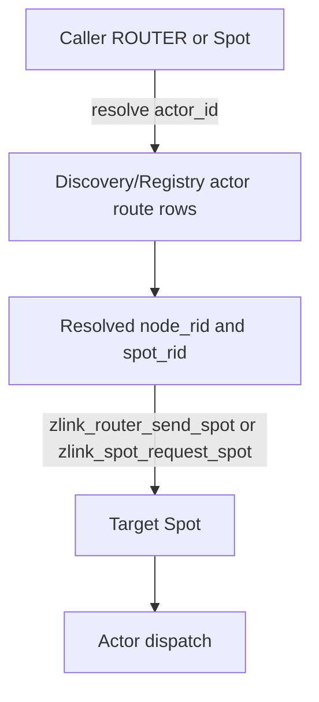

# Actor Spot route messaging 초안

이 문서는 **구현 전 초안**이며 **현재 공개 계약이 아니다**.
정식 공개 계약은 `core/include/zlink.h`와 `doc/spec/core/` 아래 정식 spec
문서를 기준으로 한다.

이 초안은 외부 ROUTER 또는 backend Spot이 특정 Actor에게 메시지를 보내야 할 때
Actor를 새 transport endpoint로 만들지 않고, Actor가 현재 속한 Spot 위치를 조회한 뒤
기존 Spot routed messaging을 사용하는 계약을 정의한다.

## 배경

현재 core에는 ROUTER에서 Spot으로 보내는 직접 주소 지정 API가 있다.

```c
zlink_submit_result_t zlink_router_send_spot(
  void *router,
  const zlink_routing_id_t *dest_node_rid,
  const zlink_routing_id_t *dest_spot_rid,
  zlink_msg_t *parts,
  size_t part_count,
  zlink_send_flags_t flags);
```

Actor에게도 같은 방식의 메시징이 필요해 보이지만, `router -> actor`,
`actor -> router` 전용 send/request/reply API를 추가하면 Actor가 Spot, ROUTER와
나란한 transport endpoint가 된다. 그러면 routed protocol에 Actor endpoint class,
Actor queue 직접 delivery, request sequence, reply metadata, stale Actor 처리 규칙을
새로 정의해야 한다.

이 초안은 첫 구현에서 그 방향을 선택하지 않는다. Actor는 transport endpoint가 아니라
Spot 안에서 dispatch되는 logical target으로 유지한다. 외부 caller는 Discovery에서
Actor의 현재 위치를 조회하고, 기존 Spot routed API로 target Spot에 메시지를 보낸다.

## 목표

1. 특정 Actor 대상 메시징을 기존 Spot routed transport 위에서 처리한다.
2. Actor id로 현재 `node_rid`와 `spot_rid`를 조회할 수 있게 한다.
3. core C API surface를 작게 유지한다.
4. ROUTER, Spot, Actor 사이의 request/reply 방향을 새로 늘리지 않는다.
5. 바인딩과 framework는 같은 route 의미를 노출한다.

## 비목표

- `zlink_router_send_actor()`를 추가하지 않는다.
- `zlink_router_request_actor()`를 추가하지 않는다.
- `zlink_spot_request_actor()`를 추가하지 않는다.
- Actor가 ROUTER로 직접 request를 보내는 public C API를 추가하지 않는다.
- Actor queue로 network message를 직접 enqueue하는 transport endpoint class를 추가하지
  않는다.
- Actor generation을 logical actor messaging의 routing key로 요구하지 않는다.

## 핵심 의미

Actor 대상 메시징은 두 단계다.

1. `actor_id`로 현재 Actor 위치를 조회한다.
2. 조회된 `node_rid + spot_rid`로 기존 Spot routed message를 보낸다.



다이어그램의 `dispatch actor`는 core transport가 아니라 target Spot 위의 application 또는
framework dispatch 계층이다. payload 또는 framework packet header에 `actor_id`를 실어
대상 Actor를 고른다.

## Actor generation 사용 범위

이 초안의 logical actor messaging은 Actor generation을 routing key로 요구하지 않는다.
같은 `actor_id`가 destroy 뒤 다시 생성되어도 caller가 원하는 대상이 같은 논리 Actor라면
메시지는 현재 route가 가리키는 Actor로 전달된다.

다만 generation 자체를 제거하지 않는다. generation은 아래 경로에서 계속 유효하다.

- session attach처럼 concrete Actor instance를 고정해야 하는 경로
- stale session relay 방어
- Actor destroy 또는 internal route update의 stale update 방어
- framework가 이미 session에 붙은 Actor route snapshot을 검증하는 경로

즉 이 초안은 generation의 의미를 줄이는 것이 아니라, backend-to-actor logical messaging
경로에서는 generation을 필수 입력으로 삼지 않는다는 뜻이다.

## C API 변경 초안

### 직접 Actor transport API는 추가하지 않음

아래 API는 추가하지 않는다.

```c
/* 추가하지 않는다. */
zlink_submit_result_t zlink_router_send_actor(...);
zlink_submit_result_t zlink_router_request_actor(...);
zlink_submit_result_t zlink_spot_send_actor(...);
zlink_submit_result_t zlink_spot_request_actor(...);
```

### Actor route 조회 계약 강화

기존 `zlink_discovery_resolve_actor()`의 출력 계약을 강화한다.

```c
zlink_config_result_t zlink_discovery_resolve_actor(
  void *discovery,
  const char *actor_id,
  zlink_actor_route_t *route_out);
```

`zlink_actor_route_t`는 아래 의미를 가져야 한다.

```c
typedef struct zlink_actor_route_t
{
    zlink_actor_ref_t actor;
    uint32_t joined;
    zlink_routing_id_t joined_spot_rid;
} zlink_actor_route_t;
```

계약:

- 성공하면 `route_out->actor.node_rid`는 현재 Actor를 소유한 `SpotNode`의 routing id다.
- 성공하면 `route_out->actor.actor_id`는 조회한 Actor id다.
- `route_out->joined != 0`이면 `route_out->joined_spot_rid`는 Actor가 현재 메시지를
  받을 Spot의 routing id다.
- backend-to-actor logical messaging은 `route_out->actor.node_rid`와
  `route_out->joined_spot_rid`를 사용해 기존 Spot routed API를 호출한다.
- backend-to-actor logical messaging은 `route_out->actor.generation`을 routing key로
  요구하지 않는다.
- `route_out->joined == 0`이면 caller는 Actor 대상 Spot routed message를 보낼 수 없다.
  이 경우 caller는 not-found 또는 not-ready 계열 오류로 처리한다.
- Registry에 공개되는 Actor route row는 `node_rid`뿐 아니라 current `spot_rid`를 함께
  보존해야 한다.

### 선택 가능한 convenience API

첫 구현의 필수 C API는 아니다. 바인딩과 framework에서 route 구조체를 직접 다루기 어렵다면
아래 convenience API를 추가할 수 있다.

```c
typedef struct zlink_actor_location_t
{
    zlink_routing_id_t node_rid;
    zlink_routing_id_t spot_rid;
} zlink_actor_location_t;

zlink_config_result_t zlink_discovery_resolve_actor_location(
  void *discovery,
  const char *actor_id,
  zlink_actor_location_t *location_out);
```

이 API를 추가한다면 `zlink_discovery_resolve_actor()`와 같은 Registry row를 읽으며,
`joined == 0` 상태를 성공으로 돌려주지 않는다. 첫 구현에서는 새 타입을 늘리기보다
`zlink_actor_route_t`의 기존 필드를 정식 계약으로 강화하는 쪽을 우선 검토한다.

## 사용 흐름

### ROUTER에서 특정 Actor로 보내기

```c
zlink_actor_route_t route;
zlink_config_result_t resolve_rc =
  zlink_discovery_resolve_actor(discovery, "player-42", &route);
if (resolve_rc != ZLINK_CONFIG_OK || route.joined == 0) {
  /* not found or not ready */
  return;
}

zlink_router_send_spot(
  router,
  &route.actor.node_rid,
  &route.joined_spot_rid,
  parts,
  part_count,
  flags);
```

메시지 payload 또는 상위 packet header에는 `actor_id`를 포함한다. target Spot은 이 값을
보고 local Actor table에서 대상 Actor를 찾아 dispatch한다.

### Actor 또는 Spot에서 backend ROUTER로 호출하기

Actor 자체에 ROUTER request API를 추가하지 않는다. Actor handler가 backend service를
호출해야 하면 현재처럼 자신이 속한 Spot의 기능을 사용한다.

- channel service 호출: `zlink_spot_send_channel()` 또는 `zlink_spot_request_channel()`
- routed ROUTER 호출: `zlink_spot_request_router()`
- 다른 Spot 호출: `zlink_spot_request_spot()` 또는 `zlink_spot_send_spot()`

Actor가 직접 transport를 소유하지 않는다는 원칙을 유지하기 위해, Actor handler는 Spot
context가 제공하는 outbound 기능을 사용한다.

## 오류 의미

| 상황 | 기대 오류 |
|------|-----------|
| `actor_id`가 비어 있음 | `EINVAL` |
| Actor route row 없음 | `ENOENT` |
| route row에는 Actor가 있지만 current Spot 없음 | `ENOENT` 또는 not-ready 계열 |
| route row의 `node_rid`가 비어 있음 | invalid route로 처리 |
| route row의 `joined_spot_rid`가 비어 있음 | invalid route로 처리 |
| 조회 뒤 target Spot이 이동함 | 기존 Spot routed send의 not-found 또는 not-connected 의미를 따름 |
| target Spot에서 actor id를 찾지 못함 | framework/application dispatch 오류로 처리 |

조회와 전송 사이에는 race가 있을 수 있다. 이 초안은 이를 core transport 오류로 없애지
않는다. caller는 route가 stale할 수 있음을 받아들이고, 필요한 경우 다시 조회한다.

## 회귀 테스트 항목

### Core C API

| ID | 항목 | 기대 결과 |
|----|------|-----------|
| ACT-ROUTE-MSG-01 | actor route resolve includes node and Spot | `zlink_discovery_resolve_actor()` 성공 결과에 `actor.node_rid`, `joined != 0`, `joined_spot_rid`가 채워진다 |
| ACT-ROUTE-MSG-02 | route row without Spot rejected | current Spot 없는 route는 Actor messaging location으로 쓰지 않는다 |
| ACT-ROUTE-MSG-03 | actor generation not required | generation이 바뀌어도 같은 `actor_id` route 재조회 뒤 현재 Spot으로 보낼 수 있다 |
| ACT-ROUTE-MSG-04 | router sends via resolved Spot | resolve 결과의 `node_rid + spot_rid`로 `zlink_router_send_spot()` 호출 시 target Spot이 수신한다 |
| ACT-ROUTE-MSG-05 | router request via resolved Spot | resolve 결과의 `node_rid + spot_rid`로 `zlink_router_request_spot()` 호출 시 target Spot reply가 completion으로 온다 |
| ACT-ROUTE-MSG-06 | stale location follows existing routed error | 조회 뒤 Actor가 다른 Spot으로 이동하면 기존 Spot routed 오류 의미를 따른다 |
| ACT-ROUTE-MSG-07 | no router-to-actor symbol | 공개 header와 export 목록에 `zlink_router_send_actor` 계열 symbol이 없다 |
| ACT-ROUTE-MSG-08 | no actor-to-router symbol | 공개 header와 export 목록에 Actor direct ROUTER request symbol이 없다 |
| ACT-ROUTE-MSG-09 | actor route sync publishes Spot rid | Registry actor route row가 current Spot rid를 포함한다 |
| ACT-ROUTE-MSG-10 | existing session generation checks unchanged | session attach와 route update의 generation 검증 회귀가 깨지지 않는다 |

### Binding 회귀

| Binding | 필수 확인 |
|---------|-----------|
| C | `zlink_actor_route_t.joined_spot_rid`를 public wrapper에서 손실 없이 전달한다 |
| C++ | Actor route 조회 결과가 node rid와 Spot rid를 모두 노출한다 |
| Go | Actor route/location 결과가 node rid와 Spot rid를 모두 노출한다 |
| Rust | Actor route/location 결과가 node rid와 Spot rid를 모두 노출한다 |
| Python | Actor route/location 결과가 node rid와 Spot rid를 모두 노출한다 |
| .NET binding | `ActorRoute` 또는 동등 타입이 node rid와 Spot rid를 모두 노출한다 |
| Node | Actor route/location 결과가 node rid와 Spot rid를 모두 노출한다 |
| Java | Actor route/location 결과가 node rid와 Spot rid를 모두 노출한다 |

### Framework 회귀

| ID | 항목 | 기대 결과 |
|----|------|-----------|
| FW-ACT-ROUTE-MSG-01 | Registry actor route resolver returns Spot route | framework resolver가 actor id로 target node rid와 target Spot rid를 반환한다 |
| FW-ACT-ROUTE-MSG-02 | backend-to-actor uses Spot routed path | backend 메시징은 Actor direct API 없이 Spot routed path를 사용한다 |
| FW-ACT-ROUTE-MSG-03 | logical actor route ignores generation | backend-to-actor logical route는 generation 0 또는 generation 변경을 session attach 오류로 취급하지 않는다 |
| FW-ACT-ROUTE-MSG-04 | session attach remains concrete | session attach 경로는 기존처럼 concrete route와 generation 검증을 유지한다 |
| FW-ACT-ROUTE-MSG-05 | route payload codec includes Spot rid | Registry route payload codec이 target Spot rid를 보존한다 |
| FW-ACT-ROUTE-MSG-06 | sample gateway flow | Bingo/TicTacToe 계열 session gateway sample에서 backend-to-actor 메시징 흐름이 문서와 맞는다 |

## 구현 순서 계획

1. core draft 검토를 끝낸다.
2. `core/include/zlink/actor.h`와 `core/include/zlink/discovery.h`의 기존 타입과 함수
   주석을 새 계약에 맞춘다.
3. Registry actor route row value에 current Spot rid가 저장되는지 확인하고, 없으면
   저장 형식을 갱신한다.
4. `zlink_discovery_resolve_actor()`가 `actor.node_rid`와 `joined_spot_rid`를 모두
   채우도록 구현한다.
5. core regression test를 추가한다.
6. core build와 core test를 먼저 통과시킨다.
7. `bindings/dev_sync_local_core_libs.sh`로 변경된 core 라이브러리를 바인딩 작업 영역에
   배포한다.
8. C binding wrapper와 각 언어 binding 타입을 갱신한다.
9. binding별 surface test와 route resolve behavior test를 추가한다.
10. framework route payload codec, resolver, runtime dispatch 계획을 반영한다.
11. framework 문서와 코드, sample을 갱신한다.
12. framework build/test/sample 실행으로 검증한다.

## Core 라이브러리 배포 계획

core C API 또는 ABI가 바뀐 뒤 binding 구현을 검증하려면 local core build 산출물을
바인딩 작업 영역으로 동기화해야 한다.

필수 순서:

1. core 변경 뒤 `cmake --build core/build`를 실행한다.
2. core regression test를 실행한다.
3. 아래 스크립트로 local core library와 header를 바인딩 쪽으로 배포한다.

```bash
/home/hep7/project/kairos/zlink/bindings/dev_sync_local_core_libs.sh
```

4. 각 binding build/test를 실행한다.

이 순서를 지키지 않으면 binding이 오래된 header 또는 오래된 `libzlink`를 기준으로
테스트될 수 있다.

## Binding 반영 계획

binding 반영의 핵심은 Actor route 조회 결과에 current Spot rid를 잃지 않는 것이다.

| 위치 | 반영 내용 |
|------|-----------|
| `bindings/c` | `zlink_actor_route_t` wrapper와 sample에서 `joined_spot_rid` 노출 확인 |
| `bindings/cpp` | route result 타입에 actor node rid와 joined Spot rid 접근자 추가 또는 확인 |
| `bindings/go` | `ResolveActor` 결과 구조체에 `NodeRID`, `SpotRID`, `Joined` 의미 반영 |
| `bindings/rust` | route result 타입과 lifetime/ownership 문서 갱신 |
| `bindings/python` | route result object에 `node_rid`, `spot_rid`, `joined` 노출 |
| `bindings/dotnet` | managed Actor route 타입에 target node rid와 target Spot rid 노출 |
| `bindings/node` | route result object와 TypeScript declaration 갱신 |
| `bindings/java` | Actor route contract와 builder/test 갱신 |

새 Actor direct messaging API를 binding에 추가하지 않는다. 각 binding은 기존
router-to-Spot 또는 Spot routed API를 조합하는 예제를 제공한다.

## Framework 반영 계획

framework는 core Actor route를 그대로 노출하기보다, backend-to-actor logical messaging에
맞는 route snapshot으로 변환한다.

반영 대상:

- Registry actor route payload에 target Spot rid를 포함한다.
- actor route resolver는 actor id를 target node rid와 target Spot rid로 변환한다.
- backend-to-actor 메시징은 target node rid와 target Spot rid로 route channel 또는 Spot
  routed path를 선택한다.
- session-attached actor route는 기존처럼 concrete Actor route와 generation 검증을
  유지한다.
- backend-to-actor logical route와 session-attached concrete route를 같은 타입으로
  억지로 합치지 않는다. 같은 타입을 쓰더라도 generation 요구 여부를 명확히 분리한다.

## 문서 반영 계획

구현 완료 뒤 아래 문서를 나누어 갱신한다.

| 문서 | 반영 내용 |
|------|-----------|
| `doc/spec/core/service/discovery.ko.md` | `zlink_discovery_resolve_actor()`가 Actor의 current node rid와 Spot rid를 돌려준다는 계약 |
| `doc/spec/core/service/spot.ko.md` | Actor route 타입 의미, backend-to-actor 메시징이 Spot routed path를 쓴다는 설명 |
| `doc/spec/core/socket/router.ko.md` | ROUTER에서 Actor로 직접 보내는 API가 아니라 resolve 후 `zlink_router_send_spot()`을 쓰는 예 |
| `doc/spec/core/errno-map.ko.md` | Actor route 조회와 Spot routed send 조합의 오류 의미 |
| `doc/spec/bindings/README.md` | 모든 바인딩이 Actor route의 node rid와 Spot rid를 노출해야 한다는 surface rule |
| `doc/spec/bindings/*/README.md` | 언어별 Actor route result 타입과 예제 |
| `doc/guide/07-4-actor.ko.md` | 사용자가 actor id로 위치를 조회하고 target Spot으로 메시지를 보내는 흐름 |
| `doc/guide/07-4-registry.ko.md` | Registry actor route row가 current Spot 위치를 제공한다는 설명 |
| `doc/internals/spot-internals.ko.md` | Actor route row 갱신, Spot routed dispatch, target Actor 선택 흐름 |
| `doc/internals/socket-option-defaults.md` | 새 direct Actor transport가 없으므로 HWM policy가 늘지 않는다는 설명이 필요하면 추가 |
| `framework/languages/dotnet/doc/spec/aspnet-core-actor.ko.md` | backend-to-actor route와 session-attached route의 의미 분리 |
| `framework/languages/dotnet/doc/spec/handler-interfaces.ko.md` | resolver 반환 타입 또는 route snapshot 필드 |
| `framework/languages/dotnet/doc/internals/behavior-matrix.ko.md` | generation 필요 경로와 필요 없는 경로 구분 |
| `framework/languages/dotnet/doc/internals/regression-test-matrix.ko.md` | backend-to-actor route resolve와 dispatch 회귀 항목 |
| `framework/languages/dotnet/doc/guide/samples/*` | sample gateway 흐름에서 actor id resolve 후 Spot route 메시징 사용 |

## 열린 결정 사항

1. `zlink_actor_route_t.actor.generation`을 backend-to-actor logical messaging 문서에서
   단순히 무시한다고 쓸지, "진단용으로만 볼 수 있다"고 쓸지 정해야 한다.
2. `zlink_discovery_resolve_actor_location()` convenience API를 추가할지, 기존
   `zlink_discovery_resolve_actor()` 계약 강화만으로 끝낼지 정해야 한다.
3. target Spot에서 Actor를 고르는 packet header 형식을 core guide에만 둘지,
   framework spec에만 둘지 정해야 한다.
4. route row에 Spot rid가 없는 이전 Registry payload와의 호환을 유지할지 정해야 한다.
   호환이 필요 없으면 invalid route로 실패시키는 것이 단순하다.
5. framework의 backend-to-actor route 타입을 session attach route 타입과 분리할지,
   같은 타입에 사용 모드를 명시할지 정해야 한다.
