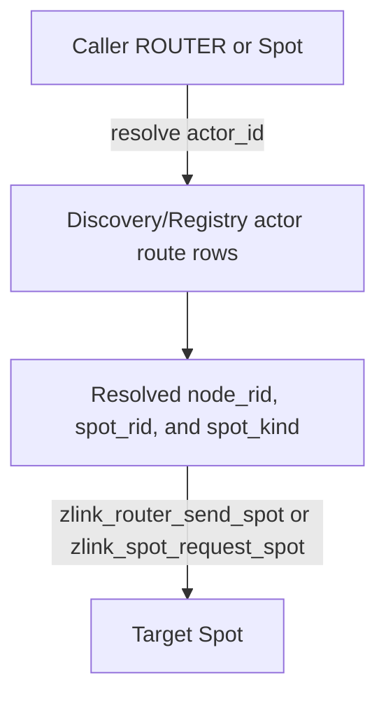

# Actor location route 초안

이 문서는 **구현 전 초안**이며 **현재 공개 계약이 아니다**.
정식 공개 계약은 `core/include/zlink.h`와 `doc/spec/core/` 아래 정식 spec
문서를 기준으로 한다.

이 초안의 실제 spec 대상은 **Actor id로 현재 Spot route를 조회하는 C API 계약**과
**Spot rid로 owner node와 Spot kind를 조회하는 C API 계약**이다.
외부 ROUTER 또는 backend Spot이 특정 Actor에게 메시지를 보내는 것은 이 계약을 사용하는
대표 용도일 뿐이다. core는 Actor direct transport를 추가하지 않고, caller가 조회한
`node_rid + current_spot_rid`를 기존 Spot routed API에 넘기도록 한다.

## 배경

현재 core에는 ROUTER에서 Spot으로 보내는 직접 주소 지정 API가 있다.

```c
zlink_submit_result_t zlink_router_send_spot(
  void *router,
  const zlink_routing_id_t *dest_node_rid,
  const zlink_routing_id_t *dest_spot_rid,
  zlink_msg_t *parts,
  size_t part_count,
  zlink_send_flags_t flags);
```

Actor에게도 같은 방식의 메시징이 필요해 보이지만, `router -> actor`,
`actor -> router` 전용 send/request/reply API를 추가하면 Actor가 Spot, ROUTER와
나란한 transport endpoint가 된다. 그러면 routed protocol에 Actor endpoint class,
Actor queue 직접 delivery, request sequence, reply metadata, stale Actor 처리 규칙을
새로 정의해야 한다.

이 초안은 첫 구현에서 그 방향을 선택하지 않는다. Actor는 transport endpoint가 아니라
Spot 안의 logical target으로 유지한다. 외부 caller는 Discovery에서 Actor의 현재 위치를
조회하고, 기존 Spot routed API로 target Spot에 메시지를 보낸다.

## Spec 대상

이 초안은 아래 계약만 정의한다.

1. `zlink_discovery_resolve_actor()`는 Actor id의 현재 route 위치를 반환한다.
2. 현재 route 위치는 `zlink_actor_route_t.actor.node_rid`와
   `zlink_actor_route_t.current_spot_rid`로 표현한다.
3. `zlink_discovery_resolve_spot()`은 Spot rid의 현재 owner node와 Spot kind를 반환한다.
4. caller는 조회한 node rid와 Spot rid를 기존 Spot routed API에 넘긴다.
5. core는 Actor direct send/request/reply C API를 추가하지 않는다.
6. current Spot이 Entry Spot인지 user Spot인지 `zlink_spot_kind_t`로 구분한다.

이 계약에서 "Actor에게 메시지를 보낸다"는 말은 core transport 의미가 아니다.
정확한 의미는 "Actor id로 조회한 current Spot route로 Spot routed message를 보낸다"이다.

## 목표

1. Actor id로 현재 `node_rid`와 `spot_rid`를 조회할 수 있게 한다.
2. 특정 Actor 대상 메시징은 조회된 Spot route 위에서 application이 정의한다.
3. Spot rid로 현재 owner node와 Entry/User kind를 조회할 수 있게 한다.
4. core C API surface를 작게 유지한다.
5. ROUTER, Spot, Actor 사이의 request/reply 방향을 새로 늘리지 않는다.
6. 바인딩과 framework는 같은 route 의미를 노출한다.

## 비목표

- `zlink_router_send_actor()`를 추가하지 않는다.
- `zlink_router_request_actor()`를 추가하지 않는다.
- `zlink_spot_request_actor()`를 추가하지 않는다.
- Actor가 ROUTER로 직접 request를 보내는 public C API를 추가하지 않는다.
- Actor queue로 network message를 직접 enqueue하는 transport endpoint class를 추가하지
  않는다.
- Actor generation을 logical actor messaging의 routing key로 요구하지 않는다.

## Normative C API delta

### 추가되는 C symbol

아래 enum type, enum value, struct type을 추가한다.

```c
typedef enum zlink_spot_kind_t
{
    ZLINK_SPOT_KIND_INVALID = 0,
    ZLINK_SPOT_KIND_ENTRY = 1,
    ZLINK_SPOT_KIND_USER = 2
} zlink_spot_kind_t;

typedef struct zlink_spot_route_t
{
    zlink_routing_id_t spot_rid;
    zlink_routing_id_t owner_node_rid;
    zlink_spot_kind_t spot_kind;
} zlink_spot_route_t;
```

새 public function과 새 routed endpoint class는 추가하지 않는다.

### Header 배치

첫 구현에서는 새 타입을 아래 public header에 둔다.

| Header | 반영 내용 |
|--------|-----------|
| `core/include/zlink/service_common.h` | `zlink_spot_kind_t`를 선언한다. Actor, Spot, Discovery, Registry header가 모두 참조해야 하므로 공통 service header에 둔다 |
| `core/include/zlink/actor.h` | `zlink_actor_route_t` layout을 `current_spot_rid`, `current_spot_kind` 중심으로 바꾼다 |
| `core/include/zlink/discovery.h` | `zlink_spot_route_t`와 변경된 `zlink_discovery_resolve_spot()` signature를 선언한다 |
| `core/include/zlink/spot.h` | SpotNode snapshot 구조체에 Spot kind를 추가한다 |
| `core/include/zlink/registry.h` | topology entry에 Spot owner kind를 담는 `spot_kind` field를 추가한다 |

### 제거되는 C symbol

없다.

### ABI 영향

| 항목 | 결정 |
|------|------|
| public struct layout | 변경 있음 |
| public function symbol | 추가 없음 |
| public enum value | `zlink_spot_kind_t` 추가 |
| `zlink_spot_route_t` ABI | add |
| `zlink_actor_route_t` ABI | break |
| `zlink_spot_node_actor_entry_t` ABI | break |
| `zlink_spot_node_spot_entry_t` ABI | break |
| `zlink_registry_topology_entry_t` ABI | break |
| `zlink_discovery_resolve_spot()` signature | break |
| `zlink_discovery_resolve_actor()` signature | 유지 |
| Registry actor route value format | current Spot rid 포함을 정식 요구사항으로 고정 |
| Registry Spot owner topology row | Spot kind 포함을 정식 요구사항으로 고정 |

이 변경은 public struct layout을 바꾸므로 C ABI 호환성을 유지하지 않는다. 기존 배포나
문서가 `joined` 또는 `joined_spot_rid`를 사용했다면 그 surface는 폐기한다.

호환성 결정:

- 기존 C ABI 호환성은 유지하지 않는다.
- Spot rid가 없는 이전 Actor route row와의 호환성은 유지하지 않는다.
- Spot kind가 없는 이전 Spot owner row와의 호환성은 유지하지 않는다.
- 이전 row 형식은 새 route 계약의 성공 결과가 될 수 없으므로 not-found로 처리한다.

### Core socket timeout 기본값 변경

route 조회와 routed send/request 흐름에서 무한 대기가 기본값이면, 설정을 빠뜨린 caller가
장애 상황에서 멈춘 것처럼 보일 수 있다. 이 초안의 구현 범위에 C core socket timeout
기본값 변경도 포함한다.

| C surface | 기존 기본값 | 새 기본값 | 의미 |
|-----------|-------------|-----------|------|
| `ZLINK_OPT_SNDTIMEO` | `-1` | `1000` | 기본 send timeout을 1000ms로 둔다 |
| `ZLINK_OPT_RCVTIMEO` | `-1` | `1000` | 기본 receive timeout을 1000ms로 둔다 |

명시적으로 option을 설정한 socket은 caller가 설정한 값을 따른다. 내부 relay처럼 현재 코드가
특정 timeout 값을 의도적으로 override하는 경로는 그 override를 유지한다.

### 변경되는 C API 계약

아래 public C surface를 변경한다.

| C surface | 변경 종류 | 변경 내용 |
|-----------|-----------|-----------|
| `zlink_spot_kind_t` | add enum | Entry Spot과 user Spot을 구분한다 |
| `zlink_spot_route_t` | add struct | Spot rid 조회 결과로 owner node rid와 Spot kind를 함께 반환한다 |
| `zlink_actor_route_t` | layout change | `joined` 제거, `joined_spot_rid`를 `current_spot_rid`로 교체, `current_spot_kind` 추가 |
| `zlink_spot_node_actor_entry_t` | layout change | Actor snapshot도 current Spot rid/kind를 반환한다 |
| `zlink_spot_node_spot_entry_t` | layout change | Spot snapshot도 Entry/User kind를 반환한다 |
| `zlink_registry_topology_entry_t` | layout change | Spot owner topology row의 Entry/User kind를 반환한다 |
| `zlink_discovery_resolve_spot()` | signature/semantic change | 성공 시 owner node route와 Spot kind를 반드시 채운다 |
| `zlink_discovery_resolve_actor()` | semantic change | 성공 시 current Spot route와 Spot kind를 반드시 채운다 |

새 header shape:

```c
typedef struct zlink_actor_route_t
{
    zlink_actor_ref_t actor;
    zlink_routing_id_t current_spot_rid;
    zlink_spot_kind_t current_spot_kind;
} zlink_actor_route_t;

typedef struct zlink_spot_route_t
{
    zlink_routing_id_t spot_rid;
    zlink_routing_id_t owner_node_rid;
    zlink_spot_kind_t spot_kind;
} zlink_spot_route_t;

zlink_config_result_t zlink_discovery_resolve_spot(
  void *discovery,
  const zlink_routing_id_t *spot_rid,
  zlink_spot_route_t *route_out);

zlink_config_result_t zlink_discovery_resolve_actor(
  void *discovery,
  const char *actor_id,
  zlink_actor_route_t *route_out);
```

snapshot 구조체도 같은 current Spot 표현을 사용한다.

```c
typedef struct zlink_spot_node_spot_entry_t
{
    zlink_routing_id_t spot_rid;
    zlink_spot_kind_t spot_kind;
    uint32_t dispatch_handler_attached;
    uint32_t joined_actor_count;
    uint32_t pending_actor_join_count;
    uint32_t route_synced;
    uint64_t last_changed_ms;
} zlink_spot_node_spot_entry_t;

typedef struct zlink_spot_node_actor_entry_t
{
    zlink_actor_ref_t actor;
    zlink_routing_id_t current_spot_rid;
    zlink_spot_kind_t current_spot_kind;
    uint32_t route_synced;
    uint32_t pending_message_count;
    uint64_t last_changed_ms;
} zlink_spot_node_actor_entry_t;
```

Registry topology snapshot과 query 결과도 Spot owner kind를 보존한다.

```c
typedef struct zlink_registry_topology_entry_t
{
    zlink_auto_connect_type_t auto_connect_type;
    zlink_routing_id_t routing_id;
    zlink_service_kind_t service_kind;
    zlink_service_role_t service_role;
    char channel_name[256];
    char endpoint[256];
    zlink_topology_source_t source;
    zlink_topology_state_t state;
    uint32_t desired_count;
    uint32_t ready_count;
    uint32_t error_code;
    uint64_t last_reported_ms;
    zlink_spot_kind_t spot_kind;
} zlink_registry_topology_entry_t;
```

`spot_kind`는 Spot owner topology row에서 `ZLINK_SPOT_KIND_ENTRY` 또는
`ZLINK_SPOT_KIND_USER`여야 한다. Spot owner가 아닌 topology row에서는
`ZLINK_SPOT_KIND_INVALID`를 사용한다.

`zlink_discovery_resolve_actor()` 성공 조건:

- `route_out->actor.node_rid.size > 0`이어야 한다.
- `route_out->actor.actor_id`는 조회한 `actor_id`와 같아야 한다.
- `route_out->current_spot_rid.size > 0`이어야 한다.
- `route_out->current_spot_kind`는 `ZLINK_SPOT_KIND_ENTRY` 또는
  `ZLINK_SPOT_KIND_USER`여야 한다.
- `route_out->actor.generation`은 채울 수 있지만, Actor location routing에는 쓰지 않는다.

`zlink_discovery_resolve_actor()` 실패 조건:

- `discovery == NULL`, `actor_id == NULL`, 빈 `actor_id`, 너무 긴 `actor_id`,
  `route_out == NULL`이면 `ZLINK_CONFIG_INVALID_ARGUMENT`와 `EINVAL`이다.
- Registry actor route row가 없으면 `ZLINK_CONFIG_NOT_FOUND`와 `ENOENT`다.
- row는 있지만 `node_rid` 또는 `spot_rid`가 없으면 invalid route로 보고
  `ZLINK_CONFIG_NOT_FOUND`와 `ENOENT`를 반환한다.
- row payload format을 decode할 수 없으면 `ZLINK_CONFIG_INTERNAL_ERROR`와 `EPROTO`를
  반환한다.

`zlink_discovery_resolve_spot()` 성공 조건:

- `route_out->spot_rid`는 조회한 `spot_rid`와 같아야 한다.
- `route_out->owner_node_rid.size > 0`이어야 한다.
- `route_out->spot_kind`는 `ZLINK_SPOT_KIND_ENTRY` 또는 `ZLINK_SPOT_KIND_USER`여야 한다.

`zlink_discovery_resolve_spot()` 실패 조건:

- `discovery == NULL`, `spot_rid == NULL`, 빈 `spot_rid`, `route_out == NULL`이면
  `ZLINK_CONFIG_INVALID_ARGUMENT`와 `EINVAL`이다.
- Registry Spot owner topology row가 없으면 `ZLINK_CONFIG_NOT_FOUND`와 `ENOENT`다.
- row는 있지만 owner node rid 또는 Spot kind가 없으면 invalid route로 보고
  `ZLINK_CONFIG_NOT_FOUND`와 `ENOENT`를 반환한다.
- `spot_kind == ZLINK_SPOT_KIND_INVALID`이면 `ZLINK_CONFIG_NOT_FOUND`와 `ENOENT`다.
- row payload 또는 topology projection decode 중 protocol 오류가 있으면
  `ZLINK_CONFIG_INTERNAL_ERROR`와 `EPROTO`다.

### 명시적으로 추가하지 않는 API

아래 API는 이 초안의 구현 대상이 아니다.

```c
zlink_submit_result_t zlink_router_send_actor(...);
zlink_submit_result_t zlink_router_request_actor(...);
zlink_submit_result_t zlink_router_reply_actor(...);
zlink_submit_result_t zlink_spot_send_actor(...);
zlink_submit_result_t zlink_spot_request_actor(...);
zlink_submit_result_t zlink_spot_reply_actor(...);
zlink_submit_result_t zlink_actor_send_router(...);
zlink_submit_result_t zlink_actor_request_router(...);
```

### 기존 C API 조합

Actor location route를 얻은 뒤에는 아래 기존 API만 사용한다.

```c
zlink_submit_result_t zlink_router_send_spot(
  void *router,
  const zlink_routing_id_t *dest_node_rid,
  const zlink_routing_id_t *dest_spot_rid,
  zlink_msg_t *parts,
  size_t part_count,
  zlink_send_flags_t flags);

zlink_submit_result_t zlink_router_request_spot(
  void *router,
  const zlink_routing_id_t *dest_node_rid,
  const zlink_routing_id_t *dest_spot_rid,
  zlink_msg_t *parts,
  size_t part_count,
  zlink_reply_handler_fn handler,
  void *userdata,
  zlink_send_flags_t flags,
  uint32_t timeout_ms);

zlink_submit_result_t zlink_spot_send_spot(
  void *spot,
  const zlink_routing_id_t *dest_node_rid,
  const zlink_routing_id_t *dest_spot_rid,
  zlink_msg_t *parts,
  size_t part_count,
  zlink_send_flags_t flags);

zlink_submit_result_t zlink_spot_request_spot(
  void *spot,
  const zlink_routing_id_t *dest_node_rid,
  const zlink_routing_id_t *dest_spot_rid,
  zlink_msg_t *parts,
  size_t part_count,
  zlink_reply_handler_fn handler,
  void *userdata,
  zlink_send_flags_t flags,
  uint32_t timeout_ms);
```

## Core route row contract

Registry에 publish되는 Actor route row의 value는 current Spot route를 복원할 수 있어야 한다.

필수 logical fields:

| 필드 | 의미 |
|------|------|
| `actor_id` | route key와 같은 Actor id |
| `node_rid` | Actor의 current SpotNode routing id |
| `spot_rid` | Actor의 current Spot routing id |
| `spot_kind` | current Spot이 Entry Spot인지 user Spot인지 나타내는 값 |
| `generation` | concrete Actor instance 진단과 session attach용 값. location routing에는 필수 아님 |

`zlink_discovery_resolve_actor()`는 이 row를 읽어 `zlink_actor_route_t`를 채운다.
row에 `spot_rid`가 없으면 성공하지 않는다. 이전 형식의 row가 `node_rid`만 가지고 있다면
이 초안에서는 Actor location route로 사용할 수 없으므로 not-found로 처리한다.

Registry에 publish되는 Spot owner topology row도 Spot kind를 복원할 수 있어야 한다.
첫 구현에서는 Spot owner 정보를 별도 route value가 아니라 Registry topology entry에 둔다.
`zlink_discovery_resolve_spot()`은 Spot owner topology row를 읽어 `zlink_spot_route_t`를
채운다. 이전 형식의 owner row가 owner node rid만 복원할 수 있다면 이 초안에서는 Spot kind를
보장할 수 없으므로 not-found로 처리한다.

첫 구현의 core route row encoding:

```c
/* route kind: ZLINK_ROUTE_KIND_ACTOR */
key        = actor_id bytes without trailing NUL
value      = byte copy of zlink_actor_route_t
value_size = sizeof(zlink_actor_route_t)
```

`value.actor.actor_id`는 `key`와 같은 Actor id를 NUL 종료 문자열로 담는다.
`value.actor.node_rid`와 `value.current_spot_rid`는 모두 non-empty routing id여야 한다.
`value.current_spot_kind`는 `ZLINK_SPOT_KIND_ENTRY` 또는 `ZLINK_SPOT_KIND_USER`여야 한다.
`ZLINK_SPOT_KIND_INVALID` row는 current route location이 아니므로
`zlink_discovery_resolve_actor()` 성공 결과가 될 수 없다.

route publish 시 `current_spot_kind`는 Actor가 현재 가리키는 Spot state에서 계산한다.
내부 Spot state의 `entry` 값이 true이면 `ZLINK_SPOT_KIND_ENTRY`, false이면
`ZLINK_SPOT_KIND_USER`를 기록한다.

Spot owner topology row publish 시에도 같은 계산을 사용한다. Entry Spot owner row의
`spot_kind`는 `ZLINK_SPOT_KIND_ENTRY`, user Spot owner row의 `spot_kind`는
`ZLINK_SPOT_KIND_USER`다. socket peer, channel, Registry 같은 Spot owner가 아닌 topology
row는 `ZLINK_SPOT_KIND_INVALID`를 기록한다.

## Entry Spot route 규칙

Actor는 생성 직후 Entry Spot에 속하고, user Spot에서 leave하면 같은 node의 Entry
Spot으로 돌아온다. 따라서 Entry Spot도 Actor route의 current Spot이 될 수 있다.

Entry Spot rid는 설정 가능하다.

1. application은 `zlink_spot_node_entry_spot()`으로 Entry Spot facade를 얻는다.
2. Actor 생성 또는 route publish 전에 `zlink_set_routing_id(entry_spot, ...)`를 호출한다.
3. Entry Spot rid가 설정되면 `current_spot_kind == ZLINK_SPOT_KIND_ENTRY` route의
   `current_spot_rid`로 그대로 노출된다.

제약:

- Entry Spot rid 설정은 configuration phase에서만 허용한다.
- Actor가 하나라도 생성된 뒤 Entry Spot rid 변경은 실패한다.
- Entry Spot rid가 Actor active route 또는 Spot owner route로 publish된 뒤 변경은
  실패한다.
- 같은 `SpotNode` 안에서 Entry Spot rid와 user Spot rid는 중복될 수 없다.

## Route contract boundary

core가 보장하는 것은 route 조회와 target Spot까지의 routed delivery다. target Spot에
도착한 메시지를 어떻게 처리할지는 이 초안의 계약 밖이다.

따라서 이 초안의 의미는 아래와 같다.

| 단계 | 소유 계층 | 계약 |
|------|-----------|------|
| actor id route 조회 | core Discovery | `actor_id -> node_rid + current_spot_rid + current_spot_kind` |
| Spot rid route 조회 | core Discovery | `spot_rid -> owner_node_rid + spot_kind` |
| network delivery | core Spot routed transport | `node_rid + current_spot_rid`로 target Spot에 전달 |

## 핵심 의미

Actor route를 사용하는 흐름은 세 단계다.

1. `actor_id`로 현재 Actor 위치를 조회한다.
2. 조회된 `node_rid + current_spot_rid`로 기존 Spot routed message를 보낸다.

framework 같은 상위 계층에서 caller 가 직접 node rid 를 다루지 않는 표면을 제공할 때도,
source 쪽 transport 선택은 별도 설정으로 남겨야 한다. caller 는 사용할 local egress
channel 을 명시하고, 그 egress 설정은 target SpotNode 가 accept 한 ingress channel 이름을
가진다. target Actor/Spot route 조회 결과는 delivery 대상 정보이고, source process 의
connection 선택 정보를 대신하지 않는다.
3. 필요하면 `current_spot_kind`로 Entry Spot과 user Spot을 구분한다.



## Actor generation 사용 범위

이 초안의 logical actor messaging은 Actor generation을 routing key로 요구하지 않는다.
같은 `actor_id`가 destroy 뒤 다시 생성되어도 caller가 원하는 대상이 같은 논리 Actor라면
caller는 현재 route가 가리키는 Spot으로 전송할 수 있다.

다만 generation 자체를 제거하지 않는다. generation은 아래 경로에서 계속 유효하다.

- session attach처럼 concrete Actor instance를 고정해야 하는 경로
- stale session relay 방어
- Actor destroy 또는 internal route update의 stale update 방어
- framework가 이미 session에 붙은 Actor route snapshot을 검증하는 경로

즉 이 초안은 generation의 의미를 줄이는 것이 아니라, backend-to-actor logical messaging
경로에서는 generation을 필수 입력으로 삼지 않는다는 뜻이다.

## 사용 흐름

### ROUTER에서 Actor 위치 조회 후 Spot으로 보내기

```c
zlink_actor_route_t route;
zlink_config_result_t resolve_rc =
  zlink_discovery_resolve_actor(discovery, "player-42", &route);
if (resolve_rc != ZLINK_CONFIG_OK) {
  /* not found or not ready */
  return;
}

zlink_router_send_spot(
  router,
  &route.actor.node_rid,
  &route.current_spot_rid,
  parts,
  part_count,
  flags);
```

`route.current_spot_kind == ZLINK_SPOT_KIND_ENTRY`이면 target은 Entry Spot이고,
`ZLINK_SPOT_KIND_USER`이면 user Spot이다.

### Actor 또는 Spot에서 backend ROUTER로 호출하기

Actor 자체에 ROUTER request API를 추가하지 않는다. Actor handler가 backend service를
호출해야 하면 현재처럼 자신이 속한 Spot의 기능을 사용한다.

- channel service 호출: `zlink_spot_send_channel()` 또는 `zlink_spot_request_channel()`
- routed ROUTER 호출: `zlink_spot_request_router()`
- 다른 Spot 호출: `zlink_spot_request_spot()` 또는 `zlink_spot_send_spot()`

Actor가 직접 transport를 소유하지 않는다는 원칙을 유지하기 위해, Actor handler는 Spot
context가 제공하는 outbound 기능을 사용한다.

## 오류 의미

`zlink_discovery_resolve_actor()`의 오류는 아래처럼 고정한다.

| 상황 | 반환값 | `zlink_errno()` |
|------|--------|-----------------|
| `discovery == NULL` | `ZLINK_CONFIG_INVALID_ARGUMENT` | `EINVAL` |
| `actor_id == NULL` | `ZLINK_CONFIG_INVALID_ARGUMENT` | `EINVAL` |
| `actor_id`가 비어 있음 | `ZLINK_CONFIG_INVALID_ARGUMENT` | `EINVAL` |
| `actor_id`가 `ZLINK_ACTOR_ID_MAX - 1` byte 초과 | `ZLINK_CONFIG_INVALID_ARGUMENT` | `EINVAL` |
| `route_out == NULL` | `ZLINK_CONFIG_INVALID_ARGUMENT` | `EINVAL` |
| Actor route row 없음 | `ZLINK_CONFIG_NOT_FOUND` | `ENOENT` |
| route row의 `value_size`가 `sizeof(zlink_actor_route_t)`와 다름 | `ZLINK_CONFIG_NOT_FOUND` | `ENOENT` |
| route row의 key와 `value.actor.actor_id`가 다름 | `ZLINK_CONFIG_NOT_FOUND` | `ENOENT` |
| `value.actor.node_rid.size == 0` | `ZLINK_CONFIG_NOT_FOUND` | `ENOENT` |
| `value.current_spot_rid.size == 0` | `ZLINK_CONFIG_NOT_FOUND` | `ENOENT` |
| `value.current_spot_kind == ZLINK_SPOT_KIND_INVALID` | `ZLINK_CONFIG_NOT_FOUND` | `ENOENT` |
| route payload decode 중 protocol 오류 | `ZLINK_CONFIG_INTERNAL_ERROR` | `EPROTO` |

`zlink_discovery_resolve_spot()`의 오류는 아래처럼 고정한다.

| 상황 | 반환값 | `zlink_errno()` |
|------|--------|-----------------|
| `discovery == NULL` | `ZLINK_CONFIG_INVALID_ARGUMENT` | `EINVAL` |
| `spot_rid == NULL` | `ZLINK_CONFIG_INVALID_ARGUMENT` | `EINVAL` |
| `spot_rid`가 비어 있음 | `ZLINK_CONFIG_INVALID_ARGUMENT` | `EINVAL` |
| `route_out == NULL` | `ZLINK_CONFIG_INVALID_ARGUMENT` | `EINVAL` |
| Spot owner topology row 없음 | `ZLINK_CONFIG_NOT_FOUND` | `ENOENT` |
| owner node rid가 비어 있음 | `ZLINK_CONFIG_NOT_FOUND` | `ENOENT` |
| `spot_kind == ZLINK_SPOT_KIND_INVALID` | `ZLINK_CONFIG_NOT_FOUND` | `ENOENT` |
| `spot_kind`가 정의된 enum 값이 아님 | `ZLINK_CONFIG_NOT_FOUND` | `ENOENT` |
| topology projection decode 중 protocol 오류 | `ZLINK_CONFIG_INTERNAL_ERROR` | `EPROTO` |

조회 성공 뒤 전송이 실패하는 경우는 route 조회 API 오류가 아니다.
예를 들어 조회 뒤 Actor가 다른 Spot으로 이동하면 `zlink_router_send_spot()` 또는
`zlink_router_request_spot()`의 기존 not-found, not-connected, backpressure 의미를 따른다.

조회와 전송 사이에는 race가 있을 수 있다. 이 초안은 이를 core transport 오류로 없애지
않는다. caller는 route가 stale할 수 있음을 받아들이고, 필요한 경우 다시 조회한다.

## 회귀 테스트 항목

### Core C API

| ID | 항목 | 기대 결과 |
|----|------|-----------|
| ACT-ROUTE-MSG-01 | actor route resolve includes node and Spot | 성공 결과에 `actor.node_rid`, `current_spot_rid`, `current_spot_kind`가 채워진다 |
| ACT-ROUTE-MSG-02 | route row without Spot rejected | current Spot 없는 route는 Actor messaging location으로 쓰지 않는다 |
| ACT-ROUTE-MSG-03 | actor generation not required | generation이 바뀌어도 같은 `actor_id` route 재조회 뒤 현재 Spot으로 보낼 수 있다 |
| ACT-ROUTE-MSG-04 | router sends via resolved Spot | resolve 결과의 `node_rid + current_spot_rid`로 `zlink_router_send_spot()` 호출 시 target Spot이 수신한다 |
| ACT-ROUTE-MSG-05 | router request via resolved Spot | resolve 결과의 `node_rid + current_spot_rid`로 `zlink_router_request_spot()` 호출 시 target Spot reply가 completion으로 온다 |
| ACT-ROUTE-MSG-06 | stale location follows existing routed error | 조회 뒤 Actor가 다른 Spot으로 이동하면 기존 Spot routed 오류 의미를 따른다 |
| ACT-ROUTE-MSG-07 | no router-to-actor symbol | 공개 header와 export 목록에 `zlink_router_send_actor` 계열 symbol이 없다 |
| ACT-ROUTE-MSG-08 | no actor-to-router symbol | 공개 header와 export 목록에 Actor direct ROUTER request symbol이 없다 |
| ACT-ROUTE-MSG-09 | actor route sync publishes Spot rid and kind | Registry actor route row가 current Spot rid와 kind를 포함한다 |
| ACT-ROUTE-MSG-10 | existing session generation checks unchanged | session attach와 route update의 generation 검증 회귀가 깨지지 않는다 |
| ACT-ROUTE-MSG-11 | route value size validation | `value_size != sizeof(zlink_actor_route_t)` row는 resolve 성공이 아니다 |
| ACT-ROUTE-MSG-12 | route key/value actor id match | route key와 value actor id가 다르면 resolve 성공이 아니다 |
| ACT-ROUTE-MSG-13 | no invalid spot kind success | `current_spot_kind == ZLINK_SPOT_KIND_INVALID` row는 current location으로 반환하지 않는다 |
| ACT-ROUTE-MSG-14 | entry spot route kind | Entry Spot에 있는 Actor route는 `ZLINK_SPOT_KIND_ENTRY`를 반환한다 |
| ACT-ROUTE-MSG-15 | user spot route kind | user Spot에 있는 Actor route는 `ZLINK_SPOT_KIND_USER`를 반환한다 |
| ACT-ROUTE-MSG-16 | configured entry spot rid | 설정한 Entry Spot rid가 Entry Spot route의 `current_spot_rid`로 반환된다 |
| SPOT-ROUTE-MSG-01 | resolve spot includes kind | Spot rid 조회 결과에 owner node rid와 Spot kind가 채워진다 |
| SPOT-ROUTE-MSG-02 | resolve entry spot kind | Entry Spot rid 조회 결과가 `ZLINK_SPOT_KIND_ENTRY`를 반환한다 |
| SPOT-ROUTE-MSG-03 | resolve user spot kind | user Spot rid 조회 결과가 `ZLINK_SPOT_KIND_USER`를 반환한다 |
| SPOT-ROUTE-MSG-04 | topology spot owner includes kind | Registry topology snapshot/query의 Spot owner row가 Entry/User Spot kind를 보존한다 |
| SPOT-ROUTE-MSG-05 | non-spot-owner topology uses invalid kind | Spot owner가 아닌 topology row의 `spot_kind`는 `ZLINK_SPOT_KIND_INVALID`다 |
| SPOT-ROUTE-MSG-06 | invalid spot kind rejected | Spot owner row의 `spot_kind`가 invalid이면 `ResolveSpot()` 성공 결과가 아니다 |
| SOCKET-TIMEOUT-01 | default send timeout | 새 socket의 `ZLINK_OPT_SNDTIMEO` 기본값이 `1000`이다 |
| SOCKET-TIMEOUT-02 | default receive timeout | 새 socket의 `ZLINK_OPT_RCVTIMEO` 기본값이 `1000`이다 |
| SOCKET-TIMEOUT-03 | explicit timeout preserved | caller가 명시적으로 설정한 `ZLINK_OPT_SNDTIMEO`, `ZLINK_OPT_RCVTIMEO` 값은 기본값으로 덮어쓰지 않는다 |

### Binding 회귀

| Binding | 필수 확인 |
|---------|-----------|
| C | `zlink_actor_route_t`, `zlink_spot_route_t` wrapper와 sample에서 Spot kind 노출 확인 |
| C++ | Actor route와 Spot route 조회 결과가 node rid, Spot rid, Spot kind를 모두 노출한다 |
| Go | Actor route와 Spot route 결과가 node rid, Spot rid, Spot kind를 모두 노출한다 |
| Rust | Actor route와 Spot route 결과가 node rid, Spot rid, Spot kind를 모두 노출한다 |
| Python | Actor route와 Spot route result object에 actor node rid, current Spot rid, owner node rid, Spot rid, Spot kind를 노출한다 |
| .NET binding | `ActorRoute`와 `SpotRoute` 또는 동등 타입이 node rid, Spot rid, Spot kind를 모두 노출한다 |
| Node | Actor route와 Spot route 결과가 node rid, Spot rid, Spot kind를 모두 노출한다 |
| Java | Actor route와 Spot route contract와 builder/test를 갱신한다 |

### Framework 회귀

| ID | 항목 | 기대 결과 |
|----|------|-----------|
| FW-ACT-ROUTE-MSG-01 | backend discovery actor lookup is used | framework Actor route resolver가 generic `ResolveRoute()`가 아니라 `ResolveActor()`를 호출한다 |
| FW-ACT-ROUTE-MSG-02 | backend-to-actor uses Spot routed path | backend 메시징은 Actor direct API 없이 Spot routed path를 사용한다 |
| FW-ACT-ROUTE-MSG-03 | logical actor route ignores generation | backend-to-actor logical route는 generation 0 또는 generation 변경을 session attach 오류로 취급하지 않는다 |
| FW-ACT-ROUTE-MSG-04 | session attach remains concrete | session attach 경로는 기존처럼 concrete route와 generation 검증을 유지한다 |
| FW-ACT-ROUTE-MSG-05 | native ActorRoute fields are preserved | binding의 Actor route 결과에서 node rid, current Spot rid, Spot kind가 framework route snapshot까지 손실 없이 전달된다 |
| FW-ACT-ROUTE-MSG-06 | sample gateway flow | Bingo/TicTacToe 계열 session gateway sample에서 backend-to-actor 메시징 흐름이 문서와 맞는다 |
| FW-SPOT-ROUTE-MSG-01 | Spot rid route uses ResolveSpot | Spot rid로 route를 조회할 때 framework resolver가 core `ResolveSpot()`을 호출한다 |
| FW-SPOT-ROUTE-MSG-02 | Spot rid route preserves Spot kind | Spot rid route 결과가 core `ResolveSpot()`의 Spot kind를 보존한다 |
| FW-SPOT-ROUTE-MSG-03 | Spot RID route resolves owner through ResolveSpot | Spot RID route는 framework name row에서 Spot rid만 얻고 owner node rid와 Spot kind는 core `ResolveSpot()`으로 얻는다 |

## 구현 순서 계획

1. core draft 검토를 끝낸다.
2. `core/include/zlink/service_common.h`, `actor.h`, `discovery.h`, `spot.h`,
   `registry.h`의 타입, field, 함수 주석을 새 계약에 맞춘다.
3. Registry actor route row value에 current Spot rid와 Spot kind가 저장되도록
   저장 형식을 갱신한다.
4. Registry Spot owner topology row에 Spot kind가 저장되도록 topology entry publish,
   projection, query encode/decode를 갱신한다.
5. `zlink_discovery_resolve_spot()`이 `owner_node_rid`, `spot_rid`, `spot_kind`를 모두
   채우도록 구현한다.
6. `zlink_discovery_resolve_actor()`가 `actor.node_rid`, `current_spot_rid`,
   `current_spot_kind`를 모두 채우도록 구현한다.
7. C core socket 기본 `ZLINK_OPT_SNDTIMEO`, `ZLINK_OPT_RCVTIMEO`를 1000ms로 변경한다.
8. core regression test를 추가한다.
9. core build와 core test를 먼저 통과시킨다.
10. `bindings/dev_sync_local_core_libs.sh`로 변경된 core 라이브러리를 바인딩 작업 영역에
   배포한다.
11. C binding wrapper와 각 언어 binding 타입을 갱신한다.
12. binding별 surface test와 route resolve behavior test를 추가한다.
13. framework Actor resolver가 backend discovery의 `ResolveActor()`를 쓰도록 반영한다.
14. framework Spot resolver가 Spot owner와 Spot kind 조회에는 backend discovery의
    `ResolveSpot()`을 쓰도록 정리한다.
15. framework 문서와 코드, sample을 갱신한다.
16. framework build/test/sample 실행으로 검증한다.

## Core 라이브러리 배포 계획

core C API 계약이나 route row encoding이 바뀐 뒤 binding 구현을 검증하려면 local core build 산출물을
바인딩 작업 영역으로 동기화해야 한다.

필수 순서:

1. core 변경 뒤 `cmake --build core/build`를 실행한다.
2. core regression test를 실행한다.
3. 아래 스크립트로 local core library와 header를 바인딩 쪽으로 배포한다.

```bash
/home/hep7/project/kairos/zlink/bindings/dev_sync_local_core_libs.sh
```

4. 각 binding build/test를 실행한다.

이 순서를 지키지 않으면 binding이 오래된 header 또는 오래된 `libzlink`를 기준으로
테스트될 수 있다.

## Binding 반영 계획

binding 반영의 핵심은 Actor route와 Spot route 조회 결과에서 node rid, Spot rid,
Spot kind를 잃지 않는 것이다.

| 위치 | 반영 내용 |
|------|-----------|
| `bindings/c` | `zlink_actor_route_t`, `zlink_spot_route_t` wrapper와 sample에서 Spot kind 노출 확인 |
| `bindings/cpp` | route result 타입에 actor node rid, current Spot rid, owner node rid, Spot kind 접근자 추가 |
| `bindings/go` | `ResolveActor`, `ResolveSpot` 결과 구조체에 `NodeRID`, `SpotRID`, `SpotKind` 의미 반영 |
| `bindings/rust` | route result 타입과 lifetime/ownership 문서 갱신 |
| `bindings/python` | route result object에 actor `node_rid`, `current_spot_rid`, owner `node_rid`, `spot_rid`, `spot_kind` 노출 |
| `bindings/dotnet` | managed Actor route와 Spot route 타입에 target node rid, Spot rid, Spot kind 노출 |
| `bindings/node` | route result object와 TypeScript declaration 갱신 |
| `bindings/java` | Actor route와 Spot route contract와 builder/test 갱신 |

새 Actor direct messaging API를 binding에 추가하지 않는다. 각 binding은 기존
router-to-Spot 또는 Spot routed API를 조합하는 예제를 제공한다.

## Framework 반영 계획

framework는 이미 backend abstraction에 `ResolveActor(string actorId)`를 가지고 있다.
하지만 실제 Actor route resolver 경로는 generic `ResolveRoute(DiscoveryRouteKind.Actor, key)`와
framework 전용 route payload codec을 사용한다. 이 초안의 반영 방향은 framework가 자체 Actor
route value format을 유지하지 않고, core/binding이 제공하는 Actor route 조회 결과를 사용하는
것이다.

현재 Actor route 구현 기준 정리:

- `bindings/dotnet`에는 `Discovery.ResolveActor(string actorId)`가 있다.
- framework backend contract에도 `IZLinkBackendDiscovery.ResolveActor(string actorId)`가 있다.
- `ZLinkBackendDiscoveryWrapper`는 native binding의 `ResolveActor()`를 그대로 호출한다.
- 현재 `ZLinkRegistryActorRouteResolver`는 이 API를 쓰지 않고 `ResolveRoute()`와 자체
  payload codec을 사용한다.

현재 Spot route 구현 기준 정리:

- `bindings/dotnet`에는 `Discovery.ResolveSpot(RoutingId spotRid)`가 있다. 현재 반환값은
  owner node rid뿐이며 Spot kind는 없다.
- framework backend contract에도 `IZLinkBackendDiscovery.ResolveSpot(RoutingId spotRid)`가
  있다. 현재 반환값은 owner node rid뿐이며 Spot kind는 없다.
- `ZLinkBackendDiscoveryWrapper`는 native binding의 `ResolveSpot()`을 그대로 호출한다.
- `ZLinkRegistrySpotRouteResolver.ResolveSpotRouteAsync(RoutingId spotRid, ...)`는 이미
  `ResolveSpot(spotRid)`를 호출한다.
- `ZLinkRegistrySpotRouteResolver.ResolveSpotRouteAsync(RoutingId spotRid, ...)`는 framework 전용
  `SpotRid` route row를 `ResolveRoute()`로 조회하고, row owner rid를 target node rid로 사용한다.
  이 경로는 Spot owner 확인에 core `ResolveSpot()`을 사용하지 않는다.
- Spot RID route row는 core public API가 제공하지 않는 이름 조회 기능을 위한 framework
  보조 색인이다. 이 row는 Spot rid를 찾는 데만 사용하고, owner node rid의 source of truth로
  사용하지 않는다.

반영 원칙:

- backend-to-actor logical route는 core Actor route row를 source of truth로 삼는다.
- framework는 Actor route row를 직접 encode/decode하지 않는다.
- framework 전용 Actor route payload codec은 backend-to-actor location routing에는 사용하지
  않는다.
- Spot rid에서 owner node rid와 Spot kind를 얻을 때는 core `ResolveSpot()`을 source of
  truth로 삼는다.
- Spot RID route는 이름을 Spot rid로 바꾸는 framework 보조 색인으로만 유지한다.
- session-attached actor route는 기존처럼 concrete Actor route와 generation 검증을 유지한다.
- logical actor route와 session-attached concrete route를 같은 타입으로 합치지 않는다.

구체 변경 계획:

| 위치 | 변경 내용 |
|------|-----------|
| `bindings/dotnet/src/Zlink/Contracts/Service/Actor.cs` | `ActorRoute`를 `Joined/JoinedSpotRid` 중심에서 `CurrentSpotRid/CurrentSpotKind` 중심으로 변경한다 |
| `framework/languages/dotnet/src/Zlink.Framework/Runtime/Backend/Contracts/IZLinkBackendSocketContracts.cs` | `ResolveActor()` 반환 타입이 새 binding route 의미를 손실 없이 전달하는지 확인한다 |
| `framework/languages/dotnet/src/Zlink.Framework/Runtime/Backend/DotNet/Wrappers/ZLinkBackendDiscoveryWrapper.cs` | wrapper는 계속 native `ResolveActor()`를 호출하되 새 field mapping을 반영한다 |
| `framework/languages/dotnet/src/Zlink.Framework/Contracts/Actors/ActorRoutingContracts.cs` | `ZLinkActorLocationRoute`를 추가하고 `TargetNodeRid`, `CurrentSpotRid`, `CurrentSpotKind`를 포함한다 |
| `bindings/dotnet/src/Zlink/Contracts/Service/Discovery.cs` | `ResolveSpot()`이 owner node rid만이 아니라 Spot route result를 반환하도록 변경한다 |
| `framework/languages/dotnet/src/Zlink.Framework/Runtime/Backend/Contracts/IZLinkBackendSocketContracts.cs` | `ResolveSpot()` 반환 타입에 `OwnerNodeRid`, `SpotRid`, `SpotKind`를 포함한다 |
| `framework/languages/dotnet/src/Zlink.Framework/Contracts/Spots/SpotRoutingContracts.cs` | `ZLinkSpotRoute`에 `SpotKind`를 추가한다 |
| `framework/languages/dotnet/src/Zlink.Framework/Contracts/Configuration/Builders.cs` | `IZLinkSpotNodeBuilder.ConfigureEntrySpot(Action<IZLinkEntrySpotOptions>)`를 추가한다 |
| `framework/languages/dotnet/src/Zlink.Framework/Runtime/Configuration/ZLinkFrameworkRegistration.cs` | `ZLinkSpotNodeRegistration`에 Entry Spot 설정 객체를 추가한다 |
| `framework/languages/dotnet/src/Zlink.Framework/Runtime/Configuration/Builders/ZLinkSpotNodeBuilders.cs` | `ConfigureEntrySpot(...)`에서 Entry Spot routing id를 설정할 수 있게 한다 |
| `framework/languages/dotnet/src/Zlink.Framework/Runtime/Spots/ZLinkSpotNodeRuntime.cs` | `Node.EntrySpot()` 직후 actor 생성 또는 dispatch pump attach 전에 Entry Spot routing id를 적용한다 |
| `framework/languages/dotnet/src/Zlink.Framework/Runtime/Registry/ZLinkRegistryRouteResolvers.cs` | Actor route resolve 경로를 `ResolveRoute()` 기반 payload decode에서 `ResolveActor(actorId)` 호출로 교체한다 |
| `framework/languages/dotnet/src/Zlink.Framework/Runtime/Registry/ZLinkRegistryRouteResolvers.cs` | Spot rid route 경로는 `ResolveSpot(spotRid)` 결과의 owner node rid와 Spot kind를 `ZLinkSpotRoute`에 반영한다 |
| `framework/languages/dotnet/src/Zlink.Framework/Runtime/Registry/ZLinkRegistryRouteResolvers.cs` | Spot RID route 경로는 `ResolveRoute(SpotRid)`로 Spot rid를 얻은 뒤 `ResolveSpot(spotRid)`으로 owner node rid와 Spot kind를 다시 조회한다 |
| `framework/languages/dotnet/src/Zlink.Framework/Runtime/Registry/ZLinkRegistryRoutePayloadCodec.cs` | Actor location route용 encode/decode 책임을 제거한다. Spot RID route의 name-to-rid codec은 유지한다 |
| `framework/languages/dotnet/src/Zlink.Framework/Runtime/Streams/ZLinkSessionActorRelay.cs` | session-attached route가 generation 검증을 계속 요구하는지 확인한다 |
| `framework/languages/dotnet/src/Zlink.Framework/Runtime/Streams/ZLinkSessionActorCoordinator.cs` | backend-to-actor logical route와 session attach route의 검증 조건을 분리한다 |
| `framework/languages/dotnet/src/Zlink.Framework/Runtime/Spots/*` | current Spot kind를 route snapshot에 보존한다 |

framework route 타입 결정:

backend-to-actor logical route에는 새 `ZLinkActorLocationRoute`를 사용한다. 이 타입은
`ActorId`, `TargetNodeRid`, `CurrentSpotRid`, `CurrentSpotKind`를 담고
`ActorGeneration`을 요구하지 않는다. session-attached concrete route는 기존 route snapshot
타입을 유지하고 generation 검증을 계속 수행한다.

이렇게 나누는 이유는 두 route의 실패 조건이 다르기 때문이다. location route는 현재 위치를
찾기 위한 값이고, generation 변화는 실패 조건이 아니다. session-attached route는 이미 붙은
concrete Actor instance를 보호해야 하므로 generation 변화가 중요한 검증 조건이다.

Entry Spot 설정 API는 아래 형태로 고정한다.

```csharp
spotNode.ConfigureEntrySpot(entry =>
{
    entry.RoutingId = RoutingId.FromUtf8("entry");
});
```

이 API는 `AddEntrySpot<TEntrySpot>()`와 별개다. Entry Spot routing id는 Entry Spot handler
구현 타입을 등록하지 않아도 Actor의 기본 위치와 route 조회 결과에 영향을 주기 때문이다.
`ConfigureEntrySpot(...)`은 같은 SpotNode에서 한 번 이상 호출할 수 있지만, 최종 설정 객체는
하나만 유지한다. 여러 번 호출하면 같은 설정 객체에 순서대로 적용한다.

Entry Spot 설정 객체의 첫 필드는 아래와 같다.

| 필드 | 의미 |
|------|------|
| `RoutingId` | Entry Spot facade에 설정할 routing id. 값이 비어 있으면 framework가 core 기본값을 사용한다 |

적용 순서:

1. `ZLinkSpotNodeRuntime.InitializeEntrySpotAsync()`에서 `Node.EntrySpot()`으로 facade를 얻는다.
2. `RoutingId`가 설정되어 있으면 `entrySpot.SetRoutingId(...)`를 호출한다.
3. Entry Spot activation을 만든다.
4. Entry Spot dispatch pump를 붙인다.
5. 이후 Actor 생성과 Actor route publish는 설정된 Entry Spot rid를 사용한다.

framework 회귀 테스트는 아래를 포함한다.

| 테스트 | 기대 결과 |
|--------|-----------|
| resolver uses ResolveActor | fake backend discovery에서 `ResolveActor()` 호출을 관측하고 `ResolveRoute()`가 호출되지 않는다 |
| route maps current Spot | binding route의 actor node rid, current Spot rid, Spot kind가 framework route에 그대로 매핑된다 |
| not found maps framework error | native not-found가 `ActorRouteNotFound` 계열 framework 오류로 변환된다 |
| generation ignored for logical route | backend-to-actor location route에서 generation 0 또는 변경이 route 실패 조건이 아니다 |
| session generation still checked | session-attached actor route 갱신 경로는 기존 generation fencing을 유지한다 |
| entry/user spot kind preserved | Entry Spot route와 user Spot route가 서로 다른 kind로 보존된다 |
| configured entry spot rid | `ConfigureEntrySpot()`으로 설정한 rid가 Entry Spot facade에 적용된다 |
| entry spot rid appears in actor route | Entry Spot에 있는 Actor route의 current Spot rid가 설정한 Entry Spot rid와 같다 |
| spot rid resolver uses ResolveSpot | fake backend discovery에서 Spot rid route 조회가 `ResolveSpot()`을 호출하고 `ResolveRoute()`를 호출하지 않는다 |
| spot rid route maps kind | fake backend discovery에서 Spot rid route 조회 결과가 `ZLinkSpotRoute.SpotKind`에 반영된다 |
| spot rid resolver uses ResolveSpot for owner | fake backend discovery에서 Spot RID route 조회가 name row 조회 후 `ResolveSpot()`으로 owner node rid와 Spot kind를 얻는다 |

## 문서 반영 계획

구현 완료 뒤 아래 문서를 나누어 갱신한다.

| 문서 | 반영 내용 |
|------|-----------|
| `doc/spec/core/service/discovery.md` | English Discovery 계약도 `ResolveActor()`와 `ResolveSpot()`의 새 route result로 갱신 |
| `doc/spec/core/service/discovery.ko.md` | `zlink_discovery_resolve_spot()`과 `zlink_discovery_resolve_actor()`가 node rid, Spot rid, Spot kind를 돌려준다는 계약 |
| `doc/spec/core/service/registry.md` | topology entry에 `spot_kind`가 추가되고 Spot owner row만 Entry/User kind를 가진다는 계약 |
| `doc/spec/core/service/registry.ko.md` | 한국어 Registry topology 계약도 같은 내용으로 갱신 |
| `doc/spec/core/service/spot.md` | SpotNode snapshot 구조체의 Spot kind와 Entry Spot rid 설정 제약 |
| `doc/spec/core/service/spot.ko.md` | Actor route 타입 의미, Entry/User Spot kind, backend-to-actor 메시징이 Spot routed path를 쓴다는 설명 |
| `doc/spec/core/socket/router.md` | English ROUTER 문서도 Actor direct API 없이 resolve 후 `zlink_router_send_spot()`을 쓰는 흐름으로 갱신 |
| `doc/spec/core/socket/router.ko.md` | ROUTER에서 Actor로 직접 보내는 API가 아니라 resolve 후 `zlink_router_send_spot()`을 쓰는 예 |
| `doc/spec/core/errno-map.md` | English errno map도 Actor/Spot route 조회 오류와 socket timeout 기본값 변경 영향 반영 |
| `doc/spec/core/errno-map.ko.md` | Actor route 조회와 Spot routed send 조합의 오류 의미 |
| `doc/spec/core/socket/README.md` | `ZLINK_OPT_SNDTIMEO`, `ZLINK_OPT_RCVTIMEO` 기본값이 1000ms라는 공개 계약 |
| `doc/spec/core/socket/README.ko.md` | 한국어 socket option 계약도 같은 기본값으로 갱신 |
| `doc/spec/bindings/README.md` | 모든 바인딩이 Actor/Spot route의 node rid, Spot rid, Spot kind를 노출해야 한다는 surface rule |
| `doc/spec/bindings/*/README.md` | 언어별 Actor/Spot route result 타입과 예제 |
| `doc/guide/07-4-actor.ko.md` | 사용자가 actor id로 위치를 조회하고 target Spot으로 메시지를 보내는 흐름 |
| `doc/guide/07-4-registry.ko.md` | Registry actor route row와 Spot owner topology row가 Entry/User 구분을 제공한다는 설명 |
| `doc/internals/spot-internals.ko.md` | Actor route row, Spot owner topology row, Spot routed delivery 흐름 |
| `doc/internals/socket-option-defaults.md` | `ZLINK_OPT_SNDTIMEO`, `ZLINK_OPT_RCVTIMEO` 기본값을 `-1`에서 `1000`으로 갱신하고 내부 override 예외를 설명 |
| `doc/internals/socket-option-defaults.ko.md` | 한국어 socket option 기본값 표도 같은 내용으로 갱신 |
| `framework/languages/dotnet/doc/spec/aspnet-core-actor.ko.md` | backend-to-actor route와 session-attached route의 의미 분리 |
| `framework/languages/dotnet/doc/spec/handler-interfaces.ko.md` | Actor/Spot resolver 반환 타입 또는 route snapshot 필드 |
| `framework/languages/dotnet/doc/spec/spot-node.ko.md` | `ConfigureEntrySpot(...)`과 Entry Spot routing id 적용 순서 |
| `framework/languages/dotnet/doc/internals/behavior-matrix.ko.md` | generation 필요 경로와 필요 없는 경로 구분 |
| `framework/languages/dotnet/doc/internals/regression-test-matrix.ko.md` | backend-to-actor route resolve 회귀 항목 |
| `framework/languages/dotnet/doc/guide/samples/*` | sample gateway 흐름에서 actor id resolve 후 Spot route 메시징 사용 |

## 닫힌 결정 사항

이 초안에는 구현 전에 남겨 둘 열린 결정 사항이 없다.

결정된 내용:

1. `zlink_actor_route_t.actor.generation`은 Actor location route에서 필수 routing key가
   아니다. 값이 채워져 있으면 진단 정보로 볼 수 있지만, logical route 조회와 Spot routed
   전송 성공 조건에 포함하지 않는다.
2. framework의 backend-to-actor logical route 타입은 session-attached concrete route 타입과
   분리한다. `ZLinkActorLocationRoute`는 generation을 요구하지 않고, session-attached route는
   기존 generation 검증을 유지한다.
3. C ABI 호환성, 이전 Actor route row, 이전 Spot owner row와의 호환성은 유지하지 않는다.
   이전 row 형식은 새 계약의 성공 결과가 될 수 없으므로 not-found로 처리한다.
