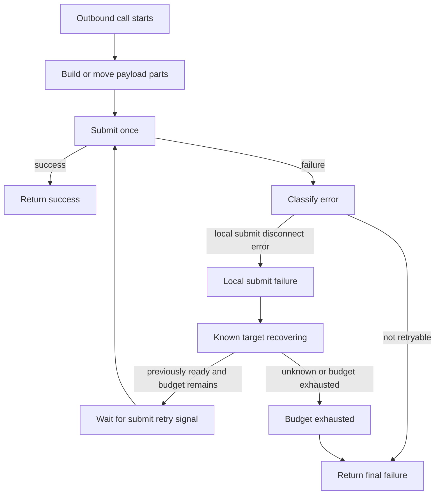

# Core submit retry option 구현 기록

이 문서는 구현 전 초안에서 출발한 설계 기록이다. 현재 public option 계약은
`core/include/zlink_enum.h`, `doc/spec/core/socket/README.ko.md`,
`doc/spec/core/socket/README.md`, `doc/spec/bindings/README.ko.md`,
`doc/spec/bindings/README.md`에 승격되어 있다.

현재 구현은 outbound 메시지가 local submit 또는 enqueue 단계에서 `ENOTCONN` 또는
`EHOSTUNREACH`로 실패했을 때, core가 짧은 예산 안에서 같은 submit을 다시 시도하는
정책을 제공한다. raw socket 기본값은 off/0ms/0회이고, managed SPOT/service outbound
내부 profile은 `LOCAL_FAILURE`/100ms/2회를 사용한다.

## 배경

ZLink core는 socket session과 transport connecter 레이어에서 reconnect를 수행한다.
연결이 끊기면 active session은 pipe를 정리하고, reconnect interval 정책에 따라
다시 연결을 시도한다. TCP, IPC, TLS, WS 같은 transport connecter는 reconnect timer를
걸고 연결을 재시도한다.

현재 이 reconnect는 transport 경로를 다시 여는 기능이다. 사용자가 호출한 send/request가
local submit 단계에서 `NOT_CONNECTED` 같은 결과로 실패했을 때, 같은 payload를 짧게
다시 submit하는 기능은 일반 계약으로 정의되어 있지 않다.

하지만 응용 관점에서는 아래처럼 local submit 실패만 짧게 흡수하는 동작이 자연스럽다.

1. 사용자가 `send` 또는 `request`를 호출한다.
2. 대상은 이전에 `CONNECTION_READY`였고 route 또는 peer table에 남아 있다.
3. 호출 중 아주 짧은 순단 때문에 local submit/enqueue가 `ENOTCONN` 또는
   `EHOSTUNREACH`로 실패한다.
4. core reconnect가 곧 연결을 복구한다.
5. 작은 submit retry budget 안이라면 core가 payload를 다시 submit하고, 최종 성공으로
   반환한다.

이 초안은 이 동작을 framework나 바인딩별 helper가 아니라 core/service 레이어에서
정의하는 방향을 제안한다. 다만 첫 구현은 모든 socket path에 같은 기능을 한 번에
넣는 방식이 아니다. 먼저 managed SPOT/service outbound path에서 구현 가능성과
회귀테스트를 고정하고, 그 뒤 public option과 raw socket 확대 여부를 결정한다.

## 현재 동작 요약

현재 core에는 아래 재시도 관련 기능이 이미 존재한다.

- reconnect option: `ZLINK_OPT_RECONNECT_IVL`,
  `ZLINK_OPT_RECONNECT_IVL_MAX`
- monitor event: `CONNECTED`, `CONNECT_RETRIED`, `DISCONNECTED`,
  `CONNECTION_READY`
- send-ready callback: 전송 재시도를 시도할 만한 시점을 알려주는 callback
- blocking send의 `EAGAIN` wait: `sndtimeo` 안에서 backpressure 해소를 기다림
- SPOT routed delivery queue: 현재 구현은 data plane drain 중 `EAGAIN`,
  `ENOTCONN`, `EHOSTUNREACH`를 transient send error로 묶어 짧은 retry queue에
  다시 넣는다. 이 동작은 이미 queue 안으로 들어간 메시지를 다시 drain하는 내부
  복구 동작이다. 이 초안의 submit retry와 같은 계약이 아니며, 새 구현에서는
  backpressure 재큐잉과 disconnect submit retry를 이름과 상태로 분리해야 한다.
- submit result normalization: 현재 public submit 결과에서 `EAGAIN`은
  `ZLINK_SUBMIT_BACKPRESSURED`로, `ENOTCONN`과 `EHOSTUNREACH`는
  `ZLINK_SUBMIT_NOT_CONNECTED`로 매핑된다. 이 구분은 새 retry 구현에서도 유지한다.

이 기능들은 서로 연결되어 있었고, 이 설계 기록의 구현 결과로 raw socket과
managed SPOT/service outbound가 같은 “local submit retry” 분류를 사용하게 되었다.

## 문제

현재 구조에서는 짧은 순단이 응용 코드로 바로 노출될 수 있다.

```text
send call starts
  |
  v
local submit fails before enqueue
  |
  v
submit returns NOT_CONNECTED
  |
  v
transport reconnects shortly after
```

이 흐름에서 응용은 실패를 받지만, 실제로는 곧 전송 가능한 상태가 된다. 응용이나
framework가 직접 retry loop를 만들면 다음 문제가 생긴다.

1. 언어 바인딩마다 같은 submit retry 정책을 반복 구현한다.
2. reconnect, send-ready, route readiness 같은 core 내부 신호를 바인딩이 간접적으로
   해석해야 한다.
3. request timeout, correlation, multipart 소유권 규칙이 바인딩마다 달라질 수 있다.
4. 이미 core에 있는 SPOT routed queue와 별도 retry 정책이 생긴다.
5. 실패 반환 뒤 background retry를 무심코 구현하면 호출자가 실패 처리한 메시지가
   나중에 전송될 수 있다.

## 목표

이 초안의 목표는 다음과 같다.

1. 이전에 연결되어 대상 목록에 남아 있는 peer로 보내는 local submit/enqueue 실패를
   core가 짧은 submit retry budget 안에서 흡수한다.
2. reconnect 자체는 기존 session/transport reconnect 구현을 그대로 사용한다.
3. retry는 실패 반환 전에만 수행한다. 실패가 호출자에게 반환된 뒤 몰래 전송하지
   않는다.
4. submit/enqueue가 성공한 뒤 발생하는 disconnect, request reply timeout, remote 처리
   실패는 retry하지 않는다.
5. send, publish, request 계열이 같은 submit 실패 분류를 사용한다.
6. 바인딩과 framework는 retry loop를 직접 구현하지 않는다.
7. 기존 `ZLINK_DONTWAIT` 의미는 보존한다.
8. 구현 전 단계에서는 public API처럼 보이는 문구를 정식 spec에 섞지 않고, 구현 뒤에는
   `core/include/zlink_enum.h`와 정식 spec 문서를 기준으로 삼는다.

## 비목표

이 초안은 다음을 목표로 하지 않는다.

1. raw socket 전체에 무제한 background outbox를 추가하지 않는다.
2. 실패를 반환한 뒤에도 core가 payload를 계속 보관해서 전송하지 않는다.
3. local submit 성공 뒤의 delivery 결과를 보장하지 않는다.
4. reconnect interval, connect timeout의 기존 의미를 바꾸지 않는다.
5. contract failure나 local lifecycle failure를 retry하지 않는다.
6. 모든 전송 path를 구현 첫 단계에서 한 번에 바꾸지 않는다.
7. 처음부터 모르는 대상, route 미발견, admission 거절, backpressure만 있는 상황을
   submit retry로 처리하지 않는다.
8. submit/enqueue 성공 뒤의 delivery 보장, request completion 보장, remote 처리
   보장을 제공하지 않는다.
9. retry를 위해 message id, dedupe token, remote ack 같은 payload protocol을 새로
   요구하지 않는다.

## 핵심 의미

Submit retry의 핵심 의미는 아래와 같다.

**local submit/enqueue가 실패했을 때만, core가 짧은 시간 안에서 같은 logical message의
submit을 다시 시도한다.**

이 기능은 전체 send/request timeout을 전부 retry에 쓰지 않는다. 별도 submit retry
budget을 먼저 적용하고, 이 budget은 호출자의 전체 timeout을 넘을 수 없다.

초기 budget 후보는 다음과 같다.

| 항목 | 후보 |
|------|------|
| 최대 대기 시간 | 100ms |
| 최대 재시도 횟수 | 2회 |
| 대기 신호 | `CONNECTION_READY`, send-ready recovery, route readiness update |
| fallback 대기 | 5ms-20ms jittered timer |

100ms는 현재 reconnect interval 기본값과 맞춘 값이다. 한 번의 reconnect tick을 기다릴
수 있으면서도 긴 장애를 숨기지 않는다. 재시도 횟수 2회는 최초 submit을 제외한 추가
submit 시도 횟수다. 따라서 최대 submit 시도 횟수는 최초 1회와 retry 2회를 합쳐
3회다.

`ZLINK_DONTWAIT` 또는 submit retry timeout `0`이면 submit retry wait를 수행하지
않는다.
timeout `-1`인 호출도 submit retry budget은 무제한이 아니다.

## Retry 대상 조건

아래 조건을 모두 만족할 때만 submit retry를 수행한다.

1. target이 현재 core의 대상 목록에 남아 있다.
2. target은 이전에 `CONNECTION_READY` 또는 동등한 route-ready 상태였던 적이 있다.
3. target은 현재 disconnected 또는 recovering 상태다.
4. active connector가 있고 reconnect attempt가 이미 scheduled/active 상태다. passive
   accepted session처럼 연결 제어권이 없는 쪽은 스스로 새 connect를 만들어 retry
   조건을 만족시킬 수 없다.
5. 실패 errno가 disconnect 계열이다.
6. 실패는 local submit/enqueue 실패다.
7. payload가 아직 remote delivery 또는 request completion 단계로 넘어가지 않았다.

대상 상태는 최소한 아래처럼 구분한다.

| 상태 | retry 의미 |
|------|------------|
| `Unknown` | retry하지 않는다 |
| `KnownReady` | 먼저 정상 send를 시도한다 |
| `KnownDown` | active reconnect가 있으면 submit retry 가능 |
| `Recovering` | submit retry 가능 |
| `Removed` | retry하지 않는다 |

`KnownDown`과 `Recovering`은 “이전에 준비된 적이 있고 아직 대상 목록에서 제거되지
않은 상태”를 뜻한다. 단순히 문자열 route가 남아 있다는 뜻만으로는 부족하다. active
connector가 reconnect를 진행하거나, SPOT/service runtime이 해당 owner의 recovery
상태를 관찰할 수 있어야 한다.

active/passive 책임은 구현에서 반드시 별도 상태로 표현한다. `session_base_t`의 active
session은 connection error나 timeout error 뒤 `reconnect()`로 이어질 수 있지만,
accepted session은 같은 방법으로 새 outbound connect를 만들 수 없다. 따라서 passive
accepted session에서 감지한 disconnect는 관찰 신호일 뿐 submit retry wait를 여는
근거가 아니다.

## 오류 분류

아래 오류는 target 상태와 submit 실패 조건을 만족할 때만 submit retry 대상이다.

| 내부 errno | public submit result | 의미 |
|------------|----------------------|------|
| `ENOTCONN` | `ZLINK_SUBMIT_NOT_CONNECTED` | 알려진 대상의 연결이 현재 준비되지 않음 |
| `EHOSTUNREACH` | `ZLINK_SUBMIT_NOT_CONNECTED` | 알려진 대상 route 또는 pipe가 현재 내려가 있음 |
| `ENETUNREACH` | `ZLINK_SUBMIT_NOT_CONNECTED` 후보 | network path가 아직 없음 |
| `ECONNRESET` | `ZLINK_SUBMIT_NOT_CONNECTED` 후보 | 연결이 reset됨 |
| `ECONNABORTED` | `ZLINK_SUBMIT_NOT_CONNECTED` 후보 | 연결이 중단됨 |
| `EPIPE` | `ZLINK_SUBMIT_NOT_CONNECTED` 후보 | pipe가 끊김 |

첫 구현은 현재 public submit result에서 `ZLINK_SUBMIT_NOT_CONNECTED`로 매핑되는
`ENOTCONN`, `EHOSTUNREACH`부터 적용한다. `ENETUNREACH`, `ECONNRESET`,
`ECONNABORTED`, `EPIPE`는 내부 errno catalog에는 connectivity로 분류되어 있지만,
현재 submit result normalization에서 별도 public submit result로 정규화되지 않는다.
이 오류들을 retry 대상으로 넓히려면 result mapping, errno 문서, 회귀테스트를 먼저
맞춘 뒤 별도 단계에서 포함한다.

`EAGAIN`은 submit retry 대상이 아니다. `EAGAIN`은 backpressure 또는 capacity 부족
신호이며, 기존 send timeout과 send-ready 기반 wait 정책으로 처리한다. 현재 SPOT
routed delivery queue가 drain 실패 후 `EAGAIN`을 재큐잉하는 동작은 이미 queue에
소유권이 넘어간 메시지의 내부 drain 재시도다. 새 submit retry scope가 이 동작을
그대로 가져오면 backpressure를 disconnect retry로 오해하게 되므로, 구현 시
`EAGAIN` 경로는 backpressure 상태와 send-ready recovery로만 다룬다.

## Retry 금지 조건과 오류

아래 조건은 retry하지 않고 즉시 반환한다.

1. submit/enqueue가 성공한 뒤 disconnect가 감지된 경우
2. request submit은 성공했지만 reply timeout 또는 remote 처리 실패가 발생한 경우
3. target이 처음부터 unknown, removed, rejected 상태인 경우
4. route 미발견이나 admission 거절처럼 recovery가 아니라 계약 또는 topology 문제인
   경우
5. `EAGAIN` backpressure만 발생한 경우
6. active reconnect가 꺼져 있거나 `ZLINK_OPT_RECONNECT_IVL`이 0 이하라서 회복 신호를
   기대할 수 없는 경우
7. passive accepted session만 남아 있고 active connector가 없는 경우
8. 현재 SPOT routed delivery queue에 이미 enqueue된 메시지를 data plane이 다시 drain
   하는 경우. 이 경우는 submit retry가 아니라 queue drain recovery다.

아래 오류는 retry하지 않고 즉시 반환한다.

| 내부 errno | 의미 |
|------------|------|
| `ETERM` | context/runtime 종료 |
| `ESHUTDOWN` | handle 또는 runtime shutdown |
| `EFSM` | socket state 계약 위반 |
| `EINVAL` | 잘못된 인자 |
| `EFAULT` | 잘못된 handle 또는 payload |
| `ECONNREFUSED` | admission 거절 |
| `ENOENT` | target 또는 route 미발견 |
| `EBUSY` | request sequence 공간 부족 |
| `EINTR` | syscall 또는 wait interruption |
| `ENOTSUP`, `EOPNOTSUPP` | 지원하지 않는 operation |
| `EMTHREAD` | thread 계약 위반 |
| `ENOMEM`, `ENOBUFS` | 메모리 또는 buffer 부족 |
| `EPROTO`, `EBADMSG` | protocol 또는 frame build 오류 |

이 오류들은 retry해도 같은 호출에서 성공할 가능성이 낮거나, 호출자가 계약을 고쳐야
하는 오류다.

## 동작 모델

호출 범위 안 retry는 아래 흐름을 따른다.



재시도 대기는 busy loop가 아니어야 한다. core는 아래 신호 중 하나를 submit retry
budget 안에서 기다린다.

- monitor `CONNECTION_READY`
- send-ready recovery signal
- route discovery 또는 SPOT peer readiness update
- 짧은 retry timer
- context/handle shutdown

## 소유권 규칙

Submit retry를 core가 맡으려면 payload 소유권 규칙이 명확해야 한다.

1. validation을 통과한 payload는 첫 retryable submit 시도 전에 core submit retry
   scope가 소유한다.
2. submit retry scope가 살아 있는 동안 payload part는 호출자에게 반환되지 않는다.
3. local submit/enqueue가 성공하면 payload는 소비된 것으로 보고 더 이상 retry하지
   않는다.
4. 최종 실패이면 retry scope가 소유한 내부 representation을 정확히 한 번 정리하고,
   public API의 기존 실패 소유권 규칙과 충돌하지 않도록 한다.
5. multipart 중간의 retryable frame submit 실패는 같은 public send scope 안에서
   재시도한다. retry budget이 소진되면 전체 logical message의 submit 실패로 처리한다.

기존 part 단위 API는 “성공 시 part 소유권 이전, submit 전 validation 실패 시 호출자
소유권 유지” 형태가 섞여 있다. 따라서 구현은 public entry point 바로 아래에서
validation을 먼저 끝내고, retry 가능한 내부 representation으로 payload를 move한 뒤
local submit 실패와 validation 실패를 구분해야 한다. validation 실패는 retry scope가
payload를 소비하기 전의 계약 오류로 남아야 한다.

multipart는 특히 frame submit 실패와 최종 실패를 분리해야 한다. 현재 구현은 logical
multipart send scope를 열고 각 frame submit에서 `ENOTCONN`이나 `EHOSTUNREACH`를
재시도한다. 따라서 transient local failure는 frame이 소비되기 전에 같은 message
object로 흡수된다. retry budget이 소진되면 rollback을 시도하고 남은 part를 기존 실패
소유권 규칙대로 정리한다. validation, frame build, message move 실패는 retry하지
않고 기존 실패 소유권 규칙을 따른다.

## Send와 publish 의미

send/publish submit retry는 local submit/enqueue가 성공할 때까지 같은 logical message를
다시 submit한다.

중요한 제한은 다음과 같다.

1. local submit/enqueue가 성공한 뒤에는 retry하지 않는다.
2. submit 성공 뒤 disconnect, remote delivery 실패, remote 처리 실패는 이 기능의
   범위가 아니다.
3. core는 기본 retry에서 payload 내용을 해석하지 않는다.

첫 구현에서는 “전송 함수가 local submit/enqueue 실패를 반환한 경우”만 retry한다.
성공한 submit의 이후 delivery 상태까지 보정하지 않는다.

## Request 의미

request retry는 submit 단계와 completion 단계를 분리해야 한다.

1. request submit/enqueue가 실패한 경우만 retry한다.
2. request submit/enqueue가 성공하면 reply timeout, remote error, disconnect는 이
   submit retry 기능의 대상이 아니다.
3. request id 또는 correlation id는 같은 logical request 안에서 유지한다.
4. 전체 request deadline은 최초 호출 시점부터 계산한다.
5. retry 때문에 deadline이 새로 늘어나면 안 된다.

따라서 이 초안은 request completion retry나 idempotent replay를 제공하지 않는다.
request completion retry가 필요하면 별도 request policy 초안에서 다룬다.

구현 위치가 request sequence allocation보다 위인지 아래인지도 결정해야 한다. sequence를
먼저 할당하고 submit만 retry한다면, 실패한 submit attempt가 pending completion set에
등록되지 않았음을 보장해야 한다. pending set에 등록한 뒤 submit이 실패하면 timeout
task cancel, pending key 제거, completion queue 미발행을 같은 정리 블록에서 처리해야
한다. 어느 쪽이든 하나의 logical request에 completion callback이 두 번 호출되면 안
된다.

## DONTWAIT 의미

`ZLINK_DONTWAIT`는 submit retry wait를 수행하지 않는다는 뜻을 유지한다.

`ZLINK_DONTWAIT` 호출에서 disconnect 계열 오류나 backpressure가 발생하면 구현 후보는
아래 작업까지만 수행한다.

1. send-ready notification을 arm한다.
2. 가능한 경우 recovery pending 상태를 표시한다.
3. 즉시 `BACKPRESSURED` 또는 `NOT_CONNECTED`를 반환한다.

이 호출은 payload를 background queue에 숨겨서 보관하지 않는다.

경로에 따라 send-ready notification을 arm할 수 없다면, 그 사실 때문에 payload를
보관하거나 대기하면 안 된다. 이 경우 즉시 실패를 반환하고 다음 호출에서 다시
판정한다.

send-ready callback은 “다시 시도해 볼 만한 시점”만 알려준다. callback이 왔다고 다음
submit 성공이 보장되는 것은 아니다. 이 의미는 현재 public callback 설명과 같아야
하며, submit retry 구현이 `ZLINK_DONTWAIT`를 blocking 호출처럼 바꾸면 안 된다.

## Timeout과 budget 의미

timeout은 호출 전체에 대한 deadline이고, submit retry budget은 그 안의 작은 일부다.

예를 들어 호출 timeout이 1000ms이고 submit retry budget이 100ms이면, 알려진 대상이
disconnect 상태일 때 core는 최대 100ms만 local submit 재시도를 기다린다. 100ms 안에
회복되지 않으면 남은 호출 timeout과 관계없이 `NOT_CONNECTED`를 반환한다.

submit retry budget에는 아래 시간이 합산된다.

- 최초 submit 시도
- disconnect 감지
- reconnect timer 대기 중 일부
- reconnect handshake 대기 중 일부
- route 또는 SPOT peer readiness 대기
- 재제출 시도

budget이 지나면 가장 최근의 disconnect 계열 오류를 public result로 반환한다. 예를
들어 마지막 실패가 `ENOTCONN`이면 `ZLINK_SUBMIT_NOT_CONNECTED`를 반환한다.
`EAGAIN`은 backpressure wait 정책에서 별도로 처리한다.

## 구현 위치 후보

구현은 raw socket 아래 transport reconnect가 아니라 outbound submit surface 근처에
둔다.

후보 위치는 다음과 같다.

1. `socket_base_t::send_direct_with_retry`
   - 장점: raw socket send의 blocking wait 의미와 가깝다.
   - 단점: SPOT/service routed path, request path, multipart helper의 소유권 차이를
     모두 흡수하기 어렵다.

2. message submit API helper 계층
   - 장점: `zlink_send_part`, `zlink_publish_part`, routed send part가 공통 result
     mapping을 사용한다.
   - 단점: route readiness와 SPOT data plane queue 신호를 직접 다루기 어렵다.

3. SPOT/service outbound queue 계층
   - 장점: 기존 routed delivery retry queue와 가장 가깝고, route discovery readiness를
     활용하기 쉽다.
   - 단점: raw socket send와 의미가 다를 수 있다.

권장 구현 순서는 아래와 같다.

1. 현재 SPOT routed delivery queue의 transient error 분류를 정리한다. drain retry는
   queue-owned message recovery로 남기고, submit retry와 공유할 수 있는 것은 errno
   classification과 readiness signal뿐이다.
2. SPOT routed send/request path에 known target 상태 판정과 submit retry budget을
   명시적으로 적용한다. 이 단계에서는 `EAGAIN`을 submit retry에 넣지 않는다.
3. request submit path에서는 sequence allocation, timeout task, pending completion
   등록, submit 실패 정리 순서를 먼저 고정한다. duplicate completion을 막는 단일
   cleanup 경로가 없으면 구현하지 않는다.
4. SPOT publish/channel path로 확장한다.
5. raw socket blocking send는 기존 `sndtimeo` 기반 `EAGAIN` wait와 통합 가능한 범위만
   정리한다. raw socket 기본값은 off로 두고, option만 제공할지 여부는 별도로
   결정한다.
6. public option과 binding surface는 core 동작이 안정된 뒤 최소한으로 추가한다.

## API 결정

구현 결과 public option은 아래 형태로 승격되었다. framework와 바인딩은 같은 core
option을 전달하되, 언어별 표면에서는 raw option bag이 아니라 typed facade를 사용한다.

```c
typedef enum zlink_submit_retry_mode_e {
  ZLINK_SUBMIT_RETRY_OFF = 0,
  ZLINK_SUBMIT_RETRY_LOCAL_FAILURE = 1
} zlink_submit_retry_mode_t;
```

public option으로 승격할 때의 기본값은 raw socket과 managed service profile을 나눈다.

| option | raw socket 기본값 | managed SPOT/service 기본값 |
|--------|------------------|-------------------|
| submit retry mode | off | `ZLINK_SUBMIT_RETRY_LOCAL_FAILURE` |
| submit retry timeout | 0 | 100ms |
| submit retry attempts | 0 | 2회 |

raw socket은 사용자가 latency, ordering, timeout, failure handling을 직접 제어하는
계층이므로 기본값을 off로 둔다. managed SPOT/service outbound는 framework가 운영
profile을 제공하는 계층이므로 local submit 실패만 짧게 흡수하는 조합을 기본으로 둘
수 있다. 이 기본 조합은 reconnect interval 기본값 100ms와 맞추고, 긴 장애를 조용히
숨기지 않는 것을 목표로 한다.

`ZLINK_DONTWAIT` 호출은 managed profile에서도 submit retry를 수행하지 않는다.

옵션 이름 후보는 다음과 같다.

- `ZLINK_OPT_SUBMIT_RETRY_MODE`
- `ZLINK_OPT_SUBMIT_RETRY_TIMEOUT`
- `ZLINK_OPT_SUBMIT_RETRY_ATTEMPTS`

실패 반환 뒤에도 payload를 보관하는 outbox mode는 이 초안의 범위가 아니다.

이 단계 구분 때문에 바인딩 수정 범위도 둘로 나뉜다. 내부 option 단계에서는 core
테스트와 framework profile 검증만 수행한다. public option 단계로 승격하면 각 바인딩의
enum, typed option, README, contract test를 모두 갱신한다.

## 문서 반영 상태

구현 내용은 아래 기준으로 반영한다.

1. core 구현과 contract test가 끝나면 `doc/spec/core/message.ko.md`,
   `doc/spec/core/socket/README.ko.md`, `doc/spec/core/service/spot.ko.md` 중 실제
   공개 API가 노출되는 문서에 계약을 나누어 반영한다. public option이 없고 managed
   profile 내부 동작으로만 남으면 socket option spec에는 넣지 않는다.
2. errno/result 매핑이 바뀌면 `doc/spec/core/errno-map.ko.md`와 영어 문서를 함께
   갱신한다.
3. framework가 managed SPOT/service 기본값으로 submit retry를 켜면
   framework guide에는 내부 reconnect 구조가 아니라 “local submit 실패를 짧게
   흡수한다”는 사용자 관점 설명만 적는다.
4. public option으로 승격하면 바인딩 README에는 option 이름, 기본값,
   `ZLINK_DONTWAIT` 예외, request completion retry 제외를 언어별 API 표면에 맞춰
   적는다.
5. 구현 완료 뒤 이 draft의 결정 사항은 정식 spec과 binding 문서로 이동하고, 남은
   열린 질문만 draft에 유지하거나 별도 후속 draft로 분리한다.

## 바인딩 배포 및 수정 계획

core public header나 native symbol이 바뀌면 바인딩은 같은 local core build를 기준으로
검증해야 한다. 로컬 개발 검증은 아래 순서를 따른다.

1. core 내부 설정 값과 submit retry 구현을 먼저 완료한다. public option으로 승격하는
   단계라면 option enum과 option set/get도 함께 구현한다.
2. core를 다시 빌드한다.

```bash
cmake --build core/build
```

3. 새 public symbol이나 header 변경이 있을 때만 local core header와 `libzlink`를
   바인딩 작업 영역으로 동기화한다. 내부 구현 단계에서 public header가 바뀌지 않으면
   이 단계는 생략한다.

```bash
/home/hep7/project/kairos/zlink/bindings/dev_sync_local_core_libs.sh
```

4. public option으로 승격하는 경우 각 바인딩의 option enum과 typed option surface를
   갱신한다. 최소 대상은 C, C++, .NET, Java, Node, Python, Go, Rust binding이다.
5. public option 단계의 바인딩별 contract test에서 아래를 확인한다.
   - submit retry option set/get
   - 기본값: raw socket off
   - managed SPOT/service profile 기본값: local failure, 100ms, 2회
   - `ZLINK_DONTWAIT`에서는 submit retry 미수행
   - request completion timeout은 submit retry 대상 아님
6. 공개 header 사본은 binding source 계약에 포함되는 파일이면 함께 갱신한다. 반대로
   native `libzlink.so*`는 local 검증용 release artifact이므로 일반 source/doc commit에
   포함하지 않는다.
7. 바인딩 sample이나 framework sample이 native runtime을 로드하는 경우, stale runtime
   문제를 피하기 위해 script 동기화 뒤 실행한다.
8. `bindings/dev_sync_local_core_libs.sh`가 복사한 `bindings/*/native/**/libzlink.so*`,
   `bindings/*/prebuilds/**/libzlink.so*`, `bindings/*/runtimes/**/native/libzlink.so*`
   산출물은 release artifact이므로 일반 source/doc commit에 포함하지 않는다.
9. commit 전에는 staged 파일을 확인하고, local sync로 생긴 native artifact가 포함되지
   않았는지 확인한다.

언어별 최소 검증 명령은 구현 시점의 runner 이름을 다시 확인한 뒤 사용한다. 현재
checkout 기준으로 존재 여부를 확인해야 할 후보는 아래와 같다.

```bash
bindings/c/tests/run_tests.sh
bindings/cpp/tests/run_tests.sh
bindings/dotnet/tests/run_tests.sh
dotnet test bindings/dotnet/Zlink.sln
bindings/java/tests/run_tests.sh
bindings/node/tests/run_tests.sh
bindings/python/tests/run_tests.sh
bindings/go/tests/run_tests.sh
bindings/rust/tests/run_tests.sh
```

sample 검증은 변경된 언어만이 아니라 framework profile이 이 기능을 켜는 언어까지
포함한다. sample이 native runtime을 로드하면 core build와 sync script 이후 실행해야
한다.

## Framework와 바인딩 책임

Framework와 바인딩은 retry loop를 직접 만들지 않는다. 대신 아래 역할만 맡는다.

1. submit retry option을 core에 전달한다.
2. 최종 public result를 언어별 exception/result로 변환한다.
3. request deadline을 호출자 API와 맞춘다.
4. request completion retry나 outbox가 필요하면 별도 정책으로 구현한다.
5. public option이 없는 내부 단계에서는 사용자에게 retry 횟수나 timeout을 직접
   노출하지 않는다.

이렇게 해야 reconnect와 send-ready 신호를 core가 한곳에서 해석하고, 언어별 runtime은
같은 의미를 공유한다.

## 테스트 기준

구현 시 최소 테스트는 다음과 같다.

### Reconnect 회귀테스트

아래 테스트는 retry 기능 구현 전에도 현재 reconnect 정책을 검증해야 한다.

1. peer가 close된 뒤 active connector가 `DISCONNECTED`를 내고
   `CONNECT_RETRIED`를 시작한다.
2. 같은 endpoint가 다시 bind되면 active connector가 `CONNECTED`와
   `CONNECTION_READY`를 다시 낸다.
3. reconnect 후 새 메시지를 보내면 상대가 실제로 수신한다. 이 테스트는 monitor
   event만 보고 통과하면 안 된다.
4. reconnect interval을 짧게 설정한 TCP IPv4, TCP IPv6, 지원 가능한 IPC endpoint에서
   같은 ready/disconnect/retry edge를 확인한다. transport마다 부가 event가 다를 수
   있으므로 테스트는 핵심 edge와 메시지 전달을 함께 검증한다.
5. connect-before-bind 상황에서 connector가 bind 전 실패를 흡수하고, bind 이후
   연결되어 메시지를 전달한다.
6. heartbeat를 명시적으로 켠 active connector에서 heartbeat timeout이 발생하면
   `DISCONNECTED`와 reconnect 시도가 시작된다.
7. passive accepted session에서 heartbeat timeout 또는 transport error가 발생하면
   `DISCONNECTED`는 확인하되, passive side가 `CONNECT_RETRIED`를 낸다고 기대하지
   않는다. reconnect는 active connector의 책임이다.
8. heartbeat가 꺼진 기본 설정에서는 idle blackhole을 빠르게 감지한다고 가정하지
   않는다. 기본 설정 테스트는 peer close나 OS I/O error처럼 실제 감지 가능한
   이벤트를 사용한다.

현재 checkout에서 이 영역과 직접 맞닿은 테스트 후보는 아래와 같다.

- `core/tests/integration/test_reconnect_options.cpp`
- `core/tests/integration/test_reconnect_ivl.cpp`
- `core/tests/integration/test_asio_connect.cpp`
- `core/tests/integration/test_immediate.cpp`
- heartbeat timeout 보강 시 `core/tests/integration/test_heartbeats.cpp`

`test_reconnect_options.cpp`와 `test_reconnect_ivl.cpp`는 monitor event를 주로 본다.
submit retry 구현 전 회귀 기준에는 `test_asio_connect.cpp`와 `test_immediate.cpp`처럼
reconnect 뒤 실제 메시지가 흐르는 검증도 포함해야 한다.

### Submit retry 회귀테스트

아래 테스트는 이 초안의 submit retry 기능 구현 후에 추가한다.

1. 이전에 `CONNECTION_READY`였던 target에서 local submit/enqueue가 `ENOTCONN` 또는
   `EHOSTUNREACH`로 실패하고 submit retry budget 안에 reconnect되면 send 호출이 최종
   성공한다.
2. 같은 상황에서 reconnect가 submit retry budget 뒤에 완료되면 `NOT_CONNECTED`를
   반환한다.
3. `ZLINK_DONTWAIT` 호출은 retry wait 없이 즉시 실패한다.
4. 처음부터 알 수 없는 target, route table에 없는 target, admission rejected target은
   retry하지 않는다.
5. `EAGAIN` backpressure는 submit retry에 들어가지 않고 기존 send-timeout wait
   정책으로만 처리한다.
6. `ETERM`, `EFSM`, `EINVAL`, `ENOENT`, `ECONNREFUSED`, `EBUSY`는 retry하지 않는다.
7. request submit/enqueue 실패는 전체 deadline을 늘리지 않고 submit retry budget을
   따른다.
8. request submit/enqueue 성공 뒤 reply timeout은 submit retry 대상이 아니다.
9. SPOT routed delivery queue와 새 submit retry scope가 메시지 순서를 깨지 않는다.
10. handle close 중 pending submit retry가 payload를 정확히 한 번 정리한다.
11. reconnect monitor event와 send-ready callback이 동시에 와도 같은 pending submit
    retry가 중복 완료되지 않는다.
12. `ZLINK_OPT_RECONNECT_IVL`이 0 이하이거나 active reconnect가 없는 passive accepted
    session에서는 submit retry wait를 하지 않는다.
13. public option 단계에서는 set/get boundary, 음수 timeout, attempts 상한, overflow
    입력을 확인한다.
14. multipart 중 한 frame submit이 첫 시도에서 `ENOTCONN` 또는 `EHOSTUNREACH`를
    반환하고 두 번째 시도에서 성공할 때, 모든 part가 한 번의 logical message로
    전달된다.
15. multipart validation 또는 `zlink_msg_move` 실패는 retry scope에 들어가지 않고
    기존 실패 소유권 규칙대로 정리된다.
16. request submit 실패 retry 중 timeout task나 pending completion entry가 남지
    않는다.
17. request submit이 성공한 뒤 reply timeout이 발생하면 completion callback은 정확히
    한 번만 호출되고 submit retry는 다시 실행되지 않는다.

순단을 안정적으로 재현하기 어렵기 때문에 일반 회귀테스트는 가능하면 fault injection을
사용한다. 예를 들어 routed submit 함수가 첫 호출에서 `ENOTCONN` 또는 `EHOSTUNREACH`를
반환하고, retry wait 중 ready signal을 발생시키는 test hook을 둔다. 이렇게 해야
네트워크 timing에 기대지 않고 retry budget, payload 소유권, 중복 완료 방지를 확인할
수 있다.

fault injection hook은 production path의 의미를 바꾸지 않는 좁은 내부 seam으로 둔다.
후보는 routed submit 함수 바로 아래의 test-only callback, data plane queue drain
테스트 helper, request submit cleanup 검증용 fake completion queue다. 일반 reconnect
회귀테스트는 실제 transport를 쓰되, submit retry 회귀테스트는 timing에 기대지 않는
hook을 기본으로 한다.

### Sample과 framework 검증

framework profile이 managed SPOT/service에서 submit retry를 켜는 단계에는 sample
검증도 함께 수행한다.

1. framework sample은 retry 횟수나 timeout을 사용자 API처럼 노출하지 않는다.
2. sample 설명은 내부 socket, inproc endpoint, queue drain 구조를 설명하지 않는다.
   guide에는 사용자가 보는 local submit 실패 흡수 의미만 적는다.
3. SPOT request sample은 submit retry와 reply timeout을 별도 실패로 보여야 한다.
4. sample smoke는 core build와 binding sync 뒤 실행한다. stale native runtime을
   로드한 결과로 retry 동작을 판단하지 않는다.
5. readiness race를 숨기기 위해 임의 sleep을 추가하지 않는다. 필요한 경우 monitor
   ready, send-ready, route readiness 같은 실제 신호를 기다린다.

현재 checkout 기준 framework 검증 후보는 구현 시점에 다시 확인한다.

```bash
dotnet test framework/languages/dotnet/Zlink.Framework.sln
framework/languages/dotnet/samples/run_sample.sh
```

### Opt-in 순단 테스트

실제 네트워크 blackhole에 가까운 테스트는 일반 CI 기본 회귀테스트와 분리한다.

1. Linux 환경에서 `tc netem` 또는 packet drop rule을 사용해 일정 시간 양방향 또는
   단방향 packet drop을 만든다.
2. drop 중 heartbeat timeout 또는 send failure가 관찰되는지 확인한다.
3. drop 해제 뒤 reconnect와 `CONNECTION_READY`가 회복되는지 확인한다.
4. reconnect 뒤 새 메시지가 전달되는지 확인한다.
5. 이 테스트는 `CAP_NET_ADMIN` 같은 권한이 필요하므로 capability가 없으면 skip한다.

## 후속 질문

아래 항목은 현재 구현 범위 밖에 둔다. public option 승격은 완료되었으므로, 여기의
질문은 확장 정책을 바꿀 때만 다시 검토한다.

1. `ENETUNREACH`, `ECONNRESET`, `ECONNABORTED`, `EPIPE`를 첫 public retryable result에
   포함할지 여부
2. raw socket 기본값을 계속 off로 둘지, 특정 managed profile만 켤지 여부
3. `SNDTIMEO`와 별도 submit retry budget option의 상호작용을 더 세분화할지 여부
4. managed SPOT/service 기본 조합을 core service preset으로 유지할지, framework
   profile이 service 생성 시 전달하는 값으로 옮길지 여부
5. request completion retry를 별도 기능으로 둘지 여부
6. known target 상태를 socket pipe, monitor ready table, SPOT route table 중 어디에서
   단일 기준으로 판정할지 여부
7. raw socket까지 option을 노출할 경우 socket family별 ordering과 latency 문서를
   어느 범위까지 추가할지 여부
8. 현재 SPOT routed delivery queue의 `EAGAIN` 재큐잉을 어떤 이름과 상태로 분리할지
   여부
9. request submit retry scope를 request sequence allocation 앞에 둘지, allocation 뒤의
   cleanup 블록으로 흡수할지 여부

현재 결정 사항은 “raw socket은 off/0ms/0회가 기본값이고, managed SPOT/service
outbound 내부 profile은 local submit 실패를 100ms, 2회 retry한다”는 것이다. 이 값은
정식 socket spec과 binding policy 문서에 반영되어 있다.

## 구현 메모

현재 코드에서 참고할 수 있는 구현은 다음과 같다.

- session reconnect: active session의 connection error와 timeout error가
  `reconnect()`로 이어진다.
- transport reconnect timer: connecter가 reconnect interval과 max interval을 사용해
  `start_connecting()`을 다시 호출한다.
- socket send-ready: nonblocking 또는 timeout 0 send가 실패하면 send-ready
  notification을 arm한다.
- SPOT routed delivery queue: 현재 구현은 routed send error를 queue 앞쪽에 되돌리고
  짧은 retry deadline을 설정한다.
- internal errno classification: submit control-flow, runtime failure, contract
  failure를 이미 나누고 있다.
- submit result mapping: `EAGAIN`은 backpressure, `ENOTCONN`과 `EHOSTUNREACH`는
  not-connected public result로 정규화된다.
- request completion queue: timeout, reply completion, callback dispatch는 submit
  failure retry와 독립적으로 유지되어야 한다.

첫 구현은 이 조각들을 새 추상화 하나로 바로 합치기보다, SPOT routed path에서
known target 상태 판정, local submit/enqueue 실패 판정, submit retry budget을 명확히
만든 뒤 public result와 테스트를 고정하는 순서가 안전하다.

## 자체 리뷰 체크리스트

구현과 문서 반영 후 아래 항목을 다시 확인한다.

1. 정식 spec 문서에 아직 구현되지 않은 public option을 계약처럼 넣지 않았는가.
2. `EAGAIN` backpressure와 disconnect 계열 submit retry가 섞이지 않는가.
3. `ZLINK_DONTWAIT` 호출이 어떤 profile에서도 대기하지 않는가.
4. active reconnect 소유권이 없는 passive accepted session에 retry를 기대하지 않는가.
5. submit 성공 이후 delivery, request reply timeout, remote 처리 실패를 retry한다고
   읽히는 문장이 없는가.
6. public option 단계와 내부 option 단계의 바인딩 수정 범위가 구분되어 있는가.
7. 회귀테스트가 monitor event만 보지 않고 reconnect 뒤 실제 메시지 전달을 확인하는가.
8. sample 검증이 stale `libzlink`를 쓰지 않도록 core build와 local sync 뒤에 배치되어
   있는가.
9. sync script가 복사한 native `libzlink.so*` artifact를 일반 commit에 포함하지 않는가.
