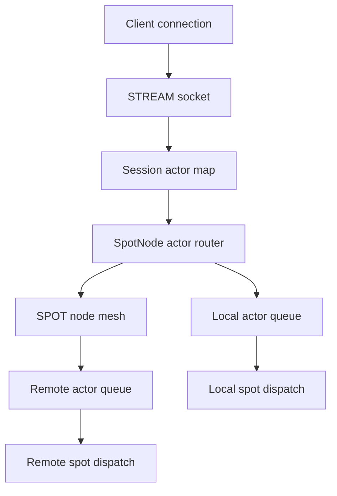

# SPOT Actor Dispatch 초안

> **이 문서는 역사적 초안이다.** 이 초안에 설계된 기능은 `core/v5.3.7`에서
> 전부 구현되었으며, 정식 공개 계약은 아래 문서에 반영되어 있다.
> 신규 개발에는 초안이 아닌 정식 문서를 참조한다.

이 문서는 `SpotNode`가 기존 SPOT 데이터 평면에 더해 Actor 실행 대상을
관리하고, `STREAM` session에서 Actor로 메시지를 relay하는 기능을 설계한
구현 전 초안이다.

정식 공개 계약은 `core/include/zlink.h`와 아래 문서에 반영되어 있다.

- `doc/spec/core/service/spot.ko.md`
- `doc/spec/core/socket/stream.ko.md`
- `doc/spec/core/service/discovery.ko.md`
- `doc/spec/core/errno-map.ko.md`

## 첫 구현 범위

이 문서에 정의된 Actor lifecycle, remote Actor create-or-get, Actor join request,
STREAM session mapping, Actor relay, Actor-to-session relay, Actor dispatch event,
Actor active route discovery, Actor relay backpressure, Spot/Actor snapshot,
request result code, generic discovery route 제거 계획, 회귀 테스트 항목은 모두
첫 구현에서 닫는다.

첫 구현에서 제외하는 항목은 이 문서의 `비목표` 절에만 둔다. `비목표`에 없는
항목은 API 이름이나 enum 숫자가 구현 중 조정될 수는 있어도 기능 범위에서는
빠지지 않는다.

## 구현 순서

첫 구현은 아래 순서로 진행한다. 각 단계는 이전 단계의 공개 계약과 회귀 테스트를
깨지 않는 방식으로 누적한다.

1. Actor 기본 슬롯과 주소값을 만든다.
   `zlink_actor_ref_t`, generation, local Actor table, local create/destroy,
   lookup, Actor snapshot 구조를 먼저 닫는다.
2. Actor queue와 dispatch event를 붙인다.
   `ZLINK_SPOT_DISPATCH_EVENT_ACTOR_READABLE`, Actor subject, nonblocking recv,
   기존 relay 경로의 backpressure 결과를 구현한다.
3. Actor join/leave request를 붙인다.
   join request message 전달, `void *request` opaque handle, join result, leave,
   join 상태 destroy 금지, pending join 종료 처리를 구현한다.
4. STREAM session mapping과 relay를 붙인다.
   session routing id별 Actor list bind/unbind, `actor_id`를 지정하는 bound Actor
   relay, Actor에서 bound session으로 보내는 raw/packet send, relay multipart
   소유권 규칙을 구현한다.
5. remote Actor control plane을 붙인다.
   remote Actor ref, create-or-get, admission handler, rejected/busy 결과,
   remote leave/destroy를 구현한다.
6. Discovery active route 조회를 붙인다.
   Actor route sync option, `zlink_discovery_resolve_actor()`, generation 갱신,
   provider 종료 cleanup을 구현하고 기존 `resolve_spot` 회귀를 확인한다.
7. SpotNode Spot snapshot을 붙인다.
   local Spot facade 목록, dispatch handler attached 상태, joined Actor 수,
   pending join 수, Spot owner route sync 상태를 조회한다.
8. generic discovery route 제거 계획을 적용한다.
   새 actor/spot 전용 조회 API로 sample과 binding 표면을 정리하고, 기존 route API는
   호환성 유예 없이 공개 표면에서 제거한다.

## 목적

현재 SPOT은 `SpotNode`가 토폴로지와 내부 socket을 관리하고, `Spot` facade가
topic publish/subscribe, routed send/request, channel 호출을 제공한다.
이 초안은 같은 `SpotNode`에 Actor 관리 역할을 추가한다.

Actor는 application 객체 모델이 아니다. core에서 Actor는 아래 성질을 가진
라우팅 가능한 실행 대상이다.

- `SpotNode` 아래에 등록된다.
- `actor_id`로 식별된다.
- local Actor handle 또는 remote Actor ref로 표현된다.
- `STREAM` session mapping을 통해 client 메시지를 받을 수 있다.
- `Spot`에 join하면 기존 `zlink_spot_dispatch_event_handler()` 흐름에서
  Actor 메시지 readable event를 받는다.
- 하나의 `SpotNode`는 여러 Actor를 동시에 관리할 수 있다.
- 하나의 `Spot` dispatch context에는 여러 Actor가 동시에 join할 수 있다.
- 메시지 payload는 core가 해석하지 않는다. 호출자는 기존 `zlink_msg_t`
  part 처리 방식으로 메시지를 읽고 닫는다.

이 설계의 핵심은 Framework의 Actor/Session 객체 모델을 core로 옮기는 것이
아니다. core는 Actor routing, session mapping, dispatch event 통합만 맡는다.
typed handler, codec, DI, 언어별 async runtime은 각 framework 또는 binding이
계속 맡는다.

## 비목표

이 초안은 아래 기능을 정의하지 않는다.

- Actor class 생성, factory, dependency injection
- typed message handler 등록
- message codec registry
- Actor placement 정책
- core가 자동으로 수행하는 Actor migration
- 전역 Actor registry 제품화
- client protocol의 header/body 의미
- request/reply sequence 해석
- Actor RPC 수준의 일반 retry policy
- 언어별 framework Actor 객체 자동 생성
- session 인증 정책
- 임의 metadata 저장소
- domain key-value registry
- match id, user id, party id 같은 application key의 범용 조회

특히 `RemoteActor`는 원격 객체 생성 API가 아니다. 이 초안에서 remote Actor는
원격 `SpotNode`에 있는 Actor를 가리키는 복사 가능한 ref이다. remote ref 생성과
remote Actor create-or-get 요청은 다른 API다. remote ref를 만든다고 해서 원격
node에 Actor가 새로 만들어지거나 존재 확인이 끝나는 것은 아니다.

## 기존 공개 계약과의 관계

이 초안은 기존 정식 SPOT spec에 바로 반영하지 않는다. 구현이 끝나기 전까지
정식 문서인 `doc/spec/core/service/spot.ko.md`는 현재 공개 헤더에 있는 계약만
유지한다.

구현이 끝난 뒤에는 아래 문서와 함께 반영해야 한다.

- `core/include/zlink.h`
- `core/include/zlink_enum.h`
- `doc/spec/core/service/spot.ko.md`
- `doc/spec/core/socket/stream.ko.md`
- `doc/spec/core/errno-map.ko.md`
- 언어별 binding spec

## 용어

| 용어 | 뜻 |
|------|----|
| Actor | `SpotNode`가 관리하는 라우팅 가능한 실행 대상 |
| actor id | application이 관리하는 논리 Actor id |
| active actor route | `actor_id`로 새 메시지를 보낼 현재 Actor ref |
| local Actor | 현재 process의 `SpotNode` 아래에 등록된 Actor |
| remote Actor ref | 다른 `SpotNode`의 Actor를 가리키는 값 |
| Actor ref | node routing id, actor id, generation을 묶은 복사 가능한 주소 |
| session routing id | `STREAM` client 연결을 식별하는 routing id |
| actor dispatch queue | Actor로 relay된 메시지의 pending 상태를 나타내는 내부 dispatch 경로 |
| dispatch spot | Actor readable event를 받을 `Spot` facade |

## 전체 모델

아래 흐름은 기능의 책임 경계를 보여 준다.



`STREAM` socket은 여러 client 연결을 가질 수 있다. 따라서 session mapping은
socket handle 하나에 전역으로 걸리지 않고, `stream handle + session routing id`
아래에 저장된다. 첫 구현에서는 session 하나가 Actor ref 목록을 가진다.

session owner node와 Actor owner node가 들고 있는 상태는 다르다. session owner
node는 client 연결을 Actor로 relay하기 위해 `session -> actor_id -> Actor ref`
목록을 저장한다.
Actor owner node는 `Actor -> bound STREAM session` ref와 `Actor -> joined Spot`
상태를 함께 가진다. Discovery가 반환하는 joined Spot 정보도 Actor owner node의
상태에서 나온다.

Actor가 `Spot`에 join되어 있으면 Actor queue가 readable이 될 때
`ZLINK_SPOT_DISPATCH_EVENT_ACTOR_READABLE` event가 발생한다. callback의
`subject_kind`는 `ZLINK_SPOT_DISPATCH_SUBJECT_ACTOR`이며, `subject`는 Actor
handle이다. 호출자는 이 handle을 그대로 `zlink_actor_recv_part()`에 넘겨서
해당 Actor queue를 drain한다.

이 문서에서 Actor queue라고 부르는 것은 Actor마다 별도 socket이나 독립적으로
설정 가능한 queue 객체를 할당한다는 뜻이 아니다. `SpotNode` 내부 relay/dispatch
경로에서 Actor별 unread 상태를 구분하기 위한 논리적 표현이다.

Actor는 socket, inproc endpoint, transport endpoint를 소유하지 않는다. Actor는
`SpotNode`가 관리하는 routing target이며, Actor로 들어온 part는 `SpotNode` 내부의
Actor별 unread 상태에 저장된다. 이 제한은 local Actor와 remote Actor 모두에
동일하게 적용된다.

## 설계 원칙

1. `SpotNode`가 Actor lifecycle과 Actor routing을 소유한다.
2. `Spot`은 Actor 실행 context를 받기 위한 dispatch facade로만 사용한다.
3. remote Actor는 handle이 아니라 `zlink_actor_ref_t` 값이다.
4. `STREAM` session mapping은 session routing id마다 Actor ref 목록을 저장한다.
5. payload는 core가 해석하지 않고 `zlink_msg_t` part로만 전달한다.
6. 하나의 `SpotNode`는 N개의 Actor를 관리할 수 있다.
7. 하나의 `Spot` dispatch context에는 N개의 Actor가 join할 수 있다.
8. Actor가 어느 `Spot`에 join되어 event를 받을지는 명시적으로 정한다.
9. 한 Actor는 한 번에 하나의 dispatch spot에만 join할 수 있다. 이 제약은 이후에도
   바꾸지 않는 고정 계약이다.
10. remote Actor 존재 확인은 send 호출의 성공과 같은 뜻이 아니다.
11. `actor_id`는 application이 관리하는 논리 id이다. 이동 준비 과정에서는 서로
    다른 `SpotNode`에 같은 `actor_id`의 Actor slot이 동시에 존재할 수 있다.
12. generation은 첫 구현부터 유지한다. stale Actor ref를 감지해야 remote relay,
    join, destroy, active route cleanup의 의미가 안전하다.
13. Discovery가 반환하는 Actor 주소는 live Actor 목록이 아니라 하나의 active
    route이다. active route는 Actor 생성 시점이 아니라 `STREAM` session이 Actor를
    지정하는 bind 시점에 기록된다.
14. core Actor 주소에는 종류 필드를 넣지 않는다. Actor 종류나 생성·입장 판단에
    필요한 application 정보는 remote create message와 join message 안에 담는다.
15. Actor의 현재 joined Spot 정보는 core 내부 상태다. application routing을 위한
    public getter는 두지 않고, 진단용 snapshot에서만 노출한다.
16. STREAM session owner node는 `session -> actor_id -> Actor ref` 목록만 저장한다.
    Actor가 어느 Spot에 join되어 있는지는 Actor owner node가 소유하며, Discovery
    active route도 Actor owner node가 자기 현재 상태를 기준으로 publish하거나 갱신한다.
17. Actor는 내부 socket이나 per-Actor inproc endpoint를 갖지 않는다. `STREAM` relay,
    remote mesh relay, dispatch event는 모두 `SpotNode`가 소유한 경로와 Actor별 unread
    상태를 통해 처리한다.

9번 제한은 초안의 복잡도를 줄이기 위한 의도적인 제약이다. 한 Actor가 여러
`Spot`에 동시에 join하면 같은 readable event를 어느 queue와 어떤 callback에서
drain해야 하는지 공개 계약으로 고정해야 한다. 첫 구현에서는 하나의 dispatch
spot만 허용한다.

## C API 변경 목록

이 절은 구현 단계에서 `core/include/zlink.h`, `core/include/zlink_enum.h`,
`core/include/zlink_errno.h`에 반영해야 할 공개 C 표면을 한곳에 모은다.
아래 항목은 첫 구현 범위에 포함된다. 이름과 숫자 값은 구현 과정에서 조정될 수
있지만, 기능 자체는 첫 구현에서 제공한다.

### 추가 상수와 option

| 이름 | 종류 | 목적 |
|------|------|------|
| `ZLINK_ACTOR_ID_MAX` | 상수 | Actor id 문자열 길이 제한 |
| `ZLINK_OPT_DISCOVERY_ACTOR_ROUTE_SYNC` | Discovery option | Actor active route Registry publish 활성화 |

### 추가 구조체

| 이름 | 목적 |
|------|------|
| `zlink_actor_ref_t` | local/remote Actor를 같은 모양으로 표현하는 주소값 |
| `zlink_actor_recv_info_t` | Actor queue 수신 시 함께 반환되는 출처 정보 |
| `zlink_actor_join_info_t` | Spot dispatch context에서 join request를 처리할 때 쓰는 정보 |
| `zlink_actor_create_result_t` | remote Actor create-or-get 성공 결과 |
| `zlink_actor_route_t` | Discovery actor route 조회 결과 |
| `zlink_spot_node_spot_entry_t` | SpotNode local Spot snapshot row |
| `zlink_spot_node_actor_entry_t` | Actor snapshot row |

### 추가 callback typedef

| 이름 | 목적 |
|------|------|
| `zlink_actor_admission_handler_fn` | remote Actor create-or-get 요청의 admission 판단 |

### 추가 enum과 enum 값

| 이름 | 종류 | 목적 |
|------|------|------|
| `zlink_actor_create_status_t` | enum | create-or-get 성공 결과가 `CREATED`인지 `EXISTING`인지 구분 |
| `ZLINK_ACTOR_CREATE_CREATED` | enum 값 | remote create 요청으로 새 Actor가 생성됨 |
| `ZLINK_ACTOR_CREATE_EXISTING` | enum 값 | 같은 id의 기존 Actor가 반환됨 |
| `zlink_actor_admission_result_t` | enum | remote create admission handler 결과 |
| `ZLINK_ACTOR_ADMISSION_ACCEPT` | enum 값 | remote create 허용 |
| `ZLINK_ACTOR_ADMISSION_REJECT` | enum 값 | remote create 거부 |
| `ZLINK_SPOT_DISPATCH_EVENT_ACTOR_READABLE` | dispatch event 값 | Actor queue readable |
| `ZLINK_SPOT_DISPATCH_EVENT_ACTOR_JOIN_READABLE` | dispatch event 값 | Spot join request readable |
| `ZLINK_SPOT_DISPATCH_SUBJECT_ACTOR` | dispatch subject 값 | `subject`가 local Actor handle임 |
| `ZLINK_REQUEST_TIMED_OUT` | 기존 request result | request가 timeout 안에 완료되지 않음 |
| `ZLINK_REQUEST_NOT_FOUND` | 기존 request result | target Actor 또는 target Spot을 찾지 못함 |
| `ZLINK_REQUEST_REJECTED` | request result | admission 또는 join reject |
| `ZLINK_REQUEST_CONFLICT` | request result | stale generation 또는 active route 조건 충돌 |
| `ZLINK_REQUEST_BUSY` | request result | join 상태 destroy처럼 현재 상태에서 수행 불가 |
| `ZLINK_REQUEST_NOT_CONNECTED` | request result | target node 또는 control path 연결 없음 |
| `ZLINK_REQUEST_INVALID_ARGUMENT` | request result | request API 인자 오류 |
| `ZLINK_REQUEST_INVALID_STATE` | request result | request API 호출 시점의 상태 오류 |
| `ZLINK_REQUEST_NOT_SUPPORTED` | request result | 현재 node/socket mode에서 지원하지 않음 |

### 추가 Actor lifecycle API

| API | 목적 |
|-----|------|
| `zlink_spot_node_actor_new()` | local Actor slot 생성 |
| `zlink_actor_destroy()` | join되지 않은 local Actor slot 종료 |
| `zlink_actor_get_ref()` | local Actor handle에서 `zlink_actor_ref_t` 조회 |
| `zlink_spot_node_actor_lookup()` | local node 안에서 actor id로 Actor ref 조회 |
| `zlink_remote_actor_get_ref()` | 이미 알고 있는 node rid와 actor id로 unchecked remote Actor ref 값 생성 |
| `zlink_spot_node_create_remote_actor()` | target node에 create-or-get request 전송 |
| `zlink_spot_node_destroy_remote_actor()` | target node의 remote Actor slot 종료 request |
| `zlink_spot_node_actor_admission_handler()` | remote create admission handler 등록 |

### 추가 Actor active route discovery API

| API | 목적 |
|-----|------|
| `zlink_discovery_resolve_actor()` | actor id로 현재 active Actor route 조회 |

### 추가 Actor join API

| API | 목적 |
|-----|------|
| `zlink_spot_node_actor_join_spot()` | Actor ref에서 target node의 target Spot으로 join request 전송 |
| `zlink_spot_actor_join_recv()` | Spot dispatch context에서 join request message 수신 |
| `zlink_spot_actor_join_reply()` | join request 결과와 reply message 전송 |
| `zlink_actor_leave_spot()` | local Actor를 current Spot에서 Entry Spot으로 이동 |
| `zlink_spot_node_actor_leave_spot()` | Actor ref에서 current Spot을 확인한 뒤 Entry Spot으로 이동 |

### 추가 STREAM session Actor API

| API | 목적 |
|-----|------|
| `zlink_stream_bind_actor()` | session owner SpotNode 아래에서 STREAM session의 Actor list에 Actor 추가 또는 갱신 |
| `zlink_stream_unbind_actor()` | session owner SpotNode 아래에서 STREAM session의 Actor list에서 Actor 제거 |
| `zlink_stream_send_bound_actor_part()` | session Actor list에서 `actor_id`로 target Actor를 골라 payload relay |

### 추가 Actor bound session send API

| API | 목적 |
|-----|------|
| `zlink_actor_send_bound_session_msg()` | Actor에 bind된 STREAM session으로 raw message 전송 |
| `zlink_actor_send_bound_session_packet()` | Actor에 bind된 STREAM session으로 header/body packet 전송 |

### 추가 Actor recv와 SpotNode snapshot API

| API | 목적 |
|-----|------|
| `zlink_actor_recv_part()` | dispatch callback에서 Actor queue part 수신 |
| `zlink_spot_node_spots_snapshot()` | SpotNode 아래의 local Spot 진단 snapshot |
| `zlink_spot_node_actors_snapshot()` | Actor 진단 snapshot |
| `zlink_spot_actors_snapshot()` | 특정 local Spot에 join된 Actor ref 목록 snapshot |

### 변경되는 기존 타입

| 이름 | 변경 |
|------|------|
| `zlink_spot_dispatch_event_t` | Actor readable, Actor join readable event 추가 |
| `zlink_spot_dispatch_subject_kind_t` | Actor subject kind 추가 |
| `zlink_spot_dispatch_info_t` | Actor readable event에서 `subject`가 recv 대상 Actor handle임을 명시 |

### 제거 대상 API

| API | 제거 이유 |
|-----|-----------|
| `zlink_discovery_bind_route()` | Spot owner 조회와 Actor active route 조회가 전용 API로 분리되어 generic key-value route 역할이 줄어듦 |
| `zlink_discovery_unbind_route()` | 위와 같음 |
| `zlink_discovery_resolve_route()` | 위와 같음 |

## 상수와 구조체

Actor id는 길이 제한이 있는 NUL 종료 UTF-8 문자열로 취급한다. core는 문자열을
해석하지 않고 byte sequence로 비교한다. 비교는 대소문자를 구분한다.

```c
#define ZLINK_ACTOR_ID_MAX 256
```

`ZLINK_ACTOR_ID_MAX`는 `zlink_actor_ref_t.actor_id` 배열 capacity이다. 실제 actor id
payload는 NUL 종료 문자를 제외하고 최대 `ZLINK_ACTOR_ID_MAX - 1` byte까지 허용한다.
C API는 `const char *`를 받으므로 첫 NUL byte까지가 id이다. 비어 있는 문자열은
허용하지 않는다.

Actor active route sync를 켜기 위한 Discovery option은 아래와 같다.

```c
ZLINK_OPT_DISCOVERY_ACTOR_ROUTE_SYNC = 0x3036
```

초안 값 `0x3036`은 현재 `ZLINK_OPT_DISCOVERY_SPOT_OWNER_SYNC = 0x3035` 다음
번호를 사용한다. 구현 단계에서는 `core/include/zlink_enum.h`의 option 값과
충돌하지 않음을 확인한 뒤 반영한다. `ZLINK_OPT_DISCOVERY_ACTOR_ROUTE_SYNC`의
기본값은 off이다. 이 옵션을 켠 Discovery에 붙은 Actor owner `SpotNode`만 Registry에
Actor active route row를 publish한다. STREAM session owner node는 joined Spot
상태를 알지 않으므로 Actor active route row의 `joined` 값과 `joined_spot_rid`를
publish하지 않는다.

`zlink_actor_ref_t`는 local Actor와 remote Actor를 같은 모양으로 표현한다.
이 구조체는 복사 가능하며, 호출자가 저장해도 된다.

```c
typedef struct zlink_actor_ref_t
{
    zlink_routing_id_t node_rid;
    char actor_id[ZLINK_ACTOR_ID_MAX];
    uint64_t generation;
} zlink_actor_ref_t;
```

- `node_rid`는 Actor를 소유한 `SpotNode`의 routing id이다.
- `actor_id`는 application이 관리하는 논리 id이다. 서로 다른 `SpotNode`에는
  같은 `actor_id`의 Actor slot이 동시에 존재할 수 있다.
- application은 전체 시스템에서 `actor_id`를 논리적으로 unique하게 운영해야 한다.
  core는 이동 준비처럼 의도적인 중복 slot이 필요한 구간을 막지 않지만, 같은 id를
  서로 다른 application Actor에 재사용했을 때의 의미 충돌은 해결하지 않는다.
- `generation`은 같은 `actor_id`가 destroy 후 재생성될 때 stale ref를 구분하기
  위한 값이다. 같은 `actor_id`가 다른 node에 동시에 있을 때도 각 Actor ref를
  구분하는 데 사용한다. generation은 첫 구현부터 유지한다. live Actor의
  generation은 항상 `0`이 아닌 값이다.
- `generation == 0`인 ref는 특정 live Actor slot을 확인하지 않은 unchecked ref이다.
  `zlink_remote_actor_get_ref()`가 이 형태를 만든다. target node에서 request를
  처리할 때 현재 같은 `actor_id`의 live Actor를 조회한다.

`zlink_actor_recv_info_t`는 Actor queue에서 메시지를 읽을 때 함께 반환하는
출처 정보다.

```c
typedef struct zlink_actor_recv_info_t
{
    zlink_actor_ref_t actor;
    zlink_routing_id_t source_node_rid;
    zlink_routing_id_t source_session_rid;
    uint32_t flags;
} zlink_actor_recv_info_t;
```

- `actor`는 메시지를 받은 Actor ref이다.
- `source_node_rid`는 원래 `STREAM` session을 소유한 node routing id이다.
- `source_session_rid`는 원래 client 연결의 STREAM routing id이다.
- `flags`는 첫 구현에서 `0`만 정의한다. request/reply 표시, close 표시,
  system message 표시는 이 초안의 비목표다.

core는 `source_session_rid`가 어떤 application session인지 알지 않는다. 이 값은
원래 stream peer를 다시 찾기 위한 routing id일 뿐이다.

`zlink_actor_join_info_t`는 `Spot` dispatch context가 Actor join 요청을 읽을 때
함께 받는 정보다.

```c
typedef struct zlink_actor_join_info_t
{
    zlink_actor_ref_t actor;
    zlink_routing_id_t source_node_rid;
    void *request;
    uint32_t flags;
} zlink_actor_join_info_t;
```

- `actor`는 join을 요청한 Actor ref이다.
- `source_node_rid`는 join 요청을 보낸 node routing id이다.
- `request`는 join reply에 다시 넘길 opaque request handle이다.
- `flags`는 첫 구현에서 `0`만 정의한다.

`request`는 transport sequence를 공개하지 않기 위한 값이다. 구현은 내부에서
기존 routed request sequence나 별도 pending id를 쓸 수 있지만, application은 그
값을 알 필요가 없다. `request`는 join request가 pending인 동안만 유효하며,
`zlink_spot_actor_join_reply()`에 정확히 한 번 넘겨야 한다.
`zlink_spot_actor_join_recv()`가 채운 `request`는 항상 `NULL`이 아닌 값이다.
`zlink_spot_actor_join_reply()`에서 `info_->request == NULL`인 경우는 application이
초기화되지 않았거나 임의로 만든 `zlink_actor_join_info_t`를 넘긴 caller 오류로
취급한다. timeout이나 shutdown으로 pending request가 끝난 뒤에도 기존
`zlink_actor_join_info_t`의 `request` 값 자체를 `NULL`로 바꾸지는 않는다. 다만 그
값은 더 이상 유효하지 않으므로 late reply는 `ZLINK_SUBMIT_INVALID_STATE` 계열
결과로 실패한다.

remote Actor create-or-get 요청은 성공했을 때 새 Actor를 만들었는지, 이미 있던
Actor를 반환했는지 구분한다.

```c
typedef enum zlink_actor_create_status_t
{
    ZLINK_ACTOR_CREATE_CREATED = 1,
    ZLINK_ACTOR_CREATE_EXISTING = 2
} zlink_actor_create_status_t;

typedef struct zlink_actor_create_result_t
{
    zlink_actor_create_status_t status;
    zlink_actor_ref_t actor;
} zlink_actor_create_result_t;
```

`zlink_actor_route_t`는 Discovery가 반환하는 Actor active route 정보다.

```c
typedef struct zlink_actor_route_t
{
    zlink_actor_ref_t actor;
    uint32_t joined;
    zlink_routing_id_t joined_spot_rid;
} zlink_actor_route_t;
```

- `actor`는 stream-to-actor relay와 Actor control request에 사용할 Actor ref이다.
- 정상적으로 publish된 Actor active route에서는 `joined != 0`이고
  `joined_spot_rid`는 Actor의 current Spot routing id다. user Spot join 전이면 Entry
  Spot rid가 들어간다.
- `joined == 0`이면 `joined_spot_rid`는 의미가 없다. 이 값은 오래된 row나 손상된
  provider row를 표현할 때만 허용하며, 정상 publish/update 결과로 만들지 않는다.
- joined Spot의 owner node는 route에 들어 있는 `actor.node_rid`와 같다. remote join
  handoff가 성공하면 active route의 Actor ref도 target node 기준으로 갱신되므로 별도
  joined node rid는 두지 않는다.

admission 거부는 `zlink_actor_create_status_t`에 넣지 않는다. 거부는 성공
결과의 종류가 아니라 요청 실패이므로 `zlink_request_result_t` 쪽에서 표현한다.
Actor 기능은 기존 request result와 첫 구현에서 추가하는 request result를 함께
사용한다.

```c
/* 기존 request result. */
ZLINK_REQUEST_TIMED_OUT = 101
ZLINK_REQUEST_NOT_FOUND = 102

/* Actor 기능에서 추가하는 request result. */
ZLINK_REQUEST_REJECTED = 106
ZLINK_REQUEST_CONFLICT = 107
ZLINK_REQUEST_BUSY = 108
ZLINK_REQUEST_NOT_CONNECTED = 109
ZLINK_REQUEST_INVALID_ARGUMENT = 110
ZLINK_REQUEST_INVALID_STATE = 111
ZLINK_REQUEST_NOT_SUPPORTED = 112
```

## Dispatch enum 확장

기존 dispatch event enum에 Actor readable event를 추가한다.

```c
typedef enum zlink_spot_dispatch_event_t
{
    ZLINK_SPOT_DISPATCH_EVENT_SUBSCRIBE_READABLE = 1,
    ZLINK_SPOT_DISPATCH_EVENT_ROUTED_READABLE = 2,
    ZLINK_SPOT_DISPATCH_EVENT_TIMER_READABLE = 3,
    ZLINK_SPOT_DISPATCH_EVENT_CHANNEL_REPLY_READABLE = 4,
    ZLINK_SPOT_DISPATCH_EVENT_ACTOR_READABLE = 5,
    ZLINK_SPOT_DISPATCH_EVENT_ACTOR_JOIN_READABLE = 6
} zlink_spot_dispatch_event_t;

typedef enum zlink_spot_dispatch_subject_kind_t
{
    ZLINK_SPOT_DISPATCH_SUBJECT_SPOT = 1,
    ZLINK_SPOT_DISPATCH_SUBJECT_TIMER = 2,
    ZLINK_SPOT_DISPATCH_SUBJECT_CHANNEL_DEALER = 3,
    ZLINK_SPOT_DISPATCH_SUBJECT_ACTOR = 4
} zlink_spot_dispatch_subject_kind_t;
```

위 enum 숫자는 공개 값의 예시이며 dispatch 처리 우선순위를 뜻하지 않는다.
event polling과 callback 호출 순서는 아래 우선순위 목록을 따른다.

Actor readable event에서 `zlink_spot_dispatch_info_t.subject`는 local Actor
handle이다. remote Actor ref는 event subject가 될 수 없다. remote node에서
메시지를 받은 뒤 그 node의 local Actor handle이 event subject가 된다.

이 계약은 Actor dispatch의 핵심이다. callback은 readable event만 보고 별도
lookup을 해서는 안 된다. `info_->event == ZLINK_SPOT_DISPATCH_EVENT_ACTOR_READABLE`
이고 `info_->subject_kind == ZLINK_SPOT_DISPATCH_SUBJECT_ACTOR`이면,
`info_->subject`가 반드시 recv 대상 Actor handle이다.

```c
typedef struct zlink_spot_dispatch_info_t
{
    zlink_spot_dispatch_event_t event;
    zlink_spot_dispatch_subject_kind_t subject_kind;
    void *subject;
} zlink_spot_dispatch_info_t;
```

Actor readable event의 필드 의미는 아래와 같다.

| 필드 | 값 |
|------|----|
| `event` | `ZLINK_SPOT_DISPATCH_EVENT_ACTOR_READABLE` |
| `subject_kind` | `ZLINK_SPOT_DISPATCH_SUBJECT_ACTOR` |
| `subject` | `zlink_actor_recv_part()`에 넘길 local Actor handle |

Actor join readable event의 필드 의미는 아래와 같다.

| 필드 | 값 |
|------|----|
| `event` | `ZLINK_SPOT_DISPATCH_EVENT_ACTOR_JOIN_READABLE` |
| `subject_kind` | `ZLINK_SPOT_DISPATCH_SUBJECT_SPOT` |
| `subject` | join request를 받은 `Spot` handle |

기존 dispatch 우선순위에 Actor event를 추가하면 첫 구현의 우선순위는 아래와 같다.

1. `SUBSCRIBE_READABLE`
2. `ROUTED_READABLE`
3. `ACTOR_JOIN_READABLE`
4. `ACTOR_READABLE`
5. `CHANNEL_REPLY_READABLE`
6. `TIMER_READABLE`

Actor join request는 Actor readable보다 먼저 처리한다. join accept가 끝난 뒤에야
해당 Actor의 queued message를 같은 `Spot` dispatch context에서 drain할 수 있기
때문이다. `SUBSCRIBE_READABLE`과 `ROUTED_READABLE`은 기존 SPOT dispatch
우선순위를 그대로 유지하기 위해 Actor event보다 먼저 둔다.

`CHANNEL_REPLY_READABLE`은 Actor event 뒤에 둔다. Actor dispatch는 client 입력을
room `Spot` 실행 context에서 처리하기 위한 경로이고, join accept 직후 쌓여 있던
Actor message를 같은 tick에서 drain할 수 있어야 한다. channel reply를 많이 쓰는
응용에서는 기존보다 reply callback 관측 순서가 늦어질 수 있으므로, 구현 후 회귀
테스트에서 기존 channel reply 기능 자체가 깨지지 않는지 확인한다.

## Actor 생성과 종료

local Actor는 `SpotNode` 아래에 생성한다.
`actor_id`는 application이 관리하는 논리 id이다. core는 같은 `SpotNode` 안의
중복 Actor slot만 즉시 거부한다. 서로 다른 `SpotNode`에 같은 `actor_id`의 Actor
slot이 존재할 수 있으며, 이 상태는 Actor 이동 준비와 drain 과정에서 허용된다.
Discovery에 기록되는 active route는 Actor 생성 시점이 아니라 `STREAM` session이
해당 Actor를 지정하는 bind 시점에 갱신된다.

```c
ZLINK_EXPORT void *zlink_spot_node_actor_new(
  void *node_,
  const char *actor_id_);

ZLINK_EXPORT zlink_request_result_t zlink_actor_destroy(
  void **actor_p_,
  uint32_t timeout_ms_);
```

계약은 아래와 같다.

- `node_ == NULL`이면 `NULL`과 `errno == EINVAL`로 실패한다.
- `actor_id_ == NULL`이면 `NULL`과 `errno == EINVAL`로 실패한다.
- `actor_id_`가 비어 있거나 `ZLINK_ACTOR_ID_MAX - 1` byte를 넘으면 `EINVAL`이다.
- 같은 `SpotNode` 안에 같은 `actor_id`를 가진 live Actor가 있으면 `EBUSY`다.
- 같은 `SpotNode` 안에 서로 다른 `actor_id`를 가진 Actor는 개수 제한 없이
  등록할 수 있다. 실제 상한은 메모리, HWM, 내부 id 공간 같은 런타임 자원에만
  의존한다.
- 다른 `SpotNode`에 같은 `actor_id`의 live Actor가 있어도 생성은 실패하지 않는다.
- Actor 생성 자체는 Discovery active route를 publish하지 않는다.
- `PUBSUB` 전용 mode의 `SpotNode`에서는 `ENOTSUP`으로 실패한다.
- 성공한 Actor handle은 `zlink_actor_destroy()`로 닫는다.
- `zlink_actor_destroy()`에서 `actor_p_ == NULL`이면
  `ZLINK_REQUEST_INVALID_ARGUMENT` 계열 결과로 실패한다.
- `zlink_actor_destroy()`에서 `*actor_p_ == NULL`이면 성공으로 처리한다.
- Actor가 Entry Spot이 아닌 user Spot에 있는 상태에서 `zlink_actor_destroy()`를 호출하면
  `ZLINK_REQUEST_BUSY` 또는 `ZLINK_REQUEST_INVALID_STATE` 계열 결과로 실패한다.
  호출자는 먼저 `zlink_actor_leave_spot()`으로 Actor를 Entry Spot으로 되돌려야 한다.
- Actor destroy는 bound session과 session Actor list의 해당 actor id 항목을 먼저
  해제한 뒤 Actor slot을 제거한다.
  bound session detach를 완료할 수 없으면 `ZLINK_REQUEST_NOT_CONNECTED` 또는
  `ZLINK_REQUEST_BUSY` 계열 결과로 실패하고 Actor slot은 유지된다.
  다만 session owner node의 provider 종료가 확인되었거나 Actor owner node가 stale
  session ref로 판단할 수 있으면, Actor owner node의 bound session ref를 cleanup한 뒤
  destroy를 진행할 수 있다. session owner node가 이미 사라진 경우에는 그 node의
  session Actor list를 원격으로 갱신할 수 없으므로, 해당 list 항목 제거를 성공 조건에
  넣지 않는다. 이 예외는 끊어진 session owner 때문에 Actor slot을 영구히 닫지 못하는
  상태를 막기 위한 것이다.
  destroy가 성공한 뒤 해당 session에서 이 Actor의 `actor_id`로 bound send를 호출하면
  session Actor list에 target actor id 없음으로 실패한다.
- `zlink_actor_destroy()`가 성공하면 `*actor_p_`는 `NULL`이 된다.
- `zlink_actor_destroy()`가 실패하면 `*actor_p_`는 기존 Actor handle 값을 유지한다.
- `zlink_actor_destroy()`가 timeout으로 실패하면 Actor slot, current Spot, bound session
  상태는 호출 전 상태를 유지한다. timeout 뒤에 destroy가 백그라운드에서 늦게 완료되는
  동작은 공개 계약으로 만들지 않는다.

destroy 시점에 Actor queue에 남아 있는 unread 메시지는 버려진다. 호출자는
destroy 전에 queue를 전부 drain해야 할 의무를 지지 않는다.
다만 destroy는 Actor가 어떤 `Spot`에도 join되어 있지 않을 때만 가능하다. 이
제약은 dispatch event queue에 이미 들어간 `subject`가 dangling handle이 되는
상황을 막기 위해 필요하다.

## Actor ref 조회

local Actor handle에서 복사 가능한 ref를 얻는다.

```c
ZLINK_EXPORT zlink_config_result_t zlink_actor_get_ref(
  void *actor_,
  zlink_actor_ref_t *out_);
```

같은 node 안에서 `actor_id`로 Actor를 찾을 수도 있다.

```c
ZLINK_EXPORT zlink_config_result_t zlink_spot_node_actor_lookup(
  void *node_,
  const char *actor_id_,
  zlink_actor_ref_t *out_);
```

계약은 아래와 같다.

- `zlink_actor_get_ref()`에서 `actor_ == NULL` 또는 `out_ == NULL`이면 `EINVAL`이다.
- `zlink_spot_node_actor_lookup()`에서 `node_ == NULL`, `actor_id_ == NULL`, 또는
  `out_ == NULL`이면 `EINVAL`이다.
- `actor_id_`가 비어 있거나 `ZLINK_ACTOR_ID_MAX - 1` byte를 넘으면 `EINVAL`이다.
- Actor가 없으면 `ENOENT`다.
- 반환된 ref는 이후 Actor가 destroy될 수 있으므로 영구 생존을 보장하지 않는다.
- stale generation ref로 local relay하면 `ESTALE` 계열 내부 errno로 실패한다.
  공개 errno 매핑은 구현 단계에서 정한다.

## Remote Actor ref

remote Actor는 원격 node에 대한 ref 값으로 만든다. 이 API는 network 요청을
보내지 않는다. 호출자는 수동 peer 연결, 설정, 또는 discovery를 통해 target
`SpotNode`의 routing id를 먼저 알고 있어야 한다.

```c
ZLINK_EXPORT zlink_config_result_t zlink_remote_actor_get_ref(
  const zlink_routing_id_t *target_node_rid_,
  const char *actor_id_,
  zlink_actor_ref_t *out_);
```

endpoint 문자열을 받는 별도 remote ref API는 두지 않는다. endpoint에서 routing id를
찾는 일은 peer 연결, 설정, discovery의 책임이고, Actor ref 생성은 이미 알고 있는
node routing id와 Actor id를 값으로 묶는 일만 맡는다.

- `target_node_rid_ == NULL`, `actor_id_ == NULL`, 또는 `out_ == NULL`이면
  `EINVAL`이다.
- `target_node_rid_`가 비어 있거나 유효한 routing id 값이 아니면 `EINVAL`이다.
- `actor_id_`가 비어 있거나 `ZLINK_ACTOR_ID_MAX - 1` byte를 넘으면 `EINVAL`이다.
- 성공하면 `out_->node_rid`와 `out_->actor_id`를 채우고 `out_->generation = 0`으로
  둔다.
- 이 API는 target node가 peer table에 있는지, handshake가 끝났는지, Actor가 실제로
  존재하는지 확인하지 않는다.

이 분리는 중요하다. ref 생성 API가 endpoint 조회, peer connect, handshake 대기,
Actor 존재 확인을 함께 맡으면 호출자가 실패 원인을 구분하기 어렵고 API가 얕아진다.
`zlink_remote_actor_get_ref()`는 discovery를 쓰지 않는 배치나 gateway가 이미 알고
있는 node rid와 actor id로 "현재 그 node에 있는 actor id"를 가리키는 unchecked ref를
만들 때 사용한다.

`generation == 0`인 ref는 unchecked ref이다. target node에서 request를 처리할 때
현재 같은 `actor_id`의 live Actor를 찾는다. stale generation 검출은 할 수 없다.
`generation != 0`인 ref는 특정 Actor slot을 가리키는 checked ref이다. target node에
같은 actor id가 있어도 generation이 다르면 stale/conflict 실패로 처리한다.

caller가 stale 검출이 필요한 checked ref를 원하면 `zlink_discovery_resolve_actor()`,
`zlink_spot_node_create_remote_actor()`, `zlink_actor_get_ref()`,
`zlink_spot_node_actor_lookup()`처럼 실제 Actor table이나 Registry view를 거친
API로 ref를 얻는다.

## Actor active route 조회

SPOT owner 조회는 없어지지 않았다. 기존 공개 API인 `zlink_discovery_resolve_spot()`
은 `spot_rid`로 현재 owner `SpotNode` routing id를 찾는다.

```c
ZLINK_EXPORT zlink_config_result_t zlink_discovery_resolve_spot(
  void *discovery_,
  const zlink_routing_id_t *spot_rid_,
  zlink_routing_id_t *owner_node_rid_out_);
```

Actor도 core가 관리하는 대상이 되면 같은 수준의 전용 조회 API가 필요하다.
다만 Actor 조회는 live Actor slot 목록을 의미하지 않는다. `actor_id`가 같은
Actor slot은 이동 준비 과정에서 여러 `SpotNode`에 존재할 수 있으므로,
Discovery는 `actor_id -> 현재 active Actor route` 하나만 반환한다.
generic route API로도 이 매핑을 만들 수 있지만, active route는 generation,
SpotNode provider 종료, Actor destroy, Spot join/leave와 생명주기가 묶여 있다.
따라서 Actor id 조회는 generic route보다 Actor 전용 active route 조회로 제공한다.

```c
ZLINK_EXPORT zlink_config_result_t zlink_discovery_resolve_actor(
  void *discovery_,
  const char *actor_id_,
  zlink_actor_route_t *route_out_);
```

계약은 아래와 같다.

- `discovery_ == NULL`이면 `EINVAL`이다.
- `actor_id_`가 비어 있거나 `ZLINK_ACTOR_ID_MAX - 1` byte를 넘으면 `EINVAL`이다.
- `route_out_ == NULL`이면 `EINVAL`이다.
- 성공하면 `route_out_->actor.node_rid`에 active route의 `SpotNode` routing id가
  들어간다.
- 성공하면 `route_out_->actor.actor_id`도 Registry view에서 확인된 값으로 채운다.
- 이 기능으로 publish된 active route는 bound session이 있는 Actor route이므로
  `route_out_->joined != 0`이고 `route_out_->joined_spot_rid`가 유효해야 한다.
- `route_out_->joined_spot_rid`는 Actor의 current Spot routing id이다. Actor가 user
  Spot에 아직 join하지 않았다면 이 값은 Entry Spot routing id이다.
- `route_out_->joined == 0`은 Registry view에 joined Spot 정보가 없는 오래된 row나
  손상된 provider row를 뜻한다. 정상적인 Actor route publish/update 결과로 만들지
  않는다.
- joined Spot의 owner node는 항상 `route_out_->actor.node_rid`이다.
- active route를 찾지 못하거나 route provider가 live 상태가 아니면 `ENOENT`다.
- Discovery가 Registry 기준 정보에 아직 접근할 수 없으면 `EAGAIN`이다.
- resolve는 cache 항목을 만들거나 갱신하지 않는다. stale route row를 반환하지
  않는다.

Actor active route publish는 기본값으로 꺼져 있다. Registry 기준 조회를 사용하려면
Actor owner `SpotNode`의 Discovery에서 `ZLINK_OPT_DISCOVERY_ACTOR_ROUTE_SYNC`를
`1`로 설정해야 한다. STREAM session owner node는 session이 어떤 Actor ref 목록에
bind되었는지만 알며, Actor의 joined Spot 상태는 알지 않는다. 따라서 active route
row는 bind control request가 도착한 Actor owner node가 자기 Actor 상태를 읽어서
publish하거나 갱신한다.

Actor active route row 생명주기는 아래 원칙을 따른다.

- local Actor 생성이나 remote create-or-get은 active route를 publish하지 않는다.
- Actor가 Entry Spot에 있어도 stream bind 전에는 active route가 없다. 이 상태에서
  `zlink_discovery_resolve_actor()`는 `ENOENT`를 반환할 수 있다.
- `zlink_stream_bind_actor()`가 성공하고 Actor owner node의 actor route sync가
  켜져 있으면 `actor_id -> Actor route` active route row를 publish하거나 갱신한다.
- bind 시점의 route row에는 현재 Actor ref, `joined = 1`, current Spot rid가 함께
  기록된다. 생성 직후 Actor라면 current Spot rid는 Entry Spot rid이다. session owner
  node가 이 값을 전달하는 것이 아니라 Actor owner node가 자기 상태에서 채운다.
- 같은 `actor_id`의 active route가 이미 있더라도 새 Actor ref로 갱신할 수 있다.
  이 규칙이 Actor 이동에서 route 전환 지점이 된다.
- Actor가 user Spot에 join되면 active route row의 `joined_spot_rid`를 target Spot rid로
  갱신한다. `joined`는 계속 `1`이다.
- Actor가 leave하면 Actor current Spot은 Entry Spot이므로 active route row의
  `joined_spot_rid`를 Entry Spot rid로 갱신한다. `joined = 0`으로 바꾸지 않는다.
- remote join commit이 성공하면 active route row의 Actor ref를 target node Actor ref로
  갱신하고, `joined_spot_rid`는 target node의 target Spot rid로 갱신한다.
- route sync가 꺼져 있거나 active route가 해당 Actor를 가리키지 않으면 Registry row를
  갱신하지 않는다.
- `zlink_stream_unbind_actor()`와 session disconnect cleanup은 session Actor list
  항목과 Actor 쪽 bound session ref를 제거한다. active route는 다른 bind가 갱신하거나
  matching Actor destroy/provider 종료가 정리할 때까지 유지된다. session disconnect
  cleanup이 user Spot Actor를 Entry Spot으로 되돌린 경우 active route가 해당 Actor ref를
  가리키면 `joined_spot_rid`도 Entry Spot rid로 갱신한다.
- Actor destroy 시 현재 active route가 같은 actor id, node rid, generation을 가리킬
  때만 route row를 제거한다. route가 이미 다른 node로 이동했다면 이전 Actor destroy는
  새 route를 제거하지 않는다.
- `SpotNode` provider가 사라지면 그 node를 가리키는 active route row를 제거한다.
- 같은 `actor_id`가 재생성되면 새 generation을 가진다. stream bind가 다시 일어나야
  active route가 새 generation으로 publish된다.

## Generic discovery route 제거 계획

Actor active route 조회가 core 전용 기능으로 들어오면 generic discovery route API의
역할은 줄어든다. 첫 구현에서는 아래 API를 공개 표면에서 바로 제거한다. 이 초안은
호환성 유예나 deprecated 유지 기간을 두지 않는다.

```c
ZLINK_EXPORT zlink_config_result_t zlink_discovery_bind_route(
  void *discovery_,
  zlink_route_kind_t kind_,
  const void *key_,
  size_t key_size_,
  const void *value_,
  size_t value_size_);

ZLINK_EXPORT zlink_config_result_t zlink_discovery_unbind_route(
  void *discovery_,
  zlink_route_kind_t kind_,
  const void *key_,
  size_t key_size_);

ZLINK_EXPORT zlink_config_result_t zlink_discovery_resolve_route(
  void *discovery_,
  zlink_route_kind_t kind_,
  const void *key_,
  size_t key_size_,
  zlink_routing_id_t *owner_rid_out_,
  zlink_msg_t *value_out_);
```

제거 이유는 아래와 같다.

- SPOT 주소는 `zlink_discovery_resolve_spot()`이 전용으로 처리한다.
- Actor 주소는 `zlink_discovery_resolve_actor()`가 전용으로 처리한다.
- generic route는 key와 value의 의미를 core가 알 수 없어 생명주기 정리를
  application에 떠넘긴다.
- Actor destroy, SpotNode provider 종료, generation 변경 같은 route-bound 상태가
  generic route value와 중복될 수 있다.
- metadata store처럼 쓰기 시작하면 TTL, 조건부 갱신, query, 권한, 관측성 같은
  별도 저장소 요구사항이 생긴다.

따라서 이 초안의 주소 조회 표면은 아래처럼 나눈다.

| 조회 대상 | API | 소유 책임 |
|-----------|-----|-----------|
| `spot_rid -> owner node rid` | `zlink_discovery_resolve_spot()` | core Discovery/SPOT |
| `actor_id -> actor route` | `zlink_discovery_resolve_actor()` | core Discovery/Actor |
| `match_id`, `user_id`, `party_id` 같은 domain key | 없음 | application 또는 외부 저장소 |

domain metadata나 custom index는 Redis, DB, application registry 같은
외부 저장소를 사용한다. zlink Registry/Discovery는 transport topology와
core 주소 조회만 맡는다.

기존 구현에 이 API들이 이미 들어 있더라도 첫 구현에서 제거한다. binding과 sample은
새 actor/spot 전용 API만 사용하도록 정리한다.

## Remote Actor create-or-get

remote Actor가 없으면 만들고, 이미 있으면 기존 Actor ref를 반환하는 요청 API를
둔다. 이 API는 remote ref 생성과 다르다. target `SpotNode`에 control request를
보내고, target node의 Actor table과 admission handler를 거친다.
remote create 요청에는 `zlink_msg_t` part 배열로 이루어진 multipart payload를 실을 수 있다. core는 이 payload를 해석하지 않고 target node의 admission handler로 borrowed view로 전달한다.

```c
ZLINK_EXPORT zlink_request_result_t zlink_spot_node_create_remote_actor(
  void *node_,
  const zlink_routing_id_t *target_node_rid_,
  const char *actor_id_,
  zlink_msg_t *parts_,
  size_t part_count_,
  zlink_actor_create_result_t *out_,
  uint32_t timeout_ms_);
```

target node는 아래 순서로 처리한다.

1. `actor_id_`로 local Actor table을 조회한다.
2. 같은 `actor_id_`의 Actor가 이미 있으면 새로 만들지 않고
   `out_->status = ZLINK_ACTOR_CREATE_EXISTING`으로 반환한다. 이때 admission
   handler는 호출하지 않는다.
3. target node에는 없지만 다른 `SpotNode`에 같은 `actor_id_`의 Actor가 있더라도
   remote create는 실패하지 않는다. 이 동작은 Actor 이동 준비를 위해 필요하다.
4. Actor가 없으면 admission handler를 호출하고 `parts_`와 `part_count_` 내용을 전달한다.
5. admission handler가 허용하면 target node가 core Actor slot을 만들고
   `out_->status = ZLINK_ACTOR_CREATE_CREATED`로 반환한다.
6. admission handler가 거부하면 request 실패로 반환한다.

caller 쪽 계약은 아래와 같다.

- `node_ == NULL`, `target_node_rid_ == NULL`, `actor_id_ == NULL`, `parts_ == NULL && part_count_ > 0`, `parts_ != NULL && part_count_ == 0`,
  또는 `out_ == NULL`이면 `ZLINK_REQUEST_INVALID_ARGUMENT` 계열 결과로 실패한다.
- `actor_id_`가 비어 있거나 `ZLINK_ACTOR_ID_MAX - 1` byte를 넘으면
  `ZLINK_REQUEST_INVALID_ARGUMENT` 계열 결과로 실패한다.
- target node와 연결되어 있지 않으면 `ZLINK_REQUEST_NOT_CONNECTED` 계열 결과로
  실패한다.
- timeout 안에 create-or-get reply를 받지 못하면 `ZLINK_REQUEST_TIMED_OUT`
  계열 결과로 실패한다. 이 경우 caller는 target node에 Actor가 생성됐는지
  단정하면 안 된다. 같은 `actor_id`로 create-or-get을 재시도해야 하며, target에
  Actor가 이미 만들어져 있으면 재시도는 `ZLINK_ACTOR_CREATE_EXISTING`으로
  수렴한다.

동시 create 요청은 `actor_id` 단위로 직렬화한다. 같은 Actor에 대해 여러 create
요청이 동시에 들어오면 하나만 `CREATED`가 되고, 나머지는 `EXISTING`을 받는다.

admission은 Actor가 없을 때만 호출한다. 이미 존재하는 Actor를 반환하는 경로에서
admission handler를 다시 호출하지 않는다. create-or-get 의미에 access check를
섞지 않기 위해서다. 별도의 접근 제어는 이 초안의 비목표이며, 독립 초안에서
다룬다.

remote create-or-get은 core Actor slot만 만든다. 언어별 framework 객체, handler
instance, DI scope 같은 것은 core가 만들지 않는다. binding이나 framework가 이
기능 위에 상위 객체 생명주기를 붙일 수는 있지만, core public 계약은 Actor slot과
Actor ref까지로 제한한다.

`parts_`와 `part_count_`는 Actor 종류, 인증 정보, 초기 상태, placement 판단 근거
같은 application payload를 담기 위한 값이다. core는 payload 내용을 해석하지 않는다.
비어 있는 요청은 `parts_ == NULL && part_count_ == 0`으로 보낸다. request가 target
node에 submit되면 `parts_` 소유권은 라이브러리로 이전된다. local validation이나
submit 전 실패가 발생하면 소유권은 호출자에게 남는다.
timeout 실패는 이미 submit된 request의 completion 실패이므로, submit 이후
소유권이 이전된 `parts_`는 caller에게 돌아오지 않는다. 재시도할 때는 새
payload parts를 만들어 넘겨야 한다.

### Admission handler

target `SpotNode`는 remote create 요청을 허용할지 결정하는 admission handler를
가질 수 있다.

```c
typedef enum zlink_actor_admission_result_t
{
    ZLINK_ACTOR_ADMISSION_ACCEPT = 1,
    ZLINK_ACTOR_ADMISSION_REJECT = 2
} zlink_actor_admission_result_t;

typedef zlink_actor_admission_result_t (*zlink_actor_admission_handler_fn)(
  void *node_,
  const char *actor_id_,
  const zlink_msg_t *parts_,
  size_t part_count_,
  void *userdata_);

ZLINK_EXPORT zlink_handler_result_t zlink_spot_node_actor_admission_handler(
  void *node_,
  zlink_actor_admission_handler_fn handler_,
  void *userdata_);
```

계약은 아래와 같다.

- `node_ == NULL`이면 `EINVAL`이다.
- `handler_ == NULL`이면 기존 handler를 제거한다. handler가 제거된 node는 remote
  create 요청을 기본 정책으로 거부한다.
- handler가 설치되지 않은 node에서 remote create 요청을 받으면 기본 정책으로
  거부한다.
- handler는 Actor가 없을 때만 호출된다.
- `parts_`는 borrowed view이다. handler는 내용을 읽을 수 있지만 close하거나
  저장하면 안 된다. view lifetime은 handler 호출 동안만 유효하다.
- handler가 `ACCEPT`를 반환하면 core가 local Actor slot을 만든다.
- handler가 `REJECT`를 반환하면 create 요청은 `ZLINK_REQUEST_REJECTED` 계열
  실패로 끝난다.
- handler 안에서는 `zlink_spot_node_actor_new()`를 호출할 수 없다. 같은
  `actor_id`뿐 아니라 다른 `actor_id` 생성도 허용하지 않는다. admission handler는
  Actor table lock 또는 create 직렬화 구간 안에서 호출될 수 있으므로 재진입 가능한
  factory hook으로 취급하지 않는다. handler는 허용 여부만 반환한다.

## Remote Actor 종료

local Actor는 `zlink_actor_destroy()`로 닫는다. remote Actor는 target node에 종료
요청을 보내는 별도 API를 사용한다.

```c
ZLINK_EXPORT zlink_request_result_t zlink_spot_node_destroy_remote_actor(
  void *node_,
  const zlink_actor_ref_t *actor_,
  uint32_t timeout_ms_);
```

계약은 아래와 같다.

- `node_ == NULL` 또는 `actor_ == NULL`이면 `ZLINK_REQUEST_INVALID_ARGUMENT`
  계열 결과로 실패한다.
- `actor_`의 `actor_id`가 비어 있거나 `ZLINK_ACTOR_ID_MAX - 1` byte를 넘으면
  `ZLINK_REQUEST_INVALID_ARGUMENT` 계열 결과로 실패한다.
- `actor_`의 `node_rid`가 target node이다.
- target node와 연결되어 있지 않으면 `ZLINK_REQUEST_NOT_CONNECTED` 계열 결과로
  실패한다.
- target node에 Actor가 없으면 성공으로 처리한다. destroy는 idempotent 하다.
- `actor_->generation == 0`이면 target node의 현재 같은 `actor_id` Actor를 destroy한다.
- `actor_->generation != 0`이고 target node에 같은 `actor_id`와 같은 generation의
  Actor가 있으면 destroy한다.
- target Actor가 Entry Spot이 아닌 user Spot에 있으면 destroy하지 않고 `ZLINK_REQUEST_BUSY`
  또는 `ZLINK_REQUEST_INVALID_STATE` 계열 결과로 실패한다.
- `actor_->generation != 0`이고 target Actor generation이 다르면 stale/conflict
  실패로 반환한다.
- destroy가 성공하면 target Actor queue의 unread 메시지는 버려진다.
- destroy는 target Actor의 bound session과 session Actor list의 해당 actor id 항목을
  먼저 해제한 뒤 Actor slot을 제거한다. bound session detach를 완료할 수 없으면 destroy는
  `ZLINK_REQUEST_NOT_CONNECTED` 또는 `ZLINK_REQUEST_BUSY` 계열 결과로 실패하고
  Actor slot은 유지된다.
  다만 session owner node의 provider 종료가 확인되었거나 target Actor owner node가
  stale session ref로 판단할 수 있으면 target Actor owner node의 bound session ref를
  cleanup하고 destroy를 진행할 수 있다. session owner node가 이미 사라진 경우에는
  그 node의 session Actor list 항목 제거를 remote destroy 성공 조건에 넣지 않는다.
- `zlink_spot_node_destroy_remote_actor()`가 timeout으로 실패하면 target Actor slot,
  current Spot, bound session 상태는 호출 전 상태를 유지한다. timeout 뒤에 destroy가
  백그라운드에서 늦게 완료되는 동작은 공개 계약으로 만들지 않는다.

user Spot에 있는 Actor를 destroy하지 않는 이유는 local destroy와 같다. dispatch event
queue에 이미 들어간 Actor handle이 무효화되는 상황을 공개 계약에서 허용하지
않기 위해서다.

## Actor와 Spot join request

Actor join은 즉시 attach 함수가 아니라 `Spot`으로 보내는 join request로 처리한다.
join request는 `zlink_msg_t` part 배열로 이루어진 multipart payload를 실을 수 있고, target `Spot`의 dispatch
event context에서 직렬화되어 처리된다. core는 join payload를 해석하지 않는다.
application은 이 payload 안에 입장 판단에 필요한 room option, auth token, initial
state 같은 값을 담을 수 있다.

local 또는 remote Actor ref를 target `Spot`에 보내는 API는 하나만 둔다.
local Actor도 `zlink_actor_get_ref()`로 얻은 `zlink_actor_ref_t`를 넘겨 같은 경로를
사용한다. `dest_node_rid_`가 Actor owner node와 같으면 local Spot 이동이고, 다르면
remote Spot join handoff다.

```c
ZLINK_EXPORT zlink_submit_result_t zlink_spot_node_actor_join_spot(
  void *node_,
  const zlink_actor_ref_t *actor_,
  const zlink_routing_id_t *dest_node_rid_,
  const zlink_routing_id_t *dest_spot_rid_,
  zlink_msg_t *parts_,
  size_t part_count_,
  zlink_reply_handler_fn handler_,
  void *userdata_,
  zlink_send_flags_t flags_,
  uint32_t timeout_ms_);
```

target `Spot`은 dispatch event에서 join request를 읽는다.

```c
ZLINK_EXPORT zlink_recv_result_t zlink_spot_actor_join_recv(
  void *spot_,
  zlink_actor_join_info_t *info_out_,
  zlink_msg_t **parts_out_,
  size_t *part_count_out_,
  zlink_recv_flags_t flags_);
```

join message를 읽은 뒤 application은 join reply를 호출한다.
`accepted_`가 `0`이 아니면 Actor가 `Spot`에 join된다. `accepted_ == 0`이면 Actor를
join하지 않고 caller의 request handler에 실패 결과를 전달한다. 두 경우 모두 caller로
multipart reply payload를 전달할 수 있다.

```c
ZLINK_EXPORT zlink_submit_result_t zlink_spot_actor_join_reply(
  void *spot_,
  const zlink_actor_join_info_t *info_,
  uint32_t accepted_,
  zlink_msg_t *parts_,
  size_t part_count_);
```

계약은 아래와 같다.

- `zlink_spot_node_actor_join_spot()`에서 `node_ == NULL`, `actor_ == NULL`,
  `dest_node_rid_ == NULL`, `dest_spot_rid_ == NULL`,
  `parts_ == NULL && part_count_ > 0`, `parts_ != NULL && part_count_ == 0`, 또는
  `handler_ == NULL`이면 `ZLINK_SUBMIT_INVALID_ARGUMENT` 계열 결과로 실패한다.
- `zlink_spot_node_actor_join_spot()`에서 `actor_`의 `actor_id`가 비어 있거나
  `ZLINK_ACTOR_ID_MAX - 1` byte를 넘으면
  `ZLINK_SUBMIT_INVALID_ARGUMENT` 계열 결과로 실패한다.
- `dest_node_rid_`가 비어 있으면 `ZLINK_SUBMIT_INVALID_ARGUMENT` 계열 결과로
  실패한다.
- `node_`는 join request를 제출하고 completion handler를 소유하는 request owner
  `SpotNode` handle이다. session owner, backend service node, source Actor owner node
  모두 request owner가 될 수 있다.
- request owner는 session owner와 같을 필요가 없다. session owner는 Actor의 bound
  session ref에서 읽고, remote join commit 때 relay mapping만 갱신한다.
- `actor_->node_rid`는 현재 Actor owner node를 뜻한다. `dest_node_rid_`가
  `actor_->node_rid`와 같으면 같은 node 안 local join으로 처리한다.
- `dest_node_rid_`가 `actor_->node_rid`와 다르면 source Actor owner node에서 target
  Spot owner node로 remote join handoff를 수행한다.
- caller node가 Actor owner node 또는 target node와 연결되어 있지 않거나, Actor owner
  node가 target node와 연결되어 있지 않으면
  `ZLINK_SUBMIT_NOT_CONNECTED` 계열 결과로 실패한다.
- `dest_spot_rid_`가 `dest_node_rid_`의 target node에 없으면 join request는
  `ZLINK_REQUEST_NOT_FOUND` 계열 실패로 끝난다.
- 비어 있는 join request는 `parts_ == NULL && part_count_ == 0`으로 보낸다.
- source Actor owner node에 Actor가 없으면 join request는 `ZLINK_REQUEST_NOT_FOUND` 계열
  실패로 끝난다.
- `actor_->generation == 0`이면 source Actor owner node의 현재 같은 `actor_id` Actor를
  대상으로 join request를 보낸다.
- `actor_->generation != 0`이고 source Actor generation이 다르면 stale/conflict
  실패로 끝난다.
- Actor는 Entry Spot에 있을 때만 bound session 없이 존재할 수 있다.
- target Spot이 Entry Spot이 아니면 source Actor에 bound STREAM session ref가 있어야
  한다. bound session이 없으면 join request는 `ZLINK_SUBMIT_INVALID_STATE` 또는
  `ZLINK_REQUEST_INVALID_STATE` 계열 실패로 끝난다.
- bound session ref가 닫혔거나 session owner node와 연결되어 있지 않으면 join request는
  `ZLINK_SUBMIT_NOT_CONNECTED`, `ZLINK_REQUEST_NOT_CONNECTED`, 또는 invalid-state 계열
  실패로 끝난다.
- Actor가 이미 같은 `Spot`에 join되어 있으면 core가 dispatch callback으로 join
  request를 전달하지 않고
  idempotent success를 caller에게 반환한다. 이때 caller에게는 빈 reply message가
  전달된다.
- Actor가 다른 `Spot`에 이미 있으면 join request는 현재 Spot에서 target Spot으로
  이동하는 request로 처리된다. caller가 먼저 leave를 수행할 필요는 없다.
- 같은 `Spot`에 이미 다른 Actor가 join되어 있어도 accept할 수 있다.
- remote join handoff에서 target node는 source Actor의 bound session ref를 pending
  Actor state에 복사한다.
- remote join의 coordinator는 source Actor owner node다. request owner가 session service나
  backend service여도 source node가 join epoch, source Actor fence, session mapping 갱신,
  target commit을 조율한다.
- source node는 remote join 시작 시 `JoinOp` 상태를 만든다. `JoinOp`은 join epoch,
  source Actor ref, target Actor ref, target node/Spot rid, bound session ref, request
  owner completion handler, 그리고 기존 reply path를 보존한다.
- `JoinOp`의 기존 reply path는 Actor route가 아니라 이 join 요청에 대한 operation
  reply context다. 따라서 source Actor가 retired 상태가 된 뒤에도 `JoinOp`은 A node에서
  session 또는 request owner로 completion을 전달할 수 있어야 한다.
- remote join handoff가 node를 바꾸면 commit 과정에서 session owner node의
  `session -> actor_id -> Actor ref` 항목을 source Actor ref에서 target Actor ref로
  compare-and-swap한다. 같은 node 안 local join은 session Actor list를 갱신하지 않는다.
- session Actor list compare-and-swap은 현재 값이 source Actor ref일 때만 성공한다. 값이
  이미 다른 Actor ref면 stale/conflict 실패로 처리하고 source Actor는 source Spot에 남는다.
- visibility point는 session Actor list compare-and-swap 성공이다. 이 시점 전 relay는
  source Actor로 가고, 이 시점 뒤 새 relay는 target Actor로 간다.
- visibility point 뒤 target Actor가 아직 visible commit을 처리 중이면 target node의
  pending Actor state에 buffer되고 dispatch되지 않는다.
- session owner mapping 갱신이 실패하거나 timeout되면 remote join commit은 실패한다.
  이 경우 source Actor는 source Spot에 남고 target pending Actor state는 폐기된다.
- join completion은 target Spot이나 session owner가 아니라 request owner의
  `zlink_reply_handler_fn`으로 전달한다. request owner가 session service이면 application이
  그 completion을 client로 보낸다. request owner가 backend service이면 backend가
  completion을 받고, client 통지는 별도 application protocol이 맡는다.
- source Actor retire는 `JoinOp` 정리를 뜻하지 않는다. `JoinOp`은 completion 전달을
  transport에 넘기고 더 이상 retry나 timeout 처리가 필요 없어진 뒤 정리한다.
- target `Spot` dispatch callback은 core precheck를 통과한 새로운 pending join만
  `ZLINK_SPOT_DISPATCH_EVENT_ACTOR_JOIN_READABLE`로 받는다.
- target `Spot`에 dispatch event handler가 등록되어 있지 않으면 core는 join request를
  자동 accept하거나 reject하지 않는다. request는 pending 상태로 남고, 나중에 handler가
  등록되어 drain되거나 timeout, `Spot` destroy, `SpotNode` shutdown으로 완료된다.
- `zlink_actor_join_info_t.request`는 `zlink_spot_actor_join_reply()`에 정확히 한 번
  넘겨야 한다.
- `zlink_spot_actor_join_reply()` 호출 뒤 `zlink_actor_join_info_t.request`는 무효가
  된다.
- join submit이 성공하면 request `parts_` 소유권은 라이브러리로 이전된다.
- join submit이 local validation이나 submit 전에 실패하면 request `parts_`
  소유권은 호출자에게 남는다.
- `zlink_spot_actor_join_recv()`에서 `spot_ == NULL`, `info_out_ == NULL`, 또는
  `parts_out_ == NULL`, 또는 `part_count_out_ == NULL`이면 `EINVAL`이다.
- `zlink_spot_actor_join_recv()`가 성공하면 `parts_out_` payload 소유권은 호출자에게
  이전된다. 호출자는 payload를 `zlink_multipart_close()`로 닫거나 각 part를 정확히 한 번 소비해야 한다.
- `ZLINK_DONTWAIT`에서 읽을 join request가 없으면 `ZLINK_RECV_NO_DATA`를 반환한다.
- `accepted_`가 `0`이 아니면 accept, `0`이면 reject로 처리한다.
- `accepted_`는 C API 표면에서 다른 boolean 성격 필드와 맞추기 위해 `uint32_t`로
  둔다. 의미는 `0` 또는 non-zero만 본다.
- `zlink_spot_actor_join_reply()`에서 `spot_ == NULL`, `info_ == NULL`,
  `info_->request == NULL`, `parts_ == NULL && part_count_ > 0`, 또는 `parts_ != NULL && part_count_ == 0`이면
  `ZLINK_SUBMIT_INVALID_ARGUMENT` 계열 결과로 실패한다.
- reply payload가 필요 없으면 `parts_ == NULL && part_count_ == 0`으로 호출한다.
- `zlink_spot_actor_join_reply()`가 성공하면 reply `parts_` 소유권은 라이브러리로
  이전된다.
- `zlink_spot_actor_join_reply()`가 local validation이나 submit 전에 실패하면
  reply `parts_` 소유권은 호출자에게 남는다.
- join request handler는 join result와 reply payload를 함께 받는다.
- timeout이 지나면 caller의 join request handler는 timeout 결과를 받는다.
- join request timeout 뒤 Actor current Spot은 호출 전 상태를 유지한다. timeout 뒤
  target node에서 join이 늦게 accept되어 상태가 바뀌는 동작은 공개 계약으로 만들지
  않는다.
- timeout 뒤 join reply를 호출하면 `ZLINK_SUBMIT_INVALID_STATE` 계열 submit 실패로
  끝나고 Actor는 join되지 않는다.
- `Spot` destroy 또는 `SpotNode` shutdown은 pending join request를 terminated
  계열 결과로 완료한다.
- user `Spot`이 destroy되면 그 `Spot`에 있던 Actor는 application callback 없이
  Entry Spot으로 이동한다. Actor slot과 unread 상태는 유지된다.
- user `Spot` destroy로 Actor가 Entry Spot으로 이동하고 active route가 해당 Actor ref를
  가리키면 Actor owner node는 route row의 `joined = 1`을 유지하고
  `joined_spot_rid`를 Entry Spot rid로 갱신한다.
- user Spot에 있는 Actor는 destroy할 수 없다. destroy하려면 먼저 leave로 Entry Spot에
  되돌려야 한다.

Actor join request가 readable이 되면 `zlink_spot_dispatch_event_handler()`는
`ZLINK_SPOT_DISPATCH_EVENT_ACTOR_JOIN_READABLE` event를 받는다. 이 event의
`subject`는 join request를 받은 `Spot` handle이다. callback은 그 handle을
`zlink_spot_actor_join_recv()`에 넘겨 join message를 읽는다.

Actor join request handler는 별도 callback API가 아니라 `Spot` dispatch event
handler 안에서 실행된다. 그래서 room 입장 판단, room 상태 변경, join reply가 다른
`Spot` event와 같은 실행 context에서 직렬화된다.

join request caller의 `zlink_reply_handler_fn`은 Actor join completion으로 호출된다.
Actor join에서는 application reject도 reply payload를 가질 수 있으므로
`result_ != ZLINK_REQUEST_OK`인 경우에도 `part_count_ == 1`일 수 있다. join accept와
reject처럼 reply message가 있는 완료에서는 `parts_[0]`이
`zlink_spot_actor_join_reply()`에 넘긴 message이다. timeout, terminated, target not
found처럼 target application이 reply message를 만들지 못한 실패에서는
`part_count_ == 0`일 수 있다.

remote join에서 target Spot이 accept한 뒤에도 commit 과정은 실패할 수 있다. target
Actor activate, source Actor retire, session owner node의 session Actor list 갱신,
active route 갱신은 하나의 handoff 결과로 다룬다. 특히 target node가 source node와
다르면 session owner node의 `session -> actor_id -> Actor ref` 항목을 target Actor
ref로 갱신해야 한다. 이 갱신이 실패하거나 timeout되면 join completion은 실패가 되고,
source Actor는 source Spot에 남으며 target pending Actor state는 폐기된다.

target Spot이 accept했다는 사실만으로 source Actor를 source Spot에서 제거하지 않는다.
source Actor는 session Actor list compare-and-swap이 성공하고 target Actor activate와
active route 갱신이 끝났다는 `commit visible OK`를 source node가 받은 뒤 source
Spot에서 제거되고 retired 상태가 된다. 실패 응답과 성공 응답 모두 request owner의
completion handler로 전달된다.
core는 성공 응답을 B 서버에서 client로 직접 보내고 실패 응답을 A 서버에서 client로
보내는 식으로 응답 경로를 나누지 않는다.

구현은 Actor slot lifetime과 join operation lifetime을 분리한다. source Actor는
`ACTIVE -> JOIN_PENDING -> COMMITTING -> RETIRED_PENDING_REPLY -> REMOVED` 흐름을
가질 수 있다. `RETIRED_PENDING_REPLY` 상태의 Actor는 session mapping target도 아니고
Spot dispatch 대상도 아니지만, source node의 `JoinOp`이 기존 reply path를 통해
completion을 전달할 때까지 필요한 tombstone 또는 operation reference를 유지한다.
completion 전달이 끝나면 `JoinOp`을 정리하고, source Actor에 남은 reference가 없으면
source Actor slot을 제거할 수 있다.

## Actor와 Spot leave

Actor가 user `Spot`에서 나갈 때는 명시적인 leave API를 호출한다. 이 초안에서
leave는 "Spot 관계를 없애는 동작"이 아니라 "Actor를 Entry Spot으로 되돌리는 동작"이다.
local Actor handle과 current `Spot` handle을 알고 있으면 local leave API를 사용한다.

```c
ZLINK_EXPORT zlink_config_result_t zlink_actor_leave_spot(
  void *actor_,
  void *current_spot_);
```

remote Actor ref만 알고 있으면 `SpotNode` control request로 target node에 leave를
요청한다. 이 API는 remote 전용이 아니다. local Actor ref를 넘겨 같은 경로를 사용할
수도 있다.

```c
ZLINK_EXPORT zlink_request_result_t zlink_spot_node_actor_leave_spot(
  void *node_,
  const zlink_actor_ref_t *actor_,
  const zlink_routing_id_t *current_spot_rid_,
  uint32_t timeout_ms_);
```

계약은 아래와 같다.

- local leave에서 `actor_ == NULL` 또는 `current_spot_ == NULL`이면 `EINVAL`이다.
- local leave에서 `actor_`와 `current_spot_`은 같은 backing `SpotNode`에서 만들어졌어야
  한다.
- local leave에서 다른 node가 만든 handle 조합이면 `EINVAL`이다.
- local leave에서 Actor가 이미 Entry Spot에 있고 `current_spot_`도 Entry Spot이면
  idempotent 성공이다.
- local leave에서 `current_spot_`이 Actor의 current Spot이 아니면
  `ZLINK_CONFIG_INVALID_STATE` 계열 결과와 `errno == EINVAL`로 실패한다.
- leave는 Actor queue와 bound session ref를 비우지 않는다.
- leave 성공 뒤 새 메시지가 들어오면 Actor queue에 쌓이고 Entry Spot dispatch context에
  `ZLINK_SPOT_DISPATCH_EVENT_ACTOR_READABLE` event가 올라간다.
- Actor ref 기반 leave에서 `node_ == NULL`, `actor_ == NULL`, 또는
  `current_spot_rid_ == NULL`이면 `ZLINK_REQUEST_INVALID_ARGUMENT` 계열 결과로 실패한다.
- Actor ref 기반 leave에서 `actor_`의 `actor_id`가 비어 있거나
  `ZLINK_ACTOR_ID_MAX - 1` byte를 넘으면
  `ZLINK_REQUEST_INVALID_ARGUMENT` 계열 결과로 실패한다.
- Actor ref 기반 leave의 target node는 항상 `actor_->node_rid`이다. Actor와 joined
  Spot은 같은 `SpotNode`에서만 관리된다.
- Actor ref 기반 leave에서 target node와 연결되어 있지 않으면
  `ZLINK_REQUEST_NOT_CONNECTED` 계열 결과로 실패한다.
- Actor ref 기반 leave에서 target Actor가 없으면 idempotent 성공으로 처리한다.
- `actor_->generation == 0`이면 target node의 현재 같은 `actor_id` Actor를 대상으로
  leave를 처리한다.
- `actor_->generation != 0`이고 target Actor generation이 다르면 stale/conflict
  실패로 반환한다.
- Actor ref 기반 leave에서 target Actor가 이미 Entry Spot에 있고 `current_spot_rid_`도
  Entry Spot이면 idempotent 성공이다.
- Actor ref 기반 leave에서 `current_spot_rid_`가 Actor의 current Spot이 아니면
  invalid-state 계열 결과로 실패한다.
- Actor ref 기반 leave가 timeout으로 실패하면 Actor current Spot은 호출 전 상태를
  유지한다. timeout 뒤 leave가 백그라운드에서 늦게 완료되는 동작은 공개 계약으로
  만들지 않는다.
- leave가 성공하고 active route가 해당 Actor ref를 가리키면 Actor owner node는
  route row의 `joined = 1`을 유지하고 `joined_spot_rid`를 Entry Spot rid로 갱신한다.

leave는 join처럼 application accept/reject를 거치는 request가 아니다. core는 Actor와
Spot의 current Spot pointer만 Entry Spot으로 바꾼다. room 상태 저장, 퇴장 payload
처리, 정산 같은 application 작업이 필요하면 응용이 같은 `Spot` dispatch context에서
일반 Spot message나 Actor message로 먼저 처리한 뒤 leave를 호출한다.

Actor의 dispatch context를 바꾸는 별도 move API는 두지 않는다. `leave` 뒤 새 user
Spot join request/accept 사이에 새 메시지가 들어오면 그 메시지는 Entry Spot에서
readable event로 전달된다. Actor queue는 leave와 이후 join을 기준으로 재정렬되지
않는다. leave 전 이미 도착한 part, Entry Spot에 있는 동안 도착한 part, 새 join 뒤
도착한 part는 모두 Actor queue에 도착한 순서대로 `zlink_actor_recv_part()`에서 읽힌다.

Actor는 생성 직후 Entry Spot에 있으므로 unjoined 상태를 만들지 않는다. Entry Spot에
있는 Actor도 session mapping 뒤 relay된 메시지를 Actor queue에 받을 수 있으며, 이
메시지는 Entry Spot dispatch context에서 drain된다. 일반 사용은 Actor 생성 뒤 STREAM
session에 bind하고, target user Spot으로 join request를 보내는 순서다. Entry Spot이
아닌 target Spot으로 join하려면 bound session이 있어야 한다.
Actor unread 상태도 같은 `SpotNode` relay 경로를 공유한다. drain되지 않아 pending
part가 늘어나면 구현은 transport socket을 계속 drain해서 Actor unread 상태로 옮기지
않아야 한다. sender에게 보이는 backpressure는 기존 relay 경로의 transport HWM,
nonblocking send admission, timeout 규칙을 따른다.

## STREAM session Actor list bind

`STREAM` socket 하나는 여러 client 연결을 가진다. Actor mapping은 client 연결별로
분리해야 하므로 모든 mapping API는 `session_rid_`를 받는다. 첫 구현에서는 하나의
STREAM session이 여러 Actor ref를 가질 수 있다. session 안의 Actor list는
`actor_id`로 구분한다. client payload를 core가 해석하지 않으므로, client에서 받은
message를 어느 Actor로 보낼지는 application이 결정하고 relay API에 `actor_id`를
넘긴다.

Actor 하나는 한 번에 하나의 STREAM session에만 bind될 수 있다. 반대로 하나의
session에는 여러 Actor가 bind될 수 있다. 그래서 여러 Actor가 같은 session owner
node routing id와 session routing id를 bound session ref로 가질 수 있다.

기존 `STREAM` socket은 `SpotNode` 소유물이 아니므로 Actor mapping API는 session
owner `SpotNode` handle도 함께 받는다. 이 node가 STREAM session mapping을 저장하고
Actor owner node로 control request와 relay frame을 보낸다.

bind는 양방향 관계를 만든다. STREAM session 쪽에는
`session -> actor_id -> Actor ref` mapping을 저장하고, Actor owner node 쪽에는
`Actor -> STREAM session` ref를 붙인다. 그래서 client 메시지는 session에서 지정한
Actor로 relay할 수 있고, Actor는 bound session을 통해 client로 메시지를 보낼 수
있다.

Actor 쪽 bound session ref에는 session owner node routing id와 session routing id가
들어간다. session owner node가 가진 mapping에는 Actor ref list만 들어간다. session
owner node는 joined Spot을 저장하지 않고, Actor owner node는 session의 application
상태를 저장하지 않는다.

bind가 성공할 때 active route를 publish해야 하면 Actor owner node가 자기 Actor의
current Spot을 읽어 `zlink_actor_route_t`를 채운다. Actor는 생성 직후 Entry
Spot에 있으므로 bind 성공 시점의 route는 Entry Spot 또는 이미 join된 Spot 정보를
담을 수 있다. 이후 join/leave가 성공하고 active route가 해당 Actor ref를 가리키면
joined Spot 정보가 갱신된다.

```c
ZLINK_EXPORT zlink_request_result_t zlink_stream_bind_actor(
  void *node_,
  void *stream_,
  const zlink_routing_id_t *session_rid_,
  const zlink_actor_ref_t *actor_,
  uint32_t timeout_ms_);

ZLINK_EXPORT zlink_request_result_t zlink_stream_unbind_actor(
  void *node_,
  void *stream_,
  const zlink_routing_id_t *session_rid_,
  const char *actor_id_,
  uint32_t timeout_ms_);
```

계약은 아래와 같다.

- `zlink_stream_bind_actor()`에서 `node_ == NULL`, `stream_ == NULL`,
  `session_rid_ == NULL`, 또는 `actor_ == NULL`이면
  `ZLINK_REQUEST_INVALID_ARGUMENT` 계열 결과로 실패한다.
- `zlink_stream_bind_actor()`에서 `actor_`의 `actor_id`가 비어 있거나
  `ZLINK_ACTOR_ID_MAX - 1` byte를 넘으면
  `ZLINK_REQUEST_INVALID_ARGUMENT` 계열 결과로 실패한다.
- `zlink_stream_unbind_actor()`에서 `node_ == NULL`, `stream_ == NULL`, 또는
  `session_rid_ == NULL`, 또는 `actor_id_ == NULL`이면
  `ZLINK_REQUEST_INVALID_ARGUMENT` 계열 결과로 실패한다.
- `zlink_stream_unbind_actor()`에서 `actor_id_`가 비어 있거나
  `ZLINK_ACTOR_ID_MAX - 1` byte를 넘으면 `ZLINK_REQUEST_INVALID_ARGUMENT` 계열
  결과로 실패한다.
- `stream_`은 raw `STREAM` socket이어야 한다.
- `node_`는 session owner `SpotNode`이다. 이 node는 `STREAM` socket과 같은
  context에서 만들어졌어야 하며, Actor relay와 bind control request를 보낼 수 있는
  routed SpotNode mode여야 한다.
- `session_rid_`는 STREAM packet/raw callback에서 받은 client routing id를
  복사한 값이어야 한다.
- 같은 session과 같은 Actor ref를 다시 bind하면 idempotent 성공이다.
- 같은 session에 다른 `actor_id`의 Actor를 bind하면 기존 Actor list에 새 항목을
  추가한다. 기존 Actor bind는 해제하지 않는다.
- 같은 session에 같은 `actor_id`이지만 다른 Actor ref를 bind하면 해당 `actor_id`
  항목을 교체한다. 새 Actor attach가 실패하면 기존 항목은 유지된다.
- 같은 `actor_id` 항목 교체에서 새 Actor attach가 성공하면 session owner node는
  session Actor list를 새 Actor ref로 갱신한다. 이전 Actor detach는 control request로
  시도하되, 이전 Actor가 늦게 client send를 보내더라도 session owner node는 현재
  session Actor list에 sender Actor ref가 없으면 전송하지 않는다.
- 이미 다른 session에 bind된 Actor에 bind하려고 하면 `ZLINK_REQUEST_BUSY` 계열
  결과로 실패한다.
- 다른 session의 mapping은 독립적이다.
- `unbind`에서 해당 `actor_id` 항목이 없어도 성공으로 처리한다.
- explicit `unbind`에서 target Actor가 Entry Spot이 아닌 user Spot에 있으면
  `ZLINK_REQUEST_BUSY` 또는 `ZLINK_REQUEST_INVALID_STATE` 계열 결과로 실패하고 기존
  actor id 항목은 유지한다. caller는 먼저 Actor를 Entry Spot으로 leave해야 한다.
- explicit `unbind`에서 해당 `actor_id` 항목이 있으면 session owner node는 Actor
  owner node에 detach control request를 보낸다. detach가 성공한 뒤 session Actor
  list에서 해당 항목을 제거한다.
- explicit `unbind`에서 Actor owner node와 연결되어 있지 않으면 연결 없음 계열
  결과인 `ZLINK_REQUEST_NOT_CONNECTED`로 실패하고 기존 actor id 항목은 유지한다.
- explicit `unbind`에서 Actor owner node의 provider 종료가 확인되었거나 session owner
  node가 해당 Actor ref를 stale로 판단할 수 있으면 Actor owner node의 detach 확인 없이
  session Actor list 항목을 제거하고 성공으로 처리한다.
- explicit `unbind`에서 target Actor가 이미 없거나 stale generation이면 session
  Actor list 항목을 제거하고 성공으로 처리한다. 이 경우 Actor 쪽에 지울 live bound
  session ref가 없기 때문이다.
- session 연결이 끊기면 해당 `session_rid_` 아래의 Actor list와 각 Actor 쪽 bound
  session ref는 자동 제거된다.
- session disconnect cleanup은 반환값이 없으므로 local session Actor list를 먼저
  제거하고 각 Actor owner node에 detach를 best-effort로 보낸다. Actor owner node는
  session owner node/provider 종료 또는 stale session ref 감지 시 user Spot에 있는
  Actor를 Entry Spot으로 되돌린 뒤 bound session ref를 정리해야 한다. 이 cleanup은
  application join callback을 거치지 않는다.
- Actor destroy가 성공하면 session Actor list의 해당 actor id 항목도 해제되어 있다.
  bound session detach를 완료할 수 없으면 destroy는 실패한다.
- Actor owner node의 actor route sync가 켜져 있으면 bind 성공 뒤
  `actor_->actor_id`의 active route가 bind된 실제 Actor ref로 publish되거나 갱신된다.
  `actor_->generation == 0`인 unchecked ref로 bind했더라도 bind 결과로 session owner
  node의 session Actor list에는 concrete generation을 채운 ref가 저장되고, Actor
  owner node의 active route도 concrete generation으로 publish된다.
- bind 성공 시 Actor의 current Spot이 Entry Spot이면 publish되는 route에는 Entry Spot
  rid가 포함된다. 이후 user Spot join이 성공하면 joined Spot 정보가 갱신된다.
- active route 갱신은 session Actor list 항목 저장과 같은 API 호출의 일부로 처리된다.
  bind가 실패하면 active route도 바뀌지 않는다.
- 같은 `actor_id`의 active route가 이미 다른 node를 가리키더라도 새 Actor ref로
  갱신된다.
- `unbind`와 session disconnect cleanup은 active route를 제거하지 않는다.
- remote Actor에 bind하면 session owner node가 Actor owner node로 bind control
  request를 보낸다. target Actor가 없거나 stale generation이면 bind는 실패한다.
- remote Actor bind에서 `actor_->generation == 0`이면 target node의 현재 같은
  `actor_id` Actor를 bind한다. `actor_->generation != 0`이면 target Actor generation이
  같아야 한다.
- remote Actor에 bind할 때 Actor owner node와 연결되어 있지 않으면
  `ZLINK_REQUEST_NOT_CONNECTED` 계열 결과로 실패한다.
- `zlink_stream_bind_actor()`와 `zlink_stream_unbind_actor()`가 timeout으로 실패하면
  session Actor list와 Actor 쪽 bound session ref는 호출 전 상태를 유지한다. timeout
  뒤 bind/unbind가 백그라운드에서 늦게 완료되는 동작은 공개 계약으로 만들지 않는다.

session Actor list는 relay 경로의 내부 상태다. application은 client payload를 보고
target `actor_id`를 고르기 위해 필요한 상태를 bind 시점에 별도로 보관한다. core는
public lookup API를 제공하지 않는다.

## STREAM에서 Actor로 relay

STREAM에서 Actor로 보내는 public relay 경로는 session Actor list에 묶인 Actor를
사용한다. 명시적인 Actor ref로 바로 보내는 별도 API는 두지 않는다. client payload를
application이 해석한 뒤, 같은 session의 Actor list 안에서 target `actor_id`를 지정해
bound send를 호출한다.

이 relay는 Actor socket으로 보내는 동작이 아니다. local Actor는 session owner
`SpotNode`가 가진 session Actor list를 통해 target Actor를 찾고, 해당 Actor의 내부
unread 상태에 part를 넣는다. remote Actor는 session owner `SpotNode`가 target
`SpotNode`로 relay frame을 보내고, target `SpotNode`가 자기 Actor table을 확인한 뒤
해당 Actor의 내부 unread 상태에 part를 넣는다. target node에 도착한 뒤에도 Actor별
socket이나 inproc endpoint로 다시 전달하지 않는다.

```c
ZLINK_EXPORT zlink_submit_result_t zlink_stream_send_bound_actor_part(
  void *node_,
  void *stream_,
  const zlink_routing_id_t *session_rid_,
  const char *actor_id_,
  zlink_msg_t *part_,
  zlink_send_flags_t flags_,
  zlink_part_flag_t part_flag_);
```

계약은 기존 `*_part` API와 맞춘다.

- `node_ == NULL`, `stream_ == NULL`, `session_rid_ == NULL`, `actor_id_ == NULL`,
  또는 `part_ == NULL`이면 `ZLINK_SUBMIT_INVALID_ARGUMENT` 계열 결과로 실패한다.
- `actor_id_`가 비어 있거나 `ZLINK_ACTOR_ID_MAX - 1` byte를 넘으면
  `ZLINK_SUBMIT_INVALID_ARGUMENT` 계열 결과로 실패한다.
- `part_flag_ == ZLINK_PART_MORE`이면 같은 relay message가 아직 이어진다.
- `part_flag_ == ZLINK_PART_FINAL`이면 relay message가 완성된다.
- session별 stream-to-actor relay multipart는 한 번에 하나만 진행될 수 있다.
  `ZLINK_PART_MORE`가 성공하면 해당 session의 in-progress relay target은
  `actor_id_`로 고정된다.
- in-progress relay가 있는 상태에서 다음 part의 `actor_id_`가 다르면
  `ZLINK_SUBMIT_INVALID_STATE` 계열 결과로 실패한다. 실패한 part의 소유권은 호출자에게
  남고, 기존 in-progress relay는 유지된다.
- in-progress relay는 같은 `actor_id_`의 `ZLINK_PART_FINAL`이 성공하면 완료된다.
- in-progress relay가 있는 상태에서 같은 session에 다른 Actor로 보내야 하면 caller는
  먼저 현재 relay를 `ZLINK_PART_FINAL`까지 완료해야 한다.
- `node_`는 `zlink_stream_bind_actor()`에 사용한 session owner `SpotNode`와 같아야
  한다.
- session Actor list에 `actor_id_` 항목이 없으면 `ZLINK_SUBMIT_NOT_FOUND` 계열
  결과로 실패한다.
- 성공 시 넘긴 `part_`의 소유권은 라이브러리로 이전된다.
- 실패 시 소유권은 호출자에게 남는다.
- `ZLINK_PART_MORE`가 성공한 뒤 이후 part submit이 실패하면 이미 성공한 part는
  라이브러리가 계속 소유한다. caller는 실패한 part를 같은 `actor_id_`로 retry해서
  relay를 완료하거나 STREAM session disconnect/shutdown cleanup으로 in-progress
  relay를 폐기해야 한다.
- relay는 message 단위 원자성을 보장하지 않는 part stream이다. `ZLINK_PART_MORE`
  성공 뒤 `ZLINK_PART_FINAL`이 실패하면 target Actor queue에는 이미 성공한
  `ZLINK_PART_MORE` part가 남아 있을 수 있다.
- STREAM session disconnect/shutdown cleanup은 sender 쪽 in-progress relay 상태를
  폐기한다. 이미 target Actor queue에 들어간 unread part를 rollback하거나 synthetic
  final로 바꾸지는 않는다.
- target Actor가 local Actor면 current node의 Actor queue에 enqueue한다.
- target Actor가 remote Actor면 `SpotNode` mesh를 통해 target node로 forward한다.
- remote target node에 도착한 relay frame은 target `SpotNode`의 Actor table과 내부
  Actor unread 상태로 처리한다. remote Actor도 별도 socket이나 inproc endpoint를
  소유하지 않는다.
- remote target node와 연결되어 있지 않으면 local submit 단계에서
  `ZLINK_SUBMIT_NOT_CONNECTED`로 실패한다.
- target node까지 보냈지만 remote Actor가 없으면 one-way send의 성공 여부와
  별도로 remote node에서 메시지를 버린다.

remote Actor 존재 확인이 필요한 응용은 별도 control request를 사용해야 한다.
이 초안의 relay send는 payload 전달 경로다. remote Actor가 없을 때 만들고
admission을 거치는 흐름은 `zlink_spot_node_create_remote_actor()`가 맡는다.

## Actor에서 bound session으로 전송

Actor는 `zlink_stream_bind_actor()`로 bind된 STREAM session을 통해 client로 메시지를
보낼 수 있다. 이 방향은 Actor가 실행되는 node에서 STREAM session을 소유한 node로
전송하고, session owner node가 실제 STREAM socket으로 client에게 write한다.

STREAM은 raw stream callback과 packet callback을 모두 지원하므로 Actor에서 client로
보내는 API도 두 가지를 제공한다.

```c
ZLINK_EXPORT zlink_submit_result_t zlink_actor_send_bound_session_msg(
  void *actor_,
  zlink_msg_t *message_,
  zlink_send_flags_t flags_);

ZLINK_EXPORT zlink_submit_result_t zlink_actor_send_bound_session_packet(
  void *actor_,
  zlink_msg_t *header_,
  zlink_msg_t *body_,
  zlink_send_flags_t flags_);
```

계약은 아래와 같다.

- `actor_ == NULL`이면 `EINVAL`이다.
- `actor_`는 local Actor handle이어야 한다.
- Actor에 bound session이 없으면 `ZLINK_SUBMIT_NOT_FOUND` 계열 결과로 실패한다.
- bound session의 owner node와 연결되어 있지 않으면 `ZLINK_SUBMIT_NOT_CONNECTED`
  계열 결과로 실패한다.
- bound session이 이미 닫혔거나 stale generation이면 `ZLINK_SUBMIT_NOT_FOUND` 또는
  `ZLINK_SUBMIT_INVALID_STATE` 계열 결과로 실패하고 Actor의 bound session ref는
  정리된다.
- session owner node에 도착한 actor-to-session send는 현재
  `session -> actor_id -> Actor ref` list에 sender Actor ref와 같은 `actor_id`와
  generation 항목이 있을 때만 client로 전송한다. 같은 `actor_id`의 rebind 뒤 이전
  Actor가 stale bound session ref로 send하면 session owner node는 전송하지 않고
  `ZLINK_SUBMIT_NOT_FOUND` 또는 `ZLINK_SUBMIT_INVALID_STATE` 계열 실패를 돌려보낸다.
- raw stream callback을 사용하는 응용은 `zlink_actor_send_bound_session_msg()`를
  사용한다.
- packet callback을 사용하는 응용은 `zlink_actor_send_bound_session_packet()`을
  사용한다. `header_`와 `body_`는 하나의 packet으로 client에게 전달된다.
- `zlink_actor_send_bound_session_msg()`에서 `message_ == NULL`이면 `EINVAL`이다.
- `zlink_actor_send_bound_session_packet()`에서 `header_ == NULL` 또는
  `body_ == NULL`이면 `EINVAL`이다.
- msg send가 성공하면 `message_` 소유권은 라이브러리로 이전된다.
- msg send가 실패하면 `message_` 소유권은 호출자에게 남는다.
- packet send가 성공하면 `header_`와 `body_` 소유권은 모두 라이브러리로 이전된다.
- packet send가 실패하면 `header_`와 `body_` 소유권은 모두 호출자에게 남는다.
- packet send는 부분 성공을 공개 계약으로 만들지 않는다. header만 이전되고 body는
  남는 상태가 없어야 한다.

이 API는 Actor가 `Spot`에 join되어 있는지와 독립적이다. Actor가 bound session을
가지고 있으면 dispatch callback 안과 밖에서 client로 push할 수 있다. 다만 Actor
상태를 일관되게 다루려면 일반적으로 Actor readable event나 `Spot` dispatch context
안에서 호출하는 사용을 권장한다.

## Actor queue 수신

Actor dispatch event를 받은 뒤 Actor queue에서 part를 읽는다.

Actor queue는 `ROUTER`, `DEALER`, `PAIR` 같은 socket queue가 아니다. 이 절에서 queue는
`SpotNode` 내부에 있는 Actor별 unread part 상태를 뜻한다. `zlink_actor_recv_part()`는
Actor socket에서 `recv`하는 API가 아니라, dispatch callback 안에서 이 내부 unread
상태의 다음 part를 꺼내는 API다.

```c
ZLINK_EXPORT zlink_recv_result_t zlink_actor_recv_part(
  void *actor_,
  zlink_actor_recv_info_t *info_out_,
  zlink_msg_t *part_out_,
  zlink_part_flag_t *has_more_out_,
  zlink_recv_flags_t flags_);
```

계약은 아래와 같다.

- `actor_ == NULL`이면 `EINVAL`이다.
- `actor_`는 local Actor handle이어야 한다.
- `info_out_`, `part_out_`, `has_more_out_`가 `NULL`이면 `EINVAL`이다.
- 성공 시 `part_out_`의 소유권은 호출자에게 이전된다.
- 호출자는 받은 `zlink_msg_t`를 정확히 한 번 close하거나 소비해야 한다.
- `has_more_out_ == ZLINK_PART_MORE`이면 같은 relay message의 다음 part가 있다.
- `has_more_out_ == ZLINK_PART_FINAL`이면 현재 relay message의 마지막 part이다.
- `ZLINK_PART_MORE` part를 읽은 뒤 아직 다음 part가 도착하지 않았으면
  `ZLINK_DONTWAIT` recv는 `ZLINK_RECV_NO_DATA`를 반환한다. core는 synthetic final
  part나 오류 part를 만들어 주지 않는다.
- sender가 이후 같은 `actor_id`로 `ZLINK_PART_FINAL`을 성공시키면 receiver는 그
  final part를 이어서 읽는다. sender가 완료하지 못하면 application 관점의 message는
  incomplete 상태로 남는다.
- Actor destroy나 `SpotNode` shutdown은 아직 receiver가 읽지 않은 incomplete part를
  다른 unread part와 같이 버린다. 이미 `zlink_actor_recv_part()`로 호출자에게 넘어간
  part는 호출자가 닫거나 application protocol에 맞게 정리해야 한다.
- `ZLINK_DONTWAIT`에서 읽을 메시지가 없으면 `ZLINK_RECV_NO_DATA`를 반환한다.

dispatch event handler 안에서는 `ZLINK_DONTWAIT`으로 drain하는 사용을 권장한다.
첫 구현에서는 dispatch event handler 안의 nonblocking drain만 지원한다.
handler 밖에서 호출하거나 blocking flags를 쓰면 `ZLINK_RECV_NOT_SUPPORTED` 또는
`ZLINK_RECV_BUSY` 계열 실패를 반환한다.

## Dispatch callback 사용 예

아래 예시는 Actor join request와 Actor readable event를 같은 SPOT dispatch
callback 안에서 처리하는 형태를 보여 준다.

```c
static void on_spot_dispatch(
  void *spot,
  const zlink_spot_dispatch_info_t *info,
  void *userdata)
{
    if (info->event == ZLINK_SPOT_DISPATCH_EVENT_ACTOR_JOIN_READABLE) {
        if (info->subject_kind != ZLINK_SPOT_DISPATCH_SUBJECT_SPOT)
            return;

        void *join_spot = info->subject;

        for (;;) {
            zlink_actor_join_info_t join_info;
            zlink_msg_t *parts = NULL;
            size_t part_count = 0;

            zlink_recv_result_t rc = zlink_spot_actor_join_recv(
              join_spot,
              &join_info,
              &parts,
              &part_count,
              ZLINK_DONTWAIT);

            if (rc != ZLINK_RECV_OK)
                break;

            /* application reads join payload and decides admission here */
            uint32_t accepted = 1;
            zlink_multipart_close(parts, part_count);

            zlink_submit_result_t reply_rc = zlink_spot_actor_join_reply(
              join_spot,
              &join_info,
              accepted,
              NULL,
              0);
        }

        return;
    }

    if (info->event == ZLINK_SPOT_DISPATCH_EVENT_ACTOR_READABLE) {
        if (info->subject_kind != ZLINK_SPOT_DISPATCH_SUBJECT_ACTOR)
            return;

        void *actor = info->subject;

        for (;;) {
            zlink_actor_recv_info_t recv_info;
            zlink_msg_t part;
            zlink_part_flag_t more;

            zlink_recv_result_t rc = zlink_actor_recv_part(
              actor,
              &recv_info,
              &part,
              &more,
              ZLINK_DONTWAIT);

            if (rc != ZLINK_RECV_OK)
                break;

            /* application reads actor message here */
            zlink_msg_close(&part);

            if (more == ZLINK_PART_FINAL) {
                /* one relay message is complete */
            }
        }
    }
}
```

이 예시는 payload format을 정의하지 않는다. C 응용은 `zlink_msg_t` 내용을 직접
해석하고, binding이나 framework는 이 message 위에 typed codec을 얹을 수 있다.

## STREAM packet handler 사용 예

`zlink_stream_packet_handler()`를 쓰는 경우, handler가 받은 `source_rid_`를
session routing id로 사용한다.

```c
static void on_stream_packet(
  void *stream,
  const zlink_routing_id_t *source_rid,
  zlink_msg_t *header,
  zlink_msg_t *body,
  void *userdata)
{
    void *node = userdata;
    const char *actor_id = choose_actor_id_from_packet(header, body);

    zlink_submit_result_t header_rc = zlink_stream_send_bound_actor_part(
      node,
      stream,
      source_rid,
      actor_id,
      header,
      ZLINK_DONTWAIT,
      ZLINK_PART_MORE);

    if (header_rc != ZLINK_SUBMIT_OK) {
        zlink_msg_close(header);
        zlink_msg_close(body);
        return;
    }

    zlink_submit_result_t body_rc = zlink_stream_send_bound_actor_part(
      node,
      stream,
      source_rid,
      actor_id,
      body,
      ZLINK_DONTWAIT,
      ZLINK_PART_FINAL);

    if (body_rc != ZLINK_SUBMIT_OK) {
        zlink_msg_close(body);
        handle_incomplete_actor_relay(stream, source_rid, actor_id);
    }
}
```

위 예시는 STREAM packet의 header와 body를 core가 해석하지 않고 Actor relay의
두 part로 넘기는 방식이다. target Actor 선택은 application이 packet 내용을 보고
수행한다. 실패하면 `header` 또는 `body` 소유권이 호출자에게 남으므로 호출자는 실패
경로에서 close해야 한다. `header` MORE가 성공한 뒤 `body` FINAL이 실패하면 relay가
in-progress 상태로 남을 수 있으므로, application은 같은 `actor_id`로 FINAL을
retry하거나 STREAM session disconnect/shutdown cleanup으로 해당 relay를 폐기해야
한다.

## Actor client send 사용 예

raw stream callback을 쓰는 응용은 Actor에서 client로 하나의 message를 보낸다.

```c
static void send_raw_to_client(void *actor, zlink_msg_t *message)
{
    zlink_submit_result_t rc = zlink_actor_send_bound_session_msg(
      actor,
      message,
      ZLINK_DONTWAIT);

    if (rc != ZLINK_SUBMIT_OK) {
        zlink_msg_close(message);
    }
}
```

packet callback을 쓰는 응용은 header와 body를 하나의 packet으로 보낸다.

```c
static void send_packet_to_client(
  void *actor,
  zlink_msg_t *header,
  zlink_msg_t *body)
{
    zlink_submit_result_t rc = zlink_actor_send_bound_session_packet(
      actor,
      header,
      body,
      ZLINK_DONTWAIT);

    if (rc != ZLINK_SUBMIT_OK) {
        zlink_msg_close(header);
        zlink_msg_close(body);
    }
}
```

두 예시 모두 성공하면 넘긴 message 소유권이 라이브러리로 이전된다. 실패하면
소유권은 호출자에게 남으므로 호출자가 close해야 한다.

## Local Actor 사용 흐름

local Actor를 만들고 session에 mapping하는 흐름은 아래와 같다.

1. `zlink_spot_node_actor_new()`로 Actor를 만든다.
2. `zlink_actor_get_ref()`로 Actor ref를 얻는다.
3. STREAM packet 또는 raw callback에서 client `source_rid_`를 받는다.
4. `zlink_stream_bind_actor()`에 session owner `SpotNode`, STREAM handle,
   session rid, Actor ref를 넘겨 session의 Actor list에 Actor ref를 묶는다. Actor
   route sync가 켜져 있으면 이 bind 성공 시점에 active route가 publish된다.
5. `zlink_spot_node_actor_join_spot()`에 local node rid와 local Spot rid를 넘겨
   join request와 join message를 보낸다.
6. target `Spot` dispatch callback이 join message를 읽고 accept 또는 reject한다.
7. accept되면 Actor가 해당 `Spot`에 join된다. Actor route sync가 켜져 있고 active
   route가 이 Actor ref를 가리키면 joined Spot 정보도 갱신된다.
8. 이후 client message는 application이 target `actor_id`를 고른 뒤
   `zlink_stream_send_bound_actor_part()`에 같은 session owner `SpotNode`, STREAM
   handle, session rid, target `actor_id`를 넘겨 relay한다.
9. Actor 쪽은 `ZLINK_SPOT_DISPATCH_EVENT_ACTOR_READABLE` event에서
   `zlink_actor_recv_part()`로 메시지를 읽는다.
10. Actor가 client로 보낼 메시지는 `zlink_actor_send_bound_session_msg()` 또는
    `zlink_actor_send_bound_session_packet()`으로 전송한다.

## Remote Actor 사용 흐름

remote Actor를 session에 mapping하는 흐름은 아래와 같다.

1. 수동 peer 연결 또는 discovery로 target `SpotNode`의 routing id를 얻는다.
2. Actor id만 알고 있으면 `zlink_discovery_resolve_actor()`로 active Actor route를
   조회한다. `route.actor`는 remote Actor ref로 쓰고, `route.joined != 0`이면
   `route.joined_spot_rid`로 server-to-server Spot messaging을 보낼 수 있다.
3. Actor의 node rid와 actor id를 이미 알고 있고 discovery를 쓰지 않으면
   `zlink_remote_actor_get_ref()`로 unchecked remote Actor ref를 만든다.
4. Actor가 없을 수 있으면 `zlink_spot_node_create_remote_actor()`를 호출해
   create message를 보내고 create-or-get 결과의 Actor ref를 받는다.
5. create-or-get 결과는 `CREATED` 또는 `EXISTING`이다.
6. STREAM packet 또는 raw callback에서 client `source_rid_`를 받는다.
7. `zlink_stream_bind_actor()`에 session owner `SpotNode`, STREAM handle,
   session rid, remote Actor ref를 넘겨 session의 Actor list에 묶는다. Actor route
   sync가 켜져 있으면 이 bind 성공 시점에 active route가 publish된다.
8. `zlink_spot_node_actor_join_spot()`에 target node rid와 target room Spot rid를
   넘겨 join request와 join message를 보낸다.
9. target `Spot` dispatch callback이 join message를 읽고 accept 또는 reject한다.
10. accept되면 target Actor가 room `Spot`에 join된다. Actor route sync가 켜져 있고
    active route가 이 Actor ref를 가리키면 joined Spot 정보도 갱신된다.
11. 이후 client message는 application이 target `actor_id`를 고른 뒤
    `zlink_stream_send_bound_actor_part()`에 같은 session owner `SpotNode`, STREAM
    handle, session rid, target `actor_id`를 넘겨 relay한다.
12. local node는 target node로 relay frame을 forward한다.
13. target node는 local Actor lookup에 성공하면 Actor queue에 enqueue한다.
14. target Actor가 dispatch spot에 join되어 있으면 Actor readable event가 발생한다.
15. target Actor가 client로 보내는 메시지는 bound session ref를 통해 session owner
    node로 forward되고, session owner node가 STREAM socket으로 client에게 전송한다.

remote Actor ref 생성은 Actor 존재 확인이 아니다. target node에 Actor가 없으면
target node는 메시지를 버린다. Actor가 없을 때 만들어야 하는 흐름은
create-or-get API를 사용한다.

## Actor 이동 사용 흐름

같은 `actor_id`의 Actor를 다른 `SpotNode`로 이동하는 흐름은 아래와 같다.

1. 기존 node A에 `actor_id`를 가진 Actor가 있고, session Actor list의 해당
   `actor_id` 항목과 active route가 A의 Actor ref를 가리킨다.
2. session service 또는 backend service가 request owner가 되어
   `zlink_spot_node_actor_join_spot()`에 A의 Actor ref, node B rid, target Spot rid,
   이동 판단에 필요한 application payload를 넘긴다.
3. node B는 pending Actor state를 만들고 target `Spot`에 join request를 전달한다.
   이 시점에는 active route와 session Actor list가 바뀌지 않는다.
4. target `Spot`이 accept하면 node B는 session owner node에 session Actor list의
   해당 `actor_id` 항목을 B의 Actor ref로 갱신하도록 요청한다.
5. session Actor list 갱신이 성공하면 node B의 Actor가 active가 되고 node A의 Actor는
   retire된다. actor route sync가 켜져 있으면 discovery active route도 B의 Actor route로
   갱신된다.
6. 이후 `zlink_discovery_resolve_actor()`와 새 stream-to-actor relay는 B의 Actor를
   기준으로 동작한다. B의 Actor가 Spot에 join되어 있으면 resolve 결과에
   `joined_spot_rid`도 함께 들어간다.
7. session Actor list 갱신, target activate, source retire, active route 갱신 중 하나라도
   실패하면 이동은 실패하고 A의 Actor가 source Spot에서 계속 active 상태로 남는다.
8. 이동 성공 또는 실패 completion은 request owner로 돌아간다. request owner가 session
   service이면 application이 client로 응답을 전달하고, request owner가 backend service이면
   backend가 completion을 처리한다.

이 흐름에서 같은 `actor_id`의 Actor slot이 A와 B에 동시에 존재하는 것은 정상이다.
core가 전역으로 하나만 유지해야 하는 것은 Actor slot이 아니라 discovery active
route이다.

remote Actor를 닫는 흐름은 아래와 같다.

1. Actor가 user `Spot`에 있으면 target node에서 먼저 Entry Spot으로 leave한다.
2. caller가 `zlink_spot_node_destroy_remote_actor()`에 Actor ref를 넘긴다.
3. target node에 Actor가 없으면 성공으로 처리한다.
4. target Actor가 아직 `Spot`에 join되어 있으면 `ZLINK_REQUEST_BUSY` 또는
   `ZLINK_REQUEST_INVALID_STATE` 계열 결과로 실패한다.
5. target Actor가 join되어 있지 않으면 Actor queue를 버리고 Actor slot을 제거한다.

## 오류 의미

정확한 `zlink_*_result_t`와 errno 매핑은 구현 후 `errno-map.ko.md`에 반영한다.
초안 기준의 오류 의미는 아래와 같다.

| 상황 | 권장 errno/result |
|------|-------------------|
| NULL handle 또는 NULL out pointer | `EINVAL` |
| 잘못된 Actor id | `EINVAL` |
| 지원하지 않는 SpotNode mode | `ENOTSUP` |
| 중복 local Actor id | `EBUSY` |
| Actor가 이미 다른 STREAM session에 bind됨 | `ZLINK_REQUEST_BUSY` 계열 결과 |
| join request reject | `ZLINK_REQUEST_REJECTED` 계열 결과 |
| join request source Actor 없음 | `ZLINK_REQUEST_NOT_FOUND` 계열 결과 |
| join request target node 연결 없음 | `ZLINK_SUBMIT_NOT_CONNECTED` 계열 결과 |
| user Spot join 대상 Actor에 bound session 없음 | `ZLINK_SUBMIT_INVALID_STATE` 또는 `ZLINK_REQUEST_INVALID_STATE` 계열 결과 |
| remote join session Actor list 갱신 실패 | `ZLINK_REQUEST_NOT_CONNECTED`, `ZLINK_REQUEST_TIMED_OUT`, 또는 invalid-state 계열 결과 |
| local leave handle이 서로 다른 SpotNode 소속 | `EINVAL` |
| ref 기반 join에서 target node에 Spot 없음 | `ZLINK_REQUEST_NOT_FOUND` 계열 결과 |
| ref 기반 leave에서 Actor owner node에 Spot 없음 | `ZLINK_REQUEST_NOT_FOUND` 계열 결과 |
| join 상태 Actor destroy 시도 | `ZLINK_REQUEST_BUSY` 또는 `ZLINK_REQUEST_INVALID_STATE` 계열 결과 |
| session Actor list에 target actor id 없음 | `ENOENT` 또는 `ZLINK_SUBMIT_NOT_FOUND` 계열 결과 |
| Actor bound session 없음 | `ENOENT` 또는 `ZLINK_SUBMIT_NOT_FOUND` 계열 결과 |
| local Actor 없음 | `ENOENT` |
| Actor active route 조회 실패 | `ENOENT` |
| node routing id 없음 | `ENOENT` |
| peer handshake 미완료 | `EAGAIN` |
| Discovery Registry 기준 정보 접근 불가 | `EAGAIN` |
| remote node 연결 없음 | `ENOTCONN` 또는 `ZLINK_REQUEST_NOT_CONNECTED` / `ZLINK_SUBMIT_NOT_CONNECTED` 계열 결과 |
| remote create admission 거부 | `ZLINK_REQUEST_REJECTED` 계열 결과 |
| request timeout | `ZLINK_REQUEST_TIMED_OUT` 계열 결과 |
| stale generation 또는 active route 조건 충돌 | `ZLINK_REQUEST_CONFLICT` 또는 `EINVAL` 계열 결과 |
| request API 인자 오류 | `ZLINK_REQUEST_INVALID_ARGUMENT` 또는 `EINVAL` |
| request API 상태 오류 | `ZLINK_REQUEST_INVALID_STATE` 또는 `EFSM` |
| request API unsupported mode | `ZLINK_REQUEST_NOT_SUPPORTED` 또는 `ENOTSUP` |
| join request timeout 뒤 reply | `ZLINK_SUBMIT_INVALID_STATE` 계열 결과 |
| Context 종료 | `ETERM` |

## 소유권 규칙

Actor relay API는 기존 send/recv API의 소유권 규칙을 따른다.

- send 계열 API가 성공하면 넘긴 `zlink_msg_t` part의 소유권은 라이브러리로
  이전된다.
- send 계열 API가 실패하면 넘긴 part의 소유권은 호출자에게 남는다.
- recv 계열 API가 성공하면 받은 `zlink_msg_t` part의 소유권은 호출자에게
  이전된다.
- 호출자는 소유한 part를 정확히 한 번 close하거나 소비해야 한다.
- remote create request submit, join request submit, join recv, join reply도 같은
  message 소유권 규칙을 따른다.
- `zlink_actor_send_bound_session_msg()` 성공 시 `message_` 소유권은 라이브러리로
  이전되고, 실패 시 호출자에게 남는다.
- `zlink_actor_send_bound_session_packet()` 성공 시 `header_`와 `body_` 소유권은
  모두 라이브러리로 이전되고, 실패 시 둘 다 호출자에게 남는다.
- `zlink_actor_join_info_t.request`는 opaque borrowed handle이다. 호출자는 이 값을
  해석하거나 free하지 않는다.
- `zlink_actor_ref_t`는 값 타입이며 별도 destroy가 필요 없다.
- local Actor handle은 `zlink_actor_destroy()`로 닫는다.
- `zlink_actor_destroy()`는 Actor가 `Spot`에 join된 상태에서는 실패한다.
- remote Actor slot은 `zlink_spot_node_destroy_remote_actor()` 요청으로 닫는다.

## 동시성과 callback 제한

첫 구현의 동시성 계약은 기존 SPOT dispatch event 모델에 맞춘다.

- Actor readable event callback은 `Spot`의 dispatch event handler thread에서
  호출된다.
- 같은 `Spot` dispatch context에 join된 모든 Actor readable event와 join request
  event는 기존 `Spot` dispatch event와 같은 직렬화 규칙을 따른다.
- 같은 Actor에 대한 readable event는 동시에 두 callback에서 실행되지 않는다.
- callback 안에서는 `zlink_actor_recv_part(..., ZLINK_DONTWAIT)`를 사용한다.
- callback 안에서 같은 Actor를 destroy하는 동작은 지원하지 않는다. destroy는
  callback 밖에서 수행한다.
- Actor queue에 새 메시지가 들어오면 unread 상태가 유지되는 동안 readable event를
  다시 보낼 수 있다. event coalescing 여부는 구현 세부 사항이다.

## Backpressure

Actor에는 별도로 설정 가능한 queue나 socket을 할당하지 않는다. 따라서 Actor 전용
HWM option은 두지 않는다.

Actor relay에서 발생하는 backpressure는 기존 `SpotNode` relay 경로의 transport HWM,
nonblocking send admission, timeout 규칙을 따른다. `ZLINK_DONTWAIT` relay 호출이
기존 전송 경로 HWM에 걸리면 `ZLINK_SUBMIT_BACKPRESSURED` 계열 결과를 반환한다.
Actor별 socket HWM은 존재하지 않으며, Actor socket HWM을 `0`으로 설정하는 계약도
없다. Actor queue는 별도 capacity 정책이 아니라 이미 relay된 part를 어느 dispatch
context에서 drain할지 보존하는 내부 unread 상태다.

## 모니터링과 snapshot

첫 구현에서는 `SpotNode` snapshot에 local Spot 목록과 Actor 진단 정보를 추가한다.
Spot 목록 조회는 해당 `SpotNode` 아래에 현재 등록된 live `Spot` facade만 대상으로
한다. 원격 node의 Spot이나 Discovery 전체 Spot owner 목록을 반환하지 않는다.

```c
typedef struct zlink_spot_node_spot_entry_t
{
    zlink_routing_id_t spot_rid;
    uint32_t dispatch_handler_attached;
    uint32_t joined_actor_count;
    uint32_t pending_actor_join_count;
    uint32_t route_synced;
    uint64_t last_changed_ms;
} zlink_spot_node_spot_entry_t;

ZLINK_EXPORT zlink_config_result_t zlink_spot_node_spots_snapshot(
  void *node_,
  zlink_spot_node_spot_entry_t *entries_,
  size_t *count_);
```

`zlink_spot_node_spots_snapshot()` 계약은 기존 `SpotNode` snapshot API와 같은
in/out count 패턴을 따른다.

- `node_ == NULL`이면 `EINVAL`이다.
- `count_ == NULL`이면 `EINVAL`이다.
- `entries_ == NULL`이면 필요한 entry 개수를 `*count_`에 기록하고 성공한다.
- `entries_ != NULL`이면 caller가 넘긴 `*count_`개까지 기록하고, 실제 기록한 개수를
  `*count_`에 다시 쓴다.
- caller buffer가 Spot 수보다 작으면 가능한 만큼만 기록하고 성공한다. 필요한 전체
  개수가 필요하면 `entries_ == NULL`로 먼저 조회한다.

`spot_rid`는 해당 local `Spot` facade의 routing id이다. 이 값은
`zlink_discovery_resolve_spot()`이나 `zlink_spot_node_actor_join_spot()`에서 쓰는
논리 Spot 주소와 같은 값이다.

`dispatch_handler_attached != 0`이면 해당 `Spot`에
`zlink_spot_dispatch_event_handler()`가 등록되어 있다는 뜻이다.
`joined_actor_count`는 현재 이 `Spot`에 join된 Actor 수이고,
`pending_actor_join_count`는 dispatch context에서 아직 reply되지 않은 join request
수이다. `route_synced != 0`이면 Discovery SPOT owner sync 기준으로 현재 owner row가
이 `Spot`을 이 `SpotNode`에 매핑하고 있다는 뜻이다.
`last_changed_ms`는 이 snapshot row의 진단 필드가 바뀐 마지막 시각이다. Spot row에서는
dispatch handler 등록·해제, Actor join/leave, pending join count 변경, route sync
상태 변경이 기준이다. 단조 증가 시각을 보장하기 위한 값이 아니라 관측용 wall-clock
millisecond 값이다.

특정 local `Spot`에 join된 Actor ref 목록만 필요하면 아래 API를 사용한다.

```c
ZLINK_EXPORT zlink_config_result_t zlink_spot_actors_snapshot(
  void *spot_,
  zlink_actor_ref_t *entries_,
  size_t *count_);
```

`zlink_spot_actors_snapshot()`은 local `Spot` handle 기준으로 현재 join된 Actor ref만
반환한다. Actor의 pending message 수, route sync 상태 같은 진단 정보는 반환하지
않는다. 상세 진단 정보가 필요하면 `zlink_spot_node_actors_snapshot()`을 사용한다.

계약은 기존 `SpotNode` snapshot API와 같은 in/out count 패턴을 따른다.

- `spot_ == NULL`이면 `EINVAL`이다.
- `count_ == NULL`이면 `EINVAL`이다.
- `entries_ == NULL`이면 join된 Actor 수를 `*count_`에 기록하고 성공한다.
- `entries_ != NULL`이면 caller가 넘긴 `*count_`개까지 Actor ref를 기록하고, 실제
  기록한 개수를 `*count_`에 다시 쓴다.
- caller buffer가 joined Actor 수보다 작으면 가능한 만큼만 기록하고 성공한다.
  필요한 전체 개수가 필요하면 `entries_ == NULL`로 먼저 조회한다.
- 반환된 `zlink_actor_ref_t`는 snapshot 시점의 값이다. 이후 Actor leave/destroy로
  stale해질 수 있다.

Actor 목록과 pending relay 상태를 조회하는 API는 아래와 같다.

```c
typedef struct zlink_spot_node_actor_entry_t
{
    zlink_actor_ref_t actor;
    uint32_t joined;
    zlink_routing_id_t joined_spot_rid;
    uint32_t route_synced;
    uint32_t pending_message_count;
    uint64_t last_changed_ms;
} zlink_spot_node_actor_entry_t;

ZLINK_EXPORT zlink_config_result_t zlink_spot_node_actors_snapshot(
  void *node_,
  zlink_spot_node_actor_entry_t *entries_,
  size_t *count_);
```

`zlink_spot_node_actors_snapshot()` 계약도 기존 `SpotNode` snapshot API와 같은
in/out count 패턴을 따른다.

- `node_ == NULL`이면 `EINVAL`이다.
- `count_ == NULL`이면 `EINVAL`이다.
- `entries_ == NULL`이면 필요한 entry 개수를 `*count_`에 기록하고 성공한다.
- `entries_ != NULL`이면 caller가 넘긴 `*count_`개까지 기록하고, 실제 기록한 개수를
  `*count_`에 다시 쓴다.
- caller buffer가 Actor 수보다 작으면 가능한 만큼만 기록하고 성공한다. 필요한 전체
  개수가 필요하면 `entries_ == NULL`로 먼저 조회한다.

Actor snapshot에서 정상 live Actor는 current Spot을 가지므로 `joined != 0`이고
`joined_spot_rid`는 Actor가 readable event를 받을 dispatch Spot 주소를 나타낸다. user
Spot join 전이면 Entry Spot rid가 들어간다. `joined == 0`은 오래된 row나 내부 전환 중
진단용 값으로만 허용하며, 정상 steady state로 만들지 않는다. joined Spot의 owner node는
`actor.node_rid`와 같다.

`route_synced != 0`이면 현재 Discovery active route row가 이 Actor의 actor id,
node rid, generation을 가리키고 있다는 뜻이다. actor route sync가 꺼져 있거나
active route가 다른 Actor ref를 가리키면 `route_synced == 0`이다.
`pending_message_count`는 Actor queue에 아직 drain되지 않은 message part 수를
나타내는 진단값이다. 이 값은 관측 직후 바뀔 수 있으므로 flow control 판단의
공개 계약으로 사용하지 않는다.
Actor row의 `last_changed_ms`는 Actor 생성 이후 이 snapshot row의 진단 필드가 바뀐
마지막 시각이다. current Spot 변경, bound session attach/detach, pending message count
증감, route sync 상태 변경이 기준이다. 이 값은 정렬과 관측을 돕기 위한 값이며,
메시지 처리 순서나 timeout 판단의 공개 계약으로 쓰면 안 된다.

이 snapshot은 진단용이다. application routing의 필수 경로가 되면 안 된다. Actor에서
현재 joined Spot을 조회하는 별도 public getter는 두지 않는다.

## 회귀 테스트 항목

구현 후 아래 항목을 기능별 테스트로 닫아야 한다. 각 항목은 C API 기준으로
작성하며, binding 테스트는 같은 의미를 언어별 표면에 맞게 추가한다.

### Actor lifecycle

| ID | 항목 | 기대 결과 |
|----|------|-----------|
| ACT-LIFE-01 | local Actor 생성 | `zlink_spot_node_actor_new()`가 handle을 반환하고 `zlink_actor_get_ref()`가 ref를 채운다 |
| ACT-LIFE-02 | 중복 actor id 생성 | 같은 `SpotNode` 안의 중복 live actor id는 실패한다 |
| ACT-LIFE-03 | actor lookup | 존재하는 Actor는 ref를 반환하고 없는 Actor는 `ENOENT`다 |
| ACT-LIFE-04 | join되지 않은 Actor destroy | `zlink_actor_destroy()`가 성공하고 unread queue는 폐기된다 |
| ACT-LIFE-05 | join 상태 Actor destroy | destroy가 `ZLINK_REQUEST_BUSY` 또는 `ZLINK_REQUEST_INVALID_STATE` 계열 결과로 실패한다 |
| ACT-LIFE-06 | Entry Spot destroy | Actor가 Entry Spot에 있으면 `zlink_actor_destroy()`가 성공한다 |
| ACT-LIFE-07 | bound Actor destroy | destroy 성공 시 bound session과 session Actor list의 해당 actor id 항목이 자동 해제된다 |
| ACT-LIFE-08 | `SpotNode` destroy | Actor와 Actor queue가 함께 정리된다 |
| ACT-LIFE-09 | bound detach 실패 destroy | bound session detach를 완료할 수 없으면 destroy가 실패하고 Actor slot은 유지된다 |
| ACT-LIFE-10 | bound session owner 종료 후 destroy | session owner provider 종료 또는 stale session ref가 확인되면 destroy가 bound session ref를 cleanup하고 성공할 수 있다 |
| ACT-LIFE-11 | destroy timeout 원자성 | destroy timeout 실패 뒤 Actor slot, current Spot, bound session 상태가 호출 전 상태로 유지된다 |

### Remote create와 destroy

| ID | 항목 | 기대 결과 |
|----|------|-----------|
| ACT-REMOTE-01 | remote create 신규 Actor | `zlink_spot_node_create_remote_actor()`가 `CREATED`를 반환한다 |
| ACT-REMOTE-02 | remote create 기존 Actor | 같은 id 재요청은 `EXISTING`을 반환하고 admission handler를 다시 호출하지 않는다 |
| ACT-REMOTE-03 | create message 전달 | admission handler가 `zlink_spot_node_create_remote_actor()`의 하나의 message를 읽을 수 있다 |
| ACT-REMOTE-04 | admission accept | handler가 accept하면 target node에 Actor slot이 생긴다 |
| ACT-REMOTE-05 | admission reject | handler가 reject하면 request 실패로 caller에게 전달된다 |
| ACT-REMOTE-06 | admission 없음 | handler가 없는 target node의 remote create는 `ZLINK_REQUEST_REJECTED` 계열 결과로 실패한다 |
| ACT-REMOTE-07 | 동시 create | 같은 actor id 동시 요청 중 하나만 `CREATED`, 나머지는 `EXISTING`이다 |
| ACT-REMOTE-08 | 다른 node 중복 id | 다른 SpotNode에 같은 actor id가 있어도 remote create가 실패하지 않는다 |
| ACT-REMOTE-09 | remote destroy 없는 Actor | idempotent 성공으로 끝난다 |
| ACT-REMOTE-10 | remote destroy join 상태 Actor | `ZLINK_REQUEST_BUSY` 또는 `ZLINK_REQUEST_INVALID_STATE` 계열 결과로 실패하고 Actor를 닫지 않는다 |
| ACT-REMOTE-11 | remote destroy 성공 | join되지 않은 target Actor slot과 queue가 제거된다 |
| ACT-REMOTE-12 | unchecked remote ref 생성 | `zlink_remote_actor_get_ref()`는 node rid와 actor id만으로 `generation == 0`인 remote Actor ref를 만든다 |
| ACT-REMOTE-13 | remote ref network 확인 없음 | `zlink_remote_actor_get_ref()`는 peer table, handshake, Actor 존재 여부를 확인하지 않는다 |
| ACT-REMOTE-14 | remote destroy detach 실패 | bound session detach를 완료할 수 없으면 remote destroy가 실패하고 Actor slot은 유지된다 |
| ACT-REMOTE-15 | remote destroy timeout 원자성 | remote destroy timeout 실패 뒤 target Actor 상태가 호출 전 상태로 유지된다 |
| ACT-REMOTE-16 | remote create timeout 재시도 | timeout 뒤 같은 actor id로 create-or-get을 재시도하면 `CREATED` 또는 `EXISTING` 중 하나로 수렴하고 중복 Actor slot을 만들지 않는다 |
| ACT-REMOTE-17 | unchecked remote destroy | `generation == 0`인 ref로 remote destroy를 호출하면 target node의 현재 같은 actor id Actor를 대상으로 처리한다 |
| ACT-REMOTE-18 | checked remote destroy mismatch | `generation != 0`인 ref와 target Actor generation이 다르면 stale/conflict 실패로 끝난다 |

### Join request와 dispatch

| ID | 항목 | 기대 결과 |
|----|------|-----------|
| ACT-JOIN-01 | join request readable event | `ZLINK_SPOT_DISPATCH_EVENT_ACTOR_JOIN_READABLE`이 발생한다 |
| ACT-JOIN-02 | join request subject | event `subject`가 join target `Spot` handle이다 |
| ACT-JOIN-03 | join message recv | `zlink_spot_actor_join_recv()`가 multipart join payload를 반환한다 |
| ACT-JOIN-04 | opaque request handle | `zlink_actor_join_info_t.request`를 `zlink_spot_actor_join_reply()`에 넘길 수 있다 |
| ACT-JOIN-05 | join accept reply | `accepted_ != 0`이면 Actor가 target `Spot`에 join되고 caller가 reply message를 받는다 |
| ACT-JOIN-06 | join reject reply | `accepted_ == 0`이면 Actor는 join되지 않고 caller가 reject result와 reply message를 받는다 |
| ACT-JOIN-07 | 같은 Spot 중복 join | 같은 Actor와 같은 Spot의 join은 handler 호출 없이 idempotent success로 처리된다 |
| ACT-JOIN-08 | 다른 Spot join 이동 | 이미 다른 Spot에 있는 Actor의 join request는 leave 없이 target Spot 이동 request로 처리된다 |
| ACT-JOIN-09 | 같은 Spot의 N개 Actor | 하나의 Spot에 여러 Actor가 join되고 event subject로 각 Actor를 구분한다 |
| ACT-JOIN-10 | Spot destroy | user Spot destroy 뒤 Actor가 Entry Spot으로 이동하고 Actor slot은 살아 있다 |
| ACT-JOIN-11 | leave 후 다른 Spot join | leave 전 Actor queue 메시지와 Entry Spot 체류 중 메시지를 새 Spot join 뒤 drain할 수 있다 |
| ACT-JOIN-12 | join request timeout | timeout 뒤 caller가 timeout을 받고 늦은 join reply는 실패한다 |
| ACT-JOIN-13 | pending join shutdown | Spot destroy 또는 SpotNode shutdown이 pending join request를 terminated로 완료한다 |
| ACT-JOIN-14 | joined spot snapshot | Actor snapshot에서 joined 상태와 joined spot rid를 확인할 수 있다 |
| ACT-JOIN-15 | joined spot getter 없음 | Actor에서 joined Spot을 조회하는 public getter API가 없다 |
| ACT-JOIN-16 | resolve joined spot | active route가 있는 Actor가 Spot에 join되어 있으면 `zlink_discovery_resolve_actor()`가 joined spot rid를 반환한다 |
| ACT-JOIN-17 | remote Actor leave | Actor ref 기반 leave가 target node의 current Spot을 Entry Spot으로 갱신한다 |
| ACT-JOIN-18 | leave 후 Entry Spot 메시지 | leave 뒤 새 join accept 전 도착한 메시지는 Entry Spot dispatch event로 drain할 수 있다 |
| ACT-JOIN-19 | 새 join accept 후 pending drain | 새 Spot join accept 직후 Entry Spot 체류 중 쌓인 메시지까지 readable event로 drain할 수 있다 |
| ACT-JOIN-20 | join target node 분기 | `dest_node_rid_`가 Actor owner node와 같으면 local join, 다르면 remote join handoff로 처리된다 |
| ACT-JOIN-21 | join timeout 원자성 | join timeout 뒤 Actor current Spot이 호출 전 상태로 유지된다 |
| ACT-JOIN-22 | leave timeout 원자성 | leave timeout 뒤 Actor current Spot이 호출 전 상태로 유지된다 |
| ACT-JOIN-23 | dispatch handler 없는 Spot join | dispatch event handler가 없는 target Spot의 join request는 자동 accept/reject되지 않고 timeout 또는 handler 등록 뒤 drain으로만 완료된다 |
| ACT-JOIN-24 | ref 기반 join target Spot 없음 | ref 기반 join에서 `dest_spot_rid_`가 `dest_node_rid_`의 node에 없으면 `ZLINK_REQUEST_NOT_FOUND` 계열 실패로 완료된다 |
| ACT-JOIN-25 | leave/join FIFO | leave 전, Entry Spot 체류 중, 새 join 후 도착한 Actor queue part가 도착 순서대로 drain된다 |
| ACT-JOIN-26 | unchecked ref join | `generation == 0`인 ref 기반 join은 source Actor owner node의 현재 같은 actor id Actor를 대상으로 처리한다 |
| ACT-JOIN-27 | checked ref join mismatch | `generation != 0`인 ref와 source Actor generation이 다르면 stale/conflict 실패로 완료된다 |
| ACT-JOIN-28 | Entry Spot leave idempotent | Actor가 이미 Entry Spot에 있고 current Spot 인자도 Entry Spot이면 leave가 성공한다 |
| ACT-JOIN-29 | session required join | Entry Spot이 아닌 target Spot join은 bound session이 없으면 invalid-state 계열 실패로 완료된다 |
| ACT-JOIN-30 | remote join session mapping | remote join commit 성공 뒤 session Actor list의 actor ref가 target node Actor ref로 갱신된다 |
| ACT-JOIN-31 | session mapping update failure | remote join 중 session Actor list 갱신이 실패하면 source Actor가 source Spot에 남고 target pending Actor state가 폐기된다 |
| ACT-JOIN-32 | backend request owner | session owner가 아닌 backend service node가 join을 요청해도 completion은 request owner로 전달된다 |
| ACT-JOIN-33 | source retire after commit | target Spot accept만으로 source Actor를 제거하지 않고 session mapping 갱신과 target activate 뒤 source retire가 실행된다 |
| ACT-JOIN-34 | session mapping CAS | remote join commit의 session Actor list 갱신은 source Actor ref에서 target Actor ref로 가는 compare-and-swap이다 |
| ACT-JOIN-35 | relay visibility point | session Actor list compare-and-swap 전 relay는 source Actor로 가고, 성공 뒤 새 relay는 target Actor로 간다 |
| ACT-JOIN-36 | target pending buffer | visibility point 뒤 target visible commit 전 도착한 relay는 target pending Actor state에 buffer되고 dispatch되지 않는다 |
| ACT-JOIN-37 | JoinOp reply path | source Actor retire 뒤에도 JoinOp이 기존 reply path를 유지해 completion을 request owner로 전달한다 |
| ACT-JOIN-38 | retired pending reply cleanup | completion 전달 뒤 JoinOp과 source Actor tombstone 또는 operation reference가 정리된다 |

### SpotNode snapshot

| ID | 항목 | 기대 결과 |
|----|------|-----------|
| ACT-SNAPSHOT-01 | Spot snapshot count 조회 | `entries_ == NULL` 호출이 live local Spot 수를 `count_`에 기록한다 |
| ACT-SNAPSHOT-02 | Spot snapshot row | `zlink_spot_node_spots_snapshot()`가 local Spot의 `spot_rid`를 반환한다 |
| ACT-SNAPSHOT-03 | Spot destroy 반영 | `zlink_spot_destroy()` 뒤 Spot snapshot에서 해당 `spot_rid`가 사라진다 |
| ACT-SNAPSHOT-04 | joined Actor count | Actor join/leave에 따라 Spot snapshot의 `joined_actor_count`가 갱신된다 |
| ACT-SNAPSHOT-05 | pending join count | reply되지 않은 join request가 있으면 `pending_actor_join_count`가 증가하고 reply 뒤 감소한다 |
| ACT-SNAPSHOT-06 | Spot route synced | SPOT owner sync가 켜지고 owner row가 현재 SpotNode를 가리키면 `route_synced != 0`이다 |
| ACT-SNAPSHOT-07 | Actor snapshot count 조회 | `entries_ == NULL` 호출이 live Actor 수를 `count_`에 기록한다 |
| ACT-SNAPSHOT-08 | Spot joined Actor 목록 | `zlink_spot_actors_snapshot()`이 특정 Spot에 join된 Actor ref 목록을 반환한다 |
| ACT-SNAPSHOT-09 | Spot joined Actor leave 반영 | Actor leave 뒤 `zlink_spot_actors_snapshot()` 결과에서 해당 Actor ref가 사라진다 |
| ACT-SNAPSHOT-10 | Spot snapshot null handle | `zlink_spot_destroy()`가 handle을 NULL로 만든 뒤 `zlink_spot_actors_snapshot(NULL, ...)`은 `EINVAL` 계열로 실패한다 |

### Actor queue와 relay

| ID | 항목 | 기대 결과 |
|----|------|-----------|
| ACT-QUEUE-01 | local bound relay multipart | `zlink_stream_send_bound_actor_part()`가 part 순서를 보존해 local Actor queue에 enqueue한다 |
| ACT-QUEUE-02 | remote bound relay multipart | remote node Actor queue까지 part 순서와 final flag가 보존된다 |
| ACT-QUEUE-03 | unbound relay | session Actor list에 target `actor_id` 항목이 없으면 bound send가 `ZLINK_SUBMIT_NOT_FOUND` 계열 결과로 실패한다 |
| ACT-QUEUE-04 | Actor readable event subject | `ACTOR_READABLE` event의 `subject`가 `zlink_actor_recv_part()` 대상 Actor handle이다 |
| ACT-QUEUE-05 | nonblocking drain | dispatch callback 안 `ZLINK_DONTWAIT` drain이 `ZLINK_RECV_NO_DATA`에서 멈춘다 |
| ACT-QUEUE-06 | relay backpressure | 기존 relay 경로의 transport HWM 또는 nonblocking send admission에서 `ZLINK_SUBMIT_BACKPRESSURED` 계열 결과를 반환한다 |
| ACT-QUEUE-07 | target Actor 없음 | remote target Actor가 없을 때 target node에서 메시지를 버리고 sender의 완료된 send 결과는 바뀌지 않는다 |
| ACT-QUEUE-08 | actor raw send | `zlink_actor_send_bound_session_msg()`가 bound STREAM session으로 하나의 message를 전송한다 |
| ACT-QUEUE-09 | actor packet send | `zlink_actor_send_bound_session_packet()`가 bound STREAM session으로 header/body packet을 전송한다 |
| ACT-QUEUE-10 | actor send unbound | Actor에 bound session이 없으면 actor-to-session send가 `ZLINK_SUBMIT_NOT_FOUND` 계열 결과로 실패한다 |
| ACT-QUEUE-11 | packet send ownership | packet send 실패 시 header/body 소유권이 모두 호출자에게 남고 부분 성공이 없다 |
| ACT-QUEUE-12 | stale actor-to-session send | 같은 `actor_id` rebind 뒤 이전 Actor의 client send는 현재 session Actor list 불일치로 전송되지 않는다 |
| ACT-QUEUE-13 | multi-actor selector relay | 같은 session에 여러 Actor가 bind된 상태에서 `actor_id` selector가 지정한 Actor queue로만 relay된다 |
| ACT-QUEUE-14 | multipart actor selector 고정 | `ZLINK_PART_MORE` 성공 뒤 같은 session의 다음 part가 다른 `actor_id`를 쓰면 `ZLINK_SUBMIT_INVALID_STATE`로 실패한다 |
| ACT-QUEUE-15 | multipart final retry | `ZLINK_PART_MORE` 성공 뒤 `ZLINK_PART_FINAL` submit이 실패하면 성공한 part는 라이브러리가 소유하고 caller는 같은 `actor_id`로 final part를 retry할 수 있다 |
| ACT-QUEUE-16 | incomplete multipart recv | `ZLINK_PART_MORE`를 recv한 뒤 final part가 아직 없으면 다음 nonblocking recv는 synthetic final 없이 `ZLINK_RECV_NO_DATA`를 반환한다 |
| ACT-QUEUE-17 | incomplete multipart cleanup | Actor destroy 또는 `SpotNode` shutdown은 receiver가 아직 읽지 않은 incomplete part를 다른 unread part와 같이 버린다 |

### STREAM session mapping

| ID | 항목 | 기대 결과 |
|----|------|-----------|
| ACT-STREAM-01 | session별 Actor list 분리 | 다른 session routing id의 Actor list는 독립적이다 |
| ACT-STREAM-02 | same-session 다중 Actor | 같은 session에 서로 다른 actor id의 Actor를 여러 개 bind할 수 있다 |
| ACT-STREAM-03 | same-actor-id rebind | 같은 session의 같은 actor id bind는 해당 actor id 항목만 새 Actor ref로 교체한다 |
| ACT-STREAM-04 | unbind idempotent | 없는 actor id 항목 unbind도 성공한다 |
| ACT-STREAM-05 | session disconnect cleanup | session 연결 종료 시 session Actor list와 각 Actor 쪽 bound session ref가 제거된다 |
| ACT-STREAM-06 | Actor당 단일 session | 이미 다른 session에 bind된 Actor bind는 busy 결과로 실패한다 |
| ACT-STREAM-07 | actor id selector validation | `zlink_stream_send_bound_actor_part()`에서 없는 `actor_id` 또는 잘못된 `actor_id`를 넘기면 target queue에 enqueue하지 않고 submit 실패로 끝난다 |
| ACT-STREAM-08 | public lookup 없음 | session Actor list를 조회하는 public API가 없다 |
| ACT-STREAM-09 | bind route publish | Actor owner node의 actor route sync가 켜져 있으면 bind 성공 시 active route가 Actor ref로 갱신된다 |
| ACT-STREAM-10 | unbind route 유지 | unbind와 session disconnect cleanup은 active route를 제거하지 않는다 |
| ACT-STREAM-11 | remote bind attach | remote Actor bind 성공 시 Actor owner node에 bound session ref가 attach된다 |
| ACT-STREAM-12 | session joined state 없음 | session owner node는 session Actor list에 Actor ref만 저장하고 joined spot rid를 저장하지 않는다 |
| ACT-STREAM-13 | unbind not connected | remote Actor owner node와 연결이 없으면 explicit unbind가 `ZLINK_REQUEST_NOT_CONNECTED`로 실패하고 기존 actor id 항목을 유지한다 |
| ACT-STREAM-14 | session owner node 필수 | STREAM Actor API는 session owner `SpotNode` 없이는 bind나 relay를 수행하지 않는다 |
| ACT-STREAM-15 | same-ref bind idempotent | 같은 session에 같은 Actor ref를 다시 bind하면 Actor list가 중복되지 않고 성공한다 |
| ACT-STREAM-16 | one-actor unbind | 여러 Actor가 bind된 session에서 한 actor id를 unbind해도 다른 Actor 항목은 유지된다 |
| ACT-STREAM-17 | bind timeout 원자성 | bind timeout 실패 뒤 session Actor list와 Actor bound session ref가 호출 전 상태로 유지된다 |
| ACT-STREAM-18 | unbind timeout 원자성 | unbind timeout 실패 뒤 session Actor list와 Actor bound session ref가 호출 전 상태로 유지된다 |
| ACT-STREAM-19 | unbind provider 종료 cleanup | Actor owner provider 종료가 확인되면 explicit unbind가 detach 확인 없이 session Actor list 항목을 제거하고 성공한다 |
| ACT-STREAM-20 | unchecked remote bind | `generation == 0`인 ref로 bind하면 target node의 현재 Actor를 attach하고 session Actor list에는 concrete generation을 가진 ref가 저장된다 |
| ACT-STREAM-21 | user Spot unbind denied | Entry Spot이 아닌 user Spot에 있는 Actor의 explicit unbind는 busy 또는 invalid-state 계열로 실패한다 |
| ACT-STREAM-22 | disconnect returns entry | session disconnect cleanup은 user Spot에 있던 Actor를 Entry Spot으로 되돌린 뒤 bound session ref를 정리한다 |

### Discovery active route 조회

| ID | 항목 | 기대 결과 |
|----|------|-----------|
| ACT-DISC-01 | actor route sync off | sync off 상태에서는 Registry 기준 `resolve_actor`가 실패할 수 있다 |
| ACT-DISC-02 | Actor 생성 후 미공개 | Actor 생성만으로는 `zlink_discovery_resolve_actor()`가 Actor route를 반환하지 않는다 |
| ACT-DISC-03 | bind 전 미공개 | Actor가 Entry Spot에 있어도 stream bind 전에는 `resolve_actor`가 `ENOENT`일 수 있다 |
| ACT-DISC-04 | stream bind route publish | Actor owner node에서 route sync가 켜진 상태로 `zlink_stream_bind_actor()` 성공 후 `resolve_actor`가 Actor route와 Entry Spot rid를 반환한다 |
| ACT-DISC-05 | remote create 후 미공개 | remote create-or-get으로 생성된 Actor도 stream bind 전에는 active route로 조회되지 않는다 |
| ACT-DISC-06 | Actor 이동 route 전환 | remote join commit이 session Actor list와 active route를 target node Actor ref로 갱신한다 |
| ACT-DISC-07 | 이전 Actor destroy | active route가 새 node로 이동한 뒤 이전 Actor destroy는 새 route를 제거하지 않는다 |
| ACT-DISC-08 | matching Actor destroy cleanup | active route가 가리키는 Actor destroy 뒤 route 조회가 `ENOENT`다 |
| ACT-DISC-09 | SpotNode provider cleanup | provider 종료 뒤 그 node를 가리키는 active route row가 조회되지 않는다 |
| ACT-DISC-10 | generation 갱신 | 같은 actor id 재생성 뒤 bind하면 stale generation이 반환되지 않는다 |
| ACT-DISC-11 | `resolve_spot` 유지 | 기존 `zlink_discovery_resolve_spot()` 동작이 actor 변경 뒤에도 유지된다 |
| ACT-DISC-12 | 중복 Actor slot 허용 | 서로 다른 SpotNode에 같은 actor id의 Actor slot을 동시에 만들 수 있다 |
| ACT-DISC-13 | joined spot owner node | resolve 결과의 joined spot owner node는 `route.actor.node_rid`와 같다 |
| ACT-DISC-14 | bind 후 join route update | session bind 뒤 user Spot join이 성공하면 resolve 결과의 `joined_spot_rid`가 user Spot rid로 갱신된다 |
| ACT-DISC-15 | leave route update | active route가 해당 Actor ref를 가리킬 때 leave 성공 후 resolve 결과는 `joined = 1`과 Entry Spot rid를 반환한다 |
| ACT-DISC-16 | remote join route current spot | remote join commit 성공 뒤 resolve 결과의 Actor ref와 `joined_spot_rid`가 target node와 target Spot 기준으로 갱신된다 |
| ACT-DISC-17 | disconnect entry route update | session disconnect cleanup이 user Spot Actor를 Entry Spot으로 되돌리면 active route의 `joined_spot_rid`도 Entry Spot rid로 갱신된다 |

### 제거 대상 API

| ID | 항목 | 기대 결과 |
|----|------|-----------|
| ACT-ROUTE-01 | generic route 제거 | generic discovery route API가 공개 header와 binding 표면에서 제거된다 |
| ACT-ROUTE-02 | actor 경로 대체 | actor 주소 조회 sample이 `zlink_discovery_resolve_actor()`만 사용한다 |
| ACT-ROUTE-03 | spot 경로 대체 | spot 주소 조회 sample이 `zlink_discovery_resolve_spot()`만 사용한다 |

### 소유권과 실패 경로

| ID | 항목 | 기대 결과 |
|----|------|-----------|
| ACT-OWN-01 | send 실패 소유권 | relay/join submit 실패 시 `zlink_msg_t` 소유권이 호출자에게 남는다 |
| ACT-OWN-02 | send 성공 소유권 | relay/join submit 성공 시 `zlink_msg_t` 소유권이 라이브러리로 이전된다 |
| ACT-OWN-03 | recv 성공 소유권 | actor recv part와 join recv message 성공 시 소유권이 호출자에게 이전된다 |
| ACT-OWN-04 | join reply request handle | join request opaque handle은 join reply에 한 번만 사용할 수 있다 |
| ACT-OWN-05 | actor packet send 실패 | actor packet send 실패 시 header/body 소유권이 모두 호출자에게 남는다 |
| ACT-OWN-06 | callback destroy 금지 | dispatch callback 안에서 같은 Actor destroy는 지원하지 않는다 |

## 첫 구현 제외 항목

아래 항목은 이 초안의 첫 구현 범위에 포함하지 않는다. 별도 초안에서
공개 계약을 다시 정한다.

1. request/reply sequence를 core가 해석하는 Actor RPC
2. remote reply timeout과 retry policy를 포함한 Actor RPC 계약
3. application metadata 저장소나 domain key 조회

첫 구현의 actor-to-session 방향은 bound STREAM session으로 raw message 또는
header/body packet을 보내는 기능까지만 닫는다. core가 request/reply sequence를
해석하거나 retry policy를 제공하는 Actor RPC는 별도 초안에서 다룬다.
