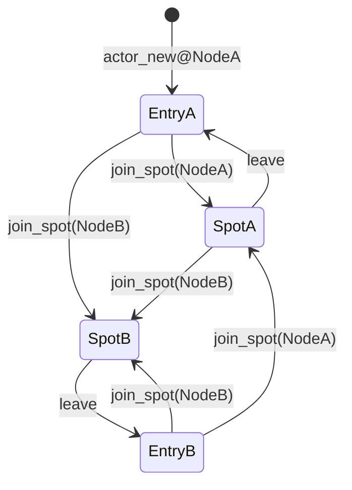

# Actor 위치 생명주기와 Spot join 개정 초안

이 문서는 **구현 전 초안**이며 **현재 공개 계약이 아니다**.
정식 공개 계약은 `core/include/zlink.h`와
`doc/spec/core/service/spot.ko.md`를 기준으로 한다.

이 초안은 Actor 생성, user Spot join, Entry Spot 복귀, session attach,
Discovery active route 갱신 시점을 다시 정의한다. 목표는 Actor의 위치와
session 연결을 분리해서, session이 없어도 Actor를 원하는 SpotNode와 Spot으로
이동할 수 있게 하는 것이다.

## 배경

현재 정식 문서는 Actor가 생성 직후 Entry Spot에 속하고, user Spot으로 join하려면
bound STREAM session이 있어야 한다고 설명한다. 또한 Actor active route는 STREAM
session bind 성공 시점에 공개된다고 설명한다.

이 모델은 session이 Actor 이동의 전제 조건이 되기 때문에 아래 요구와 충돌한다.

- 하나의 session으로 여러 Actor를 제어한다.
- session 없이도 Actor를 만들고 Spot으로 이동시킨다.
- remote Actor 생성 API 대신 Actor를 사용할 SpotNode에서 로컬 Actor를 생성한다.
- join 성공 뒤 session이 나중에 Actor ref를 attach할 수 있어야 한다.

따라서 이 초안은 Actor의 공개 위치를 session bind가 아니라 Spot join 성공 시점에
갱신하도록 바꾼다.

## 설계 원칙

1. Actor 생성, Spot 이동, session attach는 서로 다른 상태 전이다.
2. Actor는 항상 정확히 하나의 Spot에 속한다.
3. Discovery active route는 Actor가 어느 Spot에서 dispatch되는지를 나타낸다.
4. remote Actor 생성 API와 remote Entry Spot join API는 두지 않는다. Actor는 사용할
   SpotNode에서 로컬 생성한다.
5. join 성공 결과는 최종 `zlink_actor_ref_t`를 반환해야 한다.
6. Spot lifecycle callback은 별도 등록 함수로 받으며, Actor 생성과 join/leave 시
   등록한 경우에만 전달한다.

## 용어

- **Actor 생성**: 특정 `SpotNode`의 local Actor table에 Actor slot을 만든다.
- **current Spot**: Actor message를 dispatch할 현재 Spot이다.
- **Entry Spot**: 각 `SpotNode`가 자동으로 가지는 기본 Spot이다.
- **Spot join**: Actor의 current Spot을 지정한 user Spot으로 바꾸는 요청이다.
- **Entry Spot 복귀 대상**: Actor가 user Spot을 떠나면 돌아가는 같은 `SpotNode`의
  Entry Spot이다.
- **session attach**: STREAM session과 Actor ref를 연결해서 session input을
  Actor queue로 보낼 수 있게 하는 매핑이다.
- **active route**: Discovery/Registry에 공개되는 Actor의 현재 위치다.
  Actor route sync 옵션이 꺼져 있거나 Discovery가 연결되지 않은 환경에서는
  Registry 조회에 보이지 않을 수 있다.

## 상태 모델

Actor의 위치 상태는 아래처럼 단순화한다. `NodeA`는 Actor가 처음 생성된 node이고,
`NodeB`는 join으로 이동할 수 있는 다른 node다.



위 그림에서 Entry Spot 사이를 직접 이동하는 전이는 없다. 다른 node의 Entry Spot에
Actor를 두고 싶으면 그 node에서 Actor를 생성하거나, 그 node의 user Spot으로 join한 뒤
leave해서 같은 node의 Entry Spot으로 돌아가게 한다. target node가 다르면 구현은
내부적으로 handoff를 수행하지만, public 계약에서는 모두 user Spot join 요청이다.
`leave`는 항상 Actor가 현재 속한 node의 Entry Spot으로 돌아가는 요청이다.

## 현재 계약에서 바뀌는 부분

### user Spot join의 session 전제 제거

Entry Spot이 아닌 user Spot으로 join할 때 bound STREAM session이 필요하다는 제약을
제거한다.

새 계약:

- Actor는 bound session이 없어도 user Spot으로 join할 수 있다.
- Actor는 bound session이 없어도 다른 SpotNode의 user Spot으로 join할 수 있다.
- session attach 여부는 message relay 경로에만 영향을 준다.
- session attach 여부는 Actor 위치 이동의 유효성 조건이 아니다.

### active route 공개 시점 변경

Actor active route는 STREAM session bind 성공 시점이 아니라 join 성공 시점에
갱신한다.

새 계약:

- Actor 생성만으로는 active route를 공개하지 않는다.
- user Spot에서 explicit leave 성공 시 active route를 같은 node의 Entry Spot 위치로
  갱신한다.
- user Spot join 성공 시 active route를 target user Spot 위치로 갱신한다.
- 위 route 갱신은 join 또는 leave commit 이후 Actor를 소유하는 current `SpotNode`의
  Discovery에서 `ZLINK_OPT_DISCOVERY_ACTOR_ROUTE_SYNC`가 켜져 있고 Registry와
  통신할 수 있을 때 Registry visible 상태가 된다.
- 같은 Spot에 대한 idempotent join도 route가 없거나 stale이면 현재 위치로 갱신한다.
- session attach와 detach는 active route를 만들거나 제거하지 않는다.
- active route가 가리키는 Actor가 destroy되면 route를 제거한다.
- active route가 다른 generation의 Actor를 가리키면 destroy는 그 route를 제거하지
  않는다.

### remote create-or-get 제거

아래 API는 새 계약에서 제거한다.

```c
zlink_request_result_t zlink_spot_node_create_remote_actor(
  void *node,
  const zlink_routing_id_t *target_node_rid,
  const char *actor_id,
  zlink_msg_t *parts,
  size_t part_count,
  zlink_actor_create_result_t *out,
  uint32_t timeout_ms);
```

remote Actor 생성 허용 여부를 다루던 admission handler도 제거 대상이다.

```c
zlink_handler_result_t zlink_spot_node_actor_admission_handler(
  void *node,
  zlink_actor_admission_handler_fn handler,
  void *userdata);
```

원격 배치는 아래 흐름으로 표현한다.

1. caller가 local Actor를 생성한다.
2. 필요하면 `join_spot`으로 원하는 SpotNode의 user Spot에 이동한다.
3. user Spot에서 나오면 `leave`로 같은 node의 Entry Spot으로 돌아간다.
4. join completion에서 반환된 최종 Actor ref를 session attach나 후속 API에 사용한다.

remote Entry Spot으로 직접 이동하는 API는 제공하지 않는다. remote node의 lobby에서
시작해야 하는 Actor는 application이 해당 SpotNode에서 `zlink_spot_node_actor_new()`로
생성한다.

## C API 변경 요약

이 절은 구현자가 `core/include/zlink.h`에서 바꿔야 하는 공개 C API 표면을 한곳에
모은다. 이 문서는 초안이므로 아래 선언은 아직 정식 계약이 아니다.

### 제거 대상 typedef

remote Actor 생성 API를 제거하므로 아래 타입은 함께 제거한다.

```c
typedef enum zlink_actor_create_status_t {
  ZLINK_ACTOR_CREATE_CREATED = 1,
  ZLINK_ACTOR_CREATE_EXISTING = 2
} zlink_actor_create_status_t;

typedef struct zlink_actor_create_result_t {
  zlink_actor_create_status_t status;
  zlink_actor_ref_t actor;
} zlink_actor_create_result_t;

typedef enum zlink_actor_admission_result_t {
  ZLINK_ACTOR_ADMISSION_ACCEPT = 1,
  ZLINK_ACTOR_ADMISSION_REJECT = 2
} zlink_actor_admission_result_t;

typedef zlink_actor_admission_result_t (*zlink_actor_admission_handler_fn)(
  void *node,
  const char *actor_id,
  const zlink_msg_t *parts,
  size_t part_count,
  void *userdata);
```

### 제거 대상 함수

```c
ZLINK_EXPORT zlink_request_result_t zlink_spot_node_create_remote_actor(
  void *node,
  const zlink_routing_id_t *target_node_rid,
  const char *actor_id,
  zlink_msg_t *parts,
  size_t part_count,
  zlink_actor_create_result_t *out,
  uint32_t timeout_ms);

ZLINK_EXPORT zlink_handler_result_t zlink_spot_node_actor_admission_handler(
  void *node,
  zlink_actor_admission_handler_fn handler,
  void *userdata);
```

### 추가 대상 typedef

```c
typedef struct zlink_actor_join_result_t {
  zlink_request_result_t result;
  zlink_actor_ref_t actor;
  zlink_routing_id_t joined_spot_rid;
  uint64_t join_epoch;
  uint32_t flags;
} zlink_actor_join_result_t;

typedef void (*zlink_actor_join_handler_fn)(
  const zlink_actor_join_result_t *result,
  zlink_msg_t *parts,
  size_t part_count,
  void *userdata);

typedef struct zlink_actor_lookup_result_t {
  zlink_request_result_t result;
  zlink_actor_ref_t actor;
  uint32_t flags;
} zlink_actor_lookup_result_t;

typedef void (*zlink_actor_lookup_handler_fn)(
  const zlink_actor_lookup_result_t *result,
  void *userdata);

typedef struct zlink_spot_actor_lifecycle_info_t {
  zlink_actor_ref_t previous_actor;
  zlink_actor_ref_t current_actor;
  zlink_routing_id_t previous_spot_rid;
  zlink_routing_id_t current_spot_rid;
  uint64_t join_epoch;
  uint32_t flags;
} zlink_spot_actor_lifecycle_info_t;

typedef void (*zlink_spot_actor_lifecycle_handler_fn)(
  void *spot,
  const zlink_spot_actor_lifecycle_info_t *info,
  void *userdata);
```

zero-value ref는 `node_rid.size == 0`, `actor_id[0] == '\0'`,
`generation == 0`인 `zlink_actor_ref_t` 값이다. lifecycle callback에서 이전 또는
이후 Actor가 없음을 나타낼 때만 사용한다.

`zlink_actor_join_result_t` 필드 의미:

| 필드 | 의미 |
|------|------|
| `result` | join operation의 최종 결과다. 성공이면 Actor 위치가 commit된 상태다 |
| `actor` | 성공 시 최종 Actor ref다. remote join이면 target node의 ref다 |
| `joined_spot_rid` | 성공 시 Actor가 속한 current Spot rid다 |
| `join_epoch` | Actor 위치 변경 순서를 구분하는 epoch다 |
| `flags` | 현재는 예약 필드다. 구현 전까지 공개 bit를 추가하지 않는다 |

성공 시 Actor가 속한 current node rid는 `actor.node_rid`를 기준으로 읽는다.
`zlink_actor_join_result_t`는 같은 node 정보를 별도 필드로 중복 저장하지 않는다.

`zlink_spot_actor_lifecycle_info_t` 필드 의미:

| 필드 | 의미 |
|------|------|
| `previous_actor` | 이동 전 Actor ref다. Actor 생성이면 zero-value ref다 |
| `current_actor` | 이동 후 Actor ref다. remote join이면 target node의 ref다 |
| `previous_spot_rid` | 이동 전 Spot rid다 |
| `current_spot_rid` | 이동 후 Spot rid다 |
| `join_epoch` | 이 위치 변경의 epoch다 |
| `flags` | 현재는 예약 필드다. 구현 전까지 공개 bit를 추가하지 않는다 |

이동 전 node rid는 `previous_actor.node_rid`를 기준으로 읽고, 이동 후 node rid는
`current_actor.node_rid`를 기준으로 읽는다. lifecycle info 구조체는 같은 정보를
중복 저장하지 않는다.

`join_epoch` 의미:

- `zlink_actor_join_info_t.join_epoch`는 pending join request를 식별하기 위한 기존
  request token이다. `zlink_spot_actor_join_reply()`는 이 값을 사용해서 오래된 reply를
  걸러낸다.
- 이 초안에서 새로 추가하는 `zlink_actor_join_result_t.join_epoch`와
  `zlink_spot_actor_lifecycle_info_t.join_epoch`는 commit된 위치 변경을 구분하기 위한
  진단값이다. pending request token과 같은 값이라고 가정하지 않는다.
- commit epoch는 해당 Actor slot을 소유하는 SpotNode 안에서 0이 아닌 값으로 증가한다.
- join completion의 `join_epoch`는 성공 시 `result->actor`가 가리키는 최종 Actor slot의
  commit epoch다.
- lifecycle `on_join`의 `join_epoch`는 `current_actor`가 가리키는 Actor slot의 commit
  epoch다.
- lifecycle `on_leave`의 `join_epoch`는 `previous_actor`가 가리키는 Actor slot의 commit
  epoch다.
- remote join에서는 source `on_leave`, target `on_join`, join completion이 서로 다른
  SpotNode의 epoch 값을 가질 수 있다.
- 서로 다른 Actor 또는 서로 다른 SpotNode 사이의 epoch 값은 비교하지 않는다.
- timeout, reject, validation 실패처럼 위치가 바뀌지 않은 작업은 epoch를 증가시키지
  않는다.

### 변경 없는 dispatch enum

이 초안은 `zlink_spot_dispatch_event_t`에 새 값을 추가하지 않는다.
join 가능 여부를 묻는 admission event는 기존
`ZLINK_SPOT_DISPATCH_EVENT_ACTOR_JOIN_READABLE`을 계속 사용한다.

```c
typedef enum zlink_spot_dispatch_event_t {
  ZLINK_SPOT_DISPATCH_EVENT_SUBSCRIBE_READABLE     = 1,
  ZLINK_SPOT_DISPATCH_EVENT_ROUTED_READABLE        = 2,
  ZLINK_SPOT_DISPATCH_EVENT_TIMER_READABLE         = 3,
  ZLINK_SPOT_DISPATCH_EVENT_CHANNEL_REPLY_READABLE = 4,
  ZLINK_SPOT_DISPATCH_EVENT_ACTOR_READABLE         = 5,
  ZLINK_SPOT_DISPATCH_EVENT_ACTOR_JOIN_READABLE    = 6
} zlink_spot_dispatch_event_t;
```

event별 `subject` 타입:

| event | `subject` 타입 | 소비 API |
|-------|----------------|----------|
| `ACTOR_READABLE` | `const zlink_actor_ref_t *` | `zlink_spot_node_actor_recv_part()` |
| `ACTOR_JOIN_READABLE` | target `spot` handle | `zlink_spot_actor_join_recv()` |

### 변경 없는 enum과 flag

이 초안은 아래 enum과 flag에 새 값을 추가하지 않는다.

- `zlink_request_result_t`
- `zlink_submit_result_t`
- `zlink_recv_result_t`
- `zlink_config_result_t`
- `zlink_send_flags_t`
- `zlink_recv_flags_t`
- `zlink_spot_dispatch_event_t`
- `ZLINK_ACTOR_JOIN_INFO_REMOTE`

join 실패 원인은 기존 request result의 rejected, timed-out, not-found, conflict,
busy, invalid-state 계열 값을 사용한다. 새 오류 enum 값을 추가하지 않는다.

`zlink_actor_join_result_t.flags`와 `zlink_spot_actor_lifecycle_info_t.flags`는 예약 필드다.
첫 구현에서는 0으로 채운다. 새 public bit가 필요하면 별도 초안에서 이름, 값, 하위
호환 의미를 정의한 뒤 추가한다.

`zlink_actor_lookup_result_t` 필드 의미:

| 필드 | 의미 |
|------|------|
| `result` | lookup operation의 최종 결과다. 성공이면 checked Actor ref가 확인된 상태다 |
| `actor` | 성공 시 target node에 존재하는 Actor ref다 |
| `flags` | 현재는 예약 필드다. 구현 전까지 공개 bit를 추가하지 않는다 |

### 변경 대상 함수

아래 함수는 기존 공개 signature 또는 반환 의미가 바뀐다. 모두 C ABI breaking
change다.

| 함수 | 변경 요약 |
|------|-----------|
| `zlink_spot_node_actor_join_spot()` | join 전용 completion 타입을 사용한다 |
| `zlink_remote_actor_get_ref()` | unchecked ref 생성 helper에서 async checked lookup으로 바꾼다 |
| `zlink_spot_node_actor_leave_spot()` | 동기 request API에서 async submit API로 바꾼다 |
| `zlink_spot_node_actor_destroy()` | 동기 request API에서 async submit API로 바꾼다 |
| `zlink_stream_bind_actor()` | `node` 인자를 제거하고 async submit API로 바꾼다 |
| `zlink_stream_unbind_actor()` | `node` 인자를 제거하고 async submit API로 바꾼다 |
| `zlink_stream_send_bound_actor_part()` | `node` 인자를 제거하고 stream owner를 사용한다 |

`zlink_spot_node_actor_send_bound_session_msg()`는 ABI를 유지하지만 구현 계약을
명확히 한다. 이 함수는 Actor에서 bound session으로 보내는 fire-and-forget relay이며,
내부 queue나 runtime lock을 즉시 확보할 수 없으면 호출 thread를 기다리게 하지 않고
submit 실패로 돌려보내야 한다.

`zlink_spot_node_actor_join_spot()`은 handler 타입을 바꾼다.

```c
ZLINK_EXPORT zlink_submit_result_t zlink_spot_node_actor_join_spot(
  void *node,
  const zlink_actor_ref_t *actor,
  const zlink_routing_id_t *dest_node_rid,
  const zlink_routing_id_t *dest_spot_rid,
  zlink_msg_t *parts,
  size_t part_count,
  zlink_actor_join_handler_fn handler,
  void *userdata,
  zlink_send_flags_t flags,
  uint32_t timeout_ms);
```

기존 `zlink_reply_handler_fn` 기반 시그니처와 ABI가 다르다. 이 초안은 기존
`zlink_spot_node_actor_join_spot()` 시그니처를 breaking change로 바꾸는 쪽을 선택한다.
join 성공 뒤 최종 Actor ref를 반드시 돌려줘야 하므로, 기존 completion 타입을 유지하지
않는다.

이 변경은 C ABI와 모든 binding 표면을 깨뜨린다. 구현 작업은 아래 항목을 같은 변경
세트에서 닫아야 한다.

- `core/include/zlink.h` 선언 변경
- C binding sample과 perf/sample build 수정
- C++, .NET, Go, Java, Node, Python, Rust binding의 native signature 갱신
- 각 binding의 join completion wrapper에서 최종 Actor ref 노출
- 각 binding의 remote Actor lookup wrapper에서 checked Actor ref 노출
- 각 binding의 leave/destroy wrapper를 blocking 호출이 아니라 completion 또는 언어별
  future/promise/task 형태로 갱신
- 각 binding의 stream Actor bind/unbind wrapper를 blocking 호출이 아니라 completion 또는
  언어별 future/promise/task 형태로 갱신
- 기존 `zlink_reply_handler_fn` 기반 join callback 테스트 제거 또는 갱신

### async 변경 정책

remote node의 결과가 필요한 API는 호출 thread에서 결과를 기다리지 않는다. 함수는
submit 성공 여부만 즉시 반환하고, 최종 결과는 callback으로 전달한다. 이 규칙은 local
대상에도 똑같이 적용한다. 같은 API가 local일 때는 동기로 끝나고 remote일 때만
비동기가 되면 caller가 위치에 따라 다른 제어 흐름을 가져야 하기 때문이다.

이 초안에서 아래 API는 nonblocking submit API로 정의한다.

| API | 즉시 반환값 | 최종 결과 전달 |
|-----|-------------|----------------|
| `zlink_spot_node_actor_join_spot()` | `zlink_submit_result_t` | `zlink_actor_join_handler_fn` |
| `zlink_remote_actor_get_ref()` | `zlink_submit_result_t` | `zlink_actor_lookup_handler_fn` |
| `zlink_spot_node_actor_leave_spot()` | `zlink_submit_result_t` | `zlink_reply_handler_fn` |
| `zlink_spot_node_actor_destroy()` | `zlink_submit_result_t` | `zlink_reply_handler_fn` |
| `zlink_stream_bind_actor()` | `zlink_submit_result_t` | `zlink_reply_handler_fn` |
| `zlink_stream_unbind_actor()` | `zlink_submit_result_t` | `zlink_reply_handler_fn` |

submit 단계에서는 인자 검증, handle 검증, 요청 enqueue만 수행한다. remote node 응답,
Spot admission, Actor owner 확인, attach/detach commit처럼 시간이 걸릴 수 있는 결과는
completion으로만 전달한다. submit 단계에서 실패한 요청은 completion을 호출하지 않는다.

`zlink_stream_send_bound_actor_part()`와 `zlink_spot_node_actor_send_bound_session_msg()`는
fire-and-forget relay API이므로 completion을 추가하지 않는다. 다만 이 둘도 submit API인
이상 호출 thread를 무기한 blocking하면 안 된다. 내부 queue나 runtime lock을 즉시 확보할
수 없으면 `ZLINK_SUBMIT_BACKPRESSURED` 같은 submit 결과로 실패해야 한다.

`zlink_remote_actor_get_ref()`는 unchecked ref 생성 helper가 아니라 remote Actor
lookup API로 의미를 바꾼다. remote lookup은 네트워크 요청이므로 request owner
`SpotNode`와 timeout을 인자로 받아야 한다.

```c
ZLINK_EXPORT zlink_submit_result_t zlink_remote_actor_get_ref(
  void *node,
  const zlink_routing_id_t *target_node_rid,
  const char *actor_id,
  zlink_actor_lookup_handler_fn handler,
  void *userdata,
  uint32_t timeout_ms);
```

변경점:

- `node`는 lookup request를 제출하는 request owner `SpotNode`다.
- target node에 해당 Actor가 있으면 checked ref를 completion의 `result->actor`에
  반환한다.
- target node에 해당 Actor가 없으면 not-found 계열 completion으로 실패한다.
- lookup 대상은 commit된 live Actor뿐이다. remote join 준비 중인 pending target Actor는
  lookup 결과로 노출하지 않는다.
- target node와 연결되어 있지 않으면 not-connected 계열 completion으로 실패한다. 여기서
  연결은 STREAM session attach가 아니라 SpotNode 사이의 control path를 뜻한다.
- `target_node_rid`가 request owner node 자신이면 local lookup과 같은 의미로 처리할 수
  있다.
- `handler == NULL`이면 invalid argument 계열 submit 실패다.
- `timeout_ms > 0`이면 submit 뒤 completion까지의 operation timeout이다.
  `timeout_ms == 0`이면 timeout을 설치하지 않는다.
- `result` pointer는 callback 호출 중에만 유효하다. application이 Actor ref를 나중에
  사용해야 하면 callback 안에서 `result->actor` 값을 복사한다.
- 이 함수는 Actor를 생성하지 않고, Actor 위치를 바꾸지 않고, active route를
  갱신하지 않는다.
- 성공 completion으로 반환된 checked ref는 이후 join, session attach, destroy 같은 ref 기반
  API에 사용할 수 있다.

`zlink_remote_actor_get_ref()`와 `zlink_discovery_resolve_actor()`는 목적이 다르다.
`zlink_remote_actor_get_ref()`는 caller가 target node rid와 actor id를 이미 알고 있을 때
해당 node에 직접 물어 checked ref를 얻는 API다. `zlink_discovery_resolve_actor()`는
Registry에 공개된 active route를 조회해 현재 공개 위치를 얻는 API다.

### timeout 정책

Actor 위치와 attach 관련 API는 `timeout_ms`를 아래처럼 해석한다.

| API | `timeout_ms == 0` | timeout 대상 |
|-----|-------------------|--------------|
| `zlink_spot_node_actor_join_spot()` | operation timeout 없음 | join request accept/reject, remote handoff, route 갱신 |
| `zlink_remote_actor_get_ref()` | operation timeout 없음 | remote Actor lookup completion |
| `zlink_spot_node_actor_leave_spot()` | operation timeout 없음 | Entry Spot 복귀와 route 갱신 |
| `zlink_spot_node_actor_destroy()` | operation timeout 없음 | Actor 제거, session detach, route cleanup |
| `zlink_stream_bind_actor()` | operation timeout 없음 | remote attach completion |
| `zlink_stream_unbind_actor()` | operation timeout 없음 | remote detach completion |

Actor 위치/attach API에서 `timeout_ms == 0`은 timeout을 설치하지 않는다는 뜻이다.
`timeout_ms`는 runtime mutex 획득 대기 시간이 아니라 submit 뒤 completion까지의 작업
timeout이다. submit 단계의 즉시 실패 여부는 각 API의 인자 검증과 기존 submit 규칙을
따른다.

timeout이 없는 작업도 영원히 성공을 보장하지 않는다. 대상 SpotNode와의 control path가
끊기거나, request owner가 닫히거나, target Spot/Actor가 제거되어 더 이상 완료할 수 없게
되면 not-connected, terminated, not-found, conflict 같은 기존 request result로
completion을 호출한다.

### 추가 대상 함수

```c
ZLINK_EXPORT zlink_handler_result_t zlink_spot_actor_lifecycle_handler(
  void *spot,
  zlink_spot_actor_lifecycle_handler_fn on_join,
  zlink_spot_actor_lifecycle_handler_fn on_leave,
  void *userdata);

ZLINK_EXPORT zlink_config_result_t zlink_stream_bound_actors(
  void *stream,
  const zlink_routing_id_t *session_rid,
  zlink_actor_ref_t *entries,
  size_t *count);
```

`zlink_spot_actor_lifecycle_handler()`는 특정 Spot의 Actor 위치 변경 callback을
등록한다. `on_join`은 Actor가 해당 Spot에 join된 뒤 호출되고, `on_leave`는 Actor가
해당 Spot을 떠난 뒤 호출된다. Entry Spot과 일반 Spot 모두 이 함수를 사용할 수 있다.
`on_join == NULL`이면 join callback을 받지 않고, `on_leave == NULL`이면 leave
callback을 받지 않는다. 둘 다 `NULL`이면 기존 lifecycle handler 등록을 제거한다.
새 handler 등록은 replace 동작이다. 이미 등록된 handler가 있으면 새 `on_join`,
`on_leave`, `userdata`로 교체한다.
handler 등록은 현재 Spot에 이미 속한 Actor를 replay하지 않는다. 등록 뒤에 발생한
생성, join, leave, destroy 전이만 callback 대상이다.
`spot == NULL`이면 invalid handle 계열 실패다. 같은 Spot의 lifecycle callback 안에서
이 함수를 재진입 호출하면 deadlock 방지를 위해 invalid-state 또는 deadlock 계열로
실패한다.

`zlink_stream_bound_actors()`는 특정 STREAM session에 attach된 Actor ref 목록을
반환한다. 일반 snapshot API와 같은 2-pass 규칙을 따른다. `entries == NULL`이면 필요한
개수를 `*count`에 반환하고, `entries != NULL`이면 최대 `*count`개를 채운 뒤 실제로 채운
개수를 `*count`에 반환한다. session mapping이 없으면 성공하면서 `*count == 0`이다.
이 함수는 `stream`의 local session mapping만 읽고, remote Actor owner에 존재 확인 요청을
보내지 않는다.

### 유지 대상 함수

아래 함수는 이름과 기본 역할을 유지한다.

```c
ZLINK_EXPORT zlink_config_result_t zlink_spot_node_actor_new(
  void *node,
  const char *actor_id,
  zlink_actor_ref_t *actor_out);

ZLINK_EXPORT zlink_config_result_t zlink_spot_node_actor_lookup(
  void *node,
  const char *actor_id,
  zlink_actor_ref_t *out);

ZLINK_EXPORT zlink_recv_result_t zlink_spot_actor_join_recv(
  void *spot,
  zlink_actor_join_info_t *info_out,
  zlink_msg_t **parts_out,
  size_t *part_count_out,
  zlink_recv_flags_t flags);

ZLINK_EXPORT zlink_submit_result_t zlink_spot_actor_join_reply(
  void *spot,
  const zlink_actor_join_info_t *info,
  uint32_t accepted,
  zlink_msg_t *parts,
  size_t part_count);

ZLINK_EXPORT zlink_submit_result_t zlink_spot_node_actor_leave_spot(
  void *node,
  const zlink_actor_ref_t *actor,
  const zlink_routing_id_t *current_spot_rid,
  zlink_reply_handler_fn handler,
  void *userdata,
  uint32_t timeout_ms);

ZLINK_EXPORT zlink_submit_result_t zlink_spot_node_actor_destroy(
  void *node,
  const zlink_actor_ref_t *actor,
  zlink_reply_handler_fn handler,
  void *userdata,
  uint32_t timeout_ms);

ZLINK_EXPORT zlink_submit_result_t zlink_stream_bind_actor(
  void *stream,
  const zlink_routing_id_t *session_rid,
  const zlink_actor_ref_t *actor,
  zlink_reply_handler_fn handler,
  void *userdata,
  uint32_t timeout_ms);

ZLINK_EXPORT zlink_submit_result_t zlink_stream_unbind_actor(
  void *stream,
  const zlink_routing_id_t *session_rid,
  const char *actor_id,
  zlink_reply_handler_fn handler,
  void *userdata,
  uint32_t timeout_ms);

ZLINK_EXPORT zlink_submit_result_t zlink_stream_send_bound_actor_part(
  void *stream,
  const zlink_routing_id_t *session_rid,
  const char *actor_id,
  zlink_msg_t *part,
  zlink_send_flags_t flags,
  zlink_part_flag_t part_flag);

ZLINK_EXPORT zlink_submit_result_t zlink_spot_node_actor_send_bound_session_msg(
  void *node,
  const zlink_actor_ref_t *actor,
  zlink_msg_t *message,
  zlink_send_flags_t flags);
```

유지 대상이지만 의미가 바뀌는 부분:

- `zlink_spot_node_actor_new()`는 Actor를 만들지만 active route를 공개하지 않는다.
- `zlink_spot_actor_join_recv()`와 `zlink_spot_actor_join_reply()`는 일반 Spot join
  admission에 사용한다.
- `zlink_spot_node_actor_leave_spot()`은 명시적 leave API로 남는다. user Spot에서
  Entry Spot으로 실제 위치가 바뀐 leave 성공은 source Spot `on_leave`와 Entry Spot
  `on_join` callback을 발생시킨다. local Actor와 remote Actor 모두 같은 submit +
  completion 경로를 사용한다.
- `zlink_spot_node_actor_destroy()`는 Actor가 Entry Spot에 있을 때만 성공한다.
  destroy 성공은 Entry Spot `on_leave` callback을 발생시킨다. local Actor와 remote
  Actor 모두 같은 submit + completion 경로를 사용한다.
- `zlink_stream_bind_actor()`는 active route를 만들거나 갱신하지 않는다.
- `zlink_stream_unbind_actor()`는 active route를 제거하지 않는다.
- `zlink_stream_bound_actors()`는 session Actor mapping을 조회하는 새 API다. 기존
  `zlink_spot_node_actors_snapshot()`과 `zlink_spot_actors_snapshot()`은 Actor 위치 기준
  snapshot이므로 session별 mapping 조회를 대신하지 않는다.
- `zlink_spot_node_actor_send_bound_session_msg()`는 completion 없는 fire-and-forget
  relay API로 유지한다. 구현은 내부 lock이나 queue가 즉시 준비되지 않았을 때 호출
  thread를 기다리게 하지 않고 submit 실패로 돌려보내야 한다.

### join completion 타입

기존 `zlink_reply_handler_fn`은 reply message는 전달할 수 있지만, remote join 뒤
최종 Actor ref를 함께 전달하기 어렵다. join 계열 API는 전용 completion 타입을
사용한다. 선언은 [C API 변경 요약](#c-api-변경-요약)의 추가 대상 typedef를 기준으로
한다.

`result->actor`는 join 작업이 성공했을 때의 최종 Actor ref다. remote join에서는
source node의 ref가 아니라 target node에서 활성화된 Actor ref를 반환한다.

실패 시 `result->actor`와 `joined_spot_rid`는 사용하지 않는다. 실패 원인은
`result->result`로 판단한다.

`result` pointer는 callback 호출 중에만 유효하다. application이 최종 Actor ref나
join epoch를 나중에 사용해야 하면 callback 안에서 필요한 값을 복사한다.

join 성공 뒤 caller가 최종 Actor ref를 받아야 session attach나 후속 위치 이동을
정확히 수행할 수 있으므로, join 계열 API에서 `handler == NULL`은 invalid argument
계열 실패로 처리한다.

### user Spot join

```c
zlink_submit_result_t zlink_spot_node_actor_join_spot(
  void *node,
  const zlink_actor_ref_t *actor,
  const zlink_routing_id_t *dest_node_rid,
  const zlink_routing_id_t *dest_spot_rid,
  zlink_msg_t *parts,
  size_t part_count,
  zlink_actor_join_handler_fn handler,
  void *userdata,
  zlink_send_flags_t flags,
  uint32_t timeout_ms);
```

변경점:

- `handler` 타입을 `zlink_actor_join_handler_fn`으로 바꾼다.
- 성공 completion은 최종 Actor ref와 joined Spot rid를 포함한다.
- bound session이 없어도 submit할 수 있다.
- `dest_spot_rid`는 target node의 user Spot이어야 한다. Entry Spot은 이 API의 target이
  아니다.
- target Spot의 join handler가 accept하면 Actor 위치가 바뀐다.
- accept commit 뒤 active route를 갱신한다.
- target Spot에 dispatch handler가 없으면 user Spot join request는 자동 accept되지
  않는다. `timeout_ms > 0`이면 timeout까지 pending 상태로 남고, `timeout_ms == 0`이면
  handler가 등록되어 처리하거나 Spot/SpotNode가 종료될 때까지 pending 상태로 남는다.

## join request/reply 의미

`zlink_spot_actor_join_recv()`와 `zlink_spot_actor_join_reply()`는 user Spot join에서
target Spot이 join 가능 여부를 판단할 때 사용한다. Entry Spot은 Actor 생성과
leave의 lobby이며, 별도 join request/reply admission 대상이 아니다.

```c
zlink_recv_result_t zlink_spot_actor_join_recv(
  void *spot,
  zlink_actor_join_info_t *info_out,
  zlink_msg_t **parts_out,
  size_t *part_count_out,
  zlink_recv_flags_t flags);

zlink_submit_result_t zlink_spot_actor_join_reply(
  void *spot,
  const zlink_actor_join_info_t *info,
  uint32_t accepted,
  zlink_msg_t *parts,
  size_t part_count);
```

계약:

- join request는 target Spot의 dispatch context에서 처리한다.
- `accepted == 1`이면 target Spot으로 commit한다.
- `accepted == 0`이면 Actor 위치는 바뀌지 않는다.
- reply payload는 join completion handler에 전달한다.
- Actor가 이미 target Spot에 있으면 join request는 idempotent success로 완료한다.
  이 경우 admission request를 전달하지 않고 lifecycle callback도 호출하지 않는다.
- remote join이면 target node는 accept 시점에 target Actor slot을 준비하고
  최종 Actor ref를 만든다.
- remote join에서 target node에 같은 actor id의 live Actor가 이미 있으면 source
  Actor를 target node로 이동해 새 current Actor를 만들 수 없으므로 conflict 계열
  실패다.
- remote join에서 checked ref의 generation이 target node의 existing Actor와 충돌하면
  stale 또는 conflict 계열 실패다.
- accept 뒤 source Actor는 더 이상 active route의 대상이 아니다.
- reject나 timeout 뒤 source Actor는 기존 Spot에 남는다.

## lifecycle callback

Actor의 실제 위치 변경이 완료된 뒤 Spot lifecycle callback을 호출한다. callback
타입과 등록 함수는 [C API 변경 요약](#c-api-변경-요약)의 추가 대상 typedef와
추가 대상 함수를 기준으로 한다.

`on_join`:

- target Spot에서 발생한다.
- Entry Spot과 일반 Spot 모두 받을 수 있다.
- Actor 생성 직후 Entry Spot에 속하는 초기 배치에서도 호출한다.
- Actor가 join operation으로 해당 Spot에 들어온 경우에도 호출한다.
- 명시적 leave API가 Actor를 user Spot에서 Entry Spot으로 이동시킨 경우에도 Entry
  Spot에서 호출한다.
- Actor 생성으로 호출되는 `on_join`은 admission을 거치지 않는다. 생성 성공 뒤
  Entry Spot lifecycle callback으로만 전달한다.
- Actor 생성으로 호출되는 `on_join`에서 `previous_actor`는 zero-value ref이고
  `current_actor`는 생성된 Actor ref다.
- Actor 생성으로 호출되는 `on_join`에서 `previous_spot_rid.size == 0`이다.
  `previous_actor` zero-value와 함께 "이전 위치 없음"을 뜻한다.
- Actor 생성으로 호출되는 `on_join`은 Actor slot이 lookup 가능한 상태가 된 뒤
  scheduling한다. callback이 `zlink_spot_node_actor_new()` 반환 전에 실행되는지는
  공개 계약으로 보장하지 않는다.
- join operation으로 호출되는 `on_join`에서 `previous_actor`는 source Actor ref이고
  `current_actor`는 target Actor ref다. local join에서는 두 ref가 같고, remote
  join에서는 다를 수 있다.
- 명시적 leave 성공으로 Entry Spot에서 호출되는 `on_join`에서 `previous_actor`와
  `current_actor`는 같은 Actor ref다. `previous_spot_rid`는 user Spot이고
  `current_spot_rid`는 같은 node의 Entry Spot이다.
- `info`는 callback lifetime 동안만 유효하므로 필요한 값은 callback 안에서 복사한다.
- join operation으로 호출되는 `on_join`은 join accept가 commit되고 active route
  갱신이 끝난 뒤 발생한다.
- Actor 생성으로 호출되는 `on_join`은 active route 공개를 의미하지 않는다.

`on_leave`:

- source Spot에서 발생한다.
- Entry Spot과 일반 Spot 모두 받을 수 있다.
- `previous_actor`는 source Actor ref이고 `current_actor`는 target Actor ref다.
  local join에서는 두 ref가 같고, remote join에서는 다를 수 있다.
- 명시적 leave 성공으로 source Spot에서 호출되는 `on_leave`에서 `previous_actor`와
  `current_actor`는 같은 Actor ref다. `previous_spot_rid`는 user Spot이고
  `current_spot_rid`는 같은 node의 Entry Spot이다.
- Actor destroy 성공으로 호출되는 `on_leave`에서 `previous_actor`는 제거되는 Actor
  ref이고 `current_actor`는 zero-value ref다.
- Actor destroy 성공으로 호출되는 `on_leave`에서 `current_spot_rid.size == 0`이다.
  `current_actor` zero-value와 함께 "이후 위치 없음"을 뜻한다.
- `info`는 callback lifetime 동안만 유효하므로 필요한 값은 callback 안에서 복사한다.
- 다른 Spot으로 join이 commit된 뒤 발생한다.
- 명시적 leave API가 Actor를 user Spot에서 Entry Spot으로 이동시키는 경우에도 source
  Spot에 발생한다.
- Actor destroy 성공으로 Actor가 current Spot에서 제거될 때도 발생한다.

전달 규칙:

- lifecycle callback은 선택 사항이다.
- 해당 Spot에 lifecycle handler가 등록된 경우에만 호출한다.
- handler가 없을 때 발생한 생성, join, leave, destroy callback은 나중에 재전달하지
  않는다.
- lifecycle callback은 Actor queue payload가 아니므로
  `zlink_spot_node_actor_recv_part()`로 읽지 않는다.
- callback은 해당 Spot의 dispatch worker context에서 호출한다. 같은 Spot의
  dispatch callback과 lifecycle callback은 동시에 실행되지 않는다.
- 서로 다른 Spot의 lifecycle callback 사이에는 실행 순서 보장이 없다. 하나의 join
  operation에서 source `on_leave`와 target `on_join`은 모두 commit 뒤 scheduling되지만,
  두 callback이 실제로 어느 순서로 실행되는지는 공개 계약으로 보장하지 않는다.
- join completion handler는 state commit과 active route 갱신이 끝난 뒤 호출된다.
  lifecycle callback이 이미 실행되었는지는 보장하지 않는다.
- lifecycle callback은 관측용 callback이다. application state machine이 join 완료나
  session attach 순서를 결정할 때는 join completion handler와 반환된 final Actor ref를
  기준으로 삼아야 한다.
- lifecycle callback 안에서 같은 Actor에 대해 join, leave, destroy를 재진입 호출하는
  것은 지원하지 않는다. 필요한 작업은 application queue로 넘긴 뒤 callback 밖에서
  실행한다.

## session attach 계약

session attach는 Actor 위치와 독립이다.

```c
zlink_submit_result_t zlink_stream_bind_actor(
  void *stream,
  const zlink_routing_id_t *session_rid,
  const zlink_actor_ref_t *actor,
  zlink_reply_handler_fn handler,
  void *userdata,
  uint32_t timeout_ms);

zlink_submit_result_t zlink_stream_unbind_actor(
  void *stream,
  const zlink_routing_id_t *session_rid,
  const char *actor_id,
  zlink_reply_handler_fn handler,
  void *userdata,
  uint32_t timeout_ms);
```

계약:

- bind와 unbind는 nonblocking submit API다. remote Actor owner의 응답이 필요해도 호출
  thread를 blocking하지 않는다.
- 최종 결과는 `zlink_reply_handler_fn` completion으로 전달한다. completion payload는
  없으므로 `parts == NULL`, `part_count == 0`이다.
- `handler == NULL`이면 invalid argument 계열 submit 실패다. submit 단계에서 실패한
  작업은 completion을 호출하지 않는다.
- local Actor bind/unbind도 같은 completion 경로를 사용한다. 성공 결과를 함수 반환값으로
  직접 돌려주지 않는다.
- `timeout_ms > 0`이면 submit 뒤 completion까지의 operation timeout이다.
  `timeout_ms == 0`이면 timeout을 설치하지 않는다.
- `stream`은 STREAM session Actor mapping을 소유한다. `stream`은 생성 또는 attach 시점에
  session owner `SpotNode`와 연결되어 있어야 하며, remote Actor owner와의 control path와
  relay는 이 owner `SpotNode`가 수행한다.
- bind 대상 Actor의 owner node는 `actor->node_rid`로 찾는다.
- `stream` 하나만으로는 client session을 식별하지 않는다. 하나의 raw STREAM socket은
  여러 client session을 multiplex할 수 있으므로, `session_rid`가 있어야 특정 client
  session을 고를 수 있다.
- `stream`, `session_rid` 조합이 하나의 STREAM session binding key다.
- Actor가 remote node에 있으면 stream owner `SpotNode`가 `actor->node_rid`의 `SpotNode`로
  bind 정보를 전달한다. 이후 session-bound relay도 stream owner `SpotNode`를 통해 remote
  Actor owner로 전달된다.
- unbind는 `stream`, `session_rid`, `actor_id`로 session mapping을 찾고, 그 mapping에
  저장된 Actor ref를 기준으로 Actor owner에 detach를 전달한다.
- `zlink_stream_send_bound_actor_part()`도 별도 `SpotNode` 인자를 받지 않는다. `stream`과
  `session_rid`로 session mapping을 찾고, `actor_id`에 저장된 Actor ref의 owner로 message
  part를 relay한다.
- `zlink_spot_node_actor_send_bound_session_msg()`는 Actor가 attach된 session으로 message를
  돌려보내는 반대 방향 relay다. request owner `node`는 호출을 제출하는 SpotNode이고,
  실제 session mapping은 `actor->node_rid`가 가리키는 Actor owner에서 확인한다. Actor가
  remote node에 있으면 request owner는 Actor owner로 relay request를 전달하고, Actor
  owner는 저장된 bound session ref를 기준으로 stream owner에 message를 전달한다.
- session에 attach된 Actor 목록을 확인하려면 `zlink_stream_bound_actors()`를
  사용한다.
- session Actor snapshot은 local session mapping에 저장된 Actor ref를 반환한다. remote
  Actor owner와 통신하지 않으므로, 반환된 ref가 이미 stale일 수 있다. caller가 현재
  존재 여부까지 확인해야 하면 ref 기반 API나 remote lookup을 별도로 호출한다.
- 하나의 session은 여러 Actor ref를 attach할 수 있다.
- 같은 session에 같은 Actor ref를 다시 attach하면 idempotent success다.
- 같은 session에 같은 actor id로 다른 generation을 attach하면 해당 actor id 항목을
  새 Actor ref로 교체한다.
- 같은 session에서 actor id 항목을 새 Actor ref로 교체하면 이전 Actor의 bound
  session ref도 함께 제거한다. 이전 Actor가 이미 사라졌으면 session Actor list만
  새 ref로 교체한다.
- session attach 성공은 active route를 갱신하지 않는다.
- session detach 성공은 active route를 제거하지 않는다.
- Actor가 같은 owner node 안에서 Spot만 바뀌면 Actor ref는 유지되므로 기존 session
  mapping도 유지된다.
- remote join 성공으로 Actor ref가 바뀌어도 session mapping을 자동으로 compare-and-swap
  하지 않는다. application은 join completion의 최종 Actor ref를 사용해 필요한
  session attach나 reattach를 수행한다.
- Discovery active route를 resolve해서 보내는 route-based relay는 route 갱신 뒤
  target Actor를 향한다.
- STREAM session-bound relay는 session Actor list를 기준으로 동작한다. remote join
  뒤 application이 reattach하기 전까지 기존 session mapping은 자동으로 target Actor를
  가리키지 않는다.
- remote join 뒤 기존 session mapping이 retired source Actor ref를 가리키는 상태에서
  session-bound send를 수행하면 target Actor로 우회하지 않고 stale 또는 not-found
  계열 실패로 끝난다.
- `zlink_stream_send_bound_actor_part()`와 `zlink_spot_node_actor_send_bound_session_msg()`가
  `ZLINK_SUBMIT_OK`를 반환하면 message 소유권은 라이브러리로 이전된다.
- 이 두 Actor relay API가 submit 실패를 반환하면 message 소유권은 caller에게 남는다.
  이 경우 implementation은 `part` 또는 `message`를 close하거나 reinit하지 않는다.
- 내부 queue나 runtime lock을 즉시 확보하지 못해 backpressured 계열로 실패한 경우도
  submit 실패이므로 message 소유권은 caller에게 남는다.

이 초안은 Actor당 단일 session 제약을 유지한다. 하나의 session은 여러 Actor를
attach할 수 있지만, 하나의 Actor가 동시에 여러 session에 attach되는 것은 허용하지
않는다. 이미 다른 session에 attach된 Actor를 새 session에 attach하려면 기존 attach를
먼저 해제해야 한다.

## Discovery active route

`zlink_actor_route_t`는 Actor의 현재 dispatch 위치를 나타낸다.
이 route는 `ZLINK_OPT_DISCOVERY_ACTOR_ROUTE_SYNC`가 켜진 Discovery와 Registry가
있을 때 외부 조회 결과로 관측된다. 옵션이 꺼져 있으면 local Actor 위치는 바뀌어도
`zlink_discovery_resolve_actor()`가 실패할 수 있다.

```c
typedef struct zlink_actor_route_t {
  zlink_actor_ref_t actor;
  uint32_t joined;
  zlink_routing_id_t joined_spot_rid;
} zlink_actor_route_t;
```

새 의미:

- `actor`는 active route가 가리키는 최종 Actor ref다.
- `joined != 0`이면 `joined_spot_rid`가 Actor의 current Spot이다.
- 정상 live Actor가 route에 공개되어 있다면 `joined != 0`이어야 한다.
- route는 join commit 뒤 공개된다.
- route는 session bind 여부를 나타내지 않는다.

route 갱신 시점:

| 이벤트 | route 동작 |
|--------|------------|
| local Actor 생성 | 공개하지 않음 |
| local user Spot join 성공 | user Spot 위치로 공개 또는 갱신 |
| remote user Spot join 성공 | target node user Spot 위치로 공개 또는 갱신 |
| user Spot에서 explicit leave 성공 | Entry Spot 위치로 공개 또는 갱신 |
| join reject | 변경 없음 |
| join timeout | 변경 없음 |
| session bind 성공 | 변경 없음 |
| session unbind 성공 | 변경 없음 |
| matching Actor destroy | route 제거 |
| stale Actor destroy | 변경 없음 |

## 원자성

local join:

- accept 전까지 source Spot이 current Spot이다.
- accept commit 중에는 Actor가 dispatch context 없이 남지 않는다.
- commit은 current Spot 변경, active route 갱신, lifecycle callback scheduling을 하나의
  상태 전이로 처리한다.
- reject나 timeout이면 source Spot과 active route는 호출 전 상태를 유지한다.

explicit leave:

- leave는 Actor를 current Spot에서 같은 node의 Entry Spot으로 이동한다.
- `node`는 leave request owner다. 실제 leave는 `actor.node_rid`가 가리키는 Actor
  owner node에서 수행한다. request owner와 Actor owner가 다르면 내부 control path로
  요청을 전달한다.
- `current_spot_rid`는 Actor owner node 안에서 Actor가 현재 속한 Spot rid와 일치해야
  한다. 일치하지 않으면 stale leave로 보고 invalid-state 계열 실패다.
- Actor가 이미 Entry Spot에 있고 `current_spot_rid`도 그 Entry Spot rid와 일치하면
  leave는 idempotent success다. 이 경우 route가 이미 존재하지만 stale이면 Entry Spot
  위치로 갱신하고, `on_leave`와 `on_join`은 호출하지 않는다. route가 없으면 새 route를
  만들지 않는다.
- Actor가 이미 Entry Spot에 있는데 caller가 user Spot rid를 `current_spot_rid`로 넘기면
  stale leave로 보고 invalid-state 계열 실패다.
- user Spot에서 Entry Spot으로 실제 위치가 바뀐 leave 성공은 source Spot `on_leave`와
  Entry Spot `on_join` lifecycle callback을 scheduling한다.
- user Spot에서 Entry Spot으로 실제 위치가 바뀐 leave 성공은 active route를 Entry Spot
  위치로 갱신한다.
- leave 최종 결과는 `zlink_reply_handler_fn` completion으로 전달한다. completion
  payload는 없으므로 `parts == NULL`, `part_count == 0`이다.
- leave 실패나 timeout이면 Actor current Spot과 active route는 호출 전 상태를
  유지하고 lifecycle callback을 호출하지 않는다.

Actor 생성:

- `zlink_spot_node_actor_new()` 성공 뒤 Actor current Spot은 local Entry Spot이다.
- 생성은 join admission request가 아니므로 `ACTOR_JOIN_READABLE`을 발생시키지 않는다.
- 생성은 active route를 공개하지 않는다.
- 생성은 Entry Spot의 `on_join` lifecycle callback을 scheduling한다.

Actor destroy:

- Actor destroy는 Actor가 Entry Spot에 있을 때만 성공한다. user Spot에 있는 Actor를
  destroy하려면 먼저 leave로 Entry Spot에 돌려보내야 한다.
- destroy 성공 전까지 Actor current Spot은 유지된다.
- destroy 성공 시 Entry Spot에서 Actor를 제거하고, active route가 이 Actor ref를
  가리키면 route를 제거한다.
- destroy 성공은 current Spot의 `on_leave` lifecycle callback을 scheduling한다.
- destroy 최종 결과는 `zlink_reply_handler_fn` completion으로 전달한다. completion
  payload는 없으므로 `parts == NULL`, `part_count == 0`이다.
- destroy 실패나 timeout이면 Actor current Spot과 active route는 호출 전 상태를
  유지하고 `on_leave`를 호출하지 않는다.

remote join:

- target Spot accept 전까지 source Actor가 살아 있다.
- target Spot accept 뒤 target Actor ref를 확정한다.
- active route는 target Actor ref와 target Spot으로 갱신한다.
- route 갱신 뒤 route-based relay는 target Actor를 향한다.
- STREAM session-bound relay는 application이 최종 Actor ref로 reattach한 뒤 target
  Actor를 향한다.
- source Actor는 target commit이 끝난 뒤 retire한다.
- 실패하면 target pending state를 폐기하고 source Actor는 기존 Spot에 남는다.

## 오류 의미

| 상황 | 결과 |
|------|------|
| SpotNode 기반 API에서 `node == NULL` | invalid handle 또는 invalid argument 계열 |
| stream Actor API에서 `stream == NULL` | invalid handle 또는 invalid argument 계열 |
| stream Actor API에서 stream owner SpotNode 없음 | invalid-state 계열 |
| stream Actor snapshot에서 `count == NULL` | invalid argument 계열 |
| `actor == NULL` | invalid argument 계열 |
| async Actor API에서 `handler == NULL` | invalid argument 계열 submit 실패 |
| `dest_node_rid == NULL` | invalid argument 계열 |
| `join_spot`에서 `dest_spot_rid == NULL` | invalid argument 계열 |
| `join_spot` target이 Entry Spot | invalid argument 계열 |
| remote lookup에서 `target_node_rid == NULL` | invalid argument 계열 |
| remote lookup에서 `actor_id == NULL` | invalid argument 계열 |
| remote lookup target Actor 없음 | not-found 계열 |
| target Spot 없음 | not-found 계열 |
| target node 연결 없음 | not-connected 계열 |
| checked ref generation 불일치 | stale 또는 conflict 계열 |
| remote join target node actor id 충돌 | conflict 계열 |
| user Spot join target dispatch handler 없음, `timeout_ms > 0` | timed-out 계열 completion |
| user Spot join target dispatch handler 없음, `timeout_ms == 0` | pending 유지 |
| pending join 중 새 join | busy 계열 |
| pending join 중 leave | busy 또는 invalid-state 계열 |
| pending join 중 destroy | busy 또는 invalid-state 계열 |
| user Spot에 있는 Actor destroy | invalid-state 계열 |
| 이미 다른 session에 attach된 Actor bind | busy 계열 |
| join handler 없음 | invalid argument 계열 |
| lifecycle handler 등록 중 `spot == NULL` | invalid handle 계열 |
| lifecycle callback 안 같은 Spot handler 재등록 | invalid-state 또는 deadlock 계열 |
| join reject | rejected 계열 completion |
| join timeout | timed-out 계열 completion |
| lifecycle handler 없음 | 성공, callback 없음 |

## 소유권

- join submit 성공 시 `parts` 소유권은 라이브러리로 이전된다.
- validation 실패나 submit 전 실패에서는 `parts` 소유권이 caller에게 남는다.
- `zlink_spot_actor_join_recv()` 성공 시 request payload 소유권은 caller에게 이전된다.
- `zlink_spot_actor_join_reply()` submit 성공 시 reply `parts` 소유권은 라이브러리로
  이전된다.
- join completion handler로 전달된 reply `parts`의 소유권은 callback을 받는
  application으로 이전된다. application은 callback 안에서 필요한 값을 처리한 뒤
  각 message part를 닫아야 한다.
- lifecycle callback의 `info`는 borrowed pointer이며 callback 밖에 저장하지 않는다.

## 문서 반영 계획

구현이 끝나면 아래 정식 문서를 갱신한다.

- `doc/spec/core/service/spot.ko.md`
  - session required join 문구 제거
  - remote create-or-get API 제거
  - join completion result 추가
  - lifecycle callback 등록 API 추가
  - stream bound Actor 조회 API 추가
- `doc/spec/bindings/*`
  - breaking C ABI 변경에 맞춰 Actor join completion과 lifecycle callback surface 갱신
- `doc/guide/07-4-actor.ko.md`
  - active route 공개 시점을 join 성공으로 변경
  - remote Actor 생성 예제를 local create 후 이동 예제로 교체
  - session attach를 위치 이동 뒤 선택 단계로 설명
- `doc/guide/07-4-registry.ko.md`
  - Actor Active Route 조회 설명을 join 성공 기준으로 변경
- `doc/internals/spot-internals.ko.md`
  - Actor 위치 handoff, route 갱신, lifecycle callback 호출 순서 설명 추가

## 회귀 테스트 항목

| ID | 항목 | 기대 결과 |
|----|------|-----------|
| LOC-01 | Actor 생성 | active route가 공개되지 않고 Entry Spot `on_join` callback이 호출된다 |
| LOC-02 | explicit leave to Entry Spot | user Spot에서 leave 성공 뒤 route가 Entry Spot으로 공개된다 |
| LOC-03 | local user Spot join without session | session 없이 join이 성공한다 |
| LOC-04 | remote Actor lookup | remote node에 Actor가 있으면 checked ref를 반환하고 없으면 not-found다 |
| LOC-05 | remote user Spot join | target node user Spot ref가 completion으로 반환된다 |
| LOC-06 | join reject | route와 current Spot이 바뀌지 않는다 |
| LOC-07 | join timeout | route와 current Spot이 바뀌지 않는다 |
| LOC-08 | same Spot idempotent join | target admission 없이 success completion이 온다 |
| LOC-09 | stale route repair | idempotent join 성공 뒤 route가 현재 위치로 갱신된다 |
| LOC-10 | session bind after join | join completion의 Actor ref로 attach할 수 있다 |
| LOC-11 | one session multiple actors | 같은 session에 여러 Actor가 attach된다 |
| LOC-12 | session bind no route update | bind completion 성공만으로 route가 바뀌지 않는다 |
| LOC-13 | session unbind no route remove | unbind completion 성공만으로 route가 제거되지 않는다 |
| LOC-14 | matching destroy cleanup | active route가 같은 ref를 가리키면 destroy 뒤 제거된다 |
| LOC-15 | stale destroy no cleanup | active route가 다른 generation이면 제거하지 않는다 |
| LOC-16 | target onJoin | target Spot의 `on_join` callback이 호출된다 |
| LOC-17 | source onLeave | source Spot의 `on_leave` callback이 호출된다 |
| LOC-18 | Entry Spot lifecycle callback | Entry Spot도 `on_join`/`on_leave` callback을 받을 수 있다 |
| LOC-19 | no lifecycle handler | handler가 없으면 callback 없이 join은 성공한다 |
| LOC-20 | remote create API removed | 공개 header와 binding 표면에서 제거된다 |
| LOC-21 | lifecycle handler replace | 새 handler 등록 뒤 이전 handler는 호출되지 않는다 |
| LOC-22 | lifecycle handler clear | `on_join == NULL`이고 `on_leave == NULL`이면 callback을 제거한다 |
| LOC-23 | same Spot idempotent no lifecycle | 같은 Spot join success에서 `on_leave`와 `on_join`이 호출되지 않는다 |
| LOC-24 | user Spot no admission handler | target user Spot dispatch handler가 없으면 join이 timeout된다 |
| LOC-25 | Entry Spot no admission | Entry Spot은 생성과 leave의 lobby이며 join admission을 받지 않는다 |
| LOC-26 | destroy onLeave | Entry Spot Actor destroy 성공 시 Entry Spot `on_leave`가 호출된다 |
| LOC-27 | destroy user Spot denied | user Spot Actor destroy는 실패하고 `on_leave`가 호출되지 않는다 |
| LOC-28 | creation onJoin no route | Actor 생성은 Entry Spot `on_join`을 호출하지만 active route는 공개하지 않는다 |
| LOC-29 | remote join stale session mapping | remote join 뒤 reattach 전 session-bound send는 target Actor로 우회하지 않고 실패한다 |
| LOC-30 | explicit leave lifecycle | user Spot에서 leave 성공 시 source `on_leave`, Entry Spot `on_join`, route 갱신이 발생한다 |
| LOC-31 | Actor single-session attach | 이미 다른 session에 attach된 Actor bind는 busy로 실패한다 |
| LOC-32 | user Spot no handler no timeout | `timeout_ms == 0`이면 target handler가 없을 때 join이 timeout 없이 pending 상태로 남는다 |
| LOC-33 | lifecycle registration no replay | handler 등록 전에 이미 Spot에 있던 Actor는 `on_join`으로 재전달되지 않는다 |
| LOC-34 | remote leave returns remote Entry | remote user Spot에 있는 Actor가 leave하면 그 remote node의 Entry Spot으로 이동한다 |
| LOC-35 | join Entry Spot denied | `join_spot` target이 Entry Spot이면 invalid argument 계열로 실패한다 |
| LOC-36 | idempotent Entry leave no publish | route가 없는 Entry Spot Actor에 leave를 호출해도 새 active route를 만들지 않는다 |
| LOC-37 | remote lookup hides pending target | remote join pending target Actor는 lookup 결과로 반환되지 않는다 |
| LOC-38 | leave during pending join | pending join 중 leave는 busy 또는 invalid-state 계열로 실패한다 |
| LOC-39 | bind remote Actor through stream owner | bind는 stream owner `SpotNode`를 통해 `actor.node_rid`의 remote Actor owner에 attach를 전달한다 |
| LOC-40 | unbind uses stored Actor ref | unbind는 session mapping에 저장된 Actor ref를 기준으로 remote Actor owner에 detach를 전달한다 |
| LOC-41 | stream bound actors query | session에 attach된 Actor ref 목록을 2-pass 방식으로 조회할 수 있다 |
| LOC-42 | stream bound actors empty | session mapping이 없으면 성공하고 count 0을 반환한다 |
| LOC-43 | stream relay uses stream owner | `zlink_stream_send_bound_actor_part()`는 별도 SpotNode 인자 없이 stream owner를 통해 relay한다 |
| LOC-44 | remote bind async completion | remote Actor bind는 submit에서 blocking하지 않고 completion으로 최종 결과를 전달한다 |
| LOC-45 | remote bind timeout completion | remote Actor bind timeout은 timed-out 계열 completion으로 전달된다 |
| LOC-46 | bind handler required | bind/unbind에서 handler가 NULL이면 submit 단계에서 invalid argument 계열로 실패한다 |
| LOC-47 | remote lookup async completion | remote Actor lookup은 submit에서 blocking하지 않고 completion으로 checked ref를 전달한다 |
| LOC-48 | leave async completion | local/remote leave는 submit에서 blocking하지 않고 completion으로 최종 결과를 전달한다 |
| LOC-49 | destroy async completion | local/remote destroy는 submit에서 blocking하지 않고 completion으로 최종 결과를 전달한다 |
| LOC-50 | relay submit backpressure | relay submit이 내부 queue나 runtime lock을 즉시 확보하지 못하면 blocking하지 않고 backpressured 계열로 실패한다 |

## 후속 진단 과제

첫 구현의 공개 계약에는 아래 진단 API를 포함하지 않는다. 동작 구현과 회귀 테스트를
막지 않는 후속 과제로 둔다.

- remote join 실패 뒤 source Actor의 queued message와 target pending message를
  어떤 진단 정보로 노출할지 별도 문서에서 정한다.
