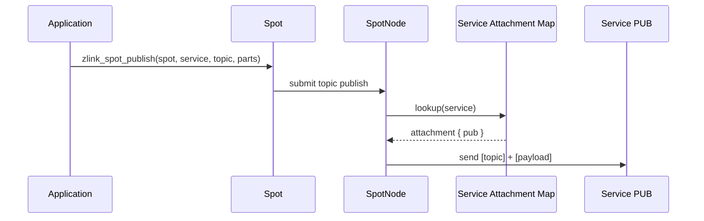
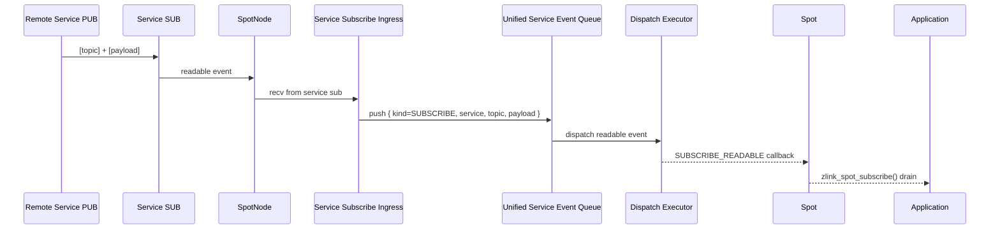
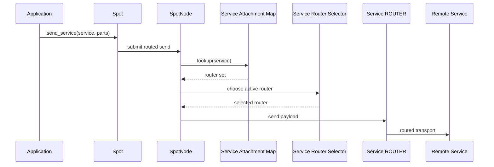
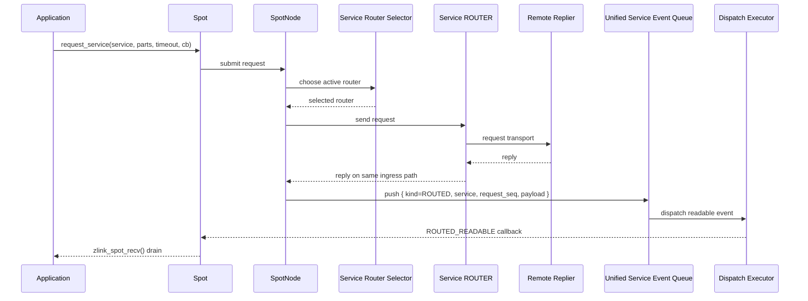

[스펙 목차](../README.ko.md)

# Draft -- SPOT Multi-Service Topology

> 이 문서는 **구현 전 초안**이다.
> 현재 공개 계약이 아니며, `core/include/zlink.h`에 없는 API나 정책을
> 보장하지 않는다.
> 구현과 공개 헤더가 확정되면 정식 spec 문서에 나누어 반영한다.

## 1. 목적

이 초안은 SPOT 연결 단위를 기존의 `SpotNode <-> SpotNode` 중심 구조에서
`service_name` 중심 구조로 바꾸는 방향을 정리한다.

핵심 목표는 아래와 같다.

- 하나의 `Spot`이 여러 서비스와 동시에 연결될 수 있게 한다.
- `SpotNode`는 외부 mesh peer 자체가 아니라, 내부 `Spot`과 외부 통신 소켓들을
  묶는 허브가 되게 한다.
- Discovery 자동 연결도 service 단위로 유지하되, 실제 attach 대상은
  `service_name + role` 조합으로 다루게 한다.
- routed messaging과 pub/sub 모두에서 다른 서비스와 통신할 수 있게 한다.

## 2. 현재 구조와 한계

현재 공개 계약은 아래 전제를 갖고 있다.

- `SpotNode`가 SPOT mesh 연결의 기준 핸들이다.
- Discovery가 붙으면 같은 `service_name` 안의 다른 `SpotNode`를 자동으로 찾고
  peer 연결을 만든다.
- `Spot`은 그 위에 attach되는 unified pub/sub facade다.
- routed send/request는 최종적으로 `dest_node_rid + dest_spot_rid`를 사용한다.

이 구조는 "하나의 Spot이 여러 서비스의 ROUTER/PUB/SUB와 동시에 관계를 맺는다"
는 요구를 직접 표현하기 어렵다.

문제는 두 가지다.

- 현재 `service_name`이 사실상 `SpotNode` 전체를 하나의 서비스로 묶는다.
- 그래서 `Spot`이 같은 프로세스 안에서 여러 서비스 경로를 동시에 다루려면,
  외부 구조를 우회하거나 별도 handle 집합을 응용이 직접 관리해야 한다.

## 3. 바꾸려는 핵심 모델

새 모델에서는 `SpotNode`를 "외부 peer와 직접 연결되는 단일 서비스 노드"로 보지
않는다. 대신 `SpotNode`는 내부의 단일 공개 `Spot` facade와, 서비스별 외부 통신 자원을
묶는 owner handle이 된다.

```text
+------------------------------------------------------------------+
|                            SpotNode                              |
|------------------------------------------------------------------|
| local Spot handles                                               |
| service attachment table                                         |
| discovery-managed attach set                                     |
| manual attach set                                                |
+------------------------------------------------------------------+
                |                    |                    |
                v                    v                    v
      +----------------+   +----------------+   +----------------+
      | service: alpha |   | service: beta  |   | service: gamma |
      | router set     |   | router set     |   | pub/sub set    |
      | pub/sub set    |   | pub/sub set    |   | optional extra |
      +----------------+   +----------------+   +----------------+
```

이 모델에서 중요한 점은 아래와 같다.

- `Spot`과 외부 서비스의 관계를 `service_name` 기준으로 여러 개 둘 수 있다.
- 같은 `service_name` 아래에 ROUTER 여러 개가 attach될 수 있다.
- 같은 `service_name` 아래에 PUB/SUB 경로도 함께 attach될 수 있다.
- routed와 pub/sub는 모두 "어느 service를 통해 처리하는가"를 식별할 수 있어야
  한다.

이 문서에서는 `SpotNode` 하나에 `Spot` facade를 여러 개 만드는 구성을 새 수신
모델의 기본 대상으로 두지 않는다.

- service attachment가 붙은 `SpotNode`는 공개 facade `Spot` 하나를 기준으로
  사용한다.
- 같은 `SpotNode`에 여러 `Spot` facade를 동시에 붙여 inbound service 이벤트를
  나누어 받는 계약은 이 draft 범위에 포함하지 않는다.
- 따라서 service-aware inbound queue와 dispatch surface의 소유자는 `SpotNode`가
  아니라, 그 node에 attach된 단일 공개 `Spot` facade로 본다.

이 규칙에 맞춰 `zlink_spot_new(node)`의 의미도 아래처럼 고정한다.

- service-aware attachment가 없는 일반 `SpotNode`는 기존과 같은 facade 생성 규칙을
  따른다.
- service-aware attachment가 붙은 `SpotNode`는 공개 facade `Spot` 하나만 허용한다.
- 같은 node에 두 번째 `zlink_spot_new(node)`를 호출하면 `NULL`을 반환하고
  `errno=EBUSY`로 실패한다.
- 일반 facade가 둘 이상 먼저 생성된 node는 service-aware 모드로 승격하지 않는다.
- 이런 node에 `zlink_spot_node_attach_router()`,
  `zlink_spot_node_attach_pubsub()`, `zlink_spot_node_attach_discovery()`를
  호출하면 `EBUSY`로 실패한다.

## 4. 역할 재정의 초안

### 4.1 SpotNode

`SpotNode`는 아래 책임을 가진다.

- 내부 `Spot`과 attach된 외부 소켓 집합의 생명 주기를 관리한다.
- 서비스별 attachment table을 유지한다.
- Discovery 결과를 attachment table에 반영한다.
- 수동 attach와 자동 attach를 같은 논리 모델로 합친다.

이 초안에서는 `SpotNode`가 더 이상 "외부의 다른 SpotNode와 직접 peer를 맺는
공개 개념"이 아니라고 본다. 외부 연결은 각 서비스에 attach된 ROUTER 또는
PUB/SUB를 통해 이루어진다.

### 4.2 Spot

`Spot`은 단일 서비스 전용 facade가 아니라, 여러 서비스와 메시지를 주고받는
상위 데이터 평면 handle이 된다.

`Spot`은 아래 동작을 지원해야 한다.

- 서비스 이름을 지정해 publish/subscribe 한다.
- 서비스 이름을 지정해 router send/request를 수행한다.
- 수신 시 이 메시지가 어느 서비스에서 왔는지 돌려준다.

즉 `Spot`은 더 이상 "내가 속한 서비스 하나"만 바라보지 않고, "지금 붙어 있는
여러 서비스 중 어느 경로를 쓸 것인가"를 함께 다루게 된다.

## 5. Attachment 모델

### 5.1 수동 attach

수동 구성에서는 호출자가 외부 소켓을 직접 만들고, 이를 `service_name`과 함께
`SpotNode`에 attach한다.

구현 순서 기준으로 먼저 잡아야 하는 수동 연결 표면은 service 단위 두 함수다.

- `router`는 별도 등록한다.
- `pub/sub`는 반드시 한 쌍으로 함께 등록한다.

```c
zlink_config_result_t zlink_spot_node_attach_router (
  void *node,
  const char *service_name,
  void *router);

zlink_config_result_t zlink_spot_node_attach_pubsub (
  void *node,
  const char *service_name,
  void *pub,
  void *sub);
```

이 함수군은 같은 서비스에 속한 외부 자원을 등록한다.

- `attach_router`는 routed send/request 경로에 사용한다.
- `attach_pubsub`는 pub/sub 경로에 사용하는 `PUB + SUB` 한 쌍을 함께 등록한다.

이 문서에서는 `detach`를 공개 surface에 두지 않는다.
또한 runtime 중 수동 attachment를 다시 바꾸는 API도 두지 않는다.

### 5.2 자동 attach

자동 구성에서는 기존처럼 Discovery가 서비스 공급자 목록을 본다. 다만 attach의
해석이 달라진다.

- 기존: 같은 서비스의 다른 `SpotNode` peer endpoint를 찾아 직접 연결한다.
- 변경안: `service_name`별 ROUTER/PUB/SUB 공급자를 찾아 attachment table에
  반영한다.

즉 자동 연결의 바깥 모양은 유지하되, 실제 내부 모델은 "peer SpotNode 집합"이
아니라 "service attachment 집합"이 된다.

이 문서에서는 자동 연결도 무제한 부분 상태를 허용하지 않는다.
특히 pub/sub 경로는 한 쌍으로 취급한다.

- `router`만 있는 서비스는 허용한다.
- `router + pub + sub`가 모두 있는 서비스는 허용한다.
- `pub`만 있거나 `sub`만 있는 서비스는 허용하지 않는다.
- `router + pub` 또는 `router + sub`처럼 pub/sub 짝이 맞지 않는 서비스도
  허용하지 않는다.

즉 자동 연결에서 pub/sub는 "둘 다 있거나 둘 다 없어야 한다"가 기본 규칙이다.
이 규칙은 Discovery를 `SpotNode`에 붙일 때 먼저 검증해야 한다.

## 6. Routed messaging 변경 방향

### 6.1 service_name 기반 send/request

이 초안은 기존의 `rid` 직접 지정 경로를 없애지 않는다. 대신
`service_name`만으로 라우팅을 시작하는 경로를 추가한다.

이 draft의 공개 계약은 아래와 같다.

- 기존 경로:
  특정 `rid`를 직접 지정해 보낸다.
- 새 경로:
  `service_name`만 주면, 그 서비스에 attach된 ROUTER 집합 중 하나를 골라 보낸다.

공개 API는 아래와 같다.

```c
zlink_submit_result_t zlink_spot_send_service (
  void *spot,
  const char *service_name,
  zlink_msg_t *parts,
  size_t part_count,
  zlink_send_flags_t flags);

zlink_submit_result_t zlink_spot_request_service (
  void *spot,
  const char *service_name,
  zlink_msg_t *parts,
  size_t part_count,
  zlink_reply_handler_fn handler,
  void *userdata,
  zlink_send_flags_t flags,
  uint32_t timeout_ms);
```

이 경로는 응용이 특정 `rid`를 모를 때, 또는 서비스 단위 부하 분산을 원할 때
사용한다.

### 6.2 같은 service 안의 여러 ROUTER

같은 `service_name`에 ROUTER가 여러 개 attach될 수 있다. 이 경우
`service_name` 기반 send/request는 내부적으로 그중 하나를 고른다.

이 문서의 구현 기준 규칙은 아래와 같다.

- 선택 단위는 같은 `service_name`의 active ROUTER attachment 집합이다.
- 기본 분배 정책은 round-robin이다.
- 비활성 또는 송신 불가 상태의 ROUTER는 선택 대상에서 제외할 수 있다.
- request는 제출 시 선택된 ROUTER 한 개에 귀속된다.

즉 동작 의미는 "service 이름으로 보낸다"이지만, 실제 전송은 같은 서비스에 속한
ROUTER 중 하나가 맡는다. 이 점에서 내부 동작은 DEALER의 분산 송신과 비슷하다.

### 6.3 rid 직접 지정 경로와의 관계

이 초안은 `rid` 직접 지정 경로를 당장 제거하지 않는다.

- `rid` 기반 함수는 특정 peer를 직접 지목하는 정밀 경로로 남을 수 있다.
- `service_name` 기반 함수는 "같은 서비스 중 아무 대상 하나"를 고르는 추상 경로다.

둘은 목적이 다르므로 동시에 존재한다.

- `rid` 기반 함수는 특정 peer를 직접 지목하는 정밀 경로다.
- `service_name` 기반 함수는 같은 서비스 중 active attachment 하나를 고르는
  추상 경로다.
- 이 draft는 둘을 하나의 오버로드 성격 API로 합치지 않는다.

## 7. Pub/Sub 변경 방향

pub/sub 경로도 서비스 이름을 함께 다룰 수 있어야 한다.

현재 공개 `Spot` publish/subscribe API는 topic만 직접 드러낸다. 새 모델에서는
같은 topic이라도 어느 서비스의 PUB/SUB 경로를 타는지 구분할 필요가 있다.

pub/sub 공개 방향은 아래와 같이 고정한다.

- publish 호출이 `service_name`을 함께 받는다.
- subscribe recv가 `service_name`을 함께 돌려준다.
- subscription filter는 여전히 topic 기준을 유지하되, 실제 수신 이벤트에는
  service 정보가 포함된다.

generic socket family의 `zlink_publish()` / `zlink_subscribe()` /
`zlink_subscription_event()`와 충돌하지 않도록, Spot 전용 multi-service pub/sub는
`zlink_spot_*` 이름으로 분리한다.

공개 API는 아래와 같다.

```c
zlink_submit_result_t zlink_spot_publish (
  void *spot,
  const char *service_name,
  const char *topic_id,
  zlink_msg_t *parts,
  size_t part_count,
  zlink_send_flags_t flags);

zlink_recv_result_t zlink_spot_subscribe (
  void *spot,
  zlink_routing_id_t *source_rid_out,
  zlink_msg_t **parts_out,
  size_t *part_count_out,
  char *service_name_out,
  size_t *service_name_len_out,
  char *topic_id_out,
  size_t *topic_id_len_out,
  zlink_recv_flags_t flags);
```

정식 계약에서는 `service_name` 버퍼를 직접 채우는 방식과 그 길이 반환 방식을
명확히 고정해야 한다.

### 7.1 내부 구현 관점의 핵심 차이

이 변경은 publish와 subscribe가 같은 난이도를 갖지 않는다.

- `zlink_spot_publish(..., service_name, ...)`는 비교적 단순하다.
  `service_name -> attachment.pub`를 찾아 해당 `PUB`로 보내면 된다.
- `zlink_spot_subscribe(..., service_name_out, ...)`는 더 복잡하다.
  외부 `SUB`에서 받은 메시지에 `service_name`을 붙여서 내부 unified 수신
  표면으로 올리는 계층이 필요하다.
- `send_service()` / `request_service()`도 `service_name -> router set` 조회와
  선택 규칙이 필요하다.

즉 내부 구현의 핵심은 "service 이름으로 외부 attachment를 찾는 것"에서 끝나지
않는다. 수신 경로에서는 `service_name`을 잃지 않도록 내부 이벤트 형태를 바꿔야
한다.

### 7.2 권장 내부 데이터 평면

이 문서는 아래 구조를 기준 구현으로 본다.

```text
+------------------------------------------------------------------+
|                          SpotNode Runtime                        |
|------------------------------------------------------------------|
| service attachment map                                           |
|  service -> { router set, pub/sub pair }                         |
|------------------------------------------------------------------|
| service router selector                                          |
| service subscribe ingress                                        |
| unified service event queue                                      |
|  event = { kind, service_name, source_rid, topic, request_seq,   |
|            spot_rid, payload }                                   |
+------------------------------------------------------------------+
```

핵심 구성은 아래와 같다.

- `service attachment map`
  `service_name`으로 외부 `router/pub/sub`를 찾는다.
- `service router selector`
  같은 서비스의 ROUTER 여러 개 중 전송 대상을 고른다.
- `service subscribe ingress`
  각 서비스의 외부 `SUB`에서 받은 topic 메시지를 내부 공통 형식으로 바꾼다.
- `unified service event queue`
  `Spot`의 recv 표면과 dispatch readable 알림이 공유하는 공용 큐다.

이 구조를 쓰면 pub/sub와 routed 수신을 모두 같은 dispatch/recv surface로 합칠
수 있다.

### 7.2.1 dispatch event 실행 스레드

이 문서에서는 user dispatch callback을 data-plane thread 또는 timer thread에서 직접
호출하지 않는다.

- I/O thread는 service event를 queue에 넣는 데서 끝난다.
- 별도 dispatch executor가 readable 알림을 user callback으로 전달한다.
- 같은 `Spot`에 속한 dispatch callback은 직렬 실행되어야 한다.
- 서로 다른 `Spot`은 병렬 실행될 수 있다.

이 규칙이 필요한 이유는 아래와 같다.

- 느린 user callback이 I/O thread를 막지 않게 해야 한다.
- subscribe, routed, timer producer가 user 로직에 끌려 다니지 않게 해야 한다.
- callback 안에서 사실상 응용의 main receive logic이 실행되므로, 이 경로는
  data-plane 내부 유지 작업과도 분리되어야 한다.
- 같은 `Spot`의 이벤트 순서는 유지하면서, 다른 `Spot` 간 병렬성은 열어 두어야
  한다.

즉 구현은 dispatch callback 실행 경로를 data-plane 내부 유지 경로와 분리하고,
같은 `Spot` 직렬 실행 규칙을 보장하는 구조를 가져야 한다.

이 초안은 dispatch executor worker 수를 설정할 수 있는 별도 context 옵션도
필요하다고 본다.

- 옵션은 dispatch callback 처리 병렬성만 조절한다.
- 이 옵션은 `zlink_spot_dispatch_event_handler()` 경로에만 적용한다.
- send-ready callback, monitor callback, 다른 socket family callback에는 적용하지
  않는다.
- 같은 `Spot` 내부 직렬 실행 규칙은 worker 수를 늘려도 바뀌지 않는다.
- worker 수를 늘렸을 때 이득이 생기는 경우는 여러 `Spot`에서 callback이 동시에
  오래 실행될 때다.

기본 정책은 아래와 같이 둔다.

- 옵션 이름은 임시로 `ZLINK_SPOT_WORKER_THREADS`로 둔다.
- 값 `0`은 자동 선택을 뜻한다.
- 자동 선택 기본값은 `min(visible logical cores, 8)`로 둔다.
- 여기서 `visible logical cores`는 프로세스에서 관찰 가능한 논리 코어 수를
  뜻한다.
- 논리 코어 수를 알 수 없으면 자동 선택은 1로 떨어져야 한다.
- 최소 1 worker는 항상 보장해야 한다.
- 이 옵션은 dispatch worker runtime이 실제로 시작되기 전에 설정해야 한다.
- runtime 시작 뒤 값을 바꾸려 하면 이 draft는 설정 오류로 본다.

### 7.2.2 inbound 소유 모델

이 draft의 구현 기준은 "service-aware inbound 이벤트는 node당 단일 공개 `Spot`
facade가 소유한다"는 규칙이다.

- 외부 `router/pub/sub` attachment에서 들어온 inbound 이벤트는 모두 같은
  service-aware queue로 모인다.
- 그 queue를 drain하는 공개 surface는 node에 attach된 단일 `Spot` facade다.
- 같은 `SpotNode`에 여러 `Spot` facade를 두고 inbound service 이벤트를 분배하는
  규칙은 두지 않는다.

즉 multi-service 모델은 "하나의 `Spot`이 여러 서비스를 다룬다"는 방향으로
구현한다. "여러 `Spot`이 같은 service attachment 집합을 나눠 가진다"는 모델은
이 문서 범위에 포함하지 않는다.

### 7.3 pub/sub 내부 경로

pub/sub는 아래처럼 나누어 본다.

- 송신:
  `Spot zlink_spot_publish(spot, service, topic, parts, ...)`
  -> `service attachment map`
  -> 해당 서비스의 외부 `PUB`
- 수신:
  외부 `SUB`
  -> `service subscribe ingress`
  -> `unified service event queue`
  -> `zlink_spot_dispatch_event_handler()` 알림
  -> `zlink_spot_subscribe()` drain

즉 송신은 "찾아서 바로 보냄"에 가깝지만, 수신은 "service-aware 이벤트로 재포장"
단계가 추가된다.

기존 구현의 `fanout -> spot_sub` 경로는 topic만 직접 다룬다. 새 모델에서는
수신 시 `service_name`을 함께 돌려줘야 하므로, 기존 경로를 그대로 재사용하기만
하면 service 정보를 잃는다.

따라서 이 문서에서는 아래 방향을 기본으로 본다.

- 외부 서비스 `SUB` 수신은 기존 local `fanout` 경로와 분리한다.
- 수신 즉시 `(service_name, topic, payload, source metadata)`를 묶은 내부
  이벤트로 변환한다.
- 변환된 이벤트만 unified recv/dispatch 표면으로 올린다.

### 7.3.1 subscription filter 합성 규칙

service-aware `SUB`에 실제로 걸리는 filter는 공개 `Spot` facade가 보유한
subscription 집합의 합집합(union)으로 계산한다.

- 호출자가 `zlink_set_subscription(spot, filter)`를 추가하면, attach된 각 서비스
  `SUB`에도 그 filter를 반영한다.
- 호출자가 `zlink_unset_subscription(spot, filter)`를 제거하면, 현재 `Spot` facade
  기준 subscription 집합에서 더 이상 쓰이지 않을 때만 각 서비스 `SUB`에서
  제거한다.
- 새 service `SUB`가 attach되면, 현재 `Spot` facade가 보유한 모든 filter를
  replay해야 한다.
- discovery churn으로 service `SUB`가 다시 생기면 같은 replay 규칙을 적용한다.

이 draft에서는 inbound service 이벤트를 node당 단일 `Spot` facade가 소유하므로,
filter 합성도 handle 간 병합이 아니라 그 단일 facade의 subscription 집합만
기준으로 계산한다.

pub/sub 경로의 `source_rid`는 이 문서에서 강한 계약으로 보지 않는다.

- 외부 `SUB`가 신뢰할 수 있는 source routing id를 직접 제공하지 않으면,
  `source_rid`는 빈 routing id 또는 `NULL`일 수 있다.
- 응용이 pub/sub에서 반드시 기대해야 하는 메타데이터는 `service_name`과 `topic`
  이다.
- routed 경로처럼 reply 주소 의미를 갖는 것은 아니다.

### 7.4 router 내부 경로

router도 service 이름만 보고 바로 보내는 것으로 끝나지 않는다.

- `send_service()` / `request_service()`는 먼저 `service_name`으로 router set을
  찾는다.
- 그다음 send-ready 상태인 router 중 하나를 round-robin으로 고른다.
- request는 선택된 router 하나에 귀속된다.
- reply는 새 선택을 다시 하지 않고, 최초 ingress router 경로를 그대로 쓴다.

즉 service 기반 router 경로는 내부적으로 DEALER 비슷한 selector를 하나 더 두는
형태다.

### 7.5 spot_publish sequence



이 경로는 service 이름으로 대상 `PUB`를 찾는 것이 핵심이다.

### 7.6 spot_subscribe sequence



이 경로는 기존 pub/sub 경로와 달리 `service_name`이 내부 queue item에 포함되어야
한다.

### 7.7 send_service sequence



### 7.8 request_service / reply sequence



이 경로에서 중요한 점은 reply가 `service_name`으로 새 router를 다시 고르지
않는다는 것이다. reply는 request를 실어 보낸 ingress router 경로에 고정된다.

### 7.9 구현 시 주의점

이 구조로 구현할 때 바로 생기는 이슈는 아래와 같다.

- subscription filter replay:
  local `Spot`의 topic filter를 attach된 각 서비스 `SUB`에 모두 반영해야 한다.
- 서비스 간 공정성:
  한 서비스의 topic flood가 unified queue를 독점하지 않게 해야 한다.
- callback/recv 일관성:
  같은 이벤트가 dispatch 알림과 recv에서 어긋나지 않아야 한다.
- dispatch executor 순서 보장:
  같은 `Spot` 이벤트는 직렬 실행되어야 하고, 느린 callback이 I/O thread를
  막으면 안 된다.
- discovery churn:
  자동 attach 변경 시 poll set, filter replay, ready 상태를 함께 갱신해야 한다.
- source metadata:
  외부 `SUB`가 source routing id를 직접 제공하지 않는 경우 빈 routing id 또는
  `NULL`로 정규화해야 한다.

이 때문에 pub/sub도 단순한 "대상 pub/sub를 찾아 연결"만으로 끝나지 않는다.
송신은 단순하지만, 수신은 service-aware fan-in 계층이 반드시 필요하다.

## 8. Discovery와의 관계

이 초안에서 Discovery는 여전히 서비스 이름을 기준으로 provider를 찾는 역할을
맡는다. 다만 SPOT 관련 해석이 달라진다.

### 8.1 Discovery의 서비스 범위

Discovery는 "지금 어떤 서비스의 공급자가 살아 있는가"를 보는 단위로 남는다.
SPOT은 이 목록을 이용해 service attachment를 갱신한다.

즉 SPOT이 여러 서비스와 통신하려면, `SpotNode` 하나에 여러 Discovery view를
붙일 수 있어야 한다.

이 draft는 Discovery 자체를 "서비스 하나를 보는 핸들"로 유지하고, 여러 서비스를
다루는 능력은 `SpotNode` 쪽 다중 attach에서 해결하는 방향으로 고정한다.

공개 동작 차원에서 중요한 점은 아래 하나다.

- 자동 연결 결과가 결국 `service_name -> attachment set`으로 관찰돼야 한다.

다중 Discovery attach 계약은 아래처럼 고정한다.

- 하나의 `SpotNode`에는 서로 다른 `service_name`을 보는 Discovery handle 여러 개를
  attach할 수 있다.
- 같은 Discovery handle을 둘 이상의 `SpotNode` owner에 attach하는 것은 금지한다.
- 같은 `SpotNode`에 같은 `service_name` Discovery를 둘 이상 attach하는 것은
  허용하지 않는다.
- 같은 `SpotNode`에 공개 facade `Spot`이 둘 이상 이미 생성되어 있으면, 그 node는
  service-aware Discovery attach를 받을 수 없다.
- 따라서 자동 attachment 병합 규칙은 "서로 다른 서비스 Discovery의 병렬 attach"만
  지원하고, "같은 서비스 Discovery 여러 개의 합집합 병합"은 지원하지 않는다.
- Discovery destroy 또는 detach에 해당하는 수명 변화는 그 Discovery가 공급하던
  automatic attachment source만 내린다.
- 이 동작은 수동 attachment나 다른 Discovery source가 공급하던 attachment를
  건드리지 않는다.

### 8.2 수동 attach와 자동 attach의 병합

수동 attach와 자동 attach는 서로 다른 코드 경로를 갖더라도, 최종적으로는 같은
attachment table에 반영되어야 한다.

그래야 아래 동작이 자연스럽다.

- `service_name` 기반 send/request가 attach 출처를 구분하지 않고 대상 집합을 본다.
- publish/subscribe가 같은 서비스의 수동 경로와 자동 경로를 같은 방식으로 다룬다.
- 운영 상태 조회에서 "이 서비스에 현재 어떤 attachment가 붙어 있는가"를 한 번에
  볼 수 있다.

## 9. reply 주소와 수신 메타데이터

service 기반 라우팅을 추가해도 reply 규칙은 더 엄격해야 한다.

- request를 받았을 때 생긴 reply 주소는 그 시점에 확정된 값으로 다뤄야 한다.
- reply는 새 round-robin 선택을 다시 하면 안 된다.
- 즉 request의 최초 ingress attachment가 reply 경로를 결정해야 한다.

수신 메타데이터에는 아래 정보가 필요하다.

- source routing id 또는 peer id
- source service name
- routed request인 경우 reply에 써야 하는 request sequence
- 필요하면 ingress attachment 식별자

이 draft는 ingress attachment 내부 식별자를 공개하지 않는다. 다만 응용이
"이 메시지가 어느 서비스에서 왔는가"를 알 수 있도록 `service_name`은 반드시
노출한다.

pub/sub 경로의 `source_rid`는 선택 메타데이터다.

- routed 경로에서는 reply 주소 의미를 갖는 핵심 메타데이터다.
- pub/sub 경로에서는 비어 있을 수 있다.
- 따라서 응용은 pub/sub에서 `source_rid` 존재를 필수 전제로 두면 안 된다.

## 10. 상태 조회와 운영 관찰

새 모델이 들어가면 운영 API도 기존 `peer SpotNode 목록`만으로는 충분하지 않다.
정식 spec 반영 때는 아래 뷰를 함께 다룬다.

- 서비스별 attachment 수
- 서비스별 active ROUTER 수
- 서비스별 PUB/SUB 경로 상태
- 수동 attach와 자동 attach의 출처 구분
- monitor event의 service 구분

이 문서는 상태 조회를 최소 헤더 초안 수준으로만 담고, 세부 운영 surface는 정식
spec 반영 때 함께 확정한다. 운영 surface를 빼면 새 모델을 실제로 관찰할 수
없기 때문이다.

### 10.1 monitor event의 service 구분

이 모델에서는 monitor event도 `service_name` 기준으로 구분할 수 있어야 한다.

이유는 아래와 같다.

- 같은 `SpotNode` 아래에 여러 서비스 attachment가 동시에 존재한다.
- 연결 준비, 끊김, backpressure, 재연결 같은 상태 변화가 어느 서비스의
  `router/pub/sub`에서 발생했는지 알아야 운영 판단이 가능하다.
- service 정보가 없으면 monitor event를 봐도 "무슨 attachment에 문제가 있는가"를
  추적하기 어렵다.

따라서 monitor event에는 최소한 아래 정보가 함께 있어야 한다.

- `service_name`
- attachment role 또는 source kind
- 기존 monitor event payload

### 10.2 monitor 내부 경로

service attachment별 monitor 소켓을 열어 event를 수집하더라도, 최종적으로는
service-aware 공용 monitor 표면으로 합치는 방향이 필요하다.

```text
+------------------------------------------------------------------+
|                    Service Attachment Monitors                   |
|------------------------------------------------------------------|
| router monitor[service]                                          |
| pub monitor[service]                                             |
| sub monitor[service]                                             |
|------------------------------------------------------------------|
| unified service monitor queue                                    |
|  event = { service_name, role, monitor_event }                   |
+------------------------------------------------------------------+
```

즉 monitor도 data-plane과 마찬가지로 "attachment별 수집 -> service-aware fan-in"을
거쳐야 한다.

monitor는 별도 direct callback보다 recv 기반 표면으로 두는 쪽을 기본으로 본다.

이 draft에서는 monitor를 `Spot` dispatch event에 섞지 않고 `SpotNode` 전용 recv
표면으로 분리한다.

- monitor event의 소유자는 `spot_`이 아니라 `node_`다.
- 따라서 monitor는 `zlink_spot_dispatch_event_handler()`의 readable plane으로
  올리지 않는다.
- monitor event는 `zlink_spot_node_monitor_recv(node_, ...)`로만 drain한다.

## 11. 구현 순서 기준 정리

이 절은 앞에서 정한 내용을 "무엇을 먼저 구현해야 다음 항목을 안정적으로 올릴 수
있는가" 순서로 다시 정리한다. 이 문서는 여기 적힌 항목을 전부 구현 대상으로 본다.

### 11.1 Discovery 범위 먼저 고정

`SpotNode` 하나에 여러 Discovery handle을 붙일 수 있게 하는 방향으로 간다.

이 방향을 고른 이유는 아래와 같다.

- 기존 `zlink_discovery_new(ctx, service_type, service_name)` 모델을 크게 깨지
  않는다.
- Discovery가 하나의 고정 service view를 가진다는 현재 계약과 잘 맞는다.
- 여러 서비스를 다루는 상위 Discovery 뷰를 새로 정의하는 것보다 변경 범위가
  작다.

즉 자동 attach가 여러 서비스로 확장되더라도, Discovery 자체는 여전히
"서비스 하나를 보는 핸들"로 유지한다.

이때 `zlink_spot_node_attach_discovery()`는 단순 등록 함수가 아니라, 해당
Discovery view의 service 구성을 검증하는 관문 역할도 함께 맡는다.

- Discovery가 보는 서비스에 `pub` xor `sub` 상태가 있으면 attach를 거부한다.
- 즉 pub/sub는 자동 연결에서도 짝이 맞아야 한다.
- `router`만 있는 서비스는 attach 허용 대상이다.
- 같은 node에 같은 `service_name` Discovery가 이미 attach되어 있으면 `BUSY`로
  거부한다.
- 서로 다른 `service_name` Discovery는 같은 node에 함께 attach할 수 있다.
- 같은 node에 공개 facade `Spot`이 둘 이상 이미 생성되어 있으면 Discovery attach는
  `BUSY`로 거부한다.
- Discovery destroy는 그 Discovery source가 공급하던 automatic attachment만
  내리고, 수동 attachment나 다른 Discovery source는 유지한다.

### 11.2 service attachment shape 고정

`SpotNode`에 service 단위 수동 attach 함수 두 개를 둔다.

- `zlink_spot_node_attach_router()`
- `zlink_spot_node_attach_pubsub()`

이 함수군은 같은 서비스에 속한 외부 통신 자원을 받는다.

- `router`는 routed send/request 경로에 사용한다.
- `pub`와 `sub`는 pub/sub 경로에 반드시 함께 사용한다.
- 공개 facade `Spot`이 둘 이상 이미 생성된 node에는 이 수동 attach 함수군을
  허용하지 않는다.

이 방향을 고른 이유는 아래와 같다.

- 사용자가 "이 서비스 attachment 하나"를 한 번에 등록하는 모델과 잘 맞는다.
- runtime 중 재구성 API를 먼저 넣지 않아도 전체 구조를 구현하는 데 문제 없다.
- `pub`와 `sub`를 따로 attach하면 반쪽 상태를 관리해야 하므로 계약이 복잡해진다.

### 11.3 service 기반 라우팅 함수 추가

가능한 곳은 기존의 Spot 전용 이름을 유지하고 `service_name` 파라미터를 추가하는
방식으로 간다.

- 기존 `*_router`, `*_spot`, `*_rid` 계열은 유지한다.
- pub/sub 계열은 기존 `zlink_spot_*` 이름을 유지한다.
- concrete `peer_rid` 의미가 고정된 routed 함수만 별도 service 이름을 유지한다.

이 방향은 기존 호출자의 의미를 바꾸지 않고, 새 추상화도 명확히 드러낸다.

### 11.4 service-aware 수신 표면 추가

recv surface는 service-aware recv 함수군으로 두고, callback은
`zlink_spot_dispatch_event_handler()` 하나로 고정한다.

- recv: `zlink_spot_subscribe()`
- subscription event recv: `zlink_spot_subscription_event()`
- callback: `zlink_spot_dispatch_event_handler()`

새 모델에서는 topic 수신과 routed 수신 모두 dispatch 이벤트로 알리고, 실제
payload와 service metadata는 recv surface에서 꺼내는 쪽이 더 단순하다.

monitor는 여기 포함하지 않는다. monitor는 node 전용 recv 표면으로 분리한다.

### 11.5 service router 선택 규칙 고정

구현 기준 규칙은 아래와 같다.

- 같은 서비스의 active ROUTER 집합에서 round-robin으로 고른다.
- send-ready가 아닌 ROUTER는 선택 후보에서 제외한다.
- selector 단계에서 후보가 0개가 되면 이 상태를 일시적 backpressure가 아니라
  "현재 보낼 수 있는 경로가 없음"으로 보고 `NOT_CONNECTED`로 정규화한다.
- request timeout 뒤 자동 재시도는 기본 계약에 넣지 않는다.
- reply는 최초 ingress 경로에 고정한다.

자동 재시도까지 기본 계약으로 넣으면 timeout 의미와 중복 제출 문제가 커진다.
처음 단계에서는 "선택은 한 번, 실패는 호출자에게 반환"이 더 안전하다.

### 11.6 자동 연결 검증 추가

`zlink_spot_node_attach_discovery()`에서 discovery view를 먼저 검사하고, 아래
조건을 만족하지 않으면 실패시킨다.

- `router`만 등록된 서비스: 허용
- `pub`와 `sub`가 함께 등록된 서비스: 허용
- `router + pub + sub`가 모두 등록된 서비스: 허용
- `pub`만 등록된 서비스: 거부
- `sub`만 등록된 서비스: 거부
- `router + pub`만 등록된 서비스: 거부
- `router + sub`만 등록된 서비스: 거부

즉 자동 연결에서도 pub/sub는 반쪽 상태를 허용하지 않는다.

attach 이후 운용 중 provider 변화로 짝이 깨지면 아래처럼 처리한다.

- 해당 서비스의 pub/sub pair는 active attachment 집합에서 즉시 제외한다.
- 이미 붙어 있던 반쪽 상태를 그대로 유지한 채 publish 또는 subscribe를 계속
  허용하지 않는다.
- `router` attachment가 남아 있으면 routed send/request 경로는 계속 유지할 수
  있다.
- pub/sub pair가 다시 완전한 형태로 복구되면, subscription filter replay를
  다시 적용한 뒤 active 집합에 재진입시킨다.

## 12. 공개 헤더 초안

이 절은 `core/include/zlink.h`에 들어갈 공개 함수 형태를 구현 순서에 맞춰
정리한다. 이 draft에서는 아래 이름과 함수군 구조를 구현 기준으로 본다.

### 12.1 설계 원칙

헤더 초안은 아래 원칙을 따른다.

- generic socket family 이름과 충돌하지 않게 Spot 전용 이름을 유지한다.
- concrete `peer_rid` 의미가 고정된 routed 함수는 기존 `zlink_spot_*` 이름 위에
  service 개념을 추가한다.
- 수동 attach API는 `SpotNode`에 둔다.
- publish/subscribe/routed request-reply 모두 service 이름을 직접 다룰 수 있게
  한다.
- reply는 service 이름만으로 다시 찾지 않고, 수신 시 전달된 구체 reply 주소를
  사용한다.
- Discovery attach 시 pub/sub 짝이 맞지 않는 서비스는 미리 거부한다.

### 12.2 타입 초안

이 draft는 service 이름을 새 구조체로 감싸지 않고 `const char *`와 버퍼 길이
방식으로 둔다. 기존 공개 API가 topic/filter에서 같은 방식을 쓰기 때문이다.

context 옵션에는 아래 항목을 추가한다.

```c
typedef enum zlink_ctx_option_t
{
    /* ... existing ctx options ... */
    ZLINK_SPOT_WORKER_THREADS = ...
} zlink_ctx_option_t;

#define ZLINK_SPOT_WORKER_THREADS_DFLT 0
```

의미는 아래와 같다.

- `zlink_ctx_set(ctx, ZLINK_SPOT_WORKER_THREADS, n)`으로 설정한다.
- `zlink_ctx_get(ctx, ZLINK_SPOT_WORKER_THREADS, ...)`로 현재 설정값을 조회할 수
  있어야 한다.
- 기본값 `0`은 자동 선택이다.
- 자동 선택은 `min(visible logical cores, 8)`이며, 코어 수 조회에 실패하면 `1`
  로 본다.
- 이 값은 Spot dispatch worker runtime이 시작되기 전에만 설정할 수 있다.
- runtime 시작 뒤 값을 바꾸려 하면 `ZLINK_CONFIG_INVALID_ARGUMENT`,
  내부 `errno=EINVAL`로 실패한다.

아래 구조체는 채택하지 않는 대안 메모다.

```c
typedef struct zlink_service_message_info_t
{
    const zlink_routing_id_t *source_rid_;
    const char *service_name_;
    size_t service_name_len_;
} zlink_service_message_info_t;
```

이 draft의 공개 헤더 목록에는 이 구조체를 넣지 않는다.

### 12.3 수동 attach API 초안

수동 attach는 `attach_router`와 `attach_pubsub` 두 함수로 정리한다.

```c
ZLINK_EXPORT zlink_config_result_t zlink_spot_node_attach_router (
  void *node_,
  const char *service_name_,
  void *router_);

ZLINK_EXPORT zlink_config_result_t zlink_spot_node_attach_pubsub (
  void *node_,
  const char *service_name_,
  void *pub_,
  void *sub_);
```

이 함수군은 아래 의미를 갖는다.

- `attach_router`는 지정한 서비스 아래 ROUTER attachment를 등록한다.
- `attach_pubsub`는 지정한 서비스 아래 `PUB + SUB` 한 쌍을 등록한다.
- 같은 소켓을 둘 이상의 service에 중복 attach하는 것은 금지한다.
- attach는 외부 소켓의 소유권을 가져오지 않는다.
- 따라서 `SpotNode` destroy가 attach된 `router/pub/sub`를 자동으로 destroy하지
  않는다.

이 draft는 비소유 attach를 기본 계약으로 둔다. destroy 위임, attach flag,
runtime 재구성 API는 이 문서 범위에 포함하지 않는다.

### 12.4 service 기반 routed send/request API 초안

`Spot`에서 다른 서비스의 ROUTER로 보내는 경로를 아래처럼 분리한다.

```c
ZLINK_EXPORT zlink_submit_result_t zlink_spot_send_service (
  void *spot_,
  const char *service_name_,
  zlink_msg_t *parts_,
  size_t part_count_,
  zlink_send_flags_t flags_);

ZLINK_EXPORT zlink_submit_result_t zlink_spot_request_service (
  void *spot_,
  const char *service_name_,
  zlink_msg_t *parts_,
  size_t part_count_,
  zlink_reply_handler_fn handler_,
  void *userdata_,
  zlink_send_flags_t flags_,
  uint32_t timeout_ms_);
```

이 함수군은 같은 `service_name`에 active ROUTER attachment가 여러 개 있을 때,
send-ready 상태인 대상 중 하나를 round-robin으로 고른다.

이 경로는 "service 단위 목적지 선택"에 초점을 둔다. 특정 peer를 직접 지정해야
하면 기존 `zlink_spot_send_router()` / `zlink_spot_request_router()`를 그대로
쓴다.

### 12.5 service 기반 publish/subscribe API 초안

pub/sub는 service 이름을 명시하되, generic socket family와 충돌하지 않게
`zlink_spot_*` 이름을 유지한다.

```c
ZLINK_EXPORT zlink_submit_result_t zlink_spot_publish (
  void *spot_,
  const char *service_name_,
  const char *topic_id_,
  zlink_msg_t *parts_,
  size_t part_count_,
  zlink_send_flags_t flags_);

ZLINK_EXPORT zlink_recv_result_t zlink_spot_subscribe (
  void *spot_,
  zlink_routing_id_t *source_rid_out_,
  zlink_msg_t **parts_out_,
  size_t *part_count_out_,
  char *service_name_out_,
  size_t *service_name_len_out_,
  char *topic_id_out_,
  size_t *topic_id_len_out_,
  zlink_recv_flags_t flags_);

ZLINK_EXPORT zlink_recv_result_t zlink_spot_subscription_event (
  void *spot_,
  zlink_routing_id_t *source_rid_out_,
  int *subscribed_out_,
  char *service_name_out_,
  size_t *service_name_len_out_,
  char *topic_id_out_,
  size_t *topic_id_len_out_,
  zlink_recv_flags_t flags_);
```

`source_rid_out_`는 pub/sub 경로에서 비어 있을 수 있다.

이 문서에서는 generic socket family와의 충돌을 피하기 위해 pub/sub도
`zlink_spot_*` 이름을 유지한다.

### 12.6 dispatch event 기반 수신 초안

수신 callback은 service-aware direct callback을 따로 두지 않고,
`zlink_spot_dispatch_event_handler()` 하나로 고정한다.

dispatch event는 아래 readable plane을 함께 다룬다.

- service-aware subscribe recv
- routed recv
- timer recv

예상 event kind는 아래 방향으로 확장한다.

```c
typedef enum zlink_spot_dispatch_event_t
{
    ZLINK_SPOT_DISPATCH_EVENT_SUBSCRIBE_READABLE = 1,
    ZLINK_SPOT_DISPATCH_EVENT_ROUTED_READABLE = 2,
    ZLINK_SPOT_DISPATCH_EVENT_TIMER_READABLE = 3
} zlink_spot_dispatch_event_t;
```

각 event에서 호출자가 drain할 함수는 아래와 같다.

- `SUBSCRIBE_READABLE`:
  `zlink_spot_subscribe()` 또는 `zlink_spot_subscription_event()`
- `ROUTED_READABLE`:
  `zlink_spot_recv()`
- `TIMER_READABLE`:
  `zlink_timer_recv()`

이 dispatch callback은 I/O thread에서 직접 실행하지 않는다.

- 내부 dispatch executor가 호출한다.
- 같은 `spot_`의 callback은 직렬 실행되어야 한다.
- 다른 `spot_`은 병렬 실행될 수 있다.

dispatch executor worker 수는 context 옵션으로 조절할 수 있어야 한다.

- 임시 옵션 이름: `ZLINK_SPOT_WORKER_THREADS`
- `0`: 자동 선택
- 자동 기본값: `min(visible logical cores, 8)`, 실패 시 `1`

### 12.7 Router 쪽 service 기반 SPOT 전송 제외

이 draft에서는 `router -> spot` 경로에 `service_name` 기반 보조 함수를 두지
않는다.

이유는 단순하다.

- `Spot` 대상은 service 이름이 아니라 `spot_rid`로 특정된다.
- 따라서 `router -> spot` 경로는 기존처럼 concrete destination addressing을
  유지하는 쪽이 맞다.
- service 단위 선택은 `Spot -> service router` 경로에서만 의미가 있다.

즉 아래 같은 함수는 이 문서의 채택 범위에서 제외한다.

- `zlink_router_send_service_spot()`
- `zlink_router_request_service_spot()`

`router`가 특정 `Spot`으로 보내려면 계속 기존 `dest_node_rid + dest_spot_rid`
또는 그에 준하는 concrete routed address를 써야 한다.

### 12.8 상태 조회 헤더 초안

새 모델에서는 attachment 관찰 surface도 필요하다. 기본 공개 표면은 아래와 같다.

```c
typedef enum zlink_spot_service_attachment_role_t
{
    ZLINK_SPOT_SERVICE_ATTACHMENT_ROUTER = 1,
    ZLINK_SPOT_SERVICE_ATTACHMENT_PUB = 2,
    ZLINK_SPOT_SERVICE_ATTACHMENT_SUB = 3
} zlink_spot_service_attachment_role_t;
```

이 표면은 운영 관찰용이며, send 경로의 직접 입력으로 쓰지 않는 것을 원칙으로
둔다.

### 12.9 구현 순서별 헤더 목록

현재 draft 기준 구현 순서는 아래 함수군을 기준으로 잡는다.

```c
ZLINK_EXPORT zlink_config_result_t zlink_spot_node_attach_router (
  void *node_,
  const char *service_name_,
  void *router_);

ZLINK_EXPORT zlink_config_result_t zlink_spot_node_attach_pubsub (
  void *node_,
  const char *service_name_,
  void *pub_,
  void *sub_);

ZLINK_EXPORT zlink_config_result_t zlink_spot_node_attach_discovery (
  void *node_,
  void *discovery_);

ZLINK_EXPORT zlink_submit_result_t zlink_spot_send_service (
  void *spot_,
  const char *service_name_,
  zlink_msg_t *parts_,
  size_t part_count_,
  zlink_send_flags_t flags_);

ZLINK_EXPORT zlink_submit_result_t zlink_spot_request_service (
  void *spot_,
  const char *service_name_,
  zlink_msg_t *parts_,
  size_t part_count_,
  zlink_reply_handler_fn handler_,
  void *userdata_,
  zlink_send_flags_t flags_,
  uint32_t timeout_ms_);

ZLINK_EXPORT zlink_submit_result_t zlink_spot_publish (
  void *spot_,
  const char *service_name_,
  const char *topic_id_,
  zlink_msg_t *parts_,
  size_t part_count_,
  zlink_send_flags_t flags_);

ZLINK_EXPORT zlink_recv_result_t zlink_spot_subscribe (
  void *spot_,
  zlink_routing_id_t *source_rid_out_,
  zlink_msg_t **parts_out_,
  size_t *part_count_out_,
  char *service_name_out_,
  size_t *service_name_len_out_,
  char *topic_id_out_,
  size_t *topic_id_len_out_,
  zlink_recv_flags_t flags_);

ZLINK_EXPORT zlink_recv_result_t zlink_spot_subscription_event (
  void *spot_,
  zlink_routing_id_t *source_rid_out_,
  int *subscribed_out_,
  char *service_name_out_,
  size_t *service_name_len_out_,
  char *topic_id_out_,
  size_t *topic_id_len_out_,
  zlink_recv_flags_t flags_);

typedef enum zlink_spot_dispatch_event_t
{
    ZLINK_SPOT_DISPATCH_EVENT_SUBSCRIBE_READABLE = 1,
    ZLINK_SPOT_DISPATCH_EVENT_ROUTED_READABLE = 2,
    ZLINK_SPOT_DISPATCH_EVENT_TIMER_READABLE = 3
} zlink_spot_dispatch_event_t;

typedef enum zlink_spot_service_attachment_role_t
{
    ZLINK_SPOT_SERVICE_ATTACHMENT_ROUTER = 1,
    ZLINK_SPOT_SERVICE_ATTACHMENT_PUB = 2,
    ZLINK_SPOT_SERVICE_ATTACHMENT_SUB = 3
} zlink_spot_service_attachment_role_t;

typedef struct zlink_spot_service_attachment_stats_t
{
    char service_name[256];
    uint32_t router_count;
    uint32_t pub_count;
    uint32_t sub_count;
    uint32_t auto_router_count;
    uint32_t auto_pub_count;
    uint32_t auto_sub_count;
} zlink_spot_service_attachment_stats_t;

ZLINK_EXPORT zlink_config_result_t zlink_spot_node_service_attachment_at (
  void *node_,
  size_t index_,
  zlink_spot_service_attachment_stats_t *out_);

ZLINK_EXPORT zlink_config_result_t zlink_spot_node_service_attachment_count (
  void *node_,
  size_t *count_out_);

typedef struct zlink_spot_service_monitor_event_t
{
    char service_name[256];
    zlink_spot_service_attachment_role_t role;
    zlink_monitor_event_t event;
} zlink_spot_service_monitor_event_t;

ZLINK_EXPORT zlink_recv_result_t zlink_spot_node_monitor_recv (
  void *node_,
  zlink_spot_service_monitor_event_t *out_,
  zlink_recv_flags_t flags_);
```

이 블록이 현재 문서의 구현 대상 헤더 목록이다.

`zlink_spot_node_attach_discovery()`의 계약은 아래와 같다.

- Discovery view 안의 서비스 구성을 검사한다.
- `pub` xor `sub` 상태가 있는 서비스가 하나라도 있으면 실패한다.
- `router`만 있는 서비스는 허용한다.
- 서로 다른 `service_name` Discovery는 같은 node에 함께 attach할 수 있다.
- 같은 `service_name` Discovery를 같은 node에 둘 이상 attach하는 것은 허용하지
  않는다.
- 같은 node에 공개 facade `Spot`이 둘 이상 이미 생성되어 있으면 Discovery attach는
  허용하지 않는다.
- 성공한 뒤에만 해당 Discovery를 자동 attachment source로 등록한다.
- Discovery destroy는 그 Discovery source가 공급하던 automatic attachment만
  제거한다.
- 이 동작은 수동 attachment나 다른 Discovery source의 attachment를 제거하지
  않는다.

오류 코드는 현재 draft에서 설정 오류 계열로 정리한다.

- public result enum: `ZLINK_CONFIG_INVALID_ARGUMENT`
- internal errno detail: `EINVAL`

새 전용 errno를 바로 만들기보다, 우선은 "Discovery view의 service shape가
attach 계약에 맞지 않는다"는 의미의 잘못된 인자/구성으로 본다.

### 12.10 service data-plane 실패 모델

`service_name` 기반 함수는 attach 시점 오류보다 운용 중 data-plane 오류를 더 자주
드러낸다. 이 draft에서는 아래 함수군의 public result를 먼저 고정한다.

- `zlink_spot_send_service()`
- `zlink_spot_request_service()`
- `zlink_spot_publish()`

기본 분류 원칙은 아래와 같다.

- `NOT_FOUND`:
  호출한 `service_name`에 해당하는 attachment 자체가 없다.
- `NOT_CONNECTED`:
  attachment는 있으나, 지금 실제로 쓸 수 있는 active 경로가 없다.
- `BACKPRESSURED`:
  active 경로는 있으나, 지금 바로 submit할 수 없다.

즉 이 모델은 "구성상 대상이 없음"과 "구성은 있으나 현재 경로가 죽어 있음"을
구분한다.

#### 12.10.1 zlink_spot_send_service / zlink_spot_request_service

`service_name` 기반 routed submit은 아래 표를 따른다.

| 케이스 | public result | 내부 errno | 의미 |
|------|---------------|------------|------|
| `spot_ == NULL` 또는 잘못된 `spot_` | `ZLINK_SUBMIT_INVALID_HANDLE` | `EFAULT` | 유효하지 않은 Spot 핸들 |
| `service_name_ == NULL` 또는 빈 문자열 | `ZLINK_SUBMIT_INVALID_ARGUMENT` | `EINVAL` | 유효하지 않은 서비스 이름 |
| `parts_ == NULL`인데 `part_count_ > 0` | `ZLINK_SUBMIT_INVALID_ARGUMENT` | `EINVAL` | 잘못된 message parts 인자 |
| 지정한 `service_name_`에 attachment가 없음 | `ZLINK_SUBMIT_NOT_FOUND` | `ENOENT` | 대상 서비스 자체를 찾지 못함 |
| 서비스는 있으나 active ROUTER attachment가 없음 | `ZLINK_SUBMIT_NOT_CONNECTED` | `ENOTCONN` 또는 `EHOSTUNREACH` | 경로는 정의되어 있으나 지금 보낼 대상이 없음 |
| active ROUTER는 있으나 send-ready 후보가 없음 | `ZLINK_SUBMIT_NOT_CONNECTED` | `ENOTCONN` 또는 `EHOSTUNREACH` | selector가 지금 쓸 수 있는 ROUTER를 고르지 못함 |
| 선택된 ROUTER가 HWM 또는 비차단 쓰기 불가 상태 | `ZLINK_SUBMIT_BACKPRESSURED` | `EAGAIN` | active path는 있으나 지금은 submit 불가 |
| request sequence 공간 소진 | `ZLINK_SUBMIT_SEQ_EXHAUSTED` | `EBUSY` | 새 pending request를 더 만들 수 없음 |
| context 종료 | `ZLINK_SUBMIT_TERMINATED` | `ETERM` | submit 경로가 종료됨 |
| 그 외 내부 submit 실패 | 기존 submit enum 규칙 따름 | 기존 errno-map 규칙 따름 | 일반 submit 함수와 같은 정규화 규칙 적용 |

이때 "active ROUTER attachment가 없음"에는 아래 경우를 포함한다.

- 같은 서비스에 ROUTER가 하나도 attach되지 않음
- ROUTER는 attach되어 있으나 discovery churn 또는 monitor 상태 때문에 active
  집합에서 제외됨
- ROUTER는 있으나 send-ready 후보가 하나도 남지 않음

즉 selector 단계에서 send-ready 후보가 0개면, 이 draft는 이를 일시적 쓰기 지연이
아니라 "현재 사용할 경로가 없음"으로 보고 `NOT_CONNECTED`로 정규화한다.

request completion은 submit 결과와 별개로 기존 `zlink_request_result_t`를 따른다.

- submit이 성공한 뒤 reply가 오지 않으면 `ZLINK_REQUEST_TIMED_OUT`
- submit이 성공했지만 remote error reply가 "대상 없음"으로 완료되면
  `ZLINK_REQUEST_NOT_FOUND`
- submit 이후 ingress ROUTER 경로가 사라져도, public completion은 request 결과
  모델 안에서 정규화한다

#### 12.10.2 zlink_spot_publish

`service_name` 기반 publish submit은 아래 표를 따른다.

| 케이스 | public result | 내부 errno | 의미 |
|------|---------------|------------|------|
| `spot_ == NULL` 또는 잘못된 `spot_` | `ZLINK_SUBMIT_INVALID_HANDLE` | `EFAULT` | 유효하지 않은 Spot 핸들 |
| `service_name_ == NULL` 또는 빈 문자열 | `ZLINK_SUBMIT_INVALID_ARGUMENT` | `EINVAL` | 유효하지 않은 서비스 이름 |
| `topic_id_ == NULL` 또는 잘못된 topic | `ZLINK_SUBMIT_INVALID_ARGUMENT` | `EINVAL` | 잘못된 topic 인자 |
| 지정한 `service_name_`에 attachment가 없음 | `ZLINK_SUBMIT_NOT_FOUND` | `ENOENT` | 대상 서비스 자체를 찾지 못함 |
| 서비스는 있으나 active pub/sub pair가 없음 | `ZLINK_SUBMIT_NOT_CONNECTED` | `ENOTCONN` 또는 `EHOSTUNREACH` | pub/sub 경로가 현재 비활성 |
| 선택된 `PUB`가 HWM 또는 비차단 쓰기 불가 상태 | `ZLINK_SUBMIT_BACKPRESSURED` | `EAGAIN` | active path는 있으나 지금은 publish 불가 |
| context 종료 | `ZLINK_SUBMIT_TERMINATED` | `ETERM` | submit 경로가 종료됨 |
| 그 외 내부 submit 실패 | 기존 submit enum 규칙 따름 | 기존 errno-map 규칙 따름 | 일반 publish 함수와 같은 정규화 규칙 적용 |

여기서 "active pub/sub pair가 없음"은 아래를 뜻한다.

- 해당 서비스에 `PUB + SUB`가 애초에 attach되지 않음
- discovery churn으로 pub/sub 짝이 깨져 active 집합에서 제외됨
- runtime 복구 전이라 publish 대상 `PUB`가 재활성화되지 않음

#### 12.10.3 zlink_spot_subscribe / zlink_spot_subscription_event

service-aware subscribe recv는 submit 계열과 다르게 "대상이 없는 서비스"를 직접
인자로 받지 않는다. 따라서 기본 결과는 기존 recv 모델을 따른다.

- 읽을 이벤트가 없으면 `ZLINK_RECV_NO_DATA`
- `spot_`이 잘못됐으면 `ZLINK_RECV_INVALID_HANDLE`
- context가 종료됐으면 `ZLINK_RECV_TERMINATED`
- 그 외 내부 recv 실패는 `ZLINK_RECV_INTERNAL_ERROR`

즉 "지금 active service attachment가 하나도 없음"은 recv 함수의 별도 result로
올리지 않는다. 그 상태는 monitor 또는 attachment 상태 조회에서 관찰하는 쪽을
기본으로 본다.

### 12.11 attach_discovery 실패 케이스 초안

`zlink_spot_node_attach_discovery()`의 실패 규칙은 아래 표를 기준으로 둔다.

| 케이스 | public result | 내부 errno | 의미 |
|------|---------------|------------|------|
| `node_ == NULL` 또는 잘못된 `node_` | `ZLINK_CONFIG_INVALID_HANDLE` | `EFAULT` | 유효하지 않은 SpotNode 핸들 |
| `discovery_ == NULL` 또는 잘못된 `discovery_` | `ZLINK_CONFIG_INVALID_ARGUMENT` | `EINVAL` | 유효하지 않은 Discovery 인자 |
| Discovery 타입이 SPOT 자동 attach에 맞지 않음 | `ZLINK_CONFIG_NOT_SUPPORTED` | `ENOTSUP` | 지원하지 않는 Discovery service type 또는 role 조합 |
| 같은 Discovery가 이미 다른 owner에 attach됨 | `ZLINK_CONFIG_BUSY` | `EBUSY` | 중복 attach 또는 기존 소유와 충돌 |
| 같은 node에 같은 `service_name` Discovery가 이미 attach됨 | `ZLINK_CONFIG_BUSY` | `EBUSY` | 같은 서비스의 자동 source 중복 attach는 지원하지 않음 |
| 같은 node에 공개 facade `Spot`이 둘 이상 이미 생성되어 있음 | `ZLINK_CONFIG_BUSY` | `EBUSY` | 다중 facade node는 service-aware 모드로 승격하지 않음 |
| Discovery view 안에 `pub`만 있음 | `ZLINK_CONFIG_INVALID_ARGUMENT` | `EINVAL` | pub/sub 짝이 맞지 않음 |
| Discovery view 안에 `sub`만 있음 | `ZLINK_CONFIG_INVALID_ARGUMENT` | `EINVAL` | pub/sub 짝이 맞지 않음 |
| Discovery view 안에 `router + pub`만 있음 | `ZLINK_CONFIG_INVALID_ARGUMENT` | `EINVAL` | pub/sub 짝이 맞지 않음 |
| Discovery view 안에 `router + sub`만 있음 | `ZLINK_CONFIG_INVALID_ARGUMENT` | `EINVAL` | pub/sub 짝이 맞지 않음 |
| Discovery view 안의 모든 서비스가 `router only` 또는 `router + pub + sub`이고, 같은 서비스 Discovery 중복이 없음 | `ZLINK_CONFIG_OK` | `0` | attach 승인 |

이 표는 "attach 시점 검증"을 다룬다. attach 이후 운용 중 provider 변화로 shape가
깨질 때는 §11.6의 active attachment 제외 규칙을 따른다.

### 12.12 대안 errno 메모

현재 draft는 새 errno 없이 `EINVAL`로 시작하지만, 구현 단계에서 진단 가독성이
부족하다고 판단되면 아래 같은 전용 errno를 검토할 수 있다.

- `EBADMSG` 계열:
  service metadata shape가 잘못됐다는 느낌은 줄 수 있지만, 설정 오류보다는 wire
  오류처럼 읽힐 수 있다.
- 새 zlink 전용 errno:
  예를 들어 "service attachment shape invalid" 같은 상세 사유를 둘 수 있지만,
  errno 표면이 빨리 늘어난다.

현재 문서 기준으로는 단순성을 위해 `EINVAL`을 유지한다.

### 12.13 회귀 테스트 기준

이 기능은 routed, pub/sub, discovery, monitor, dispatch surface를 함께 건드린다.
따라서 구현이 끝나면 단위 테스트만으로는 부족하고, 아래 회귀 항목을 함께
확인해야 한다.

#### 12.13.1 facade / attach 계약

- 같은 `SpotNode`에 service-aware attachment가 붙은 뒤 두 번째
  `zlink_spot_new(node)`가 `EBUSY`로 거부되는지 확인한다.
- 같은 `SpotNode`에 일반 facade를 둘 이상 먼저 만든 뒤
  `zlink_spot_node_attach_router()`,
  `zlink_spot_node_attach_pubsub()`,
  `zlink_spot_node_attach_discovery()`가 `BUSY`로 거부되는지 확인한다.
- 같은 `service_name` Discovery를 같은 node에 중복 attach할 때 `BUSY`로
  실패하는지 확인한다.
- 서로 다른 `service_name` Discovery는 같은 node에 함께 attach되는지 확인한다.

#### 12.13.2 data-plane 결과 코드

- 존재하지 않는 서비스에 `zlink_spot_send_service()`,
  `zlink_spot_request_service()`, `zlink_spot_publish()`를 호출했을 때
  `NOT_FOUND`가 반환되는지 확인한다.
- 서비스는 있으나 active ROUTER 후보가 없을 때
  `zlink_spot_send_service()` / `zlink_spot_request_service()`가
  `NOT_CONNECTED`를 반환하는지 확인한다.
- selector 단계에서 send-ready 후보가 0개일 때도 `NOT_CONNECTED`로 정규화되는지
  확인한다.
- active `PUB` 또는 ROUTER가 HWM에 걸린 상태에서는 `BACKPRESSURED`가 반환되는지
  확인한다.
- request submit 이후 completion이 `TIMED_OUT`, `NOT_FOUND`로 올바르게
  정규화되는지 확인한다.

#### 12.13.3 pub/sub service metadata

- `zlink_spot_publish()`로 보낸 메시지가 `zlink_spot_subscribe()`에서 올바른
  `service_name`과 `topic`으로 수신되는지 확인한다.
- pub/sub 경로에서 `source_rid`가 비어 있어도 `service_name`과 `topic`만으로
  응용이 메시지를 구분할 수 있는지 확인한다.
- `zlink_spot_subscription_event()`가 service-aware metadata를 유지하는지
  확인한다.

#### 12.13.4 discovery churn / active set

- discovery view가 `router only` 상태일 때 routed 경로는 유지되고 pub/sub 경로는
  활성화되지 않는지 확인한다.
- discovery churn으로 `pub/sub` 짝이 깨지면 해당 서비스의 pub/sub pair가 active
  집합에서 제외되고, `zlink_spot_publish()`가 `NOT_CONNECTED`로 실패하는지
  확인한다.
- pub/sub pair가 다시 복구되면 subscription filter replay 뒤 active 집합에
  재진입하는지 확인한다.
- Discovery destroy가 해당 source가 공급하던 automatic attachment만 제거하고,
  수동 attachment나 다른 Discovery source는 유지하는지 확인한다.

#### 12.13.5 dispatch / monitor surface

- `SUBSCRIBE_READABLE`, `ROUTED_READABLE`, `TIMER_READABLE`가 각각 대응 recv
  함수 drain으로 이어지는지 확인한다.
- monitor event가 `zlink_spot_dispatch_event_handler()`로 올라오지 않고
  `zlink_spot_node_monitor_recv()`로만 수신되는지 확인한다.
- monitor event에 `service_name`과 attachment role이 함께 실리는지 확인한다.
- 같은 `Spot`의 dispatch callback은 직렬 실행되고, 느린 callback이 I/O thread를
  직접 점유하지 않는지 확인한다.
- dispatch executor worker 수를 1보다 크게 두었을 때 서로 다른 `Spot` callback은
  병렬로 실행될 수 있고, 같은 `Spot` callback은 여전히 직렬 실행되는지 확인한다.
- `ZLINK_SPOT_WORKER_THREADS=0`일 때 자동 기본값이
  `min(visible logical cores, 8)`이고, 논리 코어 수를 알 수 없으면 `1`로
  잡히는지 확인한다.

이 절은 구현 후 최소 회귀 범위를 적은 것이다. 실제 테스트 파일 배치와 fixture
구성은 구현 코드 구조에 맞춰 정하되, 위 계약 항목은 빠지지 않아야 한다.

## 13. 정식 문서 반영 계획

구현과 공개 헤더가 정리되면 이 초안 내용은 한 문서로 유지하지 않고 아래처럼
나누어 반영한다.

### 13.1 spec 반영

- `doc/spec/core/service/spot*.md`
  `SpotNode`와 `Spot`의 새 공개 surface, service 기반 send/request/publish,
  dispatch callback 계약, readable plane 종류, 같은 `Spot` 직렬 실행 규칙,
  다른 `Spot` 병렬 실행 허용 범위
- `doc/spec/core/context*.md`
  dispatch executor worker 수를 조절하는 context 옵션
  `ZLINK_SPOT_WORKER_THREADS`, 값 `0`의 의미, 자동 기본값
  `min(visible logical cores, 8)`, 코어 수 조회 실패 시 `1`, 최소 1 worker 보장
- `doc/spec/core/service/discovery*.md`
  Discovery가 service attachment를 어떻게 공급하는지
- 필요하면 `router*.md`
  service 기반 routed 경로가 ROUTER 계약에 미치는 영향
- 필요하면 `errno-map*.md`
  attach 충돌, service 대상 없음, attachment 없음 같은 새 실패 코드

### 13.2 guide 반영

- `doc/guide/07-3-spot*.md`
  multi-service `Spot`을 언제 쓰는지, service 이름으로 publish/send/request를
  어떻게 고르는지, dispatch callback과 recv를 어떤 흐름으로 함께 쓰는지
- 필요하면 `doc/guide/11-thread-safety*.md`
  dispatch callback worker 수 옵션이 "같은 `Spot` 직렬 실행 규칙은 바꾸지 않고,
  여러 `Spot` 사이 병렬성만 조절한다"는 점

guide 문서에는 아래 내용을 둔다.

- 왜 dispatch executor를 data-plane/I/O와 분리했는지
- 사용자가 `ZLINK_SPOT_WORKER_THREADS`를 언제 조절해야 하는지
- callback 안에서 어떤 recv 함수를 호출해 queue를 비우는지
- 느린 callback이 전체 수신 처리량에 주는 영향과 실전 튜닝 기준

guide에는 내부 queue 구조, worker 배치 방식, 해시 선택 규칙 같은 구현 설명을
넣지 않는다.

### 13.3 internals 반영

- `doc/internals/spot-internals*.md`
  unified service event queue, dispatch executor, per-Spot serial ordering,
  routed/pubsub/timer producer와 callback consumer의 연결 구조
- 필요하면 `doc/internals/threading-model*.md`
  dispatch executor가 기존 I/O/data-plane/thread model 안에서 어디에 위치하는지
- 필요하면 `doc/internals/thread-safety*.md`
  dispatch callback 문맥, callback 중 허용 API, close/admission과의 관계

internals 문서에는 아래 내용을 둔다.

- dispatch executor worker가 어떤 큐를 어떻게 소비하는지
- 같은 `Spot` 직렬 실행을 어떤 내부 상태로 보장하는지
- worker 수 옵션이 runtime 자원 배치에 어떻게 반영되는지
- data-plane thread, timer producer, dispatch executor 사이의 handoff 구조

### 13.4 정리 기준

정리 기준은 아래처럼 둔다.

- `spot*.md`에는 사용자가 observable한 dispatch 계약만 남긴다.
  어느 executor가 callback을 호출하는지, callback 안에서 어떤 recv를 drain할 수
  있는지, 같은 `Spot` 직렬 실행 규칙이 무엇인지를 적는다.
- `context*.md`에는 worker 수를 정하는 옵션과 기본값 정책만 둔다.
  내부 worker 배치 방식, queue 구조, 구현체 클래스 이름 같은 내용은 넣지 않는다.
- guide에는 사용 목적, callback 사용 흐름, worker 수 튜닝 기준만 둔다.
- executor 내부 구조와 per-Spot ordering을 어떻게 구현했는지는 internals 문서로
  분리한다.

정식 문서에는 구현과 공개 헤더에 실제로 들어간 내용만 남긴다.
