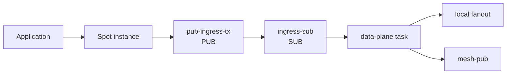
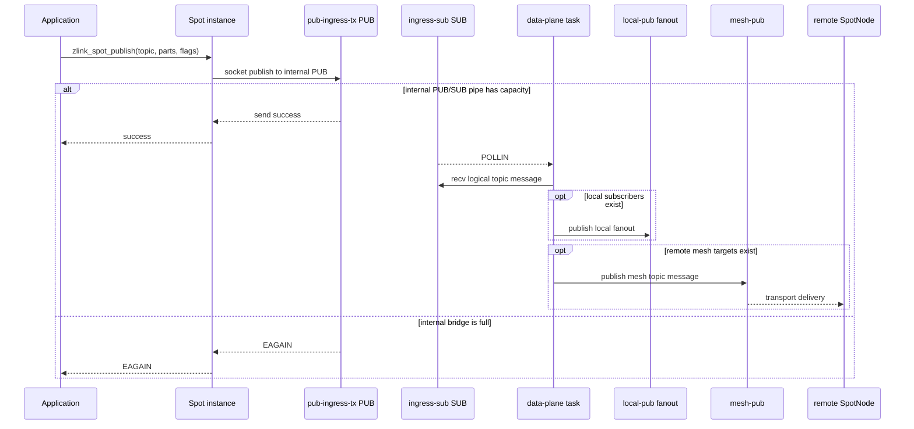
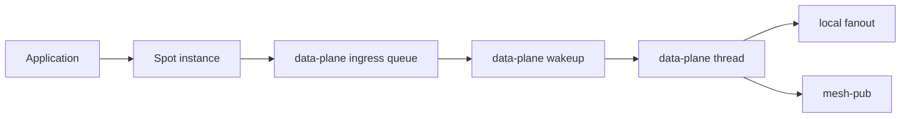
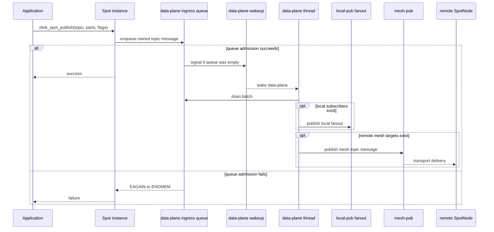
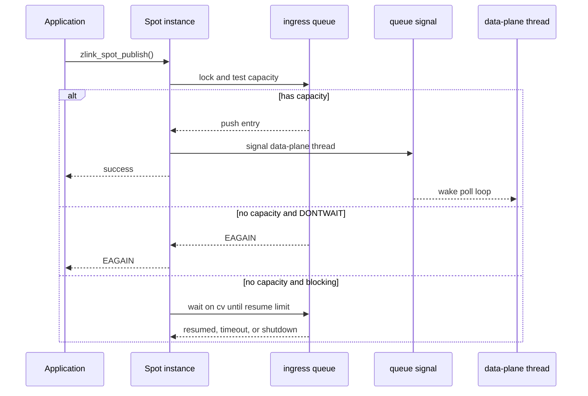
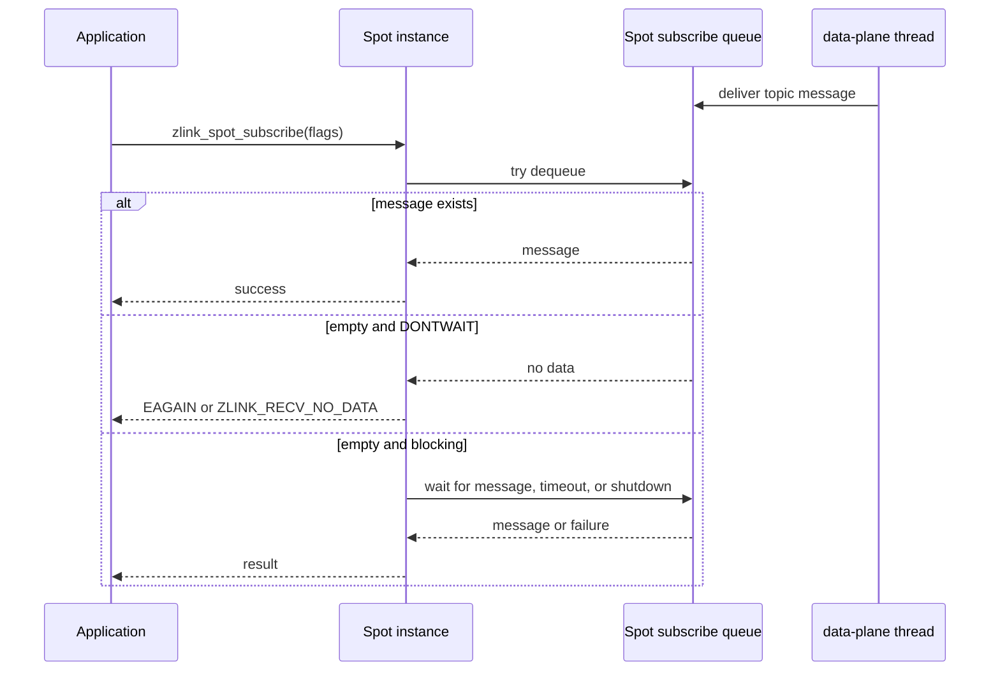

# SPOT Publish Data Plane Ingress 정리 초안

> **이 문서는 구현 전 초안이며 현재 공개 계약이 아니다.**
> 아래 내용은 `core/src/services/spot/` 내부 구조를 정리하기 위한 설계안이다.
> 공개 API 계약은 여전히 `core/include/zlink.h`와
> `doc/spec/core/service/spot.ko.md`를 기준으로 한다.

이 초안은 `Spot instance`에서 발생한 topic publish가 data-plane으로 들어가는 경로를
정리한다. 목표는 public publish 호출자가 내부 socket 배선과 HWM 조합을 알지 않아도
되게 하고, `SpotNode`가 소유한 data-plane이 local fanout과 mesh publish를 한곳에서
처리하도록 만드는 것이다.

## 용어

이 문서에서는 혼동을 피하기 위해 아래 용어를 고정한다.

| 용어 | 의미 |
|------|------|
| `Spot instance` | 사용자가 `zlink_spot_new(node)`로 받은 `Spot` 핸들 하나 |
| `Spot state` | `Spot instance`가 내부에서 가리키는 subscription, receive queue, dispatch 상태 |
| `SpotNode publish ingress queue` | 같은 `SpotNode`에 속한 모든 `Spot instance`의 publish가 공유하는 data-plane 입력 queue |
| `Spot subscribe queue` | 특정 `Spot state`가 소유하는 수신 queue |
| AS-IS data-plane task | 현재 구현에서 `SpotNode`의 data-plane 처리를 수행하는 periodic task. context의 service-data runtime thread에서 실행된다 |
| TO-BE data-plane thread | 이 초안에서 선택하는 실행 모델. `SpotNode` 하나가 자신의 data-plane 전용 OS thread 하나를 가진다 |
| service-data runtime thread | 현재 구현에서 context가 만드는 service runtime thread. transport I/O를 처리하는 `io_thread_t`와는 다른 실행 주체다 |

일반적인 사용에서는 `Spot instance` 하나가 `Spot state` 하나를 가진다. 따라서 사용자
관점에서는 "Spot마다 subscribe queue가 있다"고 이해하면 된다. 다만 내부 문서에서는 핸들
객체와 실제 queue 소유 상태를 구분하기 위해 `Spot state`라고 부른다.

이 초안의 핵심은 아래처럼 정리된다.

```text
SpotNode
  publish ingress queue: one

Spot instance A
  Spot state A
    subscribe queue A

Spot instance B
  Spot state B
    subscribe queue B
```

즉 publish queue는 `SpotNode`당 하나이고, subscribe queue는 각 `Spot state`마다 하나다.
현재 구현의 data-plane은 `SpotNode`마다 새 OS thread를 만드는 구조가 아니다. `SpotNode`는
context의 service-data runtime에 data-plane task를 등록하고, 해당 task가 주기 실행 또는
wakeup으로 실행된다. 이 초안의 TO-BE는 이 부분도 함께 바꿔서 `SpotNode`당 data-plane
thread 하나를 둔다.

## AS-IS: 현재 구조

현재 SPOT topic publish 경로는 `Spot instance`가 `pub-ingress-tx` 내부 `PUB` socket에
메시지를 쓰고, data-plane task가 `ingress-sub` 내부 `SUB` socket에서 이를 읽은 뒤
local fanout과 `mesh-pub` publish를 수행한다.



현재 구조에서 `pub-ingress-tx`와 `ingress-sub`는 public publish와 data-plane 사이의
inproc bridge 역할을 한다. 이 bridge는 transport socket이 아니지만 socket HWM과
message unit 정책을 따른다.

### AS-IS 시퀀스



이 흐름에서 `EAGAIN`은 remote peer나 `mesh-pub` 때문이 아닐 수 있다. data-plane이
아직 내부 `ingress-sub`를 충분히 drain하지 못한 경우에도 public publish는 실패한다.

### AS-IS 소켓 구성

| Socket | 소유자 | 역할 | 문제점 |
|--------|--------|------|--------|
| `pub-ingress-tx` | `SpotNode` runtime sender cache | public publish 입력을 내부 PUB로 송신 | public 호출 경로가 내부 socket HWM에 걸린다 |
| `ingress-sub` | data-plane runtime | 내부 PUB 입력 수신 | transport가 아닌 staging인데 socket HWM 의미를 갖는다 |
| `local-pub` | data-plane runtime | local subscriber fanout | data-plane 소유로 유지해야 한다 |
| `mesh-pub` | data-plane runtime | remote topic publish | public thread가 직접 쓰면 소유권이 깨진다 |

이 구조는 public API 호출 경로에 내부 socket hop을 노출한다. 사용자는 외부 peer로
publish한다고 생각하지만 실제로는 먼저 같은 프로세스의 내부 PUB/SUB 큐 한도에 걸릴 수
있다. HWM profile이나 message unit을 조절하면 외부 네트워크 큐뿐 아니라 내부 전달 큐의
동작까지 함께 바뀐다.

## 문제

### 1. 내부 배선이 public publish 의미를 흔든다

`zlink_spot_publish(spot, ...)`가 `EAGAIN`을 반환할 때 원인이 외부 mesh backpressure인지,
data-plane이 아직 내부 `ingress-sub`를 충분히 drain하지 못한 것인지 호출자는 구분할 수
없다. 이는 정보 은닉이 깨진 상태다.

### 2. HWM 조절 지점이 너무 민감하다

`pub-ingress-tx`와 `ingress-sub`의 HWM을 작게 잡으면 단일 SPOT throughput이 내부 hop에
막힌다. 반대로 크게 잡으면 active phase에서 큐 체류 시간이 커져 latency가 커진다. 내부
큐 수치가 public 성능 의미를 좌우하는 것은 모듈 경계가 얕다는 신호다.

### 3. `mesh-pub` 직접 사용은 소유권을 깨뜨린다

겉보기에는 `pub-ingress-tx`를 없애고 public publish가 `mesh-pub`에 바로 쓰면 단순해
보인다. 그러나 `mesh-pub`는 data-plane 실행 주체가 소유한다. public thread가 직접 쓰면
socket 소유권, poller 관심사, shutdown 순서가 모두 섞인다.

## POSD 관점의 위험 신호

| 위험 신호 | 현재 증상 | 위반 원칙 |
|-----------|-----------|-----------|
| 얕은 모듈 | 내부 PUB/SUB hop이 public publish 성능과 오류 의미를 결정한다 | 깊은 모듈 |
| 정보 누출 | 내부 socket HWM과 message unit을 사용자가 추론해야 한다 | 정보 은닉 |
| 특수·범용 코드 혼합 | transport publish와 inproc staging이 같은 socket 정책을 공유한다 | 복잡성을 아래로 |
| 오류 노출 | 내부 hop의 `EAGAIN`이 외부 backpressure처럼 보인다 | 오류를 정의로 없애라 |

## 설계 대안

### 대안 A: 내부 ingress HWM을 크게 잡는다

`pub-ingress-tx`와 `ingress-sub`의 HWM floor를 키워 public publish가 내부 hop에서 덜
막히게 한다.

- 장점: 변경 범위가 작다.
- 단점: 내부 큐 체류 시간이 커져 latency가 나빠진다.
- 단점: 내부 socket hop이 public 의미를 흔드는 근본 문제는 남는다.

이 대안은 임시 완화책일 뿐이다. 최종 설계로 선택하지 않는다.

### 대안 B: public publish가 `mesh-pub`에 직접 쓴다

`pub-ingress-tx`와 `ingress-sub`를 없애고 `Spot instance`가 `mesh-pub`를 찾아 직접
publish한다.

- 장점: 내부 PUB/SUB hop이 사라진다.
- 단점: `mesh-pub`의 실행 소유권이 깨진다.
- 단점: local fanout과 mesh publish의 순서 보장이 public thread와 data-plane 실행 주체로
  분산된다.
- 단점: shutdown 중 socket 접근 방지 조건이 복잡해진다.

이 대안은 성능은 좋아 보일 수 있지만 data-plane 소유권을 깨뜨린다. 선택하지 않는다.

### 대안 C: public publish는 data-plane queue에 enqueue하고 data-plane이 송신한다

public publish는 `SpotNode` runtime의 data-plane ingress queue에 메시지를 넣는다.
data-plane thread는 queue를 drain하면서 local fanout과 `mesh-pub` publish를 수행한다.

- 장점: `mesh-pub` 소유권이 data-plane에 남는다.
- 장점: 내부 PUB/SUB hop을 제거해 public publish가 socket 배선을 알 필요가 없다.
- 장점: backpressure 기준을 queue admission 정책으로 명확히 정의할 수 있다.
- 단점: queue 메모리 한도, wakeup, shutdown drain 정책을 명확히 구현해야 한다.

이 초안은 대안 C를 선택한다.

## 목표

1. `pub-ingress-tx`와 `ingress-sub` 내부 PUB/SUB hop을 제거한다.
2. `mesh-pub`는 data-plane thread만 사용한다.
3. public publish는 data-plane ingress queue에 메시지를 enqueue한다.
4. local fanout과 mesh publish 순서는 data-plane이 하나의 경로에서 결정한다.
5. 내부 queue admission 실패는 public publish의 backpressure로 정의한다.
6. 공개 API 시그니처와 public option은 추가하지 않는다.

## 비목표

- reliable pub/sub ack protocol을 추가하지 않는다.
- per-topic 또는 per-Spot public queue option을 추가하지 않는다.
- `mesh-pub`를 thread-safe public socket처럼 만들지 않는다.
- Discovery나 remote subscription protocol을 바꾸지 않는다.
- routed request/reply ingress 구조는 이 초안에서 바꾸지 않는다.
- `Spot subscribe queue`의 backlog limit이나 drop 정책을 새로 정의하지 않는다.

## TO-BE: 제안 구조

새 구조에서 public publish는 socket send가 아니라 runtime queue enqueue다. data-plane
thread만 `mesh-pub`와 local fanout을 사용한다.



### TO-BE 시퀀스



새 흐름에서 public publish의 admission 경계는 socket pipe가 아니라 명시적인
data-plane ingress queue다. `mesh-pub` 접근은 계속 data-plane thread 안에 머문다.

### TO-BE 소켓 구성

| Socket | 상태 | 역할 |
|--------|------|------|
| `pub-ingress-tx` | 제거 | queue enqueue로 대체 |
| `ingress-sub` | 제거 | queue drain으로 대체 |
| `local-pub` | 유지 | local subscriber fanout |
| `mesh-pub` | 유지 | remote topic publish |
| `mesh-xsub` | 유지 | remote subscription ingress |
| `peer_ctrl_pub` / `peer_ctrl_sub` | 유지 | peer control |

### AS-IS와 TO-BE 비교

| 항목 | AS-IS | TO-BE |
|------|-------|-------|
| public publish 첫 동작 | 내부 `PUB` socket send | runtime queue enqueue |
| data-plane 입력 | `ingress-sub` socket recv | queue batch drain |
| `mesh-pub` 소유권 | data-plane 소유 | data-plane 소유 유지 |
| 내부 backpressure | internal PUB/SUB HWM | queue admission 정책 |
| snapshot row | `pub-ingress-tx`, `ingress-sub` 존재 | 두 row 제거 |
| 주요 위험 | 내부 socket HWM이 public 의미를 흔듦 | queue 한도와 wakeup 정책을 명확히 관리해야 함 |

## Queue 소유권

| 항목 | 소유자 | 설명 |
|------|--------|------|
| ingress queue container | `spot_runtime_t` | public publish와 data-plane이 공유하는 staging queue |
| enqueue lock | `spot_runtime_t` | queue push/pop과 shutdown 전환을 보호한다 |
| queued message parts | queue entry | enqueue 시 multipart payload ownership을 queue entry로 이동한다 |
| queue drain | data-plane thread | local fanout과 mesh publish를 수행한다 |
| `mesh-pub` socket | data-plane thread | public thread가 직접 접근하지 않는다 |

queue entry는 topic 문자열과 multipart parts를 소유한다. enqueue 성공 후 public publish는
payload ownership을 더 이상 갖지 않는다. enqueue 실패 시 public publish가 기존 publish
호출과 같은 방식으로 입력 part를 정리한다.

### Spot subscribe queue 한도

이 초안에서는 `Spot subscribe queue`에 새 limit을 추가하지 않는다. 이 queue는
`Spot state`별 수신 backlog이며, public publish admission을 담당하는
`SpotNode publish ingress queue`와 다른 경계다.

이 구분은 중요하다. publish ingress queue는 send 호출자가 data-plane으로 메시지 ownership을
넘기기 전에 적용되는 backpressure 지점이다. 반면 subscribe queue는 data-plane이 이미
해당 `Spot state`로 delivery한 뒤 recv 호출자가 읽기 전까지 보관하는 수신 backlog다.

따라서 이 초안의 기준은 아래와 같다.

| 항목 | 초안 기준 |
|------|------------|
| `SpotNode publish ingress queue` | limit 있음. send flag와 `SNDTIMEO`가 적용된다 |
| `Spot subscribe queue` | 새 limit 없음. recv flag와 `RCVTIMEO`만 dequeue 동작에 적용된다 |

`Spot subscribe queue`에 limit을 걸려면 "가득 찼을 때 drop할지, data-plane을 막을지, 특정
Spot만 닫을지"를 새로 정해야 한다. 이는 publish ingress refactor보다 큰 계약 변경이다.
특히 data-plane을 막으면 느린 subscriber 하나가 같은 node의 fanout과 mesh publish까지
늦출 수 있고, drop을 선택하면 pub/sub delivery 의미가 바뀐다. 그래서 이 초안에서는
subscribe backlog 정책을 바꾸지 않는다.

### 내부 자료구조 초안

첫 구현은 새 public type을 만들지 않는다. 아래 구조는 `core/src/services/spot/` 내부
전용이다.

```cpp
struct spot_publish_ingress_entry_t
{
    std::string topic;
    spot_owned_msg_parts_t parts;
    size_t bytes;
    bool need_local;
    bool need_mesh;
};

struct spot_publish_ingress_queue_t
{
    mutex_t sync;
    condition_variable_t cv;
    std::deque<spot_publish_ingress_entry_t> entries;
    size_t queued_bytes;
    size_t queued_messages;
    size_t hard_message_limit;
    size_t hard_byte_limit;
    size_t resume_message_limit;
    size_t resume_byte_limit;
    bool backpressure_active;
    bool closing;
};
```

구현 위치는 `spot_runtime_execution_state_t` 아래가 적합하다. 이 상태는 data-plane 실행
상태와 protocol state를 함께 들고 있으므로, publish ingress queue와 data-plane thread 상태도
runtime 실행 상태로 묶을 수 있다.

```cpp
struct spot_runtime_execution_state_t
{
    ...
    spot_publish_ingress_queue_t publish_ingress;
};
```

`spot_publish_ingress_entry_t::parts`는 enqueue 성공 시 입력 multipart의 소유권을
가져간다. 구현은 기존 `spot_owned_msg_parts_t`와 `spot_copy_publish_parts_to_block_local`
또는 `spot_data_plane_pending_t::copy_msg_parts_to_owned()` 계열의 helper를 재사용한다.
문자열 topic과 multipart 복사는 lock 밖에서 먼저 준비하고, lock 안에서는 queue 한도 검사와
push만 수행한다.

### Queue limit 운영 원칙

내부 queue limit은 새 튜닝 포인트가 아니다. 이 queue는 throughput을 높이기 위한 큰
버퍼가 아니라 public thread에서 data-plane thread로 ownership을 넘기는 짧은 staging
경계다. 따라서 운영 원칙은 아래처럼 둔다.

1. 별도 public option을 만들지 않는다.
2. queue message limit의 단일 기준은 기존 `SpotNode` pub/sub admission이다.
3. queue byte limit은 메모리 보호용 보조 한도이며 성능 튜닝 값으로 사용하지 않는다.
4. throughput이 낮다고 queue limit을 키우지 않는다. 그 경우 data-plane scheduling이나
   forwarding 병목을 먼저 본다.
5. queue full은 `SpotNode` local admission backpressure로 해석한다.

queue 한도는 메시지 수와 byte 수를 함께 본다. 메시지 수는 기존 HWM 정책과 연결하고, byte
수는 큰 메시지에서 메모리가 과도하게 늘어나는 것을 막기 위한 안전장치로만 사용한다.

| 값 | 계산 |
|----|------|
| `message_unit` | `ZLINK_OPT_AUTO_HWM_MSG_UNIT_BYTES`가 있으면 그 값, 없으면 publish payload 크기 기준 |
| `admission_slots` | `ZLINK_SPOT_NODE_OPT_PUBSUB_HWM` override 또는 auto-HWM pub/sub admission plan |
| `hard_message_limit` | `max(1, admission_slots)` |
| `hard_byte_limit` | `max(hard_message_limit * message_unit, current_message_bytes)` |
| `resume_message_limit` | `hard_message_limit / 2`, 단 `hard_message_limit == 1`이면 `0` |
| `resume_byte_limit` | `hard_byte_limit / 2`, 단 단일 large message 보정은 유지 |
| large message 보정 | 단일 메시지 하나는 항상 admission 검사를 통과할 수 있어야 한다 |

이 초안은 내부 queue가 socket HWM을 그대로 모방하지 않도록 메시지 수와 byte 수를 동시에
둔다. 작은 메시지에서는 메시지 수가 admission을 제한하고, 큰 메시지에서는 byte limit이
메모리 증가를 제한한다.

manual `ZLINK_SPOT_NODE_OPT_PUBSUB_HWM`이 설정되어 있으면 `admission_slots`는 그 값을
따른다. manual socket buffer option은 queue byte limit을 직접 바꾸지 않는다. socket
buffer는 transport socket에 대한 옵션이고, queue는 data-plane admission 상태이기 때문이다.

auto-HWM profile은 `admission_slots`를 통해서만 queue message limit에 영향을 준다.
`compact`, `balanced`, `throughput` 같은 profile별 별도 queue table을 만들지 않는다. 별도
table을 두면 내부 queue가 두 번째 HWM 정책이 되어 public publish 의미가 다시 복잡해진다.

운영 중 queue full이 자주 보인다면 queue limit을 먼저 키우지 않는다. 아래 순서로 본다.

1. data-plane thread가 queue signal로 즉시 깨는지 확인한다.
2. `drain_publish_ingress_queue()`가 pending flush보다 먼저 실행되는지 확인한다.
3. local fanout 또는 `mesh-pub` pending queue가 `EAGAIN`으로 계속 막히는지 확인한다.
4. 그 뒤에도 정상 traffic에서 queue full이면 `SpotNode` pub/sub admission 자체를 조정한다.

이 순서를 문서화하는 이유는 내부 queue limit이 운영자가 직접 만지는 hidden knob이 되면
AS-IS의 내부 HWM 문제를 반복하기 때문이다.

## Backpressure 의미

data-plane ingress queue는 명시적인 admission 경계다.

| 상황 | public publish 결과 |
|------|---------------------|
| queue에 자리가 있음 | 성공 |
| queue가 가득 참, `ZLINK_DONTWAIT` 설정 | `EAGAIN` |
| queue가 가득 참, blocking publish | 자리가 날 때까지 대기하거나 send timeout 적용 |
| node shutdown 진행 중 | `ESHUTDOWN` |
| 메모리 할당 실패 | `ENOMEM` |

동작 의미는 기존 socket send와 맞춘다. queue가 hard limit에 도달하면 backpressure가
걸린다. `ZLINK_DONTWAIT` 호출은 즉시 `EAGAIN`을 받는다. blocking 호출은 queue가 resume
limit 아래로 내려가거나 timeout/shutdown이 발생할 때까지 기다린다.

backpressure는 hysteresis를 둔다. 즉 하나가 빠질 때마다 바로 풀지 않고, queue가 대략 절반
정도 비워졌을 때 풀린다.

| 상태 | 조건 | 의미 |
|------|------|------|
| backpressure on | `queued_messages >= hard_message_limit` 또는 `queued_bytes >= hard_byte_limit` | 새 nonblocking publish는 `EAGAIN` |
| backpressure off | `queued_messages <= resume_message_limit` 그리고 `queued_bytes <= resume_byte_limit` | waiting publisher를 깨워 enqueue 재시도 |

이 hysteresis는 full/one-slot-free 상태에서 publisher가 계속 깨었다 잠드는 현상을 줄이기 위한
것이다. limit이 아주 작아 `hard_message_limit == 1`이면 resume 기준은 `0`이다. 이 경우
data-plane이 해당 메시지를 가져가 queue가 비어야 다음 publish가 들어온다.

queue 한도는 기존 auto-HWM 값을 새로 해석하지 않는다. 내부 queue는 socket이 아니므로
socket HWM 계산식을 복제하지 않고, `SpotNode` pub/sub admission 결과만 받아서 message
slot 한도로 사용한다. byte budget은 별도 튜닝 축이 아니라 메모리 보호 장치다. 이렇게 해야
작은 메시지에서 무제한에 가깝게 쌓이거나 큰 메시지에서 메모리를 과도하게 쓰는 일을 피할 수
있다.

### Enqueue 알고리즘

public publish 경로는 아래 순서를 따른다.

1. `SpotNode` shutdown 상태와 public API admission을 먼저 확인한다.
2. topic과 multipart parts를 queue entry로 복사한다.
3. `publish_ingress.sync`를 잡는다.
4. `closing == true`이면 entry를 정리하고 `ESHUTDOWN`을 반환한다.
5. queue capacity가 충분하면 entry를 push하고 counters를 갱신한다.
6. push로 hard limit에 도달하면 `backpressure_active = true`로 둔다.
7. push 전 queue가 비어 있었으면 lock 해제 뒤 data-plane thread를 깨운다.
8. `ZLINK_DONTWAIT`이고 capacity가 부족하면 `EAGAIN`을 반환한다.
9. blocking publish이고 capacity가 부족하면 `cv`에서 backpressure off를 기다린다.
10. send timeout이 지나면 `EAGAIN`을 반환한다.

blocking wait는 기존 `SNDTIMEO` 의미와 맞춘다. timeout이 `0`이면 즉시 실패하고, 음수이면
무기한 대기한다. 대기 중 shutdown이 시작되면 `ESHUTDOWN`을 반환한다.



## Recv flag 의미

이 초안은 publish ingress 구조만 바꾼다. recv 경로의 public flag 의미는 바꾸지 않는다.
`zlink_spot_subscribe()`와 SPOT recv 계열 API는 기존 socket recv와 같은 방향으로 동작해야
한다.

`Spot subscribe queue`가 비어 있다는 사실만으로 recv가 실패해야 한다는 뜻은 아니다.
빈 queue는 "아직 읽을 메시지가 없다"는 상태일 뿐이다. 반환 여부는 호출자가 기다릴 수
있는 모드로 호출했는지에 따라 결정한다.

| 상황 | 결과 |
|------|------|
| Spot subscribe queue에 메시지 있음 | 즉시 성공 |
| queue가 비어 있고 `ZLINK_DONTWAIT` | 기다리지 않고 `EAGAIN` 또는 `ZLINK_RECV_NO_DATA` 반환 |
| queue가 비어 있고 `RCVTIMEO=0` | 기다리지 않고 `EAGAIN` 또는 `ZLINK_RECV_NO_DATA` 반환 |
| queue가 비어 있고 `RCVTIMEO>0` | 메시지가 들어오거나 timeout이 날 때까지 대기 |
| queue가 비어 있고 `RCVTIMEO<0` | 메시지가 들어오거나 shutdown될 때까지 무기한 대기 |
| shutdown 중 | `ESHUTDOWN` 또는 closed queue 결과 |

publish ingress queue가 꽉 차는 것은 recv flag 의미에 영향을 주지 않는다. recv는
해당 `Spot state`의 subscribe queue를 읽는다. publish queue는 data-plane으로 보내기 전
단계이고, recv queue는 data-plane이 이미 delivery한 뒤 단계다.

즉 `EAGAIN`은 "subscriber queue가 비어서 오류"라는 뜻이 아니다. `DONTWAIT` 또는
`RCVTIMEO=0` 때문에 기다릴 수 없으므로 "지금 받을 메시지가 없다"를 표현하는 결과다.
blocking recv가 빈 queue만 보고 바로 `EAGAIN`을 반환하면 안 된다.



정리하면 send flag는 publish ingress queue admission에 적용되고, recv flag는
`Spot subscribe queue` dequeue에 적용된다. 두 flag는 같은 `DONTWAIT` 의미를 갖지만 서로
다른 queue 경계에서 판단된다.

## Drain 순서

data-plane은 ingress queue entry 하나에 대해 아래 순서를 유지한다.

1. data-plane이 queue entry를 local batch로 옮기며 ownership을 가져간다.
2. 이 시점에 ingress queue에서는 entry가 제거되고 queue counters가 줄어든다.
3. local subscriber가 있으면 local fanout을 먼저 시도한다.
4. remote mesh 대상이 있으면 `mesh-pub` publish를 시도한다.
5. 둘 중 하나가 `EAGAIN`이면 기존 staged message queue에 남기고 다음 poll cycle에서
   다시 시도한다.

이 순서는 기존 `recv_and_forward_ingress()`의 논리와 맞춘다. 차이는 source가
`ingress-sub` socket recv가 아니라 runtime queue pop이라는 점이다.

publish ingress queue의 limit은 data-plane으로 ownership을 넘기기 전까지만 적용된다.
data-plane이 entry를 가져간 뒤 local fanout이나 mesh publish가 막히면 그 상태는 기존
staged message queue가 관리한다. 따라서 ingress queue counter는 downstream socket send가
끝날 때까지 붙잡아 두지 않는다.

### Drain 알고리즘

data-plane thread의 loop는 기존 pending flush보다 먼저 ingress queue를 drain한다. 이렇게 해야
새 publish가 빠르게 staged queue 또는 transport socket으로 이동한다. 기존 구현의
`service_runtime_sockets()`에 들어 있던 socket command pump, pending flush, poller interest
갱신 흐름은 data-plane thread loop 안으로 옮긴다.

1. `publish_ingress.sync`를 잡고 batch 한도까지 entry를 local vector로 move한다.
2. queue counters를 줄인다.
3. queue가 resume limit 이하가 되면 `backpressure_active = false`로 바꾸고
   `cv.broadcast()`로 blocking publisher를 깨운다.
4. lock을 놓는다.
5. 각 entry를 기존 forwarding helper로 처리한다.
6. local fanout이나 mesh publish가 `EAGAIN`이면 기존 `stage_message()` 경로로 넘긴다.
7. staged queue에 들어간 entry는 기존 `flush_staged_messages()`가 이어서 처리한다.

batch 한도는 기존 ingress socket drain 정책과 맞춘다.

| 한도 | 값 |
|------|----|
| message batch | `ingress_forward_batch_limit`와 동일한 2048 |
| byte batch | `ingress_forward_batch_bytes_limit`와 동일한 16 MiB |

이 한도는 data-plane이 queue drain만 하느라 peer control, routed, mesh subscription 처리를
굶기지 않도록 둔다.

### Forwarding helper 분리

`spot_data_plane_forwarding.cpp`는 source가 socket인지 queue인지에 관계없이 같은 publish
처리를 사용할 수 있어야 한다. 첫 구현에서는 아래처럼 helper를 분리한다.

| Helper | 역할 |
|--------|------|
| `forward_ingress_entry(runtime, state, topic, parts)` | local fanout과 mesh publish를 수행 |
| `recv_and_forward_ingress(src, ...)` | socket recv 후 `forward_ingress_entry()` 호출 |
| `drain_publish_ingress_queue(runtime, state)` | runtime queue pop 후 `forward_ingress_entry()` 호출 |

이렇게 하면 AS-IS 경로를 제거하기 전에도 두 경로를 잠시 병행해 테스트할 수 있다. 최종
단계에서는 `recv_and_forward_ingress()`와 `state_->ingress`를 제거한다.

## Wakeup 정책

enqueue가 빈 queue를 non-empty로 바꾸면 `SpotNode`의 data-plane thread를 깨운다. 이 초안의
TO-BE에서는 기존 service-data runtime의 `wakeup_task()`를 사용하지 않는다. data-plane이
`SpotNode` 전용 thread로 바뀌기 때문이다.

첫 구현은 publish ingress queue 안에 wakeup 상태를 둔다. public publish는 queue lock 안에서
empty-to-non-empty 전환을 확인하고, lock을 놓은 뒤 data-plane thread에 signal을 보낸다.

```cpp
if (was_empty)
    publish_ingress_signal.notify();
```

구현은 기존 `signaler_t` 또는 condition variable 중 하나를 선택한다. 중요한 기준은 아래와
같다.

| 방식 | 기준 |
|------|------|
| `signaler_t` | data-plane poll loop가 socket poller와 같은 흐름에서 queue wakeup을 처리해야 할 때 선택 |
| condition variable | data-plane loop가 별도 wait 구간에서 queue와 shutdown을 함께 기다릴 수 있을 때 선택 |

어떤 방식을 쓰든 enqueue마다 control socket command를 보내지 않는다. 그러면 public publish가
다시 control socket 왕복에 묶여 AS-IS의 내부 socket hop 문제를 반복하기 때문이다.

wakeup은 coalescing되어도 된다. queue가 이미 non-empty라면 추가 publish마다 signal을 보낼
필요가 없다. data-plane thread는 한 번 깨어났을 때 batch 단위로 queue를 drain한다.

## Shutdown 정책

shutdown은 아래 순서를 따른다.

1. `SpotNode`가 public API admission을 닫는다.
2. 새 publish enqueue를 거부하고 `ESHUTDOWN`을 반환한다.
3. data-plane은 이미 enqueue된 entry를 정해진 timeout 안에서 drain한다.
4. timeout이 지나면 남은 queue entry의 multipart parts를 정리한다.
5. `mesh-pub`, local fanout socket, data-plane state를 닫는다.

이 순서의 목적은 public thread가 data-plane 소유 socket에 접근하지 않게 만드는 것이다.

### Shutdown 세부 규칙

| 단계 | 동작 |
|------|------|
| public admission close | `service_public_api_scope_t`가 새 public call 진입을 막는다 |
| queue close | `publish_ingress.closing = true`, `cv.broadcast()` |
| data-plane wakeup | data-plane thread signal 호출 |
| graceful drain | shutdown timeout 안에서 queue와 staged messages를 drain |
| forced cleanup | 남은 queue entry와 staged entry의 parts를 close |
| socket teardown | `mesh-pub`, `local-pub`, control, router socket 순서로 닫음 |

queue close 이후 enqueue는 항상 `ESHUTDOWN`이다. 이미 enqueue된 entry는 graceful drain 대상이다.
forced cleanup 단계는 message ownership을 명확히 정리해야 하며, public thread가 entry를 다시
만지지 않는다.

## Socket snapshot 영향

`pub-ingress-tx`와 `ingress-sub`가 제거되면 `zlink_spot_node_internal_sockets_snapshot()`
결과에서 두 row가 사라진다. 이는 내부 snapshot 변화이며 공개 API 계약의 필드 추가나
삭제가 아니다. 다만 perf 출력과 내부 문서는 갱신해야 한다.

남는 topic 관련 socket은 아래와 같다.

| Socket | 역할 |
|--------|------|
| `local-pub` | local subscriber fanout |
| `mesh-pub` | remote topic publish |
| `mesh-xsub` | remote subscription ingress |
| `peer_ctrl_pub` / `peer_ctrl_sub` | peer control |

## 구현 불변식

구현 중 아래 조건은 항상 유지해야 한다.

1. public thread는 `mesh-pub`, `local-pub`, `mesh-xsub`를 직접 호출하지 않는다.
2. queue entry의 multipart ownership은 한 번만 이동한다.
3. queue counters는 `entries`와 항상 일치해야 한다.
4. queue lock을 잡은 상태에서 socket send/recv를 호출하지 않는다.
5. data-plane은 queue entry를 local vector로 옮긴 뒤 lock 밖에서 forwarding한다.
6. shutdown 후 새 enqueue는 항상 실패한다.
7. forced cleanup은 남은 entry의 모든 `zlink_msg_t` part를 닫는다.
8. `pub-ingress-tx`와 `ingress-sub` 제거 후 snapshot에 두 row가 남지 않는다.
9. blocking recv는 빈 `Spot subscribe queue`만 보고 즉시 `EAGAIN`을 반환하지 않는다.
10. `SpotNode` 하나는 data-plane thread 하나만 만들고, `Spot instance` 수에 따라 thread를
    늘리지 않는다.
11. SPOT data-plane 실행은 service-data runtime periodic task에 의존하지 않는다.

## 오류 처리 기준

| 위치 | 오류 | 처리 |
|------|------|------|
| entry 복사 | `ENOMEM` | public publish 실패, 입력 part 정리 |
| enqueue admission | `EAGAIN` | `ZLINK_DONTWAIT` 또는 timeout일 때 반환 |
| enqueue 중 shutdown | `ESHUTDOWN` | public publish 실패 |
| data-plane local fanout | `EAGAIN` | staged queue로 이동 |
| data-plane mesh publish | `EAGAIN` | staged queue로 이동 |
| staged queue push 실패 | `ENOMEM` | data-plane fault로 기록 |
| recv no data | `EAGAIN` 또는 `ZLINK_RECV_NO_DATA` | `DONTWAIT` 또는 recv timeout일 때만 호출자에게 반환 |
| forced shutdown cleanup | 없음 | 남은 entry를 닫고 버림 |

data-plane forwarding에서 `EAGAIN`은 fatal error가 아니다. 기존 staged message 경로로
흡수해야 한다. `ENOMEM`, invalid state, socket fault는 기존 data-plane fault 처리에 맞춘다.

## 구현 단계

1. `spot_runtime_execution.hpp`에 publish ingress queue 상태를 추가한다.
2. `spot_data_plane_forwarding.cpp`에 `forward_ingress_entry()`를 분리한다.
3. `spot_data_plane_forwarding.cpp`에 `drain_publish_ingress_queue()`를 추가한다.
4. `spot_data_plane_loop.cpp`의 data-plane loop에서 queue drain을 호출한다.
5. `spot_subject_publish.cpp`에서 `spot_runtime_sender_pub_ingress` 사용을 enqueue 호출로
   바꾼다.
6. blocking publish wait와 `ZLINK_DONTWAIT` 실패 의미를 구현한다.
7. `spot_runtime.cpp`의 startup에서 `ensure_sender_socket(spot_runtime_sender_pub_ingress)`
   선생성을 제거한다.
8. `spot_runtime_sender.cpp`에서 `spot_runtime_sender_pub_ingress` 분기와 endpoint 관리를
   제거한다.
9. `spot_data_plane_runtime.cpp`에서 `ingress-sub` 생성, bind, poller add를 제거한다.
10. `spot_node_handles.cpp`와 HWM refresh 경로에서 `pub-ingress-tx`, `ingress-sub` 처리를
    제거한다.
11. `spot_node_summary.cpp` snapshot 출력에서 두 socket row를 제거한다.
12. data-plane 실행 모델을 service-data runtime periodic task에서 `SpotNode` 전용 thread로
    바꾼다.
13. SPOT data-plane만 위해 존재하던 service-data runtime 생성, 선택, ctx accessor 경로를
    제거한다.
14. shutdown 코드에서 `pub_ingress_tx`, `local_pub_ingress_sub`,
    `pub_ingress_sender_endpoint` 정리를 제거하고 queue close/drain 정리를 추가한다.
15. perf의 Auto-HWM detail 출력 기대값을 새 socket 구성에 맞춘다.
16. 내부 문서 `doc/internals/spot-internals.ko.md`는 구현 완료 후 갱신한다.

### 파일별 변경 범위

| 파일 | 변경 |
|------|------|
| `spot_runtime.hpp` | service-data runtime 포인터 제거, data-plane thread lifecycle 필드 정리 |
| `spot_runtime_execution.hpp/.cpp` | queue 상태, close, capacity 계산, enqueue helper, data-plane thread 상태 |
| `spot_subject_publish.cpp` | public publish를 queue enqueue로 변경 |
| `spot_data_plane_forwarding.cpp` | forwarding 공통 helper와 queue drain 추가 |
| `spot_data_plane_loop.cpp` | loop마다 queue drain 호출 |
| `spot_data_plane_runtime.cpp` | `ingress-sub` 생성과 poller 등록 제거 |
| `spot_runtime.cpp` | startup의 `pub-ingress-tx` 선생성 제거, data-plane thread 시작 |
| `spot_runtime_sender.cpp` | `spot_runtime_sender_pub_ingress` 제거 |
| `spot_runtime_shutdown.cpp` | queue close/drain/cleanup 추가, ingress socket cleanup 제거, data-plane thread join |
| `ctx.cpp/.hpp` | service-data runtime accessor 제거 |
| `ctx_runtime_resources.cpp/.hpp` | SPOT data-plane용 service-data runtime 생성과 lookup 제거 |
| `spot_node_handles.cpp` | HWM refresh에서 removed socket 처리 제거 |
| `spot_node_summary.cpp` | internal socket snapshot row 제거 |
| `unittest_spot_subject_access.cpp` | snapshot 기대값과 publish path 회귀 갱신 |
| `bindings/c/perf/*` | SPOT Auto-HWM detail에서 제거된 rows 반영 |

### 중간 병행 단계

리스크를 줄이기 위해 구현은 두 단계로 나눈다.

1. queue path를 추가하되 `ingress-sub` socket path를 유지한다. public publish만 queue path를
   사용하게 하고, 기존 socket path 테스트가 깨지지 않는지 확인한다.
2. data-plane 실행 모델을 `SpotNode` 전용 thread로 바꾸고 shutdown join을 고정한다.
3. queue path 검증이 끝나면 `pub-ingress-tx`와 `ingress-sub`를 제거한다.

이 순서를 따르면 forwarding helper 분리 문제와 socket 제거 문제를 한 번에 디버깅하지 않아도
된다.

## 테스트 계획

| 테스트 | 검증 내용 |
|--------|-----------|
| `unittest_spot_subject_access` | snapshot row 변화와 public publish route |
| `unittest_spot_data_plane_budget` | queue admission과 기존 HWM 옵션 round-trip |
| `test_spot_pubsub_scenario` | local/remote pubsub end-to-end |
| single SPOT perf | `io_threads=4` 기본에서 throughput 회복 유지 |
| multi SPOT perf | `MULTI_SPOT`, `MULTI_SPOT_REQREP`, `MULTI_SPOT_SENDSEND` 회귀 |
| shutdown 회귀 | queued publish가 남은 상태에서 node destroy가 종료되는지 확인 |

### 필수 회귀 케이스

| ID | 케이스 | 기대 |
|----|--------|------|
| PUBQ-01 | local subscriber만 있는 SPOT publish | subscriber가 message를 받는다 |
| PUBQ-02 | remote peer만 있는 SPOT publish | remote subscriber가 message를 받는다 |
| PUBQ-03 | local subscriber와 remote peer가 모두 있음 | 둘 다 같은 topic message를 받는다 |
| PUBQ-04 | `ZLINK_DONTWAIT`에서 queue full | publish가 `EAGAIN`을 반환한다 |
| PUBQ-05 | blocking publish에서 queue full 후 drain | publish가 timeout 전에 성공한다 |
| PUBQ-06 | blocking publish timeout | publish가 `EAGAIN`을 반환한다 |
| PUBQ-07 | node shutdown 중 publish | publish가 `ESHUTDOWN`을 반환한다 |
| PUBQ-08 | shutdown 중 queued messages 존재 | destroy가 timeout 안에 끝나고 leak이 없다 |
| PUBQ-09 | snapshot after startup | `pub-ingress-tx`, `ingress-sub` row가 없다 |
| PUBQ-10 | perf Auto-HWM detail | 제거된 socket row 없이 출력이 완성된다 |
| PUBQ-11 | queue hard limit 도달 | `backpressure_active == true`가 된다 |
| PUBQ-12 | queue가 hard limit에서 1개만 비워짐 | blocking publisher를 깨우지 않는다 |
| PUBQ-13 | queue가 resume limit 이하로 비워짐 | blocking publisher를 깨워 enqueue를 재시도한다 |
| PUBQ-14 | `hard_message_limit == 1` | queue가 완전히 비워진 뒤에만 다음 publish가 들어온다 |
| PUBQ-15 | large message 1개가 `hard_byte_limit`보다 큼 | 단일 메시지 하나는 enqueue된다 |
| PUBQ-16 | large message가 이미 queue에 있고 다음 large message가 들어옴 | 두 번째 publish는 backpressure를 따른다 |
| PUBQ-17 | multipart publish | 모든 part가 순서와 크기를 유지해 subscriber에게 전달된다 |
| PUBQ-18 | enqueue 실패 후 입력 part ownership | 입력 part가 leak 없이 닫힌다 |
| PUBQ-19 | enqueue 성공 후 data-plane forwarding 실패 | queue entry ownership이 staged queue 또는 cleanup 경로로 한 번만 이동한다 |
| PUBQ-20 | public publish 중 data-plane thread wakeup 실패 | publish는 성공하되 다음 loop에서 drain된다 |
| PUBQ-21 | same SpotNode 안에 여러 Spot instance 존재 | instance 수만큼 publish queue가 생기지 않는다 |
| PUBQ-22 | 여러 publisher thread가 동시에 publish | queue counters가 깨지지 않고 메시지 손실이 없다 |
| PUBQ-23 | local subscriber가 느려 local pending queue가 찬 상태 | data-plane은 staged queue로 넘기고 public thread는 socket을 직접 만지지 않는다 |
| PUBQ-24 | remote `mesh-pub`가 `EAGAIN`을 반환 | data-plane은 staged mesh 경로로 넘기고 fatal fault로 처리하지 않는다 |
| PUBQ-25 | subscription update와 publish가 동시에 발생 | aggregate subscription 상태와 publish delivery가 깨지지 않는다 |
| PUBQ-26 | routed request/reply 사용 | routed path는 기존처럼 동작하고 publish queue 영향을 받지 않는다 |
| PUBQ-27 | SPOT_REQREP / SPOT_SENDSEND 사용 | topic publish queue 변경으로 echo pattern이 실패하지 않는다 |
| PUBQ-28 | channel dealer queue 사용 | channel dealer별 queue 동작이 publish ingress queue와 독립적이다 |
| PUBQ-29 | SpotNode pub/sub HWM manual override | queue `admission_slots`가 override 값을 따른다 |
| PUBQ-30 | auto-HWM profile 변경 | queue limit은 profile별 별도 table이 아니라 pub/sub admission 결과만 따른다 |
| PUBQ-31 | `SNDTIMEO=0` blocking publish, queue full | 즉시 `EAGAIN`을 반환한다 |
| PUBQ-32 | `SNDTIMEO<0` blocking publish, queue full 후 drain | timeout 없이 기다렸다 성공한다 |
| PUBQ-33 | node destroy 중 waiting publisher 존재 | waiting publisher가 `ESHUTDOWN`으로 깨어난다 |
| PUBQ-34 | forced shutdown cleanup | 남은 queue entry와 staged entry의 모든 part가 닫힌다 |
| PUBQ-35 | internal socket snapshot after publish traffic | `pub-ingress-tx`, `ingress-sub`가 lazy-create되지 않는다 |
| PUBQ-36 | subscribe recv `ZLINK_DONTWAIT`, Spot subscribe queue empty | 즉시 `EAGAIN` 또는 `ZLINK_RECV_NO_DATA`를 반환한다 |
| PUBQ-37 | subscribe recv blocking, message later delivered | timeout 전에 message를 받는다 |
| PUBQ-38 | subscribe recv blocking timeout | `EAGAIN` 또는 `ZLINK_RECV_NO_DATA`를 반환한다 |
| PUBQ-39 | publish queue full 상태에서 subscriber recv | recv flag 의미가 변하지 않는다 |
| PUBQ-40 | shutdown 중 blocking recv | waiting receiver가 shutdown 결과로 깨어난다 |
| PUBQ-41 | slow Spot subscriber | 이 초안이 `Spot subscribe queue` limit이나 drop 정책을 새로 적용하지 않는다 |
| PUBQ-42 | same SpotNode 안에 여러 Spot instance 존재 | data-plane thread는 1개만 존재한다 |
| PUBQ-43 | 여러 SpotNode가 같은 context에 존재 | SpotNode 수만큼 data-plane thread가 존재하고 service-data runtime을 공유하지 않는다 |

### 회귀 테스트 배치

| 그룹 | 권장 위치 | 포함 케이스 |
|------|-----------|-------------|
| publish route | `unittest_spot_subject_access.cpp` | PUBQ-01, PUBQ-02, PUBQ-03, PUBQ-17 |
| queue admission | 새 unit 또는 `unittest_spot_data_plane_budget.cpp` | PUBQ-04, PUBQ-05, PUBQ-06, PUBQ-11, PUBQ-12, PUBQ-13, PUBQ-14, PUBQ-15, PUBQ-16, PUBQ-29, PUBQ-30, PUBQ-31, PUBQ-32 |
| ownership / cleanup | 새 unit | PUBQ-18, PUBQ-19, PUBQ-34 |
| shutdown | `test_spot_pubsub_scenario` 또는 새 e2e | PUBQ-07, PUBQ-08, PUBQ-33 |
| socket removal | `unittest_spot_subject_access.cpp` | PUBQ-09, PUBQ-21, PUBQ-35 |
| execution model | 새 unit 또는 runtime lifecycle unit | PUBQ-42, PUBQ-43 |
| recv flag | `unittest_spot_subject_access.cpp` 또는 SPOT recv unit | PUBQ-36, PUBQ-37, PUBQ-38, PUBQ-39, PUBQ-40, PUBQ-41 |
| interaction regression | existing e2e/perf | PUBQ-20, PUBQ-22, PUBQ-23, PUBQ-24, PUBQ-25, PUBQ-26, PUBQ-27, PUBQ-28 |

테스트는 queue 내부 값을 public API로 노출해서 확인하지 않는다. unit test가 내부 helper를 직접
검증해야 하면 `core/tests/unittest/`에서 internal header를 include하는 방식으로 제한한다.
public API test는 결과와 errno만 확인한다.

### 성능 확인 기준

성능 수치는 환경 영향을 받으므로 절대값을 public 계약으로 두지 않는다. 다만 구현 회귀 판단을
위해 아래 조건을 확인한다.

| Benchmark | 조건 |
|-----------|------|
| single SPOT 64B tcp | `io_threads=4` 기본에서 기존 queue path 대비 throughput 급락이 없어야 한다 |
| single SPOT 64B tcp | `pub-ingress-tx`, `ingress-sub` row가 출력되지 않아야 한다 |
| multi SPOT tcp/tls | `FAIL` 없이 모든 configured size가 완료되어야 한다 |
| multi SPOT_REQREP tcp/tls | 기존 `Kops/s` 결과가 유지되어야 한다 |
| multi SPOT_SENDSEND tcp/tls | 기존 `Kops/s` 결과가 유지되어야 한다 |

## 완료 기준

아래 항목이 모두 만족되면 이 초안은 구현 가능한 수준에서 완료된 것으로 본다.

1. public publish가 `spot_runtime_sender_pub_ingress`를 호출하지 않는다.
2. `spot_runtime_sender_pub_ingress` enum 또는 분기가 제거된다.
3. `spot_runtime_t`에서 `pub_ingress_tx`, `local_pub_ingress_sub`,
   `pub_ingress_endpoint`, `pub_ingress_sender_endpoint`가 제거된다.
4. data-plane runtime이 `ingress-sub`를 만들거나 poller에 등록하지 않는다.
5. snapshot과 perf 출력에서 `pub-ingress-tx`, `ingress-sub`가 사라진다.
6. local fanout과 mesh publish는 data-plane thread에서만 수행된다.
7. `SpotNode`마다 data-plane thread가 하나만 존재하고 `Spot instance` 수만큼 늘어나지 않는다.
8. data-plane 실행이 service-data runtime periodic task에 의존하지 않는다.
9. queue full, timeout, shutdown 오류 의미가 테스트로 고정된다.
10. shutdown path가 queued message를 leak 없이 정리한다.
11. core unit/e2e와 single/multi SPOT perf가 통과한다.

## 실행 모델

### 현재 구조

현재 구현 기준으로 data-plane은 `SpotNode`마다 항상 생기는 독립 OS thread가 아니다.
`SpotNode` runtime은 `ctx->service_data_runtime_for_key(node_id)`로 context의
service-data runtime 하나를 고르고, 그 runtime에 data-plane task를 periodic task로 등록한다.

`ZLINK_IO_THREADS`는 transport I/O thread 수에 영향을 준다. 동시에 현재 구현에서는
service-data runtime thread 수를 계산할 때도 같은 값을 사용한다. 다만 service-data runtime
thread가 `io_thread_t`에 포함되는 것은 아니다. 예를 들어 `ZLINK_IO_THREADS=4`이면 transport
I/O thread 4개와 service-data runtime thread 최대 4개가 별도로 만들어진다.

현재 코드에서 service-data runtime의 주요 사용자는 SPOT data-plane이다. `SpotNode` runtime은
이 runtime에 data-plane periodic task를 등록하고, task가 실행될 때 socket command pump,
local fanout flush, mesh publish flush, staged message flush, ingress drain, peer control 처리
등을 수행한다. discovery, monitor, auto-HWM, SPOT dispatch callback 같은 다른 service task는
주로 `service-ctrl` 또는 `spot-worker` runtime을 사용한다.

이 구조에서는 여러 `SpotNode`가 같은 service-data runtime thread를 공유할 수 있다. 그래서
SPOT data-plane의 지연이나 backpressure를 분석할 때 다른 service task와의 scheduler 공유까지
함께 보아야 한다.

이 설계에서 어색한 부분은 service-data runtime 개수가 `ZLINK_IO_THREADS`에 묶여 있다는 점이다.
transport I/O thread 수는 네트워크 session 처리량을 위한 값이고, SPOT data-plane 실행 주체
수는 `SpotNode` 수와 data-plane 작업량에 더 직접적으로 관련된다. 이 둘을 같은 설정값으로
묶으면 사용자가 I/O thread를 조절하다가 service-data scheduling까지 같이 바꾸게 된다.

### TO-BE 선택

이 초안은 `SpotNode`당 data-plane thread 하나를 두는 구조를 선택한다. thread는 `SpotNode`
runtime이 시작될 때 만들어지고, `SpotNode`가 종료될 때 닫힌다. `Spot instance`마다 thread를
만들지는 않는다.

이 선택의 이유는 아래와 같다.

| 항목 | 판단 |
|------|------|
| latency | queue enqueue 후 data-plane 실행이 shared periodic task scheduling에 덜 묶인다 |
| 소유권 | `mesh-pub`, `local-pub`, data-plane poller의 실행 주체가 `SpotNode` 안에서 고정된다 |
| 분석 가능성 | queue full 원인을 service-data runtime 공유가 아니라 해당 `SpotNode` data-plane 병목으로 좁힐 수 있다 |
| 비용 | `SpotNode`마다 OS thread 하나가 필요하다 |

이 비용은 받아들일 수 있다고 본다. `SpotNode`는 가벼운 per-client 객체가 아니라 node runtime
단위이며, 이 초안의 publish ingress queue도 `SpotNode`당 하나로 설계한다. 따라서 실행 주체도
같은 경계인 `SpotNode`에 맞추는 편이 더 단순하다.

이 선택을 하면 SPOT data-plane 실행은 `ZLINK_IO_THREADS` 값에서 분리된다. `ZLINK_IO_THREADS`는
transport I/O thread 수를 조절하고, `SpotNode` data-plane thread는 node lifecycle에 따라
생성되고 종료된다.

### data-plane thread 개수

이 초안은 `SpotNode`당 data-plane thread를 하나만 둔다. `Spot instance`가 늘어나도 thread는
늘어나지 않는다.

하나로 충분하다고 보는 이유는 data-plane의 역할이 transport I/O 자체가 아니라
`SpotNode` 내부의 publish, local fanout, mesh publish, pending flush, peer control 처리를
순서 있게 수행하는 actor loop에 가깝기 때문이다. transport read/write의 실제 I/O 작업은
기존 `io_thread_t`와 socket/session 계층이 맡는다. data-plane thread는 그 위에서 어떤 메시지를
어느 socket 경로로 넘길지 결정한다.

thread를 하나로 고정하면 아래 장점이 있다.

| 항목 | 이유 |
|------|------|
| socket ownership | `mesh-pub`, `local-pub`, poller를 한 실행 주체가 소유한다 |
| ordering | local fanout과 mesh publish 순서를 한 곳에서 정한다 |
| locking | data-plane 내부 상태 대부분을 thread-local actor state처럼 다룰 수 있다 |
| backpressure 해석 | queue full 원인을 해당 `SpotNode` data-plane 병목으로 좁힐 수 있다 |

반대로 한 `SpotNode`에 매우 많은 topic, peer, fanout 대상이 몰리면 이 thread 하나가 CPU 병목이
될 수 있다. 그러나 이 문제를 처음부터 여러 data-plane thread로 나누면 topic ordering,
remote peer별 pending queue, local fanout 순서, shutdown drain을 모두 shard 기준으로 다시
정해야 한다. 이 초안의 목표는 publish ingress와 socket ownership을 단순화하는 것이므로,
초기 구현에서는 `SpotNode`당 thread 하나를 기준으로 고정한다.

나중에 단일 `SpotNode`에서 data-plane CPU 병목이 확인되면 별도 설계로 확장한다. 그때는
`ZLINK_IO_THREADS`에 묶기보다 topic hash, peer hash, 또는 명시적인 data-plane shard option
중 하나를 선택해야 한다. 이 확장은 현재 초안의 범위가 아니다.

## 최종 리뷰

이 초안은 구현 가능한 수준으로 정리되었다. 마지막 리뷰 기준의 결론은 아래와 같다.

| 항목 | 리뷰 결과 |
|------|-----------|
| 공개 API 영향 | 없음. 새 public option이나 function을 추가하지 않는다 |
| 핵심 설계 선택 | per-Spot socket/queue가 아니라 SpotNode당 publish ingress queue 하나 |
| 실행 모델 | SpotNode당 data-plane thread 하나. `ZLINK_IO_THREADS`에 포함하지 않는다 |
| socket 소유권 | `mesh-pub`, `local-pub`는 data-plane thread 전용으로 유지 |
| backpressure | 기존 socket send와 같은 의미. `DONTWAIT`은 즉시 `EAGAIN`, blocking은 resume limit까지 대기 |
| queue limit | 새 튜닝 포인트가 아니라 기존 pub/sub admission에서 파생 |
| shutdown | queue close, waiting publisher wakeup, graceful drain, forced cleanup 순서가 정의됨 |
| 제거 대상 | `pub-ingress-tx`, `ingress-sub`, 관련 endpoint, HWM refresh, snapshot row |
| 실행 모델 제거 대상 | service-data runtime 생성, lookup, ctx accessor, `spot_runtime_t::data_plane_runtime` |
| 주요 리스크 | queue 구현이 hidden HWM이 되거나, shutdown에서 ownership cleanup이 누락되는 것 |
| 리스크 대응 | hysteresis, 단일 admission 기준, ownership test, shutdown test를 필수 회귀로 둠 |

구현 전 남은 결정은 없다. 구현 중 수치 조정이 필요해 보여도 queue 전용 public option을 만들지
않고, 먼저 data-plane scheduling과 기존 `SpotNode` pub/sub admission을 확인해야 한다.

## 구현 완료 후 문서 반영

구현이 끝나면 이 초안의 내용은 아래 문서로 나누어 반영한다.

- `doc/internals/spot-internals.ko.md`: 실제 data-plane queue 구조와 socket 토폴로지
- `doc/internals/spot-internals.md`: 영어 내부 문서 동기화
- `bindings/c/perf/README.md`: Auto-HWM detail에서 사라지는 socket row 설명

정식 public spec 문서는 공개 API 계약이 바뀌지 않는 한 수정하지 않는다. 만약 snapshot
row 구성의 의미를 공개 계약으로 설명해야 한다고 결정되면, 그때
`doc/spec/core/service/spot.ko.md`에 현재 구현 기준으로만 반영한다.
