# SPOT Data Plane Ingress 정리 초안

> **이 문서는 구현 전 초안이며 현재 공개 계약이 아니다.**
> 아래 내용은 `core/src/services/spot/` 내부 구조를 정리하기 위한 설계안이다.
> 공개 API 계약은 여전히 `core/include/zlink.h`와
> `doc/spec/core/service/spot.ko.md`를 기준으로 한다.

이 초안은 `Spot instance`에서 발생한 topic publish와 routed request/reply send가
data-plane으로 들어가는 경로를 함께 정리한다. 목표는 public 호출자가 내부 socket 배선과
HWM 조합을 알지 않아도 되게 하고, `SpotNode`가 소유한 data-plane이 local fanout,
mesh publish, routed delivery를 한곳에서 처리하도록 만드는 것이다.

## 용어

이 문서에서는 혼동을 피하기 위해 아래 용어를 고정한다.

| 용어 | 의미 |
|------|------|
| `Spot instance` | 사용자가 `zlink_spot_new(node)`로 받은 `Spot` 핸들 하나 |
| `Spot state` | `Spot instance`가 내부에서 가리키는 subscription, receive queue, dispatch 상태 |
| `SpotNode publish ingress queue` | 같은 `SpotNode`에 속한 모든 `Spot instance`의 publish가 공유하는 data-plane 입력 queue |
| `SpotNode routed send queue` | 같은 `SpotNode`에 속한 public routed send가 공유하는 send admission queue |
| `external-router ingress queue` | `external-router`가 받은 routed frame을 data-plane thread로 넘기는 내부 입력 queue |
| `Spot subscribe queue` | 특정 `Spot state`가 소유하는 topic publish 수신 queue |
| `Spot routed recv queue` | 특정 `Spot state`가 소유하는 request/reply routed 수신 queue |
| `Spot dispatch event queue` | 특정 `Spot state`의 readable event를 모아 application dispatch callback으로 넘기는 event queue |
| `SpotNode dispatch worker pool` | application dispatch callback을 실행하는 `SpotNode` 소유 worker pool |
| `Actor message queue` | 특정 Actor handle이 소유하는 bound STREAM 수신 queue. `ZLINK_SPOT_DISPATCH_EVENT_ACTOR_READABLE`의 source다 |
| `Actor join queue` | 특정 `Spot state`에 쌓이는 Actor join request queue. `ZLINK_SPOT_DISPATCH_EVENT_ACTOR_JOIN_READABLE`의 source다 |
| `external-router` | peer `SpotNode`와 routed request/reply를 주고받는 transport ROUTER socket |
| `internal-router` | AS-IS에서 같은 `SpotNode` 안 routed handoff를 위해 쓰는 내부 ROUTER socket. TO-BE에서는 제거한다 |
| AS-IS data-plane task | 변경 전 구현에서 `SpotNode`의 data-plane 처리를 수행하던 periodic task. context의 service-data runtime thread에서 실행된다 |
| TO-BE data-plane thread | 이 초안에서 선택하는 실행 모델. `SpotNode` 하나가 자신의 data-plane 전용 OS thread 하나를 가진다 |
| service-data runtime thread | 변경 전 구현에서 context가 만들던 service runtime thread. transport I/O를 처리하는 `io_thread_t`와는 다른 실행 주체다 |

일반적인 사용에서는 `Spot instance` 하나가 `Spot state` 하나를 가진다. 따라서 사용자
관점에서는 "Spot마다 subscribe queue가 있다"고 이해하면 된다. 다만 내부 문서에서는 핸들
객체와 실제 queue 소유 상태를 구분하기 위해 `Spot state`라고 부른다.

이 초안의 핵심은 아래처럼 정리된다.

```text
SpotNode
  publish ingress queue: one
  routed send queue: one
  external-router ingress queue: one

Spot instance A
  Spot state A
    subscribe queue A
    routed recv queue A
    dispatch event queue A

Spot instance B
  Spot state B
    subscribe queue B
    routed recv queue B
    dispatch event queue B
```

즉 publish ingress queue, routed send queue, external-router ingress queue는 `SpotNode`당
하나이고, subscribe queue, routed recv queue, dispatch event queue는 각 `Spot state`마다
하나다. `Spot instance`와 `Spot state`는 별도의 send queue를 갖지 않는다. 사용자 관점의
`Spot`별 queue는 recv를 위한 `Spot subscribe queue`와 `Spot routed recv queue`뿐이다.

dispatch worker pool은 `SpotNode`당 하나다. `Spot`이 수천 개 생겨도 worker pool을
`Spot`마다 만들지 않는다. 대신 worker pool은 ready 상태가 된 여러 `Spot state`의 dispatch
event를 병렬로 처리한다. 같은 `Spot state`의 callback은 동시에 실행하지 않는다.

Actor queue는 이 그림의 publish/routed send queue와 다른 축이다. Actor message queue는
Actor handle이 소유하는 recv queue이고, Actor join queue는 target `Spot state`가 소유하는
join request recv queue다. 둘 다 `SpotNode`의 send admission queue가 아니다.
변경 전 구현의 data-plane은 `SpotNode`마다 새 OS thread를 만드는 구조가 아니었다. `SpotNode`는
context의 service-data runtime에 data-plane task를 등록하고, 해당 task가 주기 실행 또는
wakeup으로 실행된다. 이 초안의 TO-BE는 이 부분도 함께 바꿔서 `SpotNode`당 data-plane
thread 하나를 둔다.

## AS-IS: 변경 전 publish 구조

변경 전 SPOT topic publish 경로는 `Spot instance`가 `pub-ingress-tx` 내부 `PUB` socket에
메시지를 쓰고, data-plane task가 `ingress-sub` 내부 `SUB` socket에서 이를 읽은 뒤
local fanout과 `mesh-pub` publish를 수행한다.

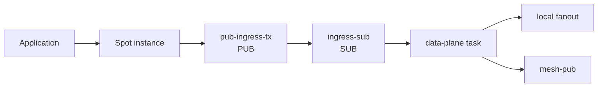

변경 전 구조에서 `pub-ingress-tx`와 `ingress-sub`는 public publish와 data-plane 사이의
inproc bridge 역할을 한다. 이 bridge는 transport socket이 아니지만 socket HWM과
message unit 정책을 따른다.

### AS-IS 시퀀스

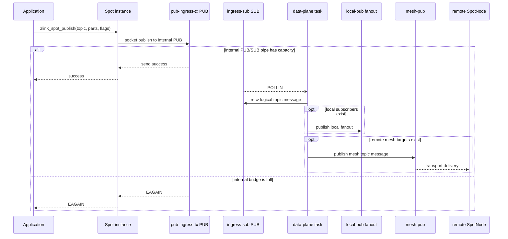

이 흐름에서 `EAGAIN`은 remote peer나 `mesh-pub` 때문이 아닐 수 있다. data-plane이
아직 내부 `ingress-sub`를 충분히 drain하지 못한 경우에도 public publish는 실패한다.

### AS-IS 소켓 구성

| Socket | 소유자 | 역할 | 문제점 |
|--------|--------|------|--------|
| `pub-ingress-tx` | `SpotNode` runtime sender cache | public publish 입력을 내부 PUB로 송신 | public 호출 경로가 내부 socket HWM에 걸린다 |
| `ingress-sub` | data-plane runtime | 내부 PUB 입력 수신 | transport가 아닌 staging인데 socket HWM 의미를 갖는다 |
| `local-pub` | data-plane runtime | local subscriber fanout | data-plane 소유로 유지해야 한다 |
| `mesh-pub` | data-plane runtime | remote topic publish | public thread가 직접 쓰면 소유권이 깨진다 |

이 구조는 public API 호출 경로에 내부 socket hop을 노출한다. 사용자는 외부 peer로
publish한다고 생각하지만 실제로는 먼저 같은 프로세스의 내부 PUB/SUB 큐 한도에 걸릴 수
있다. HWM profile이나 message unit을 조절하면 외부 네트워크 큐뿐 아니라 내부 전달 큐의
동작까지 함께 바뀐다.

## AS-IS: 변경 전 routed 구조

변경 전 routed request/reply 경로도 publish와 비슷한 내부 socket hop을 가진다. 같은
`SpotNode` 안에서 routed message를 data-plane으로 넘길 때는 sender cache가
`internal-router-tx` 내부 `DEALER` socket을 만들고, data-plane task는 `internal-router`
`ROUTER` socket에서 이를 읽는다.

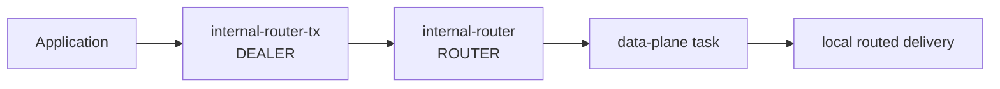

remote peer로 routed message를 보낼 때는 `external-router`가 transport 경계다. 이 socket은
유지해야 한다. 다만 AS-IS에서는 일부 public routed send 경로가 data-plane을 거치지 않고
`external-router`에 직접 send를 시도한다.

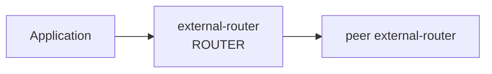

AS-IS routed 경로를 시퀀스로 보면 아래와 같다.

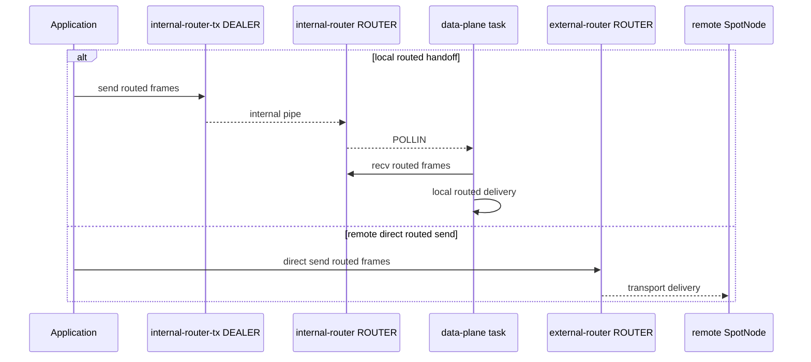

이 구조에서 `external-router`와 `internal-router`의 구분 자체가 모두 잘못된 것은 아니다.
외부 peer와 통신하는 transport boundary는 필요하므로 `external-router`는 남아야 한다. 문제는
local routed handoff를 socket으로 표현한 `internal-router` hop과, public 호출 경로가
`external-router`를 직접 만질 수 있는 소유권 분산이다.

## 문제

### 1. 내부 배선이 public publish 의미를 흔든다

`zlink_spot_publish(spot, ...)`가 `EAGAIN`을 반환할 때 원인이 외부 mesh backpressure인지,
data-plane이 아직 내부 `ingress-sub`를 충분히 drain하지 못한 것인지 호출자는 구분할 수
없다. 이는 정보 은닉이 깨진 상태다.

### 2. HWM 조절 지점이 너무 민감하다

`pub-ingress-tx`와 `ingress-sub`의 HWM을 작게 잡으면 단일 SPOT throughput이 내부 hop에
막힌다. 반대로 크게 잡으면 active phase에서 큐 체류 시간이 커져 latency가 커진다. 내부
큐 수치가 public 성능 의미를 좌우하는 것은 모듈 경계가 얕다는 신호다.

### 3. `mesh-pub` 직접 사용은 소유권을 깨뜨린다

겉보기에는 `pub-ingress-tx`를 없애고 public publish가 `mesh-pub`에 바로 쓰면 단순해
보인다. 그러나 `mesh-pub`는 data-plane 실행 주체가 소유한다. public thread가 직접 쓰면
socket 소유권, poller 관심사, shutdown 순서가 모두 섞인다.

### 4. `internal-router` hop은 routed 경로의 같은 문제를 반복한다

`internal-router-tx`와 `internal-router`는 같은 `SpotNode` 안에서 routed message를
data-plane으로 넘기기 위한 내부 staging 경로다. transport socket이 아닌데도 socket HWM,
poller, endpoint lifecycle을 가진다. 이는 publish의 `pub-ingress-tx`와 `ingress-sub`가 가진
문제를 routed 경로에서 반복한다.

### 5. `external-router` 직접 사용은 data-plane 소유권을 흐린다

`external-router`는 peer와 routed traffic을 주고받는 실제 transport socket이므로 제거 대상이
아니다. 하지만 public thread가 이 socket을 직접 send하면 data-plane thread가 소유해야 하는
routing state, pending queue, shutdown ordering이 호출 경로와 섞인다. TO-BE에서는
`external-router` I/O를 data-plane thread 안으로 모아야 한다.

## POSD 관점의 위험 신호

| 위험 신호 | 현재 증상 | 위반 원칙 |
|-----------|-----------|-----------|
| 얕은 모듈 | 내부 PUB/SUB hop이 public publish 성능과 오류 의미를 결정한다 | 깊은 모듈 |
| 정보 누출 | 내부 socket HWM과 message unit을 사용자가 추론해야 한다 | 정보 은닉 |
| 특수·범용 코드 혼합 | transport publish와 inproc staging이 같은 socket 정책을 공유한다 | 복잡성을 아래로 |
| 오류 노출 | 내부 hop의 `EAGAIN`이 외부 backpressure처럼 보인다 | 오류를 정의로 없애라 |
| 소유권 분산 | public routed send가 `external-router`를 직접 사용할 수 있다 | 정보 은닉, 깊은 모듈 |

## 설계 대안

### 대안 A: 내부 ingress HWM을 크게 잡는다

`pub-ingress-tx`와 `ingress-sub`의 HWM floor를 키워 public publish가 내부 hop에서 덜
막히게 한다.

- 장점: 변경 범위가 작다.
- 단점: 내부 큐 체류 시간이 커져 latency가 나빠진다.
- 단점: 내부 socket hop이 public 의미를 흔드는 근본 문제는 남는다.

이 대안은 임시 완화책일 뿐이다. 최종 설계로 선택하지 않는다.

### 대안 B: public publish가 `mesh-pub`에 직접 쓴다

`pub-ingress-tx`와 `ingress-sub`를 없애고 `Spot instance`가 `mesh-pub`를 찾아 직접
publish한다.

- 장점: 내부 PUB/SUB hop이 사라진다.
- 단점: `mesh-pub`의 실행 소유권이 깨진다.
- 단점: local fanout과 mesh publish의 순서 보장이 public thread와 data-plane 실행 주체로
  분산된다.
- 단점: shutdown 중 socket 접근 방지 조건이 복잡해진다.

이 대안은 성능은 좋아 보일 수 있지만 data-plane 소유권을 깨뜨린다. 선택하지 않는다.

### 대안 C: public publish는 publish ingress queue에 enqueue하고 data-plane이 송신한다

public publish는 `SpotNode` runtime의 publish ingress queue에 메시지를 넣는다.
data-plane thread는 queue를 drain하면서 local fanout과 `mesh-pub` publish를 수행한다.

- 장점: `mesh-pub` 소유권이 data-plane에 남는다.
- 장점: 내부 PUB/SUB hop을 제거해 public publish가 socket 배선을 알 필요가 없다.
- 장점: backpressure 기준을 queue admission 정책으로 명확히 정의할 수 있다.
- 단점: queue 메모리 한도, wakeup, shutdown drain 정책을 명확히 구현해야 한다.

이 초안은 대안 C를 선택한다.

### Routed 경로 대안

publish 경로와 별도로 routed 경로는 아래 선택지를 검토했다.

| 대안 | 내용 | 판단 |
|------|------|------|
| Router A | `internal-router` HWM을 키우고 현 구조를 유지한다 | 내부 socket hop 문제가 남으므로 선택하지 않는다 |
| Router B | public routed send가 `external-router`를 직접 사용하도록 단순화한다 | transport socket 소유권이 public thread로 퍼지므로 선택하지 않는다 |
| Router C | `internal-router` hop을 `SpotNode routed send queue`로 바꾸고, `external-router` 처리는 data-plane으로 모은다 | 선택한다 |

Router C가 선택안이다. `external-router`는 peer transport boundary라서 남긴다. 대신
`internal-router`와 `internal-router-tx`는 routed send queue enqueue로 대체한다. public
routed send는 local target이든 remote target이든 먼저 routed send queue에 entry를 넣고,
data-plane thread가 target `Spot state`의 routed recv queue delivery 또는 `external-router`
send를 결정한다.

`external-router` inbound는 ROUTER socket의 dispatch wakeup을 사용할 수 있다. 다만 이
callback은 application callback이나 local delivery를 실행하지 않는다. callback은 받은 frame
소유권을 `external-router ingress queue`로 넘기고 data-plane thread를 깨우는 bridge 역할만
한다. 실제 peer publish fanout, routed request delivery, routed reply delivery는 data-plane
thread에서 처리한다.

`external-router` inbound dispatch가 설치된 경우 `external-router`를 data-plane poller에
`POLLIN`으로 함께 등록하지 않는다. 같은 socket을 dispatch callback과 poller가 동시에 입력
소스로 보면 callback이 이미 받은 frame 때문에 poller가 계속 깨어나고, data-plane은 직접
drain하지 않는 상태가 되어 busy loop가 생길 수 있기 때문이다.

## 목표

1. `pub-ingress-tx`와 `ingress-sub` 내부 PUB/SUB hop을 제거한다.
2. `internal-router`와 `internal-router-tx` 내부 ROUTER/DEALER hop을 제거한다.
3. `mesh-pub`와 `external-router`는 data-plane thread만 사용한다.
4. public publish는 publish ingress queue에 메시지를 enqueue한다.
5. public routed send는 routed send queue에 메시지를 enqueue한다.
6. local fanout, mesh publish, routed recv delivery 순서는 data-plane이 하나의 경로에서 결정한다.
7. 내부 queue admission 실패는 기존 socket send와 같은 backpressure로 정의한다.
8. data-plane thread의 socket I/O는 blocking recv/send로 shutdown을 막지 않는다.
9. public function 시그니처는 추가하지 않는다.
10. dispatch worker 수는 `SpotNode` option으로 설정한다.

## 비목표

- reliable pub/sub ack protocol을 추가하지 않는다.
- per-topic 또는 per-Spot public queue option을 추가하지 않는다.
- `mesh-pub`를 thread-safe public socket처럼 만들지 않는다.
- `external-router`를 thread-safe public socket처럼 만들지 않는다.
- Discovery나 remote subscription protocol을 바꾸지 않는다.
- routed wire protocol, route envelope, peer admission protocol을 바꾸지 않는다.
- reliable routed request/reply ack protocol을 추가하지 않는다.
- `Spot subscribe queue`의 backlog limit이나 drop 정책을 새로 정의하지 않는다.
- `Spot routed recv queue`의 backlog limit이나 drop 정책을 새로 정의하지 않는다.
- Actor API, Actor recv queue, Actor join queue, Actor dispatch event 계약을 바꾸지 않는다.
- dispatch worker pool을 context 전역 runtime이나 `ZLINK_IO_THREADS` 설정에 묶지 않는다.

## TO-BE: publish ingress 구조

새 구조에서 public publish는 socket send가 아니라 runtime queue enqueue다. data-plane
thread만 `mesh-pub`와 local fanout을 사용한다.

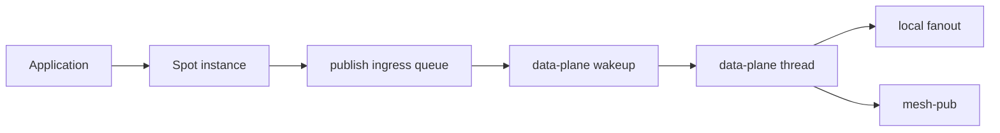

### TO-BE 시퀀스

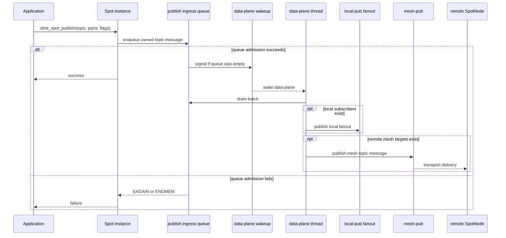

새 흐름에서 public publish의 admission 경계는 socket pipe가 아니라 명시적인
publish ingress queue다. `mesh-pub` 접근은 계속 data-plane thread 안에 머문다.

## TO-BE: routed send 구조

새 routed 구조에서 public routed send는 `internal-router-tx` 또는 `external-router`에 바로
쓰지 않는다. 호출 경로는 routed send queue에 owned routed entry를 넣고, data-plane
thread가 target `Spot state`의 routed recv queue delivery 또는 remote router send를 수행한다.

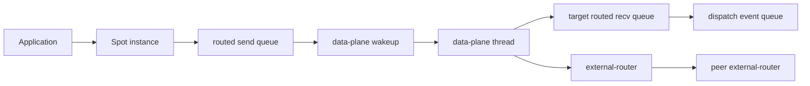

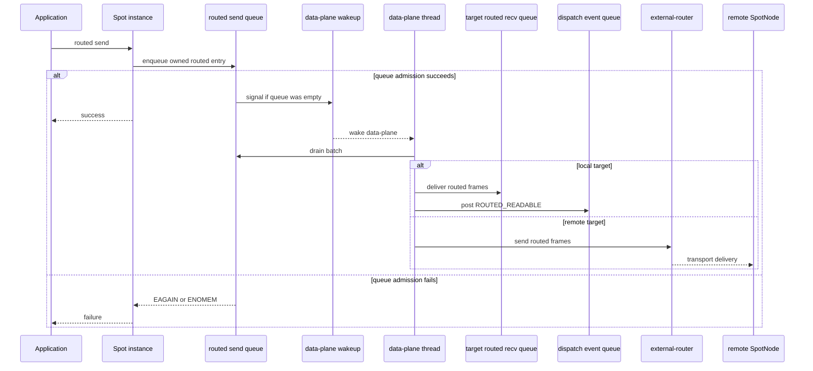

inbound peer traffic도 data-plane thread가 `external-router`에서 읽어 처리한다. 즉
`external-router`는 계속 존재하지만, public thread와 외부 dispatch callback이 data-plane
state를 직접 변경하지 않는다.

inbound peer traffic은 routed send queue를 거치지 않는다. 이 queue는 public send admission
전용이다. peer에서 들어온 routed frame은 data-plane thread가 `external-router`에서 읽고,
target `Spot state`의 routed recv queue에 넣은 뒤 `ROUTED_READABLE` dispatch event를 post한다.

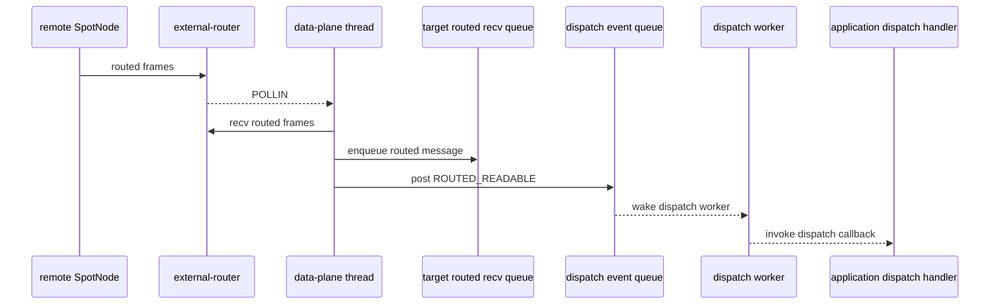

이 시퀀스에서 data-plane thread는 application dispatch callback을 직접 호출하지 않는다.
data-plane thread가 맡는 일은 socket 소유권이 필요한 I/O와 target recv queue delivery까지다.
callback 실행은 `SpotNode dispatch worker pool`로 넘긴다. 이 경계를 지키지 않으면
application callback 재진입, send-ready callback, socket shutdown 순서가 data-plane loop와
섞인다.

## TO-BE 소켓 구성

| Socket | 상태 | 역할 |
|--------|------|------|
| `pub-ingress-tx` | 제거 | queue enqueue로 대체 |
| `ingress-sub` | 제거 | queue drain으로 대체 |
| `internal-router-tx` | 제거 | routed send queue enqueue로 대체 |
| `internal-router` | 제거 | routed send queue drain으로 대체 |
| `external-router` | 유지 | peer routed transport. data-plane thread만 send/recv |
| `local-pub` | 유지 | local subscriber fanout |
| `mesh-pub` | 유지 | remote topic publish |
| `mesh-xsub` | 유지 | remote subscription ingress |
| `peer_ctrl_pub` / `peer_ctrl_sub` | 유지 | peer control |

`zlink_spot_node_attach_pub_ingress()` 공개 함수는 기존 헤더에 남아 있을 수 있다. 이 함수는
새 data-plane ingress socket을 만들지 않으며 `ENOTSUP`로 거부된다. 이 초안에서 제거한다는
대상은 public API 심볼이 아니라 `pub-ingress-tx`/`ingress-sub` 내부 socket hop과 그 runtime
상태다. 공개 API 심볼 제거는 별도 API 정리에서 다룬다.

### AS-IS와 TO-BE 비교

| 항목 | AS-IS | TO-BE |
|------|-------|-------|
| public publish 첫 동작 | 내부 `PUB` socket send | runtime queue enqueue |
| public routed 첫 동작 | `internal-router-tx` send 또는 `external-router` direct send | routed send queue enqueue |
| publish data-plane 입력 | `ingress-sub` socket recv | publish ingress queue batch drain |
| routed data-plane 입력 | `internal-router` socket recv | routed send queue batch drain |
| `mesh-pub` 소유권 | data-plane 소유 | data-plane 소유 유지 |
| `external-router` 소유권 | public path와 data-plane path로 분산 | data-plane 소유로 고정 |
| 내부 backpressure | internal PUB/SUB HWM | queue admission 정책 |
| snapshot rows | `pub-ingress-tx`, `ingress-sub`, `internal-router`, `internal-router-tx` 존재 | 내부 ingress rows 제거, `external-router`는 유지 |
| 주요 위험 | 내부 socket HWM이 public 의미를 흔듦 | queue 한도와 wakeup 정책을 명확히 관리해야 함 |

## Queue 소유권

| 항목 | 소유자 | 설명 |
|------|--------|------|
| publish ingress queue container | `spot_runtime_t` | public publish와 data-plane이 공유하는 staging queue |
| routed send queue container | `spot_runtime_t` | routed send와 data-plane이 공유하는 staging queue |
| per-Spot send queue | 없음 | send admission은 `SpotNode` publish/routed send queue에서만 처리한다 |
| `Spot subscribe queue` | `Spot state` | topic publish가 delivery된 뒤 recv API가 읽는 queue |
| `Spot routed recv queue` | `Spot state` | routed request/reply가 delivery된 뒤 routed recv API가 읽는 queue |
| `Spot dispatch event queue` | `Spot state` | readable event를 dispatch worker로 넘기는 queue |
| enqueue lock | `spot_runtime_t` | queue push/pop과 shutdown 전환을 보호한다 |
| queued message parts | queue entry | enqueue 시 multipart payload ownership을 queue entry로 이동한다 |
| queue drain | data-plane thread | local fanout, mesh publish, routed delivery를 수행한다 |
| `mesh-pub` socket | data-plane thread | public thread가 직접 접근하지 않는다 |
| `external-router` socket | data-plane thread | public thread가 직접 접근하지 않는다 |

publish ingress queue entry는 topic 문자열과 multipart parts를 소유한다. routed send queue entry는 route
metadata와 multipart routed frames를 소유한다. enqueue 성공 후 public 호출자는 payload
ownership을 더 이상 갖지 않는다. enqueue 실패 시 public 호출 경로가 기존 send 호출과 같은
방식으로 입력 part를 정리한다.

### Spot recv queue 한도

이 초안에서는 `Spot subscribe queue`와 `Spot routed recv queue`에 새 limit을 추가하지 않는다.
두 queue는 `Spot state`별 수신 backlog이며, public send admission을 담당하는 `SpotNode`
publish ingress queue와 routed send queue와 다른 경계다.

이 구분은 중요하다. publish ingress queue와 routed send queue는 send 호출자가 data-plane으로
메시지 ownership을 넘기기 전에 적용되는 backpressure 지점이다. 반면 subscribe queue와 routed
recv queue는 data-plane이 이미 해당 `Spot state`로 delivery한 뒤 recv 호출자가 읽기 전까지
보관하는 수신 backlog다.

따라서 이 초안의 기준은 아래와 같다.

| 항목 | 초안 기준 |
|------|------------|
| `SpotNode publish ingress queue` | limit 있음. send flag와 `SNDTIMEO`가 적용된다 |
| `SpotNode routed send queue` | limit 있음. send flag와 `SNDTIMEO`가 적용된다 |
| `Spot subscribe queue` | 새 limit 없음. recv flag와 `RCVTIMEO`만 dequeue 동작에 적용된다 |
| `Spot routed recv queue` | 새 limit 없음. routed recv flag와 `RCVTIMEO`만 dequeue 동작에 적용된다 |
| `Spot dispatch event queue` | 새 limit 없음. readable event coalescing만 유지한다 |
| `Actor message queue` | 이 초안에서 새 limit을 추가하지 않는다. Actor recv API가 dequeue한다 |
| `Actor join queue` | 이 초안에서 새 limit을 추가하지 않는다. `zlink_spot_actor_join_recv()`가 dequeue한다 |

`Spot subscribe queue`나 `Spot routed recv queue`에 limit을 걸려면 "가득 찼을 때 drop할지,
data-plane을 막을지, 특정 Spot만 닫을지"를 새로 정해야 한다. 이는 send ingress refactor보다
큰 계약 변경이다.
특히 data-plane을 막으면 느린 subscriber 하나가 같은 node의 fanout과 mesh publish까지
늦출 수 있고, drop을 선택하면 pub/sub delivery 의미가 바뀐다. 그래서 이 초안에서는
recv backlog 정책을 바꾸지 않는다.

Actor message queue와 Actor join queue도 같은 이유로 이 초안에서 limit을 바꾸지 않는다.
이들은 send admission queue가 아니라 application이 dispatch callback에서 drain하는 recv-side
queue다. `SpotNode routed send queue`를 추가해도 Actor recv queue 의미가 바뀌면 안 된다.

## Actor 영향 검토

이 초안의 routed send queue는 Actor queue를 대체하지 않는다. Actor API에는 이미 별도
queue 경계가 있다.

| 경로 | 현재 queue | 이 초안의 판단 |
|------|------------|----------------|
| `zlink_stream_send_bound_actor_part()` | Actor handle의 message queue | 유지. STREAM에서 Actor로 들어오는 recv-side queue다 |
| `zlink_spot_node_actor_join_spot()` | target `Spot state`의 join queue | 유지. target Spot이 join request를 recv하는 queue다 |
| `zlink_spot_node_actor_recv_part()` | Actor handle의 message queue drain | 유지. routed send queue를 읽지 않는다 |
| `zlink_spot_actor_join_recv()` | Actor join queue drain | 유지. routed send queue를 읽지 않는다 |
| `zlink_spot_node_actor_send_bound_session_msg()` | bound STREAM socket send | 유지. SPOT routed send queue와 별도다 |

따라서 구현 시 같이 지켜야 할 기준은 아래와 같다.

1. Actor message queue와 Actor join queue를 `SpotNode routed send queue`로 합치지 않는다.
2. `ZLINK_SPOT_DISPATCH_EVENT_ACTOR_READABLE`와
   `ZLINK_SPOT_DISPATCH_EVENT_ACTOR_JOIN_READABLE`의 readiness 의미를 바꾸지 않는다.
3. data-plane thread 전환으로 Actor dispatch event가 굶기면 안 된다. Actor readable event도
   `SpotNode dispatch worker pool`의 ready queue를 통해 실행한다.
4. remote Actor join이나 Actor delivery가 나중에 `external-router` transport를 사용하게 되면,
   transport send admission만 routed send queue를 거치고 최종 Actor recv queue는 그대로
   유지한다.
5. Actor queue limit, drop 정책, multipart ordering은 이 초안의 범위가 아니다.

변경 전 코드 기준으로 같이 변경해야 할 부분은 dispatch wakeup 경계다. data-plane thread가
`external-router` I/O를 독점하면 routed message 처리 후 `ACTOR_*_READABLE` event를 발생시키는
경로도 `SpotNode dispatch worker pool`에 post되어야 한다. 다만 Actor queue 자체나 Actor recv
API 계약은 변경 대상이 아니다.

## Dispatch Event 경계

data-plane thread와 dispatch worker pool은 다른 실행 경계다. 이 초안에서 data-plane thread는
`SpotNode` 소유 socket과 data-plane state를 다루는 single-owner event loop다. 반면
`SpotNode dispatch worker pool`은 application callback을 실행하는 경계다.

따라서 data-plane thread가 직접 application dispatch callback을 호출하면 안 된다. data-plane
thread는 아래 작업까지만 수행한다.

1. local publish를 target `Spot subscribe queue`에 delivery한다.
2. local routed 또는 inbound routed message를 target `Spot routed recv queue`에 delivery한다.
3. Actor join이나 Actor readable 상태가 생긴 경우 기존 Actor queue에 넣는다.
4. target `Spot state`의 dispatch event queue에 readable event를 post한다.
5. target `Spot state`를 `SpotNode` ready queue에 넣고 dispatch worker를 깨운다.

application callback 실행은 `SpotNode dispatch worker pool`이 맡는다. 기존
`spot_worker_runtime`이나 service-data runtime에 다시 얹지 않는다. 이 worker pool은
`SpotNode`가 소유하고, `SpotNode` lifecycle에 맞춰 시작하고 종료한다.

| Event | Source queue | Callback 실행 주체 |
|-------|--------------|--------------------|
| `ZLINK_SPOT_DISPATCH_EVENT_SUBSCRIBE_READABLE` | `Spot subscribe queue` | dispatch worker |
| `ZLINK_SPOT_DISPATCH_EVENT_ROUTED_READABLE` | `Spot routed recv queue` | dispatch worker |
| `ZLINK_SPOT_DISPATCH_EVENT_ACTOR_READABLE` | `Actor message queue` | dispatch worker |
| `ZLINK_SPOT_DISPATCH_EVENT_ACTOR_JOIN_READABLE` | `Actor join queue` | dispatch worker |
| `ZLINK_SPOT_DISPATCH_EVENT_CHANNEL_REPLY_READABLE` | channel dealer reply queue | dispatch worker |
| `ZLINK_SPOT_DISPATCH_EVENT_TIMER_READABLE` | timer queue | dispatch worker |

이 경계가 필요한 이유는 세 가지다.

1. application callback이 다시 SPOT send/recv API를 호출할 수 있으므로 data-plane lock이나
   socket 소유권과 섞이면 재진입 위험이 생긴다.
2. callback이 오래 걸리면 `mesh-pub`, `external-router`, pending flush가 멈추면 안 된다.
3. `ZLINK_POLLOUT`과 send-ready callback도 dispatch 축이므로 data-plane loop 안에서 직접
   실행하면 readiness와 forwarding 순서가 섞인다.

구현에서는 `zlink_spot_notify_dispatch_info()` 계열 helper가 callback을 직접 실행하지 않고
event enqueue와 worker wakeup만 수행한다는 점을 테스트로 고정한다. 기존 helper가
`spot_worker_runtime` task scheduling에 묶여 있다면, `SpotNode` ready queue에 post하는
helper로 분리해야 한다.

`post_spot_dispatch_event()`는 이 분리된 post-only helper의 내부 이름이다. 기존
`zlink_spot_notify_dispatch_info()`는 public/API 경계에서 유지할 수 있지만, 구현 내부에서는
즉시 callback 실행이나 `spot_worker_runtime` scheduling을 하지 않고
`post_spot_dispatch_event()`로 위임해야 한다.

### Dispatch worker pool

dispatch worker pool은 `SpotNode`마다 하나씩 존재한다. worker pool은 ready 상태가 된
`Spot state`를 꺼내 application dispatch callback을 실행한다. 같은 `Spot state`는 한 번에
worker 하나만 처리할 수 있다. 서로 다른 `Spot state`의 callback은 여러 worker에서 병렬로
실행할 수 있다.

기본 worker 수는 아래처럼 계산한다.

```text
cpu_count = max(1, hardware_concurrency)
dispatch_workers_min = min(2, cpu_count)
dispatch_workers_max = cpu_count
```

즉 CPU가 1개인 환경에서는 `min=1`, `max=1`이고, 그 외에는 최소 worker 2개를 유지하면서
ready `Spot state`가 밀릴 때 CPU count까지 늘릴 수 있다.

| 옵션 | 기본값 | 유효 범위 | 의미 |
|------|--------|-----------|------|
| `ZLINK_SPOT_NODE_OPT_DISPATCH_WORKERS_MIN` | `min(2, cpu_count)` | `>= 1` | 항상 유지할 dispatch worker 수 |
| `ZLINK_SPOT_NODE_OPT_DISPATCH_WORKERS_MAX` | `cpu_count` | `>= min` | burst 때 늘릴 수 있는 최대 dispatch worker 수 |

명시 설정에서는 `max`가 CPU count보다 커도 허용한다. callback이 외부 I/O 대기 위주라면
CPU count보다 큰 값이 유효할 수 있기 때문이다. 다만 CPU-bound callback이면 보통 CPU count
근처가 상한 가이드다.

worker pool의 동작 기준은 아래와 같다.

1. `min` worker는 `SpotNode`가 실행 중인 동안 유지한다.
2. ready `Spot state` 수가 idle worker 수보다 많고 현재 worker 수가 `max`보다 작으면 worker를 늘린다.
3. `max`를 넘겨 worker를 만들지 않는다.
4. `min`을 초과한 worker가 idle timeout 동안 작업을 받지 못하면 종료한다.
5. idle timeout은 초기 구현에서 내부 상수로 둔다. public option으로 노출하지 않는다.
6. shutdown 중에는 새 worker를 만들지 않고, 실행 중 callback이 끝난 뒤 join한다.
7. worker 생성 실패는 data-plane fault가 아니라 dispatch capacity 부족으로 기록하고 기존 worker로 계속 처리한다.

ready queue는 `Spot state` 단위로 coalescing한다. 같은 `Spot state`가 이미 ready queue에
있거나 worker에서 실행 중이면 같은 `Spot state`를 중복 enqueue하지 않는다. callback이 끝난 뒤
해당 `Spot state`에 아직 readable event가 남아 있으면 다시 ready queue에 넣는다. 따라서
dispatch event queue가 worker 수보다 빨리 늘어도 ready queue는 같은 `Spot state`를 무한히
중복해서 쌓지 않는다.

사용자는 아래 기준으로 값을 고른다.

| 설정 | 권장 상황 |
|------|-----------|
| `min=1, max=1` | callback이 매우 짧고 thread 수를 강하게 제한해야 할 때 |
| 기본값 | 일반적인 subscribe, routed, timer callback 처리 |
| `min=max=N` | 고정 크기 worker pool이 필요할 때 |
| `max > cpu_count` | callback이 외부 I/O 대기 위주이고 ready Spot 수가 많을 때 |

per-Spot callback 직렬화는 반드시 유지한다. 이 규칙이 없으면 같은 `Spot state`의 사용자 로직이
갑자기 thread-safe해야 하므로 public API 복잡도가 커진다.

### 내부 자료구조 초안

첫 구현은 새 public type을 만들지 않는다. 아래 구조는 `core/src/services/spot/` 내부
전용이다.

아래의 `mutex_t`와 `condition_variable_t`는 설명용 이름이다. 실제 구현에서는 저장소의 기존
동기화 타입을 우선 사용하고, 별도 typedef가 없다면 `std::mutex`와
`std::condition_variable`에 해당하는 내부 타입으로 둔다.

```cpp
struct spot_publish_ingress_entry_t
{
    std::string topic;
    spot_owned_msg_parts_t parts;
    size_t bytes;
    bool need_local;
    bool need_mesh;
};

struct spot_publish_ingress_queue_t
{
    mutex_t sync;
    condition_variable_t cv;
    std::deque<spot_publish_ingress_entry_t> entries;
    size_t queued_bytes;
    size_t queued_messages;
    size_t hard_message_limit;
    size_t base_hard_byte_limit;
    size_t resume_message_limit;
    size_t resume_byte_limit;
    bool backpressure_active;
    bool closing;
};

struct spot_routed_send_entry_t
{
    std::string route_id;
    bool route_id_valid;
    spot_owned_msg_parts_t frames;
    size_t bytes;
};

struct spot_routed_send_queue_t
{
    mutex_t sync;
    condition_variable_t cv;
    std::deque<spot_routed_send_entry_t> entries;
    size_t queued_bytes;
    size_t queued_messages;
    size_t hard_message_limit;
    size_t base_hard_byte_limit;
    size_t resume_message_limit;
    size_t resume_byte_limit;
    bool backpressure_active;
    bool closing;
};

struct spot_external_router_ingress_queue_t
{
    mutex_t sync;
    std::deque<spot_routed_send_entry_t> entries;
    bool signal_armed;
    bool closing;
};
```

구현 위치는 `spot_runtime_execution_state_t` 아래가 적합하다. 이 상태는 data-plane 실행
상태와 protocol state를 함께 들고 있으므로, publish ingress queue와 data-plane thread 상태도
runtime 실행 상태로 묶을 수 있다.

```cpp
struct spot_runtime_execution_state_t
{
    ...
    spot_publish_ingress_queue_t publish_ingress;
    spot_routed_send_queue_t routed_send;
    spot_external_router_ingress_queue_t external_router_ingress;
};
```

`spot_publish_ingress_entry_t::parts`, `spot_routed_send_entry_t::frames`,
`spot_external_router_ingress_queue_t::entries` 안의 frame은 enqueue
성공 시 입력 multipart의 소유권을 가져간다. 구현은 기존 `spot_owned_msg_parts_t`와
`spot_copy_publish_parts_to_block_local` 또는
`spot_data_plane_pending_t::copy_msg_parts_to_owned()` 계열의 helper를 재사용한다.
문자열 topic, route metadata, multipart 복사는 lock 밖에서 먼저 준비하고, lock 안에서는
queue 한도 검사와 push만 수행한다.

`spot_routed_send_entry_t`는 local/remote target kind를 미리 저장하지 않는다. public routed
send path는 route id와 routed frames만 entry에 넣는다. local delivery인지 remote
`external-router` send인지는 data-plane thread가 dequeue 후 route table을 조회해서 결정한다.
이렇게 해야 route resolution, local dispatch, remote send 소유권이 data-plane에 모인다.
public path가 enqueue 전에 local/remote를 판정하면 `external-router` 직접 사용 문제를 다른
형태로 반복하게 된다.

### Queue limit 운영 원칙

내부 queue limit은 새 튜닝 포인트가 아니다. 이 queue는 throughput을 높이기 위한 큰
버퍼가 아니라 public thread에서 data-plane thread로 ownership을 넘기는 짧은 staging
경계다. 따라서 운영 원칙은 아래처럼 둔다.

1. queue limit 전용 public option을 만들지 않는다.
2. publish ingress queue message limit의 단일 기준은 기존 `SpotNode` pub/sub admission이다.
3. routed send queue message limit의 단일 기준은 기존 `SpotNode` router admission이다.
4. queue byte limit은 메모리 보호용 보조 한도이며 성능 튜닝 값으로 사용하지 않는다.
5. throughput이 낮다고 queue limit을 키우지 않는다. 그 경우 data-plane scheduling이나
   forwarding 병목을 먼저 본다.
6. queue full은 `SpotNode` local admission backpressure로 해석한다.

queue 한도는 메시지 수와 byte 수를 함께 본다. 메시지 수는 기존 HWM 정책과 연결하고, byte
수는 큰 메시지에서 메모리가 과도하게 늘어나는 것을 막기 위한 안전장치로만 사용한다.

| 값 | 계산 |
|----|------|
| `message_unit` | `ZLINK_OPT_AUTO_HWM_MSG_UNIT_BYTES`가 있으면 그 값, 없으면 queue entry payload 크기 기준 |
| publish `admission_slots` | `ZLINK_SPOT_NODE_OPT_PUBSUB_HWM` override 또는 auto-HWM pub/sub admission plan |
| routed `admission_slots` | `ZLINK_SPOT_NODE_OPT_ROUTER_HWM` override 또는 auto-HWM router admission plan |
| `hard_message_limit` | `admission_slots == 0`이면 무제한, 아니면 `max(1, admission_slots)` |
| `base_hard_byte_limit` | `hard_message_limit`이 유한하면 `hard_message_limit * message_unit`, 무제한이면 byte admission도 무제한 |
| `resume_message_limit` | message limit이 무제한이면 사용하지 않음. `hard_message_limit / 2`, 단 `hard_message_limit == 1`이면 `0` |
| `resume_byte_limit` | byte limit이 무제한이면 사용하지 않음. 아니면 `base_hard_byte_limit / 2` |
| large message 보정 | queue가 비어 있으면 단일 entry 하나는 byte limit보다 커도 admission을 통과한다 |

이 초안은 내부 queue가 socket HWM을 그대로 모방하지 않도록 메시지 수와 byte 수를 동시에
둔다. 작은 메시지에서는 메시지 수가 admission을 제한하고, 큰 메시지에서는 byte limit이
메모리 증가를 제한한다.

여기서 `admission_slots == 0`은 기존 HWM=0 의미와 맞춰 message-count admission을 막지
않는다는 뜻이다. 이 값을 `max(1, 0)`으로 바꾸면 HWM=0이 가장 작은 queue가 되어 기존 socket
의미와 반대가 된다. HWM=0에서는 allocation 실패가 실질적인 한계가 된다.

`base_hard_byte_limit`은 static budget이다. 들어오는 메시지 크기를 뜻하는 값은 이 테이블에
넣지 않는다. 단일 large message 허용은 enqueue admission check의 예외 조건으로 처리한다.
즉 `entry_bytes > base_hard_byte_limit`이어도 queue가 비어 있으면 한 개 entry는 들어갈 수
있다. 그 entry가 data-plane으로 빠져 queue가 다시 비어야 다음 large message가 들어온다.

manual `ZLINK_SPOT_NODE_OPT_PUBSUB_HWM`이 설정되어 있으면 publish ingress queue의
`admission_slots`는 그 값을 따른다. manual `ZLINK_SPOT_NODE_OPT_ROUTER_HWM`이 설정되어
있으면 routed send queue의 `admission_slots`는 그 값을 따른다. manual socket buffer option은
queue byte limit을 직접 바꾸지 않는다. socket buffer는 transport socket에 대한 옵션이고,
queue는 data-plane admission 상태이기 때문이다.

auto-HWM profile은 `admission_slots`를 통해서만 queue message limit에 영향을 준다.
`compact`, `balanced`, `throughput` 같은 profile별 별도 queue table을 만들지 않는다. 별도
table을 두면 내부 queue가 두 번째 HWM 정책이 되어 public send 의미가 다시 복잡해진다.

운영 중 queue full이 자주 보인다면 queue limit을 먼저 키우지 않는다. 아래 순서로 본다.

1. data-plane thread가 queue signal로 즉시 깨는지 확인한다.
2. `drain_external_router_ingress_queue()`, `drain_publish_ingress_queue()`,
   `drain_routed_send_queue()`가 pending flush보다 먼저 실행되는지 확인한다.
3. local fanout, `mesh-pub`, `external-router` pending queue가 `EAGAIN`으로 계속 막히는지
   확인한다.
4. 그 뒤에도 정상 traffic에서 queue full이면 `SpotNode` pub/sub 또는 router admission 자체를
   조정한다.

이 순서를 문서화하는 이유는 내부 queue limit이 운영자가 직접 만지는 hidden knob이 되면
AS-IS의 내부 HWM 문제를 반복하기 때문이다.

## Backpressure 의미

send-side queue는 명시적인 admission 경계다. publish ingress queue와 routed send queue는 서로
독립적으로 한도를 가진다.

| 상황 | public publish 또는 routed send 결과 |
|------|------------------------------------|
| queue에 자리가 있음 | 성공 |
| 해당 queue가 가득 참, `ZLINK_DONTWAIT` 설정 | `EAGAIN` |
| 해당 queue가 가득 참, blocking send | 자리가 날 때까지 대기하거나 send timeout 적용 |
| node shutdown 진행 중 | `ESHUTDOWN` |
| 메모리 할당 실패 | `ENOMEM` |

동작 의미는 기존 socket send와 맞춘다. queue가 hard limit에 도달하면 backpressure가
걸린다. `ZLINK_DONTWAIT` 호출은 즉시 `EAGAIN`을 받는다. blocking 호출은 해당 queue가
resume limit 아래로 내려가거나 timeout/shutdown이 발생할 때까지 기다린다.

backpressure는 hysteresis를 둔다. 즉 하나가 빠질 때마다 바로 풀지 않고, queue가 대략 절반
정도 비워졌을 때 풀린다.

| 상태 | 조건 | 의미 |
|------|------|------|
| backpressure on | 유한 limit 중 하나라도 hard limit에 도달 | 새 nonblocking send는 `EAGAIN` |
| backpressure off | 모든 유한 limit이 resume limit 이하 | waiting sender를 깨워 enqueue 재시도 |

message limit이나 byte limit이 무제한이면 해당 축은 backpressure on/off 판단에서 제외한다.

이 hysteresis는 full/one-slot-free 상태에서 sender가 계속 깨었다 잠드는 현상을 줄이기 위한
것이다. limit이 아주 작아 `hard_message_limit == 1`이면 resume 기준은 `0`이다. 이 경우
data-plane이 해당 메시지를 가져가 queue가 비어야 다음 send가 들어온다.

queue 한도는 기존 auto-HWM 값을 새로 해석하지 않는다. 내부 queue는 socket이 아니므로
socket HWM 계산식을 복제하지 않는다. publish ingress queue는 `SpotNode` pub/sub admission 결과를,
routed send queue는 `SpotNode` router admission 결과를 message slot 한도로 사용한다. byte budget은
별도 튜닝 축이 아니라 메모리 보호 장치다. 이렇게 해야 작은 메시지에서 무제한에 가깝게
쌓이거나 큰 메시지에서 메모리를 과도하게 쓰는 일을 피할 수 있다.

## Send-ready와 POLLOUT 의미

이 초안의 TO-BE에서는 SPOT publish/send 경로에서 `zlink_send_ready_handler()`를
`ZLINK_POLLOUT` 대신 사용할 수 있어야 한다. 두 신호는 같은 send recovery readiness 축을
공유한다.

기존 구현은 이 기준을 만족하지 않았다. raw socket과 일부 `spot_pub_t` side handle은
underlying socket의 send-ready에 연결되어 있지만, unified `Spot`과 `SpotNode`의
send-ready 등록은 `ENOTSUP` 경로가 남아 있었다. 이 초안의 구현에서는 이 차이를 제거하고,
queue recovery 신호를 `SpotNode dispatch worker pool` 작업으로 넘긴다.

TO-BE의 send-ready는 transport writable 신호가 아니다. 의미는 아래처럼 고정한다.

| 상태 | send-ready / `ZLINK_POLLOUT` 의미 |
|------|----------------------------------|
| 해당 send-side queue가 full이 아님 | send 재시도 가치가 있음 |
| 해당 send-side queue가 hard limit에 도달 | send-ready를 arm하고, `DONTWAIT` send는 `EAGAIN` |
| 해당 queue가 resume limit 이하로 내려감 | armed send-ready callback을 한 번 호출 |
| callback 후 재시도 | 성공을 보장하지 않는다. 다시 `EAGAIN`일 수 있다 |
| shutdown 중 | send-ready 대신 shutdown 오류가 우선한다 |

즉 send-ready는 "이제 transport socket이 writable하다"가 아니라 "SPOT send admission을
다시 시도할 가치가 있다"는 뜻이다. 이 의미는 `doc/spec/core/polling.ko.md`의
`ZLINK_POLLOUT` 정의와 맞춘다.

구현은 publish ingress queue와 routed send queue의 backpressure 상태와 연결한다.

1. enqueue가 hard limit 때문에 실패하면 send-ready armed 상태를 켠다.
2. data-plane thread가 queue를 drain해서 resume limit 이하로 내리면 waiting sender를 깨우고,
   armed send-ready callback도 dispatch한다.
3. callback은 public thread가 data-plane 소유 socket을 직접 만지게 하지 않는다.
4. callback은 data-plane thread에서 직접 실행하지 않고 dispatch worker pool에서 실행한다.
5. callback 안에서 재진입 등록은 기존 send-ready 규칙처럼 `EDEADLK`로 막는다.
6. `Spot instance`와 `SpotNode` 모두 같은 readiness 의미를 가져야 한다.

이 요구사항이 빠지면 `ZLINK_POLLOUT` 기반 사용자는 동작하지만 send-ready callback 기반
사용자는 send-side queue backpressure에서 깨어나지 못할 수 있다. 따라서 이 초안의 완료 기준에
포함한다.

### Enqueue 알고리즘

public publish와 routed send 경로는 같은 admission 흐름을 따른다. 차이는 publish는
`publish_ingress`에 topic entry를 넣고, routed send는 `routed_send`에 routed entry를 넣는
점뿐이다.

1. `SpotNode` shutdown 상태와 public API admission을 먼저 확인한다.
2. topic 또는 route metadata와 multipart parts를 queue entry로 복사한다.
3. 대상 queue의 `sync`를 잡는다.
4. `closing == true`이면 entry를 정리하고 `ESHUTDOWN`을 반환한다.
5. message limit과 byte limit을 각각 검사한다. limit이 무제한이면 해당 축은 통과로 본다.
6. queue가 비어 있고 단일 entry가 byte limit만 초과한다면 large message 예외로 admission을
   통과시킨다.
7. queue capacity가 충분하면 entry를 push하고 counters를 갱신한다.
8. push로 hard limit에 도달하면 `backpressure_active = true`로 둔다.
9. push 전 queue가 비어 있었으면 lock 해제 뒤 data-plane thread를 깨운다.
10. `ZLINK_DONTWAIT`이고 capacity가 부족하면 `EAGAIN`을 반환한다.
11. blocking send이고 capacity가 부족하면 `cv`에서 backpressure off를 기다린다.
12. `cv`에서 깨어나면 `closing`, timeout, message capacity, byte capacity를 다시 검사한다.
13. capacity가 아직 부족하면 timeout이 끝날 때까지 다시 기다린다.
14. send timeout이 지나면 `EAGAIN`을 반환한다.

blocking wait는 기존 `SNDTIMEO` 의미와 맞춘다. timeout이 `0`이면 즉시 실패하고, 음수이면
무기한 대기한다. 대기 중 shutdown이 시작되면 `ESHUTDOWN`을 반환한다.

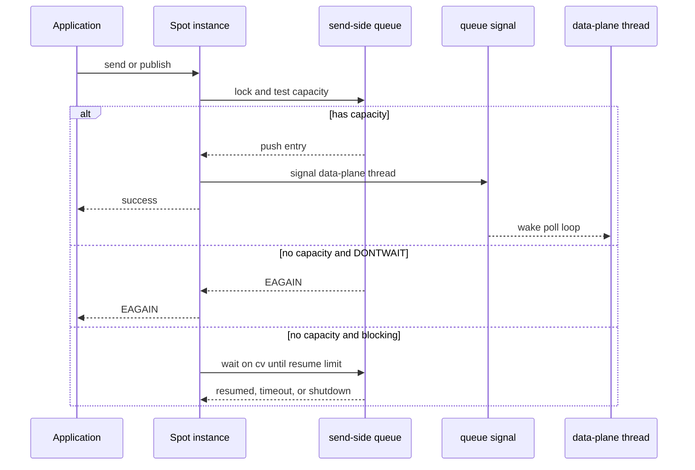

## Recv flag 의미

이 초안은 send 쪽 ingress 구조를 바꾼다. recv 경로의 public flag 의미는 바꾸지 않는다.
`zlink_spot_subscribe()`와 SPOT routed recv 계열 API는 기존 socket recv와 같은 방향으로
동작해야 한다.

`Spot subscribe queue`나 `Spot routed recv queue`가 비어 있다는 사실만으로 recv가 실패해야
한다는 뜻은 아니다. 빈 queue는 "아직 읽을 메시지가 없다"는 상태일 뿐이다. 반환 여부는
호출자가 기다릴 수 있는 모드로 호출했는지에 따라 결정한다.

| 상황 | 결과 |
|------|------|
| 대상 recv queue에 메시지 있음 | 즉시 성공 |
| queue가 비어 있고 `ZLINK_DONTWAIT` | 기다리지 않고 `EAGAIN` 또는 `ZLINK_RECV_NO_DATA` 반환 |
| queue가 비어 있고 `RCVTIMEO=0` | 기다리지 않고 `EAGAIN` 또는 `ZLINK_RECV_NO_DATA` 반환 |
| queue가 비어 있고 `RCVTIMEO>0` | 메시지가 들어오거나 timeout이 날 때까지 대기 |
| queue가 비어 있고 `RCVTIMEO<0` | 메시지가 들어오거나 shutdown될 때까지 무기한 대기 |
| shutdown 중 | `ESHUTDOWN` 또는 closed queue 결과 |

publish ingress queue나 routed send queue가 꽉 차는 것은 recv flag 의미에 영향을 주지
않는다. topic recv는 해당 `Spot state`의 subscribe queue를 읽고, routed recv는 해당
`Spot state`의 routed recv queue를 읽는다. send-side queue는 data-plane으로 보내기 전
단계이고, recv queue는 data-plane이 이미 delivery한 뒤 단계다.

즉 `EAGAIN`은 "subscriber queue가 비어서 오류"라는 뜻이 아니다. `DONTWAIT` 또는
`RCVTIMEO=0` 때문에 기다릴 수 없으므로 "지금 받을 메시지가 없다"를 표현하는 결과다.
blocking recv가 빈 queue만 보고 바로 `EAGAIN`을 반환하면 안 된다.

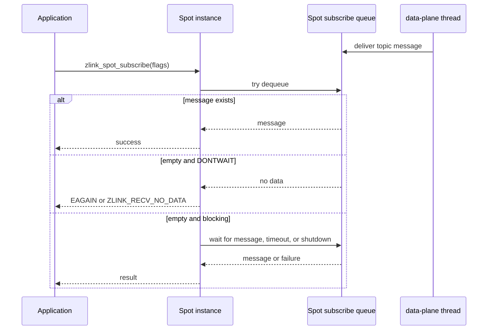

정리하면 send flag는 publish ingress queue와 routed send queue admission에 적용되고, recv
flag는 `Spot subscribe queue` 또는 `Spot routed recv queue` dequeue에 적용된다. 두 flag는
같은 `DONTWAIT` 의미를 갖지만 서로 다른 queue 경계에서 판단된다.

## Drain 순서

data-plane은 publish ingress queue entry 하나에 대해 아래 순서를 유지한다.

1. data-plane이 queue entry를 local batch로 옮기며 ownership을 가져간다.
2. 이 시점에 publish ingress queue에서는 entry가 제거되고 queue counters가 줄어든다.
3. local subscriber가 있으면 local fanout을 먼저 시도한다.
4. remote mesh 대상이 있으면 `mesh-pub` publish를 시도한다.
5. 둘 중 하나가 `EAGAIN`이면 기존 staged message queue에 남기고 다음 poll cycle에서
   다시 시도한다.

이 순서는 기존 `recv_and_forward_ingress()`의 논리와 맞춘다. 차이는 source가
`ingress-sub` socket recv가 아니라 runtime queue pop이라는 점이다.

publish ingress queue의 limit은 data-plane으로 ownership을 넘기기 전까지만 적용된다.
data-plane이 entry를 가져간 뒤 local fanout이나 mesh publish가 막히면 그 상태는 기존
staged message queue가 관리한다. 따라서 publish ingress queue counter는 downstream socket send가
끝날 때까지 붙잡아 두지 않는다.

### Drain 알고리즘

data-plane thread의 loop는 기존 pending flush보다 먼저 send-side queue를 drain한다. 이렇게 해야
새 publish와 routed send가 빠르게 staged queue 또는 transport socket으로 이동한다. 기존 구현의
`service_runtime_sockets()`에 들어 있던 socket command pump, pending flush, poller interest
갱신 흐름은 data-plane thread loop 안으로 옮긴다.

1. `publish_ingress.sync`를 잡고 batch 한도까지 entry를 local vector로 move한다.
2. queue counters를 줄인다.
3. queue가 resume limit 이하가 되면 `backpressure_active = false`로 바꾸고
   `cv.broadcast()`로 blocking sender를 깨운다.
4. lock을 놓는다.
5. 각 entry를 기존 forwarding helper로 처리한다.
6. local fanout이나 mesh publish가 `EAGAIN`이면 기존 `stage_message()` 경로로 넘긴다.
7. staged queue에 들어간 entry는 기존 `flush_staged_messages()`가 이어서 처리한다.

batch 한도는 기존 ingress socket drain 정책과 맞춘다.

| 한도 | 값 |
|------|----|
| message batch | `ingress_forward_batch_limit`와 동일한 2048 |
| byte batch | `ingress_forward_batch_bytes_limit`와 동일한 16 MiB |

이 한도는 data-plane이 queue drain만 하느라 peer control, routed, mesh subscription 처리를
굶기지 않도록 둔다.

routed send queue도 같은 batch 한도를 쓴다. routed send queue entry는 data-plane thread가
가져간 뒤 아래 순서로 처리한다.

1. `routed_send.sync`를 잡고 batch 한도까지 entry를 local vector로 move한다.
2. queue counters를 줄이고, resume limit 이하가 되면 waiting sender를 깨운다.
3. local routed 대상이면 target `Spot routed recv queue`에 delivery하고 dispatch event를 post한다.
4. remote routed 대상이면 `external-router` send를 시도한다.
5. `external-router`가 `EAGAIN`이면 routed pending 또는 staged queue에 남기고 다음 poll
   cycle에서 다시 시도한다.
6. inbound `external-router` traffic도 data-plane thread가 recv한 뒤 routed recv queue
   delivery와 dispatch event post로 처리한다.

publish ingress queue와 routed send queue 사이의 전역 순서는 public 계약으로 보장하지 않는다. 각 queue
안에서는 FIFO를 유지하고, data-plane loop는 두 queue를 bounded batch로 번갈아 drain해서 한쪽
traffic이 다른쪽 처리를 계속 굶기지 않게 한다.

### Forwarding helper 분리

`spot_data_plane_forwarding.cpp`는 source가 socket인지 queue인지에 관계없이 같은 publish
처리를 사용할 수 있어야 한다. 첫 구현에서는 아래처럼 helper를 분리한다.

| Helper | 역할 |
|--------|------|
| `forward_ingress_entry(runtime, state, topic, parts)` | local fanout과 mesh publish를 수행 |
| `recv_and_forward_ingress(src, ...)` | socket recv 후 `forward_ingress_entry()` 호출 |
| `enqueue_external_router_ingress(runtime, frames)` | ROUTER socket dispatch callback에서 frame 소유권을 data-plane queue로 이전 |
| `drain_external_router_ingress_queue(runtime, state)` | external-router inbound frame을 data-plane thread에서 peer publish 또는 routed delivery로 처리 |
| `drain_publish_ingress_queue(runtime, state)` | runtime queue pop 후 `forward_ingress_entry()` 호출 |
| `process_routed_send_entry(runtime, state, entry)` | routed recv queue delivery 또는 `external-router` send 수행 |
| `drain_routed_send_queue(runtime, state)` | routed send queue pop 후 `process_routed_send_entry()` 호출 |
| `post_spot_dispatch_event(state, event, subject)` | readable event를 enqueue하고 dispatch worker를 깨움 |

이렇게 하면 AS-IS 경로를 제거하기 전에도 두 경로를 잠시 병행해 테스트할 수 있다. 최종
단계에서는 `recv_and_forward_ingress()`, `state_->ingress`, `internal-router` 기반 recv 경로를
제거한다.

## Wakeup 정책

enqueue가 빈 queue를 non-empty로 바꾸면 `SpotNode`의 data-plane thread를 깨운다. 이 초안의
TO-BE에서는 기존 service-data runtime의 `wakeup_task()`를 사용하지 않는다. data-plane이
`SpotNode` 전용 thread로 바뀌기 때문이다.

첫 구현은 publish ingress queue와 routed send queue 안에 wakeup 상태를 둔다. public
publish나 routed send는 queue lock 안에서 empty-to-non-empty 전환을 확인하고, lock을 놓은 뒤
data-plane thread에 signal을 보낸다.

```cpp
if (was_empty)
    data_plane_ingress_signal.notify();
```

구현은 기존 `signaler_t` 또는 condition variable 중 하나를 선택한다. 중요한 기준은 아래와
같다.

| 방식 | 기준 |
|------|------|
| `signaler_t` | data-plane poll loop가 socket poller와 같은 흐름에서 queue wakeup을 처리해야 할 때 선택 |
| condition variable | data-plane loop가 별도 wait 구간에서 queue와 shutdown을 함께 기다릴 수 있을 때 선택 |

어떤 방식을 쓰든 enqueue마다 control socket command를 보내지 않는다. 그러면 public send가
다시 control socket 왕복에 묶여 AS-IS의 내부 socket hop 문제를 반복하기 때문이다.

wakeup은 coalescing되어도 된다. queue가 이미 non-empty라면 추가 publish마다 signal을 보낼
필요가 없다. data-plane thread는 한 번 깨어났을 때 batch 단위로 queue를 drain한다.

wakeup 실패는 정상적인 fast path가 아니다. signaler 또는 condition variable notify가 실패할
수 있는 구현을 선택했다면 data-plane thread는 짧은 내부 fallback tick으로 queue를 다시 확인해야
한다. fallback tick이 없는 구현에서는 wakeup 실패를 recoverable path로 두지 말고 data-plane
fault로 기록해야 한다. PUBQ-20은 fallback tick을 둔 구현에서만 "다음 loop에서 drain"을
기대한다.

## Shutdown 정책

shutdown은 아래 순서를 따른다.

1. `SpotNode`가 public API admission을 닫는다.
2. publish/routed send queue를 닫고 새 enqueue는 `ESHUTDOWN`을 반환한다.
3. dispatch worker pool은 새 ready entry를 받지 않는다.
4. data-plane은 이미 enqueue된 send-side entry를 정해진 timeout 안에서 drain한다.
5. 실행 중 dispatch callback은 중단하지 않고 반환을 기다린다.
6. dispatch worker를 join한다.
7. timeout이 지나면 남은 send-side queue entry의 multipart parts를 정리한다.
8. `mesh-pub`, `external-router`, local fanout socket, data-plane state를 닫는다.

이 순서의 목적은 public thread가 data-plane 소유 socket에 접근하지 않게 만드는 것이다.

### Shutdown 세부 규칙

| 단계 | 동작 |
|------|------|
| public admission close | `service_public_api_scope_t`가 새 public call 진입을 막는다 |
| queue close | `publish_ingress.closing = true`, `routed_send.closing = true`, `cv.broadcast()` |
| dispatch worker close | ready queue admission을 닫고 idle worker를 깨움 |
| data-plane wakeup | data-plane thread signal 호출 |
| graceful drain | shutdown timeout 안에서 publish/routed send queue와 staged messages를 drain |
| running callback drain | 실행 중 callback은 중단하지 않고 반환을 기다림 |
| worker join | dispatch worker thread를 join |
| forced cleanup | 남은 send-side queue entry와 staged entry의 parts를 close |
| socket teardown | `mesh-pub`, `local-pub`, control, router socket 순서로 닫음 |

queue close 이후 enqueue는 항상 `ESHUTDOWN`이다. 이미 enqueue된 publish entry와 routed entry는
graceful drain 대상이다. forced cleanup 단계는 message ownership을 명확히 정리해야 하며,
public thread가 entry를 다시 만지지 않는다.

dispatch worker close 이후 data-plane이 readable event를 post하려고 하면 새 callback을
schedule하지 않는다. shutdown 중 이미 실행 중인 callback은 자연스럽게 반환하게 두고, ready
queue에 남은 event는 node destroy의 일부로 정리한다.

shutdown timeout은 새 public option을 추가하지 않고 기존 `SpotNode` destroy/shutdown timeout
경로를 따른다. 해당 경로가 명시 값을 갖지 않는 내부 shutdown에서는 기존 runtime shutdown
상수와 같은 내부 상수를 사용한다. 이 timeout은 queue tuning 값이 아니라 destroy가 무기한
멈추지 않게 하는 안전장치다.

## Socket snapshot 영향

`pub-ingress-tx`, `ingress-sub`, `internal-router`, `internal-router-tx`가 제거되면
`zlink_spot_node_internal_sockets_snapshot()` 결과에서 해당 internal ingress row가 사라진다.
이는 내부 snapshot 변화이며 공개 API 계약의 필드 추가나 삭제가 아니다. 다만 perf 출력과
내부 문서는 갱신해야 한다.

남는 주요 socket은 아래와 같다.

| Socket | 역할 |
|--------|------|
| `local-pub` | local subscriber fanout |
| `mesh-pub` | remote topic publish |
| `mesh-xsub` | remote subscription ingress |
| `external-router` | peer routed transport |
| `peer_ctrl_pub` / `peer_ctrl_sub` | peer control |

## 구현 불변식

구현 중 아래 조건은 항상 유지해야 한다.

1. public thread는 `mesh-pub`, `local-pub`, `mesh-xsub`를 직접 호출하지 않는다.
2. public thread는 `external-router`, `internal-router`, `internal-router-tx`를 직접 호출하지
   않는다.
3. queue entry의 multipart ownership은 한 번만 이동한다.
4. queue counters는 `entries`와 항상 일치해야 한다.
5. queue lock을 잡은 상태에서 socket send/recv를 호출하지 않는다.
6. data-plane은 queue entry를 local vector로 옮긴 뒤 lock 밖에서 forwarding한다.
7. shutdown 후 새 enqueue는 항상 실패한다.
8. forced cleanup은 남은 entry의 모든 `zlink_msg_t` part를 닫는다.
9. `pub-ingress-tx`, `ingress-sub`, `internal-router`, `internal-router-tx` 제거 후 snapshot에
   해당 row가 남지 않는다.
10. `external-router`는 snapshot에 남고 data-plane thread 소유 socket으로 표시된다.
11. blocking recv는 빈 `Spot subscribe queue`나 `Spot routed recv queue`만 보고 즉시
    `EAGAIN`을 반환하지 않는다.
12. `SpotNode` 하나는 data-plane thread 하나만 만들고, `Spot instance` 수에 따라 thread를
    늘리지 않는다.
13. SPOT data-plane 실행은 service-data runtime periodic task에 의존하지 않는다.
14. inbound `external-router` traffic은 `SpotNode routed send queue`를 거치지 않는다.
15. data-plane thread는 application dispatch callback을 직접 호출하지 않는다.
16. 같은 `Spot state`의 dispatch callback은 동시에 실행하지 않는다.
17. send-ready callback은 queue recovery에서 발생하더라도 data-plane thread가 직접 호출하지
    않고 dispatch worker pool 작업으로 실행한다.

## 오류 처리 기준

| 위치 | 오류 | 처리 |
|------|------|------|
| entry 복사 | `ENOMEM` | public send 실패, 입력 part 정리 |
| enqueue admission | `EAGAIN` | `ZLINK_DONTWAIT` 또는 timeout일 때 반환 |
| enqueue 중 shutdown | `ESHUTDOWN` | public send 실패 |
| data-plane local fanout | `EAGAIN` | staged queue로 이동 |
| data-plane mesh publish | `EAGAIN` | staged queue로 이동 |
| data-plane external router send | `EAGAIN` | routed pending 또는 staged queue로 이동 |
| inbound routed envelope parse | protocol error | 기존 routed protocol 오류 처리와 맞춤 |
| staged queue push 실패 | `ENOMEM` | data-plane fault로 기록 |
| recv no data | `EAGAIN` 또는 `ZLINK_RECV_NO_DATA` | `DONTWAIT` 또는 recv timeout일 때만 호출자에게 반환 |
| forced shutdown cleanup | 없음 | 남은 entry를 닫고 버림 |

data-plane forwarding과 routed delivery에서 `EAGAIN`은 fatal error가 아니다. 기존 staged
message 또는 routed pending 경로로 흡수해야 한다. `ENOMEM`, invalid state, socket fault는
기존 data-plane fault 처리에 맞춘다.

## 구현 단계

1. `spot_runtime_execution.hpp`에 publish ingress queue, routed send queue,
   external-router ingress queue 상태를 추가한다.
2. `spot_data_plane_forwarding.cpp`에 `forward_ingress_entry()`를 분리한다.
3. `spot_data_plane_forwarding.cpp`에 `drain_publish_ingress_queue()`를 추가한다.
4. request/reply routed delivery helper를 routed send entry 처리로 분리한다.
5. `spot_data_plane_forwarding.cpp` 또는 routed 전용 파일에 `drain_routed_send_queue()`를
   추가한다.
6. `spot_data_plane_loop.cpp`의 data-plane loop에서 external-router ingress queue,
   publish ingress queue, routed send queue drain을 호출한다.
7. `spot_subject_publish.cpp`에서 `spot_runtime_sender_pub_ingress` 사용을 enqueue 호출로
   바꾼다.
8. routed public send 경로에서 `internal-router-tx`와 direct `external-router` send를 routed
   queue enqueue로 바꾼다.
9. blocking publish/routed send wait와 `ZLINK_DONTWAIT` 실패 의미를 구현한다.
10. `spot_runtime.cpp`의 startup에서 `ensure_sender_socket(spot_runtime_sender_pub_ingress)`
   선생성을 제거한다.
11. `spot_runtime_sender.cpp`에서 `spot_runtime_sender_pub_ingress`와
    `spot_runtime_sender_internal_router` 분기, endpoint 관리를 제거한다.
12. `spot_data_plane_runtime.cpp`에서 `ingress-sub`, `internal-router` 생성, bind, poller add를
    제거한다.
13. `external-router` send는 data-plane thread에서만 수행하게 정리한다.
14. `external-router` socket message dispatch callback은 inbound frame을
    external-router ingress queue에 넣는 bridge로만 사용하고, 실제 처리는 data-plane loop가
    수행하게 바꾼다.
    dispatch callback이 설치된 `external-router`는 data-plane poller의 `POLLIN` 입력으로
    중복 등록하지 않는다.
15. data-plane delivery helper는 target recv queue enqueue와 dispatch event post까지만
    수행하고 application callback을 직접 호출하지 않게 분리한다.
16. `spot_node_handles.cpp`와 HWM refresh 경로에서 제거된 internal socket 처리를 제거한다.
17. `spot_node_summary.cpp` snapshot 출력에서 제거된 socket rows를 제거하고 `external-router`
    row는 유지한다.
18. data-plane 실행 모델을 service-data runtime periodic task에서 `SpotNode` 전용 thread로
    바꾼다.
19. SPOT data-plane만 위해 존재하던 service-data runtime 생성, 선택, ctx accessor 경로를
    제거한다.
20. `SpotNode` 전용 dispatch worker pool을 추가하고 `spot_worker_runtime` 기반 SPOT dispatch
    event task 의존을 제거한다.
21. `ZLINK_SPOT_NODE_OPT_DISPATCH_WORKERS_MIN`과
    `ZLINK_SPOT_NODE_OPT_DISPATCH_WORKERS_MAX` option을 추가한다.
22. dispatch worker pool은 per-Spot callback 직렬화, min/max scale up/down, shutdown join을
    구현한다.
23. shutdown 코드에서 `pub_ingress_tx`, `local_pub_ingress_sub`,
    `pub_ingress_sender_endpoint`, `internal_router`, `internal_router_tx`,
    `internal_router_endpoint`, `internal_router_sender_endpoint` 정리를 제거하고
    queue close/drain, data-plane thread join, dispatch worker join 정리를 추가한다.
24. perf의 Auto-HWM detail 출력 기대값을 새 socket 구성에 맞춘다.
25. 내부 문서 `doc/internals/spot-internals.ko.md`와 `doc/internals/spot-internals.md`는
    구현 완료 후 갱신한다.

### 파일별 변경 범위

| 파일 | 변경 |
|------|------|
| `core/include/zlink.h` | draft 구현 시 dispatch worker min/max option 추가 |
| `spot_runtime.hpp` | service-data runtime 포인터 제거, data-plane thread와 dispatch worker lifecycle 필드 정리 |
| `spot_runtime_execution.hpp/.cpp` | queue 상태, close, capacity 계산, enqueue helper, data-plane thread 상태 |
| `spot_dispatch_worker_pool.hpp/.cpp` | SpotNode dispatch worker pool, ready queue, per-Spot serialization 구현 |
| `spot_subject_publish.cpp` | public publish를 queue enqueue로 변경 |
| `service_spot_request_reply_utils.cpp` | `internal-router-tx` enqueue helper를 routed send queue enqueue로 변경 |
| `service_spot_request_reply_routed_delivery.cpp` | direct `external-router` send를 routed send queue enqueue와 data-plane send로 분리 |
| `service_spot_request_reply_ingress_api.cpp` | `internal-router` drain API 제거 또는 routed send queue drain으로 대체 |
| `service_spot_request_reply_api.cpp` | routed send public path의 admission 의미 유지 |
| `service_spot_request_reply_local_dispatch.cpp` | routed recv queue delivery와 dispatch event post helper 재사용 또는 분리 |
| `spot_data_plane_forwarding.cpp` | forwarding 공통 helper와 queue drain 추가 |
| `spot_data_plane_loop.cpp` | loop마다 publish/routed send queue drain과 `external-router` processing 호출 |
| `spot_data_plane_runtime.cpp` | `ingress-sub`, `internal-router` 생성과 poller 등록 제거, `external-router` 유지 |
| `spot_runtime.cpp` | startup의 `pub-ingress-tx` 선생성 제거, data-plane thread 시작 |
| `spot_runtime_sender.cpp` | `spot_runtime_sender_pub_ingress`, `spot_runtime_sender_internal_router` 제거 |
| `spot_runtime_shutdown.cpp` | queue cleanup, ingress socket cleanup 제거, data-plane thread와 dispatch worker join |
| `ctx.cpp/.hpp` | service-data runtime accessor 제거 |
| `ctx_runtime_resources.cpp/.hpp` | SPOT data-plane용 service-data runtime 생성과 lookup 제거 |
| `spot_node_handles.cpp` | HWM refresh에서 removed socket 처리 제거 |
| `spot_node_summary.cpp` | internal socket snapshot rows 제거 |
| `unittest_spot_subject_access.cpp` | snapshot 기대값과 publish/routed path 회귀 갱신 |
| `test_spot_actor_dispatch.cpp` | Actor queue와 dispatch readiness가 바뀌지 않는지 회귀 추가 |
| dispatch worker unit/e2e | min/max scale, per-Spot serialization, worker shutdown 회귀 추가 |
| `bindings/c/perf/*` | SPOT Auto-HWM detail에서 제거된 internal ingress rows 반영 |

### 중간 병행 단계

리스크를 줄이기 위해 구현은 단계로 나눈다.

1. publish/routed send queue helper를 추가하되 기존 socket path를 유지한다.
2. public publish만 publish ingress queue path를 사용하게 하고, 기존 socket path 테스트가 깨지지
   않는지 확인한다.
3. routed public send를 routed send queue path로 옮기되 `external-router` transport socket은
   유지한다.
4. data-plane 실행 모델을 `SpotNode` 전용 thread로 바꾸고 shutdown join을 고정한다.
5. queue path 검증이 끝나면 `pub-ingress-tx`, `ingress-sub`, `internal-router`,
   `internal-router-tx`를 제거한다.

이 순서를 따르면 forwarding helper 분리 문제와 socket 제거 문제를 한 번에 디버깅하지 않아도
된다.

## 테스트 계획

| 테스트 | 검증 내용 |
|--------|-----------|
| `unittest_spot_subject_access` | snapshot rows 변화와 public publish/routed route |
| `unittest_spot_data_plane_budget` | queue admission과 기존 HWM 옵션 round-trip |
| `test_spot_pubsub_scenario` | local/remote pubsub end-to-end |
| routed request/reply unit/e2e | local/remote routed send queue와 `external-router` ownership |
| single SPOT perf | `io_threads=4` 기본에서 throughput 회복 유지 |
| multi SPOT perf | `MULTI_SPOT`, `MULTI_SPOT_REQREP`, `MULTI_SPOT_SENDSEND` 회귀 |
| shutdown 회귀 | queued publish/routed entry가 남은 상태에서 node destroy가 종료되는지 확인 |

### 필수 회귀 케이스

| ID | 케이스 | 기대 |
|----|--------|------|
| PUBQ-01 | local subscriber만 있는 SPOT publish | subscriber가 message를 받는다 |
| PUBQ-02 | remote peer만 있는 SPOT publish | remote subscriber가 message를 받는다 |
| PUBQ-03 | local subscriber와 remote peer가 모두 있음 | 둘 다 같은 topic message를 받는다 |
| PUBQ-04 | `ZLINK_DONTWAIT`에서 queue full | publish가 `EAGAIN`을 반환한다 |
| PUBQ-05 | blocking publish에서 queue full 후 drain | publish가 timeout 전에 성공한다 |
| PUBQ-06 | blocking publish timeout | publish가 `EAGAIN`을 반환한다 |
| PUBQ-07 | node shutdown 중 publish | publish가 `ESHUTDOWN`을 반환한다 |
| PUBQ-08 | shutdown 중 queued messages 존재 | destroy가 timeout 안에 끝나고 leak이 없다 |
| PUBQ-09 | snapshot after startup | `pub-ingress-tx`, `ingress-sub` row가 없다 |
| PUBQ-10 | perf Auto-HWM detail | 제거된 socket row 없이 출력이 완성된다 |
| PUBQ-11 | queue hard limit 도달 | `backpressure_active == true`가 된다 |
| PUBQ-12 | queue가 hard limit에서 1개만 비워짐 | blocking publisher를 깨우지 않는다 |
| PUBQ-13 | queue가 resume limit 이하로 비워짐 | blocking publisher를 깨워 enqueue를 재시도한다 |
| PUBQ-14 | `hard_message_limit == 1` | queue가 완전히 비워진 뒤에만 다음 publish가 들어온다 |
| PUBQ-15 | large message 1개가 `base_hard_byte_limit`보다 큼 | 단일 메시지 하나는 enqueue된다 |
| PUBQ-16 | large message가 이미 queue에 있고 다음 large message가 들어옴 | 두 번째 publish는 backpressure를 따른다 |
| PUBQ-17 | multipart publish | 모든 part가 순서와 크기를 유지해 subscriber에게 전달된다 |
| PUBQ-18 | enqueue 실패 후 입력 part ownership | 입력 part가 leak 없이 닫힌다 |
| PUBQ-19 | enqueue 성공 후 data-plane forwarding 실패 | queue entry ownership이 staged queue 또는 cleanup 경로로 한 번만 이동한다 |
| PUBQ-20 | public publish 중 data-plane thread wakeup 실패 | fallback tick이 있으면 다음 loop에서 drain되고, 없으면 data-plane fault로 기록된다 |
| PUBQ-21 | same SpotNode 안 여러 Spot instance의 publish | instance 수만큼 publish ingress queue가 생기지 않는다 |
| PUBQ-22 | 여러 publisher thread가 동시에 publish | queue counters가 깨지지 않고 메시지 손실이 없다 |
| PUBQ-23 | local subscriber가 느려 local pending queue가 찬 상태 | data-plane은 staged queue로 넘기고 public thread는 socket을 직접 만지지 않는다 |
| PUBQ-24 | remote `mesh-pub`가 `EAGAIN`을 반환 | data-plane은 staged mesh 경로로 넘기고 fatal fault로 처리하지 않는다 |
| PUBQ-25 | subscription update와 publish가 동시에 발생 | aggregate subscription 상태와 publish delivery가 깨지지 않는다 |
| PUBQ-26 | routed request/reply 사용 | routed send queue 변경 뒤에도 publish ingress queue 영향을 받지 않는다 |
| PUBQ-27 | SPOT_REQREP / SPOT_SENDSEND 사용 | routed send queue 변경 뒤에도 echo pattern이 실패하지 않는다 |
| PUBQ-28 | channel dealer queue 사용 | channel dealer별 queue 동작이 publish ingress queue와 독립적이다 |
| PUBQ-29 | SpotNode pub/sub HWM manual override | queue `admission_slots`가 override 값을 따른다 |
| PUBQ-30 | auto-HWM profile 변경 | queue limit은 profile별 별도 table이 아니라 pub/sub admission 결과만 따른다 |
| PUBQ-31 | `SNDTIMEO=0` blocking publish, queue full | 즉시 `EAGAIN`을 반환한다 |
| PUBQ-32 | `SNDTIMEO<0` blocking publish, queue full 후 drain | timeout 없이 기다렸다 성공한다 |
| PUBQ-33 | node destroy 중 waiting publisher 존재 | waiting publisher가 `ESHUTDOWN`으로 깨어난다 |
| PUBQ-34 | forced shutdown cleanup | 남은 queue entry와 staged entry의 모든 part가 닫힌다 |
| PUBQ-35 | internal socket snapshot after publish traffic | `pub-ingress-tx`, `ingress-sub`가 lazy-create되지 않는다 |
| PUBQ-36 | subscribe recv `ZLINK_DONTWAIT`, Spot subscribe queue empty | 즉시 `EAGAIN` 또는 `ZLINK_RECV_NO_DATA`를 반환한다 |
| PUBQ-37 | subscribe recv blocking, message later delivered | timeout 전에 message를 받는다 |
| PUBQ-38 | subscribe recv blocking timeout | `EAGAIN` 또는 `ZLINK_RECV_NO_DATA`를 반환한다 |
| PUBQ-39 | publish ingress queue full 상태에서 subscriber recv | recv flag 의미가 변하지 않는다 |
| PUBQ-40 | shutdown 중 blocking recv | waiting receiver가 shutdown 결과로 깨어난다 |
| PUBQ-41 | slow Spot subscriber | 이 초안이 `Spot subscribe queue` limit이나 drop 정책을 새로 적용하지 않는다 |
| PUBQ-42 | same SpotNode 안에 여러 Spot instance 존재 | data-plane thread는 1개만 존재한다 |
| PUBQ-43 | 여러 SpotNode가 같은 context에 존재 | SpotNode 수만큼 data-plane thread가 존재하고 service-data runtime을 공유하지 않는다 |
| PUBQ-44 | publish ingress queue full 후 `zlink_send_ready_handler()` 등록 | queue가 resume limit 이하로 내려가면 callback이 호출된다 |
| PUBQ-45 | `ZLINK_POLLOUT` 기반 재시도 | send-ready callback과 같은 readiness 의미로 재시도할 수 있다 |
| PUBQ-46 | send-ready callback 안에서 handler 재등록 | 기존 규칙처럼 `EDEADLK`로 실패한다 |
| PUBQ-47 | unified `Spot`과 `SpotNode` send-ready 등록 | `ENOTSUP` 없이 같은 readiness 의미로 동작한다 |
| PUBQ-48 | default dispatch worker config | CPU 1개면 `min=max=1`, 그 외에는 `min=2`, `max=cpu_count`다 |
| PUBQ-49 | dispatch workers `min=max=N` | 고정 N개 worker로 동작한다 |
| PUBQ-50 | ready Spot이 idle worker보다 많음 | worker 수가 `max`까지 증가할 수 있다 |
| PUBQ-51 | 초과 worker가 idle timeout을 지남 | worker 수가 `min`까지 감소한다 |
| PUBQ-52 | 같은 Spot에 여러 dispatch event 발생 | 같은 Spot callback은 동시에 실행되지 않는다 |
| PUBQ-53 | 서로 다른 Spot에 dispatch event 발생 | 서로 다른 Spot callback은 병렬 실행될 수 있다 |
| PUBQ-54 | dispatch worker 실행 중 node shutdown | running callback은 끝나고 worker가 join된다 |
| PUBQ-55 | dispatch worker 생성 실패 | 기존 worker로 계속 처리하고 capacity 부족을 기록한다 |
| PUBQ-56 | 같은 Spot이 이미 ready 상태에서 event 추가 | ready queue에 같은 Spot entry가 중복으로 쌓이지 않는다 |
| PUBQ-57 | callback 종료 후 같은 Spot에 unread event 존재 | 같은 Spot이 다시 ready queue에 들어간다 |

### Routed 회귀 케이스

| ID | 케이스 | 기대 |
|----|--------|------|
| ROUTEQ-01 | same `SpotNode` 안 local routed delivery | `internal-router` 없이 routed send queue를 통해 delivery된다 |
| ROUTEQ-02 | remote peer routed send | public thread가 `external-router`를 직접 호출하지 않고 data-plane이 send한다 |
| ROUTEQ-03 | inbound peer routed traffic | data-plane thread가 `external-router`에서 recv하고 routed recv queue에 delivery한다 |
| ROUTEQ-04 | routed send queue full, `ZLINK_DONTWAIT` | routed send가 `EAGAIN`을 반환한다 |
| ROUTEQ-05 | routed send queue full, blocking send 후 drain | timeout 전에 send가 성공한다 |
| ROUTEQ-06 | routed send queue full, blocking timeout | routed send가 `EAGAIN`을 반환한다 |
| ROUTEQ-07 | node shutdown 중 routed sender wait | waiting sender가 `ESHUTDOWN`으로 깨어난다 |
| ROUTEQ-08 | `external-router` send `EAGAIN` | data-plane이 routed pending 또는 staged queue에 남기고 fatal fault로 처리하지 않는다 |
| ROUTEQ-09 | malformed inbound routed envelope | 기존 routed protocol 오류 처리와 같은 결과를 낸다 |
| ROUTEQ-10 | snapshot after startup and traffic | `internal-router`, `internal-router-tx` row가 없고 `external-router` row는 남는다 |
| ROUTEQ-11 | router HWM manual override | routed send queue `admission_slots`가 router override 값을 따른다 |
| ROUTEQ-12 | auto-HWM profile 변경 | routed send queue limit은 router admission 결과만 따른다 |
| ROUTEQ-13 | SPOT_REQREP multi perf | `MULTI_SPOT_REQREP`이 모든 configured size에서 `FAIL` 없이 끝난다 |
| ROUTEQ-14 | SPOT_SENDSEND multi perf | `MULTI_SPOT_SENDSEND`가 모든 configured size에서 `FAIL` 없이 끝난다 |
| ROUTEQ-15 | channel dealer queue 사용 | channel dealer별 queue 동작이 routed send queue와 독립적이다 |
| ROUTEQ-16 | routed send queue full 후 `zlink_send_ready_handler()` 등록 | queue가 resume limit 이하로 내려가면 callback이 호출된다 |
| ROUTEQ-17 | routed `ZLINK_POLLOUT` 기반 재시도 | publish ingress queue와 같은 send recovery readiness 의미로 재시도할 수 있다 |
| ROUTEQ-18 | `SNDTIMEO=0` blocking routed send, queue full | 즉시 `EAGAIN`을 반환한다 |
| ROUTEQ-19 | `SNDTIMEO<0` blocking routed send, queue full 후 drain | timeout 없이 기다렸다 성공한다 |
| ROUTEQ-20 | routed send queue full 후 send-ready callback 등록 | resume limit 이하로 내려가면 callback이 호출된다 |
| ROUTEQ-21 | routed send queue full 후 `ZLINK_POLLOUT` polling | publish ingress queue와 같은 readiness 의미로 재시도할 수 있다 |
| ROUTEQ-22 | routed send queue의 large message admission | queue가 비어 있으면 단일 large routed entry 하나는 enqueue된다 |
| ROUTEQ-23 | routed send queue HWM=0 manual override | message-count admission이 무제한으로 동작한다 |
| ROUTEQ-24 | local/remote route resolution | public path가 target kind를 미리 정하지 않고 data-plane이 dequeue 후 결정한다 |

ROUTEQ-16과 ROUTEQ-17은 send-ready와 polling의 대표 케이스다. ROUTEQ-18~24는 publish
backpressure 케이스와 같은 패턴을 routed send queue에도 적용한다는 것을 명시하기 위한 세부
회귀다.

### Actor 회귀 케이스

| ID | 케이스 | 기대 |
|----|--------|------|
| ACTORQ-01 | `zlink_stream_send_bound_actor_part()` | Actor message queue에 enqueue되고 routed send queue를 사용하지 않는다 |
| ACTORQ-02 | `zlink_spot_node_actor_recv_part()` | Actor message queue를 drain하고 routed send queue를 읽지 않는다 |
| ACTORQ-03 | `zlink_spot_node_actor_join_spot()` | target `Spot state`의 Actor join queue에 enqueue되고 routed send queue와 합쳐지지 않는다 |
| ACTORQ-04 | `zlink_spot_actor_join_recv()` | Actor join queue를 drain하고 request lifetime이 기존 의미를 유지한다 |
| ACTORQ-05 | Actor readable dispatch | `ZLINK_SPOT_DISPATCH_EVENT_ACTOR_READABLE` readiness 의미가 유지된다 |
| ACTORQ-06 | Actor join readable dispatch | `ZLINK_SPOT_DISPATCH_EVENT_ACTOR_JOIN_READABLE` readiness 의미가 유지된다 |

### 회귀 테스트 배치

| 그룹 | 권장 위치 | 포함 케이스 |
|------|-----------|-------------|
| publish route | `unittest_spot_subject_access.cpp` | PUBQ-01, PUBQ-02, PUBQ-03, PUBQ-17 |
| queue admission | 새 unit 또는 `unittest_spot_data_plane_budget.cpp` | PUBQ-04~06, PUBQ-11~16, PUBQ-29~32 |
| ownership / cleanup | 새 unit | PUBQ-18, PUBQ-19, PUBQ-34 |
| shutdown | `test_spot_pubsub_scenario` 또는 새 e2e | PUBQ-07, PUBQ-08, PUBQ-33 |
| socket removal | `unittest_spot_subject_access.cpp` | PUBQ-09, PUBQ-21, PUBQ-35 |
| execution model | 새 unit 또는 runtime lifecycle unit | PUBQ-42, PUBQ-43 |
| send-ready / POLLOUT | 새 unit 또는 `unittest_spot_subject_access.cpp` | PUBQ-44, PUBQ-45, PUBQ-46, PUBQ-47 |
| recv flag | `unittest_spot_subject_access.cpp` 또는 SPOT recv unit | PUBQ-36, PUBQ-37, PUBQ-38, PUBQ-39, PUBQ-40, PUBQ-41 |
| dispatch worker pool | 새 unit 또는 dispatch e2e | PUBQ-48, PUBQ-49, PUBQ-50, PUBQ-51, PUBQ-52, PUBQ-53, PUBQ-54, PUBQ-55, PUBQ-56, PUBQ-57 |
| routed send | request/reply unit/e2e와 snapshot unit | ROUTEQ-01~12, ROUTEQ-16~24 |
| actor queue | `test_spot_actor_dispatch.cpp` | ACTORQ-01, ACTORQ-02, ACTORQ-03, ACTORQ-04, ACTORQ-05, ACTORQ-06 |
| interaction regression | existing e2e/perf | PUBQ-20, PUBQ-22, PUBQ-23, PUBQ-24, PUBQ-25, PUBQ-26, PUBQ-27, PUBQ-28, ROUTEQ-13, ROUTEQ-14, ROUTEQ-15 |

테스트는 queue 내부 값을 public API로 노출해서 확인하지 않는다. unit test가 내부 helper를 직접
검증해야 하면 `core/tests/unittest/`에서 internal header를 include하는 방식으로 제한한다.
public API test는 결과와 errno만 확인한다.

### 성능 확인 기준

성능 수치는 환경 영향을 받으므로 절대값을 public 계약으로 두지 않는다. 다만 구현 회귀 판단을
위해 아래 조건을 확인한다.

| Benchmark | 조건 |
|-----------|------|
| single SPOT 64B tcp | `io_threads=4` 기본에서 기존 queue path 대비 throughput 급락이 없어야 한다 |
| single SPOT 64B tcp | `pub-ingress-tx`, `ingress-sub` row가 출력되지 않아야 한다 |
| multi SPOT tcp/tls | `FAIL` 없이 모든 configured size가 완료되어야 한다 |
| multi SPOT_REQREP tcp/tls | `FAIL` 없이 모든 configured size가 완료되고 기존 `Kops/s` 결과가 유지되어야 한다 |
| multi SPOT_SENDSEND tcp/tls | `FAIL` 없이 모든 configured size가 완료되고 기존 `Kops/s` 결과가 유지되어야 한다 |
| Auto-HWM spotnode detail | `pub-ingress-tx`, `ingress-sub`, `internal-router`, `internal-router-tx` row 없이 출력되고 `external-router` row는 남아야 한다 |

## 완료 기준

아래 항목이 모두 만족되면 이 초안은 구현 가능한 수준에서 완료된 것으로 본다.

1. public publish가 `spot_runtime_sender_pub_ingress`를 호출하지 않는다.
2. `spot_runtime_sender_pub_ingress` enum 또는 분기가 제거된다.
3. `spot_runtime_t`에서 `pub_ingress_tx`, `local_pub_ingress_sub`,
   `pub_ingress_endpoint`, `pub_ingress_sender_endpoint`가 제거된다.
4. public routed send가 `internal-router-tx` 또는 direct `external-router` send를 호출하지
   않는다.
5. `spot_runtime_sender_internal_router` enum 또는 분기가 제거된다.
6. `spot_runtime_t`에서 `internal_router`, `internal_router_tx`,
   `internal_router_endpoint`, `internal_router_sender_endpoint`가 제거된다.
7. data-plane runtime이 `ingress-sub`나 `internal-router`를 만들거나 poller에 등록하지 않는다.
8. `external-router` inbound callback은 frame을 external-router ingress queue에 넣기만 하고,
   실제 routed 처리와 local fanout은 data-plane thread에서 수행된다. 이때 `external-router`
   `POLLIN`은 data-plane poller에 중복 등록되지 않는다.
9. snapshot과 perf 출력에서 `pub-ingress-tx`, `ingress-sub`, `internal-router`,
   `internal-router-tx`가 사라지고 `external-router`는 남는다.
10. local fanout, mesh publish, routed delivery는 data-plane thread에서만 수행된다.
11. `SpotNode`마다 data-plane thread가 하나만 존재하고 `Spot instance` 수만큼 늘어나지 않는다.
12. data-plane 실행이 service-data runtime periodic task에 의존하지 않는다.
13. `SpotNode`마다 dispatch worker pool이 하나만 존재하고, 기본값은 CPU 1개에서 `min=max=1`,
    그 외 환경에서 `min=2`, `max=cpu_count`다.
14. dispatch worker pool은 `min/max` 범위 안에서 늘고 줄며, 같은 `Spot state` callback을
    동시에 실행하지 않는다.
15. application dispatch callback은 data-plane thread에서 직접 실행되지 않는다.
16. `zlink_send_ready_handler()`와 `ZLINK_POLLOUT`이 send-side queue backpressure 해제와
   같은 readiness 의미를 갖는다.
17. unified `Spot`과 `SpotNode` send-ready 등록이 `ENOTSUP` 없이 동작한다.
18. send-ready callback 안에서 같은 subject의 send-ready handler를 다시 등록하면
    `EDEADLK`로 실패한다.
19. Actor message queue, Actor join queue, Actor dispatch event 의미가 바뀌지 않는다.
20. queue full, timeout, shutdown 오류 의미가 테스트로 고정된다.
21. shutdown path가 queued message와 dispatch worker를 leak 없이 정리한다.
22. core unit/e2e와 single/multi SPOT perf가 통과한다.

## 실행 모델

### 변경 전 구조

변경 전 구현 기준으로 data-plane은 `SpotNode`마다 항상 생기는 독립 OS thread가 아니었다.
`SpotNode` runtime은 `ctx->service_data_runtime_for_key(node_id)`로 context의
service-data runtime 하나를 고르고, 그 runtime에 data-plane task를 periodic task로 등록한다.

`ZLINK_IO_THREADS`는 transport I/O thread 수에 영향을 준다. 동시에 변경 전 구현에서는
service-data runtime thread 수를 계산할 때도 같은 값을 사용한다. 다만 service-data runtime
thread가 `io_thread_t`에 포함되는 것은 아니다. 예를 들어 `ZLINK_IO_THREADS=4`이면 transport
I/O thread 4개와 service-data runtime thread 최대 4개가 별도로 만들어진다.

변경 전 코드에서 service-data runtime의 주요 사용자는 SPOT data-plane이었다. `SpotNode` runtime은
이 runtime에 data-plane periodic task를 등록하고, task가 실행될 때 socket command pump,
local fanout flush, mesh publish flush, routed flush, staged message flush, ingress drain,
peer control 처리 등을 수행한다. discovery, monitor, auto-HWM, SPOT dispatch callback 같은
다른 service task는 주로 `service-ctrl` 또는 `spot-worker` runtime을 사용한다.

이 구조에서는 여러 `SpotNode`가 같은 service-data runtime thread를 공유할 수 있다. 그래서
SPOT data-plane의 지연이나 backpressure를 분석할 때 다른 service task와의 scheduler 공유까지
함께 보아야 한다.

이 설계에서 어색한 부분은 service-data runtime 개수가 `ZLINK_IO_THREADS`에 묶여 있다는 점이다.
transport I/O thread 수는 네트워크 session 처리량을 위한 값이고, SPOT data-plane 실행 주체
수는 `SpotNode` 수와 data-plane 작업량에 더 직접적으로 관련된다. 이 둘을 같은 설정값으로
묶으면 사용자가 I/O thread를 조절하다가 service-data scheduling까지 같이 바꾸게 된다.

### TO-BE 선택

이 초안은 `SpotNode`당 data-plane thread 하나를 두는 구조를 선택한다. thread는 `SpotNode`
runtime이 시작될 때 만들어지고, `SpotNode`가 종료될 때 닫힌다. `Spot instance`마다 thread를
만들지는 않는다.

이 선택의 이유는 아래와 같다.

| 항목 | 판단 |
|------|------|
| latency | queue enqueue 후 data-plane 실행이 shared periodic task scheduling에 덜 묶인다 |
| 소유권 | `mesh-pub`, `local-pub`, `external-router`, data-plane poller의 실행 주체가 `SpotNode` 안에서 고정된다 |
| 분석 가능성 | queue full 원인을 service-data runtime 공유가 아니라 해당 `SpotNode` data-plane 병목으로 좁힐 수 있다 |
| 비용 | `SpotNode`마다 OS thread 하나가 필요하다 |

이 비용은 받아들일 수 있다고 본다. `SpotNode`는 가벼운 per-client 객체가 아니라 node runtime
단위이며, 이 초안의 publish/routed send queue도 `SpotNode`당 하나씩으로 설계한다. 따라서
실행 주체도 같은 경계인 `SpotNode`에 맞추는 편이 더 단순하다.

이 선택을 하면 SPOT data-plane 실행은 `ZLINK_IO_THREADS` 값에서 분리된다. `ZLINK_IO_THREADS`는
transport I/O thread 수를 조절하고, `SpotNode` data-plane thread는 node lifecycle에 따라
생성되고 종료된다.

### data-plane thread 개수

이 초안은 `SpotNode`당 data-plane thread를 하나만 둔다. `Spot instance`가 늘어나도 thread는
늘어나지 않는다.

하나로 충분하다고 보는 이유는 data-plane의 역할이 transport I/O 자체가 아니라
`SpotNode` 내부의 publish, local fanout, mesh publish, routed delivery, pending flush,
peer control 처리를 순서 있게 수행하는 single-owner event loop에 가깝기 때문이다. transport
read/write의 실제 I/O 작업은 기존 `io_thread_t`와 socket/session 계층이 맡는다. data-plane
thread는 그 위에서 어떤 메시지를 어느 socket 경로로 넘길지 결정한다.

thread를 하나로 고정하면 아래 장점이 있다.

| 항목 | 이유 |
|------|------|
| socket ownership | `mesh-pub`, `local-pub`, `external-router`, poller를 한 실행 주체가 소유한다 |
| ordering | local fanout, mesh publish, routed delivery 순서를 한 곳에서 정한다 |
| locking | data-plane 내부 상태 대부분을 thread-local state처럼 다룰 수 있다 |
| backpressure 해석 | queue full 원인을 해당 `SpotNode` data-plane 병목으로 좁힐 수 있다 |

반대로 한 `SpotNode`에 매우 많은 topic, peer, fanout 대상이 몰리면 이 thread 하나가 CPU 병목이
될 수 있다. 그러나 이 문제를 처음부터 여러 data-plane thread로 나누면 topic ordering,
remote peer별 pending queue, local fanout 순서, shutdown drain을 모두 shard 기준으로 다시
정해야 한다. 이 초안의 목표는 publish/routed send와 socket ownership을 단순화하는 것이므로,
초기 구현에서는 `SpotNode`당 thread 하나를 기준으로 고정한다.

나중에 단일 `SpotNode`에서 data-plane CPU 병목이 확인되면 별도 설계로 확장한다. 그때는
`ZLINK_IO_THREADS`에 묶기보다 topic hash, peer hash, 또는 명시적인 data-plane shard option
중 하나를 선택해야 한다. 이 확장은 현재 초안의 범위가 아니다.

### dispatch worker 개수

dispatch worker pool은 data-plane thread와 별도다. data-plane thread가 callback을 직접
실행하지 않기 때문에, dispatch worker pool이 사용자 callback 병렬성을 담당한다.

기본값은 `min=2`, `max=cpu_count`다. 단 CPU count가 1이면 `min=max=1`이다.

이 기본값은 두 가지 요구를 함께 맞춘다. 최소 2개 worker는 callback 하나가 오래 걸려도 다른
ready `Spot state`가 완전히 막히지 않게 한다. 최대 CPU count는 CPU-bound callback에서 기본
thread 수가 과도하게 늘어나지 않게 하는 상한이다.

사용자가 고정 크기 pool을 원하면 `min=max=N`으로 설정한다. callback이 외부 I/O 대기 위주라면
`max`를 CPU count보다 크게 설정할 수 있다. 이 경우 thread scheduling 비용과 메모리 사용량을
운영 지표로 확인해야 한다.

## 최종 리뷰

이 초안은 구현 가능한 수준으로 정리되었다. 마지막 리뷰 기준의 결론은 아래와 같다.

| 항목 | 리뷰 결과 |
|------|-----------|
| 공개 API 영향 | public function 추가 없음. dispatch worker min/max SpotNode option은 추가 |
| 핵심 설계 선택 | per-Spot socket/queue가 아니라 SpotNode당 publish ingress queue와 routed send queue 하나씩 |
| 실행 모델 | SpotNode당 data-plane thread 하나와 dispatch worker pool 하나. `ZLINK_IO_THREADS`에 포함하지 않는다 |
| socket 소유권 | `mesh-pub`, `local-pub`, `external-router`는 data-plane thread 전용으로 유지 |
| dispatch workers | 기본 `min=2`, `max=cpu_count`. CPU 1개면 `min=max=1` |
| backpressure | 기존 socket send와 같은 의미. `DONTWAIT`은 즉시 `EAGAIN`, blocking은 resume limit까지 대기 |
| send-ready | `ZLINK_POLLOUT`과 같은 send recovery readiness 축. queue resume 시 callback 호출 |
| queue limit | 새 튜닝 포인트가 아니라 publish는 pub/sub admission, routed는 router admission에서 파생 |
| shutdown | queue close, worker close, graceful drain, worker join, forced cleanup 순서가 정의됨 |
| Actor 영향 | Actor message queue, Actor join queue, Actor dispatch event 의미는 유지 |
| 제거 대상 | `pub-ingress-tx`, `ingress-sub`, `internal-router`, `internal-router-tx`, 관련 endpoint, HWM refresh, snapshot rows |
| 실행 모델 제거 대상 | service-data runtime 생성, lookup, ctx accessor, `spot_runtime_t::data_plane_runtime`, SPOT dispatch의 `spot_worker_runtime` 의존 |
| 주요 리스크 | queue 구현이 hidden HWM이 되거나, shutdown에서 ownership cleanup이 누락되는 것 |
| 리스크 대응 | hysteresis, 단일 admission 기준, ownership test, shutdown test, Actor dispatch regression을 필수 회귀로 둠 |

publish, routed send, dispatch worker 기준으로 구현 전 남은 결정은 없다. 구현 중 수치 조정이
필요해 보여도 queue 전용 public option을 만들지 않고, 먼저 data-plane scheduling, dispatch
worker saturation, 기존 `SpotNode` pub/sub 또는 router admission을 확인해야 한다.

## 구현 완료 후 문서 반영

구현이 끝나면 이 초안의 내용은 아래 문서로 나누어 반영한다.

- `doc/internals/spot-internals.ko.md`: 실제 data-plane queue 구조와 socket 토폴로지
- `doc/internals/spot-internals.md`: 영어 내부 문서 동기화
- `bindings/c/perf/README.md`: Auto-HWM detail에서 사라지는 socket row 설명

dispatch worker min/max option은 public option이므로 구현이 끝나면 정식 public spec에도
반영해야 한다. snapshot row 구성의 의미를 공개 계약으로 설명해야 한다고 결정되면, 그때
`doc/spec/core/service/spot.ko.md`에 현재 구현 기준으로만 반영한다.
