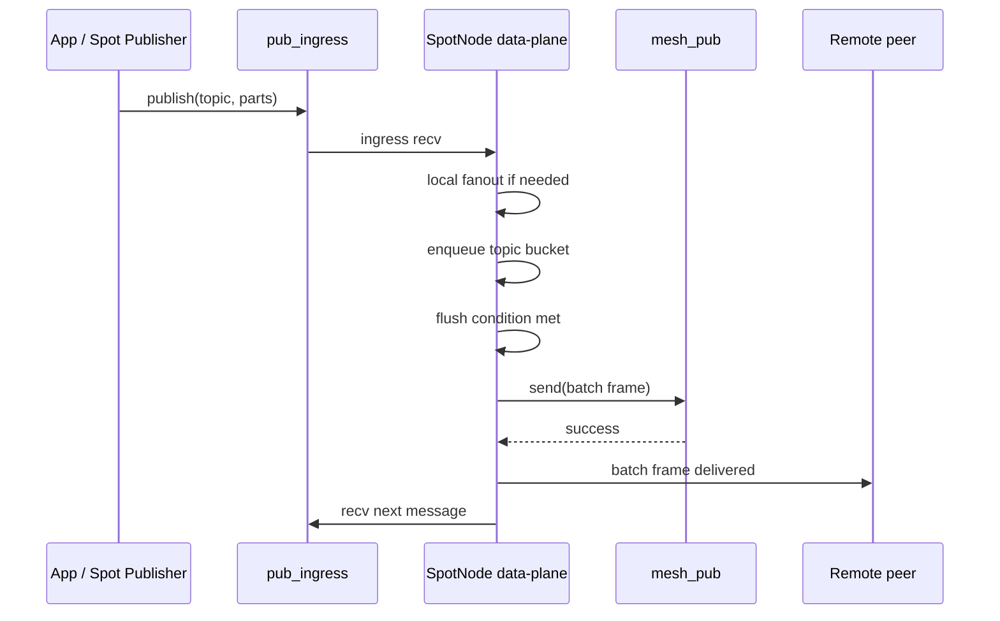
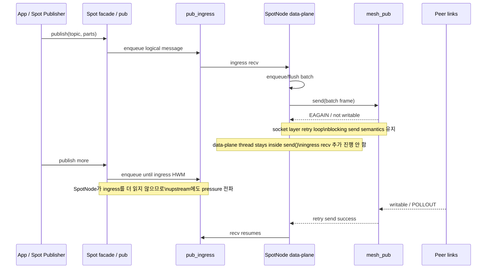

# SpotNode Peer Publish Batching Spec

## 목적

대규모 SPOT mesh 에서 동일 topic 의 작은 publish 가 짧은 시간에 많이 발생하면
peer 방향 `mesh_pub` fan-out 비용이 커진다.

이 문서는 다음 목표를 위한 `SpotNode` 내부 최적화를 정의한다.

- peer 방향 publish 횟수 감소
- local subscriber latency 유지
- public `publish/recv/callback` 계약 유지
- batching/unbatching 오버헤드 bounded 유지
- 큰 메시지는 즉시 bypass

이 기능은 application-visible batch API 가 아니다.
`SpotNode` 내부 data-plane 최적화다.


## 한 줄 요약

- sender 는 동일 topic 의 작은 메시지를 잠깐 모아 1개의 internal batch frame 으로 peer 에 보낸다.
- receiver 는 그 batch frame 을 내부적으로 다시 풀어서 기존과 동일한 logical message 들로 local dispatch 한다.
- application 이 보는 topic / multipart message 계약은 바뀌지 않는다.


## 범위

이 스펙이 다루는 범위:

- `ingress -> mesh_pub` batching
- `mesh_xsub -> local dispatch` unbatch
- topic 기준 지연 flush / 개수 flush / 크기 flush
- oversized message bypass
- SpotNode 전용 option surface

이 스펙이 다루지 않는 범위:

- public batch API
- local `fanout` batching
- cross-topic coalescing
- 압축
- replay cache / persistence


## 현재 경로

현재 Spot publish 경로는 다음과 같다.

1. facade/default pub 가 logical multipart message 를 `pub_ingress` 로 전송
2. data-plane ingress forwarder 가 이를 읽음
3. local subscriber 가 있으면 `fanout` 으로 즉시 전달
4. peer 방향은 `mesh_pub` 으로 즉시 전달
5. remote node 는 `mesh_xsub` 에서 받아 local receiver/fanout 으로 전달

현재는 시간 기반 topic batching 이 없다.
poll cycle starvation 방지용 batch count / byte limit 만 있다.


## 최종 결정

### 기능 형태

이 기능은 `SpotNode` 내부 optional optimization 이다.

- 기본값: disabled
- 적용 범위: peer publish 경로만
- local fanout 은 기존처럼 즉시 전달
- sender 와 receiver 는 같은 internal batch protocol 을 이해해야 한다

### v1 rollout 규칙

v1 은 **homogeneous deployment only** 로 제한한다.

즉:

- mesh 에 참여하는 모든 SpotNode 가 이 기능을 구현한 동일 세대 binary 여야 한다
- mixed-version mesh 는 지원하지 않는다
- capability negotiation 은 v1 범위 밖이다

### 활성화 규칙

v1 에서 `PEER_BATCH_ENABLE=1` 은 **운영자가 homogeneous deployment 를
보장한다는 명시적 opt-in** 으로 해석한다.

- runtime capability negotiation 은 수행하지 않는다.
- 이 option 이 `0` 이면 sender 는 항상 non-batch 경로를 사용한다.
- 이 option 이 `1` 이면 sender 는 즉시 batch 경로를 활성화한다.
  운영자가 mesh 전체가 동일 세대 binary 임을 보장한 것으로 간주한다.
- mixed-version mesh 에서 `1` 로 설정하면 receiver 가 batch frame 을 일반
  message 로 오해석할 수 있다. 이것은 운영자 책임이다.

이 스펙은 v1 에서 capability query API 를 정의하지 않는다.
그 대신 위 opt-in 규칙과 rollout 제약을 명시적으로 둔다.


## public contract

public API surface 는 바꾸지 않는다.

- `zlink_publish()`
- `zlink_subscribe()`
- subscribe callback
- public monitor / snapshot 구조체

application 은 batching enabled 여부와 관계없이 같은 logical message 를
관찰해야 한다.

즉 application 이 받는 것은 계속:

- 원래 topic
- logical multipart 1건

이어야 한다.


## 핵심 동작

### sender

1. ingress 에서 logical message 수신
2. local fanout 필요 시 즉시 fanout 전달
3. peer batching disabled 이면 즉시 `mesh_pub`
4. oversized message 이면 즉시 `mesh_pub`
5. 아니면 topic bucket 에 enqueue
6. flush 조건 만족 시 internal batch frame 1건으로 `mesh_pub` 전송

### receiver

1. `mesh_xsub` 에서 frame 수신
2. 일반 message 이면 기존 경로 그대로 전달
3. batch frame 이면 내부 decode
4. decode 된 logical message 들을 기존 local dispatch 경로로 1건씩 전달


## flush 정책

각 topic bucket 은 아래 조건 중 하나를 만족하면 flush 한다.

- `batch_delay_ms` 도달
- `batch_max_messages` 도달
- `batch_max_bytes` 도달
- 다음 message 추가 시 `batch_max_bytes` 초과 예상
- shutdown / fault / topology change 로 drain 필요

### same-topic publish order 보장

같은 topic 내 publish order 는 sender enqueue 순서를 보존해야 한다.

이 규칙은 batching, bypass, flush 모든 경로에서 적용된다.

### oversized bypass

단일 logical message 의 `logical_message_encoded_bytes` 가
`batch_bypass_bytes` 이상이면 bypass 대상이다.

bypass 규칙:

- **같은 topic 에 pending bucket 이 있으면 bypass 전에 해당 bucket 을
  먼저 flush** 한다.
- flush 성공 후 oversized message 를 즉시 `mesh_pub` 전송한다.
- **flush 실패 시 bypass message 도 전송하지 않는다.**
  기존 fault 정책을 따른다.
- pending bucket 이 없는 topic 의 oversized message 는 즉시 전송한다.

이 규칙은 same-topic 내에서 작은 메시지(bucket 대기) 가 큰 메시지(bypass)에
추월당하는 것을 방지한다.


## wire contract

### 가장 중요한 규칙

batch frame 도 **원래 topic subject 를 그대로 유지한 채 전송**한다.

이 규칙은 필수다.

이유:

- remote peer 의 기존 subject filtering 유지
- subscription forwarding / readiness 모델 유지
- “모든 topic 을 reserved subject 하나로 몰아 보내는” 잘못된 설계 방지

### 금지되는 방식

다음 두 방식은 금지한다.

1. 모든 topic batch 를 하나의 reserved internal subject 로 보내는 방식
2. 여러 logical message 를 단순히 multipart frame 으로 이어붙이는 방식

첫 번째는 peer subject filtering 을 깨뜨리고,
두 번째는 logical message 경계를 잃는다.


## batch frame 형식

### frame 구분 원칙

batch 여부는 wire subject 가 아니라 payload header 로 구분한다.

하지만 application payload 와 충돌하지 않도록, 단순 문자열 magic 비교로 끝내면
안 된다. v1 은 아래와 같이 **엄격한 batch header** 를 사용한다.

### batch frame 최소 형식

wire subject 는 original topic 이다.

v1 의 batch frame 은 **정확히 3개의 part** 로 구성한다.

```text
subject = <original topic>

part0 = fixed-size binary batch header (12 bytes)
part1 = fixed-size binary batch metadata (16 bytes)
part2 = concatenated encoded logical message stream (단일 blob)
```

`part_count` 가 3이 아니면 batch frame 으로 인정하지 않는다.
receiver 의 `decode_offset` 은 `part2` 내부 byte offset 이다.

### part0: batch header

`part0` 는 정확히 고정 길이 binary header 여야 한다.

필수 필드:

- magic
- version
- flags
- header_size

예시 개념:

```c
struct spot_batch_header_v1 {
    uint32_t magic;       // fixed constant
    uint16_t version;     // 1
    uint16_t flags;       // reserved
    uint32_t header_size; // sizeof(spot_batch_header_v1)
};
```

receiver 는 아래를 모두 만족할 때만 batch frame 으로 해석한다.

- part count >= 3
- part0 size == expected fixed header size
- magic exact match
- version supported
- header_size exact match

하나라도 다르면 **일반 message 로 취급**한다.
즉, batch parse 실패를 이유로 일반 message 를 protocol error 로 죽이지 않는다.

이 규칙은 application payload 와의 false positive 충돌을 최대한 줄이기 위한 것이다.

### part1: batch metadata

`part1` 은 fixed-size binary metadata 여야 한다.

필수 필드:

- `message_count`
- `total_payload_bytes`

권장 필드:

- `encoded_bytes`
- checksum 또는 reserved flags

예시 개념:

```c
struct spot_batch_metadata_v1 {
    uint32_t message_count;
    uint32_t total_payload_bytes;
    uint32_t encoded_bytes;
    uint32_t reserved;
};
```

### logical message encoding

각 logical message 는 아래 정보를 가져야 한다.

- part count
- 각 part size
- 각 part payload

개념 예:

```text
msg0:
  uint16 part_count
  uint32 part0_size + bytes
  uint32 part1_size + bytes

msg1:
  uint16 part_count
  uint32 part0_size + bytes
  ...
```

topic 은 wire subject 로 이미 유지되므로 batch payload 안에 다시 넣지 않는다.

### byte 기준 정의

구현자가 동일하게 계산할 수 있도록 각 byte 기준의 포함 범위를 고정한다.

| 이름 | 정의 |
|------|------|
| `logical_message_payload_bytes` | 각 logical message 의 part payload 바이트 합 |
| `logical_message_encoded_bytes` | `uint16 part_count` + 각 `uint32 part_size` + 각 part payload 바이트 합. `message_encoded_bytes` 필드 자체 4바이트는 제외 |
| `batch_body_encoded_bytes` | part2 blob 전체 길이. 모든 logical message 의 `(4 + logical_message_encoded_bytes)` 합 |
| `batch_wire_payload_bytes` | part0(12) + part1(16) + part2(body) 길이 합 |

flush / bypass 기준 매핑:

| option | 비교 기준 |
|--------|----------|
| `PEER_BATCH_BYPASS_BYTES` | `logical_message_encoded_bytes` |
| `PEER_BATCH_MAX_BYTES` | `batch_body_encoded_bytes` |
| metadata `total_payload_bytes` | 모든 logical message 의 `logical_message_payload_bytes` 합 |
| metadata `encoded_bytes` | `batch_body_encoded_bytes` |

### canonical encoding 규칙

sender / receiver 구현이 서로 다른 binary encoding 을 만들지 않도록 v1 은 아래
규칙을 고정한다.

#### 정수 인코딩

- 모든 정수 필드는 **little-endian** 으로 encode 한다
- C struct raw memory dump 로 전송하지 않는다
- 각 필드는 문서에 정의된 순서대로 수동 encode/decode 한다

즉:

- `memcpy(struct, ...)` 기반 wire format 금지
- compiler padding / ABI 차이에 의존 금지

#### batch header encode 순서

`part0` 의 field 순서는 아래와 같다.

1. `uint32 magic`
2. `uint16 version`
3. `uint16 flags`
4. `uint32 header_size`

v1 의 `header_size` 는 항상 `12` 여야 한다.

#### batch metadata encode 순서

`part1` 의 field 순서는 아래와 같다.

1. `uint32 message_count`
2. `uint32 total_payload_bytes`
3. `uint32 encoded_bytes`
4. `uint32 reserved`

v1 의 metadata size 는 항상 `16` 이다.
`reserved` 는 sender 가 반드시 `0` 으로 채워야 하고, receiver 는 0이 아니어도
우선 무시할 수 있다.

#### logical message encode 순서

각 logical message 는 아래 순서로 encode 한다.

1. `uint32 message_encoded_bytes`
2. `uint16 part_count`
3. 각 part 에 대해:
   `uint32 part_size`
   `part payload bytes`

`message_encoded_bytes` 는 자기 자신의 4바이트 필드를 제외한 나머지 logical
message body 크기다.

#### sanity rule

receiver 는 아래를 모두 검증해야 한다.

- `header_size == 12`
- metadata part size == 16
- `message_count >= 1`
- `encoded_bytes >= 0`
- 각 logical message 의 `message_encoded_bytes` 가 batch payload 남은 크기를 넘지 않음
- 각 part 의 `part_size` 합이 `message_encoded_bytes` 와 일치
- 모든 logical message decode 완료 후 consumed bytes == `encoded_bytes`

하나라도 맞지 않으면 malformed batch 로 처리한다.

#### false positive 추가 완화 규칙

일반 application payload 가 우연히 batch header 처럼 보이는 경우를 더 줄이기 위해
receiver 는 header match 뒤에도 아래 조건이 모두 맞을 때만 batch 로 확정한다.

- metadata part size exact match
- `message_count` 가 0이 아님
- `encoded_bytes` 가 실제 남은 payload 총 byte 수와 정확히 일치

위 조건이 하나라도 맞지 않으면 malformed batch 가 아니라 일반 message fallback
으로 처리하지 않고, header/magic exact match 이후의 불일치는 malformed batch 로
간주한다.

이것은 false positive 확률을 낮추는 대신, 진짜 batch frame 손상은 fail-fast 로
다루기 위한 결정이다.


## 자료구조

### sender topic bucket

sender 는 topic 별 pending bucket 을 유지한다.

권장 구조:

```c
struct spot_topic_batch_bucket_t {
    std::string topic;
    uint64_t first_enqueue_ms;
    uint64_t last_enqueue_ms;
    size_t pending_message_count;
    size_t pending_payload_bytes;
    std::deque<logical_message_t> messages;
};
```

### logical message 저장 방식

권장 원칙:

- enqueue 시점에 전체 batch 재직렬화 금지
- 이미 ingress 에서 받은 frame payload 를 가능한 한 재사용
- flush 시점까지 필요한 ownership 만 유지

v1 권장안:

- enqueue 시 part payload 를 owned `msg_t` 집합으로 보관
- flush 시점에만 batch frame 1회 encode

이 방식이 구현 단순성과 CPU cost 측면에서 가장 무난하다.

### receiver partial unbatch 상태

receiver 는 bounded unbatch 를 위해 partial state 를 가질 수 있다.

v1 에서는 아래 수준의 owned state 를 runtime 에 보관하는 것으로 정의한다.

```c
struct spot_pending_unbatch_t {
    bool active;
    std::string topic;
    owned_batch_buffer_t batch;
    uint32_t total_message_count;
    uint32_t decoded_message_index;
    size_t decode_offset;
};
```

핵심 규칙:

- `mesh_xsub` 에서 받은 batch frame 1건의 ownership 은 runtime state 가 가진다
- 한 poll turn 에 전부 풀지 못하면 `decoded_message_index` 와 `decode_offset` 을
  저장하고 다음 turn 에 이어서 decode 한다
- batch 1건을 다 소비하기 전에는 다음 batch frame decode 를 시작하지 않는다

#### partial unbatch fairness

v1 은 **batch 1건을 완전히 소비한 뒤 다음 batch 를 시작**하는 FIFO 모델이다.
이것은 의도적인 설계 결정이다.

- 큰 batch 1건이 여러 turn 에 걸쳐 풀리는 동안 뒤에 도착한 batch 는
  대기한다 (head-of-line blocking 허용).
- 이 방식은 구현이 단순하고 logical message 순서를 자연스럽게 보존한다.
- v1 에서 이 HOL blocking 이 문제가 되면 이후 버전에서 interleaving
  전략을 도입할 수 있다. 단 v1 은 FIFO 로 고정한다.


## sender 알고리즘

### ingress 처리

```text
recv logical message(topic, parts)
  -> local fanout now
  -> if batching disabled: send mesh_pub now
  -> if control/reserved internal topic: send mesh_pub now
  -> if logical_message_encoded_bytes >= bypass_bytes:
       if topic_map[topic] has pending bucket:
         flush(bucket) first        ← same-topic 순서 보장
         if flush failed: abort, follow fault policy
       send mesh_pub now (bypass)
  -> bucket = topic_map[topic]
  -> bucket.push(message)
  -> if bucket.should_flush(now): flush(bucket)
```

### reserved / control topic

아래 topic 은 batching 대상에서 제외하고 항상 즉시 전송한다.

- `_zlink.` 접두사를 가진 모든 internal control topic
- 빈 문자열 topic

이 목록은 core 내부에서 관리하며, 사용자 topic 은 절대 `_zlink.` 접두사를
사용하지 않아야 한다.

### flush 순서

bucket flush 시:

1. batch header 생성
2. batch metadata 생성
3. pending logical message encode
4. 1개의 logical wire message 로 `mesh_pub` 전송
5. 성공 시 bucket clear

실패 시:

- `mesh_pub` send 는 기존 blocking retry semantics 를 따른다
- flush 완료 전까지 해당 bucket 은 유지된다
- sender 는 그 동안 추가 ingress 를 drain 하지 않는다
- 최종 실패 처리는 기존 runtime fault 모델과 정렬한다

정확한 재시도 정책은 기존 runtime fault 모델과 정렬한다.


## receiver 알고리즘

### 일반 message 판단

다음 중 하나면 일반 message 로 처리한다.

- part count < 3
- part0 size mismatch
- header magic mismatch
- version unsupported
- header_size mismatch

즉 “batch 로 보이려다 실패”가 아니라, 명시적으로 batch signature 를 만족할 때만
batch 로 해석한다.

### batch message 처리

batch signature 를 만족하면:

1. metadata validate
2. batch ownership 을 runtime partial state 로 이동
3. bounded decode 수행
4. decode 된 logical message 를 동일 wire subject 와 함께 기존 local dispatch
   경로로 1건씩 emit
5. 모두 소진되면 partial state clear

### bounded unbatch

한 turn 에 처리하는 최대 작업량:

- `unbatch_max_messages_per_turn`
- `unbatch_max_bytes_per_turn`

큰 batch 1건이 poll loop 전체를 장시간 점유하면 안 된다.


## poll loop 통합 규칙

이 문서에서 추가하는 batch deadline 은 기존 data-plane poll timeout 계산에
직접 통합되어야 한다.

규칙:

```text
effective_poll_timeout =
  min(existing_control_timeout,
      existing_bootstrap_timeout,
      next_batch_flush_deadline)
```

즉 batch timer 는 기존 control/bootstrap timer 와 경쟁하는 또 하나의 deadline 이다.
별도 sleep thread 는 두지 않는다.


## backpressure / blocking semantics

### v1 원칙

v1 batching sender 는 **별도 retry queue / 별도 async flush state machine** 를 두지 않는다.

peer 방향 backpressure 는 기존 `mesh_pub` socket 의 동작을 그대로 따른다.

즉:

- batch flush 는 기존 non-batch publish 와 동일하게 `mesh_pub->send()` 를 사용한다
- `mesh_pub` 가 writable 하지 않아 `EAGAIN` 상황에 들어가면 socket layer 의 기존
  blocking retry semantics 가 적용된다
- 이 동안 data-plane thread 는 해당 `send()` 호출 안에 머문다
- sender 는 flush 완료 전까지 ingress 를 추가로 drain 하지 않는다
- 결과적으로 upstream `spot -> pub_ingress -> SpotNode ingress` 방향에도 기존 HWM
  기반 pressure 가 전파된다

이 결정의 목적은 다음과 같다.

- batching 때문에 sender 앞단에 새로운 무한 pending reservoir 를 만들지 않음
- 기존 non-batch publish 의 overload 의미와 가능한 한 동일하게 유지
- 별도 backpressure protocol / retry queue 설계 복잡도 회피

### 중요한 해석

`batch_max_messages` / `batch_max_bytes` / `batch_delay_ms` 는:

- **단일 batch 생성 조건**
- **단일 flush 단위 크기 상한**

을 의미한다.

이 값들은 sender 가 flush 실패 후 임의로 backlog 를 계속 누적하는 추가 queue budget 을
뜻하지 않는다.

즉 v1 batch bucket 은 “짧게 모았다가 바로 flush 하는 coalescing buffer” 로 해석해야 한다.

### sender 흐름

정상 경로:

1. ingress 에서 logical message 수신
2. local fanout 필요 시 즉시 전달
3. peer batching 대상이면 topic bucket 에 잠시 적재
4. flush 조건 만족 시 `mesh_pub` 로 batch 1건 송신
5. 송신이 끝날 때까지 다음 ingress drain 을 계속하지 않는다
6. 송신 성공 후 다음 ingress 처리로 복귀

backpressure 경로:

1. topic bucket flush 시작
2. `mesh_pub->send()` 가 즉시 성공하지 못함
3. socket layer 가 기존 blocking retry semantics 로 writable 시점까지 대기/재시도
4. data-plane thread 는 그 동안 ingress recv loop 를 더 진행하지 않음
5. `pub_ingress` 앞단의 HWM 이 차면 upstream publish caller 도 기존 계약대로 pressure 를 받음
6. `mesh_pub` 가 다시 writable 해지면 flush 완료 후 ingress 처리 재개

### sequence diagram: 정상 flush



### sequence diagram: `mesh_pub` backpressure 전파



### flow chart: sender flush 의사결정

```text
recv ingress message
  -> local fanout if needed
  -> batching disabled ? immediate mesh_pub send
  -> bypass message ? immediate mesh_pub send
  -> enqueue topic bucket
  -> flush condition met ?
       no  -> return to poll loop
       yes -> mesh_pub send(batch)
                -> success: clear bucket, continue
                -> blocked/EAGAIN: stay in existing socket send retry path
                                   do not drain more ingress meanwhile
                                   upstream pressure propagates via ingress HWM
```

### 구현 함의

이 결정으로 v1 구현은 아래를 새로 만들 필요가 없다.

- sender 전용 retry queue
- sender 전용 non-blocking flush scheduler
- bucket 별 별도 backpressure state machine
- flush 실패 batch 를 장시간 누적하는 별도 deferred queue

대신 아래 사실을 받아들여야 한다.

- `mesh_pub` backpressure 시 data-plane thread 의 다른 작업도 함께 지연될 수 있다
- v1 의 목표는 “기존 의미 유지와 구현 단순성”이지, 완전한 cross-path fairness 극대화가 아니다

### 스펙 고정 문구

v1 sender batching 은 flush 시 기존 `mesh_pub` blocking send semantics 를 그대로 따른다.
flush 가 `mesh_pub` writability 를 기다리는 동안 sender 는 추가 ingress 를 drain 하지 않으며,
별도 retry queue 또는 추가 pending backlog 를 만들지 않는다.


## 설정 인터페이스

### public API surface 변경 없음

v1 은 별도 `zlink_spot_node_option_t` enum 을 도입하지 않는다.
기존 인터페이스 리뷰 문서에서 "`spot_node` 는 별도 option namespace 를 갖지
않는다"고 확정한 방향을 유지한다.

batching 설정은 **internal control-path setter** 로만 제어한다.
public C API surface 는 변경하지 않는다.

### internal setter

internal 구현에서 사용하는 설정 항목:

```cpp
// core internal — public header 에 노출하지 않음
struct spot_node_batch_config_t {
    bool   enabled;                     // default: false
    int    delay_ms;                    // topic bucket 최대 지연
    int    max_messages;                // batch 당 최대 logical message 수
    int    max_bytes;                   // batch 당 최대 batch_body_encoded_bytes
    int    bypass_bytes;                // 이 크기 이상 단일 message 는 bypass
    int    unbatch_max_messages_per_turn;  // 한 turn decode 최대 수
    int    unbatch_max_bytes_per_turn;     // 한 turn decode 최대 bytes
};
```

- 이 struct 는 `spot_node` 생성 시 기본값으로 초기화된다.
- `enabled` 만 runtime 변경을 허용한다. 나머지는 data-plane start 전 설정.
- 나중에 public option surface 가 필요해지면 기존 인터페이스 리뷰 문서를
  먼저 업데이트한 뒤 진행한다.

### 설정 항목 의미

| 항목 | 의미 | 값 범위 |
|------|------|---------|
| `enabled` | peer batching on/off | `true` / `false` |
| `delay_ms` | topic bucket 최대 지연 시간 | `0` 이상 |
| `max_messages` | batch 당 최대 logical message 수 | `1` 이상 |
| `max_bytes` | batch 당 최대 `batch_body_encoded_bytes` | `1` 이상 |
| `bypass_bytes` | 이 크기(`logical_message_encoded_bytes`) 이상 단일 message 는 bypass | `1` 이상 |
| `unbatch_max_messages_per_turn` | 한 turn 에 decode/emit 할 최대 logical message 수 | `1` 이상 |
| `unbatch_max_bytes_per_turn` | 한 turn 에 decode/emit 할 최대 byte 수 | `1` 이상 |


## 기본값 제안

기본값 방향:

- feature default: disabled
- `delay_ms`: 10~50ms 수준
- `max_messages`: 32 또는 64
- `max_bytes`: 64KB 또는 128KB
- `bypass_bytes`: `max_bytes` 와 동일하거나 더 작게

`1000ms` 는 범용 기본값으로는 너무 크다.
특정 workload 전용 tuning 으로만 사용한다.


## 장애 처리

### sender flush 실패

batch flush 중 `mesh_pub` send 실패 시:

- 기존 publish failure / node fault 모델과 동일한 정책 적용
- partial logical delivery 를 만들지 않도록 logical wire message 전송 단위로 처리

### malformed batch

엄격한 batch signature 를 만족한 뒤 metadata / body decode 에서 실패하면:

- 해당 batch frame 은 malformed 로 본다
- **severity: warning** — runtime warning log 를 기록한다.
  node fault 로 승격하지 않는다.
- 해당 frame 은 폐기한다. 부분 decode 된 logical message 도 emit 하지 않는다.
- malformed batch 가 일정 횟수/빈도를 초과하면 runtime 이 추가 진단 정보를
  기록할 수 있다 (구현 재량).

단, batch signature 자체를 만족하지 않는 frame 은 malformed batch 가 아니라
일반 message 로 본다.

### shutdown

기존 lifecycle 계약(`drain-then-close`)과 정렬한다.

close/shutdown 이 accept 된 시점 이전에 sender bucket 에 enqueue 된
logical message 는 **drain 대상**이다.

- v1 구현은 shutdown 시 pending bucket 을 flush attempt 한다.
- fatal send failure 가 없는 한 **임의 drop 하지 않는다.**
- runtime fault 또는 transport failure 로 기존 non-batch publish 도
  deliver 를 보장할 수 없는 상태에서는 기존 fault model 과 동일하게
  shutdown 실패 / abortive stop 정책을 따른다.

즉 "정상 close 에서는 drop 금지, fault path 만 기존 모델 따름"이다.


## 구현 포인트

현재 코드 구조 기준 주요 변경 지점:

- sender ingress forward path
  - `core/src/services/spot/spot_data_plane_forwarding.cpp`
- data-plane poll timeout
  - `core/src/services/spot/spot_data_plane_loop.cpp`
- runtime state
  - `core/src/services/spot/spot_data_plane_internal.hpp`
  - `core/src/services/spot/spot_runtime.hpp`
- receiver mesh decode / local dispatch
  - `core/src/services/spot/spot_data_plane_protocol.cpp`


## 테스트 요구사항

### 단위 테스트

- topic bucket flush by delay
- flush by max message count
- flush by max bytes
- oversized bypass
- same-topic 순서 보장: small queued + large bypass 순서 유지
- same-topic bypass 전 pending bucket flush 확인
- same-topic bypass 전 flush 실패 시 bypass 도 보류 확인
- batch header detection
- false positive 없이 일반 message 유지
- malformed batch body 처리 (warning log, frame 폐기, node fault 미승격)
- partial unbatch resume
- partial unbatch HOL blocking: batch 1건 완료 전 다음 batch 미시작

### 회귀 테스트 상세 시나리오

아래 시나리오는 v1 구현 후 반드시 자동화된 regression 으로 고정한다.

#### sender batching correctness

1. delay flush regression
   - 설정: `enabled=1`, `delay_ms=10`, `max_messages=64`, `max_bytes=65536`
   - 입력: 동일 topic small message 1건
   - 기대:
     - 즉시 peer send 되지 않음
     - `delay_ms` 경과 후 batch 1건으로 flush
     - local fanout 은 delay 없이 먼저 관찰 가능

2. max message flush regression
   - 설정: `max_messages=4`, 큰 `delay_ms`
   - 입력: 동일 topic message 4건
   - 기대:
     - 4번째 enqueue 직후 batch 1건 flush
     - receiver 에서는 logical message 4건이 원래 순서대로 dispatch

3. max byte flush regression
   - 설정: `max_bytes` 를 작게 설정
   - 입력: 동일 topic small message 연속 publish
   - 기대:
     - 다음 enqueue 시 `max_bytes` 초과 예상이면 직전까지 batch flush
     - flush 뒤 새 message 는 다음 bucket/window 로 시작

4. oversized bypass regression
   - 설정: `bypass_bytes=1024`
   - 입력: `logical_message_encoded_bytes >= 1024` 인 message 1건
   - 기대:
     - bucket enqueue 없이 즉시 `mesh_pub`
     - batch header 없이 일반 message wire path 유지

5. same-topic order with bypass regression
   - 설정: batching enabled, bypass active
   - 입력:
     - topic `A` small message `m1`
     - topic `A` oversized bypass `m2`
   - 기대:
     - sender 는 `m2` 전송 전에 `m1` 이 담긴 pending bucket 을 먼저 flush
     - remote observe order 가 항상 `m1 -> m2`

6. different-topic independence regression
   - 입력:
     - topic `A` bucket pending 상태
     - topic `B` bypass 또는 일반 message
   - 기대:
     - 같은 topic 순서 규칙은 `A` 안에서만 강제
     - `B` 처리 때문에 `A` bucket 포맷/순서가 깨지지 않음

#### wire format / decoder correctness

7. strict 3-part batch detection regression
   - 입력:
     - part count 2
     - part count 4 이상
     - part0 magic mismatch
   - 기대:
     - strict batch signature 를 만족하지 않으면 모두 일반 message 로 처리

8. canonical encoding regression
   - 입력: known logical messages 2건을 batch encode 한 golden blob
   - 기대:
     - header/metadata/body byte sequence 가 little-endian canonical encoding 과 일치
     - decode 후 원래 parts/part_count 와 동일

9. false positive protection regression
   - 입력: application payload 가 우연히 batch-like prefix 를 가짐
   - 기대:
     - strict batch signature 불충족이면 일반 message 로 유지
     - local dispatch payload 불변

10. malformed batch drop regression
    - 입력:
      - `encoded_bytes` mismatch
      - `message_count=0`
      - `message_encoded_bytes` overflow
    - 기대:
      - warning log 기록
      - 해당 frame 폐기
      - partial logical message emit 금지
      - node fault 로 승격하지 않음

#### blocking semantics / backpressure regression

11. batch flush uses existing blocking send semantics
    - 설정: peer side 를 의도적으로 non-writable/HWM saturation 상태로 만듦
    - 입력: flush 조건을 만족하는 batch 1건
    - 기대:
      - sender 가 별도 retry queue 를 만들지 않음
      - flush call 은 기존 socket retry path 안에 머묾
      - sender runtime 에 별도 deferred queue state 가 생기지 않음

12. ingress drain stops while mesh_pub blocked
    - 설정: `mesh_pub` 를 blocked 상태로 유지
    - 입력: upstream 에서 연속 publish
    - 기대:
      - data-plane thread 는 추가 ingress recv 를 진행하지 않음
      - upstream pressure 가 ingress HWM 을 통해 전파됨
      - batching 도입 후 “추가 burst reservoir” 가 생기지 않음

13. no silent backlog growth regression
    - 설정: `mesh_pub` blocked + 지속적 upstream publish
    - 기대:
      - sender 가 flush 실패 batch 를 별도 장기 backlog 로 복제/누적하지 않음
      - memory footprint 가 “현재 flush 중 batch + 기존 socket queues” 의미를 벗어나지 않음

14. local fanout-before-peer-block regression
    - 설정: local subscriber 존재 + `mesh_pub` blocked
    - 입력: batching 대상 message
    - 기대:
      - local fanout 은 peer blocking 과 독립적으로 먼저 전달
      - 이후 peer flush 는 blocking semantics 유지

#### receiver unbatch fairness regression

15. bounded unbatch resume regression
    - 설정: `unbatch_max_messages_per_turn=2`
    - 입력: logical message 5건을 담은 batch 1건
    - 기대:
      - 한 turn 에 2건씩만 emit
      - 다음 turn 에 resume
      - 최종 순서는 1..5 유지

16. HOL blocking regression
    - 입력:
      - 큰 batch 1건 수신
      - 이어서 작은 batch 1건 수신
    - 기대:
      - 첫 batch 완료 전 둘째 batch decode 시작 안 함
      - 이 head-of-line blocking 이 스펙된 동작임을 테스트로 고정

#### shutdown / lifecycle regression

17. drain-then-close regression
    - 설정: sender bucket 에 pending logical messages 존재
    - 입력: 정상 close/shutdown
    - 기대:
      - close accept 시점 이전 enqueue 메시지는 flush attempt 대상
      - fatal transport failure 가 없으면 drop 없음

18. fault-path shutdown regression
    - 설정: transport failure 또는 runtime fault 유도
    - 입력: pending bucket 존재 상태에서 shutdown
    - 기대:
      - 정상 close 보장 대신 기존 abortive stop / shutdown failure 모델로 수렴
      - 이 경로만 예외적으로 delivery 보장 밖임을 확인

#### mixed traffic regression

19. batching + non-batch mixed traffic regression
    - 입력:
      - topic `A` batching 대상 small messages
      - topic `B` reserved/internal topic
      - topic `C` oversized bypass
    - 기대:
      - `A` 는 batch
      - `B` 는 항상 immediate non-batch
      - `C` 는 immediate bypass
      - 각 topic 별 public observe contract 유지

20. fanout and peer split regression
    - 설정: local subscriber 존재, remote peer 존재
    - 입력: batching 대상 same-topic burst
    - 기대:
      - local fanout 은 per-message immediate observe
      - peer path 만 batching 적용
      - application-visible callback contract 불변

### 통합 테스트

- sender/receiver 동일 binary 에서 batch/unbatch correctness
- local fanout 즉시성 유지
- peer-only batching 동작
- 다수 peer 환경에서 동일 topic selective delivery 유지
- shutdown 시 pending bucket drain (정상 close 에서 drop 없음)
- same-topic interleaving: batch + bypass + non-batch 혼합 시 순서 보존
- `mesh_pub` blocked 시 upstream publish pressure 전파
- batching enabled 상태에서도 reserved/internal topic immediate path 유지
- homogeneous deployment 에서만 batch frame 해석; batch disabled peer 와의 조합은 v1 지원 밖임을 운영 테스트로 확인

### 성능 테스트

- small-message burst 에서 peer send count 감소
- CPU overhead 증가율 측정
- large-message workload 에서 bypass 경로 유지
- p50/p95/p99 latency 변화 측정
- `mesh_pub` backpressure 시 추가 sender backlog / retry queue 가 없는지 확인
- blocking semantics 유지로 인해 poll loop 지연이 얼마나 늘어나는지 측정


## 구현 가능성 평가

이 문서 기준으로 구현 착수 가능하다.
아래 전제를 받아들여야 한다.

- v1 은 homogeneous deployment only
- `PEER_BATCH_ENABLE=1` 은 운영자의 명시적 opt-in (runtime proof 없음)
- mixed-version negotiation 은 이후 과제
- batch frame 은 정확히 3-part, 단일 blob body
- batch frame 판별은 strict binary header 기반
- same-topic publish order 는 sender enqueue 순서를 보존
- partial unbatch 는 FIFO (HOL blocking 허용)
- 정상 shutdown 시 pending bucket 은 drain (drop 금지)
- malformed batch 는 warning log + 폐기 (node fault 미승격)
- public API surface 변경 없음 (internal setter 만 사용)

위 전제를 지키면 구현 도중 다시 스펙 결정을 위해 멈출 가능성은 크지 않다.
