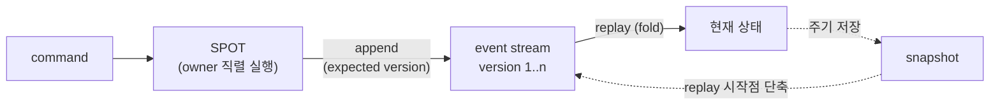

# Framework Event Sourcing 계약 초안 — event store와 event journal

> **결정(2026-07-13): 이 기능은 ZLink framework 기능이나 공식 extension으로 제공하지
> 않는다.** 이 문서는 승격 대기 초안이 아니라, 설계 검토를 마치고 채택하지 않기로
> 결정한 설계 기록이다. 본문의 도입 단계(§13)는 채택 시나리오 기준의 기록이며 현재
> 실행 계획이 아니다.
>
> 결정 근거:
>
> - **framework runtime이 이 계약을 소비하지 않는다**(§4.2). 정합성 경로는 SPOT owner
>   routing·직렬 실행 + 상태 저장 + saga 보상 흐름으로 충분하다. event sourcing은
>   정합성 도구가 아니라, 이력(감사·시점 재현·projection 재생성)이 도메인 요구일 때
>   선택하는 저장 방식이다.
> - **구현자가 이해하고 소유해야 하는 기능이다.** 이벤트 불변성, schema evolution,
>   replay 정책 같은 장기 운영 책임이 application 도메인에 있어, framework 규약으로
>   감추는 것보다 application이 직접 설계·구현하는 편이 맞다. ZLink 시스템의 도움이
>   있어야만 가능한 기능도 아니다.
> - 사용 패턴의 정본은 [ShoppingMall](../sample/event/shoppingmall.ko.md)(무손실 주문
>   workflow)과 [GameQuest](../sample/event/gamequest.ko.md)(quest SoR) 샘플이 맡는다.
>
> 이 문서는 설계 자산으로 보존한다. store/journal 계약 의미론(G1~G7·J1~J4), 저장소별
> 원자적 append의 함정(§10), 언어별 투영(§9)은 3라운드 교차 리뷰(codex + Claude)를
> 통과한 상태라, application이 event sourcing을 직접 구현할 때 참고 자료로 쓴다.
> 공용 구현 수요가 실제로 반복되면 §6.2의 원자적 append 조각(저장소별 원자성이 유일한
> 고위험 조각이다)부터 framework 밖 독립 library로 추출하는 것을 재검토한다.
>
> 이 문서는 application이 Kafka 같은 별도 이벤트 브로커 없이, Redis·MongoDB 같은 기존
> 저장소 위에서 event sourcing을 구현할 수 있도록 하는 두 계층의 계약 후보를 정의한다
> — 저장 계약인 **event store / snapshot store**와, Orleans·Akka Persistence 수준의
> 개발 경험을 제공하는 **event journal**.

## 1. 목적

전체 구조를 먼저 그림으로 확인한다. 명령은 SPOT에서 직렬로 처리되고, 상태 변경은
이벤트로 event stream에 기록되며, 상태는 이벤트를 순서대로 접어(fold) 복원한다.



ZLink framework의 SPOT은 owner routing과 직렬 실행으로 "한 상태 단위의 명령은 항상 한
곳에서 순서대로 처리된다"를 이미 보장한다. 그런데 위 그림의 저장·복원 부분을 event
sourcing으로 구현하려는 application은 저장 계층을 전부 직접 작성해야 한다. 정본 샘플인
[ShoppingMall](../sample/event/shoppingmall.ko.md)이 실제로 그렇게 구현되어 있다 —
expected version을 받는 append interface(`IOrderEventStore`), replay
(`OrderAggregate.Rehydrate`), read model 저장을 application 코드로 직접 구현했고, Redis
구현체는 전역 상태 JSON을 분산 lock 아래에서 읽고-수정하고-쓴다
(`framework/languages/dotnet/samples/ShoppingMall/Server/Shared/Store/RedisCommerceStores.cs`).

이 초안은 그 반복 작업을 framework 계약과 공식 extension으로 흡수한다. ShoppingMall의
구현은 요구사항의 **출발점이자 증거**이고, 아래 계약(전용 expected version 타입, 충돌의
결과 값 분리, stream별 원자 append, snapshot, event journal)은 그 경험과 기존 시스템
조사(§3)를 근거로 **새로 설계**한 것이다. 목표는 세 가지다.

- **append / read / snapshot의 언어 중립 store 계약**(§6)을 정의한다. 계약은 5개 언어가
  같은 의미로 투영한다.
- 그 위에 **event journal 계약**(§7)을 둔다 — Orleans `JournaledGrain`·Akka
  `EventSourcedBehavior`가 제공하는 자동 복구·기록·snapshot 정책 수준의 개발 경험을,
  SPOT 계약 변경 없이 조합형 표면으로 제공한다.
- **공식 저장소 extension**(Redis 우선, MongoDB 후보)을 별도 package로 제공한다. 사용자는
  인스턴스를 만들어 DI에 등록하기만 하면 된다.

이 기능은 framework의 두 목적과 직접 맞닿아 있다. 게임 서버에서는
[GameQuest](../sample/event/gamequest.ko.md)가 보여 주듯 player별 quest 진행을 owner
spot 안의 event-sourced aggregate로 판정·기록하고 재활성화 시 replay로 복원하는 데
쓰며(§8.6), 웹 서비스에서는 ShoppingMall이 보여 준 주문 workflow(상태 전이·복구·audit·
projection)를 조립 인프라 없이 구성하는 데 쓴다.

## 2. 비목표

- **Kafka·durable log 브로커를 대체하지 않는다.** 이 계약은 "한 stream(주문 하나,
  player의 quest 진행 하나)의 이벤트를 저장하고 다시 읽는" 범위만 다룬다. 여러 독립 시스템에 이벤트를 계속
  흘려보내는 브로커형 fan-out, consumer group 단위의 재생, 수개월치 로그 보존·재처리가
  필요하면 Kafka류가 맞다. [14-grpc-alternative §4](../../dotnet/guide/14-grpc-alternative.ko.md)의
  경계는 그대로 유지된다.
- **stream 전체를 가로지르는 구독(Akka Persistence Query의 `eventsByTag`, KurrentDB의
  `$all` 구독 상당)을 제공하지 않는다.** cross-stream projection이 필요하면 SPOT
  pub/sub(fanout channel)나 외부 브로커를 조합한다.
- **projection(read model) 저장 계약을 정의하지 않는다.** projection은 일반 KV/문서 저장이라
  기존 DB 접근 코드로 충분하다. framework는 replay로 projection을 다시 만들 수 있는
  이벤트 읽기 표면까지만 책임진다.
- **saga·분산 트랜잭션 오케스트레이션을 제공하지 않는다.** 보상 흐름은 ShoppingMall처럼
  application의 도메인 로직이 이벤트로 표현한다.
- **특정 저장소 제품을 유일한 표준으로 고정하지 않는다.** 계약은 저장소 중립이고, Redis·
  MongoDB extension은 공식 구현체일 뿐이다.
- **SPOT/actor 공개 계약을 바꾸지 않는다.** `IZLinkSpot` lifecycle, `GetOrCreateAsync`,
  owner routing 의미는 그대로다. event store와 event journal은 SPOT 계약에 새 member를
  추가하지 않고 DI 주입으로 조합한다. Orleans의 grain 상속(`JournaledGrain`)이나 Akka의
  behavior 상속 같은 **상속형 base class 방식은 채택하지 않는다** — 같은 기능을 조합형
  (journal 주입 + 명시 호출)으로 제공한다.
- **이벤트 저장을 SPOT lifecycle에 자동으로 묶지 않는다.** journal의 복구(`open`)와
  기록(`raise`)은 application이 명시적으로 호출한다. framework가 spot 생성 시점에
  몰래 replay를 실행하지 않는다.

## 3. 기존 시스템 조사와 도출 요구사항

계약을 새로 발명하지 않기 위해, 성숙한 event sourcing 시스템들의 공개 표면을 조사했다.

### 3.1 조사 요약

| 시스템 | 저장 모델 | 동시성 제어 | snapshot | 특징 |
|--------|-----------|-------------|----------|------|
| Orleans `JournaledGrain<TState,TEventBase>` | log-consistency provider 3종(state/log/custom storage) | grain 단일 활성화가 직렬화 담당 | state storage provider가 최신 상태 저장 | `RaiseEvent`(비대기 append) + `ConfirmEvents`(persist 대기), `RaiseEvents`로 배치 원자 기록, 활성화 시 자동 복구 |
| Akka Persistence Typed `EventSourcedBehavior` | journal plugin(Cassandra/JDBC/R2DBC 등) 교체형 | persistenceId당 actor 하나가 직렬화 담당 | snapshot store plugin + `snapshotWhen(predicate)` | commandHandler/eventHandler 분리, `eventAdapter`로 wire 형식 분리, recovery 시 자동 replay |
| Marten (PostgreSQL) | 이벤트 테이블 + inline/async projection | `FetchForWriting<T>(id, expectedVersion)` → `SaveChangesAsync`에서 `ConcurrencyException` | projection 문서가 snapshot 역할 | 읽기 + 동시성 검사 + append를 한 세션으로 묶은 command handler 워크플로 |
| KurrentDB(구 EventStoreDB) | stream별 append 전용 로그 | `AppendToStream(stream, StreamState, events)` — `Any`/`NoStream`/`StreamExists`/특정 revision | 별도 없음(클라이언트 관례) | expected revision을 전용 타입 `StreamState`로 노출해 오용 방지, catch-up 구독 |
| Redis Streams 패턴 | `XADD` append 전용 로그 | `WATCH` 또는 Lua script로 version 검사 | 별도 key에 상태 저장 관례 | consumer group으로 projection 소비. 다만 XADD의 자동 id는 version과 1:1 대응이 아니라서 version 기반 검사는 별도 장치가 필요하다 |
| MongoDB 패턴 | events collection | `(streamId, version)` unique compound index — 중복 삽입이 duplicate key 오류로 실패 | 별도 collection | 배치 원자성은 multi-document transaction으로 확보 |

### 3.2 도출 요구사항

**저장 계층(P0 — event store, §6).** 모든 시스템이 공유하는 최소 교집합이다.

1. **stream 단위 append 전용 저장.** 이벤트는 stream(주문 하나, player의 quest 진행
   하나) 안에서 순서가 보장되는 불변 목록이다. 수정·삭제 표면은 없다.
2. **expected version 기반 낙관적 동시성.** append 호출자가 "내가 마지막으로 본 버전"을
   함께 보내고, 실제 버전과 다르면 저장이 거부된다. KurrentDB의 `StreamState`처럼 예약값
   (`Any`, `NoStream`)을 전용 타입으로 노출해 오용을 막는다.
3. **배치 append의 원자성.** 한 번의 append에 담긴 이벤트 목록은 전부 기록되거나 전부
   거부된다(Orleans `RaiseEvents`와 같은 의미).
4. **fromVersion 기반 부분 읽기.** replay는 처음부터, snapshot 이후 재개는 중간부터 읽을
   수 있어야 한다.
5. **snapshot 저장/조회(선택 기능).** 긴 stream의 replay 비용을 줄이기 위한 성능 장치다.
   정확성은 이벤트만으로 보장되고, snapshot은 언제든 버리고 다시 만들 수 있어야 한다.

**통합 계층(P0 — event journal, §7).** Orleans와 Akka가 저장 계층 위에서 공통으로
제공하는 개발 경험이다. 이 계층이 없으면 application마다 read→replay→결정→append→충돌 처리
루프를 반복 구현하게 된다.

6. **자동 복구.** 상태 객체를 열면 snapshot 조회와 이후 이벤트 replay가 자동으로
   수행된다(Orleans·Akka의 recovery 상당).
7. **기록과 메모리 반영의 결합.** 이벤트를 기록하면 저장 완료를 대기하고, 성공 시 메모리
   상태에 같은 이벤트가 적용된다(Orleans `RaiseEvents`+`ConfirmEvents` 상당).
8. **snapshot 정책.** "이벤트 N개마다 저장" 같은 정책을 선언하면 journal이 실행한다
   (Akka `snapshotWhen` 상당. P0는 개수 기반, predicate는 P1).

반대로 다음은 P0에서 제외한다: cross-stream 구독(Akka Query·KurrentDB `$all`),
상속형 base class 통합(§2 비목표), projection 자동 갱신(Marten inline projection),
Marten `FetchForWriting`식 stateless repository(§11 P1 후보).

## 4. 기본 원칙

### 4.1 계약은 framework가, 구현은 extension이 소유한다

[location store](../../spec/server/40-location-runtime.ko.md)와 같은 구조를 따른다. framework 본체는
store interface와 값 타입만 정의하고, 실제 저장소 구현은 별도 extension package
(`Zlink.Framework.EventSourcing.Redis` 상당)나 사용자 코드가 제공한다. framework 본체는
Redis·MongoDB client에 의존하지 않는다.

event journal(§7)은 store 계약만 사용하는 **framework 공통 구현**이다. 저장소별로
다시 구현할 필요가 없다 — Redis든 MongoDB든 store 계약을 만족하면 journal은 그대로
동작한다.

```text
+--------------------------------------------------------------+
|  application (SPOT handler, 도메인 로직, projection)          |
+--------------------------------------------------------------+
|  framework: event journal (복구·기록·snapshot 정책 — 공통 구현)|
+--------------------------------------------------------------+
|  framework contracts: event store / snapshot store interface  |
+--------------------------------------------------------------+
|  extension package: Redis / MongoDB / in-memory 구현체        |
+--------------------------------------------------------------+
|  저장소: Redis, MongoDB, (사용자 구현: RDB 등)                |
+--------------------------------------------------------------+
```

### 4.2 등록은 host DI로 한다 — framework options 등록이 아니다

location store는 framework runtime 자신이 소비하므로 `options.AddLocationStore(instance)`
로 framework options에 등록한다. event store는 다르다 — **framework runtime은 event store를
읽지 않는다.** 소비자는 application handler와 도메인 서비스뿐이다. 그래서 framework options
표면을 확장하지 않고, host의 일반 DI 등록으로 충분하다.

```csharp
// 비규범 .NET 투영 예시. 정확한 이름은 언어별 스펙(§9)이 고정한다.
builder.Services.AddSingleton<IZLinkEventStore>(
    new ZLinkRedisEventStore(redis => redis
        .SetConnectionString("redis-orders.internal:6379")
        .SetKeyPrefix("commerce:prod")));
```

이 선택으로 `IZLinkFrameworkOptions` 공개 계약은 변경되지 않는다.

### 4.3 동시성은 두 겹으로 방어한다

SPOT owner routing이 첫 번째 방어선이다. 같은 stream의 명령이 항상 같은 SPOT에서 직렬
실행되므로, 정상 경로에서는 expected version 충돌이 일어나지 않는다. expected version은
두 번째 방어선이다 — actor transfer 직후의 잔여 실행, 운영 도구의 직접 접근, 잘못 배포된
중복 owner처럼 직렬화 바깥에서 들어오는 쓰기를 저장소가 최종적으로 거부한다.

두 방어선의 역할이 다르므로 어느 한쪽도 생략하지 않는다. store 구현체는 호출자가 SPOT
안에서 실행 중인지 알 수 없고 알 필요도 없다.

### 4.4 직렬화는 구현체가 소유하고, event type name 규칙은 계약이 소유한다

이벤트 payload를 바이트로 바꾸는 방식(JSON, MessagePack 등)은 store 구현체와 그 설정이
소유한다. 다만 "저장된 이벤트가 어떤 타입인지"를 식별하는 **event type name**은 계약이
소유한다 — 이 이름이 언어와 배포 버전을 가로질러 이벤트를 식별하는 키이기 때문이다.
규칙은 channel messaging의 packet name 규약을 재사용한다.

- 기본 event type name은 payload 타입 이름이다(예: `OrderStartedEvent`).
- 이름을 바꾸려면 payload 타입에 packet name override와 같은 표면을 쓴다
  (`[ZLinkPacket("order.started")]` 상당).
- 같은 store를 여러 언어가 읽을 수 있으므로, cross-language 시나리오에서는 명시적 이름
  지정을 권장한다.

### 4.5 이벤트는 불변이고 계약은 append 전용이다

계약에는 이벤트를 수정하거나 삭제하는 표면이 없다. GDPR류의 데이터 삭제 요구는 stream
전체 삭제(운영 표면, §6.6)나 payload 암호화 같은 application 정책으로 다루고, 이 초안의
범위 밖이다.

## 5. 용어와 모델

주문 하나의 저장 상태를 예로 전체 구조를 확인한다. **번호가 붙은 이벤트의 목록**이
기준 저장본이고, 그 옆에 선택적으로 **중간 결과 저장본** 하나가 있다.

```text
stream "order-2041"
  version 1: OrderStartedEvent        {...}
  version 2: InventoryReservedEvent   {...}
  version 3: PaymentAuthorizedEvent   {...}
  version 4: OrderConfirmedEvent      {...}
        ▲
        └─ 다음 append는 expectedVersion=4 를 보내야 성공한다

snapshot "order-2041"  (선택)
  version 3 까지 접은 상태: { Status: "PaymentAuthorized", ... }
```

| 용어 | 뜻 |
|------|-----|
| **stream** | 한 상태 단위(주문 하나, player의 quest 진행 하나)의 이벤트 전체. `streamId` 문자열로 식별한다 |
| **version** | stream 안에서 이벤트에 붙는 1부터 시작하는 연속 번호. stream의 현재 version은 마지막 이벤트의 번호이고, 이벤트가 없으면 0이다 |
| **append** | stream 끝에 이벤트 목록을 원자적으로 추가하는 유일한 쓰기 연산 |
| **expected version** | append 호출자가 함께 보내는 "내가 아는 현재 version". 실제와 다르면 append가 거부된다 |
| **replay** | stream의 이벤트를 순서대로 접어(fold) 현재 상태를 재구성하는 것. ShoppingMall의 `OrderAggregate.Rehydrate`가 이 역할을 맡는다 |
| **snapshot** | 특정 version까지 접은 상태의 저장본. replay 시작점을 앞당기는 성능 장치이며, 지워도 정확성이 깨지지 않는다 |
| **event journal** | 복구·기록·snapshot 정책을 묶은 상태 객체(§7). store 위에서 동작하는 framework 공통 구현이다 |
| **projection** | 조회용으로 접어 둔 read model. 이 계약의 범위 밖이고, replay로 다시 만들 수 있다는 성질만 계약이 뒷받침한다 |

## 6. 공통 계약 — event store / snapshot store

이 절과 §7이 5개 언어가 도달해야 하는 목표 계약이다. 시그니처 표기는 의사 코드이고,
언어별 정확한 투영은 §9가 정의한다.

### 6.1 event envelope

append에 넣는 입력과 read가 돌려주는 저장본을 구분한다.

**입력(event data)** — 호출자가 만든다.

| 필드 | 타입 | 의미 |
|------|------|------|
| `eventId` | string | 이벤트 고유 id. application이 생성한다. 추적과 application 수준 중복 감지에 쓰는 식별자이며, **store는 `eventId` 중복을 검사하지 않는다**(§6.5) |
| `eventType` | string | event type name(§4.4). 생략하면 payload 타입 이름 |
| `payload` | 앱 정의 타입 | 도메인 이벤트 본문. 직렬화는 구현체 소유 |
| `metadata` | string map (선택) | correlation id, 명령 출처 같은 부가 정보 |

**저장본(stored event)** — store가 돌려준다. 입력 필드에 다음이 추가된다.

| 필드 | 타입 | 의미 |
|------|------|------|
| `streamId` | string | 소속 stream |
| `version` | int64 | 이 이벤트의 version (1부터, stream 안에서 연속) |
| `storedAtUnixMs` | int64 | store가 기록한 저장 시각. 도메인 시각이 필요하면 payload에 따로 둔다 |

### 6.2 append와 expected version

```text
append(streamId, expectedVersion, events[]) -> AppendResult
```

- append는 **이벤트 유무와 무관하게 expected version 검사를 먼저 수행한다.** 검사가
  실패하면 `versionConflict`다.
- `events`가 비어 있으면(그리고 검사를 통과하면) 아무것도 기록하지 않고 현재 version을
  담아 `committed`로 돌려준다.
- 목록은 원자적으로 기록된다. 일부만 저장되는 상태는 계약 위반이다.
- 성공 시 각 이벤트는 `현재 version + 1`부터 연속 번호를 받는다.

`expectedVersion`은 전용 타입으로 노출한다. KurrentDB의 `StreamState`와 같은 취지로,
정수 하나를 그대로 받으면 "0이 무엇인지"를 호출자마다 다르게 해석하는 사고가 나기 때문이다.

| 값 | 의미 | 우선순위 |
|----|------|----------|
| `exact(n)` | 현재 version이 정확히 `n`(≥1)일 때만 성공 | P0 |
| `noStream` | stream이 아직 없을 때(version 0)만 성공 | P0 |
| `any` | version을 검사하지 않고 끝에 붙인다 | P1 |

`AppendResult`는 두 갈래다.

| 결과 | 담는 값 | 의미 |
|------|---------|------|
| `committed` | `nextVersion` (마지막으로 기록된 version. 빈 append면 현재 version) | 저장 성공 |
| `versionConflict` | `actualVersion` (실제 현재 version) | expected version 불일치로 거부됨 |

**version 충돌은 오류(예외)가 아니라 결과 값이다.** 동시성 경합은 정상 운영에서 일어나는
흐름이라, [location store의 write result 분리](../../spec/server/40-location-runtime.ko.md)와 같은
원칙을 따른다 — 저장소 연결 실패 같은 infrastructure 오류만 언어별 오류 모델(§6.6)로
던지고, 경합은 호출자가 분기하는 결과로 돌려준다. 호출자의 표준 대응은 "다시 읽고, 다시
결정하고, 다시 append"다(§7의 journal은 이 대응을 내장한다).

### 6.3 read

```text
read(streamId, fromVersion = 1, maxCount = 구현 기본값) -> StoredEvent[]
```

- `fromVersion` 이상, version 오름차순으로 최대 `maxCount`개를 돌려준다.
- stream이 없으면 빈 목록을 돌려준다. "stream 없음"과 "이벤트 0개"를 구분하는 별도 표면은
  두지 않는다 — 둘 다 replay 결과가 초기 상태라는 점에서 호출자 분기가 같다.
- 전체 replay는 빈 결과가 나올 때까지 `fromVersion`을 올려 가며 반복 호출한다. 언어별
  투영은 이 반복을 감춘 편의 표면(`readAll` 상당)을 함께 둘 수 있다.

```text
currentVersion(streamId) -> int64      // P1. 이벤트 없이 version만 조회
```

### 6.4 snapshot store — 별도 계약, 선택 구현

snapshot은 event store와 저장 위치·수명이 다를 수 있어 별도 interface로 분리한다.
구현체는 둘을 한 클래스로 함께 구현해도 된다(공식 extension은 함께 제공한다).

```text
loadSnapshot(streamId)                  -> Snapshot? { state, version, storedAtUnixMs }
saveSnapshot(streamId, version, state)  -> void
deleteSnapshot(streamId)                -> void
```

- `saveSnapshot`은 마지막 저장을 덮어쓴다. stream당 snapshot은 최대 1개다(여러 세대
  보관은 P0 범위 밖).
- **단조성(G7):** 이미 저장된 snapshot보다 낮은 version으로 저장을 요청하면, 구현체는
  기존 snapshot을 유지한 채 성공으로 끝낸다. 늦게 도착한 오래된 snapshot이 최신
  snapshot을 되돌리는 것을 막는다.
- **호출자 의무:** snapshot store는 event stream과 version을 대조하지 않고, `state`의
  내용도 검증하지 못한다(별도 저장소 원칙). 따라서 **committed된 version만, 그
  version까지의 이벤트를 접은 정확한 상태와 함께 저장하는 것은 호출자 책임**이다.
  §7의 journal을 쓰면 이 의무는 journal이 이행한다.
- snapshot 저장 주기(N 이벤트마다, 시간마다)는 호출자 정책이다. journal(§7)은 개수 기반
  정책을 내장한다.
- **정확성 규칙:** snapshot이 없거나 지워져도 replay 결과는 같아야 한다. 구현체·호출자
  모두 snapshot을 캐시로만 다룬다.

### 6.5 원자성·순서 보장 요구 (구현체 준수 사항)

store 구현체는 다음을 만족해야 한다. 공용 contract test(§12.2)가 이 표를 그대로 검증한다.

| # | 보장 | 내용 |
|---|------|------|
| G1 | 배치 원자성 | 한 append의 이벤트 목록은 전부 기록되거나 전부 거부된다. 부분 기록이 read에 노출되는 순간이 있어서는 안 된다 |
| G2 | version 연속성 | 기록된 이벤트의 version은 stream 안에서 1부터 빈틈없이 증가한다 |
| G3 | 충돌 정확성 | expected version 불일치는(빈 append를 포함해) 반드시 `versionConflict`로 끝나고, 어떤 이벤트도 기록하지 않는다 |
| G4 | 읽기 순서 | read는 항상 version 오름차순이며, committed된 이벤트만 돌려준다 |
| G5 | 동시 append 직렬성 | 같은 stream에 대한 동시 append 중 최대 하나만 같은 expected version으로 성공한다 |
| G6 | snapshot 독립성 | snapshot 유무는 event stream의 내용·version에 영향을 주지 않는다 |
| G7 | snapshot 단조성 | 기존 snapshot보다 낮은 version의 저장 요청은 기존 snapshot을 유지한다(§6.4) |

**중복 제거는 보장하지 않는다.** store는 `eventId`가 같은 이벤트의 재기록을 거부하지
않는다. 같은 명령의 재처리 방지는 expected version과 SPOT 직렬 실행이 맡고, 의미 수준의
중복 감지(ShoppingMall이 `SourceCommandId`로 하던 검사)는 application 도메인 로직의
책임으로 남는다.

### 6.6 오류 모델

- **version 충돌은 결과 값이다**(§6.2). 오류 모델로 던지지 않는다.
- **infrastructure 오류**(연결 실패, 시간 초과, 직렬화 실패)는 언어별 오류 관례로 던진다.
  언어별 매핑은 §9의 각 절이 고정한다.
- stream 삭제(`deleteStream`)는 P0 계약에 넣지 않는다. 테스트 격리는 key prefix로
  해결하고(location store Redis extension과 같은 방식), 운영 삭제 표면은 extension별
  관리 도구 영역으로 남긴다.

## 7. 공통 계약 — event journal

store(§6)가 저장 의미를 고정하는 저수준 계약이라면, journal은 application이 실제로
사용하는 고수준 표면이다. Orleans·Akka가 저장 plugin 위에서 제공하는 통합 계층과 같은
자리다.

| 기능 | Orleans | Akka Persistence | 이 계약 |
|------|---------|------------------|---------|
| 상태·이벤트 정의 | `JournaledGrain<TState,TEventBase>` 상속 + `TransitionState` | `EventSourcedBehavior(emptyState, eventHandler)` | journal definition — `initialState` + `apply(state, event)` (§7.1) |
| 복구(recovery) | grain 활성화 시 자동 | actor 시작 시 자동 | `open(streamId, definition)`이 snapshot 조회 + replay 수행. 호출 시점은 application 소유(§2 비목표) |
| 이벤트 기록 | `RaiseEvents` + `ConfirmEvents` | `persist` | `raise(events[])` — 배치 원자 기록 + 저장 완료 대기 + 메모리 반영 (§7.2) |
| snapshot 정책 | provider 설정 | `snapshotWhen(predicate)` | definition의 `snapshotEvery(n)` (predicate는 P1) |
| 동시성 | grain 단일 활성화 | actor 단일 인스턴스 | SPOT owner 직렬 실행(1차) + expected version(2차, §4.3) |

### 7.1 열기(open)와 정의(definition)

```text
definition = { initialState, apply(state, event) -> state, snapshotEvery?: n }

open(streamId, definition) -> Journal
```

- `open`은 snapshot을 조회하고, 그 다음 version부터 이벤트를 읽어 `apply`로 접은 뒤,
  완성된 메모리 상태를 가진 journal을 돌려준다. snapshot이 없으면 `initialState`에서
  시작해 전체를 replay한다.
- `apply`는 순수하고 전체(total) 함수여야 한다 — 같은 상태와 이벤트에 대해 항상 같은
  결과를 내고, I/O를 하지 않으며, 예외를 던지지 않는다. replay와 기록 후 반영이 같은
  함수를 쓰기 때문이고, 기록이 끝난 뒤의 apply 실패는 저장소와 메모리 상태를 갈라놓기
  때문이다(§7.2의 실패 규정 참고).
- journal은 **동시 사용을 지원하지 않는다.** 한 SPOT(또는 한 실행 흐름) 안에서 직렬로
  사용하는 것을 전제하며, 스레드 안전을 보장하지 않는다. 같은 streamId로 여러 journal을
  열면 §4.3의 두 번째 방어선(expected version)이 정합성을 지킨다.

### 7.2 상태 조회와 기록(raise)

```text
journal.state                    -> TState      // 메모리 상태 (복구·기록이 반영된 최신본)
journal.version                  -> int64       // 메모리 상태가 반영한 마지막 version
journal.raise(events[])          -> AppendResult
journal.refresh()                -> void        // 저장소 기준으로 메모리 상태 재구성
journal.saveSnapshot()           -> void        // 현재 상태를 즉시 snapshot으로 저장 (정책과 별개)
```

명시적 `saveSnapshot()`은 §6.6의 일반 오류 규칙을 따른다 — 아래 J4의 실패 무시는
`raise` 내부에서 `snapshotEvery` 정책이 자동 실행하는 snapshot 저장에만 적용된다.

`raise`의 동작은 다음과 같다.

1. 메모리 `version`을 expected version으로 삼아 store에 append한다 — `version`이 0이면
   `noStream`, 그 외에는 `exact(version)`이다(빈 목록이면 §6.2의 빈 append 규칙을 따른다).
2. `committed`면 — 같은 이벤트 목록을 `apply`로 메모리 상태에 반영하고 `version`을
   갱신한 뒤, `snapshotEvery` 정책에 도달했으면 snapshot을 저장한다. snapshot 저장이
   실패해도 무시하고(관측 로그만 남긴다) `committed` 결과를 그대로 돌려준다(J4).
3. `versionConflict`면 — journal이 **스스로 저장소 기준으로 재동기화**(refresh)한 뒤
   `versionConflict`를 돌려준다. 호출자는 갱신된 `state`를 보고 재결정한다.

`apply`가 계약(§7.1)을 어기고 예외를 던지면 — 이벤트는 이미 기록된 뒤이므로 journal은
메모리 상태를 신뢰할 수 없는 **불능 상태**가 되고, 이후 `state`·`version` 접근과
`raise`는 오류로 끝난다. `apply`는 순수 함수라 같은 이벤트를 다시 접는 `refresh`도
같은 실패를 재현하므로, 이 불능 상태는 journal 안에서 복구되지 않는다 — 결함 있는
`apply`(코드 버그)를 수정한 definition으로 journal을 다시 `open`하는 것이 유일한
복구 경로다. 이 경로는 계약 위반(§7.1) 시의 방어 동작이므로 §12의 보장 추적(G/J
라벨) 대상이 아니다.

### 7.3 journal 보장 (framework 공통 구현 준수 사항)

| # | 보장 | 내용 |
|---|------|------|
| J1 | 복구 동등성 | `open` 직후의 `state`는 snapshot 없이 전체 이벤트를 replay한 결과와 같다. 전제: 저장된 snapshot이 §6.4의 호출자 의무(committed version + 그 version까지 접은 정확한 상태)를 만족한다 — journal이 저장한 snapshot은 항상 이 전제를 만족한다 |
| J2 | 기록 반영 | `raise`가 `committed`를 돌려주면 `state`는 기록된 이벤트가 apply된 결과이고 `version`은 append 결과의 `nextVersion`과 같다 |
| J3 | 충돌 재동기화 | `raise`가 `versionConflict`를 돌려주면 `state`·`version`은 저장소의 현재 내용과 일치한다 |
| J4 | snapshot 실패 격리 | snapshot 저장 실패는 `raise`의 결과를 바꾸지 않는다. 이벤트가 committed면 결과는 `committed`다(snapshot은 성능 장치라는 §6.4 원칙의 연장) |

## 8. 사용 샘플

비규범 `.NET` 투영이며, 정확한 이름은 §9.1이 고정한다. 값은 ShoppingMall 샘플의
도메인을 그대로 쓴다.

### 8.1 등록

```csharp
// Program.cs — host DI 등록. framework options는 그대로다.
builder.Services.AddSingleton<ZLinkRedisEventSourcingStores>(sp =>
    new ZLinkRedisEventSourcingStores(redis => redis
        .SetConnectionString("redis-orders.internal:6379")
        .SetKeyPrefix("commerce:prod")));
builder.Services.AddSingleton<IZLinkEventStore>(sp =>
    sp.GetRequiredService<ZLinkRedisEventSourcingStores>());
builder.Services.AddSingleton<IZLinkEventSnapshotStore>(sp =>
    sp.GetRequiredService<ZLinkRedisEventSourcingStores>());
builder.Services.AddSingleton<IZLinkEventJournalFactory, ZLinkEventJournalFactory>();

builder.Services.AddZLinkFramework(options =>
{
    options.AddSpotMesh("commerce.order").EnableRouter("tcp://0.0.0.0:7304");
    // ... 기존 channel/SPOT 등록 그대로
});
```

### 8.2 이벤트 정의

이벤트 타입은 지금 ShoppingMall의 것을 그대로 쓴다. 달라지는 점은 직렬화 다형성
(`JsonDerivedType` 나열)을 앱이 관리하는 대신, event type name 규칙(§4.4)으로 store가
역직렬화 타입을 찾는다는 것이다.

```csharp
public abstract record OrderDomainEvent(string EventId, string OrderId, long CreatedAtUnixMs);

public sealed record OrderStartedEvent(
    string EventId, string SourceCommandId, string OrderId, string CartId,
    string ShippingAddressId, OrderLineInput[] Lines,
    decimal Amount, string Currency, long CreatedAtUnixMs)
    : OrderDomainEvent(EventId, OrderId, CreatedAtUnixMs);

public sealed record InventoryReservedEvent(
    string EventId, string OrderId, string ReservationId, long CreatedAtUnixMs)
    : OrderDomainEvent(EventId, OrderId, CreatedAtUnixMs);
// ... PaymentAuthorizedEvent, OrderConfirmedEvent, OrderFailedEvent 등
```

### 8.3 SPOT + journal — 표준 사용 형태

주문 workflow spot이 journal을 열고(`OnCreateAsync` 이후 첫 진입), 명령마다 도메인이
결정한 이벤트를 `raise`한다. read→replay→append 루프는 journal이 소유하므로
application 코드에는 나타나지 않는다. ShoppingMall의 owner routing은 `OrderId`를 spot
rid로 쓰므로 **spot 인스턴스 하나가 주문 하나에 대응한다** — 아래의 `_journal` 캐시는
그 전제 위에서만 올바르다.

```csharp
internal sealed class OrderWorkflowSpot(
    IZLinkSpotContext context,
    IZLinkEventJournalFactory journals) : IZLinkSpot
{
    private static readonly ZLinkEventJournalDefinition<OrderState?, OrderDomainEvent> Definition =
        ZLinkEventJournalDefinition
            .Create<OrderState?, OrderDomainEvent>(initialState: null, apply: OrderProjection.Apply)
            .SnapshotEvery(50);

    private IZLinkEventJournal<OrderState?, OrderDomainEvent>? _journal;

    public IZLinkSpotContext Context { get; } = context;

    public ValueTask<ZLinkSpotCreateResponse> OnCreateAsync(ZLinkMessage request, CancellationToken ct)
        => ValueTask.FromResult(ZLinkSpotCreateResponse.Accept());

    public ValueTask OnClosingAsync(CancellationToken ct) => ValueTask.CompletedTask;

    // spot rid = OrderId(owner routing)라서 이 spot에는 한 주문의 명령만 도착한다.
    private async ValueTask<IZLinkEventJournal<OrderState?, OrderDomainEvent>> JournalAsync(
        string orderId, CancellationToken ct)
        => _journal ??= await journals.OpenAsync($"order-{orderId}", Definition, ct);
        // open이 snapshot 조회 + 이후 이벤트 replay를 수행한다 (J1)

    public async ValueTask<StartOrderWorkflowRes> StartOrderWorkflowAsync(
        StartOrderWorkflowReq request, CancellationToken ct)
    {
        var journal = await JournalAsync(request.OrderId, ct);

        // 도메인이 다음 이벤트를 결정한다 — 도메인 코드는 저장소를 모른다
        var next = OrderPolicy.DecideStart(journal.State, request);
        if (next.Count == 0) return new StartOrderWorkflowRes(journal.State!);

        var result = await journal.RaiseAsync(
            next.Select(e => new ZLinkEventData(e.EventId, e)).ToArray(), ct);

        if (result.IsVersionConflict)
        {
            // SPOT 직렬화 밖의 개입(§4.3). journal은 이미 재동기화됐다 (J3) —
            // 갱신된 state로 재결정하거나 오류로 끝낸다. 여기서는 현재 상태를 돌려준다.
            return new StartOrderWorkflowRes(journal.State!);
        }
        return new StartOrderWorkflowRes(journal.State!);   // raise가 반영한 최신 상태 (J2)
    }
}
```

### 8.4 store를 직접 쓰는 경우

journal 없이 store 계약만 쓰는 저수준 형태다. journal이 내장한 루프를 호출자가 직접
가진다 — SPOT 밖의 일회성 도구나 journal 정책이 맞지 않는 특수 사용처를 위한 표면이다.

```csharp
public async ValueTask<OrderState> ContinueAsync(string orderId, CancellationToken ct)
{
    while (true)
    {
        // 1. snapshot이 있으면 그 다음 version부터 읽는다
        var snapshot = await snapshots.LoadAsync<OrderState>(orderId, ct);
        var stored = await events.ReadAllAsync(orderId, fromVersion: (snapshot?.Version ?? 0) + 1, ct);

        // 2. replay — snapshot 상태에서 시작해 남은 이벤트를 접는다
        var state = snapshot?.State;
        foreach (var e in stored) state = OrderProjection.Apply(state, (OrderDomainEvent)e.Payload);
        var version = stored.Count > 0 ? stored[^1].Version : snapshot?.Version ?? 0;

        // 3. 도메인이 다음 이벤트를 결정한다
        var next = OrderPolicy.DecideNext(state);
        if (next.Count == 0) return state!;

        // 4. append — 내가 본 마지막 version을 expected로 보낸다
        var result = await events.AppendAsync(
            orderId,
            version == 0 ? ZLinkExpectedStreamVersion.NoStream
                         : ZLinkExpectedStreamVersion.Exact(version),
            next.Select(e => new ZLinkEventData(e.EventId, e)).ToArray(), ct);

        // 5. 충돌이면 처음부터 다시 — 누군가 먼저 썼다는 뜻이다
        if (result.IsVersionConflict) continue;

        // 6. 방금 기록한 이벤트를 메모리 상태에도 반영한 뒤 돌려준다
        foreach (var e in next) state = OrderProjection.Apply(state, e);
        return state!;
    }
}
```

### 8.5 projection rebuild

projection 저장은 계약 밖이지만(§2), rebuild가 계약 위에서 어떻게 성립하는지 보인다.

```csharp
public async ValueTask<OrderState> RebuildProjectionAsync(string orderId, CancellationToken ct)
{
    var stored = await events.ReadAllAsync(orderId, fromVersion: 1, ct);   // snapshot 없이 처음부터
    OrderState? state = null;
    foreach (var e in stored) state = OrderProjection.Apply(state, (OrderDomainEvent)e.Payload);
    if (state is null) throw new InvalidOperationException($"Order '{orderId}' has no event stream.");
    await readModels.SaveAsync(state, ct);                                  // 앱의 기존 read model 저장
    return state;
}
```

### 8.6 게임 서버에서의 모양 — GameQuest

게임 쪽 정본 샘플은 [GameQuest](../sample/event/gamequest.ko.md)다. `PlayerQuestSpot`이
player별 owner로 gameplay event를 직렬 처리하는 **event-sourced aggregate**이고
(GameQuest §9), 그 처리 루프의 저장 단계들이 journal 표면과 1:1로 대응한다.

| GameQuest §9 처리 루프 | journal 대응 |
|------------------------|--------------|
| 1. 최초 활성 시 `QuestEventStore` replay(snapshot + 꼬리)로 aggregate 복원 | `open` (J1) |
| 5. 생성한 domain event를 append (append-only SoR) | `raise`의 append 단계 |
| 6. 같은 event를 in-memory aggregate에 fold | `raise`의 메모리 반영 단계 (J2) |
| 주기적 snapshot으로 replay 시작점 단축 | definition의 `snapshotEvery(n)` |
| 2. `EventId`(source) 중복이면 무시 — idempotency | journal 밖 — stream에 함께 기록된 `SourceEventId`(GameQuest §11.3)가 fold를 거쳐 aggregate에 반영되고, 도메인이 그것으로 판정한다. store가 중복을 검사하지 않는다는 §6.5 원칙 그대로다 |

stream은 GameQuest의 event stream 단위인 `(PlayerId, QuestId)`를 그대로 쓴다.

```csharp
// PlayerQuestSpot 안 — quest 하나의 진행을 journal로 기록한다.
// streamId = (PlayerId, QuestId), 상태 = QuestProgress fold 결과.
var journal = await journals.OpenAsync(
    $"quest-{playerId}-{questId}", QuestJournalDefinition, ct);   // 복원 (J1)

if (journal.State.HasApplied(msg.EventId))                        // source EventId dedupe (도메인 판정)
    return;

var decided = QuestPolicy.Decide(journal.State, msg);             // QuestProgressed / QuestCompleted / QuestRewardGranted
var result = await journal.RaiseAsync(
    decided.Select(e => new ZLinkEventData(e.EventId, e, metadata: SourceOf(msg))).ToArray(), ct);
if (result.IsVersionConflict)
    return;   // 직렬화 밖 개입 — journal은 재동기화됐다(J3). 다음 msg가 갱신된 state로 다시 판정한다.
// committed일 때만 — journal.State에 이미 반영됨(J2). projection 갱신과 notify를 이어서 수행한다.
```

노드 재시작(또는 owner 비활성 후 재활성) 뒤 owner routing이 spot을 다른 노드에 다시
만들면, 첫 진입의 `open`이 snapshot과 이벤트 replay로 quest 상태를 복원한다 — GameQuest
§14 self-check의 "rehydrate 복원" 시나리오가 이 경로다. reward 결정의 중복 방지
(`QuestCompleted`/`QuestRewardGranted`가 stream에 이미 있으면 다시 append하지 않음)도
fold된 상태를 보고 도메인이 판정하므로, §6.5의 "중복 제거는 store가 보장하지 않는다"와
정확히 같은 책임 분배다. gameplay event **전달**(entry-spot → owner spot)의 best-effort
특성과 reconcile 보정은 이 계약의 범위 밖이며(전달은 transport 문제) GameQuest §9가
소유한다.

## 9. 언어별 인터페이스 투영

공통 계약(§6·§7)의 언어별 목표 시그니처다. 비동기·취소 표현은 각 언어의 기존 공개 계약
관례([handler-interfaces](../../spec/server/languages/README.ko.md))를 그대로 따른다 — 비동기 타입은
`.NET` `ValueTask` / Java `CompletionStage` / Kotlin `suspend` / Node `Promise` /
C++ `task_t`, 취소는 `.NET`만 `CancellationToken`을 받고 Java·Kotlin·C++는 취소 인자를
두지 않으며 Node는 장기 작업에만 선택적 `AbortSignal`을 둔다.

**C++ 투영은 payload 표현이 미확정(§14 #3)이라 부분 목표 계약이다.** 확정 전까지
[구현 차이](../../spec/90-implementation-gap.ko.md) 관리 대상으로 두고, 다른 4개 언어의
투영만 완전한 목표 계약으로 본다.

각 언어 절은 계약의 핵심 표면(store·snapshot·journal의 진입점과 값 타입)에 대한 목표
시그니처를 고정한다. 전체 멤버 나열과 세부 overload는 단계 1(§13)에서 언어별 스펙
문서가 소유한다.

### 9.1 .NET

namespace `Zlink.Framework.Contracts.EventSourcing`. 값 타입은 record, interface는
`IZLink` prefix.

```csharp
public interface IZLinkEventStore
{
    ValueTask<ZLinkEventAppendResult> AppendAsync(
        string streamId,
        ZLinkExpectedStreamVersion expectedVersion,
        IReadOnlyList<ZLinkEventData> events,
        CancellationToken cancellationToken = default);

    ValueTask<IReadOnlyList<ZLinkStoredEvent>> ReadAsync(
        string streamId,
        long fromVersion = 1,
        int maxCount = 512,
        CancellationToken cancellationToken = default);
}

public interface IZLinkEventSnapshotStore
{
    ValueTask<ZLinkEventSnapshot<TState>?> LoadAsync<TState>(
        string streamId, CancellationToken cancellationToken = default);

    ValueTask SaveAsync<TState>(
        string streamId, long version, TState state,
        CancellationToken cancellationToken = default);

    ValueTask DeleteAsync(string streamId, CancellationToken cancellationToken = default);
}

public sealed record ZLinkEventData(
    string EventId,
    object Payload,
    string? EventType = null,                       // null이면 payload 타입 이름
    IReadOnlyDictionary<string, string>? Metadata = null);

public sealed record ZLinkStoredEvent(
    string StreamId,
    long Version,
    string EventId,
    string EventType,
    object Payload,
    IReadOnlyDictionary<string, string> Metadata,
    long StoredAtUnixMs);

public readonly record struct ZLinkExpectedStreamVersion
{
    public static ZLinkExpectedStreamVersion NoStream { get; }
    public static ZLinkExpectedStreamVersion Any { get; }          // P1
    public static ZLinkExpectedStreamVersion Exact(long version);
}

public sealed record ZLinkEventAppendResult
{
    public bool IsCommitted { get; }
    public bool IsVersionConflict { get; }
    public long NextVersion { get; }        // committed일 때: 마지막 기록 version
    public long ActualVersion { get; }      // conflict일 때: 실제 현재 version
}

public sealed record ZLinkEventSnapshot<TState>(TState State, long Version, long StoredAtUnixMs);
```

journal(§7)의 `.NET` 투영:

```csharp
public interface IZLinkEventJournalFactory
{
    ValueTask<IZLinkEventJournal<TState, TEvent>> OpenAsync<TState, TEvent>(
        string streamId,
        ZLinkEventJournalDefinition<TState, TEvent> definition,
        CancellationToken cancellationToken = default);
}

public sealed class ZLinkEventJournalDefinition<TState, TEvent>
{
    public static ZLinkEventJournalDefinition<TState, TEvent> Create(
        TState initialState, Func<TState, TEvent, TState> apply);
    public ZLinkEventJournalDefinition<TState, TEvent> SnapshotEvery(int events);
}

public interface IZLinkEventJournal<TState, TEvent>
{
    TState State { get; }
    long Version { get; }

    ValueTask<ZLinkEventAppendResult> RaiseAsync(
        IReadOnlyList<ZLinkEventData> events, CancellationToken cancellationToken = default);

    ValueTask RefreshAsync(CancellationToken cancellationToken = default);
    ValueTask SaveSnapshotAsync(CancellationToken cancellationToken = default);
}
```

- infrastructure 오류는 `ZLinkEventStoreException : Exception`으로 던진다(연결·직렬화 실패).
  `ZLinkConfigurationException`·`ZlinkStreamException` 선례와 같은 typed exception 모델이다.
- `ReadAllAsync(streamId, fromVersion, ct)`는 `ReadAsync` 반복을 감춘 확장 메서드로
  contracts package가 제공한다.

### 9.2 Java

package `systems.zlink.framework.eventsourcing`. `I` prefix 없이 `ZLink` prefix,
비동기는 `CompletionStage`, 취소 인자는 없다.

```java
public interface ZLinkEventStore {
    CompletionStage<ZLinkEventAppendResult> append(
        String streamId,
        ZLinkExpectedStreamVersion expectedVersion,
        List<ZLinkEventData> events);

    CompletionStage<List<ZLinkStoredEvent>> read(
        String streamId, long fromVersion, int maxCount);
}

public interface ZLinkEventSnapshotStore {
    <TState> CompletionStage<Optional<ZLinkEventSnapshot<TState>>> load(
        String streamId, Class<TState> stateType);

    <TState> CompletionStage<Void> save(String streamId, long version, TState state);

    CompletionStage<Void> delete(String streamId);
}

public interface ZLinkEventJournalFactory {
    <TState, TEvent> CompletionStage<ZLinkEventJournal<TState, TEvent>> open(
        String streamId, ZLinkEventJournalDefinition<TState, TEvent> definition);
}

public interface ZLinkEventJournal<TState, TEvent> {
    TState state();
    long version();
    CompletionStage<ZLinkEventAppendResult> raise(List<ZLinkEventData> events);
    CompletionStage<Void> refresh();
    CompletionStage<Void> saveSnapshot();
}
```

- 값 타입(`ZLinkEventData`, `ZLinkStoredEvent`, `ZLinkEventAppendResult`,
  `ZLinkExpectedStreamVersion`, `ZLinkEventSnapshot<TState>`)과
  `ZLinkEventJournalDefinition<TState, TEvent>`(initialState + apply + snapshotEvery)는
  §9.1과 같은 구조의 record/builder다.
- infrastructure 오류는 `CompletionStage`를 예외로 완료한다(Java handler 오류 관례와
  동일). 전용 exception 타입 이름은 언어 스펙 확정 시 정한다.

### 9.3 Kotlin

package `systems.zlink.framework.kotlin`. Java 계약을 복사하지 않고 suspend 어댑터만
추가한다 — `ZLinkSuspendingLocationStore` abstract adapter와 suspend extension function을
함께 두는 기존 Kotlin location 계약과 같은 구조다.

```kotlin
abstract class ZLinkSuspendingEventStore : ZLinkEventStore {
    protected abstract suspend fun append(
        streamId: String,
        expectedVersion: ZLinkExpectedStreamVersion,
        events: List<ZLinkEventData>,
    ): ZLinkEventAppendResult

    protected abstract suspend fun read(
        streamId: String, fromVersion: Long, maxCount: Int,
    ): List<ZLinkStoredEvent>

    // final override fun append(...): CompletionStage<...> 는
    // CoroutineScope.future { ... } non-blocking bridge로 구현한다. runBlocking 금지.
}

// Java 구현체(공식 Redis extension 포함)를 suspend로 소비하는 extension function
suspend fun ZLinkEventStore.append(
    streamId: String, expectedVersion: ZLinkExpectedStreamVersion, events: List<ZLinkEventData>,
): ZLinkEventAppendResult
// read 동형

suspend fun <TState> ZLinkEventSnapshotStore.loadSnapshot(
    streamId: String, stateType: Class<TState>,
): ZLinkEventSnapshot<TState>?
// saveSnapshot / deleteSnapshot 동형

suspend fun <TState, TEvent> ZLinkEventJournalFactory.open(
    streamId: String, definition: ZLinkEventJournalDefinition<TState, TEvent>,
): ZLinkEventJournal<TState, TEvent>

suspend fun <TState, TEvent> ZLinkEventJournal<TState, TEvent>.raise(
    events: List<ZLinkEventData>,
): ZLinkEventAppendResult
// refresh / saveSnapshot 도 같은 규칙으로 suspend 표면을 제공한다
```

- 취소 토큰은 받지 않는다. coroutine lifecycle을 따른다.

### 9.4 Node.js

interface에 `I` prefix 없이 `ZLink` prefix, 비동기는 `Promise`, store 접근은 장기 작업일
수 있어 선택적 `AbortSignal`을 둔다. version·시각 같은 int64 값은 기존 node 계약의
규칙(C# `long`/`ulong`은 `bigint`로 옮긴다)을 따라 **`bigint`로 투영한다** — `generation`
·`deliveryIndex`가 이미 이 규칙을 쓴다.

```ts
export interface ZLinkEventStore {
  append(
    streamId: string,
    expectedVersion: ZLinkExpectedStreamVersion,
    events: readonly ZLinkEventData[],
    signal?: AbortSignal,
  ): Promise<ZLinkEventAppendResult>;

  read(
    streamId: string,
    fromVersion?: bigint,
    maxCount?: number,
    signal?: AbortSignal,
  ): Promise<readonly ZLinkStoredEvent[]>;
}

export interface ZLinkEventSnapshotStore {
  loadSnapshot<TState>(streamId: string, signal?: AbortSignal): Promise<ZLinkEventSnapshot<TState> | undefined>;
  saveSnapshot<TState>(streamId: string, version: bigint, state: TState, signal?: AbortSignal): Promise<void>;
  deleteSnapshot(streamId: string, signal?: AbortSignal): Promise<void>;
}

export interface ZLinkEventJournalFactory {
  open<TState, TEvent>(
    streamId: string,
    definition: ZLinkEventJournalDefinition<TState, TEvent>,
    signal?: AbortSignal,
  ): Promise<ZLinkEventJournal<TState, TEvent>>;
}

export interface ZLinkEventJournalDefinition<TState, TEvent> {
  readonly initialState: TState;
  readonly apply: (state: TState, event: TEvent) => TState;
  readonly snapshotEvery?: number;
}

export interface ZLinkEventJournal<TState, TEvent> {
  readonly state: TState;
  readonly version: bigint;
  raise(events: readonly ZLinkEventData[], signal?: AbortSignal): Promise<ZLinkEventAppendResult>;
  refresh(signal?: AbortSignal): Promise<void>;
  saveSnapshot(signal?: AbortSignal): Promise<void>;
}
```

- `ZLinkStoredEvent.version`·`storedAtUnixMs`, `ZLinkEventAppendResult`의 version 값도
  전부 `bigint`다.
- infrastructure 오류는 `ZLinkFrameworkException` 선례를 따라 typed error로 던진다.
  event store 전용 error kind를 기존 `ZLinkFrameworkErrorKind`에 추가할지, extension
  전용 exception으로 둘지는 미결정(§14)이다.

### 9.5 C++ — 부분 목표 계약 (payload 표현 미확정)

namespace `zlink::framework`, snake_case + `_t`, 비동기는 `task_t<T>` coroutine
awaitable. framework 전용 취소 토큰은 두지 않는다(현 header의 `cancellation_token_t`는
제거 대상 gap이므로 새 계약에 도입하지 않는다).

아래 투영은 **payload 필드를 비워 둔 골격**이다. typed payload를 codec과 잇는 방식
(`message_t` 재사용 여부 포함)이 §14 #3에서 확정되면 `event_data_t`·`stored_event_t`에
payload 표현을 추가하고, 그때까지 이 절은 목표 계약이 아니라 구현 차이 관리 대상이다.

```cpp
struct event_data_t {
    std::string event_id;
    std::string event_type;                       // 비어 있으면 payload 타입 이름
    // payload: §14 #3 확정 후 추가
    std::map<std::string, std::string> metadata;
};

struct stored_event_t {
    std::string stream_id;
    std::int64_t version;
    std::string event_id;
    std::string event_type;
    // payload: §14 #3 확정 후 추가
    std::map<std::string, std::string> metadata;
    std::int64_t stored_at_unix_ms;
};

class expected_stream_version_t {
public:
    static expected_stream_version_t no_stream();
    static expected_stream_version_t any();       // P1
    static expected_stream_version_t exact(std::int64_t version);
};

struct event_append_result_t {
    bool committed;
    std::int64_t next_version;                    // committed일 때
    std::int64_t actual_version;                  // conflict일 때
};

class event_store_t {
public:
    virtual task_t<event_append_result_t> append(
        std::string stream_id,
        expected_stream_version_t expected_version,
        std::vector<event_data_t> events) = 0;

    virtual task_t<std::vector<stored_event_t>> read(
        std::string stream_id,
        std::int64_t from_version = 1,
        std::size_t max_count = 512) = 0;
};

class event_snapshot_store_t { /* load / save / delete — 위와 같은 결 */ };
class event_journal_t        { /* state / version / raise / refresh — payload 확정 후 고정 */ };
```

## 10. 공식 extension 구현 후보

### 10.1 Redis (P0 — 첫 구현)

패키지: `Zlink.Framework.EventSourcing.Redis` 상당(`Zlink.Framework.Locations.Redis`와
같은 명명 규칙. 다른 언어의 패키지명은 §14 미결정).

| 항목 | 설계 |
|------|------|
| 이벤트 저장 | stream당 Redis LIST — `{prefix}:es:{streamId}:events`. index+1 = version이라 version 연속성(G2)이 자료구조에서 따라온다 |
| append 원자성·동시성 | Lua script 하나로 `LLEN == expectedVersion` 검사 + 다중 `RPUSH`를 원자 실행(G1·G3·G5). Redis가 script 실행을 직렬화하므로 별도 잠금이 없고, ShoppingMall의 분산 lock + read-modify-write보다 왕복이 적다 |
| snapshot | `{prefix}:es:{streamId}:snapshot` STRING 하나. version 비교 후 `SET`까지 Lua script로 원자 실행해 단조성(G7)을 지킨다 |
| 직렬화 | envelope는 JSON. payload 직렬화는 등록된 serializer 설정(기본 JSON)을 따른다 |
| key prefix | 배포·테스트 격리용. location store Redis extension과 같은 규칙 |
| Redis Streams(XADD) 미채택 이유 | 자동 id가 version과 1:1 대응이 아니라 expected version 검사에 별도 장치가 필요하고, consumer group은 이 계약의 범위(단일 stream 읽기) 밖이다 |

### 10.2 MongoDB (후보)

| 항목 | 설계 |
|------|------|
| 이벤트 저장 | `events` collection, 문서 = stored event 하나 |
| 동시성 | `(streamId, version)` unique compound index가 G3·G5를 담당한다 |
| 배치 원자성 | **multi-document transaction 필수**(G1·G4). ordered `insertMany` + 실패 시 보상 삭제는 부분 기록이 read에 노출되는 구간을 만들므로 G1의 구현으로 인정하지 않는다 |
| snapshot | `snapshots` collection, streamId 당 문서 1개. version 비교 조건부 upsert로 단조성(G7)을 지킨다 |

### 10.3 in-memory (테스트용, contracts와 함께 제공)

단일 프로세스 사전 기반 구현. contract test 스위트(§12.2)의 기준 구현이자, 언어별
단위 테스트와 샘플의 기본값이다. `UseInMemoryLocationStores()` 선례처럼 공식 제공한다.

## 11. P1 후보

P0 확정 뒤 별도로 검토하는 항목이다.

- **`any` expected version 모드**(§6.2). 감사 로그처럼 순서 경합이 없는 기록용.
- **predicate 기반 snapshot 정책**(Akka `snapshotWhen` 상당). P0는 개수 기반
  `snapshotEvery(n)`만 제공한다.
- **stateless repository** — Marten `FetchForWriting`처럼 매 호출이 읽기부터 시작하는
  형태. SPOT 밖(일반 channel handler)에서 상태를 메모리에 유지할 수 없는 사용처를 위한
  표면이며, §8.4의 루프를 감싼 수준이다.
- **`currentVersion(streamId)` 조회**(§6.3).

## 12. 회귀 테스트

### 12.1 공통 E2E 시나리오 (신규 config 제안)

[공통 E2E](../e2e/README.ko.md)에 event sourcing config를 추가하고 접두사 `ES`를
쓴다(기존 `RM/SM/PS/RC/RL/SF/MON/ATD/TA`와 충돌 없음). 시나리오 ID 규칙은 기존
`접두사-트랙-번호`를 따른다.

**Track A — store append/read:**

| ID | P | 시나리오 | 성공 기준 |
|----|---|----------|-----------|
| `ES-A1` | P0 | append 왕복 | `noStream`으로 시작한 stream에 3개 배치 append 후 read — version 1..3 빈틈 없음(G2), 순서·payload 일치(G4) |
| `ES-A2` | P0 | expected version 충돌 | 같은 expected version으로 두 번 append — 하나만 committed, 다른 하나는 `versionConflict` + `actualVersion` 정확, stream에 부분 기록 없음 |
| `ES-A3` | P0 | 배치 원자성 | 충돌하는 배치 append의 이벤트가 하나도 기록되지 않음 (G1·G3) |
| `ES-A4` | P0 | 빈 stream read | 없는 streamId read → 빈 목록, 오류 없음 |
| `ES-A5` | P0 | 빈 append | 빈 목록 + 올바른 expected version → `committed`(현재 version), 빈 목록 + 틀린 expected version → `versionConflict` (§6.2) |
| `ES-A6` | P0 | store 동시 append 직렬성 | SPOT 밖 writer 2개가 같은 stream에 같은 expected version으로 동시 append — 정확히 1개만 committed (G5) |

**Track B — replay/snapshot:**

| ID | P | 시나리오 | 성공 기준 |
|----|---|----------|-----------|
| `ES-B1` | P0 | replay 재구성 | 이벤트 5개 stream을 fold — 순서대로 접은 상태가 기대값과 일치 |
| `ES-B2` | P0 | snapshot 재개 | version 3에 snapshot 저장 후 `fromVersion=4` read + fold — 전체 replay와 결과 동일 (G6) |
| `ES-B3` | P0 | snapshot 삭제 내성 | snapshot 삭제 후 전체 replay — 결과 불변 |
| `ES-B4` | P0 | snapshot 단조성 | version 5 snapshot 저장 후 version 3으로 저장 요청 — 기존 snapshot 유지 (G7) |

**Track C — SPOT 결합:**

| ID | P | 시나리오 | 성공 기준 |
|----|---|----------|-----------|
| `ES-C1` | P0 | SPOT owner 직렬 결합 | 같은 streamId 명령 20개를 서로 다른 client 2개가 동시에 전송 — owner spot 직렬 실행으로 전부 성공, version 1..20 빈틈 없음 |
| `ES-C2` | P0 | projection rebuild | read model 삭제 후 replay만으로 재생성 — 삭제 전과 동일 |
| `ES-C3` | P1 | 직렬화 밖 경합 | SPOT 밖 writer가 끼어든 뒤 spot 쪽 raise — `versionConflict` 후 재동기화된 state 기준으로 수렴 |

**Track D — 장애/복원:**

| ID | P | 시나리오 | 성공 기준 |
|----|---|----------|-----------|
| `ES-D1` | P0 | 프로세스 재시작 복원 | 서버 재시작 후 새 spot 인스턴스가 journal `open`으로 이전 상태 복원 (§8.6) |
| `ES-D2` | P0 | store 장애 분류 | 저장소 중단 상태에서 append/read — infrastructure 오류로 실패하고 `versionConflict`와 구분됨 |
| `ES-D3` | P1 | `any` 모드 | `any`로 append — version 검사 없이 끝에 기록 |

**Track E — journal:**

| ID | P | 시나리오 | 성공 기준 |
|----|---|----------|-----------|
| `ES-E1` | P0 | open 복구 동등성 | snapshot(version 3) + 이벤트 5개 stream을 open — state가 전체 replay와 동일, version=5 (J1) |
| `ES-E2` | P0 | raise 반영 | raise 성공 후 `state`·`version`이 append 결과와 일치 (J2) |
| `ES-E3` | P0 | snapshot 정책 | `snapshotEvery(2)`로 raise 4회 — snapshot이 version 2·4에서 갱신됨 |
| `ES-E4` | P0 | raise 충돌 재동기화 | 외부 writer 개입 후 raise — `versionConflict` 반환 + journal의 `state`·`version`이 외부 기록을 반영한 저장소 내용과 일치 (J3) |
| `ES-E5` | P0 | snapshot 실패 격리 | snapshot store 실패 주입 상태에서 raise — 이벤트는 committed, 결과도 `committed` (J4) |

P0는 모든 구현 언어에서, extension별(in-memory·Redis)로 실행한다.

### 12.2 store/journal 계약 공용 테스트 (언어별 contract test)

§6.5의 G1~G7과 §7.3의 J1~J4를 구현체 중립으로 검증하는 스위트를 언어마다 하나 두고,
in-memory와 Redis 구현이 같은 스위트를 통과해야 한다. `.NET` 기준 위치·이름 선례:

| 테스트 | 검증 |
|--------|------|
| `Zlink.Framework.UnitTests/Contracts/EventStoreContractTests.cs` | G1~G5: append/read/expected version 의미(빈 append 포함), 결과 타입 필드 |
| `Zlink.Framework.UnitTests/Contracts/EventSnapshotStoreContractTests.cs` | G6·G7: load/save/delete, snapshot 독립성·단조성 |
| `Zlink.Framework.UnitTests/Contracts/EventJournalContractTests.cs` | J1~J4: open 복구, raise 반영, 충돌 재동기화, snapshot 실패 격리 |
| `EventStoreConcurrencyTests` | 동시 append N개 중 정확히 1개 성공 (G5, in-memory + Redis) |

### 12.3 샘플 회귀 (`.NET` `SampleRegressionTests` 선례)

| 테스트 케이스 | 확인 기준 |
|---------------|-----------|
| `RegressionTests.ShoppingMall_Uses_Framework_Event_Store` | ShoppingMall이 직접 구현한 store 대신 framework 계약(journal 포함)과 Redis extension을 사용한다 |
| `RegressionTests.ShoppingMall_Projection_Rebuilds_From_Framework_Store` | 기존 `E2E:SM` 계열이 검증하던 projection rebuild가 새 store 위에서 같은 결과를 낸다 |
| `RegressionTests.GameQuest_PlayerQuestSpot_Uses_Framework_Event_Journal` | GameQuest의 `QuestEventStorePort`(append/replay/snapshot)가 framework journal 위에서 동작하고, GameQuest §14 self-check의 rehydrate·projection 재생성·reward idempotency 시나리오가 그대로 통과한다 |
| 기존 `RegressionTests.ShoppingMall_Runner_Uses_Isolated_Docker_Redis_And_Redis_Stores` | 마이그레이션 후에도 깨지지 않아야 한다 (runner·격리 구성 불변) |
| 기존 `RegressionTests.GameQuest_Runner_Uses_Isolated_Docker_Redis_And_Stream_Actions` | 마이그레이션 후에도 깨지지 않아야 한다 |

### 12.4 문서 회귀

- 이 초안이 정식 spec으로 승격되면, 언어별 스펙의 시그니처와 구현 public surface의
  차이를 [implementation-gap](../../spec/90-implementation-gap.ko.md)에 기록한다.
- guide 문서의 사용 예제는 예제=샘플 규약에 따라 실행되는 샘플(마이그레이션된
  ShoppingMall)과 1:1로 대응시킨다.

## 13. 도입 단계

[공개 계약 관리 절차](../../spec/00-public-contract-governance.ko.md) §3의 순서(공통 스펙 →
언어별 스펙 → 구현·contract test)를 따른다. 전면 동시 구현을 피하고 언어는 `.NET`부터
확산한다.

| 단계 | 내용 | 완료 기준 |
|------|------|-----------|
| 1. 계약 고정 | 이 초안을 검증해 공통 스펙과 5개 언어 스펙에 목표 계약을 반영하고(§9), 현재 public surface와의 차이를 implementation gap에 기록. C++ payload 표현(§14 #3)은 구현을 막는 gap으로 명시 | governance §3의 1~4 완료 |
| 2. `.NET` 파일럿 구현 | contracts + journal 공통 구현 + in-memory + Redis extension + ShoppingMall 마이그레이션 | §12.2 contract test와 `ES-*` P0 시나리오(.NET) 그린, §12.3 샘플 회귀 그린 |
| 3. 언어 확산 | java(kotlin suspend 어댑터 포함) → node → cpp 순서로 구현(목표 스펙은 단계 1에서 고정됨). cpp는 payload 표현(§14 #3) gap 해소가 선행 조건 | 언어별 contract test + `ES-*` P0 그린 |
| 4. 후속 | MongoDB extension, §11의 P1 항목 | 별도 결정 |

구현 중 계약 결함이 드러나면 문서를 코드에 조용히 맞추지 않고, governance §3 절차로
스펙을 개정한 뒤 구현을 다시 맞춘다.

## 14. 미결정 사항

| # | 항목 | 상태 |
|---|------|------|
| 1 | Redis extension의 언어별 패키지명 | `.NET`만 선례(`Zlink.Framework.Locations.Redis`)가 있고 java/kotlin/node/cpp는 location store에서도 미규정. 이 계약에서 먼저 정하지 않고 location extension 명명과 함께 결정한다 |
| 2 | payload 역직렬화의 타입 매핑 등록 | event type name → 언어 타입 매핑을 packet 등록처럼 명시 등록으로 할지, 어셈블리 스캔류로 할지. 파일럿에서 결정 |
| 3 | C++ payload 표현 | typed payload를 codec과 어떻게 잇는지(`message_t` 재사용 여부). 확정 전까지 C++ 투영(§9.5)은 부분 목표 계약이다 |
| 4 | Node 오류 모델 | 기존 `ZLinkFrameworkErrorKind` 확장 vs extension 전용 exception. node 스펙 확정 시 결정 |
| 5 | `read`의 기본 `maxCount` | 512로 가안. Redis 파이프라인 실측 후 확정 |
| 6 | stream 삭제 운영 표면 | P0 제외 확정. 운영 도구 요구가 생기면 extension별 관리 표면으로 재검토 |
| 7 | journal 이름 | `event journal`로 가안(Orleans의 journaled 용어와 정렬). 언어 스펙 확정 시 최종 결정 |

## 15. 참고 자료

- Orleans Event Sourcing / JournaledGrain — https://learn.microsoft.com/en-us/dotnet/orleans/grains/event-sourcing/
- Akka Persistence (typed) EventSourcedBehavior — https://doc.akka.io/libraries/akka-core/current/typed/persistence.html
- Marten: Appending Events / FetchForWriting — https://martendb.io/events/appending
- KurrentDB(EventStoreDB) Appending events / StreamState — https://docs.kurrent.io/clients/dotnet/legacy/v23.3/getting-started
- Redis Streams — https://redis.io/docs/latest/develop/data-types/streams/
- 내부 선례: [location runtime 계약](../../spec/server/40-location-runtime.ko.md),
  [location store Redis extension](../../spec/server/41-location-store-redis.ko.md),
  [공개 계약 관리](../../spec/00-public-contract-governance.ko.md),
  [ShoppingMall sample](../sample/event/shoppingmall.ko.md)
